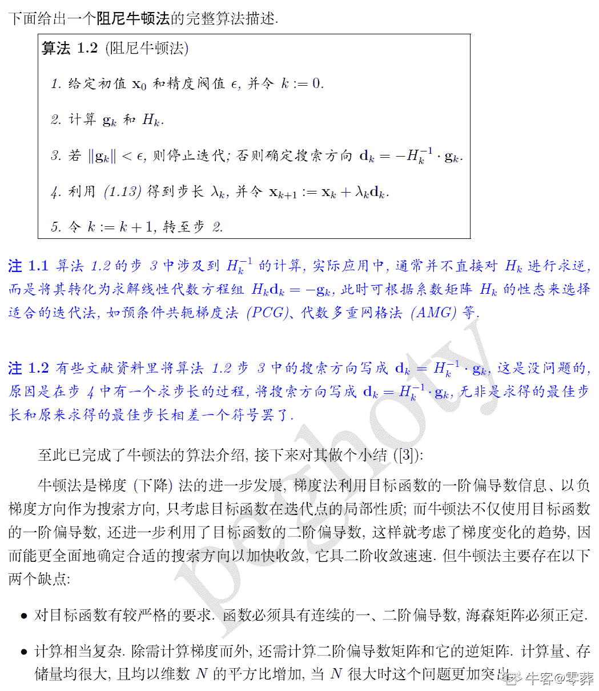

# 唯品会 2019 秋招算法类

## 1

列举至少 2 种排序算法（如快排），写出实现代码。

你的答案

本题知识点

算法工程师 唯品会 2019

讨论

[零葬](https://www.nowcoder.com/profile/75718849)

插入排序：

```cpp
def insert_sort(alist):
    """插入排序"""
    n = len(alist)
    # 从第二个位置，即下标为 1 的元素开始向前插入
    for i in range(1, n):
        # 从第 i 个元素开始向前比较
        for j in range(i, 0, -1):
            if alist[j-1] > alist[j]:
                alist[j-1], alist[j] = alist[j], alist[j-1]
            else:
                break
```

快速排序

```cpp
def quick_sort(alist, first, last):
    """快速排序"""
    if first >= last:     # 递归头
        return

    mid_value = alist[first]
    low = first
    high = last

    while low < high:
        while low < high and alist[high] >= mid_value:
            high -= 1
        alist[low] = alist[high]
        while low < high and alist[low] < mid_value:
            low += 1
        alist[high] = alist[low]
    # 从循环退出时，low == high
    alist[low] = mid_value

    # 递归体
    # 对 low 左边的列表执行快速排序
    quick_sort(alist, first, low-1)
    # 对 low 右边的列表执行快速排序
    quick_sort(alist, low+1, last)
```

归并排序

```cpp
def merge_sort(alist):
    """归并排序"""
    n = len(alist)
    if n <= 1:
        return alist
    mid = n//2
    left_li = merge_sort(alist[:mid])
    right_li = merge_sort(alist[mid:])

    # 将两个有序的子序列合并成一个新的整体
    return merge(left_li, right_li)

def merge(left_li, right_li):
    """归并排序合并过程"""
    left_pointer, right_pointer = 0, 0
    result = []
    while left_pointer < len(left_li) and right_pointer < len(right_li):
        if left_li[left_pointer] <= right_li[right_pointer]:
            result.append(left_li[left_pointer])
            left_pointer += 1
        else:
            result.append(right_li[right_pointer])
            right_pointer += 1
    # 退出循环后，两个列表有一个元素已取完（切片操作允许越界，返回空列表）
    result += left_li[left_pointer:]
    result += right_li[right_pointer:]
    return result
```

堆排序

```cpp
def sift(data, low, high):
    """堆排序调整过程"""
    i = low  # 根节点
    j = 2 * i + 1  # 左子节点
    tmp = data[i]  # 缓存根节点数据
    while j <= high:  # 还未到达最后一个叶子结点
        if j < high and data[j] < data[j + 1]:
            # 如果存在右子节点，且右子节点更大
            j += 1  # 则此时目标转移到右子节点，接下来根节点与右子节点比较
        if data[j] > tmp:
            # 如果大的子节点数据大于根节点数据，则子节点上位
            data[i] = data[j]
            i = j
            j = 2 * i + 1
        else:
            # 否则不做调整
            break
    data[i] = tmp  # 根节点放置应该放置的数据

def heap_sort(data):
    """堆排序"""
    n = len(data)
    # 建堆
    for i in range(n // 2 - 1, -1, -1):  # 注：最后一个有子节点的根节点索引为 n//2-1
        sift(data, i, n - 1)
    # 挨个出数
    for i in range(n - 1, -1, -1):  # 堆的规模不断减小
        data[0], data[i] = data[i], data[0]  # 将堆顶（此时堆中最大的数）的数用堆末的位置存储
        sift(data, 0, i - 1)  # 调整缩小的堆
```

发表于 2020-10-31 10:35:48

* * *

[柯牛呢](https://www.nowcoder.com/profile/300793305)

冒泡排序

```cpp
def Bubbble_sort(inputSet)
if len(inputSet) == 0:
   return []
sortList = inputSet
for i in range(len(sortList) - 1):
     change_flag = False
     for i in range(len(sortList) - 1)；
        if sortList[i] > sortList[i+1]:
           sortList[i], sortList[i+1] = sortList[i+1], sortList[i]
                 change_flag = True
     if not change_flag:
          break
return sortList
```

快速排序

```cpp
def QuickSort(arr,firstIndex,lastIndex):
    if firstIndex<lastIndex:
        divIndex=Partition(arr,firstIndex,lastIndex)

        QuickSort(arr,firstIndex,divIndex)       
        QuickSort(arr,divIndex+1,lastIndex)
    else:
        return

def Partition(arr,firstIndex,lastIndex):
    i=firstIndex-1
    for j in range(firstIndex,lastIndex):
        if arr[j]<=arr[lastIndex]:
            i=i+1
            arr[i],arr[j]=arr[j],arr[i]
    arr[i+1],arr[lastIndex]=arr[lastIndex],arr[i+1]
    return i
```

发表于 2018-12-24 15:46:25

* * *

## 2

对一个二叉树，如何判断二叉树是否平衡、中序遍历、翻转？写出实现代码，并分析时间、空间复杂度。

你的答案

本题知识点

算法工程师 唯品会 2019

讨论

[零葬](https://www.nowcoder.com/profile/75718849)

平衡二叉树直接检查左右子树的高度差是否小于等于 1，这里给出 Java 实现代码

```cpp
class TreeNode {
    TreeNode (int val){
        root.val = val;
        root.left = null;
        root.right = null;
    }
}

public class Solution {
    // 求树的深度
    public int TreeDepth(TreeNode node) {
        if(root == null) return 0;
        // 计算左子树高度
        int left = TreeDepth(node.left);
        // 计算右子树高度
        int right = TreeDepth(node.right);
        // 两个较大的值就是树的深度
        return 1 + (left > right? left : right);
    }

    // 判断平衡二叉树
    public boolean isBalancedTree(TreeNode root) {
        if(root == null) return true;
        if(Math.abs(TreeDepth(root.left) - TreeDepth(root.right)) > 1)
            return false;
        return true;
    }
}
```

中序遍历给出递归版代码，因为是要遍历每一个节点，所以时间复杂度为 O(n)，递归消耗栈空间，空间复杂度也为 O(n)

```cpp
public void inOrder(TreeNode root, ArrayList<Integer> list) {
    if(root == null) return;
    inOrder(root.left, list);
    list.add(root.val);
    inOrder(root.right, list);
}
```

反转二叉树仍然采用递归进行实现，自底向上在每一层交换左右子树

```cpp
public void Mirror(TreeNode node) {
    if(node != null) {
        TreeNode temp = node.left;
        node.left = node.right;
        node.right = temp;
        Mirror(node.left);
        Mirror(node.right);
    }
}
```

发表于 2020-10-31 10:58:29

* * *

## 3

请列举分类模型和回归模型的区别。

你的答案

本题知识点

算法工程师 唯品会 2019

讨论

[零葬](https://www.nowcoder.com/profile/75718849)

分类模型与回归模型的区别主要在于输出变量类型是否连续，预测连续值的为回归问题、预测离散值的为分类问题。举个例子：预测明天的气温是多少度，这是一个回归任务；预测明天的天气是阴、雨还是晴，这就是一个分类任务；

发表于 2020-10-31 11:00:49

* * *

## 4

什么是欠拟合、过拟合？避免过拟合有哪些途径？

你的答案

本题知识点

算法工程师 唯品会 2019

讨论

[零葬](https://www.nowcoder.com/profile/75718849)

欠拟合指的是模型表达能力较弱，即使在训练集上也无法对数据进行精确地拟合和逼近。而过拟合是指模型在训练集上几乎没有任何错误，评估指标上表现很好，但在测试集上的表现较差，即训练出的模型泛化能力差。解决过拟合通常有如下方法：1）增加训练集数据；该方式是从数据入手，将更多的数据参与到模型的训练中，这是最有效的方法，这样可以让模型学习到更多更有效的特征，降低噪声对模型的影响。但是往往直接增加数据比较困难，因此可以通过一定的规则来扩充训练数据。列举两种方式：①如图像分类问题中可以通过对图像的平移，缩放，旋转等方式来扩充；②也可以使用生成式对抗网络类合成大量数据。2）降低模型复杂度；在数据量较少的情况下，模型过于复杂将会导致过拟合，因此可以通过降低模型的复杂度来防止过拟合，这样就可以一定程度上避免模型拟合过多的采样噪声。比如：① 神经网络中减少神经元个数，对神经元进行 dropout 随机失活等；② 决策树中降低树的深度和进行剪枝。3）增加正则化约束项；主要用于线性模型和神经网络模型，将权值的大小加入到损失函数中，避免权值过大带来的过拟合风险。4）通过集成学习的方式训练模型。集成学习是把多个模型集成到一起来作为共同的模型，可以降低单一模型的过拟合风险，如 bagging 的模型融合策略。

发表于 2020-10-31 11:06:38

* * *

## 5

请描述 K-means 的原理，说明选择聚类中心的方法。

你的答案

本题知识点

算法工程师 唯品会 2019

讨论

[零葬](https://www.nowcoder.com/profile/75718849)

KMeans 算法的计算流程伪代码如下：输入：样本集 D={x1, x2, x3,…,xm}，聚类簇数 k 输出：簇划分 C={C1,C2,…,Ck}
从 D 中随机选取 k 个样本作为初始向量；
repeat:
    初始化所有 Ci 为空集；
        对于样本集里每个样本 x:
    计算 x 与 k 个初始向量的距离，选择距离最小的初始向量的簇标记 j 作为 x 的簇标记，将 x 加入 Cj 中；
        对于每个簇：
计算新的均值向量，如果新的均值向量与上一步的不同，则更新；否则保持当前均值向量 不变；
until 当前均值向量均未更新；

发表于 2020-10-31 12:01:08

* * *

[earnestbin](https://www.nowcoder.com/profile/7680222)

K-means 基本原理口述：    K-means 通过迭代，将数据集分成 K 个簇，使得每个簇中的样本点到簇中心的距离平方和最小聚类中心选取方法：    通过 K-means++来选择初始质心

发表于 2019-07-15 16:15:02

* * *

## 6

机器学习中，样本的特征类型有哪些？给定两个特征向量，请列举计算这两个特征向量相似度的方法。

你的答案

本题知识点

算法工程师 唯品会 2019

讨论

[零葬](https://www.nowcoder.com/profile/75718849)

机器学习中特征类型繁多，主要有如下：
计算两个特征向量的相似度主要在于如何定义这两个向量的距离，可以使用余弦相似度、欧氏距离、曼哈顿距离、切比雪夫距离等计算方式。

发表于 2020-10-31 11:12:40

* * *

## 7

请描述至少 3 种熟悉的机器学习算法的原理、过程、求解优化（如: 贝叶斯、决策树、SVM、随机森林、GBDT、LR 等）

你的答案

本题知识点

算法工程师 唯品会 2019

讨论

[零葬](https://www.nowcoder.com/profile/75718849)

逻辑回归：定义 h(x) = 1/(1+e^(-x))为样本 x 属于正样本的概率，则可以定义二元交叉熵损失函数如下：
可以看到，这个函数对 y=0 时，h(x)越大，损失越大，y=1 时，h(x)越大，损失越小，附和我们的期望。对于所有样本，再加上正则化项，就得到如下的损失函数形式：
因为是凸函数，使用梯度下降法即可求解：
SVM：支持向量机是希望学习到一个超平面 w，使得两类数据点到这个分类超平面的距离最大
也就是说，当一个数据点只要离这个超平面足够远，对损失函数就没有贡献了
加上正则化项，则有
进一步，我们可以得到 SVM 铰链损失函数的形式
根据对偶理论，我们可以求解原问题的对偶问题
使用 SMO 算法对其进行优化，类似如下图所示的坐标下降算法
决策树：决策树算法主要是根据某些准则，自顶向下按重要程度选择特征作为树决策节点，从而得到叶子节点的分类结果，伪代码如下：
其中核心就是决策树在生长过程中选择特征的准则，如果使用信息增益，则为 ID3 算法；但由于信息增益会对取值较多的特征有所偏好，所以有了信息增益率这个指标，对这类特征的重要度进行压制，使用信息增益率的算法为 C4.5；使用 gini 系数的为 CART 树，CART 树既可以用于分类，也可以用于回归。

发表于 2020-10-31 12:00:35

* * *

## 8

请描述至少 2 种熟悉的推荐系统中常用的算法原理（如: 协同过滤、矩阵分解、对分网络、LDA 等）

你的答案

本题知识点

算法工程师 唯品会 2019

讨论

[零葬](https://www.nowcoder.com/profile/75718849)

1\. 协同过滤主要有基于用户和基于物品两种方式，都是通过用户的行为数据计算用户与用户之间的相似度，或商品与商品之间的相似度，然后根据物以类聚人以群分的准则，向用户推荐与其相似度较高的用户喜欢而他又未曾购买过的商品（userCF），或者向用户推荐与其喜欢商品相似度较高的商品（itemCF）

协同过滤的核心在于相似度的计算，而计算相似度有很多种方式，如：余弦相似度、Pearson 相关系数、欧氏距离、Jaccard 相似系数等。2. 矩阵分解一般指的是隐语义模型，为的是解决用户行为稀疏的问题（对于稀疏数据，相似度的计算会受到影响），通过矩阵分解的方式得到用户对商品的一些隐含特征，如下图的 f 特征：
我们希望达到这样的成就，使得用户和商品的隐语义矩阵经过乘法能够尽可能地逼近原始的评分矩阵（图中计算仅为示意，数字并不一定正确）

发表于 2020-10-31 12:00:33

* * *

## 9

阐述牛顿法最优化的原理。

你的答案

本题知识点

算法工程师 唯品会 2019

讨论

[零葬](https://www.nowcoder.com/profile/75718849)

牛顿法的思想主要是在现有极小点估计值的附近对目标函数进行二阶泰勒展开，进而找到极小点的下一个估计值。以下内容转自：[`blog.csdn.net/itplus/article/details/21896453`](https://blog.csdn.net/itplus/article/details/21896453)




发表于 2020-10-31 12:00:29

* * *

## 10

请说明分类算法中常用的评估指标（准确率、召回率、ROC、AUC）的定义，及计算方法。

你的答案

本题知识点

算法工程师 唯品会 2019

讨论

[零葬](https://www.nowcoder.com/profile/75718849)

题中的几个评估指标通常用于二分类模型的评估准确率指的是：实际为正预测也为正的样本数/预测为正的样本数召回率指的是：实际为正预测也为正的样本数/实际为正的样本数对于二分类问题而言，存在一个分类阈值 p，当模型输出概率大于 p 的时候，模型判定样本为正，否则判定样本为负。通过改变这个阈值，就能够得到一系列的分类结果，从而计算真正率（判定为正，实际也为正）和假负率（判定为负，实际为正），分别以这两个指标为纵坐标和横坐标，就可以得到 ROC 曲线。
而 AUC 指的是 ROC 曲线下的面积，它表示你的分类模型对正样本输出的概率大于负样本输出概率的概率，它的值越大，你的分类模型越好。

发表于 2020-10-31 12:00:25

* * *

## 11

什么是中文分词？ 列举出几种你所知的分词方法。

你的答案

本题知识点

算法工程师 唯品会 2019

讨论

[零葬](https://www.nowcoder.com/profile/75718849)

由于中文文本不像英文一样有空格分割各个具有明确语义的单词，中文所有的词语都没有分隔符，只有句子和段落之间存在分割。因此，在进行 NLP 任务时，我们需要进行中文分词，以便于获得句子的词语构成，更加精确地描述语义。

主要有三大主流的分词方法：基于词典的方法、基于规则的方法和基于统计的方法。

*   词典或规则：
    基于已有词典 ，根据匹配类型不同而划分，有最大匹配法等。
*   统计：
    1.组成词语的字可能多次同时出现的可能性最大而形成的 N-gram 模型
    2.将词语构成看成是标注问题而出现的隐马尔科夫链、条件随机场等模型。

发表于 2020-10-31 12:06:41

* * *

## 12

现在深度学习在 NLP 领域有哪些应用？ 请具体说明。

你的答案

本题知识点

算法工程师 唯品会 2019

讨论

[甲壳剑齿鸟](https://www.nowcoder.com/profile/448507457)

作者：Tao Lei 链接：[`www.zhihu.com/question/40873677/answer/88748545`](https://www.zhihu.com/question/40873677/answer/88748545) 来源：知乎 著作权归作者所有。商业转载请联系作者获得授权，非商业转载请注明出处。
1.机器翻译（Machine Translation） papers.nips.cc 的页面 2\. 事实问答（Factoid Question Answer） 例如提问“谁是现任美国***” 回答“奥巴马” stanford.edu 的页面 umd.edu 的页面 3. 社区类型问答（Community-based Question Answering） 例如你在知乎上提问，帮你找到一个语义上尽量类似的提问、或者回答 arxiv.org 的页面 [`arxiv.org/pdf/1511.04108v3.pdf`](http://arxiv.org/pdf/1511.04108v3.pdf) 4. 语法解析（Syntactic Parsing） 输入一个句子，分析句子的语法结构 [`www.petrovi.de/data/acl15.pdf`](http://www.petrovi.de/data/acl15.pdf) stanford.edu 的页面 5\. 信息提取、序列标注（Information Extraction / Tagging） 从句子中抽取特殊片段（比如人名），或者标注每个单词类型（例如词性标注） emnlp2014.org 的页面 aclweb.org 的页面 6\. 分类问题：情感分析，文档分类 比如判断淘宝京东商品评论是正面的还是负面的；当前新闻是体育相关还是财经相关等等

发表于 2019-10-15 23:47:25

* * *

## 13

传统图像处理提取的 sift 特征是什么意思？

你的答案

本题知识点

算法工程师 唯品会 2019

讨论

[找个昵称真难](https://www.nowcoder.com/profile/1834675)

sift 指的是 scale invarient feature transform，即尺度不变特征变换。sift 特征是一种对缩放、旋转、光照变化等不敏感的局部图像特征，其提取过程是先生成图像的尺度空间，然后在尺度空间中检测极值点作为关键点，最后利用关键点邻域的梯度信息生成特征描述符。

发表于 2020-09-28 21:06:06

* * *

## 14

说明几种常用的图像分类网络以及他们的区别。

你的答案

本题知识点

算法工程师 唯品会 2019

讨论

[PLCarles87](https://www.nowcoder.com/profile/172785149)

AlexNet:最早提出的 CNN 之一，使用 ReLu 作为激活函数。同时使用数据增强和 p=0.5 的 dropout。ZFNet：提出使用小而多的 filter 代替以往的大 Filter，在覆盖相同大小感受野的同时使用了更少的参数。VGG：提出了 3*3 大小的 Filter 和 2*2 大小的 max-pooling，基于 ZFNet 并有一定的性能提升。GoogleNet：首次提出了 Auxiliary Loss（即辅助损失），每三层间传递 loss 值，有效缓解梯度问题，允许了更深的神经网络结构。ResNet：首次提出 Residual Learning（即残差学习），使用 y = F(x)+x，有效缓解梯度问题，允许了更深的神经网络结构。

发表于 2021-09-14 11:05:40

* * *

## 15

深度学习中的激活函数是什么意思？ 请列举 2 种不同的激活函数。

你的答案

本题知识点

算法工程师 唯品会 2019

讨论

[零葬](https://www.nowcoder.com/profile/75718849)

激活函数用于增加神经网络的非线性表征能力，就像是利用幂级数可以去逼近复杂函数，用三角函数可以去逼近任意周期函数的思想。否则无论网络有多少层都只能等价为一层线性模型，大大削弱了神经网络的模型能力。通常使用的激活函数有：sigmoid，tanh，relu。

发表于 2020-10-31 12:16:45

* * *

## 16

什么是卷积神经网络？请说明卷积的意义。

你的答案

本题知识点

算法工程师 唯品会 2019

讨论

[零葬](https://www.nowcoder.com/profile/75718849)

卷积层的意义主要在于模拟人的局部感知，人的大在脑识别图片的过程中，并不是一下子整张图同时识别，而是对于图片中的每一个特征首先局部感知，然后更高层次对局部进行综合操作，从而得到全局信息。

发表于 2020-10-31 12:18:31

* * *

[earnestbin](https://www.nowcoder.com/profile/7680222)

CNN 是一种具有局部连接、权值共享等特性的深层前馈神经网络。卷积在数学意义上简单来讲就是加权求和，用于提取特征

发表于 2019-08-09 20:23:59

* * *

## 17

深度学习和过往的神经网络训练方法有什么区别？

你的答案

本题知识点

算法工程师 唯品会 2019

讨论

[零葬](https://www.nowcoder.com/profile/75718849)

深度学习的出现主要是为了神经网络能够进行更多层的学习，从广义上说深度学习的网络结构也是传统多层神经网络的一种。传统意义上的多层神经网络是只有输入层、隐藏层、输出层。其中隐藏层的层数根据需要而定，没有明确的理论推导来说明到底多少层合适。
而深度学习中最著名的卷积神经网络 CNN，在原来多层神经网络的基础上，加入了特征学习部分，这部分是模仿人脑对信号处理上的分级的。具体操作就是在原来的全连接的层前面加入了部分连接的卷积层与降维层，而且加入的是一个层级。
输入层 - 卷积层 -降维层 -卷积层 - 降维层 -- .... -- 隐藏层 -输出层
简单来说，原来多层神经网络做的步骤是：特征映射到值。特征是人工挑选。
深度学习做的步骤是 信号->特征->值。 特征是由网络自己选择。

发表于 2020-10-31 12:20:52

* * *

## 18

列举几种深度学习的 loss function，并说明意义。

你的答案

本题知识点

算法工程师 唯品会 2019

## 19

深度学习中如何避免过拟合？

你的答案

本题知识点

算法工程师 唯品会 2019

## 20

CNN 中 fine-tune 的意义是什么？

你的答案

本题知识点

算法工程师 唯品会 2019

讨论

[零葬](https://www.nowcoder.com/profile/75718849)

通常在没有那么多样本，缺乏从零开始使神经网络合理且有用的情况下会使用迁移学习，对已经在其他上游任务中经过大量数据预训训练好的模型上进行 fine-tuning，只训练其中一个或几个层，而把其他层的参数都冻结起来。

发表于 2020-10-31 12:32:54

* * *

## 21

列举网页搜索/商品搜索的评价指标 1-2 个，并详细说明

你的答案

本题知识点

算法工程师 唯品会 2019

## 22

描述所了解的搜索排序算法

你的答案

本题知识点

算法工程师 唯品会 2019

## 23

当一个 QUERY 的分词结果中存在多个词，如何确定各个词的重要性？

你的答案

本题知识点

算法工程师 唯品会 2019

讨论

[零葬](https://www.nowcoder.com/profile/75718849)

加入 attention 机制，对这些词的侧重进行学习。

编辑于 2020-10-31 12:40:43

* * *