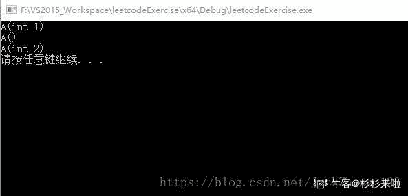

# 唯品会 2019 秋招开发 B 类试卷

## 1

```cpp

```
输入两个字符串 a 和 b，字符串内容为二进制数字，求两个字符串相加的结果，加法计算方法以二进制方式计算，并返回对应的字符串结果。要求程序尽可能的高效。示例如下：

```cpp

/** * @param a = "1101" * @param b = "1100" * @return "11001" */ public String add(String a, String b){
}
```

数据范围： 

本题知识点

唯品会 Java 工程师 C++工程师 模拟 字符串 *数学* *讨论

[nbgao](https://www.nowcoder.com/profile/211289)

```cpp
#include <bits/stdc++.h>
using namespace std;

int main(){
    string a, b, s="";
    cin>>a>>b;
    int m = a.length(), n = b.length();
    int c = 0;
    if(m>n)
        b = string(m-n, '0') + b;
    else
        a = string(n-m, '0') + a;
    for(int i=max(m,n)-1;i>=0;i--){
        c += a[i]-'0' + b[i]-'0';
        s = char((c&1)+'0') + s;
        c >>= 1;
    }
    if(c==1)
        s = '1' + s;
    cout<<s<<endl;
    return 0;
}

```

发表于 2019-07-27 22:38:50

* * *

[谁的电脑](https://www.nowcoder.com/profile/743368)

```cpp
import java.util.*;

public class Main {
    public static void main(String[] args) {
        Scanner scanner = new Scanner(System.in);
        String str1 = scanner.next();
        String str2 = scanner.next();
        System.out.println(Integer.toBinaryString(Integer.valueOf(str1, 2) + Integer.valueOf(str2, 2)));
    }
}
```

发表于 2019-07-03 17:33:57

* * *

[ElonB](https://www.nowcoder.com/profile/623894)

```cpp
""""
进制间转换
↓          2 进制             8 进制             10 进制            16 进制

2 进制          -          bin(int(x, 8))    bin(int(x, 10))    bin(int(x, 16))

8 进制   oct(int(x, 2))           -          oct(int(x, 10))    oct(int(x, 16))

10 进制  int(x, 2)         int(x, 8)                 -          int(x, 16)

16 进制  hex(int(x, 2))    hex(int(x, 8))    hex(int(x, 10))      -
"""

if __name__ == "__main__":
    a = [int(x, 2) for x in input().strip().split()]
    print(str(bin(sum(a)))[2:])

```

发表于 2019-07-12 11:42:08

* * *

## 2

给定一个 n x n 矩阵，其中每行和每列元素均按升序排序，找到矩阵中第 k 小的元素。
请注意，它是排序后的第 k 小元素，而不是第 k 个元素。

示例:

matrix = [
   [ 1,  5,  9],
   [10, 11, 13],
   [12, 13, 15]
],
k = 8,

返回 13。
说明: 
你可以假设 k 的值永远是有效的, 1 ≤ k ≤ n2 。

本题知识点

唯品会 Java 工程师 C++工程师 数组 排序 *查找* **讨论

[keashem](https://www.nowcoder.com/profile/597698287)

如果笔试过程中碰到这个题，又没有数据量和时间限制，肯定怎么方便怎么来，直接 sort 输出 3 分钟结束战斗；但是刷题时碰到这种特殊的状况的数据，可以往深了想一想，练一练自己的代码能力；下面我提供两个都 AC 了的方法供大家参考

```cpp
import java.util.ArrayList;
import java.util.Arrays;
import java.util.List;
import java.util.Scanner;
public class Main{
    public static void main(String[] args) {
        Scanner sc = new Scanner(System.in);
        int k = sc.nextInt(),n = sc.nextInt();
        int data[][] = new int[n][n];
        for (int i = 0; i < n; i++) {
            for (int j = 0; j < n; j++) {
                data[i][j] = sc.nextInt();
            }
        }
        System.out.println(findKthNum(data, k));
        //System.out.println(findKthNum1(data, k));
    }
    //方法 1，二分套二分，时间复杂度 O(n*logn*logn)
    public static int findKthNum(int[][] matrix, int k) {
        int row = matrix.length;
        int col = matrix[0].length;
        int low = matrix[0][0];
        int high = matrix[row - 1][col - 1];
        int mid = 0;
        int count = 0;
        while (low <= high) {
            count = 0;
            mid = low + ((high - low) >> 1);
            for (int[] item : matrix) {
                count += binarySearchCount(item, mid);
            }
            if (count < k) {
                low = mid + 1;
            } else {
                high = mid - 1;
            }
        }
        //返回的 low 表示满足 count >= k 的最小的数，这个数就是要找的第 k 个数
        return low;
    }

    public static int binarySearchCount(int[] data, int k) {
        int begin = 0, end = data.length - 1;
        int mid = 0;
        while (begin <= end) {
            mid = begin + ((end - begin) >> 1);
            if (data[mid] <= k) { //这里要加上等于 k 的
                begin = mid + 1;
            } else {
                end = mid - 1;
            }
        }
        //全大于、全小于 k 都是 begin，正好对应上了
        //这里返回的 begin 表示<=k 的数的个数
        return begin;
    }

    //方法 2，快排思想，把二维压成 1 维，用 partion 来找第 k 大的数，复杂度 O(n²)，对比还是第一种方法复杂度低一些
    //但是如果用排序了，对 n² 的数据排序复杂度最小为 O(n²*log(n²))
    public static int findKthNum1(int[][] matrix, int k) {
        int row = matrix.length;
        int col = matrix[0].length;
        int[] arr = new int[row * col];
        for (int i = 0; i < row; i++) {
            for (int j = 0; j < col; j++) {
                arr[i * col + j] = matrix[i][j];
            }
        }
        int begin = 0, end = arr.length - 1;
        int pos;
        while (begin <= end) {
            pos = partition(arr, begin, end);
            if (pos == k - 1) {
                return arr[pos];
            } else if (pos > k - 1) {
                end = pos - 1;
            } else {
                begin = pos + 1;
            }
        }
        return 0;
    }

    public static int partition(int[] arr, int begin, int end) {
        int temp = arr[begin];
        while (begin < end) {
            while (begin < end && arr[end] >= temp) {
                end--;
            }
            swap(arr,begin,end);
            while (begin < end && arr[begin] < temp) {
                begin++;
            }
            swap(arr,begin,end);
        }
        return begin;
    }
    public static void swap(int[]arr,int i,int j){
        if (arr == null || i >= arr.length || j >= arr.length || i < 0 || j < 0) {
            return;
        }
        int temp = arr[i];
        arr[i] = arr[j];
        arr[j] = temp;
    }
}
```

编辑于 2019-08-06 13:06:47

* * *

[广州市民林先生](https://www.nowcoder.com/profile/241061362)

```cpp
#include <iostream>
#include <vector>
#include <algorithm>
using namespace std;

int main(){
    int k, n;
    int val;
    cin >> k >> n;

    vector<int> vec;
    for(int i = 0; i < n; ++i){
        for(int j = 0; j < n; ++j){
            cin >> val;
            vec.push_back(val);
        }
    }
    sort(vec.begin(),vec.end());
    cout << vec[k - 1] << endl;
    return 0;
}
```

发表于 2020-07-14 21:43:20

* * *

[嵌入式渣渣](https://www.nowcoder.com/profile/719477486)

对于这道题最简单的方式就是转为一维数组然后用快排函数，但是这样就失去了输入矩阵的意义，我觉的题目的意思就是给你个二维矩阵，利用“每行和每列元素均按升序排序”的性质输出答案。由题意知，因为每行均有升序排列，不确定性的是不同行不同列的大小，那么搜索的时候可按列搜索，搜索方式如下：利用 num[i]记录第 i 行目前搜索到的数字下标，初始都为 0，即第一列，每次搜索每一行第 num[i]个数字中最小的数字，并排除，即 num[i]++，那么第 k 次搜索结果即为要找的值。第 1 次搜索结果：**1** 5 910 11 1312 13 15 第 2 次搜索结果 1 **5** 910 11 1312 13 15...第 6 次搜索结果 1 5 910 11 13**12** 13 15...第 8 次搜索结果 1 5 910 11 1312 **13** 15 代码如下：#include<stdio.h>
#include<stdlib.h>

int main()
{
int k, n;
int **matrix;

scanf("%d%d", &k, &n);
matrix = (int **)malloc(n * sizeof(int *));
for (int i = 0; i < n; i++)
matrix[i] = (int *)malloc(n * sizeof(int));
for (int i = 0; i < n; i++)
for (int j = 0; j < n; j++)
scanf("%d", &matrix[i][j]);

int *num;
num = (int *)calloc(n, sizeof(int));

while (k > 1) {
int ret = n-1;
for (int i = 0; i < n; i++)
if (num[i]<n&&matrix[ret][num[ret]] > matrix[i][num[i]])
ret = i;
num[ret]++;
k--;
}

int ret = matrix[n-1][num[n-1]];
for (int i = 1; i < n; i++)
if (num[i]<n && ret > matrix[i][num[i]])
ret = matrix[i][num[i]];
printf("%d", ret);

return 0;
}

编辑于 2020-07-02 08:32:41

* * *

## 3

引入多道程序的目的在于

正确答案: A   你的答案: 空 (错误)

```cpp
充分利用 CPU，减少 CPU 等待时间
```

```cpp
提高实时响应速度
```

```cpp
有利于代码共享，减少主、辅存信息交换量
```

```cpp
充分利用存储器
```

本题知识点

Java 工程师 C++工程师 唯品会

讨论

[_random](https://www.nowcoder.com/profile/5246141)

多道程序设计技术是在计算机内存中同时存放几道相互独立的程序，使它们在管理程序控制下，相互穿插运行，两个或两个以上程序在计算机系统中同处于开始到结束之间的状态, 这些程序共享计算机系统资源。与之相对应的是单道程序，即在计算机内存中只允许一个的程序运行。即：提高 CPU 的利用率。在多道程序环境下，多个程序共享计算机资源当某个程序等待 I/O 操作时，CPU 可以执行其他程序，大大提高 CPU 的利用率。

发表于 2018-12-12 15:34:17

* * *

[牛客 398249555 号](https://www.nowcoder.com/profile/398249555)

多道程序设计技术是在计算机内存中同时存放几道相互独立的程序，使它们在管理程序控制下，相互穿插运行，两个或两个以上程序在计算机系统中同处于开始到结束之间的状态, 这些程序共享计算机系统资源。与之相对应的是单道程序，即在计算机内存中只允许一个的程序运行。 即：提高 CPU 的利用率。在多道程序环境下，多个程序共享计算机资源当某个程序等待 I/O 操作时，CPU 可以执行其他程序，大大提高 CPU 的利用率。

发表于 2019-12-30 12:44:52

* * *

## 4

系统出现死锁的原因是

正确答案: C   你的答案: 空 (错误)

```cpp
计算机系统发生了重大故障
```

```cpp
有多个封锁的进程同时存在
```

```cpp
若干进程因竞争资源而无休止的等待着，它方释放已占有的资源
```

```cpp
资源数大大少于进程数，或进程同时申请的资源数大大超过资源总数
```

本题知识点

Java 工程师 C++工程师 唯品会 Java 工程师 C++工程师 唯品会 Java 工程师 C++工程师 唯品会

## 5

所谓 LRU 页面置换算法，是指

正确答案: C   你的答案: 空 (错误)

```cpp
将驻留在主存中的页面随便挑选一页淘汰
```

```cpp
将驻留在主存中的时间最长的一页淘汰
```

```cpp
将驻留在主存中近期最少使用的页面淘汰
```

```cpp
将驻留在主存中的最不常用的页淘汰 
```

本题知识点

Java 工程师 C++工程师 唯品会 Java 工程师 C++工程师 唯品会 Java 工程师 C++工程师 唯品会

讨论

[Budlet 蕤芽](https://www.nowcoder.com/profile/9769122)

C 最近最少使用页面置换

发表于 2018-12-17 18:17:44

* * *

[botaozhang](https://www.nowcoder.com/profile/889525076)

```cpp
LRU 是 Least Recently Used 的缩写；
```

发表于 2018-12-17 17:12:13

* * *

## 6

与 10.110.12.29 mask 255.255.255.224 属于同一网段的主机 IP 地址是 

正确答案: B   你的答案: 空 (错误)

```cpp
10.110.12.0
```

```cpp
10.110.12.30
```

```cpp
10.110.12.31
```

```cpp
10.110.12.32
```

本题知识点

Java 工程师 C++工程师 唯品会 Java 工程师 C++工程师 唯品会 Java 工程师 C++工程师 唯品会

讨论

[绅蓝](https://www.nowcoder.com/profile/1596072)

ip 与掩码相与得网络号，相等即在同一网段，31 是保留的广播地址

发表于 2018-12-24 16:41:14

* * *

[Packie](https://www.nowcoder.com/profile/5128962)

0 是网关

31 是广播地址，子网掩码取反和 ip 进行或操作

32 是不同网段

发表于 2019-04-10 18:54:46

* * *

## 7

在 C++语言中，对函数参数默认值描述正确的是

正确答案: D   你的答案: 空 (错误)

```cpp
函数参数的默认值只能设定一个
```

```cpp
一个函数的参数若有多个，则参数默认值的设定可以不连续
```

```cpp
函数参数必须设定默认值
```

```cpp
在设定了参数的默认值后，该参数后面定义的所有参数都必须设定默认值
```

本题知识点

Java 工程师 C++工程师 唯品会 Java 工程师 C++工程师 唯品会 Java 工程师 C++工程师 唯品会

## 8

下列关于构造函数的描述中，错误的是

正确答案: C   你的答案: 空 (错误)

```cpp
构造函数可以设置默认参数
```

```cpp
构造函数在声明对象时自动执行
```

```cpp
构造函数可以对静态数据成员进行初始化
```

```cpp
构造函数可以重载
```

本题知识点

Java 工程师 C++工程师 唯品会 C++

讨论

[我是管小亮](https://www.nowcoder.com/profile/396369905)

静态成员不属于某个对象，而是属于类本身。可以在构造函数中使用或者修改静态成员的值，但不能初始化它。

发表于 2020-08-18 23:06:00

* * *

[Sol☀️](https://www.nowcoder.com/profile/32891436)

类内中的静态成员变量在类中声明，类外初始化。

发表于 2020-08-09 01:10:40

* * *

[刘先森 202007272300471](https://www.nowcoder.com/profile/446265491)

构造函数不是应该在创建对象，也就是实例化对象的时候才执行么，如果只是声明一个变量，应该不算是实例化吧，毕竟都没有给这个对象分配内存。或者说这个题的意思是，在创建对象时调用构造函数。

发表于 2020-09-17 23:07:58

* * *

## 9

循环语句 whlie(int i=0 )i--;的循环次数是（）

正确答案: A   你的答案: 空 (错误)

```cpp
0
```

```cpp
1
```

```cpp
5
```

```cpp
无限次
```

本题知识点

C++工程师 唯品会 C++ C 语言

讨论

[牛客 657879351 号](https://www.nowcoder.com/profile/657879351)

int i=0，所以 while 的运行条件是 0，0 是 false，所以不运行。

发表于 2020-12-23 14:55:05

* * *

[HouJian](https://www.nowcoder.com/profile/5255423)

whlie 这个单词是什么意思😂

发表于 2020-09-30 09:42:58

* * *

[هاوتشوان](https://www.nowcoder.com/profile/699059703)

int i=0，为 false 所以不运行。

发表于 2021-03-20 19:38:17

* * *

## 10

下列关于链接描述，错误的是

正确答案: B   你的答案: 空 (错误)

```cpp
硬链接就是让链接文件的 i 节点号指向被链接文件的 i 节点
```

```cpp
硬链接和符号连接都是产生一个新的 i 节点
```

```cpp
链接分为硬链接和符号链接
```

```cpp
硬连接不能链接目录文件
```

本题知识点

Java 工程师 C++工程师 唯品会 Java 工程师 C++工程师 唯品会 Java 工程师 C++工程师 唯品会

讨论

[三六九思](https://www.nowcoder.com/profile/982316541)

推荐阮一峰大佬的这篇博客，易懂：[`www.ruanyifeng.com/blog/2011/12/inode.html`](http://www.ruanyifeng.com/blog/2011/12/inode.html)

编辑于 2019-08-11 21:12:42

* * *

## 11

以下代码共调用多少次拷贝构造函数：
Widget f(Widget u)
{  
   Widget v(u);
   Widget w=v;
   return w;
}
main(){
    Widget x;
    Widget y=f(f(x));
}

正确答案: C   你的答案: 空 (错误)

```cpp
3
```

```cpp
5
```

```cpp
7
```

```cpp
9
```

本题知识点

Java 工程师 C++工程师 唯品会 Java 工程师 C++工程师 唯品会 Java 工程师 C++工程师 唯品会

讨论

[gdut17](https://www.nowcoder.com/profile/279358190)

Widget f(Widget u)//1 次
{  
   Widget v(u);//1 次
   Widget w=v;//1 次
   return w;
}//一共 3 次
main(){
    Widget x;
    Widget y=f(f(x));//嵌套，3*2=6 次，y=，1 次，一共 7 次
}

发表于 2020-07-27 21:52:27

* * *

[愿与君执手](https://www.nowcoder.com/profile/1448891)

emmm，我觉得是九次

发表于 2019-02-18 21:35:55

* * *

## 12

下面 C 程序的输出结果是（）

```cpp
int i = 0, a = 1, b = 2, c = 3;
i = ++a || ++b || ++c;
printf("%d %d %d %d", i, a, b, c);
```

正确答案: A   你的答案: 空 (错误)

```cpp
1 2 2 3
```

```cpp
1 2 3 4
```

```cpp
3 2 3 4
```

```cpp
3 3 3 4
```

本题知识点

C++工程师 唯品会 C 语言

讨论

[绅蓝](https://www.nowcoder.com/profile/1596072)

++a 为真，后面的语句直接屏蔽不执行

发表于 2018-12-24 17:00:37

* * *

[牛客 435932440 号](https://www.nowcoder.com/profile/435932440)

||运算同样存在短路

发表于 2020-11-18 17:44:50

* * *

[Blue.2.0](https://www.nowcoder.com/profile/769962858)

短路原则，逻辑或运算时，只要有一方成立，后面的就不会执行。 ++a || ++b，因为非零即为真。所以++a 为真，则后面的++a 之后的代码不会执行。

发表于 2022-03-03 00:31:48

* * *

## 13

下列关键码序列哪些是一个堆

正确答案: A D   你的答案: 空 (错误)

```cpp
90  31  53 23 16  48
```

```cpp
90  48  31  53  16  23
```

```cpp
16  53  23  90  31  48
```

```cpp
16  31  23  90  53  48
```

本题知识点

Java 工程师 C++工程师 唯品会

讨论

[胜利的法则已经确定了](https://www.nowcoder.com/profile/2984726)

A 是大顶堆，每个节点都比其孩子大 D 是小顶堆，每个节点都比其孩子小

发表于 2019-01-03 22:02:02

* * *

## 14

有如下类的定义：
class Constants
{  
public: static double GetPI(void){return 3.14159;}
};  
Constants constants;
下列各组语句中，能输出 3.14159 的是：

正确答案: B C   你的答案: 空 (错误)

```cpp
cout&lt;&lt;constants-&gt;GetPI();
```

```cpp
cout&lt;&lt;constants.GetPI();
```

```cpp
cout&lt;&lt;Constants::GetPI();
```

```cpp
cout&lt;&lt;Constants.GetPI();
```

本题知识点

Java 工程师 C++工程师 唯品会 C++

讨论

[牛客 258279167 号](https://www.nowcoder.com/profile/258279167)

访问对象的成员函数的方法（.）、访问指向类的指针的成员函数的方法（->）、直接访问类的成员函数的方法(::)

发表于 2020-10-10 20:32:13

* * *

[奋斗小强吧](https://www.nowcoder.com/profile/324744938)

个人理解：这套题的意思应该是关于静态成员函数调用方式，可以通过类名直接调用，也可以通过对象进行调用吧

发表于 2020-08-31 15:40:21

* * *

[HouJian](https://www.nowcoder.com/profile/5255423)

总结：1.静态成员函数的地址可用普通函数指针储存，而普通成员函数地址需要用类成员函数指针来储存。
2.静态成员函数不可以调用类的非静态成员。因为静态成员函数不含 this 指针。3.静态成员函数不可以同时声明为 virtual、const、volatile 函数。4.静态成员是可以独立访问的，也就是说，无须创建任何对象实例就可以访问（类名：：函数）。
来源：[`blog.csdn.net/fanyunda1988/article/details/51419445`](https://blog.csdn.net/fanyunda1988/article/details/51419445?utm_medium=distribute.wap_relevant.none-task-blog-BlogCommendFromMachineLearnPai2-2.wap_blog_relevant_no_pic&depth_1-utm_source=distribute.wap_relevant.none-task-blog-BlogCommendFromMachineLearnPai2-2.wap_blog_relevant_no_pic)

发表于 2020-09-21 19:26:59

* * *

## 15

下列对函数 double add(int a , int b)进行重载，正确的是

正确答案: A B C   你的答案: 空 (错误)

```cpp
int add(int a ,int b ,int c)
```

```cpp
int add(double a , double b)
```

```cpp
double add(double a , double b)
```

```cpp
int add(int a , int b)
```

本题知识点

Java 工程师 C++工程师 唯品会 C++

讨论

[乳糖不耐猫](https://www.nowcoder.com/profile/737913338)

重载：函数名相同参数必须不同（个数或类型或顺序）返回值类型可以相同也可以不同

发表于 2020-09-17 16:17:41

* * *

[故事与你👼](https://www.nowcoder.com/profile/699020466)

重载难道不是，

1.  .参数个数不同
2.  参数的类型不同
3.  参数的顺序不同

返回值类型不同不是重载吧 发表于 2020-02-26 16:43:38

* * *

[soohoo](https://www.nowcoder.com/profile/123184)

返回值类型不影响重载，换句话，返回值类型改变，其他不变，不是重载

发表于 2020-10-21 11:46:46

* * *

## 16

对拷贝构造函数的描述正确的是

正确答案: D   你的答案: 空 (错误)

```cpp
该函数名同类名，也是一种构造函数，该函数返回自身引用
```

```cpp
该函数只有一个参数，必须是对某个对象的引用
```

```cpp
每个类都必须有一个拷贝初始化构造函数，如果类中没有说明拷贝构造函数，则编译器系统会自动生成一个缺省拷贝构造函数，作为该类的保护成员
```

```cpp
拷贝初始化构造函数的作用是将一个已知对象的数据成员值拷贝给正在创建的另一个同类的对象
```

本题知识点

C++工程师 唯品会 C++

讨论

[民兵王二蛋](https://www.nowcoder.com/profile/657637614)

C++缺省构造函数都是公有

发表于 2020-08-06 23:50:54

* * *

[ht30 一定要进国企](https://www.nowcoder.com/profile/1253765)

正确答案：D。拷贝函数和构造函数没有返回值，A 错；拷贝构造函数的参数可以使一个或多个，但左起第一个必须是自身类型的引用对象，B 错；
若类定义中没有声明拷贝构造函数，则编译器会自动生成一个缺省的拷贝构造函数，但是不会是该类的保护成员，C 错。

发表于 2019-02-24 12:21:27

* * *

## 17

test.c 文件中包括如下语句：

```cpp
#define INT_PTR int*
typedef int* int_ptr;
INT_PTR a, b;
int_ptr c, d;
```

文件中定义的四个变量中，是指针类型的变量为（）

正确答案: A C D   你的答案: 空 (错误)

```cpp
a
```

```cpp
b
```

```cpp
c
```

```cpp
d
```

本题知识点

C++工程师 唯品会 C 语言

讨论

[AAS48](https://www.nowcoder.com/profile/552678974)

这题易错。 注意宏定义是直接替换 ，int* a,b; b 就是整形。如果要声明两个都是指针则是 int *a,*b;第二个的类型是 int*，而第一个只有 a 是 int*

发表于 2021-12-05 15:03:43

* * *

[heilunya](https://www.nowcoder.com/profile/842904176)

最后两个语句还原回来就是  int* a,b; int* c; int* d;   因为#define 是宏定义，仅仅是直接替换。而 typedef 是把该类型定义一个别名。故此次 b 只是 int 类型。而 a，c，d 才是指针类型。

发表于 2020-04-02 22:41:24

* * *

[看到我请叫我去学英语](https://www.nowcoder.com/profile/285139031)

宏替换仅仅是在编译器阶段产生作用，可以认为就是无脑替换它即可，typedef 就是把类型定义了一个别名

发表于 2019-05-24 19:01:34

* * *

## 18

以下关于传输层协议 UDP 的叙述中正确的

正确答案: A C   你的答案: 空 (错误)

```cpp
比较合适传输小的数据文件
```

```cpp
提供了高的可靠性
```

```cpp
提供了高的传输效率
```

```cpp
使用窗口机制来实现流量控制
```

本题知识点

Java 工程师 C++工程师 唯品会

## 19

以下有关 Http 协议的描述中，正确的有

正确答案: A B C   你的答案: 空 (错误)

```cpp
post 请求一般用于修改服务器上的资源，对发送的消息数据量没有限制，通过表单方式提交
```

```cpp
可以通过 206 返回码实现断点续传
```

```cpp
HTTP1.1 实现了持久连接和管线化操作以及主动通知功能，相比 http1.0 有大福性能提升
```

```cpp
HTTP 返回码 302 表示永久重定向，需要重新 URI
```

本题知识点

Java 工程师 C++工程师 唯品会

讨论

[gdut17](https://www.nowcoder.com/profile/279358190)

301 永久重定向 302 临时重定向

发表于 2020-07-27 21:24:16

* * *

## 20

声明语句为 int a[3][4]; 下列表达式中与数组元素 a[2][1]等价的是

正确答案: A D   你的答案: 空 (错误)

```cpp
*(a[2]+1)
```

```cpp
*(a[1]+2)
```

```cpp
a[9]
```

```cpp
*(*(a+2)+1)
```

本题知识点

Java 工程师 C++工程师 唯品会 C++ C 语言

讨论

[haogeop](https://www.nowcoder.com/profile/340697497)

为啥 c 不对

发表于 2020-12-30 19:42:04

* * *

[君莫笑 swl](https://www.nowcoder.com/profile/606076466)

```cpp
#include <stdio.h>
int main(){
    char a[3][4] = {{'0','1','2','3'},{'4','5','6','7'},{'8','9','a','b'}};
    printf("&(a[2][1]) = %p\n",&(a[2][1]));
    for(int i=0; i<=9; i++){
        printf("    a[%d]   = %p\n",i,a[i]);
    }
    printf("a[2][1] = %c\n",a[2][1]);
    for(int j=0; j<=9; j++){
        printf(" *a[%d]  = %c\n",j,*a[j]);
    }
    return 0;
}
```

**结果：**
&(a[2][1]) = 0x7ffd45f3dad5
a[0] = 0x7ffd45f3dacc
a[1] = 0x7ffd45f3dad0
a[2] = 0x7ffd45f3dad4
a[3] = 0x7ffd45f3dad8
a[4] = 0x7ffd45f3dadc
a[5] = 0x7ffd45f3dae0
a[6] = 0x7ffd45f3dae4
a[7] = 0x7ffd45f3dae8
a[8] = 0x7ffd45f3daec
a[9] = 0x7ffd45f3daf0
a[2][1] = 9
*a[0] = 0
*a[1] = 4
*a[2] = 8
*a[3] =
*a[4] = ;
*a[5] = �
*a[6] = �
*a[7] = �
*a[8] = �
*a[9] =

发表于 2021-10-28 10:37:56

* * *

[牛客 828618966 号](https://www.nowcoder.com/profile/828618966)

C 是 a[2][1]的地址，不是值，改成*a[9]即为正确

发表于 2021-10-04 19:40:18

* * *

## 21

查看下面两段代码（1）

```cpp
class classA
{
    ...
};
class classB
{
public:
    classB(classA a)
    {
        mA = a;
    }
private:
    classA mA;
};
```

（2）

```cpp
class classA
{
    ...
};
class classB
{
public:
    classB(classA a): mA(a) {}
private:
    classA mA;
};
```

正确答案: A C   你的答案: 空 (错误)

```cpp
两种调用方法会输出相同的结果
```

```cpp
通常情况下（1）的效率更高
```

```cpp
通常情况下（2）的效率更高
```

```cpp
两种调用方法会输出不同的结果
```

本题知识点

Java 工程师 C++工程师 唯品会 C++

讨论

[杉杉来啦](https://www.nowcoder.com/profile/243827773)

为什么用成员初始化列表会快一些
首先把数据成员按类型分类
1。内置数据类型，复合类型（指针，引用）
2。用户定义类型（类类型）

分情况说明：
对于类型 1，在成员初始化列表和构造函数体内进行，在性能和结果上都是一样的
对于类型 2，结果上相同，但是性能上存在很大的差别

因为类类型的数据成员对象在进入函数体是已经构造完成，也就是说在成员初始化列表处进行构造对象的工作，这是调用一个构造函数，在进入函数体之后，进行的是 对已经构造好的类对象的赋值，又调用个拷贝赋值操作符才能完成（如果并未提供，则使用编译器提供的默认按成员赋值行为）

简单的来说：
对于用户定义类型：
1）如果使用类初始化列表，直接调用对应的构造函数即完成初始化
2）如果在构造函数中初始化，那么首先调用默认的构造函数，然后调用指定的构造函数

所以对于用户定义类型，使用列表初始化可以减少一次默认构造函数调用过程

测试代码如下：

```cpp
#include <iostream>
using namespace std;
class A
{
public:
    A()
    {
        cout << "A()" << endl;
    }
    A(int a)
    {
        value = a;
        cout << "A(int "<<value<<")" << endl;
    }

    A(const A& a)
    {
        value = a.value;
        cout << "A(const A& a):  "<<value << endl;
    }
    int value;
};

class B
{
public:
    B() : a(1)
    {
        b = A(2);
    }
    A a;
    A b;
};
int main()
{
    B b;
    system("pause");
}
```

运行结果如下图：


发表于 2020-08-09 20:27:10

* * *

[cloudKing](https://www.nowcoder.com/profile/588719556)

应该选 acC++ Primer 中在讲构造函数初始化列表的时候有这么一段话：
无论是在构造函数初始化列表中初始化成员，还是在构造函数体中对它们赋值，最终结果是相同的。不同之处在于，使用构造函数初始化列表的版本初始化数据成员，没有定义初始化列表的构造函数版本在构造函数体中对数据成员赋值。

发表于 2020-10-05 17:32:20

* * *

[我像只沉睡的猫](https://www.nowcoder.com/profile/854235060)

这题目，如果 A 中有指针成员，那么初始化列表会调用拷贝构造，赋值函数会调用赋值函数，你 A 中什么重载没重载都不说明，我怎么给你选答案

发表于 2022-01-20 14:30:39

* * *

## 22

下列有关 Nginx 配置文件 nginx.conf 的叙述正确的是

正确答案: A D   你的答案: 空 (错误)

```cpp
nginx 进程数设置为 CPU 总核心数最佳
```

```cpp
虚拟主机配置多个域名时，各域名间应用逗号隔开
```

```cpp
sendfile on;表示为开启高效文件传输模式，对于执行下载操作等相关应用时，应设置为 on
```

```cpp
设置工作模式与连接数上限时，应考虑单个进程最大连接数(最大连接数=连接数*进程数）
```

本题知识点

Java 工程师 C++工程师 唯品会

讨论

[gdut17](https://www.nowcoder.com/profile/279358190)

域名可以有多个，用空格隔开 
sendfile on; 开启高效文件传输模式，sendfile 指令指定 nginx 是否调用 sendfile 函数来输出文件，对于普通应用设为 on，如果用来进行下载等应用磁盘 IO 重负载应用，可设置为 off，以平衡磁盘与网络 I/O 处理速度，降低系统的负载。注意：如果图片显示不正常把这个改成 off。
————————————————
版权声明：本文为 CSDN 博主「爱橙子的 OK 绷」的原创文章，遵循 CC 4.0 BY-SA 版权协议，转载请附上原文出处链接及本声明。
原文链接：[`blog.csdn.net/will130/article/details/50096593`](https://blog.csdn.net/will130/article/details/50096593)

发表于 2020-07-27 21:26:18

* * ****