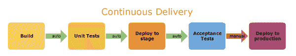
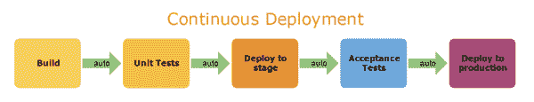

# 点我达 2019 届校招测试开发笔试

## 1

**以下哪些是****H****TTP****协议中****的****请求方式****（）**

正确答案: A B C D   你的答案: 空 (错误)

```cpp
GET
```

```cpp
POST
```

```cpp
HEAD
```

```cpp
OPTIONS
```

本题知识点

测试工程师 点我达 测试开发工程师 2019

讨论

[开心呀](https://www.nowcoder.com/profile/3426614)

http 的请求方法可以分成以下几种： GET： 请求指定的页面信息，并返回实体主体 （在检索数据（包括调用函数）时使用。 确保成功检索的状态代码为 200 ） POST： 请求服务器接受所指定的文档作为对所标识的 URI 的新的从属实体 （在创建实体或调用操作时使用） PATCH： 实体中包含一个表，表中说明与该 URI 所表示的原内容的区别 （在更新实体或执行 upsert 操作时使用） DELETE： 请求服务器删除指定的页面 （在删除实体或实体的各个属性时使用） PUT： 从客户端向服务器传送的数据取代指定的文档的内容 （在某些情况下用于更新实体的各个属性；更新大多数实体则不建议使用） 以下方法不常用，仅供了解： OPTIONS： 允许客户端查看服务器的性能。 TRACE： 请求服务器在响应中的实体主体部分返回所得到的内容。 HEAD： 只请求页面的首部 MOVE： 请求服务器将指定的页面移至另一个网络地址。 COPY： 请求服务器将指定的页面拷贝至另一个网络地址。 LINK： 请求服务器建立链接关系。 UNLINK： 断开链接关系。 WRAPPED： 允许客户端发送经过封装的请求。 Extension-mothed：在不改动协议的前提下，可增加另外的方法。

发表于 2019-08-26 19:11:52

* * *

[Mr 灬权丶先森](https://www.nowcoder.com/profile/421902822)

正确答案：ABCD 解释：1、http1.1 协议包括了 8 中请求方式：GET、POST、PUT、DELETE、HEAD、OPTIONS、TRACE、CONNECT

发表于 2018-12-07 15:07:33

* * *

## 2

**以下****H****TTP****协议状态****描述，哪些是正确（）**

正确答案: A C D   你的答案: 空 (错误)

```cpp
200------请求成功
```

```cpp
500------客户端请求的语法错误，服务器无法理解
```

```cpp
临时移动。与 301 类似。但资源只是临时被移动。客户端应继续使用原有 URI
```

```cpp
充当网关或代理的服务器，从远端服务器接收到了一个无效的请求
```

本题知识点

测试工程师 点我达 测试开发工程师 2019

讨论

[李木子 22](https://www.nowcoder.com/profile/1518455)

200------请求成功
500------服务器错误
临时移动。与 301 类似。但资源只是临时被移动。客户端应继续使用原有 URI
充当网关或***的服务器，从远端服务器接收到了一个无效的请求
301，本网页被永久性转移到另一个 URL。

发表于 2018-12-13 21:04:51

* * *

## 3

**MYSQL****存储引擎有（）**

正确答案: A B   你的答案: 空 (错误)

```cpp
InnoDB
```

```cpp
MyISAM
```

```cpp
OLAP
```

```cpp
OLTP
```

本题知识点

测试工程师 点我达 测试开发工程师 2019

讨论

[牛客 587631461 号](https://www.nowcoder.com/profile/587631461)

| MEMORY |
| MRG_MYISAM |
| CSV |
| FEDERATED |
| PERFORMANCE_SCHEMA |
| MyISAM |
| InnoDB |
| BLACKHOLE |
| ARCHIVE |

发表于 2020-08-28 17:16:30

* * *

## 4

**数据库事务****的四种特性，不包括（）**

正确答案: A C D   你的答案: 空 (错误)

```cpp
原子性
```

```cpp
事务性
```

```cpp
一致性
```

```cpp
隔离性
```

本题知识点

测试工程师 点我达 测试开发工程师 2019

讨论

[花开不败 lyt](https://www.nowcoder.com/profile/923988793)

题目有误，数据库事务的四种特性包括原子性、 一致性 、隔离性 、持久性。不包括事务性

发表于 2019-02-17 10:25:43

* * *

[🐮呐呐呐呐呐](https://www.nowcoder.com/profile/8240878)

acid

发表于 2019-01-30 15:23:41

* * *

[李木子 22](https://www.nowcoder.com/profile/1518455)

原子性、一致性、分离性、持久性

发表于 2018-12-13 21:13:34

* * *

## 5

**下列对于线性链表的描述中正确的是（）**

正确答案: A   你的答案: 空 (错误)

```cpp
存储空间不一定是连续,且各元素的存储顺序是任意的
```

```cpp
存储空间不一定是连续,且前件元素一定存储在后件元素的前面
```

```cpp
存储空间必须连续,且前件元素一定存储在后件元素的前面
```

```cpp
存储空间必须连续,且各元素的存储顺序是任意的
```

本题知识点

测试工程师 点我达 测试开发工程师 2019

## 6

**以下哪些是白盒用例设计方法（）**

正确答案: A C D   你的答案: 空 (错误)

```cpp
判定条件覆盖
```

```cpp
等价类划分
```

```cpp
路径覆盖
```

```cpp
代码走查
```

本题知识点

测试工程师 点我达 测试开发工程师 2019

## 7

**以下这段代码的圈复杂度为（）**

**代码段如下：**

  **public** String case2(**int** index, String string) {

       String returnString = **null**;

       **if** (index < 0) {

           **throw** **new** IndexOutOfBoundsException("exception <0 ");

       }

       **if** (index == 1) {

           **if** (string.length() < 2) {

              **return** string;

           }

           returnString = "returnString1";

       } **else** **if** (index == 2) {

           **if** (string.length() < 5) {

              **return** string;

           }

           returnString = "returnString2";

       } **else** {

           **throw** **new** IndexOutOfBoundsException("exception >2 ");

       }

       **return** returnString;

    }

正确答案: C   你的答案: 空 (错误)

```cpp
4
```

```cpp
5
```

```cpp
6
```

```cpp
7
```

本题知识点

测试工程师 点我达 测试开发工程师 2019

## 8

以下关于 java 堆栈的说法，正确的有（）

正确答案: A B C D   你的答案: 空 (错误)

```cpp
栈(stack):是一个先进后出的数据结构,通常用于保存方法(函数)中的参数,局部变量
```

```cpp
在 java 中,所有基本类型和引用类型都在栈中存储.栈中数据的生存空间一般在当前 scopes 内
```

```cpp
在 java 中,所有使用 new xxx()构造出来的对象都在堆中存储
```

```cpp
堆不同于堆栈的好处是：编译器不需要知道要从堆里分配多少存储区域，也不必知道存储的数据在堆里存活多长时间
```

本题知识点

测试工程师 点我达 测试开发工程师 2019

## 9

HashMap 和 Hashtable 区别，以下说的正确的有（）

正确答案: A C D   你的答案: 空 (错误)

```cpp
HashMap 和 Hashtable 都实现了 Map 接口
```

```cpp
Hashtable 允许键和值是 null，而 HashMap 不允许键或者值是 null
```

```cpp
Hashtable 是同步的，而 HashMap 不是
```

```cpp
Hashtable 提供了对键的列举(Enumeration)
```

本题知识点

测试工程师 点我达 测试开发工程师 2019

讨论

[牛客 720255382 号](https://www.nowcoder.com/profile/720255382)

Hashtable 不允许 null 值，HashMap 允许 null 值

发表于 2020-03-13 21:58:58

* * *

[hongyang_zhu](https://www.nowcoder.com/profile/5990418)

ACD

发表于 2020-02-25 12:49:13

* * *

## 10

Linux 文件权限一共 10 位长度，分成四段，第三段表示的内容是（）

正确答案: C   你的答案: 空 (错误)

```cpp
文件类型
```

```cpp
文件所有者的权限
```

```cpp
文件所有者所在组的权限
```

```cpp
其他用户的权限
```

本题知识点

测试工程师 点我达 测试开发工程师 2019

讨论

[Karl_hl](https://www.nowcoder.com/profile/53751133)

答案 c

发表于 2019-05-21 18:41:31

* * *

[Mr 灬权丶先森](https://www.nowcoder.com/profile/421902822)

正确答案：D

发表于 2018-12-07 15:09:17

* * *

## 11

说说你对敏捷测试的理解

你的答案

本题知识点

测试工程师 点我达 测试开发工程师 2019

讨论

[小念宗](https://www.nowcoder.com/profile/967526766)

       敏捷测试就是适应敏捷方法而采用的新的测试流程、方法和实践，对传统的测试流程有所裁剪，有所不同的侧重，列如减少测试计划、测试用例设计等工作的比重，增加与产品设计人员，开发人员的交流和协作。 在敏捷测试流程中，参与单元测试，关注持续迭代的新工作，针对这些新工作进行足够的验收测试，而对原有功能的回归测试则依赖于自动化测试。由于敏捷方法中迭代周期短，测试人员可以尽早开始测试，包括及时对需求，开发设计的评审，更重要的能够及时，持续的对软件产品质量进行反馈。        在敏捷测试方法中，需求变化比较快、产品开发周期很短，我们目前采用四周时间，也就是每一个月发布一个新版本，开发周期短，功能不断累加，给测试带来很大的挑战，测试流程要做相应的调整。        在对新功能 app 功能测试和回归测试策略上，测试任务简单的可分为新功能测试和回归测试。在敏捷测试方法中，针对这两部分的测试建立相应的策略，加上自动化测试，以提高测试的效率，最大限度的降低质量风险。        不需要测试用例，直接基于用例，基于对需求的理解来完成新功能验证。持续的进行验证，一旦某块新代码完成，就开始验证。而不是等到所有代码完成后才开始测试，这也包括参与到单元测试和集成测试中。         阅读代码来发现问题。测试人员就可以和开发人员工作保持同步，消除测试周期的压力。

发表于 2019-04-24 14:01:23

* * *

[背包客 201804080023324](https://www.nowcoder.com/profile/9953823)

       当开发人员需要对功能进行比较大的修改，估计需要两天的时间才能完成代码，这是测试人员反对这样做，本来只有 5 天测试时间，验收测试已经很紧张，如果在延迟两天，测试没法完成，而产品经理认为，你们不是在用敏捷测试方法，应该测的很快，三天应该能完成测试工作啊，       敏捷测试当然不能简单的理解测得更快，绝对不是以前更少时间进行测试，也不是将测试的范围缩小啦或将质量降低来减少测试任务。       敏捷测试应该是适应敏捷方法而采用的新的测试流程、方法和实践，对传统的测试流程有所裁剪，有所不同的侧重，列如减少测试计划、测试用例设计等工作的比重，增加与产品设计人员，开发人员的交流和协作。在敏捷测试流程中，参与单元测试，关注持续迭代的新工作，针对这些新工作进行足够的验收测试，而对原有功能的回归测试则依赖于自动化测试。由于敏捷方法中迭代周期短，测试人员可以尽早开始测试，包括及时对需求，开发设计的评审，更重要的能够及时，持续的对软件产品质量进行反馈。       在敏捷方法中，需求变化比较快、产品开发周期很短，我们目前采用四周时间，也就是每一个月发布一个新版本，开发周期短，功能不断累加，给测试带来很大的挑战，测试流程要做相应的调整。       在对新功能 app 功能测试和回归测试策略上，测试任务简单的可分为新功能测试和回归测试。在敏捷方法中，针对这两部分的测试建立相应的策略，加上自动化测试，以提高测试的效率，最大限度的降低质量风险。       不需要测试用例，直接基于用例，基于对需求的理解来完成新功能的验证。即使要写测试用例，只要保证各个功能点被覆盖，不要过于详细。       持续的进行验证，一旦某块新代码完成，就开始验证。而不是等到所有代码完成后才开始测试，这也包括参与到单元测试和集成测试中。        实施端到端的测试，确保完整的业务流程的实现。同时，也容易发现业务逻辑不够清晰，不够合理等各方面的问题。        阅读代码来发现问题。可以和开发人员工作保持同步，消除测试周期的压力

发表于 2018-12-05 20:05:22

* * *

## 12

支付宝 APP->付款码功能，你会设计哪些测试用例？

你的答案

本题知识点

测试工程师 点我达 测试开发工程师 2019

讨论

[小念宗](https://www.nowcoder.com/profile/967526766)

1、假设正常的发起一笔资金支付请求: 1）用户发送过去的信息有携带 key 值； 2）商户本地系统会留存一份用户订单的信息； 3）支付成功，有订单支付信息； 4）支付成功，用户的余额调用支付接口，金额减少 。 2、异常用例 1）用户 ID 与价值不对等 ———检查点：篡改数据和 key,检查商户系统报错：key 值不对或者用户数据有误、 2）可以取消支付 3）也可以重复支付发送请求 3、本地与第三方之间： 1）密码搞错——第三方报错，不接收密码 2）提交商户系统里面不存在的订单/支付订单 ---第三方这里也是不能通过请求 3)  篡改用户支付金额-------第三方也要检查 4、第三方-------用户之间 1）支付密码错误/余额不足； 2）可以取消支付； 3）也可以重复支付。

发表于 2019-04-24 14:08:01

* * *

[背包客 201804080023324](https://www.nowcoder.com/profile/9953823)

 1：正常的发起一笔资金支付请求，检测点；1）用户发送过去的信息有携带 key 值 2）商户本地系统会留存一份用户订单的信息，并且会根据每笔订单信息生成一笔支付信息（同时留存到本地）3）支付成功，有订单支付信息、4）支付成功，用户的余额调用支付接口，金额减少 2：异常用例 1）、修改用户发过去的数据：1）用户 ID 与价值不对等 ————————检查点：篡改数据和 key,检查商户系统报错：key 值不对或者用户数据有误、2）取消支付 3）重复支付发送请求 2 本地与第三方之间：1）秘钥搞错——第三方报错，不接收秘钥 2）提交商户系统里面不存在的订单/支付订单 ---第三方这里也是不能通过请求 3)  篡改用户支付金额-------第三方也要检查 3.第三方-------用户之间 1）支付密码错误/余额不足 2）取消支付 3）重复支付（对账----处理退款）

发表于 2018-12-05 20:29:58

* * *

## 13

说说你对持续集成、持续交付的理解

你的答案

本题知识点

测试工程师 点我达 测试开发工程师 2019

讨论

[背包客 201804080023324](https://www.nowcoder.com/profile/9953823)

假如把开发工作流程分为以下几个阶段：编码 ——》构建———》集成——》测试——》交付——》部署持续集成持续集成       持续集成是指软件个人研发的部分项软件整体部分交付，频繁进行集成已遍更快的发现其中的错误，“持续集成”来源于极限编程（XP）,是 XP 最初的 12 种实践之一。       CI 需要具备这些：      全面的自动化测试。这是实践持续集成&持续部署的基础，同时，选择合适的自动化测试工具也极其重要；灵活的基础设施，容器，虚拟机的存在让开发人员和 QA 人员不必再大费周折，版本控制工具，如 GIT,SVN 等，自动化的构建和软件发布流程的工具，如 Jenkinds,flow,ci 反馈机制，如构建、测试的失败，可以快速的反馈到相关负责人，以尽快达到一个更稳定的版本。       持续集成的优点      “快速失败”，在对产品没有风险的情况下进行测试，并快速相应，最大限度的减少风险，降低错误代码的成本，将重复性的手工流程自动化，让工程师更加专注于代码，保持频繁部署，快速生成可部署的软件，提高项目的能见度，方便团队成员了解项目的进度和成熟度，增强开发人员对软件产品的信心，帮助建立更好的工程师文化。       持续集成，该从何入手        最重要的一环是选择合适的持续集成系统。是搭建私有部署还是选择托管型持续集成系统，关键在于团队运行的基础实施，团队对持续集成系统的资源投入力度。        Self hosted CI 指的是讲软件部署在公司机房或者内网中，需要搭建测试环境和配置，维护成本高，需要买专门的机器，花费较多人力物力而且更细迁移风险高，HOsted CI 指的是由 Saas 型的 CI 服务，全程在线进行构建配置，不需要考虑机器，装软件，换件搭建等成本，常见的有 Circle,Codeship, 和 TravisiCI 等，还有国内最新的持续集成服务  ---flow  ci 。Saas 型的 CI 的特点 在于无需额外机器。几分钟就可以用起来。可以根据你的需要动态调度资源。省时，省力，省心。       整体而言，jenkins 过去一致是大部分公司的选择，但这个现象正在发生改变，随着公有云服务，Docker,Saas 的普及，越来越多的企业开始选择 Hosted CI ，也就是托管型集成系统。       另外，在选择合适的持续集成服务是，还需要考虑的灵活度以适应公司不同阶段的开发测试需求。      选择持续集成系统只是持续集成应用的其中一步，还需要建立合适的持续集成文化比如代码质量管控，测试文化。做好持续集成，可为持续交付与持续部署打好坚实的基础。       

**持续交付**

持续交付在持续集成的基础上，将集成后的代码部署到更贴近真实运行环境的「类生产环境」(production-like environments)中。持续交付优先于整个产品生命周期的软件部署，建立在高水平自动化持续集成之上。



试想想，如果说等到所有东西都完成了才向下个环节交付，导致所有的问题只能再最后才爆发出来，解决成本巨大甚至无法解决。比如，我们完成单元测试后，可以把代码部署到连接数据库的 Staging 环境中进行更多的自动化测试。如果代码没有问题，可以继续手动部署到生产环境中。当然，持续交付并不是指软件每一个改动都要尽快部署到产品环境中，它指的是任何的代码修改都可以在任何时候实施部署。

持续交付的好处

持续交付和持续集成的优点非常相似：

快速发布。能够应对业务需求，并更快地实现软件价值。编码->测试->上线->交付的频繁迭代周期缩短，同时获得迅速反馈;高质量的软件发布标准。整个交付过程标准化、可重复、可靠，整个交付过程进度可视化，方便团队人员了解项目成熟度;更先进的团队协作方式。从需求分析、产品的用户体验到交互 设计、开发、测试、运维等角色密切协作，相比于传统的瀑布式软件团队，更少浪费。

**持续部署**

持续部署是指当交付的代码通过评审之后，自动部署到生产环境中。持续部署是持续交付的最高阶段。这意味着，所有通过了一系列的自动化测试的改动都将自动部署到生产环境。它也可以被称为“Continuous Release”。



**为什么说持续部署是理想的工作流程?**

“开发人员提交代码，持续集成服务器获取代码，执行单元测试，根据测试结果决定是否部署到预演环境，如果成功部署到预演环境，进行整体验收测试，如果测试通过，自动部署到产品环境，全程自动化高效运转。”

实际上，产品在从需求到部署的过程中，会经历若干种不同的环境，例如 QA 环境、各种自动化测试运行环境、生产环境等。这些环境的搭建、配置、管理，产品在不同环 境中的具体部署，状况是比较非常复杂的，从头到尾地全自动持续部署的确困难。那么，如果能做到持续交付，保证代码在模拟环境没问题，也许团队成员做到真正的心理有数。

持续部署的优点

持续部署主要好处是，可以相对独立地部署新的功能，并能快速地收集真实用户的反馈。

“You build it, you run it”，这是 Amazon 一年可以完成 5000 万次部署，平均每个工程师每天部署超过 50 次的核心秘籍。

**最后**

「持续集成(Continuous Integration)」、「持续交付(Continuous Delivery)」和「持续部署(Continuous Deployment)」提供了一个优秀的 DevOps 环境，对于整个团队来说，好处与挑战并行。无论如何，频繁部署、快速交付以及开发测试流程自动化都将成为未来软件工程的重要组成部分

发表于 2018-12-05 20:56:47

* * *

## 14

计算 1-200 之间有多少个素数，并输出所有素数（JAVA、PYTHON 均可）

你的答案

本题知识点

测试工程师 点我达 测试开发工程师 2019

讨论

[墨徕](https://www.nowcoder.com/profile/893584)

一楼的 for else 没有写明白

```cpp
list = []
for i in range(2, 200):
    for j in range(2, i-1): 
        if i % j == 0: 
            break  
    else:
        list.append(i) 
print(list)
print('总数为:%d'%len(list))
```

另外数学方法

```cpp
from math import sqrt
l=0
for m in range(2,200):
    leap=1
    k = int(sqrt(m))
    for i in range(2,k+1):
        if m % i == 0:
            leap = 0
            break
    if leap == 1:
        print('%-4d'%m)
        h+=1
        if l % 10 == 0:
           print('')
print('总数为:%d'%l)
```

发表于 2019-08-12 11:08:08

* * *

[踩在浪花上 114](https://www.nowcoder.com/profile/729436662)

```cpp

```
list = []
i = 2 for i in range(2, 100):
    j = 2  for j in range(2, i): if (i % j == 0): break  else:
        list.append(i) print(list)
```cpp

            发表于 2019-04-24 00:04:35

            [背包客 201804080023324](https://www.nowcoder.com/profile/9953823)

                                                                    package jichu;

 public class jichu2 
 {
     public static void main(String[] args)
     {
         //for 循环遍历 101-200
         for(int i = 101; i < 200; i++)
         {
             boolean b = false;

             //内层循环判断 i 是否为素数
             for(int j = 2; j <= i-1; j++)
             {

                 //除了 1 和它本身以外，如果 i 可以整除其他数就 b = false
                 if( i % j == 0 )
                 {
                     b = false;
                     break;
                 }

                 //如果不能整除就 b = true
                 else
                 {   
                     b = true;
                 }
             }

             //如果 b = true 就打印出来
             if(b == true)
             {
                 System.out.println(i);
             }
         }
     }
 }

            发表于 2018-12-05 22:43:19

        15
        有 1、2、3、4 个数字，能组成多少个互不相同且无重复数字的三位数？并打印出来（JAVA、PYTHON 均可）

    你的答案

本题知识点

                                                            测试工程师 
                                                点我达 
                                                测试开发工程师 
                                                2019 

讨论

[如风 918](https://www.nowcoder.com/profile/4392707)

```
list = [1,2,3,4]
for i in list:
    for j in list:
        for k in list:
            if i != j and i!= k and j != k:
                #num = [str(i),str(j),str(k)]
                #print(''.join(num))
                print(i*100+j*10+k)

```cpp

发表于 2019-03-14 15:33:16

* * *

[背包客 201804080023324](https://www.nowcoder.com/profile/9953823)

```
 ```cpp
public class RepeatNumber {
``` public static void main(String[] args) { int i = 0;//保存到百位上的数字 int j = 0;//保存到十位上的数字 int k = 0;//保存到个位上的数字 int t = 0;//保存数字的个数 for(i = 1; i <= 4; i++) { for(j = 1; j <= 4; j++) { for(k = 1; k <= 4; k++) { if(i != j&& j != k && i!= k) {
                        t += 1;
                        System.out.println(i*100 + j*10 + k);
                    }
                }
            }
        }
        System.out.println("总共能够组成" + t + "个数字！");
    } 

}
```cpp

发表于 2018-12-06 20:41:16

* * *

## 16

  有两张基础表 

   表 1:员工信息表（Employee_info）,字段信息有 

                      字段说明               |
                      字段名称               |
                      类型               |
                      说明               |
                      |

                      员工 ID               |
                      Employee_id               |
                      Int               |
                      主键，自增长               |
                      |

                      员工姓名               |
                      Employee_name               |
                      VARCHAR(50)               |
                      |
                      |

                      员工岗级               |
                      Employee_level               |
                      VARCHAR(50)               |
                      |
                      |

   表 2：员工工资表，字段信息有  

                      字段说明               |
                      字段名称               |
                      类型               |
                      说明               |
                      |

                      员工 ID               |
                      Employee_id               |
                      Int               |
                      references Employee_info(Employee_id)               |
                      |

                      工资               |
                      Employee_level               |
                      Int               |
                      |
                      |

 编写存储过程，根据输入的岗级，输出该岗级下所有的员工 ID、员工姓名、员工工资

你的答案

本题知识点

                                                            测试工程师 
                                                点我达 
                                                测试开发工程师 
                                                2019 

讨论

[背包客 201804080023324](https://www.nowcoder.com/profile/9953823)

                                                                    select a.employee_id ,a.employee_name,b.employee_level FROM employee_info a ,employee_level b where a.Employee_id = b.Employee_id GROUP BY
 a.Employee_id  

发表于 2018-12-06 00:26:12

* * *

## 17

        假设要把微信的基础功能介绍给老奶奶（假设奶奶文化基础较低，也没有接触过智能手机），你会如何介绍？

你的答案

本题知识点

                                                            测试工程师 
                                                点我达 
                                                测试开发工程师 
                                                2019 

讨论

[背包客 201804080023324](https://www.nowcoder.com/profile/9953823)

  **第一课：拍照** 

  操作步骤：打开相机–取景–点击拍照–查看照片 

  拍照的操作不是问题，仅重复了三次他就学会了。不过，由于点按拍照键时用力过度，成像总是有点模糊。在最后一个步骤时，老人表示无法从缩略图上看清楚刚拍的照片是哪张。于是我告诉他，离左上角越近就是越新的，一般都是发第一张，不完美地解决了找照片的问题。 

  **第二课：将图片发送给微信好友** 

  操作步骤：打开微信–打开对话框–点击“+”号–选择照片–发送 

  在正式开始前我为他注册好了微信号，并添加了几个常用的联系人，由于这些操作频次不高便没有纳入本次课程。不得不说，微信不是最适合“老年人智能手机入门”的应用，根源在于功能太多，对老人的记忆力是很大的挑战好。 

  但老人在知道微信是个什么东西之后，显得非常感兴趣，因为他可以从我们分享的照片、视频中看到我们的生活点滴。我先发给他一张照片，教他点击聊天条进入对话界面，然后开始教他发送照片。理解微信的多层次界面显然比相机要难了几倍。 

  首先是侧边栏经常被误触弹出，面对一屏幕密密麻麻的选项，他会不知所措。其次是跨应用的操作让他有点不能理解，如添加照片时跳出的照片窗口，到了这一步他总会忘了怎样进行“选定–发送”的操作。另外在打开一个窗口后，他还没有习惯点击返回键回到上一级菜单，我也没有在这里花过多时间解释，只介绍了收发照片的操作步骤。 

  最后，他独立为老伴拍摄了一张构图、光线都不错的全身照，并成功发送给了我，一个半小时的课程宣告结束。 

  **智能手机何时能走进老人的世界？** 

  老人需要智能手机吗？当然！但市面上的 Android 智能手机基本都不适合老人使用，主要有下面两个问题： 

  信息密度过大–在单个页面上显示的东西太多，无论是设置选项个数、图文显示数量都需要大幅优化； 

  软件太复杂–一旦系统中有两层以上的页面，或者功能太多，都会带来理解困难。 

  因此如果要让老人愉快地使用智能手机，不但需要在 UI 上进行深度定制，还需要一个专门针对老人的开发者社区，两者搭配才能让老人玩微信成为轻松小事。此外，硬件方面也需要进行老人化定制，他们不需要发烧的 CPU 性能和 3G 以上的 RAM，需要的是实用型功能（向传统老人机学习）： 

  **手电筒–常用功能（尤其在乡村地区）；** 

  **收音机–散步必备；** 

  **长续航–最好做到三天一充；** 

  报警键–紧急情况必备。 

  小小总结一番，结合传统按键老人机的硬件功能，和大幅简化的系统和应用，才是一台适合当代老人使用的智能手机。 

发表于 2018-12-06 00:03:58

* * *

```