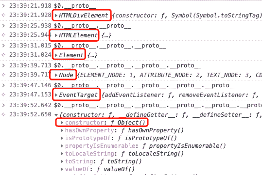
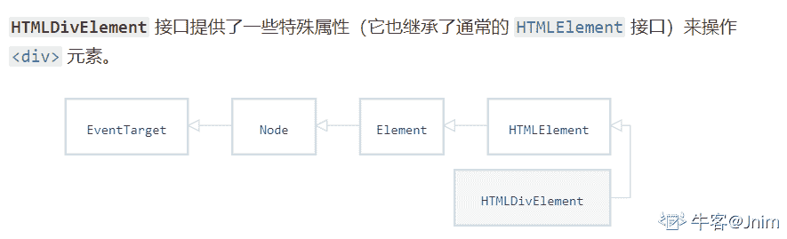
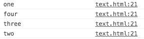

# 点我达 2019 届校招前端开发笔试

## 1

在 js 中执行 1+'1'的结果是？

正确答案: A   你的答案: 空 (错误)

```cpp
11
```

```cpp
2
```

```cpp
NaN
```

```cpp
undefined
```

本题知识点

前端工程师 点我达 2019

讨论

[手指 201807140227912](https://www.nowcoder.com/profile/230944530)

常见的字符串拼接

发表于 2018-12-06 11:37:45

* * *

## 2

在 js 中执行 parseInt('77',40)的结果是?

正确答案: D   你的答案: 空 (错误)

```cpp
308
```

```cpp
287
```

```cpp
77
```

```cpp
NaN
```

本题知识点

前端工程师 点我达 2019

讨论

[Findly](https://www.nowcoder.com/profile/9242206)

parseInt(string, radix)
参数 radix 可选。表示要解析的数字的基数。该值介于 2 ~ 36 之间。如果省略该参数或其值为 0，则数字将以 10 为基础来解析。如果它以 “0x” 或 “0X” 开头，将以 16 为基数。如果该参数小于 2 或者大于 36，则 parseInt() 将返回 NaN。

发表于 2018-12-06 20:40:04

* * *

## 3

在 ECMAScript 5 标准下，以下哪些是保留关键字？

正确答案: A B D   你的答案: 空 (错误)

```cpp
const
```

```cpp
class
```

```cpp
argument
```

```cpp
debugger
```

本题知识点

前端工程师 点我达 2019

讨论

[无 111](https://www.nowcoder.com/profile/9348823)

JavaScript 有一些保留字，不能用作标识符：arguments、break、case、catch、class、const、continue、debugger、default、delete、do、else、enum、eval、export、extends、false、finally、for、function、if、implements、import、in、instanceof、interface、let、new、null、package、private、protected、public、return、static、super、switch、this、throw、true、try、typeof、var、void、while、with、yield。

发表于 2018-12-06 08:53:37

* * *

[Ped](https://www.nowcoder.com/profile/9416754)

看漏了一个 s......

发表于 2019-10-04 21:20:28

* * *

## 4

如下的 Array.prototype 上的方法中，哪些会改变原有的数组？

正确答案: A C D   你的答案: 空 (错误)

```cpp
push
```

```cpp
slice
```

```cpp
splice
```

```cpp
sort
```

本题知识点

前端工程师 点我达 2019

讨论

[渺万里浮云](https://www.nowcoder.com/profile/321889074)

slice 会返回一个新数组；用法 slice(start,end);适合用于删除数组中的一段元素

发表于 2018-12-15 14:01:40

* * *

[莪紦靈魂賣給時間咊魰茡](https://www.nowcoder.com/profile/435696238)

slice 不会改变原数组，只会返回一个新的子数组

发表于 2018-12-12 15:12:16

* * *

## 5

dom 中 HTMLDivElement 的正确继承关系是？

正确答案: B   你的答案: 空 (错误)

```cpp
HTMLDivElement -> HTMLElement -> Element -> EventTarget -> Node
```

```cpp
HTMLDivElement -> HTMLElement -> Element -> Node -> EventTarget
```

```cpp
HTMLDivElement -> HTMLElement -> EventTarget -> Element -> Node
```

```cpp
HTMLDivElement -> HTMLElement -> Node -> Element -> EventTarget
```

本题知识点

前端工程师 点我达 2019 HTML

讨论

[zhouqctech](https://www.nowcoder.com/profile/1468715)

在开发者工具中选中某一元素，打印如下语句：

发表于 2019-05-15 23:40:14

* * *

[Jnim](https://www.nowcoder.com/profile/509820987)



发表于 2020-08-11 20:33:05

* * *

[咚咚呱](https://www.nowcoder.com/profile/735469384)

这个是干嘛的呢？有啥用吗

发表于 2020-09-14 18:02:49

* * *

## 6

当元素的一个继承属性没有指定值时，则取父元素的同属性的计算值，以下哪些不是 CSS 中的继承属性？

正确答案: B C   你的答案: 空 (错误)

```cpp
color
```

```cpp
display
```

```cpp
border-style
```

```cpp
text-align
```

本题知识点

前端工程师 点我达 2019 HTML CSS

讨论

[嘿嘿 _ 哈哈](https://www.nowcoder.com/profile/798181578)

**一、无****继****承性的****属****性**

1、display：规定元素应该生成的框的类型

2、文本属性：

vertical-align：垂直文本对齐

text-decoration：规定添加到文本的装饰

text-shadow：文本阴影效果

white-space：空白符的处理

unicode-bidi：设置文本的方向

3、盒子模型的属性：width、height、margin 、margin-top、margin-right、margin-bottom、margin-left、border、border-style、border-top-style、border-right-style、border-bottom-style、border-left-style、border-width、border-top-width、border-right-right、border-bottom-width、border-left-width、border-color、border-top-color、border-right-color、border-bottom-color、border-left-color、border-top、border-right、border-bottom、border-left、padding、padding-top、padding-right、padding-bottom、padding-left

4、背景属性：background、background-color、background-image、background-repeat、background-position、background-attachment

5、定位属性：float、clear、position、top、right、bottom、left、min-width、min-height、max-width、max-height、overflow、clip、z-index

6、生成内容属性：content、counter-reset、counter-increment

7、轮廓样式属性：outline-style、outline-width、outline-color、outline

8、页面样式属性：size、page-break-before、page-break-after

9、声音样式属性：pause-before、pause-after、pause、cue-before、cue-after、cue、play-during

**二、有****继****承性的****属****性**

1、字体系列属性

font：组合字体

font-family：规定元素的字体系列

font-weight：设置字体的粗细

font-size：设置字体的尺寸

font-style：定义字体的风格

font-variant：设置小型大写字母的字体显示文本，这意味着所有的小写字母均会被转换为大写，但是所有使用小型大写字体的字母与其余文本相比，其字体尺寸更小。

font-stretch：对当前的 font-family 进行伸缩变形。所有主流浏览器都不支持。

font-size-adjust：为某个元素规定一个 aspect 值，这样就可以保持首选字体的 x-height。

2、文本系列属性

text-indent：文本缩进

text-align：文本水平对齐

line-height：行高

word-spacing：增加或减少单词间的空白（即字间隔）

letter-spacing：增加或减少字符间的空白（字符间距）

text-transform：控制文本大小写

direction：规定文本的书写方向

color：文本颜色

3、元素可见性：visibility

4、表格布局属性：caption-side、border-collapse、border-spacing、empty-cells、table-layout

5、列表布局属性：list-style-type、list-style-image、list-style-position、list-style

6、生成内容属性：quotes

7、光标属性：cursor

8、页面样式属性：page、page-break-inside、windows、orphans

9、声音样式属性：speak、speak-punctuation、speak-numeral、speak-header、speech-rate、volume、voice-family、pitch、pitch-range、stress、richness、、azimuth、elevation

三、**所有元素可以****继****承的****属****性**

1、元素可见性：visibility

2、光标属性：cursor

四、**内联****元素可以****继****承的****属****性**

1、字体系列属性

2、除 text-indent、text-align 之外的文本系列属性

五、**块级****元素可以****继****承的****属****性**

1、text-indent、text-align

发表于 2020-10-07 14:10:27

* * *

[超超越越要长高](https://www.nowcoder.com/profile/819063629)

不可继承：display，margin，border，padding，background，height，width，position（百度的）

发表于 2019-02-14 23:13:47

* * *

[你快乐吗](https://www.nowcoder.com/profile/5271388)

这是考记忆力吗

发表于 2020-11-10 10:44:33

* * *

## 7

请尽可能多的列举你所知道 HTML5 规范提出的新特性?

你的答案

本题知识点

前端工程师 点我达 2019

讨论

[孙佳琪 123](https://www.nowcoder.com/profile/6977617)

1.语义化标签,如<header><footer><article><section>
2.新增表单类型 search,email,url,number,tel 等 3.新增表单属性：autocomplete 控制自动完成功能 4.新增 API，自定义属性 data-,音频视频 audio,video,拖拽上传 5.canvas 绘图 6.ES6 标准

发表于 2019-02-11 09:04:02

* * *

[frontWhite](https://www.nowcoder.com/profile/8751839)

1.语意特性,添加<header><header/><nav><nav>等标签
2.多媒体， 用于媒介回放的 video 和 audio 元素
3.图像效果，用于绘画的 canvas 元素，svg 元素等
4.离线 & 存储,对本地离线存储的更好的支持,local Store,Cookies 等
5.设备兼容特性 ，HTML5 提供了前所未有的数据与应用接入开放接口。使外部应用可以直接与浏览器内部的数据直接相连，
6.连接特性，更有效的连接工作效率，使得基于页面的实时聊天，更快速的网页游戏体验，更优化的在线交流得到了实现。HTML5 拥有更有效的服务器推送技术，Server-Sent Event 和 WebSockets 就是其中的两个特性，这两个特性能够帮助我们实现服务器将数据“推送”到客户端的功能
7.性能与集成特性，HTML5 会通过 XMLHttpRequest2 等技术，帮助您的 Web 应用和网站在多样化的环境中更快速的工作 8.拖拽释放(Drag and drop) API9.表单控件，calendar、date、time、email、url、search10.新的技术 webworker, websocket, Geolocation

发表于 2019-01-22 10:48:38

* * *

[喂猫吃草 i](https://www.nowcoder.com/profile/3560612)

1\. 新的 Doctype ,使用<!DOCTYPE html>2. 去掉 link 和 script 标签里面的 type 属性 3. Placeholder4.语义化的 header 和 footer 5.hgroup ,一般在 header 里面用来将一组标题组合在一起 6.Audio 支持 和 Video 支持 7.正则表达式 8.Mark 元素 把<mark>元素看做是高亮的作用

发表于 2018-12-06 14:52:51

* * *

## 8

如下代码的打印结果是什么？

```cpp
console.log('one'); setTimeout(function() { console.log('two'); }, 0); Promise.resolve().then(function() { console.log('three'); })； console.log('four');
```

你的答案

本题知识点

前端工程师 点我达 2019

讨论

[Typhoon20181122115868](https://www.nowcoder.com/profile/854285194)

涉及事件循环队列的知识。主线程任务完成后，会完成所有微队列内的异步任务（promise）,再去处理宏队列中的任务（setTimeout）所以输出结果为 one  four three two

发表于 2018-12-10 15:53:09

* * *

[Chuan、](https://www.nowcoder.com/profile/9866087)

```cpp
console.log('one'); //1-1 setTimeout(function() { console.log('two'); }, 0);         //1-2 Promise.resolve().then(function() { console.log('three'); })；//1-3 console.log('four');                                         //1-4
```

考查的知识点是事件循环和任务队列；1：先执行 script 原代码  宏任务队列    1-1：打印 ‘one’     1-2：setTimeout()属于 宏任务队列的异步代码，WebAPIs 会把 setTimeout 放到一个新的宏任务队列中 排队。    1-3：Promise 的 then()属于微任务队列的异步代码， 执行栈会把 then()中的代码放到 微任务队列中 排队。
    1-4：同步代码，打印 ' four'；
    至此，script 原代码  宏任务队列 执行完，接着执行 微任务队列 中的代码。
    注：宏任务队列 和 微任务队列 是平行的两个队列，两者交替执行。
2：执行微任务队列中的代码    2-1：微任务队列中，只有 Promise 的 then 代码，所以打印 ' three '
    微任务队列 执行完毕，再执行下一个 宏任务队列
3：执行下一个宏任务队列    3-1：这时就到了 setTimeout 的宏任务队列了，因此就打印 ' two ' 啦。
关于事件循环和任务队列，以下文章讲解得比较详细，不太清楚的可以去了解了解：[`kongchenglc.github.io/blog/%E4%BA%8B%E4%BB%B6%E5%BE%AA%E7%8E%AF20171026/`](https://kongchenglc.github.io/blog/%E4%BA%8B%E4%BB%B6%E5%BE%AA%E7%8E%AF20171026/)

发表于 2019-03-08 16:25:34

* * *

[frontWhite](https://www.nowcoder.com/profile/8751839)

1) *主体部分*： 直接输出 one 再输出 four（同步情况下，就是严格按照定义的先后顺序）

2）*promise*： 这里的 promise.then 部分，输出的是 three

3) *setTimeout* ： 最后输出 two

综合的执行顺序就是： 

发表于 2019-01-22 10:54:29

* * *

## 9

如何使用 Flex 布局实现如下 p 元素在 div 元素中水平垂直居中的效果？ ```cpp
<div class="flex"> <p>content content</p> </div>
``` 

你的答案

本题知识点

前端工程师 点我达 2019

讨论

[objectAndNull](https://www.nowcoder.com/profile/765226092)

```cpp
div:{
    display:flex;
    justify-content:center;
    align-item:center;
}
```

发表于 2019-03-12 11:47:51

* * *

[Typhoon20181122115868](https://www.nowcoder.com/profile/854285194)

```cpp
.flex{
    display: flex;
    display: -webkit-flex;
    justify-content: center;
    align-items: center;
}
```

发表于 2018-12-10 15:56:02

* * *

## 10

当我们需要制作扑克游戏时，经常需要一个洗牌算法，来让不同玩家获得更随机一些的牌面，现在需要你用 JS 来写实现一个洗牌函数 shuffle,接收一个数组作为参数，返回洗牌后的新数组： ```cpp
function shuffle(arr) {     //***
}
``` 

你的答案

本题知识点

前端工程师 点我达 2019

讨论

[idasout](https://www.nowcoder.com/profile/478491405)

function shuffle(arr) {  var temp = null  for(var i = 0; i < arr.length; i++) {  var rn = Math.floor(Math.random()*arr.length)  if(rn != i) {  temp = arr[i];  arr[i] = arr[rn];  arr[rn] = temp}  return arr}}

发表于 2019-01-23 21:34:57

* * *

[534873125](https://www.nowcoder.com/profile/7488834)

function  shuffle(arr) {if(this.circut  ==  undefined){this.circut  =0}this.circut  +=  1console.log('this,circut',this.circut)var  length  =  arr.lengthvar  arr1=arr.slice(0,length/2)var  arr2=arr.slice(length/2,length)var  arrnow  = [ ]for (var  i=0;i<length/2;i++){arrnow.push(arr1[i])arrnow.push(arr2[i])}if(arrnow.indexOf(undefined)==-1  &&  this.circut<3){return  shuffle(arrnow)}else  if(this.circut<3){arrnow.splice(arrnow.indexOf(undefined),1)return  shuffle(arrnow)}if(this.circut==3){return  arrnow}}

| 12 |   |

发表于 2018-12-10 21:21:58

* * *

[ymzhao](https://www.nowcoder.com/profile/460514815)

```cpp
function shuffle(arr) {
    var arr_1 = [];
    while (arr.length > 0){
       var index = Math.round(Math.random()*(arr.length - 1));
       arr_1.push(arr[index]);
       arr.splice(index, 1);
    }
    return arr_1;
} 🤣🤣🤣 
```

发表于 2018-12-07 18:34:09

* * *

## 11

使用 javascript 实现一个双向链表，具备如下几个用法即可。 ```cpp
const linkList = new LinkList() //创建双向链表 linkList.append(5) // 向链表尾部追加一个 value 为 5 的元素 linkList.prepend(10) // 向链表的头部最近一个 value 为 10 的元素 linkList.delete(2) // 删除整个链表里 value 为 2 的元素，并返回删除元素的个数
``` 

你的答案

本题知识点

前端工程师 点我达 2019

讨论

[cst_lzw](https://www.nowcoder.com/profile/614166082)

```cpp
function LinkList () {
    var arr = new Array()
    arr.append = function (num) {
        arr.push(num)
    }
    arr.prepend = function (num) {
        arr.unshift(num)
    }
    arr.delete = function (num) {
        var count = 0
        while (arr.indexOf(num) !== -1) {
            arr.splice(arr.indexOf(num), 1)
            count++
        }
        return count
    }
    return arr
}
```

发表于 2019-10-18 10:10:46

* * *

## 12

在 HTTP 请求中，如果我们希望客户端(如浏览器)不要有任何形式的缓存，可以在响应头(response header)中添加如下哪种 Cache-Control 属性

正确答案: B   你的答案: 空 (错误)

```cpp
Cache-Control: no-cache
```

```cpp
Cache-Control: no-store
```

```cpp
Cache-Control: max-age=0
```

```cpp
Cache-Control: private
```

本题知识点

前端工程师 点我达 2019

讨论

[菏妹](https://www.nowcoder.com/profile/8181085)

1、no-***：请求或响应消息不能缓存 2、no-store：用于防止重要的信息被无意发布。在请求消息中发送将使得请求和响应消息都不使用缓存 3、Max-age：指示客户机可以接收生存期不大于指定时间(以秒为单位)的响应。4、Private：指示对于单个用户的整个或部分响应消息，不能被共享缓存处理。这允许服务器仅仅描述当用户的部分响应消息，此响应消息对于其他用户的请求无效。

发表于 2018-12-24 21:09:57

* * *