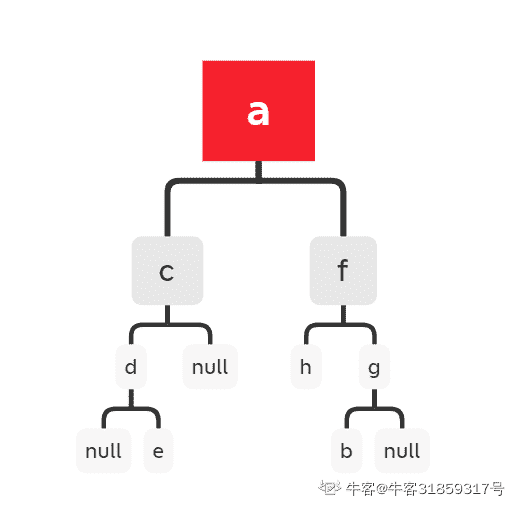

# 点我达 2019 届校招算法笔试

## 1

有一段楼梯台阶有 15 级台阶，以小明的脚力一步最多只能跨 3 级，请问小明登上这段楼梯，有 1 种不同的走法。

你的答案 (错误)

1 参考答案 (1) 5768

本题知识点

算法工程师 点我达 2019

讨论

[Sesenn](https://www.nowcoder.com/profile/85234885)

第 N 层台阶可以由 N-1 层跨一步上去，由 N-2 层跨两步上去，由 N-3 层跨三步上去 f（N） = f(N-1)+f(N-2)+f(N-3)

发表于 2018-12-14 20:17:13

* * *

[LauZyHou](https://www.nowcoder.com/profile/8203811)

f(1)=1f(2)=2f(3)=4 到了四阶以上的 k，可以从 k-1 或者 k-2 或者 k-3 处直接到 kf(k)=f(k-3)+f(k-2)+f(k-1)

发表于 2018-12-06 14:04:56

* * *

## 2

已知一个二叉树的前序遍历结果是（ACDEFHGB） ，中序遍历结果是（DECAHFBG）,请问后续遍历结果是 1

你的答案 (错误)

1 参考答案 (1) EDCHBGFA

本题知识点

算法工程师 点我达 2019

讨论

[牛客 31859317 号](https://www.nowcoder.com/profile/31859317)

首先看前序遍历 ACDEFHGB 说明 A 为根节点再从中序遍历中找到 A 所在位置，那么 DEC 就是 A 节点的左子树此时查看前序遍历左子树的结果为 CDE 同理把问题拆解了看，前序遍历 CDE，中序遍历 DEC 二叉树就比较好画了，再来一次上面的逻辑，C 为根节点中序遍历中 DE 都再 C 左边，说明，左子树 为 DE   c  /  \[d,e]  null 再来一次，前序遍历 DE， 中序遍历 DE 在画一次二叉树    d   /  \null  e 然后还剩下 前序遍历结果为 FHGB 和 中序遍历结果为 HFBG 最终画出来的图

发表于 2021-03-13 21:33:16

* * *

## 3

有一个 1G 大小的一个文件，里面每一行是一个英文单词，词的大小不超过 16 字节，内存限制是 1M。请设计一个算法思路，返回频数最高的 100 个词。

你的答案

本题知识点

算法工程师 点我达 2019

讨论

[欧巴禾](https://www.nowcoder.com/profile/581170571)

通过 hash_map 将 1G 文件分别存储到 1024 个小文件中，然后在小文件中进行遍历，单词出现一次加 1，得到每个小文件中频数最高的词，将 1024 个小文件中频数最高的词统计，相同的词频数相加生成集合，对集合进行排序，输出 Top100

发表于 2019-03-07 18:06:53

* * *

[CircleYuan](https://www.nowcoder.com/profile/5905647)

解题思路：
1、遍历文件，对遍历到的每一个词，执行 Hash 操作：hash(x)%2000，将结果为 i 的词存放到文件 ai 中，通过这个分解步骤，可以是每个子文件的大小约为 400KB 左右，如果这个操作后的文件大小超过 1MB，那么可以使用同样的方法把文件继续进行分解下去，直到文件的大小小于 1MB 为止。

2、统计出每个文件中出现频率最高的 100 个词。最简单的就是使用字典来实现，具体方法为：遍历文件中的所有词，对于遍历到的词，如果字典中不存在，则把这个词存入到字典中（键为这个词，值为 1），如果这个词已经在字典中，那么把这个词对应的值加一。遍历后可以非常容易的找到出现频率最高的 100 个词。

3、上一步找出了每个文件中出现频率最高的 100 个词，这步可以通过维护一个小顶堆来找出所有词中出现频率最高的 100 个词。遍历第一个文件，把第一个文件中的出现频率最高的 100 个词构成一个小顶堆。（如果第一个文件中词的数目小于 100，那么可以继续遍历第二个文件，直到构建好有 100 个节点的小顶堆为止）。继续遍历，如果遍历到的词的出现次数大于堆顶上词的出现次数，那么可以用新遍历到的词替换堆顶的词，然后重新调整这个堆为小顶堆。当遍历完所有的文件后，这个小顶堆中的词就是出现频率最高的 100 个词。当然这一步也可以采用类似归并排序的方法把所有文件中出现次数最高的 100 个词进行排序，最终找出出现次数最高的 100 个词。
--------------------- 
作者：CircleYua 
来源：CSDN 
原文：[`blog.csdn.net/kingyuan666/article/details/84502198`](https://blog.csdn.net/kingyuan666/article/details/84502198) 
版权声明：本文为博主原创文章，转载请附上博文链接！

发表于 2019-02-28 21:51:51

* * *

[LauZyHou](https://www.nowcoder.com/profile/8203811)

```cpp
Stack<string> s,容量 100
HashMap<string,int> h
string st=NaN //记录当前栈中词频最小元素
int n_st=-1 //记录对应词频
while(文件未读完):
    读取一个词 w
    if(h[w]不存在):
         h[w]=1
    else:
         h[w]+=1
    if(栈为空 || 栈不满 || h[w]>n_st):
         st=w
         w 入栈
关闭文件
栈中元素即为所求

```

发表于 2018-12-06 13:48:14

* * *

## 4

进行 20 次投硬币的伯努利实验，出现正面 12 次，反面 8 次，请分别用最大似然估计、最大后验估计、贝叶斯估计估计三种方法来估计“正面出现”的概率 p. [注：n 次伯努利实验服从二项分布 B(n, p)]

你的答案

本题知识点

算法工程师 点我达 2019

讨论

[欧巴禾](https://www.nowcoder.com/profile/581170571)

如果我们做 20 次实验，出现正面 12 次，反面 8 次 那么根据最大似然估计得到参数值 p 为 12/20 = 0.6。根据 MAP 估计出来的参数 p 为 16/28 = 0.571,小于最大似然估计得到的值 0.6，这也显示了“硬币一般是两面均匀的”这一先验对参数估计的影响。如果仍然是做 20 次实验，12 次正面，8 次反面，那么根据贝叶斯估计得到的 p 满足参数为 12+5 和 8+5 的 Beta 分布，其概率分别是 17/30=0.567。

发表于 2019-03-07 18:11:10

* * *

## 5

请写出至少 4 种聚类算法的名称、基本思想和各自优缺点。

你的答案

本题知识点

算法工程师 点我达 2019

讨论

[阿夲呀](https://www.nowcoder.com/profile/863141701)

k-means 聚类算法 　k-means 算法以 k 为参数，把 n 个对象分成 k 个簇，使簇内具有较高的相似度，而簇间的相似度较低。k-means 算法的处理过程如下：首先，随机地 选择 k 个对象，每个对象初始地代表了一个簇的平均值或中心;对剩余的每个对象，根据其与各簇中心的距离，将它赋给最近的簇;然后重新计算每个簇的平均值。 这个过程不断重复，直到准则函数收敛。通常，采用平方误差准则，其定义如下： 　E=∑i=1~k∑p∈Ci |p-mi|² 　这里 E 是数据库中所有对象的平方误差的总和，p 是空间中的点，mi 是簇 Ci 的平均值。该目标函数使生成的簇尽可能紧凑独立，使用的距离度量是欧几里得距离,当然也可以用其他距离度量。

发表于 2018-12-10 23:53:35

* * *

## 6

在外卖配送场景下，调度系统希望把一个订单派给一个顺路的配送员，实现效率最高。请设计一个“顺路度”指标，来量化一个新产生的订单跟配送员身上已被指派但尚未完成的订单之间一种并单的合理程度。

你的答案

本题知识点

算法工程师 点我达 2019

## 7

请分析随机森林(Random Forest)和梯度提升决策树(Gradient Boosting Decision Tree)的相同点和不同点。

你的答案

本题知识点

算法工程师 点我达 2019

讨论

[阿夲呀](https://www.nowcoder.com/profile/863141701)

GBDT 与 RF 同：1.都是由多棵树组成.2.最终的结果都是由多棵树一起决定 异：1、组成 RF 的树可以是分类树，也可以是回归树；而 GBDT 只由回归树组成 2、组成 RF 的树可以并行生成；而 GBDT 只能是串行生成 3、对于最终的输出结果而言，RF 采用多数投票等；而 GBDT 则是将所有结果累加起来，或者加权累加起来 4、RF 对异常值不敏感，GBDT 对异常值非常敏感 5、RF 对训练集一视同仁，GBDT 是基于权值的弱分类器的集成 6、RF 是通过减少模型方差提高性能，GBDT 是通过减少模型偏差提高性能

发表于 2018-12-10 23:28:54

* * *

## 8

 选择一个你作为主要参与者、能代表你算法能力的项目，介绍清楚需要解决的问题，你当时的分析思路，选用的算法，对算法的最主要的改进点(如果只是应用算法，说明一下选择该算法的理由)，以及该最后取得的效果如何。

你的答案

本题知识点

算法工程师 点我达 2019