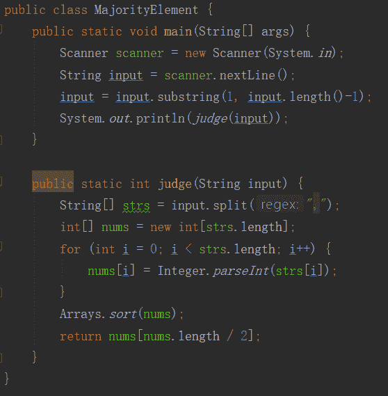
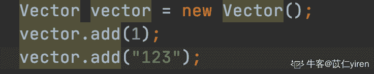

# 有赞 2019 校招 Java 笔试（B 卷）

## 1

给定一个非空的整数数组，从数组第一个元素(下标为 0 的元素)开始遍历进行移动，下一次向后或向前移动 该元素的值 的位数（值为正数向后移动，值为负数向前移动，值为零不移动），依次类推进行移动，若某次移动数组出现越界，则说明数组可以跳出，返回 true；不能跳出则返回 false；（加分项：也可考虑不增加使用其他集合数组辅助完成算法）例 1：输入数组 a[5] = [1,2,3,2,5];从第一个元素开始 a[0]=1,下次向后移动 1 位到第二个元素 a[1]=2,再次向后移动 2 位到第四个元素 a[3],因为下次向后移动 2 位(a[3]=2)后,向后数组越界,即跳出数组,输出 true;例 2：
输入数组 a[2] = [1,-3];从第一个元素开始 a[0]=1,下次移动 1 位到第二个元素 a[1]=-3,再次向前移动 3 位后,向前数组越界,即跳出数组,输出 true;

本题知识点

Java 工程师 有赞 数组 模拟 2019

讨论

[learner111111](https://www.nowcoder.com/profile/970262031)

```cpp

	import java.util.Scanner;

	public class Main{

	    public static void main(String args[]){

	        Scanner sc=new Scanner(System.in);

	        while(sc.hasNext()){

	            String s=sc.next();

	            String str=s.substring(1,s.length()-1);

	            String ss[]=str.split(",");

	            int a[]=newint[ss.length];

	            for(int i=0;i<ss.length;i++)

	                a[i]=Integer.parseInt(ss[i]);

	            boolean o=false;

	            int count=0;

	            int k=0;

	            while(count<=a.length){

	                count++;

	                k+=a[k];

	                if(k<0||k>=a.length){

	                    o=true;

	                    break;

	                }

	            }

	            System.out.println(o);

	        }

	    }

	}

	其实很简单，也不用专门弄个数组去标记，只要让他在里面跳 a.length 次，只要他其中有一次跳出来了，就为 true，否则就是 false 了。

```

发表于 2018-12-17 12:36:17

* * *

[秋心拆两半](https://www.nowcoder.com/profile/9459050)

```cpp
//关键点一: 处理入参，这里是直接输入一个字符串(表示数组)，需要进行拆分转化为数组
//关键点二: 越界的条件是当前元素下标加上元素值，如果小于 0 或者大于等于数组长度，就越界，返回 true; 
//         永不越界条件是当前元素下标加上元素值之后，跳转到之前已经访问过的元素下标，构成死循环，返回 false
//辅助: 构建一个辅助数组，用于标记已经访问过的元素      
import java.util.Scanner;
public class Main{
    public static void main(String[] args){
        Scanner sc = new Scanner(System.in);
        String[] strings = sc.nextLine().replace("[", "").replace("]", "").split(",");
        int[] nums = new int[strings.length];
        for(int i = 0; i < nums.length; ++i){
            nums[i] = Integer.parseInt(strings[i].trim());
        }
        System.out.print(process(nums));
    }

    public static boolean process(int[] nums){
        if(nums == null || nums.length == 0)
            return false;
        //使用一个额外的数组记录当前元素是否已经被访问过，如果是就返回 false
        int[] temp = new int[nums.length];
        for(int i = 0; i < nums.length;){
            if(temp[i] == 1)
                return false;
            int index = i + nums[i];
            if(index < 0 || index >= nums.length)
                return true;
            temp[i] = 1;
            i = index;
        }
        return true;
    }
}
```

编辑于 2019-08-30 17:19:36

* * *

[keashem](https://www.nowcoder.com/profile/597698287)

不用再去申请一个辅助数组做标记，直接再原数组上标记即可，如果某一次跳到标记过的位置，则表示跳不出来

```cpp
import java.util.Scanner;
import static java.lang.System.in;

public class Main{
    public static void main(String[] args) {
        Scanner sc = new Scanner(in);
        String[] str = sc.nextLine().replace("[", "").replace("]", "").split(",");
        int[] data = new int[str.length];
        for (int i = 0; i < data.length; i++) {
            data[i] = Integer.parseInt(str[i]);
        }
        int i = 0;
        int temp = 0;
        while (true) {
            if (i < 0 || i >= data.length) {
                System.out.println(true);
                return;
            } else if (data[i] == Integer.MAX_VALUE) {
                System.out.println(false);
                return;
            } else {
                temp = data[i];
                data[i] = Integer.MAX_VALUE;
                i += temp;
            }
        }
    }
}
```

发表于 2019-08-06 11:23:06

* * *

## 2

给定一个数组 A[n], 定义数组的众数 ( Majority Element) 为数组中出现次数超过 n/2 次的元素, 假设数组 A[n]非空且一定存在众数, 请设计算法找到该众数并输出.

本题知识点

Java 工程师 有赞 数组 排序 *查找 *2019** **讨论

[长景陆](https://www.nowcoder.com/profile/273185014)

也算是取了个巧吧，现将数组排序，然后取排序后数组的中间位置元素就是众数了😂

发表于 2019-03-21 21:39:51

* * *

[小蝌蚪 666](https://www.nowcoder.com/profile/5416579)

```cpp
#include <iostream>
using namespace std;
int main(void){
    int x, mid, time = 1;
    char c;
    cin.get(c);
    cin>>mid;
    while((c = cin.get()) != ']'){
        cin>>x;
        if(mid == x)
            ++time;
        else if(--time == 0)
            time = 1, mid = x;
    }
    cout<<mid<<endl;
    return 0;
}
```

初始化中位数 mid=a[0]，出现次数 times=1，从第二个数开始遍历数组，a[i]等于 mid，次数 times 加 1，否则 times 减 1，再判断减 1 后 times 的值，当减 1 后 times 变为 0 时，重新初始化 mid=a[i]，times=1

发表于 2019-08-16 16:44:04

* * *

[keashem](https://www.nowcoder.com/profile/597698287)

根据题目中众数的定义，给的数据中一定会出现次数超过 n/2 的数，那么如果数组中一次删去两个不同的数，那么最后剩下来的数一定是众数，提供一种不用排序，时间复杂度 O(n)，空间复杂度 O(1)的 AC 方法

```cpp
import java.util.Scanner;
import static java.lang.System.in;

public class Main {
    public static void main(String[] args) {
        Scanner sc = new Scanner(in);
        String[] str = sc.nextLine().replace("[", "").replace("]", "").split(",");
        int[] data = new int[str.length];
        for (int i = 0; i < data.length; i++) {
            data[i] = Integer.parseInt(str[i]);
        }
        if (data.length == 1 || data.length == 2) {
            System.out.println(data[0]);
            return;
        }
        int hp = 0;
        int flag = data[0];
        for (int i = 0; i < data.length; i++) {
            if (hp == 0) {
                flag = data[i];
                hp++;
            } else if (data[i] == flag) {
                hp++;
            } else{
                hp--;
            }
        }
        System.out.println(flag);
    }
}
```

编辑于 2019-10-03 21:58:34

* * *

## 3

给定一个无序的整型数组 A[n],数组大小大于等于 3,允许有值相同的元素;请设计算法找到该数组排序后第三大的元素值并输出.

本题知识点

Java 工程师 有赞 数组 排序 *查找 *堆 2019** **讨论

[keashem](https://www.nowcoder.com/profile/597698287)

我来给出这类题的通用解法，也就是求无序数组的第 K 大(或第 K 小)的问题，下面给出两种 AC 了的方法

```cpp
import java.util.PriorityQueue;
import java.util.Scanner;
import static java.lang.Integer.parseInt;
import static java.lang.System.in;

public class Main{
    public static void main(String[] args) {
        Scanner sc = new Scanner(in);
        String[] str = sc.nextLine().replace("[", "").replace("]", "").split(",");
        int[] data = new int[str.length];
        for (int i = 0; i < data.length; i++) {
            data[i] = parseInt(str[i]);
        }
        System.out.println(findKthNum(data, 3));
        System.out.println(findKthNum1(data, 3));
    }
//方法 1，基于快排思想的 partion 划分，时间复杂度 O(n)，空间复杂度 O(1)
    public static int findKthNum(int[] data, int k) {
        int begin = 0, end = data.length - 1;
        int pos = 0;
        while (begin <= end) {
            pos = partion(data, begin, end);
            if (pos == k - 1) {
                return data[pos];
            } else if (pos > k - 1) {
                end = pos - 1;
            } else {
                begin = pos + 1;
            }
        }
        return -1;
    }

    private static int partion(int[] data, int begin, int end) {
        int temp = data[begin];
        while (begin < end) {
            while (begin < end && data[end] <= temp) {
                end--;
            }
            swap(data, begin, end);
            while (begin < end && data[begin] > temp) {
                begin++;
            }
            swap(data, begin, end);
        }
        return begin;
    }

    public static void swap(int[] arr, int i, int j) {
        if (arr == null || i >= arr.length || j >= arr.length || i < 0 || j < 0) {
            return;
        }
        int temp = arr[i];
        arr[i] = arr[j];
        arr[j] = temp;
    }
    //方法 2，建小顶堆，时间复杂度 O(n*logk),空间复杂度 O(k)
    public static int findKthNum1(int data[], int k) {
        PriorityQueue<Integer> heap = new PriorityQueue<>();
        for (int item : data) {
            if (heap.size() < k) {
                heap.add(item);
            } else if (item > heap.peek()) {
                heap.poll();
                heap.add(item);
            }
        }
        return heap.poll();
    }
}
```

编辑于 2019-10-03 22:06:43

* * *

[VV 不吃香菜](https://www.nowcoder.com/profile/1329387)

基于快排实现填坑法：左边第一个元素作为参照值，并挖出来，空出位置；然后从右边往左找到第一个小于参照值的数填进来；此时右边空出一个位置；然后从左边找到一个大于参照值的数，填到右边的空位，此时左边空出一个位置......不断左右找数填坑，最终左右遍历坐标相等时的坑位就是参照值的位置。由 挖坑填数 排序得到的参照值的位置划分序列，分别进行左右递归；

```cpp
import java.util.*;
public class Main {
    /*填坑法*/
    public static int getIndex(int[] arr,int left,int right){
        int pivot = arr[left];
        while(left<right){
            while(left<right&&arr[right]>=pivot){
                right--;
            }
            if(left<right){
                arr[left] = arr[right];
                left++;
            }
            while(left<right&&arr[left]<=pivot){
                left++;
            }
            if(left<right){
                arr[right] = arr[left];
                right--;
            }
        }
        if(left==right){
            arr[left] = pivot;
        }
        return left;
    }
    /*1.获取中轴点 index  2.中轴点左边递归 3.中轴点右边递归*/
    public static void quickSort(int[] arr,int start,int end){
        if(start<end){
            int index = getIndex(arr,start,end);
            quickSort(arr,start,index);
            quickSort(arr,index+1,end);
        } 
    }

    public static void main(String[] args){
        Scanner sc = new Scanner(System.in);
        String[] line = sc.nextLine().replace("[","").replace("]","").split(",");
        int[] arr = new int[line.length];
        for(int i = 0;i<line.length;i++){
            arr[i] = Integer.parseInt(line[i]);
        }
        //查找排序后第三大的元素
        /*
        Arrays.sort(arr);
        */
        quickSort(arr,0,arr.length-1);
        System.out.println(arr[arr.length -3]);
    }
}
```

发表于 2020-02-19 19:38:50

* * *

[WMYW](https://www.nowcoder.com/profile/222543223)

```cpp
#include<iostream>
#include<vector>
#include<algorithm>
using namespace std;

bool compare(const int &a,const int &b)
{
    return a>b;
}

int main()
{
    int num;
    vector<int> v;
    while(getchar()!=']')
    {
        cin>>num;
        v.push_back(num);
    }
    sort(v.begin(),v.end(),compare);
    cout<<v[2];
}
```

发表于 2020-02-18 10:31:37

* * *

## 4

 如果对象的引用被置为 null，垃圾收集器什么时候释放对象占用的内存？ 

正确答案: C   你的答案: 空 (错误)

```cpp
立即释放
```

```cpp
方法调用结束后释放
```

```cpp
下一个垃圾回收周期
```

```cpp
不确定
```

本题知识点

Java 工程师 有赞 2019

讨论

[vicyor](https://www.nowcoder.com/profile/2210832)

1.jvm gc 判断对象是根据可达性分析方法判断的.2.GC ROOT 可达对象.  1.虚拟机栈中引用的对象.  2.方法区静态属性,常量引用的对象.  3.JNI 引用的对象.3.对象赋值为 null,是将栈帧局部变量的 slot 记录除掉.,即虚拟机栈中引用的对象.4.gc 是在全局 safepoint 或安全区域,对所有线程设置中断位主动中断线程,并对垃圾对象进行回收.5.终结器中对象可以进行自救.

发表于 2020-02-13 13:08:48

* * *

[涸辙之鱼 201812122013981](https://www.nowcoder.com/profile/888977632)

不会立即释放对象占用的内存。 如果对象的引用被置为 null，只是断开了当前线程栈帧中对该对象的引用关系，而 垃圾收集器是运行在后台的线程，只有当用户线程运行到安全点(safe point)或者安全区域才会扫描对象引用关系，扫描到对象没有被引用则会标记对象，这时候仍然不会立即释放该对象内存，因为有些对象是可恢复的（在 finalize 方法中恢复引用 ）。只有确定了对象无法恢复引用的时候才会清除对象内存

编辑于 2018-12-13 20:30:59

* * *

## 5

以下对 jdbc 事务描述错误的是（ ）

正确答案: B   你的答案: 空 (错误)

```cpp
JDBC 事务属于 java 事务的一种
```

```cpp
JDBC 事务属于容器事务类型
```

```cpp
JDBC 事务可以保证操作的完整性和一致性
```

```cpp
JDBC 事务是由 Connection 发起的，并由 Connection 控制
```

本题知识点

Java 工程师 有赞 2019

讨论

[涸辙之鱼 201812122013981](https://www.nowcoder.com/profile/888977632)

Java 事务三种类型:JDBC 事务、JTA（Java Transaction API）事务、容器事务

JDBC 事务是用 Connection 对象控制的。JDBC Connection 接口（ java.sql.Connection ）提供了两种事务模式：自动提交和手工提交。 java.sql.Connection 提供了以下控制事务的方法：
容器事务主要是 J2EE 应用服务器提供的，容器事务大多是基于 JTA 完成，这是一个基于 JNDI 的，相当复杂的 API 实现。 

编辑于 2018-12-13 20:28:05

* * *

[绝味小开发](https://www.nowcoder.com/profile/4550590)

JDBC 事务是什么类型的事务？？

发表于 2018-12-11 13:24:48

* * *

## 6

关于 sleep()和 wait()，以下描述错误的一项是( )

正确答案: D   你的答案: 空 (错误)

```cpp
sleep 是线程类（Thread）的方法，wait 是 Object 类的方法；
```

```cpp
sleep 不释放对象锁，wait 放弃对象锁
```

```cpp
sleep 暂停线程、但监控状态仍然保持，结束后会自动恢复
```

```cpp
wait 后进入等待锁定池，只有针对此对象发出 notify 方法后获得对象锁进入运行状态。
```

本题知识点

Java 工程师 有赞 Java 工程师 有赞 2019

讨论

[诗酒趁年华 vec](https://www.nowcoder.com/profile/3408405)

如果线程调用了对象的 wait()方法，那么线程便会处于该对象的等待池中，等待池中的线程不会去竞争该对象的锁。 
当有线程调用了对象的 notifyAll()方法（唤醒所有 wait 线程）或 notify()方法（只随机唤醒一个 wait 线程），被唤醒的的线程便会进入该对象的锁池中，锁池中的线程会去竞争该对象锁。 
优先级高的线程竞争到对象锁的概率大，假若某线程没有竞争到该对象锁，它还会留在锁池中，唯有线程再次调用 wait()方法，它才会重新回到等待池中。而竞争到对象锁的线程则继续往下执行，直到执行完了 synchronized 代码块，它会释放掉该对象锁，这时锁池中的线程会继续竞争该对象锁。

注：wait() ,notifyAll(),notify() 三个方法都是 Object 类中的方法.

发表于 2019-01-03 22:04:55

* * *

[learner111111](https://www.nowcoder.com/profile/970262031)

```cpp
 notifyall 针对所有对象。

            发表于 2018-12-17 13:40:40

            [vicyor](https://www.nowcoder.com/profile/2210832)

                                                                      obj.notifyAll 方法唤醒 obj 对象锁的等待队列的所有线程(waiting->blocked), 线程唤醒后获得锁进入运行状态(blocked-->runnable-->running) 

            发表于 2020-02-13 13:21:21

        7
          已知一棵树的前序遍历是 YOUZANSTyLE，后序遍历 UNAZOLyTESY，求中序遍历是( ) 

    正确答案:
                                                 B
                                                         你的答案:

                  空
                             (错误)

```
lAyNSTZUEOY
```cpp

```
UOZNAYyLTSE
```cpp

```
lNyAETZUSOY
```cpp

```
UANZOLyTSEY
```cpp

本题知识点

                                                            Java 工程师 
                                                有赞 
                                                2019 

讨论

[我是如此相信](https://www.nowcoder.com/profile/7988004)

                                                                      首先可以确定 Y 的左节点是 O，右节点为 S 
   所以看答案 Y 左边的应该包括 O、U、Z、A、N 和 Y 右边的应该包括 S、T、y、L、E  
   只有答案 B 满足  
   然后再验证一下，发现确实是符合的。  

编辑于 2019-03-11 15:51:59

* * *

[bugkiller_czs](https://www.nowcoder.com/profile/5054270)

                                                                      我想说的是 
   树的三个遍历:前,中,后 
       1:已知前和中,可以确定后

       2:已知中和后,可以确定前

   严蔚敏教材 

发表于 2020-03-18 10:49:56

* * *

## 8

  求其时间复杂度( ) 

  int i = 1, n = 100; 

  while(i < n){ 

  i = i * 2; 

  } 

正确答案:
                                A
                                                                          你的答案:

                  空
                             (错误)

```
O(log2n)
```cpp

```
O(n)
```cpp

```
O(nlog2n)
```cpp

```
O(n2)
```cpp

本题知识点

                                                            Java 工程师 
                                                有赞 
                                                2019 

讨论

[越努力越幸运 TT](https://www.nowcoder.com/profile/6263023)

                                                                    因为每次 i*2 后，距离结束循环更近了。也就是说有多少个 2 相乘后大于 n，退出循环。
 数学公式：2^x = n    -->     x = log2n
 因此这个循环的时间复杂度为 O(log2n)   2 为 log 的底数

发表于 2019-02-11 23:30:54

* * *

[涸辙之鱼 201812122013981](https://www.nowcoder.com/profile/888977632)

                                                                    时间复杂度 可以看出循环是 2k 次方 k 是循环次数，i 的结果是 1 2 4 8 16 32 64 128 8 次以后退出循环 那么他的复杂度应该是 log(200)  7<log>编辑于 2018-12-13 20:24:56

* * *

## 9

   下列方法中可以用来创建一个新线程的是（ ） 

正确答案:
                                A
                                                                               D
                       你的答案:

                  空
                             (错误)

```
实现 java.lang.Runnable 接口并重写 run()方法
```cpp

```
实现 java.lang.Runnable 接口并重写 start()方法
```cpp

```
实现 java.lang.Thread 类并实现 start()方法
```cpp

```
继承 java.lang.Thread 类并重写 run()方法
```cpp

本题知识点

                                                            Java 工程师 
                                                有赞 
                                                2019 

讨论

[绝味小开发](https://www.nowcoder.com/profile/4550590)

                                                                    start()是启动线程，run()是创建线程

发表于 2018-12-11 13:28:20

* * *

[bukun](https://www.nowcoder.com/profile/514169517)

                                                                    继承类，实现接口

发表于 2020-09-08 23:36:49

* * *

## 10

  以下哪些 java 容器是线程安全的（ ） 

正确答案:
                                A
                                                                               D
                       你的答案:

                  空
                             (错误)

```
Vector
```cpp

```
ArrayList
```cpp

```
HashSet
```cpp

```
ConcurrentHashMap
```cpp

本题知识点

                                                            Java 工程师 
                                                有赞 
                                                2019 

讨论

[涸辙之鱼 201812122013981](https://www.nowcoder.com/profile/888977632)

```
Vector 是 list 的三个实现类里唯一一个线程安全的集合 它用了 synchronized () 另外两个是实现类 ArrayList LinkedList
HashSet 线程不安全 无序集合
ConcurrentHashMap 该类位于 java.util.concurrent 包下，专门用于解决并发问题。 线程安全 另一个是 Hashtable
```cpp

编辑于 2018-12-13 20:15:28

* * *

## 11

  以下哪些会使索引失效（ ） 

正确答案:
                                A
                                             B
                                             C
                                             D
                       你的答案:

                  空
                             (错误)

```
使用 like 关键字
```cpp

```
条件包含 or
```cpp

```
查询条件使用函数在索引列上
```cpp

```
条件中包含&lt;&gt;
```cpp

本题知识点

                                                            Java 工程师 
                                                有赞 
                                                2019 

讨论

[没意思了](https://www.nowcoder.com/profile/4559796)

                                                                    使用 like 就一定会让索引失效？不是如果查询字段以%开头才会吗

发表于 2018-12-17 19:52:56

* * *

[绝味小开发](https://www.nowcoder.com/profile/4550590)

                                                                    使索引失效的几种情况：
   (1)条件中有 or，即使有条件带索引也不会使用；**要想使用 or，又想让索引生效，只能将 or 条件中的每个列都加上索引**    (2)对于多列索引，如果不是使用的第一部分，则不会使用索引；    (3)like 查询是以%开头的，不会用到索引；    (4)如果列类型是字符串，那一定要在条件中将数据使用引号引用起来,否则不使用索引；    (5)如果 mysql 估计使用全表扫描要比使用索引快,则不使用索引；

发表于 2018-12-11 13:37:26

* * *

[karaysn](https://www.nowcoder.com/profile/7759354)

                                                                      第四个选项原来是<>的意思。不等空值还有 or 都会让后面的索引失效。    A 应该不是很严谨，应该考虑%吧  

发表于 2019-02-22 11:51:02

* * *

## 12

  下面哪些说法是错误的 ？（   ）  

正确答案:
                                A
                                             B
                                             C
                                             D
                       你的答案:

                  空
                             (错误)

```
用 New 运算符来创建的对象，在 JVM 退出时才会被做垃圾回收。
```cpp

```
判断一个对象是否可以被垃圾回收条件为是否还有对该对象的引用 。
```cpp

```
java 函数的参数传递规定。所有的原始类型（如整数）和对象（ 使用 new 来创建的）都为地址传递 。
```cpp

```
java 函数支持重载。但函数必须有一个參数或返回值的类型不同或个数不同。
```cpp

本题知识点

                                                            Java 工程师 
                                                有赞 
                                                2019 

讨论

[pyCharmSS](https://www.nowcoder.com/profile/3948037)

                                                                      用 New 创建的对象在 JVM 中通过 GC Roots 进行搜索判断是否可回收，但该对象可被回收时，如果需要也可执行 finalize()方法自救。    引用计数法在 JVM 中不适用，因为会出现循环引用的问题，那么循环引用的对象就永远不能被回收。    Java 中都是值传递。    java 方法重载中，方法的参数类型或个数不同，但返回值相同。 

发表于 2019-09-18 11:05:13

* * *

[冗热](https://www.nowcoder.com/profile/567361028)

因为 java 中采用可达性分析算法判定对象是否已死。如果 GC Roots 和一个对象之间没有可达路径，就判定该对象不可达，也就是没有该对象的引用了，但是被判定为不可达对象之后不一定就会被判定为可回收对象，至少要进行两次标记后才会判定为可回收对象。

发表于 2019-03-05 22:01:13

* * *

[Kumori](https://www.nowcoder.com/profile/6270434)

                                                                      给对象引用赋值为 null，并且该对象无其他引用，gc 会标记该对象为垃圾，并在不确定的时间进行垃圾回收，所以 a，b 错误。    对于 c，原始类型是值传递。    对于 d，返回值不能作为重载依据。 

发表于 2018-12-09 17:24:43

* * *

## 13

  下面叙述哪些是正确的？（  ）  

正确答案:
                                A
                                             B
                                             C
                                        你的答案:

                  空
                             (错误)

```
java 中的集合类（如 Vector）可以用来存储任何类型的对象，且大小可以自动调整。但需要事先知道所存储对象的类型，才能正常使用
```cpp

```
java 中可以用异常（Exception）来抛出一些并非错误的消息，但这样比直接从函数返回一个结果要花费更大的系统开销。
```cpp

```
java 接口包含函数声明和常量声明。
```cpp

```
java 中子类不可以访问父类的私有成员和受保护的成员。
```cpp

本题知识点

                                                            Java 工程师 
                                                有赞 
                                                2019 

讨论

[Adun](https://www.nowcoder.com/profile/566646474)

                                                                    d: 

```
子类不可以访问父类的私有成员但是可以访问受保护的成员。protected 修饰可以访问子类
```cpp

发表于 2018-12-11 22:32:01

* * *

[以芢](https://www.nowcoder.com/profile/983275145)

                                                                      这个 A 选项有问题，我们都知道泛型是可以不指定类型，然后我们就可以往容器里放各种类型的了，包括基本数据类型（基本数据类型会转成包装类。    

发表于 2020-02-01 15:30:30

* * *

[飞鸟与她](https://www.nowcoder.com/profile/9158041)

                                                                      **1\. 可以用来存储任何类****型的对象****？ **基本类型算不算钻牛角尖喽？ 

发表于 2019-07-07 22:30:29

* * *</log> 
```****