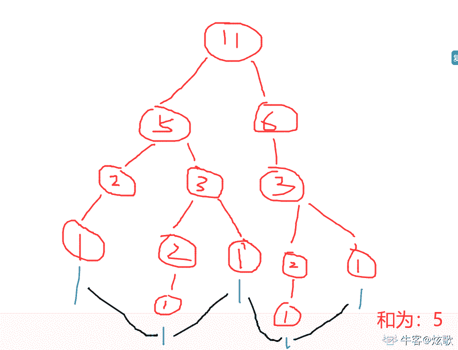

# 有赞 2019 校招前端笔试（第一批）

## 1

给定个不同的整数以及一棵结构已经确定的有个  节点的二叉树，现在需要将这些整数填充到这个二叉树的节点上，请问有多少种填充方式使得填充后的二叉树是一棵二叉查找树？

正确答案: B   你的答案: 空 (错误)

```cpp
0
```

```cpp
1
```

```cpp
 且 
```

本题知识点

前端工程师 有赞 2019

讨论

[法克瓜](https://www.nowcoder.com/profile/598273059)

bst 只有唯一一种

发表于 2019-02-12 23:04:12

* * *

## 2

进栈序列为 abcde，进栈后随时可以出栈，下面哪种出栈结果**不可能**发生

正确答案: B   你的答案: 空 (错误)

```cpp
abcde
```

```cpp
dceab
```

```cpp
bdcae
```

```cpp
decba
```

本题知识点

前端工程师 有赞 2019

讨论

[椰子姑凉](https://www.nowcoder.com/profile/8594864)

栈是后进先出的

发表于 2019-03-13 11:56:34

* * *

[好多好多 offer](https://www.nowcoder.com/profile/355914798)

栈是一种后进先出的线性表，对选项 B，最先出栈的是元素 E，则表示入栈的时候所有元素都已经入栈了，此时的出栈顺序只能为 EDCBA。

发表于 2020-08-18 15:58:57

* * *

## 3

以下哪个排序算法对**单向链表**排序时间复杂度最低？

正确答案: D   你的答案: 空 (错误)

```cpp
插入排序
```

```cpp
堆排序
```

```cpp
快速排序
```

```cpp
归并排序
```

本题知识点

前端工程师 有赞 2019

讨论

[Ped](https://www.nowcoder.com/profile/9416754)

有没有人解释一下？

发表于 2019-06-02 20:14:10

* * *

## 4

下面关于进程和线程的关系**不正确**的是

正确答案: A B C D   你的答案: 空 (错误)

```cpp
父进程创建的线程不能与子进程创建的线程共享内存
```

```cpp
线程的执行顺序跟线程的创建顺序一致
```

```cpp
杀死子进程时，父进程也会被杀掉
```

```cpp
杀死父进程时，子进程也会被杀掉
```

本题知识点

前端工程师 有赞 2019

讨论

[Ped](https://www.nowcoder.com/profile/9416754)

为什么 D 是不正确的？

发表于 2019-06-02 20:15:12

* * *

## 5

文本编辑器的 undo/redo 可以用哪种数据结构实现？

正确答案: A   你的答案: 空 (错误)

```cpp
栈
```

```cpp
队列
```

```cpp
树
```

```cpp
图
```

本题知识点

前端工程师 有赞 2019

## 6

下面说法正确的是

正确答案: C   你的答案: 空 (错误)

```cpp
RESTful 接口中，利用 HTTP 协议的 method 字段来描述要对资源操作的方式，比如 GET 表示获取资源，POST 表示更新一个资源，PUT 表示新建资源,DELETE 表示删除资源。
```

```cpp
HTTPS 协议使用对称加密
```

```cpp
HTTP 是无状态协议
```

```cpp
HTTPS 默认使用 80 端口
```

本题知识点

前端工程师 有赞 2019

讨论

[远山淡影](https://www.nowcoder.com/profile/929506490)

*   GET（SELECT）：从服务器取出资源（一项或多项）。
*   POST（CREATE）：在服务器新建一个资源。
*   PUT（UPDATE）：在服务器更新资源（客户端提供改变后的完整资源）。
*   PATCH（UPDATE）：在服务器更新资源（客户端提供改变的属性）。
*   DELETE（DELETE）：从服务器删除资源。

发表于 2019-03-06 10:37:25

* * *

[Ped](https://www.nowcoder.com/profile/9416754)

https 是采用混合加密机制

发表于 2019-06-02 20:23:17

* * *

[牛客 68443674 号](https://www.nowcoder.com/profile/68443674)

HTTP 默认端口 80 HTTPS 默认端口 443

发表于 2019-04-12 18:51:38

* * *

## 7

有一个长度为  的有序整数数组，判断一个元素是否在数组中出现超过 次需要的最少比较次数是

正确答案: B   你的答案: 空 (错误)

本题知识点

前端工程师 有赞 2019

讨论

[404NOt_found](https://www.nowcoder.com/profile/366189500)

二分判断

发表于 2020-07-18 15:08:37

* * *

[Ped](https://www.nowcoder.com/profile/9416754)

有没有人解释一下？

发表于 2019-06-02 20:23:47

* * *

## 8

下面这段 C 代码的输出是（） ```cpp
int f(int n)
{
    if(n <= 1)
        return 1;
    if(n%2 == 0)
        return f(n/2);
    return f(n/2) + f(n/2+1);
}

int main()
{
    printf("%d", f(11));
    return 0;
}
``` 

正确答案: D   你的答案: 空 (错误)

```cpp
运行出错，栈溢出
```

```cpp
3
```

```cpp
4
```

```cpp
5
```

本题知识点

前端工程师 有赞 2019 C 语言

讨论

[炫歌](https://www.nowcoder.com/profile/622959792)



发表于 2020-08-06 22:26:47

* * *

[火山雪人](https://www.nowcoder.com/profile/8465915)

f0=1 f1=1 f2=f1=1 f3=f1+f2=@2 f4=f2=1 f5=f2+f3=3 f6=2 f11=f5+f6=5

发表于 2022-01-10 15:22:51

* * *

[曾许人间第一流](https://www.nowcoder.com/profile/902859617)

求教这个求得是什么？

发表于 2020-10-26 11:48:55

* * *

## 9

Alice 使用公开密钥加密算法给 Bob 发送了一条加密信息，以下描述哪些是对的？

正确答案: A   你的答案: 空 (错误)

```cpp
Alice 使用 Bob 的公钥对信息做了加密
```

```cpp
Alice 使用自己的公钥对信息做了加密
```

```cpp
Bob 使用自己的公钥解密信息
```

```cpp
Bob 使用 Alice 的公钥解密信息
```

本题知识点

前端工程师 有赞 2019

讨论

[jadetree](https://www.nowcoder.com/profile/634399377)

alice 使用 bob 的公开密钥加密信息，被加密的信息只有 bob 使用私钥才能解开，即使是 alice 也不能解开自己加密的信息

发表于 2019-01-25 12:02:30

* * *

## 10

假设已经实现了一个时间复杂度为  的数组中位数查找算法 ，如果在快速排序算法中使用算法  返回的中位数作为重排的 ，请问这个快速排序算法的最坏时间复杂度是多少？

正确答案: D   你的答案: 空 (错误)

本题知识点

前端工程师 有赞 2019

## 11

请设计一个数据结构来实现下面这些方法，所有方法都使用同一个数据结构实现，这个数据结构必须尽可能让使用频率高的方法效率高，请详细说明如何用所选的数据结构实现每个方法

，并给出每个方法的时间复杂度。  ```cpp
1\. findMin() : 返回最小的元素
使用频率：非常高
2\. findMax() : 返回最大的元素
使用频率：非常高
3\. deleteMin() : 删除最小的元素
使用频率：较高
4\. deleteMax() : 删除最大的元素
使用频率：较高
5\. insert() : 插入一个元素
使用频率：低        
6\. delete() : 删除一个元素
使用频率：低
``` 

你的答案

本题知识点

前端工程师 有赞 2019

讨论

[清祀九](https://www.nowcoder.com/profile/185966787)

我觉得有序双向链表？

发表于 2020-03-30 20:00:01

* * *

[Phoenix201907231604914](https://www.nowcoder.com/profile/739346084)

有序链表

发表于 2019-09-17 21:19:37

* * *

## 12

下面两段代码的输出结果分别可能是什么？请简述原因。 ```cpp
int a = 0;
void func(int* i) {
    for (int i = 0; i < 1000000; i++);
    a = *i;
    free(i);
}
int main() {
    pthread_t t[3];
    for (int i = 0; i < 3; i++) {
        int* b = (int*)malloc(sizeof(int));
        *b = i;
        pthread_create(&t[i], NULL, (void*)&func, (void*)b);
    }
    for (int i = 0; i < 3; i++) {
        pthread_join(t[i], NULL);
    }
    printf("%d\n", a);
    return 0;
}
```

```cpp
int a = 0;
void func(int* i) {
    for (int i = 0; i < 1000000; i++);
    a = *i;
    free(i);
}
int main() {
    for (int i = 0; i < 3; i++) {
        int* b = (int*)malloc(sizeof(int));
        *b = i;
        fork();
        func(b);
    }
    printf("%d\n", a);
    return 0;
}
``` 

你的答案

本题知识点

前端工程师 有赞 2019

讨论

[Monica*](https://www.nowcoder.com/profile/428921263)

难道没有人吐槽前端题考 C++代码的？？？

发表于 2019-08-07 10:19:41

* * *