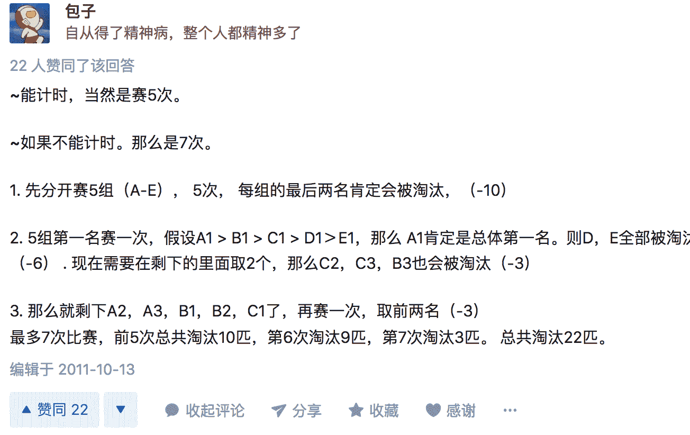
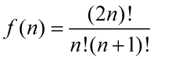

# 有赞 2019 校招前端笔试（第二批）

## 1

以下哪种数据结构最适合用来检查一段 HTML 代码中所有开始标签是否都有对应的结束标签？

正确答案: B   你的答案: 空 (错误)

```cpp
队列
```

```cpp
栈
```

```cpp
双向链表
```

```cpp
二叉树
```

本题知识点

前端工程师 有赞 2019

讨论

[难得丶糊涂╮(╯▽╰)╭](https://www.nowcoder.com/profile/2149088)

数据结构课本中检查括号是否匹配同理，应该是用栈

发表于 2019-02-19 09:11:20

* * *

[haohaozi](https://www.nowcoder.com/profile/872269032)

利用栈的先进后出的特性先把 HTML 代码全部入栈，再对栈里的元素进行出栈操作：出栈的前提是，待出栈的元素在栈里有和它是匹配关系的。如果操作结束，栈里还有标签元素，就是不匹配的，否则是匹配的。

发表于 2019-02-19 17:14:11

* * *

[沉默不要代价](https://www.nowcoder.com/profile/931681910)

A

发表于 2019-02-19 07:42:31

* * *

## 2

给定一个按升序排列的整数数组  以及一个正整数  ，现在需要在数组  中查找两个元素  和  ，使得 ，请问最优算法的时间复杂度是多少？

正确答案: A   你的答案: 空 (错误)

本题知识点

前端工程师 有赞 2019

讨论

[南乔可休](https://www.nowcoder.com/profile/347632879)

因为是按照升序排列的有序数组，所以可以使用双指针，其中一个指针指向 arr[0]，另一个指针指向 arr[n-1]，结果最多只需要将数组遍历一次即可，所以时间复杂度为 O(n)。

发表于 2019-03-24 10:14:37

* * *

[牛客 9858138 号](https://www.nowcoder.com/profile/9858138)

有 bug?，图片不显示，显示 img 标签

发表于 2018-12-21 08:37:07

* * *

[一颗玉米子](https://www.nowcoder.com/profile/484530711)

两遍哈希表，我们把包含有 n 个元素的列表遍历两次。由于哈希表将查找时间缩短到 O(1) ，所以时间复杂度为 O(n)。

发表于 2020-09-11 09:28:49

* * *

## 3

现在有一棵 1000 个节点的二叉搜索树，节点上数字范围是 ，现在需要在这棵树中查找数字 365，以下哪些搜索顺序不可能出现（假设算法实现正确）？

正确答案: C   你的答案: 空 (错误)

```cpp
4, 254, 403, 400, 332, 346, 399, 365
```

```cpp
926, 222, 913, 246, 900, 260, 364, 365
```

```cpp
927, 204,913, 242, 914, 247, 365
```

```cpp
4, 401, 389, 221, 268, 384, 383, 280, 365
```

本题知识点

前端工程师 有赞 2019

讨论

[南乔可休](https://www.nowcoder.com/profile/347632879)

做题小 tips：将选项中的数据构造一棵二叉树，然后检查该二叉树是否符合搜索树的定义，如果如何，则这种情况是存在的。

发表于 2019-03-24 10:17:56

* * *

[楠 649](https://www.nowcoder.com/profile/344659118)

二叉搜索树定义：它或者是一棵空树，或者是具有下列性质的二叉树，
1）若它的左子树不空，则左子树上所有结点的值均小于它的根结构的值；
2）若它的右子树不空，则右子树上所有结点的值均大于它的根结点的值在纸上对着数据一一画出结构，不符合定义的即不可能出现的

编辑于 2019-03-20 21:03:40

* * *

## 4

现在有 25 匹马，不知道每匹马的速度，也没有工具测量它们的速度。假如每场比赛最多只能 5 匹马参加，请问最少需要比多少次才能找出其中最快的 3 匹马？

正确答案: B   你的答案: 空 (错误)

```cpp
6
```

```cpp
7
```

```cpp
8
```

```cpp
9
```

本题知识点

前端工程师 有赞 2019

讨论

[Typhoon20181122115868](https://www.nowcoder.com/profile/854285194)

知乎上看的

发表于 2019-01-17 15:12:17

* * *

[福尔摩斯对我笑](https://www.nowcoder.com/profile/1159453)

感觉是唯一一个能看懂的题了、我的理解：
先来 5 场比赛，从五场比赛里挑出最快的五匹马，再用五匹马比两次，就得出了最快的三匹马.

发表于 2019-02-21 10:42:16

* * *

## 5

以下关于 Cookie 的说法正确的是

正确答案: B C D   你的答案: 空 (错误)

```cpp
Cookie 的内容都可以通过 JavaScript 读取
```

```cpp
Cookie 过多会影响网络请求性能
```

```cpp
Cookie 可以用来跟踪用户的浏览行为
```

```cpp
Cookie 可以持久保存
```

本题知识点

前端工程师 有赞 2019

讨论

[一颗玉米子](https://www.nowcoder.com/profile/484530711)

浏览器输入 javascript:alert(document.cookie) 不就可以调出 cookie 么

发表于 2020-09-11 09:36:48

* * *

[二拍](https://www.nowcoder.com/profile/840213224)

A 是错在都？

发表于 2020-08-18 22:33:28

* * *

[南乔可休](https://www.nowcoder.com/profile/347632879)

cookie 包括会话 cookie 和持久 cookie。会话 cookie 是临时的，记录用户访问站点时的设置和偏好，关闭浏览器 cookie 就会被删除。持久 cookie 则是存储在硬盘上，不同的操作系统，不同的浏览器存储位置不一样，不管是浏览器退出或者电脑重启，持久 cookie 都存在。但需要注意的是，持久 cookie 有过期时间。

发表于 2019-03-24 10:25:37

* * *

## 6

以下关于 WebAssembly 说法正确的是

正确答案: B D   你的答案: 空 (错误)

```cpp
WebAssembly 是以二进制原生代码的形式分发的
```

```cpp
C 语言写的代码可以编译成 WebAssembly
```

```cpp
WebAssembly 是 asm.js 的一个超集
```

```cpp
WebAssembly 可以调用 JavaScript 的函数
```

本题知识点

前端工程师 有赞 2019 C 语言

讨论

[南乔可休](https://www.nowcoder.com/profile/347632879)

通过查阅资料，以下是我的理解，有某些点还不是很理解，欢迎指正 1、 WebAssembly 是一种二进制格式的类汇编代码，而不是以原生代码的形式分发的；2、理论上 任何语言都可以编译成 WebAssembly ；3、首先，超集指的是：如果一个集合 S2 中的所有元素都在 S1 中，而且 S1 中可能包含 S2 中没有的元素，则 S1 为 S2 的超集。 WebAssembly 起源于 asm.js，但是两者并不是包含关系；4、关于这个选项，有关资料如是说：“.wasm 需要由 JS 引入后才能运行，JS 中有一个用于操作二进制代码的 API：ArrayBuffer，JS 使用 ArrayBuffer 加载 .wasm，然后调用编译方法，然后再创建实例。WebAssembly 还没有集成 Web API，要调用 Web API，就必须借助 JS。未来计划允许 WebAssembly 直接调用 Web API，并且让 .wasm 模块像 ES6 模块一样易于使用。” 

发表于 2019-03-24 10:42:01

* * *

[هاوتشوان](https://www.nowcoder.com/profile/699059703)

通过查阅资料，以下是我的理解，有某些点还不是很理解，欢迎指正 1、 WebAssembly 是一种二进制格式的类汇编代码，而不是以原生代码的形式分发的；2、理论上 任何语言都可以编译成 WebAssembly ；3、首先，超集指的是：如果一个集合 S2 中的所有元素都在 S1 中，而且 S1 中可能包含 S2 中没有的元素，则 S1 为 S2 的超集。 WebAssembly 起源于 asm.js，但是两者并不是包含关系；4、关于这个选项，有关资料如是说：“.wasm 需要由 JS 引入后才能运行，JS 中有一个用于操作二进制代码的 API：ArrayBuffer，JS 使用 ArrayBuffer 加载 .wasm，然后调用编译方法，然后再创建实例。WebAssembly 还没有集成 Web API，要调用 Web API，就必须借助 JS。未来计划允许 WebAssembly 直接调用 Web API，并且让 .wasm 模块像 ES6 模块一样易于使用。”

发表于 2021-03-20 19:45:04

* * *

## 7

为什么通常情况下增加内存可以提高系统性能？

正确答案: C   你的答案: 空 (错误)

```cpp
虚拟内存增加了
```

```cpp
更大的内存速度更快
```

```cpp
Page fault 发生更少了
```

```cpp
Segment fault 发生更少了
```

本题知识点

前端工程师 有赞 2019

## 8

以下哪些数据结构不是二叉树？

正确答案: B   你的答案: 空 (错误)

```cpp
红黑树
```

```cpp
B 树
```

```cpp
Huffman 树
```

```cpp
区间树（Interval Tree）
```

本题知识点

前端工程师 有赞 2019

讨论

[等待戈多的莱昂纳多](https://www.nowcoder.com/profile/4713462)

一种适用于外查找的[树](https://baike.baidu.com/item/%E6%A0%91/2699484)，它是一种平衡的多叉树，称为 B 树（或 B-树、B_ 树）。 是多叉树。

发表于 2019-08-17 18:16:40

* * *

## 9

以下操作中数组比链表速度更快的是？

正确答案: C E   你的答案: 空 (错误)

```cpp
原地逆序
```

```cpp
头部插入
```

```cpp
访问中间元素
```

```cpp
访问头部元素
```

```cpp
随机访问任意元素
```

本题知识点

前端工程师 有赞 2019

讨论

[-木来](https://www.nowcoder.com/profile/207106033)

A 的时间复杂度与链表的时间复杂度都是 O（n），B 的话，数组头部插入，需要将头部元素后面的元素全部向后移动，时间复杂度为 O（n），C 的话，获取数组的长度为 0（1）,然后长度除以一半，通过下标即可获得中间元素，而链表获取中间元素需要计数器不停的去指向。D 的话，访问头部元素，数组与链表的时间复杂度都为 O（1）E 的话，数组随机访问任意元素的时间复杂度为 O（1），而链表为 O（n）诚意印象（[`inx.fun`](https://inx.fun)）为您提供

发表于 2018-12-09 10:39:36

* * *

## 10

有 5 个节点的二叉搜索树可能有几种不同的形态？

正确答案: B   你的答案: 空 (错误)

```cpp
32
```

```cpp
42
```

```cpp
120
```

```cpp
5040
```

本题知识点

前端工程师 有赞 2019

讨论

[offer 藏在哪](https://www.nowcoder.com/profile/1133174)

总结规律：

1、f(1)=1

2、f(2)=f(1)+f(1)

3、f(3)=f(2)+f(1)*f(1)+f(2)

......

规律：**f(n) = f(n-1) + f(n-2)*f(1) +…+ f(1)*f(n-2) + f(n-1);**

故 f(4) = f(3) + f(2)*f(1) + f(1)*f(2) + f(3) = 14

f(5)=f(4)+f(3)*f(1)+f(2)*f(1)+f(1)*f(2)+f(1)*f(3)+f(4)=14+5+2+2+5+14=42

发表于 2019-08-01 14:41:32

* * *

[击水三千里](https://www.nowcoder.com/profile/88631377)



发表于 2019-03-20 17:17:08

* * *

## 11

有一个有序的任务列表，需要支持读取操作（get），此外它会不断收到推送，推送有三种类型：任务进度更新推送（update）；任务完成推送（done）；新任务推送（new）。  

*   当读取（get）时，需要返回一个有序的数组；
*   当收到任务进度更新推送（update）时，我们需要将对应的任务移到列表的头部；
*   当收到任务完成推送（done）时，我们需要将此任务从列表中移除；
*   当收到新任务推送时（new），我们需要将新任务加到列表头部；

每个任务都会有个 taskId 字段唯一标识此任务，尝试设计此任务列表的内部数据结构，让其支持以上的操作（get、update、done、new），并尝试分析这些操作的时间复杂度。

你的答案

本题知识点

前端工程师 有赞 2019

## 12

有一对刚出生的兔子（一雌一雄）被放生到一个岛上，兔子会不断繁殖，它们在出生后的第一个月不能繁殖，之后每个月结尾时会生出一雌一雄两只兔子。

*   请问两年结束之时这个岛上会有多少只兔子？
*   请用你熟悉的语言实现一个函数计算  年结束之时这个岛上共有多少只兔子。

你的答案

本题知识点

前端工程师 有赞 2019

讨论

[黄花鱼](https://www.nowcoder.com/profile/673154824)

var month = 0;//第 month 个月结束 var nnew = 1;//新兔子 var sum = 1;//总的兔子 var n = 2;//目标年份 for(month = 1;month <= n*12;month++){let a = nnew;//上个月的新兔子 nnew = sum - a;//这个月结束后的新兔子 sum = sum*2 - a//这个月结束后的总数 sum=sum+new}
console.log(sum);

发表于 2018-12-09 15:47:28

* * *

[你的好友菜鸡上线](https://www.nowcoder.com/profile/8421258)

(functionf(n) {    vara = 2,b=2;    n = n*12 - 1;    for(vari = 2;i<n;i++){        [a,b] = [a+b,a]    }    console.log(a);})(2)

发表于 2019-03-11 16:23:42

* * *

[Ped](https://www.nowcoder.com/profile/9416754)

```cpp
function getNthFibonacci(count){
    count = count * 12;
    var frist = 1,
        second = 1,
        third = 0;
    if (count > 2) {
        for(var i = 2; i <= count; i++){
            third = frist + second;
            frist = second;
            second = third;
        }
        return third;
    } else{
        return 1;
    }
}
```

发表于 2019-10-05 15:27:59

* * *