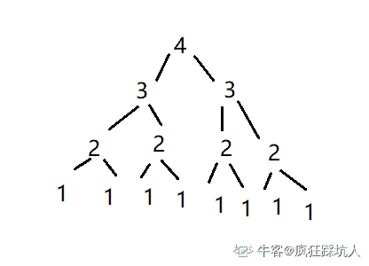
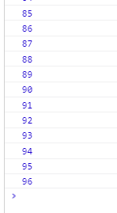

# 有赞 2019 校招前端笔试（第三批）

## 1

给定一个有序整数数组以及一个整数  ，请问在该数组中查找比  大的最小元素的最优算法时间复杂度是多少？

正确答案: B   你的答案: 空 (错误)

本题知识点

前端工程师 有赞 2019

讨论

[流苏一一](https://www.nowcoder.com/profile/171911605)

*   二分法查找
*   找到 k 后，k 右边的就是要找的
*   二分法的时间复杂度是 O(log n)
*   最后再加一，但是这个会忽略掉

发表于 2020-02-12 11:05:23

* * *

[learner111111](https://www.nowcoder.com/profile/970262031)

用类二分查找法，让查找出来的 k 是（如果有重复）所有重复 k 中的最右边的一个，再右移一位即为比 k 大的最小元素。

编辑于 2018-12-17 18:26:56

* * *

## 2

以下哪个排序算法对只有一两个元素乱序的数组排序性能最好？

正确答案: D   你的答案: 空 (错误)

```cpp
快速排序
```

```cpp
堆排序
```

```cpp
归并排序
```

```cpp
插入排序
```

本题知识点

前端工程师 有赞 2019

讨论

[learner111111](https://www.nowcoder.com/profile/970262031)

基本有序的情况下上述排序中插入排序性能最好。

发表于 2018-12-17 18:27:30

* * *

[流苏一一](https://www.nowcoder.com/profile/171911605)

希尔排序就是让一个序列变得基本有序，最后进行直接插入排序，提升很明显

发表于 2020-02-12 16:30:15

* * *

## 3

有 8 个完全相同的硬币，其中只有一个硬币比其他 7 个重，给你一个没有刻度的天平，请问最少需要称多少次才能找到重的那个硬币？

正确答案: A   你的答案: 空 (错误)

```cpp
2
```

```cpp
3
```

```cpp
4
```

```cpp
5
```

本题知识点

前端工程师 有赞 2019

讨论

[森寒](https://www.nowcoder.com/profile/198445232)

是 2 次，之前有的定型思维了，一共 8 枚硬币，先分成 3，3，2.两个 3 枚硬币的堆进行称重，如果同等重量，则再秤一次就可以找到；如果重量不等，那么找到重的一堆中的 3 个随机取两个去秤重，3 枚硬币那个重就能分辨出来了。

发表于 2018-12-12 20:32:00

* * *

[风海洋](https://www.nowcoder.com/profile/784097590)

这题出的非常不严谨，题目只说了 8 个完全相同的硬币，并没有说这八枚硬币中除了最重的那枚外其余七枚的重量一样，如果按照 3 3 2 是不可能得出结果的

发表于 2020-09-11 09:37:45

* * *

[自渡 20190214221282](https://www.nowcoder.com/profile/958046393)

也没说其他 7 个一样重啊

发表于 2019-10-29 14:48:50

* * *

## 4

数组的  元素是指比它右边所有元素都大的元素，请问查找数组中所有  元素的最优算法时间复杂度是多少？

正确答案: B   你的答案: 空 (错误)

本题知识点

前端工程师 有赞 2019

讨论

[learner111111](https://www.nowcoder.com/profile/970262031)

只需遍历一边数组即可。从右向左遍历，每遍历出来一个 leader，存下这个数，后续数只需与这个 leader 比较即可，直到有新的 leader 产生。

发表于 2018-12-17 18:29:46

* * *

[钟迎](https://www.nowcoder.com/profile/98825441)

时间复杂度的算法是什么？

发表于 2018-12-12 15:43:36

* * *

## 5

给定以下哪些遍历结果可以重建出 BST？

正确答案: C D   你的答案: 空 (错误)

```cpp
先序、中序、后序中的任意一个
```

```cpp
先序或者后序中的一个
```

```cpp
先序和中序两个
```

```cpp
先序和后序两个
```

本题知识点

前端工程师 有赞 2019

讨论

[learner111111](https://www.nowcoder.com/profile/970262031)

由于题目说的是重建出来二叉搜索树，所以前序遍历（中左右），后续遍历（左右中）都可唯一确定一个 BST（可通过顺序判断左右子树），而中序遍历（左右中）排序出来是顺序排序，无法重建树。

发表于 2018-12-17 18:39:18

* * *

[疯狂踩坑人](https://www.nowcoder.com/profile/151495209)

关于 D 选项，如果是一般二叉树是不能的，因为左右子树此时是无法区分的。但在 BST 中，左子树都小于右子树，则可以区分出左右子树，故可建成排序二叉树。

发表于 2021-04-04 14:49:24

* * *

## 6

请问下面这个函数的时间复杂度是多少（假设 ）？

```cpp
function fn(n)
{
   if (n === 1)
     return 1;
   else
     return fn(n-1) + fn(n-1);
}
```

正确答案: D   你的答案: 空 (错误)

本题知识点

前端工程师 有赞 2019

讨论

[learner111111](https://www.nowcoder.com/profile/970262031)

要是变成 2*fn（n-1）就是 O（n）的时间复杂度了。

发表于 2018-12-17 18:49:17

* * *

[疯狂踩坑人](https://www.nowcoder.com/profile/151495209)

这里值得注意的是，里面有两个递归，是先执行第一个递归再执行后一个，故过程就是遍历这个树，复杂度为 2^n

发表于 2021-04-04 14:54:13

* * *

[撒欢的烤包子](https://www.nowcoder.com/profile/387441769)

怎么算的?

发表于 2019-09-03 17:47:33

* * *

## 7

关于下面这段 JavaScript 代码说法正确的是

```cpp
var i = 0;
(function fn() {
  console.log(i++);
  setTimeout(fn, 1000);
})();
```

正确答案: C   你的答案: 空 (错误)

```cpp
 是个递归函数
```

```cpp
 每隔一秒累加一次
```

```cpp
这段代码不会终止
```

```cpp
这段代码运行一定时间之后会导致栈溢出
```

本题知识点

前端工程师 有赞 2019

讨论

[法克瓜](https://www.nowcoder.com/profile/598273059)

每个立即执行函数拥有单独的作用域

发表于 2019-02-09 00:22:43

* * *

[ジ遥望远方ヅ](https://www.nowcoder.com/profile/737773278)

i 是从开始自增 1 过后，就每隔 1 秒自增 1

发表于 2019-09-16 23:34:28

* * *

[米呀米柤米子哈](https://www.nowcoder.com/profile/474490155)

那为什么不会导致栈溢出呢

发表于 2019-09-06 17:05:18

* * *

## 8

假设实现了一个归并排序（merge sort），这个实现在最坏情况下需要 30 秒的时间来处理一个长度为 64 的输入。请问该实现在 6 分钟内可以处理的最大输入长度最接近多少？

正确答案: B   你的答案: 空 (错误)

```cpp
256
```

```cpp
512
```

```cpp
1024
```

```cpp
2048
```

本题知识点

前端工程师 有赞 2019

讨论

[learner111111](https://www.nowcoder.com/profile/970262031)

设常数是 x。已知时间复杂度为 nlog（n），所以 x*nlog（n）=0.5min，n=64。将求得的 x 带入 x*nlog（n）=6 得 n 大概为 512。

发表于 2018-12-17 18:43:21

* * *

## 9

在有 100 个元素的数组中找出其中最大的以及最小的元素所需的最少比较次数是多少次？

正确答案: C   你的答案: 空 (错误)

```cpp
145
```

```cpp
146
```

```cpp
148
```

```cpp
150
```

本题知识点

前端工程师 有赞 2019

讨论

[Niuke_Li](https://www.nowcoder.com/profile/564242325)

参考[learner111111](https://www.nowcoder.com/profile/970262031)的答案, 第一次对 100 个数字两两比较,用了 50 次得到 { 较大的 50 数字 } , { 较小的 50 个数字 } , 在分别对着两个数组求最大值/最小值, 所以共需 50+49+49 = 148 次.

发表于 2018-12-19 18:38:22

* * *

[猴哥了不得](https://www.nowcoder.com/profile/8036076)

1+（100-2）+（100-2）/2=148。先取出两个元素，比较 1 次，较大的为 max，较小的为 min:之后的（100-2）个元素，每个与 max 和 min 比较。如果需要比较的元素比 max 大，或者比 min 小，则只需要比较一次，共比较（100-2）次；如果需要比较的元素比 max 小，则需再次与 min 比较。出现这种情况的概率为 0.5，所以需比较（100-2）/2 次；

发表于 2018-12-13 10:55:26

* * *

[learner111111](https://www.nowcoder.com/profile/970262031)

第一次先一直对半比较得到最大值，记得存储第一次比较之后的 50 个较小值（里面一定有最小值）。所以第一次用了 99 次比较出来了最大值。第二次从事先存储的 50 个比较最小值，比较 49 次后可得最小值。故最优方法的比较次数为 99+49=148 次。

编辑于 2018-12-20 08:49:37

* * *

## 10

关于 HTTP 的说法正确的是

正确答案: A D   你的答案: 空 (错误)

```cpp
状态码 301 表示永久重定向，状态码 302 表示临时重定向
```

```cpp
因为 HTTP 协议是无状态协议，所以每个 HTTP 请求/应答客户端和服务器都要新建一个连接，完成之后立即断开连接
```

```cpp
检测请求的 Referer 可以用来抵御 CSRF 攻击
```

```cpp
Node.js 发起的 HTTP 请求不存在跨域限制
```

本题知识点

前端工程师 有赞 2019

讨论

[ジ遥望远方ヅ](https://www.nowcoder.com/profile/737773278)

后端不存在跨域问题， Referer 可以检测到 CSRF 攻击，而不会去抵御 CSRF 攻击。

发表于 2019-09-16 23:28:31

* * *

## 11

请使用一个固定长度的数组实现 3 个独立的栈，这三个栈都可以独立使用。要求除了这个数组之外只使用 O(1) 的空间，并且数组的空间利用率在各种情况下都应该尽可能的高。请详细说明如何实现 和  这两个函数。参数  用来表示要操作哪个栈，三个栈编号 0，1，2。

```cpp
function push<T> (arr: T[], stackId: number, elem: T): boolean
入栈，成功返回 true，失败返回 false
```

```cpp
function pop<T> (arr: T[], stackId: number): T | null
出栈，成功返回栈顶元素，栈空则返回 null
```

你的答案

本题知识点

前端工程师 有赞 2019

## 12

在一座荒岛上有三种变色龙，分别是 12 只棕色，15 只灰色以及 16 只黑色。当两只不同颜色的变色龙相遇时他们会同时变色为另外一种颜色，例如当 1 只棕色和 1 只灰色的变色龙相遇时他们会同时变成黑色的。请问这个荒岛上这些变色龙可能全部变成同一种颜色吗？请详细说明你的分析过程。

你的答案

本题知识点

前端工程师 有赞 2019

讨论

[灵魂治愈](https://www.nowcoder.com/profile/918272373)

1 黑 1 灰变 2 棕，此时有 12+2 棕，15-1 灰，16-1 黑。14 棕 14 灰变 28 黑，全黑。

发表于 2018-12-12 01:32:21

* * *

[yuroRain](https://www.nowcoder.com/profile/937651931)

充分条件：其中两种的数量恰好相等 1\.1 只黑色与 1 只灰色相遇，变成 2 只棕色棕色总数 = 12 + 2 = 142\.现在：棕色总数 = 14 灰色总数= 14 棕和灰一一相遇，全部变成黑色

发表于 2020-08-18 19:56:08

* * *

[热心市民张伟楼下刘大爷的外甥](https://www.nowcoder.com/profile/1230481)

12 棕色 + 2x15 灰色 -x16 黑色 -x 分别标记 a b cabc 三者轮流交换 while(1){  a+2x == b-x || a+2x==c-x ;OK!}or not //优化 升序排序 

发表于 2020-01-15 16:18:10

* * *