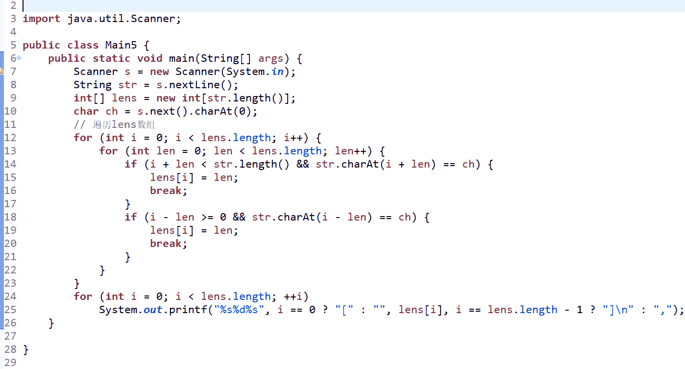

# 乐信 2019 校园招聘后台开发工程师笔试题

## 1

IP 协议是无连接的，其信息传输方式是(  )

正确答案: C   你的答案: 空 (错误)

```cpp
点对点
```

```cpp
广播
```

```cpp
数据报
```

```cpp
虚电路
```

本题知识点

产品运营 乐信 Java 工程师 C++工程师 2019

讨论

[星儿 123](https://www.nowcoder.com/profile/915449076)

ip 协议传输层有两种传输方式：udp,tcp 其中：udp 协议特点：无连接，不可靠，面向数据报 tcp 协议特点：面向连接，可靠传输，面向字节流

发表于 2018-12-15 20:09:40

* * *

[愚人五个字](https://www.nowcoder.com/profile/963871720)

IP 协议是在[网络层](https://www.baidu.com/s?wd=%E7%BD%91%E7%BB%9C%E5%B1%82&tn=SE_PcZhidaonwhc_ngpagmjz&rsv_dl=gh_pc_zhidao)的协议，但每一层封装后的数据都可以称作数据报，参考 https://blog.csdn.net/qq_22771739/article/details/85919240

编辑于 2019-01-06 11:55:04

* * *

[youngPeng](https://www.nowcoder.com/profile/226251611)

IP 协议是在[网络层](https://www.baidu.com/s?wd=%E7%BD%91%E7%BB%9C%E5%B1%82&tn=SE_PcZhidaonwhc_ngpagmjz&rsv_dl=gh_pc_zhidao)的协议.它主要完成数据包的发送作用.提供无连接的、尽力的、不可靠的[数据报](https://www.baidu.com/s?wd=%E6%95%B0%E6%8D%AE%E6%8A%A5&tn=SE_PcZhidaonwhc_ngpagmjz&rsv_dl=gh_pc_zhidao)投递服务。

发表于 2018-12-17 23:10:56

* * *

## 2

某用户无法访问域名为 www.fenqile.com 的服务器，此时使用 ping 命令按照该服务器的 IP 地址进行测试，发现响应正常。但是按照服务器域名进行测试，发现超时。此时可能出现的问题是

正确答案: B   你的答案: 空 (错误)

```cpp
线路故障
```

```cpp
域名解析故障
```

```cpp
路由故障
```

```cpp
服务器网卡故障
```

本题知识点

产品运营 乐信 Java 工程师 C++工程师 2019

讨论

[Chameleons](https://www.nowcoder.com/profile/263615503)

通过题目描述可以看出，对该服务器的 IP 地址进行测试，响应正常，所以不可能是线路故障、路由故障、服务器网卡故障；又因为对服务器域名进行 Ping 操作时出现超时错误，故可判断故障为域名解析故障。
[`wenku.baidu.com/view/7c8b1c7df4335a8102d276a20029bd64783e62ee.html`](https://wenku.baidu.com/view/7c8b1c7df4335a8102d276a20029bd64783e62ee.html)

发表于 2020-12-16 14:15:57

* * *

[涸辙之鱼 201812122013981](https://www.nowcoder.com/profile/888977632)

ping 命令其实就是访问 除了域名解析错 其他三个不靠谱 只要发生 ping 命令也不能访问到 

发表于 2018-12-17 09:24:20

* * *

## 3

在一个具有 n 个结点的有序单链表中插入一个新结点并仍然保持有序的时间复杂度是

正确答案: B   你的答案: 空 (错误)

```cpp
O(1)
```

```cpp
O(n)
```

```cpp
O(n2)
```

```cpp
O(nlog<sub>2</sub>n)
```

本题知识点

产品运营 乐信 Java 工程师 C++工程师 乐信 Java 工程师 C++工程师 乐信 2019

讨论

[漫步在浩瀚星空](https://www.nowcoder.com/profile/4080587)

链表的操作，只对表头进行操作是 O(1)，其他任意位置都是 O(n)

发表于 2018-12-22 14:07:45

* * *

[涸辙之鱼 201812122013981](https://www.nowcoder.com/profile/888977632)

时间复杂度 既然要在任意地方插入值 这个复杂度一定是 N 也就是尝试次数

发表于 2018-12-17 09:25:27

* * *

## 4

一个进程被唤醒意味着

正确答案: A   你的答案: 空 (错误)

```cpp
进程变为就绪状态
```

```cpp
该进程重新占有了 CPU
```

```cpp
它的优先权变为最大
```

```cpp
其 PCB 移至等待队列队首
```

本题知识点

产品运营 乐信 Java 工程师 C++工程师 乐信 Java 工程师 C++工程师 乐信 2019

讨论

[漫步在浩瀚星空](https://www.nowcoder.com/profile/4080587)

进程被唤醒是进入就绪队列。是否插入到就绪队列的什么地方，取决于就绪的管理方法和进程调度的算法。如果进程调度是最高优先数优先，该进程按优先数插入该队列中；如果该队列是按到达的先后次序排列的，则按到达的先后插入。

发表于 2018-12-22 14:08:58

* * *

[youngPeng](https://www.nowcoder.com/profile/226251611)

选 C 进程的睡眠状态也就是阻塞状态进程被唤醒之后就可以等待自己时间片的到来，当时间片到了之后就变成了执行状态才能分到 cpu

发表于 2018-12-17 23:14:20

* * *

## 5

以下代码段中循环执行的次数是（）

```cpp
int k = 0;
do {
    ++k;
} while(k < 1);
```

正确答案: C   你的答案: 空 (错误)

```cpp
一次也不执行
```

```cpp
无限次
```

```cpp
执行 1 次
```

```cpp
有语法错误，不能执行
```

本题知识点

乐信 C++工程师 C++ C 语言 2019

讨论

[不想白活](https://www.nowcoder.com/profile/86085147)

先执行 do 里面的，k+1 所以 k=1while 条件是 k<1，这时 k 已经是 1 了，1<1 不成立，所以循环退出，所以只执行一次。

发表于 2020-08-24 16:44:04

* * *

[未来赚大钱的我](https://www.nowcoder.com/profile/895719776)

++是先自增在引用

发表于 2021-08-08 00:59:50

* * *

[Juventus-🐂](https://www.nowcoder.com/profile/79434593)

do while 先执行循环体，即至少执行一次

发表于 2022-01-25 14:09:44

* * *

## 6

欲构造 ArrayList 类的一个实例，此类继承了 List 接口，下列哪个方法是正确的

正确答案: D   你的答案: 空 (错误)

```cpp
ArrayList myList = new Object()
```

```cpp
ArrayList myList = new List()
```

```cpp
List myList = new List()
```

```cpp
List myList = new ArrayList()
```

本题知识点

产品运营 乐信 Java 工程师 C++工程师 乐信 Java 工程师 C++工程师 乐信 2019

讨论

[涸辙之鱼 201812122013981](https://www.nowcoder.com/profile/888977632)

A 左父右子不满足 B 左接右实现不满足 C 接口不能 new 接口不能 new 实例化对象  So D

发表于 2018-12-17 09:28:26

* * *

## 7

给定一个字符串 str，和一个字母 ch，请实现相应的代码求出一个数组，使数组中每个数字表示该位置与字母 ch 之间的最短距离。
比如 str=”lexinfintech”  ch=”i”
则输出为：[3,2,1,0,1,1,0,1,2,3,4,5]

本题知识点

产品运营 乐信 Java 工程师 C++工程师 字符串 *模拟 贪心 2019* *讨论

[Fishar](https://www.nowcoder.com/profile/432979348)

```cpp

	s = input()
ch = input()
l = len(s)
re = []
for i in range(l):
    if s[i] == ch:
        re.append(i)
relist = []
if re is None:
    print([l for i in range(l)])
else:
    for i in range(l):
        minVal = l
        for j in re:
            if abs(i - j) < minVal:
                minVal = abs(i - j)
        relist.append(minVal)
    print(str(relist).replace(' ',''),end='')

```

编辑于 2019-06-28 23:29:45

* * *

[丧心病狂码字的黄家公子](https://www.nowcoder.com/profile/9073355)

```cpp
import java.util.Arrays;
import java.util.Scanner;
public class Main {
    public static void main(String[] args) {
        Scanner scanner = new Scanner(System.in);
        String str = scanner.nextLine();
        String c = scanner.nextLine();
        int[] res = process(str, c.charAt(0));
        int i = 0;
        System.out.print("[");
        for (i = 0; i < res.length - 1; i++){ 
            System.out.print(res[i] + ",");
        }
        System.out.print(res[i] + "]");

    }
    public static int[] process(String S, char C) {
        if (null == S || 0 == S.length()) {
            return null;
        }
        int N = S.length();
        int[] ans = new int[N];
        int prev = Integer.MIN_VALUE / 2;
        for (int i = 0; i < N; ++i) {
            if (S.charAt(i) == C) prev = i;
            ans[i] = i - prev;
        }
        prev = Integer.MAX_VALUE / 2;
        for (int i = N-1; i >= 0; --i) {
            if (S.charAt(i) == C) prev = i;
            ans[i] = Math.min(ans[i], prev - i);
        }
        return ans;
    }
}

```

如果直接用 Arrays.toString()输出，格式上通不过全部用例，直接输出能通过。用栈实现：

```cpp
import java.util.Stack;
import java.util.Arrays;
import java.util.Scanner;
public class Main {
    public static void main(String[] args) {
        Scanner scanner = new Scanner(System.in);
        String str = scanner.nextLine();
        String c = scanner.nextLine();
        int[] res = process(str, c.charAt(0));
        int i = 0;
        System.out.print("[");
        for (i = 0; i < res.length - 1; i++){ 
            System.out.print(res[i] + ",");
        }
        System.out.print(res[i] + "]");

    }
    public static int[] process(String str, char c) {
        if (null == str || 0 == str.length()) {
            return null;
        }
        int n = str.length();
        int[] res = new int[n];
        Pair[] pairs = new Pair[n];
        Stack<Pair> stack = new Stack<>();
        for (int i = 0; i < n; i++) {
            char temp = str.charAt(i);
            pairs[i] = new Pair(temp);
            if (temp != c) {
                if (!stack.isEmpty()) {
                    if (stack.peek().word == c) {
                        pairs[i].distance = 1;
                    } else {
                        pairs[i].distance = stack.peek().distance > 0 ? stack.peek().distance + 1 : 0;
                    }
                }
                stack.add(pairs[i]);
            } else if (temp == c){
                if (!stack.isEmpty()) {
                    int k = 1;
                    while (!stack.isEmpty() && stack.peek().word != c) {
                        Pair pair = stack.pop();
                        pair.distance = pair.distance > 0 ? Math.min(pair.distance, k++) : k++;
                    }
                }
                stack.add(pairs[i]);
            }
        }
        for (int i = 0; i < n; i++) {
            res[i] = pairs[i].distance;
        }
        return res;
    }
}
class Pair {
    char word;
    int distance;
    public Pair(char word) {
        this.word = word;
        this.distance = 0;
}
}

```

编辑于 2019-01-06 18:23:00

* * *

[愚人五个字](https://www.nowcoder.com/profile/963871720)



发表于 2019-01-06 16:59:19

* * *

## 8

下面哪些协议是传输层的

正确答案: C D   你的答案: 空 (错误)

```cpp
IP
```

```cpp
ARP
```

```cpp
TCP
```

```cpp
UDP
```

本题知识点

产品运营 乐信 Java 工程师 C++工程师 2019

讨论

[摆码王子](https://www.nowcoder.com/profile/6154441)

OSI 中的层 功能 TCP/IP 协议族 应用层 文件传输，电子邮件，文件服务，虚拟终端 TFTP，HTTP，SNMP，FTP，SMTP，DNS，Telnet 表示层 数据格式化，代码转换，数据加密 没有协议 会话层 解除或建立与别的接点的联系 没有协议 传输层 提供端对端的接口 TCP，UDP 网络层 为数据包选择路由 IP，ICMP，RIP，OSPF，BGP，IGMP 数据链路层 传输有地址的帧以及错误检测功能 SLIP，CSLIP，PPP，ARP，RARP，MTU 物理层 以二进制数据形式在物理媒体上传输数据 ISO2110，IEEE802。IEEE802.2

发表于 2018-12-16 17:15:37

* * *

## 9

输入一个字符串，请找出该字符串的包含的最长回文子字符串
比如，输入 babcd，输出 bab
输入 abbc，输出 bb

本题知识点

产品运营 乐信 Java 工程师 C++工程师 字符串 *模拟 2019* *讨论

[腹黑 gg](https://www.nowcoder.com/profile/7970791)

```cpp

		//Manacher 算法，参考：https://segmentfault.com/a/1190000008484167

		#include<bits/stdc++.h>

		usingnamespacestd;

		intmain()

		{

		    string s;

		    while(cin >> s)

		    {

		        string t ="$#";

		        for(inti = 0; i < s.size(); i++)

		        {

		            t += s[i];

		            t +="#";

		        }

		        vector<int> p(t.size());

		        p[0] = 0;

		        intid = 0, mx = 0, resid = 0, resmx = 0;

		        for(inti = 1; i < t.size(); i++)

		        {

		            p[i] = i < mx ? p[2 * id - i] : 1;

		            while(t[i + p[i]] == t[i - p[i]])

		                p[i]++;

		            if(p[i] + 1>mx)

		            {

		                mx = p[i] + 1;

		                id = i;

		            }

		            if(p[i] > resmx)

		            {

		                resmx = p[i];

		                resid = i;

		            }

		        }

		        cout << s.substr((resid - resmx) / 2, resmx - 1) << endl;

		    }

		    system("pause");

		    return0;

		}

```

发表于 2018-12-19 13:11:20

* * *

[波罗的（di）海](https://www.nowcoder.com/profile/30960212)

```cpp

	#include <iostream>

	#include <string>

	#include <vector>

	#include <algorithm>

	usingnamespacestd;

	intmain(){

	    string str="";

	    string hui="";

	    intbefore=0;

	    cin>>str;

	    intlen=str.size();

	    for(intx=0;x<len;x++){

	        intsum1=0,move1=0,f=0;

	        while((x-move1>=0)&&(x+move1<len)&&str[x-move1]==str[x+move1]){

	            sum1+=2;

	            move1++;

	            f=1;

	        }

	        if(f){

	            sum1--;

	        }

	        intsum2=0,move2=0;

	        while((x-move2>=0)&&(x+move2+1<len)&&str[x-move2]==str[x+1+move2]){

	            sum2+=2;

	            move2++;

	        }

	        if(sum1>sum2){

	            if(before<sum1){

	                hui=str.substr(x-move1+1,2*move1-1);

	                before=sum1;

	            }

	        }

	        else{

	            if(before<sum2){

	                hui=str.substr(x-move2+1,2*move2);

	                before=sum2;

	            }

	        }

	    }

	    cout<<hui;

	    return0;

	}

```

发表于 2018-12-20 12:37:55

* * *

[林某人](https://www.nowcoder.com/profile/733425463)

动态规划方法--改进暴力全子串判断
状态方程：

>  表示字符串 s[i:j+1] 出是否为回文子串的判断，T or F

转态转移方程

> 
> 又考虑到，长度为 2 时的回文子串 超了范围，所以限定 j-2 > i
> 最终状态转移方程为：
> 

```cpp
s = input()
n = len(s)
if n <= 1:
    print(s)
else:
    p = [[False for _ in range(n)] for _ in range(n)]
    maxlen = 1
    maxsstr = s[0]
    for r in range(1,n):
        for l in range(r):
            if s[l] == s[r] and (r-l<=2 or p[l+1][r-1]):
                p[l][r] = True
                length = r - l +1
                if length > maxlen:
                    maxlen = length
                    maxsstr = s[l:r+1]
    print(maxsstr)
```

发表于 2019-09-15 00:45:58

* * *

## 10

Redis 的数据类型包括

正确答案: A B C D E   你的答案: 空 (错误)

```cpp
String
```

```cpp
List
```

```cpp
Set
```

```cpp
Hash
```

```cpp
Zset
```

```cpp
Hashmap
```

本题知识点

产品运营 乐信 Java 工程师 C++工程师 2019

讨论

[摆码王子](https://www.nowcoder.com/profile/6154441)

在 Redis 中有五种数据类型 String----------字符串 Hash------------字典 List-------------列表 Set--------------集合 Sorted Set------有序集合 一 数据类型 String—字符串 string 是 redis 最基本的类型，你可以理解成与 Mem***d 一模一样的类型，一个 key 对应一个 value。string 类型是二进制安全的。意思是 redis 的 string 可以包含任何数据。比如 jpg 图片或者序列化的对象 。string 类型是 Redis 最基本的数据类型，一个键最大能存储 512MB。 String 数据结构是简单的 key-value 类型，value 不仅可以是 String，也可以是数字（当数字类型用 Long 可以表示的时候 encoding 就是整型，其他都存储在 sdshdr 当做字符串）。使用 Strings 类型，可以完全实现目前 Mem***d 的功能，并且效率更高。还可以享受 Redis 的定时持久化（可以选择 RDB 模式或者 AOF 模式），操作日志及 Replication 等功能。除了提供与 Mem***d 一样的 get、set、incr、decr 等操作外，Redis 还提供了下面一些操作： 1.LEN：O(1)获取字符串长度 2.APPEND ：往字符串 append 内容，而且采用智能分配内存（每次 2 倍） 3.设置和获取字符串的某一段内容 4.设置及获取字符串的某一位（bit） 5.批量设置一系列字符串的内容 6.原子计数器 7.GET SET 命令的妙用，请于清空旧值的同时设置一个新值，配合原子计数器使用 Hash——字典(哈希) Hash 是一个健值对集合，是一个 String 类型的 key 与 value 的映射表，特别适合用于存储对象。 使用场景：存储、读取、修改用户属性 在 Mem***d 中，我们经常将一些结构化的信息打包成 hashmap，在客户端序列化后存储为一个字符串的值（一般是 JSON 格式），比如用户的昵称、年龄、性别、积分等。这时候在需要修改其中某一项时，通常需要将字符串（JSON）取出来，然后进行反序列化，修改某一项的值，再序列化成字符串（JSON）存储回去。简单修改一个属性就干这么多事情，消耗必定是很大的，也不适用于一些可能并发操作的场合（比如两个并发的操作都需要修改积分）。而 Redis 的 Hash 结构可以使你像在数据库中 Update 一个属性一样只修改某一项属性值。 List——列表 使用场景：微博 TimeLine、消息队列 List 说白了就是链表（redis 使用双端链表实现的 List），相信学过数据结构知识的人都应该能理解其结构。使用 List 结构，我们可以轻松地实现最新消息排行等功能（比如新浪微博的 TimeLine ）。List 的另一个应用就是消息队列，可以利用 List 的 *PUSH 操作，将任务存在 List 中，然后工作线程再用 POP 操作将任务取出进行执行。Redis 还提供了操作 List 中某一段元素的 API，你可以直接查询，删除 List 中某一段的元素 Set——集合 集合是通过哈希表实现的，所以添加，删除，查找的复杂度都是 O(1) 使用场景：1.共同好友、二度好友 2.利用唯一性，可以统计访问网站的所有独立 IP 3.好友推荐的时候，根据 tag 求交集，大于某个 threshold 就可以推荐 Set 就是一个集合，集合的概念就是一堆不重复值的组合。利用 Redis 提供的 Set 数据结构，可以存储一些集合性的数据。比如在微博应用中，可以将一个用户所有的关注人存在一个集合中，将其所有粉丝存在一个集合。因为 Redis 非常人性化的为集合提供了求交集、并集、差集等操作，那么就可以非常方便的实现如共同关注、共同喜好、二度好友等功能，对上面的所有集合操作，你还可以使用不同的命令选择将结果返回给客户端还是存集到一个新的集合中。 Sorted Set——有序集合 使用场景：1.带有权重的元素，比如一个游戏的用户得分排行榜 2.比较复杂的数据结构，一般用到的场景不算太多 和 Sets 相比，Sorted Sets 是将 Set 中的元素增加了一个权重参数 score，使得集合中的元素能够按 score 进行有序排列，比如一个存储全班同学成绩的 Sorted Sets，其集合 value 可以是同学的学号，而 score 就可以是其考试得分，这样在数据插入集合的时候，就已经进行了天然的排序。另外还可以用 Sorted Sets 来做带权重的队列，比如普通消息的 score 为 1，重要消息的 score 为 2，然后工作线程可以选择按 score 的倒序来获取工作任务。让重要的任务优先执行。 二 redis 其他功能使用场景 订阅-发布系统 Pub/Sub 从字面上理解就是发布（Publish）与订阅（Subscribe），在 Redis 中，你可以设定对某一个 key 值进行消息发布及消息订阅，当一个 key 值上进行了消息发布后，所有订阅它的客户端都会收到相应的消息。这一功能最明显的用法就是用作实时消息系统，比如普通的即时聊天，群聊等功能。 事务——Transactions 谁说 NoSQL 都不支持事务，虽然 Redis 的 Transactions 提供的并不是严格的 ACID 的事务（比如一串用 EXEC 提交执行的命令，在执行中服务器宕机，那么会有一部分命令执行了，剩下的没执行），但是这个 Transactions 还是提供了基本的命令打包执行的功能（在服务器不出问题的情况下，可以保证一连串的命令是顺序在一起执行的，中间不会有其它客户端命令***来执行）。Redis 还提供了一个 Watch 功能，你可以对一个 key 进行 Watch，然后再执行 Transactions，在这过程中，如果这个 Watched 的值进行了修改，那么这个 Transactions 会发现并拒绝执行。

发表于 2018-12-16 17:29:25

* * *

[方法腹股沟管](https://www.nowcoder.com/profile/166822977)

abcde

发表于 2019-09-16 14:10:11

* * *

## 11

linux 使用的进程间通信方式包括

正确答案: A B C E F   你的答案: 空 (错误)

```cpp
管道
```

```cpp
信号
```

```cpp
消息队列
```

```cpp
私有内存
```

```cpp
信号量
```

```cpp
套接字
```

本题知识点

产品运营 乐信 Java 工程师 C++工程师 2019

讨论

[腹黑 gg](https://www.nowcoder.com/profile/7970791)

1：匿名管道（pipe）2：命名管道（fifo）3：信号 4：信号量 5：消息队列 6：共享内存 7：套接字

发表于 2018-12-19 13:08:02

* * *

[Jerry 黄](https://www.nowcoder.com/profile/704432456)

除了 F、D 外其他都可以。

发表于 2019-01-19 18:25:19

* * *

## 12

下列哪个语句关于内存回收的说明是正确的

正确答案: B   你的答案: 空 (错误)

```cpp
程序员必须创建一个线程来释放内存
```

```cpp
内存回收程序负责释放无用内存
```

```cpp
内存回收程序允许程序员直接释放内存
```

```cpp
内存回收程序可以在指定的时间释放内存对象
```

本题知识点

产品运营 乐信 Java 工程师 C++工程师 浩鲸云 2020 2019

讨论

[柠檬精-.-](https://www.nowcoder.com/profile/103073577)

B 正确，A：有 GC 线程，无需创建 C：java 当中，内存的回收由 GC 完成，程序员不能直接释放内存，只能通过 System.gc()提醒 GC 进行垃圾回收，GC 不一定会回收 D；只能 System.gc()提醒，不能指定时间

发表于 2019-09-15 17:01:10

* * *

[胤泣](https://www.nowcoder.com/profile/85692392)

多选可以只选一个？

发表于 2022-03-15 18:29:58

* * *

[Java 后端练习生](https://www.nowcoder.com/profile/534037268)

B 正确，A：有 GC 线程，无需创建 C：java 当中，内存的回收由 GC 完成，程序员不能直接释放内存，只能通过 System.gc()提醒 GC 进行垃圾回收，GC 不一定会回收 D；只能 System.gc()提醒，不能指定时间

发表于 2021-04-15 13:05:48

* * *

## 13

```cpp
现有字符串 char[] text，实现函数 char[] drawChar(char[] text)，找出 text 中重复出现最多的字符，然后将该字符移到 text 的最前端，生成一个新的字符串。 假设重复出现最多的字符只有一个。请充分考虑内存和性能效率。 举例： “abcaba”，转换后成为“aaabcb”。
```

本题知识点

产品运营 乐信 Java 工程师 C++工程师 字符串 *模拟 2019* *讨论

[真的很想要一个 offer](https://www.nowcoder.com/profile/415226990)

| #include <iostream>usingnamespacestd;int main(){    inthash[256] = {0};    string str;    cin >> str;    charc;    intmax = 0;    for(inti = 0; i < str.size(); ++i){        ++hash[str[i] - 'a'];        if(hash[str[i] - 'a'] > max){            max = hash[str[i] - 'a'];            c = str[i];        }    }    inti = str.size();    intj = str.size() - 1;    while(j >= 0){        if(str[j] != c){            swap(str[--i], str[j--]);        }else{             --j;        }    }    cout << str << endl;    return0;} |

编辑于 2019-06-02 21:14:15

* * *

[Fishar](https://www.nowcoder.com/profile/432979348)

```cpp

	x =i nput()

	l = list(x)

	leng = 0

	dif=list(set(l))

	for ind,i in enumerate(dif):

	    num = x.count(i)

	    if num>leng:

	        leng =num

	        index =ind

	print("".join(leng*[dif[index]]+list(x.replace(dif[index],'')))

```

编辑于 2019-06-28 23:27:57

* * *

[落叶无痕 0](https://www.nowcoder.com/profile/3796948)

```cpp
import java.util.*;
public class Main {
    public static void main(String[] args) {
        Scanner sc = new Scanner(System.in);
        char ch[] = sc.nextLine().toCharArray();
        System.out.println(drawChar(ch));
    }

    public static char[] drawChar(char[] text) {
        Map<Character, Integer> map = new HashMap();
        for (int i = 0; i < text.length; i++) {
            if (!map.containsKey(text[i])) {
                map.put(text[i], 1);
            } else {
                int val = map.get(text[i]);
                map.put(text[i], ++val);
            }
        }
        int max = 0;
        char ch = '0';
        for (Map.Entry<Character, Integer> entry : map.entrySet()) {
            if (entry.getValue() > max) {
                max = entry.getValue();
                ch = entry.getKey();
            }
        }
        StringBuffer sb_head = new StringBuffer(), sb_foot = new StringBuffer();
        for (int i = 0; i < text.length; i++) {
            if (text[i] == ch) {
                sb_head.append(text[i]);
            } else {
                sb_foot.append(text[i]);
            }
        }
        sb_head.append(sb_foot);
        return sb_head.toString().toCharArray();
    }
} 
```

发表于 2019-03-04 21:27:20

* * ****