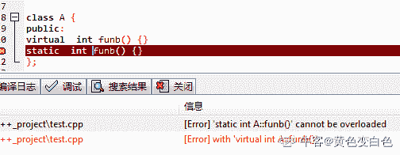
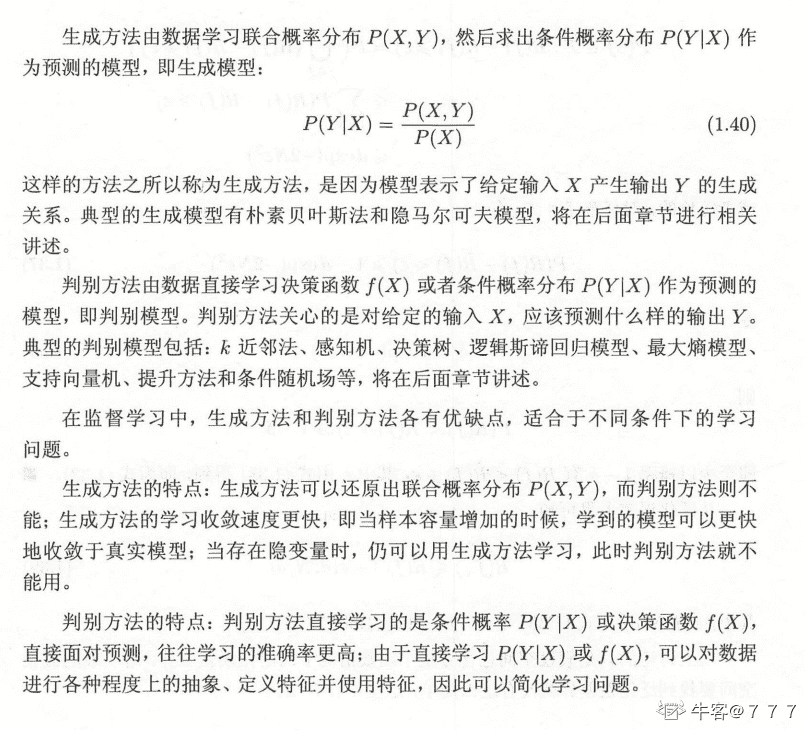
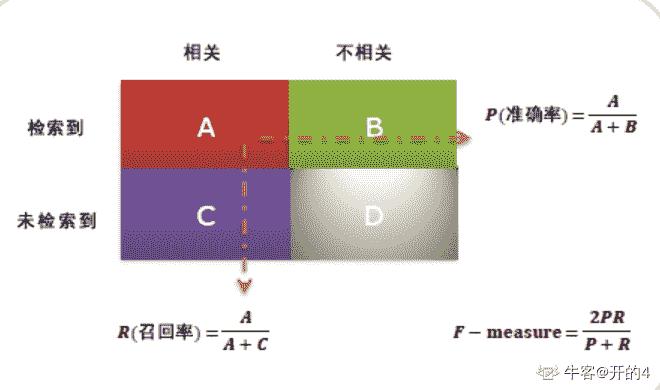
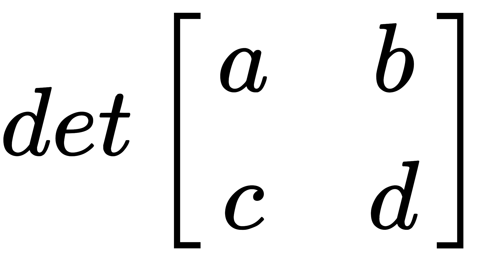
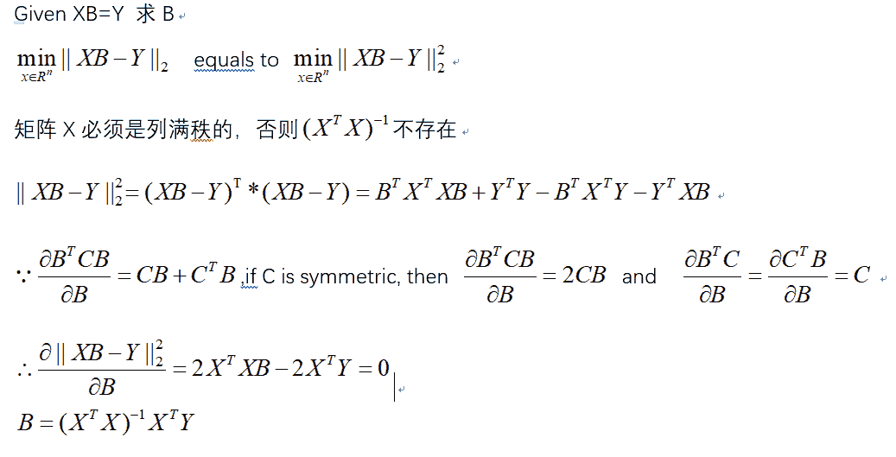

# vivo2019 校招图像算法工程师笔试题

## 1

下面有关 new/delete 和 malloc/free 的区别，描述错误的是（ ）

正确答案: D   你的答案: 空 (错误)

```cpp
malloc/free 是标准库函数，new/delete 是运算符
```

```cpp
new 初始化对象，调用对象的构造函数，malloc 仅仅分配内存
```

```cpp
new 返回的是所分配变量（对象）的指针，malloc 返回的是 void 指针
```

```cpp
new/delete 只能在 C++使用，malloc/free 只能在 C 中使用
```

本题知识点

算法工程师 vivo C++ 算法工程师 vivo 2019

讨论

[happinessBbo](https://www.nowcoder.com/profile/36801007)

在 C++中都可以使用

发表于 2019-03-02 19:51:41

* * *

## 2

以下描述正确的是（ ）？

正确答案: C   你的答案: 空 (错误)

```cpp
虚函数是可以内联的，可以减少函数调用的开销，提高效率
```

```cpp
类里面可以同时存在函数名和参数都一样的虚函数和静态函数
```

```cpp
父类的析构函数是非虚的，但是子类的析构函数是虚的，delete 子类对象指针会调用父类的析构函数
```

```cpp
选项都不对
```

本题知识点

算法工程师 vivo C++ 算法工程师 vivo 2019

讨论

[我的天鸭](https://www.nowcoder.com/profile/243498)

楼上回答的什么玩意，这题 C 选项和多态没有一毛钱关系，析构子类对象本来就会调用父类的析构函数，和父类或者子类析构函数虚不虚没有任何关系。

发表于 2019-08-27 19:15:35

* * *

[Glimmer_](https://www.nowcoder.com/profile/913919575)

选 C，删除子类后，会调用子类的析构函数，子类的析构函数是虚函数，因此往上寻找父类，调用了父类的析构函数

编辑于 2019-08-08 20:31:48

* * *

[黄色变白色](https://www.nowcoder.com/profile/8547911)

虚函数在运行时呈现的多态，如果虚函数是内联的话，编译器不清楚运行时调用什么代码。同一个类不可能同时存在函数名和参数都一样的虚函数和静态函数。 
 发表于 2020-04-22 13:48:28

* * *

## 3

以下描述正确的是（ ）？

正确答案: C   你的答案: 空 (错误)

```cpp
while 循环语句的循环体至少执行 1 次
```

```cpp
do-while 循环可以写成 while 循环的格式
```

```cpp
continue 语句可以出现在各种循环体中
```

```cpp
break 语句不可以出现在循环体内
```

本题知识点

算法工程师 vivo C++ Java 算法工程师 vivo 2019

讨论

[心十](https://www.nowcoder.com/profile/410810172)

A 不对：int n=1; while(n>1){}一次不执行 B 不对：int n=1;do{System.out.println("Hello");n++;}while(n<1);换成 int n=1;while(n<1) { System.out.println("Hello"); n++;}执行结果不一样，显然不能替换。C 正确:不对的原因可能是出题人将 switch 当成循环了。D 明显不对

编辑于 2019-08-25 11:09:45

* * *

[alonetj](https://www.nowcoder.com/profile/43372448)

今天就算是 java 之父来了，也必须是 C

发表于 2019-09-29 17:25:53

* * *

[NoOfferException](https://www.nowcoder.com/profile/1554976)

```cpp
do{
    System.out.println(new B().getValue());
}while(false)

while(false){
    System.out.println(new B().getValue());
}
// 这 TM 能一样吗？B 吗？
```

发表于 2019-09-11 17:25:06

* * *

## 4

使用 char* p = new char[100]申请一段内存，然后使用 delete p 释放，有什么问题（ ）？

正确答案: A   你的答案: 空 (错误)

```cpp
不会有内存泄露，但不建议用
```

```cpp
会有内存泄露
```

```cpp
编译就会报错，必须使用 delete [] p
```

```cpp
编译没问题，运行会直接崩溃
```

本题知识点

算法工程师 vivo C++ 2019

讨论

[AiA-Chen](https://www.nowcoder.com/profile/77660091)

基本类型的对象没有析构函数，因此回收基本类型的数组空间用 delete 和 delete[]都可以，但为了规范，不建议用 delete。

发表于 2019-06-04 18:52:03

* * *

[杉杉来啦](https://www.nowcoder.com/profile/243827773)

基本类型的对象没有析构函数，因此回收基本类型的数组空间用 delete 和 delete[]都可以，但为了规范，不建议用 delete。但自定义的对象由析构函数发起回收，所以每一个对象都要调用一次 delete，所以才有有 new[]对应 delete[]。**直接声明的对象，比如 shape a，即在栈上面的对象，所在作用域结束后，会自动执行析构函数，而 new 出来的在堆上的对象，不调用 delete，即使它所在的作用域已经结束，也不会调用析构函数**

**delete 详解**：首先调用析构函数，完成类成员的释放，比如类成员有 vector 也指向了堆上的内存，就需要在析构函数中同样使用 delete 释放这块内存，或者说它自身处于一个容器当中，就需要在这个容器中 erase 它

然后再 free 掉整个对象的内存；

delete b 过后，b 仍然指向改内存，即地址不变，但指针可能为悬垂指针，访问它可能带来意想不到的结果，也可能正确访问，不确定，所以建议 delete 后，把指针设置成 NULL，后面也可根据指针是否为 NULL 判断是否可用

编辑于 2020-03-12 17:03:47

* * *

[翻红的番茄](https://www.nowcoder.com/profile/809140863)

基本类型的指针释放由内存直接执行，所以 delete 和 delete[]都能表达回收内存的意思。但自定义的对象由析构函数发起回收，所以每一个对象都要调用一次 delete，所以才有有 new[]对应 delete[]。

发表于 2020-03-12 15:23:53

* * *

## 5

在 C 语言中，关于静态变量的说法，正确的是（）

正确答案: B   你的答案: 空 (错误)

```cpp
静态变量和常量的作用相同
```

```cpp
函数中的静态变量,在函数退出后不被释放
```

```cpp
静态变量只可以赋值一次,赋值后则不能改变
```

```cpp
静态全局变量的作用域为一个程序的所有源文件
```

本题知识点

算法工程师 vivo C++ 2019 C 语言

讨论

[飞翔的企鹅 3550771168](https://www.nowcoder.com/profile/393747266)

B 选项不严谨，主函数退出会释放

发表于 2020-04-16 20:44:42

* * *

[菜是原罪，难是帮凶ಥ_ಥ](https://www.nowcoder.com/profile/431732435)

作用域为当前文件，从定义/声明位置到文件结尾。动态全局变量可以通过 extern 关键字在外部文件中使用，但静态全局变量不可以在外部文件中使用。静态全局变量相当于限制了动态全局变量的作用域。

发表于 2019-02-21 15:57:44

* * *

[Copyright](https://www.nowcoder.com/profile/6805252)

A.不一样，常量的作用域可以是整个工程，而静态全局变量的作用域只能在其定义的源文件 C.静态变量的值是可以改变的 D.同 A

发表于 2020-02-14 14:27:10

* * *

## 6

有如下一段程序：

```cpp
int f1(float);
int f2(char);
void f3(float);
int (*pf)(float);
```

以下语句合法的是（）

正确答案: A   你的答案: 空 (错误)

```cpp
int (*p)(float)=&f1;
```

```cpp
pf=&f2;
```

```cpp
pf=&f3;
```

```cpp
pf=f3;
```

本题知识点

算法工程师 vivo C++ 2019 C 语言

讨论

[在北极开出租](https://www.nowcoder.com/profile/731407930)

&amp;是啥东西

发表于 2020-03-02 16:03:28

* * *

[继续加油辣](https://www.nowcoder.com/profile/478949840)

C。函数指针变量：函数指针变量的声明方法为：

**返回值类型 ( * 指针变量名) ([形参列表]);**
根据定义，

int(*pf)(float);
int (*p)(float)=&f1;
pf,p 都是函数指针变量。

函数地址 ：在编译时，每一个函数都有一个入口地址，该入口地址就是函数指针所指向的地址。**函数地址的获取，****可以是函数名，也可以在函数名前加取地址符& 。**

C 错误是因为函数形参类型不匹配。

函数指针所指向的函数，返回值类型，形参列表必须完全匹配，对函数指针赋值可以采用以下方式 pf＝&p1 或者 pf＝p1 

发表于 2020-02-15 16:48:47

* * *

[½20191015162596](https://www.nowcoder.com/profile/357229395)

int (*pf)(float )表示定义了一个返回值为 int，参数为 float 型的函数指针，要想调用他就必须满足返回值和参数类型匹配。至于&amp;f1;==&f1.

发表于 2019-11-28 16:52:21

* * *

## 7

设某棵二叉树的中序遍历序列为 ABCD，前序遍历序列为 CABD，则后序遍历该二叉树得到序列为（ ）？

正确答案: A   你的答案: 空 (错误)

```cpp
BADC
```

```cpp
BCDA
```

```cpp
CDAB
```

```cpp
CBDA
```

本题知识点

算法工程师 vivo 树 算法工程师 vivo 2019

讨论

[铁汁](https://www.nowcoder.com/profile/6478245)

                                                        C                                                   /          \
                                               A               D                                                   \
                                                    B     

发表于 2019-02-03 10:39:29

* * *

[holochain](https://www.nowcoder.com/profile/91282611)

1

发表于 2019-02-02 20:50:11

* * *

## 8

快速排序的平均时间复杂度为（ ）？

正确答案: B   你的答案: 空 (错误)

```cpp
O(n)
```

```cpp
O(nlog(n))
```

```cpp
O(log(n))
```

```cpp
O(n²)
```

本题知识点

排序 *讨论

[已注销](https://www.nowcoder.com/profile/364277192)

快排的平均时间复杂度 nlogn

发表于 2020-04-22 00:01:09

* * *

## 9

设查找表中有 100 个元素，如果用二分法查找方法查找数据元素 X，则最多需要比较（ ）次就可以断定数据元素 X 是否在查找表中。

正确答案: C   你的答案: 空 (错误)

```cpp
5
```

```cpp
6
```

```cpp
7
```

```cpp
8
```

本题知识点

查找 *讨论

[白起丶](https://www.nowcoder.com/profile/815173790)

用二分查找法查找某个数据，最多需要比较(logn)+1 次，注意**这里的对数函数是以 2 为底，并且是向下取整**。 

发表于 2020-07-10 11:33:28

* * *

[mickeymoon](https://www.nowcoder.com/profile/122755030)

用二分查找法查找某个数据，最多需要比较(logn)+1 次

发表于 2019-05-24 19:33:53

* * *

[LanceEdward-](https://www.nowcoder.com/profile/35798282)

 ⌈log2(n+1)⌉ 

编辑于 2020-12-11 16:55:08

* * *

## 10

设某链表中最常用的操作是在链表的尾部插入或删除元素，则选用下列（  ）存储方式最节省运算时间

正确答案: D   你的答案: 空 (错误)

```cpp
单向链表
```

```cpp
单向循环链表
```

```cpp
双向链表
```

```cpp
双向循环链表
```

本题知识点

算法工程师 vivo 链表 *算法工程师 vivo 2019* *讨论

[D20190825172536](https://www.nowcoder.com/profile/693868810)

本题注意关键词 最省时间

在本题中 B 和 D 都可以完成在链尾插入删除，但是双向链表更能快速找到最近的链尾进行插入，所以选 D

发表于 2019-08-25 21:11:50

* * *

[我的天鸭](https://www.nowcoder.com/profile/243498)

如果只是插入元素，单向循环列表就可以了如果还需要删除元素，就要双向循环列表，可以最快的找到尾节点的前一个节点

发表于 2019-08-22 10:49:56

* * *

[落尘~9](https://www.nowcoder.com/profile/833736337)

删除的话需要先找到，，那样单链表就需要先循环一次，循环双链表直接找头结点的前一个即可

发表于 2019-09-10 00:35:37

* * *

## 11

下面的颜色空间表示中，能较好的分离图像亮度和色度信息的是（ ）？

正确答案: A   你的答案: 空 (错误)

```cpp
Lab
```

```cpp
RGB
```

```cpp
HSV
```

```cpp
CMY
```

本题知识点

算法工程师 vivo 图像处理 2019

讨论

[菜是原罪，难是帮凶ಥ_ಥ](https://www.nowcoder.com/profile/431732435)

Lab 模式由三个通道组成：

一个是明度通道 L，包含图像的亮度信息，取值范围是[0,100]，表示从纯黑到纯白。

另外两个是色彩通道，用 A 和 B 来表示。A 通道包括的颜色是从绿色（低亮度值）到灰色（中亮度值）再到洋红色（高亮度值），取值范围是[-128，127] 。

B 通道则是从蓝色（低亮度值）到灰色（中亮度值）再到黄色（高亮度值），取值范围是[-128，127] 。

发表于 2019-02-21 16:11:10

* * *

[牛客 Cver](https://www.nowcoder.com/profile/1897620)

*   lab 的 l 为亮度，ab 为两种不同的色度,前者是明度通道，后者是色彩通道，可以分离色度和亮度。
*   RGB 基于颜色的加法混色原理，从黑色不断叠加 Red，Green，Blue 的颜色，最终可以得到白色光。
*   CMY 颜色空间是基于光反射定义的（CMY 对应了绘画中的三原色：Cyan，Magenta，Yellow），是一种基于颜色减法混色原理的颜色模型。 
*   HSV、HSL 两个颜色空间都是从人视觉的直观反映而提出来的（H 是色调，S 是饱和度，I 是强度）。

详细可参考：[`blog.csdn.net/li_wen01/article/details/72865651`](https://blog.csdn.net/li_wen01/article/details/72865651) 发表于 2020-02-26 17:05:48

* * *

## 12

下面那种 2D 变换有可能破坏平行性（平行的线变换后不再平行）的是（ ）？

正确答案: B   你的答案: 空 (错误)

```cpp
刚性变换
```

```cpp
投影变换
```

```cpp
相似变换
```

```cpp
仿射变换
```

本题知识点

算法工程师 vivo 图像处理 2019

讨论

[牛客 Cver](https://www.nowcoder.com/profile/1897620)

*   **刚性变换**：平移+旋转发生改变，而形状不变。
*   **投影变换**：等距变换（旋转+平移）+缩放+切片+射影，射影变换保持重合关系和交比不变，但不会保持平行性。
*   **相似变换**：等距变换（旋转+平移）+缩放，仍会保持平行性。
*   **仿射变换**：等距变换（旋转+平移）+缩放+切片+缩放，仿射变换保持二维图形的“平直性”和“平行性”，但是角度会改变。

发表于 2020-02-26 17:16:15

* * *

## 13

下面关于 SIFT 特征描述错误的是（ ）？

正确答案: D   你的答案: 空 (错误)

```cpp
具有尺度不变性
```

```cpp
具有旋转不变性
```

```cpp
检查的是图像中的极大极小值
```

```cpp
受光照变化影响大
```

本题知识点

算法工程师 vivo 图像处理 2019

讨论

[理想汽车部门直推官](https://www.nowcoder.com/profile/953506955)

**SIFT**的全称是 Scale Invariant Feature Transform，尺度不变特征变换，由加拿大教授 David G.Lowe 提出的。SIFT 特征对旋转、尺度缩放、亮度变化等保持不变性，是一种非常稳定的局部特征。**SIFT**的特点 1 图像的局部特征，对旋转、尺度缩放、亮度变化保持不变，对视角变化、仿射变换、噪声也保持一定程度的稳定性。因此受光照变化的影响不大。
2 独特性好，信息量丰富，适用于海量特征库进行快速、准确的匹配。
3 多量性，即使是很少几个物体也可以产生大量的 SIFT 特征
4 高速性，经优化的 SIFT 匹配算法甚至可以达到实时性
5 扩招性，可以很方便的与其他的特征向量进行联合。 

发表于 2020-07-13 15:39:25

* * *

[牛客 Cver](https://www.nowcoder.com/profile/1897620)

SIFT 特征是基于物体上的一些局部外观的兴趣点而与影像的大小和旋转无关。对于光线、噪声、微视角改变的容忍度也挺高，因此受光照影响不大。

发表于 2020-02-26 16:57:19

* * *

[ifonlyif](https://www.nowcoder.com/profile/80520516)

受光照变化影响大是错误的。

发表于 2019-09-25 19:47:12

* * *

## 14

下面选项中不是双目摄像头的内参的是（ ）。

正确答案: B   你的答案: 空 (错误)

```cpp
焦距（Focal length）
```

```cpp
基础矩阵（Fundamental<br />matrix）
```

```cpp
扭曲值（Distortion）
```

```cpp
光点中心（Optical center）
```

本题知识点

算法工程师 vivo 图像处理 2019

讨论

[ifonlyif](https://www.nowcoder.com/profile/80520516)

双目摄像头的内参有：焦距(Focal length)、扭曲值(Distortion)、光电中心(Optical center)。

发表于 2019-09-25 19:46:38

* * *

## 15

下面关于主分量分析（PCA）的描述错误的是（ ）？

正确答案: A   你的答案: 空 (错误)

```cpp
是一种非线性的方法
```

```cpp
是一种对数据集降维的方法
```

```cpp
它将一组可能相关的变量变换为同样数量的不相关的变量
```

```cpp
它的第一个主分量尽可能大的反映数据中的发散性
```

本题知识点

算法工程师 vivo 概率统计 *2019 概率论与数理统计* *讨论

[一面湖水](https://www.nowcoder.com/profile/8927570)

PCA 是一种线性、非监督、全局的降维算法。原始数据进行特征提取，可能得到比较高维的特征向量，所以需要降维降低训练复杂度。

发表于 2019-06-04 15:28:17

* * *

[小斑鸠](https://www.nowcoder.com/profile/518213975)

它将一组可能相关的变量变换为同样数量的不相关的变量？为什么是同样数量呢？

发表于 2019-05-28 11:24:07

* * *

[南风 000](https://www.nowcoder.com/profile/354812767)

A

发表于 2020-08-16 17:22:52

* * *

## 16

下面关于支持向量机（SVM）的描述错误的是（ ）？

正确答案: C   你的答案: 空 (错误)

```cpp
是一种监督式学习的方法
```

```cpp
可用于多分类的问题
```

```cpp
是一种生成式模型
```

```cpp
支持非线性的核函数
```

本题知识点

算法工程师 vivo 机器学习 2019

讨论

[Lee626](https://www.nowcoder.com/profile/6064787)

判别式模型（Discriminative Model）是直接对条件概率 p(y|x;θ)建模。常见的判别式模型有 线性回归模型、线性判别分析、支持向量机 SVM、神经网络等。生成式模型（Generative Model）则会对 x 和 y 的联合分布 p(x,y)建模，然后通过贝叶斯公式来求得 p(y[i]|x)，然后选取使得 p(y[i]|x)最大的 y[i]，常见的生成式模型有 隐马尔可夫模型 HMM、朴素贝叶斯模型、高斯混合模型 GMM、LDA 等。[`www.cnblogs.com/fanyabo/p/4067295.html`](https://www.cnblogs.com/fanyabo/p/4067295.html) 

编辑于 2020-04-18 09:16:23

* * *

[欧皇琦](https://www.nowcoder.com/profile/620620291)

判别式模型：

线性回归，逻辑回归，线性判别分析，SVM，CART，神经网络，高斯过程，条件随机场

生成式模型：

朴素贝叶斯，K 近邻，混合高斯模型

发表于 2021-06-24 14:58:09

* * *

[７７７](https://www.nowcoder.com/profile/872544921)



发表于 2022-02-24 20:37:41

* * *

## 17

下面关于贝叶斯分类器描述错误的是（ ）

正确答案: B   你的答案: 空 (错误)

```cpp
以贝叶斯定理为基础
```

```cpp
是基于后验概率，推导出先验概率
```

```cpp
可以解决有监督学习的问题
```

```cpp
可以用极大似然估计法解贝叶斯分类器
```

本题知识点

算法工程师 vivo 机器学习 2019

讨论

[许愿建行拿到 offer](https://www.nowcoder.com/profile/217268997)

基于先验概率推导出后验概率

发表于 2019-11-24 23:38:41

* * *

[牛客 882604143 号](https://www.nowcoder.com/profile/882604143)

没人好奇可以解决有监督的哪些问题吗？

发表于 2021-10-08 20:56:45

* * *

[牛客 76048625 号](https://www.nowcoder.com/profile/76048625)

根据先验概率推导后验概率，先验概率可以认为是事先已知的，后验概率为事先未知的条件分布。贝叶斯定理认为参数未知，需要求出参数，也就是定参

发表于 2020-08-31 08:32:11

* * *

## 18

准确率和召回率是广泛用于信息检索和统计学分类领域的两个度量值，用来评价结果的质量，下面关于召回率描述正确的是（ ）

正确答案: C   你的答案: 空 (错误)

```cpp
衡量的是提取出的正确信息多少是准确的
```

```cpp
召回率 = 提取出的正确信息条数 / 提取出的信息条数
```

```cpp
召回率 = 提取出的正确信息条数 / 样本中相关的信息条数
```

```cpp
召回率 = 提取出的正确信息条数 / 样本中总的信息条数
```

本题知识点

算法工程师 vivo 概率统计 *2019 概率论与数理统计* *讨论

[桃花请砸我～](https://www.nowcoder.com/profile/221455367)



发表于 2019-08-23 20:05:24

* * *

[牛客 114344452 号](https://www.nowcoder.com/profile/114344452)

召回率是针对样本而言的，召回率 = 被预测为正的样本占抽取相关样本的比例

发表于 2020-06-07 11:21:20

* * *

## 19

下方法中属于无监督学习算法的是（ ）

正确答案: D   你的答案: 空 (错误)

```cpp
线性回归
```

```cpp
支持向量机
```

```cpp
决策树
```

```cpp
K-Means 聚类
```

本题知识点

算法工程师 vivo 机器学习 2019

讨论

[北海未眠](https://www.nowcoder.com/profile/451235113)

监督学习解决的是“分类”和“回归”问题，而无监督学习解决的主要是“**聚类（Clustering）**”问题。

这是几种常见的主要用于无监督学习的算法。

1.  K 均值（K-Means）算法；
2.  自编码器（Auto-Encoder）；
3.  主成分分析（Principal Component Analysis）。 

发表于 2019-10-17 14:12:35

* * *

[赵景怡](https://www.nowcoder.com/profile/686900038)

supervised learning——regression/classification 

发表于 2021-05-29 11:39:08

* * *

[百岁山下酸菜鱼](https://www.nowcoder.com/profile/801004196)

监督学习可以用于分类和回归 非监督学习主要用于聚类

发表于 2020-10-04 11:44:51

* * *

## 20

一般情况下，KNN 最近邻方法在（ ）情况下效果最好

正确答案: D   你的答案: 空 (错误)

```cpp
样本呈现团状分布
```

```cpp
样本呈现链状分布
```

```cpp
样本较多但典型性不好
```

```cpp
样本较少但典型性好
```

本题知识点

算法工程师 vivo 机器学习 2019

讨论

[ang🐈🐈🐈tone](https://www.nowcoder.com/profile/683797169)

A 样本呈团状分布： 这里团状应该是所有样本为一个团分布， 不是每一个类呈团状

发表于 2019-08-23 16:17:26

* * *

[牛客 114344452 号](https://www.nowcoder.com/profile/114344452)

如果样本很多，KNN 的计算量是巨大的，而且采用欧式距离作为距离度量函数，很容易受到噪声干扰，所以应该需要典型性好的样本才能取得比较好的性能

发表于 2020-06-07 11:24:29

* * *

[univeryinli](https://www.nowcoder.com/profile/9931585)

D，个人认为，样本少，典型性好的比较容易达到好的效果，团状分布固然重要，因为 knn 是计算密集型，所以样本少显得很关键。

发表于 2020-03-13 18:55:16

* * *

## 21

下面程序运行的结果是 1。
void add(int *p)
{
(*p)++;
printf("%d",*p);
if (*p>5)
return;
add(p);
}

int main(   )
{
int i=0;
add(&i);
return 0;
}

你的答案 (错误)

1 参考答案 (1) 123456

本题知识点

算法工程师 vivo C++ 2019

讨论

[牛客 714926245 号](https://www.nowcoder.com/profile/714926245)

递归一下就行，答案 123456

发表于 2020-08-29 15:51:59

* * *

## 22

给定下列程序，执行 printf("%d\n", func(20,13))的输出结果是多少 1。
int func(int x, int y)
{
if(x <= 0 || y <= 0)
return 1;
return 3*foo(x-6, y/2);
}

你的答案 (错误)

1 参考答案 (1) 81

本题知识点

算法工程师 vivo C++ 2019

讨论

[LYWS_](https://www.nowcoder.com/profile/513254326)

foo()是什么函数？

发表于 2019-06-04 17:24:20

* * *

[牛客 191173104 号](https://www.nowcoder.com/profile/191173104)

foo()是个什么东西

发表于 2020-06-01 20:14:03

* * *

[该睡觉了 zZ](https://www.nowcoder.com/profile/3646628)

递归四次，3 的 4 次方，也就是 81

发表于 2019-03-03 13:27:20

* * *

## 23

如下函数，在 32 位系统中 func((1<<31)-3)输出的值是 1。
int func(int x)
{
return x & -x;
}

你的答案 (错误)

1 参考答案 (1) 1

本题知识点

算法工程师 vivo C++ 2019

讨论

[牛客网红](https://www.nowcoder.com/profile/8256312)

1<<31:10000000……000（31 个 0）1<<31-3（x）:0111111……101（中间 29 个 1）-x：1.符号为变为 1：11111111111……101（前面 30 个 1）2.除符号位，其余取反：100000000……010（中间 29 个 0）3.+1：100000000……011（中间 29 个 0）x & -x：00000000……01=1

发表于 2019-02-24 20:26:54

* * *

[ICANTHEARYOU](https://www.nowcoder.com/profile/100537194)

**(i) 1 << 31**        10000000000000000000000000000000**(ii) -3 -> +(-3)**        10000000000000000000000000000011       -3 的原码        11111111111111111111111111111100              -3 的反码（符号位不变，各位按位取反）        11111111111111111111111111111101              -3 的补码（末尾加一）**(iii) 1 << 31 + (-3)**        01111111111111111111111111111101              补码相加得到变量 x 的补码**(iv) -x**        10000000000000000000000000000011       取负：各位取反，末尾+1（-x = ~x + 1）**(v) x & -x**        00000000000000000000000000000001       结果为 1

编辑于 2019-06-04 14:50:51

* * *

[TwistedW](https://www.nowcoder.com/profile/315610229)

在不越界时，只要是奇数，也就是二进制下最左端为 1 的情况下，x&-x 的值始终是 1

发表于 2019-06-04 14:38:37

* * *

## 24

执行以下代码执行后，变量 sz 的值是多少 1。
typedef struct _tag_PARAM {
int  ia;
char  cb;
char  cc;
int  id;
char  ce;
} Param;
int sz = sizeof(Param);

你的答案 (错误)

1 参考答案 (1) 16

本题知识点

算法工程师 vivo C++ 2019

讨论

[小斑鸠](https://www.nowcoder.com/profile/518213975)

4+1+1+2+4+1+3=162 3 是为了补齐用[`www.cnblogs.com/lazycoding/archive/2011/03/22/sizeof-struct.html`](https://www.cnblogs.com/lazycoding/archive/2011/03/22/sizeof-struct.html)

发表于 2019-05-28 16:19:17

* * *

## 25

如下代码，调用 printf("%s\n", _string(  )) 输出结果是 1。

```cpp
char buffer[6] = {0};
char *_string(  ) {
    char *s = "Hello world";
    for(int i = 0; i < (sizeof(buffer)-1); i++) {
        buffer[i] = *(s+i);
    }
    return buffer;
}
```

你的答案 (错误)

1 参考答案 (1) Hello

本题知识点

算法工程师 vivo C++ 2019

讨论

[waitぃhope^_^](https://www.nowcoder.com/profile/639573588)

我跑了下，结果是"Hello"啊

发表于 2021-09-19 17:31:18

* * *

[追羲荫泉](https://www.nowcoder.com/profile/8157006)

for(int i = 0; i < (sizeof(buffer)-1); i++),这个不应该是对 bufer[0--4]赋值吗？

发表于 2021-06-16 20:05:09

* * *

[面向++offer 编程](https://www.nowcoder.com/profile/647535630)

初始化正确的应该为{”0“}  如果初始话为{0}的话，ASCII 码对照的刚好是\0 

发表于 2019-06-04 16:07:58

* * *

## 26

下面代码会输出 _1__。
int a[4]={1,2,3,4};
int *ptr=(int*)(&a+1);
printf("%d",*(ptr-1));

你的答案 (错误)

1 参考答案 (1) 4

本题知识点

算法工程师 vivo C++ 2019

讨论

[向宁冋桌](https://www.nowcoder.com/profile/55926446)

 &a + 1: 取数组 a 的首地址，该地址的值加上 sizeof(a) 的值，即&a + 4*sizeof(int)，也
就是下一个数组的首地址，显然当前指针已经越过了数组的界限。
(int *)(&a+1): 则是把上一步计算出来的地址，强制转换为 int * 类型，赋值给 ptr。
*(a+1): a,&a 的值是一样的，但意思不一样，a 是数组首元素的首地址，也就是 a[0]的
首地址，&a 是数组的首地址，a+1 是数组下一元素的首地址，即 a[1]的首地址,&a+1 是下一
个数组的首地址。所以输出 2
*(ptr-1): 因为 ptr 是指向 a[3]，并且 ptr 是 int * 类型，所以*(ptr-1) 是指向 a[3] ，
输出 4。

发表于 2019-06-04 15:22:09

* * *

[12 月的拉格朗日](https://www.nowcoder.com/profile/62941143)

&a+1 是整个数组的指向棏下一个地址，所以减一就是从下一个地址（随机地址）回到数组的最后一个数存储的地方

发表于 2019-03-03 16:47:06

* * *

## 27

低通滤波法是使 1 受到抑制而让 2 顺利通过，从而实现图像平滑。

你的答案 (错误)

12 参考答案 (1) 高频分量
(2) 低频分量

本题知识点

算法工程师 vivo 图像处理 2019

讨论

[向宁冋桌](https://www.nowcoder.com/profile/55926446)

高频分量低频分量

发表于 2019-06-04 18:46:04

* * *

## 28

请填充下面的快速排序算法的空缺处的代码：

```cpp
inline void swap(int &a, int &b) {
    int t = a; 
    a = b; 
    b = t;} int partition(int *a, int p, int r) {
    int x = a[_____];
    int i = p - 1;
    for(int j = p; j < r - 1; ++j) {
        if (a[j] <= x) {
        ___;
        swap(___,a[j]);
        }
    }
    swap(a[i+1],___);
    return ___;} void quicksort(int *a, int p, int r) {
    if (p < r - 1) {
        int q = partition(a, p, r);
        quicksort(a, p, q);
        quicksort(a, q+1, r);
    }
}
int main( ) {
    const int N = 100;
    int a[N]; // Initialized
    quicksort(a, 0, N);
    return 0; }
```

你的答案

本题知识点

算法工程师 vivo 2019

讨论

[LaunCH_Aooooo](https://www.nowcoder.com/profile/858355431)

参考链接 [`www.cnblogs.com/banyu/p/6660276.html`](https://www.cnblogs.com/banyu/p/6660276.html)int partition(int *a, int p, int r){
int x = a[r-1];
int i = p - 1;
for (int j = p; j < r - 1; ++j)
{
if (a[j] <= x) {
i++;
swap(a[i], a[j]);
}
}
swap(a[i + 1], a[r-1]);
return i+1;
}其他 partiton 方法 int partition2(int*a, int p, int r)
{
int pivotkey = a[p];

int low = p, high = r - 1;
while (low < high)
{
while (low<high &&a[high]>=pivotkey)  high--;
while (low < high && a[low] <= pivotkey)  low++;

if (low < high)
swap(a[low], a[high]);
}
swap(a[p], a[high]);
return low;
}

void quicksort(int *a, int p, int r)
{
if (p < r - 1) {
int q = partition2(a, p, r);
quicksort(a, p, q);
quicksort(a, q + 1, r);
}
}测试 Main 函数
int main() {
const int N = 10;
int a[N] = {10,9,8,7,6,5,4,3,2,1}; // Initialized

quicksort(a, 0, 10);

for (int i = 0; i < 10; i++)
cout << a[i] << ' ';

return 0;
}

编辑于 2019-06-10 22:31:11

* * *

[girl_can](https://www.nowcoder.com/profile/6206959)

1.r-1;2.++i;3.a[i];4.x;5.i+1

发表于 2019-02-21 15:25:58

* * *

## 29

请写出一个 3x3 的矩阵，能使得图像左右翻转

你的答案

本题知识点

算法工程师 vivo 2019

讨论

[girl_can](https://www.nowcoder.com/profile/6206959)

矩阵左乘会产生行变换，右乘会产生列变换。若想使图像左右翻转，则使图像矩阵(假设为 3*3)的第一列和第三列交换，只需右乘一个矩阵：001010100

发表于 2019-02-21 15:33:20

* * *

[黄炜彬 _](https://www.nowcoder.com/profile/404071439)

一般图像变换矩阵指的是变换图像坐标，比如原始坐标(x, y, 1)^T 通过矩阵变换为新的坐标(x', y', 1)^T。所以这个问题的答案应该为-1 0 W0  1  00  0  1 坐标 y 不变，x 取反加上图像宽度。

发表于 2019-09-01 21:00:37

* * *

[JoneXG](https://www.nowcoder.com/profile/93158610)

001010100

发表于 2019-06-18 21:09:16

* * *

## 30

一个 2×2 矩阵的行列式=

你的答案

本题知识点

算法工程师 vivo 2019

讨论

[唐柳](https://www.nowcoder.com/profile/622741557)

ad-bc

发表于 2019-07-08 21:25:21

* * *

## 31

决策树学习算法中对付“过拟合”的主要手段是()

你的答案

本题知识点

算法工程师 vivo 2019

讨论

[Dylan2333](https://www.nowcoder.com/profile/317346307)

剪枝

调整树的深度

限制叶节点中 samples 的个数

随机森林

发表于 2019-04-23 21:16:32

* * *

[浪迹天涯独爱你 11](https://www.nowcoder.com/profile/7726699)

及早停止增长树后修剪法

发表于 2019-02-28 22:37:39

* * *

[girl_can](https://www.nowcoder.com/profile/6206959)

剪枝

发表于 2019-02-21 15:34:34

* * *

## 32

已知两个链表 list1 和 list2 内的数据都是有序的，请把它们合并成一个链表，保持里面的数据依然有序，要求用递归的方法实现()。下面是定义的链表的节点：

```cpp
struct Node {
int data;
Node *next;
};
typedef struct Node Node;
```

请写出函数 Node * MergeRecursive(Node *head1, Node *head2)的实现。

你的答案

本题知识点

算法工程师 vivo 2019

讨论

[girl_can](https://www.nowcoder.com/profile/6206959)

Node *MergeRecursive(Node *head1,Node *head2){ if(head1==nullptr&&head2==nullptr)    return nullptr; else if(head1==nullptr)   return head2; else if(head2==nullptr)  return head1; else if(head1->val<=head2->val)    head1->next =MergeRecursive(head1->next,head2); else    head2->next =MergeRecursive(head1,head2->next);}

发表于 2019-02-21 15:39:34

* * *

[零葬](https://www.nowcoder.com/profile/75718849)

```cpp
class Solution {
    public ListNode mergeTwoLists(ListNode l1, ListNode l2) {
        // 递归的结束条件（递归出口），也就是某一个链表被遍历到最后一个节点
        if(l1 == null)
            return l2;
        if(l2 == null)
            return l1;
        // 值小的连接到大的值大的那一个链表后面
        if(l1.val < l2.val){
            // 就是如果 l1 的值小于 l2 的节点值，就找 l1 的下一个节点进行递归比较插入到 l2，因为是都是有序链表
            l1.next = mergeTwoLists(l1.next, l2);
            // 将 l1 返回为了判断 l1 是否遍历完
            return l1;
        }else{
            l2.next = mergeTwoLists(l1, l2.next);
            return l2;
        }
    }

```

发表于 2020-10-28 23:14:49

* * *

[zwj201812281534503](https://www.nowcoder.com/profile/979365522)

Node *MergeRecursive(Node *head1,Node *head2){ if(head1==nullptr&&head2==nullptr)    return nullptr; else if(head1==nullptr)   return head2; else if(head2==nullptr)  return head1; else if(head1->val<=head2->val)    head1->next =MergeRecursive(head1->next,head2); else    head2->next =MergeRecursive(head1,head2->next);}

发表于 2019-06-03 22:15:11

* * *

## 33

请设计一个去除数字图像中大颗粒噪音的算法，可以用文字描述，或者辅以流程图描述。请突出去除大颗粒噪音，以及保留更多细节的思路

你的答案

本题知识点

算法工程师 vivo 图像处理 2019

讨论

[浪迹天涯独爱你 11](https://www.nowcoder.com/profile/7726699)

形态学噪声滤波器：将开与闭结合可用来滤除噪声，首先对有噪声图像进行开运算，可选择结构要素矩阵比噪声尺寸大，因而开运算的结果是将背景噪声去除；再对前一步得到的图像进行闭运算，将图像上的噪声去掉。据此可知，此方法适用的图像类型是图像中的对象尺寸都比较大，且没有微小细节，对这类图像除噪效果会较好。

发表于 2019-02-28 22:37:33

* * *

## 34

在合成高动态域图像（HDR）时，需要将多张不同曝光的图像合成，实现中需要对不同曝光图像进行对齐和融合，请用文字或者流程图描述这两个步骤的思路。

你的答案

本题知识点

算法工程师 vivo 图像处理 2019

讨论

[浪迹天涯独爱你 11](https://www.nowcoder.com/profile/7726699)

对齐多张招聘，选择匹配特征。这样会使多张照片的特征统一并且避免了物体边缘的偏移，接下来将图像装换成 TIFF 图像并对图像进行纠正颜色偏差，噪声平滑，然后对图片进行锐化

发表于 2019-02-28 22:42:19

* * *

## 35

有两张由双摄相机拍摄同一个场景的 RGB 图，请设计一个系统计算出这个场景的深度图。请用文字或者流程图来描述所需的步骤和每个步骤的思路

你的答案

本题知识点

算法工程师 vivo 图像处理 2019

## 36

给定数据集 D = {(x1,y1), (x2,y2), …, (xn,yn)}，其中 xi 是 p 维的输入数据，yi 对应的标签。要求通过“线性回归”方法来学得一个线性模型。

1） 请写出线性模型的的预测函数；

2） 请描述如何使用“最小二乘法”来进行参数估计，请写出主要公式推导；

你的答案

本题知识点

算法工程师 vivo 图像处理 2019

讨论

[LaunCH_Aooooo](https://www.nowcoder.com/profile/858355431)



发表于 2019-06-04 09:22:36

* * *

[girl_can](https://www.nowcoder.com/profile/6206959)

1) 线性模型预测函数：    y = AX 2) 使用“最小二乘法”进行参数估计   A = (x^T*x)^(-1)x^Ty 推导过程：x^TxA = x^Ty   A = (x^Tx)^(-1)x^Ty  

发表于 2019-02-21 15:46:16

* * *

[Farway](https://www.nowcoder.com/profile/5029753)

参考答案中的大写 Y,应该改成大写 X。

发表于 2019-06-01 15:48:43

* * ******