# 三百六十、公司-2018 春招笔试-Android 开发工程师客观题合集

## 1

下列说法中正确的是（      ）

正确答案: A   你的答案: 空 (错误)

```cpp
冒泡排序法的平均时间复杂度为 O(n²)
```

```cpp
二分法的平均时间复杂度度是 O（n）
```

```cpp
m 个并列循环的时间复杂度为 O（mn）
```

```cpp
快速排序法的时间复杂度一定优于冒泡排序法
```

本题知识点

安卓工程师 360 公司 复杂度 排序 *安卓工程师 360 公司 2018* *讨论

[learner111111](https://www.nowcoder.com/profile/970262031)

这套题所有的多选题都被当成单选题来看了。。。无语。

发表于 2018-12-24 17:56:42

* * *

## 2

关键字序列为{12，11，19，23，1，6，10},哈希函数为 H(key)=key MOD 11,用链地址法构造哈希表,哈希地址为 1 的链中有（      ）个记录（      ）

正确答案: D   你的答案: 空 (错误)

```cpp
7
```

```cpp
5
```

```cpp
4
```

```cpp
3
```

本题知识点

安卓工程师 360 公司 哈希 *安卓工程师 360 公司 2018* *## 3

下面关于动态规划说法正确的是

正确答案: A   你的答案: 空 (错误)

```cpp
他是利用子结构，进行自底而上的算法设计
```

```cpp
他需要后来多次计算的问题进行缓存，减少重复子问题的计算
```

```cpp
他所求问题的整体最优解可以通过一系列局部最优的选择
```

```cpp
他将分解后的子问题看成相互独立的.
```

本题知识点

安卓工程师 360 公司 动态规划 安卓工程师 360 公司 2018

## 4

下列关于排序算法的描述错误的是

正确答案: B   你的答案: 空 (错误)

```cpp
在待排序的记录集中，存在多个具有相同键值的记录，若经过排序，这些记录的相对次序仍然保持不变，称这种排序为稳定排序
```

```cpp
二叉查找树的查找效率与二叉树的树型有关，在节点太复杂时其查找效率最低
```

```cpp
下列排序算法中，希尔排序在某趟排序结束后不一定能选出一个元素放到其最终位置上。
```

```cpp
在下列排序方法中,插入排序方法可能出现这种情况:在最后一趟开始之前,所有的元素都不在其最终应在的正确位置上
```

本题知识点

安卓工程师 360 公司 排序 *安卓工程师 360 公司 2018* *讨论

[刘飞 201810171050636](https://www.nowcoder.com/profile/354407947)

当先后插入关键字有序排列时，生成的二叉排序树蜕变为单支树，树的深度为 n,平均查找长度 ASL＝(n+1)/2 所以，节点简单时，查找效率低

发表于 2019-10-04 08:27:04

* * *

## 5

请指出以下代码段使用了何种算法

```cpp
public void func(int[] arr1, int k, int m,int[] arr2) { 
arr2[0] = 0; 
for (int i = 1; i <= m; i++) { 
int min = i; 
for (int j = 0; j < k; j++) { 
if (arr1[j] <= i) { 
int temp = arr2[i - arr1[j]] + 1; 
if (temp < min) { 
min = temp; 
} 
} 
} 
arr2[i] = min; 
} 
}
```

正确答案: B   你的答案: 空 (错误)

```cpp
分治算法
```

```cpp
动态规划
```

```cpp
贪心算法
```

```cpp
回溯算法
```

本题知识点

安卓工程师 360 公司 动态规划 2018

讨论

[learner111111](https://www.nowcoder.com/profile/970262031)

分治算法和回溯算法一眼就看出来没体现，再看一下循环内部，一眼就可以看出不是贪心，因为是全局最优解，所以应该为动态规划

发表于 2018-12-24 17:52:10

* * *

## 6

已知如下递归代码用于求解图的 m 着色问题：

```cpp
#define N 10 
int a[N+1][N+1]; //存储图
int x[N+1];//记录颜色
int sum=0;//保存可着色方案数

void backtrace(int t,int m)
{
int i;
if(t>N)//搜索至叶节点 
{
sum++;
printf("第%d 种方案：\n",sum);
for(i=1;i<=N;i++)
printf("%d ",x[i]);
printf("\n");
}
else
{
for(i=1;i<=m;i++) //逐个判断每种颜色 
{
if(check(t,i))
{   x[t]=i;
backtrace(t+1,m);
}
}
}
}
```

其中 check()函数用于检测某个节点颜色是否合法，以下 check()函数正确的是：

正确答案: D   你的答案: 空 (错误)

```cpp
int check(int t,int i)//检测函数 {     int j;     for(j=1;j<t;j++)     {         if(a[t][j]==1&&x[i]==j)                  return 0;            }     return 1; }
```

```cpp
int check(int t,int i)//检测函数 {     int j;     for(j=1;j<t;j++)     {         if(a[t][j]==1||x[i]==j)                  return 0;            }     return 1; }
```

```cpp
int check(int t,int i)//检测函数 {     int j;     for(j=1;j<t;j++)     {         if(a[t][j]==1||x[j]==i)                  return 0;            }     return 1; }
```

```cpp
int check(int t,int i)//检测函数 {     int j;     for(j=1;j<t;j++)     {         if(a[t][j]==1&&x[j]==i)                  return 0;            }     return 1; }
```

本题知识点

安卓工程师 360 公司 递归 安卓工程师 360 公司 2018

讨论

[learner111111](https://www.nowcoder.com/profile/970262031)

i 代表颜色，判断语句要判断颜色的存在和是否对应。

发表于 2018-12-24 17:53:08

* * *

## 7

一个线性序列（30，14，40，63，22，5），假定采用散列函数 Hash(key)=key%7 来计算散列地址，将其散列存储在 A[0~6]中，采用链地址法解决冲突。若查找每个元素的概率相同，则查找成功的平均查找长度是（      ）。

正确答案: A   你的答案: 空 (错误)

```cpp
4/3
```

```cpp
1
```

```cpp
3/2
```

```cpp
5/3
```

本题知识点

安卓工程师 360 公司 查找 *安卓工程师 360 公司 2018* *讨论

[哦嚯啦](https://www.nowcoder.com/profile/956055495)

难道不应该是 4/3 吗？

发表于 2019-08-19 20:11:18

* * *

[Q 萌面超人](https://www.nowcoder.com/profile/8100563)

| hash 值  |   |   |   |   |
| 0  | →  | 14  | →  | 63  |
| 1  | →  | 22  |   |   |
| 2  | →  | 30  |   |   |
| 5  | →  | 40  | →  | 5  |

(2+1+1+2)/6=1

发表于 2019-08-19 11:36:04

* * *

[ang🐈🐈🐈tone](https://www.nowcoder.com/profile/683797169)

查找 5 和 63 的长度为 2 其他都为 1， 平均长度 2+2+1*4 初 6

发表于 2019-08-30 06:40:39

* * *

## 8

下列程序段的时间复杂度是（    ）

```cpp
count = 1；
for(k=1;k<2n;k*=2)
for(i=1;i<4n;i+=2)
count++;
```

正确答案: C   你的答案: 空 (错误)

```cpp
O(n2)
```

```cpp
O(8n2)
```

```cpp
O(nlog2n)
```

```cpp
O(n)
```

本题知识点

安卓工程师 360 公司 复杂度 安卓工程师 360 公司 2018

## 9

有关贪心法叙述正确的是（      ）

正确答案: A   你的答案: 空 (错误)

```cpp
采用局部最优策略
```

```cpp
采用全局最优策略
```

```cpp
在贪心法中采用逐步构造最优解的方法
```

```cpp
把问题分解为简单的问题求解
```

本题知识点

安卓工程师 360 公司 贪心 安卓工程师 360 公司 2018

## 10

在选择分治法解决问题时，应考虑待解决问题应具有哪些特征（      ）

正确答案: A   你的答案: 空 (错误)

```cpp
待解决问题规模缩小到一定程度后可以容易解决
```

```cpp
待解决问题应可以分解为若干个规模较小的相同问题，且子问题应可直接求解。
```

```cpp
各子问题之间是相互独立的
```

```cpp
分解后的子问题的解可以合并为源问题的解
```

本题知识点

安卓工程师 360 公司 分治 安卓工程师 360 公司 2018

## 11

在有序表中，关于斐波那契查找和折半查找说法错误的是（）

正确答案: A B C   你的答案: 空 (错误)

```cpp
就平均性能而言，斐波那契查找的平均性能比折半查找差
```

```cpp
只有有序表中元素个数 n 等于某个斐波那契数时才能用斐波那契查找算法
```

```cpp
在最坏情况下，斐波那契查找的性能比折半查找好
```

```cpp
折半查找时间复杂度为 O(log2n)
```

本题知识点

安卓工程师 360 公司 查找 *安卓工程师 360 公司 2018* *讨论

[UnnnnnnU](https://www.nowcoder.com/profile/641374590)

我认为这道题目说错了 因该是问的是正确的是: D 首先 A：平均性能是斐波纳切黄金分割查找更好 B：有序表长度不需要一定要是一个斐波纳切数才行，是可以补齐成为一个斐波纳切数的  补最大的数目直到长度是斐波纳切数 C：最坏情况下斐波纳切查找性能比折半是要差的  这些在书上都有的 这是我认为的

发表于 2019-08-29 20:10:30

* * *

[learner111111](https://www.nowcoder.com/profile/970262031)

斐波那契搜索就是在[二分查找](https://baike.baidu.com/item/%E4%BA%8C%E5%88%86%E6%9F%A5%E6%89%BE/10628618)的基础上根据[斐波那契数列](https://baike.baidu.com/item/%E6%96%90%E6%B3%A2%E9%82%A3%E5%A5%91%E6%95%B0%E5%88%97/99145)进行分割的。在斐波那契数列找一个等于略大于查找表中元素个数的数 F[n]，将原查找表扩展为长度为 Fn，完成后进行斐波那契分割，即 F[n]个元素分割为前半部分 F[n-1]个元素，后半部分 F[n-2]个元素，找出要查找的元素在那一部分并递归，直到找到。斐波那契搜索也是二分查找的一种提升算法，通过运用黄金比例的概念在数列中选择查找点进行查找，提高查找效率。同样地，斐波那契查找也属于一种有序查找算法。 

发表于 2018-12-24 17:58:34

* * *

## 12

下面说法错误的是（）

正确答案: B C D   你的答案: 空 (错误)

```cpp
快速排序算法平均速度最快
```

```cpp
堆排序在每一趟排序过程中，都会有一个元素被放置在最终位置上
```

```cpp
在 10000 个无序的元素中查找最大的 10 个元素，使用快速排序最快
```

```cpp
插入排序是一种稳定的排序算法
```

本题知识点

安卓工程师 360 公司 排序 *安卓工程师 360 公司 2018* *讨论

[learner111111](https://www.nowcoder.com/profile/970262031)

选 c 吧。。b 没问题，c 中应该是类快速排序最优，时间复杂度为 O（n），空间复杂度为 O（logn）。

发表于 2018-12-24 18:02:33

* * *

[Z3R0](https://www.nowcoder.com/profile/5881784)

360 日常错题

发表于 2019-10-28 15:29:04

* * *

[欢乐马仔](https://www.nowcoder.com/profile/128647518)

插入排序有直接插入排序、折半插入排序、希尔排序，前两者稳定，后者不稳定

发表于 2019-10-06 08:39:08

* * *

## 13

对于函数 y = ax² + bx + c,(a > 0),需要找出 y 的小值，精确到小数点后 6 位。下列选项中最有效的方法是（）。

正确答案: D   你的答案: 空 (错误)

```cpp
枚举
```

```cpp
二分查找
```

```cpp
三分查找
```

```cpp
推公式
```

本题知识点

安卓工程师 360 公司 C++ 安卓工程师 360 公司 2018

讨论

[十四先生 14](https://www.nowcoder.com/profile/142968152)

二次函数直接公式求解就可以了

发表于 2019-09-23 09:10:29

* * *

[LeafCute](https://www.nowcoder.com/profile/681164570)

这是简单表达式计算，不是根搜索，不涉及查找迭代。

发表于 2019-10-18 15:35:04

* * *

## 14

设哈希表长 m=13,哈希函数 H(key)=key MOD 11。表中已有 4 个节点:addr(16)=5,addr(28)=6,addr(84)=7,addr(19)=8 其余地址为空,如用线性探测再散列处理冲突，则关键字为 38 的地址为（      ）

正确答案: D   你的答案: 空 (错误)

```cpp
6
```

```cpp
7
```

```cpp
8
```

```cpp
9
```

本题知识点

安卓工程师 360 公司 哈希 *安卓工程师 360 公司 2018* *讨论

[天尊墨宇](https://www.nowcoder.com/profile/667959477)

选 D 线性探测再散列：发生冲突时，依次向后查找，如果查找到某个位置为空则写入。

发表于 2020-07-16 21:18:50

* * *

[黄振琚](https://www.nowcoder.com/profile/951583999)

线性探测再散列这种方法的特点是：冲突发生时，顺序查看表中下一单元，直到找出一个空单元或查遍全表。

发表于 2019-08-15 17:33:42

* * *

## 15

下列不属于 POSIX 互斥锁相关函数的是：（      ）

正确答案: D   你的答案: 空 (错误)

```cpp
int pthread_mutex_destroy(pthread_mutex_t* mutex)
```

```cpp
int pthread_mutex_lock(pthread_mutex_t* mutex)
```

```cpp
int pthread_mutex_trylock(pthread_mutex_t* mutex)
```

```cpp
int pthread_mutex_create(pthread_mutex_t* mutex)
```

本题知识点

安卓工程师 360 公司 Linux 安卓工程师 360 公司 2018

讨论

[清晰。](https://www.nowcoder.com/profile/549506402)

```cpp
pthread_mutex_create    应该是 pthread_mutex_init 函数
```

发表于 2019-08-27 09:04:28

* * *

## 16

POSIX 线程中如果数据被其他线程修改，则应把数据声明为：（      ）

正确答案: D   你的答案: 空 (错误)

```cpp
const
```

```cpp
private
```

```cpp
public
```

```cpp
volatile
```

本题知识点

安卓工程师 360 公司 Linux 安卓工程师 360 公司 2018

讨论

[ahuuua](https://www.nowcoder.com/profile/3527191)

被 volatile 修饰的变量能够保证每个线程能够获取该变量的最新值，从而避免出现数据脏读的现象。

发表于 2019-08-16 15:30:19

* * *

## 17

某公司网络中心升级 web 服务器的物理内存,相应的要提高 linux 服务器交换空间,以下可以扩展交换空间的操作是（      ）

正确答案: A   你的答案: 空 (错误)

```cpp
dd if=/dev/zero of=/mnt/sw1;swapon /mnt/sw1
```

```cpp
mkfs -f  swap /dev/sdb1
```

```cpp
mkswap /dev/sdb1
```

```cpp
swapon /dev/sdb1
```

本题知识点

安卓工程师 360 公司 Linux 2018

讨论

[年糕*](https://www.nowcoder.com/profile/596219597)

*   **dd**：用指定大小的块拷贝一个文件，并在拷贝的同时进行指定的转换。
*   **if=文件名**：输入文件名，缺省为标准输入。即指定源文件。< if=input file >
*   **of=文件名**：输出文件名，缺省为标准输出。即指定目的文件。< of=output file >
*   **/dev/zero**：是一个输入设备，你可你用它来初始化文件。
*   **/mnt/sw1**：Linux 操作系统下的挂载目录下的交换分区目录
*   **swapon**：开启交换分区
*   **mkswap**：设置交换分区
*   **mkfs**：建立 linux 文件系统在特定的分区上

发表于 2019-08-19 21:38:24

* * *

## 18

公司网络中心 linux 服务器需要升级 OA 系统,为了防止客户登录影响系统升级,网络管理员可以执行的操作有（      ）

正确答案: A B D   你的答案: 空 (错误)

```cpp
touch /etc/nolgoin
```

```cpp
init 1
```

```cpp
init 6
```

```cpp
iptable -S INPUT -t tcp -s !127.0.0.1 -j DROP
```

本题知识点

安卓工程师 360 公司 Linux 2018

讨论

[大星星和小猩猩](https://www.nowcoder.com/profile/9374535)

Linux 下的 7 个运行级别：0:系统停机状态，系统默认运行级别不能设置为 0，否则不能正常启动，机器关闭。
1:单用户工作状态，root 权限，用于系统维护，禁止远程登陆，就像 Windows 下的安全模式登录。
2:多用户状态，没有 NFS 支持。
3:完整的多用户模式，有 NFS，登陆后进入控制台命令行模式。
4:系统未使用，保留一般不用，在一些特殊情况下可以用它来做一些事情。例如在笔记本电脑的电池用尽时，可以切换到这个模式来做一些设置。
5:X11 控制台，登陆后进入图形 GUI 模式，XWindow 系统。
**6:系统正常关闭并重启，默认运行级别不能设为 6，否则不能正常启动。运行 init6 机器就会重启。**

发表于 2020-04-06 00:46:34

* * *

[Wing、M](https://www.nowcoder.com/profile/9644267)

touch /etc/nolgoin： 禁止所有普通用户登录

发表于 2019-05-04 17:36:08

* * *

[z201904291128125](https://www.nowcoder.com/profile/880833934)

init3：完全的多用户状态（有 NFS），登录后进入控制台命令行模式；iptable -s INPUT -t tcp -s !127.0.0.1 -j DROP:屏蔽非 127.0.0.1 请求；init6：系统正常关闭并重启，默认运行级别不能设为 6，否则不能正常启动；

发表于 2020-02-25 09:17:23

* * *

## 19

下面代码执行后的结果为（      ）

```cpp
int main()
{
int sum=0;
int i=0,j=0;

for(j=0;j<6;j++)
{
if(j%2)continue;
sum++;
}

printf("sum=%d",sum);

return 0;
}
```

正确答案: C   你的答案: 空 (错误)

```cpp
sum=1
```

```cpp
sum=2
```

```cpp
sum=3
```

```cpp
其他几项都不对
```

本题知识点

安卓工程师 360 公司 C++ 安卓工程师 360 公司 2018

讨论

[单车变摩托 1111](https://www.nowcoder.com/profile/637053763)

J%2==0 时 sum 加 1，j=0 2 4 时 j%2 等于 0，所以 sum 加了 3 次

发表于 2019-08-18 11:29:20

* * *

## 20

c 语言前提下，下列数组定义错误的是（      ）

正确答案: A C   你的答案: 空 (错误)

```cpp
int arr[2][3] = {{1,2},{3,4},{5,6}};
```

```cpp
int arr[][3] = {{1,2,3},{4,5,6}};
```

```cpp
int arr[10]={,10};
```

```cpp
int arr[10]={10};
```

本题知识点

安卓工程师 360 公司 C++ 安卓工程师 360 公司 2018

讨论

[大 offer 快到碗里来](https://www.nowcoder.com/profile/413163582)

A、数组应该是 arr[3][2]，横 3 竖 2；定义错误 C、括号内的逗号出现错

发表于 2019-10-09 14:42:45

* * *

[Dragon.Wang](https://www.nowcoder.com/profile/334329973)

可能是 大括号内逗号前无元素

发表于 2019-10-09 13:29:06

* * *

## 21

c/c++中，下列选项哪些语句可以正确定义数组（      ）

正确答案: A B D   你的答案: 空 (错误)

```cpp
#define N 2017 int arr[N];
```

```cpp
#define N 2017 int arr[N*2];
```

```cpp
int i=2017； int arr[i];
```

```cpp
int arr[]={1};
```

本题知识点

安卓工程师 360 公司 C++ 安卓工程师 360 公司 2018

讨论

[God~Like](https://www.nowcoder.com/profile/8390058)

A，B 语句虽然是对的，但是对数组的定义不对啊，定义数组跟宏定义在同一行，要是分行了就是对的；C 数组定义时[]内必须是常量或者常量表达式，就算 对 i 赋值了，那它仍然是变量，肯定是不行的。只有 D 是对的

编辑于 2019-08-21 21:53:38

* * *

[挑灯丶](https://www.nowcoder.com/profile/775270747)

D 为什么错？？

发表于 2019-08-17 17:43:01

* * *

[翼龍](https://www.nowcoder.com/profile/682771346)

我觉得该题正确答案应该是 DA,B 选项 2017 后面缺少分号 C 选项 i 为变量，肯定错误所以选 D

编辑于 2019-09-01 19:49:17

* * *

## 22

下面程序执行的结果为（      ）

```cpp
void main( ) 
{ 
char ch1,ch2;

ch1 ='D'+'8'－'3';
ch2 ='9'－'1';

printf("%c %d\n",ch1,ch2);
}
```

正确答案: B   你的答案: 空 (错误)

```cpp
I '8'
```

```cpp
I 8
```

```cpp
G '8'
```

```cpp
其他几项都不对
```

本题知识点

安卓工程师 360 公司 C++ 安卓工程师 360 公司 2018

讨论

[奥丁](https://www.nowcoder.com/profile/806686893)

D 的 ASCII 的值为 68 68+8-3 为 73 对应的是 I

发表于 2019-09-17 20:06:50

* * *

[闲 C 工作室](https://www.nowcoder.com/profile/423376092)

我真的不是很懂==

发表于 2019-08-20 15:51:11

* * *

## 23

c/c++前提下，下列关于构造函数说法正确的是（      ）

正确答案: C D   你的答案: 空 (错误)

```cpp
构造函数的返回值为 void
```

```cpp
构造函数不可以被重载
```

```cpp
构造函数可以是内联函数
```

```cpp
构造函数可以没有参数
```

本题知识点

安卓工程师 360 公司 C++ 安卓工程师 360 公司 2018

讨论

[我的天鸭](https://www.nowcoder.com/profile/243498)

C D 都是正确的

发表于 2019-08-17 17:50:37

* * *

## 24

关于下面程序说法正确的是（      ）

```cpp
class Item
{
private:
char *desc;
int storage;
public:
Item()
{
desc = new char[51];
}

void setInfo(char *dsrc, int num)
{
strcpy(desc,dsrc);
storage = num;
}
};

int main()
{
Item stock;

stock.setInfo("pen",20);

return 0;
}
```

正确答案: A   你的答案: 空 (错误)

```cpp
main 函数定义了一个 stock 对象占 8 个字节
```

```cpp
storage 和 desc 成员各占 4 个字节
```

```cpp
存在内存泄漏的问题
```

```cpp
存在编译错误
```

本题知识点

安卓工程师 360 公司 C++ 安卓工程师 360 公司 2018

讨论

[_random](https://www.nowcoder.com/profile/5246141)

这里没有明确指出是 32 位还是 64 位，所以 AB 都应该是错的，感觉应该选 C,用 new 开辟的空间没有在析构函数中释放 delete [] desc

发表于 2019-08-15 18:08:09

* * *

[犇流](https://www.nowcoder.com/profile/139469194)

楼上正解，不说多少位就讲对齐的都是耍流氓，唯一能确定死刑的是 内存泄漏。-----C

发表于 2019-10-07 14:03:09

* * *

[机械从入门到单身](https://www.nowcoder.com/profile/8878170)

又是 360 的题目

发表于 2019-09-02 08:31:36

* * *

## 25

以下程序运行后的输出结果是（）

```cpp
int main(){
    int a=1,b=2,m=0,n=0,k;
    k=(n=b<a)&&(m=a) ;
    printf("%d,%d\n",k,m);
    return 0;
}
```

正确答案: A   你的答案: 空 (错误)

```cpp
0,0
```

```cpp
0,1
```

```cpp
1,0
```

```cpp
1,1
```

本题知识点

360 公司 C++ 2018 C 语言

讨论

[山有风兮](https://www.nowcoder.com/profile/3254134)

我们来看表达式——

```cpp
k=(n=b<a)&&(m=a) ;
```

这部分的执行顺序如下：先执行 n=b<a 部分，其中，**关系运算符优先级高于赋值运算符**，所以先算 b<a，得到 false，**C++中，false 和 0 可以相互转换**，所以 n=b<a 的结果是 n=0；然后，**赋值运算的结果将作为括号内表达式的结果**，即(n=b<a)&&(m=a)转换成(0)&&(m=a)，而 0 又相当于 false，使&&后面的括号“短路”，（m=a）不运算，m 值还是 0 最后，&&的结果是 false，即 k=0；

发表于 2019-08-15 20:54:47

* * *

[惠鸿飞](https://www.nowcoder.com/profile/881469708)

&&具有短路特性，当前面的条件为 false（0）时，后面的括号“短路”不判断，则 m=a 不执行。

发表于 2019-09-09 21:39:35

* * *

[gybcloud](https://www.nowcoder.com/profile/664012)

忘了逻辑运算中的短路了。。。。。

发表于 2019-08-15 21:49:16

* * *

## 26

下列代码段的打印结果为（      ）（注：└┘代表空格）

```cpp
#include <stdio.h>
void main (void)
{
char  ac[]="Hello World! C Program",*p;

for(p=ac+6;p<ac+9;p++)
{
printf("%c",*p);
}
}
```

正确答案: A   你的答案: 空 (错误)

```cpp
Wor
```

```cpp
o W
```

```cpp
└┘Wo
```

```cpp
o Wor
```

本题知识点

安卓工程师 360 公司 C++ 安卓工程师 360 公司 2018

## 27

有关下面程序说法正确的是（      ）（注：└┘代表空格）

```cpp
int main()
{ 
char s[6]= "abcd";
printf("\"%s\"\n", s);

return 0;
}
```

正确答案: A   你的答案: 空 (错误)

```cpp
“abcd”
```

```cpp
\"abcd\"
```

```cpp
"abcd└┘"
```

```cpp
编译错误
```

本题知识点

安卓工程师 360 公司 C++ 安卓工程师 360 公司 2018

讨论

[奋斗之路不堵车](https://www.nowcoder.com/profile/603497382)

【解析】int main(){ char s[6]= "abcd";printf("\"%s\"\n", s);return 0;}\"为转移字符 “ " ”,printf("\"%s\"\n", s)--"abcd"则答案选 Aprintf("%s\n", s);--abcd

发表于 2019-10-18 09:57:51

* * *

[0x0offer 的菜鸡](https://www.nowcoder.com/profile/5956690)

\"是转义符

发表于 2019-08-20 19:46:13

* * *

## 28

下面程序执行后输出结果为（      ）

```cpp
#include <stdio.h>
int main()
{ 
int i, j, m=6,n=4,  *p=&n, *q=&m;

i=p==&m;
j=(-*p)/(*q)+7;

printf("i=%d,j=%d\n", i,j);

return 0;
}
```

正确答案: B   你的答案: 空 (错误)

```cpp
编译错误
```

```cpp
i=0,j=7
```

```cpp
i=0,j=0
```

```cpp
其他几项都不对
```

本题知识点

安卓工程师 360 公司 C++ 安卓工程师 360 公司 2018

讨论

[pony 陈](https://www.nowcoder.com/profile/151661749)

==优先级高于=

*p==&m 为假命题

所以 i=0

j=-4/6+7=0+7

发表于 2019-10-27 22:24:39

* * *

[花房陈鹿](https://www.nowcoder.com/profile/236359886)

考察运算符优先级

发表于 2019-09-12 22:57:14

* * *

[骨骨开](https://www.nowcoder.com/profile/542906256)

i＝0j＝7

发表于 2019-09-06 17:37:28

* * *

## 29

下列说法正确的是（      ）

```cpp
#include "stdio.h"
#include "string.h"

void fun( char *s)
{ 
char t[7];
s=t;
strcpy(s, "example");
}

int  main()
{ 
char *s;

fun(s);
printf("%s",s);

return 0;
}
```

正确答案: D   你的答案: 空 (错误)

```cpp
输出结果为"example"
```

```cpp
输出结果为"烫烫烫烫"
```

```cpp
程序编译时出现错误
```

```cpp
程序运行时出现错误
```

本题知识点

安卓工程师 360 公司 C++ 安卓工程师 360 公司 2018

讨论

[OneShoott](https://www.nowcoder.com/profile/9090857)

```cpp
#include <iostream>
#include <string.h>

void fun( char *s)
{
    char t[7];
    s=t;
    strcpy(s, "example");
    printf("%s\n", s);        // "example"
}

int  main()
{
    char *s = new char;     // ok
    // char *s;             // core
    fun(s);
    printf("%s\n",s );

    return 0;
}
```

1\. fun() 函数 按值传递地址，函数内部 s 被赋值 "example"， 而 s 并没有被初始化。 print 出 core2\. 解决办法， 传入 指针的指针：

```cpp
#include <iostream>
#include <string.h>

void fun( char **s)
{
    *s = new char[20];
    strcpy(*s, "example");
}

int  main()
{
    // char *s = new char;     // ok
    char *s;
    fun(&s);
    printf("%s\n", s);

    return 0;
}
```

发表于 2019-08-27 10:03:19

* * *

[兵小冰](https://www.nowcoder.com/profile/137704303)

VS2015 测试后，确实是编译出错，报错信息为使用了未初始化的局部变量 s，当加上 char*s =new char()运行时出错，使用指向指针的指针没问题

发表于 2020-09-22 21:34:24

* * *

[Super~！](https://www.nowcoder.com/profile/182832851)

不应该选 C 吗？

发表于 2020-07-23 10:57:04

* * *

## 30

下面程序的输出结果是（      ）

```cpp
#include <stdio.h>
int main()
{ 
int  intArray[] = {1, 2, 3, 4, 5}; 
int  *p = (int *)(&intArray+1); 
printf("%d,%d",*(intArray+1),*(p-1)); 

return 0; 
}
```

正确答案: D   你的答案: 空 (错误)

```cpp
1,5
```

```cpp
1,6
```

```cpp
2,4
```

```cpp
2,5
```

本题知识点

安卓工程师 360 公司 C++ 安卓工程师 360 公司 2018

讨论

[^O^か青云](https://www.nowcoder.com/profile/143537587)

&intArray+1 所代表的地址是在数组的首地址的基础上加上数组长度大小的地址，所以*（p-1)得到的地址是 intArray[4]

发表于 2019-09-08 14:02:24

* * *

## 31

c/c++中，有关纯虚函数说法正确的是（      ）

正确答案: B D   你的答案: 空 (错误)

```cpp
子类中必须覆盖基类的纯虚函数
```

```cpp
含有纯虚函数的类不能被实例化
```

```cpp
基类的纯虚函数没有函数体
```

```cpp
含有纯虚函数的类一定是抽象类
```

本题知识点

360 公司 C++ 2018

讨论

[汪啊虎虎](https://www.nowcoder.com/profile/336701791)

答案：BD 解析：A：错误，子类中不一定要覆盖基类的纯虚函数。存没有实现的纯虚函数，那这个基类是不能实例化的。继承这个基类的子类可以覆盖也可以不覆盖其虚函数。如果基类中的纯虚函数在子类中没有覆盖，那这个子类还是一个虚类，同样不能实例化。B：正确，纯虚函数产生的目的本身就是不能实例化对象 C：错误，基类的纯虚函数是可以有函数体的。可以有，但没必要~不知道这个选项存在的意义是什么。D：正确，纯虚函数产生的定义就是抽象类

发表于 2019-08-22 11:14:50

* * *

[我的天鸭](https://www.nowcoder.com/profile/243498)

这道题的答案应该是 B 和 D 首先，含有纯虚函数的类是抽象类，继承这个抽象类的子类可以覆盖也可以不覆盖纯虚函数。如果基类中的纯虚函数在子类中没有覆盖，那这个子类还是一个抽象类，不能实例化。A 错误 B 就是抽象类的特性，B 正确 C 选项中，纯虚函数是可以有函数体的，当我们希望基类不能产生对象，然而又希望将一些公用代码放在基类时，可以使用纯虚函数，并为纯虚函数定义函数体，只是纯虚函数函数体必须定义在类的外部，C 错误 D 选项是抽象类的定义，D 正确

编辑于 2019-08-17 17:40:33

* * *

[假装坏](https://www.nowcoder.com/profile/972867110)

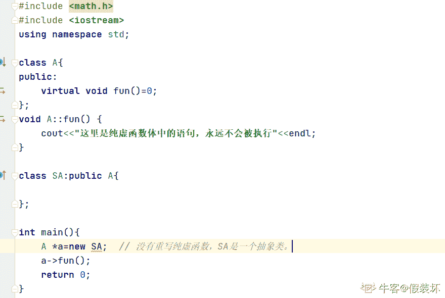纯虚函数可以定义函数体，只能在类外定义。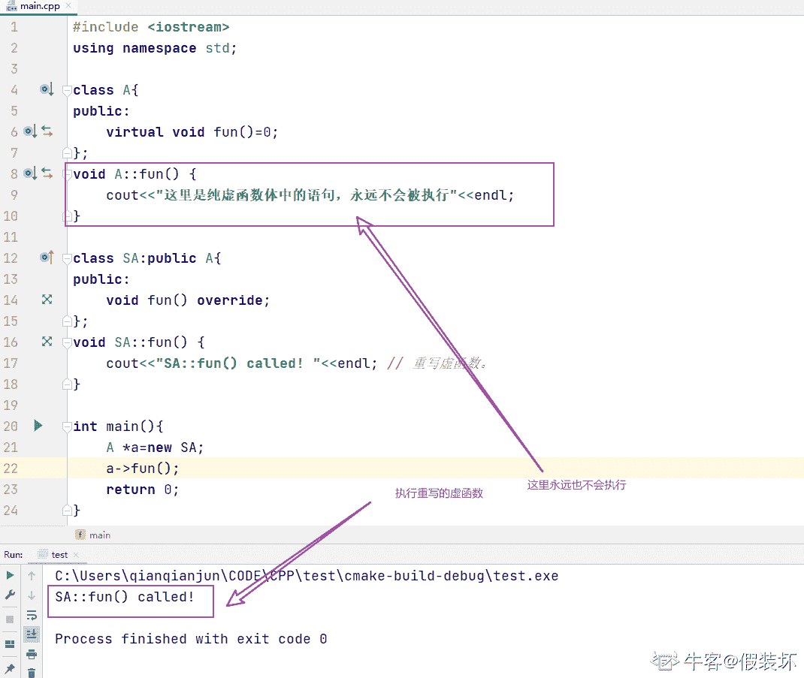

发表于 2022-02-05 15:32:12

* * *

## 32

下面哪些函数不能被声明为虚函数（      ）

正确答案: A B C D   你的答案: 空 (错误)

```cpp
构造函数
```

```cpp
静态成员函数
```

```cpp
内联函数
```

```cpp
友元函数
```

本题知识点

安卓工程师 360 公司 C++ 安卓工程师 360 公司 2018

讨论

[Traveling_L1ght](https://www.nowcoder.com/profile/31501865)

什么样的函数不能声明为虚函数？1）不能被继承的函数。2）不能被重写的函数。

1）普通函数

普通函数不属于成员函数，是不能被继承的。普通函数只能被重载，不能被重写，因此声明为虚函数没有意义。因为编译器会在编译时绑定函数。

而多态体现在运行时绑定。通常通过基类指针指向子类对象实现多态。

2）友元函数

友元函数不属于类的成员函数，不能被继承。对于没有继承特性的函数没有虚函数的说法。

3）构造函数

首先说下什么是构造函数，构造函数是用来初始化对象的。假如子类可以继承基类构造函数，那么子类对象的构造将使用基类的构造函数，而基类构造函数并不知道子类的有什么成员，显然是不符合语义的。从另外一个角度来讲，多态是通过基类指针指向子类对象来实现多态的，在对象构造之前并没有对象产生，因此无法使用多态特性，这是矛盾的。因此构造函数不允许继承。

4）内联成员函数

我们需要知道内联函数就是为了在代码中直接展开，减少函数调用花费的代价。也就是说内联函数是在编译时展开的。而虚函数是为了实现多态，是在运行时绑定的。因此显然内联函数和多态的特性相违背。

5）静态成员函数

首先静态成员函数理论是可继承的。但是静态成员函数是编译时确定的，无法动态绑定，不支持多态，因此不能被重写，也就不能被声明为虚函数。
 ———————————————— 
版权声明：本文为 CSDN 博主「Datou_Nie」的原创文章，遵循 CC 4.0 by-sa 版权协议，转载请附上原文出处链接及本声明。
原文链接：[`blog.csdn.net/nie19940803/article/details/77427219`](https://blog.csdn.net/nie19940803/article/details/77427219)

发表于 2019-08-21 13:57:54

* * *

[627542250](https://www.nowcoder.com/profile/627542250)

构造函数不能是虚函数的原因：①从存储空间角度看，虚函数对应一个指向虚函数表的指针，但这个指向虚表的指针事实上是存储在对象的内存空间中的，假设构造函数是虚的，就需要通过虚表来调用，但是对象还没有实例化，也就是还没有内存空间就无法找到，所以构造函数不能是虚函数；②，从使用角度看，血函数主要用于在信息不全的情况下能使重载的函数得到相应的调用构造函数百就是要初始化实例。

发表于 2019-08-19 23:10:48

* * *

[_random](https://www.nowcoder.com/profile/5246141)

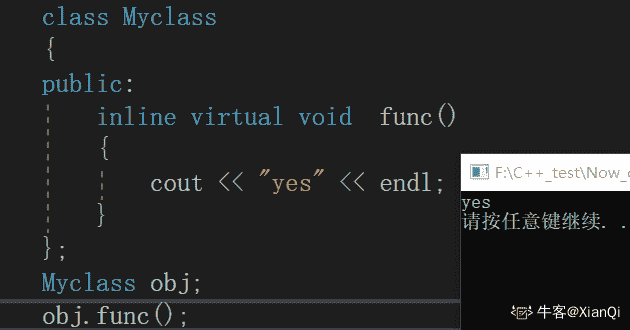内联函数可以申明为虚函数，只是不会把它当作内敛函数展开，内联函数最后决定是由编译器决定的，不是由程序员添加 inline 决定的，因为有些函数内敛展开或许相对较慢。当然你只有添加了 inline 才有内联的机会。

发表于 2019-10-25 22:57:15

* * *

## 33

下面程序的输出结果是（      ）

```cpp
#include <stdio.h>
#include <stdlib.h>
void MallocMem(char* pc)
{
pc = (char*) malloc (100);

return;
}

int main()
{ 
char *str=NULL;

MallocMem(str);
strcpy(str,"hello ");
strcat(str+2, "world");

printf("%s",str);

return 0; 
}
```

正确答案: C   你的答案: 空 (错误)

```cpp
hello world
```

```cpp
程序编译错误
```

```cpp
程序运行时崩溃
```

```cpp
其他几项都不对
```

本题知识点

安卓工程师 360 公司 C++ 安卓工程师 360 公司 2018

讨论

[氵青欢](https://www.nowcoder.com/profile/503425003)

char *str=NULL；是先定义了一个空指针，调用函数 MallocMem(str)在传参时传的是 str 的值，所以这就是一个值传递，我们知道值传递时是不会改变变量原本的值的，所以尽管给 pc 开了一个 100 字节大小的空间，但是 pc 与 str 实际是两个变量，所以 str 的值还为 NULL，给 NULL 里面进行拷贝和链接当然是错的。

发表于 2019-08-16 15:21:55

* * *

## 34

在横线处补充（      ）可以结果输出值为 80000007（      ）
#include <stdio.h>

int convert(int i)
{
return ___________________;
}

int main()
{
int value = 7;

printf( "%x\n", convert(value) );

return 0;
}

正确答案: A   你的答案: 空 (错误)

```cpp
i|=1<<31;
```

```cpp
i&=1<<31;
```

```cpp
i&=~(1<<31);
```

```cpp
i^=1<<31;
```

本题知识点

安卓工程师 360 公司 C++ 安卓工程师 360 公司 2018

讨论

[18541900](https://www.nowcoder.com/profile/266892847)

A,D 的结果相同

发表于 2019-08-19 19:43:16

* * *

[你今天学到了啥](https://www.nowcoder.com/profile/969193193)

这种题重来都是一脸懵逼

发表于 2019-10-30 14:23:37

* * *

[嗷呜皮卡丘](https://www.nowcoder.com/profile/159334412)

有木有大佬帮忙解释一下 这 i|=(i<<31)又是求(⊙o⊙)啥？

发表于 2019-09-03 15:38:14

* * *

## 35

在 32 系统下输出的结果为（      ）

```cpp
#include <stdio.h>

#pragma pack(2)
struct Test1
{
int a;
char b;
short c;
int *d;
}A;
#pragma pack()

#pragma pack(4)
struct Test2
{
int *d;
char b;
int a;
short c;
}B;
#pragma pack()

int main()
{
printf("%d,%d\n",sizeof(A),sizeof(B));
return 0;
}
```

正确答案: A   你的答案: 空 (错误)

```cpp
12,16
```

```cpp
13,13
```

```cpp
16,16
```

```cpp
其他几项都不对
```

本题知识点

安卓工程师 360 公司 C++ 安卓工程师 360 公司 2018

讨论

[呵了个呵](https://www.nowcoder.com/profile/319352361)

#pragma pack(n)和#pragma pop() struct sample { char a; double b; }; 当 sample 结构没有加#pragma pack(n)的时候,sample 按最大的成员那个对齐; （所谓的对齐是指对齐数为 n 时,对每个成员进行对齐,既如果成员 a 的大小小于 n 则将 a 扩大到 n 个大小; 如果 a 的大小大于 n 则使用 a 的大小;）所以上面那个结构的大小为 16 字节. 当 sample 结构加#pragma pack(1)的时候,sizeof(sample)=9 字节;无空字节。 （另注：当 n 大于 sample 结构的最大成员的大小时，n 取最大成员的大小。 所以当 n 越大时，结构的速度越快，大小越大；反之则）

发表于 2019-09-09 08:53:51

* * *

[为发烧而生 ioi](https://www.nowcoder.com/profile/601606638)

32 位系统，你就看成存储单元是 8 个字节为一行来算，加前面的超过 8 个字节就得换下一行存储
，这一行自动补齐 8 个字节。
sizeof(A):
int a 占 4 个字节，然后 char b 占 1 个字节，现在加起来 5 个字节，然后存 short c，short 占 2 字节，
存储地址必须是 2 的倍数，所以中间空一个字节，从第 6 个字节开始存，现在加起来 8 个字节，
然后 int *d 占 4 字节，加起来 12 字节。
sizeof(B)类似。

发表于 2019-09-09 10:49:00

* * *

## 36

下列 const 使用方法错误的是（      ）

正确答案: A   你的答案: 空 (错误)

```cpp
const int Val = 10; Val = 20;
```

```cpp
class A   { const int SIZE = 100; int array[SIZE];};
```

```cpp
class A { protected:  static int const Inity; };
```

```cpp
int a=7;const int *aPtr;aPtr = &a;
```

本题知识点

安卓工程师 360 公司 C++ 2018

讨论

[24K 纯学渣](https://www.nowcoder.com/profile/687880680)

```cpp
const int a = 10; 	//编译可通过，和 int const a = 10; 表达的效果是一样的
a = 20; 			//编译不通过

const int a; 		//编译不通过，必须初始化

//指针常量，指向不能修改，指向的内存中的值可以修改，相当于数组名；
int b = 100;
int *const p; 		//编译报错，必须初始化
int *const p = &b; 	//编译通过
int *const p = &a;	//编译不通过，因为 a 是常量

//常量指针，指针指向可以修改，但指向的值不能修改，此时该指针也叫只读指针
int const *p;		//编译能通过，只是 p 为野指针
int const *p = &a;	//编译可通过
int const *p = &b;	//编译可通过
*p = 200; 			//不管 p 指向 a 还是 b，编译都不会通过

//常量指针常量
const int *const pp;		//编译不通过，必须初始化
const int *const pp = &a; 	//编译通过
const int *const pp = &b; 	//编译通过，此时 b 可以改变值，而且 pp 指向的值同步改变，但不能通过 pp 修改 b 的值
```

发表于 2021-06-30 11:32:13

* * *

[不愿回头 ii](https://www.nowcoder.com/profile/240838104)

B 选项中，const 成员不应该是在参数列表中初始化的吗？感觉 B 也不对。

发表于 2020-02-27 11:13:35

* * *

[牛客 883747129 号](https://www.nowcoder.com/profile/883747129)

A：符号常量在赋予初值后，不可改变其值

发表于 2021-05-14 13:25:56

* * *

## 37

对下面变量声明描述正确的有（）
int *p[n];
int (*)p[n];
int *p()；
int (*)p();

正确答案: A   你的答案: 空 (错误)

```cpp
int *p[n];—–指针数组，每个元素均为指向整型数据的指针
```

```cpp
int (*)p[n];—p 为指向一维数组的指针，这个一维数组有 n 个整型数据
```

```cpp
int *p();——函数带回指针，指针指向返回的值
```

```cpp
int (*)p();—-p 为指向函数的指针
```

本题知识点

安卓工程师 360 公司 C++ 安卓工程师 360 公司 2018

讨论

[小马要过河](https://www.nowcoder.com/profile/828449909)

首先看优先级：[]和()的优先级比星号（星号的名字叫做“指针运算符”）要高，并且这两个括号的运算符的结合顺序，是从左到右的。第一个 int *p[n]   相当于 int*（p[n]）首先是一个数组 数组元素的类型是 int* 第二个 int (*)p[n]   相当于 int ((*p) [n])那么，int ((*p) [n])也是一个 n 维数组，但是这个数组的首地址是*p，也就是说，p 指向的内容，是一个数组的首地址。所以，p 就是指向一个数组的指针，这个数组中的元素都是 int。实际上，p 相当于是一个二维指针。三四同理。第三个是函数声明；第四个是函数指针；

发表于 2019-08-21 16:19:01

* * *

[听见梁山](https://www.nowcoder.com/profile/728996766)

1、函数指针和指针函数的区别 函数指针：本质是指针，指向函数，因此可通过指针来访问函数，其常见形式是 int （*）fun（） 指针函数：说到底就是函数，只不过不同于一般常见函数，它的返回值为一个指向特定类型的指针，常见形式如 int * fun（） 注：以上 int 也可以换成其他数据类型甚至抽象类型，如类类型等。 2、 同理：指针数组即为数组，只不过数组元素为指向特定数据类型的指针，数组指针即为指针，其指向的类型为各数组，因此可采用数组指针来访问二维数组。

编辑于 2019-09-18 09:42:32

* * *

## 38

c++的一个类中声明一个 static 成员变量，下面描述正确的是（）

正确答案: A B   你的答案: 空 (错误)

```cpp
static 是加了访问控制的全局变量，不被继承
```

```cpp
类和子类对象，static 变量占有一份内存
```

```cpp
子类继承父类 static 变量
```

```cpp
static 变量在创建对象时分配内存空间
```

本题知识点

安卓工程师 360 公司 C++ 安卓工程师 360 公司 2018

讨论

[OneShoott](https://www.nowcoder.com/profile/9090857)

这道题应该是 B 吧？

发表于 2019-08-27 10:24:39

* * *

[甘小黑](https://www.nowcoder.com/profile/648202452)

？？？？

发表于 2019-10-15 00:20:17

* * *

## 39

面向对象的基本特征有哪些（）

正确答案: A B C   你的答案: 空 (错误)

```cpp
封装
```

```cpp
继承
```

```cpp
多态
```

```cpp
重载
```

本题知识点

安卓工程师 360 公司 C++ 安卓工程师 360 公司 2018

讨论

[lz 言默 zl](https://www.nowcoder.com/profile/634720925)

这道题出错了，ABC 都是类的特征，题目应该问哪个不属于

发表于 2019-08-28 08:43:49

* * *

[在水一方有人占用？！](https://www.nowcoder.com/profile/829529129)

No 论可讨。

发表于 2019-08-27 19:46:41

* * *

## 40

下面代码打印结果为（）

```cpp
union package
{
char head;
int  body;
};
struct message
{
char id;
int  crc;
union package pack;
};

int main()
{
printf("size=%d\n",sizeof(struct message));
return 0;
}
```

正确答案: D   你的答案: 空 (错误)

```cpp
9
```

```cpp
10
```

```cpp
11
```

```cpp
12
```

本题知识点

安卓工程师 360 公司 C++ 安卓工程师 360 公司 2018

讨论

[秦小羽](https://www.nowcoder.com/profile/535852222)

sizeof(union)，以结构里面 size 最大元素为 union 的 size,因为在某一时刻，union 只有一个成员真正存储于该地址。

发表于 2019-08-30 20:26:01

* * *

[犇流](https://www.nowcoder.com/profile/139469194)

默认 x86 四字节对齐。union 所有数据成员共用一块内存，仅存在一个数据成员 struct 所有数据成员拥有各自内存
----D

发表于 2019-10-07 15:06:28

* * *

[shadowlover-R](https://www.nowcoder.com/profile/811129490)

内存对齐

发表于 2019-08-16 15:04:00

* * *

## 41

多态类中的虚函数表建立在（）

正确答案: A   你的答案: 空 (错误)

```cpp
编译阶段
```

```cpp
运行阶段
```

```cpp
构造函数被调用时进行初始化的
```

```cpp
类声明时
```

本题知识点

安卓工程师 360 公司 C++ 安卓工程师 360 公司 2018

讨论

[promethus](https://www.nowcoder.com/profile/1761272)

函数表是在编译期就建立了，各个虚拟函数这时被组织成了一个函数的入口地址的数组。 而对象的隐藏成员--虚拟函数表指针是在构造函数被调用时进行初始化的，这是实现多态的关键。

发表于 2019-08-17 22:34:35

* * *

## 42

C++中空类默认产生哪些类成员函数（）

正确答案: A B C D   你的答案: 空 (错误)

```cpp
默认构造函数
```

```cpp
析构函数
```

```cpp
拷贝构造函数
```

```cpp
赋值函数
```

本题知识点

安卓工程师 360 公司 C++ 安卓工程师 360 公司 2018

讨论

[我的天鸭](https://www.nowcoder.com/profile/243498)

```cpp
class Empty{
public:
    Empty(); // 缺省构造函数//
    Empty( const Empty& ); // 拷贝构造函数//
    ~Empty(); // 析构函数//
    Empty& operator=( const Empty& ); // 赋值运算符//
    Empty* operator&(); // 取址运算符
    const Empty* operator&() const; // 取址运算符 const
};

```

只有在需要的时候才会生成以上六种成员函数

发表于 2019-08-17 12:43:59

* * *

## 43

变量 void (*s[5])(int)表示意思为（）

正确答案: B   你的答案: 空 (错误)

```cpp
函数指针
```

```cpp
函数指针数组
```

```cpp
数组指针函数
```

```cpp
语法错误
```

本题知识点

安卓工程师 360 公司 C++ 2018 C 语言

讨论

[MyDearestT.K.](https://www.nowcoder.com/profile/633229196)

这是一个标准的函数指针数组，s 先与[5]结合，说明 s 是一个数组，数组的内容是 void (*)(int)类型的函数指针，该指针指向的函数参数为 int，返回值为 void。

编辑于 2019-08-16 10:58:18

* * *

[Huth](https://www.nowcoder.com/profile/46375113)

先把数组声明[5]去掉来看，就是一个函数指针。再加上[5]，就是 5 个函数指针，5 个就是数组了，所以是函数指针数组

发表于 2020-02-24 22:21:01

* * *

[—永恒 N 守护](https://www.nowcoder.com/profile/213052882)

void (*s[5])(int)可以看做先*s[5]为指针数组再看 void (int)是一个函数加起来就是指针数组函数

发表于 2019-12-28 09:23:54

* * *

## 44

定义宏#define DECLARE(name, type) type name##_##type##_type，
则 DECLARE(val, int)替换结果为（）

正确答案: A   你的答案: 空 (错误)

```cpp
int val_int_type
```

```cpp
int val_int_int
```

```cpp
int name_int_int
```

```cpp
int name_int_name
```

本题知识点

安卓工程师 360 公司 C++ 安卓工程师 360 公司 2018

讨论

[我的天鸭](https://www.nowcoder.com/profile/243498)

##是一种分隔连接方式，它的作用是**先分隔，然后进行强制连接**“name”和第一个“_”之间被分隔了，所以预处理器会把 name##_##type##_type 解释成 4 段：“**name**”、“_”、“**type**”以及“**_type**”，name 和 type 会被替换，而 _type 不会被替换

编辑于 2019-08-17 14:14:52

* * *

[菜鸡准备转岗](https://www.nowcoder.com/profile/836159636)

懵逼。。。

发表于 2019-08-16 15:44:28

* * *

## 45

extern "c"的作用有哪些（）

正确答案: A   你的答案: 空 (错误)

```cpp
实现 C++代码调用其他 C 语言代码
```

```cpp
使 C 函数不被 C++编译器优化
```

```cpp
使 C 函数使用 C 编译器优化
```

```cpp
到出 C 变量或函数
```

本题知识点

安卓工程师 360 公司 C++ 安卓工程师 360 公司 2018

讨论

[云岫﹏](https://www.nowcoder.com/profile/539356673)

参考博主的博文[`blog.csdn.net/qq_30891813/article/details/87631651`](https://blog.csdn.net/qq_30891813/article/details/87631651)

发表于 2019-08-28 16:36:50

* * *

## 46

下面程序打印结果为（）

```cpp
#include<iostream>
using namespace std;

class A
{
char a[3];
public:
virtual void fun1(){};
};

class B : public virtual A
{
char b[3];
public:
virtual void fun2(){};
};

class C : public virtual B
{
char c[3];
public:
virtual void fun3(){};
};

int main ()
{
cout << sizeof(A) << endl;
cout << sizeof(B) << endl;
cout << sizeof(C) << endl;
return 0;
}
```

正确答案: B   你的答案: 空 (错误)

```cpp
4,20,28
```

```cpp
8,20,32
```

```cpp
4,12,20
```

```cpp
8,16,28
```

本题知识点

安卓工程师 360 公司 C++ 安卓工程师 360 公司 2018

讨论

[已注销](https://www.nowcoder.com/profile/824253375)

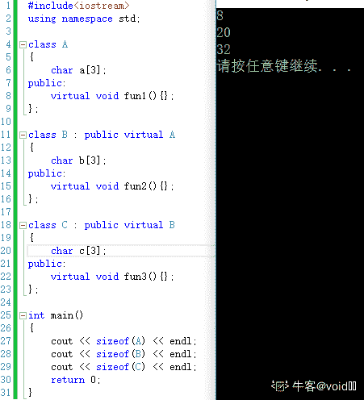

发表于 2019-09-16 19:33:42

* * *

[一生红蓝](https://www.nowcoder.com/profile/726024349)

在 Linux 系统下答案为 8 16 24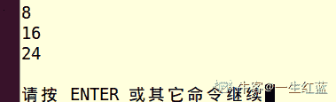

发表于 2019-08-24 17:16:30

* * *

[我的天鸭](https://www.nowcoder.com/profile/243498)

这道题的答案是 VS 平台下的，打印出 A B C 三个类的布局如下：可以看出，**虚继承的时候 A B C 三个类不仅不会共享虚基类指针，也不会共享虚表指针**，要和普通继承区分开来

```cpp
1> class A size(8):
1>      +---
1> 0    | {vfptr}
1> 4    | a
1>      | <alignment member> (size=1)
1>      +---

1> class B size(20):
1>      +---
1> 0    | {vfptr}
1> 4    | {vbptr}
1> 8    | b
1>      | <alignment member> (size=1)
1>      +---
1>      +--- (virtual base A)
1>12    | {vfptr}
1>16    | a
1>      | <alignment member> (size=1)
1>      +---

1> class C size(32):
1>      +---
1> 0    | {vfptr}
1> 4    | {vbptr}
1> 8    | c
1>      | <alignment member> (size=1)
1>      +---
1>      +--- (virtual base A)
1>12    | {vfptr}
1>16    | a
1>      | <alignment member> (size=1)
1>      +---
1>      +--- (virtual base B)
1>20    | {vfptr}
1>24    | {vbptr}
1>28    | b
1>      | <alignment member> (size=1)
1>      +---
```

发表于 2019-08-15 22:18:11

* * *

## 47

下面代码打印结果为（）

```cpp
class Base {
char data[3];
public:
virtual void f() { cout << "Base::f" << endl; }
virtual void g() { cout << "Base::g" << endl; }
virtual void h() { cout << "Base::h" << endl; }

};
int main()
{
cout << sizeof(Base)<< endl;
return 0; 
}
```

正确答案: C   你的答案: 空 (错误)

```cpp
6
```

```cpp
7
```

```cpp
8
```

```cpp
9
```

本题知识点

安卓工程师 360 公司 C++ 安卓工程师 360 公司 2018

讨论

[不负韶光，野蛮生长](https://www.nowcoder.com/profile/367084618)

个人观点，char 数组占用了 3 个字节，虚函数有虚函数表要占 4 字节，无论多少个虚函数，都只要 4 字节，考虑对齐，差 char 那占 4 个，总共占 8 个

发表于 2019-08-22 14:47:51

* * *

[平头哥 plus](https://www.nowcoder.com/profile/608831630)

char [3]加数组结束符'/n'占 4 字节；基类中有纯虚函数，32 位机器人需要一个 4 字节指针来指向虚函数表地址；所以共 8 字节。

发表于 2019-09-12 23:38:23

* * *

[Room_Aimoer](https://www.nowcoder.com/profile/130225889)

个人更倾向 3+4 的内存对齐观点

发表于 2020-01-25 22:26:33

* * *

## 48

在 C 语言源程序的开始处通常加上预处理命令 #include   <stdio.h>的原因是

正确答案: A   你的答案: 空 (错误)

```cpp
stdio.h 文件中包含标准输入输出函数的函数声明，通过引用此文件以便能正确使用 printf、scanf 等函数
```

```cpp
将 stdio.h 中标准输入输出函数的二进制代码插入到引用处，以便进行编译链接
```

```cpp
将 stdio.h 中标准输入输出函数的源程序插入到引用处，以便进行编译链接
```

```cpp
将 stdio.h 中标准输入输出函数链接到编译生成的可执行文件中，以便能正确运行
```

本题知识点

安卓工程师 360 公司 C++ 安卓工程师 360 公司 2018

## 49

有转义字符如下：
'\0X41'、'\0x41'、'\X41'、'\x41'、'\a'、'\b'、'\c'、'\r'
其中错误的转义字符个数是

正确答案: C   你的答案: 空 (错误)

```cpp
0 个
```

```cpp
2 个
```

```cpp
4 个
```

```cpp
6 个
```

本题知识点

安卓工程师 360 公司 C++ 安卓工程师 360 公司 2018

讨论

[InitialD_](https://www.nowcoder.com/profile/199894734)

赞同[挑灯丶](https://www.nowcoder.com/profile/775270747)的解析，对该楼中[rethxin](https://www.nowcoder.com/profile/700520817)的回复说明一下：1、注意区分 **16 进制数的表示 **与 **转义序列中的 16 进制数 **；前者表示表示 16 进制数本身，**后者的值对应 ASCII 码表中的字符**。     2、转义字符'x'不能大写，否则编译时会警告“ unknown escape sequence: '\X' ”；**即转义失败，按照字面值输出**。前缀"0x"或"0X"都可以用来表示 16 进制数本身。 ```cpp
std::cout << "\x23\n\X23\n" << 0X23 << std::endl << 0x23 << std::endl << 0x1.2p3 << std::endl << 0X1.2p3 << std::endl;
``` 上面的代码输出：

> #
> X23
> 35
> 35
> 9
> 9

编辑于 2019-10-05 15:53:13

* * *

[挑灯丶](https://www.nowcoder.com/profile/775270747)

'\0X41'，'\0x41'，'\X41'，'\c'这四个错误。 第一个和第二个，没有这种表示方法，\0 为 NULL，后面的 x 就解释不清了。 第三个，16 进制表示是'\xhh'，x 只能为小写。 第四个，没有这个转义字符

发表于 2019-08-16 11:40:08

* * *

[拖拉机嘟嘟嘟](https://www.nowcoder.com/profile/117252758)

选 A？？？？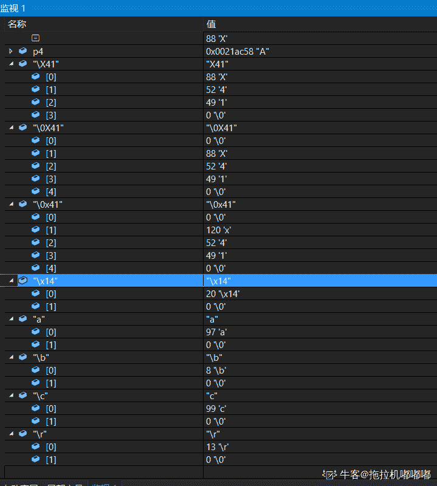

发表于 2019-08-30 17:05:42

* * *

## 50

关于 C 语言，下列指针变量的定义和解释，均正确的是

正确答案: A   你的答案: 空 (错误)

```cpp
int  *p[10];    //定义 10 个指针变量组成的指针数组
```

```cpp
int  *p();    //定义一个函数的指针，将来可用此指针指向一个函数
```

```cpp
int  (*p)[];  //定义一个行指针
```

```cpp
int **p;  //定义一个指针变量，该指针变量可以指一个向二维数组
```

本题知识点

安卓工程师 360 公司 C++ 安卓工程师 360 公司 2018

讨论

[God~Like](https://www.nowcoder.com/profile/8390058)

对于 D 有点难理解，为什么二级指针变量不可以指向二维数组？例如 char a[m][n];char **p=a;会报错，因为实际上二级指针是指向一级指针的，它的类型时 char * 型，而二维数组名 a 是指向一维数组的，它的类型实际是 char (*)[n]型的，则两个类型不相同怎么能赋值呢？这就是为什么在实际应用中可以用 char (*p)[n]=a 进行赋值。

发表于 2019-08-19 21:46:10

* * *

[拖拉机嘟嘟嘟](https://www.nowcoder.com/profile/117252758)

A.正确；B.声明一个无参函数，返回值为 int *C.不知道[ ]里无表达式是什么意思，望大佬解答，但是 int (*p)[1]表示 p 是数组指针，也就是行指针，D.二级指针能指向一维数据，或者说等于二维数组名，例如 int **p; int a[2][2];  p=a;  //等于二维数组名 p=&a[1];  //指向一维数组

发表于 2019-08-15 21:10:24

* * *

[汪啊虎虎](https://www.nowcoder.com/profile/336701791)

对于 B 选项的理解：先看函数指针的定义：如果在程序中定义了一个函数，那么在编译时系统就会为这个函数代码分配一段存储空间，这段存储空间的首地址称为这个函数的地址。而且函数名表示的就是这个地址。既然是地址我们就可以定义一个指针变量来存放，这个指针变量就叫作函数指针变量，简称函数指针。
int *p() 并不是如选项所说的将来可以用此指针指向一个函数，**应该是先有函数再定义指针，而不是先定义了指针，之后指向一个函数。**另外，对于这种不含参数的函数指针的写***不会报错的问题，众说纷纭，在 c++中应该会报错的，不过大家也不用纠结于此，因为这样的写法是没有意义的，并不能起到函数指针的作用，实际应用中并不会这样使用。

发表于 2019-08-21 16:43:10

* * *

## 51

#include "file.h"和#include <file.h>的区别是（      ）

正确答案: A   你的答案: 空 (错误)

```cpp
#include "file.h"是指编译器将从当前工作目录上开始查找此文件
```

```cpp
#include <file.h>是指编译器将从当前工作目录上开始查找此文件
```

```cpp
#include "file.h"指编译器将从标准库目录中开始查找此文件
```

```cpp
#include <file.h>指编译器将从标准库目录中开始查找此文件
```

本题知识点

安卓工程师 360 公司 C++ 安卓工程师 360 公司 2018

讨论

[我的天鸭](https://www.nowcoder.com/profile/243498)

#include <> **只搜索系统目录**，不会搜索本地目录，自己写一个头文件，用#include <>会出错#include ""首先搜索本地目录，本地目录没有才会搜索系统目录（本地目录-->系统目录）

发表于 2019-08-15 22:13:42

* * *

[好好…学习](https://www.nowcoder.com/profile/181570956)

A 选项不对吗？

发表于 2019-08-27 14:28:09

* * *

[God~Like](https://www.nowcoder.com/profile/8390058)

这个 D 选项理论上来说也是对的，#include<>确实是从标准库目录中开始查找文件，只是若没有找到就直接报错，不会再去当前文件目录中查找。

编辑于 2019-08-19 20:56:51

* * *

## 52

下列程序的功能是输出 a 数组中小写字母的个数，请为横线处选择合适的程序（      ）
#include <stdio.h>
main()
{ char a[]="123abc";
int i,num=0;
for(i=0;_________;i++)
if(a[i]>='a'&&a[i]<='z') num++;
printf("%d\n",num);
}

正确答案: A   你的答案: 空 (错误)

```cpp
a[i]!='\0'
```

```cpp
a[i]==0
```

```cpp
a[i]=='\0'
```

```cpp
a[i]!=0
```

本题知识点

安卓工程师 360 公司 C++ 安卓工程师 360 公司 2018

讨论

[寇元开 1913041517](https://www.nowcoder.com/profile/757118016)

A  当读到字符串结束的的时候结束循环

发表于 2019-11-14 17:28:33

* * *

[阡夺](https://www.nowcoder.com/profile/508092351)

A ‘\0’代表结束符，字符串的后一个自动保存为这个结束符

发表于 2019-09-29 21:56:20

* * *

[近战法师，刘海柱](https://www.nowcoder.com/profile/431099113)

嗯

发表于 2019-09-29 20:23:58

* * *

## 53

若有定义语句：
int  a [2][3],(*p)[3],*q[3];，则以下赋值语句正确的是（      ）

正确答案: A   你的答案: 空 (错误)

```cpp
p=a;
```

```cpp
q=a;
```

```cpp
p=&a[1];
```

```cpp
q=&a[1];
```

本题知识点

安卓工程师 360 公司 C++ 安卓工程师 360 公司 2018

讨论

[BroWuG](https://www.nowcoder.com/profile/297231019)

答案：A、C

```cpp
#include <iostream>

using namespace std;

int main(){

    int a[2][3];
    int (*p)[3];//数组指针(数组指针，指的是数组名的指针，即数组首元素地址的指针。即是指向数组的指针)
    int *q[3];//指针数组

    cout << typeid(a).name() << endl;    //A2_A3_i  即 int [2][3]
    cout << typeid(p).name() << endl;    //PA3_i    即 int (*)[3]
    cout << typeid(q).name() << endl;    //A3_Pi    即 int* [3]
    cout << typeid(&a[1]).name() << endl;//PA3_i    即 int (*)[3]

    cout << (a == &a[0]) << endl;//1

    p = a;//二维数组名赋给数组指针,等价于 p = &a[0]
    //q = a;//q 是指针数组的数组名，是一个指针常量，无法修改
    p = &a[1];//a[1]是一个一维数组(首元素)的地址，取地址就是数组指针(数组首元素地址的指针)，类型与 p 一致
    //q = &a[1];//q 是指针数组的数组名，是一个指针常量，无法修改
}
```

编辑于 2019-08-24 18:46:53

* * *

[我的天鸭](https://www.nowcoder.com/profile/243498)

A 和 C 都是对的，放多选里去吧

发表于 2019-08-15 16:59:40

* * *

## 54

请将 B 类的构造函数补充完整，要求用 x 初始化 a。请为横线处选择合适的程序（）

```cpp
class A {
    int a;
public:
    A(int x=0) {
        a=x;
    }
};

class B: public A {
    int b;
public:
    B(int x): ______________ {
        b = x + 1;
    }
};
```

正确答案: B   你的答案: 空 (错误)

```cpp
a(x)
```

```cpp
A(x)
```

```cpp
B(x)
```

```cpp
a=x
```

本题知识点

360 公司 C++ 2018 C 语言

讨论

[牛客 631384995 号](https://www.nowcoder.com/profile/631384995)

“公共继承派生类”只能通过“”基类的成员函数”去访问“”基类的私有成员”

发表于 2020-09-12 20:35:49

* * *

[黄色变白色](https://www.nowcoder.com/profile/8547911)

当创建一个派生类的对象时，系统首先自动创建一个基类对象，也就是说，在调用派生类构造函数创建派生类对象之前，系统首先调用基类的构造函数创建基类对象。当派生类对象生命期结束时，首先调用派生类的析构函数，然后调用基类的析构函数。简而言之，就是说，构造函数：基类->派生类。析构函数：派生类->基类。

发表于 2019-10-28 07:25:46

* * *

[天将降大任于吾](https://www.nowcoder.com/profile/178455149)

A 选项，变量 a 是基类私有成员，派生类无法访问，A 错

发表于 2020-04-08 10:29:49

* * *

## 55

下列关于构造函数的说法，错误的是（）

正确答案: A   你的答案: 空 (错误)

```cpp
构造函数不可以是私有的(private)
```

```cpp
一个类中可以有多个构造函数
```

```cpp
无论何时，只要类的对象被创建，就会执行构造函数
```

```cpp
构造函数没有返回类型
```

本题知识点

安卓工程师 360 公司 C++ 安卓工程师 360 公司 2018

讨论

[蚕豆过敏](https://www.nowcoder.com/profile/195480334)

C++类的构造函数不是只能调用一次吗？？？

发表于 2019-08-19 20:26:44

* * *

[Stevens-R](https://www.nowcoder.com/profile/348151511)

单例模式里构造函数不就是私有的么，这题啥情况？

发表于 2019-10-14 22:08:47

* * *

## 56

下列关于类中的静态成员的说法错误的是（）

正确答案: D   你的答案: 空 (错误)

```cpp
虽然静态成员不属于类的某个对象，但是我们仍然可以使用类的对象、引用或者指针来访问静态成员
```

```cpp
成员函数不用通过作用域运算符就能直接使用静态成员
```

```cpp
静态数据成员不是由类的构造函数初始化的
```

```cpp
静态成员不可以作为默认实参
```

本题知识点

安卓工程师 360 公司 C++ 安卓工程师 360 公司 2018

讨论

[God~Like](https://www.nowcoder.com/profile/8390058)

编译器对于默认参数的解释和翻译都是在编译阶段，而在编译阶段非静态成员没有确定的地址和 this 指针，而静态成员的地址在编译阶段就应经确定了，所以可以作为默认实参。如果不懂 D 选项的意思，那举个例子 class A{int a;static b;void f1(int c=a){}//编译报错 void f2(int c=b){}//编译正确};

发表于 2019-08-19 22:01:11

* * *

[黄色变白色](https://www.nowcoder.com/profile/8547911)

静态成员是可以作为默认实参的编译器对于默认实参的解释是在编译链接的时候，所以作为默认实参的对象要是一个在编译期就确定的地址，静态成员就符合，像 this 指针和类成员在编译期还不能确定

发表于 2020-09-07 09:45:30

* * *

[在水一方有人占用？！](https://www.nowcoder.com/profile/829529129)

B 项

发表于 2019-08-25 16:07:45

* * *

## 57

```cpp
#include <bits/stdc++.h>
using namespace std;
int main() {
int n;
scanf("%d", &n);
map <int, int> xs;
map <int, int> ys;
map < pair <int, int>, int > zs;
long long ans = 0;
for (int i = 0; i < n; i++) {
int x, y;
scanf("%d %d", &x, &y);
ans += (xs[x]++);
ans += (ys[y]++);
ans -= (zs[make_pair(x, y)]++);
}
cout << ans << endl;
return 0;
}
```

输入：
6
0 0
0 1
0 2
-1 1
0 1
1 1
则上述程序输出为( )

正确答案: C   你的答案: 空 (错误)

```cpp
9
```

```cpp
10
```

```cpp
11
```

```cpp
12
```

本题知识点

安卓工程师 360 公司 C++ 安卓工程师 360 公司 2018

讨论

[我的天鸭](https://www.nowcoder.com/profile/243498)

ans = sum(range(相同 x 的个数)) + sum(range(相同 y 的个数)) - sum(range(相同 x,y 的个数))       = 0 + 1 + 2 + 3 + 0 + 1 + 2 + 3 - 0 - 1 = 11

发表于 2019-08-17 17:01:49

* * *

## 58

```cpp
#include <bits/stdc++.h>
using namespace std;
int main(){
int n = 1001;
int ans = 0;
for(int i = 1; i <= n; ++i){
ans ^= i % 3;
}
cout << ans << endl;
}
```

则上述程序输出为( )

正确答案: B   你的答案: 空 (错误)

```cpp
-2
```

```cpp
0
```

```cpp
1
```

```cpp
2
```

本题知识点

安卓工程师 360 公司 C++ 安卓工程师 360 公司 2018

讨论

[troublehm](https://www.nowcoder.com/profile/117283902)

有规律，六个一循环，n=1001，余数为五，i 为 5 时，ans 为 0

发表于 2019-08-16 10:49:17

* * *

## 59

Activity 有多种启动方式,下列哪个不属于 Activity 的启动方式

正确答案: C   你的答案: 空 (错误)

```cpp
singleTask
```

```cpp
singleTop
```

```cpp
stand
```

```cpp
singleInstance
```

本题知识点

安卓工程师 360 公司 Android 2018

讨论

[忘忧 20190521191526](https://www.nowcoder.com/profile/851140950)

Acyivity 的启动模式一共有四种，分别是 standard、singleTop、singleTask 和 singleInstance

发表于 2019-08-17 10:59:56

* * *

[傲娇学霸](https://www.nowcoder.com/profile/965253180)

Standard 系统的默以启动模式。每次启动一个 activity 都会新建一个实例 Singletop 栈顶复用，位于栈顶的元素不会被新建实例，其它都会。Single task 栈内复用，栈内元素都不会被新建实例 ShuttleIntense 单例模式

发表于 2021-04-26 18:59:29

* * *

[序列不愿意被预测](https://www.nowcoder.com/profile/421723822)

C 选项少了三个字母

发表于 2020-08-12 19:20:54

* * *

## 60

Google 推荐 Android 使用的字号单位是什么

正确答案: C   你的答案: 空 (错误)

```cpp
dip
```

```cpp
px
```

```cpp
sp
```

```cpp
pt
```

本题知识点

安卓工程师 360 公司 Android 2018

讨论

[娜灬](https://www.nowcoder.com/profile/119274855)

实际开发建议使用 dp 代替 sp，因为大多数 app 都没有对不同尺寸的文字做屏幕适配，直接使用 sp 会导致用户调整字体后 UI 文字变形、展示不全等。一些特定的纯文字浏览页面，做了屏幕文字适配的页面再考虑用 sp

发表于 2020-05-16 14:01:55

* * *

[ikstear 美霞](https://www.nowcoder.com/profile/361151410)

Android 开发字体的大小需要用 google 提供的 sp 单位，而控件的大小需要使用 dip 或者 dp。

1.  dp（或者 dip device independent pixels）一种基于屏幕密度的抽象单位。在每英寸 160 点的显示器上，1dp=1px。不同设备有不同的显示效果，这个和设备硬件有关。

2.  sp（Scaled Pixels）主要用于字体显示，与刻度无关的一种像素，与 dp 类似，但是可以根据用户的字体大小首选项进行缩放。

3.  px 即像素，1px 代表屏幕上一个物理的像素点,px 单位不被建议使用，因为同样 100px 的图片，在不同手机上显示的实际大小可能不同。

编辑于 2019-10-30 16:17:32

* * *

## 61

以下选项中哪一个不能退出 Activity（）

正确答案: D   你的答案: 空 (错误)

```cpp
finish()
```

```cpp
抛出异常强制退出
```

```cpp
System.exit()
```

```cpp
onStop()
```

本题知识点

安卓工程师 360 公司 Android 2018

讨论

[Bunny 小磊](https://www.nowcoder.com/profile/84051993)

让 Activity 抛出异常就属正确退出？

发表于 2019-08-17 10:49:40

* * *

[前来打酱油的](https://www.nowcoder.com/profile/5757430)

这道题答案应该是 D。onStop 并没有退出 Activity，只是不可见而已。

发表于 2019-09-06 00:58:36

* * *

[Kmorebi](https://www.nowcoder.com/profile/124925111)

退出 Activit 的方法 l **对于单一 Activity：**

①调用 finish()

②　killProcess()和 System.exit()这样的方法。

l **对于多个 Activity：**

①　抛异常强制退出：

②　发送特定广播

③　递归退出除了以上，也可以建立一个集合类用于同一管理所有的活动

发表于 2020-07-02 16:57:24

* * *

## 62

Android 中销毁线程的方法是

正确答案: A   你的答案: 空 (错误)

```cpp
onDestroy
```

```cpp
onClear
```

```cpp
onFinish
```

```cpp
onStop
```

本题知识点

安卓工程师 360 公司 Android 安卓工程师 360 公司 2018

讨论

[longyin](https://www.nowcoder.com/profile/440436)

***360 的题目

发表于 2019-09-17 23:46:54

* * *

## 63

下列说法正确的是

正确答案: C   你的答案: 空 (错误)

```cpp
R.java 文件可以手动修改
```

```cpp
Android 中不可以使用 System.out.println()
```

```cpp
在清单文件中声明最低 API 级别
```

```cpp
在 values 文件中声明用户权限
```

本题知识点

安卓工程师 360 公司 Android 安卓工程师 360 公司 2018

讨论

[卡卡的啊](https://www.nowcoder.com/profile/3677046)

build 文件中会声明最低版本号

发表于 2019-08-28 21:49:23

* * *

## 64

关于 LayoutInflater 的说法错误的是

正确答案: D   你的答案: 空 (错误)

```cpp
LayoutInflater 的 from 方法是 static（静态）的
```

```cpp
LayoutInflater 的 inflate 方法可以有三个参数
```

```cpp
在 Activity 中可以通过 getLayoutInflater 方法获得 LayoutInflater 对象
```

```cpp
LayoutInflater 的具有一个参数 Context 对象的构造方法
```

本题知识点

安卓工程师 360 公司 Android 2018

讨论

[kuzzi](https://www.nowcoder.com/profile/454189322)

```cpp
protected LayoutInflater(Context context)

这里应该选 D，protected 没公开出来
```

发表于 2019-10-11 14:56:58

* * *

[霸气的小羊](https://www.nowcoder.com/profile/829907205)

c 也可以吧，layoutInflater = context.getLayoutInflater(); activity 里也有这个方法: public LayoutInflater getLayoutInflater() { throw new RuntimeException("Stub!"); }

编辑于 2019-09-17 11:13:08

* * *

[Leo618](https://www.nowcoder.com/profile/970673239)

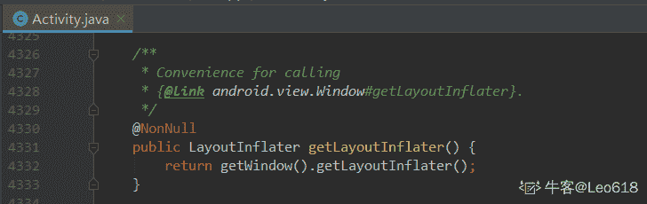

发表于 2019-08-29 15:06:25

* * *

## 65

关于 ViewPager 的继承关系，下面选项正确的是

正确答案: A   你的答案: 空 (错误)

```cpp
ViewPager extends ViewGroup
```

```cpp
ViewPager extends LinearLayout
```

```cpp
ViewPager extends View
```

```cpp
ViewPager extends FrameLayout
```

本题知识点

安卓工程师 360 公司 Android 2018

讨论

[牛客 811844339 号](https://www.nowcoder.com/profile/811844339)

继承 viewgroup 不也相当继承了 view?

发表于 2020-04-07 10:59:23

* * *

[Programmer＇smusic](https://www.nowcoder.com/profile/46280562)

*   ViewPager 是 android-support-v4.jar 包中的一个系统控件
*   ViewPager 继承自 ViewGroup
*   ViewPager 专门用以实现左右滑动切换 View 的效果

发表于 2019-08-28 21:16:52

* * *

## 66

下面不是 View 的构造方法的是

正确答案: D   你的答案: 空 (错误)

```cpp
View(Context context)
```

```cpp
View(Context context, AttributeSet attrs)
```

```cpp
View(Context context, AttributeSet attrs, int defStyleAttr)
```

```cpp
View(Context context, AttributeSet attrs, int defStyleAttr, long defStyleRes)
```

本题知识点

安卓工程师 360 公司 Android 2018

讨论

[李伟驰](https://www.nowcoder.com/profile/359305247)

这题考的是细节，D 选项最后一个参数是 int 类型的

```cpp
public View(Context context) { throw new RuntimeException("Stub!");} 
```

```cpp
public View(Context context, AttributeSet attrs) { throw new RuntimeException("Stub!");} 
```

```cpp
public View(Context context, AttributeSet attrs, int defStyleAttr) { throw new RuntimeException("Stub!");} 
```

```cpp
public View(Context context, AttributeSet attrs, int defStyleAttr, int defStyleRes) { throw new RuntimeException("Stub!");}
```

编辑于 2019-08-20 18:44:56

* * *

## 67

以下各类哪个是 RecyclerView 的 LayoutManager

正确答案: D   你的答案: 空 (错误)

```cpp
LinearLayoutManager
```

```cpp
GridLayoutManager
```

```cpp
StaggeredGridLayoutManager
```

```cpp
其他几项均是
```

本题知识点

安卓工程师 360 公司 Android 安卓工程师 360 公司 2018

讨论

[LongSh1z](https://www.nowcoder.com/profile/583231387)

LayoutManager 用于指定 RecyclerView 的布局方式。LinearLayoutManager：线性布局 GridLayoutManager：网格布局
StaggeredGridLayoutManager：瀑布流布局

发表于 2019-08-25 14:41:20

* * *

## 68

关于 Android Handler 说法错误是（      ）

正确答案: A   你的答案: 空 (错误)

```cpp
实现不同进程间通信的一种机制
```

```cpp
避免了在新线程中刷新 UI 的操作
```

```cpp
采用队列的方式来存储 Message
```

```cpp
实现不同线程间通信的一种机制
```

本题知识点

安卓工程师 360 公司 Android 2018

讨论

[BurnSky](https://www.nowcoder.com/profile/433191223)

这道题目应该改成：《关于 Android Handler 说法“错误”是？》  然后我就可以心安理得的选 A

编辑于 2020-08-04 17:35:52

* * *

[展鹤](https://www.nowcoder.com/profile/4204002)

避免在子线程操作不是由代码来控制的么。。。更倾向于 D

发表于 2020-02-14 17:00:32

* * *

[牛客 418780630 号](https://www.nowcoder.com/profile/418780630)

message 是在线程之间传递的消息，可携带少量消息，用于不用线程之间交换数据。handler 则是用于发送和处理消息。messageQueue 是消息队列，用于存放所有通过 handler 发送的消息。looper 是每个线程中的 messageQueue 的管家，调用 looper（）之后金辉进入无线循环中，发现 messageQueue 存在消息则取出，并传递到 handler 的 handleMessage()方法中。

发表于 2020-01-10 10:05:35

* * *

## 69

onSaveInstanceState 方法会发生在下列哪些场景下（      ）

正确答案: A   你的答案: 空 (错误)

```cpp
用户按下 HOME 键时
```

```cpp
关闭屏幕显示
```

```cpp
从 Activity 中启动一个新的 Activity 时
```

```cpp
屏幕方向发生切换时
```

本题知识点

安卓工程师 360 公司 Android 安卓工程师 360 公司 2018

讨论

[自闭少年（自闭中）](https://www.nowcoder.com/profile/651549952)

onSaveInstanceState()方法的调用时机：1，按下 Home 键 2，长按 Home 键，切换到其它应用。
3，关闭屏幕显示。4，跳转到另一个 Activity。5，切换屏幕方向。

发表于 2021-08-30 15:10:17

* * *

[longyin](https://www.nowcoder.com/profile/440436)

360 的题目 答案是不是有病啊~服了

发表于 2019-08-15 23:26:20

* * *

[201903222219305](https://www.nowcoder.com/profile/523163894)

这四种情况都会调用把，还有一种情况就是长按 home 键，切换其它与应用时也会调用

发表于 2019-09-16 14:25:03

* * *

## 70

有关 Broadcas Intent 和 Broadcast Receiver 说法正确的是（      ）

正确答案: A B C D   你的答案: 空 (错误)

```cpp
程序广播 Intent 对象时，需要先建立 Intent 对象，并指定待广播消息
```

```cpp
可以使用 sendBroadcast 方法广播 Intent 对象
```

```cpp
可以使用 registerReceive 方法注册 Broadcast Receiver
```

```cpp
可以在应用程序的 manifets.xml 文件中注册 Broadcast Receiver
```

本题知识点

安卓工程师 360 公司 Android 2018

讨论

[Aaron201808111709830](https://www.nowcoder.com/profile/330859405)

在全对的选项中，为了提交答案不得不选的答案，，，这题库质量

发表于 2019-08-28 00:57:49

* * *

[tonytangcn](https://www.nowcoder.com/profile/608948230)

CD 肯定是错的，文字游戏，单词写错了。实在不明白 B 为什么是错的

发表于 2019-09-23 16:23:15

* * *

[洪 201908271512725](https://www.nowcoder.com/profile/679686109)

全对吧

发表于 2019-08-27 17:34:05

* * *

## 71

以下代码段执行后的输出结果为

```cpp
public class Test {
    public static void main(String args[]) {
        int x = -5;
        int y = -12;
        System.out.println(y % x);
    }
}
```

正确答案: D   你的答案: 空 (错误)

```cpp
-1
```

```cpp
2
```

```cpp
1
```

```cpp
-2
```

本题知识点

安卓工程师 360 公司 Java 2018

讨论

[研究所走一波](https://www.nowcoder.com/profile/619153880)

System.out.println((-3)%2);System.out.println(4%3);System.out.println((-3)%(-2));System.out.println(4%(-3)); -11
-1
1
取模运算，余数的符号跟被除数符号相同

发表于 2019-08-15 17:24:45

* * *

[亮剑 _](https://www.nowcoder.com/profile/1101530)

无论是正数还是负数，在取余运算时都有：被除数=商×除数+余数，所以-12=2×(-5)+(-2)，-12 是被除数，-5 是除数，2 是商，余数是-2。

发表于 2019-11-15 10:40:26

* * *

[NO.6](https://www.nowcoder.com/profile/665261709)

%是取余，余数和被除数符号一致

mod 是取模，和除数符号一致

发表于 2019-11-16 09:55:54

* * *

## 72

下列程序 test 类中的变量 c 的最后结果为

```cpp
public class Test {
public static void main(String args[]) {
int a = 10;
int b;
int c;
if (a > 50) {
b = 9;
}
c = b + a;
}
}
```

正确答案: D   你的答案: 空 (错误)

```cpp
10
```

```cpp
0
```

```cpp
19
```

```cpp
编译出错
```

本题知识点

安卓工程师 360 公司 Java 安卓工程师 360 公司 2018

讨论

[$枫](https://www.nowcoder.com/profile/443026278)

类中声明的变量有默认初始值；方法中声明的变量没有默认初始值

发表于 2019-08-16 09:28:15

* * *

[幻想の国度](https://www.nowcoder.com/profile/943201721)

在方法中定义变量不设定初始值会提示你 in...的一串字母,爆红.

发表于 2019-08-16 15:53:24

* * *

[IDEA2022.4.2](https://www.nowcoder.com/profile/181223548)

局部变量不是必须初始化的，只是使用到的时候如果没赋值则需要初始化

发表于 2019-08-18 08:43:24

* * *

## 73

以下代码的循环次数是

```cpp
public class Test {
    public static void main(String args[]) {
        int i = 7;
        do {
            System.out.println(--i);
            --i;
        } while (i != 0);
       System.out.println(i);
    }
}
```

正确答案: D   你的答案: 空 (错误)

```cpp
0
```

```cpp
1
```

```cpp
7
```

```cpp
无限次
```

本题知识点

安卓工程师 360 公司 Java 2018

讨论

[半岛。](https://www.nowcoder.com/profile/397758587)

执行 1 次，5

执行 2 次，3

执行 3 次，1

执行 4 次，-1

永远执行不到 0

发表于 2019-08-15 23:44:20

* * *

[胡宁松](https://www.nowcoder.com/profile/486478503)

执行 1 次，输出是 6，然后再减 1 为 5 进行 while 判定不为 o 再进入 do

执行 2 次，输出是 4，然后再减 1 为 3 进行 while 判定不为 o 再进入 do

执行 3 次，输出是 2，然后再减 1 为 1 进行 while 判定不为 o 再进入 do

执行 4 次，输出是 0，然后再减 1 为-1 进行 while 判定不为 o 再进入 do

永远执行不到 0

发表于 2019-08-21 22:11:56

* * *

[Eves.Y](https://www.nowcoder.com/profile/727399697)

基础不到位啊, -- i 先运算后赋值,每次 减 2,do while 循环 是先执行一次,在开始执行步进表达式,所以 7 5 3 1 -1 -3,永远不会满足步进表达式的布尔运算,所以是无限次

发表于 2019-12-16 22:04:16

* * *

## 74

以下代码的输出的正确结果是

```cpp
public class Test {
    public static void main(String args[]) {
        String s = "祝你考出好成绩！";
        System.out.println(s.length());
    }
}
```

正确答案: D   你的答案: 空 (错误)

```cpp
24
```

```cpp
16
```

```cpp
15
```

```cpp
8
```

本题知识点

安卓工程师 360 公司 Java 2018

讨论

[人生要有 trycatch](https://www.nowcoder.com/profile/190062089)

length 得到的是字符，不是字节。

发表于 2019-08-29 08:32:17

* * *

[蜡笔没有心](https://www.nowcoder.com/profile/1685418)

如果是 s.getBytes("GBK").length 就是求的字节数。如果是 GBK，一个中文字符占 2 字节，如果是 UTF-8 则是 3 个字节，

发表于 2020-05-06 23:15:33

* * *

[eicomtpmh](https://www.nowcoder.com/profile/140180)

中文和英文一样的，看作一个字符。

发表于 2019-08-18 15:38:36

* * *

## 75

代码行 float t=5.1; int i=t; 不正确的是

正确答案: B   你的答案: 空 (错误)

```cpp
代码不能编译
```

```cpp
代码编译, i 被设置为 5
```

```cpp
第二行若改为 int i=(byte)t ，并和 D 选项结合，则可编译
```

```cpp
第一行若改为 float t=5.1f ，并和 C 选项结合，则可编译
```

本题知识点

安卓工程师 360 公司 Java 安卓工程师 360 公司 2018

讨论

[孤独来的猫](https://www.nowcoder.com/profile/142846617)

```cpp
public class Suan(){
    public static void main(String[] args){
        float t = 5.1;
        int i = t;
        //这样的代码是不能直接通过编译的、首先浮点型需要加入 f、其次 float 转为 int 需要强制转换
        //所以这道题就根本不是 B、而是 A 选项、两个都是不能直接通过编译的
    }
}
```

发表于 2019-08-16 09:35:22

* * *

[$枫](https://www.nowcoder.com/profile/443026278)

题目出错了，应该选正确的，只有 A 正确；CD 选项的操作一起修改才可以正确编译

发表于 2019-08-20 15:24:18

* * *

[Sun 浅雨](https://www.nowcoder.com/profile/176673786)

选 A 路过

编辑于 2019-08-17 11:20:12

* * *

## 76

关于 protected 修饰的成员变量，以下说法正确的是

正确答案: A   你的答案: 空 (错误)

```cpp
可以被该类自身、与它在同一个包中的其它类、在其它包中的该类的子类所访问
```

```cpp
只能被该类本身和该类的所有的子类访问
```

```cpp
只能被该类自身所访问
```

```cpp
只能被同一个包中的类访问
```

本题知识点

安卓工程师 360 公司 Java 安卓工程师 360 公司 2018

讨论

[Bri0117](https://www.nowcoder.com/profile/291010799)

（1）public：可以被所有其他类所访问。

（2）private：只能被自己访问和修改。

（3）protected：自身，子类及同一个包中类可以访问。

（4）default（默认）：同一包中的类可以访问，声明时没有加修饰符，认为是 friendly。

发表于 2019-08-24 13:59:00

* * *

[人余月半子](https://www.nowcoder.com/profile/514787832)

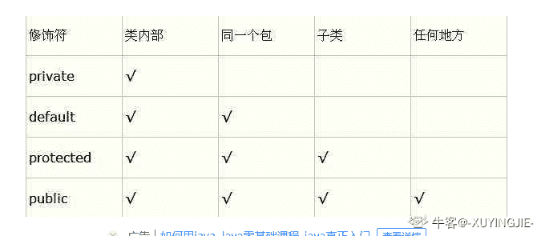

发表于 2019-10-26 22:34:02

* * *

[北酒鱼](https://www.nowcoder.com/profile/4473795)

360 题都做的我怀疑我之前学的假的 B 咋错了

发表于 2019-08-16 12:47:55

* * *

## 77

下面关于继承的描述正确的是

正确答案: A   你的答案: 空 (错误)

```cpp
在 Java 中的类只允许单一继承
```

```cpp
在 Java 中一个类只能实现一个接口
```

```cpp
在 Java 中一个类不能同时继承一个类和实现一个接口
```

```cpp
Java 的单一继承使代码不可靠
```

本题知识点

安卓工程师 360 公司 Java 2018

讨论

[大飞侠 201908061917293](https://www.nowcoder.com/profile/61897503)

接口可以多继承呀

发表于 2019-08-15 14:29:30

* * *

[IDEA2022.4.2](https://www.nowcoder.com/profile/181223548)

此题全错 A 接口支持多继承 B 可以实现多个接口 C 可以同时继承和实现接口 D 一看就是错的😏

发表于 2019-08-20 09:27:42

* * *

[骑车去看海](https://www.nowcoder.com/profile/7398112)

```cpp
在 Java 中只允许单一继承
```

Java 中的类只允许单一继承，Java 中的接口可以多继承

发表于 2019-08-19 12:08:33

* * *

## 78

下面关于静态方法说明正确的是

正确答案: B   你的答案: 空 (错误)

```cpp
在静态方法中可用 this 来调用本类的类方法
```

```cpp
在静态方法中调用本类的静态方法时可直接调用
```

```cpp
在静态方法中只能调用本类中的静态方法
```

```cpp
在静态方法中绝对不能调用实例方法
```

本题知识点

安卓工程师 360 公司 Java 安卓工程师 360 公司 2018

讨论

[9 月好运](https://www.nowcoder.com/profile/9059600)

public static void main 方法不就是静态方法吗？一开始竟然没想到

发表于 2019-09-04 22:21:03

* * *

[胡小牛](https://www.nowcoder.com/profile/131348874)

A--static 方法就是没有 this 的方法，使用 static 方法时，由于不存在 this,所以不是通过‘向对象发送消息“的方式来完成的。 静态方法可以在对象初始化之前调用 C--静态方法可以调用其他类的静态方法 D--传递对象的引用到静态方法里，通过这个对象的引用就能调用非静态方法和访问非静态数据成员。mian 方法中创建对象，调用对象方法可以参阅 ：--Think in Java 4。5.4.2 static 的含义

发表于 2019-10-02 16:56:08

* * *

[旷👦](https://www.nowcoder.com/profile/926454283)

静态方法不能访问非静态的数据和方法，因为这两项都依赖于具体的实例，而静态方法在对象实例化之前就已经被 JVM 装载，而类中的实例变量和实例对象必须在对象开辟堆内存之后才能使用。

发表于 2019-09-23 20:09:28

* * *

## 79

以下关于 Integer 与 int 的区别错误的是

正确答案: D   你的答案: 空 (错误)

```cpp
int 是 java 提供的 8 种原始数据类型之一
```

```cpp
Integer 是 java 为 int 提供的封装类
```

```cpp
int 的默认值为 0
```

```cpp
Integer 的默认值为 1
```

本题知识点

安卓工程师 360 公司 Java 2018

讨论

[while(alive){code();}:)](https://www.nowcoder.com/profile/184893733)

int 是八大基本数据类型之一（byte,char,short,int,long,float,double,boolean）
Integer 是 int 包装类;
int 是基本数据类型，默认值为 0,
Integer 是类，默认值为 null；
Integer 表示的是对象，用一个引用指向这个对象,
int 是基本数据类型，直接存储数值。

发表于 2019-09-25 22:40:50

* * *

[董庆](https://www.nowcoder.com/profile/276719544)

integer 包装类 属于引用数据类型 所以 为赋值时 默认为 null

发表于 2020-02-17 00:36:09

* * *

[牛客 131193067 号](https://www.nowcoder.com/profile/131193067)

要看清楚题目选的是错误的选项

发表于 2021-06-27 10:54:15

* * *

## 80

String s = new String("xyz");创建了几个 StringObject？

正确答案: A   你的答案: 空 (错误)

```cpp
两个或一个都有可能
```

```cpp
两个
```

```cpp
一个
```

```cpp
三个
```

本题知识点

安卓工程师 360 公司 Java 2018

讨论

[人余月半子](https://www.nowcoder.com/profile/514787832)

1.String 对象的两种创建方式:
第一种方式: String str1 = "aaa"; 是在常量池中获取对象("aaa" 属于字符串字面量，因此编译时期会在常量池中创建一个字符串对象)，
第二种方式: String str2 = new String("aaa") ; 一共会创建两个字符串对象一个在堆中，一个在常量池中（前提是常量池中还没有 "aaa" 字符串对象）。System.out.println(str1==str2);//false

2.String 类型的常量池比较特殊。它的主要使用方法有两种：
直接使用双引号声明出来的 String 对象会直接存储在常量池中。
如果不是用双引号声明的 String 对象,可以使用 String 提供的 intern 方法。 String.intern() 是一个 Native 方法，它的作用是： 如果运行时常量池中已经包含一个等于此 String 对象内容的字符串，则返回常量池中该字符串的引用； 如果没有，则在常量池中创建与此 String 内容相同的字符串，并返回常量池中创建的字符串的引用。
String s1 = new String("AAA");
String s2 = s1.intern();
String s3 = "AAA";
System.out.println(s2);//AAA
System.out.println(s1 == s2);//false，因为一个是堆内存中的 String 对象一个是常量池中的 String 对象，
System.out.println(s2 == s3);//true， s2,s3 指向常量池中的”AAA“

编辑于 2020-01-16 15:39:40

* * *

[Zn 微凉](https://www.nowcoder.com/profile/6020390)

如果常量池中存在“xyz”就只会创建一个对象，如果没有就会创建两个！

发表于 2019-08-16 00:53:35

* * *

[29。](https://www.nowcoder.com/profile/128350947)

如果在常量池中已经存在“xyz”，那么不会继续创建，只创建一个 new String("xyz")的对象。如果常量池中没有，则会创建两个对象，一个是对象的值“xyz”，一个是 new String("xyz")的对象。

发表于 2019-08-20 20:06:57

* * *

## 81

下面哪些不是 Thread 类的方法

正确答案: C   你的答案: 空 (错误)

```cpp
start()
```

```cpp
run()
```

```cpp
exit()
```

```cpp
getPriority()
```

本题知识点

安卓工程师 360 公司 Java 安卓工程师 360 公司 2018

讨论

[生活喜提我狗命~](https://www.nowcoder.com/profile/635902303)

[Thread 类的常用方法](https://www.cnblogs.com/qin-derella/p/6588421.html)

String getName()　　返回该线程的名称。

void setName(String name)　　改变线程名称，使之与参数 name 相同。

**int getPriority()** **返回线程的优先级。**

void setPriority(int newPriority) 　　更改线程的优先级。

boolean isDaemon() 　　测试该线程是否为守护线程。

void setDaemon(boolean on)　　将该线程标记为守护线程或用户线程。

static void sleep(long millis)

void interrupt()　　中断线程。

static void yield()　　暂停当前正在执行的线程对象，并执行其他线程。

void join()　　等待该线程终止。

**void run()** **void start()**

从 Object 类继承来的方法　　void notify() void wait()**可以看出   Thread 有 run，start 和****getPriority 方法，没有****exit 方法**

发表于 2019-08-18 00:17:21

* * *

[Ddsagapo](https://www.nowcoder.com/profile/8655875)

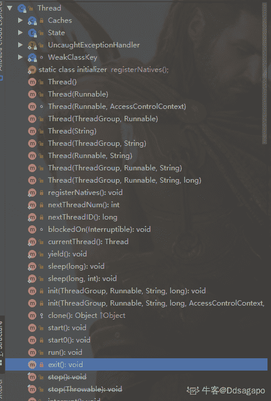

发表于 2019-08-15 17:24:49

* * *

[黑暗弥漫](https://www.nowcoder.com/profile/173789474)

```cpp
getPriority()是获取线程优先级的方法，在线程中没有 exit()方法，一般使用 return 结束，或者 ExitThread 函数
```

发表于 2019-08-15 15:08:18

* * *

## 82

```cpp
public static void main(String[] args) {
Thread t = new Thread() {

public void run() {
my360DW();
}
};

t.run();
System.out.print("DW");

}

static void my360DW() {

System.out.print("360");

}

```

正确答案: C   你的答案: 空 (错误)

```cpp
DW
```

```cpp
360
```

```cpp
360DW
```

```cpp
都不输出
```

本题知识点

安卓工程师 360 公司 Java 安卓工程师 360 公司 2018

讨论

[白杉](https://www.nowcoder.com/profile/942272017)

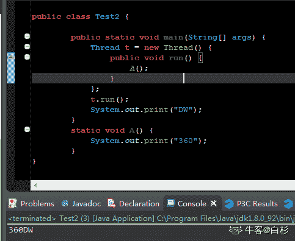

发表于 2019-08-15 20:01:34

* * *

[没意思了](https://www.nowcoder.com/profile/4559796)

挖槽神仙题目

发表于 2019-08-19 14:14:49

* * *

[悦千言](https://www.nowcoder.com/profile/320259883)

360DW 的方法名都不对

发表于 2019-08-16 13:20:44

* * *

## 83

ArrayList list = new ArrayList(20);中的 list 扩充几次

正确答案: A   你的答案: 空 (错误)

```cpp
0
```

```cpp
1
```

```cpp
2
```

```cpp
3
```

本题知识点

安卓工程师 360 公司 Java 安卓工程师 360 公司 2018

讨论

[idea0.1](https://www.nowcoder.com/profile/89475455)

当第一次插入元素时才分配 10（默认）个对象空间。之后扩容会按照 1.5 倍增长。

也就是当添加第 11 个数据的时候，Arraylist 继续扩容变为 10*1.5=15；

当添加第 16 个数据时，继续扩容变为 15 * 1.5 =22 个；

发表于 2019-08-15 21:34:44

* * *

[易燃易爆炸 i](https://www.nowcoder.com/profile/664516865)

该题指定初始化数组大小为 20，没有扩容；若为 ArrayList list = new ArrayList(); 则此时默认创建大小为 10 的数组，扩容 1.5 倍

发表于 2019-08-21 10:29:24

* * *

[斗魂 12138](https://www.nowcoder.com/profile/5704039)

就我一个人没看懂题目?

发表于 2019-09-26 11:30:24

* * *

## 84

下面的方法，当输入为 2 的时候返回值是多少？

```cpp
public static int getValue(int i) {
int result = 0;
switch (i) {
case 1:
result = result + i;
case 2:
result = result + i * 2;
case 3:
result = result + i * 3;
}
return result;
}
```

正确答案: D   你的答案: 空 (错误)

```cpp
0
```

```cpp
2
```

```cpp
4
```

```cpp
10
```

本题知识点

安卓工程师 360 公司 Java 安卓工程师 360 公司 2018

讨论

[半岛。](https://www.nowcoder.com/profile/397758587)

没有 break 不会停

发表于 2019-08-15 23:42:55

* * *

[窜天猴也是猴](https://www.nowcoder.com/profile/8138471)

case2 result=4 没有 break，走入 case3 result=4+6

发表于 2019-09-18 20:08:17

* * *

[划过夜空的星光](https://www.nowcoder.com/profile/331834333)

没有 break，会一直执行下去。

发表于 2019-10-17 12:31:49

* * *

## 85

JDK1.8 版本之前，抽象类和接口的区别，以下说法错误的是

正确答案: D   你的答案: 空 (错误)

```cpp
接口是公开的，里面不能有私有的方法或变量，是用于让别人使用的，而抽象类是可以有私有方法或私有变量的。
```

```cpp
abstract class 在 Java 语言中表示的是一种继承关系，一个类只能使用一次继承关系。但是，一个类却可以实现多个 interface，实现多重继承。接口还有标识（里面没有任何方法，如 Remote 接口）和数据共享（里面的变量全是常量）的作用。
```

```cpp
在 abstract class 中可以有自己的数据成员，也可以有非 abstarct 的成员方法，而在 interface 中，只能够有静态的不能被修改的数据成员（也就是必须是 static final 的，不过在 interface 中一般不定义数据成员），所有的成员方法默认都是 public abstract 类型的。
```

```cpp
abstract class 和 interface 所反映出的设计理念不同。其实 abstract class 表示的是"has-a"关系，interface 表示的是"is-a"关系。
```

本题知识点

安卓工程师 360 公司 Java 2018

讨论

[ThinkingOverflow](https://www.nowcoder.com/profile/165701207)

1）接口可以继承接口，而且可以继承多个接口，但是不能实现接口，因为接口中的方法全部是抽象的，无法实现；另外，如果是 Java 7 以及以前的版本，那么接口中可以包含的内容有：1\. 常量；2\. 抽象方法
如果是 Java 8，还可以额外包含有：3\. 默认方法；4\. 静态方法
如果是 Java 9，还可以额外包含有：5\. 私有方法
2）普通类可以实现接口，并且可以实现多个接口，但是只能继承一个类，这个类可以是抽象类也可以是普通类，如果继承抽象类，必须实现抽象类中的所有抽象方法，否则这个普通类必须设置为抽象类；3）抽象类可以实现接口，可以继承具体类，可以继承抽象类，也可以继承有构造器的实体类。抽象类中可以有静态 main 方法；抽象类里可以没有抽象方法，没有抽象方法的抽象类就是不想让别人实例化它；另外，抽象类可以有构造方法，只是不能直接创建抽象类的实例对象而已。在继承了抽象类的子类中通过 super(参数列表)调用抽象类中的构造方法，可以用于实例化抽象类的字段。下面总结常见的抽象类与接口的区别：1）抽象类和接口都不能直接实例化，如果要实例化，抽象类变量必须指向实现所有抽象方法的子类对象，接口变量必须指向实现所有接口方法的类对象；2）接口只能做方法申明，抽象类中可以做方法申明，也可以做方法实现（java8 中 接口可以有实现方法 使用 default 修饰）；3）接口里定义的变量只能是公共的静态的常量，抽象类中的变量是普通变量；4）抽象类里的抽象方法必须全部被子类所实现，如果子类不能全部实现父类抽象方法，那么该子类只能是抽象类。同样，一个类实现接口的时候，如不能全部实现接口方法，那么该类也只能为抽象类；5）抽象方法要被实现，所以不能是静态 static 的，也不能是私有 private 的，也不能被 final 修饰（试想一下，静态方法可以被类名直接调用，而类名直接调用一个没有实现的抽象方法没有意义）。总结得比较杂乱，见谅！

发表于 2020-03-31 01:29:42

* * *

[要向上](https://www.nowcoder.com/profile/31911074)

is-a:继承关系 has-a:从属关系 like-a:组合关系

发表于 2019-08-21 16:22:24

* * *

[卷袖](https://www.nowcoder.com/profile/762286075)

D 项： abstract class 表示的是"is-a"关系，interface 表示的是"like-a"关系。

发表于 2019-08-16 10:55:20

* * *

## 86

下面关于垃圾收集的说法正确的是

正确答案: D   你的答案: 空 (错误)

```cpp
一旦一个对象成为垃圾，就立刻被收集掉。
```

```cpp
对象空间被收集掉之后，会执行该对象的 finalize 方法
```

```cpp
finalize 方法和 C++的析构函数是完全一回事情
```

```cpp
一个对象成为垃圾是因为不再有引用指着它，但是线程并非如此
```

本题知识点

安卓工程师 360 公司 Java 安卓工程师 360 公司 2018

讨论

[adminroot](https://www.nowcoder.com/profile/1292047)

A,B 其实是一个知识点，既一个对象到 GC Roots 没有任何引用链相连时就是一个可回收对象，可回收对象在被回收之前，JVM 会判断是否有 finalize 方法，如果有则会调用 finalize 方法，在这个方法里面对象可以自救的。  C 肯定不对啦 1.与 C++的析构函数不同，析构函数调用确定，而 finalize()方法是不确定的，因为 finalize()方法在对象被 GC 回收时调用。 2.JVM 将重写了 finalize 方法的对象放置于 F-Queue 队列，稍后会被一个优先级很低的 Finalizer 线程执行。Finalizer 线程随时会终止，为了防止对象的 finalize 方法执行缓慢，或者发生死循环。 3.finaliz 的设计目的是保证对象在被垃圾收集前完成特定资源的回收或给予对象最后一次重生机会等。 4\. finalize 是个不太可控的方法因此并不常用，并且在 JDK9+版本被标注为过时方法。

编辑于 2019-08-25 08:39:56

* * *

[辣条真好吃](https://www.nowcoder.com/profile/3300579)

1.  当对象不再被任何对象引用时，GC 会调用该对象的 finalize()方法

发表于 2019-09-02 21:06:29

* * *

[不要不耐烦](https://www.nowcoder.com/profile/5091640)

对于 D 选项（引用计数法），Java 虚拟机不是采用的可达性分析法吗？

发表于 2019-08-20 11:32:01

* * *

## 87

以下哪个 I / O 类可以附加或更新文件

正确答案: A   你的答案: 空 (错误)

```cpp
RandomAccessFile()
```

```cpp
OutputStream()
```

```cpp
DataOutputStream()
```

```cpp
None of the above
```

本题知识点

安卓工程师 360 公司 Java 2018 C++

讨论

[UnnnnnnU](https://www.nowcoder.com/profile/641374590)

RandomAccessFile 可以通过 seek(long pos) 方法去移动文件指针进行追加更新写入.OutputStream() 是一个抽象类 不能直接实例化去写入 DataOutputStream() 也无法追加写入

发表于 2019-08-17 11:31:48

* * *

[luckyun（Shopee 内推）](https://www.nowcoder.com/profile/489443892)

有看到 File 选的吗😂

发表于 2020-05-18 20:33:39

* * *

[就不给你佛](https://www.nowcoder.com/profile/657108121)

附加或更新文件，应该是针对于文件的节点流或包装了文件节点流的处理流。 B/C 都排除。 A 这个流不熟悉， 选了 D。 允悲……

发表于 2019-08-27 23:37:38

* * *

## 88

给定以下方法声明，调用执行 mystery（1234）的输出结果？

```cpp
//precondition:  x >=0
public void mystery (int x)
{
System.out.print(x % 10);

if ((x / 10) != 0)
{
mystery(x / 10);
}
System.out.print(x % 10);
}
```

正确答案: B   你的答案: 空 (错误)

```cpp
1441
```

```cpp
43211234
```

```cpp
3443
```

```cpp
12344321
```

本题知识点

安卓工程师 360 公司 Java 2018

讨论

[古城寂寞](https://www.nowcoder.com/profile/651099649)

这个题目是考递归，总共调用了 4 次 mystery 方法，注意：程序是从上往下执行的，所以当一个方法，调用另一个或本方法时，程序会等调用完毕以后在接着执行 1.**第一次调用 mystery 方法**，此时**参数（x）为 1234,**进入第四行，x 不变为***x=1234***，1234%10=4,***输出 4***2.接着进入 if 语句，1234/10=123 !=0,进入 if 语句，此时 x 还是 1234,接着**第二次调用 mystery 方法****（****此时第一次调用的方法不会继续执行，会等第二次（本次）调用的方法执行完毕后继续执行）**，mystery(x/10),**传入的参数(x)为 123**,然后第四行 123%10=3,参数还是不变为 123，***输出 3***3.接着进入 if 语句，**第三次调用 mystery()方法（此时第二次调用的方法不会继续执行，会等第三次（本次）调用的方法执行完毕后继续执行）**，**传入参数为 123/10=12, x=12**,接着第四行 12%10=2，传入的参数值不会变，***输出 2***4.然后进入 if 语句 12/10!=0,**第四次调用 mystery()方法（此时第三次调用的方法不会继续执行，会等第四次调用的方法（本次）执行完毕后继续执行），**传入的******参数（x=1）为 1**，进入第四行 1%10，***输出 1***5.然后进入 if 语句 1/10=0**不满足**if 语句 x/10 != 0,所以本次**不会继续调用 mystery 方法**，然后程序继续执行调用下面的输出参数为 1，1%10，***输出 1***6**.然后第四次调用的方法执行结束**然后返回第三次调用的方法继续执行，调用下面的输出，参数为 12,x%10=2，***输出 2***7.**然后第三次调用的方法执行结束**然后返回第二次调用的方法继续执行，此时调用下面的输出，参数为 123,x%10=3,***输出 3***8.**最后第二次调用的方法执行结束然后****回第一次调用的方法继续执行**，此时调用下面的输出，参数为 1234,x%10=4,***输出 4***9.**第一次调用方法结束**

发表于 2019-08-28 12:56:13

* * *

[米兰的小铁匠丶](https://www.nowcoder.com/profile/3302270)

优先会输出 1234%10=4，选 B。后面不用看了

发表于 2020-03-12 21:17:46

* * *

[我是真的菜得 1P](https://www.nowcoder.com/profile/81461441)

递归严格把握一点就不会出错：递归的实现就是借助于系统为我们程序运行提供的栈来实现的。栈的特性决定了递归函数先进后出的特性。

发表于 2020-05-20 15:48:05

* * *

## 89

假设一个 list 初始化为{2，9，5，4，8，1}。 在第一次冒泡排序后，list 变成了（）?

正确答案: D   你的答案: 空 (错误)

```cpp
2, 9, 5, 4, 8, 1
```

```cpp
2, 9, 5, 4, 1, 8
```

```cpp
2, 5, 9, 4, 8, 1
```

```cpp
2, 5, 4, 8, 1, 9
```

本题知识点

安卓工程师 360 公司 排序 *安卓工程师 360 公司 2018* *讨论

[初木。](https://www.nowcoder.com/profile/205961893)

2，9，5，4，8，1
第一趟：2，5，4，8，1，9 第二趟：2，4，5，1，8，9 第三趟：2，4，1，5，8，9 第四趟：2，1，4，5，8，9 第五趟：1，2，4，5，8，9 应该是这样的，望大神指正

发表于 2019-08-20 20:45:44

* * *

## 90

如果一个 list 初始化为{5，3，1}，执行以下代码后，其结果为（）？

```cpp
nums.add(6);
nums.add(0,4);
nums.remove(1);
```

正确答案: B   你的答案: 空 (错误)

```cpp
[5, 3, 1, 6]
```

```cpp
[4, 3, 1, 6]
```

```cpp
[4, 3, 6]
```

```cpp
[5, 3, 6]
```

本题知识点

安卓工程师 360 公司 Java 2018

讨论

[JackieDeng](https://www.nowcoder.com/profile/877191350)

list{5,3,1}nums.add(6); //往后边加一个 6，{5，3，1，6}nums.add(0,4);//往下标为 0 的数加一个 4，{4，5，3，1，6}
nums.remove(1); // 移除下标为 1 的元素，{4，3，1，6}

发表于 2019-08-22 11:46:50

* * *

[bobbie.ho](https://www.nowcoder.com/profile/426351696)

好深的套路、不自觉的就选 C 的有没有😂😂😂😂

发表于 2019-08-22 22:57:34

* * *

[神猪](https://www.nowcoder.com/profile/1581559)

{5，3，1}

```cpp
nums.add(6);       //[5, 3, 1, 6]     
nums.add(0,4);     //[4, 5, 3, 1, 6] 
nums.remove(1);    //[4, 3, 1, 6]
```

发表于 2019-08-18 21:03:56

* * *

## 91

假设 num 已经被创建为一个 ArrayList 对象，并且最初包含以下整数值：[0，0，4，2，5，0，3，0]。 执行下面的方法 numQuest(),最终的输出结果是什么？

```cpp
private List<Integer> nums;

//precondition: nums.size() > 0
//nums contains Integer objects
public void numQuest() {
int k = 0;
Integer zero = new Integer(0);
while (k < nums.size()) {
if (nums.get(k).equals(zero))
nums.remove(k);
k++;
}
}
```

正确答案: D   你的答案: 空 (错误)

```cpp
[3, 5, 2, 4, 0, 0, 0, 0]
```

```cpp
[0, 0, 0, 0, 4, 2, 5, 3]
```

```cpp
[0, 0, 4, 2, 5, 0, 3, 0]
```

```cpp
[0, 4, 2, 5, 3]
```

本题知识点

安卓工程师 360 公司 Java 安卓工程师 360 公司 2018

讨论

[嘿嘿嘿 1212](https://www.nowcoder.com/profile/218851929)

在执行循环时碰到了 0 的对象,进行删除使数组减少一个数,List 为 [0, 4, 2, 5, 0, 3, 0],但是下一次 k=1,所以将在 4 的位置开始比较,跳过 0 而将在 List 索引为 4 的位置再次碰到 0 的对象,得到 List 为[0, 4, 2, 5, 3, 0],此时下一次的 k=5,跳过了 3 然而 LIst 的索引为 5 的位置是 0 的对象,再进行删除.得到答案:[0, 4, 2, 5, 3]
总结:由于 remove()删除了 List 集合元素,导致集合产生变化,而索引未进行修正,导致跳过了一些元素.

发表于 2019-08-26 12:54:20

* * *

[秋天傍晚](https://www.nowcoder.com/profile/554237281)

remove 函数会删除集合中的元素，使集合序列发生改变

发表于 2019-09-15 22:07:46

* * *

[悦千言](https://www.nowcoder.com/profile/320259883)

数组 [0，0，4，2，5，0，3，0]，此时 k=0，对应第一个 0，remove 移除指定角标的数据，其他数据向前移动以补充空缺。所以移除第一个 0 时，数组变成了[0，4，2，5，0，3，0]，此时 k=1，对应 4。因此最开始的位置会留有一个 0，循环后半部分同理。

发表于 2019-09-05 10:17:48

* * *

## 92

假定 Base b = new Derived（）; 调用执行 b.methodOne（）后，输出结果是什么？

```cpp
public class Base
{
public void methodOne()
{
System.out.print("A");
methodTwo();
}

public void methodTwo()
{
System.out.print("B");
}
}

public class Derived extends Base
{
public void methodOne()
{
super.methodOne();
System.out.print("C");
}

public void methodTwo()
{
super.methodTwo();
System.out.print("D");
}
}
```

正确答案: A   你的答案: 空 (错误)

```cpp
ABDC
```

```cpp
AB
```

```cpp
ABCD
```

```cpp
ABC
```

本题知识点

安卓工程师 360 公司 Java 安卓工程师 360 公司 2018

讨论

[Redux](https://www.nowcoder.com/profile/159119444)

首先儿子方法 1 调老子方法 1，打印 A 然后老子方法 1 里面本应该是调自己方法 2，由于多态，此处是儿子的对象，于是会调儿子方法 2。儿子方法 2 里第一句调老子方法 2，打印 B；第二句打印 D 最后儿子方法 1 第一句结束，第二句打印 C 虚区 ABDC

发表于 2019-08-26 17:21:28

* * *

[呆呆小瓜](https://www.nowcoder.com/profile/809974115)

关键要点父类引用指向子类对象即可;

一个 Father 类,一个 Son 类,当 Father A=new Son()时就是向上转型,向上转型会让 A 中的引用变为 Son 的实例,此时也可以说 A 指向了对内存中的 Son,这时候 A 就是可以理解为一个 Son 对象,但是 A 中不再具备除了和 Son 共有的其他方法.

发表于 2019-10-14 09:45:15

* * *

[给我 offer 吧我要哭了](https://www.nowcoder.com/profile/230952597)

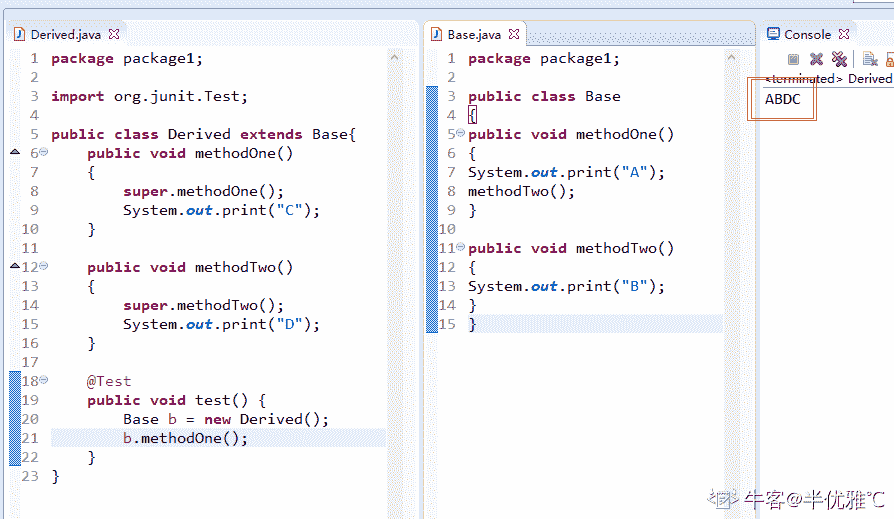确实是 ABDC 父类方法子类方法都会执行，不是很理解为什么还会执行子类的方法，求一个大神解答

发表于 2019-08-25 21:09:02

* * *

## 93

在选择排序中，以下什么情况下选择排序会更快执行？

正确答案: C   你的答案: 空 (错误)

```cpp
数据已按升序排列
```

```cpp
数据已按升降序排列
```

```cpp
俩者花费时间一样
```

本题知识点

安卓工程师 360 公司 排序 *安卓工程师 360 公司 2018* *讨论

[一抹秋白头](https://www.nowcoder.com/profile/940458458)

比较次数为 n

发表于 2019-10-18 11:27:01

* * *

## 94

初始化数组  int [] arr = {2，10，23，31，55，86}，使用二分查询算法查找 55，需要循环执行多少次才能命中目标？

正确答案: B   你的答案: 空 (错误)

```cpp
1
```

```cpp
2
```

```cpp
3
```

```cpp
4
```

本题知识点

安卓工程师 360 公司 数组 安卓工程师 360 公司 2018

讨论

[初一十五三十](https://www.nowcoder.com/profile/807445360)

关键数 55 首次和 arr[(0+5)/2]=23 比较，55>arr[(0+5)/2]，因此，55 继续和 arr[((2+1)+5)/2]=55 比较，55=arr[((2+1)+5)/2]，循环停止。其中，5=arr.length-1。 发表于 2019-09-03 14:32:06

* * *

[水果兵台武士](https://www.nowcoder.com/profile/3931046)

二分查找，查找数组取中间得那个数；6/2=3；第一次查找到第 3 个数，23；55 比 23 大，第 2 次在 31，55，86 中取中间 55，正是；所以查找了 2 次。

发表于 2019-08-24 17:48:45

* * *

[它解](https://www.nowcoder.com/profile/185487004)

二分查找算法，前提是一个有顺序的数组源，定义一个头和尾，取出中间的那个值，与目标值进行比较，目标值等于中间值，直接输出，目标值大于中间值，证明目标值在右边，就把头改变成这个中间值，这样就达到缩小查找范围，小于的话，就把中间值设置成尾。

发表于 2019-08-24 14:35:48

* * *

## 95

以下哪些方法是 Object 类中的方法

正确答案: A B C D   你的答案: 空 (错误)

```cpp
clone()
```

```cpp
toString()
```

```cpp
wait()
```

```cpp
finalize()
```

本题知识点

安卓工程师 360 公司 Java 2018

讨论

[小菜鸡!](https://www.nowcoder.com/profile/330581894)

答案 A????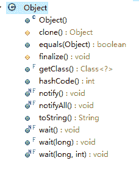

发表于 2019-08-17 23:45:13

* * *

[一心匡扶汉室](https://www.nowcoder.com/profile/257056865)

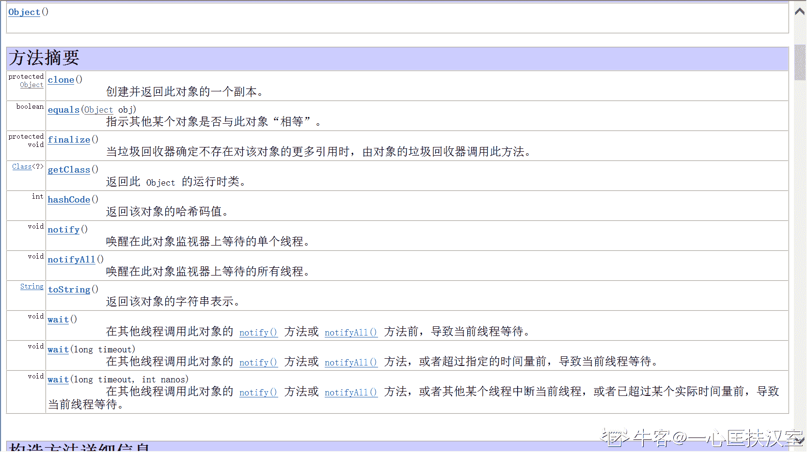

发表于 2020-07-17 22:30:36

* * *

[伊万夫斯基](https://www.nowcoder.com/profile/815472960)

我不要你觉得，我要我觉得，这道题选 ABCD

发表于 2019-08-27 00:25:15

* * *

## 96

假如某个 JAVA 进程的 JVM 参数配置如下：
-Xms1G -Xmx2G -Xmn500M -XX:MaxPermSize=64M -XX:+UseConcMarkSweepGC -XX:SurvivorRatio=3,
请问 eden 区最终分配的大小是多少？

正确答案: C   你的答案: 空 (错误)

```cpp
64M
```

```cpp
500M
```

```cpp
300M
```

```cpp
100M
```

本题知识点

安卓工程师 360 公司 Java 2018

讨论

[你的 offer 对我打了烊](https://www.nowcoder.com/profile/598309941)

这是网易 2016 年在线笔试题中的一道选择题。 
先分析一下里面各个参数的含义： 
-Xms：1G ， 就是说初始堆大小为 1G 
-Xmx：2G ， 就是说最大堆大小为 2G 
-Xmn：500M ，就是说年轻代大小是 500M（包括一个 Eden 和两个 Survivor） 
-XX:MaxPermSize：64M ， 就是说设置持久代最大值为 64M 
-XX:+UseConcMarkSweepGC ， 就是说使用使用 CMS 内存收集算法 
-XX:SurvivorRatio=3 ， 就是说 Eden 区与 Survivor 区的大小比值为 3：1：1
题目中所问的 Eden 区的大小是指年轻代的大小，直接根据-Xmn：500M 和-XX:SurvivorRatio=3 可以直接计算得出 500M*(3/(3+1+1)) 
=500M*（3/5） 
=500M*0.6 
=300M  
所以 Eden 区域的大小为 300M。

发表于 2020-02-26 18:51:16

* * *

[牛客 7665501 号](https://www.nowcoder.com/profile/7665501)

Xms 起始内存

Xmx 最大内存

Xmn 新生代内存

Xss 栈大小。 就是创建线程后，分配给每一个线程的内存大小

-XX:NewRatio=n:设置年轻代和年老代的比值。如:为 3，表示年轻代与年老代比值为 1：3，年轻代占整个年轻代年老代和的 1/4

-XX:SurvivorRatio=n:年轻代中 Eden 区与两个 Survivor 区的比值。注意 Survivor 区有两个。如：3，表示 Eden：Survivor=3：2，一个 Survivor 区占整个年轻代的 1/5

-XX:MaxPermSize=n:设置持久代大小

收集器设置
-XX:+UseSerialGC:设置串行收集器
-XX:+UseParallelGC:设置并行收集器
-XX:+UseParalledlOldGC:设置并行年老代收集器
-XX:+UseConcMarkSweepGC:设置并发收集器
垃圾回收统计信息
-XX:+PrintGC
-XX:+PrintGCDetails
-XX:+PrintGCTimeStamps
-Xloggc:filename
并行收集器设置
-XX:ParallelGCThreads=n:设置并行收集器收集时使用的 CPU 数。并行收集线程数。
-XX:MaxGCPauseMillis=n:设置并行收集最大暂停时间
-XX:GCTimeRatio=n:设置垃圾回收时间占程序运行时间的百分比。公式为 1/(1+n)
并发收集器设置
-XX:+CMSIncrementalMode:设置为增量模式。适用于单 CPU 情况。
-XX:ParallelGCThreads=n:设置并发收集器年轻代收集方式为并行收集时，使用的 CPU 数。并行收集线程数。

发表于 2019-08-30 22:20:37

* * *

[李家鑫之助](https://www.nowcoder.com/profile/240361414)

java **-Xmx2G -Xms1G -Xmn500M** **-Xss128k**
**-****Xmx2G**：设置 JVM 最大可用内存为 2G。
**-Xms1G**：设置 JVM 促使内存为 1G。此值可以设置与-Xmx 相同，以避免每次垃圾回收完成后 JVM 重新分配内存。 **-Xmn500M**：设置年轻代大小为 2G。**整个 JVM 内存大小=年轻代大小 + 年老代大小 + 持久代大小**。

**-XX:SurvivorRatio=3****:**新生代中又会划分为 Eden 区，from Survivor、to Survivor 区。

其中 Eden 和 Survivor 区的比例默认是 8:1:1，当然也支持参数调整 -XX:SurvivorRatio=3 的话就是 3:1:1。故该题为 500*（3/5）=300M.

编辑于 2019-08-21 21:43:30

* * *

## 97

以下说法中正确的有？

正确答案: A D   你的答案: 空 (错误)

```cpp
StringBuilder 是 线程不安全的
```

```cpp
Java 类可以同时用 abstract 和 final 声明
```

```cpp
HashMap 中，使用 get(key)==null 可以 判断这个 Hasmap 是否包含这个 key
```

```cpp
volatile 关键字不保证对变量操作的原子性
```

本题知识点

安卓工程师 360 公司 Java 安卓工程师 360 公司 2018

讨论

[WUW](https://www.nowcoder.com/profile/3142114)

StringBuffer 是线程安全的   StringBuilder 是非线程安全的 final 类不能再被声明为 abastract 类 HashMap 中可以有 null 值 所有 map.get(key)=null 无法判断是否存在这个 keyviolate 不保证原子性 只保证可见性和顺序性

发表于 2019-08-31 11:47:51

* * *

[给我 offer 吧我要哭了](https://www.nowcoder.com/profile/230952597)

360 就是来添乱的

发表于 2019-08-27 10:15:47

* * *

[取名字超纠结](https://www.nowcoder.com/profile/785127358)

这题应该选择 AD!

发表于 2019-09-05 15:54:15

* * *

## 98

下面哪种设计模式，不属于创建型设计模式？

正确答案: D   你的答案: 空 (错误)

```cpp
工厂方法模式
```

```cpp
抽象工厂模式
```

```cpp
单例模式
```

```cpp
模板方法模式
```

本题知识点

安卓工程师 360 公司 安卓工程师 360 公司 安卓工程师 360 公司 安卓工程师 360 公司 设计模式 安卓工程师 360 公司 2018

## 99

以下关于继承的叙述正确的是

正确答案: A   你的答案: 空 (错误)

```cpp
在 Java 中类只允许单一继承
```

```cpp
在 Java 中一个类不能同时继承一个类和实现一个接口
```

```cpp
在 Java 中接口只允许单一继承
```

```cpp
在 Java 中一个类只能实现一个接口
```

本题知识点

安卓工程师 360 公司 Java 安卓工程师 360 公司 2018

讨论

[请叫我码农](https://www.nowcoder.com/profile/908837333)

Java 中，

A：类只能单继承，切记是类而不是接口！

B：类可同时继承一个类和实现一个接口

C：接口中允许多继承，解决了类只能单继承的问题

D：一个类可以实现多个接口

发表于 2019-08-25 23:33:54

* * *

## 100

下列哪个类的声明是正确的？

正确答案: B   你的答案: 空 (错误)

```cpp
protected private number;
```

```cpp
public abstract class Car{}
```

```cpp
abstract private move(){}
```

```cpp
abstract final class HI{}
```

本题知识点

安卓工程师 360 公司 Java 安卓工程师 360 公司 2018

讨论

[倔强 201908071341197](https://www.nowcoder.com/profile/617968140)

抽象类的目的就是为了让子类实现他本身的方法 final 修饰的东西不能被更改或继承 abstract 存在的意义是为了让子类实现方法而存在，final 的意义是不让子类进行修改。两者存在互斥关系

发表于 2019-08-20 09:43:12

* * *

[SeakingYa](https://www.nowcoder.com/profile/133086459)

抽象方法不是应该没有方法体吗，这个题有正确答案？

发表于 2019-10-24 08:21:42

* * *

[IDEA2022.4.2](https://www.nowcoder.com/profile/181223548)

看题目类的声明排除 A，抽象类是用来被继承的，final 修饰的类不能被继承，排除 D.private 是私有的，子类不能访问

发表于 2019-08-21 12:25:10

* * *

## 101

在 Java 中，一个类可同时定义许多同名的方法，这些方法的形式参数个数、类型或顺序各不相同，传回的值也可以不相同。这种面向对象程序的特性称为

正确答案: C   你的答案: 空 (错误)

```cpp
隐藏
```

```cpp
覆盖
```

```cpp
重载
```

```cpp
Java 不支持此特性
```

本题知识点

安卓工程师 360 公司 Java 安卓工程师 360 公司 2018

讨论

[IDEA2022.4.2](https://www.nowcoder.com/profile/181223548)

不会的过来和我交流一下人生

发表于 2019-08-21 11:52:19

* * *

[不浪费每一天](https://www.nowcoder.com/profile/415073079)

直接屏蔽

发表于 2019-10-14 16:22:29

* * *

[shellhub](https://www.nowcoder.com/profile/4830522)

这题学过 java 的都会

发表于 2019-08-20 22:40:02

* * *

## 102

以下哪个方法用于定义线程的执行体？

正确答案: C   你的答案: 空 (错误)

```cpp
start()
```

```cpp
init()
```

```cpp
run()
```

```cpp
synchronized()
```

本题知识点

安卓工程师 360 公司 Java 安卓工程师 360 公司 2018

讨论

[IDEA2022.4.2](https://www.nowcoder.com/profile/181223548)

run 方法线程执行体，start 方法开启多线程

发表于 2019-08-21 21:49:19

* * *

[秋天傍晚](https://www.nowcoder.com/profile/554237281)

run 方法线程执行体，start 方法开启线程

发表于 2019-09-25 00:04:42

* * *

[王德华](https://www.nowcoder.com/profile/762147819)

线程三种创建方式，继承、实现、线程池中创建。线程的逻辑代码放在 run 方法中，run 方法是需要重写

发表于 2019-09-03 21:20:10

* * *

## 103

使用迪杰斯特拉（Dijkstra）算法求下图中从顶点 1 到其他各顶点的最短路径，依次得到最短路径的目标顶点是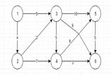

正确答案: C   你的答案: 空 (错误)

```cpp
2,3,4,5,6
```

```cpp
2,3,5,6,4
```

```cpp
2,3,4,6,5
```

```cpp
2,3,6,5,4
```

本题知识点

安卓工程师 360 公司 高级算法 安卓工程师 360 公司 2018

## 104

n 为算法执行时间，则递归公式 T(n)=1,n=1
T(n)=4T(n/2)+n,n>1 的时间复杂度为

正确答案: D   你的答案: 空 (错误)

```cpp
O(n)
```

```cpp
O(logn)
```

```cpp
O(nlogn)
```

```cpp
O(n2)
```

本题知识点

安卓工程师 360 公司 复杂度 2018

讨论

[小狼狗刷刷题](https://www.nowcoder.com/profile/364416022)

a =4 b=2 d = 1a > b^d 所以调用 n^(logba) =n²

发表于 2019-08-16 17:55:54

* * *

[牛客 127019609 号](https://www.nowcoder.com/profile/127019609)

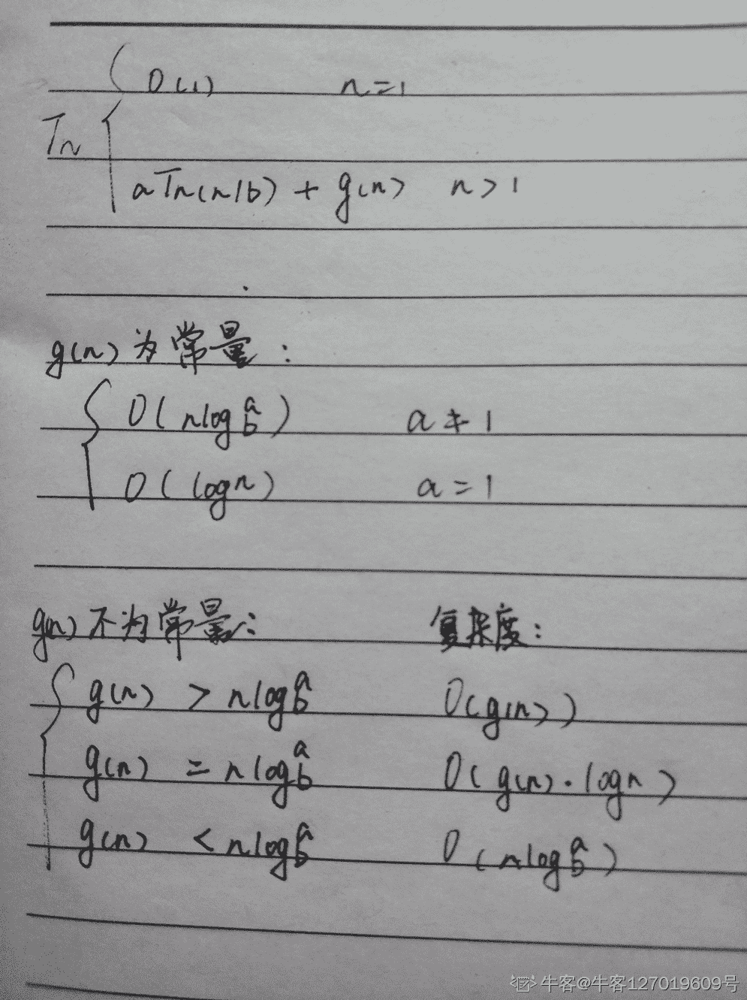

发表于 2020-09-20 17:03:49

* * ***</file.h></stdio.h>*******