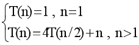

# 三百六十、公司-2018 春招笔试-C 开发工程师客观题合集

## 1

下列说法中正确的是（      ）

正确答案: A   你的答案: 空 (错误)

```cpp
冒泡排序法的平均时间复杂度为 O(n²)
```

```cpp
二分法的平均时间复杂度度是 O（n）
```

```cpp
m 个并列循环的时间复杂度为 O（mn）
```

```cpp
快速排序法的时间复杂度一定优于冒泡排序法
```

本题知识点

C++工程师 360 公司 复杂度 排序 *C++工程师 360 公司 2018* *讨论

[牛客 900924570 号](https://www.nowcoder.com/profile/900924570)

快速排序法的最坏的情况下时间复杂度等于冒泡排序法，都为 O(n²)

发表于 2020-03-24 11:21:04

* * *

[淼王星](https://www.nowcoder.com/profile/292214448)

A. 正确 B. 二分查找，也称折半查找，平均时间复杂度是 O(logn)C. m 个时间复杂度为 O(n) 的并列循环，其时间复杂度才是 O(mn)

发表于 2019-09-03 16:55:42

* * *

## 2

关键字序列为{12，11，19，23，1，6，10},哈希函数为 H(key)=key MOD 11,用链地址法构造哈希表,哈希地址为 1 的链中有（      ）个记录（      ）

正确答案: D   你的答案: 空 (错误)

```cpp
7
```

```cpp
5
```

```cpp
4
```

```cpp
3
```

本题知识点

C++工程师 360 公司 哈希 *C++工程师 360 公司 2018* *讨论

[快到碗里来 offer](https://www.nowcoder.com/profile/37481267)

每一个关键字都 mod 11，得到的数是 1 的，放大地址为 1 的地方，12 mod 11=1,23 mod 11=1,1 mod 11=1,所以地址 1 处有三记录

发表于 2019-09-01 16:25:23

* * *

## 3

下面关于动态规划说法正确的是

正确答案: A   你的答案: 空 (错误)

```cpp
他是利用子结构，进行自底而上的算法设计
```

```cpp
他需要后来多次计算的问题进行缓存，减少重复子问题的计算
```

```cpp
他所求问题的整体最优解可以通过一系列局部最优的选择
```

```cpp
他将分解后的子问题看成相互独立的.
```

本题知识点

C++工程师 360 公司 动态规划 C++工程师 360 公司 2018

讨论

[程序猿 Go 师傅](https://www.nowcoder.com/profile/242025553)

*   A：虽然有点像在描述分治法，不过描述动规也是对的。

*   B：动规对整体问题的最优解依赖于各个子问题的最优解，所以子问题的最优解会记录，不会缓存其他的非最优解。

*   C：动规的整体最优解是各个子问题的最优解，而不是局部最优。子问题不等于局部。

*   D：动规的子问题之间是有依赖关系，不是相互独立的。


编辑于 2019-10-21 16:50:11

* * *

## 4

下列关于排序算法的描述错误的是

正确答案: B   你的答案: 空 (错误)

```cpp
在待排序的记录集中，存在多个具有相同键值的记录，若经过排序，这些记录的相对次序仍然保持不变，称这种排序为稳定排序
```

```cpp
二叉查找树的查找效率与二叉树的树型有关，在节点太复杂时其查找效率最低
```

```cpp
下列排序算法中，希尔排序在某趟排序结束后不一定能选出一个元素放到其最终位置上。
```

```cpp
在下列排序方法中,插入排序方法可能出现这种情况:在最后一趟开始之前,所有的元素都不在其最终应在的正确位置上
```

本题知识点

C++工程师 360 公司 排序 *C++工程师 360 公司 2018* *讨论

[香草可乐好喝](https://www.nowcoder.com/profile/1697691)

二叉查找树，二插排序树，二叉平衡树，查找效率只跟树的高度有关

发表于 2019-08-27 20:38:18

* * *

## 5

请指出以下代码段使用了何种算法

```cpp
public void func(int[] arr1, int k, int m,int[] arr2) { 
arr2[0] = 0; 
for (int i = 1; i <= m; i++) { 
int min = i; 
for (int j = 0; j < k; j++) { 
if (arr1[j] <= i) { 
int temp = arr2[i - arr1[j]] + 1; 
if (temp < min) { 
min = temp; 
} 
} 
} 
arr2[i] = min; 
} 
}
```

正确答案: B   你的答案: 空 (错误)

```cpp
分治算法
```

```cpp
动态规划
```

```cpp
贪心算法
```

```cpp
回溯算法
```

本题知识点

C++工程师 360 公司 动态规划 2018

## 6

已知如下递归代码用于求解图的 m 着色问题：

```cpp
#define N 10 
int a[N+1][N+1]; //存储图
int x[N+1];//记录颜色
int sum=0;//保存可着色方案数

void backtrace(int t,int m)
{
int i;
if(t>N)//搜索至叶节点 
{
sum++;
printf("第%d 种方案：\n",sum);
for(i=1;i<=N;i++)
printf("%d ",x[i]);
printf("\n");
}
else
{
for(i=1;i<=m;i++) //逐个判断每种颜色 
{
if(check(t,i))
{   x[t]=i;
backtrace(t+1,m);
}
}
}
}
```

其中 check()函数用于检测某个节点颜色是否合法，以下 check()函数正确的是：

正确答案: D   你的答案: 空 (错误)

```cpp
int check(int t,int i)//检测函数 {     int j;     for(j=1;j&lt;t;j++)     {         if(a[t][j]==1&amp;&amp;x[i]==j)                  return 0;            }     return 1; }
```

```cpp
int check(int t,int i)//检测函数 {     int j;     for(j=1;j&lt;t;j++)     {         if(a[t][j]==1||x[i]==j)                  return 0;            }     return 1; }
```

```cpp
int check(int t,int i)//检测函数 {     int j;     for(j=1;j&lt;t;j++)     {         if(a[t][j]==1||x[j]==i)                  return 0;            }     return 1; }
```

```cpp
int check(int t,int i)//检测函数 {     int j;     for(j=1;j&lt;t;j++)     {         if(a[t][j]==1&amp;&amp;x[j]==i)                  return 0;            }     return 1; }
```

本题知识点

C++工程师 360 公司 C++ C++工程师 360 公司 2018

讨论

[我的天鸭](https://www.nowcoder.com/profile/243498)

```cpp
int check(int t,int i){     
    int j;     
    for(j=1;j<t;j++){    //遍历已经涂色过的所有节点         
        if(a[t][j]==1&&x[j]==i)    //当前节点 t 与已涂色过的节点 j 有边相连并且颜色与 t 颜色相同,返回无效,需要增加颜色
            return 0;            
    }     
    return 1; 
}
```

 发表于 2019-08-21 11:45:11

* * *

[腹黑 gg](https://www.nowcoder.com/profile/7970791)

```cpp
//当 t 跟 j 是相邻并且 j 已经等于 i，那么 t 就不可以等于 i 了
```

```cpp
for(j = 1;j<t;j++)
```

```cpp
{
```

```cpp
    if(a[t][j] == 1&&x[j] == i)
```

```cpp
        return 0;
```

```cpp
}
```

发表于 2018-12-18 23:10:40

* * *

[午睡到凌晨](https://www.nowcoder.com/profile/970053141)

求大佬解读代码

发表于 2019-10-28 23:26:57

* * *

## 7

一个线性序列（30，14，40，63，22，5），假定采用散列函数 Hash(key)=key%7 来计算散列地址，将其散列存储在 A[0~6]中，采用链地址法解决冲突。若查找每个元素的概率相同，则查找成功的平均查找长度是（      ）。

正确答案: B   你的答案: 空 (错误)

```cpp
4/3
```

```cpp
1
```

```cpp
3/2
```

```cpp
5/3
```

本题知识点

C++工程师 360 公司 查找 *C++工程师 360 公司 2018* *讨论

[逝雨](https://www.nowcoder.com/profile/662164561)

答案是 a 吧。。。

发表于 2019-08-29 22:01:38

* * *

[寒月照三更](https://www.nowcoder.com/profile/122796058)

选 A

发表于 2019-10-30 17:10:15

* * *

[美丽的哎我去](https://www.nowcoder.com/profile/833222659)

求正解

发表于 2019-10-22 08:24:33

* * *

## 8

下列程序段的时间复杂度是（    ）

```cpp
count = 1；
for(k=1;k<2n;k*=2)
for(i=1;i<4n;i+=2)
count++;
```

正确答案: C   你的答案: 空 (错误)

```cpp
O(n2)
```

```cpp
O(8n2)
```

```cpp
O(nlog2n)
```

```cpp
O(n)
```

本题知识点

C++工程师 360 公司 复杂度 C++工程师 360 公司 2018

讨论

[淼王星](https://www.nowcoder.com/profile/292214448)

1.  外层循环是 k*=2 ，因此是 O(logn)
2.  内层循环是 i+=2，复杂度是 O(n)
3.  相乘得到答案 C

发表于 2019-09-03 17:11:09

* * *

## 9

递归公式


的时间复杂度为(    )。

正确答案: D   你的答案: 空 (错误)

```cpp
O(n)
```

```cpp
O(logn)
```

```cpp
O(nlogn)
```

```cpp
O(n2)
```

本题知识点

C++工程师 360 公司 C++工程师 360 公司 2018

## 10

有关贪心法叙述正确的是（      ）

正确答案: A   你的答案: 空 (错误)

```cpp
采用局部最优策略
```

```cpp
采用全局最优策略
```

```cpp
在贪心法中采用逐步构造最优解的方法
```

```cpp
把问题分解为简单的问题求解
```

本题知识点

C++工程师 360 公司 贪心 C++工程师 360 公司 2018

## 11

在选择分治法解决问题时，应考虑待解决问题应具有哪些特征（      ）

正确答案: A   你的答案: 空 (错误)

```cpp
待解决问题规模缩小到一定程度后可以容易解决
```

```cpp
待解决问题应可以分解为若干个规模较小的相同问题，且子问题应可直接求解。
```

```cpp
各子问题之间是相互独立的
```

```cpp
分解后的子问题的解可以合并为源问题的解
```

本题知识点

C++工程师 360 公司 分治 C++工程师 360 公司 2018

## 12

在有序表中，关于斐波那契查找和折半查找说法错误的是（）

正确答案: A B C   你的答案: 空 (错误)

```cpp
就平均性能而言，斐波那契查找的平均性能比折半查找差
```

```cpp
只有有序表中元素个数 n 等于某个斐波那契数时才能用斐波那契查找算法
```

```cpp
在最坏情况下，斐波那契查找的性能比折半查找好
```

```cpp
折半查找时间复杂度为 O(log2n)
```

本题知识点

C++工程师 360 公司 查找 *C++工程师 360 公司 2018* *讨论

[高高手](https://www.nowcoder.com/profile/566035028)

```cpp
就平均性能而言，斐波那契查找的平均性能比折半查找好
```

发表于 2019-09-30 20:37:43

* * *

[wuyaopray](https://www.nowcoder.com/profile/692494285)

```cpp
在最坏情况下，斐波那契查找的性能比折半查找好

```

请问这个是为什么是正确的？我的理解是，在最坏情况下，    斐波那契查找的数量从 F(n)减少到 F(n-1)，排除的数量是 F(n-2)，    折半查找从 F(n)到 F(n)/2，排除的数量是 F(n)/2    F(n)/2 大于 F(n-2)的呀，所以，在**最坏的情况下，****斐波那契查找的性能比折半查找差**

发表于 2019-10-15 11:52:29

* * *

## 13

下面说法错误的是（）

正确答案: B D   你的答案: 空 (错误)

```cpp
快速排序算法平均速度最快
```

```cpp
堆排序在每一趟排序过程中，都会有一个元素被放置在最终位置上
```

```cpp
在 10000 个无序的元素中查找最大的 10 个元素，使用快速排序最快
```

```cpp
插入排序是一种稳定的排序算法
```

本题知识点

C++工程师 360 公司 排序 *C++工程师 360 公司 2018* *讨论

[菜比保洁员](https://www.nowcoder.com/profile/165625040)

不理解为什么不是 c 错堆排序每一趟都得到了最大（最小）的，也就是最终位置 10000 个元素如果用堆排序只需要 10 趟，而快排需要碰运气，刚好某一趟的最后一个轴正好有 10 个比他大

发表于 2019-04-16 16:42:05

* * *

[风中沉思](https://www.nowcoder.com/profile/9087105)

D 选项，插入排序是一种稳定的排序算法，这是对的

发表于 2019-10-23 19:22:47

* * *

[蒙牛麦片](https://www.nowcoder.com/profile/43911588)

明显给的答案错误好吧

发表于 2019-09-04 21:25:16

* * *

## 14

对于函数 y = ax² + bx + c,(a > 0),需要找出 y 的小值，精确到小数点后 6 位。下列选项中最有效的方法是（）。

正确答案: D   你的答案: 空 (错误)

```cpp
枚举
```

```cpp
二分查找
```

```cpp
三分查找
```

```cpp
推公式
```

本题知识点

C++工程师 360 公司 C++ C++工程师 360 公司 2018

讨论

[哪都通快递临时工 9527 号](https://www.nowcoder.com/profile/43981511)

玩呢？

发表于 2019-08-28 16:50:18

* * *

[大山猫](https://www.nowcoder.com/profile/269431238)

这题应该注意一下：  如果问的是求 y = ax² + bx + c,(a > 0)  ，令 y=0 时，x 的解，可以用二分法求得一元二次方程的近似解，原理如下：要求 ax² + bx + c = 0 的根，1、那么先要找出一个区间 [x1,x2]，使得 f(x1)与 f(x2)异号。
2、根据介值定理，这个区间内一定包含着方程式的根。3、求该区间的中点 m=(x1+x2)/2，并找出 f(m) 的值。
4、若 f(m) 与 f(x1) 正负号相同，则取 [m, x2] 为新的区间, 否则取 [x1, m]。重复上面的步骤，无限去逼近方程的解。

发表于 2019-10-24 10:51:52

* * *

[秦小羽](https://www.nowcoder.com/profile/535852222)

🙃🙃🙃

发表于 2019-09-24 11:34:10

* * *

## 15

设哈希表长 m=13,哈希函数 H(key)=key MOD 11。表中已有 4 个节点:addr(16)=5,addr(28)=6,addr(84)=7,addr(19)=8 其余地址为空,如用线性探测再散列处理冲突，则关键字为 38 的地址为（      ）

正确答案: D   你的答案: 空 (错误)

```cpp
6
```

```cpp
7
```

```cpp
8
```

```cpp
9
```

本题知识点

C++工程师 360 公司 哈希 *C++工程师 360 公司 2018* *讨论

[牛客 3578290 号](https://www.nowcoder.com/profile/3578290)

d

发表于 2019-09-08 20:35:31

* * *

[蜜雪冰城柠檬水 yyds](https://www.nowcoder.com/profile/745457293)

key 和地址的对应 16, 28， 84， 195，  6，  7，  8addr(38) = 5  和 5 冲突计算：5+1² = 7 冲突 5-1²= 3 没答案 5+2² = 9  选最后一个


发表于 2019-09-03 10:43:48

* * *

## 16

```cpp
#include<bits/stdc++.h>
using namespace std;
int main(){
stack<int>st;
int pos = 1;
while(pos <= 3){
st.push(pos++);
}
cout<<st.top();
while(pos <= 5){
st.push(pos++);
}
while(!st.empty()){
cout<<st.top();
st.pop();
}
return 0;
}
```

上述程序的输出为(      )

正确答案: B   你的答案: 空 (错误)

```cpp
35421
```

```cpp
354321
```

```cpp
12453
```

```cpp
123453
```

本题知识点

C++工程师 360 公司 C++ C++工程师 360 公司 2018

讨论

[双手爆炒小龙虾](https://www.nowcoder.com/profile/915377538)

注意:3 没有 pop 出来，只是输出了 st 的 top

发表于 2019-09-21 14:53:49

* * *

[哪都通快递临时工 9527 号](https://www.nowcoder.com/profile/43981511)

压栈：1，2，3，输出 3 压栈：4，5，输出栈内所有：5，4，3，2，1 答案：354321

编辑于 2019-08-28 16:31:42

* * *

## 17

```cpp
#include<bits/stdc++.h>
using namespace std;
int gcd(int a, int b){
return b == 0 ? a : gcd(b, a % b);
}
struct stsort{
bool operator () (const int a, const int b) const{
if(gcd(30, a) < gcd(30, b)){
return 1;
}
else if(gcd(30, a) == gcd(30, b)){
return a < b;
}
else return 0;
}
};
int main(){
int n = 5;
priority_queue<int, vector<int>, stsort>q;
for(int i = 1; i <= n; ++i){
q.push(i);
}
for(int i = 1; i <= n; ++i){
printf("%d", q.top());
q.pop();
}
return 0;
}
```

程序的输出为( )

正确答案: A   你的答案: 空 (错误)

```cpp
53421
```

```cpp
53241
```

```cpp
12435
```

```cpp
14235
```

本题知识点

C++工程师 360 公司 C++ C++工程师 360 公司 2018

讨论

[Dr.A.Clef](https://www.nowcoder.com/profile/402949951)

惯例先给这个垃圾代码排个版：

```cpp
#include <cstdio>
#include <queue>

using namespace std;

int gcd(int a, int b) {
    return b == 0 ? a : gcd(b, a % b);
}

struct stsort {
    bool operator()(int a, int b) const {
        auto gcda = gcd(30, a), gcdb = gcd(30, b);
        return gcda < gcdb ||
            (gcda == gcdb && a < b);
    }
};

int main() {
    priority_queue<int, vector<int>, stsort> q;
    for (int i = 1; i <= 5; ++i)
        q.push(i);
    for (int i = 1; i <= 5; ++i) {
        printf("%d", q.top());
        q.pop();
    }
}
```

从它给的比较器能看出来，相当于是对元素对`<a 与 30 的最大公约数, a>`按字典序排列，也就是等价于：

```cpp
int main() {
    priority_queue<pair<int, int>> q;
    for(int i=1; i<=5; ++i)
        q.push({ gcd(30, i), i });
    for(int i=1; i<=5; ++i) {
        printf("%d", q.top().second);
        q.pop();
    }
}
```

默认比较器`std::less`给`std::pair`排序就是按字典序小于关系比较。

最后要注意一点是，如果优先队列`std::priority_queue`是按照“小于”关系比较的话得到的是大顶堆，最“大”的元素在堆顶，和`std::sort`是相反的。

发表于 2019-08-29 15:03:45

* * *

[╮(╯▽╰)╭emm](https://www.nowcoder.com/profile/654842057)

这个题思考了很久，总是想不出为什么不是 12435。我认为是问题出在了二元谓词的参数的赋值顺序，按照标准 C/C++，函数参数是从右至左依次入栈，所以第一次比较，二元谓词中的 b 被赋值为 1，a 被赋值为 2，以此类推。不知道我的解释是否正确，还请各位大佬不吝赐教。

发表于 2019-08-29 12:38:47

* * *

## 18

```cpp
#include<bits/stdc++.h>
using namespace std;
int main(){
int n = 5;
vector<int>a;
set<int>b;
for(int i = 1; i <= n; ++i){
a.push_back(i);
b.insert(i);
}
for(int i = 1; i <= n; ++i){
a.push_back(i);
b.insert(i);
}
cout<<a.size()<<b.size()<<endl;
return 0;
}
```

程序的输出为( )

正确答案: A   你的答案: 空 (错误)

```cpp
105
```

```cpp
510
```

```cpp
1010
```

```cpp
55
```

本题知识点

C++工程师 360 公司 C++ C++工程师 360 公司 2018

讨论

[奋斗之路不堵车](https://www.nowcoder.com/profile/603497382)

vector 和 set 的区别：
1.首先 vector 属于顺序容器，其元素与存储位置与操作操作有关；set 属于关联容器，其元素相当于键值。set 能够保证它里面所有的元素都是不重复的（multiset 除外）。
2.其次，由于存储结构不同，vector 擅长于解决某个位置是什么值的问题，而 set 擅长于解决，某个元素在那个位置的问题，知道元素的内容，查找它的位置。因此 vector 特别好的支持随机访问，而 set 不支持（不支持下标访问）。根据 1 可知，set 存储的值不能重复，vector 存储的值可重复：#include<bits/stdc++.h>using namespace std;int main(){int n = 5;vector<int>a;set<int>b;for(int i = 1; i <= n; ++i){a.push_back(i);           b.insert(i);     }                                          // 此时 a=[1,2,3,4,5]，b=[1,2,3,4,5];for(int i = 1; i <= n; ++i){a.push_back(i);                  b.insert(i);}                                         // 此时 a=[1,2,3,4,5,1,2,3,4,5]，b=[1,2,3,4,5];cout<<a.size()<<b.size()<<endl;return 0;}

发表于 2019-10-19 11:47:41

* * *

[江湖一闲人](https://www.nowcoder.com/profile/832482754)

set 是集合，只能存放唯一值

发表于 2019-08-31 17:13:03

* * *

## 19

```cpp
#include<bits/stdc++.h>
using namespace std;
vector<int>g[10];
int ans = 0;
void dfs(int x){
if(g[x].size() == 0){
ans++;
return;
}
for(int i = 0; i < g[x].size(); ++i){
dfs(g[x][i]);
}
}
int main(){
int n, x;
scanf("%d", &n);
for(int i = 2; i <= n; ++i){
scanf("%d", &x);
g[x].push_back(i);
}
dfs(1);
cout<<ans<<endl;
return 0;
}
```

上述程序的输入为：
9
1 2 2 1 5 6 6 6
则输出为( )

正确答案: B   你的答案: 空 (错误)

```cpp
4
```

```cpp
5
```

```cpp
6
```

```cpp
7
```

本题知识点

C++工程师 360 公司 C++ C++工程师 360 公司 2018

讨论

[Imagine_ICer](https://www.nowcoder.com/profile/387759827)

垃圾题目，浪费时间

发表于 2019-10-23 01:03:53

* * *

## 20

用(a,b,c)表示节点 a,b 之间有一条权值为 c 的无向边。对于图(1,2,3),(1,3,4),(1,5,1),(2,3,4),(2,4,6),(2,5,2),(3,5,1)。最小生成树的权值和为(        )

正确答案: B   你的答案: 空 (错误)

```cpp
9
```

```cpp
10
```

```cpp
11
```

```cpp
12
```

本题知识点

C++工程师 360 公司 树 C++工程师 360 公司 2018

## 21

一棵二叉树有 100 个节点，若根节点深度为 1，树深最大为(       )，最小为(       )

正确答案: B   你的答案: 空 (错误)

```cpp
100 2
```

```cpp
100 7
```

```cpp
7 6
```

```cpp
7 2
```

本题知识点

C++工程师 360 公司 树 C++工程师 360 公司 2018

讨论

[牛客 723541286 号](https://www.nowcoder.com/profile/723541286)

算最小二叉树的深度的时候：左子树和右子树都存在，它的节点数为 2^(n-1)>100 算最大二叉树的深度的时候：全部只有一个子节点，它就相当于一个链表，所以深度为 100

发表于 2019-08-27 09:36:05

* * *

## 22

在一棵度为 5 的树 T 中，若 14 个度为 5 的结点，15 个度为 4 的结点，14 个度为 3 的结点，5 个度为 2 的结点，10 个度为 1 的结点，则树 T 的叶节点个数是（     ）

正确答案: D   你的答案: 空 (错误)

```cpp
72
```

```cpp
102
```

```cpp
130
```

```cpp
135
```

本题知识点

C++工程师 360 公司 树 C++工程师 360 公司 2018

讨论

[#HEARTSTRINGS](https://www.nowcoder.com/profile/8698731)

应该是 135..没有正确的选项

发表于 2019-08-24 22:50:50

* * *

[mimi 万万万](https://www.nowcoder.com/profile/484809512)

在一颗度为 m 的树中，度为 1 的节点数为 n<1>，度为 2 的结点数为 n<2>........以此类推，叶子结点数 n0=1+n<2>+2n<3>+.......+（m-1）N

发表于 2019-10-31 18:04:03

* * *

[Saturnus.](https://www.nowcoder.com/profile/272272182)

N0=1+N2+2*N3+3*N4+4*N5=135

发表于 2019-09-09 17:11:35

* * *

## 23

```cpp
#include<bits/stdc++.h>
using namespace std;
int n = 300;
int solve(int x){
return x * (n - x);
}
int main(){
int l = 1, r = n;
int mid1, mid2;
int t = 50;
while(t--){
mid1 = l + r >> 1;
mid2 = mid1 + r >> 1;
if(solve(mid1) > solve(mid2)){
r = mid2;
}
else{
l = mid1;
}
}
cout<< l <<endl;
return 0;
}
```

程序的输出为(        )

正确答案: C   你的答案: 空 (错误)

```cpp
1
```

```cpp
100
```

```cpp
150
```

```cpp
300
```

本题知识点

C++工程师 360 公司 C++ C++工程师 360 公司 2018

讨论

[许愿有个 offer](https://www.nowcoder.com/profile/458090646)

这道题有人有什么比较简单的方法判断吗，或者有什么规律

发表于 2019-09-22 10:59:25

* * *

## 24

```cpp
#include<bits/stdc++.h>
using namespace std;
int solve(int x){
if(x == 0 || x == 1){
return x;
}
if(x % 2 == 0){
return 1 + solve(x / 2);
}
else{
return 1 + solve((x + 1) / 2);
}
}
int main(){
int n = 100;
int ans = solve(n);
cout<<ans<<endl;
return 0;
}
```

程序的输出为(      )

正确答案: C   你的答案: 空 (错误)

```cpp
6
```

```cpp
7
```

```cpp
8
```

```cpp
9
```

本题知识点

C++工程师 360 公司 C++ C++工程师 360 公司 2018

讨论

[你很少能赢，](https://www.nowcoder.com/profile/154751438)

solve(100)    =1+solve(50)    =1+(1+solve(25))
    =1+(1+(1+solve(14)))
    =1+(1+(1+(1+solve(7))))
    =1+(1+(1+(1+(1+solve(4)))))
    =1+(1+(1+(1+(1+(1+solve(2))))))
    =1+(1+(1+(1+(1+(1+(1+solve(1)))))))
    =8

发表于 2019-09-27 13:53:44

* * *

[犇流](https://www.nowcoder.com/profile/139469194)

流程：①                       --->%2==0;   1+slove(n/2)                          √     n = 100                       --->%2!=0;    1+ slove((n+1)/2)流程：②                       --->%2==0;   return 1+slove(n/2)                √     n = 50                       --->%2!=0;    return 1+ slove((n+1)/2)流程：③                       --->%2==0;   return 1+slove(n/2)      n = 25                       --->%2!=0;    return 1+ slove((n+1)/2)         √流程：④
                       --->%2==0;   return 1+slove(n/2)      n = 13                       --->%2!=0;    return 1+ slove((n+1)/2)          √  流程：⑤                       --->%2==0;   return 1+slove(n/2)       n = 7                       --->%2!=0;    return 1+ slove((n+1)/2)           √  流程：⑥                       --->%2==0;   return 1+slove(n/2)                   √       n = 4                       --->%2!=0;    return 1+ slove((n+1)/2)  流程：⑦                       --->%2==0;   return 1+slove(n/2)                   √        n = 2                       --->%2!=0;    return 1+ slove((n+1)/2)  流程：⑧        n = 1     (n == 0 || n == 1)    return n                                √综上所述：ans = 1 + slove(100/2)+= 2 + slove((25+1)/2)+ = 3 + slove((13+1)/2)+ = 4 + slove((7+1)/2)+ = 5 + slove(4/2)+ = 6 + slove(2/2)+        = 7 + slove(1)= 8 ans=8 正确答案------C  

发表于 2019-10-06 13:22:17

* * *

[机灵鹤](https://www.nowcoder.com/profile/990079707)

solve(100) = 1 + solve(50)                   = 2 + solve(25)                   = 3 + solve(13)                   // (25+1)/2 = 13
                  = 4 + solve(7)                     // (13 + 1 ) / 2 = 7
                  = 5 + solve(4)                     // (7 + 1) / 2 = 4
                  = 6 + solve(2)
                  = 7 + solve(1)                    // solve(1) = 1
                  = 8

发表于 2019-09-29 10:14:44

* * *

## 25

一个有 n 个节点的树，有( )条边。

正确答案: A   你的答案: 空 (错误)

```cpp
n - 1
```

```cpp
n
```

```cpp
n + 1
```

```cpp
n ^ 2
```

本题知识点

C++工程师 360 公司 树 C++工程师 360 公司 2018

讨论

[Palai](https://www.nowcoder.com/profile/123764439)

自己举特例 n-1

发表于 2020-12-09 23:23:32

* * *

[槿梓](https://www.nowcoder.com/profile/659657122)

选 A，有 n-1 条边

发表于 2019-09-07 14:02:00

* * *

## 26

现有磁盘读写请求队列为 2、4、0、5、1，若当前磁头在 1 号磁道上,若采用 FCFS 算法进行磁盘调度时，则平均寻道长度为（      ）

正确答案: B   你的答案: 空 (错误)

```cpp
2.4
```

```cpp
3.2
```

```cpp
1.2
```

```cpp
1.6
```

本题知识点

C++工程师 360 公司 操作系统 C++工程师 360 公司 2018

讨论

[十元里美糖](https://www.nowcoder.com/profile/772939377)

1 2 4 5 4 相加 16 在除五

发表于 2019-09-15 17:43:51

* * *

## 27

有 4 个批处理的作业（A、B、C 和 D）到达计算中心的时间分别为 9:00，9:30，9:40，9:50，估计的运行时间分别为 60、50、30、10 分钟，它们的优先数分别为 1、2、4、3（1 为最低优先级）。若采用优先级高者优先调度算法，则作业的平均带权周转时间为（      ）

正确答案: A   你的答案: 空 (错误)

```cpp
2.52
```

```cpp
3
```

```cpp
3.62
```

```cpp
3.98
```

本题知识点

C++工程师 360 公司 操作系统 C++工程师 360 公司 2018

讨论

[82 年的苏打水](https://www.nowcoder.com/profile/6103363)

按照楼上的思路：

周转时间=作业完成时刻—作业到达时刻；

带权周转时间=周转时间/服务时间；

平均周转时间=作业周转总时间/作业个数；

平均带权周转时间=带权周转总时间/作业个数；

按非抢占式计算

| 作业  | 优先级 | 到达时间 | 开始时间 | 结束时间 | 带权周转时间 |
| A | 1  | 9.00 | 9.00 | 10.00 | 1 |
| B | 2 | 9.30    | 10.40 | 11.30 | 2.4 |
| C | 4 | 9.40 | 10.00 | 10.30 | 1.67 |
| D | 3 | 9.50 | 10.30 | 10.40 | 5 |

平均带权周转时间=（1+2.4+1.67+5）/4=2.516 抢占式计算

| 作业  | 优先级 | 到达时间 | 开始时间 | 结束时间 | 带权周转时间 |
| A | 1  | 9.00 | 9.00 | 11.30 | 150/60 |
| B | 2 | 9.30    | 9.30 | 11.00 | 90/50 |
| C | 4 | 9.40 | 9.40 | 10.10 | 1 |
| D | 3 | 9.50 | 10.10 | 10.20 | 1 |

平均带权周转时间=（1+1+1.8+2.5）/4=1.575 比较两个答案 选 A

发表于 2019-10-27 11:06:54

* * *

[淼王星](https://www.nowcoder.com/profile/292214448)

周转时间：从作业被提交给系统开始，到作业完成为止的这段时间区隔；带权周转时间：作业的周转时间/作业的运行时间；平均带权周转时间自然是平均一下：带权周转时间之和/n；对于当前问题

| 作业    | 优先级 | 到达时间 | 运行时间 |
| A | 1 | 9:00 | 9:00-10:00 |
| B | 2 | 9:30 | 10:40-11:30 |
| C | 4 | 9:40 | 10:00-10:30 |
| D | 3 | 9:50 | 10:30-10:40 |

以上按非抢占式计算

发表于 2019-09-04 09:49:26

* * *

## 28

下列哪种算法理论上性能最佳，实际上无法实现（      ）

正确答案: A   你的答案: 空 (错误)

```cpp
OPT 算法
```

```cpp
SCAN 算法
```

```cpp
FIFO 算法
```

```cpp
Clock 置换算法
```

本题知识点

C++工程师 360 公司 操作系统 C++工程师 360 公司 2018

讨论

[summerrr](https://www.nowcoder.com/profile/5030955)

OPT 最佳置换算法，置换以后不再被访问，或者在将来最迟才回被访问的页面，缺页中断率最低。但是该算法需要依据以后各业的使用情况，而当一个进程还未运行完成是，很难估计哪一个页面是以后不再使用或在最长时间以后才会用到的页面。所以**该算法是不能实现的**。

发表于 2019-03-08 15:33:47

* * *

## 29

在一个请求分页系统中，假定系统分给一个作业的物理块数为 3，刚开始没有一个页面装入内存，并且此作业的页面走向为 2，3，2，1，5，2，4，5，3，2，5，2。使用 OPT 算法时产生的缺页次数为（      ）

正确答案: A   你的答案: 空 (错误)

```cpp
6
```

```cpp
7
```

```cpp
8
```

```cpp
9
```

本题知识点

C++工程师 360 公司 操作系统 C++工程师 360 公司 2018

讨论

[梦醒了什么都变了](https://www.nowcoder.com/profile/770687659)

大家可以根据下面的例子来分析。需要注意的是，在单选题中出现的第 3 个数，即 2，在第二列时，2 已经有了，则不需要被替换掉，则这里就是没有产生缺页次数。（根据自己想法理解的）OPT 算法（最佳页面替换算法）：当要调入一页而必须淘汰旧页时，应该淘汰以后不再访问的页，或距现在最长时间后要访问的页面。它所产生的缺页数最少。

根据图中作业的页面走向为 4、3、2、1、4、3、5、4、3、2、1、5  ，系统分给一个作业的物理块数为 3 。使用的 OPT 算法产生的缺页次数为 7 次。

第一列，还没有页面，直接填入第一个页面，4   ；第二列中，页还有剩余的，填入第二个页，2  ；第三列中，页还有剩余的填入第三个页中，3  ；第四列中，OPT 为 1，在页中没有，需要替换，最远才被访问到的 OPT 是 2，则把 2 替换为 1  ；第五列中，OPT 为 4，在三个页中有，则不需替换，就没有产生缺页   ；第六列中，OPT 为 3，在三个页中有，则不需替换，就没有产生缺页 ；第七列中，OPT 为 5，在页中没有，需要替换，最远被访问的是 1，则把 1 替换为 5  ；第八列中，OPT 为 4，在页面中有则不需替换，就没有产生缺页  ；第九列中，OPT 为 3，在页面中有则不需替换，就没有产生缺页  ；第十列中，OPT 为 2，在页中没有，根据往后的 OPT 来看 3 和 4 都不再出现，可以替换掉的 OPT 为 3 和 4，由于 4 比 3 被访问的时间更长，把 4 替换为 2；第十一列，OPT 为 1，2 和 3 在往后的 OPT 里都没出现，则替换掉访问时间更长的旧页，把 3 替换为 1  ；第 12 列，OPT 为 5，在页中有，则不需替换，就没有产生缺页 。


编辑于 2019-09-14 23:20:30

* * *

## 30

一个数据流中出现了的报文片段：A ESC FLAG B，假设采用字节填充算法，填充后的输出为（      ）

正确答案: B   你的答案: 空 (错误)

```cpp
A ESC ESC FLAG B
```

```cpp
A ESC ESC ESC FLAG B
```

```cpp
FLAG A ESC FLAG B FLAG
```

```cpp
A ESC FLAG FLAG B
```

本题知识点

C++工程师 360 公司 操作系统 C++工程师 360 公司 2018

## 31

以下地址中的哪一个和 76.32/12 匹配（      ）

正确答案: A   你的答案: 空 (错误)

```cpp
76.33.214.12
```

```cpp
76.79.24.11
```

```cpp
76.58.119.74
```

```cpp
76.68.204.11
```

本题知识点

C++工程师 360 公司 网络基础 C++工程师 360 公司 2018

## 32

网络拓扑结构中存在网桥 S1、S2、S3、S4，若对应 MAC 地址分别为 AABB-CCDD-EE00、AABB-CCDD-EE11、BBBB-CCDD-EE00、BBBB-CCDD-EE11,所有网桥优先级采用默认值,则使用 STP 协议后，哪个网桥会被确定为根网桥（      ）

正确答案: A   你的答案: 空 (错误)

```cpp
S1
```

```cpp
S2
```

```cpp
S3
```

```cpp
S4
```

本题知识点

C++工程师 360 公司 网络基础 C++工程师 360 公司 2018

讨论

[皓在奔驰](https://www.nowcoder.com/profile/2371947)

在网络中，所有的网桥都分配了一个数值，这个值称为网桥优先级，优先级最小的网桥称为根网桥。默认的情况下，Catalyst 交换机的网桥优先级值为 32768，所以，如果只使用 Catalyst 交换机的话，所有网桥的优先级都为最低。在根网桥的判定中，要用到一种算法。在 Catalyst 交换机中，地址池中最低优先级的 MAC 地址分配给监控机。这个 MAC 地址通常称为网桥[ID](https://www.baidu.com/s?wd=ID&tn=SE_PcZhidaonwhc_ngpagmjz&rsv_dl=gh_pc_zhidao)。网桥[ID](https://www.baidu.com/s?wd=ID&tn=SE_PcZhidaonwhc_ngpagmjz&rsv_dl=gh_pc_zhidao)其实是就是一个选取方法，也就是说，网桥[ID](https://www.baidu.com/s?wd=ID&tn=SE_PcZhidaonwhc_ngpagmjz&rsv_dl=gh_pc_zhidao)值为最小的网桥将是根网桥。将 MAC 地址作为网桥 ID，是为了确保有且只有一个网桥的 ID 值最小，因为 MAC 地址在全世界都是唯一的。

发表于 2019-08-26 14:37:58

* * *

## 33

原始数据为 011011111111111111110010 采用比特填充技术填充后的发送数据为（      ）

正确答案: D   你的答案: 空 (错误)

```cpp
0110111110111111111110010
```

```cpp
011011111111111111110010
```

```cpp
01101111101111110111110010
```

```cpp
011011111011111011111010010
```

本题知识点

C++工程师 360 公司 网络基础 C++工程师 360 公司 2018

讨论

[你瞅啥鸭](https://www.nowcoder.com/profile/800105150)

遇到五个一就追加一个 0

发表于 2019-10-24 23:55:11

* * *

[卧风吹雨](https://www.nowcoder.com/profile/197913044)

011011111011111011111010010 每次出现 5 个 1 就在后面添加一个 0

发表于 2019-12-26 23:08:38

* * *

## 34

存在以下三个 CIDR 地址块 192.168.11.0/27、192.168.11.32/27 和 192.168.11.64/26 聚合后的 CIDR 地址块应是（      ）

正确答案: A   你的答案: 空 (错误)

```cpp
192.168.11.0/25
```

```cpp
192.168.11.0/26
```

```cpp
192.168.11.64/25
```

```cpp
192.168.11.64/26
```

本题知识点

C++工程师 360 公司 网络基础 C++工程师 360 公司 2018

讨论

[ireallywantfat](https://www.nowcoder.com/profile/745710465)

答案应该是 A 吧解析：① 2 个/27 地址块之间进行聚合：
192.168.11.0   → 11000000.10101000.00001011.00000000

192.168.11.32 → 11000000.10101000.00001011.00100000

共同前缀是前 26 位，即 11000000.10101000.00001011.00，则聚合的 CIDR 地址块是 192.168.11.0/26

② 将结果再与/26 地址块之间进行聚合：
192.168.11.0   → 11000000.10101000.00001011.00000000

192.168.11.64 → 11000000.10101000.00001011.01000000

共同前缀是前 25 位，则最终的聚合 CIDR 地址块是 192.168.11.0/25

发表于 2019-08-30 20:29:21

* * *

## 35

终端发送帧序列为 1101011111，使用生成多项式为 G(x)=x⁴+x+1 校验后发出的帧为序列为（      ）

正确答案: D   你的答案: 空 (错误)

```cpp
11010111111100
```

```cpp
11010111110011
```

```cpp
11010111111011
```

```cpp
11010111110010
```

本题知识点

C++工程师 360 公司 网络基础 C++工程师 360 公司 2018

讨论

[这个昵称还没被占用](https://www.nowcoder.com/profile/59229112)

多项式 n 为 4，在序列后添加 4 个 0，多项式二进制表示为 10011，将 11010111110000 除以 10011，得余数 0010，将余数添加到原序列后，即得 11010111110010。

发表于 2019-09-17 16:32:32

* * *

## 36

处于同一网络上的主机对有（      ）

正确答案: A B   你的答案: 空 (错误)

```cpp
192.168.5.72/255.255.255.0 和 192.168.5.79/255.255.255.0
```

```cpp
192.168.19.35/255.255.255.224 和 192.168.19.48/255.255.255.224
```

```cpp
19.128.14.14/255.255.255.240 和 19.128.14.19/255.255.255.240
```

```cpp
192.168.3.68/255.255.255.248 和 192.168.3.74/255.255.255.248
```

本题知识点

C++工程师 360 公司 网络基础 C++工程师 360 公司 2018

讨论

[量子猫～](https://www.nowcoder.com/profile/656967226)

答案 b 也是吧。224 对应高三位。35 高三位为 001,48 高三位为 001.是同一网段啊。

发表于 2019-08-14 20:47:51

* * *

## 37

应用 NAT 后会带来哪些影响（      ）

正确答案: A   你的答案: 空 (错误)

```cpp
不利于分片
```

```cpp
不利于数据加密
```

```cpp
需要重新计算 IP 分组校验和
```

```cpp
可以解决 IPv4 地址耗尽问题
```

本题知识点

C++工程师 360 公司 网络基础 C++工程师 360 公司 2018

讨论

[归来仍是少年 v](https://www.nowcoder.com/profile/255695337)

nat 网络地址转换，提高了 ip 可用数量，但是无法追踪，不利于切片~

编辑于 2019-08-31 13:57:04

* * *

## 38

如果需要在不影响其他对象的情况下，以动态，透明的方式给对象添加职责，应该选择何种设计模式？

正确答案: D   你的答案: 空 (错误)

```cpp
动态代理模式
```

```cpp
适配器模式
```

```cpp
桥接模式
```

```cpp
装饰模式
```

本题知识点

C++工程师 360 公司 设计模式 2018

讨论

[_ 向 offer 冲锋-](https://www.nowcoder.com/profile/227731021)

选 D。

**适配器（Adapter）模式**

将一个类的接口转换成客户希望的另一个接口，使得原本由于接口不兼容而不能一起工作的那些类能一起工作。

**桥接（Bridge）模式**

将抽象与实现分离，使它们可以独立变化。它是用组合关系代替继承关系来实现，从而降低 抽象和实现这两个可变维度的耦合度。

**装饰（Decorator）模式**

动态的给对象增加一些职责，即增加其额外的功能。

参考：[`www.cnblogs.com/steffen/p/11400509.html`](https://www.cnblogs.com/steffen/p/11400509.html)

发表于 2020-03-13 16:49:57

* * *

[么么么么么么么么么么么](https://www.nowcoder.com/profile/647470320)

装饰模式指的是在不必改变原类文件和使用继承的情况下，动态地扩展一个对象的功能。它是通过创建一个包装对象，也就是装饰来包裹真实的对象。 以下情况使用 Decorator 模式 1\. 需要扩展一个类的功能，或给一个类添加附加职责。 2\. 需要动态的给一个对象添加功能，这些功能可以再动态的撤销。 3\. 需要增加由一些基本功能的排列组合而产生的非常大量的功能，从而使继承关系变的不现实。 4\. 当不能采用生成子类的方法进行扩充时。一种情况是，可能有大量独立的扩展，为支持每一种组合将产生大量的子类，使得子类数目呈爆炸性增长。另一种情况可能是因为类定义被隐藏，或类定义不能用于生成子类。

发表于 2021-10-18 15:51:42

* * *

[菜粥](https://www.nowcoder.com/profile/5293318)

装饰模式 UML 图（IDEA 自动生成）


大话设计模式-装饰模式

[`localhost.blog.csdn.net/article/details/88665447`](https://localhost.blog.csdn.net/article/details/88665447)

大话设计模式-系列文章(共 50 篇)：

[`blog.csdn.net/qq_41113081/category_8723350.html`](https://blog.csdn.net/qq_41113081/category_8723350.html)

发表于 2020-03-23 00:28:42

* * *

## 39

如果需要一个语言解释执行，并且可以将语言中的句子表示为一个抽象语法树的时候，对效率要求不高的情况下，应该选择何种设计模式？

正确答案: A   你的答案: 空 (错误)

```cpp
解释器模式
```

```cpp
动态代理模式
```

```cpp
装饰模式
```

```cpp
访问者模式
```

本题知识点

C++工程师 360 公司 C++工程师 360 公司 C++工程师 360 公司 C++工程师 360 公司 设计模式 C++工程师 360 公司 2018

## 40

下图的 UML 类结构图表示的是哪种设计模式：

正确答案: C   你的答案: 空 (错误)

```cpp
命令模式
```

```cpp
迭代器模式
```

```cpp
单例模式
```

```cpp
抽象工厂模式
```

本题知识点

C++工程师 360 公司 C++工程师 360 公司 C++工程师 360 公司 C++工程师 360 公司 设计模式 C++工程师 360 公司 2018

## 41

下图的 UML 类结构图表示的是哪种设计模式：

正确答案: D   你的答案: 空 (错误)

```cpp
模板方法模式
```

```cpp
策略模式
```

```cpp
状态模式
```

```cpp
工厂方法模式
```

本题知识点

C++工程师 360 公司 C++工程师 360 公司 C++工程师 360 公司 C++工程师 360 公司 设计模式 C++工程师 360 公司 2018

讨论

[王小闹儿](https://www.nowcoder.com/profile/6243985)

图呢

发表于 2018-12-29 14:40:38

* * *

## 42

数据库 1NF、2NF、3NF 和 BCNF 之间的关系是（      ）

正确答案: D   你的答案: 空 (错误)

```cpp
若 R∈2NF,则 R∈3NF
```

```cpp
若 R∈1NF,则 R 不属于 BCNF
```

```cpp
若 R∈3NF,则 R∈BCNF
```

```cpp
若 R∈BCNF,则 R∈3NF
```

本题知识点

C++工程师 360 公司 数据库 C++工程师 360 公司 2018

讨论

[IoE](https://www.nowcoder.com/profile/655404835)

1NF、2NF、3NF、BCNF，后面的范式都是基于前面方式的基础上的。

发表于 2019-10-13 12:22:25

* * *

[SuperFlip](https://www.nowcoder.com/profile/460046329)

1NF、2NF、3NF、BCNF，这四种范式要求越来越严格，每一个范式都是在满足前一个范式的基础上再满足一些条件。因此，属于后者范式的一定属于前者范式。故选 D

编辑于 2019-08-27 13:32:26

* * *

## 43

某 IT 公司人事管理采用专门的人事管理系统来实现。后台数据库名为 LF。新来的人事部张经理新官上任，第一件事是要对公司的员工做全面的了解。可是他在访问员工信息表 EMPL 里的工资和奖金字段的时被拒绝，只能查看该表其他字段。作为 LF 的开发者你将如何解决这一问题：（      ）

正确答案: D   你的答案: 空 (错误)

```cpp
废除张经理的数据库用户帐户对表 EMPL 里的工资列和奖金列的 SELECT 权限
```

```cpp
添加张经理到 db_datareader 角色
```

```cpp
添加张经理到 db_accessadmin 角色
```

```cpp
授予张经理的数据库用户帐户对表 EMPL 里的工资列和奖金列的 SELECT 权限。
```

本题知识点

C++工程师 360 公司 数据库 C++工程师 360 公司 2018

## 44

在数据库中存在多列的情况下，若要删除表中的某一列应该使用 SQL 语句（      ）

正确答案: B   你的答案: 空 (错误)

```cpp
ALTER TABLE tableName DROP columnName
```

```cpp
ALTER TABLE tableName DROP COLUMN columnName
```

```cpp
ALTER TABLE tableName DELETE columnName
```

```cpp
ALTER TABLE tableName DELETE COLUMN columnName
```

本题知识点

C++工程师 360 公司 数据库 SQL C++工程师 360 公司 2018

讨论

[lmy 永不言败](https://www.nowcoder.com/profile/9186281)

delete 是删除一条记录，删除一列是改变了表结构，所以要用 drop，我的理解是这样的

发表于 2019-08-27 20:22:05

* * *

[蛞蝓奶奶](https://www.nowcoder.com/profile/619044738)

delete from table where column =  col_name
ALTER TABLE 表名 DROP 列名 新列数据类型

发表于 2020-08-28 12:25:42

* * *

## 45

在 MySQL 中，关于索引，下面描述中错误的一项是（      ）

正确答案: C   你的答案: 空 (错误)

```cpp
建立索引可以提高数据查询的效率
```

```cpp
聚集索引可能会降低数据的插入速度
```

```cpp
innodb 存储引擎支持全文索引
```

```cpp
删除索引的命令是 drop index
```

本题知识点

C++工程师 360 公司 数据库 C++工程师 360 公司 2018

讨论

[黯纞↑殇卐](https://www.nowcoder.com/profile/7816468)

c**MyISAM 支持全文索引**

发表于 2018-12-26 21:06:18

* * *

## 46

关于数据库的索引，如下那个选项是正确的？

正确答案: D   你的答案: 空 (错误)

```cpp
针对某些字段建立索引，能够有效的减少相关数据库表的磁盘空间占用；
```

```cpp
针对某些字段建立索引，能够有效的提升相关字段的读与写的效率；
```

```cpp
常见数据库管理系统，通常使用 hash 表来存储索引；
```

```cpp
数据库索引的存在，可能导致相关字段删除的效率降低；
```

本题知识点

C++工程师 360 公司 数据库 C++工程师 360 公司 2018

讨论

[lixiaoling](https://www.nowcoder.com/profile/844191568)

我怎么记得有个多选题把 C 也选了呢？

发表于 2019-10-18 09:19:35

* * *

[🍀canon🍀](https://www.nowcoder.com/profile/4948179)

是一定？所以选 D？求解答

发表于 2019-09-15 20:29:41

* * *

## 47

数据库中，什么操作命令可以整理表数据文件的碎片

正确答案: A   你的答案: 空 (错误)

```cpp
optimize table TabName;
```

```cpp
repaire table TabName;
```

```cpp
analyze table TabName;
```

```cpp
flush table TabName;
```

本题知识点

C++工程师 360 公司 数据库 C++工程师 360 公司 2018

讨论

[叮咚❀](https://www.nowcoder.com/profile/657988653)

SQLServer 提供了一个数据库命令 DBCC SHOWCONTIG  来确定一个指定的表或索引是否有碎片。Mysql 清理碎片的两种方法：（1） alter table table_name engine=innodb(2)备份原表数据，然后删除原表，重新导入到新表中 Oracle 清理碎片方法：（1）10g 之前

*   导出表，删除表，再导入表
*   alter table move

（2）10g 之后

*   从 10g 开始，提供一个 shrink 命令，需要表空间是基于自动段管理的

发表于 2019-10-13 17:36:10

* * *

[认真内推，开心搬砖](https://www.nowcoder.com/profile/7675930)

清理办法： MyISAM 存储引擎下： optimize table 表名；（OPTIMIZE 可以整理数据文件,并重排索引） Innodb 引擎下： 1\. ALTER TABLE tablename ENGINE=InnoDB；(重建表存储引擎，重新组织数据)  2\. 进行一次数据的导入导出

发表于 2019-10-13 16:51:47

* * *

## 48

下列不属于 POSIX 互斥锁相关函数的是：（      ）

正确答案: D   你的答案: 空 (错误)

```cpp
int pthread_mutex_destroy(pthread_mutex_t* mutex)
```

```cpp
int pthread_mutex_lock(pthread_mutex_t* mutex)
```

```cpp
int pthread_mutex_trylock(pthread_mutex_t* mutex)
```

```cpp
int pthread_mutex_create(pthread_mutex_t* mutex)
```

本题知识点

C++工程师 360 公司 Linux C++工程师 360 公司 2018

讨论

[黄色变白色](https://www.nowcoder.com/profile/8547911)

 int pthread_mutex_destroy(pthread_mutex_t *mutex); //销毁互斥锁
 int pthread_mutex_lock(pthread_mutex_t *mutex);  //以原子操作方式给互斥锁加锁
 int pthread_mutex_trylock(pthread_mutex_t *mutex); //非阻塞版本
 int pthread_mutex_unlock(pthread_mutex_t *mutex); // 以原子操作方式给互斥锁解锁

发表于 2019-08-30 07:47:57

* * *

[东方初然](https://www.nowcoder.com/profile/6113816)


发表于 2019-08-23 15:22:31

* * *

## 49

POSIX 线程中如果数据被其他线程修改，则应把数据声明为：（      ）

正确答案: D   你的答案: 空 (错误)

```cpp
const
```

```cpp
private
```

```cpp
public
```

```cpp
volatile
```

本题知识点

C++工程师 360 公司 Linux C++工程师 360 公司 2018

讨论

[欧尼酱 0527](https://www.nowcoder.com/profile/451102724)

用 volatile 声明的类型变量表示可以被某些编译器未知因素更改，因此编译后程序每次需要存储或读取这个变量的时候，都会直接从变量地址中读取数据 主要用在 1\. 并行设备的硬件寄存器 2.一个中断服务子程序中会访问到的非自动变量 3.多线程应用中被几个任务共享的变量

发表于 2019-09-28 17:33:25

* * *

[归来仍是少年 v](https://www.nowcoder.com/profile/255695337)

volatile 告诉编译器该被变量除了可被程序修改外，还可能被其他***、线程修改。

发表于 2019-08-24 11:02:04

* * *

## 50

某公司网络中心升级 web 服务器的物理内存,相应的要提高 linux 服务器交换空间,以下可以扩展交换空间的操作是（      ）

正确答案: A   你的答案: 空 (错误)

```cpp
dd if=/dev/zero of=/mnt/sw1;swapon /mnt/sw1
```

```cpp
mkfs -f  swap /dev/sdb1
```

```cpp
mkswap /dev/sdb1
```

```cpp
swapon /dev/sdb1
```

本题知识点

C++工程师 360 公司 Linux C++工程师 360 公司 2018

讨论

[AliceW20190726224113](https://www.nowcoder.com/profile/434150032)

需要再制造一块 swap 分区， /dev/zeroLinux 虚拟设备 “零”设备，可以无限的提供空字符（0x00，ASCII 代码 NUL）。常用来生成一个特定大小的文件。例如： $ dd if=/dev/zero of=./output.txt bs

发表于 2019-08-25 11:27:51

* * *

## 51

公司网络中心 linux 服务器需要升级 OA 系统,为了防止客户登录影响系统升级,网络管理员可以执行的操作有（      ）

正确答案: A   你的答案: 空 (错误)

```cpp
touch /etc/nolgoin
```

```cpp
init 3
```

```cpp
init 6
```

```cpp
iptable -S INPUT -t tcp -s !127.0.0.1 -j DROP
```

本题知识点

C++工程师 360 公司 Linux C++工程师 360 公司 2018

讨论

[JianfengSu](https://www.nowcoder.com/profile/907084938)

touch /etc/nolgoin 禁止所有普通用户登录

发表于 2019-08-24 21:41:16

* * *

[代码会说话](https://www.nowcoder.com/profile/8532689)

D

发表于 2019-04-11 18:03:31

* * *

## 52

网络管理员查看进程时，发现有三个挂起进程,现继续运行作业号为 2 的进程,下列方式正确的有（      ）

正确答案: B   你的答案: 空 (错误)

```cpp
exec 2
```

```cpp
fg 2
```

```cpp
bg 2
```

```cpp
jobs 2
```

本题知识点

C++工程师 360 公司 操作系统 C++工程师 360 公司 2018

讨论

[白白白果](https://www.nowcoder.com/profile/838754377)

求指导为什么不是 bg 2 我想的是 bg 是将后台暂停的进程如 ctrl+z 挂起的进程，重新在后台执行 fg 是将后台任务恢复到前台

发表于 2019-05-11 16:12:39

* * *

## 53

网络管理员编写了 shell 程序 prog1.sh,测试时程序死循环无法结束,可以通过下列方式结束程序（      ）

正确答案: A   你的答案: 空 (错误)

```cpp
ctrl+C
```

```cpp
ctrl+X
```

```cpp
Alt F2 kill 进程 ID
```

```cpp
ctrl+d
```

本题知识点

C++工程师 360 公司 Linux C++工程师 360 公司 2018

讨论

[黄色变白色](https://www.nowcoder.com/profile/8547911)

ctrl+c 结束正在运行的程序，可以写个死循环加打印试下（刚刚实测，我好菜）

发表于 2019-08-30 17:30:52

* * *

## 54

下面代码执行后的结果为（      ）

```cpp
int main()
{
int sum=0;
int i=0,j=0;

for(j=0;j<6;j++)
{
if(j%2)continue;
sum++;
}

printf("sum=%d",sum);

return 0;
}
```

正确答案: C   你的答案: 空 (错误)

```cpp
sum=1
```

```cpp
sum=2
```

```cpp
sum=3
```

```cpp
其他几项都不对
```

本题知识点

C++工程师 360 公司 C++ C++工程师 360 公司 2018

讨论

[#请叫我尹小慧~~](https://www.nowcoder.com/profile/320706752)

统计 j 在 0 到 5 的奇数的个数

发表于 2019-09-28 18:01:50

* * *

[AmazingPro](https://www.nowcoder.com/profile/436835463)

答案为 C 因为 j<6,所以 6 不算 ，求的是 0-5 偶数的个数，0,2,4 一共三个 ，所以 sum=3

发表于 2019-11-28 10:46:53

* * *

[HS2019](https://www.nowcoder.com/profile/442552191)

答案选 C 吧，0%2 的值是 0

发表于 2019-09-02 09:09:35

* * *

## 55

c 语言的前提下，下列数组定义错误的是（      ）

正确答案: A C   你的答案: 空 (错误)

```cpp
int arr[2][3] = {{1,2},{3,4},{5,6}};
```

```cpp
int arr[][3] = {{1,2,3},{4,5,6}};
```

```cpp
int arr[10]={,10};
```

```cpp
int arr[10]={10};
```

本题知识点

C++工程师 360 公司 C++ C++工程师 360 公司 2018

讨论

[三盏玻璃茶](https://www.nowcoder.com/profile/391092609)

a 横三竖二

发表于 2019-10-27 09:26:46

* * *

[sometimesN](https://www.nowcoder.com/profile/972096002)

用 vs 调试 C 选项错误

发表于 2019-08-28 10:08:10

* * *

[小小 ByteDancer 一枚~](https://www.nowcoder.com/profile/989069639)

C 选项中的 逗号， 是啥作用？

发表于 2019-08-21 00:59:03

* * *

## 56

c/c++中，下列选项哪些语句可以正确定义数组（      ）

正确答案: A B D   你的答案: 空 (错误)

```cpp
#define N 2017 int arr[N];
```

```cpp
#define N 2017 int arr[N*2];
```

```cpp
int i=2017； int arr[i];
```

```cpp
int arr[]={1};
```

本题知识点

C++工程师 360 公司 C++ C++工程师 360 公司 2018

讨论

[doer666](https://www.nowcoder.com/profile/789050274)

C 有中文符号？

发表于 2020-09-28 11:08:01

* * *

[R-W](https://www.nowcoder.com/profile/471535857)

C 为什么错了？

发表于 2019-10-16 15:44:53

* * *

[机械从入门到单身](https://www.nowcoder.com/profile/8878170)

A 确定不换行

发表于 2019-09-01 22:48:31

* * *

## 57

下面程序执行的结果为（      ）

```cpp
void main( ) 
{ 
char ch1,ch2;

ch1 ='D'+'8'－'3';
ch2 ='9'－'1';

printf("%c %d\n",ch1,ch2);
}
```

正确答案: B   你的答案: 空 (错误)

```cpp
I '8'
```

```cpp
I 8
```

```cpp
G '8'
```

```cpp
其他几项都不对
```

本题知识点

C++工程师 360 公司 C++ C++工程师 360 公司 2018

讨论

[时光尚好](https://www.nowcoder.com/profile/571633372)

C 语言中所有加单引号的都是一个[ASCII](https://www.baidu.com/s?wd=ASCII&tn=SE_PcZhidaonwhc_ngpagmjz&rsv_dl=gh_pc_zhidao)码字符。
所以，这个'9'指的就是一个字符‘9’，他在[ASCII](https://www.baidu.com/s?wd=ASCII&tn=SE_PcZhidaonwhc_ngpagmjz&rsv_dl=gh_pc_zhidao)中的值为 57，数字在[ASCII](https://www.baidu.com/s?wd=ASCII&tn=SE_PcZhidaonwhc_ngpagmjz&rsv_dl=gh_pc_zhidao)码表中式从'0'~'9'的顺序，排在 48~57 位！

发表于 2019-09-12 09:59:23

* * *

## 58

c/c++前提下，下列关于构造函数说法正确的是（      ）

正确答案: C D   你的答案: 空 (错误)

```cpp
构造函数的返回值为 void
```

```cpp
构造函数不可以被重载
```

```cpp
构造函数可以是内联函数
```

```cpp
构造函数可以没有参数
```

本题知识点

C++工程师 360 公司 C++ C++工程师 360 公司 2018

讨论

[面向薪水编程](https://www.nowcoder.com/profile/540876269)

又是 360

发表于 2019-09-16 08:26:24

* * *

[。。。201902181032482](https://www.nowcoder.com/profile/588901112)

题目错了吧

发表于 2019-09-11 10:28:11

* * *

[欧尼酱 0527](https://www.nowcoder.com/profile/451102724)

d 为什么错了？？？

发表于 2019-08-30 15:18:37

* * *

## 59

在 32 位系统中，关于下面程序说法正确的是（）

```cpp
class Item {
private:
    char *desc;
    int storage;
public:
    Item(){
        desc = new char[51];
    }

    void setInfo(char *dsrc, int num) {
        strcpy(desc,dsrc);    
        storage = num;
    }
};

int main() {
    Item stock;    
    stock.setInfo("pen",20);
    return 0;
}
```

正确答案: A B C   你的答案: 空 (错误)

```cpp
main 函数定义了一个 stock 对象占 8 个字节
```

```cpp
storage 和 desc 成员各占 4 个字节
```

```cpp
存在内存泄漏的问题
```

```cpp
存在编译错误
```

本题知识点

C++工程师 360 公司 C++ 2018 C 语言

讨论

[秋天里的屁颠虫](https://www.nowcoder.com/profile/221440822)

对象中动态数组所占内存不算在这个对象所占内存中。对象所占空间编译时就已知，而动态数组是运行时才分配大小。

发表于 2020-04-22 15:50:07

* * *

[归旅人](https://www.nowcoder.com/profile/395109978)

A,B 指针类型大小就是机器地址空间也就是 32/8=4 字节，int 类型占 4 字节，所以共 8 字节 C 在成员函数中 new 出来的地址空间，要在自定义析构函数去 delete

发表于 2019-11-23 10:46:05

* * *

[华嵌刘仔裤](https://www.nowcoder.com/profile/590981037)

成员函数可以看作是类作用域的全局函数，不在对象分配的空间里

对象调用成员函数时，编译器可以确定这些全局函数的地址，通过传入 this 指针 和 其他参数完成函数的调用，所以类中没有必要存储成员函数的信息

编辑于 2020-03-03 13:27:19

* * *

## 60

以下程序运行后的输出结果是（      ）

```cpp
int main() {
    int a=1,b=2,m=0,n=0,k;
    k=(n=b<a)&&(m=a) ;
    printf("%d,%d\n",k,m);
    return 0;
}
```

正确答案: A   你的答案: 空 (错误)

```cpp
0,0
```

```cpp
0,1
```

```cpp
1,0
```

```cpp
1,1
```

本题知识点

C++工程师 360 公司 C++ 2018 C 语言

讨论

[王富富](https://www.nowcoder.com/profile/606560606)

C 语言中&&和‖的逻辑问题，当与前面的语句为假时，直接判断为假，所以后面的 m 还是为零。如果语句中的判断语句是的话，那么执行完前面的语句后还会执行后面的语句。

发表于 2019-08-29 23:22:46

* * *

[jeremy_wyx](https://www.nowcoder.com/profile/226263466)

&&短路原则，如果左值为 false 则不会执行右边的赋值语句

发表于 2021-03-01 13:41:28

* * *

[黄色变白色](https://www.nowcoder.com/profile/8547911)

>的优先级大于赋值运算符=

发表于 2019-09-17 22:13:10

* * *

## 61

下列代码段的打印结果为（      ）（注：└┘代表空格）

```cpp
#include <stdio.h>
void main (void) {
    char  ac[]="Hello World! C Program",*p;
    for(p=ac+6;p<ac+9;p++) {
        printf("%c",*p);
    }
}
```

正确答案: A   你的答案: 空 (错误)

```cpp
Wor
```

```cpp
o W
```

```cpp
└┘Wo
```

```cpp
o Wor
```

本题知识点

C++工程师 360 公司 C++ 2018 C 语言

讨论

[BartholomewLucifer](https://www.nowcoder.com/profile/439631503)

Ap=ac+6 表示把 ac[6]的地址赋给指针 p，p<ac+9 表示 p 只能访问到 ac[9]之前的地址，p++表示指针迭代，*p 调用该指针指向的数即地址对应的数代码的意思就是输出从 ac[6]到 ac[8]的一段字符串

发表于 2019-10-31 17:12:18

* * *

[هاوتشوان](https://www.nowcoder.com/profile/699059703)

为啥空格不算，空格不是字符吗

发表于 2021-02-26 16:55:30

* * *

[xcn](https://www.nowcoder.com/profile/158384761)

数组首位从 0 开始计数

发表于 2019-11-10 09:55:11

* * *

## 62

有关下面程序说法正确的是（      ）（注：└┘代表空格）
int main()
{
char s[6]= "abcd";
printf("\"%s\"\n", s);

return 0;
}

正确答案: A   你的答案: 空 (错误)

```cpp
“abcd”
```

```cpp
\&quot;abcd\&quot;
```

```cpp
&quot;abcd└┘&quot;
```

```cpp
编译错误
```

本题知识点

C++工程师 360 公司 C++ C++工程师 360 公司 2018

讨论

[努力&初学者](https://www.nowcoder.com/profile/803645427)

被误导了，printf（“\”%s\”\n”，s），第一个“”和最后一个”，是 printf 输出的格式需要，\”表示的是输出”，%s 表示 abcd，\”表示输出”，而最后\n 表示换行符号。

发表于 2019-08-31 20:17:03

* * *

[刘诗歌](https://www.nowcoder.com/profile/406172105)

这个类 l 型 j 题是 360 的标配

发表于 2019-10-09 17:07:21

* * *

## 63

下面程序执行后输出结果为（      ）

```cpp
#include <stdio.h>
int main()
{ 
int i, j, m=6,n=4,  *p=&n, *q=&m;

i=p==&m;
j=(-*p)/(*q)+7;

printf("i=%d,j=%d\n", i,j);

return 0;
}
```

正确答案: B   你的答案: 空 (错误)

```cpp
编译错误
```

```cpp
i=0,j=7
```

```cpp
i=0,j=0
```

```cpp
其他几项都不对
```

本题知识点

C++工程师 360 公司 C++ C++工程师 360 公司 2018

讨论

[醉倒花街](https://www.nowcoder.com/profile/409181896)

i=p==&m 根据优先级，等价于 i=(p==&m) p 指向 n 的地址，所以 p==&m 为假值为 0 所以 i=0 j=(-*p)/(*q)+7,p 指向 n 的地址，所以*p=4，同理*q=6 因而 j=(-4)/6+7=7

发表于 2019-08-22 02:59:19

* * *

[梦醒了什么都变了](https://www.nowcoder.com/profile/770687659)

在这里还有一点就是，因为*p 和*q 两个指针都是整型指针，解引用得到的是整型的数，所以，-4/6 之后所得的结果是 0，不要用分数去和 7 进行加减。

编辑于 2019-09-14 21:52:50

* * *

[寸丹心](https://www.nowcoder.com/profile/501695641)

对 *p=&n 这里产生了疑惑，忽略了前面的 int，整行都是在做定义，因此实际上是 int* p=&n; 而非 *p=&n; 区别指针的定义和指针的使用，没有毛病

发表于 2019-08-28 15:45:01

* * *

## 64

下列说法正确的是（      ）
#include "stdio.h"
#include "string.h"

void fun( char *s)
{
char t[7];
s=t;
strcpy(s, "example");
}

int  main()
{
char *s;

fun(s);
printf("%s",s);

return 0;
}

正确答案: D   你的答案: 空 (错误)

```cpp
输出结果为&quot;example&quot;
```

```cpp
输出结果为&quot;烫烫烫烫&quot;
```

```cpp
程序编译时出现错误
```

```cpp
程序运行时出现错误
```

本题知识点

C++工程师 360 公司 C++ C++工程师 360 公司 2018

讨论

[我爱吃香锅](https://www.nowcoder.com/profile/288246412)

这个应该是程序编译时出现错误，因为 s 是未初始化的局部变量。编译阶段会进行词法分析、语法分析、语义分析，会提示使用了未初始化的局部变量。

发表于 2019-10-18 19:25:15

* * *

[夜★](https://www.nowcoder.com/profile/626357968)

VS2013 报 s 没有初始化错误

发表于 2019-08-22 16:49:06

* * *

## 65

下面程序的输出结果是（      ）
#include <stdio.h>
int main()
{
int  intArray[] = {1, 2, 3, 4, 5};
int  *p = (int *)(&intArray+1);
printf("%d,%d",*(intArray+1),*(p-1));

return 0;
}

正确答案: D   你的答案: 空 (错误)

```cpp
1,5
```

```cpp
1,6
```

```cpp
2,4
```

```cpp
2,5
```

本题知识点

C++工程师 360 公司 C++ C++工程师 360 公司 2018

讨论

[い王小喵](https://www.nowcoder.com/profile/664017785)

&intArray+1 相当于是&intArray+1*sizeof(a)，会偏移一个数组的长度

发表于 2019-04-14 00:19:21

* * *

[里外不是人](https://www.nowcoder.com/profile/779629562)

函数定义时，数组名可以作为指针类型的实参，暗示了数组名与指针类型的等价。所以&intArray 相当于一个二级指针，或者二维数组，+1 就表示二维数组的下一行，偏移量为 intArray 的长度（列数）

发表于 2019-09-26 17:59:53

* * *

## 66

c/c++中，有关纯虚函数说法正确的是（      ）

正确答案: A B C D   你的答案: 空 (错误)

```cpp
子类中必须覆盖基类的纯虚函数
```

```cpp
含有纯虚函数的类不能被实例化
```

```cpp
基类的纯虚函数没有函数体
```

```cpp
含有纯虚函数的类一定是抽象类
```

本题知识点

C++工程师 360 公司 C++ C++工程师 360 公司 2018

讨论

[论文要重写](https://www.nowcoder.com/profile/2964894)

我觉得答案有问题，主要是 A 和 C。A：子类可以不覆盖基类的纯虚函数，这样子类也是一个抽象类；B：正确；C：基类的纯虚函数可以有函数体，不过没有必要；D：正确。

发表于 2019-10-25 20:27:23

* * *

[已注销](https://www.nowcoder.com/profile/824253375)

题目应该是选择错误的😂

发表于 2019-09-06 12:40:16

* * *

[学员 001](https://www.nowcoder.com/profile/442389530)

怎么感觉都对着呢

发表于 2019-09-11 10:52:08

* * *

## 67

下面哪些函数不能被声明为虚函数（      ）

正确答案: A B C D   你的答案: 空 (错误)

```cpp
构造函数
```

```cpp
静态成员函数
```

```cpp
内联成员函数
```

```cpp
友元函数
```

本题知识点

C++工程师 360 公司 C++ C++工程师 360 公司 2018

讨论

[绅蓝](https://www.nowcoder.com/profile/1596072)

多选 abcd

发表于 2019-04-16 16:39:29

* * *

## 68

在 VC6.0 中，运行下面程序的输出结果是（）

```cpp
#include <stdio.h>
#include <stdlib.h>
void MallocMem(char* pc) {
    pc = (char*) malloc (100);
    return;
}

int main() {
    char *str=NULL;
    MallocMem(str);
    strcpy(str,"hello ");
    strcat(str+2, "world");
    printf("%s",str);
    return 0;
}
```

正确答案: C   你的答案: 空 (错误)

```cpp
hello world
```

```cpp
程序编译错误
```

```cpp
程序运行时崩溃
```

```cpp
其他几项都不对
```

本题知识点

C++工程师 360 公司 C++ 2018 C 语言

讨论

[魏公村小熊兼职牛爱网月老](https://www.nowcoder.com/profile/329727681)


发表于 2019-09-27 15:40:30

* * *

[WJ201906200706850](https://www.nowcoder.com/profile/591367933)

程序运行 str 指向空内存 函数运行 pc=str pc 也指向空 malloc 分配一块内存地址 A 给 pc 但没有给 str str 还是指向空

发表于 2019-09-07 09:09:29

* * *

[式未央](https://www.nowcoder.com/profile/922032658)

众所周知，只有形参是要传入的实参的指针和引用才能修改传入实参的值，该处 pc 只是复制了 str。

编辑于 2019-12-10 09:47:59

* * *

## 69

在横线处补充（      ）可以结果输出值为 80000007（      ）
#include <stdio.h>

int convert(int i)
{
return ___________________;
}

int main()
{
int value = 7;

printf( "%x\n", convert(value) );

return 0;
}

正确答案: A   你的答案: 空 (错误)

```cpp
i|=1&lt;&lt;31;
```

```cpp
i&amp;=1&lt;&lt;31;
```

```cpp
i&amp;=~(1&lt;&lt;31);
```

```cpp
i^=1&lt;&lt;31;
```

本题知识点

C++工程师 360 公司 C++ C++工程师 360 公司 2018

讨论

[Wanna0](https://www.nowcoder.com/profile/1728817)

```cpp
 << 的优先级 大于 |= ，所以先左移 31 位 然后或运算

```

编辑于 2019-09-17 22:47:57

* * *

[景页](https://www.nowcoder.com/profile/831423304)

mark

发表于 2019-10-10 15:40:07

* * *

[孤寒序曲](https://www.nowcoder.com/profile/132389771)

就是 i | = 1<<31;😂😂😂    i = i | ( 1 << 31 );然后以 16 进制输出。二进制：1000    0000    0000    0000    0000    0000    0000    0111；16 进制就是 0x80000007。

发表于 2019-09-25 15:45:30

* * *

## 70

在 32 系统下输出的结果为（      ）
#include <stdio.h>

#pragma pack(2)
struct Test1
{
int a;
char b;
short c;
int *d;
}A;
#pragma pack()

#pragma pack(4)
struct Test2
{
int *d;
char b;
int a;
short c;
}B;
#pragma pack()

int main()
{
printf("%d,%d\n",sizeof(A),sizeof(B));
return 0;
}

正确答案: A   你的答案: 空 (错误)

```cpp
12,16
```

```cpp
13,13
```

```cpp
16,16
```

```cpp
其他几项都不对
```

本题知识点

C++工程师 360 公司 C++ C++工程师 360 公司 2018

讨论

[秦月明空](https://www.nowcoder.com/profile/271027447)

结构体大小计算

结构体大小 会涉及到字节对齐(目的是 让计算机快速读写 以空间换取时间)。即，最后一个成员的偏移量加上最后一个成员的大小再加上末尾的填充字节数。

结构体内偏移规则

1、每个成员的偏移量都必须是当前成员所占内存大小的整数倍如果不是编译器会在成员之间加上填充字节。

2、当所有成员大小计算完毕后，编译器判断当前结构体大小是否是结构体中最宽的成员变量大小的整数倍 如果不是会在最后一个成员后做字节填充。

结构体 A 共有一个 int 类型，一个 char 类型，一个 short 类型成员，一个 int *类型成员。如果只按照这几个成员大小相加，结构体大小应该是 4+1+2+4=11 个字节大小。但实际上该结构体 A 是 12 个字节大小。

下面来一步步分析编译器是如何计算大小进行分配的。（以下未标明单位的数字以字节为单位）

1、遇到第一个成员变量 a，该成员偏移量为 0，大小为 4，符合偏移规则第一条。

2、接下来第二个成员变量 b，偏移量为 4，大小为 1，符合偏移规则第一条。

3、成员变量 c，偏移量为 5，大小为 2，不符合偏移规则第一条。在成员 b 和 c 之间填充一个字节，此时，偏移量大小为 8，符合偏移规则第一条，继续往下。

4、成员变量 d，偏移量为 8，大小为 4，符合偏移规则第一条。

6、所有成员大小计算完后，执行偏移规则第二条，最宽的类型是 a,int;d,int *类型，4 个字节，当前结构体计算出的大小为 12，满足第二条偏移规则。到此结构体 A 大小计算结束。

结构体 B 共有一个 int *类型成员**，一个 char 类型**，一个 int 类型，一个 short 类型成员。如果只按照这几个成员大小相加，结构体大小应该是 4+1+4+2=11 个字节大小。但实际上该结构体 B 是 16 个字节大小。

下面来一步步分析编译器是如何计算大小进行分配的。（以下未标明单位的数字以字节为单位）

1、遇到第一个成员变量 d，该成员偏移量为 0，大小为 4，符合偏移规则第一条。

2、接下来第二个成员变量 b，偏移量为 4，大小为 1，符合偏移规则第一条。

3、成员变量 a，偏移量为 5，大小为 4，不符合偏移规则第一条。在成员 b 和 c 之间填充三个字节，此时，偏移量大小为 12，符合偏移规则第一条，继续往下。

4、成员变量 c，偏移量为 12，大小为 2，符合偏移规则第一条。

6、所有成员大小计算完后，执行偏移规则第二条，最宽的类型是 a,int;d,int *类型，4 个字节，当前结构体计算出的大小为 14，并不符合第二条规则，于是在末尾填充 2 个字节，总大小为 16 个字节，满足第二条偏移规则。

发表于 2019-08-30 14:15:33

* * *

[许愿有个 offer](https://www.nowcoder.com/profile/458090646)

结构体大小涉及到字节对齐

发表于 2019-09-04 20:03:01

* * *

[阿布莱提-阿布都-热西提](https://www.nowcoder.com/profile/128721705)

为啥是 a 啊，有人能解答一下吗

发表于 2019-08-28 17:35:42

* * *

## 71

下列 const 使用方法错误的是（      ）

正确答案: A   你的答案: 空 (错误)

```cpp
const int Val = 10; Val = 20;
```

```cpp
class A   {         const int SIZE = 100;         int array[SIZE];   };
```

```cpp
class A { protected:  static int const Inity; };
```

```cpp
int a=7;     const int *aPtr;      aPtr = &amp;a;
```

本题知识点

C++工程师 360 公司 C++ C++工程师 360 公司 2018

讨论

[午睡到凌晨](https://www.nowcoder.com/profile/970053141)

const 在*前不可以通过指针改变内容，能改指向

发表于 2019-10-28 23:09:56

* * *

[里外不是人](https://www.nowcoder.com/profile/779629562)

A,B 都是错的，A：Val 只读变量，无法修改值 B: 不管加不加 const， SIZE 都不能作为数组的容量大小。

发表于 2019-09-19 22:15:13

* * *

[隽永啊](https://www.nowcoder.com/profile/233166313)

D 选项这是什么鬼，amp 哪来的

发表于 2019-08-31 08:20:44

* * *

## 72

对下面变量声明描述正确的有（）
int *p[n];
int (*)p[n];
int *p()；
int (*)p();

正确答案: A   你的答案: 空 (错误)

```cpp
int *p[n];—–指针数组，每个元素均为指向整型数据的指针
```

```cpp
int (*)p[n];—p 为指向一维数组的指针，这个一维数组有 n 个整型数据
```

```cpp
int *p();——函数带回指针，指针指向返回的值
```

```cpp
int (*)p();—-p 为指向函数的指针
```

本题知识点

C++工程师 360 公司 C++ C++工程师 360 公司 2018

讨论

[ShenggengHong](https://www.nowcoder.com/profile/214517349)

int *p[n]; 表示指针数组，有 n 个元素，每个元素都是整型指针。*

int (*p)[n]; 表示行指针，所指对象一行有 n 个元素。

int *p(void); 表示函数，此函数无参，返回整型指针。 *

*int(*P)(void) ;表示函数指针，可以指向无参，且返回值为整型指针的函数。

编辑于 2019-09-05 12:57:03

* * *

[响亮的名字 02](https://www.nowcoder.com/profile/4792853)

其他选项哪里错了哦

发表于 2019-08-22 11:15:19

* * *

[李振华](https://www.nowcoder.com/profile/354015245)

感觉(*)和*是一样的

发表于 2019-09-04 17:36:55

* * *

## 73

c++的一个类中声明一个 static 成员变量，下面描述正确的是（）

正确答案: A B   你的答案: 空 (错误)

```cpp
static 是加了访问控制的全局变量，不被继承
```

```cpp
类和子类对象，static 变量占有一份内存
```

```cpp
子类继承父类 static 变量
```

```cpp
static 变量在创建对象时分配内存空间
```

本题知识点

C++工程师 360 公司 C++ C++工程师 360 公司 2018

讨论

[奋斗之路不堵车](https://www.nowcoder.com/profile/603497382)

C++中的 static 成员变量主要用来为多个对象共享数据

1) 一个类中可以有一个或多个静态成员变量，所有的对象都共享这些静态成员变量，都可以引用它。2) static 成员变量和普通 static 变量一样，都在内存分区中的全局数据区分配内存，到程序结束时才释放。这就意味着，static 成员变量不随对象的创建而分配内存，也不随对象的销毁而释放内存。而普通成员变量在对象创建时分配内存，在对象销毁时释放内存。
3) 静态成员变量必须初始化，而且只能在类体外进行。例如：int Student::m_total = 10;  初始化时可以赋初值，也可以不赋值。如果不赋值，那么会被默认初始化为 0。全局数据区的变量都有默认的初始值 0，而动态数据区（堆区、栈区）变量的默认值是不确定的，一般认为是垃圾值。
4) 静态成员变量既可以通过对象名访问，也可以通过类名访问，但要遵循 private、protected 和 public 关键字的访问权限限制。当通过对象名访问时，对于不同的对象，访问的是同一份内存。5）父类的 static 变量和函数在派生类中依然可用，但是受访问性控制（比如，父类的 private 域中的就不可访问），而且对 static 变量来说，派生类和父类中的 static 变量是共用空间的，这点在利用 static 变量进行引用计数的时候要特别注意。   

发表于 2019-10-16 09:39:06

* * *

[绅蓝](https://www.nowcoder.com/profile/1596072)

BD

发表于 2019-04-16 16:42:48

* * *

[offffer～～](https://www.nowcoder.com/profile/913287919)

```cpp
类和子类对象，static 变量占有一份内存
有何错误？
```

发表于 2019-03-05 15:57:20

* * *

## 74

面向对象的基本特征有哪些（）

正确答案: A B C   你的答案: 空 (错误)

```cpp
封装
```

```cpp
继承
```

```cpp
多态
```

```cpp
重载
```

本题知识点

C++工程师 360 公司 C++ C++工程师 360 公司 2018

## 75

下面代码打印结果为（）
union package
{
char head;
int  body;
};
struct message
{
char id;
int  crc;
union package pack;
};

int main()
{
printf("size=%d\n",sizeof(struct message));
return 0;
}

正确答案: D   你的答案: 空 (错误)

```cpp
9
```

```cpp
10
```

```cpp
11
```

```cpp
12
```

本题知识点

C++工程师 360 公司 C++ C++工程师 360 公司 2018

讨论

[蓝色芒果](https://www.nowcoder.com/profile/176610501)

union 变量所占用的内存长度等于最长的成员的内存长度。 因为字节对齐的缘故 id 占 4 个字节, crc 占 4 个, pack 占 4 个,就共占 12 个字节(来源于网络)

发表于 2019-09-01 19:10:02

* * *

[martinc](https://www.nowcoder.com/profile/725311800)

4 + 4 + 4char 要对齐

发表于 2019-08-15 15:56:27

* * *

## 76

多态类中的虚函数表建立在（）

正确答案: A   你的答案: 空 (错误)

```cpp
编译阶段
```

```cpp
运行阶段
```

```cpp
构造函数被调用时进行初始化的
```

```cpp
类声明时
```

本题知识点

C++工程师 360 公司 C++ C++工程师 360 公司 2018

讨论

[修~Nya](https://www.nowcoder.com/profile/484709890)

虚函数表示是在编译时建立的，运行时动态绑定虚函数。                             

发表于 2019-08-26 16:37:51

* * *

[Traveling_L1ght](https://www.nowcoder.com/profile/31501865)

虚函数表在程序编译时建立。。

发表于 2019-08-30 19:47:30

* * *

## 77

C++中空类默认产生哪些类成员函数（）

正确答案: A B C D   你的答案: 空 (错误)

```cpp
默认构造函数
```

```cpp
析构函数
```

```cpp
拷贝构造函数
```

```cpp
赋值函数
```

本题知识点

C++工程师 360 公司 C++ C++工程师 360 公司 2018

## 78

变量 void (*s[5])(int)表示意思为（）

正确答案: B   你的答案: 空 (错误)

```cpp
函数指针
```

```cpp
函数指针数组
```

```cpp
数组指针函数
```

```cpp
语法错误
```

本题知识点

C++工程师 360 公司 C++ C++工程师 360 公司 2018

讨论

[doris68](https://www.nowcoder.com/profile/835739881)

函数指针数组

发表于 2019-10-14 14:17:42

* * *

## 79

定义宏#define DECLARE(name, type) type name##_##type##_type，
则 DECLARE(val, int)替换结果为（）

正确答案: A   你的答案: 空 (错误)

```cpp
int val_int_type
```

```cpp
int val_int_int
```

```cpp
int name_int_int
```

```cpp
int name_int_name
```

本题知识点

C++工程师 360 公司 C++ C++工程师 360 公司 2018

讨论

[水鬼](https://www.nowcoder.com/profile/814211903)

分享一个链接：[`www.360doc.com/content/11/1103/05/7775902_161247509.shtml`](http://www.360doc.com/content/11/1103/05/7775902_161247509.shtml)**链接总结：**1、**##** —— 连接符号，用于把参数连接起来；详细讲解：“##”为记号粘贴操作符（token paste operator），作用为先分隔，再强制连接；                  **分隔**是指加入分隔符（通常使用空格作为分隔符）；                  **强制连接**是指去掉两个字符串之间的空格，将两个字符串连接起来。2、**#** —— 类型转换符号，用于将参数转换为字符串。

发表于 2019-08-22 11:44:45

* * *

## 80

extern "c"的作用有哪些（）

正确答案: A   你的答案: 空 (错误)

```cpp
实现 C++代码调用其他 C 语言代码
```

```cpp
使 C 函数不被 C++编译器优化
```

```cpp
使 C 函数使用 C 编译器优化
```

```cpp
到出 C 变量或函数
```

本题知识点

C++工程师 360 公司 C++ C++工程师 360 公司 2018

讨论

[魏公村小熊兼职牛爱网月老](https://www.nowcoder.com/profile/329727681)


发表于 2019-09-25 21:02:10

* * *

[犇流](https://www.nowcoder.com/profile/139469194)

用 C 的方式编译，即 extern "c"{    xxxx}xxxx 声明在 C 里面，遵循 C 的语法，C++使用的时候以 C 方式调用

发表于 2019-10-06 14:39:14

* * *

## 81

在 32 位系统中，下面程序打印结果为（）
#include<iostream>
using namespace std;

class A
{
char a[3];
public:
virtual void fun1(){};
};

class B : public virtual A
{
char b[3];
public:
virtual void fun2(){};
};

class C : public virtual B
{
char c[3];
public:
virtual void fun3(){};
};

int main ()
{
cout << sizeof(A) << endl;
cout << sizeof(B) << endl;
cout << sizeof(C) << endl;
return 0;
}

正确答案: D   你的答案: 空 (错误)

```cpp
4,20,28
```

```cpp
8,20,32
```

```cpp
4,12,20
```

```cpp
8,16,24
```

本题知识点

C++工程师 360 公司 C++ 2018

讨论

[KobayakawaSena](https://www.nowcoder.com/profile/629978717)

如果是用 VS 答案选 B：有 vbptr 内存计算如下：A：4+3+1=8； //vfptr+a[3]+1 补齐 B：4+4+3+1+8=20；    //vfptr+vbptr+b[3]+1 补齐+8（A 的大小）C：4+4+3+1+20=32；    //vfptr+vbptr+b[3]+1 补齐+20（B 的大小）sum 公司的编译器选 D：没有 vbptrA：4+3+1=8；B：4+3+1+8=16；C：4+3+1+16=24；

发表于 2019-11-21 14:09:11

* * *

[zyyyy](https://www.nowcoder.com/profile/8238592)

出题人出来解释一下？之前做过的一模一样的题，给的答案是 8，20，32。一模一样的题官方给两个答案合适吗？关于 C 的内存结构我补充一下。其中类和结构体的内存对齐知识不再赘述，讲一讲这里涉及到的虚继承和虚函数。先讲一讲 B，B 虚继承于 A，且产生了新的虚函数。一步步来，假设 B 不是虚继承，那它的内存很好理解：-----虚函数表指针 a[3]b[3]-----大小是 12 其中 B 新出现的虚函数应挂在虚函数表指针下面。讲一下虚函数的内存排列问题：首先虚函数表排在类的起始位置，再依次排列父类成员，最后排列子类成员；如果 B 重写了 A 中的 fun1()，那虚函数表中只有一个 B 里面重写的 fun1()；题中给出的是新加了一项虚函数 fun2()，子类的虚函数应该加在表指针下面，即 B 的虚函数表中有继承过来的 fun1()和自己的 fun2()。题中 B 不仅仅新加入了虚函数，它的继承方式还是虚继承，虚继承的特点是会多出一个虚继承表指针，专管子类中所涉及相关虚继承类内容在子类内存中的起始地址与虚继承表指针的内存偏差。这句话很拗口，看实例会比较简单：还是题目所给的类 A,B，B 涉及虚继承于 A 且继承了 A 的虚函数。那么 B 的实际内存排列应该是：-----B 的虚函数表指针虚继承表指针 b[3]A 的虚函数表指针
a[3]
-----大小是 20 由于是虚继承，所以先将子类的成员排在前面；此时为什么 B 会多出一张自己的虚函数表指针而不是挂在 A 的下面呢？因为此时 B 中的虚函数 fun2()是新加入的虚函数，如果它是重写的 fun1()，此时 B 中不会多出一个自己的表指针；B 的虚函数表指针里面存的是 fun2()；下面 A 的虚函数表指针存的是 fun1()；再讲一讲虚继承表指针，虚继承表指针里面的内容应该是-4 和 8，怎么来的呢？虚继承表指针相对 B 的内存开局位置是 4，所以 B 的内存开局位置相对虚继承表指针位置是-4；A 的第一项内容：A 的虚函数表指针相对虚继承表指针的位置是 8，故为-4 和 8。虚函数和虚继承的内容比较复杂，但是基本规则不难理解，推荐一篇我看过的博文给大家：[`blog.csdn.net/qq_28114615/article/details/88077009`](https://blog.csdn.net/qq_28114615/article/details/88077009)另，再讲一讲最终类 C 里面的内存布局：
依据 VS 运行结果显示，内存大小是 32，实际布局如下：-----C 的虚函数指针
C 的虚继承指针
c[3]
A 的虚函数指针
a[3]B 的虚函数指针
B 的虚继承指针
b[3]
-----大小是 32 为什么内存布局是这样的呢？我们依据上面的分析一步步来，根据有虚继承子类内容排在父类前面的规则：首先是 C 的内容：C 虚函数表指针，然后 C 虚继承表指针，最后是 C 的成员变量。虚函数表指针里面有 fun3()；虚继承表指针内容为-4，8，16，分别对应该类中 C 类开始地址，A 类开始地址，B 类开始地址相对该虚继承表指针的偏移长度。其次，关于为何 A 作为“爷爷类”并不是排在内存最后我也不是很清楚，但是不影响我们分析内存大小（我猜直接父类应排在最后面）：A 没有父类，故没有虚继承表指针，只有一个 A 虚函数表指针，挂着一个 fun1()，最后是 A 的成员变量最后是 B，B 有 B 虚函数表指针和 B 虚继承表指针，最后是 B 的成员变量。由于个人水平有限实在是没能把关于虚继承和虚函数的内容讲的太清楚，具体内容大家可以详读上面推荐的博客。另，牛客网审题人要注意一下题目内容，今天 10 道题做出了两道系统答案有问题的题目，我觉得还是要严谨一点，毕竟大平台。

编辑于 2019-09-25 09:59:06

* * *

[Jae 旻 Hyun](https://www.nowcoder.com/profile/926763253)

类空间大小是成员中内存最大值的最小整数倍。类内存在一个指向虚函数表的虚指针，在 32 位编译器中，指针占 4 字节。sizeof(A) = 3 + 4 = 7，最大成员内存 8，则补齐至 8。sizeof(B) = 3 + 4 = 7，补齐至 8，+sizeof(A)，total = 16。sizeof(C) = 3 + 4 = 7，补齐至 8，+sizeof(B)，total = 24。类似问题可见：[`www.nowcoder.com/questionTerminal/914a7f939da64a069d12a3243fe45dd1`](https://www.nowcoder.com/questionTerminal/914a7f939da64a069d12a3243fe45dd1)

编辑于 2019-08-02 11:38:26

* * *

## 82

在 32 位系统中，下面代码打印结果为（）

```cpp
class Base {
char data[3];
public:
    virtual void f() { cout << "Base::f" << endl; }
    virtual void g() { cout << "Base::g" << endl; }
    virtual void h() { cout << "Base::h" << endl; }
};
int main() {
    cout << sizeof(Base)<< endl;
    return 0;
}
```

正确答案: C   你的答案: 空 (错误)

```cpp
6
```

```cpp
7
```

```cpp
8
```

```cpp
9
```

本题知识点

C++工程师 360 公司 C++ 2018

讨论

[土鸡蛋](https://www.nowcoder.com/profile/64293750)

data[3]占 3 个字节，因后面有虚函数，应开辟空间存放虚函数指针，虚函数指针占 4 个字节，data 中剩余的一个字节不够，重新开辟 4 字节并且 data 中空出一个字节对齐，因此 sizeof(Base) = (3 * sizeof(char) + 1(空余一个字节，进行对齐))+ 4(虚函数指针)

发表于 2020-07-29 20:46:20

* * *

[牛客小丑 C](https://www.nowcoder.com/profile/410104169)

无论有多少个虚函数，都只是提供一个虚函数表指针，简单理解，只算一个指针内存，其他就是字节对齐问题了~

编辑于 2021-04-29 21:46:14

* * *

[越长大越孤单 725](https://www.nowcoder.com/profile/3395772)

data[3]每个一字节   [0] [1] [2] ，然后 4 字节对齐，后面的虚函数指针>剩下的 1 字节   所以空余一个字节，再开辟 4 个字节   后面的是虚函数一个虚函数表指针 4 字节    一共是 8 字节  =3(data*3)+1(空余一个  对齐)+4(虚函数表指针)

编辑于 2019-09-03 18:50:16

* * *

## 83

在 C 语言源程序的开始处通常加上预处理命令 #include   <stdio.h> 的原因是

正确答案: A   你的答案: 空 (错误)

```cpp
stdio.h 文件中包含标准输入输出函数的函数声明，通过引用此文件以便能正确使用 printf、scanf 等函数
```

```cpp
将 stdio.h 中标准输入输出函数的二进制代码插入到引用处，以便进行编译链接
```

```cpp
将 stdio.h 中标准输入输出函数的源程序插入到引用处，以便进行编译链接
```

```cpp
将 stdio.h 中标准输入输出函数链接到编译生成的可执行文件中，以便能正确运行
```

本题知识点

C++工程师 360 公司 C++ C++工程师 360 公司 2018

## 84

有转义字符如下：
'\0X41'、'\0x41'、'\X41'、'\x41'、'\a'、'\b'、'\c'、'\r'
其中错误的转义字符个数是

正确答案: C   你的答案: 空 (错误)

```cpp
0 个
```

```cpp
2 个
```

```cpp
4 个
```

```cpp
6 个
```

本题知识点

C++工程师 360 公司 C++ C++工程师 360 公司 2018

讨论

[根号 333333](https://www.nowcoder.com/profile/899094118)

查表就行了，这个题目其实意义不大，错误的字符为：

```cpp
'\0X41'、'\0x41'、'\X41'、'\c'
```

前两个，要么是 16 进制写法：0x41 or 0X41，没有在前面加斜杠的第三个为小写才对：'\x41'第四个查表没有查到

发表于 2019-08-27 09:19:22

* * *

## 85

关于 C 语言，下列指针变量的定义和解释，均正确的是

正确答案: A   你的答案: 空 (错误)

```cpp
int  *p[10];    //定义 10 个指针变量组成的指针数组
```

```cpp
int  *p();    //定义一个函数的指针，将来可用此指针指向一个函数
```

```cpp
int  (*p)[];  //定义一个行指针
```

```cpp
int **p;  //定义一个指针变量，该指针变量可以指一个向二维数组
```

本题知识点

C++工程师 360 公司 C++ C++工程师 360 公司 2018

讨论

[贰章](https://www.nowcoder.com/profile/264658933)

A:写成这种形式容易理解，即 int* p〔10〕;表示一个大小为 10 的 int 型指针的数组。 补充： int (* pz)[2]; // pz 指向一个内含两个 int 类型值的数组。 以上代码把 pz 声明为指向一个数组的指针，该数组内含两个 int 类型值。 为什么要在声明中使用圆括号？因为[]的优先级高于*。 考虑下面的声明： int * pax[2]; // pax 是一个内含两个指针元素的数组，每个元素都指 向 int 的指针

编辑于 2019-08-26 18:57:20

* * *

## 86

#include "file.h"和#include <file.h>的区别是（      ）

正确答案: A   你的答案: 空 (错误)

```cpp
#include &quot;file.h&quot;是指编译器将从当前工作目录上开始查找此文件
```

```cpp
#include &lt;file.h&gt;是指编译器将从当前工作目录上开始查找此文件
```

```cpp
#include &quot;file.h&quot;指编译器将从标准库目录中开始查找此文件
```

```cpp
#include &lt;file.h&gt;指编译器将从标准库目录中开始查找此文件
```

本题知识点

C++工程师 360 公司 C++ C++工程师 360 公司 2018

讨论

[阿布莱提-阿布都-热西提](https://www.nowcoder.com/profile/128721705)

d 为什么不对啊？

发表于 2019-08-25 13:44:27

* * *

[刘诗歌](https://www.nowcoder.com/profile/406172105)

D 是不是：只从

```cpp
编译器只从标准库目录中开始查找此文件

```

不确定对不对，但是很 360 的题目普遍是这种文字游戏。

发表于 2019-10-12 21:07:47

* * *

[资深演员王某](https://www.nowcoder.com/profile/633043224)

我就知道是 360 的…

发表于 2019-10-09 18:56:01

* * *

## 87

下列程序的功能是输出 a 数组中小写字母的个数，请为横线处选择合适的程序（      ）
#include <stdio.h>
main()
{ char a[]="123abc";
int i,num=0;
for(i=0;_________;i++)
if(a[i]>='a'&&a[i]<='z') num++;
printf("%d\n",num);
}

正确答案: A   你的答案: 空 (错误)

```cpp
a[i]!='\0'
```

```cpp
a[i]==0
```

```cpp
a[i]=='\0'
```

```cpp
a[i]!=0
```

本题知识点

C++工程师 360 公司 C++ C++工程师 360 公司 2018

讨论

[机灵鹤](https://www.nowcoder.com/profile/990079707)

char 数组最终会以 '\0' 结尾，所以判断有没有到 '\0' 就可以判断有没有遍历完数组

发表于 2019-09-29 10:04:50

* * *

[木子 01](https://www.nowcoder.com/profile/2145682)

求解，选项 D 为什么不对，虽然有提升，不可以吗？

发表于 2019-09-28 10:00:05

* * *

[丿 success](https://www.nowcoder.com/profile/509804891)

B 不对吗？

发表于 2019-09-27 14:15:41

* * *

## 88

若有定义语句：
int  a [2][3],(*p)[3],*q[3];，则以下赋值语句正确的是（      ）

正确答案: A   你的答案: 空 (错误)

```cpp
p=a;
```

```cpp
q=a;
```

```cpp
p=&amp;a[1];
```

```cpp
q=&amp;a[1];
```

本题知识点

C++工程师 360 公司 C++ C++工程师 360 公司 2018

讨论

[jianglii](https://www.nowcoder.com/profile/671558190)

&是编码错误，要当成&看。c 选项 a[1]是指针，正确写法要么 p=a[1]要么 p=&a[1][0]

发表于 2019-09-29 13:23:33

* * *

[Loong201909182007220](https://www.nowcoder.com/profile/437390500)

A 和 C 都能 compile pass

发表于 2019-09-28 10:02:35

* * *

[秦小羽](https://www.nowcoder.com/profile/535852222)

C、D 是什么意思啊

发表于 2019-09-22 20:29:27

* * *

## 89

请将 B 类的构造函数补充完整，要求用 x 初始化 a.请为横线处选择合适的程序（      ）
class A
{ int a;
public:
A(int x=0) { a=x; } };
class B: public A {
int b;
public:
B(int x): ______________
{ b=x+1; } };

正确答案: B   你的答案: 空 (错误)

```cpp
a(x)
```

```cpp
A(x)
```

```cpp
B(x)
```

```cpp
a=x
```

本题知识点

C++工程师 360 公司 C++ C++工程师 360 公司 2018

讨论

[下凡编程](https://www.nowcoder.com/profile/934777666)

上面定义的类 A（x）

下面 B 继承 A

发表于 2019-08-20 15:15:50

* * *

## 90

下列关于构造函数的说法，错误的是（）

正确答案: A   你的答案: 空 (错误)

```cpp
构造函数不可以是私有的(private)
```

```cpp
一个类中可以有多个构造函数
```

```cpp
无论何时，只要类的对象被创建，就会执行构造函数
```

```cpp
构造函数没有返回类型
```

本题知识点

C++工程师 360 公司 C++ C++工程师 360 公司 2018

讨论

[吴凯 201909011141265](https://www.nowcoder.com/profile/892093814)

如果构造函数没有返回类型，那为什么函数的实参可以是一个构造函数，如 fun(Base());

发表于 2019-10-10 23:51:58

* * *

[TomZ,张锐](https://www.nowcoder.com/profile/399555875)

很明显，这个题的答案是错误的。

*   ```cpp
    构造函数不可以是私有的(private)
    ```

在 singleton 中，构造函数是私有的。真正错误的是“

*   ```cpp
    构造函数没有返回类型
    ```

构造函数返回类型就是类的 instance

发表于 2019-10-08 23:34:28

* * *

[犇流](https://www.nowcoder.com/profile/139469194)

这里应该考察的是 CPP 的单例模式，构造可以声明 private，                                               -----A 构造可以多个(重载)                                                    -----B 构造如果出现在单实例，此项不成立                         -----C 构造没有返回类型                                                      -----D

发表于 2019-10-06 11:59:24

* * *

## 91

下列关于类中的静态成员的说法错误的是（）

正确答案: D   你的答案: 空 (错误)

```cpp
虽然静态成员不属于类的某个对象，但是我们仍然可以使用类的对象、引用或者指针来访问静态成员
```

```cpp
成员函数不用通过作用域运算符就能直接使用静态成员
```

```cpp
静态数据成员不是由类的构造函数初始化的
```

```cpp
静态成员不可以作为默认实参
```

本题知识点

C++工程师 360 公司 C++ C++工程师 360 公司 2018

讨论

[young17](https://www.nowcoder.com/profile/401292029)

静态变量，全局变量都可以作为实参默认值

发表于 2019-09-23 19:11:42

* * *

## 92

#include  <bits>using namespace std;
int main() {
int n;
scanf("%d", &n);
map <int, int> xs;
map <int, int> ys;
map < pair <int, int>, int > zs;
long long ans = 0;
for (int i = 0; i < n; i++) {
int x, y;
scanf("%d %d", &x, &y);
ans += (xs[x]++);
ans += (ys[y]++);
ans -= (zs[make_pair(x, y)]++);
}
cout << ans << endl;
return 0;
}
输入：
6
0 0
0 1
0 2
-1 1
0 1
1 1
则上述程序输出为( )

正确答案: C   你的答案: 空 (错误)

```cpp
9
```

```cpp
10
```

```cpp
11
```

```cpp
12
```

本题知识点

C++工程师 360 公司 C++ C++工程师 360 公司 2018

讨论

[是小明呀](https://www.nowcoder.com/profile/951928338)

这选择题也太长了...

发表于 2019-09-03 20:52:42

* * *

[iuhgoiuhiuhp](https://www.nowcoder.com/profile/294789344)

拆开解析，对 xs，+0+1+2+0+3+0，对 ys,+0+0+0+1+2+3，对 zs，-0-0-0-0-1-0；和 11

发表于 2019-08-27 10:20:45

* * *

## 93

```cpp
#include <bits/stdc++.h>
using namespace std;
int main(){
int n = 1001;
int ans = 0;
for(int i = 1; i <= n; ++i){
ans ^= i % 3;
}
cout << ans << endl;
}
```

则上述程序输出为( )

正确答案: B   你的答案: 空 (错误)

```cpp
-2
```

```cpp
0
```

```cpp
1
```

```cpp
2
```

本题知识点

C++工程师 360 公司 C++ C++工程师 360 公司 2018

讨论

[po1](https://www.nowcoder.com/profile/5190463)

有个很有意思的题，就是看哪个数字只出现了一次（其他数字都出现两次），好像阿里的题里也出现过。出现两次结果就为 0 了，出现一次结果为这个数本身。1001/3=333……2  ^的数的顺序是：1，2，0.也就是 1，2，0 都异或了 333 次，还剩余一个 1，一个 2.所以 1，2 都出现了偶数次，结果就是 0.0 出现了基数次，所以结果肯定就是这个。

发表于 2019-09-30 17:34:51

* * *

[俊俊菌](https://www.nowcoder.com/profile/592254924)

由于 ans=0，所以 ans 恒为 0

发表于 2019-09-17 21:24:43

* * *

[抬棺不专业](https://www.nowcoder.com/profile/512896410)

我理解的是隔 6 次循环，最后看循环次数里有多少个 6，余数就是第几次循环，余数 5，代表是第五次循环的结果，第五次循环的结果为 0

发表于 2019-09-03 21:10:14

* * *

## 94

使用迪杰斯特拉（Dijkstra）算法求下图中从顶点 1 到其他各顶点的最短路径，依次得到最短路径的目标顶点是

正确答案: C   你的答案: 空 (错误)

```cpp
2,3,4,5,6
```

```cpp
2,3,5,6,4
```

```cpp
2,3,4,6,5
```

```cpp
2,3,6,5,4
```

本题知识点

C++工程师 360 公司 高级算法 C++工程师 360 公司 2018</bits></file.h></stdio.h>*******