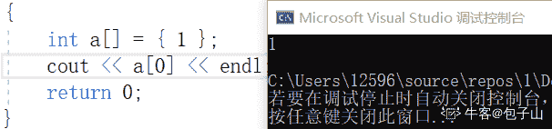
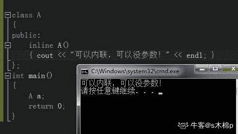
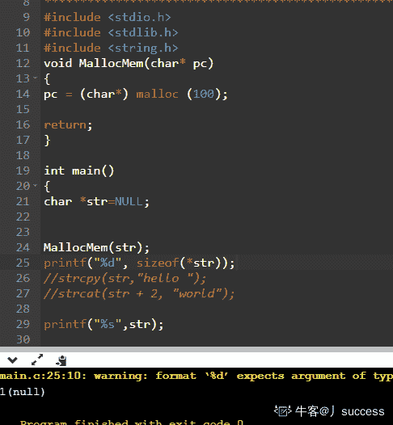
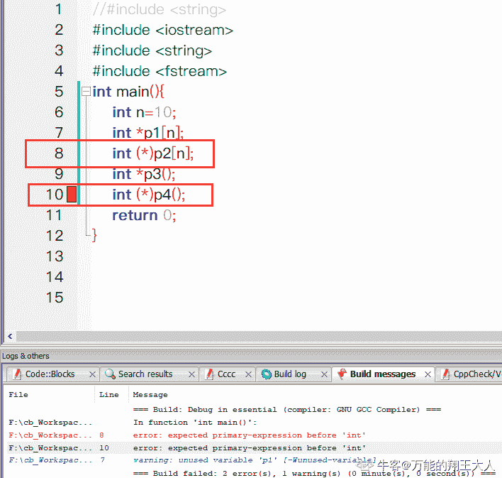
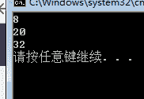
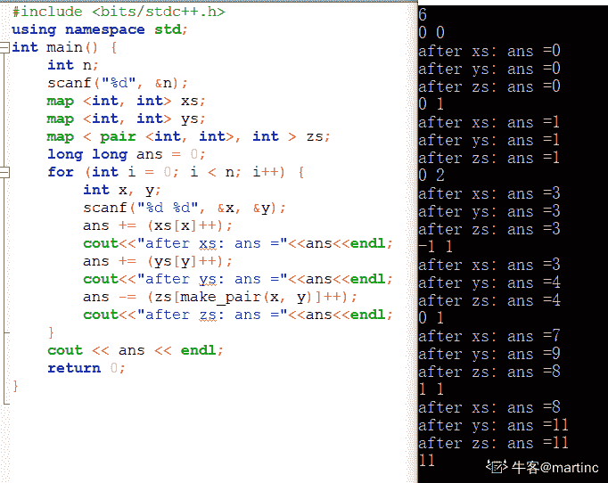
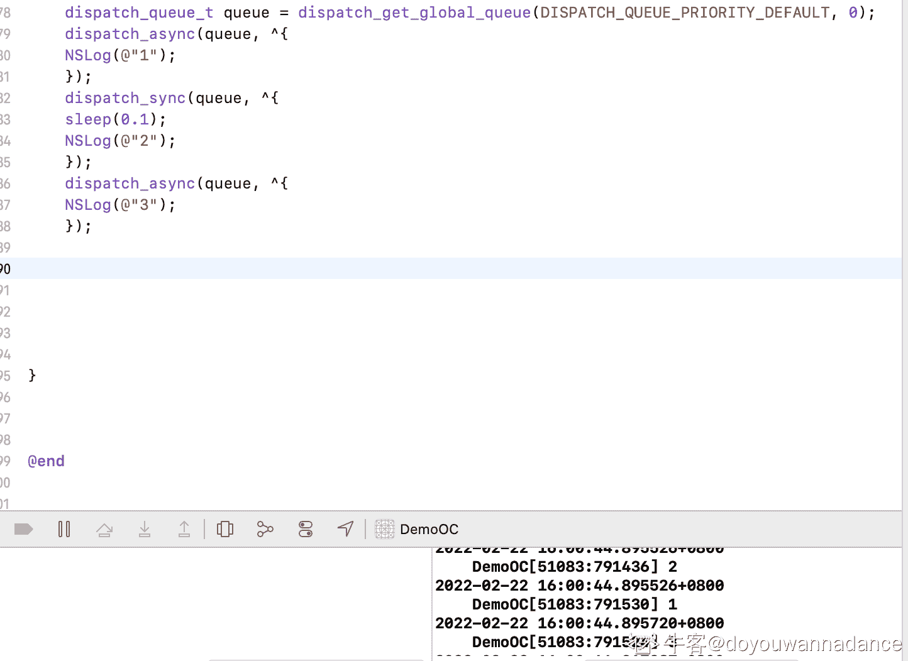
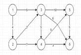

# 三百六十、公司-2018 春招笔试-iOS 开发工程师客观题合集

## 1

下列说法中正确的是（      ）

正确答案: A   你的答案: 空 (错误)

```cpp
冒泡排序法的平均时间复杂度为 O(n²)
```

```cpp
二分法的平均时间复杂度度是 O（n）
```

```cpp
m 个并列循环的时间复杂度为 O（mn）
```

```cpp
快速排序法的时间复杂度一定优于冒泡排序法
```

本题知识点

iOS 工程师 360 公司 排序 *iOS 工程师 360 公司 2018* *## 2

关键字序列为{12，11，19，23，1，6，10},哈希函数为 H(key)=key MOD 11,用链地址法构造哈希表,哈希地址为 1 的链中有（      ）个记录（      ）

正确答案: D   你的答案: 空 (错误)

```cpp
7
```

```cpp
5
```

```cpp
4
```

```cpp
3
```

本题知识点

iOS 工程师 360 公司 哈希 *iOS 工程师 360 公司 2018* *讨论

[等等芒果](https://www.nowcoder.com/profile/405078413)

12%11=1；11%11=0；19%11=8；23%11=1；1%11=1；6%11=6；10%11=10；哈希地址为 1 的链中有 12,23,1

发表于 2019-08-31 20:35:04

* * *

[天尊墨宇](https://www.nowcoder.com/profile/667959477)

选 D

发表于 2020-07-16 21:16:32

* * *

[是颗甜橙](https://www.nowcoder.com/profile/107950536)

10 的地址是 10 非 1

发表于 2019-10-24 01:07:03

* * *

## 3

下面关于动态规划说法正确的是

正确答案: A   你的答案: 空 (错误)

```cpp
他是利用子结构，进行自底而上的算法设计
```

```cpp
他需要后来多次计算的问题进行缓存，减少重复子问题的计算
```

```cpp
他所求问题的整体最优解可以通过一系列局部最优的选择
```

```cpp
他将分解后的子问题看成相互独立的.
```

本题知识点

iOS 工程师 360 公司 动态规划 iOS 工程师 360 公司 2018

## 4

下列关于排序算法的描述错误的是

正确答案: B   你的答案: 空 (错误)

```cpp
在待排序的记录集中，存在多个具有相同键值的记录，若经过排序，这些记录的相对次序仍然保持不变，称这种排序为稳定排序
```

```cpp
二叉查找树的查找效率与二叉树的树型有关，在节点太复杂时其查找效率最低
```

```cpp
下列排序算法中，希尔排序在某趟排序结束后不一定能选出一个元素放到其最终位置上。
```

```cpp
在下列排序方法中,插入排序方法可能出现这种情况:在最后一趟开始之前,所有的元素都不在其最终应在的正确位置上
```

本题知识点

iOS 工程师 360 公司 排序 *iOS 工程师 360 公司 2018* *## 5

请指出以下代码段使用了何种算法

```cpp
public void func(int[] arr1, int k, int m,int[] arr2) { 
arr2[0] = 0; 
for (int i = 1; i <= m; i++) { 
int min = i; 
for (int j = 0; j < k; j++) { 
if (arr1[j] <= i) { 
int temp = arr2[i - arr1[j]] + 1; 
if (temp < min) { 
min = temp; 
} 
} 
} 
arr2[i] = min; 
} 
}
```

正确答案: B   你的答案: 空 (错误)

```cpp
分治算法
```

```cpp
动态规划
```

```cpp
贪心算法
```

```cpp
回溯算法
```

本题知识点

iOS 工程师 360 公司 动态规划 2018

## 6

已知如下递归代码用于求解图的 m 着色问题：
#define N 10
int a[N+1][N+1]; //存储图
int x[N+1];//记录颜色
int sum=0;//保存可着色方案数

void backtrace(int t,int m)
{
int i;
if(t>N)//搜索至叶节点
{
sum++;
printf("第%d 种方案：\n",sum);
for(i=1;i<=N;i++)
printf("%d ",x[i]);
printf("\n");
}
else
{
for(i=1;i<=m;i++) //逐个判断每种颜色
{
if(check(t,i))
{   x[t]=i;
backtrace(t+1,m);
}
}
}
}
其中 check()函数用于检测某个节点颜色是否合法，以下 check()函数正确的是：

正确答案: D   你的答案: 空 (错误)

```cpp
int check(int t,int i)//检测函数 {     int j;     for(j=1;j&lt;t;j++)     {         if(a[t][j]==1&amp;&amp;x[i]==j)                  return 0;            }     return 1; }
```

```cpp
int check(int t,int i)//检测函数 {     int j;     for(j=1;j&lt;t;j++)     {         if(a[t][j]==1||x[i]==j)                  return 0;            }     return 1; }
```

```cpp
int check(int t,int i)//检测函数 {     int j;     for(j=1;j&lt;t;j++)     {         if(a[t][j]==1||x[j]==i)                  return 0;            }     return 1; }
```

```cpp
int check(int t,int i)//检测函数 {     int j;     for(j=1;j&lt;t;j++)     {         if(a[t][j]==1&amp;&amp;x[j]==i)                  return 0;            }     return 1; }
```

本题知识点

iOS 工程师 360 公司 递归 iOS 工程师 360 公司 2018

## 7

一个线性序列（30，14，40，63，22，5），假定采用散列函数 Hash(key)=key%7 来计算散列地址，将其散列存储在 A[0~6]中，采用链地址法解决冲突。若查找每个元素的概率相同，则查找成功的平均查找长度是（      ）。

正确答案: A   你的答案: 空 (错误)

```cpp
4/3
```

```cpp
1
```

```cpp
3/2
```

```cpp
5/3
```

本题知识点

iOS 工程师 360 公司 哈希 *2018* *讨论

[my_offers](https://www.nowcoder.com/profile/955911576)

0 -- 14 -- 63

1 -- 22

2 -- 30

5 -- 40 -- 5

平均查找长度  (1 + 2 + 1 + 1 + 1 + 2) / 6 = 4 / 3

发表于 2019-08-25 16:21:05

* * *

[anqierman](https://www.nowcoder.com/profile/199961081)

应该选 A

编辑于 2019-12-09 18:04:25

* * *

[offer 快来 1234567890](https://www.nowcoder.com/profile/339176941)

注意理解查找成功的平均查找长度

发表于 2021-08-29 19:31:08

* * *

## 8

下列程序段的时间复杂度是（）

```cpp
count = 1；
for(k=1;k<2n;k*=2)
    for(i=1;i<4n;i+=2)
        count++;
```

正确答案: C   你的答案: 空 (错误)

```cpp
O(n2)
```

```cpp
O(8n2)
```

```cpp
O(nlog2n)
```

```cpp
O(n)
```

本题知识点

360 公司 C++ 2018 C 语言

讨论

[流浪猎人+](https://www.nowcoder.com/profile/616364196)

第一个循环指数增加，复杂度为 log2n 第二个循环复杂度 n

编辑于 2019-09-04 22:16:53

* * *

[logic/](https://www.nowcoder.com/profile/831086303)

C.

发表于 2021-07-26 06:43:58

* * *

[牛客 317783746 号](https://www.nowcoder.com/profile/317783746)

线性对数阶$O(nlogn)$
线性对数阶$O(nlogn) $，就是将时间复杂度为对数阶$O(logn)$的代码循环 n 遍的话，那么它的时间复杂度就是 n * O(logN)，也就是了$O(nlogn)$，如下，
for(m=1; m<n; m++)
{
    i = 1;
    while(i<n)
    {
        i = i * 2;
    }
}

发表于 2021-03-11 19:09:51

* * *

## 9

递归公式


的时间复杂度为(    )。

正确答案: D   你的答案: 空 (错误)

```cpp
O(n)
```

```cpp
O(logn)
```

```cpp
O(nlogn)
```

```cpp
O(n2)
```

本题知识点

iOS 工程师 360 公司 iOS 工程师 360 公司 2018

## 10

有关贪心法叙述正确的是（      ）

正确答案: A   你的答案: 空 (错误)

```cpp
采用局部最优策略
```

```cpp
采用全局最优策略
```

```cpp
在贪心法中采用逐步构造最优解的方法
```

```cpp
把问题分解为简单的问题求解
```

本题知识点

iOS 工程师 360 公司 贪心 2018

## 11

在选择分治法解决问题时，应考虑待解决问题应具有哪些特征（      ）

正确答案: A   你的答案: 空 (错误)

```cpp
待解决问题规模缩小到一定程度后可以容易解决
```

```cpp
待解决问题应可以分解为若干个规模较小的相同问题，且子问题应可直接求解。
```

```cpp
各子问题之间是相互独立的
```

```cpp
分解后的子问题的解可以合并为源问题的解
```

本题知识点

iOS 工程师 360 公司 分治 iOS 工程师 360 公司 2018

## 12

在有序表中，关于斐波那契查找和折半查找说法错误的是（）

正确答案: A B C   你的答案: 空 (错误)

```cpp
就平均性能而言，斐波那契查找的平均性能比折半查找差
```

```cpp
只有有序表中元素个数 n 等于某个斐波那契数时才能用斐波那契查找算法
```

```cpp
在最坏情况下，斐波那契查找的性能比折半查找好
```

```cpp
折半查找时间复杂度为 O(log2n)
```

本题知识点

iOS 工程师 360 公司 查找 *iOS 工程师 360 公司 2018* *讨论

[UnnnnnnU](https://www.nowcoder.com/profile/641374590)

我认为这道题目说错了 因该是问的是正确的是: D 首先 A：平均性能是斐波纳切黄金分割查找更好 B：有序表长度不需要一定要是一个斐波纳切数才行，是可以补齐成为一个斐波纳切数的  补最大的数目直到长度是斐波纳切数 C：最坏情况下斐波纳切查找性能比折半是要差的  这些在书上都有的 这是我认为的

发表于 2019-08-29 20:10:38

* * *

[栗子程序](https://www.nowcoder.com/profile/645717869)

斐波那契查找是二分查找的一种提升算法

发表于 2019-08-21 21:35:35

* * *

## 13

下面说法错误的是（）

正确答案: B   你的答案: 空 (错误)

```cpp
快速排序算法平均速度最快
```

```cpp
堆排序在每一趟排序过程中，都会有一个元素被放置在最终位置上
```

```cpp
在 10000 个无序的元素中查找最大的 10 个元素，使用快速排序最快
```

```cpp
插入排序是一种稳定的排序算法
```

本题知识点

iOS 工程师 360 公司 排序 *iOS 工程师 360 公司 2018* *讨论

[ganming](https://www.nowcoder.com/profile/997783280)

答案错误

发表于 2019-09-26 21:11:27

* * *

[Z3R0](https://www.nowcoder.com/profile/5881784)

360 日常错题？

发表于 2019-10-28 15:06:41

* * *

[Do＇it](https://www.nowcoder.com/profile/433010412)

应该选 C，堆排和基数都比快排速度快啊

发表于 2019-10-10 16:31:18

* * *

## 14

对于函数 y = ax² + bx + c,(a > 0),需要找出 y 的小值，精确到小数点后 6 位。下列选项中最有效的方法是（）。

正确答案: D   你的答案: 空 (错误)

```cpp
枚举
```

```cpp
二分查找
```

```cpp
三分查找
```

```cpp
推公式
```

本题知识点

iOS 工程师 360 公司 iOS 工程师 360 公司 iOS 工程师 360 公司 iOS 工程师 360 公司 iOS 工程师 360 公司 2018

## 15

设哈希表长 m=13,哈希函数 H(key)=key MOD 11。表中已有 4 个节点:addr(16)=5,addr(28)=6,addr(84)=7,addr(19)=8 其余地址为空,如用线性探测再散列处理冲突，则关键字为 38 的地址为（      ）

正确答案: D   你的答案: 空 (错误)

```cpp
6
```

```cpp
7
```

```cpp
8
```

```cpp
9
```

本题知识点

iOS 工程师 360 公司 iOS 工程师 360 公司 iOS 工程师 360 公司 iOS 工程师 360 公司 iOS 工程师 360 公司 2018

## 16

#include <bits>using namespace std;
int main(){
stack<int>st;
int pos = 1;
while(pos <= 3){
st.push(pos++);
}
cout<<st.top();
while(pos <= 5){
st.push(pos++);
}
while(!st.empty()){
cout<<st.top();
st.pop();
}
return 0;
}
上述程序的输出为(      )

正确答案: B   你的答案: 空 (错误)

```cpp
35421
```

```cpp
354321
```

```cpp
12453
```

```cpp
123453
```

本题知识点

iOS 工程师 360 公司 C++ iOS 工程师 360 公司 2018

讨论

[不拿 offer 不洗澡](https://www.nowcoder.com/profile/97338231)

还以为把 3 弹出来就不存在了，没认真读题

发表于 2019-09-22 09:56:55

* * *

## 17

#include <bits>using namespace std;
int gcd(int a, int b){
return b == 0 ? a : gcd(b, a % b);
}
struct stsort{
bool operator () (const int a, const int b) const{
if(gcd(30, a) < gcd(30, b)){
return 1;
}
else if(gcd(30, a) == gcd(30, b)){
return a < b;
}
else return 0;
}
};
int main(){
int n = 5;
priority_queue<int, vector<int>, stsort>q;
for(int i = 1; i <= n; ++i){
q.push(i);
}
for(int i = 1; i <= n; ++i){
printf("%d", q.top());
q.pop();
}
return 0;
}
程序的输出为( )

正确答案: A   你的答案: 空 (错误)

```cpp
53421
```

```cpp
53241
```

```cpp
12435
```

```cpp
14235
```

本题知识点

iOS 工程师 360 公司 C++ iOS 工程师 360 公司 2018

讨论

[AShu.H](https://www.nowcoder.com/profile/370392662)

难，哈哈

发表于 2019-09-14 12:16:15

* * *

[上官踩笔](https://www.nowcoder.com/profile/217143579)

优先队列比较的方式使用 stsort 重载，队列的输入是 1,2,3,4,5  都会调用 gcd 函数算相对优先度，结果分别是 1,2,3,2,5， 相同优先度的输出最大的一个，最终结果时 5,3,4,2,1

发表于 2019-09-17 11:14:44

* * *

## 18

#include <bits>using namespace std;
int main(){
int n = 5;
vector<int>a;
set<int>b;
for(int i = 1; i <= n; ++i){
a.push_back(i);
b.insert(i);
}
for(int i = 1; i <= n; ++i){
a.push_back(i);
b.insert(i);
}
cout<<a.size()<<b.size()<<endl;
return 0;
}
程序的输出为( )

正确答案: A   你的答案: 空 (错误)

```cpp
105
```

```cpp
510
```

```cpp
1010
```

```cpp
55
```

本题知识点

iOS 工程师 360 公司 C++ iOS 工程师 360 公司 2018

讨论

[一个中心两个基本点](https://www.nowcoder.com/profile/745847284)

一脸懵逼，求大神解答

发表于 2019-10-12 10:43:53

* * *

[金鱼 kk](https://www.nowcoder.com/profile/721401290)

set 合并同类，vector 不合并。

发表于 2019-08-25 17:44:05

* * *

## 19

#include <bits>using namespace std;
vector<int>g[10];
int ans = 0;
void dfs(int x){
if(g[x].size() == 0){
ans++;
return;
}
for(int i = 0; i < g[x].size(); ++i){
dfs(g[x][i]);
}
}
int main(){
int n, x;
scanf("%d", &n);
for(int i = 2; i <= n; ++i){
scanf("%d", &x);
g[x].push_back(i);
}
dfs(1);
cout<<ans<<endl;
return 0;
}
上述程序的输入为：
9
1 2 2 1 5 6 6 6
则输出为( )

正确答案: B   你的答案: 空 (错误)

```cpp
4
```

```cpp
5
```

```cpp
6
```

```cpp
7
```

本题知识点

iOS 工程师 360 公司 C++ iOS 工程师 360 公司 2018

讨论

[bloodfire](https://www.nowcoder.com/profile/424956722)

输入 8 个数，分别 push 到 g[x]中，g[1][0]=2，g[2][0]=3，g[2][1]=4，g[1][1]=5，g[5][0]=6,g[6][0]=7，g[6][1]=8，g[6][2]=9

dfs(1)执行循环，执行 dfs(2),dfs(5),然后 2 又变成 3 和 4， 3 的时候 ans++，4 的时候 ans++，5 变成 6，6 变成 7,8,9，ans 分别++三次，最后答案是 5\.

发表于 2019-09-24 21:00:50

* * *

[玩笑话](https://www.nowcoder.com/profile/528765702)

哪位大哥来解析一下，我蒙

发表于 2019-09-13 08:20:02

* * *

## 20

用(a,b,c)表示节点 a,b 之间有一条权值为 c 的无向边。对于图(1,2,3),(1,3,4),(1,5,1),(2,3,4),(2,4,6),(2,5,2),(3,5,1)。最小生成树的权值和为(        )

正确答案: B   你的答案: 空 (错误)

```cpp
9
```

```cpp
10
```

```cpp
11
```

```cpp
12
```

本题知识点

iOS 工程师 360 公司 树 iOS 工程师 360 公司 2018

## 21

一棵二叉树有 100 个节点，若根节点深度为 1，树深最大为(       )，最小为(       )

正确答案: B   你的答案: 空 (错误)

```cpp
100 2
```

```cpp
100 7
```

```cpp
7 6
```

```cpp
7 2
```

本题知识点

iOS 工程师 360 公司 树 iOS 工程师 360 公司 2018

讨论

[zhangkai9895](https://www.nowcoder.com/profile/571958033)

树最深是线性结构如链表 树深最小时为完全二叉树

发表于 2019-10-11 14:31:56

* * *

[羊驼 2](https://www.nowcoder.com/profile/619309838)

根节点深度为 1，最大就按照深度为 1 继续下去，最小肯定不为 2 排除法

发表于 2019-09-12 10:47:15

* * *

## 22

在一棵度为 5 的树 T 中，若 14 个度为 5 的结点，15 个度为 4 的结点，14 个度为 3 的结点，5 个度为 2 的结点，10 个度为 1 的结点，则树 T 的叶节点个数是（     ）

正确答案: D   你的答案: 空 (错误)

```cpp
72
```

```cpp
102
```

```cpp
130
```

```cpp
135
```

本题知识点

iOS 工程师 360 公司 树 iOS 工程师 360 公司 2018

讨论

[Heaven201903240804496](https://www.nowcoder.com/profile/543873410)

我也算的 135🤔

发表于 2019-08-30 17:23:20

* * *

[菜鸡准备转岗](https://www.nowcoder.com/profile/836159636)

没看到答案啊？ 不应该是 135 吗？ n0=n2 + 2*n3 + 3*n4 + 4*n5 + 1 = 5 + 28 + 45 + 56 + 1 = 135

发表于 2019-08-29 14:37:49

* * *

[宇过丶天晴](https://www.nowcoder.com/profile/169446865)

总结点个数 n = 14*5+15*4+14*3+5*2+10*1+1(根节点) = 193 有度的结点个数 m = 14+15+14+5+10 = 58 没有度的结点个数为 n-m = 135

发表于 2019-09-14 17:12:06

* * *

## 23

#include <bits>using namespace std;
int n = 300;
int solve(int x){
return x * (n - x);
}
int main(){
int l = 1, r = n;
int mid1, mid2;
int t = 50;
while(t--){
mid1 = l + r >> 1;
mid2 = mid1 + r >> 1;
if(solve(mid1) > solve(mid2)){
r = mid2;
}
else{
l = mid1;
}
}
cout<< l <<endl;
return 0;
}
程序的输出为(        )

正确答案: C   你的答案: 空 (错误)

```cpp
1
```

```cpp
100
```

```cpp
150
```

```cpp
300
```

本题知识点

iOS 工程师 360 公司 C++ iOS 工程师 360 公司 2018

讨论

[power201909271302874](https://www.nowcoder.com/profile/655187691)

二分法，50 次运算足够把两个值都取到 150

发表于 2019-09-30 20:46:34

* * *

[龙猫--](https://www.nowcoder.com/profile/432129863)

链接：[`www.nowcoder.com/questionTerminal/a43228967a7646ba9679c3cedff74d89`](https://www.nowcoder.com/questionTerminal/a43228967a7646ba9679c3cedff74d89)
来源：牛客网
这就是一个二分法求中间值的代码，注意 solve 函数在 x 等于 n/2 时取最大，所以 solve(mid1) > solve(mid2)这句判断就是在说 mid1 离中点 n/2 更近，而 mid2 远一点，这时把 r 置为 mid2，也就是说，大于 mid2 的值不需要再考虑了，因为前面 mid2 跟 mid1 比已经输了，所以之后的就更不用比了，所以 r=mid2，同理 L=mid1 也是这么来的。所以选 C。，需要注意的是+号优先级大于移位处理号。所以其实就是/2。

发表于 2019-09-26 12:55:25

* * *

## 24

#include <bits>using namespace std;
int solve(int x){
if(x == 0 || x == 1){
return x;
}
if(x % 2 == 0){
return 1 + solve(x / 2);
}
else{
return 1 + solve((x + 1) / 2);
}
}
int main(){
int n = 100;
int ans = solve(n);
cout<<ans<<endl;
return 0;
}
程序的输出为(      )

正确答案: C   你的答案: 空 (错误)

```cpp
6
```

```cpp
7
```

```cpp
8
```

```cpp
9
```

本题知识点

iOS 工程师 360 公司 C++ iOS 工程师 360 公司 2018

讨论

[选择困难户 201910110921340](https://www.nowcoder.com/profile/773659538)

2/2=1 不是 0

发表于 2019-10-14 10:53:50

* * *

[詹姆斯科比](https://www.nowcoder.com/profile/872649809)

100，50，25，14，8，4，2，0 递归 7 层再加上原来的=1+1+1+1+1+1+1+1

发表于 2019-08-26 17:05:12

* * *

## 25

一个有 n 个节点的树，有( )条边。

正确答案: A   你的答案: 空 (错误)

```cpp
n - 1
```

```cpp
n
```

```cpp
n + 1
```

```cpp
n ^ 2
```

本题知识点

iOS 工程师 360 公司 树 iOS 工程师 360 公司 2018

## 26

现有磁盘读写请求队列为 2、4、0、5、1，若当前磁头在 1 号磁道上,若采用 FCFS 算法进行磁盘调度时，则平均寻道长度为（      ）

正确答案: B   你的答案: 空 (错误)

```cpp
2.4
```

```cpp
3.2
```

```cpp
1.2
```

```cpp
1.6
```

本题知识点

iOS 工程师 360 公司 操作系统 iOS 工程师 360 公司 2018

## 27

有 4 个批处理的作业（A、B、C 和 D）到达计算中心的时间分别为 9:00，9:30，9:40，9:50，估计的运行时间分别为 60、50、30、10 分钟，它们的优先数分别为 1、2、4、3（1 为最低优先级）。若采用优先级高者优先调度算法，则作业的平均带权周转时间为（      ）

正确答案: A   你的答案: 空 (错误)

```cpp
2.52
```

```cpp
3
```

```cpp
3.62
```

```cpp
3.98
```

本题知识点

iOS 工程师 360 公司 操作系统 iOS 工程师 360 公司 2018

讨论

[胖闹闹](https://www.nowcoder.com/profile/374052423)

A            B        C        D1            2        4          39:00，9:30，9:40，9:5060        50        30        10 运行                         周转时间 / 运行时间 9:00——A——10:00                        60/6010:00——C——10:30                       50/3010:30——D——10:40                       50/1010:40——B——11:30                        120/50（1+1.67+5+2.4）/4 = 2.5175

发表于 2019-10-18 17:30:45

* * *

[牛扭](https://www.nowcoder.com/profile/2743605)

带权周转时间（W）=T（周转时间也就是等待时间加服务时间）/Ts（服务时间）平均带权周转时间=带权周转时间/进程数

发表于 2019-10-09 17:51:08

* * *

## 28

下列哪种算法理论上性能最佳，实际上无法实现（      ）

正确答案: A   你的答案: 空 (错误)

```cpp
OPT 算法
```

```cpp
SCAN 算法
```

```cpp
FIFO 算法
```

```cpp
Clock 置换算法
```

本题知识点

iOS 工程师 360 公司 操作系统 iOS 工程师 360 公司 2018

## 29

在一个请求分页系统中，假定系统分给一个作业的物理块数为 3，刚开始没有一个页面装入内存，并且此作业的页面走向为 2，3，2，1，5，2，4，5，3，2，5，2。使用 OPT 算法时产生的缺页次数为（      ）

正确答案: A   你的答案: 空 (错误)

```cpp
6
```

```cpp
7
```

```cpp
8
```

```cpp
9
```

本题知识点

iOS 工程师 360 公司 操作系统 iOS 工程师 360 公司 2018

讨论

[飞光流影](https://www.nowcoder.com/profile/277112579)

opt 算法，置换以后不再被访问，或者在将来最迟才回被访问的页面，缺页中断率最低。但是该算法需要依据以后各业的使用情况，而当一个进程还未运行完成是，很难估计哪一个页面是以后不再使用或在最长时间以后才会用到的页面。所以该算法是不能实现的。但该算法仍然有意义，作为很亮其他算法优劣的一个标准。

发表于 2019-08-22 21:31:15

* * *

## 30

一个数据流中出现了的报文片段：A ESC FLAG B，假设采用字节填充算法，填充后的输出为（      ）

正确答案: B   你的答案: 空 (错误)

```cpp
A ESC ESC FLAG B
```

```cpp
A ESC ESC ESC FLAG B
```

```cpp
FLAG A ESC FLAG B FLAG
```

```cpp
A ESC FLAG FLAG B
```

本题知识点

iOS 工程师 360 公司 操作系统 iOS 工程师 360 公司 2018

## 31

以下地址中的哪一个和 76.32/12 匹配（      ）

正确答案: A   你的答案: 空 (错误)

```cpp
76.33.214.12
```

```cpp
76.79.24.11
```

```cpp
76.58.119.74
```

```cpp
76.68.204.11
```

本题知识点

iOS 工程师 360 公司 网络基础 iOS 工程师 360 公司 2018

讨论

[xiaole](https://www.nowcoder.com/profile/46990949)

76.32/12 的含义是前 12 位是网络地址，32 的二进制表示是 0010 0000。
而在可选的四个答案中，只有第一个选项的前 12 为与以上表示的是一致的，即前 8 位相同，都是 76，而 33 的二进制是 0010 0001，前 4 位相同。

发表于 2019-09-22 12:31:04

* * *

## 32

网络拓扑结构中存在网桥 S1、S2、S3、S4，若对应 MAC 地址分别为 AABB-CCDD-EE00、AABB-CCDD-EE11、BBBB-CCDD-EE00、BBBB-CCDD-EE11,所有网桥优先级采用默认值,则使用 STP 协议后，哪个网桥会被确定为根网桥（      ）

正确答案: A   你的答案: 空 (错误)

```cpp
S1
```

```cpp
S2
```

```cpp
S3
```

```cpp
S4
```

本题知识点

iOS 工程师 360 公司 网络基础 iOS 工程师 360 公司 2018

## 33

原始数据为 011011111111111111110010 采用比特填充技术填充后的发送数据为（      ）

正确答案: D   你的答案: 空 (错误)

```cpp
0110111110111111111110010
```

```cpp
011011111111111111110010
```

```cpp
01101111101111110111110010
```

```cpp
011011111011111011111010010
```

本题知识点

iOS 工程师 360 公司 网络基础 iOS 工程师 360 公司 2018

讨论

[不明真相的菜狗](https://www.nowcoder.com/profile/140913375)

比特填充法：发送端的数据链路层遇到数据比特流中出现 5 个连续“1”的时候，它就自动在输出比特流中插入一个“0”;接收端遇到 5 个输入比特为“1”，且后面紧接的是“0”时，自动将其删除。

发表于 2019-08-29 16:32:02

* * *

## 34

存在以下三个 CIDR 地址块 192.168.11.0/27、192.168.11.32/27 和 192.168.11.64/26 聚合后的 CIDR 地址块应是（      ）

正确答案: A   你的答案: 空 (错误)

```cpp
192.168.11.0/25
```

```cpp
192.168.11.0/26
```

```cpp
192.168.11.64/25
```

```cpp
192.168.11.64/26
```

本题知识点

iOS 工程师 360 公司 网络基础 iOS 工程师 360 公司 2018

讨论

[飞云之下.](https://www.nowcoder.com/profile/401479550)

答案应该是 A 吧。

发表于 2019-08-28 15:27:29

* * *

## 35

终端发送帧序列为 1101011111，使用生成多项式为 G(x)=x⁴+x+1 校验后发出的帧为序列为（      ）

正确答案: D   你的答案: 空 (错误)

```cpp
11010111111100
```

```cpp
11010111110011
```

```cpp
11010111111011
```

```cpp
11010111110010
```

本题知识点

iOS 工程师 360 公司 网络基础 iOS 工程师 360 公司 2018

## 36

处于同一网络上的主机对有（      ）

正确答案: A B   你的答案: 空 (错误)

```cpp
192.168.5.72/255.255.255.0 和 192.168.5.79/255.255.255.0
```

```cpp
192.168.19.35/255.255.255.224 和 192.168.19.48/255.255.255.224
```

```cpp
19.128.14.14/255.255.255.240 和 19.128.14.19/255.255.255.240
```

```cpp
192.168.3.68/255.255.255.248 和 192.168.3.74/255.255.255.248
```

本题知识点

iOS 工程师 360 公司 网络基础 iOS 工程师 360 公司 2018

讨论

[今今今今今生](https://www.nowcoder.com/profile/991829821)

看子网掩码位数啊，很容易一眼看出 B 的 48 超出了最大能表示的主机数，C 的 19 超出了主机数，D 的两个都超出了

发表于 2019-09-25 14:35:09

* * *

[黄色变白色](https://www.nowcoder.com/profile/8547911)

一、 192.168.5.72/255.255.255.0 和 192.168.5.79/255.255.255.0 从掩码可知，后面 8 位决定同一网络，所以 A 是正确的二、192.168.19.35/255.255.255.224 和 192.168.19.48/255.255.255.224255-224 = 31，所以后面 5 位是同一网络，35 是 00100011，48 是 00110000.............是我想错了吗？这样算的话好像只有 D 不是同一网络，请各位指点指点

编辑于 2019-09-09 08:07:47

* * *

## 37

应用 NAT 后会带来哪些影响（      ）

正确答案: A   你的答案: 空 (错误)

```cpp
不利于分片
```

```cpp
不利于数据加密
```

```cpp
需要重新计算 IP 分组校验和
```

```cpp
可以解决 IPv4 地址耗尽问题
```

本题知识点

iOS 工程师 360 公司 网络基础 iOS 工程师 360 公司 2018

讨论

[黄色变白色](https://www.nowcoder.com/profile/8547911)

网上找的：          IP 分片机制是在信息源端或网络路径上，需要发送的 IP 报文尺寸大于路径实际能承载最大尺寸时，IP 协议层会将一个报文分成多个片断发送，然后在接收端重组这些片断恢复原始报文。IP 这样的分片机制会导致传输层的信息只包括在第一个分片中，NAT 难以识别后续分片与关联表的对应关系，因此需要特殊处理。NAT 无法解决 IPv4 地址耗尽问题，只能减缓 

发表于 2019-08-22 07:59:37

* * *

## 38

数据库 1NF、2NF、3NF 和 BCNF 之间的关系是（      ）

正确答案: D   你的答案: 空 (错误)

```cpp
若 R∈2NF,则 R∈3NF
```

```cpp
若 R∈1NF,则 R 不属于 BCNF
```

```cpp
若 R∈3NF,则 R∈BCNF
```

```cpp
若 R∈BCNF,则 R∈3NF
```

本题知识点

iOS 工程师 360 公司 数据库 iOS 工程师 360 公司 2018

讨论

[程序媛姐姐](https://www.nowcoder.com/profile/791008257)

巴斯-科德范式（BCNF）是第三范式（3NF）的一个子集，即满足 BCNF 必须满足 3NF

发表于 2019-09-07 09:39:33

* * *

## 39

某 IT 公司人事管理采用专门的人事管理系统来实现。后台数据库名为 LF。新来的人事部张经理新官上任，第一件事是要对公司的员工做全面的了解。可是他在访问员工信息表 EMPL 里的工资和奖金字段的时被拒绝，只能查看该表其他字段。作为 LF 的开发者你将如何解决这一问题：（      ）

正确答案: D   你的答案: 空 (错误)

```cpp
废除张经理的数据库用户帐户对表 EMPL 里的工资列和奖金列的 SELECT 权限
```

```cpp
添加张经理到 db_datareader 角色
```

```cpp
添加张经理到 db_accessadmin 角色
```

```cpp
授予张经理的数据库用户帐户对表 EMPL 里的工资列和奖金列的 SELECT 权限。
```

本题知识点

iOS 工程师 360 公司 数据库 iOS 工程师 360 公司 2018

## 40

在数据库中存在多列的情况下，若要删除表中的某一列应该使用 SQL 语句（      ）

正确答案: B   你的答案: 空 (错误)

```cpp
ALTER TABLE tableName DROP columnName
```

```cpp
ALTER TABLE tableName DROP COLUMN columnName
```

```cpp
ALTER TABLE tableName DELETE columnName
```

```cpp
ALTER TABLE tableName DELETE COLUMN columnName
```

本题知识点

iOS 工程师 360 公司 数据库 2018

讨论

[J-Young](https://www.nowcoder.com/profile/955576717)

本题目需要对 drop、truncate、delete 的作用性质有深刻理解才可以。drop 通常针对于表结构来进行操作，比如删除整个表，删除表中的字段。这些都是针对于结构而言的。而 truncate 和 delete 针对得是数据，而不会对表的结构产生任何影响，truncate 是删除表中的所有数据。delete 可以删除某一行，符合查询条件的某些行。本题目中提到了删除字段，修改得是表的结构，所以一定是 drop。

发表于 2021-06-23 16:45:58

* * *

[是瑶瑶公主呀](https://www.nowcoder.com/profile/592649258)

标准是要加 column

但在 mysql 上试了一下 不加 column 也可以啊

发表于 2019-11-02 19:08:53

* * *

[青柠加油](https://www.nowcoder.com/profile/759268148)

DROP 不是删除整个表吗?

发表于 2020-07-03 11:04:43

* * *

## 41

在 MySQL 中，关于索引，下面描述中错误的一项是（      ）

正确答案: C   你的答案: 空 (错误)

```cpp
建立索引可以提高数据查询的效率
```

```cpp
聚集索引可能会降低数据的插入速度
```

```cpp
哈希索引一定比 B+树索引快
```

```cpp
删除索引的命令是 drop index
```

本题知识点

iOS 工程师 360 公司 数据库 2018

讨论

[有财君](https://www.nowcoder.com/profile/310776549)

InnoDB 已经支持了：[`dev.mysql.com/doc/refman/5.7/en/innodb-fulltext-index.html`](https://dev.mysql.com/doc/refman/5.7/en/innodb-fulltext-index.html)

编辑于 2021-03-17 15:08:56

* * *

[奇遇 yangms](https://www.nowcoder.com/profile/716072534)

MyISAM 支持全文索引

发表于 2019-09-24 09:36:20

* * *

[不是江小白](https://www.nowcoder.com/profile/550965516)

🤔这道题咋还没改正错误？无解啊。。。明明都是对的。。。‘ InnDB 早就支持全文索引了。。。[`dev.mysql.com/doc/refman/8.0/en/innodb-fulltext-index.html`](https://dev.mysql.com/doc/refman/8.0/en/innodb-fulltext-index.html)

发表于 2021-03-17 11:25:10

* * *

## 42

关于数据库的索引，如下那个选项是正确的？

正确答案: D   你的答案: 空 (错误)

```cpp
针对某些字段建立索引，能够有效的减少相关数据库表的磁盘空间占用；
```

```cpp
针对某些字段建立索引，能够有效的提升相关字段的读与写的效率；
```

```cpp
常见数据库管理系统，通常使用 hash 表来存储索引；
```

```cpp
数据库索引的存在，可能导致相关字段删除的效率降低；
```

本题知识点

iOS 工程师 360 公司 数据库 iOS 工程师 360 公司 2018

讨论

[读者小 Z](https://www.nowcoder.com/profile/624945939)

A 是增大相关数据库表的磁盘空间占用 B 写操作包括更新操作和插入操作，对于更新操作可能提高效率，正确 C 利用 B+树做索引 D 需要维护索引可能导致删除的效率降低

发表于 2019-09-14 18:20:17

* * *

## 43

数据库中，什么操作命令可以整理表数据文件的碎片

正确答案: A   你的答案: 空 (错误)

```cpp
optimize table TabName;
```

```cpp
repaire table TabName;
```

```cpp
analyze table TabName;
```

```cpp
flush table TabName;
```

本题知识点

iOS 工程师 360 公司 数据库 iOS 工程师 360 公司 2018

讨论

[白 201907171901295](https://www.nowcoder.com/profile/860748129)

1.表碎片的来源

当针对一个表的删除操作很多时，表会产生大量碎片。删除操作释放的空间不会被插入操作立即重用，甚至永远也不会被重用。2.表碎片导致的问题

*   查询响应时间(尤其是全表扫描)变慢
*   产生大量行迁移
*   浪费空间

整理表碎片对基于索引的查询不会有太大性能提升。3.清除方法 mysql 的清除方法：    - -OPTIMIZE TABLE，OPTIMIZE TABLE 可以一次性对多个表进行碎片整理，只需要在 OPTIMIZE TABLE 后面接多个表名，并以英文逗号隔开即可。- -OPTIMIZE TABLE 只对 MyISAM，BDB 和 InnoDB 表起作用，尤其是 MyISAM 表的作用最为明显。此外，并不是所有表都需要进行碎片整理，一般只需要对包含上述可变长度的文本数据类型的表进行整理即可。
   -  -在 OPTIMIZE TABLE 运行过程中，MySQL 会锁定表。 Oracle 的清除方法：        10g：之前两种方法：1.导出表，删除表，再导入表 2.alter table move     注：一般选择第二种，需要重建索引。10g 后：从 10g 开始，提供一个 shrink 命令，需要表空间是基于自动段管理的。 

发表于 2019-08-29 19:20:17

* * *

## 44

下面代码执行后的结果为（      ）
int main()
{
int sum=0;
int i=0,j=0;

for(j=0;j<6;j++)
{
if(j%2)continue;
sum++;
}

printf("sum=%d",sum);

return 0;
}

正确答案: C   你的答案: 空 (错误)

```cpp
sum=1
```

```cpp
sum=2
```

```cpp
sum=3
```

```cpp
其他几项都不对
```

本题知识点

iOS 工程师 360 公司 C++ iOS 工程师 360 公司 2018

讨论

[如风。](https://www.nowcoder.com/profile/805229704)

只有在 j=0,j=2,j=4 时才能执行 sum++，所以最终 sum=3

发表于 2019-08-29 10:12:29

* * *

## 45

c 语言前提下，下列数组定义错误的是（      ）

正确答案: A C   你的答案: 空 (错误)

```cpp
int arr[2][3] = {{1,2},{3,4},{5,6}};
```

```cpp
int arr[][3] = {{1,2,3},{4,5,6}};
```

```cpp
int arr[10]={,10};
```

```cpp
int arr[10]={10};
```

本题知识点

iOS 工程师 360 公司 C++ iOS 工程师 360 公司 2018

讨论

[天空并不万里](https://www.nowcoder.com/profile/5831427)

A 两行三列，可是给出的实例为三行，所以不匹配。C 呢？vs 编译环境下不能通过，是不是在 C 语言编译环境下就能通过？？？？？？？？？

发表于 2019-09-09 11:04:49

* * *

## 46

下列定义数组的方法正确的是（      ）

正确答案: D   你的答案: 空 (错误)

```cpp
#define N 2017 int arr[N]
```

```cpp
#define N 2017 int arr[N*2]
```

```cpp
int i=2017; int arr[i];
```

```cpp
int arr[]={1};
```

本题知识点

iOS 工程师 360 公司 2018

讨论

[包子山](https://www.nowcoder.com/profile/5250532)

D 怎么错？

发表于 2019-10-19 21:29:17

* * *

[抬棺不专业](https://www.nowcoder.com/profile/512896410)

A 和 B 严格来说都不行，宏定义问题，D 才是正确答案

发表于 2019-09-03 21:58:23

* * *

[æ201905302027533](https://www.nowcoder.com/profile/243111152)

宏定义没有  '；'  A 和 B 都是错的，变量不能指定数组的大小，所以 C 也是错的

发表于 2019-09-05 14:44:24

* * *

## 47

下面程序执行的结果为（      ）
void main( )
{
char ch1,ch2;

ch1 ='D'+'8'－'3';
ch2 ='9'－'1';

printf("%c %d\n",ch1,ch2);
}

正确答案: B   你的答案: 空 (错误)

```cpp
I '8'
```

```cpp
I 8
```

```cpp
G '8'
```

```cpp
其他几项都不对
```

本题知识点

iOS 工程师 360 公司 C++ iOS 工程师 360 公司 2018

讨论

[aircrafts](https://www.nowcoder.com/profile/78269770)

%d 输出

发表于 2019-08-24 14:39:43

* * *

## 48

c/c++前提下，下列关于构造函数说法正确的是（      ）

正确答案: C D   你的答案: 空 (错误)

```cpp
构造函数的返回值为 void
```

```cpp
构造函数不可以被重载
```

```cpp
构造函数可以是内联函数
```

```cpp
构造函数可以没有参数
```

本题知识点

iOS 工程师 360 公司 C++ iOS 工程师 360 公司 2018

讨论

[s 木棉 p](https://www.nowcoder.com/profile/1511734)



发表于 2019-08-29 08:52:26

* * *

[仙女山的太阳^_^](https://www.nowcoder.com/profile/307550221)

构造函数没有返回值，但没有被声明为任何类型。实际上，构造函数没有声明类型。

发表于 2019-08-23 06:37:21

* * *

## 49

在 32 位系统中，关于下面程序说法正确的是（      ）
class Item
{
private:
char *desc;
int storage;
public:
Item()
{
desc = new char[51];
}

void setInfo(char *dsrc, int num)
{
strcpy(desc,dsrc);
storage = num;
}
};

int main()
{
Item stock;

stock.setInfo("pen",20);

return 0;
}

正确答案: A   你的答案: 空 (错误)

```cpp
main 函数定义了一个 stock 对象占 8 个字节
```

```cpp
storage 和 desc 成员各占 4 个字节
```

```cpp
存在内存泄漏的问题
```

```cpp
存在编译错误
```

本题知识点

iOS 工程师 360 公司 C++ iOS 工程师 360 公司 2018

讨论

[拖拉机嘟嘟嘟](https://www.nowcoder.com/profile/117252758)

又是 360？？？我靠，服气服气，改题目吧，改成选错误的答案，我选 D

编辑于 2019-08-25 21:55:54

* * *

[夜★](https://www.nowcoder.com/profile/626357968)

B 选项，指针变量不就是占 4 个字节？？

发表于 2019-08-25 09:47:52

* * *

[机械从入门到单身](https://www.nowcoder.com/profile/8878170)

A 是对的，内存对齐问题。但是 C，没有 delete 有内存泄漏问题！！！！

发表于 2019-08-23 21:25:47

* * *

## 50

以下程序运行后的输出结果是（      ）

```cpp
int main() {
    int a=1,b=2,m=0,n=0,k;
    k=(n=b<a)&&(m=a) ;
    printf("%d,%d\n",k,m);
    return 0;
}
```

正确答案: A   你的答案: 空 (错误)

```cpp
0,0
```

```cpp
0,1
```

```cpp
1,0
```

```cpp
1,1
```

本题知识点

iOS 工程师 360 公司 C++ 2018 C 语言

讨论

[桃源客](https://www.nowcoder.com/profile/1395660)

因为前面的等于 0，所以不执行后面的语句，所以 m=0

发表于 2019-08-26 10:32:52

* * *

[sudorm-rf*](https://www.nowcoder.com/profile/657939015)

C++逻辑运算的短路效应；表达式 k = A&&B 若 A 为 False，则直接返回 False 而不执行 B；同理 A||B 运算时若 A 为 True，则直接返回 True。

发表于 2020-08-03 20:05:06

* * *

[kimiwanano](https://www.nowcoder.com/profile/354424104)

前面不是赋值吗 怎么会是 0 n=0 赋值操作为真啊？

发表于 2020-04-02 23:33:55

* * *

## 51

下列代码段的打印结果为（      ）（注：└┘代表空格）
#include <stdio.h>
void main (void)
{
char  ac[]="Hello World! C Program",*p;

for(p=ac+6;p<ac+9;p++)
{
printf("%c",*p);
}
}

正确答案: A   你的答案: 空 (错误)

```cpp
Wor
```

```cpp
o W
```

```cpp
└┘Wo
```

```cpp
o Wor
```

本题知识点

iOS 工程师 360 公司 C++ iOS 工程师 360 公司 2018

讨论

[BartholomewLucifer](https://www.nowcoder.com/profile/439631503)

Ap=ac+6 表示把 ac[6]的地址赋给指针 p，p<ac+9 表示 p 只能访问到 ac[9]之前的地址，p++表示指针迭代，*p 调用该指针指向的数即地址对应的数代码的意思就是输出从 ac[6]到 ac[8]的一段字符串

发表于 2019-11-04 19:10:18

* * *

## 52

有关下面程序说法正确的是（      ）（注：└┘代表空格）
int main()
{
char s[6]= "abcd";
printf("\"%s\"\n", s);

return 0;
}

正确答案: A   你的答案: 空 (错误)

```cpp
“abcd”
```

```cpp
\&quot;abcd\&quot;
```

```cpp
&quot;abcd└┘&quot;
```

```cpp
编译错误
```

本题知识点

iOS 工程师 360 公司 C++ iOS 工程师 360 公司 2018

讨论

[犇流](https://www.nowcoder.com/profile/139469194)

水题，直接编译器上跑一下-----A

发表于 2019-10-06 12:11:11

* * *

## 53

下面程序执行后输出结果为（      ）
#include <stdio.h>
int main()
{
int i, j, m=6,n=4,  *p=&n, *q=&m;

i=p==&m;
j=(-*p)/(*q)+7;

printf("i=%d,j=%d\n", i,j);

return 0;
}

正确答案: B   你的答案: 空 (错误)

```cpp
编译错误
```

```cpp
i=0,j=7
```

```cpp
i=0,j=0
```

```cpp
其他几项都不对
```

本题知识点

iOS 工程师 360 公司 C++ iOS 工程师 360 公司 2018

讨论

[向南没有雪](https://www.nowcoder.com/profile/411652215)

bool 型的 true = 1；bool 型的 false = 0；

发表于 2019-08-21 14:42:37

* * *

## 54

下列说法正确的是（      ）
#include "stdio.h"
#include "string.h"

void fun( char *s)
{
char t[7];
s=t;
strcpy(s, "example");
}

int  main()
{
char *s;

fun(s);
printf("%s",s);

return 0;
}

正确答案: D   你的答案: 空 (错误)

```cpp
输出结果为&quot;example&quot;
```

```cpp
输出结果为&quot;exampl&quot;
```

```cpp
程序编译时出现错误
```

```cpp
程序运行时出现错误
```

本题知识点

iOS 工程师 360 公司 C++ iOS 工程师 360 公司 2018

讨论

[_random](https://www.nowcoder.com/profile/5246141)

t 数组只能存取 7 个字符包括‘\0’, 而 example 就已经 7 个字符了，加上结尾符号需要 8 个字符大小的数组，所以段错误是发生在内存不够导致的，而栈中返回最多乱码，不会发生段错误

发表于 2019-10-09 17:39:34

* * *

[vo2018](https://www.nowcoder.com/profile/475786276)

s=t，那么 s 的里面存的是栈中的地址，函数结束，释放，那么再次访问 s 的内存出错

发表于 2019-08-27 10:07:02

* * *

[聽随＿風说](https://www.nowcoder.com/profile/792708339)

主要是 fun 函数结束 t 空间被回收了，存的地址根本没用

发表于 2019-10-16 10:41:07

* * *

## 55

下面程序的输出结果是（      ）
#include <stdio.h>
int main()
{
int  intArray[] = {1, 2, 3, 4, 5};
int  *p = (int *)(&intArray+1);
printf("%d,%d",*(intArray+1),*(p-1));

return 0;
}

正确答案: D   你的答案: 空 (错误)

```cpp
1,5
```

```cpp
1,6
```

```cpp
2,4
```

```cpp
2,5
```

本题知识点

iOS 工程师 360 公司 C++ iOS 工程师 360 公司 2018

讨论

[zuiai1900](https://www.nowcoder.com/profile/89469837)

&intArray+1  相当于   &intArray+1 * sizeof( a )    偏移一个数组   

发表于 2019-09-07 16:47:48

* * *

## 56

有关纯虚函数说法正确的是（      ）

正确答案: A B C D   你的答案: 空 (错误)

```cpp
子类中必须覆盖基类的纯虚函数
```

```cpp
含有纯虚函数的类不能被实例化
```

```cpp
基类的纯虚函数没有函数体
```

```cpp
含有纯虚函数的类一定是抽象类
```

本题知识点

iOS 工程师 360 公司 C++ iOS 工程师 360 公司 2018

讨论

[Loading...201905301633326](https://www.nowcoder.com/profile/701740141)

我觉得是 BD，子类不一定要覆盖基类的纯虚函数，没覆盖则该子类也是个虚类，不能被实例化。含有的纯虚函数的类不能被实例化。含有纯虚函数的类是抽象类。求大佬解析

发表于 2019-09-13 21:57:45

* * *

[奔跑的蜗牛 _IT](https://www.nowcoder.com/profile/8728621)

这题应该是选错误的是哪个吧

发表于 2019-09-15 07:55:02

* * *

[许愿有个 offer](https://www.nowcoder.com/profile/458090646)

这道题有问题，应该选择 AB

发表于 2019-09-10 10:25:20

* * *

## 57

下面哪些函数不能被声明为虚函数（      ）

正确答案: A B C D   你的答案: 空 (错误)

```cpp
构造函数
```

```cpp
静态成员函数
```

```cpp
内联函数
```

```cpp
友元函数
```

本题知识点

iOS 工程师 360 公司 C++ iOS 工程师 360 公司 2018

讨论

[野指针 a](https://www.nowcoder.com/profile/142918672)

静态成员函数，内联函数，有缘函数，都是可以被声明为虚函数的

发表于 2019-10-02 13:53:58

* * *

[ML_ZDD](https://www.nowcoder.com/profile/6912943)

全都不能吧？

发表于 2019-08-24 20:22:54

* * *

[拖拉机嘟嘟嘟](https://www.nowcoder.com/profile/117252758)

*****************？？？

发表于 2019-08-22 20:46:22

* * *

## 58

下面程序的输出结果是（      ）
#include <stdio.h>
#include <stdlib.h>
void MallocMem(char* pc)
{
pc = (char*) malloc (100);

return;
}

int main()
{
char *str=NULL;

MallocMem(str);
strcpy(str,"hello ");
strcat(str+2, "world");

printf("%s",str);

return 0;
}

正确答案: C   你的答案: 空 (错误)

```cpp
hello world
```

```cpp
程序编译错误
```

```cpp
程序运行时崩溃
```

```cpp
其他几项都不对
```

本题知识点

iOS 工程师 360 公司 C++ iOS 工程师 360 公司 2018

讨论

[波克](https://www.nowcoder.com/profile/979753452)

linux@ubuntu:~$ gcc test.c -o l
test.c: In function ‘main’:
test.c:15:2: warning: incompatible implicit declaration of built-in function ‘strcpy’ [enabled by default]
test.c:16:2: warning: incompatible implicit declaration of built-in function ‘strcat’ [enabled by default]
linux@ubuntu:~$ ./l
Segmentation fault (core dumped)

发表于 2019-10-24 11:04:42

* * *

[Mr_Fourier](https://www.nowcoder.com/profile/3020337)

出题不严谨.

目的是考察 str 当实参传入有没有变化。

应该包含#include

发表于 2019-10-19 09:37:44

* * *

[丿 success](https://www.nowcoder.com/profile/509804891)

作为形参的 pc 和作为实参的 str 不是同一个在调用的时候是值传递，那里的 pc 在返回后就被销毁了*str 还是 0 顺便，这道题按理说编译都过不去（没有 string.h）

发表于 2019-09-20 15:17:00

* * *

## 59

在横线处补充（      ）可以结果输出值为 80000007（      ）
#include <stdio.h>

int convert(int i)
{
return ___________________;
}

int main()
{
int value = 7;

printf( "%x\n", convert(value) );

return 0;
}

正确答案: A   你的答案: 空 (错误)

```cpp
i|=1&lt;&lt;31;
```

```cpp
i&amp;=1&lt;&lt;31;
```

```cpp
i&amp;=~(1&lt;&lt;31);
```

```cpp
i^=1&lt;&lt;31;
```

本题知识点

iOS 工程师 360 公司 C++ iOS 工程师 360 公司 2018

讨论

[love、programming](https://www.nowcoder.com/profile/9241007)

解释下 A 选项：&lt;  代表 <i|=1<<31;    按照优先级，先执行<<操作，再是 | ,最后是 =1<<31  =>          1000 0000 0000 0000 0000 0000 0000 0000 | 运算       0000 0000 0000 0000 0000 0000 0000 0111
=>            1000 0000 0000 0000 0000 0000 0000 0111  转成十进制=>8000 0007

发表于 2019-09-09 23:02:06

* * *

[乍也不觉冷](https://www.nowcoder.com/profile/714914026)

运算规则：0|0=0；  0|1=1；  1|0=1；   1|1=1；

     即 ：参加运算的两个对象只要有一个为 1，其值为 1

编辑于 2019-09-26 09:35:15

* * *

## 60

在 32 系统下输出的结果为（      ）

```cpp
#include <stdio.h>

#pragma pack(2)
struct Test1
{
    int a;
    char b;
    short c;
    int *d;
}A;
#pragma pack()

#pragma pack(4)
struct Test2
{
    int *d;
    char b;
    int a;
    short c;
}B;
#pragma pack()

int main()
{
    printf("%d,%d\n",sizeof(A),sizeof(B));
    return 0;
}
```

正确答案: A   你的答案: 空 (错误)

```cpp
12,16
```

```cpp
13,13
```

```cpp
16,16
```

```cpp
其他几项都不对
```

本题知识点

iOS 工程师 360 公司 C++ iOS 工程师 360 公司 2018

讨论

[Mr_Fourier](https://www.nowcoder.com/profile/3020337)

一个是 2 字节对齐，另一个是 4 字节对齐。

发表于 2019-10-18 10:52:25

* * *

[冷若冰霜](https://www.nowcoder.com/profile/6558305)

struct 用 sizeof 怎么计算的?

发表于 2019-09-26 13:39:01

* * *

## 61

下列 const 使用方法错误的是（      ）

正确答案: A   你的答案: 空 (错误)

```cpp
const int Val = 10; Val = 20;
```

```cpp
class A   {         const int SIZE = 100;         int array[SIZE];   };
```

```cpp
class A { protected:  static int const Inity; };
```

```cpp
int a=7;     const int *aPtr;      aPtr = &amp;a;
```

本题知识点

iOS 工程师 360 公司 C++ iOS 工程师 360 公司 2018

讨论

[黄色变白色](https://www.nowcoder.com/profile/8547911)

const int Val = 10; Val = 20;   val 的值不能改变了

发表于 2019-09-18 07:57:01

* * *

## 62

对下面变量声明描述正确的有（）
int *p[n];
int (*)p[n];
int *p()；
int (*)p();

正确答案: A   你的答案: 空 (错误)

```cpp
int *p[n];—–指针数组，每个元素均为指向整型数据的指针
```

```cpp
int (*)p[n];—p 为指向一维数组的指针，这个一维数组有 n 个整型数据
```

```cpp
int *p();——函数带回指针，指针指向返回的值
```

```cpp
int (*)p();—-p 为指向函数的指针
```

本题知识点

iOS 工程师 360 公司 C++ iOS 工程师 360 公司 2018

讨论

[万能的翔王大人](https://www.nowcoder.com/profile/244791444)

**特别提醒，请分清变量名（p），类型修饰符(*)，数据类型(int)。****先说 B，D 是错的，也不能明确说明错在哪，总之就是“什么玩意”。有图为证：：**然后我们再说 A，B 怎么理解：**int *p[] 首先阅读变量名，后面的[]告诉我们这是个数组，那么数组里是什么数据类型呢？int*。****int *p()因为后边有参数列表，所以 p 是一个函数，函数的返回值是 int***

发表于 2019-08-26 21:22:34

* * *

## 63

c++的一个类中声明一个 static 成员变量，下面描述正确的是（）

正确答案: A B   你的答案: 空 (错误)

```cpp
static 是加了访问控制的全局变量，不被继承
```

```cpp
类和子类对象，static 变量占有一份内存
```

```cpp
子类继承父类 static 变量
```

```cpp
static 变量在创建对象时分配内存空间
```

本题知识点

iOS 工程师 360 公司 C++ iOS 工程师 360 公司 2018

## 64

面向对象的基本特征有哪些（）

正确答案: A B C   你的答案: 空 (错误)

```cpp
封装
```

```cpp
继承
```

```cpp
多态
```

```cpp
重载
```

本题知识点

iOS 工程师 360 公司 C++ iOS 工程师 360 公司 2018

讨论

[黄色变白色](https://www.nowcoder.com/profile/8547911)

面向对象程序设计有 4 个主要特点，分别是：抽象、封装、继承、多态（抽象是不是是有争议的，如果是三个就是封装、继承和多态）

编辑于 2019-09-26 07:57:06

* * *

[paul_zyh](https://www.nowcoder.com/profile/378431629)

来，告诉我这题不是多选题！🤣🤣

发表于 2019-08-23 18:42:21

* * *

[QT 菜鸡弟弟](https://www.nowcoder.com/profile/132714808)

屏蔽了😣

发表于 2019-08-22 16:51:51

* * *

## 65

下面代码打印结果为（）
union package
{
char head;
int  body;
};
struct message
{
char id;
int  crc;
union package pack;
};

int main()
{
printf("size=%d\n",sizeof(struct message));
return 0;
}

正确答案: D   你的答案: 空 (错误)

```cpp
9
```

```cpp
10
```

```cpp
11
```

```cpp
12
```

本题知识点

iOS 工程师 360 公司 C++ iOS 工程师 360 公司 2018

讨论

[aircrafts](https://www.nowcoder.com/profile/78269770)

9 字节补齐机制 12

发表于 2019-08-24 13:12:46

* * *

## 66

多态类中的虚函数表建立在（）

正确答案: A   你的答案: 空 (错误)

```cpp
编译阶段
```

```cpp
运行阶段
```

```cpp
构造函数被调用时进行初始化的
```

```cpp
类声明时
```

本题知识点

iOS 工程师 360 公司 C++ iOS 工程师 360 公司 2018

讨论

[embrance_linux](https://www.nowcoder.com/profile/769282983)

函数表是在编译期就建立了,各个虚拟函数这时被组织成了一个虚拟函数的入口地址的数组.而对象的隐藏成员--虚拟函数表指针是在运行期--也就是构造函数被调用时进行初始化的,这是实现多态的关键

发表于 2019-08-26 22:45:57

* * *

## 67

C++中空类默认产生哪些类成员函数（）

正确答案: A B C D   你的答案: 空 (错误)

```cpp
默认构造函数
```

```cpp
析构函数
```

```cpp
拷贝构造函数
```

```cpp
赋值函数
```

本题知识点

iOS 工程师 360 公司 C++ iOS 工程师 360 公司 2018

讨论

[小白（c/c++）](https://www.nowcoder.com/profile/976313281)

不严谨

发表于 2019-08-28 13:41:11

* * *

## 68

变量 void (*s[5])(int)表示意思为（）

正确答案: B   你的答案: 空 (错误)

```cpp
函数指针
```

```cpp
函数指针数组
```

```cpp
数组指针函数
```

```cpp
语法错误
```

本题知识点

iOS 工程师 360 公司 C++ iOS 工程师 360 公司 2018

讨论

[BroWuG](https://www.nowcoder.com/profile/297231019)

函数指针 `void(*p)(int)`
函数指针数组 `void (*s[5])(int)`

发表于 2019-08-25 11:43:06

* * *

## 69

定义宏#define DECLARE(name, type) type name##_##type##_type，
则 DECLARE(val, int)替换结果为（）

正确答案: A   你的答案: 空 (错误)

```cpp
int val_int_type
```

```cpp
int val_int_int
```

```cpp
int name_int_int
```

```cpp
int name_int_name
```

本题知识点

iOS 工程师 360 公司 C++ iOS 工程师 360 公司 2018

讨论

[枭 1994](https://www.nowcoder.com/profile/248060421)

##是一种分隔连接方式，它的作用是**先分隔，然后进行强制连接**“name”和第一个“_”之间被分隔了，所以预处理器会把 name##_##type##_type 解释成 4 段：“**name**”、“_”、“**type**”以及“**_type**”，name 和 type 会被替换，而 _type 不会被替换

发表于 2019-10-04 16:25:11

* * *

[犇流](https://www.nowcoder.com/profile/139469194)

比较简单的方式丢编译器，然后得到疑问##，丢百度得出楼上结果，学习了。分隔符： **## 是一种分隔连接方式，它的作用是****先分隔，然后进行强制连接**但也要了解宏定义只是单纯的宏替换，注意必要的括号

发表于 2019-10-06 12:52:23

* * *

## 70

extern "c"的作用有哪些（）

正确答案: A   你的答案: 空 (错误)

```cpp
实现 C++代码调用其他 C 语言代码
```

```cpp
使 C 函数不被 C++编译器优化
```

```cpp
使 C 函数使用 C 编译器优化
```

```cpp
到出 C 变量或函数
```

本题知识点

iOS 工程师 360 公司 C++ iOS 工程师 360 公司 2018

讨论

[秋于得海](https://www.nowcoder.com/profile/211491612)

extern “C”指令中的 C，表示的一种编译和连接规约，而不是一种语言。C 表示符合 C 语言的编译和连接规约的任何语言，如 Fortran、assembler 等。 extern “C”指令仅指定编译和连接规约，但不影响语义。例如在函数声明中，指定了 extern “C”，仍然要遵守 C++的类型检测、参数转换规则。 extern “C”的真实目的是实现类 C 和 C++的混合编程。在 C++源文件中的语句前面加上 extern “C”，表明它按照类 C 的编译和连接规约来编译和连接，而不是 C++的编译的连接规约。这样在类 C 的代码中就可以调用 C++的函数 or 变量等。（注：我在这里所说的类 C，代表的是跟 C 语言的编译和连接方式一致的所有语言）

发表于 2019-08-30 10:40:37

* * *

## 71

在 32 位系统中，下面程序打印结果为（）
#include<iostream>
using namespace std;

class A
{
char a[3];
public:
virtual void fun1(){};
};

class B : public virtual A
{
char b[3];
public:
virtual void fun2(){};
};

class C : public virtual B
{
char c[3];
public:
virtual void fun3(){};
};

int main ()
{
cout << sizeof(A) << endl;
cout << sizeof(B) << endl;
cout << sizeof(C) << endl;
return 0;
}

正确答案: D   你的答案: 空 (错误)

```cpp
4,20,28
```

```cpp
8,20,32
```

```cpp
4,12,20
```

```cpp
8,16,24
```

本题知识点

iOS 工程师 360 公司 C++ iOS 工程师 360 公司 2018

讨论

[Tauruschill](https://www.nowcoder.com/profile/152468017)

不同编译器虚继承内存存取方式不同。GCC 共享虚函数表指针，结果为 D。VC 在虚继承下不共享父类虚函数表指针，结果为 B。

发表于 2019-10-14 12:34:28

* * *

[晨小白](https://www.nowcoder.com/profile/938331974)

这是结果，果然这个答案是错误的，我的 vs 版本 2012

发表于 2019-09-14 00:11:15

* * *

[我的天鸭](https://www.nowcoder.com/profile/243498)

这道题的答案在 VS 平台下选 B，打印出 A B C 三个类的布局如下：可以看出，虚继承的时候 A B C 三个类不仅不会共享虚基类指针，也不会共享虚表指针，要和普通继承区分开来

```cpp
1> class A size(8):
1>      +---
1> 0    | {vfptr}
1> 4    | a
1>      | <alignment member> (size=1)
1>      +---

1> class B size(20):
1>      +---
1> 0    | {vfptr}
1> 4    | {vbptr}
1> 8    | b
1>      | <alignment member> (size=1)
1>      +---
1>      +--- (virtual base A)
1>12    | {vfptr}
1>16    | a
1>      | <alignment member> (size=1)
1>      +---

1> class C size(32):
1>      +---
1> 0    | {vfptr}
1> 4    | {vbptr}
1> 8    | c
1>      | <alignment member> (size=1)
1>      +---
1>      +--- (virtual base A)
1>12    | {vfptr}
1>16    | a
1>      | <alignment member> (size=1)
1>      +---
1>      +--- (virtual base B)
1>20    | {vfptr}
1>24    | {vbptr}
1>28    | b
1>      | <alignment member> (size=1)
1>      +---
```

编辑于 2019-08-21 16:01:15

* * *

## 72

下面代码打印结果为（）
class Base {
char data[3];
public:
virtual void f() { cout << "Base::f" << endl; }
virtual void g() { cout << "Base::g" << endl; }
virtual void h() { cout << "Base::h" << endl; }

};
int main()
{
cout << sizeof(Base)<< endl;
return 0;
}

正确答案: C   你的答案: 空 (错误)

```cpp
6
```

```cpp
7
```

```cpp
8
```

```cpp
9
```

本题知识点

iOS 工程师 360 公司 C++ iOS 工程师 360 公司 2018

讨论

[伽玛呦](https://www.nowcoder.com/profile/595847878)

char 数组 3 个，字节对齐加 1 个，虚函数表指针 4 个。加起来 8 个。

编辑于 2019-09-07 10:34:15

* * *

## 73

在 C 语言源程序的开始处通常加上预处理命令 #include   <stdio.h> 的原因是

正确答案: A   你的答案: 空 (错误)

```cpp
stdio.h 文件中包含标准输入输出函数的函数声明，通过引用此文件以便能正确使用 printf、scanf 等函数
```

```cpp
将 stdio.h 中标准输入输出函数的二进制代码插入到引用处，以便进行编译链接
```

```cpp
将 stdio.h 中标准输入输出函数的源程序插入到引用处，以便进行编译链接
```

```cpp
将 stdio.h 中标准输入输出函数链接到编译生成的可执行文件中，以便能正确运行
```

本题知识点

iOS 工程师 360 公司 C++ iOS 工程师 360 公司 2018

## 74

有转义字符如下：
'\0X41'、'\0x41'、'\X41'、'\x41'、'\a'、'\b'、'\c'、'\r'
其中错误的转义字符个数是

正确答案: C   你的答案: 空 (错误)

```cpp
0 个
```

```cpp
2 个
```

```cpp
4 个
```

```cpp
6 个
```

本题知识点

iOS 工程师 360 公司 C++ iOS 工程师 360 公司 2018

讨论

[陈 hh](https://www.nowcoder.com/profile/889819382)

十六进制\x 八进制\0 \c 没有定义

发表于 2019-08-26 12:45:27

* * *

[柏拉图 X](https://www.nowcoder.com/profile/506075712)

'\0X41'、'\0x41'、'\X41'、'\c'错误

发表于 2019-09-10 19:27:45

* * *

## 75

关于 C 语言，下列指针变量的定义和解释，均正确的是

正确答案: A   你的答案: 空 (错误)

```cpp
int  *p[10];    //定义 10 个指针变量组成的指针数组
```

```cpp
int  *p();    //定义一个函数的指针，将来可用此指针指向一个函数
```

```cpp
int  (*p)[];  //定义一个行指针
```

```cpp
int **p;  //定义一个指针变量，该指针变量可以指一个向二维数组
```

本题知识点

iOS 工程师 360 公司 C++ iOS 工程师 360 公司 2018

讨论

[LeeCarry](https://www.nowcoder.com/profile/9905699)

我的个人理解

```cpp
 int  *p();    //定义一个函数的指针，将来可用此指针指向一个函数
```

函数指针要括号，得是 int (*p)();

```cpp
int  (*p)[];  //定义一个行指针
```

如果是行指针的的话中括号里面一定要带列数，不能不写

```cpp
int **p;  //定义一个指针变量，该指针变量可以指一个向二维数组
```

不能直接指向二维数组，二维数组需要使用数组指针（行指针）去指

发表于 2019-09-18 14:44:15

* * *

## 76

#include "file.h"和#include <file.h>的区别是（      ）

正确答案: A   你的答案: 空 (错误)

```cpp
#include &quot;file.h&quot;是指编译器将从当前工作目录上开始查找此文件
```

```cpp
#include &lt;file.h&gt;是指编译器将从当前工作目录上开始查找此文件
```

```cpp
#include &quot;file.h&quot;指编译器将从标准库目录中开始查找此文件
```

```cpp
#include &lt;file.h&gt;指编译器将从标准库目录中开始查找此文件
```

本题知识点

iOS 工程师 360 公司 C++ iOS 工程师 360 公司 2018

讨论

[zgdzjzz](https://www.nowcoder.com/profile/858578665)

不会点 html 还真当不了程序猿了

发表于 2019-08-21 20:12:15

* * *

[Winterain](https://www.nowcoder.com/profile/608208544)

那为什么 D 不对呢

发表于 2019-10-09 16:52:36

* * *

[是小明呀](https://www.nowcoder.com/profile/951928338)

这个说法还真的花里胡哨

发表于 2019-08-24 16:18:02

* * *

## 77

下列程序的功能是输出 a 数组中小写字母的个数，请为横线处选择合适的程序（      ）
#include <stdio.h>
main()
{ char a[]="123abc";
int i,num=0;
for(i=0;_________;i++)
if(a[i]>='a'&&a[i]<='z') num++;
printf("%d\n",num);
}

正确答案: A   你的答案: 空 (错误)

```cpp
a[i]!='\0'
```

```cpp
a[i]==0
```

```cpp
a[i]=='\0'
```

```cpp
a[i]!=0
```

本题知识点

iOS 工程师 360 公司 C++ iOS 工程师 360 公司 2018

讨论

[清烽](https://www.nowcoder.com/profile/507121676)

字符串 0 结束标识符，'\0'和 0 都是一样的啊

发表于 2019-09-10 20:59:44

* * *

## 78

若有定义语句：
int  a [2][3],(*p)[3],*q[3];，则以下赋值语句正确的是（      ）

正确答案: A   你的答案: 空 (错误)

```cpp
p=a;
```

```cpp
q=a;
```

```cpp
p=&amp;a[1];
```

```cpp
q=&amp;a[1];
```

本题知识点

iOS 工程师 360 公司 C++ iOS 工程师 360 公司 2018

讨论

[什么最重要](https://www.nowcoder.com/profile/278256239)

1.(*p)[3]表示指针*p 指向一个有三个整型元素的数组，叫数组指针 2.*q[3]表示数组里的每一个元素都是一个整型指针，叫指针数组

发表于 2019-09-05 22:22:15

* * *

## 79

请将 B 类的构造函数补充完整，要求用 x 初始化 a.请为横线处选择合适的程序（      ）
class A
{ int a;
public:
A(int x=0) { a=x; } };
class B: public A {
int b;
public:
B(int x): ______________
{ b=x+1; } };

正确答案: B   你的答案: 空 (错误)

```cpp
a(x)
```

```cpp
A(x)
```

```cpp
B(x)
```

```cpp
a=x
```

本题知识点

iOS 工程师 360 公司 C++ iOS 工程师 360 公司 2018

讨论

[黄色变白色](https://www.nowcoder.com/profile/8547911)

a 是类 A 的元素，所以要用 A（x）初始化，如果是类 B 中的就可以直接 a（x）

发表于 2019-09-23 07:32:36

* * *

## 80

下列关于构造函数的说法，错误的是（）

正确答案: A   你的答案: 空 (错误)

```cpp
构造函数不可以是私有的(private)
```

```cpp
一个类中可以有多个构造函数
```

```cpp
无论何时，只要类的对象被创建，就会执行构造函数
```

```cpp
构造函数没有返回类型
```

本题知识点

iOS 工程师 360 公司 C++ iOS 工程师 360 公司 2018

讨论

[嗨森 bo](https://www.nowcoder.com/profile/383758870)

可以是私有，单例模式

发表于 2019-09-13 23:23:42

* * *

## 81

下列关于类中的静态成员的说法错误的是（）

正确答案: D   你的答案: 空 (错误)

```cpp
虽然静态成员不属于类的某个对象，但是我们仍然可以使用类的对象、引用或者指针来访问静态成员
```

```cpp
成员函数不用通过作用域运算符就能直接使用静态成员
```

```cpp
静态数据成员不是由类的构造函数初始化的
```

```cpp
静态成员不可以作为默认实参
```

本题知识点

360 公司 C++ 2018 C 语言

讨论

[小小小悦](https://www.nowcoder.com/profile/269148454)

类的所有成员共享一个静态成员。静态类数据成员必须在类的内部声明，在类的外部初始化。在访问静态成员时，可以通过对象访问，也可以通过类访问。通过 this 指针访问的数据成员和方法成员都必须是类的非静态成员。

发表于 2019-10-08 15:10:40

* * *

[百度 _zopen](https://www.nowcoder.com/profile/3532665)

D：静态成员可以作为默认实参,非静态成员不能，原理 this 指针 发表于 2019-08-27 10:08:38

* * *

[regretful](https://www.nowcoder.com/profile/440791680)

class a {
public:
    static int i;
};
int main()//主函数
{
    a a1;
    a1.i = 3;//对象修改静态变量
    a::i = 4;//类直接修改静态变量
}
 发表于 2020-03-20 15:16:47

* * *

## 82

#include  <bits>using namespace std;
int main() {
int n;
scanf("%d", &n);
map <int, int> xs;
map <int, int> ys;
map < pair <int, int>, int > zs;
long long ans = 0;
for (int i = 0; i < n; i++) {
int x, y;
scanf("%d %d", &x, &y);
ans += (xs[x]++);
ans += (ys[y]++);
ans -= (zs[make_pair(x, y)]++);
}
cout << ans << endl;
return 0;
}
输入：
6
0 0
0 1
0 2
-1 1
0 1
1 1
则上述程序输出为( )

正确答案: C   你的答案: 空 (错误)

```cpp
9
```

```cpp
10
```

```cpp
11
```

```cpp
12
```

本题知识点

iOS 工程师 360 公司 C++ iOS 工程师 360 公司 2018

讨论

[martinc](https://www.nowcoder.com/profile/725311800)



发表于 2019-09-03 14:35:21

* * *

## 83

#include  <bits>using namespace std;
int main(){
int n = 1001;
int ans = 0;
for(int i = 1; i <= n; ++i){
ans ^= i % 3;
}
cout << ans << endl;
}
则上述程序输出为( )

正确答案: B   你的答案: 空 (错误)

```cpp
-2
```

```cpp
0
```

```cpp
1
```

```cpp
2
```

本题知识点

iOS 工程师 360 公司 C++ iOS 工程师 360 公司 2018

讨论

[深巷的程序猿](https://www.nowcoder.com/profile/6930982)

i 从 1 开始，一直到 1001，每次都除以 3 取余数，所以循环内右边一直是 1,2,0,1,2,0,1,2,0,1,2,0....ans 初始为零，可以发现规律

```cpp
ans   i%3   ans^i%3
 0    1     1
 1    2     3
 3    0     3
 3    1     2
 2    2     0
 0    0     0

```

每 6 个循环 ans 就回到 0
1001 % 6 = 5 所以最后 ans 就为第五个值 0

发表于 2019-08-26 18:52:56

* * *

## 84

NSMutableString * s = [[NSMutableString alloc] initWithFormat:@"hello"];
NSLog(@"s = %p",s);
[str appendFormat:@"world"];
NSLog(@"s = %p",s);
上述代码两次打印地址的值是否相同（      ） 

正确答案: A   你的答案: 空 (错误)

```cpp
相同
```

```cpp
不同
```

```cpp
有时相同，有时不同
```

```cpp
其他几项都不对
```

本题知识点

iOS 工程师 360 公司 iOS 2018

讨论

[doyouwannadance](https://www.nowcoder.com/profile/540645161)

**%p 在 c 语言中是以十六进制整数方式输出指针的值，两次指针相同****放入 Xcode 编译通过得到如下：****2022-02-21 15:50:31.756511+0800 DemoOC[41971:633793] s = 0x6000020f1f20****2022-02-21 15:50:31.756681+0800 DemoOC[41971:633793] s = 0x6000020f1f20 **

发表于 2022-02-21 16:19:25

* * *

## 85

NSString *string = [[NSString alloc]init];
[string retain];
[string release];
[string release];
执行代码后，string 对象的 retain count（      ）

正确答案: A   你的答案: 空 (错误)

```cpp
-1
```

```cpp
0
```

```cpp
1
```

```cpp
2
```

本题知识点

iOS 工程师 360 公司 iOS 2018

讨论

[牛客 457613582 号](https://www.nowcoder.com/profile/457613582)

执行完后，如果函数生命周期结束，还会有一次自动 release，所以相当于释放了 3 次。

发表于 2020-11-02 12:26:06

* * *

[小明 2021](https://www.nowcoder.com/profile/762400829)

感觉这提答案错了。alloc 并引用，retain 都 + 1 了，最后应该是 0 才对。

发表于 2021-08-12 12:14:36

* * *

[沉默的子弹](https://www.nowcoder.com/profile/858662141)

1210 不是 0 吗？求指教

发表于 2020-10-19 11:06:04

* * *

## 86

NSArray *array = [NSArray arrayWithObjects:[[NSObject alloc] init], nil,  [[NSObject alloc] init], [[NSObject alloc] init], nil];
打印[array count]的值为（      ）

正确答案: A   你的答案: 空 (错误)

```cpp
1
```

```cpp
3
```

```cpp
4
```

```cpp
5
```

本题知识点

iOS 工程师 360 公司 iOS 2018

讨论

[我叫没名字啊](https://www.nowcoder.com/profile/998682)

实际运行中，是到 nil 就停了；所以生成的数组里有几个元素，取决于 nil 前有几个对象；

发表于 2019-11-30 15:48:46

* * *

## 87

下列哪种方式可以完成 float a 与 0 的比较（      ）

正确答案: C   你的答案: 空 (错误)

```cpp
a == 0
```

```cpp
a &lt; 0.00001f
```

```cpp
fabs(a) &lt; 0.00001f
```

```cpp
a &gt; -0.00001f
```

本题知识点

iOS 工程师 360 公司 C++ 2018 C 语言

讨论

[xudanya](https://www.nowcoder.com/profile/6735613)

float 类型和 0 比较大小：if(x<0.00001 && x>-0.00001)fabs(a):a 的绝对值&lt; 小于号

编辑于 2019-10-03 19:22:51

* * *

[LButtonDown](https://www.nowcoder.com/profile/4823954)

流氓的软件，流氓的面试题

发表于 2019-12-05 12:18:45

* * *

[YoungPlus](https://www.nowcoder.com/profile/2791553)

应该是小数点后 6 位小数，0.000001f 才对

发表于 2019-09-29 17:20:12

* * *

## 88

检查实例是否为某类的实例化对象，应该使用 Introspection 的哪个方法（      ）

正确答案: C   你的答案: 空 (错误)

```cpp
isClass
```

```cpp
isKindOfClass
```

```cpp
isMemberOfClass
```

```cpp
conformsToProtocol
```

本题知识点

iOS 工程师 360 公司 iOS 2018

讨论

[牛客 203908076 号](https://www.nowcoder.com/profile/203908076)

难道不应该选 C 吗

发表于 2020-08-20 10:06:51

* * *

[Crazy_cc](https://www.nowcoder.com/profile/632660448)

 *   iskindOf 是用来判断一个对象是否为某个类以及该类的父类的对象

*   isMemberOf 只能用来判断一个对象是否当前类的对象 

发表于 2021-05-24 18:46:06

* * *

[傅成](https://www.nowcoder.com/profile/62118791)

B 是实力对象

C 是成员变量

发表于 2020-09-30 09:29:11

* * *

## 89

当访问的 controller.view 为 nil 时，下列哪个方法会被调用（      ）

正确答案: A   你的答案: 空 (错误)

```cpp
loadView
```

```cpp
awakeFromNib
```

```cpp
initWithCoder
```

```cpp
viewDidLoad
```

本题知识点

iOS 工程师 360 公司 iOS 2018

## 90

随着 iOS 版本的不断更新，系统对隐私权限更加严格，那么访问相册正确的 key 是什么

正确答案: C   你的答案: 空 (错误)

```cpp
Privacy - Media Library Usage Description
```

```cpp
Privacy - Camera Usage Description”
```

```cpp
Privacy - Photo Library Usage Description
```

```cpp
Privacy - Bluetooth Peripheral Usage Description
```

本题知识点

iOS 工程师 360 公司 iOS 2018

## 91

iOS10 以后 UIScrollView 中增加了哪个新属性

正确答案: A   你的答案: 空 (错误)

```cpp
refreshControl
```

```cpp
scrollIndicatorInsets
```

```cpp
indicatorStyle
```

```cpp
alwaysBounceVertical
```

本题知识点

iOS 工程师 360 公司 iOS 2018

## 92

ios 哪个版本后，所有的新提交 app 默认是不允许使用 NSAllowsArbitraryLoads 来绕过 ATS 限制的，保证 app 的所有网络请求都是 HTTPS 加密的，否则可能会在应用审核时遇到麻烦

正确答案: C   你的答案: 空 (错误)

```cpp
ios 8
```

```cpp
ios 9
```

```cpp
ios 10
```

```cpp
ios 11
```

本题知识点

iOS 工程师 360 公司 iOS 2018

讨论

[牛客 307298393 号](https://www.nowcoder.com/profile/307298393)

nm 的，有意义吗？记得有不就完了

发表于 2022-03-22 21:32:00

* * *

[卟败灬筱龙](https://www.nowcoder.com/profile/920047184)

实际上并未执行

发表于 2021-07-09 14:53:24

* * *

[牛客 917114279 号](https://www.nowcoder.com/profile/917114279)

实际上并未执行

发表于 2020-08-27 21:21:27

* * *

## 93

下列使用方法中正确的是（      ）

正确答案: A   你的答案: 空 (错误)

```cpp
NSURL *url=nil;
```

```cpp
Class class=Nil;
```

```cpp
id foo=nil;
```

```cpp
id foo=NIL;
```

本题知识点

iOS 工程师 360 公司 iOS 2018

讨论

[牛客 128338953 号](https://www.nowcoder.com/profile/128338953)

nil 是宏，是对于 Objective-C 中的对象而使用的，表示对象为空
Nil 是宏，是对于 Objective-C 中的类而使用的，表示类指向空
NSNull 是类类型，是用于表示空的占位对象，与 JS 或者服务器的 null 类似的含义。比如服务器需要你传一个空的字段，就需要用【NSNull  null】NULL 是无类型的，只是一个宏，代表空

发表于 2020-05-11 15:42:39

* * *

[一块腹肌的张先生](https://www.nowcoder.com/profile/9087639)

不应该选错误的吗

发表于 2021-03-27 11:22:11

* * *

[doyouwannadance](https://www.nowcoder.com/profile/540645161)

四个选项只有 D 报错 Use of undeclared identifier 'NIL'，应该是选错误的选项

发表于 2022-02-22 14:58:18

* * *

## 94

下列有关集合的说法正确的是（      ）

正确答案: A   你的答案: 空 (错误)

```cpp
集合可以存不同类型的对象
```

```cpp
NSSet 用于对象有序集合
```

```cpp
字典内键值可以相同，但是每个键值对应的对象必须不同
```

```cpp
NSArray 中不可以存放基本数据类型
```

本题知识点

iOS 工程师 360 公司 iOS 2018

讨论

[伟哥最好](https://www.nowcoder.com/profile/542410087)

不明白 D 为什么不对

发表于 2020-04-12 21:01:12

* * *

## 95

关于 NSNull 的说法中正确的是（      ）

正确答案: A B D   你的答案: 空 (错误)

```cpp
只有一个单例方法：+[NSNull null]
```

```cpp
可以用于表示集合中值为空的对象
```

```cpp
向 NSNull 对象发送消息时，返回 NO
```

```cpp
向 NSNull 的对象发送消息时会收到异常
```

本题知识点

iOS 工程师 360 公司 iOS 2018

讨论

[牛客 819102015 号](https://www.nowcoder.com/profile/819102015)

向 NSNUll 发消息会崩溃

发表于 2021-03-02 15:58:57

* * *

[blacklonely](https://www.nowcoder.com/profile/760254021)

```cpp
+ (NSNull *)null;
```

只有上面这一个方法，返回的是同一个对象。这题考的意义在哪里？

发表于 2020-11-09 09:53:13

* * *

## 96

在 iOS 中 UserNotifications 框架提供了一系列管理通知的 API，你可以做到：

正确答案: A B C D   你的答案: 空 (错误)

```cpp
取消还未展示的通知
```

```cpp
更新还未展示的通知
```

```cpp
移除已经展示过的通知
```

```cpp
更新已经展示过的通知
```

本题知识点

iOS 工程师 360 公司 iOS 2018

讨论

[Nick_li](https://www.nowcoder.com/profile/467175517)

四种答案均可，为什么选 A

发表于 2019-09-07 11:33:49

* * *

## 97

iOS10 推送 Notification 增加了哪些新特性

正确答案: A   你的答案: 空 (错误)

```cpp
Notification User Interface
```

```cpp
Media Attachments
```

```cpp
Customize user interface
```

```cpp
Customize Actions
```

本题知识点

iOS 工程师 360 公司 iOS 2018

讨论

[blacklonely](https://www.nowcoder.com/profile/760254021)

记忆性的文档

发表于 2020-11-09 10:08:33

* * *

## 98

iOS 中的判断通知类型有几种通知类型？

正确答案: A   你的答案: 空 (错误)

```cpp
UNPushNotificationTrigger（远程通知）
```

```cpp
UNTimeIntervalNotificationTrigger(本地通知，一定的时间间隔之后重复或不重复推送)
```

```cpp
UNCalendarNotificationTrigger(本地通知，一定日期之后重复或不重复推送)
```

```cpp
UNLocationNotificationTrigger(本地通知，地理区域改变的通知)
```

本题知识点

iOS 工程师 360 公司 iOS 2018

讨论

[卟败灬筱龙](https://www.nowcoder.com/profile/920047184)

讲道理，我都不知道这个题是啥意思，瞎选了一个。

发表于 2021-07-09 11:17:29

* * *

[CHN_ByteDance](https://www.nowcoder.com/profile/428675)

已屏蔽该题。。。

发表于 2020-05-11 09:37:23

* * *

[牛客 206187520 号](https://www.nowcoder.com/profile/206187520)

题目都出错了，出题人也不审题的？

发表于 2020-02-29 09:35:08

* * *

## 99

标签视图的三层结构不包括以下哪种（      ）

正确答案: D   你的答案: 空 (错误)

```cpp
TabBarControllView
```

```cpp
custom content
```

```cpp
TabBar
```

```cpp
ViewController
```

本题知识点

iOS 工程师 360 公司 iOS 2018

## 100

iOS On-Demand Resource 机制不能用于下列哪种资源?（      ）

正确答案: C   你的答案: 空 (错误)

```cpp
图片
```

```cpp
XIB
```

```cpp
Framework
```

```cpp
SpriteKit texture atlas
```

本题知识点

iOS 工程师 360 公司 iOS 2018

讨论

[blacklonely](https://www.nowcoder.com/profile/760254021)

Framework 的动态链接库是属于那种 On-Demand Resource 的么

发表于 2020-11-09 09:54:49

* * *

## 101

iOS 哪个版本开始支持 Universal Link?（      ）

正确答案: B   你的答案: 空 (错误)

```cpp
iOS 8
```

```cpp
iOS 9
```

```cpp
iOS10
```

```cpp
iOS11
```

本题知识点

iOS 工程师 360 公司 iOS 2018

讨论

[闰土和猹](https://www.nowcoder.com/profile/1706517)

这种题目没什么意义啊，建议不要再出现了

发表于 2021-03-08 19:21:33

* * *

## 102

Mac OS X 最新的文件系统格式叫什么?（      ）

正确答案: A   你的答案: 空 (错误)

```cpp
APFS
```

```cpp
ExFAT
```

```cpp
MacOS 拓展
```

```cpp
MS-DOS
```

本题知识点

iOS 工程师 360 公司 iOS 2018

## 103

下面哪种不是 iOS 支持的架构?（      ）

正确答案: A   你的答案: 空 (错误)

```cpp
x86_64
```

```cpp
armv7
```

```cpp
armv7s
```

```cpp
arm64
```

本题知识点

iOS 工程师 360 公司 iOS 2018

讨论

[wycbug](https://www.nowcoder.com/profile/904328817)

模拟器不就是 iOS 运行在 x86 吗

发表于 2021-01-31 23:25:04

* * *

## 104

下列哪个不可以用来做数据持久化?（      ）

正确答案: D   你的答案: 空 (错误)

```cpp
CoreData
```

```cpp
JSON
```

```cpp
Sqlit
```

```cpp
NSObject
```

本题知识点

iOS 工程师 360 公司 iOS 2018

## 105

AudioSession 是用来干什么的?（      ）

正确答案: B   你的答案: 空 (错误)

```cpp
声音播放和录制库
```

```cpp
声音行为管理
```

```cpp
音频处理库
```

```cpp
一个声音会话
```

本题知识点

iOS 工程师 360 公司 iOS 2018

## 106

Instruments 用来性能测试的是哪个?（      ）

正确答案: C   你的答案: 空 (错误)

```cpp
Activity Monitor
```

```cpp
System Usage
```

```cpp
Time Profiler
```

```cpp
Counters
```

本题知识点

iOS 工程师 360 公司 iOS 2018

## 107

关于 Objective-C Category 说法不正确的是?（      ）

正确答案: D   你的答案: 空 (错误)

```cpp
将类的实现分散到多个不同文件或多个不同框架中
```

```cpp
创建对私有方法的前向引用
```

```cpp
向对象添加非正式协议
```

```cpp
可以增加，修改或者删除方法
```

本题知识点

iOS 工程师 360 公司 iOS 2018

讨论

[妮妮妹妹](https://www.nowcoder.com/profile/998137453)

```cpp
//从 category 的定义也可以看出 category 的可为（可以添加实例方法，类方法，甚至可以实现协议，添加属性）和不可为（无法添加实例变量）。
typedef struct category_t {
	const char *name;
	classref_t cls;
	struct method_list_t *instanceMethods;
	struct method_list_t *classMethods;
	struct protocol_list_t *protocols;
	struct protocol_list_t *instanceProtocols;
} category_t;

```

发表于 2021-06-09 09:41:26

* * *

[Crazy_cc](https://www.nowcoder.com/profile/632660448)

创建对私有方法的向前引用 怎么理解？

发表于 2021-05-24 18:19:17

* * *

[牛客 857500151 号](https://www.nowcoder.com/profile/857500151)

没有删除吧，方法名和父类的相同时就回覆盖父类的方法，这算是修改方法

发表于 2020-05-19 18:00:47

* * *

## 108

以下代码输出顺序是?（      ）
dispatch_queue_t queue = dispatch_get_global_queue(DISPATCH_QUEUE_PRIORITY_DEFAULT, 0);
dispatch_async(queue, ^{
sleep(1);
NSLog(@"1");
});
dispatch_sync(queue, ^{
NSLog(@"2");
});
dispatch_async(queue, ^{
NSLog(@"3");
});

正确答案: C   你的答案: 空 (错误)

```cpp
1, 2, 3
```

```cpp
1, 3, 2
```

```cpp
2, 3, 1
```

```cpp
2, 1 和 3 的顺序不确定
```

本题知识点

iOS 工程师 360 公司 iOS 2018

讨论

[牛客 233648481 号](https://www.nowcoder.com/profile/233648481)

答案错的吧，我运行代码，231 和 213 都出现，异步执行不能确定第三个就一定比休眠了一秒的要快吧

发表于 2021-04-23 16:19:54

* * *

[doyouwannadance](https://www.nowcoder.com/profile/540645161)

运行代码多次得到 231。应该是和运行速度有关系，我将 sleep（1）改成（0.5），就 213 了。

发表于 2022-02-21 11:27:38

* * *

[牛客 550575590 号](https://www.nowcoder.com/profile/550575590)

sleep(1)  改成 usleep（1）， 结果就是 213 ，  题目有疑吗？  是不是也要看异步操作的耗时呢？ 

发表于 2021-11-16 16:27:02

* * *

## 109

以下代码输出顺序是?（      ）
dispatch_queue_t queue = dispatch_get_global_queue(DISPATCH_QUEUE_PRIORITY_DEFAULT, 0);
dispatch_async(queue, ^{
NSLog(@"1");
});
dispatch_sync(queue, ^{
sleep(1);
NSLog(@"2");
});
dispatch_async(queue, ^{
NSLog(@"3");
});

正确答案: A   你的答案: 空 (错误)

```cpp
1, 2, 3
```

```cpp
1, 3, 2
```

```cpp
3, 1, 2
```

```cpp
1 和 3 顺序不确定 ,2
```

本题知识点

iOS 工程师 360 公司 iOS 2018

讨论

[牛客 714651797 号](https://www.nowcoder.com/profile/714651797)

由于 1 是异步执行，2 是同步执行，所以只有等 2 执行完成才能执行 3，又由于 2 中加入了一个延时 1 秒执行，所以此时 1 会执行完成

发表于 2020-12-17 19:19:23

* * *

[doyouwannadance](https://www.nowcoder.com/profile/540645161)

2 是同步执行，假如将延时改成 0.2，此时 2 会先与 1 执行。题中延时 1 秒，1 先执行。

发表于 2022-02-22 16:04:06

* * *

[洪利](https://www.nowcoder.com/profile/232146183)

为什么只有这些答案呢，不是因该先输出 2，然后输出 1，3 么

发表于 2020-11-18 02:36:52

* * *

## 110

当前有两个 ViewController 已被显示到根视图中，控制台打印的文本顺序为?（      ）
@implementation ViewController
- (void)viewDidLoad {
[super viewDidLoad];
static int number = 1;
NSLog(@"%d", number);
number += 2;
static dispatch_once_t onceToken;
dispatch_once(&onceToken, ^{
number -= 1;
});
NSLog(@"%d", number);
}
@end

正确答案: D   你的答案: 空 (错误)

```cpp
1,2,1,2
```

```cpp
1,2,3,4
```

```cpp
1,3,2,4
```

```cpp
1,2,2,4
```

本题知识点

iOS 工程师 360 公司 iOS 2018

讨论

[简单 DE 电脑](https://www.nowcoder.com/profile/487885647)

题目中“有两个 ViewController 已被显示到根视图中”，应当是指同一个 ViewController 被添加到根视图两次，这样答案才是 D。如果是不同的 ViewController，而只是 viewDidLoad 里的代码相同，答案应是 A。题目不严谨。

发表于 2020-03-13 23:08:59

* * *

[iByteDancer](https://www.nowcoder.com/profile/677303348)

这题莫名其妙

发表于 2019-09-07 10:27:56

* * *

[牛客 968639098 号](https://www.nowcoder.com/profile/968639098)

静态变量(程序中有用到这个变量)在程序加载到内存中的时候，也一起加载到内存中，存储在静态区中。static int number = 1;只会执行一次，包括 dispatch_once 也只执行一次。所以第一次打印 1,2;第二次打印 2,4

发表于 2021-04-30 14:10:46

* * *

## 111

有以下 ViewController 类,当前显示了一个 MyViewController，当该 ViewController dismiss 后控制台打印什么?（      ）
@interface MyViewController ()
@property (nonatomic, weak) NSTimer *timer1;
@property (nonatomic, strong) NSTimer *timer2;
@end
@implementation MyViewController
- (void)viewDidLoad {
[super viewDidLoad];
_timer1 = [NSTimer scheduledTimerWithTimeInterval:2 target:self selector:@selector(onTimer:) userInfo:@{@"obj":@(1)} repeats:YES];
}
- (void)onTimer:(NSTimer *)timer{
NSLog(@"%@", timer.userInfo[@"obj"]);
}
- (void)dealloc{
NSLog(@"dealloced");
[_timer1 invalidate];
_timer2 = [NSTimer scheduledTimerWithTimeInterval:2 target:self selector:@selector(onTimer:) userInfo:@{@"obj":@(2)} repeats:YES];
}
@end

正确答案: D   你的答案: 空 (错误)

```cpp
dealloced, 1,...,1
```

```cpp
dealloced, 2,...,2
```

```cpp
1,2,...,1,2
```

```cpp
1,...,1
```

本题知识点

iOS 工程师 360 公司 iOS 2018

讨论

[shxlxa](https://www.nowcoder.com/profile/98022760)

由于 dismiss 后，_timer1 没有释放，dealloc 根本就不会调用，会一直每隔 2s 执行一次 - (void)onTimer:(NSTimer *)timer

发表于 2019-11-15 15:00:14

* * *

[牛客 189343603 号](https://www.nowcoder.com/profile/189343603)

没有开线程

发表于 2021-05-20 18:28:14

* * *

## 112

实现多线程都有哪几种方法？（      ）

正确答案: B   你的答案: 空 (错误)

```cpp
使用@synchronized(self)
```

```cpp
使用 GCD
```

```cpp
使用 NSOperationQueue
```

```cpp
使用@thread
```

本题知识点

iOS 工程师 360 公司 iOS 2018

讨论

[牛客 203908076 号](https://www.nowcoder.com/profile/203908076)

这问题***

发表于 2020-08-24 10:17:36

* * *

[盛遨](https://www.nowcoder.com/profile/887987764)

确定是单选吗？为什么有一个一样的多选题

发表于 2021-04-14 11:40:30

* * *

## 113

关于 ios 应用图标的描述正确的是？（      ）

正确答案: B C D   你的答案: 空 (错误)

```cpp
应用图标的 alpha 通道可以打开
```

```cpp
需要提供 120*120 的大小
```

```cpp
需要提供 180*180 的大小
```

```cpp
需要提供的最大的 icon 尺寸为 1024*1024
```

本题知识点

iOS 工程师 360 公司 iOS 2018

## 114

使用哪些 category 的应用可以在后台播放？（      ）

正确答案: C   你的答案: 空 (错误)

```cpp
AVAudioSessionCategoryAmbient
```

```cpp
AVAudioSessionCategorySoloAmbient
```

```cpp
AVAudioSessionCategoryPlayback
```

```cpp
AVAudioSessionCategoryPlayAndRecord
```

本题知识点

iOS 工程师 360 公司 iOS 2018

讨论

[托瓦斯关门弟子](https://www.nowcoder.com/profile/875425)

`Playback` 这个很明显吧

发表于 2020-07-27 09:18:11

* * *

## 115

iTunes 同步应用时会同步哪些文件夹？（      ）

正确答案: A   你的答案: 空 (错误)

```cpp
Documents
```

```cpp
Library/Caches
```

```cpp
tmp
```

```cpp
Library/Preferences
```

本题知识点

iOS 工程师 360 公司 iOS 2018

讨论

[Nick_li](https://www.nowcoder.com/profile/467175517)

A 和 D 均对，为何只选 A？

发表于 2019-09-07 11:09:46

* * *

## 116

使用迪杰斯特拉（Dijkstra）算法求下图中从顶点 1 到其他各顶点的最短路径，依次得到最短路径的目标顶点是

正确答案: C   你的答案: 空 (错误)

```cpp
2,3,4,5,6
```

```cpp
2,3,5,6,4
```

```cpp
2,3,4,6,5
```

```cpp
2,3,6,5,4
```

本题知识点

iOS 工程师 360 公司 iOS 工程师 360 公司 iOS 工程师 360 公司 iOS 工程师 360 公司 iOS 工程师 360 公司 2018</bits></bits></file.h></stdio.h></bits></bits></bits></bits></bits></bits>******