# 三百六十、公司-2018 春招笔试-Java 开发工程师客观题合集

## 1

下列说法中正确的是（      ）

正确答案: A   你的答案: 空 (错误)

```cpp
冒泡排序法的平均时间复杂度为 O(n²)
```

```cpp
二分法的平均时间复杂度度是 O（n）
```

```cpp
m 个并列循环的时间复杂度为 O（mn）
```

```cpp
快速排序法的时间复杂度一定优于冒泡排序法
```

本题知识点

Java 工程师 360 公司 排序 *Java 工程师 360 公司 2018* *## 2

关键字序列为{12，11，19，23，1，6，10},哈希函数为 H(key)=key MOD 11,用链地址法构造哈希表,哈希地址为 1 的链中有（      ）个记录（      ）

正确答案: D   你的答案: 空 (错误)

```cpp
7
```

```cpp
5
```

```cpp
4
```

```cpp
3
```

本题知识点

Java 工程师 360 公司 Java 工程师 360 公司 Java 工程师 360 公司 Java 工程师 360 公司 Java 工程师 360 公司 2018

讨论

[2047](https://www.nowcoder.com/profile/387223135)

哈希地址为 1 的是：12，23，1

发表于 2019-03-21 18:51:58

* * *

## 3

下面关于动态规划说法正确的是

正确答案: A   你的答案: 空 (错误)

```cpp
他是利用子结构，进行自底而上的算法设计
```

```cpp
他需要后来多次计算的问题进行缓存，减少重复子问题的计算
```

```cpp
他所求问题的整体最优解可以通过一系列局部最优的选择
```

```cpp
他将分解后的子问题看成相互独立的.
```

本题知识点

Java 工程师 360 公司 动态规划 2018

讨论

[菜鸡🐔🐔](https://www.nowcoder.com/profile/7611329)

1. 动态规划利用最优子结构，自底向上从子问题的最优解逐步构成整个问题的最优解。2\. 用空间换时间只是一种技巧，不是动态规划的本质。3. 贪心选择是指所求问题的整体最优解可以通过一系列局部最优的选择,即贪心选择来达到。4\. 与分治法不同的是，适合于用动态规划法求解的问题，经分解得到的子问题往往不是互相独立的，它们可能共享更小的子问题，被称为重叠子问题。

发表于 2019-05-29 11:13:44

* * *

## 4

下列关于排序算法的描述错误的是

正确答案: B   你的答案: 空 (错误)

```cpp
在待排序的记录集中，存在多个具有相同键值的记录，若经过排序，这些记录的相对次序仍然保持不变，称这种排序为稳定排序
```

```cpp
二叉查找树的查找效率与二叉树的树型有关，在节点太复杂时其查找效率最低
```

```cpp
下列排序算法中，希尔排序在某趟排序结束后不一定能选出一个元素放到其最终位置上。
```

```cpp
在下列排序方法中,插入排序方法可能出现这种情况:在最后一趟开始之前,所有的元素都不在其最终应在的正确位置上
```

本题知识点

排序 *查找* **讨论

[janechelle](https://www.nowcoder.com/profile/309401271)

二叉查找树的查找效率与二叉树的树型有关，在（单枝树）时其查找效率最低即：当二叉查询树变成一条链表效率最差，此时深度为 n。所以有 AVL 平衡树 限制节点深度差不超过 1，避免产生链表一般的树。 

发表于 2020-03-08 10:27:40

* * *

[~醋姑娘()](https://www.nowcoder.com/profile/4396654)

B. 查找效率取决于二叉树的深度，节点是否复杂一般不影响查找效率。D. 考虑特殊情况：升序排序时，当最后一个元素是最小的，要把前面所有元素都往后移动一个位置，再把最后一个元素放到第一个位置。即所有元素都不在正确的位置上。

发表于 2021-09-10 16:21:43

* * *

[牛客 111693589 号](https://www.nowcoder.com/profile/111693589)

复杂度越高查找效率越高

发表于 2020-09-17 15:17:57

* * *

## 5

请指出以下代码段使用了何种算法
public void func(int[] arr1, int k, int m,int[] arr2) {
arr2[0] = 0;
for (int i = 1; i <= m; i++) {
int min = i;
for (int j = 0; j < k; j++) {
if (arr1[j] <= i) {
int temp = arr2[i - arr1[j]] + 1;
if (temp < min) {
min = temp;
}
}
}
arr2[i] = min;
}
}

正确答案: B   你的答案: 空 (错误)

```cpp
分治算法
```

```cpp
动态规划
```

```cpp
贪心算法
```

```cpp
回溯算法
```

本题知识点

Java 工程师 360 公司 动态规划 2018

讨论

[菜鸡🐔米](https://www.nowcoder.com/profile/155728290)

;

发表于 2020-01-06 20:20:56

* * *

## 6

已知如下递归代码用于求解图的 m 着色问题：

```cpp
#define N 10
int a[N+1][N+1]; //存储图
int x[N+1];//记录颜色
int sum=0;//保存可着色方案数

void backtrace(int t,int m) {
    int i;
    if(t>N)//搜索至叶节点
    {
        sum++;
        printf("第%d 种方案：\n",sum);
        for(i=1;i<=N;i++)
            printf("%d ",x[i]);
        printf("\n");
    } else {
        for(i=1;i<=m;i++) //逐个判断每种颜色
        {
            if(check(t,i)){
                x[t]=i;
                backtrace(t+1,m);
            }
        }
    }
}
```

其中 check()函数用于检测某个节点颜色是否合法，以下 check()函数正确的是：

正确答案: D   你的答案: 空 (错误)

```cpp
int check(int t,int i)//检测函数 {
        int j;     
        for(j=1;j&lt;t;j++)     {         if(a[t][j]==1&amp;&amp;x[i]==j)                  return 0;            }     return 1; }
```

```cpp
int check(int t,int i)//检测函数 {     int j;     for(j=1;j&lt;t;j++)     {         if(a[t][j]==1||x[i]==j)                  return 0;            }     return 1; }
```

```cpp
int check(int t,int i)//检测函数 {     int j;     for(j=1;j&lt;t;j++)     {         if(a[t][j]==1||x[j]==i)                  return 0;            }     return 1; }
```

```cpp
int check(int t,int i)//检测函数 {     int j;     for(j=1;j&lt;t;j++)     {         if(a[t][j]==1&amp;&amp;x[j]==i)                  return 0;            }     return 1; }
```

本题知识点

Java 工程师 360 公司 C++ 2018 C 语言

讨论

[你剁你也麻](https://www.nowcoder.com/profile/613411786)

这什么换行 看吐了

发表于 2019-12-05 22:03:44

* * *

[邓小闲 201803242351286](https://www.nowcoder.com/profile/7561011)

```cpp
#include<iostream>
using namespace std;

int v,e,graph[100][100];//v 顶点数， e 边数， graph 图的邻接矩阵 
int c,color[100];//c 颜色数  color 当前边的颜色 
int sum = 0;//着色方法的数目 

//判断当前位置的颜色是否和相邻位置颜色重复 
bool ok(int cur){
    for(int i=1; i<=v; i++){
        if(graph[cur][i] && color[cur] == color[i]){//如果坐标(cur,i)相邻 且 cur 的颜色和 i 的颜色相同 
            return false; 
        }
    }
    return true;
}

void backtrace(int cur){
    if(cur > v){
        sum++;
    } else {
        for(int i=1; i<=c; i++){//分别为 cur 位置尝试第 i 中颜色 
            color[cur] = i;//表示 cur 位置图上第 i 种颜色 
            if(ok(cur)){
                backtrace(cur+1);
            }
            color[cur] = 0;
        }
    }
}

int main(){
    cout << "输入顶点数和颜色数量：" ;
    cin >> v >> c;
    cout << endl;
    //输入邻接矩阵 
    for(int i=1; i<=v; i++){
        for(int j=1; j<=v; j++){
            cin >> graph[i][j];
        }
    }
    backtrace(1);
    cout << sum;
}
```

发表于 2020-04-15 22:40:24

* * *

[是我 qx](https://www.nowcoder.com/profile/69258538)

好难啊 不会做

发表于 2019-10-27 19:58:36

* * *

## 7

一个线性序列（30，14，40，63，22，5），假定采用散列函数 Hash(key)=key%7 来计算散列地址，将其散列存储在 A[0~6]中，采用链地址法解决冲突。若查找每个元素的概率相同，则查找成功的平均查找长度是（      ）。

正确答案: B   你的答案: 空 (错误)

```cpp
4/3
```

```cpp
1
```

```cpp
3/2
```

```cpp
5/3
```

本题知识点

Java 工程师 360 公司 查找 *Java 工程师 360 公司 2018* *讨论

[ヤ我是一只好蛋](https://www.nowcoder.com/profile/435750145)

我也是服了，一模一样的题，几分钟前做的看答案是 5/3，然后评论里都说是 4/3，然后现在这题题目答案又说是 1，题目出得能不能负责点

发表于 2019-10-04 14:59:20

* * *

[牛仙儿](https://www.nowcoder.com/profile/510479121)

我觉得答案应该是 D

发表于 2019-10-17 20:45:37

* * *

[纸丶鸢 Cc](https://www.nowcoder.com/profile/2660795)

有大佬解释一下吗？我怎么算都是 A

发表于 2019-08-21 10:04:43

* * *

## 8

下列程序段的时间复杂度是（    ）
count = 1；
for(k=1;k<2n;k*=2)
for(i=1;i<4n;i+=2)
count++;

正确答案: C   你的答案: 空 (错误)

```cpp
O(n2)
```

```cpp
O(8n2)
```

```cpp
O(nlog2n)
```

```cpp
O(n)
```

本题知识点

Java 工程师 360 公司 复杂度 Java 工程师 360 公司 2018

讨论

[空条承太朗](https://www.nowcoder.com/profile/859226969)

第一个循环执行 x 次，x 满足 2^x=2n ,x= log[2]2n 第二个循环执行 y 次，y 满足 y=4n/2=2n 总共执行 x*y = 2nlog[2]2n 2nlog[2]2n <=M(nlog[2]2n) 

发表于 2019-09-26 19:34:36

* * *

## 9

递归公式
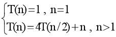

的时间复杂度为(    )。

正确答案: D   你的答案: 空 (错误)

```cpp
O(n)
```

```cpp
O(logn)
```

```cpp
O(nlogn)
```

```cpp
O(n2)
```

本题知识点

Java 工程师 360 公司 Java 工程师 360 公司 2018

## 10

有关贪心法叙述正确的是（      ）

正确答案: A   你的答案: 空 (错误)

```cpp
采用局部最优策略
```

```cpp
采用全局最优策略
```

```cpp
在贪心法中采用逐步构造最优解的方法
```

```cpp
把问题分解为简单的问题求解
```

本题知识点

Java 工程师 360 公司 贪心 Java 工程师 360 公司 2018

## 11

在选择分治法解决问题时，应考虑待解决问题应具有哪些特征（      ）

正确答案: A   你的答案: 空 (错误)

```cpp
待解决问题规模缩小到一定程度后可以容易解决
```

```cpp
待解决问题应可以分解为若干个规模较小的相同问题，且子问题应可直接求解。
```

```cpp
各子问题之间是相互独立的
```

```cpp
分解后的子问题的解可以合并为源问题的解
```

本题知识点

Java 工程师 360 公司 分治 Java 工程师 360 公司 2018

## 12

在有序表中，关于斐波那契查找和折半查找说法错误的是（）

正确答案: A B C   你的答案: 空 (错误)

```cpp
就平均性能而言，斐波那契查找的平均性能比折半查找差
```

```cpp
只有有序表中元素个数 n 等于某个斐波那契数时才能用斐波那契查找算法
```

```cpp
在最坏情况下，斐波那契查找的性能比折半查找好
```

```cpp
折半查找时间复杂度为 O(log2n)
```

本题知识点

Java 工程师 360 公司 查找 *Java 工程师 360 公司 2018* *## 13

下面说法错误的是（）

正确答案: C   你的答案: 空 (错误)

```cpp
快速排序算法平均速度最快
```

```cpp
堆排序在每一趟排序过程中，都会有一个元素被放置在最终位置上
```

```cpp
在 10000 个无序的元素中查找最大的 10 个元素，使用快速排序最快
```

```cpp
插入排序是一种稳定的排序算法
```

本题知识点

Java 工程师 360 公司 排序 *2018* *讨论

[Tumbleweed-ou](https://www.nowcoder.com/profile/180778382)

插入排序不稳定吗？？？？？？？

发表于 2020-03-23 18:14:15

* * *

[花冠武神](https://www.nowcoder.com/profile/380278662)

C 吧，堆排

发表于 2019-10-09 14:02:15

* * *

[NewGuests](https://www.nowcoder.com/profile/826847924)

360 日常出错题

发表于 2019-09-10 10:42:05

* * *

## 14

对于函数 y = ax² + bx + c,(a > 0),需要找出 y 的小值，精确到小数点后 6 位。下列选项中最有效的方法是（）。

正确答案: D   你的答案: 空 (错误)

```cpp
枚举
```

```cpp
二分查找
```

```cpp
三分查找
```

```cpp
推公式
```

本题知识点

Java 工程师 360 公司 Java 工程师 360 公司 Java 工程师 360 公司 Java 工程师 360 公司 Java 工程师 360 公司 2018

## 15

设哈希表长 m=13,哈希函数 H(key)=key MOD 11。表中已有 4 个节点:addr(16)=5,addr(28)=6,addr(84)=7,addr(19)=8 其余地址为空,如用线性探测再散列处理冲突，则关键字为 38 的地址为（      ）

正确答案: D   你的答案: 空 (错误)

```cpp
6
```

```cpp
7
```

```cpp
8
```

```cpp
9
```

本题知识点

Java 工程师 360 公司 哈希 *Java 工程师 360 公司 2018* *讨论

[chapeaudepaille](https://www.nowcoder.com/profile/9465180)

线性探测会向后寻找离冲突最近的且为空的储存单元，38%11=5，而 5~8 均不为空，所以选 9（9<13）。

发表于 2019-09-25 18:37:20

* * *

## 16

#include <bits>using namespace std;
int main(){
stack<int>st;
int pos = 1;
while(pos <= 3){
st.push(pos++);
}
cout<<st.top();
while(pos <= 5){
st.push(pos++);
}
while(!st.empty()){
cout<<st.top();
st.pop();
}
return 0;
}
上述程序的输出为(      )

正确答案: B   你的答案: 空 (错误)

```cpp
35421
```

```cpp
354321
```

```cpp
12453
```

```cpp
123453
```

本题知识点

Java 工程师 360 公司 C++ Java 工程师 360 公司 2018

讨论

[zuiai1900](https://www.nowcoder.com/profile/89469837)

`cout << st.top()   没有跟 st.pop()

发表于 2019-09-06 13:10:33

* * *

## 17

#include <bits>using namespace std;
int gcd(int a, int b){
return b == 0 ? a : gcd(b, a % b);
}
struct stsort{
bool operator () (const int a, const int b) const{
if(gcd(30, a) < gcd(30, b)){
return 1;
}
else if(gcd(30, a) == gcd(30, b)){
return a < b;
}
else return 0;
}
};
int main(){
int n = 5;
priority_queue<int, vector<int>, stsort>q;
for(int i = 1; i <= n; ++i){
q.push(i);
}
for(int i = 1; i <= n; ++i){
printf("%d", q.top());
q.pop();
}
return 0;
}
程序的输出为( )

正确答案: A   你的答案: 空 (错误)

```cpp
53421
```

```cpp
53241
```

```cpp
12435
```

```cpp
14235
```

本题知识点

Java 工程师 360 公司 C++ Java 工程师 360 公司 2018

讨论

[胖十斤换网名的阿琛](https://www.nowcoder.com/profile/452061985)

这个题目的意思是按数字 30 的最大公约数大小进行排序的优先队列【按公约数从大到小排序】上面的太乱了，看下面我这个代码

```cpp
#include <iostream>
#include <queue>
#include <vector>
using namespace std;
int gcd(int a, int b) {
	return b == 0 ? a : gcd(b, a % b);
}
struct stsort {
	bool operator () (const int a, const int b) const {
		if (gcd(30, a) < gcd(30, b)) {
			return 1;
		}
		else if (gcd(30, a) == gcd(30, b)) {
			return a < b;
		}
		else return 0;
	}
};
int main() {
	int n = 5;
	priority_queue<int, vector<int>, stsort>q;
	for (int i = 1; i <= n; ++i) {
		q.push(i);
	}
	for (int i = 1; i <= n; ++i) {
		printf("%d", q.top());
		q.pop();
	}
	return 0;
}
```

公约数依次为 5--3--2--2--1
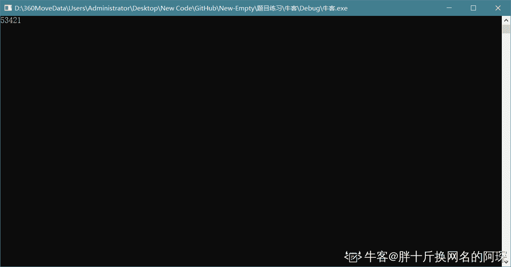

发表于 2019-10-08 15:34:14

* * *

[花冠武神](https://www.nowcoder.com/profile/380278662)

没太看懂

发表于 2019-10-08 07:41:17

* * *

## 18

#include <bits>using namespace std;
int main(){
int n = 5;
vector<int>a;
set<int>b;
for(int i = 1; i <= n; ++i){
a.push_back(i);
b.insert(i);
}
for(int i = 1; i <= n; ++i){
a.push_back(i);
b.insert(i);
}
cout<<a.size()<<b.size()<<endl;
return 0;
}
程序的输出为( )

正确答案: A   你的答案: 空 (错误)

```cpp
105
```

```cpp
510
```

```cpp
1010
```

```cpp
55
```

本题知识点

Java 工程师 360 公司 C++ Java 工程师 360 公司 2018

讨论

[候凸 joshua](https://www.nowcoder.com/profile/953572732)

vector？

发表于 2019-09-28 08:05:28

* * *

[面向快乐编程](https://www.nowcoder.com/profile/651683711)

Set 意为集合，集合在数学上没有重复值

发表于 2019-09-27 10:40:54

* * *

[十七岁仲夏](https://www.nowcoder.com/profile/636182307)

set 容器里没有重复值

发表于 2019-08-24 20:34:58

* * *

## 19

#include <bits>using namespace std;
vector<int>g[10];
int ans = 0;
void dfs(int x){
if(g[x].size() == 0){
ans++;
return;
}
for(int i = 0; i < g[x].size(); ++i){
dfs(g[x][i]);
}
}
int main(){
int n, x;
scanf("%d", &n);
for(int i = 2; i <= n; ++i){
scanf("%d", &x);
g[x].push_back(i);
}
dfs(1);
cout<<ans<<endl;
return 0;
}
上述程序的输入为：
9
1 2 2 1 5 6 6 6
则输出为( )

正确答案: B   你的答案: 空 (错误)

```cpp
4
```

```cpp
5
```

```cpp
6
```

```cpp
7
```

本题知识点

Java 工程师 360 公司 C++ Java 工程师 360 公司 2018

讨论

[木子女乔女乔](https://www.nowcoder.com/profile/45343828)

2-9 共 8 个空间，没有放值的空间使计数变量加 1，第 3 4 7 8 9 个空间没有放值，所以是 5

发表于 2019-09-11 11:49:12

* * *

[i-小果子](https://www.nowcoder.com/profile/304741246)

当调用 dfs 函数时，vector 里面没有 3 4 7 89 的索引元素，所以对应 size 为 0，使得值加 1

发表于 2019-10-26 14:33:37

* * *

## 20

用(a,b,c)表示节点 a,b 之间有一条权值为 c 的无向边。对于图(1,2,3),(1,3,4),(1,5,1),(2,3,4),(2,4,6),(2,5,2),(3,5,1)。最小生成树的权值和为(        )

正确答案: B   你的答案: 空 (错误)

```cpp
9
```

```cpp
10
```

```cpp
11
```

```cpp
12
```

本题知识点

Java 工程师 360 公司 树 Java 工程师 360 公司 2018

## 21

一棵二叉树有 100 个节点，若根节点深度为 1，树深最大为(       )，最小为(       )

正确答案: B   你的答案: 空 (错误)

```cpp
100 2
```

```cpp
100 7
```

```cpp
7 6
```

```cpp
7 2
```

本题知识点

Java 工程师 360 公司 树 Java 工程师 360 公司 2018

讨论

[OKJustdoit](https://www.nowcoder.com/profile/964880068)


编辑于 2019-09-24 22:19:00

* * *

## 22

在一棵度为 5 的树 T 中，若 14 个度为 5 的结点，15 个度为 4 的结点，14 个度为 3 的结点，5 个度为 2 的结点，10 个度为 1 的结点，则树 T 的叶节点个数是（     ）

正确答案: D   你的答案: 空 (错误)

```cpp
72
```

```cpp
102
```

```cpp
130
```

```cpp
135
```

本题知识点

Java 工程师 360 公司 树 Java 工程师 360 公司 2018

讨论

[一只老风铃](https://www.nowcoder.com/profile/9973952)

14*5+15*4+42+10+10+1-14-15-15-14135 没有正确答案

发表于 2019-08-31 18:11:01

* * *

[zhaolei123](https://www.nowcoder.com/profile/682241479)

没正确答案啊

发表于 2019-04-24 10:42:34

* * *

## 23

#include <bits>using namespace std;
int n = 300;
int solve(int x){
return x * (n - x);
}
int main(){
int l = 1, r = n;
int mid1, mid2;
int t = 50;
while(t--){
mid1 = l + r >> 1;
mid2 = mid1 + r >> 1;
if(solve(mid1) > solve(mid2)){
r = mid2;
}
else{
l = mid1;
}
}
cout<< l <<endl;
return 0;
}
程序的输出为(        )

正确答案: C   你的答案: 空 (错误)

```cpp
1
```

```cpp
100
```

```cpp
150
```

```cpp
300
```

本题知识点

Java 工程师 360 公司 C++ Java 工程师 360 公司 2018

讨论

[听见 _ 下雨的声音](https://www.nowcoder.com/profile/249731987)

```cpp
#include<bits/stdc++.h>
using namespace std;
int n = 300;
int solve(int x){
return x * (n - x);
}
int main(){
int l = 1, r = n;
int mid1, mid2;
int t = 50;
while(t--){

mid1 = l + r >> 1;
mid2 = mid1 + r >> 1;
if(solve(mid1) > solve(mid2)){
r = mid2;
}

else{
l = mid1;
}

}

cout<< l <<endl;
return 0;
}
```

类似于二分查找
寻找极值点

发表于 2019-09-01 21:14:51

* * *

## 24

#include <bits>using namespace std;
int solve(int x){
if(x == 0 || x == 1){
return x;
}
if(x % 2 == 0){
return 1 + solve(x / 2);
}
else{
return 1 + solve((x + 1) / 2);
}
}
int main(){
int n = 100;
int ans = solve(n);
cout<<ans<<endl;
return 0;
}
程序的输出为(      )

正确答案: C   你的答案: 空 (错误)

```cpp
6
```

```cpp
7
```

```cpp
8
```

```cpp
9
```

本题知识点

Java 工程师 360 公司 C++ Java 工程师 360 公司 2018

讨论

[阡夺](https://www.nowcoder.com/profile/508092351)

直接按照程序的运行顺序进行运算 选 C

发表于 2019-09-29 21:54:18

* * *

[YoungPlus](https://www.nowcoder.com/profile/2791553)

x 值变化顺序：100、50、25、13、7、4、2、1，一共 8 次

发表于 2019-09-29 17:23:58

* * *

## 25

一个有 n 个节点的树，有( )条边。

正确答案: A   你的答案: 空 (错误)

```cpp
n - 1
```

```cpp
n
```

```cpp
n + 1
```

```cpp
n ^ 2
```

本题知识点

Java 工程师 360 公司 树 Java 工程师 360 公司 2018

## 26

现有磁盘读写请求队列为 2、4、0、5、1，若当前磁头在 1 号磁道上,若采用 FCFS 算法进行磁盘调度时，则平均寻道长度为（      ）

正确答案: B   你的答案: 空 (错误)

```cpp
2.4
```

```cpp
3.2
```

```cpp
1.2
```

```cpp
1.6
```

本题知识点

Java 工程师 360 公司 操作系统 Java 工程师 360 公司 2018

讨论

[fullish](https://www.nowcoder.com/profile/839736237)

1->2：1；2->4：2；4->0：4；0->5：5；5->1：4；平均时间(1+2+4+5+4)/5=3.2;

发表于 2019-09-07 10:05:24

* * *

## 27

有 4 个批处理的作业（A、B、C 和 D）到达计算中心的时间分别为 9:00，9:30，9:40，9:50，估计的运行时间分别为 60、50、30、10 分钟，它们的优先数分别为 1、2、4、3（1 为最低优先级）。若采用优先级高者优先调度算法，则作业的平均带权周转时间为（      ）

正确答案: A   你的答案: 空 (错误)

```cpp
2.52
```

```cpp
3
```

```cpp
3.62
```

```cpp
3.98
```

本题知识点

Java 工程师 360 公司 操作系统 Java 工程师 360 公司 2018

## 28

下列哪种算法理论上性能最佳，实际上无法实现（      ）

正确答案: A   你的答案: 空 (错误)

```cpp
OPT 算法
```

```cpp
SCAN 算法
```

```cpp
FIFO 算法
```

```cpp
Clock 置换算法
```

本题知识点

Java 工程师 360 公司 操作系统 Java 工程师 360 公司 2018

## 29

在一个请求分页系统中，假定系统分给一个作业的物理块数为 3，刚开始没有一个页面装入内存，并且此作业的页面走向为 2，3，2，1，5，2，4，5，3，2，5，2。使用 OPT 算法时产生的缺页次数为（      ）

正确答案: A   你的答案: 空 (错误)

```cpp
6
```

```cpp
7
```

```cpp
8
```

```cpp
9
```

本题知识点

Java 工程师 360 公司 操作系统 Java 工程师 360 公司 2018

讨论

[computer001](https://www.nowcoder.com/profile/819420031)

opt 选择永不需要的页面或最长时间后才需要的页面置换

发表于 2019-08-28 11:06:19

* * *

## 30

一个数据流中出现了的报文片段：A ESC FLAG B，假设采用字节填充算法，填充后的输出为（      ）

正确答案: B   你的答案: 空 (错误)

```cpp
A ESC ESC FLAG B
```

```cpp
A ESC ESC ESC FLAG B
```

```cpp
FLAG A ESC FLAG B FLAG
```

```cpp
A ESC FLAG FLAG B
```

本题知识点

Java 工程师 360 公司 操作系统 Java 工程师 360 公司 2018

## 31

以下地址中的哪一个和 76.32/12 匹配（      ）

正确答案: A   你的答案: 空 (错误)

```cpp
76.33.214.12
```

```cpp
76.79.24.11
```

```cpp
76.58.119.74
```

```cpp
76.68.204.11
```

本题知识点

Java 工程师 360 公司 网络基础 Java 工程师 360 公司 2018

讨论

[天然萌。20180402154065](https://www.nowcoder.com/profile/8919191)

32 是 0010 0000，固定前 12 位，后面的应该 0000 可变，范围是 1-15，所以是 33-47

发表于 2019-08-29 16:54:52

* * *

[82 年的苏打水](https://www.nowcoder.com/profile/6103363)

76.32/12  将 76.32 转化为 8*2 位二进制，前 12 位固定，则第二位的范围是 32-47，只有第一个符合范围也不知道对不对

发表于 2019-08-29 11:34:30

* * *

## 32

网络拓扑结构中存在网桥 S1、S2、S3、S4，若对应 MAC 地址分别为 AABB-CCDD-EE00、AABB-CCDD-EE11、BBBB-CCDD-EE00、BBBB-CCDD-EE11,所有网桥优先级采用默认值,则使用 STP 协议后，哪个网桥会被确定为根网桥（      ）

正确答案: A   你的答案: 空 (错误)

```cpp
S1
```

```cpp
S2
```

```cpp
S3
```

```cpp
S4
```

本题知识点

Java 工程师 360 公司 网络基础 Java 工程师 360 公司 2018

讨论

[飞云之下.](https://www.nowcoder.com/profile/401479550)

交换机之间选择网桥 ID 值最小的交换机作为网络中的根网桥。交换机优先级（缺省 32768）和 MAC 地址构成网桥 ID。因此默认优先级的情况下，最小的 MAC 地址即为根网桥。 发表于 2019-08-26 10:39:05

* * *

## 33

原始数据为 011011111111111111110010 采用比特填充技术填充后的发送数据为（      ）

正确答案: D   你的答案: 空 (错误)

```cpp
0110111110111111111110010
```

```cpp
011011111111111111110010
```

```cpp
01101111101111110111110010
```

```cpp
011011111011111011111010010
```

本题知识点

Java 工程师 360 公司 网络基础 Java 工程师 360 公司 2018

讨论

[pythias_](https://www.nowcoder.com/profile/6042210)

连续 5 个 1，添加一个 0

发表于 2019-04-15 11:43:19

* * *

## 34

存在以下三个 CIDR 地址块 192.168.11.0/27、192.168.11.32/27 和 192.168.11.64/26 聚合后的 CIDR 地址块应是（      ）

正确答案: A   你的答案: 空 (错误)

```cpp
192.168.11.0/25
```

```cpp
192.168.11.0/26
```

```cpp
192.168.11.64/25
```

```cpp
192.168.11.64/26
```

本题知识点

Java 工程师 360 公司 网络基础 Java 工程师 360 公司 2018

讨论

[钱多事少离家近](https://www.nowcoder.com/profile/720625582)

感觉应该选 A

发表于 2019-08-22 18:21:19

* * *

[尘汐双子](https://www.nowcoder.com/profile/208481202)

27：0001 101132：0010 000064：0100 0000 聚合取前缀相同的，所以应该是：A

```cpp
192.168.11.0/25
```

编辑于 2019-10-17 16:40:27

* * *

## 35

终端发送帧序列为 1101011111，使用生成多项式为 G(x)=x⁴+x+1 校验后发出的帧为序列为（      ）

正确答案: D   你的答案: 空 (错误)

```cpp
11010111111100
```

```cpp
11010111110011
```

```cpp
11010111111011
```

```cpp
11010111110010
```

本题知识点

Java 工程师 360 公司 网络基础 Java 工程师 360 公司 2018

讨论

[你为什么这么熟练](https://www.nowcoder.com/profile/7824117)

G(x)=x⁴+x+1 对应多项式 10011（分母）并会产生 4 CRC 码所以 1101011111 +0000 得到编码分子 11010111110000 / 10011  = 10 余数运算过程类似 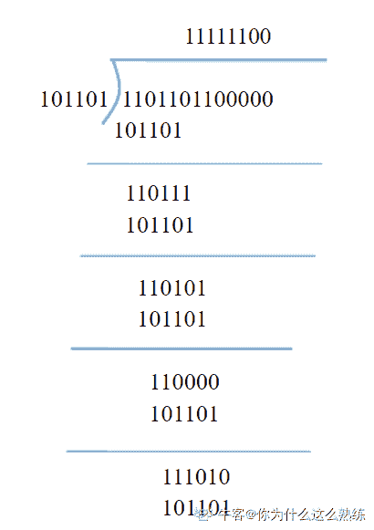（进行异或运算）分子 + 余数  =》 结果

编辑于 2019-08-23 16:06:51

* * *

[黄色变白色](https://www.nowcoder.com/profile/8547911)

不懂，求大佬现身解释

发表于 2019-08-23 07:53:23

* * *

## 36

处于同一网络上的主机对有（      ）

正确答案: A B   你的答案: 空 (错误)

```cpp
192.168.5.72/255.255.255.0 和 192.168.5.79/255.255.255.0
```

```cpp
192.168.19.35/255.255.255.224 和 192.168.19.48/255.255.255.224
```

```cpp
19.128.14.14/255.255.255.240 和 19.128.14.19/255.255.255.240
```

```cpp
192.168.3.68/255.255.255.248 和 192.168.3.74/255.255.255.248
```

本题知识点

Java 工程师 360 公司 网络基础 Java 工程师 360 公司 2018

## 37

应用 NAT 后会带来哪些影响（      ）

正确答案: A   你的答案: 空 (错误)

```cpp
不利于分片
```

```cpp
不利于数据加密
```

```cpp
需要重新计算 IP 分组校验和
```

```cpp
可以解决 IPv4 地址耗尽问题
```

本题知识点

Java 工程师 360 公司 网络基础 Java 工程师 360 公司 2018

讨论

[哈迪斯龙](https://www.nowcoder.com/profile/1896205)

关于 A，在应用 NAT 后，当 NAT 网关收到服务端发的 IP 分片时，由于只有首个 IP 分片中包含传输层信息（端口，协议等），后续的 IP 分片到 NAT 网关时，NAT 网关将无法直接根据本分片信息还原出原来的内网 IP，需要进行特殊处理甚至重组分片（虚拟重组，真正的重组是在客户端上进行），这将对网络的时延和带宽产生影响。B 和 C 应该没什么疑问。对于 D，应该错在解决，感觉应该换成缓解。

编辑于 2019-08-27 17:33:34

* * *

[沉鱼](https://www.nowcoder.com/profile/612950621)

nat 网关：SNAT 和 DNAT 内部地址要访问公网上的服务时（如 web 访问），内部地址会主动发起连接，由路由器或者防火墙上的网关对内部地址做个地址转换，将内部地址的私有 IP 转换为公网的公有 IP，网关的这个地址转换称为 SNAT，主要用于内部共享 IP 访问外部。 当内部需要提供对外服务时（如对外发布 web 网站），外部地址发起主动连接，由路由器或者防火墙上的网关接收这个连接，然后将连接转换到内部，此过程是由带有公网 IP 的网关替代内部服务来接收外部的连接，然后在内部做地址转换，此转换称为 DNAT，主要用于内部服务对外发布。

发表于 2019-10-30 20:18:13

* * *

## 38

如果需要在不影响其他对象的情况下，以动态，透明的方式给对象添加职责，应该选择何种设计模式？

正确答案: D   你的答案: 空 (错误)

```cpp
动态代理模式
```

```cpp
适配器模式
```

```cpp
桥接模式
```

```cpp
装饰模式
```

本题知识点

Java 工程师 360 公司 Java 工程师 360 公司 Java 工程师 360 公司 Java 工程师 360 公司 设计模式 Java 工程师 360 公司 2018

## 39

如果需要一个语言解释执行，并且可以将语言中的句子表示为一个抽象语法树的时候，对效率要求不高的情况下，应该选择何种设计模式？

正确答案: A   你的答案: 空 (错误)

```cpp
解释器模式
```

```cpp
动态代理模式
```

```cpp
装饰模式
```

```cpp
访问者模式
```

本题知识点

Java 工程师 360 公司 Java 工程师 360 公司 Java 工程师 360 公司 Java 工程师 360 公司 设计模式 Java 工程师 360 公司 2018

讨论

[计算机俱乐部](https://www.nowcoder.com/profile/9375023)

解释器模式，递归那块好难

发表于 2021-03-26 11:44:51

* * *

## 40

下图的 UML 类结构图表示的是哪种设计模式：

正确答案: C   你的答案: 空 (错误)

```cpp
命令模式
```

```cpp
迭代器模式
```

```cpp
单例模式
```

```cpp
抽象工厂模式
```

本题知识点

Java 工程师 360 公司 Java 工程师 360 公司 Java 工程师 360 公司 Java 工程师 360 公司 设计模式 Java 工程师 360 公司 2018

讨论

[暂退](https://www.nowcoder.com/profile/5544427)

敢问图在何方？


发表于 2019-06-02 14:30:53

* * *

## 41

下图的 UML 类结构图表示的是哪种设计模式：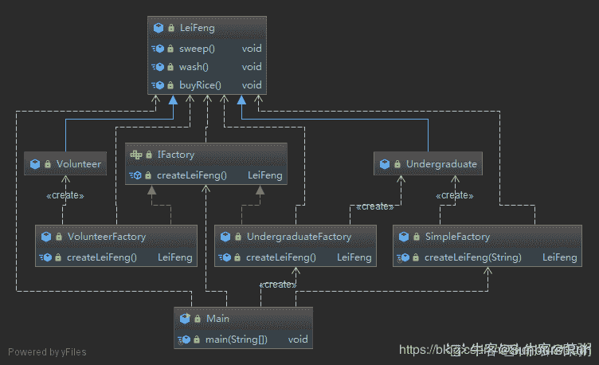

正确答案: D   你的答案: 空 (错误)

```cpp
模板方法模式
```

```cpp
策略模式
```

```cpp
状态模式
```

```cpp
工厂方法模式
```

本题知识点

Java 工程师 360 公司 设计模式 2018

讨论

[爱学习的小代](https://www.nowcoder.com/profile/994880749)

就我一个人看不到图？

发表于 2020-03-19 17:27:51

* * *

[saykuray](https://www.nowcoder.com/profile/4510906)

图呢

发表于 2020-04-22 01:06:28

* * *

[关雎灬](https://www.nowcoder.com/profile/325739118)

看不到图+1

发表于 2020-04-10 22:38:40

* * *

## 42

数据库 1NF、2NF、3NF 和 BCNF 之间的关系是（      ）

正确答案: D   你的答案: 空 (错误)

```cpp
若 R∈2NF,则 R∈3NF
```

```cpp
若 R∈1NF,则 R 不属于 BCNF
```

```cpp
若 R∈3NF,则 R∈BCNF
```

```cpp
若 R∈BCNF,则 R∈3NF
```

本题知识点

Java 工程师 360 公司 数据库 Java 工程师 360 公司 2018

讨论

[🐷头 201903041448838](https://www.nowcoder.com/profile/47516635)

第二范式（2NF）满足于第一范式（1NF），也就是基于第一范式（1NF）,2NF∈1NF 第三范式（3NF）满足于第二范式（2NF），也就是基于第二范式（2NF）,3NF∈2NFBCNF 满足于第三范式（3NF），也就是基于第三范式（3NF）,BCNF∈3NF 第一范式（1NF），要求：每一个分量必须是不可分的数据项。第二范式（2NF），要求：在第一范式的基础上，且每一个非主属性完全函数依赖于表码。第三范式（3NF），要求：在满足第二范式的基础上，且每一个非主属性既不部分依赖于码也不传递依赖于表码。BCNF，要求：在满足第三范式的基础上，且不允许主键的一部分被另一部分或其它部分决定。

发表于 2019-10-12 16:34:26

* * *

## 43

某 IT 公司人事管理采用专门的人事管理系统来实现。后台数据库名为 LF。新来的人事部张经理新官上任，第一件事是要对公司的员工做全面的了解。可是他在访问员工信息表 EMPL 里的工资和奖金字段的时被拒绝，只能查看该表其他字段。作为 LF 的开发者你将如何解决这一问题：（      ）

正确答案: D   你的答案: 空 (错误)

```cpp
废除张经理的数据库用户帐户对表 EMPL 里的工资列和奖金列的 SELECT 权限
```

```cpp
添加张经理到 db_datareader 角色
```

```cpp
添加张经理到 db_accessadmin 角色
```

```cpp
授予张经理的数据库用户帐户对表 EMPL 里的工资列和奖金列的 SELECT 权限。
```

本题知识点

Java 工程师 360 公司 数据库 Java 工程师 360 公司 2018

## 44

在数据库中存在多列的情况下，若要删除表中的某一列应该使用 SQL 语句（      ）

正确答案: B   你的答案: 空 (错误)

```cpp
ALTER TABLE tableName DROP columnName
```

```cpp
ALTER TABLE tableName DROP COLUMN columnName
```

```cpp
ALTER TABLE tableName DELETE columnName
```

```cpp
ALTER TABLE tableName DELETE COLUMN columnName
```

本题知识点

Java 工程师 360 公司 数据库 Java 工程师 360 公司 2018

## 45

在 MySQL 中，关于索引，下面描述中错误的一项是（      ）

正确答案: C   你的答案: 空 (错误)

```cpp
建立索引可以提高数据查询的效率
```

```cpp
聚集索引可能会降低数据的插入速度
```

```cpp
innodb 存储引擎支持全文索引
```

```cpp
删除索引的命令是 drop index
```

本题知识点

Java 工程师 360 公司 数据库 Java 工程师 360 公司 2018

讨论

[offerofffer](https://www.nowcoder.com/profile/872822)

InnoDB 在 MySQL5.6 版本后开始支持全文索引了啊

发表于 2019-08-26 20:27:23

* * *

## 46

关于数据库的索引，如下那个选项是正确的？

正确答案: D   你的答案: 空 (错误)

```cpp
针对某些字段建立索引，能够有效的减少相关数据库表的磁盘空间占用；
```

```cpp
针对某些字段建立索引，能够有效的提升相关字段的读与写的效率；
```

```cpp
常见数据库管理系统，通常使用 hash 表来存储索引；
```

```cpp
数据库索引的存在，可能导致相关字段删除的效率降低；
```

本题知识点

Java 工程师 360 公司 数据库 Java 工程师 360 公司 2018

讨论

[随惜](https://www.nowcoder.com/profile/4706986)

```cpp
建立索引就是将目标字段进行排序并存储到新的数据结构中，需要消耗更多的内存，一般采用 B+树的形式存储，
此时对于相关字段的读不需要遍历整个数据库，只需要对 B+树进行对半查找就行，耗时更短，
但是建立索引之后对数据库的更新需要消耗更多的时间，因为需要同步更新索引。
```

发表于 2019-09-28 19:30:35

* * *

## 47

数据库中，什么操作命令可以整理表数据文件的碎片

正确答案: A   你的答案: 空 (错误)

```cpp
optimize table TabName;
```

```cpp
repaire table TabName;
```

```cpp
analyze table TabName;
```

```cpp
flush table TabName;
```

本题知识点

Java 工程师 360 公司 数据库 2018

讨论

[小六喜欢赵小刀](https://www.nowcoder.com/profile/860595925)

按照翻译差不多就可以选择正确

```cpp
optimize table TabName;
优化表
```

```cpp
repaire table TabName;
修复表
```

```cpp
analyze table TabName;
分析表
```

```cpp
flush table TabName;
刷新表     相当于重置吧
```

**如有错误，可私聊我改正。**

发表于 2020-06-09 08:38:57

* * *

[windy_yy](https://www.nowcoder.com/profile/177914273)

整理表数据文件碎片是对表的优化操作，用 optimize。repair 是修复表

发表于 2019-11-23 12:47:56

* * *

## 48

下列不属于 POSIX 互斥锁相关函数的是：（      ）

正确答案: D   你的答案: 空 (错误)

```cpp
int pthread_mutex_destroy(pthread_mutex_t* mutex)
```

```cpp
int pthread_mutex_lock(pthread_mutex_t* mutex)
```

```cpp
int pthread_mutex_trylock(pthread_mutex_t* mutex)
```

```cpp
int pthread_mutex_create(pthread_mutex_t* mutex)
```

本题知识点

Java 工程师 360 公司 Linux Java 工程师 360 公司 2018

讨论

[柚酒](https://www.nowcoder.com/profile/9014674)

不存在 D 这个函数吧，创建应该是直接声明变量，然后用下面函数初始化或者直接用宏

```cpp
int pthread_mutex_init(pthread_mutex_t *restrict mutex, const pthread_mutexattr_t *restrict attr);
或者
pthread_mutex_t mutex = PTHREAD_MUTEX_INITIALIZER;
```

发表于 2019-09-06 00:27:55

* * *

## 49

POSIX 线程中如果数据被其他线程修改，则应把数据声明为：（      ）

正确答案: D   你的答案: 空 (错误)

```cpp
const
```

```cpp
private
```

```cpp
public
```

```cpp
volatile
```

本题知识点

Java 工程师 360 公司 Linux 2018

讨论

[土豆也叫马铃薯](https://www.nowcoder.com/profile/450309694)

volatile 是一个类型[修饰符](https://baike.baidu.com/item/%E4%BF%AE%E9%A5%B0%E7%AC%A6)（type specifier）作用是作为指令[关键字](https://baike.baidu.com/item/%E5%85%B3%E9%94%AE%E5%AD%97/7105697)，确保本条指令不会因[编译器](https://baike.baidu.com/item/%E7%BC%96%E8%AF%91%E5%99%A8/8853067)的优化而省略，且要求每次直接读值。volatile 的变量是说这变量可能会被意想不到地改变，这样，[编译器](https://baike.baidu.com/item/%E7%BC%96%E8%AF%91%E5%99%A8/8853067)就不会去假设这个变量的值了。根据题意，数据可以被其他线程修改，而要不出错的达到这样的要求，就可以使用 volatile 修饰这个变量。

发表于 2019-09-05 10:55:45

* * *

[唯一――恋！](https://www.nowcoder.com/profile/8083651)

Volatile 修饰的成员变量在每次被线程访问时，都强制从共享内存中重新读取该成员变量的值。而且，当成员变量发生变化时，会强制线程将变化值回写到共享内存。这样在任何时刻，两个不同的线程总是看到某个成员变量的同一个值。

发表于 2019-11-01 18:18:50

* * *

## 50

某公司网络中心升级 web 服务器的物理内存,相应的要提高 linux 服务器交换空间,以下可以扩展交换空间的操作是（      ）

正确答案: A   你的答案: 空 (错误)

```cpp
dd if=/dev/zero of=/mnt/sw1;swapon /mnt/sw1
```

```cpp
mkfs -f  swap /dev/sdb1
```

```cpp
mkswap /dev/sdb1
```

```cpp
swapon /dev/sdb1
```

本题知识点

Java 工程师 360 公司 Linux Java 工程师 360 公司 2018

## 51

公司网络中心 linux 服务器需要升级 OA 系统,为了防止客户登录影响系统升级,网络管理员可以执行的操作有（      ）

正确答案: A   你的答案: 空 (错误)

```cpp
touch /etc/nolgoin
```

```cpp
init 3
```

```cpp
init 6
```

```cpp
iptable -S INPUT -t tcp -s !127.0.0.1 -j DROP
```

本题知识点

Java 工程师 360 公司 Linux Java 工程师 360 公司 2018

讨论

[柚酒](https://www.nowcoder.com/profile/9014674)

这条命令是禁止用户登陆 init 0:关机
init 1:单用户模式
init 3:完全多用户模式，标准的运行级
init 5:启动可进入 X-window 系统
init 6:重启

编辑于 2019-09-05 19:27:26

* * *

## 52

下面代码执行后的结果为（      ）

```cpp
int main() {
    int sum=0;
    int i=0,j=0;
    for(j=0;j<6;j++) {
        if(j%2)continue;
        sum++;
    }
    printf("sum=%d",sum);
    return 0;
}
```

正确答案: C   你的答案: 空 (错误)

```cpp
sum=1
```

```cpp
sum=2
```

```cpp
sum=3
```

```cpp
其他几项都不对
```

本题知识点

360 公司 2018 C++工程师 C++

讨论

[略。201807192104234](https://www.nowcoder.com/profile/927986080)

上面的代码编译都通不过。 

```cpp
if(j%2)  //int 无法转换成 boolean
```

编辑于 2019-09-11 11:46:08

* * *

[Coder 编程](https://www.nowcoder.com/profile/8175030)

**吐槽点：**1.Java 题出现 C 语言的题目。2.定义变量 i 等等（抛开吐槽点，我们来看下这道题的考点。）**考点：****1.****continue:**continue 语句的作用是跳过本次循环体中余下尚未执行的语句，立即进行下一次的循环条件判定，可以理解为仅结束本次循环。**2.if(j%2)（包含：if 以及取模运算）：**也就是求 j 除以 2 的余数（取模），if(j%3)判断 j 对 3 取余以后是否为 0，如果不是 0，执行 if 下面的语句,
如果是 0，执行另外的语句(例如 else 下面的语句)**做题：**1.j=0,0%2=0 sum=1
2.j=1,1%2=1 sum=1
3.j=2,2%2=0 sum=2
4.j=3,3%2=1 sum=2
5.j=4,4%2=0 sum=3
 6.j=5,5%2=1 sum=3

发表于 2019-09-18 13:48:06

* * *

[北酒鱼](https://www.nowcoder.com/profile/4473795)

牛客这几天的题都是错的我也是服了

发表于 2019-08-22 22:47:05

* * *

## 53

c 语言中的话，下列数组定义错误的是（      ）

正确答案: A C   你的答案: 空 (错误)

```cpp
int arr[2][3] = {{1,2},{3,4},{5,6}};
```

```cpp
int arr[][3] = {{1,2,3},{4,5,6}};
```

```cpp
int arr[10]={,10};
```

```cpp
int arr[10]={10};
```

本题知识点

Java 工程师 360 公司 C++ Java 工程师 360 公司 2018

讨论

[咸鱼变身](https://www.nowcoder.com/profile/48437153)

这 TM 什么题目，Java 的话全错。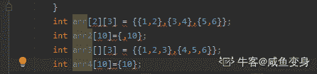
 发表于 2019-08-21 14:00:21

* * *

[给我 offer 吧我要哭了](https://www.nowcoder.com/profile/230952597)

这道题我已经屏蔽不下三次了，乖，下次别再出来了我真的怕了你了
牛客把 360 和顺丰科技这两家的题该好好审核一下了，出的都是什么鬼

发表于 2019-08-27 09:12:07

* * *

[bobbie.ho](https://www.nowcoder.com/profile/426351696)

用排除法选的 C 不知道错在哪了？假设左边定义没问题的话、C 应该不可以吧。

编辑于 2019-08-22 22:54:22

* * *

## 54

c/c++中，下列选项哪些语句可以正确定义数组（      ）

正确答案: A B D   你的答案: 空 (错误)

```cpp
#define N 2017 int arr[N];
```

```cpp
#define N 2017 int arr[N*2];
```

```cpp
int i=2017； int arr[i];
```

```cpp
int arr[]={1};
```

本题知识点

Java 工程师 360 公司 C++ Java 工程师 360 公司 2018

讨论

[JaysonLin](https://www.nowcoder.com/profile/659700303)

C/C++语言，四个选项都是对的;java 语言，A 和 B 首先被排除，C 的写法应该是 int i = 2017; int a[] = new int[i]; D 是对的。

发表于 2019-08-23 15:40:26

* * *

[咸鱼变身](https://www.nowcoder.com/profile/48437153)

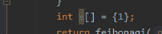D 为什么错

发表于 2019-08-21 13:53:28

* * *

[bobbie.ho](https://www.nowcoder.com/profile/426351696)

＃define 这是 C 的语法啊！顺丰屏蔽完了 360 又来、整个人心情都不好了。

发表于 2019-08-23 00:05:07

* * *

## 55

下面程序执行的结果为（      ）
void main( )
{
char ch1,ch2;

ch1 ='D'+'8'－'3';
ch2 ='9'－'1';

printf("%c %d\n",ch1,ch2);
}

正确答案: B   你的答案: 空 (错误)

```cpp
I '8'
```

```cpp
I 8
```

```cpp
G '8'
```

```cpp
其他几项都不对
```

本题知识点

Java 工程师 360 公司 Java Java 工程师 360 公司 2018

讨论

[Mr_ 黄](https://www.nowcoder.com/profile/763240689)

如果是 Java 语言，亲测答案选 B
字符类型进行算数运算，运算的是 ASCCL 码
'D'->68；'8'->56；'3'->51，所以 ch1->73，'I'的 ASCCL 码为 73 所以输出 ch1 为‘I’；同理 ch2 的 ASCCL 码为 8，强转为 int 类型输出为 8
代码如下 A

```cpp
public class Test {
    public static void main(String[] args) {
        char ch1;
        char ch2;
        ch1 = 'D' + '8' - '3';
        ch2 = '9' - '1';
        System.out.println(ch1); // 输出 I
        System.out.println((int) ch2); // 输出 8
    }

}
```

编辑于 2019-08-25 10:09:17

* * *

[唱跳编程当咸鱼](https://www.nowcoder.com/profile/123280339)

c 语言的题目，ASCII 值的运算，A=65,0=48（以此类推）。ch1=68+56-51=73 然后以 char 类型输出所以是 I，ch2=57-49=8 以整型输出所以是 8

发表于 2019-08-20 17:26:10

* * *

[闷▼*-.](https://www.nowcoder.com/profile/891844453)

一看这种语句默认是按 C 语言做的，虽然我选的是 java

编辑于 2019-10-18 11:33:53

* * *

## 56

c/c++前提下，下列关于构造函数说法正确的是（      ）

正确答案: C D   你的答案: 空 (错误)

```cpp
构造函数的返回值为 void
```

```cpp
构造函数不可以被重载
```

```cpp
构造函数可以是内联函数
```

```cpp
构造函数可以没有参数
```

本题知识点

Java 工程师 360 公司 C++ Java 工程师 360 公司 2018

讨论

[半岛。](https://www.nowcoder.com/profile/397758587)

我他妈选 D 居然错了

发表于 2019-08-20 23:37:46

* * *

[Fueen](https://www.nowcoder.com/profile/403549123)

初学者都知道，无参构造，结果居然是错的?我都想笑了

发表于 2019-09-09 22:44:29

* * *

[bobbie.ho](https://www.nowcoder.com/profile/426351696)

顺丰打完广告 360 又来了、果断屏蔽。

发表于 2019-08-23 00:01:59

* * *

## 57

关于下面程序说法正确的是（      ）

```cpp
class Item
{
private:
char *desc;
int storage;
public:
Item()
{
desc = new char[51];
}

void setInfo(char *dsrc, int num)
{
strcpy(desc,dsrc);
storage = num;
}
};

int main()
{
Item stock;

stock.setInfo("pen",20);

return 0;
}
```

正确答案: A   你的答案: 空 (错误)

```cpp
main 函数定义了一个 stock 对象占 8 个字节
```

```cpp
storage 和 desc 成员各占 4 个字节
```

```cpp
存在内存泄漏的问题
```

```cpp
存在编译错误
```

本题知识点

Java 工程师 360 公司 C++ Java 工程师 360 公司 2018

讨论

[小葫芦兄弟](https://www.nowcoder.com/profile/962846474)

C 因为没有调用 Item 函数所以没有执行 new,没有内存泄漏，B 求解答

发表于 2019-10-06 20:04:13

* * *

[╰人生只若初见╮](https://www.nowcoder.com/profile/997865526)

A ，B 应该都有问题，在 32 位操作系统中才对吧，64 位操作系统就不对了，C ，没有析构函数（delete），所以存在泄露问题

发表于 2019-08-29 20:26:02

* * *

[只为等你 201905072106724](https://www.nowcoder.com/profile/744764333)

变量名以星号开头？什么鬼！

发表于 2019-09-19 00:45:50

* * *

## 58

以下程序运行后的输出结果是（      ）

```cpp
int main()
{
int a=1,b=2,m=0,n=0,k;

k=(n=b<a)&&(m=a) ;
printf("%d,%d\n",k,m);

return 0;
}
```

正确答案: A   你的答案: 空 (错误)

```cpp
0,0
```

```cpp
0,1
```

```cpp
1,0
```

```cpp
1,1
```

本题知识点

Java 工程师 360 公司 C++ 2018 C 语言

讨论

[你猜鸭](https://www.nowcoder.com/profile/291859415)

第一个正常算出来，前面的是 false 没毛病了，然后第二个的话，切记&&是短路运算，如果前面的为 false 的话，后面的不会执行和赋值的，所以 m 还是 0

发表于 2019-09-07 13:42:18

* * *

[夏贤](https://www.nowcoder.com/profile/5066342)

如果是 Java 的组卷出现这个这道 C 语言的题目，同学可以手动屏蔽一下。在 Java 中布尔类型是不会和其它基本类型发生转换的。无论是下面的拓展转换，

```cpp
boolean bool = true;
int num = bool;
```

还是下面的窄化转换，

```cpp
int num = 1;
boolean bool = (boolean) num;
```

都是错误的语法。😀

编辑于 2019-08-22 09:47:04

* * *

[牛不**](https://www.nowcoder.com/profile/243676354)

首先搞清楚，&&是短路的，那么在第一次执行到 a

发表于 2019-08-21 22:01:24

* * *

## 59

下列代码段的打印结果为（      ）（注：└┘代表空格）
#include <stdio.h>
void main (void)
{
char  ac[]="Hello World! C Program",*p;

for(p=ac+6;p<ac+9;p++)
{
printf("%c",*p);
}
}

正确答案: A   你的答案: 空 (错误)

```cpp
Wor
```

```cpp
o W
```

```cpp
└┘Wo
```

```cpp
o Wor
```

本题知识点

Java 工程师 360 公司 C++ Java 工程师 360 公司 2018

讨论

[蓝色 201908211625465](https://www.nowcoder.com/profile/308975589)

ac+6 ☞ W ac+7 ☞ o ac+8 ☞ r

编辑于 2019-09-11 15:00:02

* * *

## 60

有关下面程序说法正确的是（      ）（注：└┘代表空格）
int main()
{
char s[6]= "abcd";
printf("\"%s\"\n", s);

return 0;
}

正确答案: A   你的答案: 空 (错误)

```cpp
“abcd”
```

```cpp
\abcd\;
```

```cpp
\abcd└┘\;
```

```cpp
编译错误
```

本题知识点

360 公司 2018 C++工程师 C++

讨论

[半岛。](https://www.nowcoder.com/profile/397758587)

老子他妈不会

发表于 2019-08-21 23:43:43

* * *

[研究所走一波](https://www.nowcoder.com/profile/619153880)

上来就是 int main 和 return 0，这是 java？这放 java 里第一行 char 就便宜不过去。*****

发表于 2019-08-21 11:27:22

* * *

[百思不得姐](https://www.nowcoder.com/profile/697603280)

这题主要是 C 语言的基础题，在学习任何面向对象的语言前我们都要学面向过程的题，做到类似的题大家可以选择性的屏蔽；现在我说说这题的解法：首先清楚 C 语言中没有字符串这一说，使用字符数组来表示字符串，\有转义字符的含义，打印 " 使用 \"，结果明显是 A。

发表于 2019-08-31 11:11:31

* * *

## 61

下面程序执行后输出结果为（      ）
#include <stdio.h>
int main()
{
int i, j, m=6,n=4,  *p=&n, *q=&m;

i=p==&m;
j=(-*p)/(*q)+7;

printf("i=%d,j=%d\n", i,j);

return 0;
}

正确答案: B   你的答案: 空 (错误)

```cpp
编译错误
```

```cpp
i=0,j=7
```

```cpp
i=0,j=0
```

```cpp
其他几项都不对
```

本题知识点

Java 工程师 360 公司 C++ Java 工程师 360 公司 2018

讨论

[AmazingPro](https://www.nowcoder.com/profile/436835463)

选 B，i=p==&m 这一步先判断 p 是否和&m 相等，结果是否，也就是 0，所以 i=0；至于 j 那步，前面的/除出来是大于 0 小于 1 得数，因为是 int 类型，所以输出为 0，所以 j=0+7，等于 7

发表于 2019-11-23 14:57:47

* * *

[Dragon.Wang](https://www.nowcoder.com/profile/334329973)

==优先级高于=

发表于 2019-10-11 12:09:23

* * *

## 62

下列说法正确的是（      ）
#include "stdio.h"
#include "string.h"

void fun( char *s)
{
char t[7];
s=t;
strcpy(s, "example");
}

int  main()
{
char *s;

fun(s);
printf("%s",s);

return 0;
}

正确答案: D   你的答案: 空 (错误)

```cpp
输出结果为&quot;example&quot;
```

```cpp
输出结果为&quot;烫烫烫烫&quot;
```

```cpp
程序编译时出现错误
```

```cpp
程序运行时出现错误
```

本题知识点

Java 工程师 360 公司 C++ Java 工程师 360 公司 2018

讨论

[幻欢子](https://www.nowcoder.com/profile/422327147)

会出现段错误，运行时报错

发表于 2019-08-26 10:52:36

* * *

[没有 offer 不改名](https://www.nowcoder.com/profile/7562771)

在函数体内声明的一般局部变量会被销毁

发表于 2019-08-22 11:54:25

* * *

[随心而安的小胖纸](https://www.nowcoder.com/profile/534763702)

这个是因为 t[7]越界了吧

发表于 2019-09-16 14:22:06

* * *

## 63

下面程序的输出结果是（      ）
#include <stdio.h>
int main()
{
int  intArray[] = {1, 2, 3, 4, 5};
int  *p = (int *)(&intArray+1);
printf("%d,%d",*(intArray+1),*(p-1));

return 0;
}

正确答案: D   你的答案: 空 (错误)

```cpp
1,5
```

```cpp
1,6
```

```cpp
2,4
```

```cpp
2,5
```

本题知识点

Java 工程师 360 公司 C++ Java 工程师 360 公司 2018

讨论

[萌新 fighting](https://www.nowcoder.com/profile/895689)

主要说下第二个为什么是 5。 我们知道 intArray+1，表示的是指向数组的首元素指针向前移动一个位置指向第二个整数元素 2。这里指针的移动是以整数为单位移动。 &intArray 实际上是指向指针的指针，我们可以理解成指向一个数组的指针，概念一样。那么&intArray+1 表示的就是向前移动一个 int[5]数组。这里指针的移动是以数组为单位移动。所以 p 是指向下一个 int[5]的首元素，即 intArray 数组的尾后元素位置。此时*(p-1)就是指向 intArray 的最后一个元素 5 了。

发表于 2019-09-01 19:58:30

* * *

[Spike__](https://www.nowcoder.com/profile/8659598)

？？？求高人指点

发表于 2019-08-31 15:03:50

* * *

[在水一方有人占用？！](https://www.nowcoder.com/profile/829529129)

```cpp
Temporary breakpoint 1, main () at practice18.c:5
5		int intArray[]={1,2,3,4,5};
Missing separate debuginfos, use: debuginfo-install glibc-2.17-260.el7_6.5.x86_64
(gdb) n
6		int *p=(int*)(&intArray+1);
(gdb) n
7		printf("%d,%d",*(intArray+1),*(p-1));
(gdb) p &intArray
$1 = (int (*)[5]) 0x7fffffffe490
(gdb) p p
$2 = (int *) 0x7fffffffe4a4 // 注意 p 与&intArray 相差 20 个字节,就是 sizeofintArray
(gdb) 
$3 = (int *) 0x7fffffffe4a4
(gdb) n
8		return 0;
(gdb) p *(p-1)
$4 = 5 
(gdb) 

```

发表于 2019-08-30 22:38:35

* * *

## 64

c/c++中，有关纯虚函数说法正确的是（      ）

正确答案: A B C D   你的答案: 空 (错误)

```cpp
子类中必须覆盖基类的纯虚函数
```

```cpp
含有纯虚函数的类不能被实例化
```

```cpp
基类的纯虚函数没有函数体
```

```cpp
含有纯虚函数的类一定是抽象类
```

本题知识点

Java 工程师 360 公司 C++ Java 工程师 360 公司 2018

讨论

[王土根](https://www.nowcoder.com/profile/866800192)

我感觉题目仿佛是选错误的?子类可以依旧是抽象类。等一个大佬

发表于 2019-08-22 08:23:49

* * *

[拖拉机嘟嘟嘟](https://www.nowcoder.com/profile/117252758)

A 错的，可以不覆盖，仍为虚函数；B 对的；C 错的，可以在类外定义虚函数函数体；D 对的

发表于 2019-09-13 11:28:20

* * *

[张富林](https://www.nowcoder.com/profile/242596196)

没有函数体的虚函数，叫纯虚函数

包含纯虚函数的类，叫抽象类

当一个类从抽象类派生而来，只有实现基类所有的纯虚函数，才能叫非抽象类

抽象类不能是实例化对象

发表于 2019-09-15 08:27:11

* * *

## 65

下面哪些函数不能被声明为虚函数（      ）

正确答案: A B C D   你的答案: 空 (错误)

```cpp
构造函数
```

```cpp
静态成员函数
```

```cpp
内联函数
```

```cpp
友元函数
```

本题知识点

Java 工程师 360 公司 C++ Java 工程师 360 公司 2018

讨论

[机械从入门到单身](https://www.nowcoder.com/profile/8878170)

应该可以的是

发表于 2019-09-02 08:22:30

* * *

## 66

下面程序的输出结果是（      ）
#include <stdio.h>
#include <stdlib.h>
void MallocMem(char* pc)
{
pc = (char*) malloc (100);

return;
}

int main()
{
char *str=NULL;

MallocMem(str);
strcpy(str,"hello ");
strcat(str+2, "world");

printf("%s",str);

return 0;
}

正确答案: C   你的答案: 空 (错误)

```cpp
hello world
```

```cpp
程序编译错误
```

```cpp
程序运行时崩溃
```

```cpp
其他几项都不对
```

本题知识点

Java 工程师 360 公司 C++ Java 工程师 360 公司 2018

讨论

[Roman_](https://www.nowcoder.com/profile/60637121)

最开始 str 指向空，进入函数 MallocMem() 后 pc = (char*) malloc (100); 这句可以理解为在修改指针的指向,赋予了它一个新地址，但是**参数在传递时，永远是值传递**，在子函数中对参数做修改并不会影响主函数，函数调用结束后，str 还是指向空，所以后面对这个指针的操作就会造成程序崩溃，当我们希望改变指针时，应该传入一个二级指针。不过这片空间在 MallocMem 调用结束后会不会回收我就不知道了，我是菜鸡🤔

```cpp
void MallocMem(char** pc)
{
	*pc = (char*) malloc (100);

	return;
}

int main()
{
	char *str=NULL;

	MallocMem(&str);
	strcpy(str,"hello ");
	strcat(str+2, "world");

	printf("%s",str);

	return 0;
}
```

发表于 2019-09-25 09:18:13

* * *

[没有 offer 不改名](https://www.nowcoder.com/profile/7562771)

```cpp
#include <stdio.h>
#include <stdlib.h>
#include <string>
#include <cstring>
void MallocMem(char *pc)
{
    pc = (char*) malloc (100);
    return ;
}

int main()
{
    char *str=NULL;
    MallocMem(str);
    strcpy(str,"hello");
    printf("%s",str);
    return 0;
}

```

这道题目其实感觉有点隐蔽，其实这个地址值的传递，pc=str，但是函数结束之后 pc 就被销毁，str 的值并没有改变，因此运行程序会崩溃。

发表于 2019-08-29 19:29:55

* * *

## 67

在横线处补充（      ）可以结果输出值为 80000007（      ）
#include <stdio.h>

int convert(int i)
{
return ___________________;
}

int main()
{
int value = 7;

printf( "%x\n", convert(value) );

return 0;
}

正确答案: A   你的答案: 空 (错误)

```cpp
i|=1&lt;&lt;31;
```

```cpp
i&amp;=1&lt;&lt;31;
```

```cpp
i&amp;=~(1&lt;&lt;31);
```

```cpp
i^=1&lt;&lt;31;
```

本题知识点

Java 工程师 360 公司 C++ Java 工程师 360 公司 2018

讨论

[爱傻狍子真是太好了](https://www.nowcoder.com/profile/89238902)

什么垃圾题，答案都看不懂

发表于 2019-10-12 16:35:48

* * *

[Thinker-serious](https://www.nowcoder.com/profile/958440477)

这是什么题啊，答案看不懂啊

发表于 2019-09-30 18:03:50

* * *

[魏公村小熊兼职牛爱网月老](https://www.nowcoder.com/profile/329727681)

赶紧把这题删了吧。。。。无语。。

发表于 2019-09-24 14:19:06

* * *

## 68

在 32 系统下输出的结果为（      ）
#include <stdio.h>

#pragma pack(2)
struct Test1
{
int a;
char b;
short c;
int *d;
}A;
#pragma pack()

#pragma pack(4)
struct Test2
{
int *d;
char b;
int a;
short c;
}B;
#pragma pack()

int main()
{
printf("%d,%d\n",sizeof(A),sizeof(B));
return 0;
}

正确答案: A   你的答案: 空 (错误)

```cpp
12,16
```

```cpp
13,13
```

```cpp
16,16
```

```cpp
其他几项都不对
```

本题知识点

Java 工程师 360 公司 C++ Java 工程师 360 公司 2018

讨论

[丿 success](https://www.nowcoder.com/profile/509804891)

#pragma pack(n)以 n 为对齐方式则 test1 为：4 + 2 + 2 + 4 = 12 其中 char 后跟了 1 字节的偏移 test2 为：4 + 4 + 4 + 4 = 16 其中 char 后补齐 3，short 后补齐了 2

发表于 2019-09-20 16:02:34

* * *

[抬棺不专业](https://www.nowcoder.com/profile/512896410)

32 位系统指针为 4，64 为 8

还有看清楚对齐条件！

发表于 2019-08-24 20:54:29

* * *

## 69

下列 const 使用方法错误的是（      ）

正确答案: A   你的答案: 空 (错误)

```cpp
const int Val = 10; Val = 20;
```

```cpp
class A   {         const int SIZE = 100;         int array[SIZE];   };
```

```cpp
class A { protected:  static int const Inity; };
```

```cpp
int a=7;     const int *aPtr;      aPtr = &amp;a;
```

本题知识点

Java 工程师 360 公司 C++ Java 工程师 360 公司 2018

讨论

[犇流](https://www.nowcoder.com/profile/139469194)

    int iData = 10;    int jData = 20;    int const *p = NULL;
    const int *q = NULL;
    int *const pData = NULL;    p = &a;           //true        const 修饰 p,q 都是一样，不允许修改 p,q 指向的值
    q = &a;            //true
    pData = &a;     //error     修饰的是指针 pData 不允许修改 pData 的指向    *p = 2333;        //error     上有解释
------A

发表于 2019-10-06 15:30:01

* * *

[SunRise.m](https://www.nowcoder.com/profile/122505073)

常量不能直接修改

发表于 2019-09-26 19:35:07

* * *

## 70

对下面变量声明描述正确的有（）
int *p[n];
int (*)p[n];
int *p()；
int (*)p();

正确答案: A   你的答案: 空 (错误)

```cpp
int *p[n];—–指针数组，每个元素均为指向整型数据的指针
```

```cpp
int (*)p[n];—p 为指向一维数组的指针，这个一维数组有 n 个整型数据
```

```cpp
int *p();——函数带回指针，指针指向返回的值
```

```cpp
int (*)p();—-p 为指向函数的指针
```

本题知识点

Java 工程师 360 公司 C++ Java 工程师 360 公司 2018

讨论

[犇流](https://www.nowcoder.com/profile/139469194)

先了解一下运算符的优先级：()>[]>*其次：int p;//整形变量 pint *p;//整形指针 pint *p[];//整形指针数组 p，运算符优先级，p[]数组，类型为 int *类型   ------Aint (*p)[];//正确声明方式                                                                      ------Bint *p();// 返回一个整形指针的函数，我理解这个指针不是指向返回值 -----C
int (*p)();//函数指针正确声明方式，该函数的返回值为整型                ------D

发表于 2019-10-06 11:45:34

* * *

[chuw](https://www.nowcoder.com/profile/787974024)

()>[]>*A.int *p[n];—指针数组，每个元素均为指向整型数据的指针。B.int (*p)[n];—p 为指向一维数组的指针，这个一维数组有 n 个整型数据。
C.int *p();—指针函数，返回整型指针。
D.int (*p)();—p 为指向函数的指针 。而 int (*)p();//亲测不行，既不是函数指针也不是指针函数，也就是说(*)这种行为是不对的。

编辑于 2019-10-06 16:32:49

* * *

## 71

c++的一个类中声明一个 static 成员变量，下面描述正确的是（）

正确答案: A B   你的答案: 空 (错误)

```cpp
static 是加了访问控制的全局变量，不被继承
```

```cpp
类和子类对象，static 变量占有一份内存
```

```cpp
子类继承父类 static 变量
```

```cpp
static 变量在创建对象时分配内存空间
```

本题知识点

Java 工程师 360 公司 C++ Java 工程师 360 公司 2018

讨论

[林夕 2](https://www.nowcoder.com/profile/370539143)

static 静态全局区，在整个文件中、只保留一份。可以利用此来计算 类的继承次数、

发表于 2019-10-12 18:02:36

* * *

[Clemente](https://www.nowcoder.com/profile/4089084)

选 B 吧

发表于 2019-10-11 19:46:41

* * *

[涉川 2019](https://www.nowcoder.com/profile/922395943)

子类不能继承父类 static？ 但是可以调用父类 static？？？？？所以父类 static 只在父类里面有 子类里面没有？？是这个意思吗？？？我看网上有人大概这样说。但语焉不详 我还是太菜了 父类的 static 成员函数没有 this 指针 并全类共享的 所以也不会被继承 就酱紫，所以才不会有 virtual static 函数？？？

发表于 2019-09-24 23:17:19

* * *

## 72

面向对象的基本特征有哪些（）

正确答案: A B C   你的答案: 空 (错误)

```cpp
封装
```

```cpp
继承
```

```cpp
多态
```

```cpp
重载
```

本题知识点

Java 工程师 360 公司 Java Java 工程师 360 公司 2018

讨论

[qawe](https://www.nowcoder.com/profile/906635832)

我选的 d，我赌他题目少了个不包括

编辑于 2019-08-21 14:20:20

* * *

[石油 KK](https://www.nowcoder.com/profile/831144271)

个人认为这应该是一道下面多选题 封装继承多态。

发表于 2019-05-06 23:36:13

* * *

[IDEA2022.4.2](https://www.nowcoder.com/profile/181223548)

这是多选题

发表于 2019-08-22 10:37:50

* * *

## 73

下面代码打印结果为（）
union package
{
char head;
int  body;
};
struct message
{
char id;
int  crc;
union package pack;
};

int main()
{
printf("size=%d\n",sizeof(struct message));
return 0;
}

正确答案: D   你的答案: 空 (错误)

```cpp
9
```

```cpp
10
```

```cpp
11
```

```cpp
12
```

本题知识点

Java 工程师 360 公司 C++ Java 工程师 360 公司 2018

讨论

[小笨猪 aler](https://www.nowcoder.com/profile/64075513)

union 为联合结构体，其中两个变量占用一块内存，所以 int 比较大，最大值为 4 字节，且四字节可以整除 int 的 4 字节，所以这个 union 为 4 字节。后面按照字节对齐为 8。所以一共是 12

发表于 2019-09-10 21:26:22

* * *

[星期日。LYR](https://www.nowcoder.com/profile/167403209)

id，head 各占 1 个字节；body，crc 各占 4 个字节；合计 10 个字节但是存在字节对齐，要被 4 整除，所以提升到 12

发表于 2019-08-31 19:49:18

* * *

## 74

多态类中的虚函数表建立在（）

正确答案: A   你的答案: 空 (错误)

```cpp
编译阶段
```

```cpp
运行阶段
```

```cpp
构造函数被调用时进行初始化的
```

```cpp
类声明时
```

本题知识点

Java 工程师 360 公司 C++ Java 工程师 360 公司 2018

讨论

[已注销](https://www.nowcoder.com/profile/824253375)

虚函数表在编译阶段就确定了，而类对象的虚函数指针 vptr 是在运行阶段确定的，这是实现多态的关键。

发表于 2019-09-13 12:51:59

* * *

## 75

C++中空类默认产生哪些类成员函数（）

正确答案: A B C D   你的答案: 空 (错误)

```cpp
默认构造函数
```

```cpp
析构函数
```

```cpp
拷贝构造函数
```

```cpp
赋值函数
```

本题知识点

Java 工程师 360 公司 C++ Java 工程师 360 公司 2018

讨论

[黄色变白色](https://www.nowcoder.com/profile/8547911)

难得不是 ABCD？空类会 产生默认构造函数、默认拷贝构造函数、默认析构函数、默认赋值运算符

发表于 2019-09-18 07:25:49

* * *

## 76

变量 void (*s[5])(int)表示意思为（）

正确答案: B   你的答案: 空 (错误)

```cpp
函数指针
```

```cpp
函数指针数组
```

```cpp
数组指针函数
```

```cpp
语法错误
```

本题知识点

Java 工程师 360 公司 C++ Java 工程师 360 公司 2018

讨论

[sometimesN](https://www.nowcoder.com/profile/972096002)

左边括号级别最高，而（* s[5]）中[]比*级别更高，因此是函数指针数组

发表于 2019-09-06 07:06:24

* * *

## 77

定义宏#define DECLARE(name, type) type name##_##type##_type，
则 DECLARE(val, int)替换结果为（）

正确答案: A   你的答案: 空 (错误)

```cpp
int val_int_type
```

```cpp
int val_int_int
```

```cpp
int name_int_int
```

```cpp
int name_int_name
```

本题知识点

Java 工程师 360 公司 C++ Java 工程师 360 公司 2018

讨论

[黄色变白色](https://www.nowcoder.com/profile/8547911)

答案是 A，我看错了，@[努力的 Ringo](https://www.nowcoder.com/profile/264014042)指出了##后面是 _type 而不是 type 网上找的资料：在 C 语言的宏中，"##"被称为 连接符（concatenator），它是一种预处理运算符，用来把两个语言符号(Token)组合成单个语言符号。 这里的语言符号不一定是宏的变量。并且双井号不能作为第一个或最后一个元素存在.##运算符可以将两个记号（例如标识符）“粘”在一起，成为一个记号。（无需惊讶，##运算符被称为“记号粘合”。）**如果其中一个操作数是宏参数，“粘合”会在当形式参数被相应的实际参数替换后发生。**考虑下面的宏：
如下例子:#define    LINK_MULTIPLE(a,b,c,d) a##_##b##_##c##_##d
typedef   struct _record_type           LINK_MULTIPLE(name,company,position,salary);
// 这里这个语句将展开为：
//     typedef    struct _record_type    name_company_position_salary;

编辑于 2019-09-09 12:10:01

* * *

## 78

extern "c"的作用有哪些（）

正确答案: A   你的答案: 空 (错误)

```cpp
实现 C++代码调用其他 C 语言代码
```

```cpp
使 C 函数不被 C++编译器优化
```

```cpp
使 C 函数使用 C 编译器优化
```

```cpp
到出 C 变量或函数
```

本题知识点

Java 工程师 360 公司 C++ Java 工程师 360 公司 2018

## 79

下面程序打印结果为（）
#include<iostream>
using namespace std;

class A
{
char a[3];
public:
virtual void fun1(){};
};

class B : public virtual A
{
char b[3];
public:
virtual void fun2(){};
};

class C : public virtual B
{
char c[3];
public:
virtual void fun3(){};
};

int main ()
{
cout << sizeof(A) << endl;
cout << sizeof(B) << endl;
cout << sizeof(C) << endl;
return 0;
}

正确答案: B   你的答案: 空 (错误)

```cpp
4,20,28
```

```cpp
8,20,32
```

```cpp
4,12,20
```

```cpp
8,16,28
```

本题知识点

Java 工程师 360 公司 C++ Java 工程师 360 公司 2018

讨论

[北狗醉光阴](https://www.nowcoder.com/profile/8498264)

被牛客网弄傻了。这题牛客网题库中不仅重复收录了，而且还有两种不同的答案。一种答案是 B，一种答案是 D。实际上编译器不同答案不同，GCC 编译器中在派生类虚继承基类时，即使派生类中有自己的虚函数或没有全覆盖基类的虚函数，此时派生类和基类也共享同一个指向虚函数的指针。sizeof(A)=8 没有争议。在 VS 编译器下：sizeof(B) = sizeof(A) + 4(char[b3]的大小) + 4(指向虚继承的父类的指针大小) + 4(因为是虚继承所以有指向自己的虚函数表的指针大小) = 20sizeof(C) = sizeof(B) + 4(char[c3]的大小) + 4(指向虚继承的父类的指针大小) + 4(因为是虚继承所以有指向自己的虚函数表的指针大小) = 32 在 GCC 编译器下：因为 gcc 不管是否是虚继承，父类和子类都共享同一个指向虚函数的指针，所以：sizeof(B) = sizeof(A) + 4(char[b3]的大小) + 4(指向虚继承的父类的指针大小) = 16
sizeof(C) = sizeof(B) + 4(char[c3]的大小) + 4(指向虚继承的父类的指针大小) = 24

编辑于 2019-09-06 09:05:11

* * *

[vo2018](https://www.nowcoder.com/profile/475786276)

打印出来结果是 8 16  24 所以是什么鬼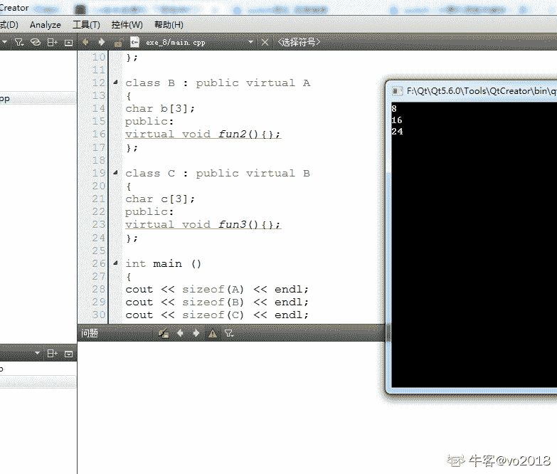

发表于 2019-08-27 09:56:18

* * *

[哪都通快递临时工 9527 号](https://www.nowcoder.com/profile/43981511)

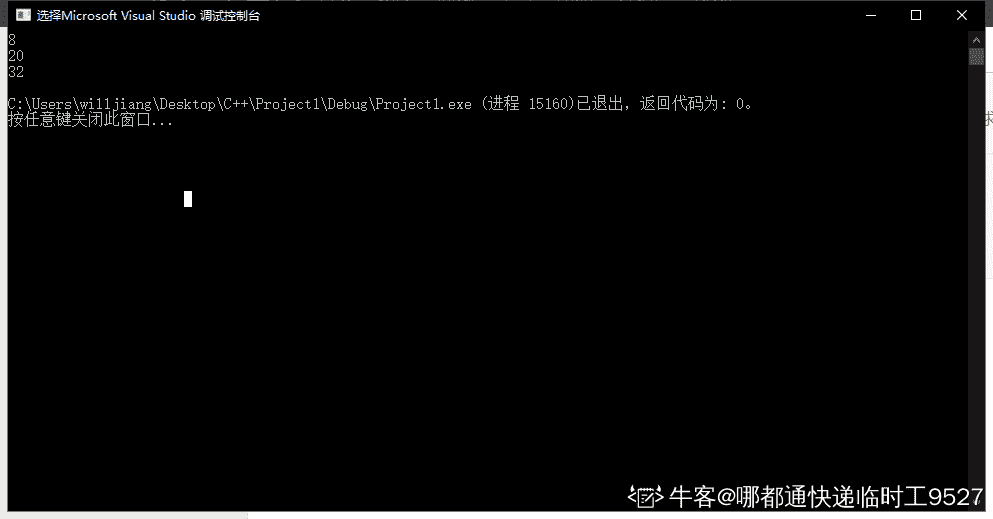

发表于 2019-09-04 21:37:51

* * *

## 80

下面代码打印结果为（）
class Base {
char data[3];
public:
virtual void f() { cout << "Base::f" << endl; }
virtual void g() { cout << "Base::g" << endl; }
virtual void h() { cout << "Base::h" << endl; }

};
int main()
{
cout << sizeof(Base)<< endl;
return 0;
}

正确答案: C   你的答案: 空 (错误)

```cpp
6
```

```cpp
7
```

```cpp
8
```

```cpp
9
```

本题知识点

Java 工程师 360 公司 C++ Java 工程师 360 公司 2018

讨论

[喜东东 201907291216963](https://www.nowcoder.com/profile/554929655)

若类中包含虚函数,则无论有几个虚函数,sizeof 类都等于 sizeof(数据成员)的和+sizeof(虚函数指针,为 4)。data[3]为长度为 3 的字符数组，对齐后为 4；虚函数指针(无论几个)，为 4;sizeof(class)=4+4=8

发表于 2019-09-06 08:36:46

* * *

[冲冲一百婚](https://www.nowcoder.com/profile/567176712)

虚函数无论多少个都为 4，char 数组内存自动补齐为 4

发表于 2019-09-11 08:45:08

* * *

## 81

在 C 语言源程序的开始处通常加上预处理命令 #include   <stdio.h>的原因是

正确答案: A   你的答案: 空 (错误)

```cpp
stdio.h 文件中包含标准输入输出函数的函数声明，通过引用此文件以便能正确使用 printf、scanf 等函数
```

```cpp
将 stdio.h 中标准输入输出函数的二进制代码插入到引用处，以便进行编译链接
```

```cpp
将 stdio.h 中标准输入输出函数的源程序插入到引用处，以便进行编译链接
```

```cpp
将 stdio.h 中标准输入输出函数链接到编译生成的可执行文件中，以便能正确运行
```

本题知识点

Java 工程师 360 公司 C++ Java 工程师 360 公司 2018

讨论

[AmazingPro](https://www.nowcoder.com/profile/436835463)

选 A，这个根本就没办法解释啊，就是一个很显而易见的东西，强行解释的话就是 三短一长选最长

发表于 2019-11-23 13:08:01

* * *

[i-小果子](https://www.nowcoder.com/profile/304741246)

C 语言引用.h 文件，目的就是使用它里面的库函数

发表于 2019-10-26 14:29:35

* * *

## 82

有转义字符如下：
'\0X41'、'\0x41'、'\X41'、'\x41'、'\a'、'\b'、'\c'、'\r'
其中错误的转义字符个数是

正确答案: C   你的答案: 空 (错误)

```cpp
0 个
```

```cpp
2 个
```

```cpp
4 个
```

```cpp
6 个
```

本题知识点

Java 工程师 360 公司 C++ Java 工程师 360 公司 2018

讨论

[不讲理的演说家](https://www.nowcoder.com/profile/105794562)

由下表可知转义字符十六进制固定形式为 \xhh，所以题干中的'\0X41'、'\X41'、'\X41'错误；转义字符中没有'\c'，所以一共有四个错误转义字符。所有的转义字符和所对应的意义：

| 转义字符 | 意义 | ASCII 码值（十进制） |
| \a | 响铃(BEL) | 007 |
| \b | 退格(BS) ，将当前位置移到前一列 | 008 |
| \f | 换页(FF)，将当前位置移到下页开头 | 012 |
| \n | 换行(LF) ，将当前位置移到下一行开头 | 010 |
| \r | 回车(CR) ，将当前位置移到本行开头 | 013 |
| \t | 水平制表(HT) （跳到下一个 TAB 位置） | 009 |
| \v | 垂直制表(VT) | 011 |
| \\ | 代表一个反斜线字符''\' | 092 |
| \' | 代表一个单引号（撇号）字符 | 039 |
| \" | 代表一个双引号字符 | 034 |
| \? | 代表一个问号 | 063 |
| \0 | 空字符(NUL) | 000 |
| \ddd | 1 到 3 位八进制数所代表的任意字符 | 三位八进制 |
| \xhh | 十六进制所代表的任意字符 | 十六进制 |

 编辑于 2019-09-04 22:15:13

* * *

## 83

关于 C 语言，下列指针变量的定义和解释，均正确的是

正确答案: A   你的答案: 空 (错误)

```cpp
int  *p[10];    //定义 10 个指针变量组成的指针数组
```

```cpp
int  *p();    //定义一个函数的指针，将来可用此指针指向一个函数
```

```cpp
int  (*p)[];  //定义一个行指针
```

```cpp
int **p;  //定义一个指针变量，该指针变量可以指一个向二维数组
```

本题知识点

Java 工程师 360 公司 C++ Java 工程师 360 公司 2018

讨论

[生命不息手撕不止](https://www.nowcoder.com/profile/48371706)

```cpp
A:  int  *p[10];//理解为（int*）p[10],即指针数组，数组中的 10 个元素都是指针。 
```

```cpp
B:  int  *p();//理解为（int*）p(),即 p 是一个函数名称，这个函数的返回值为指针。
```

```cpp
C:  int  (*p)[];  //定义了一个指针，这个指针“可以”指向一个数组。
```

```cpp
int **p;//二级指针，是不能直接指向二维数组的，但是可以定义一个一位指针指向数组，再定义二维指针指向该指针。
```

发表于 2019-09-20 12:27:00

* * *

[A-Smalltiger](https://www.nowcoder.com/profile/1387669)

C 项是一个行指针，但是 C 项的定义是错误的，必须指名长度

发表于 2019-10-10 20:55:58

* * *

[孙小飞~](https://www.nowcoder.com/profile/388655701)

B： int  *p(); //定义了一个返回值为指向整形变量的指针函数。

发表于 2019-09-17 09:11:21

* * *

## 84

#include "file.h"和#include <file.h>的区别是（      ）

正确答案: A   你的答案: 空 (错误)

```cpp
#include &quot;file.h&quot;是指编译器将从当前工作目录上开始查找此文件
```

```cpp
#include &lt;file.h&gt;是指编译器将从当前工作目录上开始查找此文件
```

```cpp
#include &quot;file.h&quot;指编译器将从标准库目录中开始查找此文件
```

```cpp
#include &lt;file.h&gt;指编译器将从标准库目录中开始查找此文件
```

本题知识点

Java 工程师 360 公司 C++ Java 工程师 360 公司 2018

讨论

[在水一方有人占用？！](https://www.nowcoder.com/profile/829529129)

D 项感觉也对的

发表于 2019-09-04 08:20:54

* * *

[村长王兰花](https://www.nowcoder.com/profile/64154962)

当用#include“file.h”时，先搜索当前工作目录，如果没有，再去搜索库，库没有再搜索资源库；
当用#include<file.h>时，编译器先从标准库路径开始搜索，如果没再搜索资源库目录，最好搜索当前工作目录。

发表于 2019-10-31 19:34:01

* * *

## 85

下列程序的功能是输出 a 数组中小写字母的个数，请为横线处选择合适的程序（      ）
#include <stdio.h>
main()
{ char a[]="123abc";
int i,num=0;
for(i=0;_________;i++)
if(a[i]>='a'&&a[i]<='z') num++;
printf("%d\n",num);
}

正确答案: A   你的答案: 空 (错误)

```cpp
a[i]!='\0'
```

```cpp
a[i]==0
```

```cpp
a[i]=='\0'
```

```cpp
a[i]!=0
```

本题知识点

Java 工程师 360 公司 C++ Java 工程师 360 公司 2018

讨论

[201906261056657](https://www.nowcoder.com/profile/179332006)

char[]是以“/0”为结束标志的

发表于 2019-10-31 00:05:20

* * *

[夜★](https://www.nowcoder.com/profile/626357968)

360 出来解释一下 D 选项

发表于 2019-08-24 21:11:54

* * *

## 86

若有定义语句：
int  a [2][3],(*p)[3],*q[3];，则以下赋值语句正确的是（      ）

正确答案: A   你的答案: 空 (错误)

```cpp
p=a;
```

```cpp
q=a;
```

```cpp
p=&amp;s[1];
```

```cpp
q=&amp;s[1];
```

本题知识点

Java 工程师 360 公司 C++ Java 工程师 360 公司 2018

讨论

[Artorias_Sif](https://www.nowcoder.com/profile/3334066)

p 是纬度为 3 的数组的指针，a 也为一个指向 3 维数组的指针。所以可以赋值

编辑于 2019-10-20 07:24:19

* * *

[考上湖大](https://www.nowcoder.com/profile/666182213)

设 a[2][3]={1,2,3,4,5,6} a[0]={1,2,3}

a 相当于 a [0]的地址，是一个指向含 3 个元素数组的指针，和 p 类型一样

发表于 2019-10-27 20:33:59

* * *

[JianfengSu](https://www.nowcoder.com/profile/907084938)

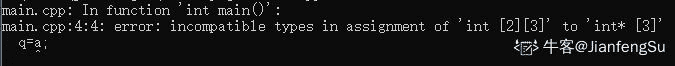

发表于 2019-10-03 11:29:44

* * *

## 87

请将 B 类的构造函数补充完整，要求用 x 初始化 a.请为横线处选择合适的程序（      ）
class A
{ int a;
public:
A(int x=0) { a=x; } };
class B: public A {
int b;
public:
B(int x): ______________
{ b=x+1; } };

正确答案: B   你的答案: 空 (错误)

```cpp
a(x)
```

```cpp
A(x)
```

```cpp
B(x)
```

```cpp
a=x
```

本题知识点

Java 工程师 360 公司 C++ Java 工程师 360 公司 2018

讨论

[木子 01](https://www.nowcoder.com/profile/2145682)

a 是类 A 的私有成员，类 B 公有继承类 A，a 对于类 B 不可见。

发表于 2019-10-06 14:05:56

* * *

## 88

下列关于 C++ 构造函数的说法，错误的是（）

正确答案: A   你的答案: 空 (错误)

```cpp
构造函数不可以是私有的（private）
```

```cpp
一个类中可以有多个构造函数
```

```cpp
无论何时，只要类的对象被创建，就会执行构造函数
```

```cpp
构造函数没有返回类型
```

本题知识点

Java 工程师 360 公司 C++ 2018

讨论

[liuzhen007](https://www.nowcoder.com/profile/873052646)

答案是 A，当我们想利用单例模式的时候，就可以把类的构造函数声明成 private 的，这样就能保证外界不能实例多个对象出来了。

发表于 2019-12-07 20:52:31

* * *

[Lokey_Gao](https://www.nowcoder.com/profile/558784814)

<类名>(<参数表>)构造函数与类同名，且没有返回值类型，可以是私有的。既可以在类外定义，也可以作为内联函数在类内定义。构造函数允许函数重载，提供初始化类对象的不同方法。

发表于 2019-08-31 00:05:28

* * *

[牛客 317783746 号](https://www.nowcoder.com/profile/317783746)

构造函数可重载

发表于 2021-04-01 19:51:07

* * *

## 89

下列关于类中的静态成员的说法错误的是（）

正确答案: D   你的答案: 空 (错误)

```cpp
虽然静态成员不属于类的某个对象，但是我们仍然可以使用类的对象、引用或者指针来访问静态成员
```

```cpp
成员函数不用通过作用域运算符就能直接使用静态成员
```

```cpp
静态数据成员不是由类的构造函数初始化的
```

```cpp
静态成员不可以作为默认实参
```

本题知识点

Java 工程师 360 公司 C++ Java 工程师 360 公司 2018

讨论

[犇流](https://www.nowcoder.com/profile/139469194)

静态成员与普通成员无异，除了其周期跟初始(系统给初值)                                -----Ac++基本姿势，类内使用不用域名符                                                                    -----B 静态成员变量类外定义，系统有给初值                                                                -----C 非静态成员不可作为默认实参，静态成员在函数解析前就存在，但非静态则相反-----D

发表于 2019-10-06 12:20:11

* * *

[香辣锅巴](https://www.nowcoder.com/profile/661288961)

非静态成员不可作为默认实参

发表于 2019-10-03 22:04:04

* * *

## 90

#include  <bits>using namespace std;
int main() {
int n;
scanf("%d", &n);
map <int, int> xs;
map <int, int> ys;
map < pair <int, int>, int > zs;
long long ans = 0;
for (int i = 0; i < n; i++) {
int x, y;
scanf("%d %d", &x, &y);
ans += (xs[x]++);
ans += (ys[y]++);
ans -= (zs[make_pair(x, y)]++);
}
cout << ans << endl;
return 0;
}
输入：
6
0 0
0 1
0 2
-1 1
0 1
1 1
则上述程序输出为( )

正确答案: C   你的答案: 空 (错误)

```cpp
9
```

```cpp
10
```

```cpp
11
```

```cpp
12
```

本题知识点

Java 工程师 360 公司 C++ Java 工程师 360 公司 2018

讨论

[n127](https://www.nowcoder.com/profile/267677609)

map 记录的是不重复的 key，因此函数运行计算过程是这样的：因此对于 xs，0 出现 4 次，所以 xs[0]变化的记录为： 0 + 1 + 2 + 3 = 6，xs[-1] 和 xs[1] 都只出现一次所以为 0；同样对于 ys，1 出现 4 次，所以 ys[1]变化的记录为：0 + 1 + 2 + 3 = 6，ys[0] 和 ys[2] 都只出现一次所以为 0；另外对于 zs，(0 1)出现 2 次，所以 zs[(0 1)]变化的记录为：0 + 1 = 1，zs 的其他 key 都只出现一次是所以为 0；所以最终 ans = 6 + 6 - 1 = 11。

编辑于 2019-09-16 19:30:38

* * *

[水木辛](https://www.nowcoder.com/profile/5908577)

出现 0：+0+1+2+3=6   出现 1：+0+1+2+3=6   出现 0 1   -0-1=-1    所以 ans  = 12 - 1 = 11

发表于 2019-09-16 10:37:09

* * *

## 91

#include  <bits>using namespace std;
int main(){
int n = 1001;
int ans = 0;
for(int i = 1; i <= n; ++i){
ans ^= i % 3;
}
cout << ans << endl;
}
则上述程序输出为( )

正确答案: B   你的答案: 空 (错误)

```cpp
-2
```

```cpp
0
```

```cpp
1
```

```cpp
2
```

本题知识点

Java 工程师 360 公司 C++ Java 工程师 360 公司 2018

讨论

[侯欣](https://www.nowcoder.com/profile/264549950)

ans ^= i%3； i=1 ans1； i=2 ans3; i=3 ans3; i=4 ans2; i=5 ans0; i=6 ans0; i=7 ans1;……133200 循环

编辑于 2019-09-07 21:43:49

* * *

[稳住，我们能瘦！](https://www.nowcoder.com/profile/306659360)

找规律的问题 6 次一循环 分别是 0 1 3 3 2 0

发表于 2019-08-20 20:39:44

* * *

## 92

以下代码段执行后的输出结果为

```cpp
public class Test {
    public static void main(String args[]) {
        int x = -5;
        int y = -12;
        System.out.println(y % x);
    }
}
```

正确答案: D   你的答案: 空 (错误)

```cpp
-1
```

```cpp
2
```

```cpp
1
```

```cpp
-2
```

本题知识点

Java 工程师 360 公司 2018

讨论

[我亦思念](https://www.nowcoder.com/profile/311024878)

C++整数取余，符号只与前面的数字有关。|小| % |大| = |小| 符号同前面数字    |大| % |小| = |余| 符号同前面数字 3%4 = 3 ； -3%4 = -3 ； -3%-4 = -3 ； 3%-4 = 3；

5%3 = 2 ； 5%-3 = 2  ；-5%-3 = -2 ； -5%3 = -2；

发表于 2019-09-04 19:44:05

* * *

[THE_LIN](https://www.nowcoder.com/profile/680957182)

整数取余，看前面那个数字的符号就行，栗子：-3%2，值为-1

发表于 2020-05-16 12:25:18

* * *

[Kuhouinn](https://www.nowcoder.com/profile/912084126)

整个 Java 题我也是醉了

发表于 2020-05-13 15:32:05

* * *

## 93

下列程序 test 类中的变量 c 的最后结果为

```cpp
public class Test {
    public static void main(String args[]) {
        int a = 10;
        int b;
        int c;
        if (a > 50) {
             b = 9;
        }
        c = b + a;
    }
}
```

正确答案: D   你的答案: 空 (错误)

```cpp
10
```

```cpp
0
```

```cpp
19
```

```cpp
编译出错
```

本题知识点

Java 工程师 360 公司 Java 2018

讨论

[3kna1j](https://www.nowcoder.com/profile/541130640)

方法内定义的变量没有初始值，必须要进行初始化。 类中定义的变量可以不需要赋予初始值，默认初始值为 0。

发表于 2019-08-21 07:41:16

* * *

[秋天傍晚](https://www.nowcoder.com/profile/554237281)

方法中定义的变量一定要初始化，类中定义的变量可不用初始化，会有默认值

发表于 2019-09-06 23:53:19

* * *

[哦吼吼 1506601](https://www.nowcoder.com/profile/6707905)

string，和 int 一样初始化的时候可以不赋值但是使用的时候一定要赋值

发表于 2019-10-04 16:01:30

* * *

## 94

以下代码的循环次数是

```cpp
public class Test {
    public static void main(String args[]) {
        int i = 7;
        do {
            System.out.println(--i);
            --i;
        } while (i != 0);
            System.out.println(i);
    }
}
```

正确答案: D   你的答案: 空 (错误)

```cpp
0
```

```cpp
1
```

```cpp
7
```

```cpp
无限次
```

本题知识点

Java 工程师 360 公司 Java 2018

讨论

[轰鸣](https://www.nowcoder.com/profile/2610941)

做错了的傻子这里集合😢

发表于 2021-03-30 07:59:20

* * *

[惠鸿飞](https://www.nowcoder.com/profile/881469708)

每次循环都是减二，i 一直不为 0，所以循环为无限执行

发表于 2019-09-09 21:13:47

* * *

[Bri0117](https://www.nowcoder.com/profile/291010799)

每次循环都是**减去 2**，**7-2n 恒不等于 0**，所以循环一直持续下去

发表于 2019-09-02 20:32:30

* * *

## 95

以下代码的输出的正确结果是

```cpp
public class Test {
    public static void main(String args[]) {
        String s = "祝你考出好成绩！";
        System.out.println(s.length());
    }
}
```

正确答案: D   你的答案: 空 (错误)

```cpp
24
```

```cpp
16
```

```cpp
15
```

```cpp
8
```

本题知识点

Java 工程师 360 公司 Java 2018

讨论

[兔龟](https://www.nowcoder.com/profile/721890084)

java 的 String 底层是 char 数组，它的 length()返回数组大小，而 unicode 中一个汉字是可以用一个 char 表示的

发表于 2019-08-26 15:44:57

* * *

[MC 闰土](https://www.nowcoder.com/profile/804072657)

一个汉字等于一个字符　　 字符 是 char 
一个汉字也等于二个字节，字节 是 byte 发表于 2019-08-26 09:57:45

* * *

[9102hhu](https://www.nowcoder.com/profile/728886408)

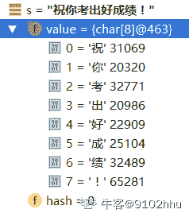

发表于 2020-07-22 14:24:15

* * *

## 96

代码行 float t=5.1; int i=t; ,不正确的是

正确答案: B   你的答案: 空 (错误)

```cpp
代码不能编译
```

```cpp
代码编译, i 被设置为 5
```

```cpp
第二行若改为 int i=(byte)t ，并结合 D 选项，则可编译
```

```cpp
第一行若改为 float t=5.1f 并结合 C 选项，则可编译
```

本题知识点

Java 工程师 360 公司 Java Java 工程师 360 公司 2018

讨论

[Thefearofknowledge](https://www.nowcoder.com/profile/81247548)

A：正确，代码不能编译。B：错误。不能编译。C：错误。不能编译。D：错误。不能编译。
正确写法：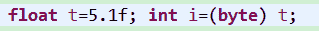
声明 float 型变量时，末尾要加 f（F），然后将 t 强转为 byte 类型，再赋值给 i。此处遵循了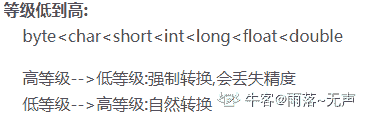

发表于 2019-09-18 17:21:09

* * *

[gybcloud](https://www.nowcoder.com/profile/664012)

这题应该选对的吧！BCD 说法都不对！

发表于 2019-08-22 11:38:39

* * *

[生不逢时爱不逢人](https://www.nowcoder.com/profile/553046612)

题目对不对我也不敢说，单选，排除....得出“正确”答案

发表于 2019-09-10 17:08:08

* * *

## 97

关于 protected 修饰的成员变量，以下说法正确的是

正确答案: A   你的答案: 空 (错误)

```cpp
可以被该类自身、与它在同一个包中的其它类、在其它包中的该类的子类所访问
```

```cpp
只能被该类本身和该类的所有的子类访问
```

```cpp
只能被该类自身所访问
```

```cpp
只能被同一个包中的类访问
```

本题知识点

Java 工程师 360 公司 Java 2018

讨论

[AtInfinity](https://www.nowcoder.com/profile/548270256)

java 中有四大修饰符，分别为 private,default,protected,public,下面主要是四者之间的区别：
- private(私有的)
private 可以修饰成员变量，成员方法，构造方法，不能修饰类(此刻指的是外部类，内部类不加以考虑)。被 private 修饰的成员只能在其修饰的本类中访问，在其他类中不能调用，但是被 private 修饰的成员可以通过 set 和 get 方法向外界提供访问方式
- default(默认的)
defalut 即不写任何关键字，它可以修饰类，成员变量，成员方法，构造方法。被默认权限修饰后，其只能被本类以及同包下的其他类访问。
- protected(受保护的)
protected 可以修饰成员变量，成员方法，构造方法，但不能修饰类(此处指的是外部类，内部类不加以考虑)。被 protected 修饰后，只能被同包下的其他类访问。如果不同包下的类要访问被 protected 修饰的成员，这个类必须是其子类。
- public(公共的)
public 是权限最大的修饰符，他可以修饰类，成员变量，成员方法，构造方法。被 public 修饰后，可以再任何一个类中，不管同不同包，任意使用。
public protected default private
同一个类 √ √ √ √
同一个包 √ √ √
子类 √ √
不同包 √

编辑于 2019-10-11 07:03:24

* * *

[JayYeChou](https://www.nowcoder.com/profile/325154373)

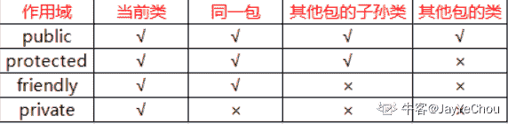

发表于 2019-12-25 13:40:02

* * *

[shopee 新加坡内推](https://www.nowcoder.com/profile/333170563)

| - | private | default | protected | public |
| :-: | :-: | :-: | :-: | :-: |
| 本类能不能访问访问 | √ | √ | √ | √ |
| 同一个包(Package)下的其他类能不能访问 | × | √ | √ | √ |
| 不同包(Package),但是作为子类 | × | × | √ | √ |
| 不同包，不是子类 | × | × | × | √ |

发表于 2020-03-15 13:53:41

* * *

## 98

下面关于继承的描述正确的是

正确答案: A   你的答案: 空 (错误)

```cpp
在 Java 中类只允许单一继承
```

```cpp
在 Java 中一个类只能实现一个接口
```

```cpp
在 Java 中一个类不能同时继承一个类和实现一个接口
```

```cpp
Java 的单一继承使代码不可靠
```

本题知识点

Java 工程师 360 公司 Java 2018

讨论

[IDEA2022.4.2](https://www.nowcoder.com/profile/181223548)

全错 类只支持单继承，接口支持多继承

发表于 2019-08-22 10:35:05

* * *

[小董同学要努力](https://www.nowcoder.com/profile/544472051)

***全错***A. 类支持单根继承，接口支持多继承 B.类可以实现多接口 C.一个类能同时继承一个类和实现一个接口 D.单一继承使得代码更可靠

编辑于 2020-03-25 10:42:33

* * *

[牛客 736261213 号](https://www.nowcoder.com/profile/736261213)

说全错的都是不经过思考的吧，接口不是类，Java 中单一继承说的是类，接口可以多继承

发表于 2021-08-13 08:23:23

* * *

## 99

下面关于静态方法说明正确的是

正确答案: B   你的答案: 空 (错误)

```cpp
在静态方法中可用 this 来调用本类的类方法
```

```cpp
在静态方法中调用本类的静态方法时可直接调用
```

```cpp
在静态方法中只能调用本类中的静态方法
```

```cpp
在静态方法中绝对不能调用实例方法
```

本题知识点

Java 工程师 360 公司 Java 2018

讨论

[IDEA2022.4.2](https://www.nowcoder.com/profile/181223548)

A.静态成员随类的加载而加载，这个时候对象都还没有，this 代表当前对象，所以 this 不能用于 static 方法中.C 还可以调用静态变量 D.可以通过对象.进行调用

发表于 2019-08-21 11:55:02

* * *

[$枫](https://www.nowcoder.com/profile/443026278)

A：不能使用 this 调用本类的类方法（即静态方法）；具体原理不清楚（望指点），个人理解为 this 指向的是实例对象，此时未实例化，故不能使用 B: 正确 C:在静态方法中，不只可以调用本类的静态方法，也可以使用【类名.静态方法名】调用其他类的静态方法 D:可以调用实例方法，使用【new 类名().实例方法名】调用

发表于 2019-09-03 10:42:31

* * *

[你快乐吗](https://www.nowcoder.com/profile/5271388)

main 方法也是静态方法，把它想像成 main 方法就容易做了

发表于 2020-10-09 09:01:17

* * *

## 100

以下关于 Integer 与 int 的区别错误的是

正确答案: D   你的答案: 空 (错误)

```cpp
int 是 java 提供的 8 种原始数据类型之一
```

```cpp
Integer 是 java 为 int 提供的封装类
```

```cpp
int 的默认值为 0
```

```cpp
Integer 的默认值为 1
```

本题知识点

Java 工程师 360 公司 Java Java 工程师 360 公司 2018

讨论

[IDEA2022.4.2](https://www.nowcoder.com/profile/181223548)

包装类默认为 null

发表于 2019-08-21 13:07:32

* * *

[你的 offer 对我打了烊](https://www.nowcoder.com/profile/598309941)

包装类默认都是 null，下次题目换成了 Double 和 double 也是一样

发表于 2020-03-08 11:59:21

* * *

[TGL201807081534503](https://www.nowcoder.com/profile/560365381)

int 哪来的默认值..

发表于 2019-10-28 12:41:11

* * *

## 101

String s = new String("xyz");创建了几个 StringObject？

正确答案: A   你的答案: 空 (错误)

```cpp
两个或一个都有可能
```

```cpp
两个
```

```cpp
一个
```

```cpp
三个
```

本题知识点

Java 工程师 360 公司 Java Java 工程师 360 公司 2018

讨论

[IDEA2022.4.2](https://www.nowcoder.com/profile/181223548)

如果 xyz 对象已经在常量池了，则创建一个在堆中，反之，一个创建在常量池中，一个创建在堆中

发表于 2019-08-21 22:03:06

* * *

[忧郁的小菜鸡](https://www.nowcoder.com/profile/9720245)

看了大家的评论，有一点不解，在常量池创建的字符串常量能被称为 StringObject 吗？对象不应该被存放在堆中吗?

发表于 2019-08-29 09:05:39

* * *

[天然萌。20180402154065](https://www.nowcoder.com/profile/8919191)

说的比较详细了[`blog.csdn.net/xldmx/article/details/82780175`](https://blog.csdn.net/xldmx/article/details/82780175)

发表于 2019-08-23 09:56:09

* * *

## 102

下面哪些不是 Thread 类的方法

正确答案: C   你的答案: 空 (错误)

```cpp
start()
```

```cpp
run()
```

```cpp
exit()
```

```cpp
getPriority()
```

本题知识点

Java 工程师 360 公司 Java Java 工程师 360 公司 2018

讨论

[热血不负青春](https://www.nowcoder.com/profile/431848806)

首先贴一个 Thread 的常用方法
String getName()　　返回该线程的名称。
void setName(String name)　　改变线程名称，使之与参数 name 相同。
int getPriority() 　　返回线程的优先级。
void setPriority(int newPriority) 　　更改线程的优先级。
boolean isDaemon() 　　测试该线程是否为守护线程。
void setDaemon(boolean on)　　将该线程标记为守护线程或用户线程。
static void sleep(long millis)
void interrupt()　　中断线程。
static void yield()　　暂停当前正在执行的线程对象，并执行其他线程。
void join()　　等待该线程终止。
void run()
void start() 
从 Object 类继承来的方法　　void notify()         void wait()5 种运行状态
新建（New）：创建后尚未启动的线程处于这种状态。
运行（Runable）：得到 cpu 分配的执行时间
无限期等待（Waiting）：处于这种状态的线程不会被分配 CPU 执行时间，它们要等待被其他线程显式地唤醒
Object.wait()
Thread.join()
LockSupport.park()
限期等待（Timed Waiting）：处于这种状态的线程也不会被分配 CPU 执行时间，不过无须等待被其他线程显式地唤醒
Thread.sleep()
    Object.wait(),设置 timeout 时间
    Thread.join(),设置 timeout 时间
    LockSupport.parkNanos()方法
    LockSupport.parkUntil()方法
阻塞（Blocked）：线程被阻塞了，“阻塞状态”与“等待状态”的区别是：“阻塞状态”在等待着获取到一个排它锁，
这个事件将在另外一个线程放弃这个锁的时候发生；而“等待状态”则是在等待一段时间，或者唤醒动作的发生,
在程序等待进入同步区域（synchronized）的时候，线程将进入这种状态。
结束（Terminated）：已终止的线程状态，线程已经结束执行。三种终止线程的方式
1\. 使用标志位终止线程 2.使用 stop()3.使用 interrupt() 中断线程

发表于 2019-09-21 17:12:05

* * *

[IDEA2022.4.2](https://www.nowcoder.com/profile/181223548)

查看 Thread 可知，没有 exit()方法，其实不用查也知道，重写 run 方法，start 开启线程，getPriority 获取线程优先级

发表于 2019-08-21 12:28:24

* * *

[一如既往 201804131446533](https://www.nowcoder.com/profile/8317010)

源码有 exit()方法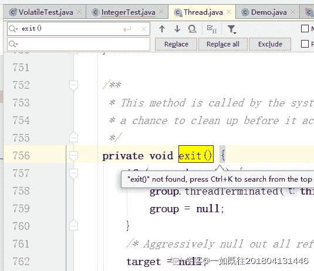

发表于 2019-10-08 16:13:51

* * *

## 103

```cpp
public static void main(String[] args) {
        Thread t = new Thread() {

            public void run() {
                my360DW();
            }
        };

        t.run();
        System.out.print("DW");

    }

    static void my360DW() {

        System.out.print("360");

    }
```

正确答案: C   你的答案: 空 (错误)

```cpp
DW
```

```cpp
360
```

```cpp
360DW
```

```cpp
都不输出
```

本题知识点

Java 工程师 360 公司 Java Java 工程师 360 公司 2018

讨论

[泡泡 201908061058789](https://www.nowcoder.com/profile/458221310)

命名不说了，这答案…………………… 建议屏蔽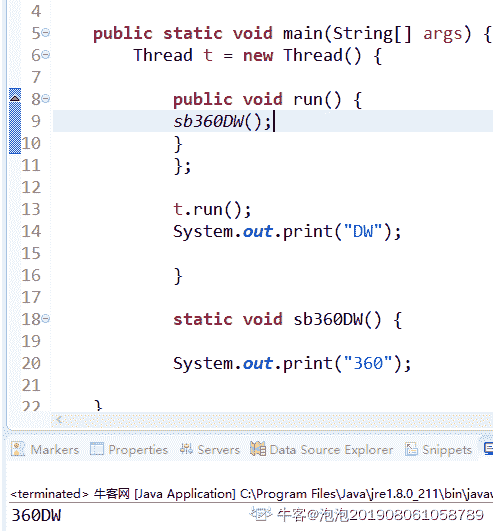

发表于 2019-08-23 20:08:30

* * *

[程序员鱼皮](https://www.nowcoder.com/profile/5077378)

启动线程调用的应该是 start 方法，这题是直接调用了 run 方法输出 360，以后再输出 dw，答案有误

发表于 2019-08-26 08:59:21

* * *

[bobbie.ho](https://www.nowcoder.com/profile/426351696)

这是什么答案啊！360 就这水平，即便是方法可以用数字开头也是可以向下跑得啊、答案怎么可能是 B 呢，实在是不知道能输出啥来就选 D 的有没有、求解？？？？？

编辑于 2019-08-21 14:28:06

* * *

## 104

ArrayList list = new ArrayList(20);中的 list 扩充几次

正确答案: A   你的答案: 空 (错误)

```cpp
0
```

```cpp
1
```

```cpp
2
```

```cpp
3
```

本题知识点

Java 工程师 360 公司 Java Java 工程师 360 公司 2018

讨论

[T_*](https://www.nowcoder.com/profile/266803413)

ArrayList list=new ArrayList(); 这种是默认创建大小为 10 的数组，每次扩容大小为 1.5 倍 ArrayList list=new ArrayList(20); 这种是指定数组大小的创建，创建时直接分配其大小，没有扩充。 所以，扩充为 0 次

发表于 2019-09-04 08:03:03

* * *

[渴望成长的咸鱼干](https://www.nowcoder.com/profile/673784914)

默认长度是 10，然后自己指定了 20，所以没有扩容？

发表于 2019-08-21 23:33:41

* * *

[OfferOverFlowError](https://www.nowcoder.com/profile/1686028)

```cpp
    /**
     * 传入初始容量初始化
     * Constructs an empty list with the specified initial capacity.
     *
     * @param  initialCapacity  the initial capacity of the list
     * @throws IllegalArgumentException if the specified initial capacity
     *         is negative
     */
    public ArrayList(int initialCapacity) {
        if (initialCapacity > 0) {
            // 初始化容量大于 0 的话，就重新 new 一个数组
            this.elementData = new Object[initialCapacity];
        } else if (initialCapacity == 0) {
            // 初始化容量等于 0 的话，初始化为空数组 EMPTY_ELEMENTDATA
            this.elementData = EMPTY_ELEMENTDATA;
        } else {
            // 初始化容量小于 0 的话就抛出异常
            throw new IllegalArgumentException("Illegal Capacity: "+
                                               initialCapacity);
        }
    }
```

发表于 2019-10-12 15:02:42

* * *

## 105

下面的方法，当输入为 2 的时候返回值是多少？

```cpp
public static int getValue(int i) {
    int result = 0;
    switch (i) {
        case 1:
            result = result + i;
        case 2:
            result = result + i * 2;
        case 3:
            result = result + i * 3;
        }
    return result;
}
```

正确答案: D   你的答案: 空 (错误)

```cpp
0
```

```cpp
2
```

```cpp
4
```

```cpp
10
```

本题知识点

Java 工程师 360 公司 Java 2018

讨论

[Msr.Busy](https://www.nowcoder.com/profile/41812893)

没有 break，发生 case 穿透现象，程序会继续向下执行，直到遇到 break 或者结束 switch 语句的大括号为止。

发表于 2019-09-23 18:02:36

* * *

[巧笑倩兮的陆辛禾](https://www.nowcoder.com/profile/155083733)

case 只是个入口，如果没有 break;会从入口处将后面所有的 case 全部执行一次。

发表于 2019-08-26 08:21:07

* * *

[会飞的字节](https://www.nowcoder.com/profile/5974940)

当 i=2 时，执行程序

Case2:result=4;

Case3:result=4+6=10;

没有 Break,就会顺序执行下去

发表于 2020-07-24 23:26:39

* * *

## 106

抽象类和接口的区别，一下说法错误的是

正确答案: D   你的答案: 空 (错误)

```cpp
接口是公开的，里面不能有私有的方法或变量，是用于让别人使用的，而抽象类是可以有私有方法或私有变量的。
```

```cpp
abstract class 在 Java 语言中表示的是一种继承关系，一个类只能使用一次继承关系。但是，一个类却可以实现多个 interface，实现多重继承。接口还有标识（里面没有任何方法，如 Remote 接口）和数据共享（里面的变量全是常量）的作用。
```

```cpp
在 abstract class 中可以有自己的数据成员，也可以有非 abstarct 的成员方法，而在 interface 中，只能够有静态的不能被修改的数据成员（也就是必须是 static final 的，不过在 interface 中一般不定义数据成员），所有的成员方法默认都是 public abstract 类型的。
```

```cpp
abstract class 和 interface 所反映出的设计理念不同。其实 abstract class 表示的是&quot;has-a&quot;关系，interface 表示的是&quot;is-a&quot;关系。
```

本题知识点

Java 工程师 360 公司 Java Java 工程师 360 公司 2018

讨论

[要喝手磨咖啡](https://www.nowcoder.com/profile/547420649)

抽象类表示的是 is-a 关系，强调的是从属关系；接口表示的是 like-a 关系，强调的是功能。

发表于 2019-08-25 09:37:25

* * *

[Fueen](https://www.nowcoder.com/profile/403549123)

因为看不懂 D，所以选了 D...结果蒙对了

发表于 2019-09-09 11:50:51

* * *

[IDEA2022.4.2](https://www.nowcoder.com/profile/181223548)

抽象类的设计理念是 is-a，接口的设计理念是 like-a

发表于 2019-08-21 12:00:06

* * *

## 107

下面关于垃圾收集的说法正确的是

正确答案: D   你的答案: 空 (错误)

```cpp
一旦一个对象成为垃圾，就立刻被收集掉。
```

```cpp
对象空间被收集掉之后，会执行该对象的 finalize 方法
```

```cpp
finalize 方法和 C++的析构函数是完全一回事情
```

```cpp
一个对象成为垃圾是因为不再有引用指着它，但是线程并非如此
```

本题知识点

Java 工程师 360 公司 Java 2018

讨论

[虾滑](https://www.nowcoder.com/profile/153516329)

以前我是堆，你是栈

你总是能精准的找到我，给我指明出路

后来有一天我明白了

我变成了栈，你却隐身堆海

我却找不到你了，空指针了

我不愿意如此，在下一轮 full gc 前

我找到了 object 家的 finalize

又找到了你，这次我不会放手

在世界重启前，一边躲着 full gc 一边老去

发表于 2019-12-20 22:29:54

* * *

[桃子湖红叶](https://www.nowcoder.com/profile/4508577)

**1、在 java 中，对象的内存在哪个时刻回收，取决于垃圾回收器何时运行。****2、**一旦垃圾回收器准备好释放对象占用的存储空间，将首先调用其 finalize()方法， 并且在**下一次**垃圾回收动作发生时，才会**真正的**回收对象占用的内存（《java 编程思想》）**3、****在 C++中，对象的内存在哪个时刻被回收，是可以确定的，**在 C++中，析构函数和资源的释放息息相关，能不能正确处理析构函数，关乎能否正确回收对象内存资源。********在 java 中，对象的内存在哪个时刻回收，取决于垃圾回收器何时运行，****在 java 中，所有的对象，包括对象中包含的其他对象，它们所占的内存的回收都依靠垃圾回收器，因此不需要一个函数如 C++析构函数那样来做必要的垃圾回收工作。当然存在本地方法时需要 finalize()方法来清理本地对象。在《java 编程思想》中提及，finalize()方法的一个作用是用来回收“本地方法”中的本地对象**4、“**但是线程并非如此”不理解，希望大佬补充

发表于 2019-11-10 10:41:35

* * *

[冷深](https://www.nowcoder.com/profile/552443018)

对象空间被收集前执行 finalize（）方法，而不是对象空间被收集之后再执行，如果这样的话执行 finalize（）就没有意义了。

编辑于 2019-08-20 23:17:54

* * *

## 108

以下哪个 I / O 类可以附加或更新文件

正确答案: A   你的答案: 空 (错误)

```cpp
RandomAccessFile()
```

```cpp
OutputStream()
```

```cpp
DataOutputStream()
```

```cpp
None of the above
```

本题知识点

Java 工程师 360 公司 Java Java 工程师 360 公司 2018

讨论

[suxintang](https://www.nowcoder.com/profile/83057664)

RandomAccessFile 直接继承于 Java. Lang. Object 类，实现了 DataInput 和 DataOutput 接口，它既可以作为一个输入流，又可以作为一个输出流

发表于 2019-08-22 13:18:58

* * *

[給太陽丶一個微笑](https://www.nowcoder.com/profile/783549196)

蒙对了

发表于 2019-08-22 08:31:45

* * *

[1229](https://www.nowcoder.com/profile/7533288)

额...看到名字有 file 果断就选了......

发表于 2019-10-31 15:13:59

* * *

## 109

给定以下方法声明，调用执行 mystery（1234）的输出结果？
//precondition:  x >=0
public void mystery (int x)
{
System.out.print(x % 10);

if ((x / 10) != 0)
{
mystery(x / 10);
}
System.out.print(x % 10);
}

正确答案: B   你的答案: 空 (错误)

```cpp
1441
```

```cpp
43211234
```

```cpp
3443
```

```cpp
12344321
```

本题知识点

Java 工程师 360 公司 Java Java 工程师 360 公司 2018

讨论

[风随 66688](https://www.nowcoder.com/profile/350502396)

首先 1234 对 10 取余是 4，第一个打印肯定有 4，所以排除其他选项选 B

编辑于 2019-08-28 15:20:51

* * *

[熬夜也得干过活](https://www.nowcoder.com/profile/101497089)

这题又是出栈入栈的先后问题 1.执行函数 mystery（1234），相当于这个函数入栈，打印出 4，因为 x 符合 if 语句条件，执行 if 语句，即 mystery（123），因为是 int 类型，所以自动转型。但是，务必要注意的是！！！划重点！！！if 语句后面还有一句打印没有执行！！ 2.这个时候一定是先执行 if 语句中的函数，所以执行 mystery（123），即 mystery（123）入栈，以此类推，一直执行到 mystery（1）的时候，再利用入栈的顺序，对每个函数最后一句打印出栈。

发表于 2019-09-30 14:00:42

* * *

[夏天不会热](https://www.nowcoder.com/profile/910727844)

一开始 1234 取余为 4，基本类型传入的是值的副本，所以第一个 mystery(x/10)括号中的数字为 123，取余为 3，继续迭代，所以结果为 43211234.

发表于 2019-09-02 21:55:30

* * *

## 110

假设一个 list 初始化为{2，9，5，4，8，1}。 在第一轮冒泡排序后，list 变成了（）?

正确答案: D   你的答案: 空 (错误)

```cpp
2, 9, 5, 4, 8, 1
```

```cpp
2, 9, 5, 4, 1, 8
```

```cpp
2, 5, 9, 4, 8, 1
```

```cpp
2, 5, 4, 8, 1, 9
```

本题知识点

排序 *讨论

[就是头发多](https://www.nowcoder.com/profile/125032961)

我觉得这道题选 A 啊，如果题目改为“第一轮冒泡排序”的话才选 D。第一次排序难道不是 2 和 9 进行比较吗？2 比 9 小，所以位置不变化。

发表于 2019-10-15 13:11:21

* * *

[IDEA2022.4.2](https://www.nowcoder.com/profile/181223548)

一轮排序之后，最大值在最后面，选 D

编辑于 2019-08-21 12:31:29

* * *

[时间的猎手](https://www.nowcoder.com/profile/485380074)

冒泡排序：将最大值放到末尾，一直缩小范围到第一位

发表于 2019-08-21 09:36:07

* * *

## 111

如果一个 list 初始化为{5，3，1}，执行以下代码后，其结果为（）？
nums.add(6);
nums.add(0,4);
nums.remove(1);

正确答案: B   你的答案: 空 (错误)

```cpp
[5, 3, 1, 6]
```

```cpp
[4, 3, 1, 6]
```

```cpp
[4, 3, 6]
```

```cpp
[5, 3, 6]
```

本题知识点

Java 工程师 360 公司 Java 2018

讨论

[酒哩](https://www.nowcoder.com/profile/641028504)

初始化为{5,3,1}nums.add(6)后 list 为{5,3,1,6}nums.add(0,4)是在 0 号索引上添加数字 4 得到 list 为{4,5,3,1,6}nums.remove(1)是将 1 号索引上的 5 进行 remove 得到 list 为{4,3,1,6}

编辑于 2019-08-21 09:08:47

* * *

[人余月半子](https://www.nowcoder.com/profile/514787832)

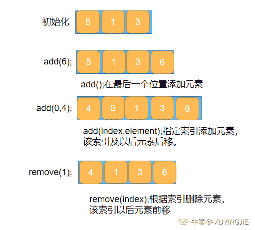

发表于 2020-03-07 12:22:42

* * *

[UES_ 周磊](https://www.nowcoder.com/profile/2116599)

```cpp
这里的参数默认为 index
list.remove(1); 
```

但是 list 中有 remove(Object)方法，若想使用该方法，需要这样操作

```cpp
Integer one = 1; list.remove(one);  
```

编辑于 2020-10-08 22:56:39

* * *

## 112

假设 num 已经被创建为一个 ArrayList 对象，并且最初包含以下整数值：[0，0，4，2，5，0，3，0]。 执行下面的方法 numQuest(),最终的输出结果是什么？

```cpp
private List<Integer> nums;

//precondition: nums.size() > 0
//nums contains Integer objects
public void numQuest() {
    int k = 0;
    Integer zero = new Integer(0);
    while (k < nums.size()) {
        if (nums.get(k).equals(zero))
            nums.remove(k);
        k++;
    }
}
```

正确答案: D   你的答案: 空 (错误)

```cpp
[3, 5, 2, 4, 0, 0, 0, 0]
```

```cpp
[0, 0, 0, 0, 4, 2, 5, 3]
```

```cpp
[0, 0, 4, 2, 5, 0, 3, 0]
```

```cpp
[0, 4, 2, 5, 3]
```

本题知识点

Java 工程师 360 公司 Java 2018

讨论

[哗~啦~啦](https://www.nowcoder.com/profile/817945927)

**做这种题还是要一步一步来，不然一不小心就掉坑里：****List 中的 get ( i )指的是获取下标（索引）为 i 的元素，也就是第 i+1 个元素**本题：**zero==0，如果 get(k)==0,执行 remove(k); ;**
           size==8 ; k==0 , 因此第一次 remove(0) ，删除索引为 0 的元素也就是第一个元素 0，然后 k++, size()--;此时集合元素为 ：**[****0，4，2，5，0，3，0]**           size==7; k==1，因此 get(1)==4 !=0 , 不执行 remove();  k++,因没有删除元素，size()不变，此时集合元素为：**[****0，4，2，5，0，3，0]**size==7;k==2，k++; size==7;k==3，k++; size==7;k==4，get(4)==0，remove(4) ;  k++,  size()--; 此时集合元素为： **[****0，4，2，5，3，0]** size==6;k==5，get(5)==0，remove(5)；k++, size()--; 此时集合元素为： **[****0，4，2，5，3]**             size==5; k==6 ;退出循环；最终输出此时集合元素为    **[****0，4，2，5，3]**； **一般更改删除集合元素，使用 iterator()迭代器，不推荐使用这种；**

发表于 2019-08-24 09:29:35

* * *

[孤独的椰岛 123](https://www.nowcoder.com/profile/915925648)

结果中数组的第一个元素 0 是 原数组中的第二个 0。这个程序就是在删除数组中的 0 ，但是会有个小问题，就是连续的 0 会只删除一个。
原因：当执行 remove 的时候，ArrayList 数组的 size 会变小一个，原本的位置上的 0 会被后面的 0 给替代；而在执行完 remove 后执行了 k++;所以跳过了第二个 0

发表于 2019-10-05 16:03:51

* * *

[沪漂少年](https://www.nowcoder.com/profile/162227311)

关键在于 每次 remove 之后 数组的长度会-1  但是获取数据的下标会+1

发表于 2020-01-10 14:30:36

* * *

## 113

假定 Base b = new Derived（）; 调用执行 b.methodOne（）后，输出结果是什么？
public class Base
{
public void methodOne()
{
System.out.print("A");
methodTwo();
}

public void methodTwo()
{
System.out.print("B");
}
}

public class Derived extends Base
{
public void methodOne()
{
super.methodOne();
System.out.print("C");
}

public void methodTwo()
{
super.methodTwo();
System.out.print("D");
}
}

正确答案: A   你的答案: 空 (错误)

```cpp
ABDC
```

```cpp
AB
```

```cpp
ABCD
```

```cpp
ABC
```

本题知识点

Java 工程师 360 公司 Java Java 工程师 360 公司 2018

讨论

[lilyGirl](https://www.nowcoder.com/profile/48376164)

程序开始执行，Base b = new Derived（）；new 了一个子类调用执行 b.methodOne（）后，第一步：因为子类重写了 methodOne()方法，故调用的方法是子类的 methodOne()方法第二步：进入 methodOne()方法后，执行 super.methodOne()；调用父类 methodOne()方法  输出：A 第三步：继续执行父类 methodOne()方法中的 methodTwo()方法第四步：因为子类重写了 methodOne()方法，故调用的方法是子类的 methodTwo()方法第五步：调用子类 methodTwo()方法，执行 super.methodTwo()；回到父类 methodTwo()方法中  输出 B 第六步：输出 B 后，执行子类 methodTwo()中的 System.out.print("D")；  输出 D 第七步：回到子类 methodOne()，继续往下执行，System.out.print("C");   输出 C 所以结果为：ABDC

发表于 2019-08-28 19:47:44

* * *

[lmy 永不言败](https://www.nowcoder.com/profile/9186281)

如果 new 的是子类的对象没有显式调用父类方法的话如果子类重写了父类的方法则执行子类的方法如果用 super 显式调用父类的方法则执行父类的方法

发表于 2019-08-21 13:41:40

* * *

[海小星](https://www.nowcoder.com/profile/278771666)

super.methodOne(); 调用父类的 methodOne，其中 methodOne 方法里又调用了 methodTwo(); 因为 Derived 有 重写了 methodTwo()且开始是由 super 调用的所以先调用父类的 methodTwo()最终调其子类的 methodTwo();  即打印出 BD。

发表于 2019-08-24 21:44:34

* * *

## 114

在选择排序中，以下什么情况下选择排序会更快执行？

正确答案: C   你的答案: 空 (错误)

```cpp
数据已按升序排列
```

```cpp
数据已按升降序排列
```

```cpp
俩者花费时间一样
```

本题知识点

Java 工程师 360 公司 排序 *Java 工程师 360 公司 2018* *讨论

[柠檬鸡腿](https://www.nowcoder.com/profile/677515298)

无论怎么排，都得比较完所有后面的数

发表于 2019-10-07 19:21:29

* * *

## 115

初始化数组  int [] arr = {2，10，23，31，55，86}，使用二分查询算法查找 55，需要循环执行多少次才能命中目标？

正确答案: B   你的答案: 空 (错误)

```cpp
1
```

```cpp
2
```

```cpp
3
```

```cpp
4
```

本题知识点

查找 *讨论

[兰芷之室](https://www.nowcoder.com/profile/307475634)

 | 数列 | 2【0】 | 10【1】 | 23【2】 | 31【3】 | 55【4】 | 86【5】 |
| 指针 | low  |   |   |   |   | high  |
| 第一趟 |   |   | mid  |   |   |   |
| 指针  |   |   |   | low  |   | high  |
| 第二趟 |   |   |   |   | mid |   |

下表(0+5）/2=2.5 向下取整=2

发表于 2019-09-18 10:29:38

* * *

[烟月](https://www.nowcoder.com/profile/665195)

在数组中元素为奇数个时，mid 计算值按向下取整或向上取整可根据具体情况进行设计，本题中默认采用向下取整

发表于 2020-05-08 15:19:28

* * *

[弱弱弱弱鸡](https://www.nowcoder.com/profile/160776752)

数组为：2，10，23，31，55，86。索引为 0—5。

第一次（0+5）/2=2（遵从 C 语言的除法，向下取整）对应的值是 23，小于 55，所以下一次的搜索空间是 3—5

第二次（3+5）/2=4，对应的值是 55，找到了，所以总共找了 2 次

发表于 2020-09-18 10:53:25

* * *

## 116

以下哪些方法是 Object 类中的方法

正确答案: A B C D   你的答案: 空 (错误)

```cpp
clone()
```

```cpp
toString()
```

```cpp
wait()
```

```cpp
finalize()
```

本题知识点

Java 工程师 360 公司 Java 2018

讨论

[TiAmo_9955](https://www.nowcoder.com/profile/317867636)

全选，Object 类中方法及说明如下：
registerNatives()   //私有方法 getClass()    //返回此 Object 的运行类。
hashCode()    //用于获取对象的哈希值。
equals(Object obj)     //用于确认两个对象是否“相同”。
clone()    //创建并返回此对象的一个副本。
toString()   //返回该对象的字符串表示。   
notify()    //唤醒在此对象监视器上等待的单个线程。   
notifyAll()     //唤醒在此对象监视器上等待的所有线程。   
wait(long timeout)    //在其他线程调用此对象的 notify() 方法或 notifyAll() 方法，或        者超过指定的时间量前，导致当前线程等待。   
wait(long timeout, int nanos)    //在其他线程调用此对象的 notify() 方法或 notifyAll() 方法，或者其他某个线程中断当前线程，或者已超过某个实际时间量前，导致当前线程等待。
wait()    //用于让当前线程失去操作权限，当前线程进入等待序列
finalize()    //当垃圾回收器确定不存在对该对象的更多引用时，由对象的垃圾回收器调用此方法。

发表于 2019-04-25 19:48:52

* * *

[不靡](https://www.nowcoder.com/profile/476166647)

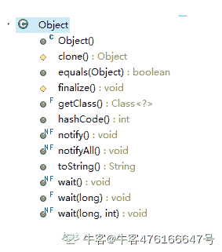？？？？？？？？？

发表于 2019-08-26 22:43:20

* * *

[无心 z](https://www.nowcoder.com/profile/9463107)

考察的就是`Object`类中的所有方法，以前也觉得这种题没什么意思，但是当我面试被面试官问到“你了解 Object 类中有哪些方法？”的时候，我就知道我应该了解一下。。。

发表于 2020-04-05 15:11:52

* * *

## 117

假如某个 JAVA 进程的 JVM 参数配置如下：
-Xms1G -Xmx2G -Xmn500M -XX:MaxPermSize=64M -XX:+UseConcMarkSweepGC -XX:SurvivorRatio=3,
请问 eden 区最终分配的大小是多少？

正确答案: C   你的答案: 空 (错误)

```cpp
64M
```

```cpp
500M
```

```cpp
300M
```

```cpp
100M
```

本题知识点

360 公司 Java Java 工程师 Java 工程师 360 公司 2018

讨论

[写代码的红黑🌲](https://www.nowcoder.com/profile/8617883)

-Xmn500M  年轻代大小为 500M.XX:SurvivorRatio=3 指 Survivor：eden=2:3(记住 Survivor 的占比恒为 2 即可)，因此计算可以得出 eden 区为 300M

编辑于 2019-01-13 11:24:47

* * *

[CLIVEH](https://www.nowcoder.com/profile/631445678)

添加一下个人笔记： - Xms、-Xmx 分配用来设置进程堆内存的最小大小和最大大小 -Xss 设置每个线程可使用的内存大小 -Xss 设置每个线程可使用的内存大小

发表于 2019-09-13 19:29:19

* * *

[ThinkingOverflow](https://www.nowcoder.com/profile/165701207)

参考文章：https://blog.csdn.net/zhaocong89/article/details/51305681

发表于 2019-10-30 19:40:55

* * *

## 118

以下说法中正确的有？

正确答案: A D   你的答案: 空 (错误)

```cpp
StringBuilder 是 线程不安全的
```

```cpp
Java 类可以同时用 abstract 和 final 声明
```

```cpp
HashMap 中，使用 get(key)==null 可以 判断这个 Hasmap 是否包含这个 key
```

```cpp
volatile 关键字不保证对变量操作的原子性
```

本题知识点

Java 工程师 360 公司 Java Java 工程师 360 公司 2018

讨论

[IDEA2022.4.2](https://www.nowcoder.com/profile/181223548)

AD 都是正确的

发表于 2019-08-22 10:37:00

* * *

[东京异种](https://www.nowcoder.com/profile/725155193)

这题选了 ACDC 一开始没看懂啥意思，后来想想才知道 HashMap 中 value 的值可以为 null，get(key)获取的是相应 value 的值，而不是是否包含这个 keyHashMap 中准备了 containsKey 方法可以判断这个 Hasmap 是否包含这个 key

编辑于 2019-10-21 00:14:20

* * *

[Fisherman 渔夫](https://www.nowcoder.com/profile/52991530)

1.  StringBuilder 类没有引入任何同步机制，所以是线程不安全的。
    volatile 关键字不保证对变量操作的原子性
2.  volatile 关键字不保证对变量操作的原子性，只能包装可见性
    所以 AD 说法都是错误的，所以应当选 AD

编辑于 2019-09-08 20:57:04

* * *

## 119

下面哪种设计模式，不属于创建型设计模式？

正确答案: D   你的答案: 空 (错误)

```cpp
工厂方法模式
```

```cpp
抽象工厂模式
```

```cpp
单例模式
```

```cpp
模板方法模式
```

本题知识点

Java 工程师 360 公司 设计模式 2018

讨论

[菜粥](https://www.nowcoder.com/profile/5293318)

一、创建型模式

**工厂模式**（Factory Pattern）
**抽象工厂模式**（Abstract Factory Pattern）
**单例模式**（Singleton Pattern）
**建造者模式**（Builder Pattern）
**原型模式**（Prototype Pattern）

二、结构型模式

**适配器模式**（Adapter Pattern）
**桥接模式**（Bridge Pattern）
**过滤器模式**（Filter、Criteria Pattern）
**组合模式**（Composite Pattern）
**装饰器模式**（Decorator Pattern）
**外观模式**（Facade Pattern）
**享元模式**（Flyweight Pattern）
**代理模式**（Proxy Pattern）

三、行为型模式

**责任链模式**（Chain of Responsibility Pattern）
**命令模式**（Command Pattern）
**解释器模式**（Interpreter Pattern）
**迭代器模式**（Iterator Pattern）
**中介者模式**（Mediator Pattern）
**备忘录模式**（Memento Pattern）
**观察者模式**（Observer Pattern）
**状态模式**（State Pattern）
**空对象模式**（Null Object Pattern）
**策略模式**（Strategy Pattern）
**模板模式**（Template Pattern）
**访问者模式**（Visitor Pattern）

我的博客：[`localhost.blog.csdn.net/article/details/92006710`](https://localhost.blog.csdn.net/article/details/92006710)

发表于 2020-03-23 00:26:50

* * *

[_ 向 offer 冲锋-](https://www.nowcoder.com/profile/227731021)

用于描述“怎么创建对象”。它的主要特点是“将对象的创建与使用分离”。如，单例、原型、工厂方法、抽象工厂、建造者等 5 种创建型模式。

发表于 2020-03-13 16:47:18

* * *

[牛客 688694058 号](https://www.nowcoder.com/profile/688694058)

D

发表于 2021-07-23 07:43:40

* * *

## 120

以下关于继承的叙述正确的是

正确答案: A   你的答案: 空 (错误)

```cpp
在 Java 中类只允许单一继承
```

```cpp
在 Java 中一个类不能同时继承一个类和实现一个接口
```

```cpp
在 Java 中接口只允许单一继承
```

```cpp
在 Java 中一个类只能实现一个接口
```

本题知识点

Java 工程师 360 公司 Java 2018

讨论

[ThinkingOverflow](https://www.nowcoder.com/profile/165701207)

1）接口可以继承接口，而且可以继承多个接口，但是不能实现接口，因为接口中的方法全部是抽象的，无法实现；另外，如果是 Java 7 以及以前的版本，那么接口中可以包含的内容有：1\. 常量；2\. 抽象方法
如果是 Java 8，还可以额外包含有：3\. 默认方法；4\. 静态方法
如果是 Java 9，还可以额外包含有：5\. 私有方法 2）普通类可以实现接口，并且可以实现多个接口，但是只能继承一个类，这个类可以是抽象类也可以是普通类，如果继承抽象类，必须实现抽象类中的所有抽象方法，否则这个普通类必须设置为抽象类；3）抽象类可以实现接口，可以继承具体类，可以继承抽象类，也可以继承有构造器的实体类。抽象类中可以有静态 main 方法；抽象类里可以没有抽象方法，没有抽象方法的抽象类就是不想让别人实例化它；另外，抽象类可以有构造方法，只是不能直接创建抽象类的实例对象而已。在继承了抽象类的子类中通过 super(参数列表)调用抽象类中的构造方法，可以用于实例化抽象类的字段。下面总结常见的抽象类与接口的区别：1）抽象类和接口都不能直接实例化，如果要实例化，抽象类变量必须指向实现所有抽象方法的子类对象，接口变量必须指向实现所有接口方法的类对象；2）接口只能做方法申明，抽象类中可以做方法申明，也可以做方法实现（java8 中 接口可以有实现方法 使用 default 修饰）；3）接口里定义的变量只能是公共的静态的常量，抽象类中的变量是普通变量；4）抽象类里的抽象方法必须全部被子类所实现，如果子类不能全部实现父类抽象方法，那么该子类只能是抽象类。同样，一个类实现接口的时候，如不能全部实现接口方法，那么该类也只能为抽象类；5）抽象方法要被实现，所以不能是静态 static 的，也不能是私有 private 的，也不能被 final 修饰（试想一下，静态方法可以被类名直接调用，而类名直接调用一个没有实现的抽象方法没有意义）。总结得比较杂乱，见谅！ 发表于 2020-03-31 01:26:35

* * *

[IDEA2022.4.2](https://www.nowcoder.com/profile/181223548)

类支持单继承，接口支持多继承

发表于 2019-08-22 10:20:53

* * *

[牛客 java 小学生](https://www.nowcoder.com/profile/742821587)

java 中的类支持单一继承，接口支持多继承。

发表于 2022-03-18 15:41:44

* * *

## 121

下列哪个类的声明是正确的？

正确答案: B   你的答案: 空 (错误)

```cpp
protected private number;
```

```cpp
public abstract class Car{}
```

```cpp
abstract private move(){}
```

```cpp
abstract final class HI{}
```

本题知识点

Java 工程师 360 公司 Java Java 工程师 360 公司 2018

讨论

[九乡河璐嬢嬢](https://www.nowcoder.com/profile/696658494)

类的声明呀。排除 AC，AC 顶多算函数的 D 中 abstract 修饰的类必须被重写，而 finally 修饰的不能被重写，所以两个不能一起用呀选 B

发表于 2019-08-28 14:40:59

* * *

[笑看一生ね](https://www.nowcoder.com/profile/907435578)

第一个：不是类二个：正确三个：abstract 修饰的类，必须被继承；abstract 修饰的方法，应被重写。

final 修饰的类、属性、方法不可被更改，所以 final 修饰的方法不可以被重写。

private 修饰的类只能是内部类，private 修饰的属性、方法只能在本类中调用，重写的方法无法访问这些方法和属性。

static 修饰的方法是静态的，可以直接被类所调用，但是 abstract 修饰的方法抽象方法，没有方法体不能够被直接调用，需要通过类的继承或接口实现来重写抽象方法后才能使用。

发表于 2019-08-21 15:11:26

* * *

## 122

在 Java 中，一个类可同时定义许多同名的方法，这些方法的形式参数个数、类型或顺序各不相同，传回的值也可以不相同。这种面向对象程序的特性称为

正确答案: C   你的答案: 空 (错误)

```cpp
隐藏
```

```cpp
覆盖
```

```cpp
重载
```

```cpp
Java 不支持此特性
```

本题知识点

Java 工程师 360 公司 Java Java 工程师 360 公司 2018

讨论

[大牛魔](https://www.nowcoder.com/profile/826374784)

或顺序不同我感觉有点问题啊

发表于 2019-08-27 17:51:53

* * *

[Life_Cycle](https://www.nowcoder.com/profile/266498450)

java 允许重载任何方法。要完整的描述一个方法，需要指出方法名和参数类型，这称为方法的签名（signature），另外，返回值类型不是方法签名的一部分。（不能有两个方法，方法名相同，参数类型相同，返回值却不同，这是错误的）。

发表于 2019-10-24 16:27:26

* * *

[爱编程的大男孩](https://www.nowcoder.com/profile/912288366)

重载是可以返回不同类型的

发表于 2019-09-25 15:46:54

* * *

## 123

以下哪个方法用于定义线程的执行体？

正确答案: C   你的答案: 空 (错误)

```cpp
start()
```

```cpp
init()
```

```cpp
run()
```

```cpp
synchronized()
```

本题知识点

Java 工程师 360 公司 Java Java 工程师 360 公司 2018

讨论

[nlxx](https://www.nowcoder.com/profile/2618395)

A:start()方法用来启动线程 B:init()初始化 C:run()执行主体 D 保证线程安全

发表于 2019-09-12 23:14:54

* * *

[你的 offer 对我打了烊](https://www.nowcoder.com/profile/598309941)

run：意为运行，执行

发表于 2020-03-08 11:56:32

* * *

[IDEA2022.4.2](https://www.nowcoder.com/profile/181223548)

run 方法，线程执行体，start 方法，开启多线程

发表于 2019-08-21 12:48:44

* * *

## 124

使用迪杰斯特拉（Dijkstra）算法求下图中从顶点 1 到其他各顶点的最短路径，依次得到最短路径的目标顶点是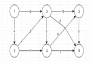

正确答案: C   你的答案: 空 (错误)

```cpp
2,3,4,5,6
```

```cpp
2,3,5,6,4
```

```cpp
2,3,4,6,5
```

```cpp
2,3,6,5,4
```

本题知识点

Java 工程师 360 公司 Java 工程师 360 公司 Java 工程师 360 公司 Java 工程师 360 公司 Java 工程师 360 公司 2018

讨论

[康康萌萌](https://www.nowcoder.com/profile/384554346)

[`blog.csdn.net/qq_37796444/article/details/80663810`](https://blog.csdn.net/qq_37796444/article/details/80663810)

发表于 2019-09-24 22:52:40

* * ****</bits></bits></file.h></stdio.h></bits></bits></bits></bits></bits></bits>*******