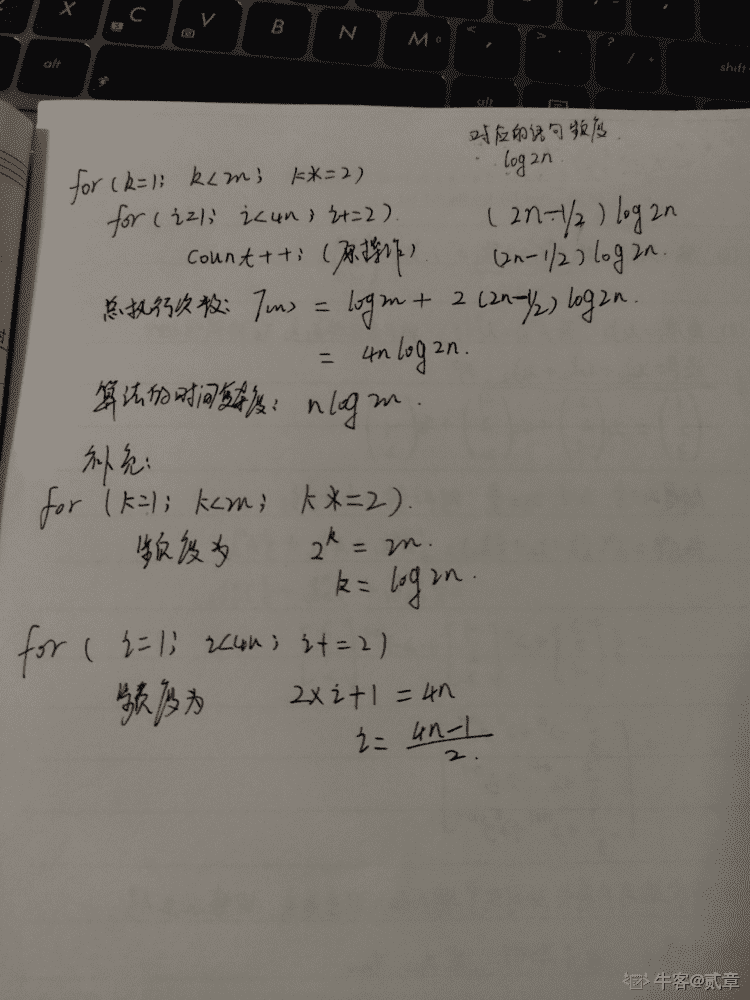
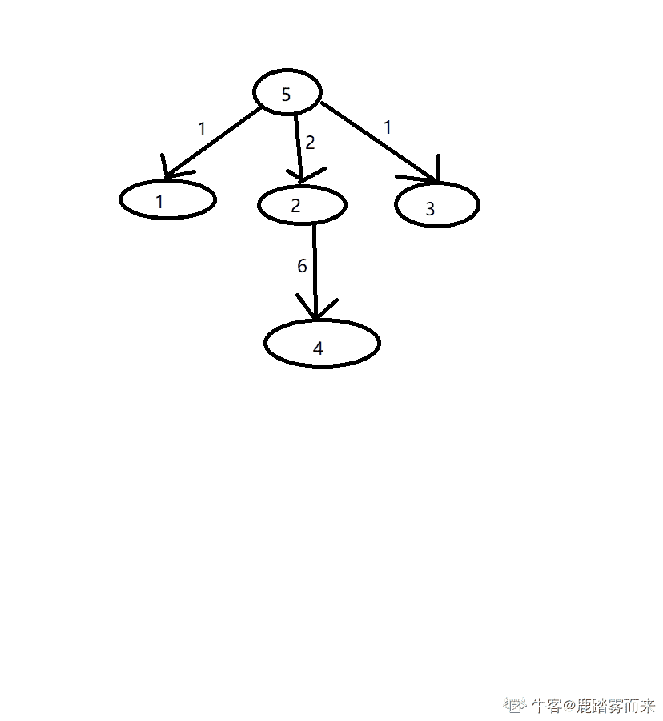

# 三百六十、公司-2018 春招笔试-PHP 开发工程师客观题合集

## 1

下列说法中正确的是（      ）

正确答案: A   你的答案: 空 (错误)

```cpp
冒泡排序法的平均时间复杂度为 O(n²)
```

```cpp
二分法的平均时间复杂度度是 O（n）
```

```cpp
m 个并列循环的时间复杂度为 O（mn）
```

```cpp
快速排序法的时间复杂度一定优于冒泡排序法
```

本题知识点

PHP 工程师 360 公司 排序 *PHP 工程师 360 公司 2018* *## 2

关键字序列为{12，11，19，23，1，6，10},哈希函数为 H(key)=key MOD 11,用链地址法构造哈希表,哈希地址为 1 的链中有（      ）个记录（      ）

正确答案: D   你的答案: 空 (错误)

```cpp
7
```

```cpp
5
```

```cpp
4
```

```cpp
3
```

本题知识点

PHP 工程师 360 公司 哈希 *PHP 工程师 360 公司 2018* *讨论

[牛客 738460262 号](https://www.nowcoder.com/profile/738460262)

哈希结构:https://www.cnblogs.com/s-b-b/p/6208565.html mod 表示取模:12，1，23 除以 11 取模都是 1

发表于 2020-03-21 20:03:59

* * *

## 3

下面关于动态规划说法正确的是

正确答案: A   你的答案: 空 (错误)

```cpp
他是利用子结构，进行自底而上的算法设计
```

```cpp
他需要后来多次计算的问题进行缓存，减少重复子问题的计算
```

```cpp
他所求问题的整体最优解可以通过一系列局部最优的选择
```

```cpp
他将分解后的子问题看成相互独立的.
```

本题知识点

PHP 工程师 360 公司 动态规划 PHP 工程师 360 公司 2018

## 4

下列关于排序算法的描述错误的是

正确答案: B   你的答案: 空 (错误)

```cpp
在待排序的记录集中，存在多个具有相同键值的记录，若经过排序，这些记录的相对次序仍然保持不变，称这种排序为稳定排序
```

```cpp
二叉查找树的查找效率与二叉树的树型有关，在节点太复杂时其查找效率最低
```

```cpp
下列排序算法中，希尔排序在某趟排序结束后不一定能选出一个元素放到其最终位置上。
```

```cpp
在下列排序方法中,插入排序方法可能出现这种情况:在最后一趟开始之前,所有的元素都不在其最终应在的正确位置上
```

本题知识点

PHP 工程师 360 公司 排序 *PHP 工程师 360 公司 2018* *讨论

[GoWalker](https://www.nowcoder.com/profile/908512638)

二叉查找树的查找效率与二叉树的树型有关，在（为单枝树）时其查找效率最低

发表于 2019-04-14 20:23:26

* * *

## 5

请指出以下代码段使用了何种算法
public void func(int[] arr1, int k, int m,int[] arr2) {
arr2[0] = 0;
for (int i = 1; i <= m; i++) {
int min = i;
for (int j = 0; j < k; j++) {
if (arr1[j] <= i) {
int temp = arr2[i - arr1[j]] + 1;
if (temp < min) {
min = temp;
}
}
}
arr2[i] = min;
}
}

正确答案: B   你的答案: 空 (错误)

```cpp
分治算法
```

```cpp
动态规划
```

```cpp
贪心算法
```

```cpp
回溯算法
```

本题知识点

PHP 工程师 360 公司 动态规划 2018

讨论

[年華 201903231133728](https://www.nowcoder.com/profile/221008530)

b1.分治法的设计思想是：将一个难以直接解决的大问题，分割成一些规模较小的相同问题，以便各个击破，分而治之。排序算法([快速排序](http://www.cnblogs.com/xsyfl/p/6901315.html)，[归并排序](http://www.cnblogs.com/xsyfl/p/6905974.html))都属于分治法 2.动态规划算法与分治法类似，其基本思想也是将待求解问题分解成若干个子问题，先求解子问题，然后从这些子问题的解得到原问题的解。与分治法不同的是，适合于用动态规划求解的问题，经分解得到子问题往往不是互相独立的。即适合于用动态规划法求解的问题，经分解后得到的子问题往往不是互相独立的。3.贪心算法是指：在每一步求解的步骤中，它要求“贪婪”的选择最佳操作，并希望通过一系列的最优选择，能够产生一个问题的（全局的）最优解。简单来说：若活动越早结束，剩余的时间是不是越多？那我就早最早结束的那个活动，找到后在剩下的活动中再找最早结束的不就得了 4.回溯算法实际上一个类似枚举的深度优先搜索尝试过程，主要是在搜索尝试过程中寻找问题的解，当发现已不满足求解条件时，就“回溯”返回（也就是递归返回），尝试别的路径。

发表于 2019-04-26 20:19:51

* * *

## 6

已知如下递归代码用于求解图的 m 着色问题：
#define N 10
int a[N+1][N+1]; //存储图
int x[N+1];//记录颜色
int sum=0;//保存可着色方案数

void backtrace(int t,int m)
{
int i;
if(t>N)//搜索至叶节点
{
sum++;
printf("第%d 种方案：\n",sum);
for(i=1;i<=N;i++)
printf("%d ",x[i]);
printf("\n");
}
else
{
for(i=1;i<=m;i++) //逐个判断每种颜色
{
if(check(t,i))
{   x[t]=i;
backtrace(t+1,m);
}
}
}
}
其中 check()函数用于检测某个节点颜色是否合法，以下 check()函数正确的是：

正确答案: D   你的答案: 空 (错误)

```cpp
int check(int t,int i)//检测函数 {     int j;     for(j=1;j&lt;t;j++)     {         if(a[t][j]==1&amp;&amp;x[i]==j)                  return 0;            }     return 1; }
```

```cpp
int check(int t,int i)//检测函数 {     int j;     for(j=1;j&lt;t;j++)     {         if(a[t][j]==1||x[i]==j)                  return 0;            }     return 1; }
```

```cpp
int check(int t,int i)//检测函数 {     int j;     for(j=1;j&lt;t;j++)     {         if(a[t][j]==1||x[j]==i)                  return 0;            }     return 1; }
```

```cpp
int check(int t,int i)//检测函数 {     int j;     for(j=1;j&lt;t;j++)     {         if(a[t][j]==1&amp;&amp;x[j]==i)                  return 0;            }     return 1; }
```

本题知识点

PHP 工程师 360 公司 递归 PHP 工程师 360 公司 2018

## 7

一个线性序列（30，14，40，63，22，5），假定采用散列函数 Hash(key)=key%7 来计算散列地址，将其散列存储在 A[0~6]中，采用链地址法解决冲突。若查找每个元素的概率相同，则查找成功的平均查找长度是（      ）。

正确答案: A   你的答案: 空 (错误)

```cpp
4/3
```

```cpp
1
```

```cpp
3/2
```

```cpp
5/3
```

本题知识点

PHP 工程师 360 公司 查找 *2018* *讨论

[青骨头](https://www.nowcoder.com/profile/236312651)

按照链地址法，结果应该是: ASL(6)=(1*4+2*2)/6=4/3

发表于 2019-09-09 08:42:26

* * *

[皇族小猪、](https://www.nowcoder.com/profile/123942011)

我咋觉得选 5/3 ？

发表于 2019-09-04 15:27:42

* * *

[OUYANGXIN](https://www.nowcoder.com/profile/325025642)

答案错了，就是 4/3

发表于 2019-10-26 15:12:39

* * *

## 8

下列程序段的时间复杂度是（    ）
count = 1；
for(k=1;k<2n;k*=2)
for(i=1;i<4n;i+=2)
count++;

正确答案: C   你的答案: 空 (错误)

```cpp
O(n2)
```

```cpp
O(8n2)
```

```cpp
O(nlog2n)
```

```cpp
O(n)
```

本题知识点

PHP 工程师 360 公司 C++ PHP 工程师 360 公司 2018

讨论

[Seaworth](https://www.nowcoder.com/profile/676817608)

```cpp
//程序段
count = 1；//执行次数为 1
for(k=1;k<2n;k*=2) //执行次数 log2n
{
    for(i=1;i<4n;i+=2)//执行次数 2n
    {
        count++;
    }
}
/*时间复杂度为 O(nlog2n)*/
```

发表于 2019-09-03 20:55:06

* * *

[贰章](https://www.nowcoder.com/profile/264658933)



发表于 2019-08-26 00:53:26

* * *

## 9

递归公式


的时间复杂度为(    )。

正确答案: D   你的答案: 空 (错误)

```cpp
O(n)
```

```cpp
O(logn)
```

```cpp
O(nlogn)
```

```cpp
O(n2)
```

本题知识点

PHP 工程师 360 公司 PHP 工程师 360 公司 2018

## 10

有关贪心法叙述正确的是（      ）

正确答案: A   你的答案: 空 (错误)

```cpp
采用局部最优策略
```

```cpp
采用全局最优策略
```

```cpp
在贪心法中采用逐步构造最优解的方法
```

```cpp
把问题分解为简单的问题求解
```

本题知识点

PHP 工程师 360 公司 贪心 PHP 工程师 360 公司 2018

讨论

[GoWalker](https://www.nowcoder.com/profile/908512638)

应选 AC

发表于 2019-04-15 20:52:01

* * *

## 11

在选择分治法解决问题时，应考虑待解决问题应具有哪些特征（      ）

正确答案: A   你的答案: 空 (错误)

```cpp
待解决问题规模缩小到一定程度后可以容易解决
```

```cpp
待解决问题应可以分解为若干个规模较小的相同问题，且子问题应可直接求解。
```

```cpp
各子问题之间是相互独立的
```

```cpp
分解后的子问题的解可以合并为源问题的解
```

本题知识点

PHP 工程师 360 公司 分治 PHP 工程师 360 公司 2018

## 12

在有序表中，关于斐波那契查找和折半查找说法错误的是（）

正确答案: A B C   你的答案: 空 (错误)

```cpp
就平均性能而言，斐波那契查找的平均性能比折半查找差
```

```cpp
只有有序表中元素个数 n 等于某个斐波那契数时才能用斐波那契查找算法
```

```cpp
在最坏情况下，斐波那契查找的性能比折半查找好
```

```cpp
折半查找时间复杂度为 O(log2n)
```

本题知识点

PHP 工程师 360 公司 查找 *PHP 工程师 360 公司 2018* *讨论

[Jason_x](https://www.nowcoder.com/profile/117568474)

在最坏情况下，斐波那契查找的时间复杂度还是 O(log2n)，且其期望复杂度也为 O(log2n)，但是与折半查找相比，斐波那契查找的优点是它只涉及加法和减法运算，而不用除法，而除法比加减法要占用更多的时间，因此，斐波那契查找的运行时间理论上比折半查找小，但是还是得视具体情况而定。

发表于 2019-02-23 20:34:45

* * *

[纸丶鸢 Cc](https://www.nowcoder.com/profile/2660795)

斐波那契不见得平均效率比二分高啊，如果是因为除法的话 >> 2 做位运算不就行了…

发表于 2019-08-21 09:44:18

* * *

## 13

下面说法错误的是（）

正确答案: C   你的答案: 空 (错误)

```cpp
快速排序算法平均速度最快
```

```cpp
堆排序在每一趟排序过程中，都会有一个元素被放置在最终位置上
```

```cpp
在 10000 个无序的元素中查找最大的 10 个元素，使用快速排序最快
```

```cpp
插入排序是一种稳定的排序算法
```

本题知识点

PHP 工程师 360 公司 排序 *2018* *讨论

[小道仙](https://www.nowcoder.com/profile/264325265)

这个题不应该是 C 吗？          堆排序 不是每次找出来的都是最大/最小吗？  这样每次出来的元素不都是确定的吗？

发表于 2019-10-05 15:20:18

* * *

[盏茶作酒](https://www.nowcoder.com/profile/6817686)

感觉不对恩，首先 B、D 正确。A 说的很勉强，C 应该是错了吧

发表于 2019-09-03 10:25:46

* * *

## 14

对于函数 y = ax² + bx + c,(a > 0),需要找出 y 的小值，精确到小数点后 6 位。下列选项中最有效的方法是（）。

正确答案: D   你的答案: 空 (错误)

```cpp
枚举
```

```cpp
二分查找
```

```cpp
三分查找
```

```cpp
推公式
```

本题知识点

PHP 工程师 360 公司 PHP 工程师 360 公司 PHP 工程师 360 公司 PHP 工程师 360 公司 PHP 工程师 360 公司 2018

## 15

设哈希表长 m=13,哈希函数 H(key)=key MOD 11。表中已有 4 个节点:addr(16)=5,addr(28)=6,addr(84)=7,addr(19)=8 其余地址为空,如用线性探测再散列处理冲突，则关键字为 38 的地址为（      ）

正确答案: D   你的答案: 空 (错误)

```cpp
6
```

```cpp
7
```

```cpp
8
```

```cpp
9
```

本题知识点

PHP 工程师 360 公司 哈希 *PHP 工程师 360 公司 2018* *讨论

[6+666](https://www.nowcoder.com/profile/364845906)

38 MOD 11 = 5，索引 5，6，7，8 都非空，填入下一个 9

发表于 2019-08-23 21:45:43

* * *

## 16

#include <bits>using namespace std;
int main(){
stack<int>st;
int pos = 1;
while(pos <= 3){
st.push(pos++);
}
cout<<st.top();
while(pos <= 5){
st.push(pos++);
}
while(!st.empty()){
cout<<st.top();
st.pop();
}
return 0;
}
上述程序的输出为(      )

正确答案: B   你的答案: 空 (错误)

```cpp
35421
```

```cpp
354321
```

```cpp
12453
```

```cpp
123453
```

本题知识点

PHP 工程师 360 公司 C++ PHP 工程师 360 公司 2018

讨论

[lz 言默 zl](https://www.nowcoder.com/profile/634720925)

top 是取栈顶 3，并没有将栈顶弹出，pop 才是弹栈顶，所以出栈顺序为 54321

编辑于 2019-09-11 21:58:03

* * *

[QZaizai](https://www.nowcoder.com/profile/747032131)

push 是压栈的操作，top 是弹栈的操作，先如后出

发表于 2019-09-10 19:18:10

* * *

## 17

#include <bits>using namespace std;
int gcd(int a, int b){
return b == 0 ? a : gcd(b, a % b);
}
struct stsort{
bool operator () (const int a, const int b) const{
if(gcd(30, a) < gcd(30, b)){
return 1;
}
else if(gcd(30, a) == gcd(30, b)){
return a < b;
}
else return 0;
}
};
int main(){
int n = 5;
priority_queue<int, vector<int>, stsort>q;
for(int i = 1; i <= n; ++i){
q.push(i);
}
for(int i = 1; i <= n; ++i){
printf("%d", q.top());
q.pop();
}
return 0;
}
程序的输出为( )

正确答案: A   你的答案: 空 (错误)

```cpp
53421
```

```cpp
53241
```

```cpp
12435
```

```cpp
14235
```

本题知识点

PHP 工程师 360 公司 C++ PHP 工程师 360 公司 2018

讨论

[养乐多 escher](https://www.nowcoder.com/profile/510902280)

gcd:求最大公因数 priority_queue<int, vector<int>, stsort>q;进行 stsort 排序：ture:降序 false:升序 

发表于 2019-09-09 16:58:40

* * *

## 18

#include <bits>using namespace std;
int main(){
int n = 5;
vector<int>a;
set<int>b;
for(int i = 1; i <= n; ++i){
a.push_back(i);
b.insert(i);
}
for(int i = 1; i <= n; ++i){
a.push_back(i);
b.insert(i);
}
cout<<a.size()<<b.size()<<endl;
return 0;
}
程序的输出为( )

正确答案: A   你的答案: 空 (错误)

```cpp
105
```

```cpp
510
```

```cpp
1010
```

```cpp
55
```

本题知识点

PHP 工程师 360 公司 C++ PHP 工程师 360 公司 2018

讨论

[马小跳 kh](https://www.nowcoder.com/profile/291885183)

set 容器中相同元素只允许出现一次，若要插入相同元素应使用 muliset

发表于 2019-09-17 17:06:07

* * *

## 19

#include <bits>using namespace std;
vector<int>g[10];
int ans = 0;
void dfs(int x){
if(g[x].size() == 0){
ans++;
return;
}
for(int i = 0; i < g[x].size(); ++i){
dfs(g[x][i]);
}
}
int main(){
int n, x;
scanf("%d", &n);
for(int i = 2; i <= n; ++i){
scanf("%d", &x);
g[x].push_back(i);
}
dfs(1);
cout<<ans<<endl;
return 0;
}
上述程序的输入为：
9
1 2 2 1 5 6 6 6
则输出为( )

正确答案: B   你的答案: 空 (错误)

```cpp
4
```

```cpp
5
```

```cpp
6
```

```cpp
7
```

本题知识点

PHP 工程师 360 公司 C++ PHP 工程师 360 公司 2018

讨论

[生命不息手撕不止](https://www.nowcoder.com/profile/48371706)

关键点在 vextor<int>g[10]，我们理解为这定义了 10 个 vector 数组，所以在输入的时候，我们得到， g[1]保存了 2，5； g[2]保存了 3，4 g[5]保存了 6 g[6]保存了 7，8，9，其余 g[]的 size 均为 0 所以进入 dfs(x)函数时，当 x 对应的 g[x]数组 size 为 0 时，ans+1； 若数组不空，则会对该数组每个元素都调用 dfs 函数，所以我们可以判定 ans 的值为所有数组元素 x 中对应的 g[x]为空的个数，即 3,4,7,8,9。有五个</int>

发表于 2019-09-29 22:35:10

* * *

[promethus](https://www.nowcoder.com/profile/1761272)

求解

发表于 2019-09-15 23:07:34

* * *

## 20

用(a,b,c)表示节点 a,b 之间有一条权值为 c 的无向边。对于图(1,2,3),(1,3,4),(1,5,1),(2,3,4),(2,4,6),(2,5,2),(3,5,1)。最小生成树的权值和为(        )

正确答案: B   你的答案: 空 (错误)

```cpp
9
```

```cpp
10
```

```cpp
11
```

```cpp
12
```

本题知识点

PHP 工程师 360 公司 树 PHP 工程师 360 公司 2018

讨论

[鹿踏雾而来](https://www.nowcoder.com/profile/635265501)

转化为树如下 编辑于 2019-09-10 17:32:44

* * *

[GoodFellow201904261341544](https://www.nowcoder.com/profile/875109857)

求大佬解啊，感觉算出来不对啊

发表于 2019-08-28 19:32:10

* * *

## 21

一棵二叉树有 100 个节点，若根节点深度为 1，树深最大为(       )，最小为(       )

正确答案: B   你的答案: 空 (错误)

```cpp
100 2
```

```cpp
100 7
```

```cpp
7 6
```

```cpp
7 2
```

本题知识点

PHP 工程师 360 公司 树 PHP 工程师 360 公司 2018

讨论

[你瞅啥鸭](https://www.nowcoder.com/profile/800105150)

高度 h 的二叉树，最多点为 2^h -1 个。7 层即有 127 个点， 能盛下 100 个点。

发表于 2019-09-19 15:47:34

* * *

## 22

在一棵度为 5 的树 T 中，若 14 个度为 5 的结点，15 个度为 4 的结点，14 个度为 3 的结点，5 个度为 2 的结点，10 个度为 1 的结点，则树 T 的叶节点个数是（     ）

正确答案: D   你的答案: 空 (错误)

```cpp
72
```

```cpp
102
```

```cpp
130
```

```cpp
135
```

本题知识点

PHP 工程师 360 公司 树 PHP 工程师 360 公司 2018

讨论

[Evan_Han](https://www.nowcoder.com/profile/4035141)

任何一棵树，总结点树为 N，除了根节点，每一个节点都有 1 条边。设度为 0,1,2,3,4,5 的节点数分别为 n0,n1,n2,n3,n4,n5。由边和节点的关系：N-1 = 0*n0+1*n1+2*n2+3*n3+4*n4+5*n5；算出总的 N = 193。有度的节点个数为 n1+n2+n3+n4+n5 = 10+5+14+15+14=58。那么，叶子结点个数为 n0 = N- 58 = 135。所以答案应该是 135。

发表于 2019-09-15 12:09:25

* * *

[GoWalker](https://www.nowcoder.com/profile/908512638)

题目有问题

发表于 2019-04-15 21:16:37

* * *

## 23

#include <bits>using namespace std;
int n = 300;
int solve(int x){
return x * (n - x);
}
int main(){
int l = 1, r = n;
int mid1, mid2;
int t = 50;
while(t--){
mid1 = l + r >> 1;
mid2 = mid1 + r >> 1;
if(solve(mid1) > solve(mid2)){
r = mid2;
}
else{
l = mid1;
}
}
cout<< l <<endl;
return 0;
}
程序的输出为(        )

正确答案: C   你的答案: 空 (错误)

```cpp
1
```

```cpp
100
```

```cpp
150
```

```cpp
300
```

本题知识点

PHP 工程师 360 公司 C++ PHP 工程师 360 公司 2018

讨论

[是小明呀](https://www.nowcoder.com/profile/951928338)

这个题目的程序也太长了吧，这不是道选择题嘛

发表于 2019-08-24 16:19:51

* * *

[潇潇程序猿](https://www.nowcoder.com/profile/3521760)

右移一位，就是 300÷2=150，所以 mid1=150，mid2=225，最终结果就是 150×150 和 225×75 的比较，显然是后者大，所以 l=mid1=150

发表于 2019-10-22 23:07:26

* * *

[犇流](https://www.nowcoder.com/profile/139469194)

#include <bits>using namespace std;
int n = 300;
int solve(int x){
     return x * (n - x);
}
int main(){
     int l = 1, r = n;
     int mid1, mid2;
     int t = 50;
    while(t--){
        mid1 = l + r >> 1;
        mid2 = mid1 + r >> 1;
        if(solve(mid1) > solve(mid2)){
                r = mid2;
        }
        else{
            l = mid1;
        }
    }
       cout<< l <<endl;
       return 0;
}移位操作，应该有规律的，让有缘人去递推吧，我直接丢编译器了。-----C

发表于 2019-10-07 20:31:13

* * *

## 24

#include <bits>using namespace std;
int solve(int x){
if(x == 0 || x == 1){
return x;
}
if(x % 2 == 0){
return 1 + solve(x / 2);
}
else{
return 1 + solve((x + 1) / 2);
}
}
int main(){
int n = 100;
int ans = solve(n);
cout<<ans<<endl;
return 0;
}
程序的输出为(      )

正确答案: C   你的答案: 空 (错误)

```cpp
6
```

```cpp
7
```

```cpp
8
```

```cpp
9
```

本题知识点

PHP 工程师 360 公司 C++ PHP 工程师 360 公司 2018

讨论

[南风、知我意](https://www.nowcoder.com/profile/912946363)

这道题实际上是求 100 除以 2（若商为奇数，则+1 再除以 2），多少次才能到 0 或 1。100/2，50/2，（25+1）/2，（13+1）/2，（7+1）/2，4/2，2/2，1，当为 1 的时候就退出了，所以一共是 7 次，加上退出时为 1，所以是结果为 7+1=8

编辑于 2019-09-18 10:18:38

* * *

## 25

一个有 n 个节点的树，有( )条边。

正确答案: A   你的答案: 空 (错误)

```cpp
n - 1
```

```cpp
n
```

```cpp
n + 1
```

```cpp
n ^ 2
```

本题知识点

PHP 工程师 360 公司 树 PHP 工程师 360 公司 2018

## 26

在 head 部分可以使用标签（      ）来定义内部样式

正确答案: A   你的答案: 空 (错误)

```cpp
<style>
```

```cpp
<link>
```

```cpp
<span>
```

```cpp
<sample>
```

本题知识点

PHP 工程师 360 公司 HTML 2018

讨论

[牛客 396467809 号](https://www.nowcoder.com/profile/396467809)

&lt 是左括号；&at 是右括号。正确选项的表达就是</bits></bits></bits></bits></bits></bits></bits>*******