# 三百六十、公司-2018 春招笔试-Web 前端开发工程师客观题合集

## 1

```cpp
var str1=new RegExp("e");
document.write(str1.exec("hello"));
```

以上代码输出结果为（      ）

正确答案: A   你的答案: 空 (错误)

```cpp
e
```

```cpp
null
```

```cpp
1
```

```cpp
其他几项都不对
```

本题知识点

前端工程师 360 公司 Javascript 2018

讨论

[不要再给我发感谢信了](https://www.nowcoder.com/profile/856134108)

JavaScript 高级程序设计上面的原话：RegExp 对象的主要方法是 exec()，该方法是专门为捕获组而设计的。 exec()接受一个参数，即要应用模式的字符串，然后返回包含第一个匹配项信息的数组；或者在没有匹配项的情况下返回 null。

发表于 2019-04-15 16:32:08

* * *

[来个 offer 来个 offer](https://www.nowcoder.com/profile/499202285)

如果匹配成功，exec() 方法返回一个数组，并更新正则表达式对象的属性。返回的数组将完全匹配成功的文本作为第一项，将正则括号里匹配成功的作为数组填充到后面。

如果匹配失败，exec() 方法返回 [null](https://developer.mozilla.org/zh-CN/docs/Web/JavaScript/Reference/Global_Objects/null)。

> [`developer.mozilla.org/zh-CN/docs/Web/JavaScript/Reference/Global_Objects/RegExp/exec`](https://developer.mozilla.org/zh-CN/docs/Web/JavaScript/Reference/Global_Objects/RegExp/exec)

var str1=new RegExp("e");
str1.exec("hello")
["e", index: 1, input: "hello", groups: undefined]

var str1=new RegExp("l");
str1.exec("hello")
["l", index: 2, input: "hello", groups: undefined]

编辑于 2019-10-20 11:03:32

* * *

[机车双猫怪](https://www.nowcoder.com/profile/344692719)

.exec()就是找有没有 e，有就打印出来。

编辑于 2021-03-29 08:09:06

* * *

## 2

<body>
<script type="text/javascript">
var test=new Boolean();
document.write(test);
document.write("<br />");

var test=new Boolean(0);
document.write(test);
document.write("<br />");

var test=new Boolean(null);
document.write(test);
document.write("<br />");

var test=new Boolean("");
document.write(test);
document.write("<br />");

var test=new Boolean(NaN);
document.write(test);
document.write("<br />");
</script>

</body>
</html>
上述代码的输出结果为（      ）

正确答案: A   你的答案: 空 (错误)

```cpp
false false false false false
```

```cpp
false true false false false
```

```cpp
false false true test Boolean
```

```cpp
其他几项都不对
```

本题知识点

前端工程师 360 公司 Javascript 2018 HTML

讨论

[yaye 芽叶](https://www.nowcoder.com/profile/946863549)

**在 JavaScript 中，false、null、0、" "、undefined 和 NaN 被称为假值。**

> var x = new Boolean();.

1.如果 Boolean 构造函数的参数不是一个布尔值,则该参数会被转换成一个布尔值。
2.如果参数是 0, -0, null, false, NaN, undefined, 或者空字符串 (“”),生成的 Boolean 对象的值为 false。
3.其他任何值,包括任何对象或者字符串”false”, 都会创建一个值为 true 的 Boolean 对象。

> var value = Boolean(value);

非布尔值转化成布尔值，需要直接使用 Boolean 函数，而不能通过新建 Boolean 对象。

编辑于 2019-09-16 19:27:33

* * *

[牛客 949355138 号](https://www.nowcoder.com/profile/949355138)

这里打印出来应该都是 Boolean{ false } 打印的是一个 Boolean 对象 Boolean 构造函数 new Boolean(value) 返回一个布尔对象 Boolean(value) 显式转换为布尔值这道题搞错了吧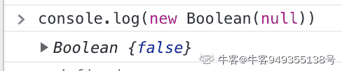
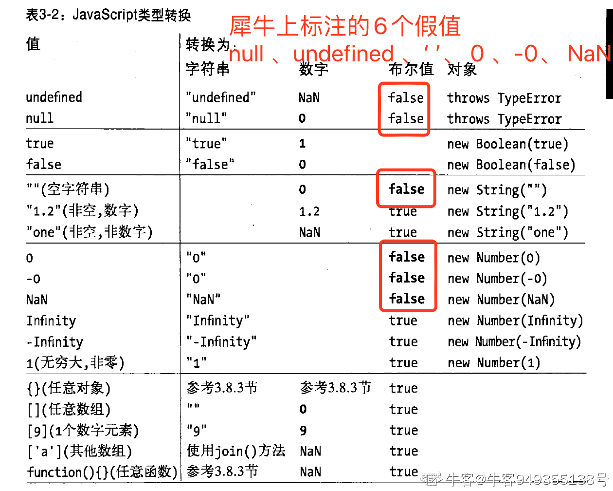

发表于 2020-03-10 09:17:21

* * *

[zhouling600521](https://www.nowcoder.com/profile/580686384)

a = new Boolean();typeof a  是 object    为什么 console.og（a）  就是 false 呢对象转布尔不是 true 吗

发表于 2019-09-07 19:29:14

* * *

## 3

如何阻止 IE 和各大浏览器默认行为（      ）

正确答案: B D   你的答案: 空 (错误)

```cpp
window.event.cancelBubble = true;
```

```cpp
window.event.returnValue = false;
```

```cpp
event.stopPropagation();
```

```cpp
event.preventDefault();
```

本题知识点

前端工程师 360 公司 Javascript 前端工程师 360 公司 2018

讨论

[包原隰险阻](https://www.nowcoder.com/profile/569118)

Event.returnValue 是在 IE6 引入的 Event.preventDefault()需要 IE9+MDN 建议新代码中采用 preventDefault。

发表于 2018-12-20 20:07:02

* * *

[牛客 1⃣号](https://www.nowcoder.com/profile/879753056)

现在应该是 D 对了吧，2019 年了

发表于 2019-09-13 18:25:24

* * *

[LeonardOzzie](https://www.nowcoder.com/profile/928262260)

这题应该选 D 了

发表于 2019-09-20 21:55:51

* * *

## 4

关于身份证号，以下正确的正则表达式为（      ）

正确答案: C   你的答案: 空 (错误)

```cpp
isIDCard=/^[1-9]\d{7}((0\d)|(1[0-2]))(([0|1|2]\d)|3[0-1])\d{3}$/;
```

```cpp
isIDCard=/^[1-9]\d{7}((9\d)|(1[0-2]))(([0|1|2]\d)|3[9-1])\d{3}$/;
```

```cpp
isIDCard=/^[1-9]\d{9}(0[1-9]|1[0,2])(0[1-9]|[1,2]\d|3[0,1])\d{3}(\d|[x,X])$/;
```

```cpp
isIDCard=/^[1-9]\d{5}[1-9]\d{3}((9\d)|(1[9-2]))(([0|1|2]\d)|3[9-1])\d{4}$/;
```

本题知识点

前端工程师 360 公司 Javascript 前端工程师 360 公司 2018

讨论

[包原隰险阻](https://www.nowcoder.com/profile/569118)

不知这些题是怎么上传的，质量不敢恭维。这道题没有答案，全是错的。对于 18 位身份证而言，按最简单的规则判断：

```cpp
[1-9]\d{5} //前 6 位地区码
\d{4} //年
(0[1-9]|1[0-2]) //月
(0[1-9]|[1-2]\d|3[0-1]) //日
\d{3}(\d|[xX]) //末四位
```

因此拼一起简单的规则为：

```cpp
^[1-9]\d{9}(0[1-9]|1[0-2])(0[1-9]|[1-2]\d|3[0-1])\d{3}(\d|[xX])$
```

唉好遗憾，题目的质量真的低。

编辑于 2018-12-22 08:37:54

* * *

[我才是谭亮](https://www.nowcoder.com/profile/1491282)

身份证最后可以是 x，所以选 c😅

发表于 2019-09-12 20:02:21

* * *

[海海不掉头发](https://www.nowcoder.com/profile/493926724)

建议改成单项选择。

发表于 2021-05-12 17:42:09

* * *

## 5

对于代码 var a = 10.42; 取出 a 的整数部分，以下代码哪些是正确的？

正确答案: A B   你的答案: 空 (错误)

```cpp
parseInt(a);
```

```cpp
Math.floor(a);
```

```cpp
Math.ceil(a);
```

```cpp
a.split('.')[0];
```

本题知识点

前端工程师 360 公司 Javascript 2018

讨论

[浪险](https://www.nowcoder.com/profile/683173318)

A. parseInt 转换为整数，默认为 10 进制，结果为 10B. floor 向下取整，结果为 10 C. ceil 向上取整，结果为 11D. split 操作数必需为正则或字符串，结果为 TypeError

编辑于 2019-08-25 09:09:39

* * *

[过来吧](https://www.nowcoder.com/profile/560248471)

a 是 number，split 是 string 方法

发表于 2019-08-22 22:48:07

* * *

[牛客 339024970 号](https://www.nowcoder.com/profile/339024970)

坑坑坑，Number 可没有 split

发表于 2021-04-08 17:24:08

* * *

## 6

以下代码执行后，num 的值是？var foo = function(x, y){
return x - y;
}
function foo(x, y){
return x + y;
}
var num = foo(1, 2);

正确答案: D   你的答案: 空 (错误)

```cpp
1
```

```cpp
2
```

```cpp
3
```

```cpp
-1
```

本题知识点

前端工程师 360 公司 Javascript 前端工程师 360 公司 2018

讨论

[包原隰险阻](https://www.nowcoder.com/profile/569118)

**知识点：hoisting**

```cpp
var foo = function(x, y){
    return x - y;
}
function foo(x, y){
    return x + y;
}
var num = foo(1, 2);
```

会被 javascript 编译器处理为：

```cpp
//variable hoisting 变量提升
var foo;//foo#1
var num;

//function declaration hoisting 函数声明提升
function foo(x, y){//foo#2
    return x + y;
}

//function expression NOT hoisted 函数表达式不会被提升
foo = function(x, y){//foo#3
    return x - y;
}

num = foo(1, 2);//这里使用 foo#3

```

**规则***1\. 变量声明、函数声明都会被提升到作用域顶处；*
*2\. 当出现相同名称时，优先级为：**变量声明(foo#1) < 函数声明(foo#2) < 变量赋值(foo#3)***

因此，num 计算时是用的 foo#3。答案为-1。
如解释有误，还请不吝指正 🤣

> refs:
> 1\. [`developer.mozilla.org/en-US/docs/Glossary/Hoisting`](https://developer.mozilla.org/en-US/docs/Glossary/Hoisting)
> 2\. [`developer.mozilla.org/en-US/docs/Web/JavaScript/Reference/Statements/var`](https://developer.mozilla.org/en-US/docs/Web/JavaScript/Reference/Statements/var)
> 3\. [`developer.mozilla.org/en-US/docs/Web/JavaScript/Reference/Statements/function`](https://developer.mozilla.org/en-US/docs/Web/JavaScript/Reference/Statements/function)
> 4\. [`developer.mozilla.org/en-US/docs/Web/JavaScript/Reference/Operators/function`](https://developer.mozilla.org/en-US/docs/Web/JavaScript/Reference/Operators/function)
> 5\. [`stackoverflow.com/questions/40675821/what-happens-when-javascript-variable-name-and-function-name-is-the-same`](https://stackoverflow.com/questions/40675821/what-happens-when-javascript-variable-name-and-function-name-is-the-same)

编辑于 2018-12-20 20:38:42

* * *

[1mmmm](https://www.nowcoder.com/profile/443942983)

关于这道题，不管是变量的提升优先还是函数的提升优先，最后执行的一定赋值操作即： foo = xxx 所以结果是-1

发表于 2019-09-10 18:20:24

* * *

[offer 快到我碗里来-](https://www.nowcoder.com/profile/383052911)

var foo = function(x, y){
return x - y;
}
function foo(x, y){
return x + y;
}
var num = foo(1, 2);

函数会比变量先提升;编译后为 function foo(x, y){
return x + y;
}var foo;var num;
foo = function(x, y){
return x - y;
}num = foo(1, 2);

发表于 2019-09-06 20:29:10

* * *

## 7

执行以下代码，5 秒后内输出的结果为（）

```cpp
for(var i = 0; i < 5; i++){
    setTimeout(function(){
        console.log(i);
    }, 1000 * i);
}
```

正确答案: D   你的答案: 空 (错误)

```cpp
1 2 3 4 5
```

```cpp
0 1 2 3 4
```

```cpp
4 4 4 4 4
```

```cpp
5 5 5 5 5
```

本题知识点

前端工程师 360 公司 Javascript 2018

讨论

[Teamoy](https://www.nowcoder.com/profile/129070881)

将 for 循环的 var 换成 let 后，输出就会变成 0 1 2 3 4

发表于 2020-05-21 16:46:40

* * *

[funwangsir](https://www.nowcoder.com/profile/768951634)

https://blog.csdn.net/Febby_/article/details/94763441 这篇博客把原因讲的很详细，看了应该就懂了 在所有同步任务执行完之前，任何的异步任务是不会执行的。 而 setTimeout 就是一个异步任务，所以会先执行 for 循环这个同步任务，把 setTimeout()放进任务队列中等待主线程的 for 循环执行完毕，一旦"执行栈"中的所有同步任务执行完毕（循环结束后此时 i=5）就会从队列中取出 setTimeout()

编辑于 2020-09-07 10:01:13

* * *

[Pandora417](https://www.nowcoder.com/profile/767087536)

因为同步队列的 for 循环执行完成才轮到异步队列， 每一次 for 循环的时候，settimeout 都执行一次，但是里面的 function（闭包函数）没有被执行，而是被放到了任务队列里面，等待执行，当 i 累加到 5 的时候跳出循环。此时全局只有一个变量 i=>5，所以打印出来都是 5。

发表于 2019-10-03 15:10:31

* * *

## 8

以下结果里，返回 true 的是？

正确答案: B   你的答案: 空 (错误)

```cpp
1 === '1';
```

```cpp
!![]
```

```cpp
!!''
```

```cpp
null === undefined
```

本题知识点

前端工程师 360 公司 Javascript 前端工程师 360 公司 2018

讨论

[旺仔大馒头](https://www.nowcoder.com/profile/8019634)

选择 B。空对象转换为布尔类型为 true。

| 数据类型 | 转换为 true 的值 | 转换为 false 的值 |
| Boolean | true | false |
| String | 任何非空字符串 | ""空字符串 |
| Number | 任何非 0 数字值(包括无穷大) | 0 和 NaN |
| Object | 任何对象 | null |
| Undefined | n/a | undefined |

数组属于对象类型，所以空的数组转换成布尔型是 true

相同的是，空的对象转换成布尔型也是 true

1\. 空数组[]和空对象{}都是 object 类型，因此直接用于 if 判断条件时就会被转化为 true。

2\. 任意值与布尔值比较，都会将两边的值转化为 Number。

注意：

如果将空数组[]与布尔值 false 比较，false 转化为 0，而空数组[]也转化为 0，因此[] == false 的判断得到 true。
如果将空对象{}与布尔值 false 比较，false 转化为 0，而空对象{}转化为 NaN，由于 NaN 与任何数都不相等，因此{} == false 的判断得到 false。

发表于 2019-08-31 16:27:48

* * *

[大丈夫🍃](https://www.nowcoder.com/profile/138311767)

只有 null,undefind,空字符串,0，-0，false  这六个值是 false。其他所有情况都是 ture

发表于 2019-02-26 21:41:31

* * *

[踏向未来](https://www.nowcoder.com/profile/644892869)

记住 7 个假值，null,undefined,false,0,-0,NaN," "

发表于 2019-10-29 00:40:31

* * *

## 9

以下代码执行后，a.x 和 b.x 的结果分别为（）

```cpp
function A(x){
  this.x = x;
}
A.prototype.x = 1;

function B(x){
  this.x = x;
}
B.prototype = new A();
var a = new A(2), b = new B(3);
delete b.x;
```

正确答案: C   你的答案: 空 (错误)

```cpp
2, 3
```

```cpp
2, 1
```

```cpp
2, undefined
```

```cpp
其他几项都不对
```

本题知识点

前端工程师 360 公司 Javascript 2018

讨论

[包原隰险阻](https://www.nowcoder.com/profile/569118)

知识点：**prototype、new operator**答案：2, undefined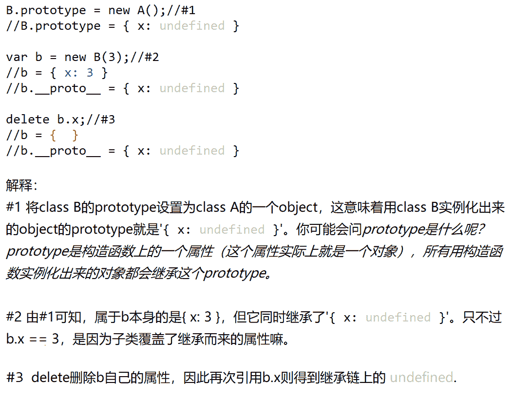

> ref:1. [`developer.mozilla.org/en-US/docs/Web/JavaScript/Reference/Operators/new`](https://developer.mozilla.org/en-US/docs/Web/JavaScript/Reference/Operators/new)2. [`developer.mozilla.org/en-US/docs/Web/JavaScript/Inheritance_and_the_prototype_chain`](https://developer.mozilla.org/en-US/docs/Web/JavaScript/Inheritance_and_the_prototype_chain)3. [`developer.mozilla.org/en-US/docs/Web/JavaScript/Reference/Operators/delete`](https://developer.mozilla.org/en-US/docs/Web/JavaScript/Reference/Operators/delete)

发表于 2018-12-20 21:32:12

* * *

[123qwer.1](https://www.nowcoder.com/profile/567724293)

b 的 prototype=new A,想错的可能都认为构造函数的 x 没有赋值就自动去原型下找，错了，如果构造函数没有 x 才会去原型下找，如果有 x 但是没有赋值，则是 undefined,相当于 x=undefined.就不会进入原型链了

编辑于 2020-11-05 13:19:47

* * *

[呀呀呀呀呀呀晕](https://www.nowcoder.com/profile/384330933)

function A(x){this.x = x;
}
A.prototype.x = 1;

function B(x){
this.x = x;
}
B.prototype = new A();
var a = new A(2), //a.x 首先要在自己的构造函数中查找，没有采取原型上找，这里有 this.x = x.所以 a.x = 2;b = new B(3);//B.prototype = new A();形成原型链
delete b.x;//但是 delete 只能删除自己的 x 不能删除父级的 x.   //b.x 通过原型链找到构造函数 A 里面的 this.x=x 但是没有赋值，所以 undefined

编辑于 2020-01-30 21:39:49

* * *

## 10

以下代码执行后，array 的结果是？var array = [-1,1,3,4,6,10];
array.sort((a,b)=>Math.abs(a-3)-Math.abs(b-3));

正确答案: A   你的答案: 空 (错误)

```cpp
[3, 4, 1, 6, -1, 10]
```

```cpp
[-1, 1, 3, 4, 6, 10]
```

```cpp
[10, 6, 4, 3, 1, -1]
```

```cpp
[10, -1, 6, 1, 4, 3]
```

本题知识点

前端工程师 360 公司 Javascript 前端工程师 360 公司 2018

讨论

[alonetj](https://www.nowcoder.com/profile/43372448)

先把所有元素-3，求绝对值，然后从小到大排序,最后把这些元素替换为原来的就搞定了原数组元素:-1  1  3   4  6  10 运算后:        4   2  0   1  3   7 排序:            0   1   2   3   4  7 替换:             3   4  1   6   -1  10

发表于 2019-09-26 15:14:12

* * *

[scxxx](https://www.nowcoder.com/profile/433528517)

先总结排序函数的作用：根据所有数在数轴上与 3 的距离进行升序排列然后观察数组： [-1,1,3,4,6,10]显而易见其中的 3 离 3 最近，肯定排在第一个所以直接排除 BCD 选 A

发表于 2019-08-23 22:44:35

* * *

[毛毛嘻嘻嘻](https://www.nowcoder.com/profile/169622885)

```cpp
arr.sort(function(a,b){
    return a-b;  //正序排序
}
```

它的内部采用冒泡算法，两数之差 > 0 交换位置；<0 不交换位置。比如 Math.abs(-1-3)=4  > Math.abs(1-3)=2，-1 与 1 交换位置；接着再用-1 与 3 比较，直至所有数都比较完

发表于 2019-08-09 18:26:58

* * *

## 11

typeof new Array() 表达式的值是：

正确答案: B   你的答案: 空 (错误)

```cpp
&quot;Object&quot;
```

```cpp
&quot;object&quot;
```

```cpp
&quot;Array&quot;
```

```cpp
&quot;array&quot;
```

本题知识点

前端工程师 360 公司 Javascript 前端工程师 360 公司 2018

讨论

[牛客 541228 号](https://www.nowcoder.com/profile/541228)

大小写 object 有什么区别么？

发表于 2019-08-22 14:43:16

* * *

[✨暴走美少女](https://www.nowcoder.com/profile/53507060)

Array 等特殊对象使用 typeof 一律返回 object

发表于 2019-08-21 07:31:23

* * *

[莫得感情的笔试机器](https://www.nowcoder.com/profile/490732403)

对一个值使用 typeof 操作符可能返回下列某个字符串： "undefined"——如果这个值未定义； "boolean"——如果这个值是布尔值； "string"——如果这个值是字符串； "number"——如果这个值是数值； "object"——如果这个值是对象或 null； "function"——如果这个值是函数；

发表于 2019-09-22 21:25:13

* * *

## 12

与其他 IEEE 754 表示浮点数的编程语言一样，JavaScript 的 number 存在精度问题，比如 0.2 + 0.4 的结果是 0.6000000000000001。以下选项中，能得到 0.6 的是？

正确答案: B   你的答案: 空 (错误)

```cpp
parseFloat(0.2 + 0.4)
```

```cpp
parseFloat((0.2 + 0.4).toFixed(1))
```

```cpp
Math.round(0.2 + 0.4)
```

```cpp
parseFloat((0.2 + 0.6).toPrecision(1))
```

本题知识点

前端工程师 360 公司 Javascript 2018

讨论

[浪险](https://www.nowcoder.com/profile/683173318)

1.  parseFloat 解析一个字符串，并返回一个浮点数
2.  toFixed 把数字转换为字符串，结果的小数点后有指定位数的数字
3.  Math.round 把一个数字舍入为最接近的整数
4.  toPrecision 把数字格式化为指定的长度

    | 选项 | 结果 |
    | A | 0.6000000000000001 |
    | B | 0.6 |
    | C | 1 |
    | D | 0.8 |

* * *

所以没有答案哈哈哈哈哈哈-------------------------------------------------20200216 修改，现在有答案了，选 B

编辑于 2020-02-16 22:23:11

* * *

[Xinchang_WANG](https://www.nowcoder.com/profile/133103886)

D 选项居然是 0.2+0.6 好吧我输了。。。

发表于 2020-02-13 17:11:34

* * *

[还不简单吗](https://www.nowcoder.com/profile/4222073)

```cpp
// parseFloat(),解析一个字符串，并返回一个浮点数。
// toFixed 把数字转换为字符，结果的小数点后有指定位数的数字,按四舍五入取值
var num = new Number(15.7857);
var a = num.toFixed(); //16 无参数，表示小数点后面位数为 0 位，然后四舍五入
var b = num.toFixed(1);//15.8
var c = num.toFixed(3);//15.786
var d = num.toFixed(10);  //多出的补 0

//toPrecision()把数字格式化为指定长度
var f = num.toPrecision();//15.7857，无参数，返回原数字
var g = num.toPrecision(1);//2e+1，参数小于整数部分位数，返回科学计数
var h = num.toPrecision(3);//15.8，也是有四舍五入
var i = num.toPrecision(10);//15.78570000，长度不够补 0
```

发表于 2019-09-20 10:06:43

* * *

## 13

alert(1 || 2) 的值是？

正确答案: A   你的答案: 空 (错误)

```cpp
1
```

```cpp
2
```

```cpp
true
```

```cpp
0
```

本题知识点

前端工程师 360 公司 Javascript 前端工程师 360 公司 2018

讨论

[尽心小白](https://www.nowcoder.com/profile/416447923)

**1、只要 || 前面为 false,不管 || 后面是 true 还是 false，都返回 || 后面的值。**

**2、只要 || 前面为 true,不管 || 后面是 true 还是 false，都返回 || 前面的值。******3.只要 && 前面是 false，无论 && 后面是 true 还是 false，结果都将返 && 前面的值;********4.只要 && 前面是 true，无论 && 后面是 true 还是 false，结果都将返 && 后面的值;**** 

发表于 2019-02-16 15:42:58

* * *

[像你像 ta](https://www.nowcoder.com/profile/879063203)

或运算，左假看右；与运算，左真看右；

发表于 2019-09-28 13:45:24

* * *

[NTZ_EE](https://www.nowcoder.com/profile/121547781)

1、只要 || 前面为 false,不管 || 后面是 true 还是 false，都返回 || 后面的值。 2、只要 || 前面为 true,不管 || 后面是 true 还是 false，都返回 || 前面的值。 3.只要 && 前面是 false，无论 && 后面是 true 还是 false，结果都将返 && 前面的值; 4.只要 && 前面是 true，无论 && 后面是 true 还是 false，结果都将返 && 后面的值;

发表于 2019-09-05 14:16:36

* * *

## 14

以下代码执行后，输出结果为（） 

```cpp
let x = 10;
let foo = () => {
    console.log(x);
    let x = 20;
    x++;
}
foo();
```

正确答案: A   你的答案: 空 (错误)

```cpp
抛出 ReferenceError
```

```cpp
10
```

```cpp
20
```

```cpp
21
```

本题知识点

前端工程师 360 公司 Javascript 2018

讨论

[爱喝水的潇洒哥](https://www.nowcoder.com/profile/131198719)

一楼的回答说：”let 块级作用域，所以不会去访问外部的 x“是错误的，这题的本质是暂时死区的问题如图，我单单是去掉了在 function 中 let 的定义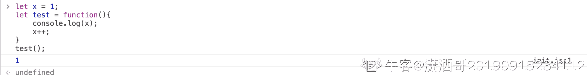这里边的 console.log 的结果是 1，证明了是可以访问 function 之前定义的变量的，而之所以会产生 reference error 是因为**暂时死区的问题(temperal dead zone)**，我为此查了下红宝书，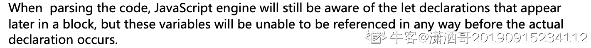就是说虽然 let 语句不像 var 语句会产生 hoisting（变量提升），JavaScript 引擎也会意识到在后边的 let 定义，只是不支持在 let 声明语句之前引用该变量而已。所以，只要在同一个 block 中，let 是在后边定义的，就不能在之前引用该变量。与此同时，也不能再去取嵌套外层的值了（x=1）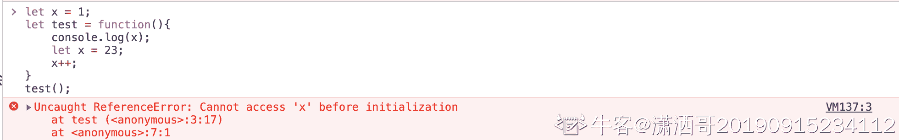

发表于 2020-02-21 11:05:35

* * *

[梦境の彼方](https://www.nowcoder.com/profile/537188730)

let 暂时性死区；[`es6.ruanyifeng.com/#docs/let`](http://es6.ruanyifeng.com/#docs/let)

编辑于 2019-10-07 21:33:41

* * *

[达芬奇伯爵](https://www.nowcoder.com/profile/378400)

实际上 `let` 也是存在变量提升的

```cpp
let x = 10;
let foo = () => {
  // 这里访问 x 就会在当前作用域内找 x
  // 如果没有下面的 let x = 20
  // 当前作用域就找不到，然后就会继续找外层变量，最后输出 10
  // 但是下面有声明，声明会提升到当前代码块最前面
  // 这个时候 x 还没有初始化，存在暂存死区中，访问就会抛出 ReferenceError
  console.log(x);
  let x = 20;
  x++;
};
foo();

```

如果把里面的 `let` 换成 `var` 就不会报错，显示 `undefined`

就是因为 `let` 是在编译时才会初始化，`var` 在声明时就会初始化

发表于 2020-11-25 18:30:54

* * *

## 15

以下代码执行后，console 输出的信息是？

```cpp
for(var i = 0; i < 5; i++){
    requestAnimationFrame(() => console.log(i));
}
```

正确答案: D   你的答案: 空 (错误)

```cpp
1 2 3 4 5
```

```cpp
0 1 2 3 4
```

```cpp
4 4 4 4 4
```

```cpp
5 5 5 5 5
```

本题知识点

前端工程师 360 公司 Javascript 2018

讨论

[詹姆士郭德纲](https://www.nowcoder.com/profile/239029822)

更应该注意 var 和 let，换成 let 输出的就是 b 选项。var 时是函数作用域，异步函数在 for 循环结束后还未执行，函数作用域的 i 变成了 5。let 执行时，因为块级作用域的缘故，每一次 for 循环都会产生一个块级作用域

编辑于 2020-07-14 11:23:57

* * *

[悄敲](https://www.nowcoder.com/profile/642861573)

requestAnimationFrame 并非同步执行的，具体可查阅其实现细节，所以 for 循环中的 requestAnimationFrame 会在循环退出的时候才执行其中的回调，注意循环退出的时候 i 的值为 5.

发表于 2019-08-25 17:39:58

* * *

[技术佣兵](https://www.nowcoder.com/profile/975698583)

因为 request 是异步，所以 for 循环先执行完成（此时 i=5）再执行 request，

发表于 2020-05-28 17:08:44

* * *

## 16

以下代码执行后，console 输出的信息是？

```cpp
for(let i = 0; i < 5; i++){
    requestAnimationFrame(() => console.log(i));
}
```

正确答案: B   你的答案: 空 (错误)

```cpp
1 2 3 4 5
```

```cpp
0 1 2 3 4
```

```cpp
4 4 4 4 4
```

```cpp
5 5 5 5 5
```

本题知识点

前端工程师 360 公司 Javascript 2018

讨论

[你说啥我听不清](https://www.nowcoder.com/profile/569458946)

requestAnimationFrame 虽然是异步函数，但是由于 i 是用 let 定义的，每一次都会生成一个块级作用域，来把当前值和 requestAnimationFrame 放在这个作用域中 （仅个人理解，如有错误，请不吝赐教～）

发表于 2020-08-31 11:47:53

* * *

[技术佣兵](https://www.nowcoder.com/profile/975698583)

很简单，因为 let 在循环条件的时候定义，而不是在外部定义，则每一次循环 let 都会生成一个块级作用域保存当前的值

发表于 2020-06-06 10:41:15

* * *

[陈小草](https://www.nowcoder.com/profile/263405336)

requestAnimationFrame 是什么鬼？

发表于 2019-08-26 19:27:50

* * *

## 17

以下结果里，返回 `false` 的是？

正确答案: A C   你的答案: 空 (错误)

```cpp
[] == true
```

```cpp
!![]
```

```cpp
NaN == NaN
```

```cpp
null == undefined
```

本题知识点

前端工程师 360 公司 Javascript 2018

讨论

[安如水](https://www.nowcoder.com/profile/788092848)

不要光看浏览器中打印的结果，要明白原理
A 中，两边都进行了隐式转换。true 会转为 1 ,[ ] 会转为 0 ，最后是比较的是 0 == 1，所以结果是 false。注意：[]转换成字符串为“”[]转换成 boolean 为 true；[]转换成数字为 0；这样 B 中的[]即隐式转换为 true

发表于 2019-09-18 14:00:49

* * *

[苏沐琳](https://www.nowcoder.com/profile/153679231)

A、C 返回的都是 false。[]==true;符号==存在隐式类型转换，，会把空数组[]转换成数字 0，true 转换成数字 1，所以两者比较返回 false。NaN 与任何值都不相等，包括其本身

发表于 2018-12-21 17:23:17

* * *

[北凉徐凤年](https://www.nowcoder.com/profile/615216645)

A.==是比较运算符，所有两边都是转成 Number 型。[ ]转成 0，true 转成 1B.！是逻辑运算符，所以会转成 Boolean，[ ]转成 true,前面加！！所以还是 trueC.两个不是值的值比较不可能相等答案是：AC

发表于 2019-09-01 20:24:42

* * *

## 18

以下代码执行后，console 的输出是？

```cpp
function Foo(){
    console.log(this.location);
}
Foo()
```

正确答案: A   你的答案: 空 (错误)

```cpp
当前窗口的 Location 对象
```

```cpp
undefined
```

```cpp
null
```

```cpp
TypeError
```

本题知识点

前端工程师 360 公司 Javascript 2018

讨论

[浪险](https://www.nowcoder.com/profile/683173318)

'use strict'条件下，会报 TypeError 无'use strict'下，this 指向 window

发表于 2019-08-22 10:53:03

* * *

[Three_Stone](https://www.nowcoder.com/profile/67073033)

http://www.ruanyifeng.com/blog/2018/06/javascript-this.html 参考阮一峰大神的 this 用发，this 指向 window 对象中的 location

发表于 2019-08-21 07:55:34

* * *

[waywordcode](https://www.nowcoder.com/profile/808048549)

犯了个低级错误，函数直接调用 this 指向 window。

发表于 2020-09-12 03:22:32

* * *

## 19

以下代码执行后，console 的输出是？
function Foo(){'use strict'
console.log(this.location);
}
Foo()

正确答案: D   你的答案: 空 (错误)

```cpp
当前窗口的 Location 对象
```

```cpp
undefined
```

```cpp
null
```

```cpp
TypeError
```

本题知识点

前端工程师 360 公司 Javascript 2018

讨论

[少年 Sonic](https://www.nowcoder.com/profile/5727657)

'use strict'是严格模式**严格模式下禁止 this 关键字指向全局对象****。**此时 this 为 undefined。

发表于 2019-03-08 19:35:40

* * *

[七年 201908081946520](https://www.nowcoder.com/profile/219680973)

在严格模式下，this 为 undefined,所以访问 this 的属性就会报错。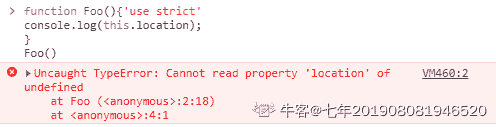

发表于 2019-08-27 11:36:46

* * *

[牛客 726659195 号](https://www.nowcoder.com/profile/726659195)

注意严格模式下 this 在各种应用场景的指向即可：1\. 在函数中的 this 指向：this === undefined2\. 在全局中的 this 指向：this.window === window 其他的 this 指向均是与非严格模式的 this 指向一样，只有 函数中的 this 要注意，是 undefined

发表于 2020-11-17 09:13:42

* * *

## 20

以下代码执行后，array 的结果是？

```cpp
let array = [,1,,2,,3];
array = array.map((i) => ++i)
```

正确答案: A   你的答案: 空 (错误)

```cpp
[,2,,3,,4]
```

```cpp
[NaN,2,NaN,3,NaN,4]
```

```cpp
[1,2,1,3,1,4]
```

```cpp
[null,2,null,3,null,4]
```

本题知识点

前端工程师 360 公司 Javascript 2018

讨论

[抛物线 201907092019849](https://www.nowcoder.com/profile/77585316)

*   ES5*   orEach(), filter(), reduce(), every() 和 some()都会跳过空位。*   map()会跳过空位，但会保留这个值*   join()和 toString()会将空位视为 undefined，而 undefined 和 null 会被处理成空字符串。*   ES6 中都会将空位当做 undefined

发表于 2019-10-31 18:48:39

* * *

[已注销](https://www.nowcoder.com/profile/631714656)

forEach，filter，every，some 会跳过空位，map 会跳过空位，但是会保留这个值。

发表于 2019-06-10 17:13:34

* * *

[PiggyCoder](https://www.nowcoder.com/profile/556507504)

ES5 map 会跳过空位 ES6 map 会将空位的值当作 undefined (如果按现在的版本应该为 B)

发表于 2020-09-17 18:28:09

* * *

## 21

以下代码执行后，输出结果为（）

```cpp
var a = 10;
function a(){}
console.log(typeof a)
```

正确答案: A   你的答案: 空 (错误)

```cpp
“number”
```

```cpp
“object”
```

```cpp
“function”
```

```cpp
“undefined”
```

本题知识点

前端工程师 360 公司 Javascript 2018

讨论

[哒哒嘀嗒](https://www.nowcoder.com/profile/576294950)

函数提升优先级高于变量提升，所以代码等价于 ```cpp
function a(){}
var a；
a = 10;
console.log(typeof a)
``` 

发表于 2019-08-21 16:35:49

* * *

[三七互娱内推招聘专员](https://www.nowcoder.com/profile/113910183)

```cpp
var a=10; function a(){} console.log(typeof a);
函数提升大于变量提升，变量提升会提升到除函数声明的后面；变量提升，但是赋值不提升、函数表达式亦是如此，所以我觉得应该是下面的步骤  function a(){} var a;
a=10;//如果没有这一步赋值操作的话，类型还是 function console.log(typeof a);//a=10 number
这边不是因为什么之后重声明才变为 number，是因为变量赋值才变的
如果有多个 var a ,那 a 的类型最后就会是最后赋值操作的参数类型。
如果有什么不对的地方，欢迎大家指出说的不到位或者有错的地方。 
```

发表于 2019-08-27 22:34:55

* * *

[马克豚](https://www.nowcoder.com/profile/627953710)

这一题我选错了。
我来写一下理解后的思路：首先使用 var 声明变量会造成变量提升，毫无疑问变量 a 会被置于代码块顶部，但是下方使用 function 关键字声明了函数 a，函数声明也会提升至代码块顶部，而且优先级更高。
所以实际代码等价于

```cpp
function a () {}
var a
a = 10
console.log(typeof a)
```

变量 a 会覆盖函数 a，输出结果为 number。
那如果这里使用关键词 let 呢，代码变为

```cpp
let a = 10
function a () {}
console.log(typeof a)
```

这里明显会报错。前面提到，函数声明会优先于变量声明，会被提升至代码块顶部，所以会先声明 function a ,再执行 let a = 10；，但是 a 已被声明过，不能再使用 let 关键字进行重声明。所以这里应当注意函数声明提升的问题，即便 let 声明变量的语句被置于代码块顶部，但是需要注意函数声明提升。

发表于 2020-04-26 11:20:35

* * *

## 22

以下代码的执行后，str 的值是：

```cpp
var str = "Hellllo world";
str = str.replace(/(l)\1/g, '$1');
```

正确答案: B   你的答案: 空 (错误)

```cpp
Helo world
```

```cpp
Hello world
```

```cpp
Helllo world
```

```cpp
Hellllo world
```

本题知识点

前端工程师 360 公司 Javascript 2018

讨论

[格式调](https://www.nowcoder.com/profile/692735694)

对于正则表达式 /(l)\1/g，其中(l)是第一个分组，\1 指向第一个分组，即\1 重复了第一个分组的内容，所以该正则表达式可以表示成/(ll)/g 而对于第二个参数$1，表示用第一个分组的内容 l 对匹配到的部分进行替换(即 ll 替换成 l )，同时正则表达式有 g 表示全局匹配，所以 4 个 ll 被替换成 2 个 ll。

发表于 2019-08-22 17:27:53

* * *

[浪险](https://www.nowcoder.com/profile/683173318)

1、定义(l)表示第一个分组里有 l\1 表示所获取的第 1 个()匹配的引用/g 表示全局匹配$1 表示第一个分组里的值 l2、所以(l)\l 表示匹配两个连续字符 ll，即 ll(l)\l/g 表示全局匹配两个连续字符 ll 即 llll
str.replace(/(l)\1/g, '$1') 表示将 ll 替换成 l
3、最终 Hellllo =》 Hello  

发表于 2019-08-22 11:27:54

* * *

[正义 de 键盘侠](https://www.nowcoder.com/profile/839451883)

解析：
\1 指向第一个分组的内容，及是(l)
故表达式变成这样
/(l)\1/g === /(l)(l)/g
$1 代表第一个分组。
故是这样解析的
往右解析
he(l[$1]l[$2])(l[$1]l[$2])o world
   第一次匹配   第二次匹配
hel[$1]l[$1]o world   

发表于 2020-04-05 10:23:34

* * *

## 23

以下代码执行后，result 的值是：

```cpp
var result = Math.round(11.5) + Math.round(-11.5);
```

正确答案: B   你的答案: 空 (错误)

```cpp
0
```

```cpp
1
```

```cpp
-1
```

本题知识点

前端工程师 360 公司 Javascript 2018

讨论

[我才是谭亮](https://www.nowcoder.com/profile/1491282)

Math.round(x)如果参数的小数部分大于 0.5，则舍入到下一个绝对值更大的整数;如果参数的小数部分小于 0.5，则舍入到下一个绝对值更小的整数;如果参数的小数部分恰好等于 0.5，则舍入到下一个在正无穷（+∞）方向上的整数。**注意，与很多其他语言中的 round()函数不同，Math.round()并不总是舍入到远离 0 的方向（尤其是在负数的小数部分恰好等于 0.5 的情况下）**

发表于 2019-09-12 16:40:12

* * *

[haha_](https://www.nowcoder.com/profile/7169441)

[Math.round 函数文档](https://uploadfiles.nowcoder.com/files/20190109/7169441_1547012283084_round)

> 如果参数的小数部分等于 0.5，则舍入到下一个在正无穷方向上的整数

*   所以该题 Math.round(11.5)=12,Math.round(-11.5)=-11,两者相加为 1；

发表于 2019-01-09 13:42:52

* * *

[pretend 丿 1](https://www.nowcoder.com/profile/846707336)

Math.round(num) num 小数大于或等于 5 的话 朝大的方向 进一

Math.round(11.5)    =>12
Math.round(-11.5)  =>-11    -11>-12

发表于 2020-02-22 09:46:56

* * *

## 24

以下代码执行后，result 的值为（）

```cpp
var result = "75team2017".match(/\d+\w*/g);
```

正确答案: C   你的答案: 空 (错误)

```cpp
[“75“]
```

```cpp
[”2017“]
```

```cpp
[“75team2017”]
```

```cpp
[“75”, “2017”]
```

本题知识点

前端工程师 360 公司 Javascript 2018

讨论

[浪险](https://www.nowcoder.com/profile/683173318)

| 正则 | 定义 |
| --- | --- |
| \d | 匹配一个数字,等价于[0-9] |
| \w | 匹配字母、数字或者下划线,等价于 [A-Za-z0-9_] |
| + | 匹配前面一个表达式 1 次或者多次 |
| * | 匹配前一个表达式 0 次或多次 |
| /g | 全局匹配 |

因为"+"和"*"都是贪婪匹配，它们会尽可能多地匹配字符，
所以"\d+"匹配"75"，"\w*"匹配"team2017"，而"/g"就没有表演的机会了。
最后选 C。

发表于 2019-08-30 09:53:39

* * *

[lana*](https://www.nowcoder.com/profile/452660050)

作为一只菜鸟，我想问一下&quot 是怎么来的呀

发表于 2019-09-19 15:36:53

* * *

[haha_](https://www.nowcoder.com/profile/7169441)

*   \d 等价于[0-9]
*   \w 等价于[A-Za-z0-9_]
    所以该题选 c

发表于 2019-01-09 13:50:39

* * *

## 25

下面关于 Canvas 和 SVG 的描述，哪一个是正确的 (       )

正确答案: B   你的答案: 空 (错误)

```cpp
可以给一个 Canvas 中的不同图形分别绑定鼠标事件
```

```cpp
Canvas 和 SVG 都可以使用 JavaScript 来绘制
```

```cpp
WebGL 使用 SVG 在网页上进行 3D 图形绘制
```

```cpp
Canvas 更适合静态图片的展示
```

本题知识点

前端工程师 360 公司 2018

讨论

[climax](https://www.nowcoder.com/profile/3595173)

答案：B**A：**Canvas 对象支持所有的 JavaScript 的鼠标事件，但**绘制在其中的图形并不作为其子元素存在**，所以需要通过获取 Canvas 对象上的**鼠标坐标**，来绑定事件。因此，并不能直接给 canvas 里面的图形绑定事件。**C：**WebGL (Web 图形库) 是一种 JavaScript API，用于在任何兼容的 Web 浏览器中呈现交互式 3D 和 2D 图形，而无需使用插件。WebGL 通过引入一个与 OpenGL ES 2.0 紧密相符合的 API，可以在 HTML5[**<canvas>**](https://developer.mozilla.org/zh-CN/docs/Web/HTML/Element/canvas)元素中使用。**D：****SVG 功能更完善，适合静态图片展示**，高保真文档查看和打印的应用场景；Canvas 提供的功能更原始，适合像素处理，动态渲染和大数据量绘制[`developer.mozilla.org/zh-CN/docs/Web/API/WebGL_API`](https://developer.mozilla.org/zh-CN/docs/Web/API/WebGL_API)[`www.zhihu.com/question/19690014`](https://www.zhihu.com/question/19690014)

发表于 2019-01-30 11:47:51

* * *

[冬天用本人](https://www.nowcoder.com/profile/3562901)

SVG 是一种使用 XML 描述 2D 图形的语言。并且与 Canvas 不同，由于使基于 XML 的，因此可以为 SVG DOM 中的每个子元素添加事件处理。SVG 更适合静态资源的展示。

发表于 2019-10-20 11:42:18

* * *

## 26

typeof Date.now() 的值是：

正确答案: C   你的答案: 空 (错误)

```cpp
“date”
```

```cpp
“object”
```

```cpp
”number”
```

```cpp
“error“
```

本题知识点

前端工程师 360 公司 Javascript 2018

讨论

[haha_](https://www.nowcoder.com/profile/7169441)

[Date.now()相关文档](https://developer.mozilla.org/zh-CN/docs/Web/JavaScript/Reference/Global_Objects/Date/now)

> Date.now() 方法返回自 1970 年 1 月 1 日 00:00:00 UTC 到当前时间的毫秒数。

故该题为 number

发表于 2019-01-09 13:53:58

* * *

[牛客 777459450 号](https://www.nowcoder.com/profile/777459450)

Date.now()返回一个时间戳，是 number 类型

发表于 2019-12-21 14:41:55

* * *

[7Qi_momo](https://www.nowcoder.com/profile/285021148)

&quot;代表双引号，$.now( )函数用于返回当前事件距 1970 年 1 月 1 日午夜所经过的毫秒数。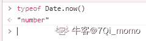

发表于 2020-10-22 15:16:05

* * *

## 27

0xff ^ 33 的结果是：

正确答案: C   你的答案: 空 (错误)

```cpp
220
```

```cpp
221
```

```cpp
222
```

```cpp
223
```

本题知识点

前端工程师 360 公司 Javascript 2018

讨论

[闸总我带你们打](https://www.nowcoder.com/profile/242920704)

0xff  1111 1111  (255)0010 0001(33) 异或操作             1101 1110（222）

发表于 2019-04-12 15:13:07

* * *

[牛客 67088159 号](https://www.nowcoder.com/profile/67088159)

首先 0xff 表示 16 进制的 ff, 即 16*15+16 = 255^: 表示的是异或运算符 33 就是十进制的 33 ，现在将它们两个 2 进制化表达就是：0xff ----> 255 ----> 1111  111133   ----> 33   ----> 0010 0001 这两个进行异或运算后是                              1101 1110 (二进制)二进制的 1101 1110 转换为 10 进制就是：128+64+0+16+8+4+2+0 = 222

发表于 2020-02-22 16:27:13

* * *

[code：0](https://www.nowcoder.com/profile/520385073)

这题难道不是 255-33=222 吗？😂

发表于 2019-10-23 17:15:05

* * *

## 28

在 head 部分可以使用标签（      ）来定义内部样式

正确答案: A   你的答案: 空 (错误)

```cpp
&lt;style&gt;
```

```cpp
&lt;link&gt;
```

```cpp
&lt;span&gt;
```

```cpp
&lt;sample&gt;
```

本题知识点

前端工程师 360 公司 HTML 前端工程师 360 公司 2018

讨论

[ZZQ 冲鸭](https://www.nowcoder.com/profile/764505694)

```cpp
&lt; <
&gt; >
```

发表于 2019-09-21 15:34:22

* * *

[木 201909122345312](https://www.nowcoder.com/profile/611956239)

标签来定义

发表于 2019-09-12 23:51:07

* * *

## 29

以下几种 margin 写法不正确的有（      ）

正确答案: A B C   你的答案: 空 (错误)

```cpp
margin：20px，10px，0；
```

```cpp
margin：10px，10px；
```

```cpp
margin：20px，auto；
```

```cpp
margin：20px  auto；
```

本题知识点

前端工程师 360 公司 2018 CSS

讨论

[AlanLee97](https://www.nowcoder.com/profile/5571214)

每个值之间用空格隔开，而不是逗号

发表于 2020-02-18 11:37:36

* * *

[haha_](https://www.nowcoder.com/profile/7169441)

[margin 相关文档](https://developer.mozilla.org/zh-CN/docs/Web/CSS/margin)

> margin: style /*单值语法 所有边缘 */
> 举例： margin: 1em;
> margin: vertical horizontal /*二值语法 纵向 横向 */
> 举例： margin: 5% auto;
> margin: top horizontal bottom /*三值语法 上 横向 下*/
> 举例： margin: 1em auto 2em;
> margin: top right bottom left /*四值语法 上 右 下 左*/
> 举例： margin: 2px 1em 0 auto;

但这一题我搞不懂这逗号还正确是什么意思？

发表于 2019-01-09 14:14:15

* * *

[你才不是没有故事的女同学](https://www.nowcoder.com/profile/541034791)

这题 abc 不全错吗？

发表于 2019-04-02 20:10:35

* * *

## 30

下列选项中，不属于 CSS3 样式选择器的是（      ）

正确答案: D   你的答案: 空 (错误)

```cpp
empty 选择器
```

```cpp
root 选择器
```

```cpp
target 选择器
```

```cpp
ID 选择器
```

本题知识点

前端工程师 360 公司 2018 CSS

讨论

[cecelia201809081638717](https://www.nowcoder.com/profile/257369095)

ID 选择器在 css1 中就定义了

发表于 2019-04-05 17:27:54

* * *

[前端小菜鸟吖](https://www.nowcoder.com/profile/634425086)

这题目考脑筋急转弯吗

发表于 2020-02-17 22:51:10

* * *

[啊哼哼 992](https://www.nowcoder.com/profile/264537421)

题目问的是 **css3**的样式选择器

发表于 2019-02-12 17:28:26

* * *

## 31

要将下面代码中超链接文本呈现为红色，不可以使用的样式表是（      ）。

```cpp
<div><a href="http://www.w3.org/">链接到 W3C</a></div>
```

正确答案: D   你的答案: 空 (错误)

```cpp
a:link{color:red}
```

```cpp
div a:link{color:red}
```

```cpp
div>a:link{color:red}
```

```cpp
div:first-child{color:red}
```

本题知识点

前端工程师 360 公司 HTML 2018 CSS

讨论

[门头沟传达室值班员](https://www.nowcoder.com/profile/405066145)

1.div:first-child
要满足的条件，首先必须得是 div 元素，还得是第一个子元素，如果不满足 就不会被选中

2.div:first-of-type
要满足的条件，首先必须得是 div 元素，还得是第一个出现的 div 元素，如果不满足 就不会被选中

3.nth-child
a:nth-child(5)： 必须是 a 元素 必须是第五个子元素

4.nth-of-type：
a:nth-of-type:选中所有 a 元素中的第 n 个 a 元素

看来规律就是 child 相关的是绝对位置，type 相关的是相对位置

编辑于 2019-10-02 19:52:47

* * *

[丸子小樱桃](https://www.nowcoder.com/profile/165056237)

```cpp
div:first-child

```
**表示选择属于父元素的第一个子元素的每个 <div> 元素。**
```cpp

```

编辑于 2019-02-18 15:46:28

* * *

[hannah~](https://www.nowcoder.com/profile/609069106)

选项 C  &gt;为转义字符 相当于 >  div>a:link{color:red} div a 和 div > a 的区别:后者指作用到 div 下一级的 a 标签 ，仅一级

发表于 2020-06-23 17:47:42

* * *

## 32

在 Bootstrap 网格系统的工作原理说法不正确的是（      ）

正确答案: C   你的答案: 空 (错误)

```cpp
行必须放置在 .container class 内，以便获得适当的对齐和内边距
```

```cpp
使用行来创建列的水平组
```

```cpp
内容应该放置在行内
```

```cpp
预定义的网格类可用于快速创建网格布局
```

本题知识点

前端工程师 360 公司 2018

讨论

[AmyDeng](https://www.nowcoder.com/profile/302688250)

*   行必须放置在 **.container** class 内，以便获得适当的对齐（alignment）和内边距（padding）。
*   使用行来创建列的水平组。
*   内容应该放置在列内，且唯有列可以是行的直接子元素。
*   预定义的网格类，比如 **.row** 和 **.col-xs-4**，可用于快速创建网格布局。LESS 混合类可用于更多语义布局。
*   列通过内边距（padding）来创建列内容之间的间隙。该内边距是通过 **.rows** 上的外边距（margin）取负，表示第一列和最后一列的行偏移。
*   网格系统是通过指定您想要横跨的十二个可用的列来创建的。例如，要创建三个相等的列，则使用三个 **.col-xs-4**。

发表于 2019-02-18 15:35:45

* * *

## 33

CSS 样式文件的类型不包括（      ）

正确答案: D   你的答案: 空 (错误)

```cpp
内部样式表
```

```cpp
内联样式表
```

```cpp
外部样式表
```

```cpp
包含样式表
```

本题知识点

前端工程师 360 公司 2018 CSS

讨论

[40420190526205496](https://www.nowcoder.com/profile/927915694)

CSS 样式主要包含以下三种类型：

1、行内样式（内嵌样式）：结构的内部，即写在标签内的样式；写在标签的开始部分内部，style 属性当中。

例：<标记 style="样式的属性名 1：样式的属性值 1；属性名 2：属性值 2；......"></标记>

2、内部样式（内联样式）：写在 HTML 页面内部，存放于 head 标记当中，样式写在 style 标记内。

例：<style>选择器 {属性名：属性值；属性名：属性值；......}</style>

3、外部样式（外联样式）：写在 css 文件内。

例：<link type="text/css" rel="stylesheet" href="css/main.css" />

发表于 2019-09-16 23:14:43

* * *

[白~](https://www.nowcoder.com/profile/712961624)

1\. 内联 css 样式，又称行内样式，就是把 CSS 样式直接放在代码行内的标签中，一般都是放入标签的 style 属性中，由于行内样式直接插入标签中，故是最直接的一种方式，同时也是修改最不方便的样式。2. 内部样式表是将 CSS 代码集中写在 HTML 文档的 head 头部标签中，并且用 style 标签定义。3. 外部样式就是把 CSS 代码保存在一个单独的文件中，文件的扩展名为.css ，然后在 HTML 页面中引入这个 CSS 文件即可。

发表于 2022-03-06 16:51:34

* * *

[Hayle](https://www.nowcoder.com/profile/416498138)

内联样式，放在 head 标签里面的 style 标签内部；内部样式，直接跟在元素后面，以 style：“ ...”出现；外部样式，以 link 标签引入

发表于 2021-04-17 15:05:50

* * *

## 34

下列表单布局类型中，（      ）不是 Bootstrap 的

正确答案: D   你的答案: 空 (错误)

```cpp
垂直表单
```

```cpp
水平表单
```

```cpp
内联表单
```

```cpp
自定义表单
```

本题知识点

前端工程师 360 公司 2018 CSS

讨论

[牛客 252140388 号](https://www.nowcoder.com/profile/252140388)

Bootstrap 提供的表单布局：垂直表单、内联表单、水平表单、垂直或基本表单。没有自定义表单。所以选 D

发表于 2020-08-04 13:11:40

* * *

[鋠觞佰钰亰](https://www.nowcoder.com/profile/2814591)

已屏蔽，再也不见！

发表于 2020-12-03 09:40:01

* * *

## 35

根据规范，以下 HTML 和 CSS 代码解析后， container.clientWidth 的值是:

```cpp
<style>
#container {
    width: 200px;
    height: 200px;
    padding: 20px;
    margin: 20px;
    border: solide 10px black;
}
</style>

<div id="container">
content
</div>
```

正确答案: B   你的答案: 空 (错误)

```cpp
200
```

```cpp
240
```

```cpp
280
```

```cpp
300
```

本题知识点

前端工程师 360 公司 HTML 2018 CSS

讨论

[321201910091026686](https://www.nowcoder.com/profile/810777143)

ele.clientWidth = 宽度 + padding

ele.offsetWidth = 宽度 + padding + border

 ele.scrollTop = 被卷去的上侧距离

 ele.scrollHeight = 自身实际的高度（不包括边框）

发表于 2019-12-14 15:35:29

* * *

[浪险](https://www.nowcoder.com/profile/683173318)

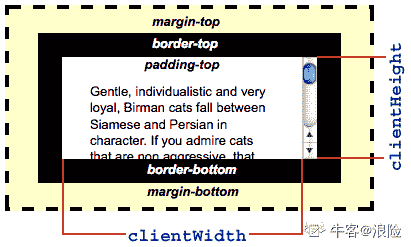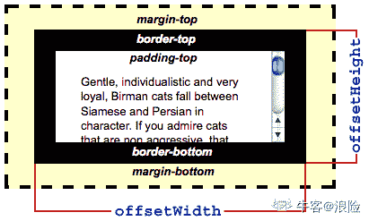
图片来自[`developer.mozilla.org/zh-CN/`](https://developer.mozilla.org/zh-CN/)

发表于 2019-08-23 18:06:22

* * *

[牛客 110612307 号](https://www.nowcoder.com/profile/110612307)

这题加个 260 才算是迷惑答案吧

发表于 2020-09-30 08:57:46

* * *

## 36

下面的颜色代码里，色彩看上去偏绿色的有哪些？

正确答案: A C D   你的答案: 空 (错误)

```cpp
rgb(0, 170, 0);
```

```cpp
hsl(0, 100%, 50%)
```

```cpp
#0a0;
```

```cpp
hsl(120, 50%, 50%);
```

本题知识点

前端工程师 360 公司 2018 CSS

讨论

[懒惰的虫子+](https://www.nowcoder.com/profile/551916855)

颜色也可以使用 hsl() 函数符被定义为色相-饱和度-明度（Hue-saturation-lightness）模式。HSL 相比 RGB 的优点是更加直观：你可以估算你想要的颜色，然后微调。它也更易于创建相称的颜色集合。（通过保持相同的色相并改变明度/暗度和饱和度）。

**色相（Hue）**表示色环（即代表彩虹的一个圆环）的一个角度。这个角度作为一个无单位的 [<number>](https://developer.mozilla.org/zh-CN/docs/Web/CSS/number) 被给出。定义 **red=0=360**，其它颜色分散于圆环，所以 **green=120**, **blue=240**，以此类推。作为一个角度，它隐含像 -120=240 和 480=120 这样的回环。

饱和度和明度由百分数来表示。
100% 是满**饱和度**，而 0% 是一种灰度。
100% **明度**是白色， 0% 明度是黑色，而 50% 明度是“一般的”。

发表于 2019-10-20 18:04:14

* * *

[浪险](https://www.nowcoder.com/profile/683173318)

这就奇怪了，A 和 C 不是一样的么

发表于 2019-08-25 09:23:02

* * *

[haha_](https://www.nowcoder.com/profile/7169441)

[css color 相关文档](https://developer.mozilla.org/zh-CN/docs/Web/CSS/color_value)
rgb 代表红绿蓝，hsl 代表为色相-饱和度-明度（Hue-saturation-lightness）

发表于 2019-01-09 14:35:48

* * *

## 37

要让一个元素不可见且在文档流中不占位，应该使用下面哪个 CSS 规则？

正确答案: A   你的答案: 空 (错误)

```cpp
display: none
```

```cpp
visibility: hidden
```

```cpp
overflow: hidden
```

```cpp
opacity: 0
```

本题知识点

前端工程师 360 公司 HTML 2018 CSS

讨论

[每天都要努力呀！](https://www.nowcoder.com/profile/956413803)

display:none 和 visibility:hidden 都能把网页上某个元素隐藏起来，但是两者有区别：一、display:none1、不为被隐藏的对象保留其物理空间。html 对象在页面上彻底消失（display:none 会让元素完全从渲染树中消失，渲染的时候不占据任何空间）。2、是非继承属性，子孙节点消失由于元素从渲染树消失造成的，通过修改子孙节点，属性无法显示。3、修改常规文档流元素的 display 通常会造成文档的重排（reflow）重绘（repaint）。二、visibility:hidden1、为隐藏的对象保留其物理空间，html 对象仅仅是在视觉上看不见（完全透明），而它所占据的空间位置仍然存在（visibility:hidden 不会让元素从渲染树中消失，渲染树元素继续占据空间，只是内容不可见）。2、是继承，子孙节点消失由于继承了 hidden，通过 visibility:visible 可以让子孙节点显示。3、修改 visibility 属性只会造成文档的重绘（repaint）。三、关于什么是重排重绘，请参考链接：[`blog.sina.com.cn/s/blog_c112a2980102xmf6.html`](http://blog.sina.com.cn/s/blog_c112a2980102xmf6.html)。

发表于 2019-08-26 10:26:23

* * *

[丘丘 _Chen](https://www.nowcoder.com/profile/459505578)

display:none 不可见，不占据文本流位置，事件不可触发 overflow:hidden 不可见，占据文本流位置，事件不可触发 opacity:0 不可见，占据文本流位置，事件可以触发

发表于 2021-10-15 11:31:21

* * *

[迷途小学生](https://www.nowcoder.com/profile/246775)

display:none 不会占位置 opacity:0 和 visibility: hidden 都会占据原来的位置

发表于 2021-08-10 14:46:12

* * *

## 38

下面关于 html5 的媒体标签说法错误的是（      ）

正确答案: D   你的答案: 空 (错误)

```cpp
audio 用来嵌入音频，video 用来嵌入视频
```

```cpp
embed 用来定义嵌入的内容
```

```cpp
source 对于定义多个数据源
```

```cpp
track 标签为媒介规定外部文本轨道。用于规定字幕文件或其他包含文本的文件，当媒介播放时，这些文件是不可见的。
```

本题知识点

前端工程师 360 公司 HTML 前端工程师 360 公司 2018

讨论

[南乔可休](https://www.nowcoder.com/profile/347632879)

<track> 标签为诸如 video 元素之类的媒介规定外部文本轨道。

用于规定字幕文件或其他包含文本的文件，当媒介播放时，这些文件是可见的。

发表于 2019-03-23 10:27:43

* * *

## 39

```cpp
<input type="date" name="bday">
<input type="datetime-local" name="bdaytime">
```

关于上面两行代码显示结果说法错误的是（      ）

正确答案: B   你的答案: 空 (错误)

```cpp
两者都可以用来绘制日历
```

```cpp
后者可以显示本地时间，且时间不可以修改
```

```cpp
日历的样式可以通过 CSS 进行修改
```

```cpp
日历标签可以应用于目前主流浏览器
```

本题知识点

前端工程师 360 公司 HTML 2018 CSS

讨论

[牛客 398854146 号](https://www.nowcoder.com/profile/398854146)

试了下 发现能修改时间 还是自己阅历少了啊

发表于 2020-03-21 14:51:35

* * *

[元无心](https://www.nowcoder.com/profile/224444564)

根据 MDN 上目前的数据，Chrome、Edge 和 Opera 都是兼容的。

发表于 2020-10-24 23:00:46

* * *

[牛客 797982820 号](https://www.nowcoder.com/profile/797982820)

360 极速浏览器也支持，这题过时了，18 年的题

发表于 2020-07-30 08:58:51

* * *

## 40

哪个 HTML5 代码提供了一种验证数字输入的值在 1 到 100 之间

正确答案: B   你的答案: 空 (错误)

```cpp
<input type="number" low="1" high="100">
```

```cpp
<input type="number" min="1" max="100">
```

```cpp
<input type="num" min="1" max="100">
```

```cpp
<input type="positive" limit="100">
```

本题知识点

前端工程师 360 公司 HTML 2018

讨论

[轻影](https://www.nowcoder.com/profile/4655257)

为什么题目中会出现字符实体

发表于 2019-11-29 10:36:31

* * *

[虹虹爱慕斯](https://www.nowcoder.com/profile/6253864)

html5 之后在 input 框类型中新增了多个内容，比如 number 和 range

```cpp
<input type='number' min='1' max='100'>
<input type='range' min='1' max='100'>
```

发表于 2019-08-29 14:57:31

* * *

[猫猫儿](https://www.nowcoder.com/profile/862913360)

html5 之后在 input 框类型中新增了多个内容，比如 number 和 range

发表于 2019-11-08 08:38:59

* * *

## 41

假链接中我们通常在 a 标签的 href 中添加什么能使得页面不跳转（）

正确答案: C   你的答案: 空 (错误)

```cpp
#
```

```cpp
##
```

```cpp
javascript:；
```

```cpp
直接为空，无需添加
```

本题知识点

前端工程师 360 公司 HTML 2018

讨论

[很累却不敢停下](https://www.nowcoder.com/profile/364243461)

页面不跳转的标准应该是点击链接后，链接的效果(样式)没有发生变化。即 a:visited 、a:hover 、a:active 的样式不起作用。经过测试，只有 C 选项满足上述要求。

```cpp
<!DOCTYPE html>
<html lang="en">
<head>
    <meta charset="UTF-8">
    <title>Title</title>
</head>
<body>
    <a href="#">跳转 A——#</a><br/>
    <a href="##">跳转 B——##</a><br/>
    <a href="javascript:;">跳转 C——javascript:;</a><br/>
    <a href="">跳转 D——直接为空</a>
</body>
</html>

```


发表于 2020-06-05 23:23:01

* * *

[苏沐琳](https://www.nowcoder.com/profile/153679231)

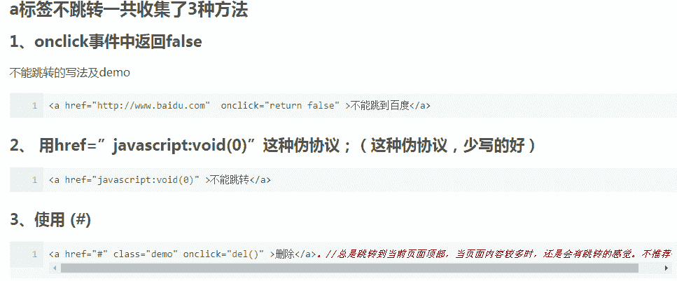

发表于 2018-12-21 18:04:31

* * *

[南城巷陌](https://www.nowcoder.com/profile/195735343)

#，有跳转，只不过是跳转到当前页面？

发表于 2021-06-28 23:13:46

* * *

## 42

当使用地图进行图像搜索时，可以把一幅图片从电脑桌面拖放到地图页面的输入框里，这是使用了 HTML5 的（）API 实现的。

正确答案: B   你的答案: 空 (错误)

```cpp
history
```

```cpp
File
```

```cpp
system
```

```cpp
images
```

本题知识点

前端工程师 360 公司 HTML 2018

讨论

[Kim_Yang](https://www.nowcoder.com/profile/7969867)

A：DOM [window](https://developer.mozilla.org/zh-CN/docs/Web/API/Window) 对象通过 [history](https://developer.mozilla.org/zh-CN/docs/Web/API/Window/history) 对象提供了对浏览器的会话历史的访问，它暴露了很多有用的方法和属性，允许你在用户浏览历史中向前和向后跳转，同时——从 HTML5 开始——提供了对 history 栈中内容的操作。详细 API 解读可查看：[`developer.mozilla.org/zh-CN/docs/Web/API/History_API`](https://developer.mozilla.org/zh-CN/docs/Web/API/History_API)

B：HTML 5 DOM 的 File API 允许 Web 用户选取本地端的文件并读取文件，可以通过选取动作完成，也可通过拖拽动作完成，API 具体使用信息可查看如下链接：[`developer.mozilla.org/zh-TW/docs/Web/API/File/Using_files_from_web_applications`](https://developer.mozilla.org/zh-TW/docs/Web/API/File/Using_files_from_web_applications)
C：根据我自己的搜索，并没有查询到有 system API，只查询到 FileSystem API ，它与选项 B 应该指的是同一个 API，如果你知道这个 system API ，期待你回复告知我一下，感谢

D：指的就是我们常见的  标签吧，就不详述了，可查看：[`developer.mozilla.org/zh-CN/docs/Web/HTML/Element/img`](https://developer.mozilla.org/zh-CN/docs/Web/HTML/Element/img)

发表于 2021-01-10 16:20:06

* * *

[祯民](https://www.nowcoder.com/profile/463267767)

文件（**File**）接口提供有关文件的信息，并允许网页中的 JavaScript 访问其内容。

通常情况下，File 对象是来自用户在一个 [<input>](https://developer.mozilla.org/zh-CN/docs/Web/HTML/Element/input) 元素上选择文件后返回的 [FileList](https://developer.mozilla.org/zh-CN/docs/Web/API/FileList) 对象,也可以是来自由拖放操作生成的 [DataTransfer](https://developer.mozilla.org/zh-CN/docs/Web/API/DataTransfer) 对象，或者来自 [HTMLCanvasElement](https://developer.mozilla.org/zh-CN/docs/Web/API/HTMLCanvasElement) 上的 mozGetAsFile() API。

发表于 2019-09-28 10:48:40

* * *

[终于可以改名啦😭](https://www.nowcoder.com/profile/564248921)

啦啦

发表于 2021-08-23 11:15:38

* * *

## 43

拖放是 HTML5 标准的组成部分，若想要把 drag1 图片放入 div1 块中，拖放方法如下：

```cpp
function allowDrop(ev)
{
ev.preventDefault();
}
function drag(ev)
{
ev.dataTransfer.setData("Text",ev.target.id);
}
function drop(ev)
{
ev.preventDefault();
var data=ev.dataTransfer.getData("Text");
ev.target.appendChild(document.getElementById(data));
} 
```

则，如下 HTML 代码正确的是（）

正确答案: C   你的答案: 空 (错误)

```cpp
<div id="div1" ondragstart="drag(event)" ondragover="allowDrop(event)"></div> 
```

```cpp
<div id="div1" ondrop="drop(event)" ondragover="allowDrop(event)"></div> 
```

```cpp
<div id="div1" ondrop="drop(event)" ondragover="allowDrop(event)"></div> 
```

```cpp
<div id="div1" ondragstart="drag(event)" ondragover="allowDrop(event)"></div> 
```

本题知识点

前端工程师 360 公司 HTML 2018

讨论

[西西柚子木](https://www.nowcoder.com/profile/57392610)

**拖放（drag）放（drop）是 HTML5 标准的组成部分。**

1.要使一个元素可以拖动，需要设置 draggable 属性为 true。

    题目中要拖动图片，img 的这个属性就要设置为 true ，所以 A B  排除。

2.拖放事件发生的顺序：   

2.1 拖动事件

拖动某元素时，依次会触发如下事件：dragstart -> drag -> dragend

**dragstart ： **按下鼠标键并开始移动鼠标时，会在被拖动元素上触发 dragstart 事件，此时光标变成“不能放”符号（圆环中有一条反斜线），表示不能把元素放到自己上面。

**drag ： **触发 dragstart 事件后，随机会触发 drag 事件，而且在元素被拖动期间持续触发该事件。

**dragend： **当拖动停止时（无论是否吧元素放到了有效的放置目标，还是放到了无效放置目标上），会触发 dragend 事件。

2.2 放置事件

放置某元素时，依次会触发如下事件：dragenter -> dragover ->  dragleave 或 drop**dragenter ： **只要有元素被拖动到放置目标，就会触发 dragenter 事件。

**dragover ： **dragenter 事件紧随其后的是 dragover 事件，而且在被拖动的元素还在放置目标的范围内移动时，就会触发该事件。

**dragleave 或 drop： **如果元素被拖出了放置目标，dragover 事件不再发生，但会触发 dragleave 事件。如果元素被放置到了放置目标中，则会触发 drop 事件。

3.自定义放置目标

在拖动元素经过某些无效放置目标时，可以看到一种特殊的光标（圆环中有一条反斜线），表示不能放置。虽然所有元素都支持放置目标事件，但这些元素默认是不允许放置的。如果拖动元素经过不允许放置的元素，无论如何操作都不会发生 drop 事件。所以要把元素变成有效的放置目标，就需要在 dragenter 和 dragover 事件处理函数中阻止默认行为。

4. dataTransfer 对象

dataTransfer 对象是事件对象的一个属性，用于从被拖动元素向放置目标传递字符串格式的数据。因为是事件对象属性，所以只能在拖放事件的事件处理程序中访问 dataTransfer 对象。读取不到数据，则 dataTransfer 对象可能已经被销毁。

4.1 dataTransfer 的方法

dataTransfer 对象主要有两个方法：getData() 和 setData()，用来取值和保存值。

setData() 方法的第一个参数，也是 getData() 方法唯一的一个参数，是一个字符串，表示保存的数据类型。IE 只定义了 **"text" 或 "URL" 两种有效的数据类型， 而 HTML5 对此加以扩展，允许指定各种 MIME 类型 。考虑向后兼容，HTML5 也支持这两种类型，但这两种类型会被映射为 "text/plain" 和 "text/uri-list"。**

```cpp
//设置和接收文本数据
event.dataTransfer.setData('text', 'some text');
var text = event.dataTransfer.getData('text');

//设置和接收 URL
event.dataTransfer.setData('URL', 'http://www.xxx.com');
var url = event.dataTransfer.getData('URL');
```

实际上，dataTransfer 对象可以为每种 MIME 类型都保存一个值，即可以同时保存一段文本和一个 URL。

但是数据保存为文本或 URL 是有区别的，如果数据保存为文本不会有任何特殊处理，但是数据保存为 URL，浏览器会当成网页中的链接，如果放置到另一个浏览器窗口，浏览器会打开该 URL，所以不希望打开链接需要阻止默认处理。

**代码解读**

```cpp
function allowDrop(ev){
    ev.preventDefault();//阻止默认不允许放置
}
function drag(ev){
    ev.dataTransfer.setData("Text",ev.target.id);//获取被拖动元素的 id
}
function drop(ev){
    ev.preventDefault();//阻止默认数据处理
    var data=ev.dataTransfer.getData("Text");//获取数据
    ev.target.appendChild(document.getElementById(data));//被放置元素添加子元素
} 
```

发表于 2020-09-10 16:35:24

* * *

[不完美卡卡](https://www.nowcoder.com/profile/4516985)

哈哈，不想把实体符号转成标签，不做了

发表于 2019-08-23 10:44:06

* * *

[翻白草](https://www.nowcoder.com/profile/104439588)

我就知道是 360，我佛了

发表于 2019-09-18 12:10:29

* * *

## 44

以下描述，哪些是“反语义化”的？ 

正确答案: B   你的答案: 空 (错误)

```cpp
Font Awesome 网站用&lt;i&gt;标签来定义矢量小图标
```

```cpp
<b>重要通知：</b>今天下午<font color="red">2 点到 5 点半</font>小区停电
```

```cpp
<ul><li>旧功能</li><li>新功能</li></ul>
```

```cpp
<label for="test">测试</label><input id="test" name="test" type="radio"/>
```

本题知识点

前端工程师 360 公司 HTML 2018

讨论

[Xinchang_WANG](https://www.nowcoder.com/profile/133103886)

看着一堆的 html 转义字符，默默为这个题难度打了 5 星。。。

发表于 2020-03-01 15:23:58

* * *

[小🐮客](https://www.nowcoder.com/profile/990177409)

答案：BB：

```cpp
<b>重要通知</b>
<font color="red">2 点到 5 点半</font>小区停电
```

其中 **font** 标签，存在反语义（ font 解释为文字，但 ”文字“ 意思太泛了，而是应根据使用环境选择其他标签。如标题 <h1> ~ <h6> <p>等标签）在 HTML 4.01 中，不被赞成使用；在 HTML 5 中，不支持该元素，建议使用 CSS 向元素添加样式 

发表于 2019-09-04 13:09:40

* * *

[ngchikin](https://www.nowcoder.com/profile/495650133)

看到这道题就想反语义化是啥,想不明白,就想到 h5 什么语义化是吧,  然后看到 font 标签, 在 h5 已经不支持了,那就是反语义化, CD 选项都不用看了

编辑于 2020-09-29 18:30:59

* * *

## 45

以下 HTML 文本中，内容 “test” 的字体大小是：