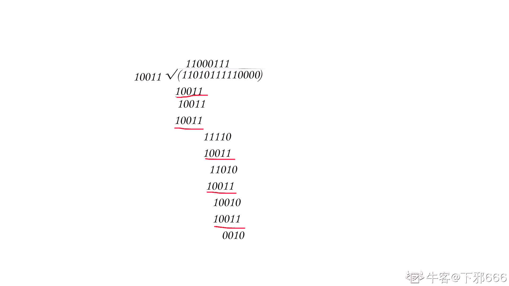

# 三百六十、公司-2018 春招笔试-测试工程师客观题合集

## 1

下列说法中正确的是（      ）

正确答案: A   你的答案: 空 (错误)

```cpp
冒泡排序法的平均时间复杂度为 O(n²)
```

```cpp
二分法的平均时间复杂度度是 O（n）
```

```cpp
m 个并列循环的时间复杂度为 O（mn）
```

```cpp
快速排序法的时间复杂度一定优于冒泡排序法
```

本题知识点

测试工程师 360 公司 复杂度 测试工程师 360 公司 2018

讨论

[Mastema](https://www.nowcoder.com/profile/395235430)

？？？

发表于 2019-09-03 22:04:50

* * *

## 2

关键字序列为{12，11，19，23，1，6，10},哈希函数为 H(key)=key MOD 11,用链地址法构造哈希表,哈希地址为 1 的链中有（      ）个记录（      ）

正确答案: D   你的答案: 空 (错误)

```cpp
7
```

```cpp
5
```

```cpp
4
```

```cpp
3
```

本题知识点

测试工程师 360 公司 链表 *测试工程师 360 公司 2018* *讨论

[不要问，问就是冲](https://www.nowcoder.com/profile/648736104)

12％11=1

发表于 2019-08-31 09:03:40

* * *

[mimi 万万万](https://www.nowcoder.com/profile/484809512)

？

发表于 2019-08-21 16:52:01

* * *

## 3

下面关于动态规划说法正确的是

正确答案: A   你的答案: 空 (错误)

```cpp
他是利用子结构，进行自底而上的算法设计
```

```cpp
他需要后来多次计算的问题进行缓存，减少重复子问题的计算
```

```cpp
他所求问题的整体最优解可以通过一系列局部最优的选择
```

```cpp
他将分解后的子问题看成相互独立的.
```

本题知识点

测试工程师 360 公司 动态规划 测试工程师 360 公司 2018

## 4

下列关于排序算法的描述错误的是

正确答案: B   你的答案: 空 (错误)

```cpp
在待排序的记录集中，存在多个具有相同键值的记录，若经过排序，这些记录的相对次序仍然保持不变，称这种排序为稳定排序
```

```cpp
二叉查找树的查找效率与二叉树的树型有关，在节点太复杂时其查找效率最低
```

```cpp
下列排序算法中，希尔排序在某趟排序结束后不一定能选出一个元素放到其最终位置上。
```

```cpp
在下列排序方法中,插入排序方法可能出现这种情况:在最后一趟开始之前,所有的元素都不在其最终应在的正确位置上
```

本题知识点

测试工程师 360 公司 排序 *测试工程师 360 公司 2018* *讨论

[HeiMaau](https://www.nowcoder.com/profile/435801482)

B 应该是跟树的高度/深度有关？

发表于 2019-09-23 13:15:53

* * *

## 5

请指出以下代码段使用了何种算法

```cpp
public void func(int[] arr1, int k, int m,int[] arr2) { 
arr2[0] = 0; 
for (int i = 1; i <= m; i++) { 
int min = i; 
for (int j = 0; j < k; j++) { 
if (arr1[j] <= i) { 
int temp = arr2[i - arr1[j]] + 1; 
if (temp < min) { 
min = temp; 
} 
} 
} 
arr2[i] = min; 
} 
}
```

正确答案: B   你的答案: 空 (错误)

```cpp
分治算法
```

```cpp
动态规划
```

```cpp
贪心算法
```

```cpp
回溯算法
```

本题知识点

测试工程师 360 公司 动态规划 2018

## 6

已知如下递归代码用于求解图的 m 着色问题：
#define N 10
int a[N+1][N+1]; //存储图
int x[N+1];//记录颜色
int sum=0;//保存可着色方案数

void backtrace(int t,int m)
{
int i;
if(t>N)//搜索至叶节点
{
sum++;
printf("第%d 种方案：\n",sum);
for(i=1;i<=N;i++)
printf("%d ",x[i]);
printf("\n");
}
else
{
for(i=1;i<=m;i++) //逐个判断每种颜色
{
if(check(t,i))
{   x[t]=i;
backtrace(t+1,m);
}
}
}
}
其中 check()函数用于检测某个节点颜色是否合法，以下 check()函数正确的是：

正确答案: D   你的答案: 空 (错误)

```cpp
int check(int t,int i)//检测函数 {     int j;     for(j=1;j&lt;t;j++)     {         if(a[t][j]==1&amp;&amp;x[i]==j)                  return 0;            }     return 1; }
```

```cpp
int check(int t,int i)//检测函数 {     int j;     for(j=1;j&lt;t;j++)     {         if(a[t][j]==1||x[i]==j)                  return 0;            }     return 1; }
```

```cpp
int check(int t,int i)//检测函数 {     int j;     for(j=1;j&lt;t;j++)     {         if(a[t][j]==1||x[j]==i)                  return 0;            }     return 1; }
```

```cpp
int check(int t,int i)//检测函数 {     int j;     for(j=1;j&lt;t;j++)     {         if(a[t][j]==1&amp;&amp;x[j]==i)                  return 0;            }     return 1; }
```

本题知识点

测试工程师 360 公司 递归 测试工程师 360 公司 2018

讨论

[here6](https://www.nowcoder.com/profile/787462501)

我靠，这道题简单到没人讲解思路的嘛……

发表于 2019-10-28 14:55:39

* * *

## 7

一个线性序列（30，14，40，63，22，5），假定采用散列函数 Hash(key)=key%7 来计算散列地址，将其散列存储在 A[0~6]中，采用链地址法解决冲突。若查找每个元素的概率相同，则查找成功的平均查找长度是（      ）。

正确答案: A   你的答案: 空 (错误)

```cpp
4/3
```

```cpp
1
```

```cpp
3/2
```

```cpp
5/3
```

本题知识点

查找 *哈希* **讨论

[wuyaopray](https://www.nowcoder.com/profile/692494285)

> 平均需要和待查找值比较的关键字次数称为平均查找长度

关键字比较一次则长度加一。这里查找 30，14，40，22 关键字比较次数是 1； 查找 63， 5 关键字比较次数是 2，所以平均长度应该是(1 * 4 + 2 * 2) / 6 = 4 / 3

发表于 2019-10-15 15:40:39

* * *

[牛客 367517028 号](https://www.nowcoder.com/profile/367517028)

30，14，40，63，22，5 %7=2 0 5 0 1 5 hash 表是以数组加链表方式存储，两个 0 和两个 5key 相同，所以存在链表第二个节点。 所以（1*4+2*2)/6=4/3

发表于 2021-04-08 08:15:02

* * *

[想找到工作的菜狗](https://www.nowcoder.com/profile/987354021)

采用的是链地址处理的方法啊

发表于 2021-09-16 09:31:43

* * *

## 8

下列程序段的时间复杂度是（    ）

```cpp
count = 1；
for(k=1;k<2n;k*=2)
for(i=1;i<4n;i+=2)
count++;
```

正确答案: C   你的答案: 空 (错误)

```cpp
O(n2)
```

```cpp
O(8n2)
```

```cpp
O(nlog2n)
```

```cpp
O(n)
```

本题知识点

测试工程师 360 公司 复杂度 测试工程师 360 公司 2018

讨论

[悦千言](https://www.nowcoder.com/profile/320259883)

外循环，2 的 x 次方=n，x=log2n；内循环，时间复杂度为 n；最终时间复杂度为 nlog2n。

发表于 2019-09-23 13:01:39

* * *

## 9

递归公式


的时间复杂度为(    )。

正确答案: D   你的答案: 空 (错误)

```cpp
O(n)
```

```cpp
O(logn)
```

```cpp
O(nlogn)
```

```cpp
O(n2)
```

本题知识点

测试工程师 360 公司 复杂度 测试工程师 360 公司 2018

讨论

[Levigod](https://www.nowcoder.com/profile/258164976)

利用 Master 公式：

1.   时，时间复杂度
2.   时，时间复杂度
3.   时，时间复杂度
    代入公式本题选

发表于 2019-09-12 16:13:07

* * *

## 10

有关贪心法叙述正确的是（      ）

正确答案: A   你的答案: 空 (错误)

```cpp
采用局部最优策略
```

```cpp
采用全局最优策略
```

```cpp
在贪心法中采用逐步构造最优解的方法
```

```cpp
把问题分解为简单的问题求解
```

本题知识点

测试工程师 360 公司 贪心 测试工程师 360 公司 2018

## 11

在选择分治法解决问题时，应考虑待解决问题应具有哪些特征（      ）

正确答案: A   你的答案: 空 (错误)

```cpp
待解决问题规模缩小到一定程度后可以容易解决
```

```cpp
待解决问题应可以分解为若干个规模较小的相同问题，且子问题应可直接求解。
```

```cpp
各子问题之间是相互独立的
```

```cpp
分解后的子问题的解可以合并为源问题的解
```

本题知识点

测试工程师 360 公司 分治 测试工程师 360 公司 2018

讨论

[Tiamo_z](https://www.nowcoder.com/profile/279884750)

我觉得这道题是不是有问题

发表于 2019-09-09 11:57:55

* * *

## 12

在有序表中，关于斐波那契查找和折半查找说法错误的是（）

正确答案: A B C   你的答案: 空 (错误)

```cpp
就平均性能而言，斐波那契查找的平均性能比折半查找差
```

```cpp
只有有序表中元素个数 n 等于某个斐波那契数时才能用斐波那契查找算法
```

```cpp
在最坏情况下，斐波那契查找的性能比折半查找好
```

```cpp
折半查找时间复杂度为 O(log2n)
```

本题知识点

测试工程师 360 公司 查找 *测试工程师 360 公司 2018* *讨论

[UnnnnnnU](https://www.nowcoder.com/profile/641374590)

我认为这道题目说错了 因该是问的是正确的是: D 首先 A：平均性能是斐波纳切黄金分割查找更好 B：有序表长度不需要一定要是一个斐波纳切数才行，是可以补齐成为一个斐波纳切数的  补最大的数目直到长度是斐波纳切数 C：最坏情况下斐波纳切查找性能比折半是要差的  这些在书上都有的 这是我认为的

发表于 2019-08-29 20:10:44

* * *

## 13

下面说法错误的是（）

正确答案: B C D   你的答案: 空 (错误)

```cpp
快速排序算法平均速度最快
```

```cpp
堆排序在每一趟排序过程中，都会有一个元素被放置在最终位置上
```

```cpp
在 10000 个无序的元素中查找最大的 10 个元素，使用快速排序最快
```

```cpp
插入排序是一种稳定的排序算法
```

本题知识点

测试工程师 360 公司 排序 *测试工程师 360 公司 2018* *讨论

[潇元紫](https://www.nowcoder.com/profile/799021943)

我服了这题，老是出，老是答案不一，而且还是不对的答案

发表于 2019-10-24 07:36:44

* * *

## 14

对于函数 y = ax² + bx + c,(a > 0),需要找出 y 的小值，精确到小数点后 6 位。下列选项中最有效的方法是（）。

正确答案: D   你的答案: 空 (错误)

```cpp
枚举
```

```cpp
二分查找
```

```cpp
三分查找
```

```cpp
推公式
```

本题知识点

测试工程师 360 公司 测试工程师 360 公司 测试工程师 360 公司 测试工程师 360 公司 测试工程师 360 公司 测试工程师 360 公司 2018

## 15

设哈希表长 m=13,哈希函数 H(key)=key MOD 11。表中已有 4 个节点:addr(16)=5,addr(28)=6,addr(84)=7,addr(19)=8，其余地址为空,如用线性探测再散列处理冲突，则关键字为 38 的地址为（      ）

正确答案: D   你的答案: 空 (错误)

```cpp
6
```

```cpp
7
```

```cpp
8
```

```cpp
9
```

本题知识点

测试工程师 360 公司 哈希 *2018* *讨论

[Daryl 丶 PP](https://www.nowcoder.com/profile/251005461)

线性探测再散列：

> 需要搜索或加入一个哈希表项时，使用哈希函数计算哈希值：
> 

> 一旦发生冲突，在表中顺次向后寻找“下一个”空值 Hi 的公式为：
> 

**题中 key=38，H(38)=38mod11=5 但与 addr(16)冲突。线性散列 H(38)=(5+1)mod11=6 但与 addr(28)冲突。继续线性散列 H(38)=(6+1)mod11=7 但与 addr(84)冲突。直到 H(38)=9mod11=9 成功**

发表于 2020-01-26 14:41:58

* * *

[tommyMusk](https://www.nowcoder.com/profile/371756319)

参考[`www.jianshu.com/p/98466542ef5b?utm_campaign=maleskine&utm_content=note&utm_medium=seo_notes&utm_source=recommendation`](https://www.jianshu.com/p/98466542ef5b?utm_campaign=maleskine&utm_content=note&utm_medium=seo_notes&utm_source=recommendation)

发表于 2022-03-20 09:57:36

* * *

## 16

```cpp
#include<bits/stdc++.h>
using namespace std;
int main(){
stack<int>st;
int pos = 1;
while(pos <= 3){
st.push(pos++);
}
cout<<st.top();
while(pos <= 5){
st.push(pos++);
}
while(!st.empty()){
cout<<st.top();
st.pop();
}
return 0;
}
```

上述程序的输出为(      )

正确答案: B   你的答案: 空 (错误)

```cpp
35421
```

```cpp
354321
```

```cpp
12453
```

```cpp
123453
```

本题知识点

测试工程师 360 公司 C++ 测试工程师 360 公司 2018

讨论

[小傻家大傻](https://www.nowcoder.com/profile/323351586)

第一次放入没释放

发表于 2019-08-27 16:44:52

* * *

[wmiao](https://www.nowcoder.com/profile/491691879)

第一次入栈的是 1 2 3，打印栈顶元素 3，第二次入栈 4 5，打印栈顶元素，出栈栈顶元素，第二次打印的是 5 4 3 2 1，所以最终结果为 3 5 4 3 2 1

发表于 2019-09-18 20:03:39

* * *

## 17

```cpp
#include<bits/stdc++.h>
using namespace std;
int gcd(int a, int b){
return b == 0 ? a : gcd(b, a % b);
}
struct stsort{
bool operator () (const int a, const int b) const{
if(gcd(30, a) < gcd(30, b)){
return 1;
}
else if(gcd(30, a) == gcd(30, b)){
return a < b;
}
else return 0;
}
};
int main(){
int n = 5;
priority_queue<int, vector<int>, stsort>q;
for(int i = 1; i <= n; ++i){
q.push(i);
}
for(int i = 1; i <= n; ++i){
printf("%d", q.top());
q.pop();
}
return 0;
}
```

程序的输出为( )

正确答案: A   你的答案: 空 (错误)

```cpp
53421
```

```cpp
53241
```

```cpp
12435
```

```cpp
14235
```

本题知识点

测试工程师 360 公司 C++ 测试工程师 360 公司 2018

讨论

[在水一方有人占用？！](https://www.nowcoder.com/profile/829529129)

光是语法都没懂？

发表于 2019-10-25 18:48:59

* * *

[王泽赢](https://www.nowcoder.com/profile/2502938)

就是按与 30 的最大公约数从大到小排序，公约数一样的大数的在前

发表于 2019-10-24 03:47:02

* * *

[路希成](https://www.nowcoder.com/profile/97095006)

有会的吗？？?给个解析

发表于 2019-09-21 14:25:39

* * *

## 18

```cpp
#include<bits/stdc++.h>
using namespace std;
int main(){
int n = 5;
vector<int>a;
set<int>b;
for(int i = 1; i <= n; ++i){
a.push_back(i);
b.insert(i);
}
for(int i = 1; i <= n; ++i){
a.push_back(i);
b.insert(i);
}
cout<<a.size()<<b.size()<<endl;
return 0;
}
```

程序的输出为( )

正确答案: A   你的答案: 空 (错误)

```cpp
105
```

```cpp
510
```

```cpp
1010
```

```cpp
55
```

本题知识点

测试工程师 360 公司 C++ 测试工程师 360 公司 2018

讨论

[横扫 offer~](https://www.nowcoder.com/profile/979643583)

向 set 中添加重复元素会覆盖掉原来的值

发表于 2019-08-13 16:19:40

* * *

## 19

```cpp
#include<bits/stdc++.h>
using namespace std;
vector<int>g[10];
int ans = 0;
void dfs(int x){
if(g[x].size() == 0){
ans++;
return;
}
for(int i = 0; i < g[x].size(); ++i){
dfs(g[x][i]);
}
}
int main(){
int n, x;
scanf("%d", &n);
for(int i = 2; i <= n; ++i){
scanf("%d", &x);
g[x].push_back(i);
}
dfs(1);
cout<<ans<<endl;
return 0;
}
```

上述程序的输入为：
9
1 2 2 1 5 6 6 6
则输出为( )

正确答案: B   你的答案: 空 (错误)

```cpp
4
```

```cpp
5
```

```cpp
6
```

```cpp
7
```

本题知识点

测试工程师 360 公司 C++ 测试工程师 360 公司 2018

讨论

[北狗醉光阴](https://www.nowcoder.com/profile/8498264)

g 是一个数组 vector。ans 其实记录的是 g[x].vector 的长度为 0 的个数。main 函数中主要是给 g 赋值。赋值结果如下：g[1] :（这个 vector 里面有值）2, 5g[2] : 3, 4g[5] : 6g[6] : 7, 8, 9dfs 函数中的 for 循环其实就是将每个 g[x]中的 vector 中的值赋给 dfs 自己（的形参 int x）。main 函数中的 dfs(1)为递归起点。于是：由语句 dfs(1)， 然后因为 g[1]的 vector 里面有值 2 和 5，所以 g[1].size = 2,不等于 0，不满足 if 条件，ans 不自增。 然后进入 for 循环。因为 g[1][0] = 2,于是执行 dfs(2) .由 dfs(2),然后因为 g[2]的 vector 里面有值 3 和 4，所以 g[2].size = 2,不等于 0，不满足 if 条件，ans 不自增。然后因为 g[2][0] = 3,于是执行 dfs(3).由 dfs(3),然后因为 g[3]的 vector 里面没有值，所以 g[3].size = 0，满足条件，ans 自增。然后就可以总结出前面的结论：dfs 函数中的 for 循环其实就是将每个 g[x]中的 vector 中的值赋给 dfs 自己（的形参 int x），ans 其实记录的是 g[x].vector 的长度为 0 的个数。然后就可以发现 gx 中 vector 大小为 0 的只有（在 main 函数中未赋值的）g[3],g[4],g[7],[8],g[9],所以 ans=5.以上。（也不知道自己有没有表达清楚。。。orz）

发表于 2019-09-02 09:33:28

* * *

[牛客 3478734 号](https://www.nowcoder.com/profile/3478734)


发表于 2019-09-12 17:31:35

* * *

[在水一方有人占用？！](https://www.nowcoder.com/profile/829529129)

求解

发表于 2019-09-01 21:55:01

* * *

## 20

用(a,b,c)表示节点 a,b 之间有一条权值为 c 的无向边。对于图(1,2,3),(1,3,4),(1,5,1),(2,3,4),(2,4,6),(2,5,2),(3,5,1)。最小生成树的权值和为(        )

正确答案: B   你的答案: 空 (错误)

```cpp
9
```

```cpp
10
```

```cpp
11
```

```cpp
12
```

本题知识点

测试工程师 360 公司 树 测试工程师 360 公司 2018

讨论

[夕阳深秋雨](https://www.nowcoder.com/profile/889913379)

依据权值从小到大来依次连接边，注意不要成环。要成环的边放弃。最后把用到的权加起来。

发表于 2019-10-18 10:26:32

* * *

[蒙牛麦片](https://www.nowcoder.com/profile/43911588)

依照题意，画出权图，根据 prim 算法，先加入结点 1，最小的边为（1，5，1）将这条边加入，再考虑边（3，5，1），再考虑边（2，5，2），再考虑边（2，4，6）总的权值为 1+1+2+6=10

发表于 2019-10-12 12:50:48

* * *

[牛客 651594710 号](https://www.nowcoder.com/profile/651594710)

我不会

发表于 2019-09-06 12:31:48

* * *

## 21

一棵二叉树有 100 个节点，若根节点深度为 1，树深最大为(       )，最小为(       )

正确答案: B   你的答案: 空 (错误)

```cpp
100 2
```

```cpp
100 7
```

```cpp
7 6
```

```cpp
7 2
```

本题知识点

测试工程师 360 公司 树 测试工程师 360 公司 2018

讨论

[编程小海浪](https://www.nowcoder.com/profile/797024057)

最大就是退化树，排成一条链。最小是看 2 的几次方大于 100,2⁷=128>100.故选 B

发表于 2019-10-10 17:27:24

* * *

## 22

在一棵度为 5 的树 T 中，若 14 个度为 5 的结点，15 个度为 4 的结点，14 个度为 3 的结点，5 个度为 2 的结点，10 个度为 1 的结点，则树 T 的叶节点个数是（     ）

正确答案: D   你的答案: 空 (错误)

```cpp
72
```

```cpp
102
```

```cpp
130
```

```cpp
135
```

本题知识点

测试工程师 360 公司 树 2018

讨论

[why223](https://www.nowcoder.com/profile/269268830)

因为任一棵树中，节点总数=总分支数目+1
14+15+14+5+10+叶节点个数=14*5+15*4+14*3+5*2+10*1+1 叶节点个数为 135

发表于 2019-08-26 11:26:48

* * *

[“数码”暴龙](https://www.nowcoder.com/profile/723642179)

1\. 树的总结点数 = 总出度数 + 1(根节结点)2\. 树的叶子结点数 = 总结点数 - 度非 0 的结点个数------------------------------------------------------------------1\. treeCount = 14*5+15*4+14*3+5*2+10*1+1 = 1932\. leafCount = 193 - (14+15+14+5 + 10) = 135 答案：选 D 

发表于 2021-09-20 14:43:56

* * *

[陌青、](https://www.nowcoder.com/profile/868140799)

节点总数应该等于出度-入度出度=14*5+15*4+14*3+5*2+10*1 入度=14+15+14+5+10-1

发表于 2021-05-27 22:02:34

* * *

## 23

```cpp
#include<iostream>
using namespace std;

int n = 300;
int solve(int x) {
    return x * (n - x);
}
int main() {
    int l = 1, r = n;
    int mid1, mid2;
    int t = 50;
    while (t--) {
        mid1 = l + r >> 1;
        mid2 = mid1 + r >> 1;
        if (solve(mid1) > solve(mid2)) {
            r = mid2;
        } else {
            l = mid1;
        }
    }
    cout << l << endl;
    return 0;
}

```

程序的输出为（）

正确答案: C   你的答案: 空 (错误)

```cpp
1
```

```cpp
100
```

```cpp
150
```

```cpp
300
```

本题知识点

测试工程师 360 公司 C++ 2018

讨论

[蜗牛 Gray](https://www.nowcoder.com/profile/706099206)

+运算符的优先级高于位移运算符 l 和 r 逐渐向函数的最大值（150）靠近

发表于 2020-03-20 23:55:29

* * *

[201906261056657](https://www.nowcoder.com/profile/179332006)

t=49: r=mid2: 225 = 225 l=mid1: 1 = 150
t=48: r=mid2: 225 = 169 l=mid1: 113 = 113
t=47: r=mid2: 197 = 197 l=mid1: 113 = 169
t=46: r=mid2: 176 = 176 l=mid1: 113 = 155
t=45: r=mid2: 160 = 160 l=mid1: 113 = 144
t=44: r=mid2: 160 = 148 l=mid1: 136 = 136
t=43: r=mid2: 154 = 154 l=mid1: 136 = 148
t=42: r=mid2: 154 = 149 l=mid1: 145 = 145
t=41: r=mid2: 154 = 151 l=mid1: 149 = 149
t=40: r=mid2: 152 = 152 l=mid1: 149 = 151
t=39: r=mid2: 151 = 151 l=mid1: 149 = 150
t=38: r=mid2: 151 = 150 l=mid1: 150 = 150
t=37: r=mid2: 151 = 150 l=mid1: 150 = 150
t=36: r=mid2: 151 = 150 l=mid1: 150 = 150
t=35: r=mid2: 151 = 150 l=mid1: 150 = 150
t=34: r=mid2: 151 = 150 l=mid1: 150 = 150
t=33: r=mid2: 151 = 150 l=mid1: 150 = 150
t=32: r=mid2: 151 = 150 l=mid1: 150 = 150
t=31: r=mid2: 151 = 150 l=mid1: 150 = 150
t=30: r=mid2: 151 = 150 l=mid1: 150 = 150
t=29: r=mid2: 151 = 150 l=mid1: 150 = 150
t=28: r=mid2: 151 = 150 l=mid1: 150 = 150
t=27: r=mid2: 151 = 150 l=mid1: 150 = 150
t=26: r=mid2: 151 = 150 l=mid1: 150 = 150
t=25: r=mid2: 151 = 150 l=mid1: 150 = 150
t=24: r=mid2: 151 = 150 l=mid1: 150 = 150
t=23: r=mid2: 151 = 150 l=mid1: 150 = 150
t=22: r=mid2: 151 = 150 l=mid1: 150 = 150
t=21: r=mid2: 151 = 150 l=mid1: 150 = 150
t=20: r=mid2: 151 = 150 l=mid1: 150 = 150
t=19: r=mid2: 151 = 150 l=mid1: 150 = 150
t=18: r=mid2: 151 = 150 l=mid1: 150 = 150
t=17: r=mid2: 151 = 150 l=mid1: 150 = 150
t=16: r=mid2: 151 = 150 l=mid1: 150 = 150
t=15: r=mid2: 151 = 150 l=mid1: 150 = 150
t=14: r=mid2: 151 = 150 l=mid1: 150 = 150
t=13: r=mid2: 151 = 150 l=mid1: 150 = 150
t=12: r=mid2: 151 = 150 l=mid1: 150 = 150
t=11: r=mid2: 151 = 150 l=mid1: 150 = 150
t=10: r=mid2: 151 = 150 l=mid1: 150 = 150
t=9: r=mid2: 151 = 150 l=mid1: 150 = 150
t=8: r=mid2: 151 = 150 l=mid1: 150 = 150
t=7: r=mid2: 151 = 150 l=mid1: 150 = 150
t=6: r=mid2: 151 = 150 l=mid1: 150 = 150
t=5: r=mid2: 151 = 150 l=mid1: 150 = 150
t=4: r=mid2: 151 = 150 l=mid1: 150 = 150
t=3: r=mid2: 151 = 150 l=mid1: 150 = 150
t=2: r=mid2: 151 = 150 l=mid1: 150 = 150
t=1: r=mid2: 151 = 150 l=mid1: 150 = 150
t=0: r=mid2: 151 = 150 l=mid1: 150 = 150

发表于 2019-11-02 10:33:13

* * *

[牛客 42755756 号](https://www.nowcoder.com/profile/42755756)

#include<bits/stdc++.h>using namespace std;int n = 300;int solve(int x){return x * (n - x);//对此函数求导，发现最大值在 150 处，先增后减}int main(){int l = 1, r = n;int mid1, mid2;int t = 50;while(t--){mid1 = l + r >> 1;//L 和 R 中的中值点，向右移位一位可视为除以 2mid2 = mid1 + r >> 1;//在 mid1 和 R 中的中值点 if(solve(mid1) > solve(mid2))//缩小范围，改变较小值一端的范围（L 和 R），确保较大值在范围内{r = mid2;}else{l = mid1;}}cout<< l <<endl;//经过 50 次循环，范围不断靠近最大值，已知最大值在 150 处，范围移动了 50 次，每一次移动范围减半，不断靠近 150return 0;}

发表于 2020-06-07 15:02:14

* * *

## 24

```cpp
#include <iostream>
using namespace std;

int solve(int x) {
    if (x == 0 || x == 1) {
        return x;
    }
    if (x % 2 == 0) {
        return 1 + solve(x / 2);
    }
    else {
        return 1 + solve((x + 1) / 2);
    }
}
int main() {
    int  n = 100;
    int ans = solve(n);
    cout << ans << endl;
    return 0;
}

```

程序的输出为（）

正确答案: C   你的答案: 空 (错误)

```cpp
6
```

```cpp
7
```

```cpp
8
```

```cpp
9
```

本题知识点

测试工程师 360 公司 C++ 2018

讨论

[cheng9](https://www.nowcoder.com/profile/279228874)

1 + solve（50）       1 + solve(25)
              1 + solve(13)                      1 + solve(7)
                            1 + solve(4)                                   1 + solve(2)                                          1 + solve(1)                                                    1 笨人总有笨办法，哈哈哈

发表于 2020-06-16 21:09:46

* * *

[labron 丶](https://www.nowcoder.com/profile/963635341)

正常的递归

发表于 2019-09-09 23:28:01

* * *

[编程小毛睿](https://www.nowcoder.com/profile/930418620)

小白求问。为什么这个函数要一直重复计算下去，而且最后答案是循环几次而不是他的值

发表于 2021-04-24 11:11:46

* * *

## 25

如果一颗树有 n 个节点，那么这颗树有( )条边？

正确答案: A   你的答案: 空 (错误)

```cpp
n - 1
```

```cpp
n
```

```cpp
n + 1
```

```cpp
n ^ 2
```

本题知识点

测试工程师 360 公司 树 2018

讨论

[不喝奶茶！](https://www.nowcoder.com/profile/32534477)

除了根节点没有

发表于 2019-08-22 16:55:47

* * *

## 26

下面关于 html5 的媒体标签说法错误的是（      ）

正确答案: D   你的答案: 空 (错误)

```cpp
audio 用来嵌入音频，video 用来嵌入视频
```

```cpp
embed 用来定义嵌入的内容
```

```cpp
source 对于定义多个数据源
```

```cpp
track 标签为媒介规定外部文本轨道。用于规定字幕文件或其他包含文本的文件，当媒介播放时，这些文件是不可见的。
```

本题知识点

测试工程师 360 公司 HTML 测试工程师 360 公司 2018

讨论

[孓鯡漁](https://www.nowcoder.com/profile/9156565)

D 中 文件是可见的

发表于 2019-09-03 09:26:17

* * *

[-fairy](https://www.nowcoder.com/profile/915014729)

<track> 标签为诸如 video 元素之类的媒介规定外部文本轨道。

用于规定字幕文件或其他包含文本的文件，当媒介播放时，这些文件是可见的。

发表于 2019-10-09 09:46:59

* * *

[浪荡的野马](https://www.nowcoder.com/profile/559821489)

DA 肯定没毛病,一定对,source 定义来源,也对,embed 这个就是'嵌'的意思,所以排除法我是选 D

发表于 2019-09-01 11:45:45

* * *

## 27

<input type="datetime-local" name="bdaytime">
关于上面两行代码显示结果说法错误的是（      ）

正确答案: B D   你的答案: 空 (错误)

```cpp
两者都可以用来绘制日历
```

```cpp
后者可以显示本地时间，且时间不可以修改
```

```cpp
日历的样式可以通过 CSS 进行修改
```

```cpp
日历标签目前只能应用于谷歌浏览器
```

本题知识点

测试工程师 360 公司 HTML 2018

讨论

[我的名字七个字](https://www.nowcoder.com/profile/344284931)

date 现在主流浏览器都已经支持
datetime-local 实验火狐不支持，所以 D 也有问题

发表于 2019-08-23 10:42:22

* * *

[--sgf--](https://www.nowcoder.com/profile/8882859)

蹲一个详细解释

发表于 2021-12-26 10:42:09

* * *

[影子咿呀](https://www.nowcoder.com/profile/67500756)

只能使用排除法了

发表于 2022-03-02 17:16:40

* * *

## 28

哪个 HTML5 代码提供了一种验证数字输入的值在 1 到 100 之间

正确答案: B   你的答案: 空 (错误)

```cpp
&lt;input type=&quot;number&quot; low=&quot;1&quot; high=&quot;100&quot;&gt;
```

```cpp
&lt;input type=&quot;number&quot; min=&quot;1&quot; max=&quot;100&quot;&gt;
```

```cpp
&lt;input type=&quot;num&quot; min=&quot;1&quot; max=&quot;100&quot;&gt;
```

```cpp
&lt;input type=&quot;positive&quot; limit=&quot;100&quot;&gt;
```

本题知识点

测试工程师 360 公司 HTML 测试工程师 360 公司 2018

讨论

[小🐮客](https://www.nowcoder.com/profile/990177409)

答案 B ：<input type="number" min="1" max="100" />当 <input> 标签的 type=“number" 时，可选的限制属性值有：

*   [max](https://www.runoob.com/tags/att-input-max.html) - 规定允许的最大值。
*   [min](https://www.runoob.com/tags/att-input-min.html) - 规定允许的最小值。
*   [step](https://www.runoob.com/tags/att-input-step.html) - 规定合法数字间隔。
*   [value](https://www.runoob.com/tags/att-input-value.html) - 规定默认值。

发表于 2019-09-04 14:01:02

* * *

## 29

假链接中我们通常在 a 标签的 href 中添加什么能使得页面不跳转（）

正确答案: C   你的答案: 空 (错误)

```cpp
#
```

```cpp
##
```

```cpp
javascript:；
```

```cpp
直接为空，无需添加
```

本题知识点

测试工程师 360 公司 HTML 测试工程师 360 公司 2018

讨论

[虹虹爱慕斯](https://www.nowcoder.com/profile/6253864)

准确的说，应该是 javascript:void(0);

```cpp
<a href="javascript:function();">执行 js 函数，不建议使用</a>
<a href="javascript:void(0);" onclick="function()">通常使用的该方法执行 js 函数，void 返回一个 undefined，url 不便，浏览器不跳转，相较于前者，不会暴露 js 方法给浏览器</a>
<a href="javascript:;" onclick="function()">同上，但没有 void，执行了一个空的代码，即分号</a>
<a href="#" onclick="function()">返回网页顶部，不跳转，这还有锚点的内容</a>
```

以上，onclick 不是必须的。

a 标签的玩法挺多的。。。

编辑于 2019-09-19 23:34:57

* * *

[祯民](https://www.nowcoder.com/profile/463267767)

我认为这道题应该是选 ACC 不解释 A 表示链接到当前页面，但其实是没有意义的，页面不会刷新，也可以实现页面不跳转的效果如有不妥，望指出

发表于 2019-09-28 09:02:23

* * *

[Rebeccacacaca](https://www.nowcoder.com/profile/484266808)

来自 MDN：可以使用 href="#top" 或者 href="#" 链接返回到页面顶部。这种行为是 HTML5 的特性。C 选项参考下面@虹虹爱慕斯

发表于 2020-03-23 15:12:31

* * *

## 30

现有磁盘读写请求队列为 2、4、0、5、1，若当前磁头在 1 号磁道上,若采用 FCFS 算法进行磁盘调度时，则平均寻道长度为（      ）

正确答案: B   你的答案: 空 (错误)

```cpp
2.4
```

```cpp
3.2
```

```cpp
1.2
```

```cpp
1.6
```

本题知识点

测试工程师 360 公司 操作系统 测试工程师 360 公司 2018

讨论

[九八年的辛巴](https://www.nowcoder.com/profile/811995760)

寻道过程：1-2-4-0-5-1

寻道距离：1+2+4+5+4＝16

平均寻道：16÷5＝3.2

发表于 2019-08-27 11:17:13

* * *

## 31

有 4 个批处理的作业（A、B、C 和 D）到达计算中心的时间分别为 9:00，9:30，9:40，9:50，估计的运行时间分别为 60、50、30、10 分钟，它们的优先数分别为 1、2、4、3（1 为最低优先级）。若采用优先级高者优先调度算法，则作业的平均带权周转时间为（      ）

正确答案: A   你的答案: 空 (错误)

```cpp
2.52
```

```cpp
3
```

```cpp
3.62
```

```cpp
3.98
```

本题知识点

测试工程师 360 公司 操作系统 测试工程师 360 公司 2018

讨论

[飞云之下.](https://www.nowcoder.com/profile/401479550)

题目貌似没说是抢占还是非抢占的，按答案来看就是非抢占的。。

发表于 2019-08-28 11:12:11

* * *

## 32

下列哪种算法理论上性能最佳，实际上无法实现（      ）

正确答案: A   你的答案: 空 (错误)

```cpp
OPT 算法
```

```cpp
SCAN 算法
```

```cpp
FIFO 算法
```

```cpp
Clock 置换算法
```

本题知识点

测试工程师 360 公司 操作系统 测试工程师 360 公司 2018

讨论

[我只是想求一个 offer，给个机会面试](https://www.nowcoder.com/profile/200333)

最佳置换算法（OPT 算法）：**从主存中移出永远不再需要的页面**；如无这样的页面存在，则选择最长时间不需要访问的页面。**于所选择的被淘汰页面将是以后永不使用的**，或者是在**最长时间内不再被访问的页面**，这样可以**保证获得最低的缺页率**。这样一看其实就知道不靠谱，不可能知道未来的事情。

发表于 2019-10-05 10:29:38

* * *

## 33

在一个请求分页系统中，假定系统分给一个作业的物理块数为 3，刚开始没有一个页面装入内存，并且此作业的页面走向为 2，3，2，1，5，2，4，5，3，2，5，2。使用 OPT 算法时产生的缺页次数为（      ）

正确答案: A   你的答案: 空 (错误)

```cpp
6
```

```cpp
7
```

```cpp
8
```

```cpp
9
```

本题知识点

测试工程师 360 公司 操作系统 测试工程师 360 公司 2018

讨论

[EXLe](https://www.nowcoder.com/profile/184808709)

最佳置换算法：置换不再访问的页面或将来最迟会访问的页面。此算法需预估后续页面的执行顺序，而实际难以预估，，无法实现，属于理想算法。                         内存中只能装入 3 个页面                           首先装入 2，3，1，3 次中断，再装入 5 时淘汰 1（2，3，5），中断次数加一，装入 4 时淘汰 2（3，5，4），中断次数加一                        再装入 2 时淘汰 4（3，5，2），中断次数加一。结束，6 次中断。

发表于 2019-09-03 14:37:26

* * *

## 34

一个数据流中出现了的报文片段：A ESC FLAG B，假设采用字节填充算法，填充后的输出为（      ）

正确答案: B   你的答案: 空 (错误)

```cpp
A ESC ESC FLAG B
```

```cpp
A ESC ESC ESC FLAG B
```

```cpp
FLAG A ESC FLAG B FLAG
```

```cpp
A ESC FLAG FLAG B
```

本题知识点

测试工程师 360 公司 操作系统 测试工程师 360 公司 2018

## 35

以下地址中的哪一个和 76.32/12 匹配（      ）

正确答案: A   你的答案: 空 (错误)

```cpp
76.33.214.12
```

```cpp
76.79.24.11
```

```cpp
76.58.119.74
```

```cpp
76.68.204.11
```

本题知识点

测试工程师 360 公司 网络基础 测试工程师 360 公司 2018

讨论

[夜雨 mx](https://www.nowcoder.com/profile/6652559)

76.32/12 表示网络号 12 位最小 76.32=‭01001100‬.‭00100000‬ 最大‭01001100‬.‭00101111 =76.47

发表于 2019-12-05 16:29:14

* * *

[冬二 201909092106444](https://www.nowcoder.com/profile/800904673)

请问，C 为啥不对

发表于 2019-10-07 10:41:04

* * *

## 36

网络拓扑结构中存在网桥 S1、S2、S3、S4，若对应 MAC 地址分别为 AABB-CCDD-EE00、AABB-CCDD-EE11、BBBB-CCDD-EE00、BBBB-CCDD-EE11,所有网桥优先级采用默认值,则使用 STP 协议后，哪个网桥会被确定为根网桥（      ）

正确答案: A   你的答案: 空 (错误)

```cpp
S1
```

```cpp
S2
```

```cpp
S3
```

```cpp
S4
```

本题知识点

测试工程师 360 公司 网络基础 2018

讨论

[天空并不万里](https://www.nowcoder.com/profile/5831427)

用的是 STP 协议，在网桥优先级采用默认的情况下，网桥应该选择 MAC 地址较小的地址

发表于 2019-09-20 19:39:24

* * *

[趁醉吟赏烟霞](https://www.nowcoder.com/profile/379173316)

在一个广播域里找根网桥，在该广播域当中找网桥 ID 最小的交换机做根网桥。优先级相同的情况下再去对比 MAC 地址，MAC 地址最小的交换机做根网桥。 

编辑于 2020-10-10 16:56:36

* * *

## 37

原始数据为 011011111111111111110010 采用比特填充技术填充后的发送数据为（      ）

正确答案: D   你的答案: 空 (错误)

```cpp
0110111110111111111110010
```

```cpp
011011111111111111110010
```

```cpp
01101111101111110111110010
```

```cpp
011011111011111011111010010
```

本题知识点

测试工程师 360 公司 网络基础 2018

讨论

[LitterLinger](https://www.nowcoder.com/profile/876011464)

比特填充法具体地说，发送端的数据链路层遇到数据比特流中出现 5 个连续“1”的时候，它就自动在输出比特流中插入一个“0”;接收端遇到 5 个输入比特为“1”，且后面紧接的是“0”时，自动将其删除。

发表于 2019-08-27 10:07:42

* * *

[身为风帆♛](https://www.nowcoder.com/profile/795011058)

比特填充法，连续 5 个 1 就添加一个 0

发表于 2022-01-01 10:11:52

* * *

## 38

存在以下三个 CIDR 地址块 192.168.11.0/27、192.168.11.32/27 和 192.168.11.64/26 聚合后的 CIDR 地址块应是（      ）

正确答案: A   你的答案: 空 (错误)

```cpp
192.168.11.0/25
```

```cpp
192.168.11.0/26
```

```cpp
192.168.11.64/25
```

```cpp
192.168.11.64/26
```

本题知识点

测试工程师 360 公司 网络基础 测试工程师 360 公司 2018

讨论

[尘汐双子](https://www.nowcoder.com/profile/208481202)

正确答案应该是 A 解析如下：192.168.11.0/27        11000000  10101000 00001011 00000000 192.168.11.32/27      11000000  10101000 00001011 00100000192.168.11.64/26      11000000  10101000 00001011 01000000 链路聚合选前缀一样的，所以是：192.168.11.0/25

发表于 2019-08-29 19:32:24

* * *

[丢丢嫉妒](https://www.nowcoder.com/profile/388109341)

只能是 A

发表于 2019-10-09 16:20:01

* * *

[Three_Stone](https://www.nowcoder.com/profile/67073033)

https://blog.csdn.net/dan15188387481/article/details/49873923 可以参考一下 cidr 划分

发表于 2019-08-24 12:46:16

* * *

## 39

终端发送帧序列为 1101011111，使用生成多项式为 G(x)=x⁴+x+1 校验后发出的帧为序列为（      ）

正确答案: D   你的答案: 空 (错误)

```cpp
11010111111100
```

```cpp
11010111110011
```

```cpp
11010111111011
```

```cpp
11010111110010
```

本题知识点

测试工程师 360 公司 网络基础 测试工程师 360 公司 2018

讨论

[下邪 666](https://www.nowcoder.com/profile/952667412)



发表于 2019-09-07 15:01:49

* * *

[Wanna0](https://www.nowcoder.com/profile/1728817)

循环冗余校验（CRC）算法

编辑于 2019-09-12 17:09:07

* * *

## 40

处于同一网络上的主机对有（      ）

正确答案: A B   你的答案: 空 (错误)

```cpp
192.168.5.72/255.255.255.0 和 192.168.5.79/255.255.255.0
```

```cpp
192.168.19.35/255.255.255.224 和 192.168.19.48/255.255.255.224
```

```cpp
19.128.14.14/255.255.255.240 和 19.128.14.19/255.255.255.240
```

```cpp
192.168.3.68/255.255.255.248 和 192.168.3.74/255.255.255.248
```

本题知识点

测试工程师 360 公司 网络基础 测试工程师 360 公司 2018

讨论

[Degray](https://www.nowcoder.com/profile/256183017)

b 选项子网掩码都为 255.255.255.224,二进制表示形式 11111111.11111111.11111111.11100000，子网掩码的前 27 为是 1，所以只需要看 IP 地址前 27 位是否相同，相同为同一子网，否则不在。 其余类推。

发表于 2019-10-26 09:37:53

* * *

## 41

应用 NAT 后会带来哪些影响（      ）

正确答案: A   你的答案: 空 (错误)

```cpp
不利于分片
```

```cpp
不利于数据加密
```

```cpp
需要重新计算 IP 分组校验和
```

```cpp
可以解决 IPv4 地址耗尽问题
```

本题知识点

测试工程师 360 公司 网络基础 测试工程师 360 公司 2018

## 42

比赛结果 result 表内容如下：
Date                     Win
2017-07-12               胜
2017-07-12               负
2017-07-15               胜
2017-07-15               负
如果要生成下列结果, 正确的 sql 语句是：（      ）
比赛日期            胜     负
2017-07-12          1      1
2017-07-15          1      1

正确答案: D   你的答案: 空 (错误)

```cpp
select Date As 比赛日期, (case when Win='胜' then 1 else 0 end) 胜, (case when Win='负' then 1 else 0 end) 负 from result group by Date
```

```cpp
select Date As 比赛日期, SUM(case when Win='胜' then 1 else 0 end) 胜, SUM(case when Win='负' then 1 else 0 end) 负 from result
```

```cpp
select Date As 比赛日期, SUM( when Win='胜' then 1 else 0 end) 胜, SUM( when Win='负' then 1 else 0 end) 负 from result group by Date
```

```cpp
select Date As 比赛日期, SUM(case when Win='胜' then 1 else 0 end) 胜, SUM(case when Win='负' then 1 else 0 end) 负 from result group by Date
```

本题知识点

测试工程师 360 公司 数据库 SQL 2018

讨论

[牛客 848476880 号](https://www.nowcoder.com/profile/848476880)

a 错，因为胜和负这两列不在聚合建中，会报错；b 错，因为没有 group by 分组，最后的结果会是 4 行，且这个 sum 也没有意义；c 错，因为 case ... when ... then ... else ... end 是一个固定搭配（简写，具体语法请百度）。另外这道题主要考两个点：一个是 case when 语句，一个是 group by。解释一下 group by：使用了 group by 子句以后，SELECT 子句中的元素有严格的限制。为什么要限制呢？因为 group by 对指定列分组了，比如题中的以 Date 分组，那么分组以后，Date 跟 Win 就不再是一对一的关系了，比如题中的 2020/07/12 实际上对应有两个 Win，一个胜，一个负。这就很尴尬了，如果 select 字句堂而皇之的写上 Win，比如 Select Date，Win from xxx group by Date，就会出现歧义，一对二呢，对不上呀！所以说 select 字句中的元素不能再随便指定了，是有要求的。实际上，使用 group by 时，SELECT 子句中只能存在以下三种元素：    1\. 常数    2\. 聚合函数    3\. GROUP BY 子句中指定的列名（也就是聚合键）比如说选项中就使用了 Sum 对 Date 对应的两个结果做了一个求和操作，这样 Date 与 Sum(Win)就是一对一的关系了。当然，使用 sum 只是为了满足本题要求统计比赛场数的要求，实际上如果单单是想要满足 group by 的要求，同样的这里替换为 count，max，min 都是可以的，因为我们并不需要用到聚合函数的实际意义。

编辑于 2021-04-21 21:56:23

* * *

[大星星和小猩猩](https://www.nowcoder.com/profile/9374535)

case when <pred> then <result> ... else <result>  end  是一个组合。

编辑于 2020-06-17 21:54:43

* * *

[Stevengmk](https://www.nowcoder.com/profile/370081753)

一个 SQL 菜鸡的解析：根本没有 when，只有 case when！！！

发表于 2020-03-14 09:00:29

* * *

## 43

大学生春季运动会的数据库，保存了比赛信息的三个表如下：
运动员 sporter（运动员编号 sporterid，姓名 name，性别 sex，所属系号 department），
项目 item（项目编号 itemid，名称 itemname，比赛地点 location）， 成绩 grade（运动员编号 id，项目编号 itemid，积分 mark）。
用 SQL 语句完成在“体育馆”进行比赛的各项目名称及其冠军的姓名，正确的是：（      ）。

正确答案: A   你的答案: 空 (错误)

```cpp
SELECT i.itemname,s.name FROM grade g,
  (SELECT itemid iid,MAX(mark) max  FROM grade   WHERE itemid IN ( SELECT itemid FROM item  WHERE location='体育馆') GROUP BY itemid) temp,item i,sporter s 
WHERE g.itemid=temp.iid AND g.mark=temp.max AND temp.iid=i.itemid AND s.sporterid=g.sporterid;
```

```cpp
SELECT i.itemname,s.name FROM grade g,
  (SELECT itemid iid,MIN(mark) max  FROM grade   WHERE itemid IN ( SELECT itemid FROM item  WHERE location='体育馆') GROUP BY itemid) temp,item i,sporter s 
WHERE g.itemid=temp.iid AND g.mark=temp.max AND temp.iid=i.itemid AND s.sporterid=g.sporterid;
```

```cpp
SELECT i.itemname,s.name FROM grade g,
  (SELECT itemid iid,MAX(mark) max  FROM grade   WHERE itemid IN ( SELECT itemid FROM item  WHERE location='体育馆') ) temp,item i,sporter s 
WHERE g.itemid=temp.iid AND g.mark=temp.max AND temp.iid=i.itemid AND s.sporterid=g.sporterid;
```

```cpp
SELECT i.itemname,s.name FROM grade g,
  (SELECT itemid iid,MIN(mark) max  FROM grade   WHERE itemid IN ( SELECT itemid FROM item  WHERE location='体育馆') GROUP BY itemid) temp,item i,sporter s 
WHERE g.itemid=temp.iid AND g.mark=temp.max AND
```

本题知识点

测试工程师 360 公司 数据库 SQL 2018

讨论

[fingerling-俞](https://www.nowcoder.com/profile/679591153)

这样应该能清晰一点**1，首先找出在“体育馆”中进行的比赛项目 id；**SELECT itemidFROM itemWHERE location='体育馆'**2，然后在成绩表中根据项目 id 进行分组后找出单个项目最高分；**SELECT itemid iid,MAX(mark) max FROM grade WHERE itemid IN ( SELECT itemid FROM item WHERE location='体育馆') //条件限制地点在体育馆 GROUP BY itemid**3，接下来将上面含有项目 id 和项目最高分信息的表与另外三张表连接；**grade g, (上面含有项目最高分信息的表) temp, item i,sporter s WHERE g.itemid=temp.iid AND g.mark=temp.max AND temp.iid=i.itemid AND s.sporterid=g.sporterid
**4，最后按要求从连接后的表中选出项目名称和冠军姓名。**SELECT i.itemname,s.name FROM （以上连接后的表）

发表于 2020-05-12 11:33:45

* * *

[myorange](https://www.nowcoder.com/profile/381116)

大家一起找不同，将三个表连接起来需要 2 个 AND，挑最大分数需要 1 个 AND，所以 where 中一共需 3 个 AND。故排除 D。A 和 B 的不同在于 MAX、MIN 函数，排除 B。各项目的冠军，所以得有 Group By，故排除 C。

编辑于 2020-04-17 20:00:31

* * *

[阿文 lalala](https://www.nowcoder.com/profile/494688998)

这题字太多了，

SELECT i.itemname,s.name

FROM grade g,

(SELECT itemid iid,MAX(mark) max 

FROM grade  

WHERE itemid IN (

SELECT itemid

FROM item 

WHERE location='体育馆')        

GROUP BY itemid) as temp

temp,item i,sporter s

WHERE g.itemid=temp.iid AND g.mark=temp.max AND temp.iid=i.itemid AND s.sporterid=g.sporterid;

分段看就明白了。

编辑于 2019-09-09 16:39:53

* * *

## 44

修改表 test_tbl 字段 i 的缺省值为 1000，可以使用 SQL 语句（      ）

正确答案: A   你的答案: 空 (错误)

```cpp
ALTER TABLE test_tbl ALTER i SET DEFAULT 1000;
```

```cpp
ALTER TABLE test_tbl i SET DEFAULT 1000;
```

```cpp
ALTER TABLE test_tbl MODIFY i SET DEFAULT 1000;
```

```cpp
ALTER TABLE test_tbl CHANGE i SET DEFAULT 1000;
```

本题知识点

测试工程师 360 公司 数据库 SQL 2018

讨论

[running201909081544464](https://www.nowcoder.com/profile/860448648)

CHANGE 用来修改字段名字以及类型 modify 用来修改字段类型 aiter column ... set  用来修改字段数据

发表于 2020-04-15 20:27:02

* * *

[牛客 629400954 号](https://www.nowcoder.com/profile/629400954)

ALTER TABLE <表名> [修改选项]{ ADD COLUMN <列名> <类型>
| CHANGE COLUMN <旧列名> <新列名> <新列类型>
| ALTER COLUMN <列名> { SET DEFAULT <默认值> | DROP DEFAULT }
| MODIFY COLUMN <列名> <类型>
| DROP COLUMN <列名>
| RENAME TO <新表名> } 

发表于 2020-07-11 11:39:02

* * *

[如此 201809271455765](https://www.nowcoder.com/profile/291246999)

```cpp
alter table 表名 alter column 字段名 set default 默认值;
```

发表于 2019-08-27 13:01:20

* * *

## 45

请取出 BORROW 表中日期(RDATE 字段)为当天的所有记录？(RDATE 字段为 datetime 型，包含日期与时间)。SQL 语句实现正确的是：（      ）

正确答案: A   你的答案: 空 (错误)

```cpp
select * from BORROW where datediff(dd,RDATE,getdate())=0
```

```cpp
select * from BORROW where RDATE=getdate()
```

```cpp
select * from BORROW where RDATE-getdate()=0
```

```cpp
select * from BORROW where RDATE > getdate()
```

本题知识点

测试工程师 360 公司 数据库 SQL 2018

讨论

[生活 or 生存](https://www.nowcoder.com/profile/6288692)

理解 datediff（dd,RDDATE,getdate()）==0 含义，即返回以日为单位（dd），和当前日期（getdate）相差为 0 日的 RDDATE。这里用这个函数的意义在于，RDDATE 包括日期和时间，这里因为有时间，和 getdate 不能直接比较，所以用 datediff 转换为范围。

发表于 2019-11-09 19:39:30

* * *

[神采啡羊](https://www.nowcoder.com/profile/688599202)

定义和用法

DATEDIFF() 函数返回两个日期之间的时间。

语法

```cpp
DATEDIFF(*datepart*,*startdate*,*enddate*)
```

*startdate* 和 *enddate* 参数是合法的日期表达式。

*datepart* 参数可以是下列的值：

| datepart | 缩写 |
| 年 | yy, yyyy |
| 季度 | qq, q |
| 月 | mm, m |
| 年中的日 | dy, y |
| 日 | dd, d |
| 周 | wk, ww |
| 星期 | dw, w |
| 小时 | hh |
| 分钟 | mi, n |
| 秒 | ss, s |
| 毫秒 | ms |
| 微妙 | mcs |
| 纳秒 | ns |

实例

例子 1

使用如下 SELECT 语句：

```cpp
SELECT DATEDIFF(day,'2008-12-29','2008-12-30') AS DiffDate
```

结果：

| DiffDate |
| 1 |

例子 2

使用如下 SELECT 语句：

```cpp
SELECT DATEDIFF(day,'2008-12-30','2008-12-29') AS DiffDate
```

结果：

| DiffDate |
| -1 |

发表于 2019-09-14 11:49:45

* * *

[牛客 316107156 号](https://www.nowcoder.com/profile/316107156)

MySQL 中 DATEDIFF()函数语法为 DATEDIFF(date1,date2)， 返回两个日期之间的天数

发表于 2020-02-25 11:07:58

* * *

## 46

积分 result 表中有 A B C D 四列，要求：
1）当 A 列值大于等于 B 列时，选择 A 列否则选择 B 列
2）当 C 列值大于等于 D 列时，选择 C 列否则选择 D 列
用 SQL 语句实现正确的是：（      ）

正确答案: C   你的答案: 空 (错误)

```cpp
select ( when A&gt;=B then A else B ) MAX_AB, ( when C&gt;=D then C else D ) MAX_CD from result
```

```cpp
select (case when A&gt;=B then A else B ) MAX_AB, (case when C&gt;=D then C else D ) MAX_CD from result
```

```cpp
select (case when A&gt;=B then A else B end) MAX_AB, (case when C&gt;=D then C else D end) MAX_CD from result
```

```cpp
select case when A&gt;=B then A else B end MAX_AB, case when C&gt;=D then C else D end MAX_CD from result
```

本题知识点

测试工程师 360 公司 数据库 SQL 2018

讨论

[大星星和小猩猩](https://www.nowcoder.com/profile/9374535)

< 和 > 分别对应 <  和  >

编辑于 2020-09-09 13:16:40

* * *

[Monix](https://www.nowcoder.com/profile/516239650)

[`www.cnblogs.com/Richardzhu/p/3571670.html`](https://www.cnblogs.com/Richardzhu/p/3571670.html) 这里的解释应该可以

发表于 2020-03-15 17:01:09

* * *

[木禾兄](https://www.nowcoder.com/profile/86848749)

case when 判断条件 then 成功结果 then 不成功结果 end

发表于 2020-05-22 09:59:45

* * *

## 47

雇员表 EMP 结构如下
(  雇员编号 EMPNO ,   姓名 ENAME ,
工作岗位 JOB ,  管理员编号 MGR ,
受雇时间 HIREDATE ,  工资 SAL ,
奖金 COMM ,  部门编号 DEPTNO );
下列操作语句正确的是：（      ）

正确答案: A   你的答案: 空 (错误)

```cpp
显示在 10 和 30 部门工作并且工资大于 5500 元的雇员的姓名和工资，列标题显示为 Employee 和 Monthly Salary 语句：SELECT ENAME EMPLOYEE ,SAL “MONTHLY SALARY” FROM EMP WHERE DEPTNO IN(10,30)AND SAL>5500;
```

```cpp
显示受雇时间在 2010 年 1 月 1 日和 2012 年 12 月 31 日之间的雇员的姓名、工资、及受雇时间，并以受雇时间升序排列。 语句：SELECT ENAME,SAL,HIREDATE FROM EMP WHERE HIREDATE BETWEEN ‘2010-01-01’ AND ‘2012-12-31’ ORDER BY HIREDATE;
```

```cpp
显示奖金比工资多 10％以上的雇员的姓名、工资及奖金。 语句：SELECT ENAME,SAL ,COMM FROM EMP WHERE COMM>SAL*1.1;
```

```cpp
查询没有奖金且工资低于 6500 并工作岗位是经理、普通员工、销售员的所有员工信息。 语句：SELECT * FROM EMP WHERE SAL<6500 AND COMM IS NULL AND JOB IN (‘经理’,‘普通员工’,‘销售员’);
```

本题知识点

测试工程师 360 公司 数据库 SQL 2018

讨论

[myorange](https://www.nowcoder.com/profile/381116)

C 项错在没有加等号
 1、《民法通则》第一百五十五条规定： 民法所称的“以上”、“以下”、“以内”、“届满”，包括本数；所称的“不满”、“以外”，不包括本数；
2、《中华人民共和国刑法》第九十九条：本法所称以上、以下、以内，包括本数。
3、对文中“以上”“以下”的语义范围进行总括说明，例如：本办法所称“不足”“不超过”“不满”均不含本级，“以上”均含本级。
4、《中华人民共和国刑法》第九十九条：本法所称以上、以下、以内，包括本数。比如“两年以上”中的“两年”即为本数。本数，就是所称之数，本位之数，参照之数，如：1000 元以上，其中 1000 即是本位之数，所称之数，是参照之数。

发表于 2020-04-17 20:33:30

* * *

[努力的小花儿](https://www.nowcoder.com/profile/826137793)

B 选项因为 between...and 后面加日期的话，短日期默认 time 为 00:00:00 因此查询日期只能截止到 2012-12-31 00：00：00 并没有当天的记录

发表于 2019-09-29 11:31:07

* * *

[Levin_](https://www.nowcoder.com/profile/639118572)

B 选项因为 between...and 后面加日期的话，短日期默认 time 为 00:00:00 因此查询日期只能截止到 2012-12-31 00：00：00 并没有当天的记录 C 选项应该是 COMM>=SAL*1.1D 选项 COMM = 0

发表于 2020-07-24 18:44:22

* * *

## 48

测试工程师小刘在对某软件项目进行疲劳强度测试过程中，最先发现以下哪些问题(      )。

正确答案: B   你的答案: 空 (错误)

```cpp
并发用户数
```

```cpp
内存泄漏
```

```cpp
系统安全性
```

```cpp
功能错误
```

本题知识点

测试工程师 360 公司 软件测试 2018

讨论

[一个锤子🔨](https://www.nowcoder.com/profile/672774198)

疲劳强度是指材料在无限多次交变载荷作用而不会产生破坏的最大应力，称为疲劳强度或疲劳极限。就像是寻找项目的极值，当到达极值后，会首先出现内存泄漏。

发表于 2019-08-22 08:17:28

* * *

[Case_1](https://www.nowcoder.com/profile/917216428)

性能测试中的疲劳强度测试。疲劳强度测试：通常是采用系统稳定运行情况下能够支持的最大并发用户数或者日常运行用户数，持续执行一段时间业务，通过综合分析交易执行指标和资源监控指标来确定系统处理最大工作量强度性能的过程。因为疲劳强度测试强调持续执行一段时间业务，故对于软件系统来讲，最容易暴露的性能故障是内存泄漏，以及内存是否不足。

发表于 2021-03-18 17:42:18

* * *

[哄哄冲鸭！](https://www.nowcoder.com/profile/892906202)

内存泄漏：宕机？

发表于 2020-08-09 17:28:02

* * *

## 49

 一个函数的入参是一个 int 类型，但是有效输入只有[0,100]范围的数，如果你要测试这个函数，你会选择以下哪组入参，是最全面且最精简的（      ）

正确答案: D   你的答案: 空 (错误)

```cpp
0,50,100
```

```cpp
-1,0,30,100,101
```

```cpp
-1,0,1,25,45,60,99,100,101
```

```cpp
-1,0,1,67,99,100,101
```

本题知识点

测试工程师 360 公司 软件测试 2018

讨论

[xfyl](https://www.nowcoder.com/profile/512470783)

不选 B 吗，最全面最精简，1 和 99 测这个有用吗？？

发表于 2019-09-05 15:45:08

* * *

[一个锤子🔨](https://www.nowcoder.com/profile/672774198)

给定了有效输入，使用边界值分析法。对数组的有效范围进行测试。这里的有效范围是 [0,100]。可以测试越界的，这里可以使用 -1、101，数组的前两位 0、1，数组的最后两位 99、100，中部一位 67。可以测试所有情况。另附上常见的边界值，来自牛客网的测试面试宝典

常见的边界值

1)对 16-bit 的整数而言 32767 和 -32768 是边界

2)屏幕上光标在最左上、最右下位置

3)报表的第一行和最后一行

4)数组元素的第一个和最后一个

5)循环的第 0 次、第 1 次和倒数第 2 次、最后一次

发表于 2019-08-21 16:35:05

* * *

[修伊尔](https://www.nowcoder.com/profile/378887751)

B 中，30 后面用的中文逗号，所以不对

发表于 2020-03-31 22:17:53

* * *

## 50

某网站系统性能需求中要求“系统可以连续稳定运行 12 小时”，若系统连续运行 12 小时完成的总业务量为 1000 笔，系统能够提供的最大交易执行吞吐量为 200 笔/小时，试设计测试周期可以缩短为（      ）

正确答案: B   你的答案: 空 (错误)

```cpp
4 小时
```

```cpp
5 小时
```

```cpp
6 小时
```

```cpp
8 小时
```

本题知识点

测试工程师 360 公司 软件测试 2018

讨论

[R•J•H](https://www.nowcoder.com/profile/489107216)

       本题是性能测试中的疲劳强度测试，通过增加短时间的交易量，而缩短测试时间来达到既定的测试目标，故此需要在尽可能短的时间内完成规定的所有的交易量；即：需要在尽可能短的时间内完成 1000 笔交易量。       而本题中系统的最大并发数/吞吐量为 200 笔/小时，那么最少需要的时间为：1000/200=5 小时

发表于 2019-09-14 20:46:24

* * *

[cindysoffer++](https://www.nowcoder.com/profile/581585891)

1000/12/200*12

发表于 2019-08-28 13:39:46

* * *

[测试新人小胡](https://www.nowcoder.com/profile/853089920)

1000%200=5 嘛

发表于 2022-03-07 10:39:26

* * *

## 51

在软件测试中，圈复杂度（Cyclomatic complexity）：代码逻辑复杂度的度量，提供了被测代码的路径数量。圈复杂度可通过系统控制流图的判断节点数目算出。
某人事管理系统能管理员工的基本信息、家庭信息、学历信息、职称信息等。其中，家庭信息管理模块导出的控制流图中包含 9 个判断节点，那么，该模块的圈复杂度为 __________      

正确答案: C   你的答案: 空 (错误)

```cpp
11
```

```cpp
8
```

```cpp
10
```

```cpp
9
```

本题知识点

测试工程师 360 公司 软件测试 2018

讨论

[李茶芽](https://www.nowcoder.com/profile/630458183)

1、V（G）=P+1 （P 是判定节点）

2、V（G）=D （D 是区域数）

3、V（G）=E-N+2（E 是边的条数，N 是节点数）

发表于 2020-01-18 19:05:20

* * *

[pppoppy](https://www.nowcoder.com/profile/259319176)

基本路径通过程序中的条件语句来看，基本路径=谓词结点+1


发表于 2019-08-21 16:16:18

* * *

[牛客 631284974 号](https://www.nowcoder.com/profile/631284974)

基本路径 V（G）

1、V（G）=P+1 （P 是判定节点）

2、V（G）=D （D 是区域数）

3、V（G）=E-N+2（E 是边的条数，N 是节点数）

发表于 2020-08-11 19:30:14

* * *

## 52

某公司现安排测试人员对近期开发的客户资料管理系统进行代码评审，评审人员找到如下一段提取电话号码的一个方法：
电话号码由 3 部分组成：国家编码，区位号码，电话号码。中间用逗号隔开。

```cpp
public static String getPhone(String strPhoneNumber)
{
if (strNumber == null)||"".equals(strPhoneNumber)
return "";
String[] arrivePhone = strPhoneNumber.split(",");
return arrphone[2];
}
```

该程序尽管编译通过，但测试人员认为上述程序会导致异常发生，指出异常会发生的语句。

正确答案: D   你的答案: 空 (错误)

```cpp
if (strNumber == null)||&quot;&quot;.equals(strPhoneNumber)
```

```cpp
return &quot;&quot;;
```

```cpp
String[] arrivePhone = strPhoneNumber.split(&quot;,&quot;);
```

```cpp
return arrphone[2];
```

本题知识点

测试工程师 360 公司 软件测试 2018

讨论

[一个锤子🔨](https://www.nowcoder.com/profile/672774198)

直接返回数组中某个位置的元素的前提是要有这个数组，且数组有这各位置的元素。假设输入一个不规范的字符串 “123,456”，切割出来的数组只有 [123, 456]。则没有第“2”个位置的元素，会报空指针异常。

发表于 2019-08-21 22:15:59

* * *

[VIGIL](https://www.nowcoder.com/profile/851784494)

Will the program  correctly work without the Var "strNumber " ?

发表于 2020-02-26 22:37:25

* * *

[老二次](https://www.nowcoder.com/profile/241397879)

strNumber 变量声明了吗？

发表于 2020-07-12 17:35:18

* * *

## 53

小李测试一款新开发的手机 APP 应用界面，那么，属于界面元素测试内容的是：（   ）

正确答案: A B C   你的答案: 空 (错误)

```cpp
文字测试
```

```cpp
菜单测试
```

```cpp
窗口测试
```

```cpp
功能点测试
```

本题知识点

测试工程师 360 公司 软件测试 2018

讨论

[427894957](https://www.nowcoder.com/profile/427894957)

界面元素测试包括：窗口测试、菜单测试、图标测试、文字测试、鼠标测试

发表于 2019-08-22 22:00:01

* * *

[Alice20190716](https://www.nowcoder.com/profile/102804985)

界面元素测试包括：窗口测试、菜单测试、图标测试、文字测试、鼠标测试

发表于 2019-09-15 23:46:11

* * *

[我要拿 offer!](https://www.nowcoder.com/profile/2470771)

功能点是属于性能方面的测试

发表于 2019-09-25 09:51:00

* * *

## 54

某农产品信息管理发布系统是采用 JAVA EE 架构开发的 B/S 系统。 系统性能需求如下：
（1）主要功能操作在 5 秒钟内完成；
（2）支持 50 个在线用户；
（3）农产品信息管理的主要功能至少支持 20 个并发用户；
（4）在 50 个用户并发的高峰期，农产品信息管理的主要功能，处理能力至少要达到 8trans/s；
（5）系统可以连续稳定运行 12 小时。
该系统性能测试中应测试的关键指标是：（  ）

正确答案: A   你的答案: 空 (错误)

```cpp
交易执行响应时间指标
```

```cpp
并发用户数指标
```

```cpp
交易执行吞吐量指标
```

```cpp
并发进程数指标
```

本题知识点

测试工程师 360 公司 软件测试 2018

讨论

[打烊 201907172001858](https://www.nowcoder.com/profile/581012327)

看到性能选时间！

发表于 2019-09-16 16:23:59

* * *

[0x0offer 的菜鸡](https://www.nowcoder.com/profile/5956690)

性能和时间挂钩

发表于 2019-08-23 22:15:28

* * *

[Vancenx](https://www.nowcoder.com/profile/9024296)

性能测试、压力测试、负载测试的关系

*   性能测试是正常情况下的性能指标；
*   压力测试是测试系统的瓶颈所在；
*   负载测试是指系统重负荷性能指标;
*   性能测试、压力测试、负载测试在广义上讲都是性能测试的内容，建议将三种测试结合起来并行进行。

发表于 2020-09-07 16:03:11

* * *

## 55

以下你认为属于软件缺陷的选项是（）。

正确答案: B   你的答案: 空 (错误)

```cpp
某软件首次打开比二次打开慢
```

```cpp
电脑空间不足导致手机助手无法继续导入照片，手机助手无提示，中断导入任务
```

```cpp
某 app 在手机使用时耗电严重，且机身伴有发热现象
```

```cpp
某网站使用 IE 打开，排版失效，文字显示错乱、图片变形
```

本题知识点

测试工程师 360 公司 软件工程 2018

讨论

[尹儿星](https://www.nowcoder.com/profile/911580558)

既然是我认为 为什么说我错🤔🤔

发表于 2019-10-16 17:54:10

* * *

[弟弟程序员](https://www.nowcoder.com/profile/638598710)

我说都是缺陷，谁同意？谁反对？

发表于 2020-09-12 16:03:39

* * *

[呆瓜呆瓜也要努力啊](https://www.nowcoder.com/profile/240610696)

盖周天之变，化吾为王

发表于 2020-05-30 14:49:15

* * *

## 56

下列不属于 POSIX 互斥锁相关函数的是：（      ）

正确答案: D   你的答案: 空 (错误)

```cpp
int pthread_mutex_destroy(pthread_mutex_t* mutex)
```

```cpp
int pthread_mutex_lock(pthread_mutex_t* mutex)
```

```cpp
int pthread_mutex_trylock(pthread_mutex_t* mutex)
```

```cpp
int pthread_mutex_create(pthread_mutex_t* mutex)
```

本题知识点

测试工程师 360 公司 Linux 测试工程师 360 公司 2018

讨论

[柏斯不得骑姐](https://www.nowcoder.com/profile/581056523)

是 int pthread_mutex_init 函数

发表于 2019-09-04 08:40:36

* * *

## 57

在 linuxPOSIX 线程中，如果数据可能会被其他线程修改，我们需要实时更新这个数据，则应把数据声明为：（      ）

正确答案: D   你的答案: 空 (错误)

```cpp
const
```

```cpp
private
```

```cpp
public
```

```cpp
volatile
```

本题知识点

测试工程师 360 公司 Linux 2018

讨论

[阿甘在跑](https://www.nowcoder.com/profile/383971110)

const 限定符，它把一个对象转换成一个常量。private 编程语句在模块级别中使用，用于声明私有变量及分配存储空间。
public 在模块级别中使用，用于声明公用变量和分配存储空间。
volatile 是一个类型修饰符(type specifier).volatile 的作用是作为指令关键字，确保本条指令不会因编译器的优化而省略，且要求每次直接读值。 

发表于 2019-09-17 23:18:24

* * *

[李不息](https://www.nowcoder.com/profile/767159479)

volatile 关键字是一种类型修饰符，用它声明的类型变量表示该变量是自由可变的，可能随时会被某些未知的因素所修改，从而强制编译器在对此类型的变量进行访问时，都必须从变量的地址值中取值。

发表于 2019-09-11 10:53:31

* * *

## 58

某公司网络中心升级 web 服务器的物理内存,相应的要提高 linux 服务器交换空间,以下可以扩展交换空间的操作是（      ）

正确答案: A   你的答案: 空 (错误)

```cpp
dd if=/dev/zero of=/mnt/sw1;swapon /mnt/sw1
```

```cpp
mkfs -f  swap /dev/sdb1
```

```cpp
mkswap /dev/sdb1
```

```cpp
swapon /dev/sdb1
```

本题知识点

测试工程师 360 公司 Linux 测试工程师 360 公司 2018

讨论

[詹姆斯科比](https://www.nowcoder.com/profile/872649809)

三长一短选最长

发表于 2019-09-07 12:56:39

* * *

## 59

公司网络中心 linux 服务器需要升级 OA 系统,为了防止客户登录影响系统升级,网络管理员可以执行的操作有（      ）

正确答案: A   你的答案: 空 (错误)

```cpp
touch /etc/nolgoin
```

```cpp
init 3
```

```cpp
init 6
```

```cpp
iptable -S INPUT -t tcp -s !127.0.0.1 -j DROP
```

本题知识点

测试工程师 360 公司 Linux 测试工程师 360 公司 2018

## 60

下面代码执行后的结果为（      ）
int main()
{
int sum=0;
int i=0,j=0;

for(j=0;j<6;j++)
{
if(j%2)continue;
sum++;
}

printf("sum=%d",sum);

return 0;
}

正确答案: C   你的答案: 空 (错误)

```cpp
sum=1
```

```cpp
sum=2
```

```cpp
sum=3
```

```cpp
其他几项都不对
```

本题知识点

测试工程师 360 公司 C++ 测试工程师 360 公司 2018

讨论

[PLEASE201810192146897](https://www.nowcoder.com/profile/377051602)

if(j%2)是什么操作 有毒

发表于 2019-08-21 22:22:45

* * *

[任文艺](https://www.nowcoder.com/profile/987242821)

0%2=0   1%2=1 sum=12%2=03%2=1 sum=24%2=0 5%2=1 sum=36%2=0

发表于 2019-09-19 12:55:49

* * *

[Max,](https://www.nowcoder.com/profile/309215016)

c 语言的 if（）非 0 即真

发表于 2019-09-18 16:59:40

* * *

## 61

c/c++前提下，下列数组定义错误的是（      ）

正确答案: A C   你的答案: 空 (错误)

```cpp
int arr[2][3] = {{1,2},{3,4},{5,6}};
```

```cpp
int arr[][3] = {{1,2,3},{4,5,6}};
```

```cpp
int arr[10]={,10};
```

```cpp
int arr[10]={10};
```

本题知识点

测试工程师 360 公司 数组 C++ 测试工程师 360 公司 2018

讨论

[我会回来的呢](https://www.nowcoder.com/profile/310331371)

还没几个人回答，强答一下望指正…

二维数组初始化：

可以分行赋值（注意是行不是列）

A ：数组 2 行 3 列，而花括号里是赋给 3 行 2 列的；B 才是正确的方式。

一维数组初始化：

1.可以只对部分元素赋值

C：括号里的逗号不是字符型。这个数组只提供了 1 个初值，也就是第二个位置的 10，第一个位置和其余位置系统自动赋值 0。

2.对全部元素赋值

D：数组全部元素都赋值 10。

发表于 2019-08-26 13:14:15

* * *

[℡201711232353333](https://www.nowcoder.com/profile/8115347)

二维数组的列必须指出，行可有可无

发表于 2019-09-14 16:46:02

* * *

[三七分王者](https://www.nowcoder.com/profile/533867495)

定义二维数组必须指定其行数，列数可以指定，可以不指定。

发表于 2019-09-05 19:31:59

* * *

## 62

c/c++中，下列选项哪些语句可以正确定义数组（      ）

正确答案: A B D   你的答案: 空 (错误)

```cpp
#define N 2017 int arr[N];
```

```cpp
#define N 2017 int arr[N*2];
```

```cpp
int i=2017； int arr[i];
```

```cpp
int arr[]={1};
```

本题知识点

测试工程师 360 公司 C++ 测试工程师 360 公司 2018

讨论

[enigma1972](https://www.nowcoder.com/profile/434704692)

这种有二义性的题能不能撤了呢或者修改，明明有 2 个答案，却是单选题，选 D 还是错的。要不官方给出明确定义？保留这种有二义性的题会误导学习者的。

发表于 2019-08-25 12:14:17

* * *

[Traveling_L1ght](https://www.nowcoder.com/profile/31501865)

题目的意思应该是#define N 2017int arr[N];//有换行不过不换行 A、B 选项 在 vs2017 上面编译也没有报错，但是调用数组会显示未定义 c 选项 int i=2017;前面加上 const 就是正确的 D 正确

发表于 2019-08-21 18:53:25

* * *

[黄色变白色](https://www.nowcoder.com/profile/8547911)

开始自我怀疑
以前明明这样不行的，难道是编译器的原因(dev-c++)又或者 c++支持这个？

发表于 2019-10-08 07:15:31

* * *

## 63

下面程序执行的结果为（      ）
void main( )
{
char ch1,ch2;

ch1 ='D'+'8'－'3';
ch2 ='9'－'1';

printf("%c %d\n",ch1,ch2);
}

正确答案: B   你的答案: 空 (错误)

```cpp
I '8'
```

```cpp
I 8
```

```cpp
G '8'
```

```cpp
其他几项都不对
```

本题知识点

测试工程师 360 公司 C++ 测试工程师 360 公司 2018

## 64

c/c++前提下，下列关于构造函数说法正确的是（      ）

正确答案: C D   你的答案: 空 (错误)

```cpp
构造函数的返回值为 void
```

```cpp
构造函数不可以被重载
```

```cpp
构造函数可以是内联函数
```

```cpp
构造函数可以没有参数
```

本题知识点

测试工程师 360 公司 C++ 测试工程师 360 公司 2018

讨论

[foam123](https://www.nowcoder.com/profile/204388180)

构造函数在每次创建类的新对象时执行。构造函数的名称与类的名称是完全相同的，且不会返回任何类型，也不会返回 void，可以重载

发表于 2019-10-05 11:08:00

* * *

[young17](https://www.nowcoder.com/profile/401292029)

构造函数至少有一个“this”参数

发表于 2019-09-09 19:36:37

* * *

[异乡人 1234](https://www.nowcoder.com/profile/7208785)

默认构造函数不是没有参数吗？这题有问题

发表于 2019-09-04 23:54:22

* * *

## 65

关于下面程序说法正确的是（      ）
class Item
{
private:
char *desc;
int storage;
public:
Item()
{
desc = new char[51];
}

void setInfo(char *dsrc, int num)
{
strcpy(desc,dsrc);
storage = num;
}
};

int main()
{
Item stock;

stock.setInfo("pen",20);

return 0;
}

正确答案: A   你的答案: 空 (错误)

```cpp
main 函数定义了一个 stock 对象占 8 个字节
```

```cpp
storage 和 desc 成员各占 4 个字节
```

```cpp
存在内存泄漏的问题
```

```cpp
存在编译错误
```

本题知识点

测试工程师 360 公司 C++ 测试工程师 360 公司 2018

讨论

[许愿有个 offer](https://www.nowcoder.com/profile/458090646)

这道题中没有定义析构函数，没有释放 new 分配的空间，就会出现内存泄漏

发表于 2019-09-05 11:32:06

* * *

[从我的故事里苏醒](https://www.nowcoder.com/profile/541086503)

构造函数和析构函数都可以不定义，系统会自动进行构造和析构，析构函数会自动的对内存进行回收。比如在 Qt 中，new 了一个对象就不用手动释放，当时我有点不懂，还问过老师，他说析构函数会帮你完成这个工作。

发表于 2019-09-29 16:37:51

* * *

[Dr.A.Clef](https://www.nowcoder.com/profile/402949951)

这题有问题，32 位机上确实是 8 字节不错，但是 64 位机上指针 64 位，int 与它对其也要扩展到 64 位，一共 16 字节

发表于 2019-08-29 15:25:08

* * *

## 66

以下程序运行后的输出结果是（      ）

```cpp
int main() {
    int a=1,b=2,m=0,n=0,k;
    k=(n=b<a)&&(m=a) ;
    printf("%d,%d\n",k,m);
    return 0;
}
```

正确答案: A   你的答案: 空 (错误)

```cpp
0,0
```

```cpp
0,1
```

```cpp
1,0
```

```cpp
1,1
```

本题知识点

测试工程师 360 公司 C++ 2018 C 语言

讨论

[方一鸣](https://www.nowcoder.com/profile/427525)

考察逻辑运算符的短路特性，m=a 在本例中不会执行！

发表于 2019-08-20 13:26:41

* * *

[找工作到自闭](https://www.nowcoder.com/profile/278455018)

逻辑运算符>赋值运算符针对 k=(n=b<a)&&(m=a) ;首先执行 n=b<a，==》n=0;其次 0&&(m=a)，因此右边 m=a 不执行；最后 k = 0&&(m=a),==》k=0 所以 k 和 m 的值都为 0

发表于 2019-10-14 20:18:34

* * *

[啵啊波](https://www.nowcoder.com/profile/937760400)

&&需要两方同时成立，前者 n=b 发表于 2019-10-05 21:56:53

* * *

## 67

下列代码段的打印结果为（      ）（注：└┘代表空格）
#include <stdio.h>
void main (void)
{
char  ac[]="Hello World! C Program",*p;

for(p=ac+6;p<ac+9;p++)
{
printf("%c",*p);
}
}

正确答案: A   你的答案: 空 (错误)

```cpp
Wor
```

```cpp
o W
```

```cpp
└┘Wo
```

```cpp
o Wor
```  本题知识点 测试工程师 360 公司 C++ 测试工程师 360 公司 2018

讨论

[ZhangRong](https://www.nowcoder.com/profile/463336544)

答案应该为 orl

发表于 2019-10-22 19:19:02

* * *

[-🐌1](https://www.nowcoder.com/profile/558659136)

这里需注意的地方是 p 指向这个数据的首地址也就是 H

后面 p=ac+6 也就是偏移到了 6 位

下标 0 是 H 1 是 e 2 是 l……p=ac+6 也就是 W

p<ac+9 也就是小于 l 这个值的下标位置

所以输出的是 Wro

手机手打，解释得不够详细的话，见谅

发表于 2019-09-09 00:41:55

* * *

## 68

有关下面程序说法正确的是（      ）（注：└┘代表空格）
int main()
{
char s[6]= "abcd";
printf("\"%s\"\n", s);

return 0;
}

正确答案: A   你的答案: 空 (错误)

```cpp
“abcd”
```

```cpp
\&quot;abcd\&quot;
```

```cpp
&quot;abcd└┘&quot;
```

```cpp
编译错误
```

本题知识点

测试工程师 360 公司 C++ 测试工程师 360 公司 2018

讨论

[傑 jay](https://www.nowcoder.com/profile/114168527)

\"即在输出中能够输出"

发表于 2019-09-10 19:57:49

* * *

## 69

下面程序执行后输出结果为（      ）
#include <stdio.h>
int main()
{
int i, j, m=6,n=4,  *p=&n, *q=&m;

i=p==&m;
j=(-*p)/(*q)+7;

printf("i=%d,j=%d\n", i,j);

return 0;
}

正确答案: B   你的答案: 空 (错误)

```cpp
编译错误
```

```cpp
i=0,j=7
```

```cpp
i=0,j=0
```

```cpp
其他几项都不对
```

本题知识点

测试工程师 360 公司 C++ 测试工程师 360 公司 2018

讨论

[chinian](https://www.nowcoder.com/profile/213247858)

p 不等于&m,所以 p==&m 为 0，所以 i 是 0 -4/6 为 0，故 j 为 7

发表于 2019-08-24 12:07:59

* * *

[蔡洋](https://www.nowcoder.com/profile/649890337)

补充：搞清两个概念：指针在定义和使用时的差别。
一个是定义的时候，int *p = &n，那么说明 p 是一个地址，它指向 n 这个变量。
一个是使用时 *p=&n，那么说明 p 是二级指针，即它指向地址的地址，那么*p 仍然是地址，它指向 n 这个变量。

发表于 2019-09-07 15:46:55

* * *

## 70

下列说法正确的是（      ）
#include "stdio.h"
#include "string.h"

void fun( char *s)
{
char t[7];
s=t;
strcpy(s, "example");
}

int  main()
{
char *s;

fun(s);
printf("%s",s);

return 0;
}

正确答案: D   你的答案: 空 (错误)

```cpp
输出结果为&quot;example&quot;
```

```cpp
输出结果为&quot;烫烫烫烫&quot;
```

```cpp
程序编译时出现错误
```

```cpp
程序运行时出现错误
```

本题知识点

测试工程师 360 公司 C++ 测试工程师 360 公司 2018

讨论

[牛客 3478734 号](https://www.nowcoder.com/profile/3478734)


发表于 2019-09-09 16:44:42

* * *

[金鱼 kk](https://www.nowcoder.com/profile/721401290)

这题不严谨，实测 vs 下输出 null，mingw 下输出空。

发表于 2019-08-25 18:01:02

* * *

## 71

下面程序的输出结果是（      ）
#include <stdio.h>
int main()
{
int  intArray[] = {1, 2, 3, 4, 5};
int  *p = (int *)(&intArray+1);
printf("%d,%d",*(intArray+1),*(p-1));

return 0;
}

正确答案: D   你的答案: 空 (错误)

```cpp
1,5
```

```cpp
1,6
```

```cpp
2,4
```

```cpp
2,5
```

本题知识点

测试工程师 360 公司 C++ 测试工程师 360 公司 2018

讨论

[星空零语](https://www.nowcoder.com/profile/3314456)

```cpp
/*
    以下代码对 int* p = (int*)(&intArray + 1);进行分解
*/
#include<cstdio>
int main()
{
    int  intArray[] = { 1, 2, 3, 4, 5 };

    //此时的 p1 类型是 int(*)[5]，即指向长度为 5 的 int 数组的指针
    auto p1 = &intArray;

    //因为指向的是长度为 5 的 int 数组，所以偏移量是 sizeof(int) * 5，即此时 p2 指向 5 的下一个位置
    auto p2 = &intArray + 1;

    printf("p2 - p1 = %d\n", (char*)p2 - (char*)p1);//输出为 20

    int* p = (int*)p2;//类型强转为 int*

    //此时的 p-1 偏移量为 sizeof(int)，即指向 5 的位置
    printf("%d,%d", *(intArray + 1), *(p - 1));//输出 2,5

}

```

编辑于 2019-09-01 11:23:16

* * *

## 72

c/c++中，有关纯虚函数说法正确的是（      ）

正确答案: A B C D   你的答案: 空 (错误)

```cpp
子类中必须覆盖基类的纯虚函数
```

```cpp
含有纯虚函数的类不能被实例化
```

```cpp
基类的纯虚函数没有函数体
```

```cpp
含有纯虚函数的类一定是抽象类
```

本题知识点

测试工程师 360 公司 C++ 测试工程师 360 公司 2018

讨论

[午睡到凌晨](https://www.nowcoder.com/profile/970053141)

A 有问题，没有重新定义纯虚函数还是抽象类

发表于 2019-10-13 18:45:31

* * *

[许愿有个 offer](https://www.nowcoder.com/profile/458090646)

抽象类的纯虚函数是可以有函数体的，因为纯虚函数可以不给定义，但是在 c++11 中，给纯虚函数定义也不会出错但其他几项个人觉得是对的

发表于 2019-09-08 10:24:04

* * *

[suntoa](https://www.nowcoder.com/profile/150405006)

我怎么感觉 bcd 都是对的，题目是不是出错了，应该是错误的是什么

发表于 2019-08-25 13:04:00

* * *

## 73

下面哪些函数不能被声明为虚函数（      ）

正确答案: A B C D   你的答案: 空 (错误)

```cpp
构造函数
```

```cpp
静态成员函数
```

```cpp
内联函数
```

```cpp
友元函数
```

本题知识点

测试工程师 360 公司 C++ 测试工程师 360 公司 2018

讨论

[已注销](https://www.nowcoder.com/profile/824253375)

构造函数：构造函数用来创建一个新的对象,而虚函数的运行是建立在对象的基础上,在构造函数执行时,对象尚未形成,所以不能将构造函数定义为虚函数。
内联函数：内联函数是在编译时期展开,而虚函数的特性是运行时才动态联编,所以两者矛盾,不能定义内联函数为虚函数。**但是**由于属于编译器的建议机制，所以其实可以 virtual。静态成员函数：
静态成员函数属于一个类而非某一对象,没有 this 指针,它无法进行对象的判别。友员函数： 友员函数不是类的成员函数，C++不支持友员被继承，所以不能为 virtual。猜测本题应该选择 能 被声明为虚函数。 

编辑于 2019-09-22 15:40:24

* * *

[牛客 140493031 号](https://www.nowcoder.com/profile/140493031)

S13 题目，显然是静态成员函数不能被定义为 virtual

发表于 2019-09-04 18:32:42

* * *

[韦少 _AI](https://www.nowcoder.com/profile/228778721)

。

发表于 2019-10-09 11:34:41

* * *

## 74

下面程序的输出结果是（      ）
#include <stdio.h>
#include <stdlib.h>
void MallocMem(char* pc)
{
pc = (char*) malloc (100);

return;
}

int main()
{
char *str=NULL;

MallocMem(str);
strcpy(str,"hello ");
strcat(str+2, "world");

printf("%s",str);

return 0;
}

正确答案: C   你的答案: 空 (错误)

```cpp
hello world
```

```cpp
程序编译错误
```

```cpp
程序运行时崩溃
```

```cpp
其他几项都不对
```

本题知识点

测试工程师 360 公司 C++ 测试工程师 360 公司 2018

讨论

[听闻未来可期](https://www.nowcoder.com/profile/302405175)

MallocMem 属于指针传递参数，实参 str 会在函数内部创建副本，对此副本值的修改不会影响实参，即调用函数后实参 str 依然为 NULL。strcpy 将"hello "写入 str(NULL)时发生错误。

编辑于 2019-08-29 20:14:35

* * *

## 75

在横线处补充（      ）可以结果输出值为 80000007（      ）
#include <stdio.h>

int convert(int i)
{
return ___________________;
}

int main()
{
int value = 7;

printf( "%x\n", convert(value) );

return 0;
}

正确答案: A   你的答案: 空 (错误)

```cpp
i|=1&lt;&lt;31;
```

```cpp
i&amp;=1&lt;&lt;31;
```

```cpp
i&amp;=~(1&lt;&lt;31);
```

```cpp
i^=1&lt;&lt;31;
```

本题知识点

测试工程师 360 公司 C++ 测试工程师 360 公司 2018

讨论

[稳住 QAQ](https://www.nowcoder.com/profile/802203375)

难搞哦

发表于 2019-09-23 21:01:35

* * *

[小小 ByteDancer 一枚~](https://www.nowcoder.com/profile/989069639)

360 出的题都挺奇葩的。。。

发表于 2019-09-03 08:36:48

* * *

[关关 x 雎鸠](https://www.nowcoder.com/profile/397921976)

谁能给解释一下

发表于 2019-08-23 18:17:54

* * *

## 76

在 32 系统下输出的结果为（      ）
#include <stdio.h>

#pragma pack(2)
struct Test1
{
int a;
char b;
short c;
int *d;
}A;
#pragma pack()

#pragma pack(4)
struct Test2
{
int *d;
char b;
int a;
short c;
}B;
#pragma pack()

int main()
{
printf("%d,%d\n",sizeof(A),sizeof(B));
return 0;
}

正确答案: A   你的答案: 空 (错误)

```cpp
12,16
```

```cpp
13,13
```

```cpp
16,16
```

```cpp
其他几项都不对
```

本题知识点

测试工程师 360 公司 C++ 测试工程师 360 公司 2018

讨论

[戏多精](https://www.nowcoder.com/profile/6762255)

字节对齐 [`www.cnblogs.com/clover-toeic/p/3853132.html`](https://www.cnblogs.com/clover-toeic/p/3853132.html)

发表于 2019-08-30 16:54:59

* * *

[包子山](https://www.nowcoder.com/profile/5250532)

```cpp
内存对齐原则
```

发表于 2019-10-21 11:00:30

* * *

## 77

下列 const 使用方法错误的是（      ）

正确答案: A   你的答案: 空 (错误)

```cpp
const int Val = 10; Val = 20;
```

```cpp
class A   {         const int SIZE = 100;         int array[SIZE];   };
```

```cpp
class A { protected:  static int const Inity; };
```

```cpp
int a=7;     const int *aPtr;      aPtr = &amp;a;
```

本题知识点

测试工程师 360 公司 C++ 测试工程师 360 公司 2018

讨论

[含羞草的❤](https://www.nowcoder.com/profile/152164390)

const 和 static 可以连用吗？

发表于 2019-10-10 10:06:17

* * *

## 78

对下面变量声明描述正确的有（）

```cpp
int *p[n];
int (*)p[n];
int *p()；
int (*)p();
```

正确答案: A   你的答案: 空 (错误)

```cpp
int *p[n];—–指针数组，每个元素均为指向整型数据的指针
```

```cpp
int (*)p[n];—p 为指向一维数组的指针，这个一维数组有 n 个整型数据
```

```cpp
int *p();——函数带回指针，指针指向返回的值
```

```cpp
int (*)p();—-p 为指向函数的指针
```

本题知识点

360 公司 C++ 2018 C 语言

讨论

[今天也是要刷题的一天](https://www.nowcoder.com/profile/167073257)

百度来的  感觉说的挺清楚 int *p[4]; //表示指针数组，有四个元素，每个元素都是整型指针。int (*p)[4]; //表示行指针，所指对象一行有四个元素。
int *p(void); //表示函数，此函数无参，返回整型指针。
int(*P)(void) ;//表示函数指针，可以指向无参，且返回值为整型指针的函数。

发表于 2019-10-11 17:21:38

* * *

[点点-](https://www.nowcoder.com/profile/555428113)

AB：int *p[n];与 int (*)p[n];  定义相同，p 先与[ ]结合，因为其优先级比*高，所以 p 是一个数组，然后再与*结合，说明数组里的元素是指针类型，然后再与 int 结合，说明指针所指向的内容的类型是整型的，所以，p 是一个有 n 个指针的数组，该数组的指针是指向整型的
CD：int *p();与 int (*)p(); 定义相同，p 先与( )结合，说明 p 是一个函数，( )里没有内容，说明该函数没有参数，然后再与外面的 int *结合，说明函数返回的指针是整型的

发表于 2020-04-11 13:04:46

* * *

[美团内推（专业正版）](https://www.nowcoder.com/profile/191223862)

B 和 D 选项的( )没有把 p 一起括起来，相当于没括号。B 和 A 是一样的，D 和 C 是一样的

发表于 2020-03-16 15:22:02

* * *

## 79

c++的一个类中声明一个 static 成员变量，下面描述正确的是（）

正确答案: A B   你的答案: 空 (错误)

```cpp
static 是加了访问控制的全局变量，不被继承
```

```cpp
类和子类对象，static 变量占有一份内存
```

```cpp
子类继承父类 static 变量
```

```cpp
static 变量在创建对象时分配内存空间
```

本题知识点

360 公司 C++ 2018 C 语言

讨论

[隽永啊](https://www.nowcoder.com/profile/233166313)

类只是声明没有内存空间，类和对象就不能比较内存里面的东西

不过这 A 选项也是没见过这样说的。不过说的也有道理，静态变量和全局变量都是放在全局数据区的，使用静态变量要加上类名，这也是算加了使用限制的。

发表于 2019-09-01 09:42:37

* * *

[午睡到凌晨](https://www.nowcoder.com/profile/970053141)

https://blog.csdn.net/m345376054/article/details/79477020

编辑于 2019-11-25 20:40:13

* * *

[乔姥爷](https://www.nowcoder.com/profile/884560027)

静态数据成员是类的成员，而不是对象的成员。初始化在类体外进行，前面不加 static。，引用时使用类域

发表于 2020-06-13 23:56:51

* * *

## 80

面向对象的基本特征有哪些（）

正确答案: A B C   你的答案: 空 (错误)

```cpp
封装
```

```cpp
继承
```

```cpp
多态
```

```cpp
重载
```

本题知识点

360 公司 C++ 2018 C 语言

讨论

[牛客 776324790 号](https://www.nowcoder.com/profile/776324790)

各自之间的关系是**封装：可以隐藏细节，使得代码模块化****继承：可以拓展已经存在的代码模块类****封装和继承都是为了代码的重用，而多态为了另外一个目的——接口重用****多态：****就是为了类在继承和派生的时候，保证使用“家谱”中任一类的实例的某一属性时的正确调用。**而重载是属于多态的一类，因此选**B**

发表于 2020-02-16 13:02:51

* * *

[近战法师，刘海柱](https://www.nowcoder.com/profile/431099113)

点个赞啊，亲＾3＾

发表于 2020-01-25 23:50:09

* * *

[PeterWinchester](https://www.nowcoder.com/profile/302953920)

A、B、C。

发表于 2020-02-01 15:22:05

* * *

## 81

在 32 位的系统中，下面代码打印结果为（）

```cpp
union package {
    char head;
    int  body;
};
struct message {
    char id;
    int  crc;
    union package pack;
};

int main() {
    printf("size=%d\n",sizeof(struct message));
    return 0;
}
```

正确答案: D   你的答案: 空 (错误)

```cpp
9
```

```cpp
10
```

```cpp
11
```

```cpp
12
```

本题知识点

360 公司 C++ 2018 C 语言

讨论

[烬天玉藻前](https://www.nowcoder.com/profile/195480900)

UNION 变量所占用的内存大小=其中最长成员的内存大小。

```cpp
union package{
    char head;
    int body;
};

```

联合体 package 的最大内存大小是 int 的内存大小，即 4 字节。对于结构体：

```cpp
struct message{
    char id;
    int crc;
    union package pack;
};
```

一般默认是 4 字节对齐的，不足 4 字节的要补齐到 4 字节。（以⚪表示成员本身所占的内存，以×表示补齐的字节。）⚪××× ⚪⚪⚪⚪ ⚪⚪⚪⚪char     int              union package 一共 12 字节。

发表于 2020-09-18 10:36:24

* * *

[快乐的民工](https://www.nowcoder.com/profile/457969648)

首先 id 是 char 型占 1 个字节,int 是 4 个字节，4>1,所以给 id 补了 3 个字节也就是一共 8 个字节，下面的 pack 取 package 里最大的那个也就是 int（对于结构来说,它的默认对齐方式就是它的所有成员使用的对齐参数中最大的一个）,4 个字节，也就是一共 12 个字节

发表于 2019-09-08 16:04:59

* * *

[Haven94](https://www.nowcoder.com/profile/480853481)

**union 变量所占用的内存长度等于最长的成员的内存长度。****因为[字节对齐](https://www.baidu.com/s?wd=%E5%AD%97%E8%8A%82%E5%AF%B9%E9%BD%90&tn=SE_PcZhidaonwhc_ngpagmjz&rsv_dl=gh_pc_zhidao)的缘故 id 占 4 个字节, crc 占 4 个, pack 占 4 个,就共占 12 个字节** 

发表于 2019-08-24 22:42:49

* * *

## 82

多态类中的虚函数表建立在（）

正确答案: A   你的答案: 空 (错误)

```cpp
编译阶段
```

```cpp
运行阶段
```

```cpp
构造函数被调用时进行初始化的
```

```cpp
类声明时
```

本题知识点

360 公司 C++ 2018 C 语言

讨论

[黄色变白色](https://www.nowcoder.com/profile/8547911)

       是在编译时创建的的虚函数表，编译器对每个包含虚函数的类创建一个虚函数表(vtable)，在 vtable 中，放置这个类的虚函数地址。编译器另外还为每个特定类的对象提供了一个虚表指针（即 vptr），这个指针指向了对象所属类的虚表。在程序运行时，根据对象的类型去初始化 vptr，从而让 vptr 正确的指向所属类的虚表，从而在调用虚函数时，就能够找到正确的函数。

发表于 2019-09-29 07:12:57

* * *

[拿着菜刀的白菜](https://www.nowcoder.com/profile/3502052)

F**k 36*

发表于 2019-08-24 09:11:33

* * *

[一叶舟 troy](https://www.nowcoder.com/profile/795673)

是在编译时创建的的虚函数表 A

发表于 2020-02-07 12:08:45

* * *

## 83

C++中空类默认产生哪些类成员函数（）

正确答案: A B C D   你的答案: 空 (错误)

```cpp
默认构造函数
```

```cpp
析构函数
```

```cpp
拷贝构造函数
```

```cpp
赋值函数
```

本题知识点

360 公司 C++ 2018 C 语言

讨论

[请让我毕业吧](https://www.nowcoder.com/profile/569054033)

如果只是声明一个空类，不做任何事情的话，编译器会自动生成一个默认构造函数一个拷贝默认构造函数一个默认拷贝赋值操作符一个默认析构函数这些函数只有在第一次被调用时，才会别编译器创建。所有这些函数都是 inline 和 public 的。

发表于 2019-10-17 19:03:16

* * *

[锺点](https://www.nowcoder.com/profile/781422178)


发表于 2019-10-10 11:44:50

* * *

[牛客 579850385 号](https://www.nowcoder.com/profile/579850385)

我选的不是 C 语言题库吗，怎么给我挑出来这个题目

发表于 2022-02-28 14:52:23

* * *

## 84

变量 void (*s[5])(int)表示意思为（）

正确答案: B   你的答案: 空 (错误)

```cpp
函数指针
```

```cpp
函数指针数组
```

```cpp
数组指针函数
```

```cpp
语法错误
```

本题知识点

测试工程师 360 公司 C++ 测试工程师 360 公司 2018

## 85

定义宏

```cpp
#define DECLARE(name, type) type name##_##type##_type
```

则 DECLARE(val, int)替换结果为（）

正确答案: A   你的答案: 空 (错误)

```cpp
int val_int_type
```

```cpp
int val_int_int
```

```cpp
int name_int_int
```

```cpp
int name_int_name
```

本题知识点

360 公司 C++ 2018 C 语言

讨论

[咦～夫斯基](https://www.nowcoder.com/profile/963328777)

##是一种分隔连接方式，它的作用是**先分隔，然后进行强制连接**“name”和第一个“_”之间被分隔了，所以预处理器会把 name##_##type##_type 解释成 4 段：“**name**”、“_”、“**type**”以及“**_type**”，name 和 type 会被替换，而 _type 不会被替换

发表于 2019-08-27 20:41:04

* * *

[露西恩缇努维尔](https://www.nowcoder.com/profile/408614969)

这样写代码确定不会被老板打死？

发表于 2020-05-22 08:52:28

* * *

[午睡到凌晨](https://www.nowcoder.com/profile/970053141)

这是 c 语言？？

发表于 2019-11-26 19:23:35

* * *

## 86

extern "c"的作用有哪些（）

正确答案: A   你的答案: 空 (错误)

```cpp
实现 C++代码调用其他 C 语言代码
```

```cpp
使 C 函数不被 C++编译器优化
```

```cpp
使 C 函数使用 C 编译器优化
```

```cpp
到出 C 变量或函数
```

本题知识点

测试工程师 360 公司 C++ 测试工程师 360 公司 2018

## 87

下面程序打印结果为（）
#include<iostream>
using namespace std;

class A
{
char a[3];
public:
virtual void fun1(){};
};

class B : public virtual A
{
char b[3];
public:
virtual void fun2(){};
};

class C : public virtual B
{
char c[3];
public:
virtual void fun3(){};
};

int main ()
{
cout << sizeof(A) << endl;
cout << sizeof(B) << endl;
cout << sizeof(C) << endl;
return 0;
}

正确答案: B   你的答案: 空 (错误)

```cpp
4,20,28
```

```cpp
8,20,32
```

```cpp
4,12,20
```

```cpp
8,16,28
```

本题知识点

测试工程师 360 公司 C++ 测试工程师 360 公司 2018

讨论

[夜★](https://www.nowcoder.com/profile/626357968)

两题一模一样的，一次选 8，16，24，一次选 8，20，32，**360 是要闹哪样

发表于 2019-08-25 09:50:08

* * *

[不要浮于表面](https://www.nowcoder.com/profile/4131613)

主要考察虚继承、字节对齐、虚函数是否占内存 A 中，字符数组占 3 个字节，虚函数的虚指针占 4 个字节，然后字节对齐，大小为 8；B 中，B 虚继承 A，有一个虚基类指针，占 4 个字节，其自身大小为 8，在加上其父类，总计为 8；C 中，C 虚继承 B，有一个虚基类指针，占 4 个字节，其自身大小为 8，在加上其父类，总计为 32；

发表于 2019-08-23 11:53:52

* * *

[qing201909281719276](https://www.nowcoder.com/profile/732244951)

64 位系统：16,32,48

发表于 2019-09-29 11:48:30

* * *

## 88

在 32 位机器上，对齐模数为 8，下面代码打印结果为（）

```cpp
#include <iostream>
using namespace std;

class Base {
    char data[3];
public:
    virtual void f() { 
        cout << "Base::f" << endl; 
    }

    virtual void g() { 
        cout << "Base::g" << endl; 
    }

    virtual void h() { 
        cout << "Base::h" << endl; 
    }
};
int main() {
    cout << sizeof(Base) << endl;
    return 0;
}
```

正确答案: C   你的答案: 空 (错误)

```cpp
6
```

```cpp
7
```

```cpp
8
```

```cpp
9
```

本题知识点

360 公司 C++ 2018 C 语言

讨论

[mechanicalengineer](https://www.nowcoder.com/profile/427256187)

类中虚函数存放的只是虚函数表的指针，4 个字节，加上 char 求组的 3 个字节，对齐以后就是 8 字节

发表于 2019-09-09 13:12:48

* * *

[烬天玉藻前](https://www.nowcoder.com/profile/195480900)

虽然评论区很多人讲得挺清楚了，不过还是想自己整理下，理一理(参考了很多别人的)。C++中，如果一个类 A 为空，那么 sizeof(A) = 1，而不是 0，对于实例化的 A 对象：A a; sizeof(a) = 1。C++中的成员函数(构造函数，析构函数，虚函数等)都不占用类的空间的，之前学谭浩强的<C++程序设计>时，里面是说每一个类都可能有多个实例化对象，如果每个对象的空间都要包含成员函数的话，是挺浪费空间的，只要把数据分离开，而所有的对象共用一套成员函数就可以了。如果类中存在虚函数，那么编译器会生成一个指针指向虚函数表 VTable。32bit 下，指针大小为 4 字节；64bit 下，指针大小为 8 字节。还有类中的静态数据成员，它不属于任何一个该类的实例化对象，可以通过类名+作用域直接访问，也不算在类的大小里。类似于结构体大小计算时需要内存对齐，类大小的计算也需要经过内存对齐。sizeof(类) = 非静态数据成员 + 虚函数表的指针 + 内存对齐

发表于 2020-08-22 14:16:16

* * *

[大山猫](https://www.nowcoder.com/profile/269431238)

```cpp
C++的编译器一旦发现一个类型中有虚拟函数，就会为该类型生成虚函数表，并在该类型的每一个实例中添加一个指向虚函数表的指针。在 32 位的机器上，一个指针占 4 个字节的空间，因此 sizeof(类)是 4。
C++标准规定类的大小不为 0，空类的大小为 1，当类不包含虚函数和非静态数据成员时，其对象大小也为 1。 如果在类中声明了虚函数（不管是 1 个还是多个），那么在实例化对象时，编译器会自动在对象里安插一个指针指向虚函数表 VTable，在 32 位机器上，一个对象会增加 4 个字节来存储此指针，它是实现面向对象中多态的关键。而虚函数本身和其他成员函数一样，是不占用对象的空间的。
```

编辑于 2019-11-11 11:34:37

* * *

## 89

在 C 语言源程序的开始处通常加上预处理命令 #include   <stdio.h> 的原因是（）

正确答案: A   你的答案: 空 (错误)

```cpp
stdio.h 文件中包含标准输入输出函数的函数声明，通过引用此文件以便能正确使用 printf、scanf 等函数
```

```cpp
将 stdio.h 中标准输入输出函数的二进制代码插入到引用处，以便进行编译链接
```

```cpp
将 stdio.h 中标准输入输出函数的源程序插入到引用处，以便进行编译链接
```

```cpp
将 stdio.h 中标准输入输出函数链接到编译生成的可执行文件中，以便能正确运行
```

本题知识点

360 公司 2018 C 语言

讨论

[牛客 180617554 号](https://www.nowcoder.com/profile/180617554)

inlcude 语句的实质是，把相应的头文件 copy 到当前行。而且是预编译阶段就执行的。所以，B,C，D 都不正确。

发表于 2020-03-29 10:46:14

* * *

[烬天玉藻前](https://www.nowcoder.com/profile/195480900)

在 C 语言中，以“#”开头的命令称为预处理命令。
预处理命令由预处理程序完成，顺序为：预处理-->编译-->链接。
`#include`命令会把头文件的内容插入到当前所在位置，把头文件和当前源文件连接成一个源文件，效果和复制-黏贴一样。

A.正确
B.并不是插入 STDIO 的二进制代码
C.并不是插入 STDIO 的源程序，而是头文件里的内容
D.是插入头文件里的内容，里面都是变量或函数的声明

发表于 2021-02-22 22:30:58

* * *

[jingege](https://www.nowcoder.com/profile/491778318)

1

发表于 2019-09-06 20:42:57

* * *

## 90

有转义字符如下：
'\0X41'、'\0x41'、'\X41'、'\x41'、'\a'、'\b'、'\c'、'\r'
其中错误的转义字符个数是（）

正确答案: C   你的答案: 空 (错误)

```cpp
0 个
```

```cpp
2 个
```

```cpp
4 个
```

```cpp
6 个
```

本题知识点

360 公司 C++ 2018 C 语言

讨论

[川久保玲球](https://www.nowcoder.com/profile/6629159)

错误的有：'\0X41'、'\0x41'、'\X41'、'\c'\0oo: 八进制值（oo 必须是有效的八进制数，即每个 o 可表示 0~7 中的一个数）\xhh: 十六进制值（hh 必须是有效的十六进制数，即每个 h 可表示 0~f 中的一个数）

发表于 2020-09-24 18:33:07

* * *

[听见梁山](https://www.nowcoder.com/profile/728996766)

正确答案选 C 字符集为每个字符分配了唯一的编号，每个字符除了用它本身的实体表示外，还可以用转义字符来表示转义字符以\开始，如果是\x(注意是小写，C 语言是区分大小写的)开头，后面接 16 进制数，如果以\开头，后面接八进制数。转移字符表示的数据范围有限，因此对\x 开头的 ，只能是\xxx(后面两位表数据)这种格式的，意思是只能接两位数据,最大值为\x7f 对\开头的，后面可以接三位数据，即\xxx(后三位均为数)，最大值为\177 另外，还有其他几个常见的转义字符，\t ,\n,\a,\b,\r,\f,\v 本人知识水平有限，欢迎大家批评指正

编辑于 2019-08-29 17:32:35

* * *

[牛客 627448898 号](https://www.nowcoder.com/profile/627448898)

转移字符以\或者\x 开头，以\开头(\ddd)表示八进制，以\x 开头(\***)表示十六进制。（d 表示数字）

发表于 2020-07-20 17:18:15

* * *

## 91

关于 C 语言，下列指针变量的定义和解释，均正确的是（）

正确答案: A   你的答案: 空 (错误)

```cpp
int  *p[10];    //定义 10 个指针变量组成的指针数组
```

```cpp
int  *p();    //定义一个函数的指针，将来可用此指针指向一个函数
```

```cpp
int  (*p)[];  //定义一个行指针
```

```cpp
int **p;  //定义一个指针变量，该指针变量可以指一个向二维数组
```

本题知识点

360 公司 2018 C++工程师 牛客 C 语言

讨论

[Copyright](https://www.nowcoder.com/profile/6805252)

首先明确一点，“[]"的优先级大于”*"。如果是 int *a[10]  首先 a 跟[]先结合，所以他是个数组，其次他的数据类型是指向 int 型的指针变量，所以 int *a[10]是个指针数组。如果是 int (*a)[10]则是一个指针变量指向一个有 10 个整型数组的指针，所以 int (*a)[10]是个数组指针。

发表于 2020-02-03 18:04:34

* * *

[GodfreyHarold](https://www.nowcoder.com/profile/894973453)

对于 C 选项, 错误, int a[2][3]; int(*p)[] = a;报错, 需要给 p 声明行元素数, 即 int(*p)[3] = a;就行, 这样就是一个正确的声明一个行指针的方式.
对于 D 选项, 错误, 应该同上用行指针指向一个二维数组, 而非一个 int 型的二级指针.
但是可以使用 int** p = (int**)malloc(sizeof(int*) * SIZE);for(int i = 0; i < SIZE; i++){    p[i] = (int*)malloc(sizeof(int) * SIZE);}指向动态申请的二维数组.

发表于 2020-02-14 11:47:12

* * *

[我科研的样子很像蔡徐坤](https://www.nowcoder.com/profile/893375403)

malloc 函数是一种分配长度为 num_bytes 字节的内存块的函数，可以向系统申请分配指定 size 个字节的内存空间。malloc 的全称是 memory allocation，中文叫动态内存分配，当无法知道内存具***置的时候，想要绑定真正的内存空间，就需要用到动态的分配内存。“[]"的优先级大于”*"。如果是 int *a[10]  首先 a 跟[]先结合，所以他是个数组，其次他的数据类型是指向 int 型的指针变量，所以 int *a[10]是个指针数组。如果是 int (*a)[10]则是一个指针变量指向一个有 10 个整型数组的指针，所以 int (*a)[10]是个数组指针。

指针数组：array of pointers，即用于存储指针的数组，也就是数组元素都是指针

数组指针：a pointer to an array，即指向数组的指针

还要注意的是他们用法的区别，下面举例说明。

int* a[4]     指针数组     

                 表示：数组 a 中的元素都为 int 型指针    

                 元素表示：*a[i]   *(a[i])是一样的，因为[]优先级高于*

int (*a)[4]   数组指针     

                 表示：指向数组 a 的指针

                 元素表示：(*a)[i]

编辑于 2020-02-21 16:03:14

* * *

## 92

#include "file.h"和#include <file.h>的区别是（      ）

正确答案: A   你的答案: 空 (错误)

```cpp
#include &quot;file.h&quot;是指编译器将从当前工作目录上开始查找此文件
```

```cpp
#include &lt;file.h&gt;是指编译器将从当前工作目录上开始查找此文件
```

```cpp
#include &quot;file.h&quot;指编译器将从标准库目录中开始查找此文件
```

```cpp
#include &lt;file.h&gt;指编译器将从标准库目录中开始查找此文件
```

本题知识点

测试工程师 360 公司 C++ 测试工程师 360 公司 2018

讨论

[是老胡没错](https://www.nowcoder.com/profile/983604273)

当用#include“file.h”时，先搜索当前工作目录，如果没有，再去搜索库，库没有再搜索资源库； 当用#include<file.h>时，编译器先从标准库路径开始搜索，如果没再搜索资源库目录，最好搜索当前工作目录。</file.h> 如果文件名用尖括号‘’括起来，表明这个文件是一个工程或者标准头文件，查找过程会检查预定义的目录（在不同的环境下有不同的方法）。我们可以通过设置搜索路径环境变量或命令行选项来修改这些目录。 如果文件名用一对引号‘“’和‘”’括起来，则表明该文件是用户提供的头文件，查找该文件时将从当前文件目录开始。

编辑于 2019-08-28 11:34:14

* * *

## 93

下列程序的功能是输出 a 数组中小写字母的个数，请为横线处选择合适的程序（）

```cpp
#include <string.h>
#include <stdio.h>
int main() {
    char a[]="123abc";
    int i, num=0;
    for(i=0;_______;i++)
        if(a[i]>='a'&&a[i]<='z')
            num++;
    printf("%d\n",num);
    return 0;
}
```

正确答案: A D   你的答案: 空 (错误)

```cpp
a[i]!='\0'
```

```cpp
a[i]==0
```

```cpp
a[i]=='\0'
```

```cpp
a[i]!=0
```

本题知识点

360 公司 2018 C 语言

讨论

[是兄弟就砍我](https://www.nowcoder.com/profile/92487746)

字符数组的结束志是'\0'

发表于 2019-09-10 07:31:02

* * *

[大白熊呜呜呜](https://www.nowcoder.com/profile/667895666)

'\0'就是 ASCII 码的 0 啊，D 选项也没错

发表于 2019-11-18 21:48:23

* * *

[ukersn](https://www.nowcoder.com/profile/41012542)

A 是对的那，D 选项他不配对是吗？

发表于 2021-06-24 10:23:36

* * *

## 94

若有定义语句：

```cpp
int  a [2][3],(*p)[3],*q[3];
```

，则以下赋值语句正确的是（）

正确答案: A   你的答案: 空 (错误)

```cpp
p=a;
```

```cpp
q=a;
```

```cpp
p=&a[1];
```

```cpp
q=&a[1];
```

本题知识点

360 公司 2018 C 语言

讨论

[星野老贼](https://www.nowcoder.com/profile/893916502)

这题，感觉 ac 应该都对。

a [2][3] 是二维度数组，也就是两个一维数组。

数组名 a 是数组首个次级元素的指针，也就是 a=指向 a[0]这个一维数组的指针。

a[1] 是一个一维数组，单独的 a[1]是 a[1]首个元素的指针

但是&a[1]表示得到 a[1] 这个数组的指针，就是个三个元素的数组的指针。将其赋值给 p 是没有问题的。

发表于 2021-07-17 09:45:46

* * *

[骚戴](https://www.nowcoder.com/profile/829961282)

int (*p)[3]:定义了一个名为 p 的指针变量，该指针指向一个三元素数组，p 是一个指针变量，可以重新赋值；int *p[3]:定义了一个名为 p 的数组，该数组有三个元素，每个元素都是一个指针，指针指向整形变量； 

发表于 2021-01-21 11:48:15

* * *

[道可道非常道嘤](https://www.nowcoder.com/profile/646612786)

&amp 是哪来的？？？s 又是哪来的？？？

发表于 2019-09-12 17:31:11

* * *

## 95

请将 B 类的构造函数补充完整，要求用 x 初始化 a.请为横线处选择合适的程序（      ）
class A
{ int a;
public:
A(int x=0) { a=x; } };
class B: public A {
int b;
public:
B(int x): ______________
{ b=x+1; } };

正确答案: B   你的答案: 空 (错误)

```cpp
a(x)
```

```cpp
A(x)
```

```cpp
B(x)
```

```cpp
a=x
```

本题知识点

测试工程师 360 公司 C++ 测试工程师 360 公司 2018

讨论

[犇流](https://www.nowcoder.com/profile/139469194)

class A
{int a;public:
A(int x=0) { a=x; }};class B: public A {
int b;
public:
B(int x): _____**A(x)**_________
{ b=x+1; }};格式化一下，辣眼睛。class 与 struct 的区别，得知 a,b 这个都是 private。需要用 x 去初始化 a，子类无法访问父类 private，所以需要用父类成员函数访问正确答案-----B

编辑于 2019-10-07 11:59:50

* * *

[ZhangRong](https://www.nowcoder.com/profile/463336544)

成员变量 a 是类 A 的 private 类，要通过父类的成员函数访问

发表于 2019-10-06 19:18:57

* * *

## 96

下列关于构造函数的说法，错误的是（）

正确答案: A   你的答案: 空 (错误)

```cpp
构造函数不可以是私有的(private)
```

```cpp
一个类中可以有多个构造函数
```

```cpp
无论何时，只要类的对象被创建，就会执行构造函数
```

```cpp
构造函数没有返回类型
```

本题知识点

测试工程师 360 公司 C++ 测试工程师 360 公司 2018

讨论

[夜霄](https://www.nowcoder.com/profile/878899945)

你 TM 把单例模式扔哪儿去了？

发表于 2019-09-07 19:36:47

* * *

[汪啊虎虎](https://www.nowcoder.com/profile/336701791)

A.构造函数是可以私有化的，但一般不会这样做，因为私有化的构造函数不能被 new 到，并且类不能通过该私有构造函数初始化（可以调用静态方法初始化）。
B.一个类中可以有任意个构造函数（可以函数重载），但只能有一个析构函数。

发表于 2019-08-27 11:11:46

* * *

## 97

下列关于类中的静态成员的说法错误的是（）

正确答案: D   你的答案: 空 (错误)

```cpp
虽然静态成员不属于类的某个对象，但是我们仍然可以使用类的对象、引用或者指针来访问静态成员
```

```cpp
成员函数不用通过作用域运算符就能直接使用静态成员
```

```cpp
静态数据成员不是由类的构造函数初始化的
```

```cpp
静态成员不可以作为默认实参
```

本题知识点

测试工程师 360 公司 C++ 测试工程师 360 公司 2018

讨论

[我的天鸭](https://www.nowcoder.com/profile/243498)

D 错误，应该是非静态成员不可以作为默认实参。一个静态变量，类只会为其维护一个实例，待该静态变量赋值后，编译器会将其填到默认值位置。

发表于 2019-08-21 15:47:11

* * *

## 98

```cpp
#include <iostream>
#include <map>

using namespace std;
int main() {
    int n;
    scanf("%d", &n);
    map<int, int> xs;
    map<int, int> ys;
    map<pair<int, int>, int> zs;
    long long ans = 0;
    for (int i = 0; i < n; i++) {
        int x, y;
        scanf("%d %d", &x, &y);
        ans += (xs[x]++);
        ans += (ys[y]++);
        ans -= (zs[make_pair(x, y)]++);
    }
    cout << ans << endl;
    return 0;
}
```

输入：
6
0 0
0 1
0 2
-1 1
0 1
1 1
则上述程序输出为（）

正确答案: C   你的答案: 空 (错误)

```cpp
9
```

```cpp
10
```

```cpp
11
```

```cpp
12
```

本题知识点

360 公司 C++ 2018 C 语言

讨论

[TWENTYFOUR](https://www.nowcoder.com/profile/9108209)

ans:对于 x 加的是 0-1-2-0-3-0 ans:对于 y 加的是 0-0-0-1-2-3 ans:对于(x，y)减的是 0-0-0-0-1-0 所以最后结果就是 12-1=11

发表于 2019-10-20 10:36:24

* * *

[小明斯基嗷](https://www.nowcoder.com/profile/110750572)

不会就选 C 哈哈

发表于 2019-08-23 00:28:57

* * *

[修成正果的小菜鸭](https://www.nowcoder.com/profile/197358115)

都加了括号了，还是不能先自增啊…

发表于 2020-04-12 21:18:02

* * *

## 99

```cpp
#include <bits/stdc++.h>
using namespace std;
int main(){
    int n = 1001;
    int ans = 0;
    for(int i = 1; i <= n; ++i){
        ans ^= i % 3;
    }
    cout << ans << endl;
}
```

则上述程序输出为（）

正确答案: B   你的答案: 空 (错误)

```cpp
-2
```

```cpp
0
```

```cpp
1
```

```cpp
2
```

本题知识点

360 公司 C++ 2018 C 语言

讨论

[RightJay](https://www.nowcoder.com/profile/584554587)

i % 3 按 1、2、0 循环，所以 ans 按 1、3、3、2、0、0 循环，然后 1001%6=5，故 ans=0.

发表于 2020-04-21 17:17:07

* * *

[July.Kevin](https://www.nowcoder.com/profile/6256401)

for 循环中的 ans ^= i % 3 可得出 ans 的值是以 1 3 3 2 0 0 六个数循环的，即 6n 的值为 0，6n - 1 也为 0，1001 = 6n - 1，故答案为 B

发表于 2019-09-03 15:16:21

* * *

[小王子 x](https://www.nowcoder.com/profile/470378439)

评论区写的些啥?

发表于 2021-02-23 20:19:30

* * *

## 100

```cpp
var str1=new RegExp("e");
document.write(str1.exec("hello"));
```

以上代码输出结果为（      ）

正确答案: A   你的答案: 空 (错误)

```cpp
e
```

```cpp
null
```

```cpp
1
```

```cpp
其他几项都不对
```

本题知识点

测试工程师 360 公司 Javascript 2018

讨论

[虹虹爱慕斯](https://www.nowcoder.com/profile/6253864)

exec() 方法是一个正则表达式方法。exec() 方法用于检索字符串中的正则表达式的匹配。该函数返回一个数组，其中存放匹配的结果。如果未找到匹配，则返回值为 null。本题的 exec 执行结果是一个数组，但是使用了 document.write，所以显示在 html 中的内容是数组中的元素，即 ejs 还有一个 test()方法，用于检测字符串是否匹配某个模式，返回值为 boolean

发表于 2019-08-26 17:01:03

* * *

[萱 _Crystal](https://www.nowcoder.com/profile/855321609)

exec() 与 match 方法类似，这个方法只会执行一次，加上修饰符 g 也只会执行一次，当再次调用的时候会从上次查询到的位置继续往后查。
 发表于 2019-11-04 11:15:28

* * *

[小强 8088](https://www.nowcoder.com/profile/1780863)

因为 document.write 传入的是一个数组，所以会默认调用 toString 的方法，也就是 str1.exec("hello").toString()，结果就是 e

发表于 2020-08-24 13:09:47

* * *

## 101

<body>
<script type="text/javascript">
var test=new Boolean();
document.write(test);
document.write("<br />");

var test=new Boolean(0);
document.write(test);
document.write("<br />");

var test=new Boolean(null);
document.write(test);
document.write("<br />");

var test=new Boolean("");
document.write(test);
document.write("<br />");

var test=new Boolean(NaN);
document.write(test);
document.write("<br />");
</script>

</body>
</html>
上述代码的输出结果为（      ）

正确答案: A   你的答案: 空 (错误)

```cpp
false false false false false
```

```cpp
false true false false false
```

```cpp
false false true test Boolean
```

```cpp
其他几项都不对
```

本题知识点

测试工程师 360 公司 Javascript 2018

讨论

[会浮动的鱼](https://www.nowcoder.com/profile/59303955)

Boolean 类型转换：    1.对于 String:只有非空字符串为真
    2.对于 Number:除了 0 和 NaN 之外都为真
    3.对于 Boolean:true 为真
    4.对于 Object:除了 null 之外都为真
    5.undefined 为 false;

发表于 2019-11-16 21:56:27

* * *

[三年级小李子](https://www.nowcoder.com/profile/791362222)

1） 当作为一个构造函数（带有运算符 new）调用时，Boolean() 将把它的参数转换成一个布尔值，并且返回一个包含该值的 Boolean 对象。 如果作为一个函数（不带有运算符 new）调用时，Boolean() 只将把它的参数转换成一个原始的布尔值，并且返回这个值。 2） 注释：如果省略 value 参数，或者设置为 0、-0、null、""、false、undefined 或 NaN，则该对象设置为 false。否则设置为 true（即使 value 参数是字符串 "false"）。

发表于 2019-08-26 08:53:52

* * *

[三千繁华不及你眉眼](https://www.nowcoder.com/profile/7545565)

Boolean 类型只有 true 和 false
把其他类型转换为 Boolean 类型 只有五个值转换为 false 其余都是 true0 NaN null undefined ""

发表于 2020-02-20 14:06:02

* * *

## 102

如何阻止 IE 和各大浏览器默认行为（      ）

正确答案: B D   你的答案: 空 (错误)

```cpp
window.event.cancelBubble = true;
```

```cpp
window.event.returnValue = false;
```

```cpp
event.stopPropagation();
```

```cpp
event.preventDefault();
```

本题知识点

测试工程师 360 公司 Javascript 2018

讨论

[offer 快到我碗里来-](https://www.nowcoder.com/profile/383052911)

阻止默认事件：e.preventDefault()e.returnValue = false  (IE)阻止冒泡：e.stopPropagation()e.cancelBubble = true (IE)

发表于 2020-01-30 19:03:35

* * *

[lvpaopao](https://www.nowcoder.com/profile/35666027)

```cpp
event.preventDefault()只可以阻止火狐谷歌，event.returnValue = false 才能也阻止 IE
```

发表于 2019-08-29 16:20:28

* * *

[Three_Stone](https://www.nowcoder.com/profile/67073033)

当需要停止冒泡行为时，可以使用 function stopBubble(e) { //如果提供了事件对象，则这是一个非 IE 浏览器 if ( e && e.stopPropagation ) //因此它支持 W3C 的 stopPropagation()方法 e.stopPropagation(); else //否则，我们需要使用 IE 的方式来取消事件冒泡 window.event.cancelBubble = true; } 当需要阻止默认行为时，可以使用 //阻止浏览器的默认行为 function stopDefault( e ) { //阻止默认浏览器动作(W3C) if ( e && e.preventDefault ) e.preventDefault(); //IE 中阻止函数器默认动作的方式 else window.event.returnValue = false; return false; } 事件注意点 event 代表事件的状态，例如触发 event 对象的元素、鼠标的位置及状态、按下的键等等； event 对象只在事件发生的过程中才有效。 firefox 里的 event 跟 IE 里的不同，IE 里的是全局变量，随时可用；firefox 里的要用参数引导才能用，是运行时的临时变量。 在 IE/Opera 中是 window.event，在 Firefox 中是 event；而事件的对象，在 IE 中是 window.event.srcElement，在 Firefox 中是 event.target，Opera 中两者都可以

发表于 2019-08-20 18:27:43

* * *

## 103

关于身份证号（以 15 位为准），以下正确的正则表达式为（      ）

正确答案: A   你的答案: 空 (错误)

```cpp
isIDCard=/^[1-9]\d{7}((0\d)|(1[0-2]))(([0|1|2]\d)|3[0-1])\d{3}$/;
```

```cpp
isIDCard=/^[1-9]\d{7}((9\d)|(1[0-2]))(([0|1|2]\d)|3[9-1])\d{3}$/;
```

```cpp
isIDCard=/^[1-9]\d{5}[1-9]\d{3}((0\d)|(1[0-2]))(([0|1|2]\d)|3[0-1])\d{4}$/;
```

```cpp
isIDCard=/^[1-9]\d{5}[1-9]\d{3}((9\d)|(1[9-2]))(([0|1|2]\d)|3[9-1])\d{4}$/;
```

本题知识点

测试工程师 360 公司 Javascript 2018

讨论

[浪险](https://www.nowcoder.com/profile/683173318)


| 正则 | 解释 |
| [1-9]\d{5} | 6 位地区编码 |
| [1-9]\d{3} | 4 位年份 |
| ((0\d)&#124;(1[0-2])) | 2 位月份 |
| (([0&#124;1&#124;2]\d)&#124;3[0-1]) | 2 位日数 |
| \d{3}[0-9Xx] | 4 位校检码 |

结果：18 位的正则=》
/^[1-9]\d{5}[1-9]\d{3}((0\d)|(1[0-2]))(([0|1|2]\d)|3[0-1])\d{3}[0-9Xx]$/;

[参考链接](https://segmentfault.com/a/1190000016696368)

编辑于 2019-08-22 12:04:04

* * *

[fengyeall](https://www.nowcoder.com/profile/99502453)

这道题过时了吧，我的天， 18 位身份证号，竟然没有与时俱进

发表于 2020-03-18 01:39:52

* * *

[罗马不是一天建成的](https://www.nowcoder.com/profile/591802503)

A 选项是 15 位身份证号码：                  | ^  | 开头  |
| [1-9]   | 第一位 1-9 中的一个  |
| \d{7}  | 七位数字（前六位省市县地区+二位年份）  |
| ((0\d)&#124;(1[0-2]))   | 月份   |
| (([0&#124;1&#124;2]\d)&#124;3[0-1])   | 日期 |
| \d{3} | 三位数字（三位的校验位。（第十五位奇数代表男，偶数代表女），15 位身份证不含 X） |
| $ | 结尾 | 

编辑于 2019-08-23 14:11:20

* * *

## 104

Activity 有多种启动方式,下列哪个不属于 Activity 的启动方式

正确答案: C   你的答案: 空 (错误)

```cpp
singleTask
```

```cpp
singleTop
```

```cpp
stand
```

```cpp
singleInstance
```

本题知识点

测试工程师 360 公司 Android 测试工程师 360 公司 2018

## 105

Google 推荐 Android 使用的字号单位是什么

正确答案: C   你的答案: 空 (错误)

```cpp
dip
```

```cpp
px
```

```cpp
sp
```

```cpp
pt
```

本题知识点

测试工程师 360 公司 Android 测试工程师 360 公司 2018

## 106

退出 Activity 我们有多种方法,以下选项中下哪一个是不正确的退出 Activity 的方法

正确答案: C   你的答案: 空 (错误)

```cpp
finish()
```

```cpp
抛出异常强制退出
```

```cpp
System.exit()
```

```cpp
onStop()
```

本题知识点

测试工程师 360 公司 Android 测试工程师 360 公司 2018

讨论

[刘晶 201901251536607](https://www.nowcoder.com/profile/773377372)

System.exit()应该是整个应用程序退出！

发表于 2019-08-24 16:29:36

* * *

[魔戒魔戒](https://www.nowcoder.com/profile/3088493)

onStop 怎么退出 Activity？

发表于 2019-10-23 18:05:00

* * *

[威晓昊](https://www.nowcoder.com/profile/987737204)

D 是对的?

发表于 2019-10-16 12:18:52

* * *

## 107

Android 中 Activity 销毁的回调方法是

正确答案: A   你的答案: 空 (错误)

```cpp
onDestroy
```

```cpp
onClear
```

```cpp
onFinish
```

```cpp
onStop
```

本题知识点

360 公司 Android 2018

## 108

下列说法正确的是

正确答案: C   你的答案: 空 (错误)

```cpp
R.java 文件可以手动修改
```

```cpp
Android 中不可以使用 System.out.println()
```

```cpp
在清单文件中声明最低 API 级别
```

```cpp
在 values 文件中声明用户权限
```

本题知识点

测试工程师 360 公司 Android 测试工程师 360 公司 2018

讨论

[牛客 847452941 号](https://www.nowcoder.com/profile/847452941)

c 选项是正确的

发表于 2022-03-07 14:21:15

* * *

[dq.R](https://www.nowcoder.com/profile/463232421)

最低 API 级别是在 build.gradle 中生命的呀

发表于 2019-10-30 14:27:38

* * *

[LongSh1z](https://www.nowcoder.com/profile/583231387)

R.java 是系统自动生成的，不能手动修改； Android 中使用 sout 其实是可以在 LogCat 中查看的。(亲测可用)

发表于 2019-08-25 14:48:33

* * *

## 109

关于 LayoutInflater 的说法正确的是

正确答案: A B C D   你的答案: 空 (错误)

```cpp
LayoutInflater 的 from 方法是 static（静态）的
```

```cpp
LayoutInflater 的 inflate 方法可以有三个参数
```

```cpp
在 Activity 中可以通过 getLayoutInflater 方法获得 LayoutInflater 对象
```

```cpp
LayoutInflater 的具有一个参数 Context 对象的构造方法
```

本题知识点

360 公司 Android 2018

讨论

[牛客 299890557 号](https://www.nowcoder.com/profile/299890557)

基于 android Q(API 29) 源码来看，题目有误，全部选项都是正确的。
1\. 选项 A 正确

```cpp
    public static LayoutInflater from(Context context) {
        LayoutInflater LayoutInflater =
                (LayoutInflater) context.getSystemService(Context.LAYOUT_INFLATER_SERVICE);
        if (LayoutInflater == null) {
            throw new AssertionError("LayoutInflater not found.");
        }
        return LayoutInflater;
    }
```

2\. 选项 B 正确

```cpp
    public View inflate(@LayoutRes int resource, @Nullable ViewGroup root, boolean attachToRoot) {
        final Resources res = getContext().getResources();
        if (DEBUG) {
            Log.d(TAG, "INFLATING from resource: \"" + res.getResourceName(resource) + "\" ("
                  + Integer.toHexString(resource) + ")");
        }

        View view = tryInflatePrecompiled(resource, res, root, attachToRoot);
        if (view != null) {
            return view;
        }
        XmlResourceParser parser = res.getLayout(resource);
        try {
            return inflate(parser, root, attachToRoot);
        } finally {
            parser.close();
        }
    }
```

3.选项 C 正确

```cpp
    @NonNull
    public LayoutInflater getLayoutInflater() {
        return getWindow().getLayoutInflater();
    }
```

4.选项 D 正确

```cpp
    protected LayoutInflater(Context context) {
        mContext = context;
        initPrecompiledViews();
    }
```

发表于 2020-06-28 10:20:26

* * *

[张晋](https://www.nowcoder.com/profile/9550644)

这道题目本身没有多大意义，但是 D 选项值得琢磨。LayoutInflater 是一个抽象类

```cpp
public abstract class LayoutInflater

```

抽象类不能直接实例化，那为啥还会有构造方法？其实，抽象类是可以有构造方法的，不要被网上的说法骗了。看这篇博客：[`blog.csdn.net/lishuangzhe7047/article/details/10362203`](https://blog.csdn.net/lishuangzhe7047/article/details/10362203)

发表于 2019-09-13 16:27:57

* * *

[菜鸟一个.](https://www.nowcoder.com/profile/155914825)

在 activity 中通过

```cpp
getLayoutInflater 方法获得 LayoutInflater 对象 
没有毛病吧？
```

发表于 2019-11-16 22:21:12

* * *

## 110

关于 ViewPager 的继承关系，下面选项正确的是

正确答案: A   你的答案: 空 (错误)

```cpp
ViewPager extends ViewGroup
```

```cpp
ViewPager extends LinearLayout
```

```cpp
ViewPager extends View
```

```cpp
ViewPager extends FrameLayout
```

本题知识点

测试工程师 360 公司 Android 测试工程师 360 公司 2018

## 111

下面不是 View 的构造方法的是

正确答案: D   你的答案: 空 (错误)

```cpp
View(Context context)
```

```cpp
View(Context context, AttributeSet attrs)
```

```cpp
View(Context context, AttributeSet attrs, int defStyleAttr)
```

```cpp
View(Context context, AttributeSet attrs, int defStyleAttr, long defStyleRes)
```

本题知识点

测试工程师 360 公司 Android 测试工程师 360 公司 2018

讨论

[rickang](https://www.nowcoder.com/profile/170871221)

```cpp
defStyleRes 资源文件为 int 类型
```

发表于 2019-08-23 00:42:25

* * *

## 112

以下各类哪个是 RecyclerView 的 LayoutManager

正确答案: D   你的答案: 空 (错误)

```cpp
LinearLayoutManager
```

```cpp
GridLayoutManager
```

```cpp
StaggeredGridLayoutManager
```

```cpp
其他几项均是
```

本题知识点

测试工程师 360 公司 Android 2018

讨论

[Aaron201808111709830](https://www.nowcoder.com/profile/330859405)

线性布局，网格布局，瀑布流布局

发表于 2019-09-01 10:56:37

* * *

[牛客 571252860 号](https://www.nowcoder.com/profile/571252860)

感觉这个题出的就***，问题跟答案的关联不严谨啊

发表于 2021-07-29 16:50:57

* * *

## 113

关于 Android Handler 说法正确是（      ）

正确答案: B   你的答案: 空 (错误)

```cpp
实现不同进程间通信的一种机制
```

```cpp
避免了在新线程中刷新 UI 的操作
```

```cpp
采用队列的方式来存储 Message
```

```cpp
实现不同线程间通信的一种机制
```

本题知识点

测试工程师 360 公司 Android 测试工程师 360 公司 2018

讨论

[Aaron201808111709830](https://www.nowcoder.com/profile/330859405)

这难道不是应该选出错误的那一个？

发表于 2019-09-01 10:47:32

* * *

[牛客 393320879 号](https://www.nowcoder.com/profile/393320879)

这答案准不准啊...

发表于 2019-12-09 15:11:06

* * *

[清浅~安然](https://www.nowcoder.com/profile/6156056)

我觉得应该是选择错误的吧

发表于 2019-10-22 09:59:13

* * *

## 114

onSaveInstanceState 方法会发生在下列哪些场景下（      ）

正确答案: A B C D   你的答案: 空 (错误)

```cpp
用户按下 HOME 键时
```

```cpp
关闭屏幕显示
```

```cpp
从 Activity 中启动一个新的 Activity 时
```

```cpp
屏幕方向发生切换时
```

本题知识点

测试工程师 360 公司 Android 2018

讨论

[Aaron201808111709830](https://www.nowcoder.com/profile/330859405)

onsaveinstance 方法就是在未经用户允许的情况下，如果系统可能杀死 Activity，系统必须保障，activity 可以正确恢复，这是它的责任， 横竖屏切换会导致 activity 重建，但是用户没有允许这个过程，用户希望的是转个屏幕，activity 依然没变。 然后 Home 键，用户只是退出到桌面，一会儿可能还会返回，那么在此之前，系统需要保存状态，万一因为内存不足等原因被杀死了，这也是未经用户允许的，后面用户再进来，状态需要恢复， 然后锁屏也是一样 所以这题有问题

发表于 2019-08-28 00:28:07

* * *

[天阶夜色如水](https://www.nowcoder.com/profile/616149453)

这四种情况都会调用 onSaveInstaceState()

发表于 2020-03-06 13:12:03

* * *

[felix-dora](https://www.nowcoder.com/profile/404269307)

onSaveInstanceState 是当 activity 被系统回收的时候调用，所以，选项很误导人啊

发表于 2020-02-12 13:12:13

* * *

## 115

有关 Broadcas Intent 和 Broadcast Receiver 说法错误的是（      ）

正确答案: C   你的答案: 空 (错误)

```cpp
程序广播 Intent 对象时，需要先建立 Intent 对象，并指定待广播消息
```

```cpp
可以使用 sendBroadcast 方法广播 Intent 对象
```

```cpp
不可以使用 registerReceiver 方法注册 Broadcast Receiver
```

```cpp
可以在应用程序的 manifest.xml 文件中注册 Broadcast Receiver
```

本题知识点

360 公司 Android 2018

讨论

[炬尧](https://www.nowcoder.com/profile/4048492)

C 应该是 registerReceiver 方法 D 应该是 manifest.xml 文件 话说这种答案有意思吗🙄

发表于 2020-01-17 09:13:24

* * *

[牛客 391986549 号](https://www.nowcoder.com/profile/391986549)

D 有啥毛病吗？。。。。

发表于 2019-11-08 16:27:43

* * *

[牛客 418780630 号](https://www.nowcoder.com/profile/418780630)

这题有毛病吧，B 为啥不对，

```cpp
sendBroadcast(intent)这不是我们常用的吗
```

发表于 2020-01-17 09:56:41

* * *

## 116

使用迪杰斯特拉（Dijkstra）算法求下图中从顶点 1 到其他各顶点的最短路径，依次得到最短路径的目标顶点是

正确答案: C   你的答案: 空 (错误)

```cpp
2,3,4,5,6
```

```cpp
2,3,5,6,4
```

```cpp
2,3,4,6,5
```

```cpp
2,3,6,5,4
```

本题知识点

测试工程师 360 公司 2018</file.h></stdio.h>*******