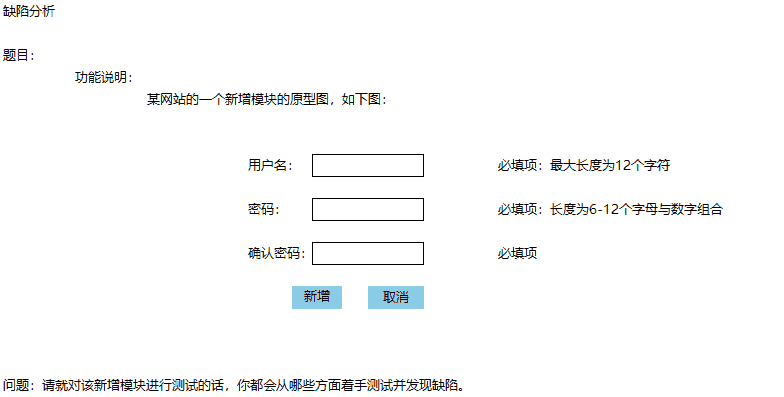
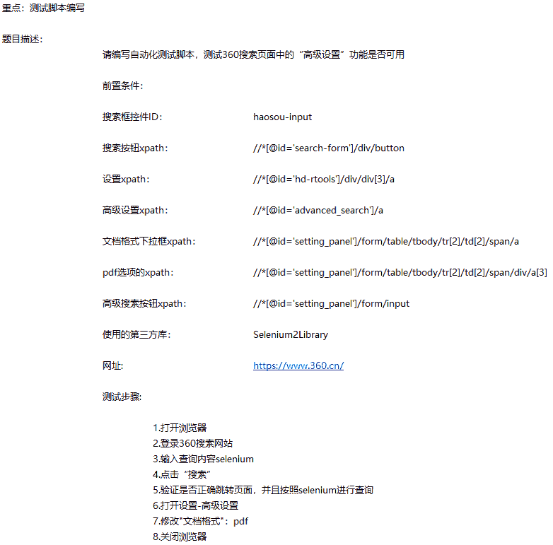
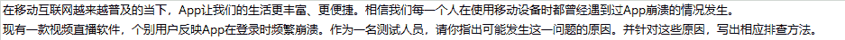

# 三百六十、公司-2018 春招笔试-测试工程师问答题合集

## 1

用例设计
题目：某软件当前推出的活动：红包赚赏金
题目说明：用户将自己的红包二维码分享出去，别人扫描后，别人可获取到随机金额的红包，同时自己也能获得相应的赏金，但是这个赏金只有在别人扫描后，且三天内使用，这赏金才能到你的账户上，如果只扫描了未使用，则为赏金在路上，如果三天后未使用，赏金则过期，不能使用，分别统计此用户的赏金个数及金额，过期个数，赏金在路上个数，针对此次活动，设计测试用例流程细分：
操作：  赏金状态：
别人未扫描  无赏金
别人扫描后，三天内未使用  赏金在路上
别人扫描后，三天内使用了  用户自己得到同等金额的赏金
别人扫描后，超过三天未使用  赏金已过期

你的答案

本题知识点

测试工程师 360 公司 软件测试 2018

讨论

[keepgoing201903212122898](https://www.nowcoder.com/profile/989153638)

试着答一下元素：二维码，状态(扫描-未扫描)，使用时间，赏金个数及金额，过期个数，赏金在路上个数
用例一：分享未扫描
用例二：扫描，3 天内未使用用例三：扫描，扫描结束立即使用用例四：扫描，过期前一分钟时使用 用例五：扫描，过期后一分钟时使用用例六：扫描，扫描 3 天后使用

发表于 2020-04-15 22:00:28

* * *

[牛客 47163106 号](https://www.nowcoder.com/profile/47163106)

新人试试手：根据判定表法来一波 1.未扫码，未获得赏金 2.扫码三天内未使用，显示赏金正在路上 3.扫码超过三天未使用，显示赏金已过期 4.扫码三天内使用，自己和别人分别获得随机金额赏金 5.扫码等到整整三天时间时使用，自己和别人分别获得随机金额赏金 6.扫码超过三天后使用，显示赏金已过期且红包不能使用

发表于 2020-12-06 12:20:18

* * *

## 2

你的答案

本题知识点

测试工程师 360 公司 软件测试 2018

讨论

[牛客 813022967 号](https://www.nowcoder.com/profile/813022967)

1. UI 测试，界面是否美观，是否符合用户使用习惯。

比如，字体大小，密码是否要空一格与用户名对齐，或者直接改成图片啊。如果是登陆界面需不需要添加“注册”按钮，用户如果回退到首页找不到注册按钮会不会就不用这个网站了啊，要方便用户注册，要贴切用户使用习惯。在不同分辨率下界面尺寸大小是否合适，用户会不会出现说字体太小，页面太小点不到输入框、按键的情况。手机登陆该网站该模块，能够自适应吗，不能赶紧改啊。配色是不是***了，有没有做 CSS 的美化啊，风格是不是跟网站整体风格差不多啊。密码框就那么点长，却被要求输入最大 12 个字符，12 个字符输完之后肯定超到外面去了，密码还好，用户名是不是贼难看啊，建议拉长啊。如果是管理员界面”新增”没问题，如果是用户登录界面，注册界面“新增”就得改成相应的字。

2. 功能测试。比如，用户名输入框，你上面写着最大长度 12 个字符，是英文字符还是中文字符？或者我直接敲韩语+日语+拉丁语+...+其他国家语言，+空格，制表符，回车符等特殊符号可以组成用户名吗。以上做一个排列组合，能识别吗。回车也算字符的话，敲一个回车，到底是加一个字符，还是跳转到下一个输入框?不能有这样功能，就在需求上写死啊。密码框，是必填项字母+英文。那英文区不区分大小写啊，我输入了一个中文进去是怎么一个友情提示啊，是直接不让填，还是点新增的时候报错，直接把我之前填的整没了啊，两个都可以但是后面这个用户体验极差啊。确认密码框 只是必填项不是更密码框关联起来，我直接输的不一样的密码，需求上没说我就直接通过了啊，这是个缺陷啊。鼠标点过用户名，密码，确认密码后还有其中一个为空就该提示我不能为空的而不是提交表单时再提示。我输入正确的用户名、密码、确认密码，跳转的页面是否正常，有没有提示我登陆成功，添加成功之类。取消的跳转是否正常。我输入的时候用户名字符大小超了，要给我个提示，建议加入最小值。密码输入长度不对给我提示。纯英文、纯数字给我提示，确认密码与密码不一致给我提示。

3.接口测试，建好的用户，是不是正确的到了后端和数据库里面，安全程度较高的话数据库里面的密码不应该是明文的。建了一个用户，但是数据库里却多了两条相同的用户记录这种滑稽事情也不是没有。那别人注销后，可能就会发现还能登陆，那不一定是注销模块问题，而是注册。

5.性能测试，这个模块基本不怎么用性能。不过也可以建几百个用户跑一下，看看响应时间，服务器资源利用率之类的。

3. 简单的安全测试，简单的 SQL 注入试试，明确它接口的传参方式，会不会有人傻到在 url 上明文传参。Cookie 也要看一下，会有人用 cookie 直接进啊，cookie 的参数做点手脚，象征性的拦截一下。如果是用户登陆注册，验证码确定不要吗？MD5 或者其他加密方式有没有做？SSL 认证有没有？

发表于 2020-08-10 04:45:37

* * *

[牛客 47163106 号](https://www.nowcoder.com/profile/47163106)

1.首先页面显示是否合理，是否符合需求设计 2.测试输入框(根据数据类型、长度、组成规则，是否重复，是否为空设计测试用例)3.新增之后排查看数据库的相应表里是否有新增相关数据 4.测试点击取消按钮之后所输入数据是否会清空

发表于 2020-12-06 12:04:29

* * *

[IT 小宁](https://www.nowcoder.com/profile/342744692)

（1）从功能点角度分析：用户名、密码、确认密码为空时，提示不能为 null,若用户名超过 12 字符，提示非法的用户名，密码小于 6 个字符或大于 12 个字符或不是由字母和数字组成，提示非法的密码格式；确认密码与密码不一致时，提示确认密码错误；新增按钮的点击功能，若未输入用户名/密码，点击时提示用户名/密码不能为 null，若用户名、密码、确认密码都正确时，提示新增成功；（2）从安全性功能点分析：用户注册成功是否会注册一个 token 令牌；用户注册成功后，提示是否要进行用户名和密码的记忆，若用户同意则利用 cookie 进行用户名和密码的记忆；简单 SQL 注入测试（3）从界面角度分析：每个模块是否对齐，是否充分考虑用户体验感，输入正确和错误是否有提示，为空是否有提示，密码是否密文显示

发表于 2020-08-08 11:43:49

* * *

## 3

你的答案

本题知识点

测试工程师 360 公司 软件测试 2018

## 4

你的答案

本题知识点

测试工程师 360 公司 软件测试 2018