# 三百六十、公司-2018 春招笔试-测试开发工程师客观题合集

## 1

下列说法中正确的是（      ）

正确答案: A   你的答案: 空 (错误)

```cpp
冒泡排序法的平均时间复杂度为 O(n²)
```

```cpp
二分法的平均时间复杂度度是 O（n）
```

```cpp
m 个并列循环的时间复杂度为 O（mn）
```

```cpp
快速排序法的时间复杂度一定优于冒泡排序法
```

本题知识点

测试工程师 360 公司 复杂度 测试开发工程师 360 公司 2018

## 2

关键字序列为{12，11，19，23，1，6，10},哈希函数为 H(key)=key MOD 11,用链地址法构造哈希表,哈希地址为 1 的链中有（      ）个记录。

正确答案: D   你的答案: 空 (错误)

```cpp
7
```

```cpp
5
```

```cpp
4
```

```cpp
3
```

本题知识点

测试工程师 360 公司 哈希 *测试开发工程师 2018* *讨论

[等等芒果](https://www.nowcoder.com/profile/405078413)

12%11=1；11%11=0；19%11=8；23%11=1；1%11=1；6%11=6；10%11=10；哈希地址为 1 的链中有 12,23,1

发表于 2019-09-01 15:50:57

* * *

[天尊墨宇](https://www.nowcoder.com/profile/667959477)

选 D12%11=1；11%11=0；19%11=8；23%11=1；1%11=1；6%11=6；10%11=10；哈希地址为 1 的链中有 12,23,1

发表于 2020-07-16 21:10:50

* * *

[Dylan168](https://www.nowcoder.com/profile/582181148)

mod 取余操作

发表于 2020-05-18 08:15:43

* * *

## 3

下面关于动态规划说法正确的是

正确答案: A   你的答案: 空 (错误)

```cpp
他是利用子结构，进行自底而上的算法设计
```

```cpp
他需要后来多次计算的问题进行缓存，减少重复子问题的计算
```

```cpp
他所求问题的整体最优解可以通过一系列局部最优的选择
```

```cpp
他将分解后的子问题看成相互独立的.
```

本题知识点

测试工程师 360 公司 动态规划 测试开发工程师 360 公司 2018

## 4

下列关于排序算法的描述错误的是

正确答案: B   你的答案: 空 (错误)

```cpp
在待排序的记录集中，存在多个具有相同键值的记录，若经过排序，这些记录的相对次序仍然保持不变，称这种排序为稳定排序
```

```cpp
二叉查找树的查找效率与二叉树的树型有关，在节点太复杂时其查找效率最低
```

```cpp
下列排序算法中，希尔排序在某趟排序结束后不一定能选出一个元素放到其最终位置上。
```

```cpp
在下列排序方法中,插入排序方法可能出现这种情况:在最后一趟开始之前,所有的元素都不在其最终应在的正确位置上
```

本题知识点

测试工程师 360 公司 排序 *测试开发工程师 360 公司 2018* *讨论

[菜🐤落泪](https://www.nowcoder.com/profile/409580029)

二叉树的查找效率与树型无关，与高度有关

发表于 2019-08-26 20:39:50

* * *

## 5

请指出以下代码段使用了何种算法

```cpp
public void func(int[] arr1, int k, int m,int[] arr2) { 
arr2[0] = 0; 
for (int i = 1; i <= m; i++) { 
int min = i; 
for (int j = 0; j < k; j++) { 
if (arr1[j] <= i) { 
int temp = arr2[i - arr1[j]] + 1; 
if (temp < min) { 
min = temp; 
} 
} 
} 
arr2[i] = min; 
} 
}
```

正确答案: B   你的答案: 空 (错误)

```cpp
分治算法
```

```cpp
动态规划
```

```cpp
贪心算法
```

```cpp
回溯算法
```

本题知识点

测试工程师 360 公司 动态规划 测试开发工程师 2018

## 6

已知如下递归代码用于求解图的 m 着色问题：

```cpp
#define N 10 
int a[N+1][N+1]; //存储图
int x[N+1];//记录颜色
int sum=0;//保存可着色方案数

void backtrace(int t,int m)
{
int i;
if(t>N)//搜索至叶节点 
{
sum++;
printf("第%d 种方案：\n",sum);
for(i=1;i<=N;i++)
printf("%d ",x[i]);
printf("\n");
}
else
{
for(i=1;i<=m;i++) //逐个判断每种颜色 
{
if(check(t,i))
{   x[t]=i;
backtrace(t+1,m);
}
}
}
}
```

其中 check()函数用于检测某个节点颜色是否合法，以下 check()函数正确的是：

正确答案: D   你的答案: 空 (错误)

```cpp
int check(int t,int i)//检测函数 {     int j;     for(j=1;j&lt;t;j++)     {         if(a[t][j]==1&amp;&amp;x[i]==j)                  return 0;            }     return 1; }
```

```cpp
int check(int t,int i)//检测函数 {     int j;     for(j=1;j&lt;t;j++)     {         if(a[t][j]==1||x[i]==j)                  return 0;            }     return 1; }
```

```cpp
int check(int t,int i)//检测函数 {     int j;     for(j=1;j&lt;t;j++)     {         if(a[t][j]==1||x[j]==i)                  return 0;            }     return 1; }
```

```cpp
int check(int t,int i)//检测函数 {     int j;     for(j=1;j&lt;t;j++)     {         if(a[t][j]==1&amp;&amp;x[j]==i)                  return 0;            }     return 1; }
```

本题知识点

测试工程师 360 公司 递归 测试开发工程师 360 公司 2018

讨论

[我的天鸭](https://www.nowcoder.com/profile/243498)

写个简单易懂的注释，应该就明白了

```cpp
int check(int t,int i){     
    int j;     
    for(j=1;j<t;j++){    //遍历已经涂色过的所有节点         
        if(a[t][j]==1&&x[j]==i)    //当前节点 t 与已涂色过的节点 j 有边相连并且颜色与 t 颜色相同,返回无效,需要增加颜色
            return 0;            
    }     
    return 1; 
}
```

发表于 2019-08-17 17:03:33

* * *

## 7

一个线性序列（30，14，40，63，22，5），假定采用散列函数 Hash(key)=key%7 来计算散列地址，将其散列存储在 A[0~6]中，采用链地址法解决冲突。若查找每个元素的概率相同，则查找成功的平均查找长度是（      ）。

正确答案: A   你的答案: 空 (错误)

```cpp
4/3
```

```cpp
1
```

```cpp
3/2
```

```cpp
5/3
```

本题知识点

测试工程师 360 公司 查找 *测试开发工程师 2018* *讨论

[微众银行内推](https://www.nowcoder.com/profile/516297751)

不应该选 A 么？（1*4+2*2）/6

发表于 2019-08-15 17:25:00

* * *

[玉米是个小二货-](https://www.nowcoder.com/profile/280213985)

不应该是（1x3+2x2+3x1）/6=5/3 吗

发表于 2019-08-21 16:45:21

* * *

[神奇波波](https://www.nowcoder.com/profile/938238613)

计算哈希地址，如果冲突则加 1 再取模：hash（30）= 30 % 7 = **2**hash（14）= 14 % 7 = **0**hash（40）= 40 % 7 = **5**hash（63）= 63 % 7 = 0，与 hash（14）冲突，故（0+1）% 7 = **1** hash（22）= 22 % 7 = 1，与 hash（63）冲突，故（1+1）% 7 =2；与 hash（30）冲突，故（2+1）% 7 = **3**hash（5）= 5 % 7 = 5，与 hash（40）冲突，故（5+1）% 7 = **6**构造哈希表：

| 哈希地址 | 0 | 1 | 2 | 3 | 4 | 5 | 6 |
| 关键字 | 14 | 63 | 30 | 22 |   | 40 | 5 |
| 比较次数 | 1 | 2 | 1 | 3 |   | 1 | 2 |

平均查找长度 = （1 + 2 + 1 + 3 + 1 + 2）/ 6 = 5/3

发表于 2020-06-13 12:10:41

* * *

## 8

下列程序段的时间复杂度是（    ）

```cpp
count = 1；
for(k=1;k<2n;k*=2)
for(i=1;i<4n;i+=2)
count++;
```

正确答案: C   你的答案: 空 (错误)

```cpp
O(n2)
```

```cpp
O(8n2)
```

```cpp
O(nlog2n)
```

```cpp
O(n)
```

本题知识点

测试工程师 360 公司 复杂度 测试开发工程师 360 公司 2018

讨论

[盏茶作酒](https://www.nowcoder.com/profile/6817686)

外层循环中（1,2,4,8,16，...2n）共执行 log2(2n)次。内层循环（1,3,5,7,9，...4n）共执行 4n/2=2n 次。共 2n*log2(2n)。其复杂度为 n*log2(n)

发表于 2019-09-04 11:21:38

* * *

## 9

递归公式

的时间复杂度为（）。

正确答案: B   你的答案: 空 (错误)

```cpp
O(n)
```

```cpp
O(logn)
```

```cpp
O(nlogn)
```

```cpp
O(n²)
```

本题知识点

360 公司 复杂度 递归 2018

讨论

[phoenixfrank](https://www.nowcoder.com/profile/969156946)

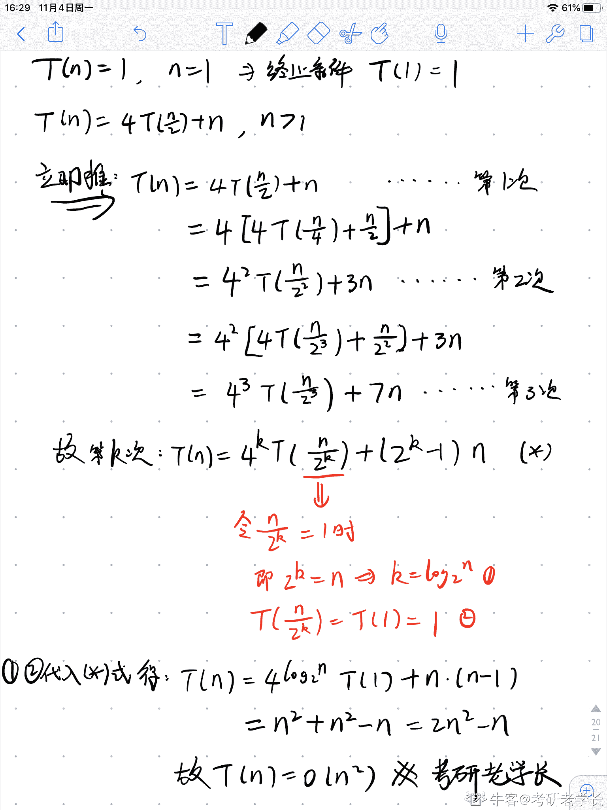

发表于 2019-11-04 16:30:17

* * *

[完善信息](https://www.nowcoder.com/profile/125758879)

不明觉厉转载答案：[`www.jianshu.com/p/0c2652b4e51f`](https://www.jianshu.com/p/0c2652b4e51f)【master 公式的使用】T(N) = a*T(N/b) + O(N^d)T(N)是样本量为 N 的情况下的时间复杂度，a 是子过程的部分，N/b 是子过程的运行次数，N^d 剩余其他的过程。1) log(b,a) > d -> 复杂度为 O(N^log(b,a))2) log(b,a) = d -> 复杂度为 O(N^d * logN)3) log(b,a) < d -> 复杂度为 O(N^d)本题 a=4, b=2, d=1, case 1) O(n²)

发表于 2019-10-04 18:47:30

* * *

[林夕🇨🇳](https://www.nowcoder.com/profile/5393026)

我有个问题，就是时间复杂度不是先要求出来执行的次数吗？？？为什么推荐解答直接算的 f（n）=2n²-n 就直接得出 O(n²)了，不是要算 k=log2n 才对吗？

发表于 2020-03-11 15:14:58

* * *

## 10

有关贪心法叙述正确的是（      ）

正确答案: A   你的答案: 空 (错误)

```cpp
采用局部最优策略
```

```cpp
采用全局最优策略
```

```cpp
在贪心法中采用逐步构造最优解的方法
```

```cpp
把问题分解为简单的问题求解
```

本题知识点

测试工程师 360 公司 贪心 测试开发工程师 360 公司 2018

## 11

在选择分治法解决问题时，应考虑待解决问题应具有哪些特征（      ）

正确答案: A   你的答案: 空 (错误)

```cpp
待解决问题规模缩小到一定程度后可以容易解决
```

```cpp
待解决问题应可以分解为若干个规模较小的相同问题，且子问题应可直接求解。
```

```cpp
各子问题之间是相互独立的
```

```cpp
分解后的子问题的解可以合并为源问题的解
```

本题知识点

测试工程师 360 公司 分治 测试开发工程师 2018

## 12

在有序表中，关于斐波那契查找和折半查找说法错误的是（）

正确答案: A B C   你的答案: 空 (错误)

```cpp
就平均性能而言，斐波那契查找的平均性能比折半查找差
```

```cpp
只有有序表中元素个数 n 等于某个斐波那契数时才能用斐波那契查找算法
```

```cpp
在最坏情况下，斐波那契查找的性能比折半查找好
```

```cpp
折半查找时间复杂度为 O(log2n)
```

本题知识点

测试工程师 360 公司 查找 *测试开发工程师 2018* *讨论

[UnnnnnnU](https://www.nowcoder.com/profile/641374590)

我认为这道题目说错了 因该是问的是正确的是: D 首先 A：平均性能是斐波纳切黄金分割查找更好 B：有序表长度不需要一定要是一个斐波纳切数才行，是可以补齐成为一个斐波纳切数的  补最大的数目直到长度是斐波纳切数 C：最坏情况下斐波纳切查找性能比折半是要差的  这些在书上都有的 这是我认为的

发表于 2019-08-29 20:10:21

* * *

[牛客小妞号](https://www.nowcoder.com/profile/869555943)

A：平均性能是斐波纳切黄金分割查找更好 B：有序表长度不需要一定要是一个斐波纳切数才行，是可以补齐成为一个斐波纳切数的  补最大的数目直到长度是斐波纳切数 C：最坏情况下斐波纳切查找性能比折半是要差的   这些在书上都有的  这是我认为的

发表于 2021-06-24 23:53:21

* * *

[是是是我的锦鲤](https://www.nowcoder.com/profile/293693843)

难道不是斐波那契数-1 吗 B 选项是不是也不对

发表于 2019-08-29 14:37:24

* * *

## 13

下面说法错误的是（）

正确答案: C   你的答案: 空 (错误)

```cpp
快速排序算法平均速度比插入排序平均速度快
```

```cpp
堆排序在每一趟排序过程中，都会有一个元素被放置在最终位置上
```

```cpp
在 10000 个无序的元素中查找最大的 10 个元素，使用快速排序最快
```

```cpp
插入排序是一种稳定的排序算法
```

本题知识点

排序 *讨论

[82 年的苏打水](https://www.nowcoder.com/profile/6103363)

应该是 C 吧   10000 选 10 个最大的应该用堆排序或者选择排序进行 10 轮 10*log2 10000 ，快速得弄到啥时候啊 n*log2 n，冒泡估计都比快速快，

发表于 2019-08-20 11:14:02

* * *

[BKing](https://www.nowcoder.com/profile/2514658)

答案选择 C，使用堆排序是最快，ACD 都对找不到理由说明是错的🤣

发表于 2019-11-15 04:07:33

* * *

[tommyMusk](https://www.nowcoder.com/profile/371756319)

参考 快排和归并的区别 [`zhuanlan.zhihu.com/p/95080265`](https://zhuanlan.zhihu.com/p/95080265)

发表于 2022-02-28 22:20:12

* * *

## 14

对于函数 y = ax² + bx + c,(a > 0),需要找出 y 的小值，精确到小数点后 6 位。下列选项中最有效的方法是（）。

正确答案: D   你的答案: 空 (错误)

```cpp
枚举
```

```cpp
二分查找
```

```cpp
三分查找
```

```cpp
推公式
```

本题知识点

测试工程师 360 公司 Java 测试开发工程师 360 公司 2018

讨论

[中南的小菜鸡](https://www.nowcoder.com/profile/4371282)

有意思吗

发表于 2019-08-20 21:16:08

* * *

[半岛。](https://www.nowcoder.com/profile/397758587)

我觉得曹尼玛更好，推什么公式

发表于 2019-09-08 23:45:29

* * *

[nagashi](https://www.nowcoder.com/profile/515581920)

就知道评论会炸

发表于 2019-10-21 21:04:38

* * *

## 15

设哈希表长 m=13,哈希函数 H(key)=key MOD 11。表中已有 4 个节点:addr(16)=5,addr(28)=6,addr(84)=7,addr(19)=8 其余地址为空,如用线性探测再散列处理冲突，则关键字为 38 的地址为（      ）

正确答案: D   你的答案: 空 (错误)

```cpp
6
```

```cpp
7
```

```cpp
8
```

```cpp
9
```

本题知识点

测试工程师 360 公司 哈希 *测试开发工程师 360 公司 2018* *讨论

[长风与你！](https://www.nowcoder.com/profile/520620239)

38/11 余数为 5 冲突 （38+1）/11 余数为 6 冲突 （39+1）/11 余数为 7 冲突 （40+1）/11 余数为 8 冲突 （41+1）/11 余数为 9

发表于 2019-09-23 17:56:09

* * *

[寒月照三更](https://www.nowcoder.com/profile/122796058)

ABC 都被占了，直接选 D

发表于 2019-10-16 17:28:14

* * *

## 16

```cpp
#include<bits/stdc++.h>
using namespace std;
int main(){
stack<int>st;
int pos = 1;
while(pos <= 3){
st.push(pos++);
}
cout<<st.top();
while(pos <= 5){
st.push(pos++);
}
while(!st.empty()){
cout<<st.top();
st.pop();
}
return 0;
}
```

上述程序的输出为(      )

正确答案: B   你的答案: 空 (错误)

```cpp
35421
```

```cpp
354321
```

```cpp
12453
```

```cpp
123453
```

本题知识点

测试工程师 360 公司 C++ 测试开发工程师 360 公司 2018

讨论

[汪啊虎虎](https://www.nowcoder.com/profile/336701791)

仅打印栈顶元素的话是不会出栈的嗷

发表于 2019-09-11 10:49:26

* * *

## 17

```cpp
#include<bits/stdc++.h>
using namespace std;
int gcd(int a, int b){
return b == 0 ? a : gcd(b, a % b);
}
struct stsort{
bool operator () (const int a, const int b) const{
if(gcd(30, a) < gcd(30, b)){
return 1;
}
else if(gcd(30, a) == gcd(30, b)){
return a < b;
}
else return 0;
}
};
int main(){
int n = 5;
priority_queue<int, vector<int>, stsort>q;
for(int i = 1; i <= n; ++i){
q.push(i);
}
for(int i = 1; i <= n; ++i){
printf("%d", q.top());
q.pop();
}
return 0;
}
```

程序的输出为( )

正确答案: A   你的答案: 空 (错误)

```cpp
53421
```

```cpp
53241
```

```cpp
12435
```

```cpp
14235
```

本题知识点

测试工程师 360 公司 C++ 测试开发工程师 360 公司 2018

讨论

[Ginkyo](https://www.nowcoder.com/profile/813639155)

优先队列队首指向最后，队尾指向最前面

发表于 2019-09-17 23:35:01

* * *

## 18

```cpp
#include<bits/stdc++.h>
using namespace std;
int main(){
int n = 5;
vector<int>a;
set<int>b;
for(int i = 1; i <= n; ++i){
a.push_back(i);
b.insert(i);
}
for(int i = 1; i <= n; ++i){
a.push_back(i);
b.insert(i);
}
cout<<a.size()<<b.size()<<endl;
return 0;
}
```

程序的输出为( )

正确答案: A   你的答案: 空 (错误)

```cpp
105
```

```cpp
510
```

```cpp
1010
```

```cpp
55
```

本题知识点

测试工程师 360 公司 C++ 测试开发工程师 360 公司 2018

讨论

[已注销](https://www.nowcoder.com/profile/824253375)

set 容器中，每个元素的值必须唯一，系统根据值自动排序。

发表于 2019-09-06 19:26:24

* * *

[我的猫不会写程序](https://www.nowcoder.com/profile/988838596)

集合的键不能重复，第二次集合的插入无效

编辑于 2019-08-26 12:09:53

* * *

## 19

```cpp
#include<bits/stdc++.h>
using namespace std;
vector<int>g[10];
int ans = 0;
void dfs(int x){
    if(g[x].size() == 0){
        ans++;
        return;
    }
    for(int i = 0; i < g[x].size(); ++i){
        dfs(g[x][i]);
    }
}
int main(){
    int n, x;
    scanf("%d", &n);
    for(int i = 2; i <= n; ++i){
        scanf("%d", &x);
        g[x].push_back(i);
    }
    dfs(1);
    cout<<ans<<endl;
    return 0;
}
```

上述程序的输入为：
9
1 2 2 1 5 6 6 6
则输出为(（）

正确答案: B   你的答案: 空 (错误)

```cpp
4
```

```cpp
5
```

```cpp
6
```

```cpp
7
```

本题知识点

C++ C 语言

讨论

[艾迪 12346](https://www.nowcoder.com/profile/715538873)

输入之后的 vector，g[1]={2,5},g[2]={3,4},g[5]={6},g[6]={7,8,9},其为空，ans 在遇到空 vector 时会加 1 返回。从 dfs（1）开始判断，g[1]不为空，判断 g[1]内的元素，2 和 5，g[2]不为空，判断 g[2]内部元素 g[3]**，**g[4],均为空，ans 进行两次加 1，回到 g[1]判断 g[5],g[5]不为空，内部元素为 6，判断 g[6],g[6]不为空判断 g[6]内部元素 7,8,9，g[7],g[8],g[9]均为空，ans 进行三次加 1。结束，ans=5.

发表于 2019-11-05 22:03:31

* * *

[我的天鸭](https://www.nowcoder.com/profile/243498)

求的是树叶子结点的个数

发表于 2019-08-19 16:30:24

* * *

[牛客 166212013 号](https://www.nowcoder.com/profile/166212013)

vector<int>g[10];是申明了一个是数组，其 10 个元素都是 vector<int>。所以相当于 g 相当于一个二维数组。经过输入  g[10][]={  {},               {2,5},                {3,4},                {},                {},                {6},                {7,8,9},                {},                {},                {}}if (g[x].size() == 0) 就是判断哪一行没有值 for (int i = 0; i < g[x].size(); ++i) 就是遍历当前行的所有元素。 经过迭代最终就是 5

发表于 2020-08-11 23:32:55

* * *

## 20

用(a,b,c)表示节点 a,b 之间有一条权值为 c 的无向边。对于图(1,2,3),(1,3,4),(1,5,1),(2,3,4),(2,4,6),(2,5,2),(3,5,1)。最小生成树的权值和为(        )

正确答案: B   你的答案: 空 (错误)

```cpp
9
```

```cpp
10
```

```cpp
11
```

```cpp
12
```

本题知识点

测试工程师 360 公司 图 测试开发工程师 2018

讨论

[凉风起天末](https://www.nowcoder.com/profile/709610362)

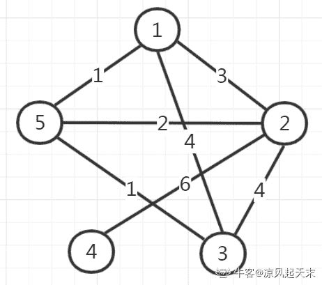一、**将图还原**（如上图）
二、**选择算法**生成最小生成树（Prim 是节点驱动的，而 Kruskal 是边驱动的），以 Prim 算法为例：

1.  任意**选择一个起点**作为初始子图，放入 MST.node 中（MST : Minimum Spanning Tree）；
2.  从当前子图所有**对外连接**的边中选择权最小的一条 E（“对外连接” 指的是：边的一端在当前子图内，而另一端不在当前子图内）；
3.  将 E 和对应的外部节点 N**纳入当前子图** MST 中，子图生长；
4.  重复第 2 步，直到 MST 包含了原图的所有节点；

三、**Prim 算法****过程演示**：

1.  选择 1 号节点作为初始子图 MST = (node, edge)；
2.  对外连接的边分别是：(1,5,1), (1,2,3), (1,3,4)，最小边是(1,5,1)；
3.  则将 5 号节点纳入当前子图，node = {1, 5}；
4.  对外连接的边分别是：(5,3,1), (5,2,2), (1,2,3), (1,3,4)，最小边是(5,3,1)；
5.  则将 3 号节点纳入当前子图，node = {1, 3, 5}； 
6.  . . . . . .(如此重复直到包含了所有节点) . . . . . .

发表于 2019-09-19 11:12:36

* * *

[天尊墨宇](https://www.nowcoder.com/profile/667959477)

 选 B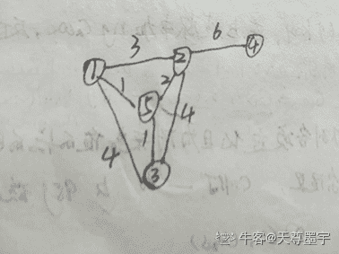
*   选择 1 号节点作为初始子图 MST = (node, edge)；*   对外连接的边分别是：(1,5,1), (1,2,3), (1,3,4)，最小边是(1,5,1)；*   则将 5 号节点纳入当前子图，node = {1, 5}；*   对外连接的边分别是：(5,3,1), (5,2,2), (1,2,3), (1,3,4)，最小边是(5,3,1)；*   则将 3 号节点纳入当前子图，node = {1, 3, 5}；
    *   . . . . . .(如此重复直到包含了所有节点) . . . . . .

发表于 2020-07-12 09:24:01

* * *

[会飞的鱼 97](https://www.nowcoder.com/profile/815751329)

克鲁斯卡尔~

发表于 2022-03-05 21:31:56

* * *

## 21

一棵二叉树有 100 个节点，若根节点深度设为 1，树的深度最大为(       )，最小为(       )

正确答案: B   你的答案: 空 (错误)

```cpp
100 2
```

```cpp
100 7
```

```cpp
7 6
```

```cpp
7 2
```

本题知识点

测试工程师 360 公司 树 测试开发工程师 2018

讨论

[edte](https://www.nowcoder.com/profile/278445364)

最差的情况就是这样：

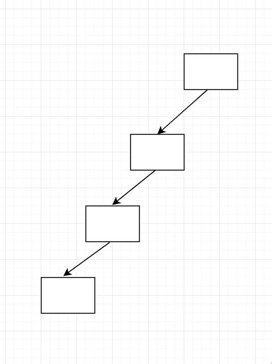

每层一个 node，那么一共 100 层。

最好的情况就是每层都是满的：
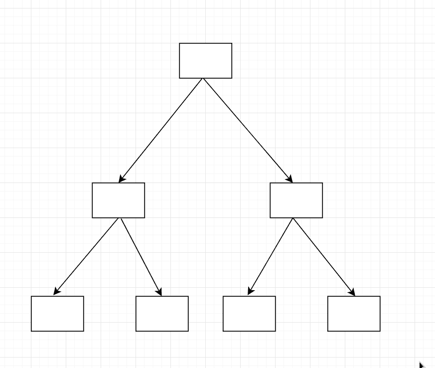

第 n 层，最多 node 个数为  个，那么一共 n 层就有  个，即  个。

node 最多的 binary tree，即 perfect binary tree，故 ， 
故 

则选 

发表于 2020-09-22 18:28:42

* * *

[全废工程师](https://www.nowcoder.com/profile/304463687)

请问题目中根结点深度为 1 什么意思，没读懂题目意思额⊙∀⊙！

发表于 2019-08-28 13:20:49

* * *

[farewell1020](https://www.nowcoder.com/profile/784932180)

最深的情况就是每层只有一个节点，最浅的就是按完全二叉树的排列方法

发表于 2019-08-24 11:32:12

* * *

## 22

在一棵度为 5 的树 T 中，若 14 个度为 5 的结点，15 个度为 4 的结点，14 个度为 3 的结点，5 个度为 2 的结点，10 个度为 1 的结点，则树 T 的叶节点个数是（     ）

正确答案: D   你的答案: 空 (错误)

```cpp
72
```

```cpp
102
```

```cpp
130
```

```cpp
135
```

本题知识点

测试工程师 360 公司 树 测试开发工程师 360 公司 2018

讨论

[好听的 zz](https://www.nowcoder.com/profile/825142401)

树的总结点数=各对应的度*度的个数+1 即：n0+n1+n2+n3+n4+n5=14*5+15*4+14*3+5*2+10*1+1 即 n0+14+15+14+5+10=14*5+15*4+14*3+5*2+10*1+1no=135

发表于 2020-02-29 21:17:39

* * *

[往事如烟~](https://www.nowcoder.com/profile/7150187)

可以通过树的入度来进行计算。假设树有 n 个结点，那么这棵树就有 n-1 个入度(只有根节点是没有入度的)，一棵树的出度也就是其他树对应的入度。所以假设这棵树有 n 个节点，依题意得：n-1=14*5+15*4+14*3+5*2+10*1 解的 n=135

发表于 2019-09-29 16:02:43

* * *

[菜鸡准备转岗](https://www.nowcoder.com/profile/836159636)

说实话 ，不应该是 135 吗。。。n0=n2+2n3+3n4+4n5+1=135

发表于 2019-08-30 13:21:29

* * *

## 23

```cpp
#include<bits/stdc++.h>
using namespace std;
int n = 300;
int solve(int x){
return x * (n - x);
}
int main(){
int l = 1, r = n;
int mid1, mid2;
int t = 50;
while(t--){
mid1 = l + r >> 1;
mid2 = mid1 + r >> 1;
if(solve(mid1) > solve(mid2)){
r = mid2;
}
else{
l = mid1;
}
}
cout<< l <<endl;
return 0;
}
```

程序的输出为(        )

正确答案: C   你的答案: 空 (错误)

```cpp
1
```

```cpp
100
```

```cpp
150
```

```cpp
300
```

本题知识点

测试工程师 360 公司 C++ 测试开发工程师 360 公司 2018

讨论

[chaohang021](https://www.nowcoder.com/profile/975469382)

实际上是求解-x²+300x 的极大值

发表于 2019-09-21 15:00:42

* * *

## 24

```cpp
#include<bits/stdc++.h>
using namespace std;
int solve(int x){
if(x == 0 || x == 1){
return x;
}
if(x % 2 == 0){
return 1 + solve(x / 2);
}
else{
return 1 + solve((x + 1) / 2);
}
}
int main(){
int n = 100;
int ans = solve(n);
cout<<ans<<endl;
return 0;
}
```

程序的输出为(      )

正确答案: C   你的答案: 空 (错误)

```cpp
6
```

```cpp
7
```

```cpp
8
```

```cpp
9
```

本题知识点

测试工程师 360 公司 C++ 测试开发工程师 360 公司 2018

## 25

一个有 n 个节点的树，有( )条边。

正确答案: A   你的答案: 空 (错误)

```cpp
n - 1
```

```cpp
n
```

```cpp
n + 1
```

```cpp
n ^ 2
```

本题知识点

测试工程师 360 公司 树 测试开发工程师 360 公司 2018

## 26

一个数据流中出现了的报文片段：A ESC FLAG B，假设采用字节填充算法，填充后的输出为（      ）

正确答案: B   你的答案: 空 (错误)

```cpp
A ESC ESC FLAG B
```

```cpp
A ESC ESC ESC FLAG B
```

```cpp
FLAG A ESC FLAG B FLAG
```

```cpp
A ESC FLAG FLAG B
```

本题知识点

测试工程师 360 公司 网络基础 测试开发工程师 360 公司 2018

讨论

[牛客夯先生](https://www.nowcoder.com/profile/432412445)

当标志字节出现在待传输的数据信息当中时候，就会被误认为是帧的边界，为了解决这一问题，发送端的数据链路层在出现标志字节的数据段前插入另一个转义字符（通常取 ESC）而在接受端的数据链路层在数据传往网络层之前删除这个插入的转义字符 例如如果数据流中出现了这样的数据段：A B ESC C ESC FLAG FLAG D。 那么采用自己填充算法后就会输出为：A B (ESC) ESC C (ESC) ESC (ESC) FLAG (ESC) FLAG D。注意括号里面的就是填充的。所以本题答案应该为 A (ESC) ESC (ESC) FLAG B

发表于 2019-08-25 12:14:16

* * *

## 27

以下地址中的哪一个和 76.32/12 匹配（      ）

正确答案: A   你的答案: 空 (错误)

```cpp
76.33.214.12
```

```cpp
76.79.24.11
```

```cpp
76.58.119.74
```

```cpp
76.68.204.11
```

本题知识点

测试工程师 360 公司 网络基础 测试开发工程师 2018

讨论

[whynotybb](https://www.nowcoder.com/profile/494556904)

我是这么理解的：76.32/12：12 是表示子网掩码中的连续 1 的个数，所以有 12 个 1，20 个 0，即子网掩码是 255.240.0.0：而在第二位有（12-8）=4 个 1，所以可以有 2⁴=16 个主机，所以 76.32-76.47 都是可以的。

发表于 2019-08-25 17:18:29

* * *

[移动森林](https://www.nowcoder.com/profile/714783729)

这样说应该容易理解一点 76.32/12 中的 12 代表子网掩码中连续 1 的个数，所以是 12 个 1，即 8+4**1111 1111，1111** 0000，0000 0000，0000 0000 子网掩码：255.240.0.0
1 代表的是网段号
0 代表的是主机号 76 的二进制为 0100 110032 的二进制为 0010 0000 所以题干中的 76.32 对应的网段号为
**0100 1100，0010****只要选项中的网段号跟题干一致就是对的**题干：76.0010 是网段号
选项 A.76.33 ->76.0010 匹配
选项 B.76.79 ->76.0100 不匹配
选项 C.76.58 ->76.0011 不匹配
选项 D.76.68 ->76.0100 不匹配

发表于 2020-10-28 11:03:24

* * *

[暮秋柒](https://www.nowcoder.com/profile/923002302)

题干 76.32/12 子网号 12 位 即 8+4-> 76.0010A.76.33 ->76.0010 匹配 B.76.79 ->76.0100 不匹配 C.76.58 ->76.0011 不匹配 D.76.68 ->76.0100 不匹配

发表于 2019-12-16 21:08:30

* * *

## 28

网络拓扑结构中存在网桥 S1、S2、S3、S4，若对应 MAC 地址分别为 AABB-CCDD-EE00、AABB-CCDD-EE11、BBBB-CCDD-EE00、BBBB-CCDD-EE11,所有网桥优先级采用默认值,则使用 STP 协议后，哪个网桥会被确定为根网桥（      ）

正确答案: A   你的答案: 空 (错误)

```cpp
S1
```

```cpp
S2
```

```cpp
S3
```

```cpp
S4
```

本题知识点

测试工程师 360 公司 网络基础 测试开发工程师 360 公司 2018

## 29

原始数据为 011011111111111111110010 采用比特填充技术填充后的发送数据为（      ）

正确答案: D   你的答案: 空 (错误)

```cpp
0110111110111111111110010
```

```cpp
011011111111111111110010
```

```cpp
01101111101111110111110010
```

```cpp
011011111011111011111010010
```

本题知识点

测试工程师 360 公司 网络基础 测试开发工程师 360 公司 2018

讨论

[淼王星](https://www.nowcoder.com/profile/292214448)

> 参考《TCP/IP 详解卷 1：协议》第二章链路层 -> 2.6 PPP：点对点协议

PPP 数据帧以标志字符 0x7e 开始和结束

> 0x7e = 0b0111 1110

当标志符出现在信息字段中，PPP 需要对它进行转义。在同步链路中，该过程是通过一种称为比特填充（bit stuffing）的硬件技术来完成的，也就是零比特填充法。所谓的零比特填充法，就是每当出现 5 个 1 的时候就给它添加一个 0 进去，而接收方收到数据时凡出现 5 个 1 的时候去掉其后面一个 0，这样就可以避免 0x7e 出现在所要传输的数据里，从而用 0x7e 确定帧的边界。

发表于 2019-08-24 15:31:56

* * *

## 30

存在以下三个 CIDR 地址块 192.168.11.0/27、192.168.11.32/27 和 192.168.11.64/26 聚合后的 CIDR 地址块应是（      ）

正确答案: A   你的答案: 空 (错误)

```cpp
192.168.11.0/25
```

```cpp
192.168.11.0/26
```

```cpp
192.168.11.64/25
```

```cpp
192.168.11.64/26
```

本题知识点

测试工程师 360 公司 网络基础 测试开发工程师 360 公司 2018

讨论

[黄色变白色](https://www.nowcoder.com/profile/8547911)

.............答案是 C？0 32 64 不是第一位共 0 吗？所以是 A 吧。     还是我太菜？ 发表于 2019-08-22 07:25:19

* * *

[Jerry 狙击手](https://www.nowcoder.com/profile/9847327)

聚合地址的 IP 应该是选择多个地址块 IP 共有的数位（二进制下），此题前三位是相同的：192.168.11（二进制下共 3*8 =24 位）就不用管了。最后一部分 0，32，64，对应二进制，从左往右数，只有 第一位（即 '0'000 0000）相同，故聚合地址 IP 为，192.168.11.0。掩码应该从左往右数共同位数，那就是 24 + 1 = 25。所以答案应该更正为： 192.168.11.0/25 

发表于 2019-09-05 11:01:16

* * *

[不负韶光，野蛮生长](https://www.nowcoder.com/profile/367084618)

2 个/27 地址块之间进行聚合：

192.168.11.0   → 11000000.10101000.00001011.00000000

192.168.11.32 → 11000000.10101000.00001011.00100000

共同前缀是前 26 位，即 11000000.10101000.00001011.00，则聚合的 CIDR 地址块是 192.168.11.0/26 将结果再与/26 地址块之间进行聚合：

192.168.11.0   → 11000000.10101000.00001011.00000000

192.168.11.64 → 11000000.10101000.00001011.01000000

共同前缀是前 25 位，则最终的聚合 CIDR 地址块是 192.168.11.0/25

 ———————————————— 
版权声明：本文为 CSDN 博主「gakki 的二向箔」的原创文章，遵循 CC 4.0 by-sa 版权协议，转载请附上原文出处链接及本声明。
原文链接：[`blog.csdn.net/carl_wu_/article/details/79887758`](https://blog.csdn.net/carl_wu_/article/details/79887758)

发表于 2019-08-26 19:44:11

* * *

## 31

终端发送帧序列为 1101011111，使用生成多项式为 G(x)=x⁴+x+1 校验后发出的帧为序列为（      ）

正确答案: D   你的答案: 空 (错误)

```cpp
11010111111100
```

```cpp
11010111110011
```

```cpp
11010111111011
```

```cpp
11010111110010
```

本题知识点

测试工程师 360 公司 网络基础 测试开发工程师 360 公司 2018

讨论

[Cvvvvva](https://www.nowcoder.com/profile/4973962)

发送序列后面加 4 个 0 再对生成多项式作模 2 除法即可，最后发送的数据为发送序列后加上余数(4 位)。

发表于 2019-10-17 16:05:30

* * *

## 32

处于同一网络上的主机对有（      ）

正确答案: A B   你的答案: 空 (错误)

```cpp
192.168.5.72/255.255.255.0 和 192.168.5.79/255.255.255.0
```

```cpp
192.168.19.35/255.255.255.224 和 192.168.19.48/255.255.255.224
```

```cpp
19.128.14.14/255.255.255.240 和 19.128.14.19/255.255.255.240
```

```cpp
192.168.3.68/255.255.255.248 和 192.168.3.74/255.255.255.248
```

本题知识点

测试工程师 360 公司 网络基础 测试开发工程师 360 公司 2018

## 33

应用 NAT 后会带来哪些影响（      ）

正确答案: A   你的答案: 空 (错误)

```cpp
不利于分片
```

```cpp
不利于数据加密
```

```cpp
需要重新计算 IP 分组校验和
```

```cpp
可以解决 IPv4 地址耗尽问题
```

本题知识点

测试工程师 360 公司 网络基础 测试开发工程师 360 公司 2018

讨论

[黄色变白色](https://www.nowcoder.com/profile/8547911)

NAT 有效解决了 IP 地址短缺的问题，但是它也带来了一些新的问题。主要体现在：
① 处于 NAT 后面的主机不能充当服务器直接接收外部主机的连接请求，必须对 NAT 设备进行相应的配置才能完成外部地址与内部服务器地址的映射。
②处于不同 NAT 下的两台主机无法建立直接的 UDP 或 TCP 连接，必须使用中介服务器来帮助它们完成初始化的工作。

发表于 2019-09-30 07:27:26

* * *

## 34

如果需要在不影响其他对象的情况下，以动态，透明的方式给对象添加职责，应该选择何种设计模式？

正确答案: D   你的答案: 空 (错误)

```cpp
动态代理模式
```

```cpp
适配器模式
```

```cpp
桥接模式
```

```cpp
装饰模式
```

本题知识点

测试工程师 360 公司 测试工程师 360 公司 测试工程师 360 公司 测试工程师 360 公司 测试工程师 360 公司 设计模式 测试开发工程师 360 公司 2018

## 35

如果需要一个语言解释执行，并且可以将语言中的句子表示为一个抽象语法树的时候，对效率要求不高的情况下，应该选择何种设计模式？

正确答案: A   你的答案: 空 (错误)

```cpp
解释器模式
```

```cpp
动态代理模式
```

```cpp
装饰模式
```

```cpp
访问者模式
```

本题知识点

测试工程师 360 公司 测试工程师 360 公司 测试工程师 360 公司 测试工程师 360 公司 测试工程师 360 公司 设计模式 测试开发工程师 360 公司 2018

## 36

数据库 1NF、2NF、3NF 和 BCNF 之间的关系是（      ）

正确答案: D   你的答案: 空 (错误)

```cpp
若 R∈2NF,则 R∈3NF
```

```cpp
若 R∈1NF,则 R 不属于 BCNF
```

```cpp
若 R∈3NF,则 R∈BCNF
```

```cpp
若 R∈BCNF,则 R∈3NF
```

本题知识点

测试工程师 360 公司 数据库 测试开发工程师 360 公司 2018

讨论

[城北徐公美](https://www.nowcoder.com/profile/334412749)

1NF 范围最广，越往下越小。

发表于 2019-09-11 16:41:12

* * *

## 37

某 IT 公司人事管理采用专门的人事管理系统来实现。后台数据库名为 LF。新来的人事部张经理新官上任，第一件事是要对公司的员工做全面的了解。可是他在访问员工信息表 EMPL 里的工资和奖金字段的时被拒绝，只能查看该表其他字段。作为 LF 的开发者你将如何解决这一问题：（      ）

正确答案: D   你的答案: 空 (错误)

```cpp
废除张经理的数据库用户帐户对表 EMPL 里的工资列和奖金列的 SELECT 权限
```

```cpp
添加张经理到 db_datareader 角色
```

```cpp
添加张经理到 db_accessadmin 角色
```

```cpp
授予张经理的数据库用户帐户对表 EMPL 里的工资列和奖金列的 SELECT 权限。
```

本题知识点

测试工程师 360 公司 数据库 SQL 测试开发工程师 2018

讨论

[蛞蝓奶奶](https://www.nowcoder.com/profile/619044738)

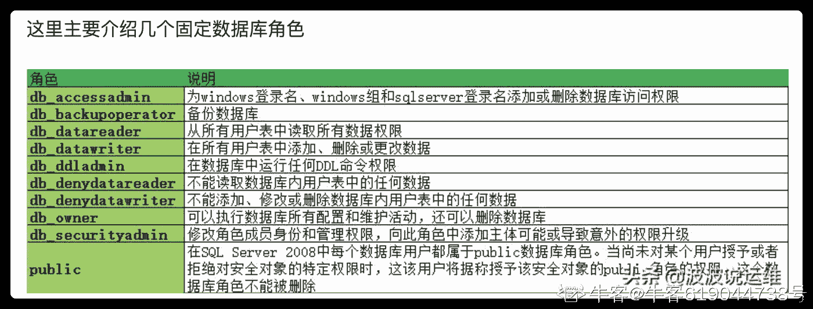

发表于 2020-08-28 12:11:57

* * *

[卖豆浆的小店儿冒着热气](https://www.nowcoder.com/profile/159074269)

认为选 D。A 经理本来就没有对表工资和奖金列的权限，怎么废除。B 和 C 权限太大。

发表于 2019-08-26 14:35:50

* * *

[牛客 752867018 号](https://www.nowcoder.com/profile/752867018)

| db_accessadmin | 可以添加、删除用户的用户 |

| db_datareader | 可以查看所有数据库中用户表内数据的用户 |

发表于 2020-04-08 15:54:48

* * *

## 38

在数据库中存在多列的情况下，若要删除表中的某一列应该使用 SQL 语句（      ）

正确答案: B   你的答案: 空 (错误)

```cpp
ALTER TABLE tableName DROP columnName
```

```cpp
ALTER TABLE tableName DROP COLUMN columnName
```

```cpp
ALTER TABLE tableName DELETE columnName
```

```cpp
ALTER TABLE tableName DELETE COLUMN columnName
```

本题知识点

测试工程师 360 公司 数据库 SQL 测试开发工程师 360 公司 2018

讨论

[Cancy](https://www.nowcoder.com/profile/794706256)

增加列：alter table tableName add columnName varchar(30)删除列：alter table tableName drop column columnName 

发表于 2020-11-04 13:40:53

* * *

[109 号](https://www.nowcoder.com/profile/235103109)

删除某一列使用 drop，删除某一行使用 delete

发表于 2020-12-05 11:18:29

* * *

[极乐 disco](https://www.nowcoder.com/profile/866892783)

DROP TABLE XXX 数据与结构统统干掉
DELETE TBALE XXX 删除 bai 表里的数据 du，zhi 结构还在，日志里删一行记录一行
TRUNCATE TABLE XXX 一次性 dao 清空表里的数据，结构还在，比 DELETE 快.

发表于 2020-09-20 15:56:10

* * *

## 39

在 MySQL 中，关于索引，下面描述中错误的一项是（      ）

正确答案: C   你的答案: 空 (错误)

```cpp
建立索引可以提高数据查询的效率
```

```cpp
聚集索引可能会降低数据的插入速度
```

```cpp
innodb 存储引擎支持全文索引
```

```cpp
删除索引的命令是 drop index
```

本题知识点

测试工程师 360 公司 数据库 测试开发工程师 360 公司 2018

讨论

[风中沉思](https://www.nowcoder.com/profile/9087105)

C 选项  不严谨，在 MySQL 中，从 InnoDB1.2.x 版本开始，InnoDB 存储引擎开始支持全文索引。

编辑于 2019-10-24 12:31:09

* * *

[JackieDeng](https://www.nowcoder.com/profile/877191350)

只有字段的数据类型为 char、varchar、text 及其系列才可以建全文索引

发表于 2019-08-17 09:33:56

* * *

## 40

关于数据库的索引，如下那个选项是正确的？

正确答案: D   你的答案: 空 (错误)

```cpp
针对某些字段建立索引，能够有效的减少相关数据库表的磁盘空间占用；
```

```cpp
针对某些字段建立索引，能够有效的提升相关字段的读与写的效率；
```

```cpp
常见数据库管理系统，通常使用 hash 表来存储索引；
```

```cpp
数据库索引的存在，可能导致相关字段删除的效率降低；
```

本题知识点

测试工程师 360 公司 数据库 测试开发工程师 2018

讨论

[luoguili613](https://www.nowcoder.com/profile/813039881)

A：增加索引会增加磁盘占用 B：建立索引可以提升查询速度，即读速度；但在一定程度上降低写速度 C：数据库一般使用 B*树作为索引 D：删除数据需要调整索引，所以会降低效率

发表于 2019-09-05 11:10:46

* * *

[啊我死了](https://www.nowcoder.com/profile/589140750)

D 例如 B+ tree，删除数据相当于删除节点，需要调整树

发表于 2021-10-29 21:01:26

* * *

## 41

数据库中，什么操作命令可以整理表数据文件的碎片

正确答案: A   你的答案: 空 (错误)

```cpp
optimize table TabName;
```

```cpp
repaire table TabName;
```

```cpp
analyze table TabName;
```

```cpp
flush table TabName;
```

本题知识点

测试工程师 360 公司 数据库 测试开发工程师 360 公司 2018

## 42

下面代码执行后的结果为（      ）

```cpp
int main()
{
int sum=0;
int i=0,j=0;

for(j=0;j<6;j++)
{
if(j%2)continue;
sum++;
}

printf("sum=%d",sum);

return 0;
}
```

正确答案: C   你的答案: 空 (错误)

```cpp
sum=1
```

```cpp
sum=2
```

```cpp
sum=3
```

```cpp
其他几项都不对
```

本题知识点

测试工程师 360 公司 C++ 测试开发工程师 360 公司 2018

讨论

[我吃柠檬！](https://www.nowcoder.com/profile/905732598)

j%2 为 0 则继续下轮循环 不为 0 则继续往下走到 sum++ 小于 6 则有 012345 满足 sum++的有 135 sum 则为 3

发表于 2019-08-26 15:29:58

* * *

## 43

c 语言前提下，下列数组定义错误的是（      ）

正确答案: A C   你的答案: 空 (错误)

```cpp
int arr[2][3] = {{1,2},{3,4},{5,6}};
```

```cpp
int arr[][3] = {{1,2,3},{4,5,6}};
```

```cpp
int arr[10]={,10};
```

```cpp
int arr[10]={10};
```

本题知识点

测试工程师 360 公司 C++ 测试开发工程师 360 公司 2018

讨论

[夜★](https://www.nowcoder.com/profile/626357968)

C++中 C 选项也不对吧，最近刷到的全是 360 的题目，好多题目感觉不安好心，误导刷题人

发表于 2019-08-23 19:19:53

* * *

[AtInfinity](https://www.nowcoder.com/profile/548270256)

兄弟们顶我上去，建议屏蔽顺丰，360 令人恶心的面试题

发表于 2019-09-12 07:03:56

* * *

[subuju](https://www.nowcoder.com/profile/931165)

gcc4.8 编译 1 选项  只有警告  

发表于 2019-10-26 21:08:31

* * *

## 44

c/c++中，下列选项哪些语句可以正确定义数组的是（）

正确答案: A B D   你的答案: 空 (错误)

```cpp
#define N 2017
int arr[N];
```

```cpp
#define N 2017
int arr[N*2];
```

```cpp
int i=2017;
int arr[i];
```

```cpp
int arr[]={1};
```

本题知识点

测试工程师 360 公司 C++ 测试开发工程师 2018 C 语言

讨论

[里外不是人](https://www.nowcoder.com/profile/779629562)

数据的长度不能为变量，所以 C 是错的，其它都对

发表于 2019-09-15 14:50:48

* * *

[竹 kj](https://www.nowcoder.com/profile/621794120)

gcc 中 c 应该可以？

发表于 2020-09-12 21:50:51

* * *

[hackerPlus](https://www.nowcoder.com/profile/4500081)

很奇怪，C 选项使用 gcc 是可以编译通过的。

```cpp
int main() {
    int i = 10;
    int arr[i];
    return 0;
}
```

```cpp
# gcc --version | head -n1
gcc (Debian 8.3.0-6) 8.3.0
```

发表于 2020-07-19 13:29:46

* * *

## 45

下面程序执行的结果为（）

```cpp
int main( ) { 
    char ch1,ch2;
    ch1 ='D'+'8'-'3';
    ch2 ='9'-'1';
    printf("%c %d\n",ch1,ch2);
    return 0;
}

```

正确答案: B   你的答案: 空 (错误)

```cpp
I '8'
```

```cpp
I 8
```

```cpp
G '8'
```

```cpp
其他几项都不对
```

本题知识点

360 公司 C++ 2018 C 语言

讨论

[牛客 144491755 号](https://www.nowcoder.com/profile/144491755)

'8'－'3'ASCII 码间隔+5，'D'加上+5 的间隔，得'I';'9'－'1'ASCII 码间隔+8；

发表于 2020-01-07 11:40:54

* * *

[Jʚɞ](https://www.nowcoder.com/profile/6938949)

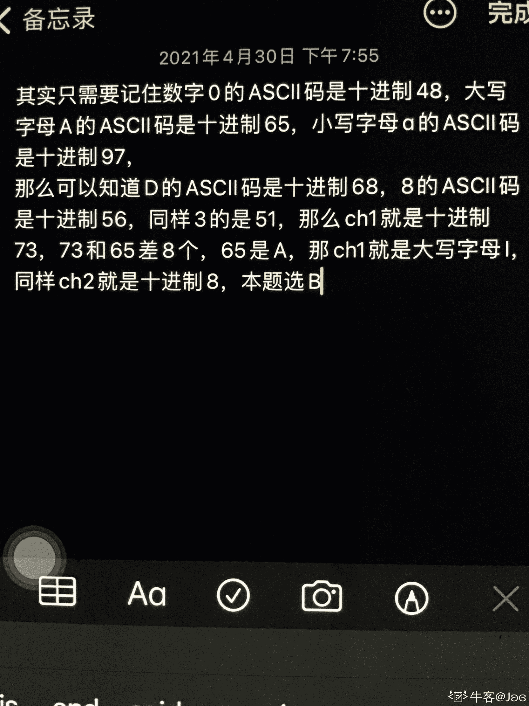

发表于 2021-04-30 20:11:33

* * *

[sf54837](https://www.nowcoder.com/profile/688437321)

吐血，看错了

发表于 2020-08-22 21:51:17

* * *

## 46

c/c++前提下，下列关于构造函数说法正确的是（）

正确答案: C D   你的答案: 空 (错误)

```cpp
构造函数的返回值为 void
```

```cpp
构造函数不可以被重载
```

```cpp
构造函数可以是内联函数
```

```cpp
构造函数可以没有参数
```

本题知识点

360 公司 C++ 2018 C 语言

讨论

[刘诗歌](https://www.nowcoder.com/profile/406172105)

关于内联函数：所有成员函数默认为内联函数。

发表于 2019-10-09 15:52:42

* * *

[regretful](https://www.nowcoder.com/profile/440791680)

构造函数和析构函数是两个非常特殊的函数：它们没有返回值．这与返回值为 void 的函数显然不同．后者虽然也不返回任何值，但还可以让它做点别的事情，而构造函数和析构函数则不允许．

发表于 2020-03-16 18:36:20

* * *

[进阶中的牛客人](https://www.nowcoder.com/profile/450066322)

构造函数不返回任何值，这与“返回 viod” 不是一个意思

发表于 2021-01-22 09:17:48

* * *

## 47

32 位的平台下，关于下面程序说法正确的是（      ）

```cpp
class Item
{
private:
char *desc;
int storage;
public:
Item()
{
desc = new char[51];
}

void setInfo(char *dsrc, int num)
{
strcpy(desc,dsrc);
storage = num;
}
};

int main()
{
Item stock;

stock.setInfo("pen",20);

return 0;
}
```

正确答案: A B C   你的答案: 空 (错误)

```cpp
main 函数定义了一个 stock 对象占 8 个字节
```

```cpp
storage 和 desc 成员各占 4 个字节
```

```cpp
存在内存泄漏的问题
```

```cpp
存在编译错误
```

本题知识点

360 公司 2018 C++工程师

讨论

[不愿回头 ii](https://www.nowcoder.com/profile/240838104)

就没有人感觉内存有泄露吗？

发表于 2019-11-11 16:46:52

* * *

[coding,justdoit!](https://www.nowcoder.com/profile/8098777)

B 选项，desc 是指针变量，不是占四个字节的内存空间吗？

发表于 2019-11-24 19:00:01

* * *

[废柴 yang](https://www.nowcoder.com/profile/141235953)

C++类对象占用的内存为：1.非静态成员变量总和 2.编译器为了 CPU 计算，作出的数据对齐处理（char 会被补齐为 4 字节）3.为了支持虚函数，产生的额外负担对于本题，我认为 B 选项也正确

编辑于 2019-09-01 15:02:11

* * *

## 48

以下程序运行后的输出结果是（      ）？

```cpp
int main() {
    int a=1,b=2,m=0,n=0,k;
    k=(n=b<a)&&(m=a) ;
    printf("%d,%d\n",k,m);
    return 0;
}
```

正确答案: A   你的答案: 空 (错误)

```cpp
0,0
```

```cpp
0,1
```

```cpp
1,0
```

```cpp
1,1
```

本题知识点

测试工程师 360 公司 C++ 测试开发工程师 2018 C 语言

讨论

[c201910280941392](https://www.nowcoder.com/profile/291849207)

k=(n=b<a)&&(m=a)b<a 为假，故 n=0，此时根据 C++的短路求值特性，即 0 和任何值作&&运算都会得 0，因此 m=a 不会执行，故 m 还是等于 0

发表于 2019-10-28 11:35:35

* * *

[簡匰](https://www.nowcoder.com/profile/994263600)

&&第一个条件为 0，后面的条件语句不运行。a**发表于 2019-09-05 20:19:37

* * *** 

[TMACC](https://www.nowcoder.com/profile/513294849)

短路求值特性！

发表于 2020-03-12 18:17:49

* * *

## 49

下列代码段的打印结果为（      ）（注：└┘代表空格）

```cpp
#include <stdio.h>
void main (void)
{
char  ac[]="Hello World! C Program",*p;

for(p=ac+6;p<ac+9;p++)
{
printf("%c",*p);
}
}
```

正确答案: A   你的答案: 空 (错误)

```cpp
Wor
```

```cpp
o W
```

```cpp
└┘Wo
```

```cpp
o Wor
```

本题知识点

测试工程师 360 公司 C++ 测试开发工程师 360 公司 2018

讨论

[骨骨开](https://www.nowcoder.com/profile/542906256)

+6 不是+5

发表于 2019-09-08 10:55:29

* * *

## 50

有关下面程序说法正确的是（      ）（注：└┘代表空格）

```cpp
int main()
{ 
char s[6]= "abcd";
printf("\"%s\"\n", s);

return 0;
}
```

正确答案: A   你的答案: 空 (错误)

```cpp
“abcd”
```

```cpp
\&quot;abcd\&quot;
```

```cpp
&quot;abcd└┘&quot;
```

```cpp
编译错误
```

本题知识点

测试工程师 360 公司 C++ 测试开发工程师 360 公司 2018

讨论

[小小 ByteDancer 一枚~](https://www.nowcoder.com/profile/989069639)

\" 为转义字符，对应于 "

发表于 2019-08-23 00:42:30

* * *

## 51

下面程序执行后输出结果为（      ）

```cpp
#include <stdio.h>
int main()
{ 
int i, j, m=6,n=4,  *p=&n, *q=&m;

i=p==&m;
j=(-*p)/(*q)+7;

printf("i=%d,j=%d\n", i,j);

return 0;
}
```

正确答案: B   你的答案: 空 (错误)

```cpp
编译错误
```

```cpp
i=0,j=7
```

```cpp
i=0,j=0
```

```cpp
其他几项都不对
```

本题知识点

测试工程师 360 公司 C++ 测试开发工程师 360 公司 2018

讨论

[平头哥 plus](https://www.nowcoder.com/profile/608831630)

1） i=p==&m，“==”优先级较高，右侧为 false，所以 i=0;2）j=(-*p)/(*q)+7，-*p = n  为 4，*q=m 为 6，都是 int 型，4/6 向下取整变为 0，0+7=7\.

发表于 2019-09-13 00:13:10

* * *

## 52

下列说法正确的是（      ）

```cpp
#include "stdio.h"
#include "string.h"

void fun( char *s)
{ 
char t[7];
s=t;
strcpy(s, "example");
}

int  main()
{ 
char *s;

fun(s);
printf("%s",s);

return 0;
}
```

正确答案: D   你的答案: 空 (错误)

```cpp
输出结果为&quot;example&quot;
```

```cpp
输出结果为&quot;烫烫烫烫&quot;
```

```cpp
程序编译时出现错误
```

```cpp
程序运行时出现错误
```

本题知识点

测试工程师 360 公司 C++ 测试开发工程师 360 公司 2018

讨论

[zyyyy](https://www.nowcoder.com/profile/8238592)

主函数中指针 s 没初始化，也就是说既没给地址值也没分配内存。虽然名义上 s 是个指针，但是系统没有给它分配任何内存，而且它甚至连做 fun 入参的资格都没有：它没值。fun()都调不起来，到这一步程序就已经炸了，都不用考虑 s 是否可能是野指针之类的问题。

发表于 2019-10-10 18:47:51

* * *

[是兄弟就砍我](https://www.nowcoder.com/profile/92487746)

strcpy 结束的标志是遇到\0,并且会把\0 加进去，所以就需要 8 个字节的空间，而 t 只申请了 7 个字节的空间

发表于 2019-09-09 09:47:16

* * *

[午睡到凌晨](https://www.nowcoder.com/profile/970053141)

C4driod 编译通过，但结果是乱码

发表于 2019-10-20 19:05:14

* * *

## 53

下面程序的输出结果是（      ）

```cpp
#include <stdio.h>
int main()
{ 
int  intArray[] = {1, 2, 3, 4, 5}; 
int  *p = (int *)(&intArray+1); 
printf("%d,%d",*(intArray+1),*(p-1)); 

return 0; 
}
```

正确答案: D   你的答案: 空 (错误)

```cpp
1,5
```

```cpp
1,6
```

```cpp
2,4
```

```cpp
2,5
```

本题知识点

测试工程师 360 公司 C++ 测试开发工程师 360 公司 2018

讨论

[dong_feng](https://www.nowcoder.com/profile/260077950)

对数组名取地址+1 是加一个数组的空间，-1 就相当于是数组最后一个元素

发表于 2019-08-26 21:08:23

* * *

## 54

c/c++中，有关纯虚函数说法正确的是（      ）

正确答案: A B C D   你的答案: 空 (错误)

```cpp
子类中必须覆盖基类的纯虚函数
```

```cpp
含有纯虚函数的类不能被实例化
```

```cpp
基类的纯虚函数没有函数体
```

```cpp
含有纯虚函数的类一定是抽象类
```

本题知识点

测试工程师 360 公司 C++ 测试开发工程师 360 公司 2018

讨论

[_random](https://www.nowcoder.com/profile/5246141)

子类可以不实现基类的纯虚函数，纯虚函数不能被实列化，同样含有纯虚函数的为抽象类，这是抽象类的定义，基类的纯虚函数可以有函数体，当然必须在类外定义，不能被调用，所以这题是不是选 BD

编辑于 2019-11-11 15:42:40

* * *

[夏日阳光正好](https://www.nowcoder.com/profile/413125728)

这题有问题，谁规定子类不能为纯虚函数。

发表于 2019-08-21 19:35:46

* * *

[·201906192154948](https://www.nowcoder.com/profile/760539908)

含有纯虚函数的类确实不能被实例化呀，而且子类未必一定要有覆盖纯虚函数？

发表于 2019-08-21 13:43:12

* * *

## 55

下面哪些函数不能被声明为虚函数（      ）

正确答案: A B C D   你的答案: 空 (错误)

```cpp
构造函数
```

```cpp
静态成员函数
```

```cpp
内联函数
```

```cpp
友元函数
```

本题知识点

测试工程师 360 公司 C++ 测试开发工程师 360 公司 2018

讨论

[ZhenhYang](https://www.nowcoder.com/profile/879850082)

都不能声明成虚函数吧，见如下阐述：

> 参考网址：[`www.cnblogs.com/NeilZhang/p/5427872.html`](https://www.cnblogs.com/NeilZhang/p/5427872.html)

发表于 2019-09-15 10:38:45

* * *

[¤201908290953951](https://www.nowcoder.com/profile/845389854)

单例模式，构造函数为虚

发表于 2019-10-16 18:37:49

* * *

[小白（c/c++）](https://www.nowcoder.com/profile/976313281)

构造函数和静态函数都不能声明为虚函数

发表于 2019-09-08 23:16:24

* * *

## 56

下面程序的输出结果是（      ）

```cpp
#include <stdio.h>
#include <stdlib.h>
void MallocMem(char* pc)
{
pc = (char*) malloc (100);

return;
}

int main()
{ 
char *str=NULL;

MallocMem(str);
strcpy(str,"hello ");
strcat(str+2, "world");

printf("%s",str);

return 0; 
}
```

正确答案: C   你的答案: 空 (错误)

```cpp
hello world
```

```cpp
程序编译错误
```

```cpp
程序运行时崩溃
```

```cpp
其他几项都不对
```

本题知识点

测试工程师 360 公司 C++ 测试开发工程师 360 公司 2018

讨论

[梦里挑灯看剑](https://www.nowcoder.com/profile/6892913)

      可以编译通过，因为没有语法错误。       MallocMem(char* pc)函数并没有改变 str 的值，因为 str 是作为实参赋给了 pc 这个形参，形参的值不会传递给形参，所以 str 的值一直都是 NULL，并没有指向 100 个元素的内存空间。该函数要改为如下形式，其它代码不变，就可以选 A 了。      

```cpp
char* MallocMem(char* pc)
{
	pc = (char*)malloc(100);

	return pc;
}
```

发表于 2019-10-26 20:59:08

* * *

[239642486](https://www.nowcoder.com/profile/239642486)

```cpp
void MallocMem(char **pc) { // 指向指针的指针
    *pc = (char *) malloc(100);
    return ;
}
    char *str = NULL;
int main() {
    MallocMem(&str);
    strcpy(str, "hello ");
    strcat(str, "world"); // hello world
    strcat(str+1, "world"); // hello world
    strcat(str+2, "world"); // hello world
    strcat(str+3, "world"); // hello world
    strcat(str+4, "world"); // hello world
    strcat(str+5, "world"); // hello world
    strcat(str+6, "world"); // hello world
    strcat(str+7, "world"); // hello 没有遇到\0

    printf("%s", str);
    return 0
}
```

编辑于 2019-09-02 20:31:46

* * *

[许愿有个 offer](https://www.nowcoder.com/profile/458090646)

这道题不应该选 B，连头文件都没有，怎么用 strcpy 函数，编译时期检查语法就会出错

发表于 2019-09-12 15:21:29

* * *

## 57

在横线处补充（      ）可以结果输出值为 80000007（      ）
#include <stdio.h>

int convert(int i)
{
return ___________________;
}

int main()
{
int value = 7;

printf( "%x\n", convert(value) );

return 0;
}

正确答案: A   你的答案: 空 (错误)

```cpp
i|=1&lt;&lt;31;
```

```cpp
i&amp;=1&lt;&lt;31;
```

```cpp
i&amp;=~(1&lt;&lt;31);
```

```cpp
i^=1&lt;&lt;31;
```

本题知识点

测试工程师 360 公司 C++ 测试开发工程师 360 公司 2018

讨论

[在水一方有人占用？！](https://www.nowcoder.com/profile/829529129)

AD 都对呀，牛客要更新下题目呀

发表于 2019-10-19 19:31:13

* * *

## 58

在 32 系统下输出的结果为（      ）

```cpp
#include <stdio.h>

#pragma pack(2)
struct Test1
{
int a;
char b;
short c;
int *d;
}A;
#pragma pack()

#pragma pack(4)
struct Test2
{
int *d;
char b;
int a;
short c;
}B;
#pragma pack()

int main()
{
printf("%d,%d\n",sizeof(A),sizeof(B));
return 0;
}
```

正确答案: A   你的答案: 空 (错误)

```cpp
12,16
```

```cpp
13,13
```

```cpp
16,16
```

```cpp
其他几项都不对
```

本题知识点

测试工程师 360 公司 C++ 测试开发工程师 360 公司 2018

讨论

[秋于得海](https://www.nowcoder.com/profile/211491612)

#pragma pack(2)/*指定按 2 字节对齐*/ struct Test1 { int a; char b; short c; int *d; }A; #pragma pack()/*指定按 2 字节对齐*/ 第一个变量 a 的自身对齐值为 4，指定对齐值为 2,所以，其有效对齐值为 2,假设 Test1 从 0x0000 开始，那么 a 存放在 0x0000、0x0001、0x0002、0x0003 四个连续字节中，符合 0x0000%2= 0; 第二个变量 b，自身对齐值为 1,指定对齐值为 2,所以有效对齐值为 1，所以存放在 0x0004 字节中，符合 0x0004%1=0; 第三个变量 c 的自身对齐值为 2,指定对齐值为 2 ，所以有效对齐值为 2,顺序存放 在 0x0006、0x0007 中，符合 0x000（5+1）%2=0; 第四个变量 d，（包含指针类型的情况。只要记住指针本身所占的存储空间是 4 个字节就行了，而不必看它是指向什么类型的指针）,自身对齐值为 4,指定对齐值为 2,所以有效对齐值为 2，所以顺序存放在 0x0008、0x0009,0x000A、0x000B 中，符合 0x0008%2=0。 所以从 0x0000 到 0x0000B 共 12 字节存放的是 Test1 的变量。又 Test1 的自身对齐值为 4,所以 Test1 的有效对齐值为 2。又 12%2=0,Test1 只占用 0x0000 到 0x000B 的 12 个字节。所以 sizeof(A)=12\. #pragma pack(4) struct Test2 { int *d; char b; int a; short c; }B; #pragma pack() 第一个变量 d 的自身对齐值为 4（包含指针类型的情况。只要记住指针本身所占的存储空间是 4 个字节就行了，而不必看它是指向什么类型的指针）,指定对齐值为 4,所以，其有效对齐值为 4,假设 Test2 从 0x0000 开始，那么 d 存放在 0x0000、0x0001、0x0002、0x0003 四个连续字节中，符合 0x0000%4= 0; 第二个变量 b，自身对齐值为 1,指定对齐值为 4,所以有效对齐值为 1，所以存放在 0x0004 字节中，符合 0x0004%1=0; 第三个变量 a 的自身对齐值为 4,指定对齐值为 4，所以有效对齐值为 4,顺序存放 在 0x0008、0x0009,0x000A、0x000B 中，符合 0x000（5+3）%4=0; 第四个变量 c，自身对齐值为 2,指定对齐值为 4,所以有效对齐值为 2，所以顺序存放在 0x000C、0x000D 中，符合 0x000C%2=0。 所以从 0x0000 到 0x0000D 共 13 字节存放的是 Test2 的变量。 又 Test2 的自身对齐值为 4,所以 Test2 的有效对齐值为 4。又（13+3）%4=0, 所以 sizeof(B)=16\.

编辑于 2019-08-29 12:16:38

* * *

## 59

下列 const 使用方法错误的是（      ）

正确答案: A   你的答案: 空 (错误)

```cpp
const int Val = 10; Val = 20;
```

```cpp
class A   {         const int SIZE = 100;         int array[SIZE];   };
```

```cpp
class A { protected:  static int const Inity; };
```

```cpp
int a=7;     const int *aPtr;      aPtr = &amp;a;
```

本题知识点

测试工程师 360 公司 C++ 测试开发工程师 360 公司 2018

讨论

[DONG201906061526406](https://www.nowcoder.com/profile/856480366)

避开题目看选项， A 中，const int val=10;val=20; 中间的分号，是不对的吧，没有声明 val 的类型

发表于 2019-08-22 16:48:10

* * *

[盛开的暖阳](https://www.nowcoder.com/profile/57215558)

const 类型 val 不可更改，只能是 10

发表于 2019-10-14 15:14:20

* * *

## 60

对下面变量声明描述正确的有（）
int *p[n];
int (*)p[n];
int *p()；
int (*)p();

正确答案: A   你的答案: 空 (错误)

```cpp
int *p[n];—–指针数组，每个元素均为指向整型数据的指针
```

```cpp
int (*)p[n];—p 为指向一维数组的指针，这个一维数组有 n 个整型数据
```

```cpp
int *p();——函数带回指针，指针指向返回的值
```

```cpp
int (*)p();—-p 为指向函数的指针
```

本题知识点

测试工程师 360 公司 C++ 测试开发工程师 360 公司 2018

讨论

[蜀醉游子心](https://www.nowcoder.com/profile/5680535)

只想说一句什么鬼

发表于 2019-09-10 21:11:48

* * *

## 61

c++的一个类中声明一个 static 成员变量，下面描述正确的是（）

正确答案: A B   你的答案: 空 (错误)

```cpp
static 是加了访问控制的全局变量，不被继承
```

```cpp
类和子类对象，static 变量占有一份内存
```

```cpp
子类继承父类 static 变量
```

```cpp
static 变量在创建对象时分配内存空间
```

本题知识点

测试工程师 360 公司 C++ 测试开发工程师 360 公司 2018

讨论

[木子姗姗](https://www.nowcoder.com/profile/306847887)

还没真正理解静态变量的东西

发表于 2019-09-17 17:59:00

* * *

[响亮的名字 02](https://www.nowcoder.com/profile/4792853)

```cpp
#include<iostream>
using namespace std;
class A
{
public:
	static int num;
};
int A::num=100;

class B:public A
{
public:
	int i;
	B(int m):i(m)
	{}
};

//int B::num=200;
int main()
{
	B b(5);

	cout << b.num << endl;
	b.num = 10;
	cout << b.num << endl;
	cout << B::num << endl;
	cout << A::num << endl ;

	cout << &B::num << endl;
	cout << &A::num << endl;
	cout << &b.num << endl;

	return 0;
}

```

vs2017 中测试，地址都是一样的，B 哪里错了吗[`blog.csdn.net/huruzun/article/details/24176957`](https://blog.csdn.net/huruzun/article/details/24176957)

发表于 2019-09-04 09:22:26

* * *

[蜗十三](https://www.nowcoder.com/profile/465775367)

应该选 D

发表于 2019-09-02 19:37:30

* * *

## 62

面向对象的基本特征有哪些（）

正确答案: A B C   你的答案: 空 (错误)

```cpp
封装
```

```cpp
继承
```

```cpp
多态
```

```cpp
重载
```

本题知识点

测试工程师 360 公司 Java 测试开发工程师 360 公司 2018

讨论

[IDEA2022.4.2](https://www.nowcoder.com/profile/181223548)

继承，封装，多态，面向对象三大特征，这是多选题

发表于 2019-08-22 22:13:31

* * *

[niushuai233](https://www.nowcoder.com/profile/5844599)

这确定是单选题面向对象三大特征 **封装**，**继承**，**多态**

发表于 2019-09-03 09:42:22

* * *

[惠鸿飞](https://www.nowcoder.com/profile/881469708)

题目出错

发表于 2019-09-09 21:23:04

* * *

## 63

下面代码打印结果为（）

```cpp
union package
{
char head;
int  body;
};
struct message
{
char id;
int  crc;
union package pack;
};

int main()
{
printf("size=%d\n",sizeof(struct message));
return 0;
}
```

正确答案: D   你的答案: 空 (错误)

```cpp
9
```

```cpp
10
```

```cpp
11
```

```cpp
12
```

本题知识点

测试工程师 360 公司 C++ 测试开发工程师 360 公司 2018

讨论

[子衿 201810082028961](https://www.nowcoder.com/profile/830798871)

char 占一个字节，但由于内存对齐的原因，补三个空字节，int 在 VC 下占四个字节，union 按最长长度算也占 4 个字节，所以总共占 12 字节

发表于 2019-12-03 09:15:46

* * *

[1 沃尔克](https://www.nowcoder.com/profile/642523698)

sizeof=12

发表于 2019-11-09 21:06:23

* * *

[01011010](https://www.nowcoder.com/profile/305037663)

联合体 union 的大小是最大成员变量类型的大小，且是所有成员类型大小的整数倍；所以为 int 四个字节；结构体 struct 的大小是各成员变量类型大小之和，但要算上偏移量，即每个成员相对首地址的偏移量是该成员大小的整数倍。该结构体第一个成员为 char：1 个字节，第二个为 int 四个字节，根据内存对齐，操作系统会自动将之前的 1 个字节补全为四个字节，所以该结构体大小为 4+4+4=12 个字节。

发表于 2019-10-19 12:25:18

* * *

## 64

多态类中的虚函数表建立在（）

正确答案: A   你的答案: 空 (错误)

```cpp
编译阶段
```

```cpp
运行阶段
```

```cpp
构造函数被调用时进行初始化的
```

```cpp
类声明时
```

本题知识点

测试工程师 360 公司 C++ 测试开发工程师 360 公司 2018

讨论

[如风。](https://www.nowcoder.com/profile/805229704)

虚拟函数表是在编译期就建立了，各个虚拟函数这时被组织成了一个虚拟函数的入口地址的数组。而对象的隐藏成员--虚拟函数表指针是在运行期--也就是构造函数被调用时进行初始化的，这是实现多态的关键.

发表于 2019-08-30 11:47:47

* * *

[Traveling_L1ght](https://www.nowcoder.com/profile/31501865)

在编译阶段，编译器秘密增加了一个 vptr 指针，但是此时 vptr 指针并没有初始化指向虚函数表(vtable),什么时候 vptr 才会指向虚函数表？在对象构建的时候，也就是在对象初始化调用构造函数的时候。编译器首先默认会在我们所编写的每一个构造函数中，增加一些 vptr 指针初始化的代码。如果没有提供构造函数，编译器会提供默认的构造函数，那么就会在默认构造函数里做此项工作，初始化 vptr 指针，使之指向本对象的虚函数表。

起初，子类继承基类，子类继承了基类的 vptr 指针，这个 vptr 指针是指向基类虚函数表，当子类调用构造函数，使得子类的 vptr 指针指向了子类的虚函数表。

发表于 2019-08-25 15:57:00

* * *

## 65

C++中空类默认产生哪些类成员函数（）

正确答案: A B C D   你的答案: 空 (错误)

```cpp
默认构造函数
```

```cpp
析构函数
```

```cpp
拷贝构造函数
```

```cpp
赋值函数
```

本题知识点

测试工程师 360 公司 C++ 测试开发工程师 360 公司 2018

讨论

[不能停下的牛仔](https://www.nowcoder.com/profile/694040754)

如果你只是声明一个空类，不做任何事情的话，编译器会自动为你生成一个默认构造函数、一个拷贝默认构造函数、一个默认拷贝赋值操作符和一个默认析构函数。

发表于 2019-09-03 21:28:51

* * *

[DUDUDUD](https://www.nowcoder.com/profile/796747440)

*   C++空类默认有哪些成员函数？
    默认构造函数、析构函数、复制/拷贝构造函数、赋值函数

发表于 2019-08-29 10:25:32

* * *

## 66

变量 void (*s[5])(int)表示意思为（）

正确答案: B   你的答案: 空 (错误)

```cpp
函数指针
```

```cpp
函数指针数组
```

```cpp
数组指针函数
```

```cpp
语法错误
```

本题知识点

测试工程师 360 公司 C++ 测试开发工程师 360 公司 2018

讨论

[小丑 201906212038218](https://www.nowcoder.com/profile/940602287)

首先 s 先于[]结合说明 s 是一个数组，之后 s 再与*结合说明数组里面的元素都是指针类型的。再与(int)结合，说明函数有个 int 型的参数，最后与最外层的 void 结合，说明函数没有返回类型，所以 s 是一个由具有一个整型参数且无返回类型的函数指针所组成的数组。 所以说是，函数指针数组

发表于 2019-09-16 21:30:50

* * *

## 67

定义宏#define DECLARE(name, type) type name##_##type##_type，
则 DECLARE(val, int)替换结果为（）

正确答案: A   你的答案: 空 (错误)

```cpp
int val_int_type
```

```cpp
int val_int_int
```

```cpp
int name_int_int
```

```cpp
int name_int_name
```

本题知识点

测试工程师 360 公司 C++ 测试开发工程师 360 公司 2018

讨论

[God~Like](https://www.nowcoder.com/profile/8390058)

“##”是一种分隔连接方式，它的作用是先分隔，然后进行强制连接（去掉两个字符串间的空格）。在此宏定义中，“name”和第一个“_”之间被分隔了，第一个“_”与“type“被分隔了，“type”和“_type”被分隔了，于是预处理器会把整个解释成 4 段：“name”、“_”'、“type”、"_type"，这 4 段中，只有“name”和“type”可以被替换，于是就成为 int val_int_type。

发表于 2019-08-21 21:28:07

* * *

## 68

extern "c"的作用有哪些（）

正确答案: A   你的答案: 空 (错误)

```cpp
实现 C++代码调用其他 C 语言代码
```

```cpp
使 C 函数不被 C++编译器优化
```

```cpp
使 C 函数使用 C 编译器优化
```

```cpp
到出 C 变量或函数
```

本题知识点

测试工程师 360 公司 C++ 测试开发工程师 360 公司 2018

讨论

[响亮的名字 02](https://www.nowcoder.com/profile/4792853)

360 题目是真的坑

发表于 2019-09-04 11:08:09

* * *

## 69

下面程序打印结果为（）

```cpp
#include<iostream>
using namespace std;

class A
{
char a[3];
public:
virtual void fun1(){};
};

class B : public virtual A
{
char b[3];
public:
virtual void fun2(){};
};

class C : public virtual B
{
char c[3];
public:
virtual void fun3(){};
};

int main ()
{
cout << sizeof(A) << endl;
cout << sizeof(B) << endl;
cout << sizeof(C) << endl;
return 0;
}
```

正确答案: B   你的答案: 空 (错误)

```cpp
4,20,28
```

```cpp
8,20,32
```

```cpp
4,12,20
```

```cpp
8,16,28
```

本题知识点

测试工程师 360 公司 C++ 测试开发工程师 360 公司 2018

讨论

[汪啊虎虎](https://www.nowcoder.com/profile/336701791)

看到这道题，很多同学可能有些晕了，上面的大佬解释的很专业，但是可能很多同学看不太懂，我来补充一点吧：首先对于 class A 来说  sizeof（A）的大小是多少？答案应该是 8，原因是 char a[3] 占 3 个字节，由于对齐，总共占 4 个字节，由于类中存在一个虚函数 virtual void fun1(){}; 
编译器会自动生成一个虚函数表存放虚函数指针，故而这个虚函数指针占用 4 个字节，总共占 8 字节
其次，对于 class B 而言，首先，由于 B 是通过虚继承 class B : public virtual A 定义的，所以编译器会生成一个虚继承指针，占 4 个字节；继承的 A 类 8 个字节自然也继承了；char [3]占 3 个字节，由于对齐，占 4 个字节；同时，B 中含有自己的虚函数（注：当通过虚继承方式继承类，那么基类和子类各自用自己的数函数表），编译器又给 B 生成了一个虚函数表和虚指针，占 4 个字节。故而 B 类总共占 4+8+4+4 = 20；以此类推 class C 比 classB 多 12 字节。

发表于 2019-08-29 12:36:50

* * *

[禾清](https://www.nowcoder.com/profile/396754932)

求解？？？

发表于 2019-08-26 22:17:02

* * *

[咕咕咕 201909200259312](https://www.nowcoder.com/profile/548539995)

我运行了一下输出的结果是 16 32 48   有大佬解释一下吗 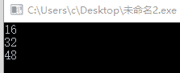

发表于 2019-10-15 06:08:47

* * *

## 70

下面代码打印结果为（）

```cpp
class Base {
char data[3];
public:
virtual void f() { cout << "Base::f" << endl; }
virtual void g() { cout << "Base::g" << endl; }
virtual void h() { cout << "Base::h" << endl; }

};
int main()
{
cout << sizeof(Base)<< endl;
return 0; 
}
```

正确答案: C   你的答案: 空 (错误)

```cpp
6
```

```cpp
7
```

```cpp
8
```

```cpp
9
```

本题知识点

测试工程师 360 公司 C++ 测试开发工程师 360 公司 2018

讨论

[听见梁山](https://www.nowcoder.com/profile/728996766)

类中有虚函数时，在对类分配存储空间时，先给虚函数表分配内存，紧接着再给类中的数据成员分配内存。本题中虚函数表 32 位系统下，虚函数指针占 4 个字节，然后紧接着给数据成员分配内存，占 3 个字节，考虑到对齐规则，因此 char 型变量会自动补齐。故总共占 8 个字节。

发表于 2019-08-30 19:56:01

* * *

[诚惶诚恐](https://www.nowcoder.com/profile/210536695)

char data[3] 4 字节 指向虚函数表的指针 4 字节

发表于 2019-08-21 13:38:16

* * *

[aidam 然](https://www.nowcoder.com/profile/313596834)

虚函数指针 4 个字节数据成员 3 个字节自动补齐

发表于 2019-10-11 15:39:46

* * *

## 71

在 C 语言源程序的开始处通常加上预处理命令 #include   <stdio.h> 的原因是

正确答案: A   你的答案: 空 (错误)

```cpp
stdio.h 文件中包含标准输入输出函数的函数声明，通过引用此文件以便能正确使用 printf、scanf 等函数
```

```cpp
将 stdio.h 中标准输入输出函数的二进制代码插入到引用处，以便进行编译链接
```

```cpp
将 stdio.h 中标准输入输出函数的源程序插入到引用处，以便进行编译链接
```

```cpp
将 stdio.h 中标准输入输出函数链接到编译生成的可执行文件中，以便能正确运行
```

本题知识点

测试工程师 360 公司 C++ 测试开发工程师 360 公司 2018

讨论

[黄色变白色](https://www.nowcoder.com/profile/8547911)

#include 不是把头文件里的内容拷贝到这个位置吗？还是我菜？时隔五个月后再次做错了.....我不确定是答案有问题还是我想错了，翻了《c++ prime plus》在第 16 页是这么写的#include<iostream>该编译指令导致预处理器将 iostream 文件的内容添加到程序中。这是一种典型的预处理器操作：在源代码被编译之前，替换或添加文本。仔细想了想，确实 A 说得有道理，**stdio.h**文件中包含标准输入输出函数的**函数声明，****stdio.c**中才包含标准输入输出函数的源程序。

编辑于 2020-02-12 13:57:22

* * *

## 72

有转义字符如下：
'\0X41'、'\0x41'、'\X41'、'\x41'、'\a'、'\b'、'\c'、'\r'
其中错误的转义字符个数是

正确答案: C   你的答案: 空 (错误)

```cpp
0 个
```

```cpp
2 个
```

```cpp
4 个
```

```cpp
6 个
```

本题知识点

测试工程师 360 公司 C++ 测试开发工程师 360 公司 2018

讨论

[是老胡没错](https://www.nowcoder.com/profile/983604273)

\xhh 两位十六进制 gu(x 小写)，没有\c 的转义字符，故 4 个

发表于 2019-08-28 11:37:25

* * *

[liuyong1995](https://www.nowcoder.com/profile/848814784)

转义字符表示十六进制为‘\x00'，x 一定是小写

发表于 2019-08-22 21:55:54

* * *

## 73

关于 C 语言，下列指针变量的定义和解释，均正确的是

正确答案: A   你的答案: 空 (错误)

```cpp
int  *p[10];    //定义 10 个指针变量组成的指针数组
```

```cpp
int  *p();    //定义一个函数的指针，将来可用此指针指向一个函数
```

```cpp
int  (*p)[];  //定义一个行指针
```

```cpp
int **p;  //定义一个指针变量，该指针变量可以指一个向二维数组
```

本题知识点

测试工程师 360 公司 C++ 测试开发工程师 360 公司 2018

讨论

[子衿 201810082028961](https://www.nowcoder.com/profile/830798871)

我觉着 a 和 d 都对

发表于 2019-12-03 09:12:08

* * *

[一朵睡着的云](https://www.nowcoder.com/profile/1357755)

从右往左看，按照优先级，p 先与[]组合，表明是个数组，int*表示数组中存放的数据类型，所以数组中存放 10 个 int 类型的指针

发表于 2019-10-30 22:19:06

* * *

## 74

#include "file.h"和#include <file.h>的区别是（      ）

正确答案: A   你的答案: 空 (错误)

```cpp
#include &quot;file.h&quot;是指编译器将从当前工作目录上开始查找此文件
```

```cpp
#include &lt;file.h&gt;是指编译器将从当前工作目录上开始查找此文件
```

```cpp
#include &quot;file.h&quot;指编译器将从标准库目录中开始查找此文件
```

```cpp
#include &lt;file.h&gt;指编译器将从标准库目录中开始查找此文件
```

本题知识点

测试工程师 360 公司 C++ 测试开发工程师 360 公司 2018

讨论

[黄色变白色](https://www.nowcoder.com/profile/8547911)

&lt 是指编译器将从标准库目录中开始查找此文件，查不到然后再去找其他地方

编辑于 2019-10-03 11:08:12

* * *

[到底是幼稚](https://www.nowcoder.com/profile/232324507)

D 选项，编译器会去系统配置的库环境变量和用户配置的路径去搜索

发表于 2019-08-29 11:53:36

* * *

## 75

下列程序的功能是输出 a 数组中小写字母的个数，请为横线处选择合适的程序（      ）
#include <stdio.h>
main()
{ char a[]="123abc";
int i,num=0;
for(i=0;_________;i++)
if(a[i]>='a'&&a[i]<='z') num++;
printf("%d\n",num);
}

正确答案: A   你的答案: 空 (错误)

```cpp
a[i]!='\0'
```

```cpp
a[i]==0
```

```cpp
a[i]=='\0'
```

```cpp
a[i]!=0
```

本题知识点

测试工程师 360 公司 C++ 测试开发工程师 360 公司 2018

讨论

[Truman2019](https://www.nowcoder.com/profile/367562695)

D 可以吗

发表于 2019-09-06 22:21:57

* * *

## 76

若有定义语句：
int  a [2][3],(*p)[3],*q[3];，则以下赋值语句正确的是（      ）

正确答案: A   你的答案: 空 (错误)

```cpp
p=a;
```

```cpp
q=a;
```

```cpp
p=&amp;s[1];
```

```cpp
q=&amp;s[1];
```

本题知识点

测试工程师 360 公司 C++ 测试开发工程师 360 公司 2018

讨论

[许愿有个 offer](https://www.nowcoder.com/profile/458090646)

首先这道题 CD 不选，因为有问题其次，[]的优先级比*的优先级高，所以*q[3]表示的是指针数组，这个数组又是那个元素，每个元素都是指针(*p)[3]表示的 p 指向一个有三个元素的数组，而二维数组其实就是一维数组，a[2][3]有三个元素，每个元素又有两个值，所以 p=a 是对的

发表于 2019-09-08 15:22:01

* * *

## 77

请将 B 类的构造函数补充完整，要求用 x 初始化 a.请为横线处选择合适的程序（      ）
class A
{ int a;
public:
A(int x=0) { a=x; } };
class B: public A {
int b;
public:
B(int x): ______________
{ b=x+1; } };

正确答案: B   你的答案: 空 (错误)

```cpp
a(x)
```

```cpp
A(x)
```

```cpp
B(x)
```

```cpp
a=x
```

本题知识点

测试工程师 360 公司 C++ 测试开发工程师 360 公司 2018

## 78

下列关于构造函数的说法，错误的是（）

正确答案: A   你的答案: 空 (错误)

```cpp
构造函数不可以是私有的(private)
```

```cpp
一个类中可以有多个构造函数
```

```cpp
无论何时，只要类的对象被创建，就会执行构造函数
```

```cpp
构造函数没有返回类型
```

本题知识点

测试工程师 360 公司 C++ 测试开发工程师 360 公司 2018

讨论

[wkbo](https://www.nowcoder.com/profile/34311427)

限制构造函数不能定义在 public 中，可以定义在 protected/private 中，所以构造函数可以是私有的

发表于 2019-09-09 20:39:35

* * *

[是小明呀](https://www.nowcoder.com/profile/951928338)

构造函数是可以私有的

发表于 2019-09-03 20:49:34

* * *

## 79

下列关于类中的静态成员的说法错误的是（）

正确答案: D   你的答案: 空 (错误)

```cpp
虽然静态成员不属于类的某个对象，但是我们仍然可以使用类的对象、引用或者指针来访问静态成员
```

```cpp
成员函数不用通过作用域运算符就能直接使用静态成员
```

```cpp
静态数据成员不是由类的构造函数初始化的
```

```cpp
静态成员不可以作为默认实参
```

本题知识点

测试工程师 360 公司 C++ 测试开发工程师 360 公司 2018

讨论

[moonG](https://www.nowcoder.com/profile/851768458)

非静态成员不能作为默认实参。 静态成员的值在对象申请前就已经确定，所以可以作为默认实参

发表于 2019-09-08 09:09:41

* * *

[刘诗歌](https://www.nowcoder.com/profile/406172105)

我再也不想做 360 的题啦，谁能告诉我怎么把他家的题都屏蔽掉

发表于 2019-10-12 21:12:21

* * *

## 80

```cpp
#include <bits/stdc++.h>
using namespace std;
int main() {
int n;
scanf("%d", &n);
map <int, int> xs;
map <int, int> ys;
map < pair <int, int>, int > zs;
long long ans = 0;
for (int i = 0; i < n; i++) {
int x, y;
scanf("%d %d", &x, &y);
ans += (xs[x]++);
ans += (ys[y]++);
ans -= (zs[make_pair(x, y)]++);
}
cout << ans << endl;
return 0;
}
```

输入：
6
0 0
0 1
0 2
-1 1
0 1
1 1
则上述程序输出为( )

正确答案: C   你的答案: 空 (错误)

```cpp
9
```

```cpp
10
```

```cpp
11
```

```cpp
12
```

本题知识点

测试工程师 360 公司 C++ 测试开发工程师 360 公司 2018

讨论

[初见还是重逢](https://www.nowcoder.com/profile/916928686)

所有的过程为

+0 +0 -0

+1 +0 -0

+2 +0 -0

+0 +1 -0

+3 +2 -1

+0 +3 -0

发表于 2019-09-20 10:09:19

* * *

[随心而安的小胖纸](https://www.nowcoder.com/profile/534763702)

不懂(=_=)

发表于 2019-09-19 15:10:05

* * *

## 81

```cpp
#include <bits/stdc++.h>
using namespace std;
int main(){
int n = 1001;
int ans = 0;
for(int i = 1; i <= n; ++i){
ans ^= i % 3;
}
cout << ans << endl;
}
```

则上述程序输出为( )

正确答案: B   你的答案: 空 (错误)

```cpp
-2
```

```cpp
0
```

```cpp
1
```

```cpp
2
```

本题知识点

测试工程师 360 公司 C++ 测试开发工程师 360 公司 2018

讨论

[憨皮](https://www.nowcoder.com/profile/936697383)

选 B，自己写一下可以发现在异或的过程中 ans 的值每六个循环一次（1，3，3，2，0，0），所以循环 1001 次后（1001%6=5），ans 的值就应该是第五个，即 ans=0.

发表于 2019-09-11 08:27:25

* * *

[Sakula](https://www.nowcoder.com/profile/6398527)

^为异或，一个值异或其本身为 0。这里 1001 次循环，总共会有 334 个 1,334 个 2 和 333 个 0 进行异或，1 和 2 都被抵消，所以结果为 0。

发表于 2019-09-06 00:05:55

* * *

[乍也不觉冷](https://www.nowcoder.com/profile/714914026)

【1】^=   相当于 a^=b;   a=a^b;   【2】 是写成二进制 ，按位与    说的没错吧

发表于 2019-09-27 07:59:35

* * *

## 82

下列程序运行结果为：

```cpp
a=[2, 4, 6, 8, 20,30,40]
print(a[::2])
print(a[-2:])
```

正确答案: A   你的答案: 空 (错误)

```cpp
[2, 6, 20, 40] [30, 40]
```

```cpp
[4, 8, 30] [30, 40]
```

```cpp
[2, 6, 20, 40] [40]
```

```cpp
[4, 8, 30] [30]
```

本题知识点

测试工程师 360 公司 测试开发工程师 2018 Python

讨论

[一个 201906081840883](https://www.nowcoder.com/profile/428036947)

a[-2:-1] 结果 [30] a[-2:] 结果 [30,40]

发表于 2021-03-31 18:58:15

* * *

[暮雨梅花](https://www.nowcoder.com/profile/992828390)

此题为 Python 题，以下摘自网友的总结：

[Python 序列的切片操作与技巧(By iFantasticMe)](https://www.cnblogs.com/ifantastic/archive/2013/04/15/3021845.html)

> 对于具有序列结构的数据来说，切片操作的方法是：***consequence[start_index: end_index: step]***。
> 请在这里输入引用内容
> **start_index**：
> 表示是第一个元素对象，正索引位置默认为 0；负索引位置默认为 -len(consequence)
> **end_index**：
> 表示是最后一个元素对象，正索引位置默认为 len(consequence)－1；负索引位置默认为 -1。
> **step**：
> 表示取值的步长，默认为 1，步长值不能为 0。

发表于 2019-08-31 16:51:24

* * *

[牛客 697530460 号](https://www.nowcoder.com/profile/697530460)

正向是从 0 开始，反向是-1，不写就是默认从头开始，尾结束。第三个参数默认是 1，即一个一个取，如果是 2，就两个取一个，3 就三个取一个

发表于 2021-06-21 17:26:11

* * *

## 83

下列程序运行结果为：

```cpp
a=[1, 2, 3, 4, 5]
sums = sum(map(lambda x: x + 3, a[1::3]))
print(sums)
```

正确答案: B   你的答案: 空 (错误)

```cpp
10
```

```cpp
13
```

```cpp
15
```

```cpp
17
```

本题知识点

测试工程师 360 公司 测试开发工程师 2018 Python

讨论

[liuzhen007](https://www.nowcoder.com/profile/873052646)

首先要说明的是，这是一段 python 代码，不搞 python 的可以绕过。运行 a[1::3]，从 index=1 开始，步幅为 3，到一个新的数组 b，b=[2,5]；运行 map(lambda x: x + 3, b)，数组 b 中每个元素加 3，又得到一个新的数组 c，c=[5,8]；
运行 sums = sum(c)，求和得到 sums=13；因此选 B。

发表于 2019-11-28 17:29:22

* * *

[不是江小白](https://www.nowcoder.com/profile/550965516)

简单补充一下关于 a[1::3]形式 的解释：这是 Python 里面的切片步长写法，它的原始形式应该是这样的：**[start: end : step] ****表示“从开始索引位置的那个值计算，经过多少步长到结束索引位置”，有时候 end 会被省略**。所以这里就表示从索引为 1 的（a=[1, 2, 3, 4, 5]）数字，就是这里的 2（因为索引都是从 0 开始计算）开始计算 三步，下一个就是 5。

发表于 2020-08-27 16:38:25

* * *

[小白但大龄](https://www.nowcoder.com/profile/622217650)

```cpp
a=[1, 2, 3, 4, 5]
sums = sum(map(lambda x: x + 3, a[1::3])) 
'''
a[1::3]意思是切片取值
a[1]=2,：代表取值到列表结尾，3 为步长 ，取值结果为[2,5]
lambda 匿名函数 返回 x+3，则为[5,8]，再求合 13
'''
print(sums)
```

发表于 2020-08-02 01:25:31

* * *

## 84

下列程序运行结果是：
list1 = [3, 6, 8, 4, 9, 5, 6]
list2 = [5, 6, 10, 17, 11, 2]
list3=list1+list2
print sorted(list(set(list3)))

正确答案: A   你的答案: 空 (错误)

```cpp
[2, 3, 4, 5, 6, 8, 9, 10, 11, 17]
```

```cpp
[2, 3, 4, 5, 6, ，6,6，8, 9, 10, 11, 17]
```

```cpp
[17, 11, 10, 9, 8, 6, 5, 4, 3, 2]
```

```cpp
[17, 11, 10, 9, 8, 6, ，6,6，5, 4, 3, 2]
```

本题知识点

测试工程师 360 公司 C++ 测试开发工程师 360 公司 2018

讨论

[Double_Li](https://www.nowcoder.com/profile/38215080)

set 不允许两个元素有相同的键值。相当于去重，然后按升序排列

发表于 2019-09-20 14:03:58

* * *

[kjnzhibo](https://www.nowcoder.com/profile/5272413)

先把 list3 转成集合，再把集合转成列表，最后对列表排序

发表于 2019-09-10 13:44:56

* * *

## 85

对于以下代码，描述正确的是：

```cpp
list = ['1', '2', '3', '4', '5']
print list[10:]
```

正确答案: D   你的答案: 空 (错误)

```cpp
导致 IndexError
```

```cpp
输出['1', '2', '3', '4', '5']
```

```cpp
编译错误
```

```cpp
输出[]
```

本题知识点

测试工程师 360 公司 Python 测试开发工程师 2018

讨论

[1Colorsi](https://www.nowcoder.com/profile/986315115)

切片操作不会引起下标越界异常

发表于 2019-11-22 12:09:30

* * *

[azedplayer](https://www.nowcoder.com/profile/1871642)

切片不会导致越界，但通过下标访问会越界。list[10:]行 list[10]🚶‍

发表于 2020-07-30 15:00:22

* * *

[幽游 12](https://www.nowcoder.com/profile/849010786)

Python 切片不提示越界

发表于 2019-11-23 12:13:08

* * *

## 86

下面程序运行结果为：

```cpp
for i in range(5):
i+=1
print("-------")
if i==3:
continue
print(i)
```

正确答案: A   你的答案: 空 (错误)

```cpp
------- 1 ------- 2 ------- ------- 4 ------- 5
```

```cpp
------- 1 ------- 2
```

```cpp
------- 1 ------- 2 ------- 3
```

```cpp
------- 1 ------- 2 ------- 4 ------- 5
```

本题知识点

测试工程师 360 公司 C++ 测试开发工程师 360 公司 2018

讨论

[星空之谜](https://www.nowcoder.com/profile/367863836)

这是 Python 吧，缩进还没缩

发表于 2019-09-03 20:41:06

* * *

## 87

以下程序输出为：

```cpp
info = {'name':'班长', 'id':100, 'sex':'f', 'address':'北京'}
age = info.get('age')
print(age)
age=info.get('age',18)
print(age)
```

正确答案: A   你的答案: 空 (错误)

```cpp
None 18
```

```cpp
None None
```

```cpp
编译错误
```

```cpp
运行错误
```

本题知识点

测试工程师 360 公司 Python 测试开发工程师 2018

讨论

[牛客 817257861 号](https://www.nowcoder.com/profile/817257861)

获取字典 dict 中 key 的值：dict.get(key,default=None），如果 key 在 dict 中则返回对应的值，否则返回 default 的值，其中 default 的值可自己指定[`www.runoob.com/python/att-dictionary-get.html`](https://www.runoob.com/python/att-dictionary-get.html)

发表于 2019-12-26 19:52:50

* * *

[鹿温柔](https://www.nowcoder.com/profile/340634989)

本题考查的是字典的 get 方法 dict.get(key, value=None)当 value 的值存在时返回其本身，当 key 的值不存在时返回 None（即默认参数）。

发表于 2019-12-28 08:59:07

* * *

[jacky.zzz](https://www.nowcoder.com/profile/941991008)

考察字典的取值方法：dict.get(key, default=None)  返回指定 key 在字典中的值，如果 key 在字典中不存在则返回 default 的值（default 值默认为 None，也可以自己指定）；对比记忆：dict['key'] 返回指定 key 在字典中的值，如果 key 则字典中不存在，则直接报错 dict.setdefault(key,default=None) 如果 key 在字典中存在，则返回 key 在字典中指定的值；如果 key 值不存在，则默认将 key 添加到字典中去，并将其值设置为 default（default 默认值为 None，也可以自己指定）

发表于 2020-05-29 17:57:02

* * *

## 88

以下程序输出为：

```cpp
# -*- coding:utf-8 -*-
def test(a, b, *args):
    print(a)
    print(b)
    print(args)

test(11, 22, 33, 44, 55, 66, 77, 88, 99)
```

正确答案: A   你的答案: 空 (错误)

```cpp
11 22 (33, 44, 55, 66, 77, 88, 99)
```

```cpp
编译错误
```

```cpp
运行错误
```

```cpp
11 22 (11,22，33, 44, 55, 66, 77, 88, 99)
```

本题知识点

测试工程师 360 公司 Python 测试开发工程师 2018

讨论

[牛客 336926977 号](https://www.nowcoder.com/profile/336926977)

def test(a,b,*args)a,b 位置参数；*args 为不定长位置参数，传入的参数被放入一个元祖里。所以，a,b 分别被赋值 11、22，而其他的数被存到一个元组里。

编辑于 2019-12-25 11:24:26

* * *

[Fabulous_HK](https://www.nowcoder.com/profile/201232292)

一般在定义函数的时候，我们可能不知道也不限制参数的数量，这个时候就可以用*args、**kwargs，*args 表示参数在被传入的时候自动组装为一个元组，**kwargs 要用=连接键和值。例如：def person(name, age, **kw):
    print('name:', name, 'age:', age, 'other:', kw)
>>> person('Bob', 35, city='Beijing')
name: Bob age: 35 other: {'city': 'Beijing'}

a、b 是位置参数，除了位置参数、变长参数、关键字参数外，还有默认参数、命名关键字参数

发表于 2020-08-30 20:56:55

* * *

[鹿温柔](https://www.nowcoder.com/profile/340634989)

a，b 为位置参数，*args 为不定长度参数。当 a，b 位置各传入一个值后，剩下的值被传入 *args，被放入一个元组中。

发表于 2019-12-26 09:25:51

* * *

## 89

以下程序输出为：

```cpp
def w1():
   print('正在装饰')
   def inner():
        print('正在验证权限')

   return inner()

w1()
```

正确答案: A   你的答案: 空 (错误)

```cpp
正在装饰 正在验证权限
```

```cpp
正在装饰
```

```cpp
正在验证权限
```

```cpp
运行错误
```

本题知识点

测试工程师 360 公司 Python 测试开发工程师 2018

讨论

[流浪者 8](https://www.nowcoder.com/profile/7147312)

如果外层函数返回的是一个函数名的话，运行结果应该是：正在装饰如果外层函数返回的是函数调用的话，运行结果是：正在装饰 正在验证权限

编辑于 2019-11-13 10:03:35

* * *

[Sundy_-](https://www.nowcoder.com/profile/851954)

因为`return inner()`后面有括号所以会执行函数。如果改成：

```cpp
def w1():
    print("正在装饰")
    def inner():
        print("正在验证权限")
    return inner
```

最后一行的括号去掉，那么结果就是“正在装饰”

发表于 2019-11-21 21:29:28

* * *

[上善若水 201904291109398](https://www.nowcoder.com/profile/745047554)

def w1():   print('正在装饰')   def inner():        print('正在验证权限')   return inner()w1()w1()调用会打印“正在装饰”，w1()的最后有调用了 inner()，会打印“正在验证权限”

发表于 2019-12-04 03:06:16

* * *

## 90

以下代码运行结果为：

```cpp
func = lambda x:x%2
result = filter(func, [1, 2, 3, 4, 5])
print(list(result))
```

正确答案: A   你的答案: 空 (错误)

```cpp
[1,3,5]
```

```cpp
[1,2,1,0,1]
```

```cpp
[1, 2, 3, 4, 5]
```

```cpp
[1,2,3]
```

本题知识点

测试工程师 360 公司 测试开发工程师 2018 Python

讨论

[—永恒 N 守护](https://www.nowcoder.com/profile/213052882)

filter(function, iterable)filter 函数是 python 中的高阶函数, 第一个参数是一个筛选函数, 第二个参数是一个可迭代对象, 返回的是一个生成器类型, 可以通过 next 获取值. 这里大致讲述下原理, filter()把传入的 function 依次作用于 iterable 的每个元素, 满足条件的返回 true, 不满足条件的返回 false, 通过 true 还是 false 决定将该元素丢弃还是保留.所以对 2 和 4 取余为 0 舍弃 1.3.5 取余为 1 为真保留；

发表于 2020-01-15 11:38:39

* * *

[hacker_LH](https://www.nowcoder.com/profile/239207751)

这是 C++吗，还是我走错了🙃

发表于 2020-02-23 09:38:39

* * *

[孤行 ZGT](https://www.nowcoder.com/profile/399677803)

filter 函数返回值为真的部分

发表于 2021-03-16 10:17:00

* * *

## 91

在 python 中，使用 open 方法打开文件,语法如下：
open(文件名，访问模式)
如果以二进制格式打开一个文件用于追加，则访问模式为：

正确答案: C   你的答案: 空 (错误)

```cpp
rb
```

```cpp
wb
```

```cpp
ab
```

```cpp
a
```

本题知识点

测试工程师 360 公司 Python 测试开发工程师 360 公司 2018

讨论

[苟全性命于乱世](https://www.nowcoder.com/profile/3148132)

r:只读模式 w:写（覆盖写）a:追加模式二进制是 b 应该都知道

发表于 2019-08-23 11:15:38

* * *

[吾笑转身回](https://www.nowcoder.com/profile/257900701)

r 只读 w 只写，覆盖掉文件里的内容 a 追加 b 二进制

发表于 2019-09-26 22:57:51

* * *

## 92

Python 调用(   )函数可实现对文件内容的读取

正确答案: A   你的答案: 空 (错误)

```cpp
read()
```

```cpp
readline()
```

```cpp
readlines()
```

```cpp
readclose()
```

本题知识点

测试工程师 360 公司 Python 测试开发工程师 360 公司 2018

讨论

[苟全性命于乱世](https://www.nowcoder.com/profile/3148132)

read:读取整个文件，内容为字符串 readline：返回下一行，内容为字符串；readlines:返回 list,保存有每行的数据。

发表于 2019-08-23 12:04:09

* * *

[吾笑转身回](https://www.nowcoder.com/profile/257900701)

read()：整个内容 readlines()：内容以行为分割构成列表 readline()：每次只读一行，速度慢，相对不消耗内存。 readlines()方法：读取整个文件所有行，保存在一个列表(list)变量中，该列表可以由 Python 的 for in 结果进行处理，每行作为一个元素，但读取大文件会比较占内存。 readline()方法：从字面意思可以看出，该方法每次读出一行内容，所以，读取时占用内存小，比较适合大文件，该方法返回一个字符串对象。

发表于 2019-09-26 23:05:24

* * *

## 93

下列程序打印结果为（      ）
nl = [1,2,5,3,5]

nl.append(4)
nl.insert(0,7)
nl.sort()

print nl

正确答案: A   你的答案: 空 (错误)

```cpp
[1, 2, 3, 4, 5, 5, 7]
```

```cpp
[0, 1, 2, 3, 4, 5, 5]
```

```cpp
[1, 2, 3, 4, 5, 7]
```

```cpp
[7, 5, 4, 3, 2, 1]
```

本题知识点

测试工程师 360 公司 Python 测试开发工程师 360 公司 2018

讨论

[超磊乐](https://www.nowcoder.com/profile/864957987)

1 先在列表最后追加 4 [1 2 5 3 5 4] 2 再在列表第一个位置添加 7 [7 1 2 5 3 5 4] 3 排序（不去重）[1 2 3 4 5 5 7]

编辑于 2019-08-19 16:13:38

* * *

[卡卡 32767](https://www.nowcoder.com/profile/91940564)

append 是向后追加，insert 是在注定位置插入，第一个参数是位置

发表于 2019-08-25 09:19:25

* * *

## 94

以下代码段执行后的输出结果为

```cpp
public class Test {
    public static void main(String args[]) {
        int x = -5;
        int y = -12;
        System.out.println(y % x);
    }
}
```

正确答案: D   你的答案: 空 (错误)

```cpp
-1
```

```cpp
2
```

```cpp
1
```

```cpp
-2
```

本题知识点

测试工程师 360 公司 Java 测试开发工程师 2018

讨论

[HEJIANPENGi](https://www.nowcoder.com/profile/687339742)

取模运算，结果的符号和被除数符号一致，切记切记

发表于 2019-09-03 14:24:55

* * *

[阳仔学编程](https://www.nowcoder.com/profile/744696719)

当 x 和 y 的正负相同时，取余和取模结果相同；

当 x 和 y 的正负不同时，取余结果的符号和 x 相同，取模结果的符号和 y 相同。（口诀：取余取头，取模取尾）

发表于 2019-11-14 17:01:21

* * *

[coders_nw](https://www.nowcoder.com/profile/986690268)

Y(被除数) % X(除数) 当除数与被除数的符号相同时，取余和取模的结果是完全相同的； 当除数与被除数的符号不相同时，结果不同。 　　具体说，取余结果的符号与被除数相同；取模结果的符号与除数相同。 通常取模运算也叫取余运算，他们都遵循处罚法则，返回结果都是余数； 1.取余 　　 rem(3,2)=1 　　 rem(-3,-2)=-1 　　 rem(3,-2)=1 　　 rem(-3,2)=-1 　　 2.取模 　　 mod(3,2)=1 　　 mod(-3,-2)=-1 　　 mod(3,-2)=-1 　　 mod(-3,2)=1

编辑于 2019-12-03 09:51:42

* * *

## 95

下列程序 test 类中的变量 c 的最后结果为
public class Test {
public static void main(String args[]) {
int a = 10;
int b;
int c;
if (a > 50) {
b = 9;
}
c = b + a;
}
}

正确答案: D   你的答案: 空 (错误)

```cpp
10
```

```cpp
0
```

```cpp
19
```

```cpp
编译出错
```

本题知识点

测试工程师 360 公司 Java 测试开发工程师 360 公司 2018

讨论

[给我 offer 吧我要哭了](https://www.nowcoder.com/profile/230952597)

局部变量需要初始值 局部变量需要初始值 局部变量需要初始值我要做多少次才能记住！！！

发表于 2019-08-22 09:55:30

* * *

[Java_ 小兵](https://www.nowcoder.com/profile/652535430)

局部变量必须先初始化

发表于 2019-08-26 15:44:14

* * *

[开水 KaisLeung](https://www.nowcoder.com/profile/7396825)

要注意，这里的变量都是局部变量！！需要初始化值

发表于 2019-08-30 16:42:11

* * *

## 96

以下代码的循环次数是

```cpp
public class Test {
public static void main(String args[]) {
int i = 7;
do {
System.out.println(--i);
--i;
} while (i != 0);
System.out.println(i);
}
}
```

正确答案: D   你的答案: 空 (错误)

```cpp
0
```

```cpp
1
```

```cpp
7
```

```cpp
无限次
```

本题知识点

测试工程师 360 公司 Java 测试开发工程师 2018

讨论

[全废工程师](https://www.nowcoder.com/profile/304463687)

每次-2， 减三次 1 减第四次－1 等不到 0，理论一直做

发表于 2019-08-21 07:35:43

* * *

[一天一到 lc](https://www.nowcoder.com/profile/3438404)

这道基本的题都做错了，我第一时间认为自己主要的原因是马虎，但其实还是因为自己都基础知识不行。

发表于 2020-02-15 09:48:49

* * *

[小杨小杨神采飞扬](https://www.nowcoder.com/profile/925864942)

单独的--i 和 i--没有区别，但是在表达式中，--i 会先进行自减再执行语句，而 i--是先执行语句再进行自减，这一题每次循环执行输出语句时 i 自减 1，执行--i 时再次自减 1，每次循环减 2，总值为 7，第四次执行循环时，i=-1，不等于 0，所以会无限循环

发表于 2020-04-29 20:30:49

* * *

## 97

以下代码的输出的正确结果是

```cpp
public class Test {
public static void main(String args[]) {
String s = "祝你考出好成绩！";
System.out.println(s.length());
}
}
```

正确答案: D   你的答案: 空 (错误)

```cpp
24
```

```cpp
16
```

```cpp
15
```

```cpp
8
```

本题知识点

测试工程师 360 公司 Java 测试开发工程师 2018

讨论

[201902272044380](https://www.nowcoder.com/profile/880193396)

这题就是问这个字符串的长度，没有问占多少个字节啊，不用想的太复杂，就是 8.

发表于 2019-09-18 12:59:27

* * *

[钟期既遇](https://www.nowcoder.com/profile/651790790)

宝贝们，别想太多，length() 方法返回的就是字符串的长度，一个 char 可以存下汉字，剩下的数数就完事了。

如果想获得占用字节数的话，可以用 s.getBytes(“GBK”).length，结果就是 16 了。

编辑于 2020-06-26 02:15:38

* * *

[小道仙](https://www.nowcoder.com/profile/264325265)

最后一个不是空格，是中文下面的 "！"

发表于 2019-09-02 13:08:49

* * *

## 98

下面 JAVA 代码行 float t=5.1; int i=t; 不正确的是

正确答案: B   你的答案: 空 (错误)

```cpp
代码不能编译
```

```cpp
代码编译, i 被设置为 5
```

```cpp
第一行若改为 float t = (float) 5.1，则可编译
```

```cpp
第一行若改为 float t=5.1f ，则可编译
```

本题知识点

测试工程师 360 公司 Java 测试开发工程师 2018

讨论

[杉笨笨](https://www.nowcoder.com/profile/227172342)

题目要求是不正确的是，，

发表于 2019-08-25 16:12:46

* * *

[胡宁松](https://www.nowcoder.com/profile/486478503)

个人认为本题应该只有 A 是正确答案，自己测试发现只改一句都不能进行编译，两个分别改为 float t=5.1f；int i=（int）t；才能使整体通过编译

发表于 2019-08-27 11:54:03

* * *

[yuangs](https://www.nowcoder.com/profile/5920001)

话不多说，看图
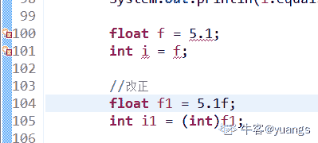

发表于 2019-08-21 16:34:16

* * *

## 99

关于 protected 修饰的成员变量，以下说法正确的是

正确答案: A   你的答案: 空 (错误)

```cpp
可以被该类自身、与它在同一个包中的其它类、在其它包中的该类的子类所访问
```

```cpp
只能被该类本身和该类的所有的子类访问
```

```cpp
只能被该类自身所访问
```

```cpp
只能被同一个包中的类访问
```

本题知识点

测试工程师 360 公司 Java 测试开发工程师 360 公司 2018

讨论

[$枫](https://www.nowcoder.com/profile/443026278)

                            public > protect > (default) > private 四种情况下能不能访问：
        同一个类：   YES       YES         YES     YES
        同一个包:    YES       YES         YES     NO
        不同包子类:  YES       YES         NO      NO
        不同包非子类:YES        NO          NO      NO
        (default)指不写修饰符

发表于 2019-09-02 09:32:30

* * *

[伊万夫斯基](https://www.nowcoder.com/profile/815472960)

等我明天码一个代码上来

发表于 2019-09-02 01:17:27

* * *

[hyperNoob](https://www.nowcoder.com/profile/1731610)

才智平庸的我实在想不明白为啥 Java 要把 protected 设计成可以被本包内访问

发表于 2019-09-26 22:45:12

* * *

## 100

下面关于继承的描述正确的是

正确答案: A   你的答案: 空 (错误)

```cpp
在 Java 中类只允许单一继承
```

```cpp
在 Java 中一个类只能实现一个接口
```

```cpp
在 Java 中一个类不能同时继承一个类和实现一个接口
```

```cpp
Java 的单一继承使代码不可靠
```

本题知识点

测试工程师 360 公司 Java 测试开发工程师 2018

讨论

[IDEA2022.4.2](https://www.nowcoder.com/profile/181223548)

全错，类只支持单继承，接口支持多继承

发表于 2019-08-21 13:08:43

* * *

[Jay201909162127992](https://www.nowcoder.com/profile/641909386)

java 不是可以实现变相多继承么，子类继承父类，父类再继承父类

发表于 2019-09-16 21:37:49

* * *

[编程小海浪](https://www.nowcoder.com/profile/797024057)

这个题应该屏蔽掉，答案全错

发表于 2019-08-22 13:00:29

* * *

## 101

下面关于静态方法说明正确的是

正确答案: B   你的答案: 空 (错误)

```cpp
在静态方法中可用 this 来调用本类的类方法
```

```cpp
在静态方法中调用本类的静态方法时可直接调用
```

```cpp
在静态方法中只能调用本类中的静态方法
```

```cpp
在静态方法中绝对不能调用实例方法
```

本题知识点

测试工程师 360 公司 Java 测试开发工程师 360 公司 2018

讨论

[虹虹爱慕斯](https://www.nowcoder.com/profile/6253864)

A：静态方法没有 this。C：静态方法中可以调用其他类的静态方法，比如我们经常用的 println。D：静态方法可以通过创建类的实例来调用实例方法。个人认为，这题目说起来并不是很严谨，不过能理解题目所要表达的意思就行了，别抠着字眼不放了。

发表于 2019-08-27 08:45:28

* * *

[UnnnnnnU](https://www.nowcoder.com/profile/641374590)

我理解的是这样的  的确静态方法是比实例先加载的 但是题目可能意思是这样的

```cpp
public class A{
    public static void doSome(){}
    public void doSomeOthers(){}
    public A(){}
    public static void main(String... args){
        doSome();
    }
}
```

上面这样是静态方法中直接调用本类的其他静态方法

```cpp
public class A{
    public static void doSome(){}
    public void doSomeOthers(){}
    public A(){}
    public static void main(String... args){
        new A().doSomeOthers();
    }
}
```

而这个就是在静态方法中调用本类的非静态的方法了 所以第三第四选项也是错的至于第一个选项 类加载的时候 关于静态方法局部变量表第一个不是 this 不存在 this

发表于 2019-08-22 09:23:53

* * *

[拼命也要幸福](https://www.nowcoder.com/profile/171607642)

主函数就是静态方法可调用非静态

发表于 2019-09-24 17:21:59

* * *

## 102

以下关于 Integer 与 int 的区别错误的是

正确答案: D   你的答案: 空 (错误)

```cpp
int 是 java 提供的 8 种原始数据类型之一
```

```cpp
Integer 是 java 为 int 提供的封装类
```

```cpp
int 的默认值为 0
```

```cpp
Integer 的默认值为 1
```

本题知识点

测试工程师 360 公司 Java 测试开发工程师 360 公司 2018

讨论

[IDEA2022.4.2](https://www.nowcoder.com/profile/181223548)

包装类默认为 null

发表于 2019-08-21 13:07:58

* * *

## 103

String s = new String("xyz");创建了几个 StringObject？

正确答案: A   你的答案: 空 (错误)

```cpp
两个或一个都有可能
```

```cpp
两个
```

```cpp
一个
```

```cpp
三个
```

本题知识点

测试工程师 360 公司 Java 测试开发工程师 360 公司 2018

讨论

[IDEA2022.4.2](https://www.nowcoder.com/profile/181223548)

常量池中如果有 xyz 对象则创建一个在堆中，反之，一个创建在常量池中，一个创建在堆中

发表于 2019-08-22 22:15:18

* * *

[adminroot](https://www.nowcoder.com/profile/1292047)

只要代码里面有双引号"xxx"都会被放到字符串常量池中，除非常量池中自己有了。 new String("yyyy")在常量池创建"yyyy"，在堆中也创建"yyyy"

编辑于 2019-09-24 18:27:28

* * *

[皮怪-](https://www.nowcoder.com/profile/236774177)

New 肯定会开辟 1 块没错，''xyz''可能开辟 1 块内存(如果前文中有''xyz'',此处不会开辟) 如果选项中没有 1 和或 2 个，选 2 个。

发表于 2019-08-21 14:59:46

* * *

## 104

下面哪些不是 Thread 类的方法

正确答案: C   你的答案: 空 (错误)

```cpp
start()
```

```cpp
run()
```

```cpp
exit()
```

```cpp
getPriority()
```

本题知识点

测试工程师 360 公司 Java 测试开发工程师 360 公司 2018

讨论

[$枫](https://www.nowcoder.com/profile/443026278)

线程常用方法：**start**()： 使该线程开始执行；Java 虚拟机调用该线程的 run 方法。 **[run](https://www.nowcoder.com/test/question/done?tid=27107010&qid=305115)**()：如果该线程是使用独立的 Runnable 运行对象构造的，则调用该 Runnable 对象的 run 方法；否则，该方法不执行任何操作并返回。
**join**()：等待该线程终止。**getPriority**()：返回线程的优先级。
**yield**()：暂停当前正在执行的线程对象，并执行其他线程

发表于 2019-09-05 11:03:22

* * *

[luckykuang](https://www.nowcoder.com/profile/5874337)

答案选 c

exit();是 System 中的方法。

编辑于 2019-08-23 15:09:33

* * *

[你的 offer 对我打了烊](https://www.nowcoder.com/profile/598309941)

ABD 都是用 Thread 类或者子类对象调用的方法，而 exit 是 System 调用的

发表于 2020-03-08 12:01:30

* * *

## 105

```cpp
public static void main(String[] args) {
    Thread t = new Thread() {

        public void run() {
           my360DW();
        }
    };

    t.run();
    System.out.print("DW");

}

static void my360DW() {

    System.out.print("360");

}
```

正确答案: C   你的答案: 空 (错误)

```cpp
DW
```

```cpp
360
```

```cpp
360DW
```

```cpp
都不输出
```

本题知识点

测试工程师 360 公司 Java 测试开发工程师 2018

讨论

[沫~](https://www.nowcoder.com/profile/101973401)

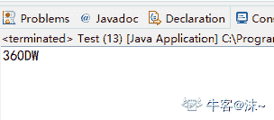这是源码编译运行之后的结果。首先，这道题中并没有出现以数字开头的方法名，因此编译是不会报错的。其次，t.run();并不是对线程的启动，如果是 t.start();才是对线程的启动，因此就是一个简单方法的调用。按照代码的执行顺序输出结果即可。

发表于 2020-09-04 08:42:01

* * *

[不会跳舞的大笨象](https://www.nowcoder.com/profile/892695801)

第一：方法名不能以数字开头，所以编译通不过 第二：改正确方法名后输出“360DW”，本题意在考察开启线程的方法 t.start()和直接调用 t.run()的区别。但在题目中没有提现 注：直接调用线程的 run()方法不是开启线程，就是普通调用，会直接执行 run()方法中的内容

发表于 2019-08-21 07:57:58

* * *

[main 方法栈帧](https://www.nowcoder.com/profile/400417205)

t.run()只是简单的方法调用
所以先执行方法再执行 System.out.print 语句

而 t.start()开启了一个线程 t1
然后 t1 和 main 线程一起执行
main 线程比 t1 优先级高
所以先输出 DW
然后 main 线程结束
再执行 t1 线程的 run 方法

发表于 2021-10-24 18:57:03

* * *

## 106

ArrayList list = new ArrayList(20);中的 list 扩充几次

正确答案: A   你的答案: 空 (错误)

```cpp
0
```

```cpp
1
```

```cpp
2
```

```cpp
3
```

本题知识点

测试工程师 360 公司 Java 测试开发工程师 2018

讨论

[一只 lemon](https://www.nowcoder.com/profile/54132439)

Arraylist 默认数组大小是 10，扩容后的大小是扩容前的 1.5 倍，最大值小于 Integer 的最大值减 8，如果新创建的集合有带初始值，默认就是传入的大小，也就不会扩容

```cpp
private static final int DEFAULT_CAPACITY = 10; private static final int MAX_ARRAY_SIZE = Integer.MAX_VALUE - 8; ```
private void grow(int minCapacity) { // overflow-conscious code  int oldCapacity = elementData.length; int newCapacity = oldCapacity + (oldCapacity >> 1); if (newCapacity - minCapacity < 0)
        newCapacity = minCapacity; if (newCapacity - MAX_ARRAY_SIZE > 0)
        newCapacity = hugeCapacity(minCapacity);  // minCapacity is usually close to size, so this is a win:  elementData = Arrays.copyOf(elementData, newCapacity); }
```cpp 
```

编辑于 2019-09-02 11:18:04

* * *

[翻白草](https://www.nowcoder.com/profile/104439588)

在创建时直接分配了数组的大小，没有扩充

发表于 2019-08-20 19:38:33

* * *

[王梁 201905222117755](https://www.nowcoder.com/profile/971256622)

上来就选 2 次的这里报道一下。

发表于 2020-04-09 12:56:29

* * *

## 107

下面的方法，当输入为 2 的时候返回值是多少？

```cpp
public static int getValue(int i) {
int result = 0;
switch (i) {
case 1:
result = result + i;
case 2:
result = result + i * 2;
case 3:
result = result + i * 3;
}
return result;
}
```

正确答案: D   你的答案: 空 (错误)

```cpp
0
```

```cpp
2
```

```cpp
4
```

```cpp
10
```

本题知识点

测试工程师 360 公司 Java 测试开发工程师 360 公司 2018

讨论

[kitlen](https://www.nowcoder.com/profile/9894211)

如果 case 没有 break 的话，会继续执行后面的语句

发表于 2019-08-20 22:05:54

* * *

[Msr.Busy](https://www.nowcoder.com/profile/41812893)

没有 break，发生 case 穿透现象，程序会继续向下执行，直到遇到 break 或者结束 switch 语句的大括号为止。

发表于 2019-09-23 19:04:27

* * *

[IDEA2022.4.2](https://www.nowcoder.com/profile/181223548)

2*2+2*3 得 10

发表于 2019-08-21 12:32:18

* * *

## 108

抽象类和接口的区别，以下说法错误的是

正确答案: A C D   你的答案: 空 (错误)

```cpp
接口是公开的，里面不能有私有的方法或变量，是用于让别人使用的，而抽象类是可以有私有方法或私有变量的。
```

```cpp
abstract class 在 Java 语言中表示的是一种继承关系，一个类只能使用一次继承关系。但是，一个类却可以实现多个 interface，实现多重继承。接口还有标识（里面没有任何方法，如 Remote 接口）和数据共享（里面的变量全是常量）的作用。
```

```cpp
在 abstract class 中可以有自己的数据成员，也可以有非 abstarct 的成员方法，而在 interface 中，只能够有静态的不能被修改的数据成员（也就是必须是 static final 的，不过在 interface 中一般不定义数据成员），所有的成员方法默认都是 public abstract 类型的。
```

```cpp
abstract class 和 interface 所反映出的设计理念不同。其实 abstract class 表示的是&quot;has-a&quot;关系，interface 表示的是&quot;is-a&quot;关系。
```

本题知识点

测试工程师 360 公司 Java 测试开发工程师 2018

讨论

[TestFlight](https://www.nowcoder.com/profile/884034793)

抽象类：在 Java 中被 abstract 关键字修饰的类称为抽象类，被 abstract 关键字修饰的方法称为抽象方法，抽象方法只有方法的声明，没有方法体。抽象类的特点：a、抽象类不能被实例化只能被继承；b、包含抽象方法的一定是抽象类，但是抽象类不一定含有抽象方法；c、抽象类中的抽象方法的修饰符只能为 public 或者 protected，默认为 public；d、一个子类继承一个抽象类，则子类必须实现父类抽象方法，否则子类也必须定义为抽象类；e、抽象类可以包含属性、方法、构造方法，但是构造方法不能用于实例化，主要用途是被子类调用。*接口*：Java 中接口使用 interface 关键字修饰，特点为:a、接口可以包含变量、方法；变量被隐士指定为 public static final，方法被隐士指定为 public abstract（JDK1.8 之前）；b、接口支持多继承，即一个接口可以 extends 多个接口，间接的解决了 Java 中类的单继承问题；c、一个类可以实现多个接口；d、JDK1.8 中对接口增加了新的特性：        （1）、默认方法（default method）：JDK 1.8 允许给接口添加非抽象的方法实现，但必须使用 default 关键字修饰；定义了 default 的方法可以不被实现子类所实现，但只能被实现子类的对象调用；如果子类实现了多个接口，并且这些接口包含一样的默认方法，则子类必须重写默认方法；        （2）、静态方法（static method）：JDK 1.8 中允许使用 static 关键字修饰一个方法，并提供实现，称为接口静态方法。接口静态方法只能通过接口调用（接口名.静态方法名）。        注意：**jdk1.9 是允许接口中出现 private 修饰的默认方法和静态方法**。
解析：A：jdk1.9 是允许接口中出现 private 修饰的默认方法和静态方法，A 错误；抽象类可以有私有的变量和方法。B：正确 C：抽象类可以有抽象和非抽象的方法；jdk1.8 接口中可以有默认方法和静态方法，C 错误。D：强调继承关系，is-a，如果 A is-a B，那么 B 就是 A 的父类；        代表组合关系，like-a，接口，如果 A like a B，那么 B 就是 A 的接口。 ；        强调从属关系，has-a，如果 A has a B，那么 B 就是 A 的组成部分。D 项错误。

发表于 2021-05-11 14:30:24

* * *

[BanjoWu](https://www.nowcoder.com/profile/633136010)

jdk1.9 以后，接口是可以有私有属性的

发表于 2019-08-30 17:48:30

* * *

[泡泡 201908061058789](https://www.nowcoder.com/profile/458221310)

经供参考：在面向对象设计的领域里，有若干种设计思路，主要有如下三种： 
is-a、has-a、like-a 
is-A 继承关系：“表示类与类之间的继承关系、接口与接口之间的继承的关系以及类对接口实现的关系”。 如果继承过程中，仅仅是覆盖了父类中的方法，则为 is-a 关系。如果有新增的方法，则为 is-like-a 关系。
has-a，顾名思义，有一个，代表从属关系。 如果 A has a B，那么 B 就是 A 的组成部分。
 like-a 不是横不清楚求解……

发表于 2019-08-26 19:47:26

* * *

## 109

下面关于垃圾收集的说法正确的是

正确答案: D   你的答案: 空 (错误)

```cpp
一旦一个对象成为垃圾，就立刻被收集掉。
```

```cpp
对象空间被收集掉之后，会执行该对象的 finalize 方法
```

```cpp
finalize 方法和 C++的析构函数是完全一回事情
```

```cpp
一个对象成为垃圾是因为不再有引用指着它，但是线程并非如此
```

本题知识点

测试工程师 360 公司 Java 测试开发工程师 360 公司 2018

讨论

[木木先生](https://www.nowcoder.com/profile/6445546)

回收之前执行

发表于 2019-08-26 08:39:27

* * *

[和雨相拥](https://www.nowcoder.com/profile/83515675)

感觉 D 也是错的，它讲的是引用计数法，但是现在 JVM 使用的是可达性分析法；引用计数法解决不了循环引用的问题，D 的描述也有问题；

发表于 2019-10-09 17:51:20

* * *

[桃饱网会员](https://www.nowcoder.com/profile/865583081)

1、在 Java 中，当一个对象的引用不存在时，即该对象会被认为是不再需要的，其所占用的内存会被释放回收。2、Java 垃圾回收可以不用进行显式撤销对象，他会在程序运行过程中择机自动发生，不会因为一个或几个对象不再使用而发生。3、在 C++中，使用 delete 运算符来显示的释放动态分配的对象的内存，所以和析构函数还是有区别的。4、finalize 方法是确保一个对象在被**回收之前**，要释放该对象占有的某些资源（例如文件句柄）。所以选 D。

编辑于 2019-09-21 14:25:09

* * *

## 110

以下哪个 I / O 类可以附加或更新文件

正确答案: A   你的答案: 空 (错误)

```cpp
RandomAccessFile()
```

```cpp
OutputStream()
```

```cpp
DataOutputStream()
```

```cpp
None of the above
```

本题知识点

测试工程师 360 公司 Java 测试开发工程师 360 公司 2018

讨论

[aiqian99](https://www.nowcoder.com/profile/650987071)

```cpp
OutputStream()和 DataOutputStream()类 都需要实例化 FileOutputStream()对象，并在参数里加 ture 后才能对文件追加内容；
而 RandomAccessFile()可以通过文件指针向文件末尾追加内容。 不知这样理解对不对  
```

发表于 2019-08-25 16:20:52

* * *

[咸鱼小哲](https://www.nowcoder.com/profile/8534200)

RandomAccessFile 不同于 FileInputStream 和 FileOutputStream,不是他们的子类 
当我们想对一个文件进行读写操作的时候，创建一个指向该文件的 RandomAccessFile 流就可以了 ；但是对于 OutputStream 和 DataOutputStream，我们在使用的时候都是通过他们的构造方法来附加或更新文件，即在构造方法中 new FileOutputStream；题目说的是哪个 I / O 类，是不是 new FileOutputStream 这种操作不算啊 Orz

发表于 2019-09-02 10:48:05

* * *

[不乱于心°](https://www.nowcoder.com/profile/513686990)

求解

发表于 2019-08-24 15:55:28

* * *

## 111

给定以下方法声明，调用执行 mystery（1234）的输出结果？

```cpp
//precondition:  x >=0
public void mystery (int x)
{
System.out.print(x % 10);

if ((x / 10) != 0)
{
mystery(x / 10);
}
System.out.print(x % 10);
}
```

正确答案: B   你的答案: 空 (错误)

```cpp
1441
```

```cpp
43211234
```

```cpp
3443
```

```cpp
12344321
```

本题知识点

测试工程师 360 公司 Java 测试开发工程师 360 公司 2018

讨论

[咸鱼小哲](https://www.nowcoder.com/profile/8534200)

递归调用，先执行的是 mystery(x / 10);这部分，即 1234 输出尾数然后除 10，输出 4321；然后执行 System.out.print(x % 10);即输出 1234；

发表于 2019-09-03 09:35:04

* * *

[美丽的哎我去](https://www.nowcoder.com/profile/833222659)

1234%10=4 第一个数字为 4 选 B

发表于 2019-08-21 09:06:01

* * *

[益阳雷佳音](https://www.nowcoder.com/profile/549218159)

前面那个循环应该都看得懂，后面需要知道的就是 1 对 10 取余等于 1，2 对 10 取余等于 2。 0 对一个数取余结果等于 0

发表于 2019-09-25 16:20:57

* * *

## 112

假设一个 list 初始化为{2，9，5，4，8，1}。 在第一次冒泡排序后，list 变成了（）?

正确答案: D   你的答案: 空 (错误)

```cpp
2, 9, 5, 4, 8, 1
```

```cpp
2, 9, 5, 4, 1, 8
```

```cpp
2, 5, 9, 4, 8, 1
```

```cpp
2, 5, 4, 8, 1, 9
```

本题知识点

测试工程师 360 公司 Java 排序 *测试开发工程师 360 公司 2018* *讨论

[d......](https://www.nowcoder.com/profile/101886262)

并没有说是升序还是降序排列

发表于 2019-08-23 22:22:58

* * *

[IDEA2022.4.2](https://www.nowcoder.com/profile/181223548)

一次冒泡后， 最大值在最后边，选 D

发表于 2019-08-22 22:12:17

* * *

[不浪费每一天](https://www.nowcoder.com/profile/415073079)

这个题直接看最后一位，选最大的 9，然后就选出来了

发表于 2019-10-15 10:01:03

* * *

## 113

如果一个 list 初始化为{5，3，1}，执行以下代码后，其结果为（）？
nums.add(6);
nums.add(0,4);
nums.remove(1);

正确答案: B   你的答案: 空 (错误)

```cpp
[5, 3, 1, 6]
```

```cpp
[4, 3, 1, 6]
```

```cpp
[4, 3, 6]
```

```cpp
[5, 3, 6]
```

本题知识点

测试工程师 360 公司 Java 测试开发工程师 2018

讨论

[要喝手磨咖啡](https://www.nowcoder.com/profile/547420649)

这题至少做三遍了！答案 B 解析如下：nums.add(6);//把 6 添加到 list 中，变为｛5,3,1,6｝
nums.add(0,4);//在 list 的第 0 个位置添加 4，list 变为｛4,5,3,1,6｝
nums.remove(1);//移除 list 的第一个元素，list 变为｛4,3,1,6｝

发表于 2019-08-30 11:47:12

* * *

[Wondovers](https://www.nowcoder.com/profile/669277343)

| boolean | add(E e)将指定的元素追加到此列表的末尾（可选操作）。 |
| void | add(int index, E element)将指定的元素插入此列表中的指定位置（可选操作）。  |

| E           | [](https://www.nowcoder.com/test/question/done?tid=26390607&qid=305124)remove(int index)删除该列表中指定位置的元素（可选操作）。  |
|   |  |

发表于 2019-08-21 21:59:53

* * *

[惠鸿飞](https://www.nowcoder.com/profile/881469708)

记错了 add 方法，翻车了，以为 add(0,4)会把第一个元素替换掉

发表于 2019-11-14 21:57:15

* * *

## 114

假设 num 已经被创建为一个 ArrayList 对象，并且最初包含以下整数值：[0，0，4，2，5，0，3，0]。 执行下面的方法 numQuest(),最终的输出结果是什么？

```cpp
private List<Integer> nums;

//precondition: nums.size() > 0
//nums contains Integer objects
public void numQuest() {
int k = 0;
Integer zero = new Integer(0);
while (k < nums.size()) {
if (nums.get(k).equals(zero))
nums.remove(k);
k++;
}
}
```

正确答案: D   你的答案: 空 (错误)

```cpp
[3, 5, 2, 4, 0, 0, 0, 0]
```

```cpp
[0, 0, 0, 0, 4, 2, 5, 3]
```

```cpp
[0, 0, 4, 2, 5, 0, 3, 0]
```

```cpp
[0, 4, 2, 5, 3]
```

本题知识点

测试工程师 360 公司 Java 测试开发工程师 360 公司 2018

讨论

[何吟芥心](https://www.nowcoder.com/profile/920639547)

第一次循环：k=0 nums[0,0,4,2,5,0,3,0],size=8 nums 的第一位为 0 被移除，此时的 k++第二次循环：k=1 nums[0,4,2,5,0,3,0] size=7 nums 的第一位是 0，但是现在 K=1 不是 K=0😂 ,所以是和 4 比较不成立。下面同理啦第三次循环：k=2 nums[0,4,2,5,0,3,0] size=7 2！=0 第四次循环：k=3 nums[0,4,2,5,0,3,0] size=7 5！=0 第五次循环：k=4 nums[0,4,2,5,0,3,0] size=7 0=0 第六次循环：k=5 nums[0,4,2,5,3,0] size=6 0=0 第七次循环：k=6 nums[0,4,2,5,3] size=5 k>size 结束循环

发表于 2019-08-21 10:16:47

* * *

[刈先生](https://www.nowcoder.com/profile/218336650)

我是蒙的😂

发表于 2019-08-21 00:23:38

* * *

[cnng](https://www.nowcoder.com/profile/7504556)

第一次循环：k=0 nums[0,0,4,2,5,0,3,0],size=8 nums 的第一位为 0 被移除，此时的 k++ 第二次循环：k=1 nums[0,4,2,5,0,3,0] size=7 nums 的第一位是 0，但是现在 K=1 不是 K=0😂 ,所以是和 4 比较不成立。下面同理啦 第三次循环：k=2 nums[0,4,2,5,0,3,0] size=7 2！=0 第四次循环：k=3 nums[0,4,2,5,0,3,0] size=7 5！=0 第五次循环：k=4 nums[0,4,2,5,0,3,0] size=7 0=0 第六次循环：k=5 nums[0,4,2,5,3,0] size=6 0=0 第七次循环：k=6 nums[0,4,2,5,3] size=5 k>size 结束循环

发表于 2019-10-11 09:27:42

* * *

## 115

假定 Base b = new Derived（）; 调用执行 b.methodOne（）后，输出结果是什么？

```cpp
public class Base
{
   public void methodOne()
   {
      System.out.print("A");
      methodTwo();
   }

   public void methodTwo()
   {
      System.out.print("B");
   }
}

public class Derived extends Base
{
   public void methodOne()
   {
      super.methodOne();
      System.out.print("C");
   }

   public void methodTwo()
   {
      super.methodTwo();
      System.out.print("D");
   }
}
```

正确答案: A   你的答案: 空 (错误)

```cpp
ABDC
```

```cpp
AB
```

```cpp
ABCD
```

```cpp
ABC
```

本题知识点

测试工程师 360 公司 Java 测试开发工程师 2018

讨论

[雲流 201909161123101](https://www.nowcoder.com/profile/98402488)

只要是被子类重写的方法，不被 super 调用都是调用子类方法

发表于 2019-10-11 00:41:23

* * *

[!shy！](https://www.nowcoder.com/profile/624288791)

看了上面的解析个人总结的：（有错误希望指正，谢谢*--*）知识点：            1.多态中成员方法使用规则  编译看左边，运行看右边。
            2..多态中，子类重写的方法，当 super 调用就是调用父类方法。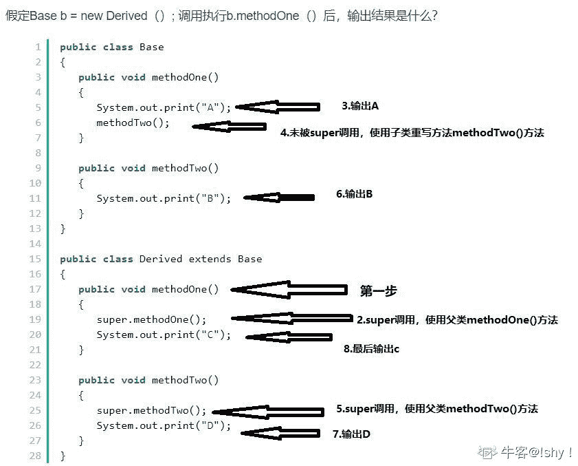

发表于 2020-07-24 21:22:50

* * *

[牛客 407289624 号](https://www.nowcoder.com/profile/407289624)

这是一道类多态的向上转型题。

```cpp
Base b = new Derived();
```

向上转型：父类只能调用父类方法或者子类覆写后的方法,而子类中的单独方法则是无法调用的。因此：调用的顺序是：(1)、(2)、(3)、(4)、(5)、(6)、(7) ; 得到的结果是：ABDC

```cpp
class Base
{ public void methodOne()  // (3)
    {
        System.out.print("A");
        methodTwo();  //执行到这里的时候调用子类的覆盖方法 (4)
    } public void methodTwo() // (7)
    {
        System.out.print("B");
    }
} 
```

```cpp
 class Derived extends Base { public void methodOne() // (1)
    { super.methodOne();   // (2)
        System.out.print("C");
    } public void methodTwo()  //该方法为重写了父类的方法 （5）
    { super.methodTwo(); //(6)
        System.out.print("D");
    }
}
```

发表于 2019-08-30 16:58:06

* * *

## 116

在选择排序中，以下什么情况下选择排序会更快执行？

正确答案: C   你的答案: 空 (错误)

```cpp
数据已按升序排列
```

```cpp
数据已按升降序排列
```

```cpp
俩者花费时间一样
```

本题知识点

测试工程师 360 公司 排序 *测试开发工程师 2018* *讨论

[喵喵狂吠](https://www.nowcoder.com/profile/969895020)

不管升序还是降序 其比较次数都是整条路径

发表于 2019-12-16 19:52:42

* * *

[潇元紫](https://www.nowcoder.com/profile/799021943)

不管升序还是降序，选择排序都会与每个值进行比较

发表于 2019-10-22 18:11:41

* * *

[junlancer](https://www.nowcoder.com/profile/421484341)

交换不也会耗点时间吗

发表于 2020-05-21 08:19:38

* * *

## 117

初始化数组  int [] arr = {2，10，23，31，55，86}，使用二分查询算法查找 55，需要循环执行多少次才能命中目标？

正确答案: B   你的答案: 空 (错误)

```cpp
1
```

```cpp
2
```

```cpp
3
```

```cpp
4
```

本题知识点

测试工程师 360 公司 数组 测试开发工程师 360 公司 2018

讨论

[Room_Aimoer](https://www.nowcoder.com/profile/130225889)

第一次中值为 23，然后最小值下标为中值下标+1，然后第二次 3+5/2=4，中值等于输入值，跳出循环，两次

发表于 2019-10-21 19:11:12

* * *

[仓央、嘉措](https://www.nowcoder.com/profile/190586088)

明确头 尾 中间值即可

发表于 2019-10-15 17:31:09

* * *

## 118

以下哪些方法是 Object 类中的方法

正确答案: A B C D   你的答案: 空 (错误)

```cpp
clone()
```

```cpp
toString()
```

```cpp
wait()
```

```cpp
finalize()
```

本题知识点

测试工程师 360 公司 Java 测试开发工程师 360 公司 2018

讨论

[Skyworth](https://www.nowcoder.com/profile/481188119)

难道是选项里，只有 clone()方法的返回值是 Object😂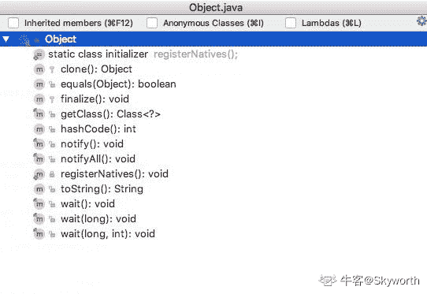 

发表于 2019-08-23 10:06:20

* * *

[zzy1314](https://www.nowcoder.com/profile/400885175)

api 文档里面显示四个方法都是 object 类的方法

发表于 2019-08-21 15:14:08

* * *

[bobbie.ho](https://www.nowcoder.com/profile/426351696)

为什么我的和答案不一样呢、刚把顺丰屏蔽完 360 也开始调皮了😂😂😂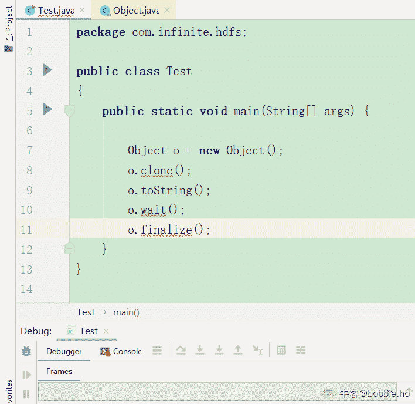

发表于 2019-08-20 22:40:11

* * *

## 119

假如某个 JAVA 进程的 JVM 参数配置如下：
-Xms1G -Xmx2G -Xmn500M -XX:MaxPermSize=64M -XX:+UseConcMarkSweepGC -XX:SurvivorRatio=3,
请问 eden 区最终分配的大小是多少？

正确答案: C   你的答案: 空 (错误)

```cpp
64M
```

```cpp
500M
```

```cpp
300M
```

```cpp
100M
```

本题知识点

测试工程师 360 公司 Java 测试开发工程师 360 公司 2018

讨论

[一枕江风](https://www.nowcoder.com/profile/2190090)

下图为 JVM 设置参数初始化时参数控制各区域内存的大小，可以看出 Xmn=Eden+S0+S1 =500M，又因为 Mmn 初始化时 Eden：S0：S1 = 3：1：1，故而 Eden 的大小为 300M。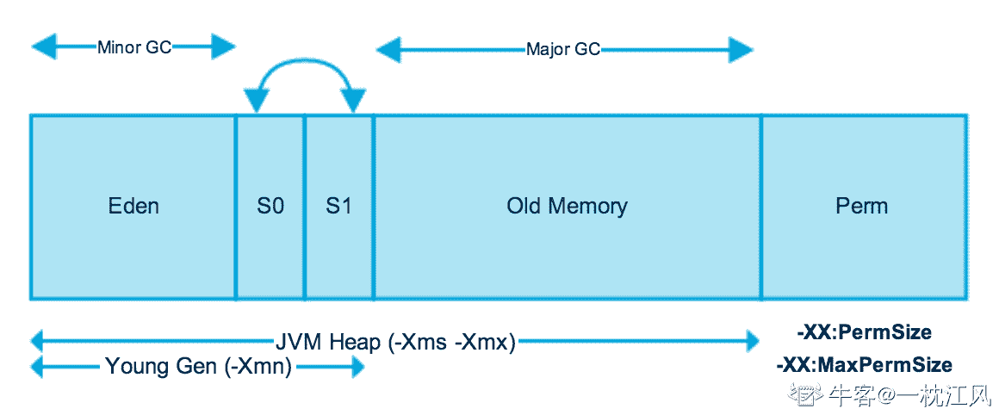想要了解更多 JVM 内存可以看看这博客：[`blog.csdn.net/weixin_37195606/article/details/82805216`](https://blog.csdn.net/weixin_37195606/article/details/82805216)

发表于 2019-08-27 10:36:31

* * *

[ZeroOfferException](https://www.nowcoder.com/profile/8111259)

    -Xms：JVM 初始分配的堆内存
-Xmx：JVM 最大允许分配的堆内存，按需分配、-Xmn 500m：设置年轻代的大小为 500m
-XX:MaxPermSize=64M JVM 最大允许分配的非堆内存，按需分配
-XX:PermSize：JVM 初始分配的非堆内存
-XX:SurvivorRatio：用于设置 Eden 和其中一个 Survivor 的比值，默认比例为 8(Eden)：1(一个 survivor)，解释一下这个，题目中设置的值为 3，也就是说，Eden:Survivor = 3:2，如果设置为 4，那么就是 Eden:Survivor = 4:2.
-XX:-UseConcMarkSweepGC：对老生代采用并发标记交换算法进行 GC 题目中，新生代的大小为 500m，又由于其比例 Eden:Survivor = 3:2，所以 Eden 区最终分配的大小是 300m。
 编辑于 2019-10-16 09:19:03

* * *

[cnng](https://www.nowcoder.com/profile/7504556)

xmn 初生代 500m 比例为 3:1:1

发表于 2019-10-11 09:06:37

* * *

## 120

以下说法中正确的有？

正确答案: A D   你的答案: 空 (错误)

```cpp
StringBuilder 是 线程不安全的
```

```cpp
Java 类可以同时用 abstract 和 final 声明
```

```cpp
HashMap 中，使用 get(key)==null 可以 判断这个 Hasmap 是否包含这个 key
```

```cpp
volatile 关键字不保证对变量操作的原子性
```

本题知识点

测试工程师 360 公司 Java 测试开发工程师 2018

讨论

[大星星和小猩猩](https://www.nowcoder.com/profile/9374535)

A.StringBuilder 线程不安全，StringBuffer 线程安全。B.同时用 abstract 和 final 就会自相矛盾。C.Hashmap 中的 value 可以之 null，get(key)==null 有两种情况，一是 key 不存在，二是该 key 中存的是 null，所以应该使用 map.containskey(key)返回的 true/false 来判断是否存在这个 key。D.volatile 关键字有两个作用：1.并发环境可见性：volatile 修饰后的变量能够保证该变量在线程间的可见性，线程进行数据的读写操作时将绕开工作内存（CPU 缓存）而直接跟主内存进行数据交互，即线程进行读操作时直接从主内存中读取，写操作时直接将修改后端变量刷新到主内存中，这样就能保证其他线程访问到的数据是最新数据 2.并发环境有序性：通过对 volatile 变量采取内存屏障（Memory barrier）的方式来防止编译重排序和 CPU 指令重排序，具体方式是通过在操作 volatile 变量的指令前后加入内存屏障，来实现 happens-before 关系，保证在多线程环境下的数据交互不会出现紊乱。 

发表于 2020-05-03 11:02:57

* * *

[PRick 彡](https://www.nowcoder.com/profile/947125149)

abstract 修饰的类是抽象类，是可以继承的，而 final 修饰的类表示不能再被继承，故肯定不能共同使用。故 B 错。HashMap 中提供的 get(key)获取的是变量，无法判断是否存在 key。所以 C 是错的 volatile 关键字是一种轻量级的同步机制，只保证数据的可见性，而不保证数据的原子性。故 D 对

发表于 2019-09-28 15:31:40

* * *

[笑看一生ね](https://www.nowcoder.com/profile/907435578)

1.  首先说运行速度，或者说是执行速度，在这方面运行速度快慢为：StringBuilder > StringBuffer > String

String 最慢的原因： 

String 为字符串常量，而 StringBuilder 和 StringBuffer 均为字符串变量，即 String 对象一旦创建之后该对象是不可更改的，但后两者的对象是变量，是可以更改的。 String：适用于少量的字符串操作的情况

StringBuilder：适用于单线程下在字符缓冲区进行大量操作的情况

StringBuffer：适用多线程下在字符缓冲区进行大量操作的情况 在线程安全上，StringBuilder 是线程不安全的，而 StringBuffer 是线程安全的

发表于 2019-08-28 15:53:44

* * *

## 121

下面哪种设计模式，不属于创建型设计模式？

正确答案: D   你的答案: 空 (错误)

```cpp
工厂方法模式
```

```cpp
抽象工厂模式
```

```cpp
单例模式
```

```cpp
模板方法模式
```

本题知识点

测试工程师 360 公司 测试工程师 360 公司 测试工程师 360 公司 测试工程师 360 公司 测试工程师 360 公司 设计模式 测试开发工程师 360 公司 2018

## 122

以下关于继承的叙述正确的是

正确答案: A   你的答案: 空 (错误)

```cpp
在 Java 中类只允许单一继承
```

```cpp
在 Java 中一个类不能同时继承一个类和实现一个接口
```

```cpp
在 Java 中接口只允许单一继承
```

```cpp
在 Java 中一个类只能实现一个接口
```

本题知识点

测试工程师 360 公司 Java 测试开发工程师 360 公司 2018

讨论

[咳咳 201910141549551](https://www.nowcoder.com/profile/39048244)

单继承,多实现

发表于 2019-10-20 12:05:22

* * *

[城南花开 201811271631169](https://www.nowcoder.com/profile/137085555)

这题没什么好说的

发表于 2019-10-04 13:13:20

* * *

[IDEA2022.4.2](https://www.nowcoder.com/profile/181223548)

类只支持单继承，接口支持多继承

发表于 2019-08-21 12:47:59

* * *

## 123

下列哪个类的声明是正确的？

正确答案: B   你的答案: 空 (错误)

```cpp
protected private number;
```

```cpp
public abstract class Car{}
```

```cpp
abstract private move(){}
```

```cpp
abstract final class HI{}
```

本题知识点

测试工程师 360 公司 Java 测试开发工程师 360 公司 2018

讨论

[IDEA2022.4.2](https://www.nowcoder.com/profile/181223548)

看题目类的声明排除 A，抽象类需要被继承，final 修饰的类不能被继承，子类不能重写父类的私有方法

发表于 2019-08-21 12:50:02

* * *

## 124

在 Java 中，一个类可同时定义许多同名的方法，这些方法的形式参数个数、类型或顺序各不相同，传回的值也可以不相同。这种面向对象程序的特性称为

正确答案: C   你的答案: 空 (错误)

```cpp
隐藏
```

```cpp
覆盖
```

```cpp
重载
```

```cpp
Java 不支持此特性
```

本题知识点

测试工程师 360 公司 Java 测试开发工程师 2018

讨论

[我在上学](https://www.nowcoder.com/profile/7143381)

重载 和返回值无关啊...

发表于 2019-09-24 23:26:04

* * *

[IDEA2022.4.2](https://www.nowcoder.com/profile/181223548)

重载与返回值无关记住了

编辑于 2020-07-23 08:04:31

* * *

[Alec_Zhang](https://www.nowcoder.com/profile/946437065)

重写(Override)是子类对父类的允许访问的方法的实现过程进行重新编写, 返回值和形参都不能改变。**即外壳不变，核心重写！**

重载(Overloading) 是在一个类里面，方法名字相同，而参数不同。**返回类型可以相同也可以不同。** 

发表于 2020-07-18 09:34:50

* * *

## 125

以下哪个方法用于定义线程的执行体？

正确答案: C   你的答案: 空 (错误)

```cpp
start()
```

```cpp
init()
```

```cpp
run()
```

```cpp
synchronized()
```

本题知识点

测试工程师 360 公司 Java 测试开发工程师 2018

讨论

[你的 offer 对我打了烊](https://www.nowcoder.com/profile/598309941)

run()相当于线程的任务处理逻辑的入口方法，它由 Java 虚拟机在运行相应线程时直接调用，而不是由应用代码进行调用。

而 start()的作用是启动相应的线程。启动一个线程实际是请求 Java 虚拟机运行相应的线程，而这个线程何时能够运行是由线程调度器决定的。start()调用结束并不表示相应线程已经开始运行，这个线程可能稍后运行，也可能永远也不会运行。

发表于 2020-03-06 09:49:24

* * *

[IDEA2022.4.2](https://www.nowcoder.com/profile/181223548)

run 方法线程执行体.start 方法开启多线程

发表于 2019-08-22 10:29:19

* * *

[🐯201905251557370](https://www.nowcoder.com/profile/273109574)

WCNBD!

发表于 2019-08-21 20:35:55

* * *

## 126

windows 程序中多个线程下，栈和堆是公有的还是私有的（  )

正确答案: A   你的答案: 空 (错误)

```cpp
栈私有，堆公有
```

```cpp
栈和堆均是私有的
```

```cpp
栈和堆均是公有的
```

```cpp
栈公有，堆私有
```

本题知识点

测试工程师 360 公司 栈 *堆 测试开发工程师 360 公司 2018* *讨论

[凉风起天末](https://www.nowcoder.com/profile/709610362)

无论在任何环境下，多线程每个线程独自拥有一个**栈区**（私有），这是由栈和多线程的特性决定的；而在 Windows 环境下，**堆区**对于**线程**而言是公有的（同一进程内每个线程都可以共享）。**线程栈区私有**：因为一个栈只有一个栈顶 top，那么我们假设不同线程共用一个栈，那么问题来了，假设当前线程需要进行出栈操作，那么它就会无法确定当前的栈顶元素是属于哪个线程的，是不是自己的。所以正因为栈只能对栈顶进行操作，且只有一个栈顶，所以不同的线程需要维护不同的栈（私有）；**线程堆区公有**：（注意这里的堆不是算法领域的堆，存储领域的堆只是一个连续自由空间）和栈不同，堆区是通过物理地址来访问存储单元的，堆区空间是自由分配的，每次申请堆空间时都会维护一个堆地址，这样，因为是使用地址访问的，所以不同的线程访问堆空间就不会产生冲突，堆空间完全可以共享（公有）。最后需要强调的是，以上是针对**同一个进程**内的不同线程而言的。

发表于 2019-10-01 17:25:55

* * *

[天尊墨宇](https://www.nowcoder.com/profile/667959477)

选 A

发表于 2020-07-19 07:18:14

* * *

[骨骨开](https://www.nowcoder.com/profile/542906256)

都公有的

发表于 2019-09-21 09:12:04

* * *

## 127

以下多线程对 int 型变量 x 的操作，哪个不需要进行同步（    ）

正确答案: D   你的答案: 空 (错误)

```cpp
x=y;
```

```cpp
x++;
```

```cpp
++x;
```

```cpp
x=1;
```

本题知识点

测试工程师 360 公司 Java 测试开发工程师 2018

讨论

[龙眼树](https://www.nowcoder.com/profile/727924541)

A.由于 y 的值不确定，所以要加锁；B,C 两个在多线程情况下是必须要加锁的，因为他们是先被读入寄存器，然后再进行+1 操作，如果没有加锁，那么可能会出现数据异常；D 原子操作，所以不需要加锁    原子性：指该操作不能再继续划分为更小的操作。Java 中的原子操作包括：         1、除 long 和 double 之外的基本类型的赋值操作        2、所有引用 reference 的赋值操作        3、java.concurrent.Atomic.* 包中所有类的一切操作

发表于 2019-11-11 17:23:01

* * *

[最爱小怪兽](https://www.nowcoder.com/profile/193667259)

要进行读写两项操作就需要同步，d 选项只需要将 1 的值赋给 x，只进行了写操作，所以不需要同步

发表于 2020-03-06 18:36:29

* * *

[ZeroOfferException](https://www.nowcoder.com/profile/8111259)

    原子性：指该操作不能再继续划分为更小的操作。Java 中的原子操作包括：         1、除 long 和 double 之外的基本类型的赋值操作        2、所有引用 reference 的赋值操作        3、java.concurrent.Atomic.* 包中所有类的一切操作

发表于 2019-09-29 11:18:14

* * *

## 128

关于 windows 下的多线程安全，选项中说法错误的是（     ）

正确答案: B   你的答案: 空 (错误)

```cpp
如果多线程的程序运行结果是可预期的，在功能逻辑上与单线程实现的程序运行结果一致，那么我们说这个程序是多线程安全的。
```

```cpp
只要使用了多线程 CRT（multithreaded CRT）进行编译链接，那么 CreateThread 启动的线程就可以随便使用 CRT 函数，而不用担多线程安全问题。
```

```cpp
如果在线程函数中不直接或者间接使用 crt 函数，那么使用 CreateThread 和使用 _beginthreadex 启动 的线程在 thread-safe 方面区别不大。
```

```cpp
在线程函数中，尽量避免使用 crt 函数，如果一定要用，尽量使用 _beginthreadex 来启动线程
```

本题知识点

测试工程师 360 公司 Java 测试开发工程师 360 公司 2018

讨论

[IDEA2022.4.2](https://www.nowcoder.com/profile/181223548)

蒙的过来报个到

发表于 2019-08-22 10:44:52

* * *

[泡泡 201908061058789](https://www.nowcoder.com/profile/458221310)

C Runtime 是 windows 平台下的一个概念。一般来说，CRT 函数就是标准的 C 语言函数。例如，printf、scanf、strlen、fopen 等函数就属于 CRT 函数。所有的 C 运行时函数除 signal 外都能够在通过 CreateThread 创建的线程中正确的运行。然而，对某些 CRT 函数的调用，在线程终止时会引发小小的内存泄露。例如：当调用 strlen 时并不会触发 CRT 线程在数据块中分配内存，而调用 malloc,fopen,_open,strtok,ctime,或者 localtime 则会在每个线程数据块中分配内存，这可能会引发内存泄露。

发表于 2019-08-26 19:54:55

* * *

[人生要有 trycatch](https://www.nowcoder.com/profile/190062089)

话说蒙的话，带“一定”“只能”“只有”关键词的，一般不都是错的吗。

发表于 2019-08-29 08:28:05

* * *

## 129

windows 下多线程的同步和互斥，选项中说法错误的是(     )

正确答案: D   你的答案: 空 (错误)

```cpp
windows 中一般是使用临界区、事件、互斥量、信号量等来实现多线程间的同步和互斥
```

```cpp
线程的同步主要是指执行的有先有后这样的顺便，比如一个线程的执行依赖另一个线程的某种消息或者条件，当他没有得到这个消息的时候应该等待，直到消息到达才被唤醒
```

```cpp
线程的互斥主要是指执行中的线程对共享的进程系统资源的排它性，当有多个线程都要使用某一个共享资源时，任何时刻最多只允许一个线程去使用，其他使用该资源的线程必须等待，直到占用资源者释放资源
```

```cpp
同一个线程中，临界区和互斥量的多次调用都不能同时进入，比如调用 EnterCriticalSection 进入临界区，所以可以达到同步的效果。
```

本题知识点

测试工程师 360 公司 操作系统 测试开发工程师 2018

讨论

[征途是一百级大牛](https://www.nowcoder.com/profile/803324974)

D 只有互斥，没有同步

发表于 2021-12-24 14:48:26

* * *

[天尊墨宇](https://www.nowcoder.com/profile/667959477)

D 只体现互斥没有体现同步

发表于 2020-08-02 09:39:16

* * *

[牛客 943250993 号](https://www.nowcoder.com/profile/943250993)

| 1234567 | [`www.shijuezhilv.com`](https://www.shijuezhilv.com)[http://](http://www.bilibili.com:443)[www.shijuezhilv.com](https://www.shijuezhilv.com/):443[`www.zjhyxdt.com/index.html`](http://www.bilibili.com/index.html)[`www.ddzyxdt.com/`](http://biligame.com/) |

发表于 2020-04-27 17:28:30

* * *

## 130

下列哪些对象可用于进程间数据交换

正确答案: A   你的答案: 空 (错误)

```cpp
共享内存
```

```cpp
互斥体
```

```cpp
命名管道
```

```cpp
消息
```

本题知识点

测试工程师 360 公司 操作系统 测试开发工程师 2018

讨论

[王槿岩](https://www.nowcoder.com/profile/836537849)

答案： A
这道题，题干说的是 数据交换，是双向通信；A 共享内存，可双向通信 B 互斥体，是进程同步的工具，不是进程间通信 C 命名管道，单向通信 D 消息 我想到的是消息队列，也是单向

发表于 2020-01-09 11:21:04

* * *

[喜欢前端的后端仔 MelodyJerry](https://www.nowcoder.com/profile/456404358)

D 的消息，是指 消息传递通信机制：单向通信，1 个发送者 & n>=1 个接收者  😎😎

发表于 2021-05-05 20:45:41

* * *

[王土根](https://www.nowcoder.com/profile/866800192)

求个解答。。。C 呢

编辑于 2019-09-02 16:06:25

* * *

## 131

下列哪个对象只能用于进程内的多线程同步

正确答案: D   你的答案: 空 (错误)

```cpp
Mutex
```

```cpp
Semaphore
```

```cpp
Event
```

```cpp
CriticalSection
```

本题知识点

测试工程师 360 公司 操作系统 测试开发工程师 2018

讨论

[叫我小张就行啦](https://www.nowcoder.com/profile/420013769)

线程之间的通信：互斥量，信号量，事件，临界区进程之间的通信：管道，消息队列，共享内存，套接字，信号量

发表于 2021-03-23 19:55:04

* * *

[ss201911191415561](https://www.nowcoder.com/profile/727050741)

不论是硬件临界资源，还是软件临界资源，多个线程必须互斥地对它进行访问。每个线程中访问临界资源的那段代码称为临界（CriticalSection）。每个线程中访问临界资源的那段程序称为临界区（Critical Section）（临界资源是一次仅允许一个线程使用的共享资源）。每次只准许一个线程进入临界区，进入后不允许其他线程进入。不论是硬件临界资源，还是软件临界资源，多个线程必须互斥地对它进行访问。

发表于 2019-12-02 15:11:36

* * *

[孙承良](https://www.nowcoder.com/profile/751868815)

查到的常用同步 进程间的同步机制：信号量 互斥锁 事件 计时器这 4 种配合等待函数 线程间的同步：volatile 变量、interlocked 系列函数、SRW 读写锁(vista 系统及以上)、临界区

发表于 2020-03-19 23:49:46

* * *

## 132

WaitForSingleObject 有几种返回值的可能

正确答案: D   你的答案: 空 (错误)

```cpp
1
```

```cpp
2
```

```cpp
3
```

```cpp
&gt;=4
```

本题知识点

测试工程师 360 公司 Windows 测试开发工程师 2018

讨论

[牛客 7665501 号](https://www.nowcoder.com/profile/7665501)

windows 的 api   我一个都不懂耶。我好笨耶，香港记者也跑不快了。

发表于 2019-08-28 18:07:32

* * *

[要喝手磨咖啡](https://www.nowcoder.com/profile/547420649)

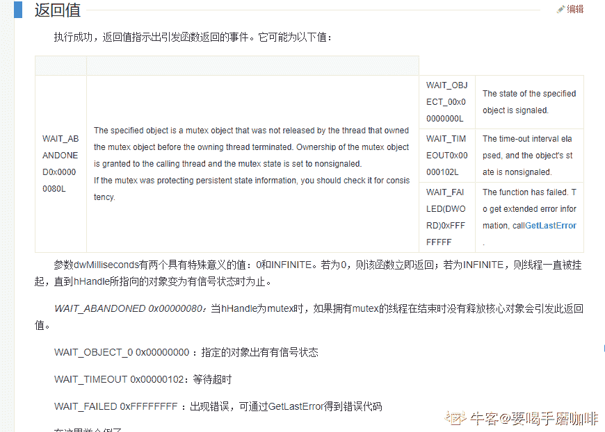

发表于 2019-08-25 09:44:39

* * *

[煜烨](https://www.nowcoder.com/profile/655103845)

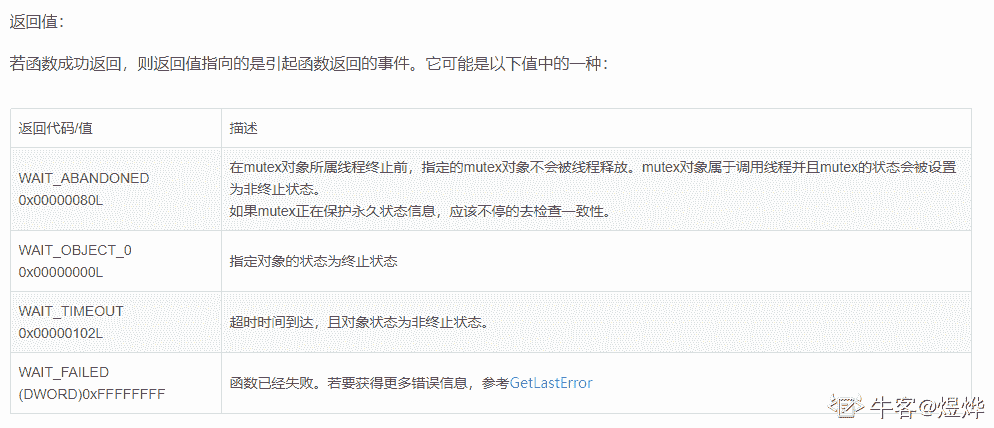

发表于 2019-11-01 10:56:43

* * *

## 133

关于 Windows UI 线程和工作线程，下列哪些说法是错误的

正确答案: A   你的答案: 空 (错误)

```cpp
只有 UI 线程才能收到消息
```

```cpp
只有 UI 线程才能操作控件的显示或隐藏
```

```cpp
只有 UI 线程才能更新控件的绘制
```

```cpp
工作线程应该通过发消息来改变 UI
```

本题知识点

测试工程师 360 公司 Windows 测试开发工程师 2018

## 134

两个线程需要访问同一个链表，为了减少同步产生的时间成本，应该采取哪些措施

正确答案: B   你的答案: 空 (错误)

```cpp
尽量避免使用锁保护
```

```cpp
缩小锁定的代码范围
```

```cpp
创建不同操作的锁，按需使用不同的锁
```

```cpp
先复制一份儿数据，再操作
```

本题知识点

测试工程师 360 公司 操作系统 Windows 测试开发工程师 360 公司 2018

## 135

下列哪几个 API 可用于多线程同步操作

正确答案: B   你的答案: 空 (错误)

```cpp
WaitForMessage
```

```cpp
WaitForSingleObject
```

```cpp
WaitForMultipleObjects
```

```cpp
WaitForStatus
```

本题知识点

测试工程师 360 公司 测试工程师 360 公司 测试工程师 360 公司 测试工程师 360 公司 测试工程师 360 公司 Windows 测试开发工程师 360 公司 2018

## 136

调用 CreateEvent 时，bManualReset 传递 FALSE，bInitialState 传递为 TRUE，Event 创建成功后，以下描述错误的是

正确答案: B   你的答案: 空 (错误)

```cpp
此时 Event 处于 Signaled 状态
```

```cpp
立刻调用 WaitForSingleObject 进行等待，Wait 函数返回等待成功，Event 仍保持 Signaled 状态
```

```cpp
ResetEvent 对其无效
```

```cpp
该 Event 会自动切换至 Singled 的状态，无需使用 SetEvent
```

本题知识点

测试工程师 360 公司 测试工程师 360 公司 测试工程师 360 公司 测试工程师 360 公司 测试工程师 360 公司 Windows 测试开发工程师 360 公司 2018

## 137

关于 critical section（以下简称 cs），描述正确的是

正确答案: C   你的答案: 空 (错误)

```cpp
已持有 cs 的线程，对该 cs 再次调用 EnterCriticalSection 时，会导致死锁，开发过程中务必要避免重复持 cs 的情况出现
```

```cpp
cs 内部没有使用任何内核对象，因此执行效率极高
```

```cpp
cs 内部由系统分配内存，因此需要调用 DeleteCriticalSection 释放内存
```

```cpp
多个线程对同一个 cs 执行 EnterCriticalSection，仅能有一个线程持有该 cs
```

本题知识点

测试工程师 360 公司 Windows 测试开发工程师 2018

讨论

[牛客 73811232 号](https://www.nowcoder.com/profile/73811232)

critical sectionCRITICAL_SECTION 是锁定了资源 

发表于 2020-08-25 00:05:18

* * *

## 138

关于 critical section（以下简称 cs）和 mutex 的对比，描述正确的是

正确答案: C   你的答案: 空 (错误)

```cpp
都可以用于跨进程同步线程
```

```cpp
多个线程等待持有 cs 或 mutex 的环境下，只能有一个线程被唤醒处于执行状态
```

```cpp
mutex 可以设置等待超时时间，但 cs 不行
```

```cpp
一个进程的 mutex 可以被子进程继承，但 cs 不行
```

本题知识点

测试工程师 360 公司 Windows 测试开发工程师 2018

## 139

使用迪杰斯特拉（Dijkstra）算法求下图中从顶点 1 到其他各顶点的最短路径，依次得到最短路径的目标顶点是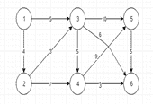

正确答案: C   你的答案: 空 (错误)

```cpp
2,3,4,5,6
```

```cpp
2,3,5,6,4
```

```cpp
2,3,4,6,5
```

```cpp
2,3,6,5,4
```

本题知识点

测试工程师 360 公司 高级算法 测试开发工程师 360 公司 2018

讨论

[eye_smile 丶](https://www.nowcoder.com/profile/592292318)

这 6 能到 5 吗？？

发表于 2019-10-25 19:10:11

* * *

## 140

下图的 UML 类结构图表示的是哪种设计模式：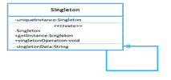

正确答案: C   你的答案: 空 (错误)

```cpp
命令模式
```

```cpp
迭代器模式
```

```cpp
单例模式
```

```cpp
抽象工厂模式
```

本题知识点

测试工程师 360 公司 测试工程师 360 公司 测试工程师 360 公司 测试工程师 360 公司 测试工程师 360 公司 UML 测试开发工程师 360 公司 2018

## 141

下图的 UML 类结构图表示的是哪种设计模式：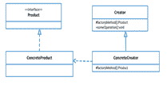

正确答案: D   你的答案: 空 (错误)

```cpp
模板方法模式
```

```cpp
策略模式
```

```cpp
状态模式
```

```cpp
工厂方法模式
```

本题知识点

测试工程师 360 公司 测试工程师 360 公司 测试工程师 360 公司 测试工程师 360 公司 测试工程师 360 公司 UML 测试开发工程师 360 公司 2018***</file.h></stdio.h>******