# 三百六十、公司-2018 春招笔试-机器学习工程师客观题合集

## 1

下列说法中正确的是（      ）

正确答案: A   你的答案: 空 (错误)

```cpp
冒泡排序法的平均时间复杂度为 O(n²)
```

```cpp
二分法的平均时间复杂度度是 O（n）
```

```cpp
m 个并列循环的时间复杂度为 O（mn）
```

```cpp
快速排序法的时间复杂度一定优于冒泡排序法
```

本题知识点

算法工程师 360 公司 排序 *算法工程师 360 公司 2018* *## 2

关键字序列为{12，11，19，23，1，6，10},哈希函数为 H(key)=key MOD 11,用链地址法构造哈希表,哈希地址为 1 的链中有（      ）个记录（      ）

正确答案: D   你的答案: 空 (错误)

```cpp
7
```

```cpp
5
```

```cpp
4
```

```cpp
3
```

本题知识点

算法工程师 360 公司 哈希 *算法工程师 360 公司 2018* *讨论

[苏苏#学长](https://www.nowcoder.com/profile/582816358)

求余为 1 的数是 12、23、1。

发表于 2019-09-01 23:43:40

* * *

[你好，阿蒲](https://www.nowcoder.com/profile/534007215)

求余为 1 的数有三个人 1、12、23。

发表于 2019-09-01 17:26:27

* * *

## 3

下面关于动态规划说法正确的是

正确答案: A   你的答案: 空 (错误)

```cpp
他是利用子结构，进行自底而上的算法设计
```

```cpp
他需要后来多次计算的问题进行缓存，减少重复子问题的计算
```

```cpp
他所求问题的整体最优解可以通过一系列局部最优的选择
```

```cpp
他将分解后的子问题看成相互独立的.
```

本题知识点

算法工程师 360 公司 动态规划 算法工程师 360 公司 2018

## 4

下列关于排序算法的描述错误的是

正确答案: B   你的答案: 空 (错误)

```cpp
在待排序的记录集中，存在多个具有相同键值的记录，若经过排序，这些记录的相对次序仍然保持不变，称这种排序为稳定排序
```

```cpp
二叉查找树的查找效率与二叉树的树型有关，在节点太复杂时其查找效率最低
```

```cpp
下列排序算法中，希尔排序在某趟排序结束后不一定能选出一个元素放到其最终位置上。
```

```cpp
在下列排序方法中,插入排序方法可能出现这种情况:在最后一趟开始之前,所有的元素都不在其最终应在的正确位置上
```

本题知识点

算法工程师 360 公司 排序 *算法工程师 360 公司 2018* *讨论

[菜🐤落泪](https://www.nowcoder.com/profile/409580029)

二叉树的查找效率与树型无关，与高度有关

发表于 2019-08-26 20:40:17

* * *

## 5

请指出以下代码段使用了何种算法

```cpp
public void func(int[] arr1, int k, int m,int[] arr2) { 
arr2[0] = 0; 
for (int i = 1; i <= m; i++) { 
int min = i; 
for (int j = 0; j < k; j++) { 
if (arr1[j] <= i) { 
int temp = arr2[i - arr1[j]] + 1; 
if (temp < min) { 
min = temp; 
} 
} 
} 
arr2[i] = min; 
} 
}
```

正确答案: B   你的答案: 空 (错误)

```cpp
分治算法
```

```cpp
动态规划
```

```cpp
贪心算法
```

```cpp
回溯算法
```

本题知识点

算法工程师 360 公司 动态规划 2018

## 6

已知如下递归代码用于求解图的 m 着色问题：

```cpp
#define N 10 
int a[N+1][N+1]; //存储图
int x[N+1];//记录颜色
int sum=0;//保存可着色方案数

void backtrace(int t,int m)
{
int i;
if(t>N)//搜索至叶节点 
{
sum++;
printf("第%d 种方案：\n",sum);
for(i=1;i<=N;i++)
printf("%d ",x[i]);
printf("\n");
}
else
{
for(i=1;i<=m;i++) //逐个判断每种颜色 
{
if(check(t,i))
{   x[t]=i;
backtrace(t+1,m);
}
}
}
}
```

其中 check()函数用于检测某个节点颜色是否合法，以下 check()函数正确的是：

正确答案: D   你的答案: 空 (错误)

```cpp
int check(int t,int i)//检测函数 {     int j;     for(j=1;j<t;j++)     {         if(a[t][j]==1&&x[i]==j)                  return 0;            }     return 1; }
```

```cpp
int check(int t,int i)//检测函数 {     int j;     for(j=1;j<t;j++)     {         if(a[t][j]==1||x[i]==j)                  return 0;            }     return 1; }
```

```cpp
int check(int t,int i)//检测函数 {     int j;     for(j=1;j<t;j++)     {         if(a[t][j]==1||x[j]==i)                  return 0;            }     return 1; }
```

```cpp
int check(int t,int i)//检测函数 {     int j;     for(j=1;j<t;j++)     {         if(a[t][j]==1&&x[j]==i)                  return 0;            }     return 1; }
```

本题知识点

算法工程师 360 公司 递归 算法工程师 360 公司 2018

## 7

一个线性序列（30，14，40，63，22，5），假定采用散列函数 Hash(key)=key%7 来计算散列地址，将其散列存储在 A[0~6]中，采用链地址法解决冲突。若查找每个元素的概率相同，则查找成功的平均查找长度是（      ）。

正确答案: A   你的答案: 空 (错误)

```cpp
4/3
```

```cpp
1
```

```cpp
3/2
```

```cpp
5/3
```

本题知识点

算法工程师 360 公司 查找 *2018* *讨论

[我的天鸭](https://www.nowcoder.com/profile/243498)

0 -- 14 -- 631 -- 222 -- 305 -- 40 -- 5 平均查找长度不应该是(1 + 2 + 1 + 1 + 1 + 2) / 6 = 4 / 3 吗，为啥是 1

发表于 2019-08-15 23:41:08

* * *

[十生十世三里桃花](https://www.nowcoder.com/profile/292168581)

30%7=2 查找一次

14%7=0 查找一次

40%7=5 查找一次

63%7=0 查找两次

22%7=1 查找一次

5%7=5 查找两次

（1+1+1+2+1+2）/6=4/3

所以应该选 A

发表于 2019-09-16 12:58:13

* * *

[酒泽思](https://www.nowcoder.com/profile/588155683)

链地址法解决冲突：将所有关键字相同的结点链接在表中同一个位置，相同位置上后加进来的元素连接在之前加进来的元素后面，形成链表形式；

发表于 2021-07-11 13:11:27

* * *

## 8

下列程序段的时间复杂度是（    ）

```cpp
count = 1；
for(k=1;k<2n;k*=2)
for(i=1;i<4n;i+=2)
count++;
```

正确答案: C   你的答案: 空 (错误)

```cpp
O(n2)
```

```cpp
O(8n2)
```

```cpp
O(nlog2n)
```

```cpp
O(n)
```

本题知识点

算法工程师 360 公司 复杂度 算法工程师 360 公司 2018

讨论

[不上岸就不改名](https://www.nowcoder.com/profile/903964616)

我怀疑题目的代码有缩进错误，原来的代码应该是这样的：

```cpp
count = 1；
for(k=1;k<2n;k*=2)
    for(i=1;i<4n;i+=2)
count++;
```

这样第一个循环的 O(log2n)和第二个循环的 O(n)的复杂度才是相乘的关系

发表于 2019-08-15 19:07:49

* * *

[失魂人](https://www.nowcoder.com/profile/8780899)

假设外层循环 a 次，内层循环 b 次，外层 2 的 a 次方＞＝2n 解得 a＞＝log2n+1 所以外层是 log2n 内层是 1 首项 2 公差的等差数列，b+（b-1）2＞＝4n 解得 b＞4/3n+2/3 内层是 n

编辑于 2020-11-27 21:13:02

* * *

## 9

有关贪心法叙述正确的是（      ）

正确答案: A   你的答案: 空 (错误)

```cpp
采用局部最优策略
```

```cpp
采用全局最优策略
```

```cpp
在贪心法中采用逐步构造最优解的方法
```

```cpp
把问题分解为简单的问题求解
```

本题知识点

算法工程师 360 公司 机器学习 算法工程师 360 公司 2018

讨论

[onlyxxx](https://www.nowcoder.com/profile/493457698)

A 贪心法的定义

发表于 2019-09-12 16:16:51

* * *

[仰望星空 20190218194390](https://www.nowcoder.com/profile/947105894)

贪心法采用局部最优策略

发表于 2019-08-26 18:21:50

* * *

## 10

在选择分治法解决问题时，应考虑待解决问题应具有哪些特征（       ）

正确答案: A B C D   你的答案: 空 (错误)

```cpp
待解决问题规模缩小到一定程度后可以容易解决
```

```cpp
待解决问题应可以分解为若干个规模较小的相同问题，且子问题应可直接求解。
```

```cpp
各子问题之间是相互独立的
```

```cpp
分解后的子问题的解可以合并为源问题的解
```

本题知识点

算法工程师 360 公司 机器学习 2018

讨论

[Magnum201908251347134](https://www.nowcoder.com/profile/784234533)

？？？？

分治之后合并不出来还分治个屁？

发表于 2019-09-17 10:10:04

* * *

[MR-唐超](https://www.nowcoder.com/profile/598309607)

I. 该问题的规模缩小到一定的程度就可以容易地解决；II. 该问题可以分解为若干个规模较小的相同问题，即该问题具有最优子结构性质 III. 利用该问题分解出的子问题的解可以合并为该问题的解；IV. 该问题所分解出的各个子问题是相互独立的，即子问题之间不包含公共的子问题。 reference:[`blog.csdn.net/why_still_confused/article/details/51755899`](https://blog.csdn.net/why_still_confused/article/details/51755899)???????????????????

发表于 2019-08-17 03:32:05

* * *

[牛客 890448427 号](https://www.nowcoder.com/profile/890448427)

是 ABCD 吗？

发表于 2021-09-08 14:14:14

* * *

## 11

对于一个整数数组，想求出数组的最大连续和，不可以用( )

正确答案: D   你的答案: 空 (错误)

```cpp
枚举
```

```cpp
分治
```

```cpp
动态规划
```

```cpp
排序
```

本题知识点

排序 *讨论

[我的天鸭](https://www.nowcoder.com/profile/243498)

都要求最大连续和你还给排序，不是捣乱吗

发表于 2019-08-15 22:38:52

* * *

[YkekeY](https://www.nowcoder.com/profile/709604258)

求一个整数数组的最大连续和，即对于一**个有 n 个元素的数组，则 n 个元素既可以是正数也可以是负数，数组中连续的一个或多个元素可以组成一个连续的子数组，一个数组可能有多个这种连续的子数组，求子数组和的最大值****。**显然，这是在不改变该数组结构下求的，排序的话就破坏数组了

发表于 2021-05-28 10:29:36

* * *

## 12

```cpp
#include<bits/stdc++.h>
using namespace std;
vector<int>g[15];
int dfs(int x){
    if(g[x].size() == 0){
    return 1;
}
int ans = 0;
for(int i = 0; i < g[x].size(); ++i){
    ans = max(ans, dfs(g[x][i]));
}
    return ans + 1;
}
int main(){
    int n, x;
    scanf("%d", &n);
    for(int i = 2; i <= n; ++i){
        scanf("%d", &x);
        g[x].push_back(i);
    }
    cout << dfs(1) << endl;
}
```

输入为：
10
1 1 2 2 5 5 3 8 6
上述程序的输出为(     )？

正确答案: C   你的答案: 空 (错误)

```cpp
3
```

```cpp
4
```

```cpp
5
```

```cpp
6
```

本题知识点

算法工程师 360 公司 树 C++ 2018

讨论

[凉风起天末](https://www.nowcoder.com/profile/709610362)

这道题中的函数功能是求 “**图中某个节点的最大深度**”：先是要理解程序所使用的**数据结构**：图的 “邻接表” 表示法，vector<int> g[15] 是个有 15 个 vector 容器的数组，15 指明了数据结构所能容纳的最大节点数量，数组下标表示节点编号，vector 在这里的作用和链表类似（vector 大小可动态增长，所以会节约一点空间），用来存储边的终止节点；那么这样子看 main 函数的主体，就知道**程序输入的作用**就是在构建一个有向图；接下来要重点**理解 dfs(int x) 的作用**（当然强行计算也是可以的，但是如果能够快速理解的话，会轻松一点）：这个函数的主要作用就是利用深度优先遍历算法计算某节点的深度。从函数的主体可以知道，x 表示的是一个节点（在邻接表中的下标），函数遍历了当前节点 x 的所有孩子节点，并对孩子节点进行递归操作，取所有孩子中最大的结果，然后+1 并返回。但是到这还无法看清函数的作用，于是看了下函数的递归终止条件：节点没有孩子的时候返回 1 。那么最后结合起来看，就可以知道函数的作用其实是返回当前节点的最大深度，换个说法：**从当前节点出发可以到达的最远距离（包含起点）**。那么最后画图，然后看看节点 1 可以到达的最远距离是多少就 OK 了，如下图，从节点 1 开始的最长路径为 1-2-5-6-10，长度为 5：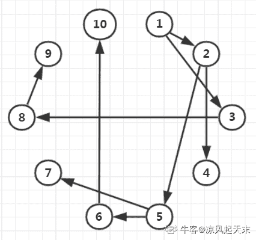

编辑于 2020-04-06 23:26:22

* * *

[牛客 303862 号](https://www.nowcoder.com/profile/303862)

g 不是一维的 vector 吗？g[x][i]是什么？

发表于 2019-08-29 20:10:04

* * *

[汪啊虎虎](https://www.nowcoder.com/profile/336701791)

返回值为 ans+1 决定了 迭代了几次，返回的 ans 值就从 1 加了几。带入计算可以看出一共迭代了四次

发表于 2019-08-20 10:26:33

* * *

## 13

对于函数 y = ax² + bx + c,(a > 0),需要找出 y 的小值，精确到小数点后 6 位。下列选项中最有效的方法是（）。

正确答案: D   你的答案: 空 (错误)

```cpp
枚举
```

```cpp
二分查找
```

```cpp
三分查找
```

```cpp
推公式
```

本题知识点

算法工程师 360 公司 C++ 算法工程师 360 公司 2018

讨论

[万能的翔王大人](https://www.nowcoder.com/profile/244791444)

那还得用一下判别式？**我想用十字相乘法**

发表于 2019-08-26 21:36:49

* * *

## 14

设哈希表长 m=13,哈希函数 H(key)=key MOD 11。表中已有 4 个节点:addr(16)=5,addr(28)=6,addr(84)=7,addr(19)=8 其余地址为空,如用线性探测再散列处理冲突，则关键字为 38 的地址为（      ）

正确答案: D   你的答案: 空 (错误)

```cpp
6
```

```cpp
7
```

```cpp
8
```

```cpp
9
```

本题知识点

算法工程师 360 公司 哈希 *算法工程师 360 公司 2018* *讨论

[等等芒果](https://www.nowcoder.com/profile/405078413)

冲突发生，顺序查看下一个存储地址，直到找到一个能用的存储地址。38 MOD 11 = 5,5 和 addr(16)=5 冲突，继续查找 addr(28)=6,addr(84)=7,addr(19)=8，即 6,7,8 不为空，继续查找 9 为空，存入

发表于 2019-08-31 20:26:08

* * *

## 15

```cpp
#include<bits/stdc++.h>
using namespace std;
int main(){
stack<int>st;
int pos = 1;
while(pos <= 3){
st.push(pos++);
}
cout<<st.top();
while(pos <= 5){
st.push(pos++);
}
while(!st.empty()){
cout<<st.top();
st.pop();
}
return 0;
}
```

上述程序的输出为(      )

正确答案: B   你的答案: 空 (错误)

```cpp
35421
```

```cpp
354321
```

```cpp
12453
```

```cpp
123453
```

本题知识点

算法工程师 360 公司 C++ 算法工程师 360 公司 2018

讨论

[孙小飞~](https://www.nowcoder.com/profile/388655701)

弹出栈顶元素 top();弹出栈底元素 button();  都是弹出副本。

发表于 2019-09-16 20:26:03

* * *

[lording](https://www.nowcoder.com/profile/107065871)

堆栈是先进后出，push()是进栈，top()是出栈。 注意 top()是获取栈顶，即最后进入的元素的值， button()是获取栈底的值，即最先进入栈的元素的值

发表于 2019-08-15 14:49:45

* * *

## 16

```cpp
#include<bits/stdc++.h>
using namespace std;
int gcd(int a, int b){
return b == 0 ? a : gcd(b, a % b);
}
struct stsort{
bool operator () (const int a, const int b) const{
if(gcd(30, a) < gcd(30, b)){
return 1;
}
else if(gcd(30, a) == gcd(30, b)){
return a < b;
}
else return 0;
}
};
int main(){
int n = 5;
priority_queue<int, vector<int>, stsort>q;
for(int i = 1; i <= n; ++i){
q.push(i);
}
for(int i = 1; i <= n; ++i){
printf("%d", q.top());
q.pop();
}
return 0;
}
```

程序的输出为( )

正确答案: A   你的答案: 空 (错误)

```cpp
53421
```

```cpp
53241
```

```cpp
12435
```

```cpp
14235
```

本题知识点

算法工程师 360 公司 C++ 算法工程师 360 公司 2018

讨论

[I 灬 am 灬程序猿](https://www.nowcoder.com/profile/3926986)

30 与 2/4 的最大公约数不都是 2 吗，然后按数值小的在前，难道不是 53241?

发表于 2019-09-17 10:07:08

* * *

[我的天鸭](https://www.nowcoder.com/profile/243498)

按 30 和 1/2/3/4/5 的最大公约数排出的大顶堆

发表于 2019-08-15 22:15:14

* * *

[基础知识产权](https://www.nowcoder.com/profile/307393843)

咋算

发表于 2019-09-27 18:32:19

* * *

## 17

```cpp
#include<bits/stdc++.h>
using namespace std;
int main(){
int n = 5;
vector<int>a;
set<int>b;
for(int i = 1; i <= n; ++i){
a.push_back(i);
b.insert(i);
}
for(int i = 1; i <= n; ++i){
a.push_back(i);
b.insert(i);
}
cout<<a.size()<<b.size()<<endl;
return 0;
}
```

程序的输出为( )

正确答案: A   你的答案: 空 (错误)

```cpp
105
```

```cpp
510
```

```cpp
1010
```

```cpp
55
```

本题知识点

算法工程师 360 公司 C++ 算法工程师 360 公司 2018

讨论

[下凡编程](https://www.nowcoder.com/profile/934777666)

第一个 a 是向量类型，它可以存放各种类型的对象，是一个动态数组；a 点 push_back 就是在队列末尾把元素添加进去;第二个 b 是二叉树类型，具有极高的搜索效率，insert 往里面插入一个值，当插入值相同时覆盖了之前的值；所以最后结果 a.size()=10,b.size()=5;

发表于 2019-09-02 21:01:38

* * *

[卧看云起时](https://www.nowcoder.com/profile/996928698)

set 里的元素不允许重复。

发表于 2019-08-20 19:46:43

* * *

## 18

```cpp
#include<bits/stdc++.h>
using namespace std;
vector<int>g[10];
int ans = 0;
void dfs(int x){
if(g[x].size() == 0){
ans++;
return;
}
for(int i = 0; i < g[x].size(); ++i){
dfs(g[x][i]);
}
}
int main(){
int n, x;
scanf("%d", &n);
for(int i = 2; i <= n; ++i){
scanf("%d", &x);
g[x].push_back(i);
}
dfs(1);
cout<<ans<<endl;
return 0;
}
```

上述程序的输入为：
9
1 2 2 1 5 6 6 6
则输出为( )

正确答案: B   你的答案: 空 (错误)

```cpp
4
```

```cpp
5
```

```cpp
6
```

```cpp
7
```

本题知识点

算法工程师 360 公司 C++ 算法工程师 360 公司 2018

讨论

[我的天鸭](https://www.nowcoder.com/profile/243498)

代码含义：dfs 树有几个叶子节点

发表于 2019-08-16 10:43:23

* * *

## 19

用(a,b,c)表示节点 a,b 之间有一条权值为 c 的无向边。对于图(1,2,3),(1,3,4),(1,5,1),(2,3,4),(2,4,6),(2,5,2),(3,5,1)。最小生成树的权值和为(        )

正确答案: B   你的答案: 空 (错误)

```cpp
9
```

```cpp
10
```

```cpp
11
```

```cpp
12
```

本题知识点

算法工程师 360 公司 树 算法工程师 360 公司 2018

## 20

一棵二叉树有 100 个节点，若根节点深度为 1，树深最大为(       )，最小为(       )

正确答案: B   你的答案: 空 (错误)

```cpp
100 2
```

```cpp
100 7
```

```cpp
7 6
```

```cpp
7 2
```

本题知识点

算法工程师 360 公司 树 算法工程师 360 公司 2018

讨论

[蒙牛麦片](https://www.nowcoder.com/profile/43911588)

当每一层都只有一个节点的时候，树深达到最大。此题为 100。当每一层都填满，也就是每层填 2 的 k-1 次方个，树深达到最小。此题前 6 层填满需要 63 个节点，剩下的填至第七层。

发表于 2019-10-12 20:29:42

* * *

## 21

在一棵度为 5 的树 T 中，若 14 个度为 5 的结点，15 个度为 4 的结点，14 个度为 3 的结点，5 个度为 2 的结点，10 个度为 1 的结点，则树 T 的叶节点个数是（     ）

正确答案: D   你的答案: 空 (错误)

```cpp
72
```

```cpp
102
```

```cpp
130
```

```cpp
135
```

本题知识点

算法工程师 360 公司 树 算法工程师 360 公司 2018

讨论

[喵星人拯救地球](https://www.nowcoder.com/profile/538133394)

不是 135 吗？ n0=n2 + 2*n3 + 3*n4 + 4*n5 + 1 = 5 + 28 + 45 + 56 + 1 = 135

编辑于 2019-01-08 08:10:55

* * *

[Song.s](https://www.nowcoder.com/profile/3150093)

没有正确答案，应该是 135。

发表于 2019-08-15 16:45:24

* * *

## 22

```cpp
#include<bits/stdc++.h>
using namespace std;
int n = 300;
int solve(int x){
return x * (n - x);
}
int main(){
int l = 1, r = n;
int mid1, mid2;
int t = 50;
while(t--){
mid1 = l + r >> 1;
mid2 = mid1 + r >> 1;
if(solve(mid1) > solve(mid2)){
r = mid2;
}
else{
l = mid1;
}
}
cout<< l <<endl;
return 0;
}
```

程序的输出为(        )

正确答案: C   你的答案: 空 (错误)

```cpp
1
```

```cpp
100
```

```cpp
150
```

```cpp
300
```

本题知识点

算法工程师 360 公司 C++ 算法工程师 360 公司 2018

讨论

[Artorias_Sif](https://www.nowcoder.com/profile/3334066)

这就是一个二分法求中间值的代码，注意 solve 函数在 x 等于 n/2 时取最大，所以 solve(mid1) > solve(mid2)这句判断就是在说 mid1 离中点 n/2 更近，而 mid2 远一点，这时把 r 置为 mid2，也就是说，大于 mid2 的值不需要再考虑了，因为前面 mid2 跟 mid1 比已经输了，所以之后的就更不用比了，所以 r=mid2，同理 L=mid1 也是这么来的。所以选 C。，需要注意的是+号优先级大于移位处理号。所以其实就是/2。

发表于 2019-09-03 18:51:49

* * *

[ML_ZDD](https://www.nowcoder.com/profile/6912943)

这种题目压根不想看。。。

发表于 2019-08-18 21:06:14

* * *

[哪都通快递临时工 9527 号](https://www.nowcoder.com/profile/43981511)

这个题是什么经典算法吗，碰见好几次了

发表于 2019-08-30 19:37:41

* * *

## 23

```cpp
#include<bits/stdc++.h>
using namespace std;
int solve(int x){
if(x == 0 || x == 1){
return x;
}
if(x % 2 == 0){
return 1 + solve(x / 2);
}
else{
return 1 + solve((x + 1) / 2);
}
}
int main(){
int n = 100;
int ans = solve(n);
cout<<ans<<endl;
return 0;
}
```

程序的输出为(      )

正确答案: C   你的答案: 空 (错误)

```cpp
6
```

```cpp
7
```

```cpp
8
```

```cpp
9
```

本题知识点

算法工程师 360 公司 C++ 算法工程师 360 公司 2018

讨论

[Albert.Yao](https://www.nowcoder.com/profile/952725898)

递归实现 100 对 2 的整除，第一次调用 solve（）的结果为 1+solve（50）；第二次调用的结果为 1 + solve(26)；第三次调用的结果为 1 + solve(14)；
第四次调用的结果为 1 + solve(8)；
第五次调用的结果为 1 + solve(4)；第六次调用的结果为 1 + solve(2)；第七次调用的结果为 1 + solve(1)； 第八次调用的结果为返回 1；  然后逐层返回

发表于 2019-09-26 15:24:09

* * *

## 24

一个有 n 个节点的树，有( )条边。

正确答案: A   你的答案: 空 (错误)

```cpp
n - 1
```

```cpp
n
```

```cpp
n + 1
```

```cpp
n ^ 2
```

本题知识点

算法工程师 360 公司 树 算法工程师 360 公司 2018

讨论

[Rs 先生](https://www.nowcoder.com/profile/35039951)

特值法：直接带入，节点为 3 的话，构成的树只有两条边

发表于 2019-08-23 09:26:32

* * *

## 25

现有磁盘读写请求队列为 2、4、0、5、1，若当前磁头在 1 号磁道上,若采用 FCFS 算法进行磁盘调度时，则平均寻道长度为（      ）

正确答案: B   你的答案: 空 (错误)

```cpp
2.4
```

```cpp
3.2
```

```cpp
1.2
```

```cpp
1.6
```

本题知识点

算法工程师 360 公司 操作系统 算法工程师 360 公司 2018

讨论

[喵星人拯救地球](https://www.nowcoder.com/profile/538133394)

队列：(1) 2 4 0 5 1 寻道总长： (2-1)+(4-2)+(4-0)+(5-0)+(5-1)=16 16/5=3.2

编辑于 2019-01-08 08:53:17

* * *

## 26

有 4 个批处理的作业（A、B、C 和 D）到达计算中心的时间分别为 9:00，9:30，9:40，9:50，估计的运行时间分别为 60、50、30、10 分钟，它们的优先数分别为 1、2、4、3（1 为最低优先级）。若采用优先级高者优先调度算法，则作业的平均带权周转时间为（      ）

正确答案: A   你的答案: 空 (错误)

```cpp
2.52
```

```cpp
3
```

```cpp
3.62
```

```cpp
3.98
```

本题知识点

算法工程师 360 公司 操作系统 算法工程师 360 公司 2018

讨论

[宇哥的小迷弟。](https://www.nowcoder.com/profile/890076675)

这里应该是非抢占式的，就需要等到 A 运行完了再运行 C，.....

发表于 2019-09-30 21:29:49

* * *

[喵星人拯救地球](https://www.nowcoder.com/profile/538133394)

1: 30+50+30+10+30=150 150/60=2.5 2: 10+30+10+40=90 90/60=1.5 4: 30 30/30=1 3: 20+10=30 30/10=3 (2.5+1.5+1+3)/4=2 不应该是 2 吗？

编辑于 2019-01-08 09:25:26

* * *

[旧城俨然回眸笑](https://www.nowcoder.com/profile/6223383)

平均周转时间：sum（完成时间-进入时间)/n 带权平均周转时间：sum((完成时间 - 进入时间)/运行时间）/n

编辑于 2020-06-30 17:14:40

* * *

## 27

下列哪种算法理论上性能最佳，实际上无法实现（      ）

正确答案: A   你的答案: 空 (错误)

```cpp
OPT 算法
```

```cpp
SCAN 算法
```

```cpp
FIFO 算法
```

```cpp
Clock 置换算法
```

本题知识点

算法工程师 360 公司 操作系统 算法工程师 360 公司 2018

讨论

[旧城俨然回眸笑](https://www.nowcoder.com/profile/6223383)

OPT 最优替换方法是一种理想算法，需先执行一次程序，不现实。

发表于 2020-06-30 17:16:42

* * *

## 28

在一个请求分页系统中，假定系统分给一个作业的物理块数为 3，刚开始没有一个页面装入内存，并且此作业的页面走向为 2，3，2，1，5，2，4，5，3，2，5，2。使用 OPT 算法时产生的缺页次数为（      ）

正确答案: A   你的答案: 空 (错误)

```cpp
6
```

```cpp
7
```

```cpp
8
```

```cpp
9
```

本题知识点

算法工程师 360 公司 操作系统 算法工程师 360 公司 2018

讨论

[马马马马马毛病](https://www.nowcoder.com/profile/226619553)

OPT 为最远的将来要被访问的页面先被换出
1        22        2 33        2 3 14        2 3 55        4 3 56        2 3 5

发表于 2019-08-19 21:01:20

* * *

[我的天鸭](https://www.nowcoder.com/profile/243498)

OPT 算法是一种理想型的算法， 淘汰的是后面不会再使用的页面，如果此时内存中的页后面都会再使用，则淘汰在将来最迟才会被访问的页面

发表于 2019-08-19 14:58:30

* * *

## 29

一个数据流中出现了的报文片段：A ESC FLAG B，假设采用字节填充算法，填充后的输出为（      ）

正确答案: B   你的答案: 空 (错误)

```cpp
A ESC ESC FLAG B
```

```cpp
A ESC ESC ESC FLAG B
```

```cpp
FLAG A ESC FLAG B FLAG
```

```cpp
A ESC FLAG FLAG B
```

本题知识点

算法工程师 360 公司 操作系统 算法工程师 360 公司 2018

讨论

[旧城俨然回眸笑](https://www.nowcoder.com/profile/6223383)

字节填充法：当标志字节(FLAG)出现在待传送的信息中，则在标志字节前加入一个转义字符(ESC); 若转义字符也在信息中，则在转义字符前也插入一个转义字符。

发表于 2020-06-30 17:29:01

* * *

[喵星人拯救地球](https://www.nowcoder.com/profile/538133394)

字节填充算法：发送端的数据链路层在出现标志字节的数据段前插入另一个转义字符（通常取 ESC），而在接收端的数据链路层在把数据送往网络层之前删除这个插入的转义字符。

编辑于 2019-01-09 08:59:11

* * *

## 30

以下地址中的哪一个和 76.32/12 匹配（      ）

正确答案: A   你的答案: 空 (错误)

```cpp
76.33.214.12
```

```cpp
76.79.24.11
```

```cpp
76.58.119.74
```

```cpp
76.68.204.11
```

本题知识点

算法工程师 360 公司 操作系统 算法工程师 360 公司 2018

讨论

[喵星人拯救地球](https://www.nowcoder.com/profile/538133394)

76.32/12 的二进制表示是 0100 1100,0010 0000，/12 是指前 12 位是网络地址，找出前 12 位地址相同的即可。A：0100 1100,0010 0001,……。B：0100 1100,0100 1111,……。C：0100 1100,0011 0101,……。D：0100 1100,0100 0100,……。

编辑于 2019-01-09 09:23:09

* * *

## 31

网络拓扑结构中存在网桥 S1、S2、S3、S4，若对应 MAC 地址分别为 AABB-CCDD-EE00、AABB-CCDD-EE11、BBBB-CCDD-EE00、BBBB-CCDD-EE11,所有网桥优先级采用默认值,则使用 STP 协议后，哪个网桥会被确定为根网桥（      ）

正确答案: A   你的答案: 空 (错误)

```cpp
S1
```

```cpp
S2
```

```cpp
S3
```

```cpp
S4
```

本题知识点

算法工程师 360 公司 网络基础 算法工程师 360 公司 2018

讨论

[钱多事少离家近](https://www.nowcoder.com/profile/720625582)

stp 选 Root Bridge 比 MAC 地址，越小越优

发表于 2019-08-22 12:47:59

* * *

[喵星人拯救地球](https://www.nowcoder.com/profile/538133394)

选择根网桥的依据：对比 BID-----Bridge ID， BID=网桥优先级+网桥背板 MAC -先对比优先级，默认取值 32768，越小越优先， -如果优先级相同对比背板 MAC 大小，越小越优先。

发表于 2019-01-09 09:33:30

* * *

## 32

原始数据为 011011111111111111110010 采用比特填充技术填充后的发送数据为（      ）

正确答案: D   你的答案: 空 (错误)

```cpp
0110111110111111111110010
```

```cpp
011011111111111111110010
```

```cpp
01101111101111110111110010
```

```cpp
011011111011111011111010010
```

本题知识点

算法工程师 360 公司 网络基础 算法工程师 360 公司 2018

讨论

[喵星人拯救地球](https://www.nowcoder.com/profile/538133394)

比特填充法：发送端的数据链路层遇到数据比特流中出现 5 个连续“1”的时候，自动在输出比特流中插入一个“0”;接收端遇到 5 个输入比特为“1”，且后面紧接的是“0”时，自动将该“0”删除，还原为原比特流。

编辑于 2019-01-09 09:39:54

* * *

## 33

存在以下三个 CIDR 地址块 192.168.11.0/27、192.168.11.32/27 和 192.168.11.64/26 聚合后的 CIDR 地址块应是（      ）

正确答案: A   你的答案: 空 (错误)

```cpp
192.168.11.0/25
```

```cpp
192.168.11.0/26
```

```cpp
192.168.11.64/25
```

```cpp
192.168.11.64/26
```

本题知识点

算法工程师 360 公司 网络基础 2018

讨论

[喵星人拯救地球](https://www.nowcoder.com/profile/538133394)

存在 3 个 CIDR 地址块：192.168.11.0/27, 192.168.11.32/27, 192.168.11.64/26，聚合过程为：① 2 个/27 地址块之间进行聚合： 192.168.11.0 ：11000000.10101000.00001011.00000000； 192.168.11.32 ： 11000000.10101000.00001011.00100000； 共同前缀是前 26 位，即 11000000.10101000.00001011.00，则聚合的 CIDR 地址块是 192.168.11.0/26。 ② 将结果再与/26 地址块之间进行聚合： 192.168.11.0：11000000.10101000.00001011.00000000； 192.168.11.64：11000000.10101000.00001011.01000000； 共同前缀是前 25 位，则最终的聚合 CIDR 地址块是 192.168.11.0/25。

编辑于 2019-01-09 09:45:45

* * *

[右杰](https://www.nowcoder.com/profile/818684237)

192.168.11.0   ：11000000.10101000.00001011.00000000/27192.168.11.32 ：11000000.10101000.00001011.00100000/27***192.168.11.0   ******:   ******11000000.10101000.00001011.00******/26******(聚合结果 1******)***192.168.11.64： 11000000.10101000.00001011.01000000/26***192.168.11.******0*** ***： ******11000000.10101000.00001011.0******/25******(聚合结果******2******)*** 

发表于 2021-06-02 15:34:07

* * *

[橙又青](https://www.nowcoder.com/profile/35896341)

应该是 C 答案有误

发表于 2019-09-08 11:14:35

* * *

## 34

终端发送帧序列为 1101011111，使用生成多项式为 G(x)=x⁴+x+1 校验后发出的帧为序列为（      ）

正确答案: D   你的答案: 空 (错误)

```cpp
11010111111100
```

```cpp
11010111110011
```

```cpp
11010111111011
```

```cpp
11010111110010
```

本题知识点

算法工程师 360 公司 网络基础 2018

讨论

[是瑶瑶公主呀](https://www.nowcoder.com/profile/592649258)

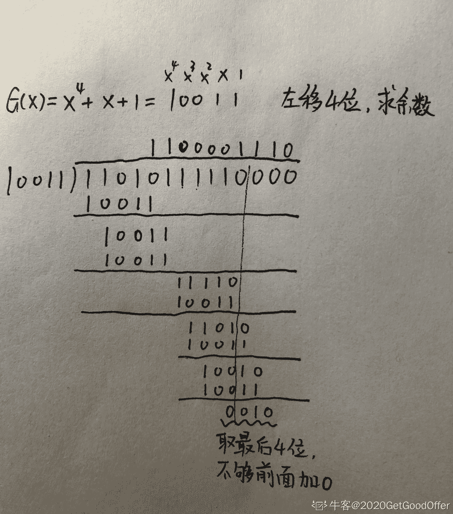

编辑于 2019-11-02 07:31:52

* * *

[java 狼人](https://www.nowcoder.com/profile/264003299)

等式 G(X)=X⁴+X+1 可以写成 G(X)=1*(X⁴) + 0*(X³) + 0*(X²) + 1*X + 1*1

发表于 2019-11-02 00:56:28

* * *

[做一名凡人](https://www.nowcoder.com/profile/866350397)

网络工程专业出生的我，这道题还给老师啦

发表于 2021-03-14 21:22:54

* * *

## 35

处于同一网络上的主机对有（      ）

正确答案: A B   你的答案: 空 (错误)

```cpp
192.168.5.72/255.255.255.0 和 192.168.5.79/255.255.255.0
```

```cpp
192.168.19.35/255.255.255.224 和 192.168.19.48/255.255.255.224
```

```cpp
19.128.14.14/255.255.255.240 和 19.128.14.19/255.255.255.240
```

```cpp
192.168.3.68/255.255.255.248 和 192.168.3.74/255.255.255.248
```

本题知识点

算法工程师 360 公司 网络基础 2018

讨论

[喵星人拯救地球](https://www.nowcoder.com/profile/538133394)

将 IP 地址与子网掩码做逻辑与运算，所得结果相同，则处于同一网络。A 选项两 IP 地址与 255.255.255.0 做逻辑与运算后，结果均为 192.168.5.0，因此处于同一网络

编辑于 2019-01-10 18:55:01

* * *

[莫离的小屋](https://www.nowcoder.com/profile/221885066)

A 5.72 掩码为 255.0 00000101.72 11111111.0 结果为 5.0 5.79 掩码为 255.0 00000101.79 11111111.0 结果为 5.0，A 对 B 前三个字节一样，只需对第四个进行与操作 35 掩码为 224 00100011 11100000 结果为 32 48 掩码为 224 48 掩码为 224 00110000 11100000 结果为 32 B 对😃😃😃

发表于 2021-06-11 14:14:48

* * *

[牛客 428383727 号](https://www.nowcoder.com/profile/428383727)

有个疑问，192.168.一般是路由器所管理的一个局域网，所以会存在分属两地两台不同的电脑上所分配的 IP 地址如图 A 所示，那么很显然这两台电脑不属于同一网络。

发表于 2020-05-30 17:40:18

* * *

## 36

应用 NAT 后会带来哪些影响（      ）

正确答案: A   你的答案: 空 (错误)

```cpp
不利于分片
```

```cpp
不利于数据加密
```

```cpp
需要重新计算 IP 分组校验和
```

```cpp
可以解决 IPv4 地址耗尽问题
```

本题知识点

算法工程师 360 公司 网络基础 算法工程师 360 公司 2018

讨论

[下邪 666](https://www.nowcoder.com/profile/952667412)

当 NAT 网关收到 Server 端发来的 IP 分片时，由于只有第一个 IP 分片中包含传输层信息（端口，协议等），后续的 IP 分片到 NAT 网关时，NAT 网关将无法直接根据本分片信息还原出原来的内网 IP，需要 NAT 特殊处理甚至重组分片（虚拟重组，真正的重组是在 Client 上进行的），这无疑对时延和带宽是有影响的。

发表于 2019-08-18 15:39:51

* * *

[Lane.](https://www.nowcoder.com/profile/849834097)

NAT 网络地址转化，公网地址与私网地址转化

发表于 2019-10-29 09:38:36

* * *

## 37

某公司办公室计算机通过 DHCP 获取 IP 地址，某一天所有计算机获取失败，拒绝访问 internet,网络管理员查看 IP 地址，可能的是（      ）

正确答案: B   你的答案: 空 (错误)

```cpp
172.16.2.1
```

```cpp
169.254.2.1
```

```cpp
169.254.2.255
```

```cpp
169.254.255.255
```

本题知识点

算法工程师 360 公司 网络基础 2018

讨论

[啥都试一试](https://www.nowcoder.com/profile/584415987)

拒绝访问互联网可能是网关出现问题，而网关的主机号一般为 1 且不是私有地址，所以选 B？

发表于 2021-02-03 22:57:34

* * *

[弱楓](https://www.nowcoder.com/profile/272340785)

没有网络 一般是网关出问题了所以 A B（一般主机号为 1 是网关）

私有 IP 地址

VPN（虚拟专用网）的知识，即 VPN 中的专用地址

1 个 A 类 10.0.0.0——10.255.255.255

16 个连续的 B 类 172.16.0.0——172.31.255.255

256 个连续的 C 类 192.168.0.0——192.168.255.255 所以选 B

发表于 2019-09-15 18:23:28

* * *

[喵星人拯救地球](https://www.nowcoder.com/profile/538133394)

不太清楚为什么是.2.1，不过 IP 地址“169.254.×.×”实际上是自动私有 IP 地址。在 Windows 2000 以前的系统中，如果计算机无法获取 IP 地址，则自动配置成“IP 地址：0.0.0.0”、“子网掩码：0.0.0.0”的形式，导致其不能与其它计算机进行通信。而对于 Windows 2000 以后的操作系统则在无法获取 IP 地址时自动配置成“IP 地址:169.254.×.×”、“子网掩码：255.255.0.0”的形式，这样可以使所有获取不到 IP 地址的计算机之间能够通信。

发表于 2019-01-10 19:03:43

* * *

## 38

下列不属于 POSIX 互斥锁相关函数的是：（      ）

正确答案: D   你的答案: 空 (错误)

```cpp
int pthread_mutex_destroy(pthread_mutex_t* mutex)
```

```cpp
int pthread_mutex_lock(pthread_mutex_t* mutex)
```

```cpp
int pthread_mutex_trylock(pthread_mutex_t* mutex)
```

```cpp
int pthread_mutex_create(pthread_mutex_t* mutex)
```

本题知识点

算法工程师 360 公司 Linux 操作系统 2018

讨论

[那年明月在](https://www.nowcoder.com/profile/3401023)

 int pthread_mutex_destroy(pthread_mutex_t *mutex); //销毁互斥锁 int pthread_mutex_lock(pthread_mutex_t *mutex);  //以原子操作方式给互斥锁加锁
 int pthread_mutex_trylock(pthread_mutex_t *mutex); //非阻塞版本
 int pthread_mutex_unlock(pthread_mutex_t *mutex); // 以原子操作方式给互斥锁解锁 

发表于 2019-08-22 18:48:02

* * *

[牛客 845104603 号](https://www.nowcoder.com/profile/845104603)

POSIX 互斥锁相关函数有以下：

1.  pthread_mutex_init 初始化一个互斥量
2.  pthread_mutex_lock 给一个互斥量加锁
3.  pthread_mutex_trylock 加锁，如果失败不阻塞
4.  pthread_mutex_unlock 解锁
5.  pthread_mutex_destroy 销毁互斥锁

发表于 2020-05-24 20:32:02

* * *

[大星星和小猩猩](https://www.nowcoder.com/profile/9374535)

POSIX，英文全称 Portable Operating System Interface，也就是可移植操作系统接口。POSIX 互斥锁是指统一接口的互斥锁，它有一些相关的函数。POSIX 互斥锁相关函数有以下：

1.  **pthread_mutex_init** 初始化一个互斥量
2.  **pthread_mutex_lock** 给一个互斥量加锁
3.  **pthread_mutex_trylock** 加锁，如果失败不阻塞
4.  **pthread_mutex_unlock** 解锁
5.  **pthread_mutex_destroy** 销毁互斥锁

让我们来看一下 C 语言的 phread.h 源代码：

```cpp
/* This is an implementation of the threads API of POSIX 1003.1-2001.
 *
 * --------------------------------------------------------------------------
 *
 *      Pthreads-win32 - POSIX Threads Library for Win32
 *      Copyright(C) 1998 John E. Bossom
 *      Copyright(C) 1999,2005 Pthreads-win32 contributors
 * 
 *      Contact Email: rpj@callisto.canberra.edu.au
 * 
 *      The current list of contributors is contained
 *      in the file CONTRIBUTORS included with the source
 *      code distribution. The list can also be seen at the
 *      following World Wide Web location:
 *      http://sources.redhat.com/pthreads-win32/contributors.html
 * 
 *      This library is free software; you can redistribute it and/or
 *      modify it under the terms of the GNU Lesser General Public
 *      License as published by the Free Software Foundation; either
 *      version 2 of the License,&nbs***bsp;(at your option) any later version.
 * 
 *      This library is distributed in the hope that it will be useful,
 *      but WITHOUT ANY WARRANTY; without even the implied warranty of
 *      MERCHANTABILITY&nbs***bsp;FITNESS FOR A PARTICULAR PURPOSE.  See the GNU
 *      Lesser General Public License for more details.
 * 
 *      You should have received a copy of the GNU Lesser General Public
 *      License along with this library in the file COPYING.LIB;
 *      if not, write to the Free Software Foundation, Inc.,
 *      59 Temple Place - Suite 330, Boston, MA 02111-1307, USA
 */

#if !defined( PTHREAD_H )
#define PTHREAD_H

/*
 * See the README file for an explanation of the pthreads-win32 version
 * numbering scheme and how the DLL is named etc.
 */
#define PTW32_VERSION 2,9,1,0
#define PTW32_VERSION_STRING "2, 9, 1, 0\0"

/* There are three implementations of cancel cleanup.
 * Note that pthread.h is included in both application
 * compilation units and also internally for the library.
 * The code here and within the library aims to work
 * for all reasonable combinations of environments.
 *
 * The three implementations are:
 *
 *   WIN32 SEH
 *   C
 *   C++
 *
 * Please note that exiting a push/pop block via
 * "return", "exit", "break",&nbs***bsp;"continue" will
 * lead to different behaviour amongst applications
 * depending upon whether the library was built
 * using SEH, C++,&nbs***bsp;C. For example, a library built
 * with SEH will call the cleanup routine, while both
 * C++ and C built versions will not.
 */

/*
 * Define defaults for cleanup code.
 * Note: Unless the build explicitly defines one of the following, then
 * we default to standard C style cleanup. This style uses setjmp/longjmp
 * in the cancelation and thread exit implementations and therefore won't
 * do stack unwinding if linked to applications that have it (e.g.
 * C++ apps). This is currently consistent with most/all commercial Unix
 * POSIX threads implementations.
 */
#if !defined( __CLEANUP_SEH ) && !defined( __CLEANUP_CXX ) && !defined( __CLEANUP_C )
# define __CLEANUP_C
#endif

#if defined( __CLEANUP_SEH ) && ( !defined( _MSC_VER ) && !defined(PTW32_RC_MSC))
#error ERROR [__FILE__, line __LINE__]: SEH is not supported for this compiler.
#endif

/*
 * Stop here if we are being included by the resource compiler.
 */
#if !defined(RC_INVOKED)

#undef PTW32_LEVEL

#if defined(_POSIX_SOURCE)
#define PTW32_LEVEL 0
/* Early POSIX */
#endif

#if defined(_POSIX_C_SOURCE) && _POSIX_C_SOURCE >= 199309
#undef PTW32_LEVEL
#define PTW32_LEVEL 1
/* Include 1b, 1c and 1d */
#endif

#if defined(INCLUDE_NP)
#undef PTW32_LEVEL
#define PTW32_LEVEL 2
/* Include Non-Portable extensions */
#endif

#define PTW32_LEVEL_MAX 3

#if ( defined(_POSIX_C_SOURCE) && _POSIX_C_SOURCE >= 200112 )  || !defined(PTW32_LEVEL)
#define PTW32_LEVEL PTW32_LEVEL_MAX
/* Include everything */
#endif

#if defined(_UWIN)
#   define HAVE_STRUCT_TIMESPEC 1
#   define HAVE_SIGNAL_H        1
#   undef HAVE_PTW32_CONFIG_H
#   pragma comment(lib, "pthread")
#endif

/*
 * -------------------------------------------------------------
 *
 *
 * Module: pthread.h
 *
 * Purpose:
 *      Provides an implementation of PThreads based upon the
 *      standard:
 *
 *              POSIX 1003.1-2001
 *  and
 *    The Single Unix Specification version 3
 *
 *    (these two are equivalent)
 *
 *      in order to enhance code portability between Windows,
 *  various commercial Unix implementations, and Linux.
 *
 *      See the ANNOUNCE file for a full list of conforming
 *      routines and defined constants, and a list of missing
 *      routines and constants not defined in this implementation.
 *
 * Authors:
 *      There have been many contributors to this library.
 *      The initial implementation was contributed by
 *      John Bossom, and several others have provided major
 *      sections&nbs***bsp;revisions of parts of the implementation.
 *      Often significant effort has been contributed to
 *      find and fix important bugs and other problems to
 *      improve the reliability of the library, which sometimes
 *      is not reflected in the amount of code which changed as
 *      result.
 *      As much as possible, the contributors are acknowledged
 *      in the ChangeLog file in the source code distribution
 *      where their changes are noted in detail.
 *
 *      Contributors are listed in the CONTRIBUTORS file.
 *
 *      As usual, all bouquets go to the contributors, and all
 *      brickbats go to the project maintainer.
 *
 * Maintainer:
 *      The code base for this project is coordinated and
 *      eventually pre-tested, packaged, and made available by
 *
 *              Ross Johnson <rpj@callisto.canberra.edu.au>
 *
 * QA Testers:
 *      Ultimately, the library is tested in the real world by
 *      a host of competent and demanding scientists and
 *      engineers who report bugs and/or provide solutions
 *      which are then fixed&nbs***bsp;incorporated into subsequent
 *      versions of the library. Each time a bug is fixed, a
 *      test case is written to prove the fix and ensure
 *      that later changes to the code don't reintroduce the
 *      same error. The number of test cases is slowly growing
 *      and therefore so is the code reliability.
 *
 * Compliance:
 *      See the file ANNOUNCE for the list of implemented
 *      and not-implemented routines and defined options.
 *      Of course, these are all defined is this file as well.
 *
 * Web site:
 *      The source code and other information about this library
 *      are available from
 *
 *              http://sources.redhat.com/pthreads-win32/
 *
 * -------------------------------------------------------------
 */

/* Try to avoid including windows.h */
#if (defined(__MINGW64__) || defined(__MINGW32__)) && defined(__cplusplus)
#define PTW32_INCLUDE_WINDOWS_H
#endif

#if defined(PTW32_INCLUDE_WINDOWS_H)
#include <windows.h>
#endif

#if defined(_MSC_VER) && _MSC_VER < 1300 || defined(__DMC__)
/*
 * VC++6.0&nbs***bsp;early compiler's header has no DWORD_PTR type.
 */
typedef unsigned long DWORD_PTR;
typedef unsigned long ULONG_PTR;
#endif
/*
 * -----------------
 * autoconf switches
 * -----------------
 */

#if defined(HAVE_PTW32_CONFIG_H)
#include "config.h"
#endif /* HAVE_PTW32_CONFIG_H */

#if !defined(NEED_FTIME)
#include <time.h>
#else /* NEED_FTIME */
/* use native WIN32 time API */
#endif /* NEED_FTIME */

#if defined(HAVE_SIGNAL_H)
#include <signal.h>
#endif /* HAVE_SIGNAL_H */

#include <limits.h>

/*
 * Boolean values to make us independent of system includes.
 */
enum {
  PTW32_FALSE = 0,
  PTW32_TRUE = (! PTW32_FALSE)
};

/*
 * This is a duplicate of what is in the autoconf config.h,
 * which is only used when building the pthread-win32 libraries.
 */

#if !defined(PTW32_CONFIG_H)
#  if defined(WINCE)
#    define NEED_ERRNO
#    define NEED_SEM
#  endif
#  if defined(__MINGW64__)
#    define HAVE_STRUCT_TIMESPEC
#    define HAVE_MODE_T
#  elif defined(_UWIN) || defined(__MINGW32__)
#    define HAVE_MODE_T
#  endif
#endif

/*
 *
 */

#if PTW32_LEVEL >= PTW32_LEVEL_MAX
#if defined(NEED_ERRNO)
#include "need_errno.h"
#else
#include <errno.h>
#endif
#endif /* PTW32_LEVEL >= PTW32_LEVEL_MAX */

/*
 * Several systems don't define some error numbers.
 */
#if !defined(ENOTSUP)
#  define ENOTSUP 48   /* This is the value in Solaris. */
#endif

#if !defined(ETIMEDOUT)
#  define ETIMEDOUT 10060 /* Same as WSAETIMEDOUT */
#endif

#if !defined(ENOSYS)
#  define ENOSYS 140     /* Semi-arbitrary value */
#endif

#if !defined(EDEADLK)
#  if defined(EDEADLOCK)
#    define EDEADLK EDEADLOCK
#  else
#    define EDEADLK 36     /* This is the value in MSVC. */
#  endif
#endif

/* POSIX 2008 - related to robust mutexes */
#if !defined(EOWNERDEAD)
#  define EOWNERDEAD 43
#endif
#if !defined(ENOTRECOVERABLE)
#  define ENOTRECOVERABLE 44
#endif

#include <sched.h>

/*
 * To avoid including windows.h we define only those things that we
 * actually need from it.
 */
#if !defined(PTW32_INCLUDE_WINDOWS_H)
#if !defined(HANDLE)
# define PTW32__HANDLE_DEF
# define HANDLE void *
#endif
#if !defined(DWORD)
# define PTW32__DWORD_DEF
# define DWORD unsigned long
#endif
#endif

#if !defined(HAVE_STRUCT_TIMESPEC)
#define HAVE_STRUCT_TIMESPEC
#if !defined(_TIMESPEC_DEFINED)
#define _TIMESPEC_DEFINED
struct timespec {
        time_t tv_sec;
        long tv_nsec;
};
#endif /* _TIMESPEC_DEFINED */
#endif /* HAVE_STRUCT_TIMESPEC */

#if !defined(SIG_BLOCK)
#define SIG_BLOCK 0
#endif /* SIG_BLOCK */

#if !defined(SIG_UNBLOCK)
#define SIG_UNBLOCK 1
#endif /* SIG_UNBLOCK */

#if !defined(SIG_SETMASK)
#define SIG_SETMASK 2
#endif /* SIG_SETMASK */

#if defined(__cplusplus)
extern "C"
{
#endif                          /* __cplusplus */

/*
 * -------------------------------------------------------------
 *
 * POSIX 1003.1-2001 Options
 * =========================
 *
 * Options are normally set in <unistd.h>, which is not provided
 * with pthreads-win32.
 *
 * For conformance with the Single Unix Specification (version 3), all of the
 * options below are defined, and have a value of either -1 (not supported)
 *&nbs***bsp;200112L (supported).
 *
 * These options can neither be left undefined nor have a value of 0, because
 * either indicates that sysconf(), which is not implemented, may be used at
 * runtime to check the status of the option.
 *
 * _POSIX_THREADS (== 200112L)
 *                      If == 200112L, you can use threads
 *
 * _POSIX_THREAD_ATTR_STACKSIZE (== 200112L)
 *                      If == 200112L, you can control the size of a thread's
 *                      stack
 *                              pthread_attr_getstacksize
 *                              pthread_attr_setstacksize
 *
 * _POSIX_THREAD_ATTR_STACKADDR (== -1)
 *                      If == 200112L, you can allocate and control a thread's
 *                      stack. If not supported, the following functions
 *                      will return ENOSYS, indicating they are not
 *                      supported:
 *                              pthread_attr_getstackaddr
 *                              pthread_attr_setstackaddr
 *
 * _POSIX_THREAD_PRIORITY_SCHEDULING (== -1)
 *                      If == 200112L, you can use realtime scheduling.
 *                      This option indicates that the behaviour of some
 *                      implemented functions conforms to the additional TPS
 *                      requirements in the standard. E.g. rwlocks favour
 *                      writers over readers when threads have equal priority.
 *
 * _POSIX_THREAD_PRIO_INHERIT (== -1)
 *                      If == 200112L, you can create priority inheritance
 *                      mutexes.
 *                              pthread_mutexattr_getprotocol +
 *                              pthread_mutexattr_setprotocol +
 *
 * _POSIX_THREAD_PRIO_PROTECT (== -1)
 *                      If == 200112L, you can create priority ceiling mutexes
 *                      Indicates the availability of:
 *                              pthread_mutex_getprioceiling
 *                              pthread_mutex_setprioceiling
 *                              pthread_mutexattr_getprioceiling
 *                              pthread_mutexattr_getprotocol     +
 *                              pthread_mutexattr_setprioceiling
 *                              pthread_mutexattr_setprotocol     +
 *
 * _POSIX_THREAD_PROCESS_SHARED (== -1)
 *                      If set, you can create mutexes and condition
 *                      variables that can be shared with another
 *                      process.If set, indicates the availability
 *                      of:
 *                              pthread_mutexattr_getpshared
 *                              pthread_mutexattr_setpshared
 *                              pthread_condattr_getpshared
 *                              pthread_condattr_setpshared
 *
 * _POSIX_THREAD_SAFE_FUNCTIONS (== 200112L)
 *                      If == 200112L you can use the special *_r library
 *                      functions that provide thread-safe behaviour
 *
 * _POSIX_READER_WRITER_LOCKS (== 200112L)
 *                      If == 200112L, you can use read/write locks
 *
 * _POSIX_SPIN_LOCKS (== 200112L)
 *                      If == 200112L, you can use spin locks
 *
 * _POSIX_BARRIERS (== 200112L)
 *                      If == 200112L, you can use barriers
 *
 *      + These functions provide both 'inherit' and/or
 *        'protect' protocol, based upon these macro
 *        settings.
 *
 * -------------------------------------------------------------
 */

/*
 * POSIX Options
 */
#undef _POSIX_THREADS
#define _POSIX_THREADS 200809L

#undef _POSIX_READER_WRITER_LOCKS
#define _POSIX_READER_WRITER_LOCKS 200809L

#undef _POSIX_SPIN_LOCKS
#define _POSIX_SPIN_LOCKS 200809L

#undef _POSIX_BARRIERS
#define _POSIX_BARRIERS 200809L

#undef _POSIX_THREAD_SAFE_FUNCTIONS
#define _POSIX_THREAD_SAFE_FUNCTIONS 200809L

#undef _POSIX_THREAD_ATTR_STACKSIZE
#define _POSIX_THREAD_ATTR_STACKSIZE 200809L

/*
 * The following options are not supported
 */
#undef _POSIX_THREAD_ATTR_STACKADDR
#define _POSIX_THREAD_ATTR_STACKADDR -1

#undef _POSIX_THREAD_PRIO_INHERIT
#define _POSIX_THREAD_PRIO_INHERIT -1

#undef _POSIX_THREAD_PRIO_PROTECT
#define _POSIX_THREAD_PRIO_PROTECT -1

/* TPS is not fully supported.  */
#undef _POSIX_THREAD_PRIORITY_SCHEDULING
#define _POSIX_THREAD_PRIORITY_SCHEDULING -1

#undef _POSIX_THREAD_PROCESS_SHARED
#define _POSIX_THREAD_PROCESS_SHARED -1

/*
 * POSIX 1003.1-2001 Limits
 * ===========================
 *
 * These limits are normally set in <limits.h>, which is not provided with
 * pthreads-win32.
 *
 * PTHREAD_DESTRUCTOR_ITERATIONS
 *                      Maximum number of attempts to destroy
 *                      a thread's thread-specific data on
 *                      termination (must be at least 4)
 *
 * PTHREAD_KEYS_MAX
 *                      Maximum number of thread-specific data keys
 *                      available per process (must be at least 128)
 *
 * PTHREAD_STACK_MIN
 *                      Minimum supported stack size for a thread
 *
 * PTHREAD_THREADS_MAX
 *                      Maximum number of threads supported per
 *                      process (must be at least 64).
 *
 * SEM_NSEMS_MAX
 *                      The maximum number of semaphores a process can have.
 *                      (must be at least 256)
 *
 * SEM_VALUE_MAX
 *                      The maximum value a semaphore can have.
 *                      (must be at least 32767)
 *
 */
#undef _POSIX_THREAD_DESTRUCTOR_ITERATIONS
#define _POSIX_THREAD_DESTRUCTOR_ITERATIONS     4

#undef PTHREAD_DESTRUCTOR_ITERATIONS
#define PTHREAD_DESTRUCTOR_ITERATIONS           _POSIX_THREAD_DESTRUCTOR_ITERATIONS

#undef _POSIX_THREAD_KEYS_MAX
#define _POSIX_THREAD_KEYS_MAX                  128

#undef PTHREAD_KEYS_MAX
#define PTHREAD_KEYS_MAX                        _POSIX_THREAD_KEYS_MAX

#undef PTHREAD_STACK_MIN
#define PTHREAD_STACK_MIN                       0

#undef _POSIX_THREAD_THREADS_MAX
#define _POSIX_THREAD_THREADS_MAX               64

  /* Arbitrary value */
#undef PTHREAD_THREADS_MAX
#define PTHREAD_THREADS_MAX                     2019

#undef _POSIX_SEM_NSEMS_MAX
#define _POSIX_SEM_NSEMS_MAX                    256

  /* Arbitrary value */
#undef SEM_NSEMS_MAX
#define SEM_NSEMS_MAX                           1024

#undef _POSIX_SEM_VALUE_MAX
#define _POSIX_SEM_VALUE_MAX                    32767

#undef SEM_VALUE_MAX
#define SEM_VALUE_MAX                           INT_MAX

#if defined(__GNUC__) && !defined(__declspec)
# error Please upgrade your GNU compiler to one that supports __declspec.
#endif

/*
 * When building the library, you should define PTW32_BUILD so that
 * the variables/functions are exported correctly. When using the library,
 * do NOT define PTW32_BUILD, and then the variables/functions will
 * be imported correctly.
 */
#if !defined(PTW32_STATIC_LIB)
#  if defined(PTW32_BUILD)
#    define PTW32_DLLPORT __declspec (dllexport)
#  else
#    define PTW32_DLLPORT __declspec (dllimport)
#  endif
#else
#  define PTW32_DLLPORT
#endif

/*
 * The Open Watcom C/C++ compiler uses a non-standard calling convention
 * that passes function args in registers unless __cdecl is explicitly specified
 * in exposed function prototypes.
 *
 * We force all calls to cdecl even though this could slow Watcom code down
 * slightly. If you know that the Watcom compiler will be used to build both
 * the DLL and application, then you can probably define this as a null string.
 * Remember that pthread.h (this file) is used for both the DLL and application builds.
 */
#define PTW32_CDECL __cdecl

#if defined(_UWIN) && PTW32_LEVEL >= PTW32_LEVEL_MAX
#   include     <sys/types.h>
#else
/*
 * Generic handle type - intended to extend uniqueness beyond
 * that available with a simple pointer. It should scale for either
 * IA-32&nbs***bsp;IA-64.
 */
typedef struct {
    void * p;                   /* Pointer to actual object */
    unsigned int x;             /* Extra information - reuse count etc */
} ptw32_handle_t;

typedef ptw32_handle_t pthread_t;
typedef struct pthread_attr_t_ * pthread_attr_t;
typedef struct pthread_once_t_ pthread_once_t;
typedef struct pthread_key_t_ * pthread_key_t;
typedef struct pthread_mutex_t_ * pthread_mutex_t;
typedef struct pthread_mutexattr_t_ * pthread_mutexattr_t;
typedef struct pthread_cond_t_ * pthread_cond_t;
typedef struct pthread_condattr_t_ * pthread_condattr_t;
#endif
typedef struct pthread_rwlock_t_ * pthread_rwlock_t;
typedef struct pthread_rwlockattr_t_ * pthread_rwlockattr_t;
typedef struct pthread_spinlock_t_ * pthread_spinlock_t;
typedef struct pthread_barrier_t_ * pthread_barrier_t;
typedef struct pthread_barrierattr_t_ * pthread_barrierattr_t;

/*
 * ====================
 * ====================
 * POSIX Threads
 * ====================
 * ====================
 */

enum {
/*
 * pthread_attr_{get,set}detachstate
 */
  PTHREAD_CREATE_JOINABLE       = 0,  /* Default */
  PTHREAD_CREATE_DETACHED       = 1,

/*
 * pthread_attr_{get,set}inheritsched
 */
  PTHREAD_INHERIT_SCHED         = 0,
  PTHREAD_EXPLICIT_SCHED        = 1,  /* Default */

/*
 * pthread_{get,set}scope
 */
  PTHREAD_SCOPE_PROCESS         = 0,
  PTHREAD_SCOPE_SYSTEM          = 1,  /* Default */

/*
 * pthread_setcancelstate paramters
 */
  PTHREAD_CANCEL_ENABLE         = 0,  /* Default */
  PTHREAD_CANCEL_DISABLE        = 1,

/*
 * pthread_setcanceltype parameters
 */
  PTHREAD_CANCEL_ASYNCHRONOUS   = 0,
  PTHREAD_CANCEL_DEFERRED       = 1,  /* Default */

/*
 * pthread_mutexattr_{get,set}pshared
 * pthread_condattr_{get,set}pshared
 */
  PTHREAD_PROCESS_PRIVATE       = 0,
  PTHREAD_PROCESS_SHARED        = 1,

/*
 * pthread_mutexattr_{get,set}robust
 */
  PTHREAD_MUTEX_STALLED         = 0,  /* Default */
  PTHREAD_MUTEX_ROBUST          = 1,

/*
 * pthread_barrier_wait
 */
  PTHREAD_BARRIER_SERIAL_THREAD = -1
};

/*
 * ====================
 * ====================
 * Cancelation
 * ====================
 * ====================
 */
#define PTHREAD_CANCELED       ((void *)(size_t) -1)

/*
 * ====================
 * ====================
 * Once Key
 * ====================
 * ====================
 */
#define PTHREAD_ONCE_INIT       { PTW32_FALSE, 0, 0, 0}

struct pthread_once_t_
{
  int          done;        /* indicates if user function has been executed */
  void *       lock;
  int          reserved1;
  int          reserved2;
};

/*
 * ====================
 * ====================
 * Object initialisers
 * ====================
 * ====================
 */
#define PTHREAD_MUTEX_INITIALIZER ((pthread_mutex_t)(size_t) -1)
#define PTHREAD_RECURSIVE_MUTEX_INITIALIZER ((pthread_mutex_t)(size_t) -2)
#define PTHREAD_ERRORCHECK_MUTEX_INITIALIZER ((pthread_mutex_t)(size_t) -3)

/*
 * Compatibility with LinuxThreads
 */
#define PTHREAD_RECURSIVE_MUTEX_INITIALIZER_NP PTHREAD_RECURSIVE_MUTEX_INITIALIZER
#define PTHREAD_ERRORCHECK_MUTEX_INITIALIZER_NP PTHREAD_ERRORCHECK_MUTEX_INITIALIZER

#define PTHREAD_COND_INITIALIZER ((pthread_cond_t)(size_t) -1)

#define PTHREAD_RWLOCK_INITIALIZER ((pthread_rwlock_t)(size_t) -1)

#define PTHREAD_SPINLOCK_INITIALIZER ((pthread_spinlock_t)(size_t) -1)

/*
 * Mutex types.
 */
enum
{
  /* Compatibility with LinuxThreads */
  PTHREAD_MUTEX_FAST_NP,
  PTHREAD_MUTEX_RECURSIVE_NP,
  PTHREAD_MUTEX_ERRORCHECK_NP,
  PTHREAD_MUTEX_TIMED_NP = PTHREAD_MUTEX_FAST_NP,
  PTHREAD_MUTEX_ADAPTIVE_NP = PTHREAD_MUTEX_FAST_NP,
  /* For compatibility with POSIX */
  PTHREAD_MUTEX_NORMAL = PTHREAD_MUTEX_FAST_NP,
  PTHREAD_MUTEX_RECURSIVE = PTHREAD_MUTEX_RECURSIVE_NP,
  PTHREAD_MUTEX_ERRORCHECK = PTHREAD_MUTEX_ERRORCHECK_NP,
  PTHREAD_MUTEX_DEFAULT = PTHREAD_MUTEX_NORMAL
};

typedef struct ptw32_cleanup_t ptw32_cleanup_t;

#if defined(_MSC_VER)
/* Disable MSVC 'anachronism used' warning */
#pragma warning( disable : 4229 )
#endif

typedef void (* PTW32_CDECL ptw32_cleanup_callback_t)(void *);

#if defined(_MSC_VER)
#pragma warning( default : 4229 )
#endif

struct ptw32_cleanup_t
{
  ptw32_cleanup_callback_t routine;
  void *arg;
  struct ptw32_cleanup_t *prev;
};

#if defined(__CLEANUP_SEH)
        /*
         * WIN32 SEH version of cancel cleanup.
         */

#define pthread_cleanup_push( _rout, _arg ) \
        { \
            ptw32_cleanup_t     _cleanup; \
            \
        _cleanup.routine        = (ptw32_cleanup_callback_t)(_rout); \
            _cleanup.arg        = (_arg); \
            __try \
              { \

#define pthread_cleanup_pop( _execute ) \
              } \
            __finally \
                { \
                    if( _execute || AbnormalTermination()) \
                      { \
                          (*(_cleanup.routine))( _cleanup.arg ); \
                      } \
                } \
        }

#else /* __CLEANUP_SEH */

#if defined(__CLEANUP_C)

        /*
         * C implementation of PThreads cancel cleanup
         */

#define pthread_cleanup_push( _rout, _arg ) \
        { \
            ptw32_cleanup_t     _cleanup; \
            \
            ptw32_push_cleanup( &_cleanup, (ptw32_cleanup_callback_t) (_rout), (_arg) ); \

#define pthread_cleanup_pop( _execute ) \
            (void) ptw32_pop_cleanup( _execute ); \
        }

#else /* __CLEANUP_C */

#if defined(__CLEANUP_CXX)

        /*
         * C++ version of cancel cleanup.
         * - John E. Bossom.
         */

        class PThreadCleanup {
          /*
           * PThreadCleanup
           *
           * Purpose
           *      This class is a C++ helper class that is
           *      used to implement pthread_cleanup_push/
           *      pthread_cleanup_pop.
           *      The destructor of this class automatically
           *      pops the pushed cleanup routine regardless
           *      of how the code exits the scope
           *      (i.e. such as by an exception)
           */
      ptw32_cleanup_callback_t cleanUpRout;
          void    *       obj;
          int             executeIt;

        public:
          PThreadCleanup() :
            cleanUpRout( 0 ),
            obj( 0 ),
            executeIt( 0 )
            /*
             * No cleanup performed
             */
            {
            }

          PThreadCleanup(
             ptw32_cleanup_callback_t routine,
                         void    *       arg ) :
            cleanUpRout( routine ),
            obj( arg ),
            executeIt( 1 )
            /*
             * Registers a cleanup routine for 'arg'
             */
            {
            }

          ~PThreadCleanup()
            {
              if ( executeIt && ((void *) cleanUpRout != (void *) 0) )
                {
                  (void) (*cleanUpRout)( obj );
                }
            }

          void execute( int exec )
            {
              executeIt = exec;
            }
        };

        /*
         * C++ implementation of PThreads cancel cleanup;
         * This implementation takes advantage of a helper
         * class who's destructor automatically calls the
         * cleanup routine if we exit our scope weirdly
         */
#define pthread_cleanup_push( _rout, _arg ) \
        { \
            PThreadCleanup  cleanup((ptw32_cleanup_callback_t)(_rout), \
                                    (void *) (_arg) );

#define pthread_cleanup_pop( _execute ) \
            cleanup.execute( _execute ); \
        }

#else

#error ERROR [__FILE__, line __LINE__]: Cleanup type undefined.

#endif /* __CLEANUP_CXX */

#endif /* __CLEANUP_C */

#endif /* __CLEANUP_SEH */

/*
 * ===============
 * ===============
 * Methods
 * ===============
 * ===============
 */

/*
 * PThread Attribute Functions
 */
PTW32_DLLPORT int PTW32_CDECL pthread_attr_init (pthread_attr_t * attr);

PTW32_DLLPORT int PTW32_CDECL pthread_attr_destroy (pthread_attr_t * attr);

PTW32_DLLPORT int PTW32_CDECL pthread_attr_getdetachstate (const pthread_attr_t * attr,
                                         int *detachstate);

PTW32_DLLPORT int PTW32_CDECL pthread_attr_getstackaddr (const pthread_attr_t * attr,
                                       void **stackaddr);

PTW32_DLLPORT int PTW32_CDECL pthread_attr_getstacksize (const pthread_attr_t * attr,
                                       size_t * stacksize);

PTW32_DLLPORT int PTW32_CDECL pthread_attr_setdetachstate (pthread_attr_t * attr,
                                         int detachstate);

PTW32_DLLPORT int PTW32_CDECL pthread_attr_setstackaddr (pthread_attr_t * attr,
                                       void *stackaddr);

PTW32_DLLPORT int PTW32_CDECL pthread_attr_setstacksize (pthread_attr_t * attr,
                                       size_t stacksize);

PTW32_DLLPORT int PTW32_CDECL pthread_attr_getschedparam (const pthread_attr_t *attr,
                                        struct sched_param *param);

PTW32_DLLPORT int PTW32_CDECL pthread_attr_setschedparam (pthread_attr_t *attr,
                                        const struct sched_param *param);

PTW32_DLLPORT int PTW32_CDECL pthread_attr_setschedpolicy (pthread_attr_t *,
                                         int);

PTW32_DLLPORT int PTW32_CDECL pthread_attr_getschedpolicy (const pthread_attr_t *,
                                         int *);

PTW32_DLLPORT int PTW32_CDECL pthread_attr_setinheritsched(pthread_attr_t * attr,
                                         int inheritsched);

PTW32_DLLPORT int PTW32_CDECL pthread_attr_getinheritsched(const pthread_attr_t * attr,
                                         int * inheritsched);

PTW32_DLLPORT int PTW32_CDECL pthread_attr_setscope (pthread_attr_t *,
                                   int);

PTW32_DLLPORT int PTW32_CDECL pthread_attr_getscope (const pthread_attr_t *,
                                   int *);

/*
 * PThread Functions
 */
PTW32_DLLPORT int PTW32_CDECL pthread_create (pthread_t * tid,
                            const pthread_attr_t * attr,
                            void *(PTW32_CDECL *start) (void *),
                            void *arg);

PTW32_DLLPORT int PTW32_CDECL pthread_detach (pthread_t tid);

PTW32_DLLPORT int PTW32_CDECL pthread_equal (pthread_t t1,
                           pthread_t t2);

PTW32_DLLPORT void PTW32_CDECL pthread_exit (void *value_ptr);

PTW32_DLLPORT int PTW32_CDECL pthread_join (pthread_t thread,
                          void **value_ptr);

PTW32_DLLPORT pthread_t PTW32_CDECL pthread_self (void);

PTW32_DLLPORT int PTW32_CDECL pthread_cancel (pthread_t thread);

PTW32_DLLPORT int PTW32_CDECL pthread_setcancelstate (int state,
                                    int *oldstate);

PTW32_DLLPORT int PTW32_CDECL pthread_setcanceltype (int type,
                                   int *oldtype);

PTW32_DLLPORT void PTW32_CDECL pthread_testcancel (void);

PTW32_DLLPORT int PTW32_CDECL pthread_once (pthread_once_t * once_control,
                          void (PTW32_CDECL *init_routine) (void));

#if PTW32_LEVEL >= PTW32_LEVEL_MAX
PTW32_DLLPORT ptw32_cleanup_t * PTW32_CDECL ptw32_pop_cleanup (int execute);

PTW32_DLLPORT void PTW32_CDECL ptw32_push_cleanup (ptw32_cleanup_t * cleanup,
                                 ptw32_cleanup_callback_t routine,
                                 void *arg);
#endif /* PTW32_LEVEL >= PTW32_LEVEL_MAX */

/*
 * Thread Specific Data Functions
 */
PTW32_DLLPORT int PTW32_CDECL pthread_key_create (pthread_key_t * key,
                                void (PTW32_CDECL *destructor) (void *));

PTW32_DLLPORT int PTW32_CDECL pthread_key_delete (pthread_key_t key);

PTW32_DLLPORT int PTW32_CDECL pthread_setspecific (pthread_key_t key,
                                 const void *value);

PTW32_DLLPORT void * PTW32_CDECL pthread_getspecific (pthread_key_t key);

/*
 * Mutex Attribute Functions
 */
PTW32_DLLPORT int PTW32_CDECL pthread_mutexattr_init (pthread_mutexattr_t * attr);

PTW32_DLLPORT int PTW32_CDECL pthread_mutexattr_destroy (pthread_mutexattr_t * attr);

PTW32_DLLPORT int PTW32_CDECL pthread_mutexattr_getpshared (const pthread_mutexattr_t
                                          * attr,
                                          int *pshared);

PTW32_DLLPORT int PTW32_CDECL pthread_mutexattr_setpshared (pthread_mutexattr_t * attr,
                                          int pshared);

PTW32_DLLPORT int PTW32_CDECL pthread_mutexattr_settype (pthread_mutexattr_t * attr, int kind);
PTW32_DLLPORT int PTW32_CDECL pthread_mutexattr_gettype (const pthread_mutexattr_t * attr, int *kind);

PTW32_DLLPORT int PTW32_CDECL pthread_mutexattr_setrobust(
                                           pthread_mutexattr_t *attr,
                                           int robust);
PTW32_DLLPORT int PTW32_CDECL pthread_mutexattr_getrobust(
                                           const pthread_mutexattr_t * attr,
                                           int * robust);

/*
 * Barrier Attribute Functions
 */
PTW32_DLLPORT int PTW32_CDECL pthread_barrierattr_init (pthread_barrierattr_t * attr);

PTW32_DLLPORT int PTW32_CDECL pthread_barrierattr_destroy (pthread_barrierattr_t * attr);

PTW32_DLLPORT int PTW32_CDECL pthread_barrierattr_getpshared (const pthread_barrierattr_t
                                            * attr,
                                            int *pshared);

PTW32_DLLPORT int PTW32_CDECL pthread_barrierattr_setpshared (pthread_barrierattr_t * attr,
                                            int pshared);

/*
 * Mutex Functions
 */
PTW32_DLLPORT int PTW32_CDECL pthread_mutex_init (pthread_mutex_t * mutex,
                                const pthread_mutexattr_t * attr);

PTW32_DLLPORT int PTW32_CDECL pthread_mutex_destroy (pthread_mutex_t * mutex);

PTW32_DLLPORT int PTW32_CDECL pthread_mutex_lock (pthread_mutex_t * mutex);

PTW32_DLLPORT int PTW32_CDECL pthread_mutex_timedlock(pthread_mutex_t * mutex,
                                    const struct timespec *abstime);

PTW32_DLLPORT int PTW32_CDECL pthread_mutex_trylock (pthread_mutex_t * mutex);

PTW32_DLLPORT int PTW32_CDECL pthread_mutex_unlock (pthread_mutex_t * mutex);

PTW32_DLLPORT int PTW32_CDECL pthread_mutex_consistent (pthread_mutex_t * mutex);

/*
 * Spinlock Functions
 */
PTW32_DLLPORT int PTW32_CDECL pthread_spin_init (pthread_spinlock_t * lock, int pshared);

PTW32_DLLPORT int PTW32_CDECL pthread_spin_destroy (pthread_spinlock_t * lock);

PTW32_DLLPORT int PTW32_CDECL pthread_spin_lock (pthread_spinlock_t * lock);

PTW32_DLLPORT int PTW32_CDECL pthread_spin_trylock (pthread_spinlock_t * lock);

PTW32_DLLPORT int PTW32_CDECL pthread_spin_unlock (pthread_spinlock_t * lock);

/*
 * Barrier Functions
 */
PTW32_DLLPORT int PTW32_CDECL pthread_barrier_init (pthread_barrier_t * barrier,
                                  const pthread_barrierattr_t * attr,
                                  unsigned int count);

PTW32_DLLPORT int PTW32_CDECL pthread_barrier_destroy (pthread_barrier_t * barrier);

PTW32_DLLPORT int PTW32_CDECL pthread_barrier_wait (pthread_barrier_t * barrier);

/*
 * Condition Variable Attribute Functions
 */
PTW32_DLLPORT int PTW32_CDECL pthread_condattr_init (pthread_condattr_t * attr);

PTW32_DLLPORT int PTW32_CDECL pthread_condattr_destroy (pthread_condattr_t * attr);

PTW32_DLLPORT int PTW32_CDECL pthread_condattr_getpshared (const pthread_condattr_t * attr,
                                         int *pshared);

PTW32_DLLPORT int PTW32_CDECL pthread_condattr_setpshared (pthread_condattr_t * attr,
                                         int pshared);

/*
 * Condition Variable Functions
 */
PTW32_DLLPORT int PTW32_CDECL pthread_cond_init (pthread_cond_t * cond,
                               const pthread_condattr_t * attr);

PTW32_DLLPORT int PTW32_CDECL pthread_cond_destroy (pthread_cond_t * cond);

PTW32_DLLPORT int PTW32_CDECL pthread_cond_wait (pthread_cond_t * cond,
                               pthread_mutex_t * mutex);

PTW32_DLLPORT int PTW32_CDECL pthread_cond_timedwait (pthread_cond_t * cond,
                                    pthread_mutex_t * mutex,
                                    const struct timespec *abstime);

PTW32_DLLPORT int PTW32_CDECL pthread_cond_signal (pthread_cond_t * cond);

PTW32_DLLPORT int PTW32_CDECL pthread_cond_broadcast (pthread_cond_t * cond);

/*
 * Scheduling
 */
PTW32_DLLPORT int PTW32_CDECL pthread_setschedparam (pthread_t thread,
                                   int policy,
                                   const struct sched_param *param);

PTW32_DLLPORT int PTW32_CDECL pthread_getschedparam (pthread_t thread,
                                   int *policy,
                                   struct sched_param *param);

PTW32_DLLPORT int PTW32_CDECL pthread_setconcurrency (int);

PTW32_DLLPORT int PTW32_CDECL pthread_getconcurrency (void);

/*
 * Read-Write Lock Functions
 */
PTW32_DLLPORT int PTW32_CDECL pthread_rwlock_init(pthread_rwlock_t *lock,
                                const pthread_rwlockattr_t *attr);

PTW32_DLLPORT int PTW32_CDECL pthread_rwlock_destroy(pthread_rwlock_t *lock);

PTW32_DLLPORT int PTW32_CDECL pthread_rwlock_tryrdlock(pthread_rwlock_t *);

PTW32_DLLPORT int PTW32_CDECL pthread_rwlock_trywrlock(pthread_rwlock_t *);

PTW32_DLLPORT int PTW32_CDECL pthread_rwlock_rdlock(pthread_rwlock_t *lock);

PTW32_DLLPORT int PTW32_CDECL pthread_rwlock_timedrdlock(pthread_rwlock_t *lock,
                                       const struct timespec *abstime);

PTW32_DLLPORT int PTW32_CDECL pthread_rwlock_wrlock(pthread_rwlock_t *lock);

PTW32_DLLPORT int PTW32_CDECL pthread_rwlock_timedwrlock(pthread_rwlock_t *lock,
                                       const struct timespec *abstime);

PTW32_DLLPORT int PTW32_CDECL pthread_rwlock_unlock(pthread_rwlock_t *lock);

PTW32_DLLPORT int PTW32_CDECL pthread_rwlockattr_init (pthread_rwlockattr_t * attr);

PTW32_DLLPORT int PTW32_CDECL pthread_rwlockattr_destroy (pthread_rwlockattr_t * attr);

PTW32_DLLPORT int PTW32_CDECL pthread_rwlockattr_getpshared (const pthread_rwlockattr_t * attr,
                                           int *pshared);

PTW32_DLLPORT int PTW32_CDECL pthread_rwlockattr_setpshared (pthread_rwlockattr_t * attr,
                                           int pshared);

#if PTW32_LEVEL >= PTW32_LEVEL_MAX - 1

/*
 * Signal Functions. Should be defined in <signal.h> but MSVC and MinGW32
 * already have signal.h that don't define these.
 */
PTW32_DLLPORT int PTW32_CDECL pthread_kill(pthread_t thread, int sig);

/*
 * Non-portable functions
 */

/*
 * Compatibility with Linux.
 */
PTW32_DLLPORT int PTW32_CDECL pthread_mutexattr_setkind_np(pthread_mutexattr_t * attr,
                                         int kind);
PTW32_DLLPORT int PTW32_CDECL pthread_mutexattr_getkind_np(pthread_mutexattr_t * attr,
                                         int *kind);

/*
 * Possibly supported by other POSIX threads implementations
 */
PTW32_DLLPORT int PTW32_CDECL pthread_delay_np (struct timespec * interval);
PTW32_DLLPORT int PTW32_CDECL pthread_num_processors_np(void);
PTW32_DLLPORT unsigned __int64 PTW32_CDECL pthread_getunique_np(pthread_t thread);

/*
 * Useful if an application wants to statically link
 * the lib rather than load the DLL at run-time.
 */
PTW32_DLLPORT int PTW32_CDECL pthread_win32_process_attach_np(void);
PTW32_DLLPORT int PTW32_CDECL pthread_win32_process_detach_np(void);
PTW32_DLLPORT int PTW32_CDECL pthread_win32_thread_attach_np(void);
PTW32_DLLPORT int PTW32_CDECL pthread_win32_thread_detach_np(void);

/*
 * Features that are auto-detected at load/run time.
 */
PTW32_DLLPORT int PTW32_CDECL pthread_win32_test_features_np(int);
enum ptw32_features {
  PTW32_SYSTEM_INTERLOCKED_COMPARE_EXCHANGE = 0x0001, /* System provides it. */
  PTW32_ALERTABLE_ASYNC_CANCEL              = 0x0002  /* Can cancel blocked threads. */
};

/*
 * Register a system time change with the library.
 * Causes the library to perform various functions
 * in response to the change. Should be called whenever
 * the application's top level window receives a
 * WM_TIMECHANGE message. It can be passed directly to
 * pthread_create() as a new thread if desired.
 */
PTW32_DLLPORT void * PTW32_CDECL pthread_timechange_handler_np(void *);

#endif /*PTW32_LEVEL >= PTW32_LEVEL_MAX - 1 */

#if PTW32_LEVEL >= PTW32_LEVEL_MAX

/*
 * Returns the Win32 HANDLE for the POSIX thread.
 */
PTW32_DLLPORT HANDLE PTW32_CDECL pthread_getw32threadhandle_np(pthread_t thread);
/*
 * Returns the win32 thread ID for POSIX thread.
 */
PTW32_DLLPORT DWORD PTW32_CDECL pthread_getw32threadid_np (pthread_t thread);

/*
 * Protected Methods
 *
 * This function blocks until the given WIN32 handle
 * is signaled&nbs***bsp;pthread_cancel had been called.
 * This function allows the caller to hook into the
 * PThreads cancel mechanism. It is implemented using
 *
 *              WaitForMultipleObjects
 *
 * on 'waitHandle' and a manually reset WIN32 Event
 * used to implement pthread_cancel. The 'timeout'
 * argument to TimedWait is simply passed to
 * WaitForMultipleObjects.
 */
PTW32_DLLPORT int PTW32_CDECL pthreadCancelableWait (HANDLE waitHandle);
PTW32_DLLPORT int PTW32_CDECL pthreadCancelableTimedWait (HANDLE waitHandle,
                                        DWORD timeout);

#endif /* PTW32_LEVEL >= PTW32_LEVEL_MAX */

/*
 * Thread-Safe C Runtime Library Mappings.
 */
#if !defined(_UWIN)
#  if defined(NEED_ERRNO)
     PTW32_DLLPORT int * PTW32_CDECL _errno( void );
#  else
#    if !defined(errno)
#      if (defined(_MT) || defined(_DLL))
         __declspec(dllimport) extern int * __cdecl _errno(void);
#        define errno   (*_errno())
#      endif
#    endif
#  endif
#endif

/*
 * Some compiler environments don't define some things.
 */
#if defined(__BORLANDC__)
#  define _ftime ftime
#  define _timeb timeb
#endif

#if defined(__cplusplus)

/*
 * Internal exceptions
 */
class ptw32_exception {};
class ptw32_exception_cancel : public ptw32_exception {};
class ptw32_exception_exit   : public ptw32_exception {};

#endif

#if PTW32_LEVEL >= PTW32_LEVEL_MAX

/* FIXME: This is only required if the library was built using SEH */
/*
 * Get internal SEH tag
 */
PTW32_DLLPORT DWORD PTW32_CDECL ptw32_get_exception_services_code(void);

#endif /* PTW32_LEVEL >= PTW32_LEVEL_MAX */

#if !defined(PTW32_BUILD)

#if defined(__CLEANUP_SEH)

/*
 * Redefine the SEH __except keyword to ensure that applications
 * propagate our internal exceptions up to the library's internal handlers.
 */
#define __except( E ) \
        __except( ( GetExceptionCode() == ptw32_get_exception_services_code() ) \
                 ? EXCEPTION_CONTINUE_SEARCH : ( E ) )

#endif /* __CLEANUP_SEH */

#if defined(__CLEANUP_CXX)

/*
 * Redefine the C++ catch keyword to ensure that applications
 * propagate our internal exceptions up to the library's internal handlers.
 */
#if defined(_MSC_VER)
        /*
         * WARNING: Replace any 'catch( ... )' with 'PtW32CatchAll'
         * if you want Pthread-Win32 cancelation and pthread_exit to work.
         */

#if !defined(PtW32NoCatchWarn)

#pragma message("Specify \"/DPtW32NoCatchWarn\" compiler flag to skip this message.")
#pragma message("------------------------------------------------------------------")
#pragma message("When compiling applications with MSVC++ and C++ exception handling:")
#pragma message("  Replace any 'catch( ... )' in routines called from POSIX threads")
#pragma message("  with 'PtW32CatchAll'&nbs***bsp;'CATCHALL' if you want POSIX thread")
#pragma message("  cancelation and pthread_exit to work. For example:")
#pragma message("")
#pragma message("    #if defined(PtW32CatchAll)")
#pragma message("      PtW32CatchAll")
#pragma message("    #else")
#pragma message("      catch(...)")
#pragma message("    #endif")
#pragma message("        {")
#pragma message("          /* Catchall block processing */")
#pragma message("        }")
#pragma message("------------------------------------------------------------------")

#endif

#define PtW32CatchAll \
        catch( ptw32_exception & ) { throw; } \
        catch( ... )

#else /* _MSC_VER */

#define catch( E ) \
        catch( ptw32_exception & ) { throw; } \
        catch( E )

#endif /* _MSC_VER */

#endif /* __CLEANUP_CXX */

#endif /* ! PTW32_BUILD */

#if defined(__cplusplus)
}                               /* End of extern "C" */
#endif                          /* __cplusplus */

#if defined(PTW32__HANDLE_DEF)
# undef HANDLE
#endif
#if defined(PTW32__DWORD_DEF)
# undef DWORD
#endif

#undef PTW32_LEVEL
#undef PTW32_LEVEL_MAX

#endif /* ! RC_INVOKED */

#endif /* PTHREAD_H */
```

编辑于 2020-04-05 18:21:20

* * *

## 39

POSIX 线程中如果数据被其他线程修改，则应把数据声明为：（      ）

正确答案: D   你的答案: 空 (错误)

```cpp
const
```

```cpp
private
```

```cpp
public
```

```cpp
volatile
```

本题知识点

算法工程师 360 公司 Linux 算法工程师 360 公司 2018

讨论

[年糕*](https://www.nowcoder.com/profile/596219597)

volatile 是一个类型[修饰符](https://baike.baidu.com/item/%E4%BF%AE%E9%A5%B0%E7%AC%A6)（type specifier）作用是作为指令[关键字](https://baike.baidu.com/item/%E5%85%B3%E9%94%AE%E5%AD%97/7105697)，确保本条指令不会因[编译器](https://baike.baidu.com/item/%E7%BC%96%E8%AF%91%E5%99%A8/8853067)的优化而省略，且要求每次直接读值。volatile 的变量是说这变量可能会被意想不到地改变，这样，[编译器](https://baike.baidu.com/item/%E7%BC%96%E8%AF%91%E5%99%A8/8853067)就不会去假设这个变量的值了。根据题意，数据可以被其他线程修改，而要不出错的达到这样的要求，就可以使用 volatile 修饰这个变量。 发表于 2019-08-19 21:06:47

* * *

[jikong93](https://www.nowcoder.com/profile/172445785)

可见性

发表于 2019-08-15 23:45:11

* * *

## 40

在 linux 中，线程的同步方式不包括：（      ）

正确答案: D   你的答案: 空 (错误)

```cpp
POSIX 信号量
```

```cpp
互斥锁
```

```cpp
条件变量
```

```cpp
临界区
```

本题知识点

算法工程师 360 公司 Linux 2018

讨论

[JR_90](https://www.nowcoder.com/profile/331626678)

线程的同步方法有互斥锁、条件变量（cond）、读写锁和 POSIX 信号量。——转载自[`www.cnblogs.com/iamwho/p/10450093.html`](https://www.cnblogs.com/iamwho/p/10450093.html)

编辑于 2021-02-20 11:35:39

* * *

[黄色变白色](https://www.nowcoder.com/profile/8547911)

临界区指的是一个访问共用资源（例如：共用设备或是共用存储器）的程序片段，而这些共用资源又无法同时被多个线程访问的特性。当有线程进入临界区段时，其他线程或是进程必须等待（例如：bounded waiting 等待法），有一些同步的机制必须在临界区段的进入点与离开点实现，以确保这些共用资源是被互斥获得使用，例如：semaphore。只能被单一线程访问的设备，例如：打印机。

编辑于 2021-02-20 11:35:54

* * *

[胖虎不是猫](https://www.nowcoder.com/profile/312080099)

说好的多选题呢

发表于 2022-02-03 23:12:29

* * *

## 41

POSIX 信号量函数的名字都以（      ）开头。

正确答案: C   你的答案: 空 (错误)

```cpp
pos_
```

```cpp
sim_
```

```cpp
sem_
```

```cpp
meg_
```

本题知识点

算法工程师 360 公司 Linux 2018

讨论

[_ 小程序](https://www.nowcoder.com/profile/475486949)

信号量(Semaphore)

发表于 2021-07-04 19:44:43

* * *

[黄色变白色](https://www.nowcoder.com/profile/8547911)

#include <semaphore.h>sem_t *sem_open(const char *name,int oflag,···);
int sem_close(sem_t *sem);
int sem_unlink(const char *name);
int sem_wait(sem_t *sem);
int sem_trywait(sem_t *sem);
int sem_post(sem_t *sem);
int sem_getvalue(sem_t *sem,int *valp);
//成功返回 0，出错返回-1
int sem_init(sem_t *sem,int shared,unsigned int value);
int sem_destroy(sem_t *sem);

发表于 2019-08-30 21:07:46

* * *

[邓帅](https://www.nowcoder.com/profile/216572507)

信号量(Semaphore)

发表于 2021-11-07 16:41:24

* * *

## 42

已知序列，那么，它的母函数是多少？（      ）

正确答案: A   你的答案: 空 (错误)

```cpp
1/(1-x)⁴
```

```cpp
1/(1-x)³
```

```cpp
1/(1-x)²
```

```cpp
1/(1-x)
```

本题知识点

算法工程师 360 公司 组合数学 *2018* *讨论

[牛客 76850194 号](https://www.nowcoder.com/profile/76850194)

组合数学的生成函数问题，把离散数列和幂级数一一对应起来，把离散数列间的相互结合关系对应成为幂级数间的运算关系，最后由幂级数形式来确定离散数列的构造. 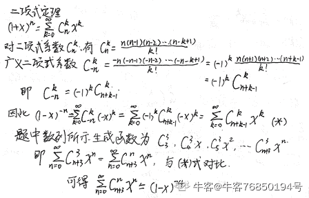

发表于 2020-03-14 16:29:52

* * *

[Fzldq](https://www.nowcoder.com/profile/209755777)

泰勒展开的重要恒等式


其中
且

这题里

编辑于 2020-07-30 17:58:39

* * *

## 43

P∧(P→Q)，该式的析范式是下列哪个选项？（      ）

正确答案: A   你的答案: 空 (错误)

```cpp
P∧Q
```

```cpp
P∨Q
```

```cpp
P→Q
```

```cpp
Q→P
```

本题知识点

算法工程师 360 公司 编译和体系结构 组合数学 *2018* *讨论

[HeartAndSoul](https://www.nowcoder.com/profile/6630160)

公式：P->Q <=> 非 P V QP∧(P→Q) <=> (P ∧ 非 P) V (P ∧ Q)                 <=> 0 V (P ∧ Q)                 <=> P ∧ Q  

发表于 2019-08-29 09:52:45

* * *

## 44

抛一枚均匀的硬币若干次，一旦发现其正面朝上的次数达到 n 次，就不再抛硬币，记随机变量 X 为抛硬币的总次数，X 的数学期望为：

正确答案: B   你的答案: 空 (错误)

```cpp
n
```

```cpp
2n
```

```cpp
3n
```

```cpp
n + 2
```

本题知识点

算法工程师 360 公司 组合数学 *2018* *讨论

[逃出的光线](https://www.nowcoder.com/profile/3721737)

答案如下：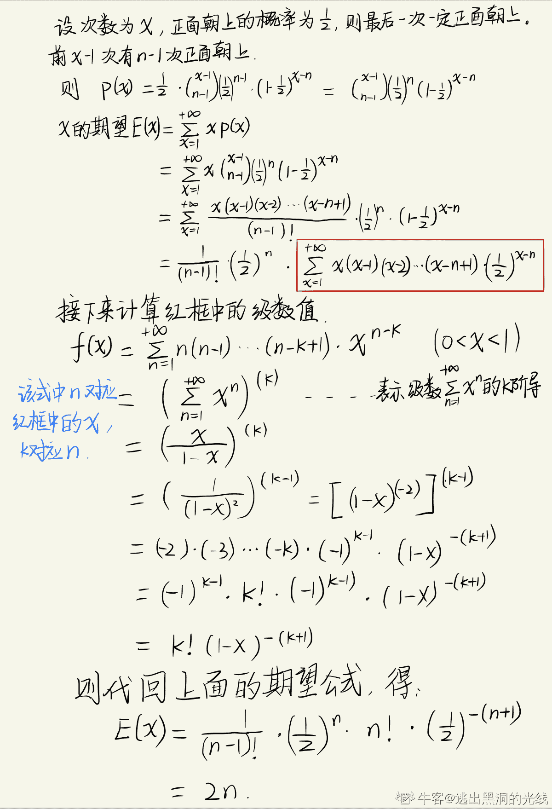
这是直接解法。难度主要是计算级数，好久没遇到过级数问题，还是算了好久 orz

编辑于 2019-11-21 16:35:28

* * *

[然然好可爱捏❤](https://www.nowcoder.com/profile/864896384)

这个直接靠感觉吧...

发表于 2019-10-31 22:12:13

* * *

[牛客 286168367 号](https://www.nowcoder.com/profile/286168367)

出现正或反面的概率各自为 1/2，所以要出现正面 n 次，概率上来说需要仍 2n 次，数学期望其实就是平均值，即为 2n。

发表于 2020-09-28 10:26:26

* * *

## 45

抛一枚均匀的硬币若干次，一旦发现其正面朝上的次数达到 3 次，就不再抛硬币，记随机变量 X 为抛硬币的总次数，X=5 的概率为：

正确答案: C   你的答案: 空 (错误)

```cpp
1/16
```

```cpp
2/16
```

```cpp
3/16
```

```cpp
4/16
```

本题知识点

算法工程师 360 公司 概率统计 *2018 概率论与数理统计* *讨论

[喵星人拯救地球](https://www.nowcoder.com/profile/538133394)

C(4,2)*(1/2)⁵=3/16。 前 4 次有 2 次朝上 第五次朝上

编辑于 2019-01-11 10:02:24

* * *

[酒泽思](https://www.nowcoder.com/profile/588155683)

五次结束：一定是第五次时为正，前四次中随机两次为正，故：1、前四次中随机两次是正，可能出现的情况为：C(4,2)(4 是下标，2 是上标)；2、无论正负，每次出现是概率都是 q=1/2；故前四次是 C(4,2)*（1/2）^(4=)6/16 的概率；3、第五次一定是正，概率为 1/2；故前五次三次为正为概率为（6/16）*（1/2）=3/16；

发表于 2021-03-09 11:33:26

* * *

[夜是故乡明](https://www.nowcoder.com/profile/6432095)

正面朝上次数达到 3 次，抛硬币的次数为 n 次的概率为：
C(n-1, 2)/ 2**(n-1) * 1/2
即前 n-1 次抛了 2 次正面朝上，最后一次抛了正面朝上
当 n=5 时
C(4, 2)/ 2**(4) * 1/2 = 3 / 16

发表于 2019-09-07 15:34:11

* * *

## 46

当在一个决策树中划分一个节点时，以下关于“信息增益”的论述正确的是
1.较不纯的节点需要更多的信息来描述总体
2.信息增益可以通过熵来推导
3.信息增益偏向于选择大量值的属性

正确答案: D   你的答案: 空 (错误)

```cpp
1
```

```cpp
2
```

```cpp
2 和 3
```

```cpp
所有都对
```

本题知识点

算法工程师 360 公司 机器学习 2018

讨论

[Yisnow.](https://www.nowcoder.com/profile/820660435)

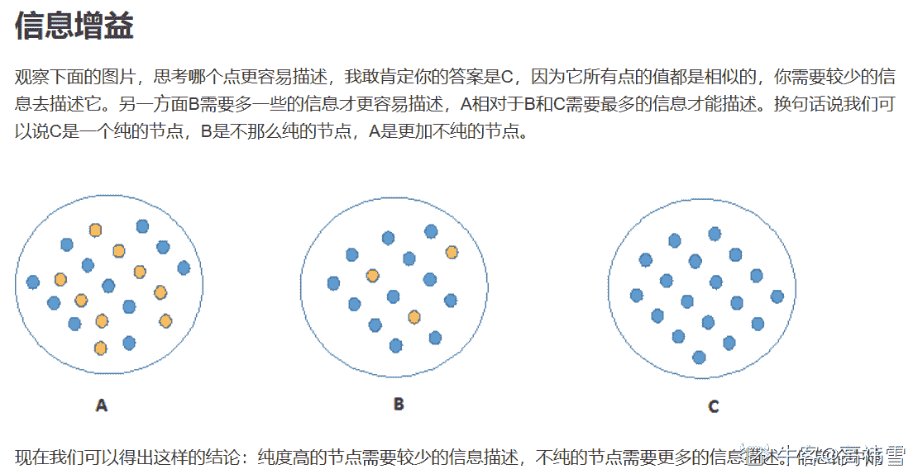所以 A 为什么错了呢？

发表于 2020-04-22 09:32:49

* * *

[syoya](https://www.nowcoder.com/profile/8747720)

谁可以解释下较不纯的节点是什么意思，需要更多的信息又是什么意思......

发表于 2019-09-01 00:48:59

* * *

[nefu-ljw](https://www.nowcoder.com/profile/192966248)

关于 A 选项，较不纯的节点需要更多的信息来描述总体，我这么理解：决策树不断向下延展，每次选择一个属性作为划分依据（作为下一个节点），选择的属性（节点）需要是信息增益最大的，也就是**能得到信息最多的。****而不纯的节点，认为其信息熵较大，则信息增益较小，也就是****如果****你选择这个属性作为下一个节点，得到的信息很少，**那么选它作为划分依据之后可能还需要再多次划分，再得到多个其他属性的信息才能完整描述总体（直到延展到叶节点）。B、C 选项也是正确的，所以答案选 D。

编辑于 2021-04-21 19:34:41

* * *

## 47

有监督机器学习方法可以被分为判别式模型和生成式模型，下面属于生成式模型的有（      ）

正确答案: B C   你的答案: 空 (错误)

```cpp
SVM 支持向量机
```

```cpp
朴素贝叶斯
```

```cpp
隐马尔科夫
```

```cpp
logistic 回归
```

本题知识点

算法工程师 360 公司 机器学习 2018

讨论

[喵星人拯救地球](https://www.nowcoder.com/profile/538133394)

判别式模型(Discriminative Model)：直接对条件概率 p(y|x)进行建模，如：线性回归、决策树、支持向量机 SVM、k 近邻、神经网络等； 生成式模型(Generative Model)：对联合分布概率 p(x,y)进行建模，如：隐马尔可夫模型 HMM、朴素贝叶斯模型、高斯混合模型 GMM、LDA 等；

发表于 2019-01-11 11:02:37

* * *

[华电美男](https://www.nowcoder.com/profile/101256710)

生成模型即给定数据，生成方法是从数据中学习联合概率分布 P(X,Y),然后求出条件概率分布作为预测模型，即 P(Y|X)=P(X,Y)/P(X),常见的生成模型主要有：朴素贝叶斯，隐马尔可夫，LDA 主题模型等判别模型则从数据中直接学习条件概率分布或决策函数，更关心的是给定的输入 X，会给出什么样的预测结果，更关心结果这个预测值，常见的判别模型有：线性回归，逻辑回归，SVM，集成学习，神经网络等

发表于 2019-09-29 10:22:24

* * *

[陈先生 1122](https://www.nowcoder.com/profile/103045449)

C 为什么不是

发表于 2019-08-17 18:03:23

* * *

## 48

根据是否需要标注数据，机器学习方法可以分为有监督学习和无监督学习。监督学习中的训练集用于（      ）

正确答案: B   你的答案: 空 (错误)

```cpp
定量评价机器学习性能
```

```cpp
估算模型
```

```cpp
验证模型
```

```cpp
定性评价机器学习性能
```

本题知识点

算法工程师 360 公司 机器学习 2018

讨论

[牛客 632248939 号](https://www.nowcoder.com/profile/632248939)

*   ```cpp
    我的理解：

    定量评价机器学习性能 -- 用数值表示模型的好坏
    ```

*   ```cpp
    估算模型 -- 训练模型
    ```

*   ```cpp
    验证模型 -- 测试模型的好坏。一般用验证集做这个
    ```

*   ```cpp
    定性评价机器学习性能 -- 用语言描述模型的好坏？
    ```

发表于 2019-12-10 08:49:46

* * *

[你永远得不到的祖奶奶](https://www.nowcoder.com/profile/855996890)

定量评价模型需要使用评价指标，数值来进行评价。估算模型需要使用训练集。验证模型需要使用测试集。定性评估模型需要使用：模型的描述。

发表于 2020-07-28 21:57:20

* * *

[红尘炼心独我痴心](https://www.nowcoder.com/profile/9335363)

大写的服

发表于 2019-09-16 23:13:05

* * *

## 49

关于 KNN 与 K-means 算法描述正确的是：

正确答案: A   你的答案: 空 (错误)

```cpp
KNN 是分类算法,K-Means 是聚类算法 。
```

```cpp
它们都是监督学习。
```

```cpp
都是在数据集中找离它最近的点。
```

```cpp
都有明显的前期训练过程
```

本题知识点

算法工程师 360 公司 机器学习 算法工程师 360 公司 2018

讨论

[喵星人拯救地球](https://www.nowcoder.com/profile/538133394)

一、KNN 计算方法为： 1 计算测试数据与各个训练数据之间的距离； 2 按照距离的递增关系进行排序； 3 选取距离最小的 K 个点； 4 确定前 K 个点所在类别的出现频率； 5 返回前 K 个点中出现频率最高的类别作为测试数据的预测分类。 二、K-means 的计算方法为： 1 随机选取 k 个中心点； 2 遍历所有数据，将每个数据划分到最近的中心点中； 3 计算每个聚类的平均值，并作为新的中心点 ；4 重复 2-3，直到这 k 个中线点不再变化（收敛了），或执行了足够多的迭代。

编辑于 2019-01-11 11:20:02

* * *

[最美打工人](https://www.nowcoder.com/profile/119550130)

```cpp
KNN 就不能是做回归？这题出的不严谨
```

发表于 2019-09-16 12:30:59

* * *

[狗儿🐶](https://www.nowcoder.com/profile/598184175)

KNN：有监督学习、分类算法、有序有标签的数据 K 均值：无监督学习，聚类算法、无序无标签的数据

发表于 2019-09-07 16:03:17

* * *

## 50

假定用于分析的数据包含属性 age，数据元组中 age 的值如下：13,15,16,16,19,20,20,21,22,22,25,25,25,25,30,33,33,33,35,35,35,35,36,40,45,46,52,70。使用 min-max 规范化，可将 age 值 35 转换到[0.0，1.0]区间。转换后的值为：

正确答案: A   你的答案: 空 (错误)

```cpp
0.386
```

```cpp
0.35
```

```cpp
0.365
```

```cpp
0.385
```

本题知识点

算法工程师 360 公司 数据分析工具/软件 2018

讨论

[喵星人拯救地球](https://www.nowcoder.com/profile/538133394)

（35-13）/（70-13）=0.3859

发表于 2019-01-11 11:22:34

* * *

## 51

关于朴素贝叶斯分类算法，描述正确的是：

正确答案: A   你的答案: 空 (错误)

```cpp
它假设属性之间相互独立
```

```cpp
根据先验概率计算后验概率
```

```cpp
对于给定的待分类项 X={a1,a2,...,an}，求解在此项出现的条件下各个类别 yi 出现的概率，哪个 P(yi|X)最大，就把此待分类项归属于哪个类别。
```

```cpp
有最小错误率判断规则和最小风险判断规则
```

本题知识点

算法工程师 360 公司 机器学习 2018

讨论

[喵星人拯救地球](https://www.nowcoder.com/profile/538133394)

朴素贝叶斯定理体现了后验概率 P(y|x) 、先验概率 P(y) 、条件概率 P(x|y)之间的关系： P(y|x)=P(x|y)·P(y)/P(x)。朴素贝叶斯之所以叫“朴素”是因为它假设输入的不同特征之间是独立的。构建朴素贝叶斯分类器的步骤如下： 1、根据训练样例分别计算每个类别出现的概率 P(yi)， 2、对每个特征属性计算所有划分的条件概率 P(xi|yi), 3、对每个类别计算 P(X|yi)*P(yi), 4、选择 3 步骤中数值最大项作为 X 的类别 yk。

编辑于 2019-01-11 11:42:40

* * *

[new_coders](https://www.nowcoder.com/profile/148237639)

我觉得这题有问题，朴素贝叶斯并没有假设属性之间相互独立，它假设的是在类别已知的条件下属性相互独立，这是条件相互独立

发表于 2019-09-25 00:19:39

* * *

[许愿 offer！🌟](https://www.nowcoder.com/profile/799139028)

B 和 C 不对嘛

发表于 2020-08-04 09:29:37

* * *

## 52

若 x = (0, 1, 0, 1), y = (1, 0, 1, 0),则：余弦系数 cos(x, y)、相关系数 corr(x, y)、Jaccard 系数 Jaccard(x, y)分别为：

正确答案: A   你的答案: 空 (错误)

```cpp
0 -1 0
```

```cpp
1 -1 1
```

```cpp
0 -1 1
```

```cpp
0 -1 -1
```

本题知识点

算法工程师 360 公司 组合数学 *2018* *讨论

[喵星人拯救地球](https://www.nowcoder.com/profile/538133394)

cos(x,y) =（0*1+1*0+0*1+1*0）/√2*√2=0。corr(x,y) =［(0-0.5)*(1-0.5) + (1-0.5)*(0-0.5) + (0-0.5)*(1-0.5) + (1-0.5)*(0-0.5)］/［4*(0-0.5)² * 4*(0-0.5)²］= -1。Jaccard(x,y) = （0*1+1*0+0*1+1*0）/ ［(√2)² * (√2)²］= 0

编辑于 2019-01-14 18:55:32

* * *

[牛客 782789427 号](https://www.nowcoder.com/profile/782789427)

对于非算法的来说，这是天书啊，有没有详细一点公式？

发表于 2021-04-02 10:47:58

* * *

## 53

关于决策树算法的描述正确的是：

正确答案: A   你的答案: 空 (错误)

```cpp
在决策树算法中，每个内部结点表示在一个特征或属性；每个分支代表这个特征或属性在某个值域上的输出；每个叶结点代表一种类别。
```

```cpp
决策树可以看成一个 If-then 规则的集合。
```

```cpp
在决策树的各个结点上以信息增益为准则，选择划分后信息增益最大的属性作为划分属性，递归地构建决策树。
```

```cpp
决策树剪枝的目的是为了降低决策树算法的过拟合
```

本题知识点

算法工程师 360 公司 机器学习 算法工程师 360 公司 2018

讨论

[陈先生 1122](https://www.nowcoder.com/profile/103045449)

真的觉得每个都是对的

发表于 2019-08-16 14:13:43

* * *

[landerous](https://www.nowcoder.com/profile/546105362)

求解答，个人认为这个问题每个选项都是对的

编辑于 2019-04-01 14:49:46

* * *

[Jolly_](https://www.nowcoder.com/profile/76121476)

D 为啥不对啊

发表于 2020-03-12 23:24:33

* * *

## 54

以下属于聚类算法的是：

正确答案: A B   你的答案: 空 (错误)

```cpp
K 均值
```

```cpp
DBSCAN
```

```cpp
Apriori
```

```cpp
朴素贝叶斯
```

本题知识点

算法工程师 360 公司 机器学习 2018

讨论

[喵星人拯救地球](https://www.nowcoder.com/profile/538133394)

K-means 算法原理： (1) 随机选取 k 个中心点； (2) 在第 j 次迭代中，对于每个样本点，选取最近的中心点，归为该类； (3) 更新中心点为每类的均值； (4) j&amp;amp;amp;amp;amp;amp;amp;lt;-j+1 ,重复(2)(3)迭代更新，直至误差小到某个值或者到达一定的迭代步数，误差不变。 空间复杂度 o(N)， 时间复杂度 o(I*K*N)， 其中 N 为样本点个数，K 为中心点个数，I 为迭代次数。——————————————————DBSCAN 是一个比较有代表性的基于密度的聚类算法。与划分和层次聚类方法不同，它将簇定义为密度相连的点的最大集合，能够把具有足够高密度的区域划分为簇，并可在噪声的空间数据库中发现任意形状的聚类。具体算法描述如下： （1）检测数据库中尚未检查过的对象 p，如果 p 未被处理(归为某个簇或者标记为噪声)，则检查其邻域，若包含的对象数不小于 minPts，建立新簇 C，将其中的所有点加入候选集 N； （2）对候选集 N 中所有尚未被处理的对象 q，检查其邻域，若至少包含 minPts 个对象，则将这些对象加入 N；如果 q 未归入任何一个簇，则将 q 加入 C； （3）重复步骤 2)，继续检查 N 中未处理的对象，当前候选集 N 为空； （4）重复步骤 1)~3)，直到所有对象都归入了某个簇或标记为噪声。————————————————————Apriori 算法是经典的挖掘频繁项集和关联规则的数据挖掘算法。该算法的基本思想是：首先找出所有的频集，这些项集出现的频繁性至少和预定义的最小支持度一样。然后由频集产生强关联规则，这些规则必须满足最小支持度和最小可信度。然后使用第 1 步找到的频集产生期望的规则，产生只包含集合的项的所有规则，其中每一条规则的右部只有一项，这里采用的是中规则的定义。一旦这些规则被生成，那么只有那些大于用户给定的最小可信度的规则才被留下来。为了生成所有频集，使用了递归的方法。——————————————————————朴素贝叶斯法是基于贝叶斯定理与特征条件独立假设的分类方法。最为广泛的两种分类模型是决策树模型和朴素贝叶斯模型。计算流程： (1) x={a1,a2,....,am}x={a1,a2,....,am}为待分类项， 每个 a 为 x 的一个特征属性 (2)有类别集合 C={y1,y2,...,yn} (3)计算 P(y1|x),P(y2|x),...,P(yn|x) (4)如果 P(yk|x)=max{P(y1|x),P(y2|x),...,P(yn|x)}

编辑于 2019-01-15 18:46:35

* * *

[哼哼 0316](https://www.nowcoder.com/profile/116594225)

k-均值和 DBSCAN 均属于聚类算法

发表于 2019-09-03 15:01:01

* * *

[SdV](https://www.nowcoder.com/profile/902082580)

数据挖掘的聚类算法开除聚类算法籍

发表于 2020-09-15 17:57:16

* * *

## 55

网络管理员查看进程时，发现有三个挂起进程,要在前台继续运行作业号为 2 的进程,下列方式正确的是（      ）

正确答案: B   你的答案: 空 (错误)

```cpp
exec 2
```

```cpp
fg 2
```

```cpp
bg 2
```

```cpp
jobs 2
```

本题知识点

算法工程师 360 公司 Linux 2018

讨论

[年糕*](https://www.nowcoder.com/profile/596219597)

*   exec 使用 vfork 函数时，通常需要 exec 配合使用
*   fg(Foreground) 将进程搬到前台运行的命令
*   bg(Background) 将进程搬到后台运行的命令
*   jobs 查看当前有多少在后台运行的命令

发表于 2019-08-19 21:15:30

* * *

[喵星人拯救地球](https://www.nowcoder.com/profile/538133394)

A：使用 fork 或 vfork 创建子进程后，子进程通常会调用 exec 函数来执行另外一个程序。系统调用 exec 用于执行一个可执行程序以代替当前进程的执行映像。exec 调用没有生成新进程。一个进程一旦调用 exec 函数，它本身就“死亡”了，系统把代码段替换成新的程序的代码，废弃原有的数据段和堆栈段，并为新程序分配新的数据段和堆栈段，唯一保留的就是进程 ID。也就是说，对系统而言，还是同一个进程，不过执行的已经是另外一个程序了。——————————————————————BCD：Ctrl+C： 终止并退出前台命令的执行，回到 SHELL。 Ctrl+Z： 暂停前台命令的执行，将该进程放入后台，回到 SHELL。 jobs： 查看当前在后台执行的命令，可查看命令进程号码。 &： 运行命令时，在命令末尾加上&可让命令在后台执行。 fg N： 将命令进程号码为 N 的命令进程放到前台执行，同%N。 bg N： 将命令进程号码为 N 的命令进程放到后台执行

编辑于 2019-01-15 19:01:07

* * *

[邓帅](https://www.nowcoder.com/profile/216572507)

*   exec 使用 vfork 函数时，通常需要 exec 配合使用
*   fg(Foreground) 将进程搬到前台运行的命令
*   bg(Background) 将进程搬到后台运行的命令
*   jobs 查看当前有多少在后台运行的命令

发表于 2021-11-08 15:19:08

* * *

## 56

网络管理员编写了 shell 程序 prog1.sh,测试时程序死循环无法结束,可以通过下列方式结束程序（      ）

正确答案: A   你的答案: 空 (错误)

```cpp
ctrl+C
```

```cpp
ctrl+X
```

```cpp
Alt F2 kill 进程 ID
```

```cpp
ctrl+d
```

本题知识点

算法工程师 360 公司 软件测试 shell 2018

讨论

[喵星人拯救地球](https://www.nowcoder.com/profile/538133394)

ctrl-c 常用于终止正在运行的程序。 ctrl-d 不是发送信号，而是表示一个特殊的二进制值，表示 EOF。 ctrl+z : 把当前进程转到后台运行，使用’ fg ‘命令恢复。 Ctrl+x 同上但再按一次会从新回到原位置

编辑于 2019-01-16 08:52:38

* * *

[管苗苗](https://www.nowcoder.com/profile/743760401)

如果进程在后台，不就需要杀进程了吗

发表于 2020-05-06 22:09:54

* * *

[牛客 364844496 号](https://www.nowcoder.com/profile/364844496)

ctrl c 中指程序 ctrl z 挂到后台

发表于 2020-04-25 23:01:50

* * *

## 57

下面代码执行后的结果为（      ）

```cpp
int main()
{
int sum=0;
int i=0,j=0;

for(j=0;j<6;j++)
{
if(j%2)continue;
sum++;
}

printf("sum=%d",sum);

return 0;
}
```

正确答案: C   你的答案: 空 (错误)

```cpp
sum=1
```

```cpp
sum=2
```

```cpp
sum=3
```

```cpp
其他几项都不对
```

本题知识点

算法工程师 360 公司 C++ 算法工程师 360 公司 2018

讨论

[喵星人拯救地球](https://www.nowcoder.com/profile/538133394)

求 0,1,2,3,4,5 的偶数，共 3 个

发表于 2019-01-16 08:54:48

* * *

## 58

c 语言前提下，下列数组定义错误的是（      ）

正确答案: A C   你的答案: 空 (错误)

```cpp
int arr[2][3] = {{1,2},{3,4},{5,6}};
```

```cpp
int arr[][3] = {{1,2,3},{4,5,6}};
```

```cpp
int arr[10]={,10};
```

```cpp
int arr[10]={10};
```

本题知识点

算法工程师 360 公司 数组 C++ 算法工程师 360 公司 2018

讨论

[nikk](https://www.nowcoder.com/profile/968151074)

对于** Java**，答案为 ABCD。共同的错误为：左边的中括号里不能有数字声明。C 更错在：Syntax error on token "10"（大括号中的 10）, delete this token。可以如此定义：int arr[] = { , }（长度为 0）或者  int arr[] = {10, }（长度为 1）对于** C/C++**，答案为 AC。（声明了长度若为赋值则系统赋予初始零值）A，在 {5,6} 处报错：初始值预定项值太多。可以如此定义：int arr[2][3] = {{1,2},{3,4}}; 或者 int arr[3][2]= {{1,2},{3,4},{5,6}}; 或者 int arr[3][3] = {{1,2},{3,4},{5,6}};C，在大括号的逗号处报错：应输入表达式。可以如此定义：int arr[10]={10}; 或者 int arr[10] = {10,} 发表于 2019-08-16 15:37:32

* * *

[痩党](https://www.nowcoder.com/profile/696368591)

自己写了一个测试类，四个方法在 Java 中都是不对的，有没有大佬出来解释一下？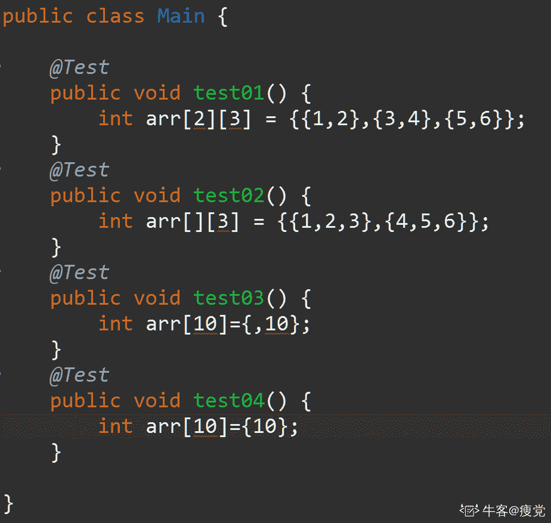

发表于 2019-08-15 17:14:59

* * *

[喵星人拯救地球](https://www.nowcoder.com/profile/538133394)

int arr[3][2] = {{1,2},{3,4},{5,6}}

编辑于 2019-01-16 08:58:18

* * *

## 59

c/c++中，下列选项哪些语句可以正确定义数组（      ）

正确答案: A B D   你的答案: 空 (错误)

```cpp
#define N 2017 int arr[N];
```

```cpp
#define N 2017 int arr[N*2];
```

```cpp
int i=2017； int arr[i];
```

```cpp
int arr[]={1};
```

本题知识点

算法工程师 360 公司 C++ 算法工程师 360 公司 2018

讨论

[HangOnD](https://www.nowcoder.com/profile/436286372)

A.B 都不对，不报错，但是引用，编译器会报错。（本题答案有问题，选 D）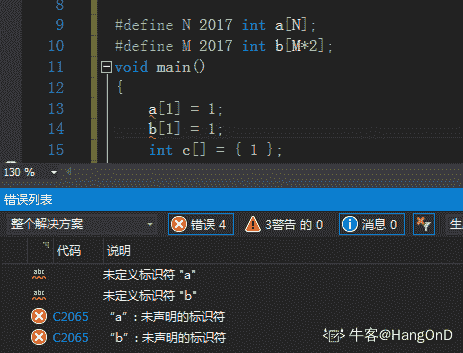
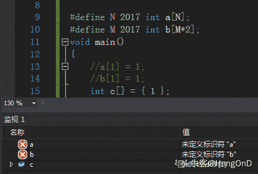

编辑于 2019-08-28 11:29:28

* * *

[OrientObjectPro](https://www.nowcoder.com/profile/3143319)

答案有误，应该选 D

发表于 2019-08-16 14:22:06

* * *

[随心而安的小胖纸](https://www.nowcoder.com/profile/534763702)

有毒了吗

发表于 2019-10-27 15:03:55

* * *

## 60

下面程序执行的结果为（      ）

```cpp
void main( ) 
{ 
char ch1,ch2;

ch1 ='D'+'8'－'3';
ch2 ='9'－'1';

printf("%c %d\n",ch1,ch2);
}
```

正确答案: B   你的答案: 空 (错误)

```cpp
I '8'
```

```cpp
I 8
```

```cpp
G '8'
```

```cpp
其他几项都不对
```

本题知识点

算法工程师 360 公司 C++ 算法工程师 360 公司 2018

## 61

c/c++前提下，下列关于构造函数说法正确的是（      ）

正确答案: C D   你的答案: 空 (错误)

```cpp
构造函数的返回值为 void
```

```cpp
构造函数不可以被重载
```

```cpp
构造函数可以是内联函数
```

```cpp
构造函数可以没有参数
```

本题知识点

算法工程师 360 公司 C++ 算法工程师 360 公司 2018

讨论

[lmy 永不言败](https://www.nowcoder.com/profile/9186281)

就是天王老子来了这道题也选 D

发表于 2019-08-18 16:47:32

* * *

[bobbie.ho](https://www.nowcoder.com/profile/426351696)

这道题 D 到底对不对呢、难道要投票来做决定吗😂😂😂😂

编辑于 2019-08-18 18:46:11

* * *

[拖拉机嘟嘟嘟](https://www.nowcoder.com/profile/117252758)

什么垃圾题目，C 选项，对象还没找到就买好奶粉尿布了。

发表于 2019-08-17 12:17:33

* * *

## 62

关于下面程序说法正确的是（      ）

```cpp
class Item
{
    private:
        char *desc;
        int storage;
    public:
        Item()
        {
            desc = new char[51];
        }

        void setInfo(char *dsrc, int num)
        {
            strcpy(desc,dsrc);
            storage = num;
        }
};

int main()
{
    Item stock;

    stock.setInfo("pen",20);

    return 0;
}
```

正确答案: A B C   你的答案: 空 (错误)

```cpp
main 函数定义了一个 stock 对象占 8 个字节
```

```cpp
storage 和 desc 成员各占 4 个字节
```

```cpp
存在内存泄漏的问题
```

```cpp
存在编译错误
```

本题知识点

算法工程师 360 公司 C++ 算法工程师 360 公司 2018

讨论

[DUDUDUD](https://www.nowcoder.com/profile/796747440)

题目里未指明是 32 位还是 64 位，故指针 char *desc 所占字节数不确定。（32 位是 4 字节，64 位是 8 字节）因此，选项 AB 都错。而用 new 动态申请的空间没有被释放，因此存在内存泄漏的问题，正确答案为 C。

发表于 2019-08-29 10:39:59

* * *

[单向街双行道](https://www.nowcoder.com/profile/7875852)

desc 也没释放啊

发表于 2019-08-16 16:41:19

* * *

[奋斗之路不堵车](https://www.nowcoder.com/profile/603497382)

怎莫感觉这道题遇到好多次，每次答案都不一样😂😂😂

发表于 2019-10-22 12:58:21

* * *

## 63

以下程序运行后的输出结果是（）

```cpp
int main() {
    int a=1,b=2,m=0,n=0,k;
    k=(n=b<a)&&(m=a) ;
    printf("%d,%d\n",k,m);
    return 0;
}
```

正确答案: A   你的答案: 空 (错误)

```cpp
0,0
```

```cpp
0,1
```

```cpp
1,0
```

```cpp
1,1
```

本题知识点

算法工程师 360 公司 C++ 2018 C 语言

讨论

[喵星人拯救地球](https://www.nowcoder.com/profile/538133394)

& &逻辑与运算，先执行 n=b 编辑于 2019-01-16 18:43:50

* * * 

[锌镉熔融](https://www.nowcoder.com/profile/992762161)

(n=b<a)&&(m=a)  && 前面为假，后面 m=a 不执行

发表于 2020-08-11 20:15:02

* * *

[Likatu](https://www.nowcoder.com/profile/881272406)

与运算在前一个判断错误就停止运行

发表于 2020-06-14 18:38:04

* * *

## 64

下列代码段的打印结果为（      ）（注：└┘代表空格）

```cpp
#include <stdio.h>
void main (void)
{
char  ac[]="Hello World! C Program",*p;

for(p=ac+6;p<ac+9;p++)
{
printf("%c",*p);
}
}
```

正确答案: A   你的答案: 空 (错误)

```cpp
Wor
```

```cpp
o W
```

```cpp
└┘Wo
```

```cpp
o Wor
```

本题知识点

算法工程师 360 公司 C++ 算法工程师 360 公司 2018

讨论

[三盏玻璃茶](https://www.nowcoder.com/profile/391092609)

空格加入

发表于 2019-10-27 09:13:12

* * *

[何学良](https://www.nowcoder.com/profile/6505437)

ac+6=ac[6]='W' ac+9=ac[9]='l' 'W'>'l'

发表于 2019-08-24 20:47:03

* * *

## 65

有关下面程序说法正确的是（）（注：└┘代表空格）

```cpp
int main() { 
    char s[6]= "abcd";
    printf("\"%s\"\n", s);
    return 0;    
}
```

正确答案: A   你的答案: 空 (错误)

```cpp
“abcd”
```

```cpp
\"abcd\"
```

```cpp
"abcd└┘"
```

```cpp
编译错误
```

本题知识点

算法工程师 360 公司 C++ 2018 C 语言

讨论

[wwwwxxxx](https://www.nowcoder.com/profile/363259333)

因为像 " 这类的符号自己想想，是不是输不出来，所以要加一个 \ ，这个叫转义符号，" \" "这样子就能输出 " 了（第一个双引号和第三个双引号对应，输出第二个双引号）

发表于 2020-02-21 14:17:15

* * *

[Traveling_L1ght](https://www.nowcoder.com/profile/31501865)

\" 代表一个双引号"符号；"\"%s\"\n" 输出 "s[6]"换行。

发表于 2019-08-22 18:38:24

* * *

[庭瑞](https://www.nowcoder.com/profile/435446708)

不会 c 语言的 printf 答不了，给我用 cout 让我试试

发表于 2019-11-28 22:01:33

* * *

## 66

下面程序执行后输出结果为（）

```cpp
#include <stdio.h>
int main() { 
    int i, j, m=6,n=4,  *p=&n, *q=&m;
    i=p==&m;
    j=(-*p)/(*q)+7;
    printf("i=%d,j=%d\n", i,j);
    return 0;
}
```

正确答案: B   你的答案: 空 (错误)

```cpp
编译错误
```

```cpp
i=0,j=7
```

```cpp
i=0,j=0
```

```cpp
其他几项都不对
```

本题知识点

360 公司 C++ 2018 C 语言

讨论

[cwsxwj](https://www.nowcoder.com/profile/926985858)

i=p==&m;从后结合，先计算 p==&m,p 显然是 n,前后两者不相等，返回结果为了 false，即是 0，所以 i=0；j=(-*p)/(*q)+7;j=(-n)/m+7,先计算除法，（-n）/m=0 , j=0+7=7;所以 i 等于 0，j 等于 7。

发表于 2019-08-16 18:42:10

* * *

[江海余生](https://www.nowcoder.com/profile/538241832)

重点在：j=(-*p)/(*q)+7;所以 j= -4/6 + 7；(-*p)/(*q)必须要转浮点数才能正确计算，否则先取整再计算，-4/6 取整为 0，j=0+7=7 要先 7-4/6 再取整，需要前面的转浮点，即如果：j=((static_cast<double>(-*p))) / (*q)+ 7，则计算 7-0.6...   最后取整为 6，j=6

发表于 2021-02-04 23:35:51

* * *

[牛客 571626675 号](https://www.nowcoder.com/profile/571626675)

心里想的是对的

发表于 2021-06-29 21:51:46

* * *

## 67

下列说法正确的是（）

```cpp
#include "stdio.h"
#include "string.h"
void fun(char *s){ 
    char t[7];
    s=t;
    strcpy(s, "example");
}

int  main(){ 
    char *s;    
    fun(s);    
    printf("%s",s);
    return 0;
}
```

正确答案: D   你的答案: 空 (错误)

```cpp
输出结果为"example"
```

```cpp
输出结果为"烫烫烫烫"
```

```cpp
程序编译时出现错误
```

```cpp
程序运行时出现错误
```

本题知识点

360 公司 C++ 2018 C 语言

讨论

[我科研的样子很像蔡徐坤](https://www.nowcoder.com/profile/893375403)

对于栈中内存如果没有初始化，则会出现“烫烫烫烫烫烫”。对于堆中内存如果没有初始化，则会出现“屯屯屯屯屯”

发表于 2020-02-20 17:46:03

* * *

[西邮白白](https://www.nowcoder.com/profile/132008587)

需要解释的就是编译错误和运行错误，编译错误可以理解成编译器能检查出来的错误，运行错误理解成逻辑错误，需要用户自己纠错

发表于 2020-08-11 11:19:37

* * *

[_random](https://www.nowcoder.com/profile/5246141)

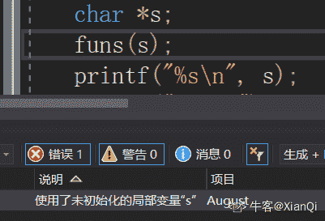用 vs2017 是程序编译就出现错误，没有进行初始化，linux 则是段错误，所以与环境有关

发表于 2019-08-17 17:22:22

* * *

## 68

下面程序的输出结果是（）

```cpp
#include <stdio.h>
int main() { 
    int  intArray[] = {1, 2, 3, 4, 5}; 
    int  *p = (int *)(&intArray+1); 
    printf("%d,%d",*(intArray+1),*(p-1)); 
    return 0; 
}
```

正确答案: D   你的答案: 空 (错误)

```cpp
1,5
```

```cpp
1,6
```

```cpp
2,4
```

```cpp
2,5
```

本题知识点

360 公司 C++ 2018 C 语言

讨论

[KobayakawaSena](https://www.nowcoder.com/profile/629978717)

主要是要理解这句话：int  *p = (int *)(&intArray+1);intArray：是数组的首地址，&intArray：就是存放这个数组首地址的地址,可用 int (*)[5]的指针保存，
&intArray+1：相当于 int (*)[5]这个指针的指针偏移，偏移量是指向元素的大小*1，（比如 double *p，p+1 的偏移量就是一个 double 的大小*1） (int *)(&intArray+1)：相当于把偏移后的地址（也是一个 int[5]）强转给 p 保存；可得 p 指的是数组 intArray 结尾的下个地址，用二维数组理解的话就是 intArray 是第一个 int[5]，即 int[0][5]，p 指向的是 int[1][5]

发表于 2019-10-30 15:09:32

* * *

[喵星人拯救地球](https://www.nowcoder.com/profile/538133394)

intarray 是数组的首地址，& intarray 得到的是一个指向数组的指针。若定义 int (*s) [5] = & intarray; s 是一个指针，它指向的是一个包含 5 个 int 元素的数组。 那么执行 s+1 后，s 的偏移量相当于 s+ sizeof(int) * 5。因此 p 最初指向& intarray[0]+sizeof(int)*5。本题强制将指针 p 转换成一个 int* 那么 p -1 其实就是 & intarray[0]+sizeof(int)*5 - sizeof(int) 。所以，p -1 指向 intarray[4]，也就是 5

编辑于 2019-01-17 09:08:24

* * *

[veeieg](https://www.nowcoder.com/profile/563830559)

*(intArray+1)其实很简单就是指 intArray[1],输出为 2\.

问题关键就在于第二个点，*(p-1)输出为多少？

解释如下，&intArray+1 不是首地址+1，系统会认为加了一个整个 intArray 数组，偏移了整个数组 intArray 的大小（也就是 5 个 int 的大小）。所以 int*p=(int*)(&intArray+1);其实 ptr 实际是&(intArray[5]),也就是 intArray+5\.

原因为何呢？

&intArray 是数组指针，其类型为 int(*)[5];

而指针加 1 要根据指针类型加上一定的值，不同类型的指针+1 之后增加的大小不同，intArray 是长度为 5 的 int 数组指针，所以要加 5*sizeof(int)，所以 p 实际是 intArray[5],但是 p 与（&intArray+1）类型是不一样的，这点非常重要，所以 p-1 只会减去 sizeof(int*),intArray，&intArray 的地址是一样的，但意思就不一样了，intArray 是数组首地址，也就是 intArray[0]的地址，&intArray 是对象（数组）首地址，intArray+1 是数组下一元素的地址，即 intArray[1],&intArray+1 是下一个对象的地址，即 intArray[5]。

发表于 2020-09-29 09:07:36

* * *

## 69

c/c++中，有关纯虚函数说法正确的是（      ）

正确答案: B D   你的答案: 空 (错误)

```cpp
子类中必须覆盖基类的纯虚函数
```

```cpp
含有纯虚函数的类不能被实例化
```

```cpp
子类中必须覆盖基类的虚函数
```

```cpp
含有纯虚函数的类一定是抽象类
```

本题知识点

360 公司 C++ 2018

讨论

[我的天鸭](https://www.nowcoder.com/profile/243498)

这道题的答案应该是 B 和 D 首先，含有纯虚函数的类是抽象类，继承这个抽象类的子类可以覆盖也可以不覆盖纯虚函数。如果基类中的纯虚函数在子类中没有覆盖，那这个子类还是一个抽象类，不能实例化。A 错误 B 就是抽象类的特性，B 正确 C 选项中，纯虚函数是可以有函数体的，当我们希望基类不能产生对象，然而又希望将一些公用代码放在基类时，可以使用纯虚函数，并为纯虚函数定义函数体，只是纯虚函数函数体必须定义在类的外部，C 错误 D 选项是抽象类的定义，D 正确

发表于 2019-08-17 17:40:39

* * *

[不要浮于表面](https://www.nowcoder.com/profile/4131613)

误人子弟啊，赶紧修改一下答案吧

发表于 2019-08-24 14:16:47

* * *

[老实人灬](https://www.nowcoder.com/profile/823164699)

我觉得 ABCD 答案都没有问题。A 答案：派生类继承一个抽象基类的时候，派生类必须将所有的抽象方法实现，否则，派生类也变成了抽象类，不能实例化对象。B 答案：抽象类不能声明对象，只是作为基类为派生类服务。C 答案：纯虚函数是函数体是缺省的，若给一个纯虚函数加上函数体，那么这个函数就由纯虚函数变成了虚函数。D：一个类若要成为抽象类，则必须包含至少一个纯虚函数

发表于 2019-10-18 17:50:47

* * *

## 70

下面哪些函数不能被声明为虚函数（      ）

正确答案: A B C D   你的答案: 空 (错误)

```cpp
构造函数
```

```cpp
静态成员函数
```

```cpp
内联函数
```

```cpp
友元函数
```

本题知识点

算法工程师 360 公司 C++ 2018

讨论

[s 木棉 p](https://www.nowcoder.com/profile/1511734)

以上几类函数都不可声明为虚函数：构造函数：虚函数是运行时绑定，需要对象，所以要先调用构造函数静态成员函数：只有一份大家共享内联函数：编译时就展开，而虚函数是运行时绑定友元函数：友元函数不能被继承，所以不存在虚函数

编辑于 2019-10-17 12:16:52

* * *

[fingerling-俞](https://www.nowcoder.com/profile/679591153)

**不能声明为虚函数的函数**
**1，普通函数（非成员函数）**：定义虚函数的主要目的是为了重写达到多态，所以普通函数声明为虚函数没有意义，因此编译器在编译时就绑定了它。
**2，静态成员函数**：静态成员函数对于每个类都只有一份代码，所有对象都可以共享这份代码，他不归某一个对象所有，所以它也没有动态绑定的必要。,
**3，内联成员函数**：内联函数本就是为了减少函数调用的代价，所以在代码中直接展开。但虚函数一定要创建虚函数表，这两者不可能统一。另外，内联函数在编译时被展开，而虚函数在运行时才动态绑定。
**4，构造函数**：这个原因很简单，主要从语义上考虑。因为构造函数本来是为了初始化对象成员才产生的，然而虚函数的目的是为了在完全不了解细节的情况下也能正确处理对象，两者根本不能“ 好好相处 ”。因为虚函数要对不同类型的对象产生不同的动作，如果将构造函数定义成虚函数，那么对象都没有产生，怎么完成想要的动作？？
**5，友元函数**：当我们把一个函数声明为一个类的友元函数时，它只是一个可以访问类内成员的普通函数，并不是这个类的成员函数，自然也不能在自己的类内将它声明为虚函数。注意：友元本身可以是虚函数！！
如果一个类的友元函数是另一个类成员函数，那么它在自己的类内可以被声明为虚函数。
原文链接：[`blog.csdn.net/ly_6699/article/details/89105680`](https://blog.csdn.net/ly_6699/article/details/89105680)

发表于 2020-05-20 17:22:53

* * *

[PheeeeebsLLi](https://www.nowcoder.com/profile/430262384)

内联函数不能为虚函数，因为内联函数是静态的，虚函数是动态的

发表于 2019-12-25 21:12:24

* * *

## 71

下面程序的输出结果是（      ）

```cpp
#include <stdio.h>
#include <stdlib.h>
void MallocMem(char* pc)
{
pc = (char*) malloc (100);

return;
}

int main()
{ 
char *str=NULL;

MallocMem(str);
strcpy(str,"hello ");
strcat(str+2, "world");

printf("%s",str);

return 0; 
}
```

正确答案: C   你的答案: 空 (错误)

```cpp
hello world
```

```cpp
程序编译错误
```

```cpp
程序运行时崩溃
```

```cpp
其他几项都不对
```

本题知识点

算法工程师 360 公司 C++ 算法工程师 360 公司 2018

讨论

[已注销](https://www.nowcoder.com/profile/824253375)

char *str=NULL； 为空指针，调用函数 MallocMem(str)在传参时传的是 str 的值，所以这就是一个值传递！值传递时是不会改变变量原本的值的，所以尽管给 pc 开辟了一个 100 字节大小的空间，但是 pc 与 str 实际是两个变量，所以 str 的值还为 NULL，给 NULL 里面进行拷贝操作是错的。 使用指针一定要注意指针的操作范围和指向一块有效的内存！

编辑于 2019-09-01 16:45:29

* * *

[树先生，hello](https://www.nowcoder.com/profile/1005792)

缺少 #include <string> 导致运行崩溃；

发表于 2019-08-26 15:43:37

* * *

[许愿有个 offer](https://www.nowcoder.com/profile/458090646)

缺少头文件

发表于 2019-09-01 10:20:04

* * *

## 72

在横线处补充（）可以结果输出值为 80000007。

```cpp
#include <stdio.h>

int convert(int i) {
    return ___________________;
}

int main() {
    int value = 7;
    printf("%x\n", convert(value));
    return 0;
}
```

正确答案: A D   你的答案: 空 (错误)

```cpp
i|=1<<31;
```

```cpp
i&=1<<31;
```

```cpp
i&=~(1<<31);
```

```cpp
i^=1<<31;
```

本题知识点

360 公司 2018 C 语言

讨论

[liuyong1995](https://www.nowcoder.com/profile/848814784)

垃圾题目，D 也是对的

发表于 2019-09-02 15:34:35

* * *

[美团内推（专业正版）](https://www.nowcoder.com/profile/191223862)

<< 左移 用来将一个数的各二进制位全部左移 N 位，高位舍弃，低位补 0。>> 右移 将一个数的各二进制位右移 N 位，移到右端的低位被舍弃，对于无符号数，高位补 0。& 按位与 如果两个相应的二进制位都为 1，则该位的结果值为 1，否则为 0。 l 按位或 两个相应的二进制位中只要有一个为 1，该位的结果值为 1，否则为 0。~ 代表按位取反，对每个二进制进行取反，0 变 1，1 变 0。^ 是按位异或，每一位相同取 0，不同取 1。
答案 A 和 D 都是正确的

发表于 2020-02-26 10:43:53

* * *

[意会。](https://www.nowcoder.com/profile/683204377)

^ 是按位异或，每一位相同取 0，不同取 1。

发表于 2021-10-27 00:15:22

* * *

## 73

在 32 系统下输出的结果为（      ）

```cpp
#include <stdio.h>

#pragma pack(2)
struct Test1
{
int a;
char b;
short c;
int *d;
}A;
#pragma pack()

#pragma pack(4)
struct Test2
{
int *d;
char b;
int a;
short c;
}B;
#pragma pack()

int main()
{
printf("%d,%d\n",sizeof(A),sizeof(B));
return 0;
}
```

正确答案: A   你的答案: 空 (错误)

```cpp
12,16
```

```cpp
13,13
```

```cpp
16,16
```

```cpp
其他几项都不对
```

本题知识点

算法工程师 360 公司 C++ 算法工程师 360 公司 2018

讨论

[喵星人拯救地球](https://www.nowcoder.com/profile/538133394)

VC 中提供了#pragma pack(n)来设定变量以 n 字节对齐方式。n 字节对齐就是说 变量存放的起始地址的偏移量有两种情况： 第一、如果 n 大于等于该变量所占用的字 节数，那么偏移量必须满足默认的对齐方式。 第二、如果 n 小于该变量的类型所占用 的字节数，那么偏移量为 n 的倍数，不用满足默认的对齐方式。—————————————————————— A：4+2+2+4 = 12； B：4+4+4+4 = 16

编辑于 2019-01-18 08:23:41

* * *

## 74

下列 const 使用方法错误的是（      ）

正确答案: A   你的答案: 空 (错误)

```cpp
const int Val = 10; Val = 20;
```

```cpp
class A   {         const int SIZE = 100;         int array[SIZE];   };
```

```cpp
class A { protected:  static int const Inity; };
```

```cpp
int a=7;     const int *aPtr;      aPtr = &a;
```

本题知识点

算法工程师 360 公司 C++ 算法工程师 360 公司 2018

讨论

[喵星人拯救地球](https://www.nowcoder.com/profile/538133394)

const int 定义常变量，且必须初始化，一经初始化，它的值不能改变

编辑于 2019-01-18 08:31:50

* * *

[P-ShineBeam](https://www.nowcoder.com/profile/945440246)

；   代表这个语句已经结束了吧

发表于 2019-09-21 21:06:42

* * *

[许愿有个 offer](https://www.nowcoder.com/profile/458090646)

D 选项中 int a=7 虽然没有声明为 const，但是初始化为常量，则可以赋值给变量

发表于 2019-09-07 11:21:48

* * *

## 75

对下面变量声明描述正确的有（）
int *p[n];
int (*)p[n];
int *p()；
int (*)p();

正确答案: A   你的答案: 空 (错误)

```cpp
int *p[n];—–指针数组，每个元素均为指向整型数据的指针
```

```cpp
int (*)p[n];—p 为指向一维数组的指针，这个一维数组有 n 个整型数据
```

```cpp
int *p();——函数带回指针，指针指向返回的值
```

```cpp
int (*)p();—-p 为指向函数的指针
```

本题知识点

算法工程师 360 公司 C++ 算法工程师 360 公司 2018

讨论

[喵星人拯救地球](https://www.nowcoder.com/profile/538133394)

int *p[4]; 表示指针数组，有四个元素，每个元素都是整型指针。—————————————————————— int (*p)[4]; 表示行指针，所指对象一行有四个元素。—————————————————————— int *p(void); 表示函数，此函数无参，返回整型指针。—————————————————————— int(*P)(void) ;表示函数指针，可以指向无参，且返回值为整型指针的函数。

发表于 2019-01-18 18:25:55

* * *

[0x0offer 的菜鸡](https://www.nowcoder.com/profile/5956690)

指针数组 int* p[n]数组指针 int (*p)[n]函数指针 int (*f)(int...)地址作为还回值 int* f();

发表于 2019-08-21 18:10:11

* * *

## 76

c++的一个类中声明一个 static 成员变量，下面描述正确的是（）

正确答案: A B   你的答案: 空 (错误)

```cpp
static 是加了访问控制的全局变量，不被继承
```

```cpp
类和子类对象，static 变量占有一份内存
```

```cpp
子类继承父类 static 变量
```

```cpp
static 变量在创建对象时分配内存空间
```

本题知识点

算法工程师 360 公司 C++ 算法工程师 360 公司 2018

讨论

[黄色变白色](https://www.nowcoder.com/profile/8547911)

个人觉得答案有问题，应该选 B C 吧，有带佬指点指点嘛父类的 static 变量和函数在派生类中依然可用，但是受访问性控制（比如，父类的 private 域中的就不可访问），而且对 static 变量来说，派生类和父类中的 static 变量是共用空间的

发表于 2020-03-10 09:38:32

* * *

[我的天鸭](https://www.nowcoder.com/profile/243498)

哪位大佬指点指点 B 错在哪了

发表于 2019-08-16 15:00:54

* * *

## 77

面向对象的基本特征有哪些（）

正确答案: A B C   你的答案: 空 (错误)

```cpp
封装
```

```cpp
继承
```

```cpp
多态
```

```cpp
重载
```

本题知识点

算法工程师 360 公司 C++ 算法工程师 360 公司 2018

讨论

[喵星人拯救地球](https://www.nowcoder.com/profile/538133394)

三大特征是：封装、继承和多态。 封装是指将某事物的属性和行为包装到对象中，这个对象只对外公布需要公开的属性和行为，而这个公布也是可以有选择性的公布给其它对象。如使用 private、protected、public 三种修饰符或不用（即默认 defalut）对外部对象访问该对象的属性和行为进行限制。—————————————————————— 继承是子对象可以继承父对象的属性和行为，亦即父对象拥有的属性和行为，其子对象也就拥有了这些属性和行为。——————————————————————多态性是指允许不同类的对象对同一消息作出响应。比如同样的加法，把两个时间加在一起和把两个整数加在一起肯定完全不同。——————————————————————

发表于 2019-01-19 12:00:52

* * *

## 78

下面代码打印结果为（）

```cpp
union package
{
char head;
int  body;
};
struct message
{
char id;
int  crc;
union package pack;
};

int main()
{
printf("size=%d\n",sizeof(struct message));
return 0;
}
```

正确答案: D   你的答案: 空 (错误)

```cpp
9
```

```cpp
10
```

```cpp
11
```

```cpp
12
```

本题知识点

算法工程师 360 公司 C++ 算法工程师 360 公司 2018

讨论

[夏洛贝尔](https://www.nowcoder.com/profile/715617694)

union 存最大的，struct 内部对齐

发表于 2019-09-09 19:56:12

* * *

[呵呵一笑 233](https://www.nowcoder.com/profile/38180166)

请问这是 C 语言还是 c++啊？

发表于 2019-11-18 16:08:18

* * *

[ToNoName](https://www.nowcoder.com/profile/804780711)

union 取最大的内存 int 4 struct 内存向最大的参数对齐（int 的倍数内存） 8（4+4，int+char） 4+8=12

编辑于 2019-09-17 20:14:15

* * *

## 79

多态类中的虚函数表建立在（）

正确答案: A   你的答案: 空 (错误)

```cpp
编译阶段
```

```cpp
运行阶段
```

```cpp
构造函数被调用时进行初始化的
```

```cpp
类声明时
```

本题知识点

算法工程师 360 公司 C++ 算法工程师 360 公司 2018

## 80

C++中空类默认产生哪些类成员函数（）

正确答案: A B C D   你的答案: 空 (错误)

```cpp
默认构造函数
```

```cpp
析构函数
```

```cpp
拷贝构造函数
```

```cpp
赋值函数
```

本题知识点

算法工程师 360 公司 C++ 算法工程师 360 公司 2018

讨论

[憨皮](https://www.nowcoder.com/profile/936697383)

C++的空类默认会产生默认构造函数，默认析构函数，默认拷贝构造函数，默认赋值运算符，还有取址运算符&和取值运算符& const。但是它默认生成的函数，只有在被需要的时候才会产生，即定义一个类对象的时候才会有，如果不创建类对象，则不会创建类的构造函数，析构函数等。例如：

```cpp
 class Empty
{

    public:
       Empty(); // 缺省构造函数
       Empty( const Empty& ); // 拷贝构造函数
       ~Empty(); // 析构函数
       Empty& operator=( const Empty& ); // 赋值运算符
       Empty* operator&(); // 取址运算符
       const Empty* operator&() const; // 取址运算符 const
};
```

发表于 2019-09-11 08:36:16

* * *

[God~Like](https://www.nowcoder.com/profile/8390058)

默认产生 6 个成员函数：1、默认无参构造函数；2、拷贝构造函数；3、析构函数；4、重载赋值运算符；5、重载取址运算符；6、重载取址运算符（常成员函数）

发表于 2019-08-21 22:17:46

* * *

[1 嘿嘿呀](https://www.nowcoder.com/profile/264453512)

C++的空类默认会产生默认构造函数，默认析构函数，默认拷贝构造函数，默认赋值运算符，还有取址运算符&和取值运算符& const。但是它默认生成的函数，只有在被需要的时候才会产生，即定义一个类对象的时候才会有，如果不创建类对象，则不会创建类的构造函数，析构函数等。例如： class Empty {          public:        Empty(); // 缺省构造函数        Empty( const Empty& ); // 拷贝构造函数        ~Empty(); // 析构函数        Empty& operator=( const Empty& ); // 赋值运算符        Empty* operator&(); // 取址运算符        const Empty* operator&() const; // 取址运算符 const };

发表于 2019-10-28 08:50:21

* * *

## 81

变量 void (*s[5])(int)表示意思为（）

正确答案: B   你的答案: 空 (错误)

```cpp
函数指针
```

```cpp
函数指针数组
```

```cpp
数组指针函数
```

```cpp
语法错误
```

本题知识点

算法工程师 360 公司 C++ 算法工程师 360 公司 2018

讨论

[喵星人拯救地球](https://www.nowcoder.com/profile/538133394)

s 为 5 个元素的数组，每个元素为函数指针，函数类型 void(int)

编辑于 2019-01-21 09:25:20

* * *

## 82

定义宏#define DECLARE(name, type) type name##_##type##_type，
则 DECLARE(val, int)替换结果为（）

正确答案: A   你的答案: 空 (错误)

```cpp
int val_int_type
```

```cpp
int val_int_int
```

```cpp
int name_int_int
```

```cpp
int name_int_name
```

本题知识点

算法工程师 360 公司 C++ 算法工程师 360 公司 2018

讨论

[我的天鸭](https://www.nowcoder.com/profile/243498)

##是一种分隔连接方式，它的作用是**先分隔，然后进行强制连接**“name”和第一个“_”之间被分隔了，所以预处理器会把 name##_##type##_type 解释成 4 段：“**name**”、“_”、“**type**”以及“**_type**”，name 和 type 会被替换，而 _type 不会被替换

发表于 2019-08-15 16:52:12

* * *

[喵星人拯救地球](https://www.nowcoder.com/profile/538133394)

'#'是把宏参数转化为字符串的运算符，'##'是把两个宏参数连接的运算符。 例如： ————————————————————#define STR(arg) #arg 则宏 STR(hello)展开为”hello” ———————————————————— #define NAME(y) name_y 则宏 NAME(1)展开时仍为 name_y—————————————————————— #define NAME(y) name_##y 则宏 NAME(1)展开为 name_1—————————————————————— #define DECLARE(name, type) type name##_##type##_type， 则宏 DECLARE(val, int)展开为 int val_int_type

编辑于 2019-01-21 09:39:17

* * *

## 83

extern "c"的作用有哪些（）

正确答案: A   你的答案: 空 (错误)

```cpp
实现 C++代码调用其他 C 语言代码
```

```cpp
使 C 函数不被 C++编译器优化
```

```cpp
使 C 函数使用 C 编译器优化
```

```cpp
到出 C 变量或函数
```

本题知识点

算法工程师 360 公司 C++ 算法工程师 360 公司 2018

讨论

[喵星人拯救地球](https://www.nowcoder.com/profile/538133394)

extern "C"的主要作用就是为了能够正确实现 C++代码调用其他 C 语言代码。加上 extern "C"后，会指示编译器这部分代码按 C 语言的进行编译，而不是 C++的。由于 C++支持函数重载，因此编译器编译函数的过程中会将函数的参数类型也加到编译后的代码中，而不仅仅是函数名；而 C 语言并不支持函数重载，因此编译 C 语言代码的函数时不会带上函数的参数类型，一般只包括函数名。

编辑于 2019-01-21 09:50:08

* * *

## 84

下面程序打印结果在 32 位系统上输出为（）

```cpp
#include<iostream>
using namespace std;

class A {
    char a[3];
public:
    virtual void fun1(){};
};

int main () {
    cout << sizeof(A) << endl;
    return 0;
}
```

正确答案: B   你的答案: 空 (错误)

```cpp
4
```

```cpp
8
```

```cpp
12
```

```cpp
16
```

本题知识点

算法工程师 360 公司 C++ 2018

讨论

[FingWin](https://www.nowcoder.com/profile/411583492)

子类在内存中占用的字节数 = 父类占用字节数 + 自身成员所占的字节数，如果有虚函数，要算上虚函数表指针。

发表于 2020-03-16 21:34:54

* * *

[牛客 710053652 号](https://www.nowcoder.com/profile/710053652)

char[3] 占 3 个字节，虚函数表指针 4 字节，32 位系统需地址对齐，故占 8 字节

发表于 2021-03-21 11:34:58

* * *

[牛客 671885787 号](https://www.nowcoder.com/profile/671885787)

我觉得可能[牛客 710053652 号](https://www.nowcoder.com/profile/710053652) 说的有一点问题：不是类中的**虚函数表指针**4 个字节，是类中的**虚函数表**4 个字节，实例化后的**对象**中存在**虚函数指针**，指向类中的虚函数表

编辑于 2021-03-21 15:56:35

* * *

## 85

下面代码打印结果为（）

```cpp
class Base {
char data[3];
public:
virtual void f() { cout << "Base::f" << endl; }
virtual void g() { cout << "Base::g" << endl; }
virtual void h() { cout << "Base::h" << endl; }

};
int main()
{
cout << sizeof(Base)<< endl;
return 0; 
}
```

正确答案: C   你的答案: 空 (错误)

```cpp
6
```

```cpp
7
```

```cpp
8
```

```cpp
9
```

本题知识点

算法工程师 360 公司 C++ 算法工程师 360 公司 2018

讨论

[喵星人拯救地球](https://www.nowcoder.com/profile/538133394)

若类中包含虚函数,则无论有几个虚函数,sizeof 类都等于 sizeof(数据成员)的和+sizeof(虚函数指针,为 4)。data[3]为长度为 3 的字符数组，对齐后为 4；虚函数指针(无论几个)，为 4;sizeof(class)=4+4=8

编辑于 2019-01-23 09:01:35

* * *

[这个昵称不太火](https://www.nowcoder.com/profile/916973897)

64 位系统跑出来的结果是 16，类和结构中不同类型的成员计算 sizeof 时需要对其，char data[3]长度为 3，虚函数指针(无论几个)是 8（在我的电脑上），对其之后就是 8+8=16.

发表于 2019-03-10 11:16:44

* * *

[4103248jjjjy](https://www.nowcoder.com/profile/4103248)

要考虑到类中的字节对其

发表于 2019-10-30 16:09:27

* * *

## 86

在 C 语言源程序的开始处通常加上预处理命令 #include   <stdio.h>的原因是

正确答案: A   你的答案: 空 (错误)

```cpp
stdio.h 文件中包含标准输入输出函数的函数声明，通过引用此文件以便能正确使用 printf、scanf 等函数
```

```cpp
将 stdio.h 中标准输入输出函数的二进制代码插入到引用处，以便进行编译链接
```

```cpp
将 stdio.h 中标准输入输出函数的源程序插入到引用处，以便进行编译链接
```

```cpp
将 stdio.h 中标准输入输出函数链接到编译生成的可执行文件中，以便能正确运行
```

本题知识点

算法工程师 360 公司 C++ 算法工程师 360 公司 2018

## 87

有转义字符如下：
'\0X41'、'\0x41'、'\X41'、'\x41'、'\a'、'\b'、'\c'、'\r'
其中错误的转义字符个数是

正确答案: C   你的答案: 空 (错误)

```cpp
0 个
```

```cpp
2 个
```

```cpp
4 个
```

```cpp
6 个
```

本题知识点

算法工程师 360 公司 C++ 算法工程师 360 公司 2018

讨论

[yelin](https://www.nowcoder.com/profile/4962194)

错误的是'\0X41'、'\0x41'、'\X41'、'\c'

编辑于 2019-09-16 23:53:01

* * *

[喵星人拯救地球](https://www.nowcoder.com/profile/538133394)

'\0'转义字符空字符；'\xhh' 十六进制转义字符(h 为 0-F)，如'\x41'表示字符'A'，ASCII 码 65；'\ddd'八进制转义字符(d 为 0-7)，如'\063'表示字符'3'，ASCII 码 51；'\a'转义字符 007；'\b'转义字符退格；'\c'非转义字符。以上为转义字符，告诉编译器需要用特殊的方式进行处理。——————————————————————C/C++规定,16 进制数必须以 0x 开头。比如 0x1 表示一个 16 进制数，对应的十进制等于 1。另外如：0xff,0xFF,0X102A,等，x 不区分大小写(0x 中的 0 是数字 0,而不是字母 O)。八进制以英文字母 o 开头，在 c 语言里不分大小写，即 o 与 O 等价。这两者为数字，用于表示十六进制数和八进制数。

编辑于 2019-01-23 09:57:18

* * *

## 88

关于 C 语言，下列指针变量的定义和解释，均正确的是

正确答案: A   你的答案: 空 (错误)

```cpp
int  *p[10];    //定义 10 个指针变量组成的指针数组
```

```cpp
int  *p();    //定义一个函数的指针，将来可用此指针指向一个函数
```

```cpp
int  (*p)[];  //定义一个行指针
```

```cpp
int **p;  //定义一个指针变量，该指针变量可以指一个向二维数组
```

本题知识点

算法工程师 360 公司 C++ 算法工程师 360 公司 2018

讨论

[犇流](https://www.nowcoder.com/profile/139469194)

不再赘述：先了解一下运算符的优先级：()>[]>*其次：int p;//整形变量 pint *p;//整形指针 pint *p[];//整形指针数组 p，运算符优先级，p[]数组，类型为 int *类型   int (*p)[];//数组指针正确声明方式                                                                      int *p();// 返回一个整形指针的函数，我理解这个指针不是指向返回值 ------C
int (*p)();//函数指针正确声明方式，该函数的返回值为整型                int **p; //定义一个指针变量，该指针变量可以指一个向二维数组，如此指向二维数组使用数组指针 int arry[2][3];int (*p)[3] = arryint **p 二维指针则是不能指向二维数组的，会出现编译错误，    error C2440: “初始化”: 无法从“int [2][3]”转换为“int **”**所以综上所述**正确答案
-----A

发表于 2019-10-07 15:04:06

* * *

[拖拉机嘟嘟嘟](https://www.nowcoder.com/profile/117252758)

C 选项没什么问题，行指针是指向数组的指针，列指针是指向数组元素的指针，p 指针是指向元素个数为 0 的数组，数组定义时元素个数必须大于 0，p 只不过不能用罢了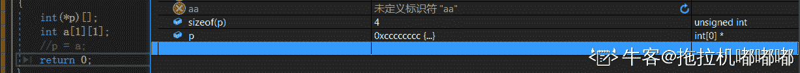

编辑于 2019-08-30 15:52:36

* * *

[Jankel](https://www.nowcoder.com/profile/5206128)

4 指针的指针不能赋值为二维数组吗？

发表于 2019-08-16 07:49:26

* * *

## 89

#include "file.h"和#include <file.h>的区别是（      ）

正确答案: A   你的答案: 空 (错误)

```cpp
#include "file.h"是指编译器将从当前工作目录上开始查找此文件
```

```cpp
#include <file.h>是指编译器将从当前工作目录上开始查找此文件
```

```cpp
#include "file.h"指编译器将从标准库目录中开始查找此文件
```

```cpp
#include <file.h>指编译器将从标准库目录中开始查找此文件
```

本题知识点

算法工程师 360 公司 C++ 算法工程师 360 公司 2018

讨论

[听见 _ 下雨的声音](https://www.nowcoder.com/profile/249731987)

*   # include<>直接从编译器自带的函数库中寻找文件#

*   include" "是先从自定义的文件中找 ，如果找不到在从函数库中寻找文件

采用"<>"方式进行包含的头文件表示让编译器在编译器的预设标准路径下去搜索相应的头文件，如果找不到则报错。

特别要注意的是，如果是标准库头文件，那么既可以采用<>的方式，又可以采用" "的方式，而用户自定义的头文件只能采用" "的方式。

系统库目录 和标准库目录

发表于 2019-09-01 14:53:41

* * *

[forever20190530083616](https://www.nowcoder.com/profile/974392850)

#include<file.h>系统检索头文件时 会先从系统目录查找，再找其他地方。用于系统文件较快。
#include"file.h"系统检索头文件时先从当前工作目录查找。用于自定义文件较快。

发表于 2019-08-27 08:49:46

* * *

[涉川 2019](https://www.nowcoder.com/profile/922395943)

沙雕题，啥叫系统库？ 我百度标准库和系统库 dnmd 搞 stm32 的 hal 库都出来了 系统库也不知道是啥

发表于 2019-09-26 14:51:44

* * *

## 90

下列程序的功能是输出 a 数组中小写字母的个数，请为横线处选择合适的程序（      ）
#include <stdio.h>
main()
{ char a[]="123abc";
int i,num=0;
for(i=0;_________;i++)
if(a[i]>='a'&&a[i]<='z') num++;
printf("%d\n",num);
}

正确答案: A   你的答案: 空 (错误)

```cpp
a[i]!='\0'
```

```cpp
a[i]==0
```

```cpp
a[i]=='\0'
```

```cpp
a[i]!=0
```

本题知识点

算法工程师 360 公司 C++ 算法工程师 360 公司 2018

讨论

[蜀醉游子心](https://www.nowcoder.com/profile/5680535)

a[i]!=0；也是可行的吧

发表于 2019-08-20 12:29:21

* * *

## 91

若有定义语句：
int  a [2][3],(*p)[3],*q[3];，则以下赋值语句正确的是（      ）

正确答案: A   你的答案: 空 (错误)

```cpp
p=a;
```

```cpp
q=a;
```

```cpp
p=&s[1];
```

```cpp
q=&s[1];
```

本题知识点

算法工程师 360 公司 C++ 算法工程师 360 公司 2018

讨论

[温暖 520](https://www.nowcoder.com/profile/677982878)

s【1】没有定义，CD 不对，a 是数组名，也可以看成是一个指针，p 是一个指针，指向一个数组，q 是数组不能直接等于 a

发表于 2019-08-15 22:40:32

* * *

## 92

请将 B 类的构造函数补充完整，要求用 x 初始化 a.请为横线处选择合适的程序（      ）
class A
{ int a;
public:
A(int x=0) { a=x; } };
class B: public A {
int b;
public:
B(int x): ______________
{ b=x+1; } };

正确答案: B   你的答案: 空 (错误)

```cpp
a(x)
```

```cpp
A(x)
```

```cpp
B(x)
```

```cpp
a=x
```

本题知识点

算法工程师 360 公司 C++ 算法工程师 360 公司 2018

讨论

[ZZZ13](https://www.nowcoder.com/profile/279001689)

a 是类 A 的私有变量，只能通过类 A 的方法 A（x）对 a 赋值

发表于 2019-08-18 23:31:49

* * *

## 93

下列关于构造函数的说法，错误的是（）

正确答案: A   你的答案: 空 (错误)

```cpp
构造函数不可以是私有的(private)
```

```cpp
一个类中可以有多个构造函数
```

```cpp
无论何时，只要类的对象被创建，就会执行构造函数
```

```cpp
构造函数没有返回类型
```

本题知识点

算法工程师 360 公司 C++ 算法工程师 360 公司 2018

讨论

[HDU_coder](https://www.nowcoder.com/profile/4346548)

单例模式

发表于 2019-08-18 22:34:51

* * *

## 94

下列关于类中的静态成员的说法错误的是（）

正确答案: D   你的答案: 空 (错误)

```cpp
虽然静态成员不属于类的某个对象，但是我们仍然可以使用类的对象、引用或者指针来访问静态成员
```

```cpp
成员函数不用通过作用域运算符就能直接使用静态成员
```

```cpp
静态数据成员不是由类的构造函数初始化的
```

```cpp
静态成员不可以作为默认实参
```

本题知识点

算法工程师 360 公司 C++ 算法工程师 360 公司 2018

讨论

[我的天鸭](https://www.nowcoder.com/profile/243498)

D 错误，应该是非静态成员不可以作为默认实参。一个静态变量，类只会为其维护一个实例，待该静态变量赋值后，编译器会将其填到默认值位置。

发表于 2019-08-17 14:12:26

* * *

## 95

```cpp
#include <bits/stdc++.h>
using namespace std;
int main() {
int n;
scanf("%d", &n);
map <int, int> xs;
map <int, int> ys;
map < pair <int, int>, int > zs;
long long ans = 0;
for (int i = 0; i < n; i++) {
int x, y;
scanf("%d %d", &x, &y);
ans += (xs[x]++);
ans += (ys[y]++);
ans -= (zs[make_pair(x, y)]++);
}
cout << ans << endl;
return 0;
}
```

输入：
6
0 0
0 1
0 2
-1 1
0 1
1 1
则上述程序输出为( )

正确答案: C   你的答案: 空 (错误)

```cpp
9
```

```cpp
10
```

```cpp
11
```

```cpp
12
```

本题知识点

算法工程师 360 公司 C++ 算法工程师 360 公司 2018

讨论

[OrientObjectPro](https://www.nowcoder.com/profile/3143319)

这种题就没什么意思了，没有一点背景的题目，出题人 SB

发表于 2019-08-16 14:21:07

* * *

[向南没有雪](https://www.nowcoder.com/profile/411652215)

关键点在 ans += （xs[x]++）上面，即使 xs[x]++ 外面有括号，也是返回 xs[x] 的值之后再 ++

发表于 2019-08-21 14:35:55

* * *

## 96

```cpp
#include <bits/stdc++.h>
using namespace std;
int main(){
int n = 1001;
int ans = 0;
for(int i = 1; i <= n; ++i){
ans ^= i % 3;
}
cout << ans << endl;
}
```

则上述程序输出为( )

正确答案: B   你的答案: 空 (错误)

```cpp
-2
```

```cpp
0
```

```cpp
1
```

```cpp
2
```

本题知识点

算法工程师 360 公司 C++ 算法工程师 360 公司 2018

讨论

[夜霄](https://www.nowcoder.com/profile/878899945)

简单解析一下(口答，不具权威型，**如有更严谨的回答的同学，请联系我删掉此条解析**）:
^为异或符号，这题意思是从 1 到 1001 依次对 3 取模后互相异或;
我们发现，i=1、2、3 时，异或后的结果是 3,i=4、5、6 时恰好和第一组互补，结果为 0;
那么 1001/3 = 333 组，是个奇数，所以结果应该是 3,但 1001%3 = 2，整除后还余两次循环，因此 3 再与后两次进行异或，结果应该是 0

发表于 2019-08-16 17:34:50

* * *

[Hiboya](https://www.nowcoder.com/profile/261209479)

i=1,2,3,4,5,6 时，ans 分别为 1,3,3,2,0,0     到后面依次循环，因此 6 个为 1 组，1001%6=5，所以看 i=5 时 ans=0，因此答案为 0  

发表于 2019-10-01 17:18:38

* * *

[冰冻冬瓜](https://www.nowcoder.com/profile/140369812)

以 0 作为开始对 3 求余后进行异或，那么手动计算 i=1 到 7，可以看到结果是，01.11.11.10.00.00.01 从 i 为 7 开始重复。那么 1001%6=5，结果就是 0

发表于 2019-09-07 10:58:23

* * *

## 97

下列程序运行结果为：
a=[2, 4, 6, 8, 20,30,40]
print(a[::2])
print(a[-2:])

正确答案: A   你的答案: 空 (错误)

```cpp
[2, 6, 20, 40] [30, 40]
```

```cpp
[4, 8, 30] [30, 40]
```

```cpp
[2, 6, 20, 40] [40]
```

```cpp
[4, 8, 30] [30]
```

本题知识点

算法工程师 360 公司 Python 算法工程师 360 公司 2018

讨论

[夜霄](https://www.nowcoder.com/profile/878899945)

此题为 Python 题，以下摘自网友的总结：

[Python 序列的切片操作与技巧(By iFantasticMe)](https://www.cnblogs.com/ifantastic/archive/2013/04/15/3021845.html "来自 www.cnblogs.com")

> 对于具有序列结构的数据来说，切片操作的方法是：***consequence[start_index: end_index: step]***。
> 请在这里输入引用内容
> **start_index**：
> 表示是第一个元素对象，正索引位置默认为 0；负索引位置默认为 -len(consequence)
> **end_index**：
> 表示是最后一个元素对象，正索引位置默认为 len(consequence)－1；负索引位置默认为 -1。
> **step**：
> 表示取值的步长，默认为 1，步长值不能为 0。

这是一道 Python 题！！！！！你给我放到 C/C++里来？？？？我还以为 TMC++新标准，找半天！要不是看到 print 这个东西，差点被蒙在鼓里！

发表于 2019-08-16 18:43:30

* * *

[吴泽彬](https://www.nowcoder.com/profile/582257509)

第一个是从头索引到最后，每隔两个挑出一个， 第二个是从倒数第二个开始索引#如果是-1 是倒数第一个

发表于 2019-09-25 16:04:59

* * *

## 98

下列程序运行结果为：
a=[1, 2, 3, 4, 5]
sums = sum(map(lambda x: x + 3, a[1::3]))
print(sums)

正确答案: B   你的答案: 空 (错误)

```cpp
10
```

```cpp
13
```

```cpp
15
```

```cpp
17
```

本题知识点

算法工程师 360 公司 C++ 算法工程师 360 公司 2018

讨论

[萧天放](https://www.nowcoder.com/profile/439533598)

python 混入吗?

发表于 2019-09-09 10:20:23

* * *

[喵星人拯救地球](https://www.nowcoder.com/profile/538133394)

a[1::3]返回[2,5]；map(lambda x:x+3,a[1:3])返回[5,8]；sum(***)返回 13

编辑于 2019-02-02 21:25:07

* * *

## 99

下列程序运行结果是：
list1 = [3, 6, 8, 4, 9, 5, 6]
list2 = [5, 6, 10, 17, 11, 2]
list3=list1+list2
print sorted(list(set(list3)))

正确答案: A   你的答案: 空 (错误)

```cpp
[2, 3, 4, 5, 6, 8, 9, 10, 11, 17]
```

```cpp
[2, 3, 4, 5, 6, ，6,6，8, 9, 10, 11, 17]
```

```cpp
[17, 11, 10, 9, 8, 6, 5, 4, 3, 2]
```

```cpp
[17, 11, 10, 9, 8, 6, ，6,6，5, 4, 3, 2]
```

本题知识点

算法工程师 360 公司 2018

讨论

[oy456xd](https://www.nowcoder.com/profile/716542849)

sort(List1) -> List2 将 List1 中的元素从小到大排序，然后返回新的一个列表。 例子 lists:sort([3,2,1]). 结果[1,2,3] 1.List 和 Set 都是接口继承于 Collection 接口。 2.最大的不同就是 List 是可以重复的。而 Set 是不能重复的。 所以 list1+list2 现将 list1 和 list2 元素拼接 set(list3)保留不重复的元素 sorted(list(set(list3)))将元素从小到大排序 list 对 + 和 * 的操作符与字符串相似：+ 号用于组合列表，* 号用于重复列表。[1, 2, 3] + [4, 5, 6]为 [1, 2, 3, 4, 5, 6] 。 ['Hi!'] * 4 为['Hi!', 'Hi!', 'Hi!', 'Hi!'] 。set()用于创建无序不重复元素集合。

编辑于 2019-10-07 00:59:27

* * *

[陌上小小安](https://www.nowcoder.com/profile/734322412)

**sort(List1)** -> List2 将 List1 中的元素从小到大排序，然后返回新的一个列表。
例子 lists:sort([3,2,1]).
结果[1,2,3]

1.List 和**Set**都是接口继承于 Collection 接口。2.最大的不同就是 List 是可以重复的。而 Set 是不能重复的。所以 list1+list2 现将 list1 和 list2 元素拼接
set(list3)保留不重复的元素 sorted(list(set(list3)))将元素从小到大排序

编辑于 2019-09-01 15:13:51

* * *

[offer 过来自己动](https://www.nowcoder.com/profile/372304342)

今天在 C++题库里，刷到了第二道 python 题

发表于 2020-06-30 11:24:43

* * *

## 100

对于以下代码，描述正确的是：
list = ['1', '2', '3', '4', '5']
print list[10:]

正确答案: D   你的答案: 空 (错误)

```cpp
导致 IndexError
```

```cpp
输出['1', '2', '3', '4', '5']
```

```cpp
编译错误
```

```cpp
输出[]
```

本题知识点

算法工程师 360 公司 2018 Python

讨论

[虫子啊](https://www.nowcoder.com/profile/541512286)

D   切片不受内建类型的限制

发表于 2019-09-25 09:56:22

* * *

[不是江小白](https://www.nowcoder.com/profile/550965516)

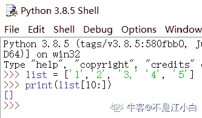

发表于 2020-09-09 16:23:48

* * *

[今天也是要刷题的一天](https://www.nowcoder.com/profile/167073257)

list 序列和切片
list [a:b:c]：a-开始元素 b-结束元素 c-间隔元素，结果-1

发表于 2019-10-11 17:38:49

* * *

## 101

下面程序运行结果为：

```cpp
for i in range(5):
    i+=1
print("-------")
if i==3:
    continue
print(i)
```

正确答案: A   你的答案: 空 (错误)

```cpp
------- 1 ------- 2 ------- ------- 4 ------- 5
```

```cpp
------- 1 ------- 2
```

```cpp
------- 1 ------- 2 ------- 3
```

```cpp
------- 1 ------- 2 ------- 4 ------- 5
```

本题知识点

算法工程师 360 公司 Python 2018

讨论

[嘻嘻嘻，求 offer](https://www.nowcoder.com/profile/8405161)

for i in range(5):
    i+=1
    print("-------")
    if i==3:
        continue
    print(i)能不能带格式缩进下，看着好难受

发表于 2020-04-27 11:20:32

* * *

[鹿温柔](https://www.nowcoder.com/profile/340634989)

考察 continue 跳出本句的循环，但循环仍在继续。故 i = 3 时不进行打印

发表于 2019-12-26 09:00:18

* * *

[gasda](https://www.nowcoder.com/profile/713486037)

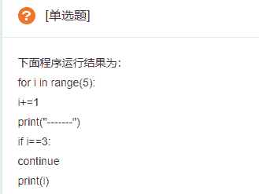
这排版我全靠猜

发表于 2020-04-03 20:07:52

* * *

## 102

以下程序输出为：
info = {'name':'班长', 'id':100, 'sex':'f', 'address':'北京'}
age = info.get('age')
print(age)
age=info.get('age',18)
print(age)

正确答案: A   你的答案: 空 (错误)

```cpp
None 18
```

```cpp
None None
```

```cpp
编译错误
```

```cpp
运行错误
```

本题知识点

算法工程师 360 公司 2018 Python

讨论

[喵星人拯救地球](https://www.nowcoder.com/profile/538133394)

dict.get(key, default=None)—————————————————————— key -- 字典中要查找的键。 default -- 如果指定键的值不存在时，返回该默认值值。

编辑于 2019-02-02 21:36:52

* * *

[kevin95](https://www.nowcoder.com/profile/222050736)

第一个是 info 字典没有 默认返回 none 第二个是如果 info 字典没有，修改默认返回为 18

发表于 2021-08-22 21:39:27

* * *

[牛客罗志祥](https://www.nowcoder.com/profile/239696241)

喂喂喂，这题目是啥？？？

发表于 2019-10-21 21:29:47

* * *

## 103

以下程序输出为：
def test(a,b,*args):
print(a)
print(b)
print(args)
test(11,22,33,44,55,66,77,88,99)

正确答案: A   你的答案: 空 (错误)

```cpp
11 22 (33, 44, 55, 66, 77, 88, 99)
```

```cpp
编译错误
```

```cpp
运行错误
```

```cpp
11 22 (11,22，33, 44, 55, 66, 77, 88, 99)
```

本题知识点

算法工程师 360 公司 Python 2018 C++ C 语言

讨论

[码农 4399](https://www.nowcoder.com/profile/453511792)

这是懒得代码都不愿意缩进了吗，你这不缩进难道不是编译错误？

发表于 2019-12-31 15:51:41

* * *

[用代码养活猫](https://www.nowcoder.com/profile/467215457)

11 给 a, 22 给 b，剩下的包装成元组给了不定长参数 *args，所以答案是 A 有点蛋疼的是，这是 python，这缩进肯定有问题，要这样肯定编译错误......

发表于 2019-12-30 14:55:12

* * *

[微狂](https://www.nowcoder.com/profile/1833870)

完全不懂

发表于 2019-09-12 15:33:43

* * *

## 104

以下程序输出为：

```cpp
def w1():
   print('正在装饰')
   def inner():
        print('正在验证权限')

   return inner()

w1()
```

正确答案: A   你的答案: 空 (错误)

```cpp
正在装饰 正在验证权限
```

```cpp
正在装饰
```

```cpp
正在验证权限
```

```cpp
运行错误
```

本题知识点

算法工程师 360 公司 2018

讨论

[黄色变白色](https://www.nowcoder.com/profile/8547911)

c/c++居然有这种写法了，我好菜（滑稽）


发表于 2019-10-10 07:56:01

* * *

[你今天学到了啥](https://www.nowcoder.com/profile/969193193)

Phthon 被 C 收编了么？🤣🤣🤣🤣🤣🤣

发表于 2019-10-21 21:31:13

* * *

[我的天鸭](https://www.nowcoder.com/profile/243498)

```cpp
def w1():
    print('正在装饰')
    def inner():
        print('正在验证权限')
    return inner()
w1()
```

Python 的函数中可以定义函数，函数也可以返回函数

发表于 2019-08-19 15:55:32

* * *

## 105

以下代码运行结果为：
func = lambda x:x%2
result = filter(func, [1, 2, 3, 4, 5])
print(list(result))

正确答案: A   你的答案: 空 (错误)

```cpp
[1,3,5]
```

```cpp
[1,2,1,0,1]
```

```cpp
[1, 2, 3, 4, 5]
```

```cpp
[1,2,3]
```

本题知识点

算法工程师 360 公司 2018

讨论

[喵星人拯救地球](https://www.nowcoder.com/profile/538133394)

filter()函数用于过滤序列，过滤掉不符合条件的元素，返回由符合条件元素组成的新列表。 函数接收两个参数，第一个为函数，第二个为序列，序列的每个元素作为参数传递给函数进行判断，返回 True 或 False，将返回 True 的元素放到新列表中。

发表于 2019-02-02 21:39:47

* * *

[—永恒 N 守护](https://www.nowcoder.com/profile/213052882)

 lambda x:x%2，是一个取余运算的过程，依次取 1-5 个数通过 filter 进行判断 1 为真保留 0 为假舍弃（就比如 1%2=1 保留，2%2=0 舍弃）最后 list 输出按顺序排序且不重复的序列

发表于 2019-12-27 10:04:28

* * *

[二浩](https://www.nowcoder.com/profile/841132621)

我刷 c/c++呢，给我来这个题不太好吧，幸好会点 python

编辑于 2020-06-08 21:19:59

* * *

## 106

在 python 中，使用 open 方法打开文件,语法如下：
open(文件名，访问模式)
如果以二进制格式打开一个文件用于追加，则访问模式为：

正确答案: C   你的答案: 空 (错误)

```cpp
rb
```

```cpp
wb
```

```cpp
ab
```

```cpp
a
```

本题知识点

算法工程师 360 公司 Python 2018

讨论

[喵星人拯救地球](https://www.nowcoder.com/profile/538133394)

"r","w","a","rb","wb","ab"：指定对文件打开方式即文件内容操作方式，即只读，可写，追加，二进制读，二进制写，二进制追加

发表于 2019-02-02 21:42:08

* * *

[信了你的邪 20191110160692](https://www.nowcoder.com/profile/684220814)

b 二进制模式 r 只读，指针将会放在文件的开头 rb 二进制只读，指针将会放在文件的开头 r+ 读写，指针将会放在文件的开头 rb+ 二进制读写，指针将会放在文件的开头 w 写入， 如果该文件已存在则打开文件，并从开头开始编辑，即原有内容会被删除。如果该文件不存在，创建新文件 wb 二进制写入，如果该文件已存在则打开文件，并从开头开始编辑，即原有内容会被删除。如果该文件不存在，创建新文件。一般用于非文本文件如图片等 w+ 读写，如果该文件已存在则打开文件，并从开头开始编辑，即原有内容会被删除。如果该文件不存在，创建新文件。 wb+ 二进制读写，如果该文件已存在则打开文件，并从开头开始编辑，即原有内容会被删除。如果该文件不存在，创建新文件。一般用于非文本文件如图片等 a 追加，如果该文件已存在，文件指针将会放在文件的结尾。也就是说，新的内容将会被写入到已有内容之后。如果该文件不存在，创建新文件进行写入 ab 二进制追加，如果该文件已存在，文件指针将会放在文件的结尾。也就是说，新的内容将会被写入到已有内容之后。如果该文件不存在，创建新文件进行写入 a+ 读写，如果该文件已存在，文件指针将会放在文件的结尾。文件打开时会是追加模式。如果该文件不存在，创建新文件用于读写。ab+ 二进制读写，如果该文件已存在，文件指针将会放在文件的结尾。如果该文件不存在，创建新文件用于读写。

发表于 2020-01-23 13:18:47

* * *

[小白兔白又白~](https://www.nowcoder.com/profile/150382123)

"r","w","a","rb","wb","ab"：指定对文件打开方式即文件内容操作方式，即只读，可写，追加，二进制读，二进制写，二进制追加

发表于 2019-09-10 10:36:56

* * *

## 107

Python 调用(   )函数可实现对文件内容的读取

正确答案: A   你的答案: 空 (错误)

```cpp
read()
```

```cpp
readline()
```

```cpp
readlines()
```

```cpp
readclose()
```

本题知识点

算法工程师 360 公司 Python 2018

讨论

[喵星人拯救地球](https://www.nowcoder.com/profile/538133394)

read()读整个文件；readline()读一行；readlines()读所有行到 list

发表于 2019-02-02 21:45:05

* * *

[杳青](https://www.nowcoder.com/profile/968728186)

1.read([size])方法从文件当前位置起读取 size 个字节，若无参数 size，则表示读取至文件结束为止，它范围为字符串对象。 2.readline()方法每次读出一行内容，所以，读取时占用内存小，比较适合大文件，该方法返回一个字符串对象。 3.readlines()方法读取整个文件所有行，保存在一个列表(list)变量中，每行作为一个元素，但读取大文件会比较占内存。 https://www.cnblogs.com/yun1108/p/8967334.html

发表于 2019-09-26 14:50:49

* * *

[缪斯 123](https://www.nowcoder.com/profile/898264497)

服了，文件内容就是整个文件吗。。

发表于 2019-08-17 01:21:07

* * *

## 108

下列程序打印结果为（      ）

```cpp
nl = [1,2,5,3,5]

nl.append(4)
nl.insert(0,7)
nl.sort()

print nl
```

正确答案: A   你的答案: 空 (错误)

```cpp
[1, 2, 3, 4, 5, 5, 7]
```

```cpp
[0, 1, 2, 3, 4, 5, 5]
```

```cpp
[1, 2, 3, 4, 5, 7]
```

```cpp
[7, 5, 4, 3, 2, 1]
```

本题知识点

算法工程师 360 公司 Python 2018

讨论

[喵星人拯救地球](https://www.nowcoder.com/profile/538133394)

append（）方法是指在列表末尾增加一个数据项。extend（）方法是指在列表末尾增加一个数据集合。insert（）方法是指在某个特定位置前面增加一个数据项。——————————————————————nl=[1,2,5,3,5]；nl.append(4)得 nl=[1,2,5,3,5,4]；nl.insert(0,7)得 nl=[7,1,2,5,3,5,4]；nl.sort()输出[1,2,3,4,5,5,7]

编辑于 2019-02-02 21:52:16

* * *

[chuncui](https://www.nowcoder.com/profile/885982410)

sort()是对自己排序，sorted()返回一个排序后的副本。

发表于 2020-01-08 11:16:13

* * *

[小蓝瓶](https://www.nowcoder.com/profile/370724991)

append 列表尾增加元素 insert 列表某个位置插入元素 sort 列表排序默认升序

发表于 2019-11-18 11:18:25

* * *

## 109

假定某同学使用贝叶斯分类模型时，由于失误操作，致使训练数据中两个维度重复表示。下列描述中正确的是：

正确答案: B   你的答案: 空 (错误)

```cpp
被重复的在模型中作用被加强
```

```cpp
模型效果精度降低
```

```cpp
如果所有特征都被重复一遍，则预测结果不发生变化
```

本题知识点

算法工程师 360 公司 机器学习 2018

讨论

[渣渣在此 9675](https://www.nowcoder.com/profile/782532875)

朴素贝叶斯采用属性条件独立性假设，会影响算法精度

发表于 2019-08-24 10:11:23

* * *

[大风车恩德](https://www.nowcoder.com/profile/472333413)

朴素贝叶斯的核心在于它假设向量的所有分量之间是独立的。在贝叶斯理中，都有一个重要的条件独立性假设：假设所有特征之间相互独立，这样才能将联合概率拆分，所以选 B

发表于 2020-03-07 14:18:01

* * *

[yzl1994](https://www.nowcoder.com/profile/186473710)

**朴素贝叶斯**的核心在于它假设特征向量的所有分量之间是独立的。

发表于 2020-09-15 08:44:01

* * *

## 110

使用迪杰斯特拉（Dijkstra）算法求下图中从顶点 1 到其他各顶点的最短路径，依次得到最短路径的目标顶点是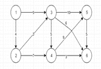

正确答案: C   你的答案: 空 (错误)

```cpp
2,3,4,5,6
```

```cpp
2,3,5,6,4
```

```cpp
2,3,4,6,5
```

```cpp
2,3,6,5,4
```

本题知识点

算法工程师 360 公司 高级算法 机器学习 算法工程师 360 公司 2018

讨论

[牛客 107898 号](https://www.nowcoder.com/profile/107898)

老夫实在是看不见上面的数字啊。。。

发表于 2019-09-29 16:48:29

* * *

[一只老风铃](https://www.nowcoder.com/profile/9973952)

图呢？

发表于 2019-09-05 10:50:21

* * *

[넌어디에서](https://www.nowcoder.com/profile/346342866)

6 能到 5？

发表于 2019-08-20 19:18:39

* * *

## 111

递归公式 T(n)=1,n=1T(n)=4T(n/2)+n，n>1 的时间复杂度为(

正确答案: D   你的答案: 空 (错误)

```cpp
O(n)
```

```cpp
O(logn)
```

```cpp
O(nlogn)
```

```cpp
O(n2)
```

本题知识点

算法工程师 360 公司 复杂度 2018

讨论

[牛客 43164971 号](https://www.nowcoder.com/profile/43164971)

master 公式：若,则有若则有若则有此处 a=4,b=2,d=1,,所以

编辑于 2020-04-04 09:47:26

* * *

[我的天鸭](https://www.nowcoder.com/profile/243498)

主定理 a = 4 b = 2k = 1n^logb(a) = n²

发表于 2019-08-15 23:23:08

* * *

## 112

整数随机变量 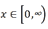 ，服从参数为 a 的泊松分布，即 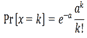

（k 是非负整数）实数随机变量 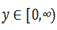 ，服从参数为 a 的指数分布，

即 y 的概率密度函数为 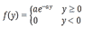 两个式子中的 e 都是自然对数底，且随机变量 x 与 y 相互独立，问 y≥x 的概率。选项中。

正确答案: B   你的答案: 空 (错误)

```cpp
exp(-a)
```

```cpp
exp(a*exp(-a)-a)
```

```cpp
exp(-a*exp(-a)-a)
```

```cpp
exp(-exp(a))
```

本题知识点

算法工程师 360 公司 概率统计 *2018 概率论与数理统计* *讨论

[末离 ml](https://www.nowcoder.com/profile/505295086)


1、倒数第二个“=”由 f(x)=e^x 的泰勒展开得到，即2、疑问：题目中是不是应该补充条件“随机变量 x 与 y 相互独立”，这样联合密度才能写出各自概率密度的乘积

发表于 2020-01-16 17:59:48

* * *

[O_n2](https://www.nowcoder.com/profile/6660805)


编辑于 2019-08-28 22:43:15

* * *

[牛客 630059504 号](https://www.nowcoder.com/profile/630059504)

Σp(x＝k)∫f(y)dy，求和为 0 到正无穷，积分为 k 到正无穷，思路是对每一个 x＝k，y﹥k 的概率之和，求和略微麻烦点用到泰勒公式。

发表于 2022-03-17 22:38:25

* * *

## 113

若存在可逆矩阵 P 使得，则称 A 矩阵相似于 B 矩阵，记为 A~B，已知矩阵 ，，且 A~B，下列哪项为矩阵 P？

正确答案: A   你的答案: 空 (错误)

本题知识点

算法工程师 360 公司 组合数学 *2018* *讨论

[雨辰 rr](https://www.nowcoder.com/profile/795510934)

上式等价于 AP=PB，观察 A、B，选项 P 矩阵，第一行第一列，没有变化，所以只需要计算除去第一行第一列的 2*2 矩阵即可

发表于 2020-05-15 10:35:38

* * *

[凌晨起来背单词](https://www.nowcoder.com/profile/141339970)

p 是可逆的，排除 C、D，然后 A、B 一个个去验证。

编辑于 2020-11-18 16:02:06

* * *

[牛客 812466158 号](https://www.nowcoder.com/profile/812466158)

选择题直接验证选项；简答题直接**

发表于 2021-11-18 21:45:05

* * *

## 114

已知矩阵 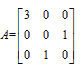 ，下列哪项为？

正确答案: C   你的答案: 空 (错误)

本题知识点

算法工程师 360 公司 组合数学 *2018* *讨论

[给弟弟一个 offer](https://www.nowcoder.com/profile/895606814)

啥叫 A10 呀？。。。

发表于 2019-09-17 10:22:01

* * *

[Lee626](https://www.nowcoder.com/profile/6064787)

3 0 0                3 0 00 0 1          -》 0 1 0     -》 30 1 0                 0 0 1              E 矩阵经过行变换，再分块 变成了 3 和 E ，再进行计算后为 E^(n=)E  ，3^(n=) 3^nE 为单位矩阵

编辑于 2020-03-30 08:55:05

* * *

[凌晨起来背单词](https://www.nowcoder.com/profile/141339970)

行变换后再求矩阵的幂次方（行变换后成为一个类似单位矩阵的样子，只不过(1,1)位置是 3），和之前应该是一样的吧

发表于 2020-11-12 15:24:41

* * *

## 115

在如下的有向图中，从 V1 到 V4 长度为 3(有向图的每条边长度都为 1)的道路有（    ）条。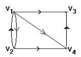

正确答案: A   你的答案: 空 (错误)

```cpp
1
```

```cpp
2
```

```cpp
3
```

```cpp
0
```

本题知识点

算法工程师 360 公司 图 2018

讨论

[香草可乐好喝](https://www.nowcoder.com/profile/1697691)

v1 到 v4 的路线， v1,v2,v1,v4，答案应该是一条

发表于 2019-08-26 20:40:03

* * *

[我的天鸭](https://www.nowcoder.com/profile/243498)

这题应该是 V1 到 V3 才有两条吧，题目和答案总有一个是错的🤔

发表于 2019-08-15 22:19:50

* * *

[半生所寻，一生少年](https://www.nowcoder.com/profile/523334697)

答案的意思就是说 v1 去 v2，再返回 v1 然后去 v3，长度为 3，是有向图，各位看清楚

发表于 2021-10-21 09:24:31

* * *

## 116

有如下数据集，则条件概率 P(A| -) ， P(B | -) ， P(C | -) 分别为: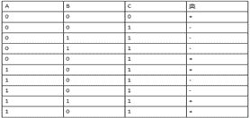

正确答案: A   你的答案: 空 (错误)

```cpp
2/5 、2/5、1
```

```cpp
3/5 、3/5、1
```

```cpp
3/5 、3/5、2/5
```

```cpp
2/5 、2/5、3/5
```

本题知识点

算法工程师 360 公司 概率统计 *2018 概率论与数理统计* *讨论

[枫雪镜夜](https://www.nowcoder.com/profile/980067977)

看不清

发表于 2020-08-09 10:31:04

* * *

[小坤儿](https://www.nowcoder.com/profile/563958688)

比如 A,你看最后一列中一共有 5 个－，而在五个－中，对应的 A 有两个 1 也就是事件发生，所以是五分之二，我看不清最后一列好像是这样的

发表于 2020-03-26 19:29:34

* * *

## 117

有如下数据集，分别使用 1-最近邻，3-最近邻，对数据点 x=5.0 分类，则：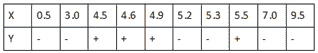

正确答案: A   你的答案: 空 (错误)

```cpp
1-最近邻：+ ;3-最近邻：-
```

```cpp
1-最近邻：+ ;3-最近邻：+
```

```cpp
1-最近邻：- ;3-最近邻：-
```

```cpp
1-最近邻：- ;3-最近邻：+
```

本题知识点

算法工程师 360 公司 数据挖掘 2018

讨论

[softwareGxy](https://www.nowcoder.com/profile/560840485)

1-最近邻时，x=5.0 最近的一个样本是 4.9 是正类，而 3-最近邻时，x=5.0 最近的 3 个样本（4.9，5.2，5.3）中多数是负类，这样来判断

发表于 2020-07-28 13:21:00

* * *

[震川野老](https://www.nowcoder.com/profile/61781914)

这题怎么解？

发表于 2020-03-28 15:34:55

* * *

## 118

有如下数据集，则频繁 3-项集为：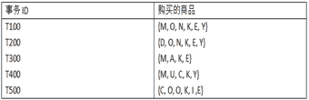

正确答案: A   你的答案: 空 (错误)

```cpp
{O,K,E}
```

```cpp
{M,U,E}
```

```cpp
{N,K,O}
```

```cpp
{Y,U,E}
```

本题知识点

算法工程师 360 公司 数据挖掘 2018

讨论

[PKU_xiaowei](https://www.nowcoder.com/profile/291394677)

直接看选项算比例就 ok

编辑于 2020-04-11 15:24:55

* * *

[Cyril_KI](https://www.nowcoder.com/profile/466955738)

不应该给定一个最小支持度么

发表于 2021-09-12 17:38:00

* * *

[DeShuiYu](https://www.nowcoder.com/profile/381741634)

A:1M:30:5N:2K:5E:4Y:3U:1C:2I:1---->O,K,E --->A

发表于 2020-10-25 17:01:30

* * *

## 119

考虑下表中二元分类问题的训练样本，根据信息增益，哪个是最佳划分(在 a1,a2,a3 中)：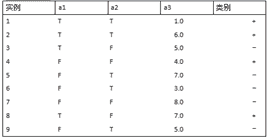

正确答案: A   你的答案: 空 (错误)

```cpp
a1
```

```cpp
a2
```

```cpp
a3
```

本题知识点

算法工程师 360 公司 数据挖掘 2018

讨论

[Simone_](https://www.nowcoder.com/profile/988763861)

根据最后一列的类别反推，a1 中 T 和 F 和类别的 * 和 - 更多对应，所以 a1 优于 a2。

发表于 2020-12-15 15:53:46

* * *

[牛客 945054295 号](https://www.nowcoder.com/profile/945054295)

猜測：因爲只有 a1,a2 對類別有決定作用，所以不是 a1 就是 a2。

发表于 2020-11-14 16:38:16

* * *

[zzxxhh--](https://www.nowcoder.com/profile/743404740)

不用算的话就是看分类的错误数，a1 分错了 2 次，a2 分错了 3 次。

发表于 2022-03-13 10:11:07

* * *****</file.h></stdio.h>*****</semaphore.h>******