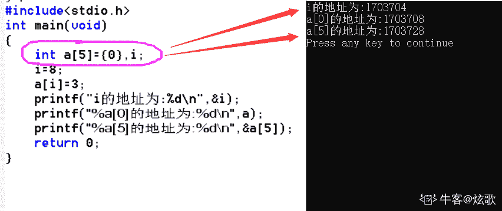
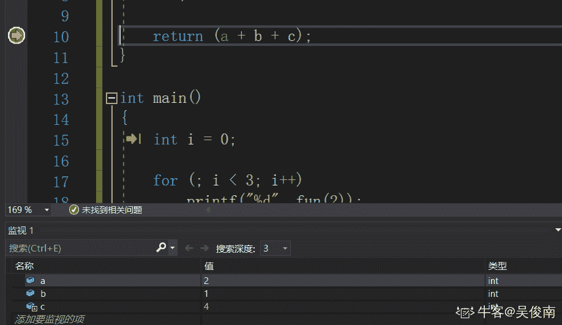
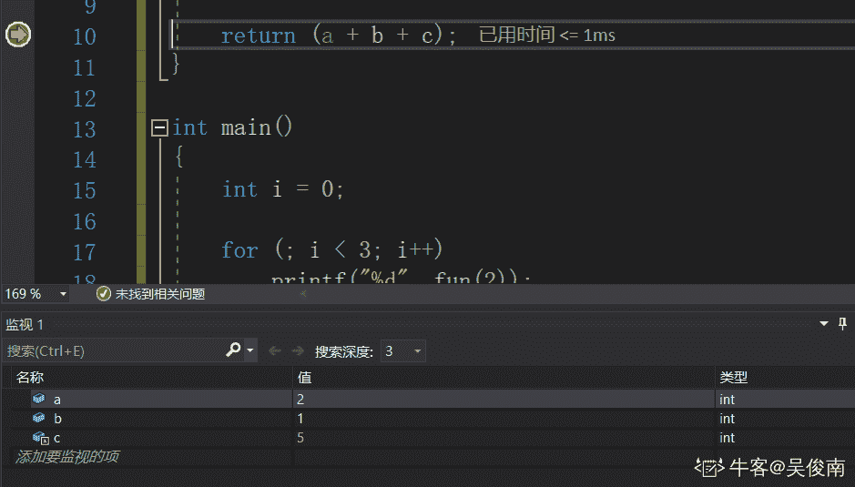
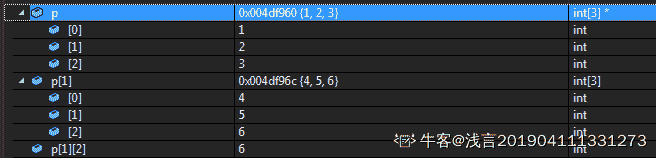
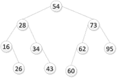
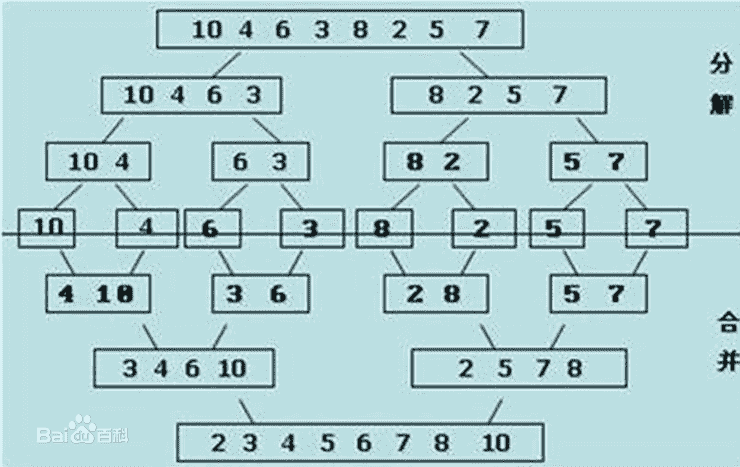

# 三百六十、公司-2019 校招笔试-Android 开发工程师客观题合集

## 1

下面程序的执行结果为（）

```cpp
#include <stdio.h>

int func(int n) {
    if (n < 2)
        return n;
    return func(n - 1) + func(n - 2);
}

int main () {
    printf("%d\n",func(7));
    return 0;
}
```

正确答案: B   你的答案: 空 (错误)

```cpp
11
```

```cpp
13
```

```cpp
17
```

```cpp
21
```

本题知识点

360 公司 C++工程师 2019 C 语言

讨论

[十点睡觉💤](https://www.nowcoder.com/profile/270125029)

f(0)=0;   f(1)=1;
f(2)=f(1)+f(0)=1
f(3)=f(2)+f(1)=2
f(4)=f(3)+f(2)=3
f(5)=f(4)+f(3)=5
f(6)=f(5)+f(4)=8
f(7)=f(6)+f(5)=13 感谢大神思路，学到了，好方法，硬想递归，脑袋要爆炸

发表于 2019-01-07 13:06:38

* * *

[yeyoenjoy](https://www.nowcoder.com/profile/572955639)

f(0)=0;f(1)=1;f(2)=f(1)+f(0)=1;f(3)=f(2)+f(1)=2;...f(7)=f(6)=f(5)=5+8=13

发表于 2019-01-01 15:30:44

* * *

[midou0629](https://www.nowcoder.com/profile/864256344)

这 TM 是 Java 面试题吗？

发表于 2018-12-19 21:50:29

* * *

## 2

下列程序执行 func(15,20)的结果为（）

```cpp
int func(int i, int j){
    if (i <= 0 || j <= 0)
        return 1;
    return 2 * func(i - 3, j / 2);
}
```

正确答案: D   你的答案: 空 (错误)

```cpp
8
```

```cpp
16
```

```cpp
24
```

```cpp
32
```

本题知识点

360 公司 C++工程师 2019 C 语言

讨论

[十点睡觉💤](https://www.nowcoder.com/profile/270125029)

f(0,0)=1
f(3,1)=2*f(0,0)=2
f(6,2)=2*f(3,1)=4
f(9,5)=2*f(6,2)=8
f(12,10)=2*f(9,5)=16
f(15,20)=2*f(12,10)=32 解析来了

发表于 2019-01-07 13:12:43

* * *

[玄学求 offer~](https://www.nowcoder.com/profile/259973278)

 i        j15    2012    10    2*9       5     2²⁶       2     2³³       1     2⁴⁰       0     2⁵         -------->32

发表于 2019-01-03 16:08:30

* * *

[杉杉来啦](https://www.nowcoder.com/profile/243827773)

i 15 12 9 6 3 0
j 20 10 5 2 1 0
    2**2**2**2**2*1＝ 32

编辑于 2020-03-06 12:58:24

* * *

## 3

transient 变量和下面哪一项有关？   

正确答案: B   你的答案: 空 (错误)

```cpp
Cloneable
```

```cpp
Serializable
```

```cpp
Runnable
```

```cpp
Comparable
```

本题知识点

安卓工程师 360 公司 Java 工程师 测试工程师 Java 2019 测试开发工程师

讨论

[IDEA2022.4.2](https://www.nowcoder.com/profile/181223548)

和序列化有关，这是一个空接口，起标记作用，具体的序列化由 ObjectOutputStream 和 ObjectInputStream 完成。transient 修饰的变量不能被序列化，static 变量不管加没加 transient 都不可以被序列化

发表于 2019-08-21 11:58:45

* * *

[HW 柯可](https://www.nowcoder.com/profile/943949859)

通常一个类实现序列化方式是实现序列化接口 Serializable

序列化的作用：把数据长久的保存在磁盘中，磁盘和内存是不同的，内存一般在程序运行时占用，数据保存周期短，随程序结束而结束，磁盘可以长久保存数据

transient 关键字的作用，在已实现序列化的类中，有的变量不需要保存在磁盘中，就要 transient 关键字修饰，如银行卡密码等，就这个作用------在已序列化的类中使变量不序列化

发表于 2019-11-30 14:15:20

* * *

[H 心之所向](https://www.nowcoder.com/profile/231715356)

java 的 transient 关键字的作用是需要实现 Serilizable 接口，将不需要序列化的属性前添加关键字 transient，序列化对象的时候，这个属性就不会序列化到指定的目的地中。

发表于 2019-11-26 20:49:16

* * *

## 4

下面哪个 Set 类是按元素排好序的？

正确答案: B   你的答案: 空 (错误)

```cpp
LinkedHashSet
```

```cpp
TreeSet
```

```cpp
HashSet
```

```cpp
AbstractSet
```

本题知识点

排序 *Java* *讨论

[IDEA2022.4.2](https://www.nowcoder.com/profile/181223548)

TreeSet 自然排序，LinkedHashSet 按添加顺序排序

发表于 2019-08-21 13:09:49

* * *

[七李香](https://www.nowcoder.com/profile/444428525)

**LinkedHashSet**继承于 HashSet、又基于 LinkedHashMap 来实现**TreeSet**使用二叉树的原理对新 add()的对象按照指定的顺序排序（升序、降序），每增加一个对象都会进行排序，将对象插入的二叉树指定的位置。**HashSet**存储元素的顺序并不是按照存入时的顺序（和 List 显然不同） 而是按照哈希值来存的所以取数据也是按照哈希值取得

编辑于 2019-11-18 09:33:58

* * *

[是来福可爱多](https://www.nowcoder.com/profile/399413704)


如上图： 

(01) Set 是继承于 Collection 的接口。它是一个不允许有重复元素的集合。
(02) AbstractSet 是一个抽象类，它继承于 AbstractCollection。AbstractCollection 实现了 Set 中的绝大部分函数，为 Set 的实现类提供了便利。
(03) HastSet 和 TreeSet 是 Set 的两个实现类。
       ** HashSet 依赖于 HashMap，它实际上是通过 HashMap 实现的。**HashSet 中的元素是无序的。
        **TreeSet 依赖于 TreeMap，它实际上是通过 TreeMap 实现的。**TreeSet 中的元素是有序的。

(04) LinkedHashSet 继承于 HashSet，是具有可预知迭代顺序的 Set 接口的哈希表和链接列表实现。此实现与 HashSet 的不同之外在于，后者维护着一个运行于所有条目的双重链接列表。此链接列表定义了迭代顺序，即按照将元素插入到 set 中的顺序（插入顺序）进行迭代。

来源：[`www.cnblogs.com/CherishFX/p/4788432.html`](https://www.cnblogs.com/CherishFX/p/4788432.html)

发表于 2020-06-18 14:10:39

* * *

## 5

java 用（）机制实现了进程之间的同步执行

正确答案: D   你的答案: 空 (错误)

```cpp
虚拟机
```

```cpp
多个 CPU
```

```cpp
异步调用
```

```cpp
监视器
```

本题知识点

安卓工程师 360 公司 Java 工程师 测试工程师 Java 安卓工程师 360 公司 2019 Java 工程师 360 公司 2019 测试开发工程师 360 公司 2019

讨论

[tanksoft](https://www.nowcoder.com/profile/529469465)

多进程不就是多 CPU 同时运行的机制麽？多线程才是监视器吧

发表于 2019-09-20 19:04:59

* * *

[learner111111](https://www.nowcoder.com/profile/970262031)

同步执行，需要监视器，即锁。

发表于 2018-12-21 17:09:06

* * *

[虹虹爱慕斯](https://www.nowcoder.com/profile/6253864)

如果了解一点 Java synchronized，那么就会知道这个监视器是 monitor，在哪里用的。

发表于 2019-08-27 12:19:45

* * *

## 6

以下代码段执行后的输出结果为

```cpp
public class Test {
    public static void main(String args[]) {
        int i = -5;
        i =  ++(i++);
        System.out.println(i);
    }
}
```

正确答案: C   你的答案: 空 (错误)

```cpp
-7
```

```cpp
-3
```

```cpp
编译错误
```

```cpp
-5
```

本题知识点

安卓工程师 360 公司 Java 工程师 测试工程师 Java 2019 测试开发工程师

讨论

[王声声](https://www.nowcoder.com/profile/286355853)

答案是 **编译错误**。这题编译错误在于这一句：  i =  ++(i++);++（  ）  括号里面必须是一个变量，而 i ++  是一个字面量。

发表于 2020-03-19 16:37:32

* * *

[AirAnYv](https://www.nowcoder.com/profile/200363574)

我的理解是：1.先执行括号中的 i++  在执行 i++的时候  Java 会将 i 先存放到一个临时变量中去  并返回该临时变量的值（假设为 temp）2.所以 这句可以拆成  temp = i （值为-5） 并返回 temp 的值  然后 i 自加 1 此时 i 的值为-4  但是之后 执行就会出现问题 由于返回了 temp 的值 继续执行的表达式为  i =  ++(-5);  单目运算符无法后跟一个字面量  所以在 IDEA 编辑器中提示 Variable expected（此处应为变量） 故选择 C 选项  

编辑于 2019-09-05 08:47:29

* * *

[learner111111](https://www.nowcoder.com/profile/970262031)

java 中的 i++和++i 在 java 语言层面上来看使用中间量机制，i=i++，i 不变，i=++i 相当于++i，而结合在一个语句里使用则会报错，因为++后应该跟变量。同理，i=(++i)++也是不对的。

发表于 2018-12-21 17:27:08

* * *

## 7

以下那些代码段能正确执行

正确答案: C D   你的答案: 空 (错误)

```cpp
public static void main(String args[]) {
byte a = 3;
byte b = 2;
b = a + b;
System.out.println(b);
}
```

```cpp
public static void main(String args[]) {
byte a = 127;
byte b = 126;
b = a + b;
System.out.println(b);
}
```

```cpp
public static void main(String args[]) {
byte a = 3;
byte b = 2;
a+=b;
System.out.println(b);
}
```

```cpp
public static void main(String args[]) {
byte a = 127;
byte b = 127;
a+=b;
System.out.println(b);
}
```

本题知识点

安卓工程师 360 公司 Java 工程师 测试工程师 Java 2019 测试开发工程师

讨论

[learner111111](https://www.nowcoder.com/profile/970262031)

byte 类型的变量在做运算时被会转换为 int 类型的值，故 A、B 左为 byte，右为 int，会报错；而 C、D 语句中用的是 a+=b 的语句，此语句会将被赋值的变量自动强制转化为相对应的类型。

发表于 2018-12-21 17:30:50

* * *

[求职游民](https://www.nowcoder.com/profile/88975896)

+=会自动强转（自动装箱功能），但是+必须要手动强转 b=(byte)(a+b)。。。这题我的关注点都放错了，死死盯着 127

发表于 2019-11-06 13:32:38

* * *

[飞鸿踏雪泥 9975](https://www.nowcoder.com/profile/6799891)


发表于 2019-08-15 14:43:23

* * *

## 8

```cpp
 public void test() {
        int a = 10;
        System.out.println(a++ + a--);
    }
```

最后输出什么？

正确答案: C   你的答案: 空 (错误)

```cpp
19
```

```cpp
20
```

```cpp
21
```

```cpp
22
```

本题知识点

安卓工程师 360 公司 Java 工程师 测试工程师 Java 2019 测试开发工程师

讨论

[热心网友阿乐](https://www.nowcoder.com/profile/56547676)


发表于 2020-07-09 15:25:02

* * *

[yyyzj](https://www.nowcoder.com/profile/825454429)

a++ 先把 10 赋值给 a 再+1 所以左边是 10 但此时 a=11。右边 a-- 也是先赋值 a=11，再-1。10+11=21 此时 a=10。

编辑于 2019-09-19 15:21:37

* * *

[徐程煊](https://www.nowcoder.com/profile/942944884)

a++ + a-- 翻译过来等于 a++参与运算时是先运算再++ 当 a--时之前的++已经加好，所以 a--时这个 a 是 11，但是 a--同 a++一样所以整个等于是 10 + 11。如果在 System.out.println(a++ + a--); 语句后再来个 System.out.println(a); 时，这个输出的是 10。结果如图：

发表于 2020-08-04 14:22:10

* * *

## 9

关于 String、StringBuffer、StringBuilder 以下说法错误的是

正确答案: C   你的答案: 空 (错误)

```cpp
StringBuilder 运行速度最快
```

```cpp
StringBuffer 是线程安全的
```

```cpp
String 的值是可变的
```

```cpp
StringBuffer 运行速度比 String 快
```

本题知识点

安卓工程师 360 公司 Java 工程师 测试工程师 Java 2019 测试开发工程师

讨论

[左手 201809131222262](https://www.nowcoder.com/profile/337184788)

String 是 final 修饰的，不可变运行速度 StringBuilder>StringBuffer>StringStringBuffer 是线程安全的

发表于 2019-11-08 10:37:20

* * *

[江璇 Up](https://www.nowcoder.com/profile/188879639)

[`blog.csdn.net/qq_41377858/article/details/103968099`](https://blog.csdn.net/qq_41377858/article/details/103968099)大家可以参考这篇博客，里面详细阐述了着三者的区别，欢迎指正。

编辑于 2020-01-14 11:28:04

* * *

[IamCoderMan](https://www.nowcoder.com/profile/913870039)

String 底层是数组，还是用 final 修饰的

发表于 2019-08-31 14:38:47

* * *

## 10

已知 String a="a",String b="b",String c=a+b,String d=new String("ab") 以下操作结果为 true 的是

正确答案: A D   你的答案: 空 (错误)

```cpp
(a+b).equals(c)
```

```cpp
a+b==c
```

```cpp
c==d
```

```cpp
c.equals(d)
```

本题知识点

安卓工程师 360 公司 Java 工程师 测试工程师 Java 2019 测试开发工程师

讨论

[人余月半子](https://www.nowcoder.com/profile/514787832)

1.== 和 equals():

(1)“==” 用于比较基本数据类型时比较的是值，用于比较引用类型时比较的是引用指向的地址。(2)Object 中的 equals() 与 “==” 的作用相同，但 String 类重写了 equals()方法，比较的是对象中的内容。    

```cpp
public boolean equals(Object anObject) { if (this == anObject) {
      return true;  } else { if (anObject instanceof String) {
                String aString = (String)anObject;
      if (this.coder() == aString.coder()) { return this.isLatin1() ? StringLatin1.equals(this.value, aString.value) : StringUTF16.equals(this.value, aString.value); 
       }
        } return false;  }
}
```

2.String 对象的两种创建方式:

(1)第一种方式: String str1 = "aaa";  是在常量池中获取对象("aaa" 属于字符串字面量，因此编译时期会在常量池中创建一个字符串对象，如果常量池中已经存在该字符串对象则直接引用)
(2)第二种方式: String str2 = new String("aaa") ; 一共会创建两个字符串对象一个在堆中，一个在常量池中（前提是常量池中还没有 "aaa" 象）。        System.out.println(str1==str2);//false

3.String 类型的常量池比较特殊。它的主要使用方法有两种：

(1)直接使用双引号声明出来的 String 对象会直接存储在常量池中。
(2)如果不是用双引号声明的 String 对象,可以使用 String 提供的 intern 方法。 String.intern() 是一个 Native 方法，它的作用是： 如果运行时常量池中已经包含一个等于此 String 对象内容的字符串，则返回常量池中该字符串的引用； 如果没有，则在常量池中创建与此 String 内容相同的字符串，并返回常量池中创建的字符串的引用。
    String s1 = new String("AAA");
    String s2 = s1.intern();
    String s3 = "AAA";
    System.out.println(s2);//AAA
    System.out.println(s1 == s2);//false，因为一个是堆内存中的 String 对象一个是常量池中的 String 对象，
    System.out.println(s2 == s3);//true， s1,s2 指向常量池中的”AAA“

4 字符串拼接：

    String a = "a";
    String b = "b";

    String str1 = "a" + "b";//常量池中的对象
    String str2 = a + b; //在堆上创建的新的对象     
    String str3 = "ab";//常量池中的对象
    System.out.println(str1 == str2);//false
    System.out.println(str1 == str3);//true 
    System.out.println(str2 == str3);//false 

发表于 2019-10-22 16:18:23

* * *

[learner111111](https://www.nowcoder.com/profile/970262031)

选 D。A 的值都不一样；B 中左方和右方实质上都是 new 出来的新 String，“==”比较地址，故 B 不对；C 同理，而 D 中 equals 在 String 中被重载，相当于只比较值。

发表于 2018-12-21 17:37:02

* * *

[IDEA2022.4.2](https://www.nowcoder.com/profile/181223548)

a 和 b 的值都不一样，你给我来个相等，哄鬼呢

发表于 2019-08-22 22:18:09

* * *

## 11

链表与数组的优缺点以下说明正确的是

正确答案: D   你的答案: 空 (错误)

```cpp
数组动态分配内存，并在内存中连续，链表静态分配内存，但不连续
```

```cpp
查询时，数组的时间复杂度为 O(n)，链表为 O(1)
```

```cpp
插入或删除时，数组的时间复杂度为 O(1)，链表为 O(n)
```

```cpp
数组元素在栈区，链表元素在堆区
```

本题知识点

安卓工程师 360 公司 Java 工程师 测试工程师 数组 2019 测试开发工程师

讨论

[载重](https://www.nowcoder.com/profile/696910163)

数组静态分配内存，链表动态分配内存； 数组在内存中连续，链表不连续； 数组元素在栈区，链表元素在堆区； 数组利用下标定位，时间复杂度为 O(1)，链表定位元素时间复杂度 O(n)； 数组插入或删除元素的时间复杂度 O(n)，链表的时间复杂度 O(1) (C,若有问题请指正)

发表于 2019-09-18 13:08:29

* * *

[learner111111](https://www.nowcoder.com/profile/970262031)

这是考的 c 还是 java。。。我当成考 java 看好像是全错吧。。

发表于 2018-12-21 17:45:11

* * *

[FLKID](https://www.nowcoder.com/profile/200170217)

我难道就不能 malloc 一个数组？？？？

发表于 2020-06-12 21:42:32

* * *

## 12

下面这条语句一共创建了多少个对象：String s="welcome"+"to"+360;

正确答案: A   你的答案: 空 (错误)

```cpp
1
```

```cpp
2
```

```cpp
3
```

```cpp
4
```

本题知识点

安卓工程师 360 公司 Java 工程师 测试工程师 Java 2019 测试开发工程师

讨论

[ThinkingOverflow](https://www.nowcoder.com/profile/165701207)

```cpp
String test="javaandpython"; 
String str1="java"; 
String str2="and"; 
String str3="python"; 
System. out. println(test=="java"+"and"+"python"): 
System. out. println(test ==str1 + str2 + str3);
```

对于上面这段代码，结果是 true false 这是因为字符串字面量拼接操作是在 Java 编译器编译期间就执行了，也就是说编译器编译时，直接把"java"、"and"和"python"这三个字面量进行"+"操作得到一个"javaandpython" 常量，并且直接将这个常量放入字符串池中，这样做实际上是一种优化，将 3 个字面量合成一个，避免了创建多余的字符串对象（只有一个对象"javaandpython"，在字符串常量池中）。而字符串引用的"+"运算是在 Java 运行期间执行的，即 str1 + str2 + str3 在程序执行期间才会进行计算，它会在堆内存中重新创建一个拼接后的字符串对象。且在字符串常量池中也会有 str1,str2 与 str3，这里创建多少个新的对象与原来字符串常量池中有没有 str1\str2\str3 有关，如果之前存在就不会创建新的对象。总结来说就是：字面量"+"拼接是在编译期间进行的，拼接后的字符串存放在字符串池中；而字符串引用的"+"拼接运算实在运行时进行的，新创建的字符串存放在堆中。
那么再来看这题，很明显只在编译期间在字符串常量池中创建了"welcometo360"一个字符串 发表于 2019-11-28 01:04:01

* * *

[百思不得姐](https://www.nowcoder.com/profile/697603280)

是否大家有没有刷到这类面试题：在执行 String s = "Hello";s = s + " world!";这两行代码后，原始的 String 对象中的内容到底变了没有？答案的解析：

没有。因为 String 被设计成不可变(immutable)类，所以它的所有对象都是不可变对象。在这段代码中，s 原先指向一个 String 对象，内容是 "Hello"，然后我们对 s 进行了+操作，那么 s 所指向的那个对象是否发生了改变呢？答案是没有。这时，s 不指向原来那个对象了，而指向了另一个 String 对象，内容为"Hello world!"，原来那个对象还存在于内存之中，只是 s 这个引用变量不再指向它了。

通过上面的说明，我们很容易导出另一个结论，如果经常对字符串进行各种各样的修改，或者说，不可预见的修改，那么使用 String 来代表字符串的话会引起很大的内存开销。因为 String 对象建立之后不能再改变，所以对于每一个不同的字符串，都需要一个 String 对象来表示。这时，应该考虑使用 StringBuffer 类，它允许修改，而不是每个不同的字符串都要生成一个新的对象。并且，这两种类的对象转换十分容易。  同时，我们还可以知道，如果要使用内容相同的字符串，不必每次都 new 一个 String。例如我们要在构造器中对一个名叫 s 的 String 引用变量进行初始化，把它设置为初始值，应当这样做： public class Demo {
       private String s;
              ...
       public Demo {
              s = "Initial Value";
       }
       ...
} 而非 s = new String("Initial Value");

后者每次都会调用构造器，生成新对象，性能低下且内存开销大，并且没有意义，因为 String 对象不可改变，所以对于内容相同的字符串，只要一个 String 对象来表示就可以了。也就说，多次调用上面的构造器创建多个对象，他们的 String 类型属性 s 都指向同一个对象。

上面的结论还基于这样一个事实：对于字符串常量，如果内容相同，Java 认为它们代表同一个 String 对象。而用关键字 new 调用构造器，总是会创建一个新的对象，无论内容是否相同。

至于为什么要把 String 类设计成不可变类，是它的用途决定的。其实不只 String，很多 Java 标准类库中的类都是不可变的。在开发一个系统的时候，我们有时候也需要设计不可变类，来传递一组相关的值，这也是面向对象思想的体现。不可变类有一些优点，比如因为它的对象是只读的，所以多线程并发访问也不会有任何问题。当然也有一些缺点，比如每个不同的状态都要一个对象来代表，可能会造成性能上的问题。所以 Java 标准类库还提供了一个可变版本，即 StringBuffer。
说说我的看法：字面量的创建是发生在编译期，类似于上述面试题，答案只创建一个对象。

发表于 2019-09-03 11:27:01

* * *

[NoOfferException](https://www.nowcoder.com/profile/1554976)

使用 Java Decompiler 打开生成的 class 文件

```cpp
public class hello
{
  public static void main(String[] paramArrayOfString)
  {
    String str = "helloto360";
  }
}
```

可以看出，在编译阶段已经将各个字段拼接成一个字符串，由于当前内存中没有该拼接的字符串，所以会动态生成一个对象，内容是拼接后的字符串。

发表于 2019-09-14 09:49:21

* * *

## 13

下面有关 java threadlocal 说法正确的有？

正确答案: A B C D   你的答案: 空 (错误)

```cpp
ThreadLocal 存放的值是线程封闭，线程间互斥的，主要用于线程内共享一些数据，避免通过参数来传递
```

```cpp
从线程的角度看，每个线程都保持一个对其线程局部变量副本的隐式引用，只要线程是活动的并且 ThreadLocal 实例是可访问的；在线程消失之后，其线程局部实例的所有副本都会被垃圾回收
```

```cpp
在 Thread 类中有一个 Map，用于存储每一个线程的变量的副本
```

```cpp
对于多线程资源共享的问题，同步机制采用了“以时间换空间”的方式，而 ThreadLocal 采用了“以空间换时间”的方式
```

本题知识点

安卓工程师 360 公司 Java 工程师 测试工程师 Java 2019 测试开发工程师

讨论

[不靡](https://www.nowcoder.com/profile/476166647)

每次看评论，答案有争议的时候第一想到的总是，这是不是 360 的题。。

发表于 2019-09-25 20:20:54

* * *

[codeDorado](https://www.nowcoder.com/profile/674374614)

ThreadLocal 类用于创建一个线程本地变量在 Thread 中有一个成员变量 ThreadLocals，该变量的类型是 ThreadLocalMap,也就是一个 Map，它的键是 threadLocal，值为就是变量的副本。通过 ThreadLocal 的 get()方法可以获取该线程变量的本地副本，在 get 方法之前要先 set,否则就要重写 initialValue()方法。ThreadLocal 的使用场景：        数据库连接：在多线程中，如果使用懒汉式的单例模式创建 Connection 对象，由于该对象是共享的，那么必须要使用同步方法保证线程安全，这样当一个线程在连接数据库时，那么另外一个线程只能等待。这样就造成性能降低。如果改为哪里要连接数据库就来进行连接，那么就会频繁的对数据库进行连接，性能还是不高。这时使用 ThreadLocal 就可以既可以保证线程安全又可以让性能不会太低。但是 ThreadLocal 的缺点时占用了较多的空间。————借用了 kmust_XiaQing 的回答 

发表于 2020-02-15 22:14:09

* * *

[Fclever](https://www.nowcoder.com/profile/4114516)

ThreadLocal 不是一个线程而是一个线程的本地化对象。当工作于多线程环境中的对象采用 ThreadLocal 维护变量时，ThreadLocal 为每个使用该变量的线程分配一个独立的副本。每个线程都可以独立的改变自己的副本，而不影响其他线程的副本。

发表于 2019-10-21 09:24:30

* * *

## 14

运用下列哪个命令能够获取 JVM 的内存映像

正确答案: B   你的答案: 空 (错误)

```cpp
jinfo
```

```cpp
jmap
```

```cpp
jhat
```

```cpp
jstat
```

本题知识点

安卓工程师 360 公司 Java 工程师 测试工程师 Java 2019 测试开发工程师

讨论

[愚人五个字](https://www.nowcoder.com/profile/963871720)

1、jps：查看本机 java 进程信息。

2、jstack：打印线程的**栈**信息，制作线程 dump 文件。

3、jmap：打印内存映射，制作**堆**dump 文件

4、jstat：性能监控工具

5、jhat：内存分析工具

6、jconsole：简易的可视化控制台

7、jvisualvm：功能强大的控制台

发表于 2019-01-12 09:27:17

* * *

[热心公民波兰周琦](https://www.nowcoder.com/profile/245458708)

可能自己废了.....我是真的不知道，果然我来这里刷题就是为了看解析

发表于 2019-11-09 13:47:00

* * *

[PAT_BUG](https://www.nowcoder.com/profile/424404)

看到映射两个字，就要想到 map！！

发表于 2021-03-07 00:12:17

* * *

## 15

```cpp
 int i = 3;
String result = new String();
switch (i) {
case 1:
result = result + "him ";
case 2:
result = result + "her ";
case 3:
result = result + "it ";
default:
result = result + "me ";
}
System.out.println(result);
```

请给出最终输出内容。

正确答案: A   你的答案: 空 (错误)

```cpp
it me
```

```cpp
him her it me
```

```cpp
him her
```

```cpp
me
```

本题知识点

安卓工程师 360 公司 Java 工程师 测试工程师 Java 2019 测试开发工程师

讨论

[小杨小杨神采飞扬](https://www.nowcoder.com/profile/925864942)

没有 break，会产生穿透，从满足条件的 case 开始执行到底

发表于 2020-05-01 22:01:16

* * *

[幸运 xy](https://www.nowcoder.com/profile/313781633)

根据 switch()括号里的值，进行匹配，走相应的 case。case 没有 break 就继续往下走

发表于 2019-11-06 17:57:54

* * *

[五叨](https://www.nowcoder.com/profile/476670053)

没有 break；会向下穿透，执行 default 如果有 break 就会跳出，不执行以下程序属于分支结构的一种，先判断条件，再选择执行代码块

发表于 2021-05-22 22:23:18

* * *

## 16

以下哪种方式实现的单例是线程安全的

正确答案: A B C D   你的答案: 空 (错误)

```cpp
枚举
```

```cpp
静态内部类
```

```cpp
双检锁模式
```

```cpp
饿汉式
```

本题知识点

安卓工程师 360 公司 Java 工程师 测试工程师 Java 2019 测试开发工程师

讨论

[猿兄](https://www.nowcoder.com/profile/678582225)

高频面试题：**单列模式**的 6 种实现方式。

**整理分享不易，点个赞鸭~**

**目录：**


一、单例模式的定义

**定义：** 确保一个类只有一个实例，并提供该实例的全局访问点。

这样做的好处是：有些实例，全局只需要一个就够了，使用单例模式就可以避免一个全局使用的类，频繁的创建与销毁，耗费系统资源。

二、单例模式的设计要素

*   一个私有构造函数 （确保只能单例类自己创建实例）
*   一个私有静态变量 （确保只有一个实例）
*   一个公有静态函数 （给使用者提供调用方法）

简单来说就是，单例类的构造方法不让其他人修改和使用；并且单例类自己只创建一个实例，这个实例，其他人也无法修改和直接使用；然后单例类提供一个调用方法，想用这个实例，只能调用。这样就确保了全局只创建了一次实例。

三、单例模式的 6 种实现及各实现的优缺点

（一）懒汉式（线程不安全）

**实现：**

```cpp
public class Singleton {
     private static Singleton uniqueInstance;

     private Singleton() {

    }

    public static Singleton getUniqueInstance() {
        if (uniqueInstance == null) {
            uniqueInstance = new Singleton();
        }
        return uniqueInstance;
    }
}
```

**说明：** 先不创建实例，当第一次被调用时，再创建实例，所以被称为懒汉式。

**优点：** 延迟了实例化，如果不需要使用该类，就不会被实例化，节约了系统资源。

**缺点：** 线程不安全，多线程环境下，如果多个线程同时进入了 if (uniqueInstance == null) ，若此时还未实例化，也就是 uniqueInstance == null，那么就会有多个线程执行 uniqueInstance = new Singleton(); ，就会实例化多个实例；

（二）饿汉式（线程安全）

**实现：**

```cpp
public class Singleton {

    private static Singleton uniqueInstance = new Singleton();

    private Singleton() {
    }

    public static Singleton getUniqueInstance() {
        return uniqueInstance;
    }

}
```

**说明：** 先不管需不需要使用这个实例，直接先实例化好实例 (饿死鬼一样，所以称为饿汉式)，然后当需要使用的时候，直接调方法就可以使用了。

**优点：** 提前实例化好了一个实例，避免了线程不安全问题的出现。

**缺点：** 直接实例化好了实例，不再延迟实例化；若系统没有使用这个实例，或者系统运行很久之后才需要使用这个实例，都会操作系统的资源浪费。

（三）懒汉式（线程安全）

**实现：**

```cpp
public class Singleton {
    private static Singleton uniqueInstance;

    private static singleton() {
    }

    private static synchronized Singleton getUinqueInstance() {
        if (uniqueInstance == null) {
            uniqueInstance = new Singleton();
        }
        return uniqueInstance;
    }

}
```

**说明：** 实现和 线程不安全的懒汉式 几乎一样，唯一不同的点是，在 get 方法上 加了一把 锁。如此一来，多个线程访问，每次只有拿到锁的的线程能够进入该方法，避免了多线程不安全问题的出现。

**优点：** 延迟实例化，节约了资源，并且是线程安全的。

**缺点：** 虽然解决了线程安全问题，但是性能降低了。因为，即使实例已经实例化了，既后续不会再出现线程安全问题了，但是锁还在，每次还是只能拿到锁的线程进入该方***使线程阻塞，等待时间过长。

（四）双重检查锁实现（线程安全）

**实现：**

```cpp
public class Singleton {

    private volatile static Singleton uniqueInstance;

    private Singleton() {
    }

    public static Singleton getUniqueInstance() {
        if (uniqueInstance == null) {
            synchronized (Singleton.class) {
                if (uniqueInstance == null) {
                    uniqueInstance = new Singleton();
                }
            }
        }
        return uniqueInstance;
    }  
}
```

**说明:** 双重检查数相当于是改进了 线程安全的懒汉式。线程安全的懒汉式 的缺点是性能降低了，造成的原因是因为即使实例已经实例化，依然每次都会有锁。而现在，我们将锁的位置变了，并且多加了一个检查。 也就是，先判断实例是否已经存在，若已经存在了，则不会执行判断方法内的有锁方法了。 而如果，还没有实例化的时候，多个线程进去了，也没有事，因为里面的方法有锁，只会让一个线程进入最内层方法并实例化实例。如此一来，最多最多，也就是第一次实例化的时候，会有线程阻塞的情况，后续便不会再有线程阻塞的问题。

**为什么使用 volatile 关键字修饰了 uniqueInstance 实例变量 ？**

uniqueInstance = new Singleton(); 这段代码执行时分为三步：

1.  为 uniqueInstance 分配内存空间
2.  初始化 uniqueInstance
3.  将 uniqueInstance 指向分配的内存地址

正常的执行顺序当然是 1>2>3 ，但是由于 JVM 具有指令重排的特性，执行顺序有可能变成 1>3>2。
单线程环境时，指令重排并没有什么问题；多线程环境时，会导致有些线程可能会获取到还没初始化的实例。
例如：线程 A 只执行了 1 和 3 ，此时线程 B 来调用 getUniqueInstance()，发现 uniqueInstance 不为空，便获取 uniqueInstance 实例，但是其实此时的 uniqueInstance 还没有初始化。

解决办法就是加一个 volatile 关键字修饰 uniqueInstance ，volatile 会禁止 JVM 的指令重排，就可以保证多线程环境下的安全运行。

**优点：** 延迟实例化，节约了资源；线程安全；并且相对于 线程安全的懒汉式，性能提高了。

**缺点：** volatile 关键字，对性能也有一些影响。

（五）静态内部类实现（线程安全）

**实现：**

```cpp
public class Singleton {

    private Singleton() {
    }

    private static class SingletonHolder {
        private static final Singleton INSTANCE = new Singleton();
    }

    public static Singleton getUniqueInstance() {
        return SingletonHolder.INSTANCE;
    }

}
```

**说明：** 首先，当外部类 Singleton 被加载时，静态内部类 SingletonHolder 并没有被加载进内存。当调用 getUniqueInstance() 方法时，会运行 return SingletonHolder.INSTANCE; ，触发了 SingletonHolder.INSTANCE ，此时静态内部类 SingletonHolder 才会被加载进内存，并且初始化 INSTANCE 实例，而且 JVM 会确保 INSTANCE 只被实例化一次。

**优点：** 延迟实例化，节约了资源；且线程安全；性能也提高了。

（六）枚举类实现（线程安全）

**实现：**

```cpp
public enum Singleton {

    INSTANCE;

    //添加自己需要的操作
    public void doSomeThing() {

    }

}
```

**说明：** 默认枚举实例的创建就是线程安全的，且在任何情况下都是单例。

**优点：** 写法简单，线程安全，天然防止反射和反序列化调用。

*   **防止反序列化**
    **序列化：**把 java 对象转换为字节序列的过程；
    **反序列化：** 通过这些字节序列在内存中新建 java 对象的过程；
    **说明：** 反序列化 将一个单例实例对象写到磁盘再读回来，从而获得了一个新的实例。
    我们要防止反序列化，避免得到多个实例。
    **枚举类天然防止反序列化。**
    其他单例模式 可以通过 重写 readResolve() 方法，从而防止反序列化，使实例唯一重写 readResolve() :

```cpp
private Object readResolve() throws ObjectStreamException{
        return singleton;
}
```

四、单例模式的应用场景

**应用场景举例：**

*   网站计数器。
*   应用程序的日志应用。
*   Web 项目中的配置对象的读取。
*   数据库连接池。
*   多线程池。
*   ......

**使用场景总结：**

*   **频繁实例化然后又销毁的对象**，使用单例模式可以提高性能。
*   **经常使用的对象，但实例化时耗费时间或者资源多**，如数据库连接池，使用单例模式，可以提高性能，降低资源损坏。
*   **使用线程池之类的控制资源时**，使用单例模式，可以方便资源之间的通信。

看完之后，如果还有什么不懂的，可以在评论区留言，会及时回答更新。

最后，记得点赞支持一波鸭~

编辑于 2021-03-19 15:17:02

* * *

[泡泡 201908061058789](https://www.nowcoder.com/profile/458221310)

Java 中四种线程安全的单例模式实现方式

 第一种：饿汉模式（线程安全）

```cpp
public class Single2 {

    private static Single2 instance = new Single2();

    private Single2(){
        System.out.println("Single2: " + System.nanoTime());
    }

    public static Single2 getInstance(){
        return instance;
    }
}
```

第二种：懒汉模式 （如果方法没有 synchronized，则线程不安全）

```cpp
public class Single3 {

    private static Single3 instance = null;

    private Single3(){
        System.out.println("Single3: " + System.nanoTime());
    }

    public static synchronized Single3 getInstance(){
        if(instance == null){
            instance = new Single3();
        }
        return instance;
    }
}
```

第三种：懒汉模式改良版（线程安全，使用了 double-check，即 check-加锁-check，目的是为了减少同步的开销）

```cpp
public class Single4 {

    private volatile static Single4 instance = null;

    private Single4(){
        System.out.println("Single4: " + System.nanoTime());
    }

    public static Single4 getInstance(){
        if(instance == null){
            synchronized (Single4.class) {
                if(instance == null){
                    instance = new Single4();
                }
            }
        }
        return instance;
    }
}
```

第四种：利用私有的内部工厂类（线程安全，内部类也可以换成内部接口，不过工厂类变量的作用于要改为 public 了。）

```cpp
public class Singleton {

    private Singleton(){
        System.out.println("Singleton: " + System.nanoTime());
    }

    public static Singleton getInstance(){
        return SingletonFactory.singletonInstance;
    }

    private static class SingletonFactory{
        private static Singleton singletonInstance = new Singleton();
    }
}
``` 

发表于 2019-09-17 22:58:15

* * *

[南方有农夫](https://www.nowcoder.com/profile/856147784)

1.饿汉式(线程安全，调用效率高，但是不能延时加载)； 2.懒汉式(线程安全，调用效率不高，但是能延时加载)； 3.Double CheckLock 实现单例：DCL 也就是双重锁判断机制（由于 JVM 底层模型原因，偶尔会出问题，不建议使用）； 4.静态内部类实现模式（线程安全，调用效率高，可以延时加载）； 5.枚举类（线程安全，调用效率高，不能延时加载，可以天然的防止反射和反序列化调用）。

发表于 2019-08-21 12:30:39

* * *

## 17

JDK8 之前版本，HashMap 的数据结构是怎样的？

正确答案: C   你的答案: 空 (错误)

```cpp
数组
```

```cpp
链表
```

```cpp
数组+链表
```

```cpp
二叉树
```

本题知识点

安卓工程师 360 公司 Java 工程师 测试工程师 数组 链表 *Java 2019 测试开发工程师* *讨论

[IDEA2022.4.2](https://www.nowcoder.com/profile/181223548)

JDK8 及其以后版本，HashMap 的数据结构是数组+链表+红黑树

编辑于 2020-05-03 13:53:50

* * *

[揚](https://www.nowcoder.com/profile/573095620)

HashMap 由数组+链表组成的，数组是 HashMap 的主体，链表则是主要为了解决哈希冲突而存在的

发表于 2019-09-15 18:57:04

* * *

[ADE_](https://www.nowcoder.com/profile/153401914)

HashMap 内部包含了一个默认大小为 16 Entry 类型的数组 table,其中每个 Entry 是一个链表，当链表长度大于等于 8 时会将链表转换为红黑树。

发表于 2019-09-23 23:37:09

* * *

## 18

以下哪个不能用来处理线程安全

正确答案: D   你的答案: 空 (错误)

```cpp
synchronized 关键字
```

```cpp
volatile 关键字
```

```cpp
Lock 类
```

```cpp
transient 关键字
```

本题知识点

安卓工程师 360 公司 Java 工程师 测试工程师 Java 2019 测试开发工程师

讨论

[人余月半子](https://www.nowcoder.com/profile/514787832)

synchrozied 关键字称作同步，主要用来给方法、代码块加锁，被加锁的代码段，同一时间内多线程同时访问同一对象的加锁方法/代码块时，只能有一个线程执行能执行方法/代码块中的代码，其余线程必须等待当前线程执行完以后才执行该方法/代码块。volatile 关键字 1.保证了不同线程对该变量操作的内存可见性.(当一个线程修改了变量,其他使用次变量的线程可以立即知道这一修改)。2.禁止了指令重排序.Lock 接口提供了与 synchronized 关键字类似的同步功能，但需要在使用时手动获取锁和释放锁。transient 关键字  简单地说，就是让某些被修饰的成员属性变量不被序列化。

发表于 2019-11-29 13:35:34

* * *

[易燃易爆炸 i](https://www.nowcoder.com/profile/664516865)

valitale 关键字也不能保证线程的安全性，因为它不具备原子性

发表于 2019-08-24 09:16:33

* * *

[smile_Gang 求一个 offer](https://www.nowcoder.com/profile/551457875)

transient，变量修饰符，如果用 transient 声明一个实例变量，当对象存储时，它的值不需要维持。当一个变量不希望被持久化的时候，比如说一些账号密码，就可以用 transient 关键字来表示该变量不参与序列化过程。

发表于 2019-08-17 23:12:06

* * *

## 19

运行代码，结果正确的是：

```cpp
Boolean flag = false;
if(flag = true){
System.out.println("true");
}else{

System.out.println("false");
}
```

正确答案: B   你的答案: 空 (错误)

```cpp
编译错误
```

```cpp
true
```

```cpp
false
```

```cpp
什么也没有输出
```

本题知识点

安卓工程师 360 公司 Java 工程师 测试工程师 Java 2019 测试开发工程师

讨论

[十七岁的程序员](https://www.nowcoder.com/profile/403485947)

输出的明明是 true，而不是 TRUE 啊

发表于 2019-09-08 17:40:59

* * *

[xlstcxg](https://www.nowcoder.com/profile/450572271)

 if(flag = true)的时候 flag 已经是 true 了，所以输出 true；要是为 if(flag == true)输出才为 false

发表于 2019-03-09 18:02:15

* * *

[行间距](https://www.nowcoder.com/profile/6300700)

Java 里只有 boolean 类型可以作为判断条件，其他类型必须通过操作反回 boolean 值,这里本来就是 boolean 类型，可以充当判断条件。个人理解，有误的请指出。

发表于 2019-04-10 18:17:27

* * *

## 20

如果我需要使用一个类的子类的实例，但我又不想与该类的子类发生直接联系，那我应该使用以下哪种

正确答案: A   你的答案: 空 (错误)

```cpp
工厂模式
```

```cpp
生成器模式
```

```cpp
命令模式
```

```cpp
中介者模式
```

本题知识点

安卓工程师 360 公司 Java 工程师 测试工程师 设计模式 2019 测试开发工程师

讨论

[会飞的字节](https://www.nowcoder.com/profile/5974940)

这就像自己想使用华为的 p40 手机，但是自己又不想去亲自生产它（当然自己也没生产资料），这时候就可以通过华为的线下店铺去获得它。

发表于 2020-08-04 17:56:51

* * *

[和雨相拥](https://www.nowcoder.com/profile/83515675)

***题目，问的含糊不清，命令模式就没有解耦？什么垃圾出题人

发表于 2020-09-06 20:05:19

* * *

[飞鸿踏雪泥 9975](https://www.nowcoder.com/profile/6799891)

超类规定标准和通⽤用的⾏行行为，业务细节由⼦子类实现

发表于 2019-08-15 15:32:01

* * *

## 21

以下代码段执行后的输出结果为

```cpp
public class Test {
    public static void main(String[] args) {
        System.out.println(test());

    }
    private static int test() {
        int temp = 1;
        try {
            System.out.println(temp);
            return ++temp;
        } catch (Exception e) {
            System.out.println(temp);
            return ++temp;
        } finally {
            ++temp;
            System.out.println(temp);
        }
    }
}
```

正确答案: D   你的答案: 空 (错误)

```cpp
1,2,2
```

```cpp
1,2,3
```

```cpp
1,3,3
```

```cpp
1,3,2
```

本题知识点

安卓工程师 360 公司 Java 工程师 测试工程师 Java 2019 测试开发工程师

讨论

[learner111111](https://www.nowcoder.com/profile/970262031)

执行顺序为：输出 try 里面的初始 temp：1；temp=2；保存 return 里面 temp 的值：2；执行 finally 的语句 temp：3，输出 temp：3；返回 try 中的 return 语句，返回存在里面的 temp 的值：2；输出 temp：2。

发表于 2018-12-21 17:51:01

* * *

[董大官人](https://www.nowcoder.com/profile/1926520)

finally 代码块在 return 中间执行。return 的值会被放入临时空间，然后执行 finally 代码块，如果 finally 中有 return，会刷新临时空间的值，方法结束返回临时空间值。

发表于 2019-10-09 18:30:00

* * *

[千幻云冰](https://www.nowcoder.com/profile/446558198)

个人理解,有错请指正。1.若 try 代码块内含有 return，同时存在 finally 代码块（代码块内无 return 值）时，先执行 finally 函数的值。2.若 try 代码块内含有 return，同时存在 finally 代码块且代码块内含有 return 值时，此时 finally 代码块内的 return 值将直接返回（或覆盖掉 try 代码块中的 return 值）。public class Test {
public static void main(String[] args) {
System.out.println(test());  //第三个输出，输出 try 的返回值
}
private static int test() {
int temp = 1;
try {
System.out.println(temp);//第一个输出
return ++temp;//此时返回的 temp 值为++temp 的值，即为 2
}
//  catch (Exception e) {
//  //System.out.println(temp);
//  return temp;
//
//  }
finally {
System.out.println("测试："+temp);//测试用
++temp;
System.out.println(temp);//第二个输出
}
}
}

编辑于 2019-08-31 12:12:36

* * *

## 22

CMS 垃圾回收器在那些阶段是没用用户线程参与的

正确答案: A C   你的答案: 空 (错误)

```cpp
初始标记
```

```cpp
并发标记
```

```cpp
重新标记
```

```cpp
并发清理
```

本题知识点

安卓工程师 360 公司 Java 工程师 测试工程师 Java 2019 测试开发工程师

讨论

[大星星和小猩猩](https://www.nowcoder.com/profile/9374535)

CMS 全称 **Concurrent Mark Sweep**，是一款并发的、使用标记-清除算法的垃圾回收器，以牺牲吞吐量为代价来获得最短回收停顿时间的垃圾回收器，对于要求服务器响应速度的应用上，这种垃圾回收器非常适合。CMS 的基础算法是：标记—清除。
它的过程可以分为以下 6 个步骤：

1.  初始标记(STW initial mark)
2.  并发标记(Concurrent marking)
3.  并发预清理(Concurrent precleaning)
4.  重新标记(STW remark)
5.  并发清理(Concurrent sweeping)
6.  并发重置(Concurrent reset)


1.  **初始标记：**在这个阶段，需要虚拟机停顿正在执行的任务，官方的叫法 STW(Stop The Word)。这个过程从垃圾回收的"根对象"开始，只扫描到能够和"根对象"直接关联的对象，并作标记。所以**这个过程虽然暂停了整个 JVM，但是很快就完成了**。
2.  **并发标记：**这个阶段紧随初始标记阶段，在初始标记的基础上继续向下追溯标记。并发标记阶段，***应用程序的线程和并发标记的线程并发执行，所以******用户不会感受到停顿******。***
3.  **并发预清理**：并发预清理阶段仍然是并发的。在这个阶段，虚拟机查找在执行并发标记阶段新进入老年代的对象(可能会有一些对象从新生代晋升到老年代， 或者有一些对象被分配到老年代)。通过重新扫描，减少下一个阶段"重新标记"的工作，因为下一个阶段会 Stop The World。
4.  **重新标记**：这个阶段会暂停虚拟机，收集器线程扫描在 CMS 堆中剩余的对象。扫描从"根对象"开始向下追溯，并处理对象关联。
5.  **并发清理：**清理垃圾对象，***这个阶段收集器线程和应用程序线程并发执行***。
6.  **并发重置：**这个阶段，重置 CMS 收集器的数据结构，等待下一次垃圾回收。

        CMS 不会整理、压缩堆空间，这样就带来一个问题：经过 CMS 收集的堆会产生空间碎片，CMS 不对堆空间整理压缩节约了垃圾回收的停顿时间，但也带来的堆空间的浪费。        为了解决堆空间浪费问题，CMS 回收器不再采用简单的指针指向一块可用堆空 间来为下次对象分配使用。；而是把一些未分配的空间汇总成一个列表，当 JVM 分配对象空间的时候，会搜索这个列表找到足够大的空间来 hold 住这个对象。
        从上面的图可以看到，为了让应用程序不停顿，CMS 线程和应用程序线程并发执行，这样就需要有更多的 CPU，单纯靠线程切 换是不靠谱的。并且，重新标记阶段，为空保证 STW 快速完成，也要用到更多的甚至所有的 CPU 资源。        B.并发标记 和 D.并发清理 这两个阶段是有用户线程参与的，所以答案选 A 和 C。

发表于 2020-05-02 22:17:52

* * *

[咸鱼小哲](https://www.nowcoder.com/profile/8534200)

用户线程（user-level threads）指不需要内核支持而在用户程序中实现的线程，其不依赖于操作系统核心，应用进程利用线程库提供创建、同步、调度和管理线程的函数来控制用户线程。CMS 的 GC 过程有 6 个阶段（4 个并发，2 个暂停其它应用程序） 1\. 初次标记(STW initial mark)2\. 并发标记(Concurrent marking)3\. 并发可中断预清理(Concurrent precleaning)4\. 最终重新标记(STW remark)5\. 并发清理(Concurrent sweeping)6\. 并发重置(Concurrent reset)在初次标记，重新标志的时候，要求我们暂停其它应用程序，那么这两个阶段用户线程是不会参与的

编辑于 2019-09-03 14:30:37

* * *

[混吃等死的咸鱼本鱼](https://www.nowcoder.com/profile/611431009)

选了 B,D，完美。。。。

发表于 2019-04-10 16:26:21

* * *

## 23

如果开发一款打扑克的游戏，现在要对选手拿到的牌进行排序，请问一下哪种排序方式最合适？

正确答案: D   你的答案: 空 (错误)

```cpp
冒泡排序
```

```cpp
希尔排序
```

```cpp
选择排序
```

```cpp
插入排序
```

本题知识点

排序 *讨论

[jssqgy](https://www.nowcoder.com/profile/2820086)

顾名思义，玩牌的时候不就是一张张顺序插入进去的

发表于 2019-08-15 14:50:46

* * *

[篱笆 201904011957509](https://www.nowcoder.com/profile/651758787)

选 D，因为实际上每次玩家发牌到手上的时候，都会对当前的牌进行一次排序，而插入排序对已有序的牌中做排序，效率最高。

发表于 2019-04-01 20:16:22

* * *

[寒月照三更](https://www.nowcoder.com/profile/122796058)

开始还想，就那么几张牌，怎么排序不行😂

发表于 2019-10-22 18:12:52

* * *

## 24

下面关于 volatile 的功能说法正确的是哪个

正确答案: B C   你的答案: 空 (错误)

```cpp
原子性
```

```cpp
有序性
```

```cpp
可见性
```

```cpp
持久性
```

本题知识点

安卓工程师 360 公司 Java 工程师 测试工程师 Java 2019 测试开发工程师

讨论

[IDEA2022.4.2](https://www.nowcoder.com/profile/181223548)

synchronized 保证三大性，原子性，有序性，可见性，volatile 保证有序性，可见性，不能保证原子性

发表于 2019-08-22 22:21:02

* * *

[泡泡 201908061058789](https://www.nowcoder.com/profile/458221310)

volatile 到底做了什么:

*   禁止了指令重排
*   保证了不同线程对这个变量进行操作时的可见性，即一个线程修改了某个变量值，这个新值对其他线程是立即可见的
*   不保证原子性（线程不安全）

synchronized 关键字和 volatile 关键字比较：

*   volatile 关键字是线程同步的轻量级实现，所以 volatile 性能肯定比 synchronized 关键字要好。但是 volatile 关键字只能用于变量而 synchronized 关键字可以修饰方法以及代码块。synchronized 关键字在 JavaSE1.6 之后进行了主要包括为了减少获得锁和释放锁带来的性能消耗而引入的偏向锁和轻量级锁以及其它各种优化之后执行效率有了显著提升，实际开发中使用 synchronized 关键字的场景还是更多一些。
*   多线程访问 volatile 关键字不会发生阻塞，而 synchronized 关键字可能会发生阻塞
*   volatile 关键字能保证数据的可见性，但不能保证数据的原子性。synchronized 关键字两者都能保证。
*   volatile 关键字主要用于解决变量在多个线程之间的可见性，而 synchronized 关键字解决的是多个线程之间访问资源的同步性。

发表于 2019-08-27 19:43:59

* * *

[意必固我](https://www.nowcoder.com/profile/746649360)

白话讲解

关于 volatile:有序性,可见性,volatile 用与修饰实例变量和类变量,是一种维护线程安全的手段,作用是实现共享资源的可见性

可见性的意思:

进程中的内存分为工作内存(线程内存)和主内存,普通变量的读写依赖于当前工作内存,直到线程结束,才会把值更新到主内存,当有多线程存在时,就无法保证数据的真实性(可见性),其他线程读到的数据可能旧的.volatile 修饰的变量每次获取的值都是从主内存中直接读的,写完之后也会直接更新到主内存,实现方式以机器指令(硬编码)的方式实现 jkd 之后的版本在设计线程安全上都是基于 volition 和显示锁的方式,很少有用同步块和同步方法的方式,因为同步块方法的来讲,线程以串行的方式经过,效率太低.容易阻塞,而且保持原子性,只要线程进去就无法被打断,而 volatile 不会阻塞.不保证原子性.

有序性的意思:

jvm 和处理器在编译 Java 代码的时候,出于性能考虑,会对原有的代码进行重排序,(也就是指令重排)我们写好的代码都有顺序,在我们执行的时候由ＪＶＭ内存模型里的程序计数器标记的,保证线程安全的时候，一般都会禁止指令重排即保证有序性．说是并发环境下指令重排会有很多问题．但是 volatile 和 synchronized 的有序是不同的:volatile 关键字禁止 JVM 编译器已及处理器对其进行重排序,synchronized 保证顺序性是串行化的结果，但同步块里的语句是会发生指令从排。深入 volatile 关键字的介绍
1）被 volatile 关键字修饰的实例变量或者类变量具备两层语义：

*   保证了不同线程之间对共享变量的可见性，
*   禁止对 volatile 变量进行重排序。

2）volatile 和 synchronized 区别

*   使用上区别： 

1.  volatile 关键字只能用来修饰实例变量或者类变量，不能修饰方法已及方法参数和局部变量和常量。
2.  synchronized 关键字不能用来修饰变量，只能用于修饰方法和语句块。
3.  volatile 修饰的变量可以为空，同步块的 monitor 不能为空。

 *   对原子性的保证 

1.  volatile 无法保证原子性
2.  synchronizde 能够保证。因为无法被中途打断。

 *   对可见性的保证 

1.  都可以实现共享资源的可见性，但是实现的机制不同，synchronized 借助于 JVM 指令 monitor enter 和 monitor exit ，通过排他的机制使线程串行通过同步块，在 monitor 退出后所共享的内存会被刷新到主内存中。volatile 使用机器指令(硬编码)的方式，“lock”迫使其他线程工作内存中的数据失效，不得不主内存继续加载。

 *   对有序性的保证 

1.  volatile 关键字禁止 JVM 编译器已及处理器对其进行重排序，能够保证有序性。
2.  synchronized 保证顺序性是串行化的结果，但同步块里的语句是会发生指令从排。

 *   其他： 

1.  volatile 不会使线程陷入阻塞
2.  synchronized 会会使线程进入阻塞。

编辑于 2020-02-21 20:22:14

* * *

## 25

java 运行时内存分为“线程共享”和“线程私有”两部分，以下哪些属于“线程共享”部分

正确答案: B D   你的答案: 空 (错误)

```cpp
程序计算器
```

```cpp
方法区
```

```cpp
java 虚拟机栈
```

```cpp
java 堆
```

本题知识点

安卓工程师 360 公司 Java 工程师 测试工程师 Java 2019 测试开发工程师

讨论

[IDEA2022.4.2](https://www.nowcoder.com/profile/181223548)

私有:java 虚拟机栈，程序计数器，本地方法栈 共享:java 堆，方法区

编辑于 2021-08-06 20:12:30

* * *

[白桃汁](https://www.nowcoder.com/profile/306762136)

**共享的资源有：**a. 堆  由于堆是在进程空间中开辟出来的，所以它是理所当然地被共享的；因此 new 出来的都是共享的（16 位平台上分全局堆和局部堆，局部堆是独享的）b. 全局变量 它是与具体某一函数无关的，所以也与特定线程无关；因此也是共享的 c. 静态变量 虽然对于局部变量来说，它在代码中是“放”在某一函数中的，但是其存放位置和全局变量一样，存于堆中开辟的.bss 和.data 段，是共享的 d. 文件等公用资源  这个是共享的，使用这些公共资源的线程必须同步。Win32 提供了几种同步资源的方式，包括信号、临界区、事件和互斥体。**独享的资源有**a. 栈 栈是独享的 b. 寄存器  这个可能会误解，因为电脑的寄存器是物理的，每个线程去取值难道不一样吗？其实线程里存放的是副本，包括程序计数器 PC

发表于 2019-12-25 21:56:24

* * *

[人余月半子](https://www.nowcoder.com/profile/514787832)

私有线程区域：程序计数器、虚拟机栈、本地方法栈
线程共享区域：堆、方法区

编辑于 2019-09-23 09:58:03

* * *

## 26

判断一块内存空间是否符合垃圾收集器收集的标准有哪些？

正确答案: A B D   你的答案: 空 (错误)

```cpp
给对象赋予了空值 null,以下再没有调用过
```

```cpp
对象重新分配了内存空间
```

```cpp
给对象赋予了空值 null
```

```cpp
给对象赋予了新值
```

本题知识点

安卓工程师 360 公司 Java 工程师 测试工程师 Java 2019 测试开发工程师

讨论

[D·Song](https://www.nowcoder.com/profile/296436385)

Cat obj=new Cat();obj=null;//这个应该叫对象的引用置为了 null，回收的是之前 new Cat()时申请到的内存 obj=new Cat();//这个叫对象引用重新指向了另外一个对象，赋予了新值，回收的是上次 new Cat()的内存应该是这么理解吧

发表于 2020-02-11 19:07:33

* * *

[gnosed](https://www.nowcoder.com/profile/310800741)

题目有问题吧，如果 ABD 对的话，应该把对象换成对象的引用

发表于 2019-11-25 00:39:49

* * *

[飞鸿踏雪泥 9975](https://www.nowcoder.com/profile/6799891)

在 java 语言中，判断一块内存空间是否符合垃圾收集器收集标准的标准只有两个：1.给对象赋值为 null，以下没有调用过。2.给对象赋了新的值，重新分配了内存空间。

发表于 2019-08-15 16:53:29

* * *

## 27

运行代码，输出的结果是（）

```cpp
public class P {
    public static int abc = 123;
    static{
        System.out.println("P is init");
    }
}
public class S extends P {
    static{
        System.out.println("S is init");
    }
}
public class Test {
    public static void main(String[] args) {
        System.out.println(S.abc);
    }
}
```

正确答案: A   你的答案: 空 (错误)

```cpp
P is init<br />123
```

```cpp
S is init<br />P is init<br />123
```

```cpp
P is init<br />S is init<br />123
```

```cpp
S is init<br />123
```

本题知识点

安卓工程师 360 公司 Java 工程师 测试工程师 Java 2019 测试开发工程师

讨论

[北极熊 _one](https://www.nowcoder.com/profile/8686209)

不会初始化子类的几种 1\. 调用的是父类的 static 方法或者字段 2.调用的是父类的 final 方法或者字段 3\. 通过数组来引用

发表于 2019-10-28 11:11:48

* * *

[adminroot](https://www.nowcoder.com/profile/1292047)

属于被动引用不会出发子类初始化  1.子类引用父类的静态字段，只会触发子类的加载、父类的初始化，不会导致子类初始化  2.通过数组定义来引用类，不会触发此类的初始化  3.常量在编译阶段会进行常量优化，将常量存入调用类的常量池中， 本质上并没有直接引用到定义常量的类，因此不会触发定义常量的类的初始化。  参考：《深入理解 Java 虚拟机》这里有类主动引用和被动引用的 demo：[`www.jianshu.com/p/3afa5d24bf71`](https://www.jianshu.com/p/3afa5d24bf71)

编辑于 2019-08-22 10:21:35

* * *

[愚人五个字](https://www.nowcoder.com/profile/963871720)

虚拟机规范严格规定了有且只有五种情况必须立即对类进行“初始化”：

1.      使用 new 关键字实例化对象的时候、读取或设置一个类的静态字段的时候，已经调用一个类的静态方法的时候。

2.      使用 java.lang.reflect 包的方法对类进行反射调用的时候，如果类没有初始化，则需要先触发其初始化。

3.      当初始化一个类的时候，如果发现其父类没有被初始化就会先初始化它的父类。

4.      当虚拟机启动的时候，用户需要指定一个要执行的主类（就是包含 main()方法的那个类），虚拟机会先初始化这个类；

5.      使用 Jdk1.7 动态语言支持的时候的一些情况。

除了这五种之外，其他的所有引用类的方式都不会触发初始化，称为被动引用。下面是被动引用的三个例子：

1.      通过子类引用父类的的静态字段，不会导致子类初始化。

2.      通过数组定义来引用类，不会触发此类的初始化。

public class NotInitialization { 

    public static void main(String[] args) { 

        SuperClass[] sca = new SuperClass[10]; 

    }   

}

3.      常量在编译阶段会存入调用类的常量池中，本质上没有直接引用到定义常量的类，因此不会触发定义常量的类的初始化。

public class ConstClass { 

    static { 

        System.out.println("ConstClass init!"); 

    } 

    public static final int value = 123; 

} 

public class NotInitialization{ 

    public static void main(String[] args) { 

        int x = ConstClass.value; 

    } 

} 

上述代码运行之后，也没有输出“ConstClass init！”，这是因为虽然在 Java 源码中引用了 ConstClass 类中的常量 HELLOWORLD，但其实在编译阶段通过常量传播优化，已经将此常量的值“hello world”存储到了 NotInitialization 类的常量池中，以后 NotInitialization 对常量 ConstClass.HELLOWORLD 的引用实际都被转化为 NotInitialization 类对自身常量池的引用了。也就是说，实际上 NotInitialization 的 Class 文件之中并没有 ConstClass 类的符号引用入口，这两个类在编译成 Class 之后就不存在任何联系了。参考资料：https://blog.csdn.net/qq_22771739/article/details/86348962

发表于 2019-01-12 10:26:24

* * *

## 28

对于 JVM 内存配置参数：
-Xmx10240m -Xms10240m -Xmn5120m -XXSurvivorRatio=3,其最小内存值和 Survivor 区总大小分别是（）

正确答案: D   你的答案: 空 (错误)

```cpp
5120m，1024m
```

```cpp
5120m，2048m
```

```cpp
10240m，1024m
```

```cpp
10240m，2048m
```

本题知识点

安卓工程师 360 公司 Java 工程师 测试工程师 Java 安卓工程师 360 公司 2019 Java 工程师 360 公司 2019 测试开发工程师 360 公司 2019

讨论

[jssqgy](https://www.nowcoder.com/profile/2820086)

Xmx：最大堆大小 **10240m**

Xms：初始堆大小 **10240m**

Xmn：年轻代大小 **5120m**

XXSurvivorRatio：年轻代中 2 个 Survivor 与 eden 的比，3 表示 Survivor：eden=2:3，故 Survivor 区总大小=**5120****/5*2=2048**

XXNewRatio：年老代（不含永久代）与年轻代（eden+2*survivor）的比值

发表于 2019-08-15 15:19:32

* * *

[愚人五个字](https://www.nowcoder.com/profile/963871720)

Xmx：最大堆大小

Xms：初始堆大小

Xmn：年轻代大小

XXSurvivorRatio：设置两个 Survivor 与 eden 的比，8 表示 Survivor：eden=2:8，其实很好理解，记住 Survivor 在比值中恒为 2 就行

XXNewRatio：设置年轻代（eden+2*survivor）和年老代的比值（不含永久代），4 表示年轻代：年老代=1:4，记住年轻代在比值中恒为 1 就行

所以：两个 Survivor：eden=2:3，故 Survivor 区总大小=10240/5*2=2048

最小内存值就是 Xms

发表于 2019-01-12 11:00:52

* * *

[惠鸿飞](https://www.nowcoder.com/profile/881469708)

Xmx：最大堆大小 **10240m**

Xms：初始堆大小 **10240m 即最小内存值**

Xmn：年轻代大小 **5120m**

XXSurvivorRatio：年轻代中 2 个 Survivor 与 eden 的比，3 表示 Survivor：eden=2:3，故 Survivor 区总大小=**5120****/5*2=2048**

发表于 2019-09-18 21:05:21

* * *

## 29

下列关于代理模式应用的场合，说法正确的是

正确答案: A B   你的答案: 空 (错误)

```cpp
远程代理，未一个对象在不同的地址空间提供局部代表
```

```cpp
虚拟代理，根据需要创建开销很大的对象
```

```cpp
安全代理，当调用真实的对象时，代理处理另外一些事
```

```cpp
智能指引，用来控制真实对象访问时的权限
```

本题知识点

安卓工程师 360 公司 Java 工程师 测试工程师 设计模式 2019 测试开发工程师

讨论

[strawberry 草莓丶](https://www.nowcoder.com/profile/7419199)

1．远程（Remote）***：为一个位于不同的地址空间的对象提供一个局域代表对象。这个不同的地址空间可以是在本机器中，也可是在另一台机器中。远程***又叫做大使（Ambassador）。好处是系统可以将网络的细节隐藏起来，使得客户端不必考虑网络的存在。客户完全可以认为被***的对象是局域的而不是远程的，而***对象承担了大部份的网络通讯工作。由于客户可能没有意识到会启动一个耗费时间的远程调用，因此客户没有必要的思想准备。
2．虚拟（Virtual）***：根据需要创建一个资源消耗较大的对象，使得此对象只在需要时才会被真正创建。使用虚拟***模式的好处就是***对象可以在必要的时候才将被***的对象加载；***可以对加载的过程加以必要的优化。当一个模块的加载十分耗费资源的情况下，虚拟***的好处就非常明显。
3．Copy-on-Write***：虚拟***的一种。把复制（克隆）拖延到只有在客户端需要时，才真正采取行动。 
4．保护（Protect or Access）***：控制对一个对象的访问，如果需要，可以给不同的用户提供不同级别的使用权限。保护***的好处是它可以在运行时间对用户的有关权限进行检查，然后在核实后决定将调用传递给被***的对象。
5．Cache***：为某一个目标操作的结果提供临时的存储空间，以便多个客户端可以共享这些结果。 
6．防火墙（Firewall）***：保护目标，不让恶意用户接近。 
7．同步化（Synchronization）***：使几个用户能够同时使用一个对象而没有冲突。 
8．智能引用（Smart Reference）***：当一个对象被引用时，提供一些额外的操作，比如将对此对象调用的次数记录下来等

发表于 2019-08-07 10:57:54

* * *

[会飞的字节](https://www.nowcoder.com/profile/5974940)

虚拟代理：

比如我们在玩微信的时候，常常需要刷新聊天记录。会出现一些图片加载的情况，而这个时候引用的应该是虚拟代理的方式，在必要的时候才会让占用资源大的文件显示出来。

发表于 2020-08-04 12:12:39

* * *

[myorange](https://www.nowcoder.com/profile/381116)

C 和 D 说反了

发表于 2020-04-12 18:03:34

* * *

## 30

Prototype 模式的有点

正确答案: A B C D   你的答案: 空 (错误)

```cpp
允许动态增加或减少产品类
```

```cpp
提供了简化的创建结构
```

```cpp
可以给一个应用软件动态加载新功能
```

```cpp
该模式适用于任何的等级结构
```

本题知识点

安卓工程师 360 公司 Java 工程师 测试工程师 设计模式 2019 测试开发工程师

讨论

[myorange](https://www.nowcoder.com/profile/381116)

原型模式是 5 种创建型模式之一。


发表于 2020-04-12 18:13:34

* * *

[闲鱼总算翻了身](https://www.nowcoder.com/profile/909589300)

原型模式的优点：提供了简化的创建结构；允许动态地增加或减少产品类；可以给一个应用软件动态加载新功能；适合于任何的等级结构

发表于 2021-07-31 14:19:15

* * *

[king 丶友](https://www.nowcoder.com/profile/974774847)

刚刚学完原型模式，就只明白了原型模式就和拷贝是一个性质，有人能解释下，上面这个几个选项为什么正确吗?(原理或者理由是什么)😂😂😂😂😂😂😂😂😂 ```cpp
允许动态增加或减少产品类
```

```cpp
提供了简化的创建结构(一个对象有几百个属性，可以用原型模式，提供简化的创建结构)
```

```cpp
可以给一个应用软件动态加载新功能
```

```cpp
该模式适用于任何的等级结构

注: 原型模式和单例模式是互相冲突的哟

``` 

发表于 2021-05-11 08:55:42

* * *

## 31

其中"c.getDeclaredMethods"的作用是:

```cpp
import java.lang.reflect.Method;
public class DumpMethods{
public static void main(String[] args) {
try {
Class c=Class.forName(args[0]);
Method m[]=c.getDeclaredMethods();
for (int i = 0; i < m.length; i++) {
System.out.println(m[i].toString());
}
} catch (Throwable e) {
System.err.println(e);
}
}
}
```

正确答案: D   你的答案: 空 (错误)

```cpp
取得类的公有方法对象
```

```cpp
取得类的所有公有方法名称
```

```cpp
取得类的所有方法对象
```

```cpp
选项都不正确
```

本题知识点

安卓工程师 360 公司 Java 工程师 测试工程师 Java Java 安卓工程师 360 公司 2019 Java 工程师 360 公司 2019 测试开发工程师 360 公司 2019

讨论

[learner111111](https://www.nowcoder.com/profile/970262031)

public Method[] getMethods()返回某个类的所有公用（public）方法包括其继承类的公用方法，包括它所实现接口的方法。
public Method[] getDeclaredMethods()对象表示的类或接口声明的所有方法，包括公共、保护、默认（包）访问和私有方法，但不包括继承的方法。包括它所实现接口的方法。

发表于 2018-12-21 17:59:55

* * *

[我就看看丶不说话](https://www.nowcoder.com/profile/991968509)

getDeclaredMethod() 获取的是类自身声明的所有方法

发表于 2019-10-08 11:24:53

* * *

[NEVER 妥协](https://www.nowcoder.com/profile/874293114)

```cpp
public Method[] getMethods()
```

```cpp
* Returns an array containing {@code Method} objects reflecting all the public methods of the class or interface represented by this {@code Class} object, including those declared by the class or interface and those inherited from superclasses and superinterfaces.
* 即返回调用对象的类或接口的所有共有方法，包括定义在它的父类或者父接口中的方法。
```

```cpp
public Method[] getDeclaredMethods()
```

```cpp
* Returns an array containing {@code Method} objects reflecting all the declared methods of the class or interface represented by this {@code Class} object, including public, protected, default (package) access, and private methods, but excluding inherited methods.
* 即返回调用对象的类或接口定义的所有方法，包括共有的、保护的、默认的和私有方法，但是不包括继承的方法。
```

编辑于 2021-03-28 11:06:42

* * *

## 32

关于运行时常量池，下列哪个说法是正确的

正确答案: B C D   你的答案: 空 (错误)

```cpp
运行时常量池大小受栈区大小的影响
```

```cpp
运行时常量池大小受方法区大小的影响
```

```cpp
存放了编译时期生成的各种字面量
```

```cpp
存放编译时期生成的符号引用
```

本题知识点

安卓工程师 360 公司 Java 工程师 Java 2019

讨论

[whitepure](https://www.nowcoder.com/profile/787820968)

之前写的确实写的有问题，我都没想到会被这么多人赞，为了不误人子弟，我重新写一写这个题，用到的知识点：

为了避免歧义，以下提及的 JVM，是 Hotspot

方法区是什么？
方法区是广义上的概念，是一个定义、标准，可以理解为 Java 中的接口，在 Jdk6、7 方法区的实现叫永久代；Jdk8 之后方法区的实现叫元空间，并从 JVM 内存中移除，放到了直接内存中；
方法区是被所有方法线程共享的一块内存区域.

运行时常量池是什么？
运行时常量池是每一个类或接口的常量池的运行时表示形式.
具体体现就是在 Java 编译后生成的.class 文件中，会有 class 常量池，也就是静态的运行时常量池；
运行时常量池存放的位置？运行时常量池一直是方法区的一部分，在不同版本的 JDK 中，由于方法区位置的变化，运行时常量池所处的位置也不一样.JDK1.7 及之前方法区位于永久代.由于一些原因在 JDK1.8 之后彻底祛除了永久代,用元空间代替。
运行时常量池存放什么？
存放编译期生成的各种字面量和符号引用；（字面量和符号引用不懂的同学请自行查阅）
运行时常量池中包含多种不同的常量，包括编译期就已经明确的数值字面量，也包括到运行期解析后才能够获得的方法或者字段引用。 此时不再是常量池中的符号地址了，这里换为真实地址。

运行时常量池与字符串常量池？（可能有同学把他俩搞混）
字符串常量池：在 JVM 中，为了减少相同的字符串的重复创建，为了达到节省内存的目的。会单独开辟一块内存，用于保存字符串常量，这个内存区域被叫做字符串常量池.
字符串常量池位置？JDK1.6 时字符串常量池，被存放在方法区中（永久代），而到了 JDK1.7，因为永久代垃圾回收频率低；而字符串使用频率比较高，不能及时回收字符串，会导致导致永久代内存不足，就被移动到了堆内存中。

欢迎大家指出错误或补充 ... 编辑于 2021-11-22 18:02:11

* * *

[bobbie.ho](https://www.nowcoder.com/profile/426351696)

运行时常量池（Runtime Constant Pool）是方法区的一部分。Class 文件中除了有类的版本、字段、方法、接口等描述信息外，还有一项信息是常量池（Constant Pool Table），用于存放编译器生成的各种字面量和符号引用，这部分内容将在类加载后进入方法区的运行时常量池中存放。

发表于 2019-08-16 20:55:42

* * *

[learner111111](https://www.nowcoder.com/profile/970262031)

符号引用 ：符号引用以一组符号来描述所引用的目标。符号引用可以是任何形式的字面量，只要使用时能无歧义地定位到目标即可。 在解析阶段会有一个步将常量池当中二进制数据当中的符号引用转化为直接引用的过程。

发表于 2018-12-21 18:03:38

* * *

## 33

下列那些方法是线程安全的(所调用的方法都存在)

正确答案: A C D   你的答案: 空 (错误)

```cpp
public class MyServlet implements Servlet {
public void service (ServletRequest req, ServletResponse resp) {
BigInteger I = extractFromRequest(req);
encodeIntoResponse(resp,factors);
}
}
```

```cpp
public class MyServlet implements Servlet {
private long count =0;
public long getCount() {
return count;
}
public void service (ServletRequest req, ServletResponse resp) {
BigInteger I = extractFromRequest(req);
BigInteger[] factors = factor(i);
count ++;
encodeIntoResponse(resp,factors);
}
}
```

```cpp
public class MyClass {
private int value;
public synchronized int get() {
return value;
}
public synchronized void set (int value) {
this.value = value;
}
}
```

```cpp
public class Factorizer implements Servlet {
private volatile MyCache cache = new MyCache(null,null);

public void service(ServletRequest req, ServletResponse resp) {
BigInteger i = extractFromRequest(req);
BigInteger[] factors = cache.getFactors(i);
if (factors == null) {
factors = factor(i);
cache = new MyCache(i,factors);
}
encodeIntoResponse(resp,factors);
}
```

本题知识点

安卓工程师 360 公司 Java 工程师 测试工程师 Java 2019 测试开发工程师

讨论

[3kna1j](https://www.nowcoder.com/profile/541130640)

手机上看到这种排版让我失去了审题的耐心

发表于 2019-08-23 07:42:18

* * *

[不要不耐烦](https://www.nowcoder.com/profile/5091640)

这几个类都没有类属性，不存在共享资源，为了满足题目的意思，应该是多线程情况下使用同一个对象，以达到使成员成为共享资源的目的； A：没有成员（没有共享资源），线程安全； B：假设存在线程 1 和线程 2，count 初始值为 0，当线程 1 执行 count++中 count+1（此时未写回最终计算值），这时线程 2 执行 count++中读取 count，发生数据错误，导致线程 1 线程 2 的结果都为 1，而不是线程 1 的结果为 1，线程 2 的结果为 2，线程不安全； C：成员私有，对成员的 set get 方法都加重量级锁，线程安全； D：volatile 有两个作用：可见性（volatile 变量的改变能使其他线程立即可见，但它不是线程安全的，参考 B）和禁止重排序；这里是可见性的应用，类中方法对 volatile 修饰的变量只有赋值，线程安全； 欢迎指正。

发表于 2019-08-27 08:32:03

* * *

[天涯海角追风](https://www.nowcoder.com/profile/850215325)

自定义 Servlet 时尽量不要定义成员变量，多线程环境下定义的成员变量会成为线程共享变量，导致数据不一致问题

发表于 2019-09-17 11:00:26

* * *

## 34

归并排序法的最好时间复杂度和此情况下的空间复杂度分别是

正确答案: B   你的答案: 空 (错误)

```cpp
O(n²) 和 O(1)
```

```cpp
O(nlogn) 和 O(n)
```

```cpp
O(nlogn) 和 O(1)
```

```cpp
O(n²) 和 O(n)
```

本题知识点

复杂度 排序 *讨论

[MorTal120417](https://www.nowcoder.com/profile/216451803)

归并排序是建立在归并操作上的一种有效的排序算法,该算法是采用分治法（Divide and Conquer）的一个非常典型的应用。将已有序的子序列合并，得到完全有序的序列；即先使每个子序列有序，再使子序列段间有序。若将两个有序表合并成一个有序表，称为二路归并。可以看看这个链接，解释的非常详细[`blog.csdn.net/YuZhiHui_No1/article/details/44223225`](https://blog.csdn.net/YuZhiHui_No1/article/details/44223225)

发表于 2019-10-15 18:08:47

* * *

[Mayday1995](https://www.nowcoder.com/profile/129911036)

答案错了，归并排序空间复杂度是 O(1)

发表于 2020-03-02 09:36:38

* * *

## 35

布局文件中，想要在 EditText 中显示一个默认的提示信息要使用哪个属性

正确答案: A   你的答案: 空 (错误)

```cpp
android:hint
```

```cpp
android:holde
```

```cpp
android:text
```

```cpp
android:capitalize
```

本题知识点

安卓工程师 360 公司 测试工程师 Android 2019

讨论

[chanllenger](https://www.nowcoder.com/profile/2401072)

hint:暗示，提示

发表于 2020-01-02 22:36:13

* * *

## 36

关于 Service 的描述，正确的是（      ）

正确答案: C   你的答案: 空 (错误)

```cpp
在 StratService 进行 IPC 操作，跨进程组件的消息传递
```

```cpp
不可以在 Service 里面进行耗时操作
```

```cpp
返回键退出 App 不能结束 Service
```

```cpp
安卓四大组件中没有 Service
```

本题知识点

安卓工程师 360 公司 测试工程师 Android 安卓工程师 360 公司 2019 测试工程师 360 公司 2019

讨论

[learner111111](https://www.nowcoder.com/profile/970262031)

C 不是应该分绑定没绑定页面两种情况吗。。

发表于 2018-12-21 18:05:07

* * *

[牙哥的忧伤](https://www.nowcoder.com/profile/235523326)

这个如果是 bindService 情况，如果退出 app 那也会退出服务。所以这套题有答案？

编辑于 2019-11-06 18:55:19

* * *

[TakeInk](https://www.nowcoder.com/profile/580073313)

service 不是线程吧，不可以做耗时任务的。startService 启动的服务跟活动的生命周期无关；而 bindService 启动的服务受该活动的生命周期影响，活动被销毁，同时服务也会被销毁。

发表于 2019-08-29 12:21:28

* * *

## 37

设置 Activity 的哪个属性为 true 时，该 Activity 会被销毁，其他的不会被销毁（      ）

正确答案: B   你的答案: 空 (错误)

```cpp
clearTaskOnLaunch
```

```cpp
finishTaskOnLaunch
```

```cpp
alwaysRetainTaskState
```

```cpp
其他几项都不对
```

本题知识点

安卓工程师 360 公司 测试工程师 Android 2019

讨论

[吧唧吧唧吧唧](https://www.nowcoder.com/profile/915514389)

clearTaskOnLaunch:启动时清除任务，每次返回 activity 时，改 activity 上的所以 activity 都将被 clear，即清除其他 activity，保留自己 finishTaskOnLaunch:启动时结束任务，当离开这个 activity 所在的 task，那么用户再返回的时候，该 activity 都会被 finish，即清除自己，保留其他 activityalwaysRetainTaskState:始终保留任务状态，始终保留自己

编辑于 2019-09-07 18:05:57

* * *

## 38

哪个方法的作用仅仅是实现了目标页面的跳转，而无法跳回到原页面（      ）

正确答案: A   你的答案: 空 (错误)

```cpp
startActivity( )
```

```cpp
onCreate()
```

```cpp
startActivityForResult( )
```

```cpp
onActivityResult()
```

本题知识点

安卓工程师 360 公司 测试工程师 Android 2019

讨论

[展鹤](https://www.nowcoder.com/profile/4204002)

啥题目这是。。。。。谁出的

发表于 2020-02-15 14:07:21

* * *

[牛客 677524435 号](https://www.nowcoder.com/profile/677524435)

这 TM 的的就是个傻叼题目

发表于 2020-06-15 15:02:55

* * *

[薪火传](https://www.nowcoder.com/profile/4843936)

<1>startActivityForResult(Intent intent, int requestCode);

第一个参数：一个 Intent 对象

第二个参数：如果> = 0,当 Activity 结束时 requestCode 将归还在 onActivityResult()中。以便确定返回的数据是从哪个 Activity 中返回

<2>onActivityResult(int requestCode, int resultCode, Intent data)

第一个参数：这个整数 requestCode 提供给 onActivityResult，是以便确认返回的数据是从哪个 Activity 返回的。

```cpp
 这个 requestCode 和 startActivityForResult 中的 requestCode 相对应。
```

第二个参数：一个 Intent 对象，返回给父 Activity 的数据。

第一个参数：当 Activity 结束时 resultCode 将归还在 onActivityResult()中，一般为 RESULT_CANCELED , RESULT_OK。

调用这个方法把 Activity 想要返回的数据返回到父 Activity

<3>setResult(int resultCode, Intent data)

第三个参数：一个 Intent 对象，带有返回的数据。

第二个参数：这整数 resultCode 是由子 Activity 通过其 setResult()方法返回。

发表于 2019-09-04 11:25:11

* * *

## 39

android 中 Activity 在什么时候会调用方法 setResult()（      ）

正确答案: A   你的答案: 空 (错误)

```cpp
在 finish()之前
```

```cpp
在 finish()之后
```

```cpp
onPause()之后
```

```cpp
其他几项都不对
```

本题知识点

安卓工程师 360 公司 测试工程师 Android 2019

讨论

[牛客 677524435 号](https://www.nowcoder.com/profile/677524435)

** 那玩意不是编码者调用的 TM 的 什么傻叼题目

发表于 2020-06-15 15:04:19

* * *

[薪火传](https://www.nowcoder.com/profile/4843936)

如果一个 activity 要返回数据到启动它的那个 activity，可以调用 setResult()方法，在 activity 销毁之前需要调用

编辑于 2019-09-27 09:11:05

* * *

[牛客 571252860 号](https://www.nowcoder.com/profile/571252860)

这题，真服气了，a，c 咋说咋有理

发表于 2021-07-29 16:52:59

* * *

## 40

Broadcast Receiver 程序在运行方法时，才会处于有效状态（      ）

正确答案: A   你的答案: 空 (错误)

```cpp
onReceive
```

```cpp
onReceiver
```

```cpp
onCreate
```

```cpp
onStart
```

本题知识点

安卓工程师 360 公司 测试工程师 Android 2019

讨论

[牛客 677524435 号](https://www.nowcoder.com/profile/677524435)

又是 sd 题目

发表于 2020-06-15 15:05:07

* * *

[Ele_DD](https://www.nowcoder.com/profile/7821934)

没明白你说的有效状态是啥意思？工作状态？都加到内存了，啥有效没效的，注册不销毁的这段时间都是有效的。

发表于 2020-03-05 17:10:22

* * *

[等风来了就去跑](https://www.nowcoder.com/profile/2301950)

receive   v. 接收 receiver  n,接收人

编辑于 2021-07-31 09:38:18

* * *

## 41

在 andriod.os.Looper 中，为一个线程运行消息队列可以使用方法（      ）

正确答案: A   你的答案: 空 (错误)

```cpp
Looper.prepare()
```

```cpp
Looper.run()
```

```cpp
Looper.start()
```

```cpp
其他几项都不对
```

本题知识点

安卓工程师 360 公司 测试工程师 Android 2019

讨论

[刺猬的优雅。](https://www.nowcoder.com/profile/32665212)

不是 loop 方法吗？这个题目写的，能不能像人说的话啊

发表于 2020-03-10 23:46:47

* * *

[DQ_coding](https://www.nowcoder.com/profile/692943460)

Looper 用于封装了 android 线程中的消息循环，默认情况下一个线程是不存在消息循环（message loop）的，需要调用 Looper.prepare()来给线程创建一个消息循环，调用 Looper.loop()来使消息循环起作用，从消息队列里取消息，处理消息。

发表于 2020-11-24 09:33:20

* * *

[YiDroid](https://www.nowcoder.com/profile/523179)

我也做错了，选了 D，题意是为一个线程运行消息队列，就是 prepare 调用 Looper（quitAllowed）创建 Looper 对象，这个构造方法中会创建消息队列。。。

发表于 2019-10-09 11:04:30

* * *

## 42

在 ImageSwitcher 中，可通过（      ）设定转换时的透明度（      ）

正确答案: A   你的答案: 空 (错误)

```cpp
Alpha
```

```cpp
Scale
```

```cpp
Translate
```

```cpp
Rotate
```

本题知识点

安卓工程师 360 公司 测试工程师 Android 2019

讨论

[learner111111](https://www.nowcoder.com/profile/970262031)

```cpp
Alpha 透明度
```

```cpp
Scale 缩放
```

```cpp
Translate 平移
```

```cpp
Rotate 旋转
```

发表于 2018-12-21 18:06:29

* * *

[Wing、M](https://www.nowcoder.com/profile/9644267)

alpha：透明度 scale：伸缩 translate：平移 rotate：旋转

发表于 2019-05-03 11:58:58

* * *

## 43

有关 Activity 说法正确的是（      ）

正确答案: A D   你的答案: 空 (错误)

```cpp
当一个新的 Activity 实例被创建用来处理新的 Intent 时，用户可以通过按 BACK 键返回到前一个 Activity
```

```cpp
同一个 Activity 的多个实例不能归属于同一个任务
```

```cpp
singleTask 和 singleInstance 模式的 Activity 总是位于任务的底部
```

```cpp
同一个 Activity 的多个实例可以归属多个任务
```

本题知识点

安卓工程师 360 公司 测试工程师 Android 2019

讨论

[aaaaa2020](https://www.nowcoder.com/profile/218920982)

同觉得 c 不对，任务栈的根？

发表于 2019-11-01 21:43:15

* * *

[我的青春还想睡多会](https://www.nowcoder.com/profile/187086526)

我觉得好像 c 不对呀，singleTask 模式不一定在根部

发表于 2019-11-01 14:45:56

* * *

[北伊](https://www.nowcoder.com/profile/5419567)

首先题目中的根部，应该说的就是栈底部。然后 singleTask（栈内复用，创建时若 task 中存着了，移除其上方的实例）是在同一个 task 中只会有一个实例，但不一定是在根部。比如，同一个 task 中，有两个或多个 singleTask，难道可以都在底部？

发表于 2021-05-12 18:15:00

* * *

## 44

完成序列化可以通过实现接口（      ）

正确答案: A B   你的答案: 空 (错误)

```cpp
Serializable 接口
```

```cpp
Parcelable 接口
```

```cpp
Serial 接口
```

```cpp
FilenameFilter 接口
```

本题知识点

安卓工程师 360 公司 测试工程师 Android 2019

讨论

[东慕雨](https://www.nowcoder.com/profile/924368097)

Android 中序列化有两种方式： Serializable 以及 Parcelable。其中 Serializable 是 Java 自带的，而 Parcelable 是安卓专有的。

发表于 2020-12-26 19:23:49

* * *

## 45

函数 getSharedPreferences 中参数 mode 可以取哪些值（      ）

正确答案: A B C   你的答案: 空 (错误)

```cpp
MODE_PRIVATE
```

```cpp
MODE_WORLD_READABLE
```

```cpp
MODE_WORLD_WRITEABLE
```

```cpp
MODE_PUBLIC
```

本题知识点

安卓工程师 360 公司 测试工程师 Android 2019

讨论

[LongSh1z](https://www.nowcoder.com/profile/583231387)

现在只能用 MODE_PRIVATE 了。

发表于 2019-08-25 15:11:32

* * *

[刘晶 201901251536607](https://www.nowcoder.com/profile/773377372)

abc 都是，但是 bc 已被废除了。

发表于 2019-08-27 13:23:55

* * *

[月云殇](https://www.nowcoder.com/profile/731878896)

一共四种，MODE_APPEND 追加方式储存，MODE_PAIVATE 私有存储方式，剩下的是可被读取或写入

发表于 2019-08-21 09:02:41

* * *

## 46

下列说法正确的是（      ）

正确答案: B C D   你的答案: 空 (错误)

```cpp
RelativeLayout 分为水平线布局和垂直布局
```

```cpp
TableLayout 可以将视图按行或列排列
```

```cpp
AbsoluteLayout 可以任意设置视图定位位置
```

```cpp
FrameLayout 以层叠方式显示各视图
```

本题知识点

安卓工程师 360 公司 测试工程师 Android 2019

讨论

[牛客 478886255 号](https://www.nowcoder.com/profile/478886255)

AbsoluteLayout 是什么鬼？

发表于 2021-04-05 23:39:40

* * *

[Android 攻城狮](https://www.nowcoder.com/profile/778857006)

A 应该是 LinerLayout 线性布局 C 是绝对布局，基本上实际应用没怎么见过 B 和 D 分别是表格布局和帧布局没啥问题

发表于 2021-10-03 01:18:47

* * *

[有点凉了](https://www.nowcoder.com/profile/321515)

看错了是 TableLayout 不是 TabLayout 。。。

发表于 2021-09-06 23:18:10

* * *

## 47

下面程序执行后的输出值为（）

```cpp
#define  SUM(x) 3*x*x+1
int main() {
    int i=5, j=8;
    printf("%d\n", SUM(i+j));
    return 0;
}
```

正确答案: A   你的答案: 空 (错误)

```cpp
64
```

```cpp
508
```

```cpp
420
```

```cpp
其他几项都不对
```

本题知识点

C++工程师 C++ 2019 C 语言

讨论

[学长有压力](https://www.nowcoder.com/profile/791578968)

直接把表达式中的 x 替换为 i+j 即 3***i+j*****i+j**+1=3*5+8*5+8+1=64

发表于 2019-03-08 16:47:38

* * *

[Jack_Gao](https://www.nowcoder.com/profile/510882680)

#define 宏定义是直接替换(不用在乎括号 直接带入进去)

所以 S(i+j)是 4*i+j*i+j+1（没有括号）,所以结果是 4*6+8*6+8+1=81

发表于 2019-02-12 21:50:11

* * *

[learner111111](https://www.nowcoder.com/profile/970262031)

带入为 3*5+8*5+8+1=64

发表于 2018-12-21 18:09:04

* * *

## 48

在 32 位系统下运行以下程序，可能的输出结果为（）

```cpp
int main () {
    int i,a[5];
    for (i = 0; i <= 30; i++) {
        a[i] = 0;
        printf("%d:hello\n", i);
    }
    printf("%d:hello world",i);
    return 0;
}
```

正确答案: C   你的答案: 空 (错误)

```cpp
三十行的 i:hello (i∈[0,30]) 和一行 30:hello world
```

```cpp
三十行的 i:hello (i∈[0,30]) 和一行 31:hello world
```

```cpp
多行的 i:hello (i∈[0,30] )
```

```cpp
多行的 i:hello (i∈[0,31])
```

本题知识点

360 公司 C++工程师 C++ 2019 C 语言

讨论

[炫歌](https://www.nowcoder.com/profile/622959792)

我看了这道题的解析  写的都不是特别的清晰于是自己写了一下，希望能认真的看完，我相信你是有收获的如果觉得好就点个赞  谢谢😀 首先你一定要知道，数组溢出是不会报错的。我们由上图 可知： i  和  a[5] 是同一个地址  ，所以  当循环到  a[5]=0 时   i 也为  0 故就一直循环，造成了死循环。于是本题选 C 再看一幅图 来扩展一下：
你会发现这次的 i  和 a[5]  不是同一个地址了  看我圈住的部分你会发现两者之间的区别：我觉得是这样的(可能不是特别的准确)：图一：   int   i,a[5];从右到左 定义   所以  a[0]是高地址  以此类推  所以 a[5]和  i  是同一个地址图二:     int   a[ 5] ,i ;从右到左 定义   所以  i  低地址  以此类推  a[0],a[1]-----所以 a[5]和  i  不是同一个地址这时候我有了一个猜想：  就是先定义的是高地址，后定义的是低地址下面来实验一下，验证猜想：
猜想正确。如果觉得好就点个赞  谢谢😀

编辑于 2020-07-14 20:42:00

* * *

[不要浮于表面](https://www.nowcoder.com/profile/4131613)

本题是考察数组越界会导致死循环。经过实验得知，当循环体中改为 i<=7 后，开始 0-6 的死循环，i<=6 及之前的，都可以退出循环。栈中是从高地址指向低地址的，如下：高地址 | i | a[4] | a[3] | a[2] | a[1] | a[0] | 低地址
所以 i 在高地址，而数组是连续存储的，而又由于有些编译器做了优化，使数组和 i 之间留有内存间隙，如开头所述，我用的 VS2010 留了 2 个间隙，但是，如果 i 越界严重，比如不小心给了 50，还是会导致死循环。知 a[6]与 i 占据一块空间，当执行到 i=6，a[6]=0，将 i 的值又变成了 0,又进入循环段执行下去，i 永远的不大于 30，造成死循环

编辑于 2019-08-24 14:02:14

* * *

[十 201904031030829](https://www.nowcoder.com/profile/183346187)

C++数组越界不报错，i 声明在 a 之前，i 相较于 a 位于高地址，a[i]=0 会把 i 的值改变如果 i 声明在 a 之后，则相较于 a 位于低地址，不会被 a[i]=0 冲掉

发表于 2020-05-09 10:11:26

* * *

## 49

下面程序的功能是从输入字符串中找出最长字符串，则下面程序哪行存在错误（）

```cpp
#include "stdio.h"
#include "string.h"
#define N 10
int main()
{
    char s[N][81], * t;                                     // line:1
    int j;                                                  // line:2
    for (j=0; j<N; j++)                                     // line:3
        gets (s[j]);                                        // line:4
    t= *s;                                                  // line:5
    for (j=1; j<N; j++)                                     // line:6
        if (strlen(t)<strlen(s[j]))                         // line:7
            t=&s[j];                                        // line:8
    printf("strings is: %d, %s\n", strlen(t), t);           // line:9
}
```

正确答案: D   你的答案: 空 (错误)

```cpp
line:1
```

```cpp
line:4
```

```cpp
line:6
```

```cpp
line:8
```

本题知识点

360 公司 C++工程师 2019 C 语言

讨论

[001010011010](https://www.nowcoder.com/profile/275339983)

**其实二维数组名的数据类型就是 type(*arrayName)[column]，即一个二级指针,所以将一个二级指针赋值给一级指针需要对二级指针变量使用指针运算符;而 s[j]就是相当于一个行指针是一个一级指针，所以将一个一级指针赋值给一级指针不用取地址运算符;**。

```cpp
t= *s; 
t=s[j];                                                    
```

发表于 2019-10-22 18:26:14

* * *

[我的天鸭](https://www.nowcoder.com/profile/243498)

t=&s[j] 改为 t = s[j]s[j]已经是 char *类型了

发表于 2019-08-17 16:56:25

* * *

[牛客 456891465 号](https://www.nowcoder.com/profile/456891465)

在 2011 年 12 月，ANSI 采纳了 ISO/IEC 9899:2011 标准，标准中删除了 gets()函数，使用一个新的更安全的函数 gets_s()替代。

发表于 2020-06-13 15:18:16

* * *

## 50

类 A 定义如下，则在横线处补充（      ）可以完成拷贝 aa 到 a（      ）

```cpp
Class A{
    Char*a;
Public:
    A():a(0){}
    A(char*aa) {
        a=_________;
        Strcpy(a,aa);
    }
    ~A(){delete [] a;}
};
```

正确答案: A   你的答案: 空 (错误)

```cpp
new char[strlen(aa)+1]
```

```cpp
char[strlen(aa)+1
```

```cpp
char[strlen(aa)]
```

```cpp
new char[sizeof(aa)+1]
```

本题知识点

安卓工程师 360 公司 C++工程师 iOS 工程师 Java 工程师 运维工程师 测试工程师 算法工程师 C++ 2019 系统工程师 测试开发工程师

讨论

[regretful](https://www.nowcoder.com/profile/440791680)

关于 d, 这里 aa 是一个指针，sizeof(aa)表示的是 aa 指针的大小，32 位系统则为 4（64 位是 8）

发表于 2020-03-18 18:19:36

* * *

[白菜头 o](https://www.nowcoder.com/profile/236111537)

利用 new 运算符进行内存申请操作，长度为 aa 字符串长度加上字符串结束标志‘\0’，总共申请 strlen(aa)+1 字节

发表于 2019-04-14 14:59:44

* * *

[leo_lee_Gan](https://www.nowcoder.com/profile/285016565)

请教下为什么在拷贝前要先 new 新的内存呢？

发表于 2021-08-09 08:50:30

* * *

## 51

下面程序执行输出结果为（）

```cpp
#include <stdio.h>
int fun(int i) {
    int cnt = 0;
    while(i) {
        cnt++;
        i = i&(i-1);
    }
    return cnt;
}

int main() {
    printf("%d\n", fun(2017));
    return 0;
}
```

正确答案: B   你的答案: 空 (错误)

```cpp
6
```

```cpp
7
```

```cpp
8
```

```cpp
9
```

本题知识点

360 公司 C++工程师 C++ 2019 C 语言

讨论

[牛客 155078183 号](https://www.nowcoder.com/profile/155078183)

i = i & (i-1)，统计 i 二进制中有多少个 1i = i | (i+1)，统计 i 二进制中有多少个 0

发表于 2021-01-16 11:43:51

* * *

[jssqgy](https://www.nowcoder.com/profile/2820086)

2017 的二进制是 11111100001，有 7 个 1n&(n-1)就是从右往左数 1 的个数
举例：第一步：刚开始 n=11111100001!=0,count=1,n=11111100001&11111100000=11111100000,最右边第一个 1 第一步：n!=0，n=11111100000&11111011111=11111000000,最右边第二个 1……以此类推这是剑指 offer 上面关于位运算的题目

发表于 2019-08-15 16:07:02

* * *

[牛壮壮](https://www.nowcoder.com/profile/764544521)

i = i & (i-1)，统计 i 二进制中有多少个 1
i = i | (i+1)，统计 i 二进制中有多少个 0

发表于 2021-12-03 09:22:41

* * *

## 52

下列程序的运行结果是（）

```cpp
#include <iostream>
#include <cmath>
using namespace std;
class Point {
public:
    Point(int X=0, int Y=0);
    Point(Point &p);
    int GetX() {return X;}
    int GetY() {return Y;}
    static int countP;
    static void GetC(Point A,Point B) {
        int  z;
        z=sqrt((B.X-A.X)*(B.X-A.X)+(B.Y-A.Y)*(B.Y-A.Y));
        cout<<z<<endl;}
private:
    int X,Y;
};

Point::Point(int X, int Y)  {
    this->X=X;
    this->Y=Y;
    countP++;
}

Point::Point(Point &p) {
    X=p.X;
    Y=p.Y;
    countP++;
}
int Point::countP=0;

int main() {
    Point D(3,4), *p;
    Point E(D);
    p = &E;

    void (*q)(Point,Point) = Point::GetC;
    (*q)(D, E);
    return 0;
}
```

正确答案: B   你的答案: 空 (错误)

```cpp
2
```

```cpp
0
```

```cpp
3
```

```cpp
4
```

本题知识点

360 公司 C++工程师 C++ 2019 C 语言

讨论

[笑出自信](https://www.nowcoder.com/profile/462762007)

认真做完之后，感觉被侮辱了智商

发表于 2020-08-31 19:00:28

* * *

[HHHusky](https://www.nowcoder.com/profile/245013380)

这是 C++吧，我不是在做 C 语言专项练习吗？

发表于 2021-01-11 14:45:35

* * *

[你今天学到了啥](https://www.nowcoder.com/profile/969193193)

就是求两点距离，那个 countP 就是个干扰，都没用上，输出的就是两点距离，而他的两点都是同一点，所以距离为 0

发表于 2019-10-22 17:18:44

* * *

## 53

有以下程序段

```cpp
char a[2][2] = {{'a','b'},{'c','d'}};
char (*p)[2] = a;
cout<<*(*(p+1));
p++;
cout<<*(*p+1)<<endl;
```

请选择程序的运行结果（      ）

正确答案: D   你的答案: 空 (错误)

```cpp
bd
```

```cpp
ac
```

```cpp
ab
```

```cpp
cd
```

本题知识点

安卓工程师 360 公司 C++工程师 iOS 工程师 Java 工程师 运维工程师 测试工程师 算法工程师 C++ 2019 系统工程师 测试开发工程师

讨论

[bobbydaniels](https://www.nowcoder.com/profile/4699672)

p 是一个指向含有两个元素的数组指针，由于指向了二维数组 a，相当于 p 的第一个元素是数组{'a','b'}第二个元素是数组{'c','d'}， 对于*(*(p+1))，先分析 p+1，p 指向的是第一个元素，p+1 就指向了第二个元素，也就是数组{'c','d'}，*(p+1)对 p+1 解引用/取值，返回的是第二个元素的内容，也就是字符 c 的地址，*(*(p+1))再对字符 c 的地址解引用/取值，得到字符 c。 然后 p++，此时 p 应该指向第二个元素数组{'c','d'}，对于*(*p+1)，*p 是数组{'c','d'}的首地址也就是字符 c 的地址，*p+1 则是指向了字符 d 的地址，再对*p+1 解引用/取值，*(*p+1)就是字符 d 了。

发表于 2020-11-26 01:04:50

* * *

[ShenggengHong](https://www.nowcoder.com/profile/214517349)

p 表示指向 a 数组第 0 行的指针 p+1 表示指向 a 数组第 1 行的指针*(*(p+1)) 即 a 数组的第一行第 0 个元素 p++后，p 表示指向 a 数组第一行的指针*p 表示指向 a 数组第一行第 0 个元素的指针，*p+1 表示指向 a 数组第一行第 1 个元素的指针，
*（*p+1）表示指向 a 数组第一行第 1 个元素

发表于 2019-09-07 12:56:29

* * *

## 54

有下列程序
using namespace std;
class SC
{public:
SC(int r){R =_____________;}
int Get(){return *R;};
private:
int *R;  };
int main()
{ SC C(10);
cout <<C.Get()<< endl;
return 0;}
请将构造函数补充完整，使得程序的运行结果是 10（      ）

正确答案: B   你的答案: 空 (错误)

```cpp
new int R
```

```cpp
&r
```

```cpp
r
```

```cpp
*r
```

本题知识点

安卓工程师 360 公司 C++工程师 iOS 工程师 Java 工程师 运维工程师 测试工程师 算法工程师 C++ 2019 系统工程师 测试开发工程师

讨论

[夜霄](https://www.nowcoder.com/profile/878899945)

cao，尼玛 R 不就读取了栈里的脏数据？谁这么写代码的，woc

发表于 2019-09-04 18:03:04

* * *

[Wing、M](https://www.nowcoder.com/profile/9644267)

&r

发表于 2019-05-03 16:14:28

* * *

[东二](https://www.nowcoder.com/profile/828044348)

这 B 选项的 &amp 是个撒？有哪位大神晓得呀

发表于 2019-08-24 10:24:19

* * *

## 55

有以下类定义
using namespace std;
class B1{
int b1;
public:
B1(int i){b1=i; cout<<b1; }
~B1( ){ cout<<"#1"; }
};
class B2 {
int b2;
public:
B2( ){b2=0; cout<<"*2"; }
~B2( ){ cout<<"#2"; }
};
class C: virtual public B1,public B2 {
int j;
public:
C(int a,int b,int c):B1(a),_______ ,j(c){cout<<"*3";}
~C( ){ cout<<"#3"; }
private:
B1 c1;
B2 c2;};
请为横线处选择合适的程序将派生类 C 的构造函数补充完整（      ）

正确答案: B   你的答案: 空 (错误)

```cpp
B1(b)
```

```cpp
c1(b)
```

```cpp
c2(b)
```

```cpp
B2(b)
```

本题知识点

安卓工程师 360 公司 C++工程师 iOS 工程师 Java 工程师 运维工程师 测试工程师 算法工程师 C++ 安卓工程师 360 公司 2019 C++工程师 360 公司 2019 iOS 工程师 360 公司 2019 Java 工程师 360 公司 2019 系统工程师 360 公司 2019 测试工程师 360 公司 2019 测试开发工程师 360 公司 2019 算法工程师 360 公司 2019

讨论

[我的天鸭](https://www.nowcoder.com/profile/243498)

答案是 B，简单解释一下为什么不选另外三个：A 选项中的 B1(b)：基类 B1 已经在 B1(a)中显式初始化过了，不能再次初始化 C 选项中的 c2(b)：成员变量 c2 是类 B2 的对象，而类 B2 并没有参数列表相匹配的构造函数 D 选项中的 B2(b)：基类 B2 没有参数列表相匹配的构造函数

发表于 2019-08-17 16:49:30

* * *

## 56

有以下程序

```cpp
#include<iostream>
using namespace std;
class Point {
public:
        Point(float xx=0, float yy=0) {X=xx;Y=yy;}
        float GetX() {return X;}
private:
    float X,Y;
};

class Rectangle: private Point {
public:
    Rectangle(float x, float y, float w, float h):Point(x,y) {W=w;H=h;}
    float GetX() {return ___________;}
    float GetH() {return H;}
    float GetW() {return W;}
private:
    float W,H;};

int main() {  
    Rectangle r(1,2,3,4);
    cout<<r.GetX();
    return 0;
}
```

请为横线处选择合适的程序使得程序的运行结果是 1（      ）？

正确答案: B   你的答案: 空 (错误)

```cpp
Y
```

```cpp
Point::GetX()
```

```cpp
GetX()
```

```cpp
X
```

本题知识点

安卓工程师 360 公司 C++工程师 iOS 工程师 Java 工程师 运维工程师 测试工程师 算法工程师 C++ 2019 系统工程师 测试开发工程师

讨论

[Rurcher](https://www.nowcoder.com/profile/706315130)

坑有点多，首先是私有继承，基类所有保护和公有继承为派生类私有，基类私有成员，也就是这里 X，Y 不可访问；其次这里 point 的 getX 是可以访问的，但是派生类内部又有个重名的 getX，这会产生二义性，所以要访问基类的 getX，要加上作用域 point::getX

发表于 2020-09-06 10:56:31

* * *

[xcn](https://www.nowcoder.com/profile/158384761)

私有成员调用，需要加上该私有成员的的归属类

发表于 2019-11-10 10:10:31

* * *

[慕竹](https://www.nowcoder.com/profile/951301634)

有哪位大佬能详细说明吗？

发表于 2020-05-19 08:23:30

* * *

## 57

以下程序的输出结果为（      ）

```cpp
using namespace std;
void print(char **str){
    ++str;
    cout<<*str<<endl;
}
int main() {
    static char *arr[]={"hello", "world", "c++"};
    char **ptr;
    ptr=arr;
    print(ptr);
    return 0;
}
```

正确答案: B   你的答案: 空 (错误)

```cpp
hello
```

```cpp
world
```

```cpp
字符 w 的起始地址
```

```cpp
字符 e
```

本题知识点

安卓工程师 360 公司 C++工程师 iOS 工程师 Java 工程师 运维工程师 测试工程师 算法工程师 C++ 2019 系统工程师 测试开发工程师

讨论

[牛魔王 king](https://www.nowcoder.com/profile/854653194)

arr 是一个指针数组，ptr 指向此数组首元素的地址(数组名代表数组首元素地址)，ptr+1 指向数组第二个元素的地址，因为数组中的元素为字符型指针，因此*(ptr+1)才是字符串"world"的首地址，输出显示 world

发表于 2020-05-01 18:33:20

* * *

[牛客 814170611 号](https://www.nowcoder.com/profile/814170611)

char＊是指向第二个字符数组，但是说它指向 w 的启始地址有错?

发表于 2021-05-10 23:31:08

* * *

[往梦想所及之地](https://www.nowcoder.com/profile/752933629)

arr 是一个一级指针数组 需要用一个二级指针 ptr 来接收一级指针数组的第一个数组的首地址 另一个函数参数列表中用同样是二级指针的 str 来接收二级指针 ptr 中存放的地址 也就是把一级指针数组的首地址通过中间变量 ptr 交给了二级指针 str ++str 之后 ste 指向了 arr 数组的第二个数组 对 str 解引用 就为第二个数组的内容 即 world

发表于 2021-04-22 22:33:03

* * *

## 58

以下程序的输出结果为（      ）

```cpp
int main() {
    char *ptr;    
    char arr[] = "12345678";
    ptr = arr;
    ptr += 5;
    printf("%s",ptr);
    return 0;
}
```

正确答案: B   你的答案: 空 (错误)

```cpp
5678
```

```cpp
678
```

```cpp
编译错误
```

```cpp
其他选项均不正确
```

本题知识点

安卓工程师 360 公司 C++工程师 iOS 工程师 Java 工程师 运维工程师 测试工程师 算法工程师 C++ 2019 系统工程师 测试开发工程师 C 语言

讨论

[牛客 670531181 号](https://www.nowcoder.com/profile/670531181)

指针偏离五个单位，指向了 6，所以字符串打印出 678

发表于 2021-08-24 11:00:11

* * *

[SHIZC](https://www.nowcoder.com/profile/290066178)

此题 x%是地址，s%是字符，

发表于 2020-02-24 11:36:31

* * *

[jssqgy](https://www.nowcoder.com/profile/2820086)

从 arr[5]开始一直输出到最后

发表于 2019-08-15 16:15:53

* * *

## 59

执行如下代码后输出结果为（）

```cpp
int main() {
    int a[5]  = {1, 2, 3, 4, 5};
    int *ptr = (int*)(&a + 1);
    printf("%d, %d", *(a + 1), *(ptr - 1));
    return 0;
}
```

正确答案: D   你的答案: 空 (错误)

```cpp
1，1
```

```cpp
1,3
```

```cpp
3,3
```

```cpp
2,5
```

本题知识点

360 公司 C++工程师 C++ 2019 C 语言

讨论

[甜油条](https://www.nowcoder.com/profile/601822983)

&a + 1，其中 + 1 偏移的大小为 a 整个数组的大小，即 5 个 int 型的大小；a + 1，其中 + 1 偏移的大小为 a 中一个元素的大小，即 1 个 int 型的大小；ptr - 1，由于强制类型转换，此时 - 1 偏移的大小为 1 个 int 型；

发表于 2020-01-27 18:34:44

* * *

[大闸蟹养殖专业户](https://www.nowcoder.com/profile/423282307)

注意 &a 的类型是一个指向大小为 5 的 int 型数组的指针所以 +1 是加了 sizeof(大小为 5 的 int 型数组）

编辑于 2020-03-11 16:07:52

* * *

[learner111111](https://www.nowcoder.com/profile/970262031)

地址 ptr 数值本来是 a 数组的结尾的后一位地址值，减一则为 a 数组最后一位的地址。

发表于 2018-12-21 18:18:57

* * *

## 60

下面程序输出为（）

```cpp
#include <stdio.h>
int fun(int a) { 
    int b = 0;     
    static int c = 3;
    b++; 
    c++; 
    return (a + b + c);
}

int main() {
    int i=0;
    for(; i < 3; i++) 
        printf("%d",fun(2));
    return 0; 
}
```

正确答案: B   你的答案: 空 (错误)

```cpp
777
```

```cpp
789
```

```cpp
7911
```

```cpp
71320
```

本题知识点

360 公司 C++工程师 C++ 2019 C 语言

讨论

[牛顿的第四定论](https://www.nowcoder.com/profile/4786557)

含有静态变量 c 不会被释放，a，b 都是临时变量，所以只需要找到最开始的和为 7，每次只有 c 加 1，所以依次为 789

发表于 2019-09-20 17:43:07

* * *

[初见还是重逢](https://www.nowcoder.com/profile/916928686)




发表于 2019-09-19 20:50:27

* * *

[牛客 635608383 号](https://www.nowcoder.com/profile/635608383)

静态变量不会随着函数运行结束而结束，初始值只赋一次，后面再次调用的时候是在上次的值上做相应改变，而不会再赋一次初值，而局部变量则不一样，函数运行完了就被释放了，再次调用就需要再次赋初值。

发表于 2021-03-18 17:35:52

* * *

## 61

有以下类定义

```cpp
#include<iostream>
using namespace std;
class Clock{
public:
    Clock(int NewH=0, int NewM=0, int NewS=0){Hour=NewH; Minute=NewM;Second=NewS;}
    void ShowTime() {cout<<Hour<<":"<<Minute<<":"<<Second;}
    Clock  operator ++();
private:
    int Hour, Minute, Second;};
    Clock Clock::operator ++(){ 
        Second++;
        if(Second>=60){  
            Second=Second-60;
            Minute++;
            if(Minute>=60){
                Minute=Minute-60;
                Hour++;
                Hour=Hour%24;}}
        return ________;
    }
};

int main() {   
    Clock c1;
    (++c1).ShowTime();
    return 0;
}
```

请为横线处选择合适的程序（）使得程序的运行结果是 0:0:1。

正确答案: B   你的答案: 空 (错误)

```cpp
c1
```

```cpp
*this
```

```cpp
Clock
```

```cpp
this
```

本题知识点

360 公司 C++工程师 C++ 2019 C 语言

讨论

[姜小刀](https://www.nowcoder.com/profile/7478339)

选 B。return *this 返回的是当前对象的克隆或者本身，return this 返回当前对象的地址，这里很明显是返回当前对象。c1 是定义在主函数里面的对象，很明显不对。Clock 是类名，也不对。

发表于 2019-12-02 21:21:11

* * *

[阿尔法加](https://www.nowcoder.com/profile/512064526)

运算符++重载，return *this 表示返回使用++运算符的 Clock 类对象 c1，再调用运算后的(*this).ShowTime(),即 c1.ShowTime()显示时间

发表于 2019-10-14 13:54:54

* * *

[杉杉来啦](https://www.nowcoder.com/profile/243827773)

return *this 返回的是当前对象的克隆或者本身，return this 返回当前对象的地址，这里很明显是返回当前对象。c1 是定义在主函数里面的对象，很明显不对。Clock 是类名，也不对。运算符++重载，return *this 表示返回使用++运算符的 Clock 类对象 c1，再调用运算后的(*this).ShowTime(),即 c1.ShowTime()显示时间

发表于 2020-08-16 09:57:23

* * *

## 62

有下列类定义

```cpp
#include<iostream>
using namespace std;
class Point {
public:
    Point(int a=3,int b=5) {X=a; Y=b;}
    int GetX() {return X;}
    int GetY() {return Y;}
private:
    int X,Y;
};
```

现有语句 Point *p=new Point[2];则与(*p).GetX()等效的表达式是（）

正确答案: B C   你的答案: 空 (错误)

```cpp
Point[0]. GetX()
```

```cpp
p[0].GetX()
```

```cpp
p->GetX()
```

```cpp
GetX()
```

本题知识点

360 公司 C++工程师 C++ 2019 C 语言

讨论

[请回答 1988.](https://www.nowcoder.com/profile/6944453)

A 选项的 POINT（class 类型）是类名，不是数组名

发表于 2020-03-26 22:37:56

* * *

[paranoia9](https://www.nowcoder.com/profile/51698405)

请教大佬 b 选项

发表于 2020-04-01 12:54:10

* * *

[秃头大王](https://www.nowcoder.com/profile/939191738)

可能是传出了问题，第三个是 p->

发表于 2019-08-23 14:19:07

* * *

## 63

print 函数声明为

```cpp
void print(int a,char b='b',int c=1); 
```

下面函数调用正确的是（）

正确答案: A B C D   你的答案: 空 (错误)

```cpp
print('a');
```

```cpp
print(5,8);
```

```cpp
print(5,'#');
```

```cpp
print(5,'#',2);
```

本题知识点

360 公司 C++工程师 C++ 2019 C 语言

讨论

[pony 陈](https://www.nowcoder.com/profile/151661749)

函数声明时候参数初始化 可以不传参

如果传参则覆盖 否则就是默认初始化值

发表于 2019-11-09 22:05:35

* * *

[努力奋斗冲冲冲](https://www.nowcoder.com/profile/7221306)

传入参数进行了类型转换

发表于 2020-05-28 23:11:43

* * *

[寸丹心](https://www.nowcoder.com/profile/501695641)

因为整型和字符型隐式转化所以随便调？

发表于 2019-08-27 14:39:27

* * *

## 64

有以下语句定义

```cpp
int x =5;
const int * const p = &x;
const int &q=x; 
int const *next=&x;
const int *j=&x;
```

则有语法错误的是（）

正确答案: A B D   你的答案: 空 (错误)

```cpp
* p =1;
```

```cpp
q++;
```

```cpp
next++;
```

```cpp
(*j)++;
```

本题知识点

360 公司 C++工程师 C++ 2019 C 语言

讨论

[liyuanjine](https://www.nowcoder.com/profile/482941131)

A.p 是指针常量，*p 是代表 x 的值，被定义为常量，不可再赋值，A 错；B.&q 是对 x 变量的引用，但被定义为了常量，故 q 不再是变量，不能自增，B 错；C.如果 const 位于*的左侧，则 const 就是用来修饰指针所指向的变量，即指针指向为常量，故 x 为常量，不能改变，但是 next 指向 x 的地址，next++表示改变地址，故 c 选项无语法错误；
D.（*j）++表示 x 的值自增，但是 const int *j=&x 表示 x 为常量，不能改变，故 d 错误；此题主要考察指针与地址的关系，地址与引用的区别，const 在不同位置的作用，深入了解可参考相关博文：

> [`blog.csdn.net/ypshowm/article/details/89030156`](https://blog.csdn.net/ypshowm/article/details/89030156) c++中 const 的作用；

发表于 2020-04-10 20:54:59

* * *

[仙女山的太阳^_^](https://www.nowcoder.com/profile/307550221)

p 是常量，*p 是常量，故 A 错。 q 是常引用，不可修改，故 B 错。 j 指向的内容是常量 D 错

发表于 2019-08-30 18:02:23

* * *

[henry_dai](https://www.nowcoder.com/profile/116361517)

1>p 是指向常量的常量指针,(*p)是常量不能再赋值,2>q 是常量的引用,不能赋值 3>next 是指向常量的指针,next 本身可以改变 4>j 是指向常量的指针,值不能改变

发表于 2020-03-22 15:17:52

* * *

## 65

以下程序

```cpp
#include<iostream>
using namespace std;
template <typename T>
T Max(T* a, int n) {
T max=___________;
for(int i=1;i<n;i++)
    if(a[i]>max) max=a[i];
    return max;
}
int main() {
    int a[10]={3,7,5,0,2,1,8,4,9,6},*p=a+3;
    cout<<Max(p,7);
    return 0;
}
```

运行结果是 9，请为横线处选择合适的程序（）

正确答案: A B C D   你的答案: 空 (错误)

```cpp
*a
```

```cpp
a[0]
```

```cpp
0
```

```cpp
a[3]
```

本题知识点

360 公司 C++工程师 C++ 2019 C 语言

讨论

[蜀醉游子心](https://www.nowcoder.com/profile/5680535)

不用纠结了，就是一道垃圾题目

发表于 2019-09-12 10:21:46

* * *

[刘诗歌](https://www.nowcoder.com/profile/406172105)

如果针对这道题，四个选项都是对的但是 A 和 B 是通用的做点计算机基础题真不容易这尼玛就是文字游戏

发表于 2019-10-09 16:05:05

* * *

[cherryRed](https://www.nowcoder.com/profile/668491416)

在循环比较中 i 是从 1 开始的，如果是后两个选项，则 a0 的值会被忽略，假如最大值恰好是 a0，这个函数不就找不出来

发表于 2020-07-25 16:04:07

* * *

## 66

有以下语句定义

```cpp
int a[2][3];
int (*p)[3]=a; 
int *q=*a;
```

则能输出 a[1][2]的值的语句是（      ）

正确答案: A B C   你的答案: 空 (错误)

```cpp
cout&lt;&lt;*(*(a+1)+2);
```

```cpp
cout&lt;&lt;p[1][2];
```

```cpp
cout&lt;&lt;*(q+5);
```

```cpp
cout&lt;&lt;q[1][2];
```

本题知识点

安卓工程师 360 公司 C++工程师 iOS 工程师 Java 工程师 运维工程师 测试工程师 算法工程师 C++ 2019 系统工程师 测试开发工程师 C 语言

讨论

[浅言 201904111331273](https://www.nowcoder.com/profile/732340711)

A 选项：a 是一个二维数组，*a 是二维数组的第一行（可以看做一维数组），所以*（a+1）是这个**二维数组的第二行**，把它**当做一维数组**b，*（b+2）很好理解了吧，只要明白*(a+i)等价于 a[i]；B 选项：p 是一个指向数组的指针，调试以后是这个样子的（假设 a 为{{1,2,3}，{4,5,6}}），我是这样理解：**p 是第一行第一个数的值，p[0][0]同样具有取到值的能力，因此可以通过 p[1][2]取到目标值；C 选项：q 是指向 a 数组的第一行的指针，*(q+5）就是取往后数第五个元素的值，即 a[1][2];D 选项：VS 里会报语法错误，q[1]本来就是一个常数了（即 a[0][1]），对一个常数后面加 " [2] "显然不符合语法规则，改成 q[5]可以；最后不得不说这里部分代码可读性太差了，工作这么写 读代码的人会分分钟想要你猪命的！

编辑于 2019-10-03 18:47:38

* * *

[fingerling-俞](https://www.nowcoder.com/profile/679591153)

本题考查行指针和列指针相关问题，可以参考[`blog.csdn.net/DYD850804/article/details/80582519`](https://blog.csdn.net/DYD850804/article/details/80582519)**A**：二维数组名 a 是行指针，也就是数组指针，指向第一行的所有元素，a+1 指向第二行，行指针解引用（加*）可以转换为列指针，故*（a+1）为指向第二行首元素的列指针，*（a+1）+2 为指向 a[1][2]的列指针，解引用可得元素值；**B**：行指针 p 指向数组 a 首行，等价于数组名；**C**：*a 为指向数组首行首元素的列指针，所以 q 也是一个列指针，移动 5 个步长即指向元素 a[1][2]，解引用可得元素值；**D**：列指针不等价于数组名，不能这样使用。

发表于 2020-06-01 09:15:06

* * *

[媛 201906061659468](https://www.nowcoder.com/profile/354591388)

前面这一堆是啥玩意

```cpp
cout&lt;&lt;
```

发表于 2020-12-21 20:30:12

* * *

## 67

下列运算符重载函数中，属于友元函数的是（      ）

正确答案: B C D   你的答案: 空 (错误)

```cpp
Base operator+(Base);
```

```cpp
Base operator--(Base);
```

```cpp
Base operator&amp;&amp;(Base, Base);
```

```cpp
Base operator++(Base,int);
```

本题知识点

安卓工程师 360 公司 C++工程师 iOS 工程师 Java 工程师 运维工程师 测试工程师 算法工程师 C++ 2019 系统工程师 测试开发工程师 C 语言

讨论

[我的天鸭](https://www.nowcoder.com/profile/243498)

A 选项中，operator+有两个参数，重载函数中只声明了一个参数，属于类的成员函数 B 选项中，**operator--前置运算符没有参数，后置运算符参数应为 int 型**，因此它重载的是前置--友元函数 C 选项中，operator&&有两个参数，属于类的友元函数 D 选项中，重载的是 operator++后置运算符，两个参数，为友元函数

发表于 2019-08-19 16:46:13

* * *

[z 跑跑跑](https://www.nowcoder.com/profile/394250961)

运算符既可以重载为类的成员函数，也可以重载为类的友元函数 对于双目运算符，重载为类的成员函数，有一个参数，重载为类的友元函数带有两个参数；对于单目运算符，重载为成员函数不带参数，重载为类的友元函数带有一个参数

发表于 2021-06-12 20:50:19

* * *

[阿 B](https://www.nowcoder.com/profile/5777315)

[`blog.csdn.net/ayangya/article/details/78901294`](https://blog.csdn.net/ayangya/article/details/78901294) 看这篇就够了

发表于 2019-10-15 21:18:53

* * *

## 68

有如下 C 语言程序

```cpp
#include  <stdio.h>
int fun(int * data)
{
*data = *data % 2;
return (*data) + 1;
}
int main() 
{
int data = 12;
fun(&data);
printf("%d,", data);
data = fun(&data);
printf("%d", data);
}
```

程序运行后的输出结果是

正确答案: B   你的答案: 空 (错误)

```cpp
0,0
```

```cpp
0,1
```

```cpp
1,2
```

```cpp
12,13
```

本题知识点

安卓工程师 360 公司 C++工程师 iOS 工程师 Java 工程师 运维工程师 测试工程师 算法工程师 C++ 安卓工程师 360 公司 2019 C++工程师 360 公司 2019 iOS 工程师 360 公司 2019 Java 工程师 360 公司 2019 系统工程师 360 公司 2019 测试工程师 360 公司 2019 测试开发工程师 360 公司 2019 算法工程师 360 公司 2019

讨论

[Room_Aimoer](https://www.nowcoder.com/profile/130225889)

第一次调用函数没用返回值，别被迷惑了

发表于 2020-01-26 13:18:14

* * *

[ZhangRong](https://www.nowcoder.com/profile/463336544)

传参为指针时，函数值*data 变为 0，函数返回值为 1

编辑于 2019-09-04 15:14:46

* * *

## 69

有下列 C 语言程序片段。将它的功能用汇编程序实现，下面 1、2、3、4 处那句话有逻辑错误的是（）

```cpp
if (X>Y) X = X - Y;
else X = X + Y;
```

汇编片段为：

```cpp
MOV AX, X
CMP AX, Y     //1
JLE ELSE      //2
ADD AX, Y     //3
ELSE:
ADD AX, Y     //4
OK:
MOV X, AX
```

正确答案: C   你的答案: 空 (错误)

```cpp
1
```

```cpp
2
```

```cpp
3
```

```cpp
4
```

本题知识点

360 公司 C++工程师 C++ 2019 C 语言

讨论

[zxs 火山](https://www.nowcoder.com/profile/117743917)

程序一共两个错误，其中一个错误，有人指出来了，就是 3 处应该是 sub；第二个错误，3 后面应该 jmp OK。不然还会 3 执行完了还会继续执行下面的 else 块的代码。

发表于 2020-03-31 23:39:03

* * *

[下凡编程](https://www.nowcoder.com/profile/934777666)

微机原理：两个数相减用 SUB,两个数相加用 ADD。 3/处错误，应改为：SUB AX,Y

发表于 2019-09-04 22:22:15

* * *

[无趣良人](https://www.nowcoder.com/profile/781369496)

JLE 不是小等于嘛

发表于 2020-01-30 13:33:38

* * *

## 70

有以下 C 语言程序

```cpp
#include   <stdio.h>
int fun(int  x[], int  k) {  
    if(k==0) return (x[0]);
    return  x[0]+fun(x+1, k-1);
}
int main(){  
    int  x[ ]={1,2,3,4,5};
    printf("%d\n", fun(x,3));
}
```

程序运行后的输出结果是（）

正确答案: C   你的答案: 空 (错误)

```cpp
3
```

```cpp
6
```

```cpp
10
```

```cpp
15
```

本题知识点

C++工程师 C++

讨论

[jssqgy](https://www.nowcoder.com/profile/2820086)

fun(x,3)=x[0]+fun(x+1,2)=x[0]+x[1]+fun(x+2,1)=x[0]+x[1]+x[2]+fun(x+3,0)=x[0]+x[1]+x[2]+x[3]=10

发表于 2019-08-15 16:30:15

* * *

[艾佛森的泪](https://www.nowcoder.com/profile/949330719)

本题关键是要能看来里面的 x 的意思，这里 x 表示地址。x[] 表示数组，所以每次 x+1 都是地址+1 所以，答案是有连续的四个地址组成，对应的是 x[0]到 x[3]之和

发表于 2021-02-02 21:23:38

* * *

[1 册](https://www.nowcoder.com/profile/926366686)

大概明白了，子函数新定义了一个数组，分别把数组的下一位作为这个新的数组的头地址。

发表于 2020-02-29 09:23:50

* * *

## 71

对定义：void  (*f)(int *, int *);描述正确的是

正确答案: D   你的答案: 空 (错误)

```cpp
定义了函数的指针 f，f 所指函数返回指针
```

```cpp
声明了一个返回值为指针的函数 f
```

```cpp
声明了一个无返回值的函数 f
```

```cpp
定义了函数的指针 f，f 所指函数无返回值
```

本题知识点

安卓工程师 360 公司 C++工程师 iOS 工程师 Java 工程师 运维工程师 测试工程师 算法工程师 C++ 安卓工程师 360 公司 2019 C++工程师 360 公司 2019 iOS 工程师 360 公司 2019 Java 工程师 360 公司 2019 系统工程师 360 公司 2019 测试工程师 360 公司 2019 测试开发工程师 360 公司 2019 算法工程师 360 公司 2019

## 72

下面程序的输出结果是（      ）

```cpp
#include <iostream>
using namespace std;
void max(int i, int j) 
{
cout << (i>j) ? i : j;
}
int main() 
{
int m = 016, n = 18;
max(m, n);

return 0;
}
```

正确答案: A   你的答案: 空 (错误)

```cpp
0
```

```cpp
16
```

```cpp
18
```

```cpp
其他几项都不对
```

本题知识点

安卓工程师 360 公司 C++工程师 iOS 工程师 Java 工程师 运维工程师 测试工程师 算法工程师 C++ 安卓工程师 360 公司 2019 C++工程师 360 公司 2019 iOS 工程师 360 公司 2019 Java 工程师 360 公司 2019 系统工程师 360 公司 2019 测试工程师 360 公司 2019 测试开发工程师 360 公司 2019 算法工程师 360 公司 2019

讨论

[我的天鸭](https://www.nowcoder.com/profile/243498)

注意：**三目运算符 ? : 的优先级是要低于 << 的**

发表于 2019-08-20 11:17:08

* * *

[奋斗之路不堵车](https://www.nowcoder.com/profile/603497382)

注意：三目运算符 ? : 的优先级是要低于 << 的

发表于 2019-10-13 15:45:07

* * *

[火的意志](https://www.nowcoder.com/profile/3649835)

所以是 cout 了(14<18)

发表于 2019-09-14 16:26:11

* * *

## 73

下面程序的输出结果是（）

```cpp
#include <iostream>
using namespace std;

int main() 
{
    char str1[] = "hello world";  
    char str2[] = "hello world";  

    const char str3[] = "hello world";  
    const char str4[] = "hello world";  

    const char* pstring1 = "hello world";  
    const char* pstring2 = "hello world";  

    cout << boolalpha << ( str1==str2 ) <<  ',' ; 
    cout << boolalpha << ( str3==str4 ) << ',' ;  
    cout << boolalpha << ( pstring1==pstring2 ) <<endl;

    return 0;
}
```

正确答案: A   你的答案: 空 (错误)

```cpp
false,false,true
```

```cpp
false,false,false
```

```cpp
true,true,true
```

```cpp
false,true,true
```

本题知识点

360 公司 C++工程师 C++ 2019 C 语言

讨论

[毕梦](https://www.nowcoder.com/profile/87844327)

这个题主要是考察，变量在内存的存放的地点。感觉还可以加强一下变得难一些，比如比较地址的大小等等。str1、str2、str3 以及 str4 都是栈中定义的局部变量数组，并且进行了初始化，地址肯定会不一样。而 pstring1、pstring2 则是指针，虽然本身在栈中，但是所指向的是一个字串常量。题中比较的就是所指向的地址，所以为 true。

```cpp
#include<iostream>
using namespace std;
int main(void)
{
    char str1[] = "hello world";   //存放在栈中的数组
    char str2[] = "hello world";   //存放在栈中的数组

    const char str3[] = "hello world";  //存放在栈中的字符串常量
    const char str4[] = "hello world";  //存放在栈中的字符串常量

    const char* pstring1 = "hello world";   //本身在栈中，指向常量的指针
    const char* pstring2 = "hello world";   //本身在栈中，指向常量的指针     //显然二者所指向的地址一致

    int x = (int)pstring1;
    int y = (int)pstring2;                  //为了方便打印出指针所指向的地址

    cout << boolalpha << ( str1==str2 ) << endl;               //比较字串首地址      flase
    cout << boolalpha << ( str3==str4 ) << endl;               //比较字串首地址      flase
    cout << boolalpha << ( pstring1==pstring2 ) <<endl;        //比较指针所指地址    true

    cout << "str1=" << &str1 << ",";
    cout << "str2=" << &str2 << endl;

    cout << "str3=" << &str3 << ",";
    cout << "str4=" << &str4 << endl;

    cout << "pstring1=" << &pstring1 << ",";
    cout << "pstring2=" << &pstring2 << endl;                   //输出指针本身地址

    cout<<hex;
    cout << "pstring1=" << x << ",";
    cout<<hex;
    cout << "pstring2=" << y << endl;      //16 进制输出指针所指地址

    return 0;
}

```


编辑于 2019-11-12 19:00:52

* * *

[FreeLoop201909292343456](https://www.nowcoder.com/profile/737430612)

char *str 和 char str[]的区别：char *str = "hello"; //str 指向字符串常量"hello"的首地址,str 存放在栈上，"hello"保存在文字常量区。通过指针只能访问字符串常量，不可以改变它

char str[] = "hello"; //数组名 str 也是指向字符串的首地址，str，"hello"都存放在栈上。可以通过指针去访问和修改数组内容

查看 const char* pstring1 = "hello world"; 和 const char* pstring2 = "hello world";  的地址时，它们的地址是相同的。

发表于 2019-10-30 11:51:42

* * *

[regretful](https://www.nowcoder.com/profile/440791680)

```cpp
一、预备知识—程序的内存分配

一个由 c/C++编译的程序占用的内存分为以下几个部分
 1、栈区（stack）— 由编译器自动分配释放 ，存放函数的参数值，局部变量的值等。其操作方式类似于数据结构中的栈。
 2、堆区（heap） — 一般由程序员分配释放， 若程序员不释放，程序结束时可能由 OS 回收 。注意它与数据结构中的堆是两回事，分    配方式倒是类似于链表，呵呵。
 3、全局区（静态区）（static）—，全局变量和静态变量的存储是放在一块的，初始化的全局变量和静态变量在一块区域， 未初始    化的全局变量和未初始化的静态变量在相邻的另一块区域。 - 程序结束后有系统释放
 4、文字常量区 —常量字符串就是放在这里的。 程序结束后由系统释放
 5、程序代码区—存放函数体的二进制代码。

二、例子程序

这是一个前辈写的，非常详细
//main.cpp
int a = 0; 全局初始化区
char *p1;  全局未初始化区
main()
{
  int b; 栈
  char s[] = "abc"; 栈
  char *p2; 栈
  char *p3 = "123456"; 123456/0 在常量区，p3 在栈上。
  static int c =0； 全局（静态）初始化区
  p1 = (char *)malloc(10);
  p2 = (char *)malloc(20); 
  分配得来的 10 和 20 字节的区域就在堆区。
  strcpy(p1, "123456"); 123456/0 放在常量区，编译器可能会将它与 p3 所指向的"123456"优化成一个地方。
}  https://blog.csdn.net/daweibalang717/article/details/46724723
```

发表于 2020-03-05 17:27:37

* * *

## 74

下面程序的输出结果是（）

```cpp
#include <iostream>
using namespace std;
class MD {
protected:
    float miles;
public:
    void setDist(float d){miles=d;}
    virtual float getDist(){return miles;}
    float square(){return getDist()*getDist();}
};

class FeetDist: public MD {
protected:
    float feet;
public:
    void setDist(float);
    float getDist(){return feet;}
    float getMiles(){return miles;}
};

void FeetDist::setDist(float ft) {
    feet=ft;    
    MD::setDist(feet/2);
}

int main() {
    FeetDist feet;
    feet.setDist(8);
    cout<<feet.getDist()<<","<<feet.getMiles()<<","<<feet.square()<<endl;
    return 0;
}
```

正确答案: B   你的答案: 空 (错误)

```cpp
8,4,16
```

```cpp
8,4,64
```

```cpp
8,8,64
```

```cpp
其他几项都不对
```

本题知识点

C++工程师 C++

讨论

[天将降大任于吾](https://www.nowcoder.com/profile/178455149)

注意一点 MD::setDist()函数调用。此时是没有父类的对象的，调用函数后设置的变量值当然也不属于父类对象。那他属于谁呢，没错他是子类继承自父类的变量，属于子类对象。本题其实漏掉了一个考点，如果同时创建一个父类对象并给父类对象的成员变量 miles 赋值。此时同时输出父类对象的 getDist(),和子类的 getMiles()函数，通过对比能更直观的理解继承中子类继承全部的父类内容。

编辑于 2020-04-16 10:24:25

* * *

[我的天鸭](https://www.nowcoder.com/profile/243498)

当子类和父类成员函数的返回值参数相同，函数名相同，有 virtual 关键字，则由对象的类型决定调用哪个函数。因为虚函数的存在，这道题的 getDist()调用的是子类的的成员函数。

发表于 2019-08-19 19:15:01

* * *

[Cpp 学渣本渣](https://www.nowcoder.com/profile/199461854)

子类对象，肯定子类的在虚函数表里面找，并且子类已经覆盖了父类的虚函数，所以调用子类虚函数。

编辑于 2020-12-25 01:19:24

* * *

## 75

下面程序的输出结果是（      ）

```cpp
#include <stdio.h>
int fun(int i)
{
return (i==2)?1:(i+fun(i-2));
}

int main()
{ 
printf("%d",fun(10)); 
return 0; 
}
```

正确答案: B   你的答案: 空 (错误)

```cpp
30
```

```cpp
29
```

```cpp
55
```

```cpp
54
```

本题知识点

安卓工程师 360 公司 C++工程师 iOS 工程师 Java 工程师 运维工程师 测试工程师 算法工程师 C++ 安卓工程师 360 公司 2019 C++工程师 360 公司 2019 iOS 工程师 360 公司 2019 Java 工程师 360 公司 2019 系统工程师 360 公司 2019 测试工程师 360 公司 2019 测试开发工程师 360 公司 2019 算法工程师 360 公司 2019

讨论

[犇流](https://www.nowcoder.com/profile/139469194)

递归：从根开始算。1+4+6+8+10=29-----B

发表于 2019-10-07 14:47:01

* * *

[秃头大王](https://www.nowcoder.com/profile/939191738)

递归，10+8+6+4+1

发表于 2019-08-23 14:17:58

* * *

## 76

下面程序的输出结果是（）

```cpp
#include <stdio.h>
int main() { 
    int i, n = 0;
    float x = 1, y1 = 2.1 / 1.9, y2 = 1.9 / 2.1;
    for ( i = 1; i < 22; i++)
        x = x * y1;
    while ( x != 1.0 ) {
        x = x * y2; n++;    
    }
    printf( "%d\n", n );
    return 0; 
}
```

正确答案: C   你的答案: 空 (错误)

```cpp
21
```

```cpp
22
```

```cpp
程序无限循环
```

```cpp
运行时崩溃
```

本题知识点

C++工程师 C++

讨论

[小真真](https://www.nowcoder.com/profile/989305023)

浮点类型不能精确相等

发表于 2019-08-30 18:43:23

* * *

[aJanm](https://www.nowcoder.com/profile/987941610)

开开心心算了一下 n 的值。然后记一下这个坑。哈哈哈

发表于 2020-03-14 17:58:17

* * *

[001010011010](https://www.nowcoder.com/profile/275339983)

先来看一个简单的例子:

```cpp
#include <iostream>
#include <cstdio>
using namespace std;

int main()
{
    float a = 1.00000001;
    cout << (a == 1.0) << endl; //1
    return 0;
}
```

上述代码再 gcc 编译器编译通过。gcc 编译器表示单精度浮点数是以八位表示指数部分的（包括指数的符号），指数部分超过这个范围就不能精确表示一个单精度浮点数。这就说明浮点类型数据是不能精确比较的。

发表于 2019-10-12 11:52:50

* * *

## 77

有以下程序

```cpp
#include <iostream.h>
using namespace std;
class A {
    int *p,n;
public:
    A():p(0),n(0){}
    A(int q[10], int m) {
        n=m;
        p=__________;
        for(int i=0;i<m;i++)
            p[i]=*(q+i); 
    }
    ~A(){delete p;}
    int Get(int i) {return *(p+i);}
};

int main() {
    int s[10]={10,20,30,40,50,60,70,80,90,100};
    A a(s,10);
    int i=0,sum=0;
    for(;i<10;i++)
        sum=a.Get(i);
    cout<<"sum="<<sum<<endl;
    return 0;
}
```

程序运行结果是 sum=100，请为横线处选择合适的程序（）

正确答案: D   你的答案: 空 (错误)

```cpp
&q[0]
```

```cpp
q
```

```cpp
new int(n)
```

```cpp
new int[n]
```

本题知识点

C++工程师 C++

讨论

[是清欢吖](https://www.nowcoder.com/profile/764043619)

int *p= new int(10)分配一个 int 型变量内存空间，表示创建了一个 int 指针 p，且指向内容初始化为 10 int *p= new int[10]分配 10 个 int 型变量内存空间，表示创建了一个指向有 10 个 int 型元素的数组的 int 型指针 p。

发表于 2020-04-21 17:13:06

* * *

[牛客 835958541 号](https://www.nowcoder.com/profile/835958541)

选 D 的话，在删除内存块的时候没用 delete []p

发表于 2019-08-24 23:18:43

* * *

[betterpig](https://www.nowcoder.com/profile/819960199)

这题应该是想考深层复制吧~析构函数的确有问题，应该释放整个数组的，这里只释放了首元素的内存。

发表于 2020-08-25 18:08:39

* * *

## 56

有以下程序

```cpp
#include<iostream>
using namespace std;
class Point {
public:
        Point(float xx=0, float yy=0) {X=xx;Y=yy;}
        float GetX() {return X;}
private:
    float X,Y;
};

class Rectangle: private Point {
public:
    Rectangle(float x, float y, float w, float h):Point(x,y) {W=w;H=h;}
    float GetX() {return ___________;}
    float GetH() {return H;}
    float GetW() {return W;}
private:
    float W,H;};

int main() {  
    Rectangle r(1,2,3,4);
    cout<<r.GetX();
    return 0;
}
```

请为横线处选择合适的程序使得程序的运行结果是 1（      ）？

正确答案: B   你的答案: 空 (错误)

```cpp
Y
```

```cpp
Point::GetX()
```

```cpp
GetX()
```

```cpp
X
```

本题知识点

安卓工程师 360 公司 C++工程师 iOS 工程师 Java 工程师 运维工程师 测试工程师 算法工程师 C++ 2019 系统工程师 测试开发工程师

讨论

[Rurcher](https://www.nowcoder.com/profile/706315130)

坑有点多，首先是私有继承，基类所有保护和公有继承为派生类私有，基类私有成员，也就是这里 X，Y 不可访问；其次这里 point 的 getX 是可以访问的，但是派生类内部又有个重名的 getX，这会产生二义性，所以要访问基类的 getX，要加上作用域 point::getX

发表于 2020-09-06 10:56:31

* * *

[xcn](https://www.nowcoder.com/profile/158384761)

私有成员调用，需要加上该私有成员的的归属类

发表于 2019-11-10 10:10:31

* * *

[慕竹](https://www.nowcoder.com/profile/951301634)

有哪位大佬能详细说明吗？

发表于 2020-05-19 08:23:30

* * *

## 79

有以下程序

```cpp
#include<stdio.h>
int main(){ 
    int sum; 
    for(int i=0; i<6; i+=2){ 
        sum=i; 
        for(int j = i; j<6; j++){
            if(i+j>5) continue;
            sum+=j;
        } 
    }     
    printf("%d",sum);
    return 0; 
} 
```

程序运行后的结果是（）

正确答案: A   你的答案: 空 (错误)

```cpp
4
```

```cpp
3
```

```cpp
5
```

```cpp
2
```

本题知识点

C++工程师 C++

讨论

[牛客 51974349 号](https://www.nowcoder.com/profile/51974349)

里面的那个 for 循环其实完全没有用，主要看外面的 for 循环，第一次 i=0，sum 也为 0，第二次 i=0+2，所以 sum=2，第三次 i=2+2=4，所以 sum=4，第四次 i=4+2=6，满足 i<6，所以结束 for 循环，此时 sum 还是等于 4

发表于 2020-10-02 20:34:18

* * *

[进阶中的牛客人](https://www.nowcoder.com/profile/450066322)

这是一个两重的 for 循环，每当内层循环完毕 跳转到外层循环时，sum 都被重新赋值为 i，因此内层的循环中 sum 的值累加到多少都不重要，主要还是看外层的

发表于 2021-04-20 09:16:43

* * *

[learner111111](https://www.nowcoder.com/profile/970262031)

外层循环一开始是赋值语句，故本题内层循环没用。

发表于 2018-12-21 18:32:50

* * *

## 80

以下程序的运行结果是（） ```cpp
#include <iostream>
using namespace std;

int a[10] = {1, 2, 3, 4, 5, 6, 7, 8, 9, 0};

void fun(int* pa, int n);

int main() {
    int m = 10;
    fun(a, m);
    cout << a[6] << endl;
}

void fun(int* pa, int n) {
    for (int i = n - 1; i > 0; i--)
        *(pa + 6) += pa[i];
}
``` 

正确答案: D   你的答案: 空 (错误)

```cpp
34
```

```cpp
7
```

```cpp
6
```

```cpp
68
```

本题知识点

C++工程师 C++

讨论

[小圣君](https://www.nowcoder.com/profile/373983291)

问题的关键在 i = 6 的时候。

发表于 2019-09-02 10:50:58

* * *

[技术小白请多指教](https://www.nowcoder.com/profile/470614853)

{for (int i=n-1;i>0;i--) *(pa+6)+=pa[i]; }*(pa+6)初始值为 7,即 pa[6]=7，pa[9]=0,pa[8]=9,pa[7]=8 所以，当 i=7 的时候，pa[6]=7+0+9+8=24;当 i=6 的时候，pa[6]已经修改为 24 了，所以自己加自己是 24+24=48 之后就是依次加 5，4，3，2，最后结果 68。

发表于 2020-09-09 09:18:23

* * *

[xiaoxin11](https://www.nowcoder.com/profile/670703292)

应该是 7+0+9+8+（7+0+9+8）+6+5+4+3+2=68

发表于 2019-10-13 12:53:32

* * *

## 81

有以下程序

```cpp
#include <iostream>
#include <deque>
using namespace std;
int main() {
    deque<int> A;
    for(int i=0;i<5;i++)
        A.push_back(2*i+1);
    while(___________) {
        cout << A.front() << "   ";
        A.pop_front();
    }
    cout << endl;
}
```

程序的运行结果是 1   3   5   7   9，请为横线处选择合适的程序（      ）

正确答案: A   你的答案: 空 (错误)

```cpp
!A.empty()
```

```cpp
A
```

```cpp
A(i)!='\0'
```

```cpp
A.length==5
```

本题知识点

C++工程师 C++

讨论

[FreeLoop201909292343456](https://www.nowcoder.com/profile/737430612)

首先，deque 指的是 STL 里的双端数组。她常用的操作有：front()(返回容器中第一个数据)、back()(返回最后一个数据)、push_front()(头插)、push_back()(尾插)、pop_front()(头删)、pop_back()(尾删)；以及题中要用到的 empty()，作用是判断容器是否为空，如果为空则返回 true、不为空返回 false。按题中的意思应该是，先利用尾插法往容器中依次插入 1，3，5，7，9；后面的循环语句里是打印容器第一个数据后，再删除容器中第一个数据的操作；因此横线处应进行的操作是：若容器不为空就执行 while 中的语句。!A.empty()的含义就是当容器不为空就返回 true、进入循环。

发表于 2019-11-21 15:57:11

* * *

[Offer 在向谁招手](https://www.nowcoder.com/profile/507744994)

不是很懂，先收藏

发表于 2019-10-08 16:43:38

* * *

## 82

```cpp
#include <iostream>
using namespace std;

double power(double x, int n) {
    double val = 1.0;
    while (n--)  val *= x;
    return(val);
}

int main() {
    int  i;
    int  value = 0;
    char ch;
    for (i = 7; i >= 0; i--) {
        cin >> ch;
        if (__________)
            value += power(2, i);
    }
    cout << value << endl;
}

```

对于上面的程序，当从键盘输入 00100101，程序的运行结果是 37，请为横线处选择合适的语句（）

正确答案: B   你的答案: 空 (错误)

```cpp
ch
```

```cpp
ch == '1'
```

```cpp
ch==1
```

```cpp
ch!=0
```

本题知识点

C++工程师 C++

讨论

[风中的想念](https://www.nowcoder.com/profile/50409529)

当 ch 输入的字符为‘1’时才调用 power()函数: i=7 时 ch=0,继续循环 i=6 时 ch=0,继续循环 i=5 时 ch=1,pow(2,5)=32,value=32,继续循环 i=4 时 ch=0,继续循环 i=3 时 ch=0,继续循环 i=2 时 ch=1,pow(2,2)=4,value=32+4=36,继续循环 i=1 时 ch=0,继续循环 i=0 时 ch=1,pow(2,0）=1,value=36+1=37,结束

发表于 2019-08-21 21:39:44

* * *

[轻澄](https://www.nowcoder.com/profile/279740504)

首先，cin 的接收变量 ch 接收类型是 char，因此 ch 接收的数据就是 char 类型的，ACD 中这样子比较是把 ch 当作 int 型比较，也就是 ascii 码，其值都大于 0，对于 B 选项，这里就是 char 类型的比较，而且 37=2⁵+2²+2⁰，pow 函数为 2 的 n 次方，for 循环这里相当于 ch 为‘1’的时候进行 2 的 n 次方累加求和

发表于 2020-12-23 20:50:21

* * *

[牛客 839443084 号](https://www.nowcoder.com/profile/839443084)

选 D 的人应该是看懂了这个函数，但是没有注意到字符 0 和 0 的区别

发表于 2021-01-07 09:54:32

* * *

## 83

有以下程序

```cpp
#include<iostream>
using namespace std;

class P {
    char nameP[30];
public:
    P(const char* name = "123") { strcpy(nameP, name); }
    const char* getName() {
        return nameP;
    }
    virtual const char* getType() {
        return "P";
    }
};
class B :public P {
    char nameB[30];
public:
    B(const char* n1, const char* n2) : P(n1) { strcpy(nameB, n2); }
    const char* getName() { return nameB; }
    const char* getType() {
        return "B";
    }
};
void showP(P* p) {
    cout << p->getType() << ":" << p->getName() << endl;
}

int main() {
    B b("book1", "book2");
    showP(&b);
    return 0;
}
```

程序运行后的结果是（）

正确答案: C   你的答案: 空 (错误)

```cpp
P:book1
```

```cpp
B:book2
```

```cpp
B:book1
```

```cpp
P:book2
```

本题知识点

安卓工程师 360 公司 C++工程师 iOS 工程师 Java 工程师 运维工程师 测试工程师 算法工程师 C++ 2019 系统工程师 测试开发工程师

讨论

[毕梦](https://www.nowcoder.com/profile/87844327)

希望可以调一下格式，看得头晕

发表于 2019-11-12 15:18:59

* * *

[小黑 lxx](https://www.nowcoder.com/profile/86427226)

p 是基类指针，指向派生类对象。getType()是虚函数，这里是重写；getName()不是虚函数，这里是隐藏。p->getType()调用派生类成员函数；p->getName()调用基类成员函数。我的理解：重写调用函数看对象，隐藏调用函数看指针。

发表于 2020-03-08 10:57:42

* * *

[mudamudamudamudamuda](https://www.nowcoder.com/profile/855415269)

基类和衍生类都有相同的**非虚**函数 getName，调用哪一个是根据**指针类型**决定而不是**指向的对象类型**决定的

发表于 2019-08-28 15:19:14

* * *

## 84

有以下程序,程序的功能是菜单选择：选择 A 输出：ADD；选择 D 输出：DELETE ；选择 S 输出：SORT；选择 Q 则退出。

```cpp
#include <iostream>
using namespace std;
int main()
{
    char choice = ' ';
    while (________)
    {
        cout << "Menu: A(dd) D(elete) S(ort) Q(uit),Select one:";
        cin >> choice;
        if (choice == 'A')
        {
            cout << "ADD" << endl;
            continue;
        }
        else if (choice == 'D')
        {
            cout << "DELETE " << endl;
            continue;
        }
        else if (choice == 'S')
        {
            cout << "SORT" << endl;
            continue;
        }
        else if (choice == 'Q')
            break;
    }
}
```

请为横线处选择合适的程序（      ）

正确答案: A C D   你的答案: 空 (错误)

```cpp
choice!='Q'
```

```cpp
choice!=Q
```

```cpp
choice
```

```cpp
1
```

本题知识点

安卓工程师 360 公司 C++工程师 iOS 工程师 Java 工程师 运维工程师 测试工程师 算法工程师 C++ 2019 系统工程师 测试开发工程师

讨论

[晴好一片天](https://www.nowcoder.com/profile/564763120)

如果对 choice 进行初始化，比如初始化为空字符即 int choice=‘ ’，该答案是 choice!='Q'、choice 和 1

编辑于 2021-02-24 11:10:01

* * *

[夜★](https://www.nowcoder.com/profile/626357968)

choice 没有初始化就是个随机值吧

发表于 2019-08-25 09:45:15

* * *

[ninaaaaaa](https://www.nowcoder.com/profile/715848694)

其实题目里 choice 的初值不是空是空格（32）……

发表于 2022-02-17 16:13:47

* * *

## 85

有以下程序

```cpp
#include<iostream>
using namespace std;
____________________
int main() {
    int a=1,b=2,c=3;
    cout<<add(a,b,c);
    return 0;
}
int add(int x,int y,int z) { return x+y+z; }
```

程序运行的结果是 6，横线处合适的程序是（）

正确答案: A D   你的答案: 空 (错误)

```cpp
int add(int x,int y=5,int z=6);
```

```cpp
int add(int x=1,int y=5,int z);
```

```cpp
int add(int x=1,int y,int z=6);
```

```cpp
int add(int x=1,int y=5,int z=6);
```

本题知识点

C++工程师 C++

讨论

[牛客 361217938 号](https://www.nowcoder.com/profile/361217938)

默认实参作为形参的初始值出现在形参列表中。我们可以为一个或多个形参定义默认值，不过需要注意一点的是，一旦某个形参被赋予了默认值，它后面的所有形参都必须有默认值；

发表于 2019-12-09 16:19:09

* * *

[竒竒](https://www.nowcoder.com/profile/41791593)

声明时，必须从右往左初始化，且中间不能跳

发表于 2020-09-15 17:21:40

* * *

[温 201908202232707](https://www.nowcoder.com/profile/120462029)

默认的实参应该全在行参后面

发表于 2019-08-21 21:52:42

* * *

## 86

有以下程序

```cpp
#include <iostream>
#include <vector>
using namespace std;
int main() {
    vector<int> A(10);
    int count=0,n;
    cout<<"请输入 n 的值：";
    cin>>n;
    A.__________(n);
    for(int i=2;i<=n;i++)
        if(i%3==0&&i%5==0) A[count++]=i;
    for(i=0;i<count;i++)
        cout<<A[i]<<" ";
    cout<<endl;
}
```

当键盘输入 20，程序的运行结果是 15，请为横线处选择合适的程序（      ）

正确答案: B C   你的答案: 空 (错误)

```cpp
size
```

```cpp
reserve
```

```cpp
resize
```

```cpp
length
```

本题知识点

C++工程师 C++

讨论

[白驹过隙、](https://www.nowcoder.com/profile/7052607)

Breserve(n)
调用 reserve(n)后，若容器的 capacity<n，则**重新分配内存空间**，从而使得 capacity 等于 nC
resize(n)**调整容器的长度大小**，使其能容纳 n 个元素。如果 n 小于容器的当前的 size，则删除多出来的元素。否则，添加采用值初始化的元素。原来大小是 10，I=15 才会有 A[count++]=15，所以要调整大小，而 AD 大小未发生变化

编辑于 2020-01-16 11:59:38

* * *

[OrientObjectPro](https://www.nowcoder.com/profile/3143319)

你妈死了出这题

发表于 2019-09-03 21:40:05

* * *

[Hardies](https://www.nowcoder.com/profile/325793180)

这题代码本身输入 20，就能输出 15，A.__(n);影响不大，只要编译能过就行。所以本题考查的是 vector 的函数的用法：vector.size();   size()函数没有形参。vector 没有 length()函数。所以 AD 不对；BC 用法上没有错误，程序正常运行。

发表于 2020-09-16 17:09:27

* * *

## 87

有以下程序

```cpp
#include <iostream> 
using namespace std;
class A {
    float *p;  int n;
public: 
    A(int s){ 
        n=s;  
        p=new float[n];
    }
    ~A() {
        delete[] p;
    } 
    int Getn() const {  
        return n; 
    }
    float & operator[](int i) {  
        return _________;
    } 
    void Print() {
        int i; 
        for(i=0;i< this->Getn();i++) 
            {cout<<p[i];}  
    }
};
int main() {
    A a(5); 
    for (int i=0;i<a.Getn();i++) 
        a[i]=i+1; 
    a.Print(); 
    return 0;
}
```

运行结果是 12345,请为横线处选择合适的程序（      ）

正确答案: A D   你的答案: 空 (错误)

```cpp
p[i]
```

```cpp
*p
```

```cpp
p+i
```

```cpp
*(p+i)
```

本题知识点

C++工程师 C++

讨论

[咸鱼半条](https://www.nowcoder.com/profile/197502833)

本题考察运算符重载以及数组。由于数组名就是数组首元素的地址，所以 p[i]=*(p+i)，所以此题选 AD

发表于 2019-10-09 20:15:05

* * *

[晓之铭](https://www.nowcoder.com/profile/537625741)

考数组的特性，P[i]=*(P+i)

发表于 2021-03-25 08:55:35

* * *

## 88

在 Linux 中，下列错误的是（）

正确答案: A   你的答案: 空 (错误)

```cpp
/etc/ld.so.conf 是 ping 的配置文件
```

```cpp
tar -czvf filename.tgz *可以压缩部分文件
```

```cpp
/etc/httpd/conf/httpd.conf 是 apache 的主配置文件
```

```cpp
tar -xzvf filename.tgz 解压缩 tar 文件
```

本题知识点

安卓工程师 360 公司 C++工程师 Java 工程师 测试工程师 算法工程师 Linux 2019

讨论

[大星星和小猩猩](https://www.nowcoder.com/profile/9374535)

/etc/ld.so.conf 此文件记录了编译时使用的动态库的路径，也就是加载 so 库的路径。默认情况下，编译器只会使用/lib 和/usr/lib 这两个目录下的库文件，而通常通过源码包进行安装时，如果不指定--prefix 会将库安装在/usr/local 目录下，而又没有在文件/etc/ld.so.conf 中添加/usr/local/lib 这个目录。

发表于 2020-04-06 00:34:30

* * *

[Wing、M](https://www.nowcoder.com/profile/9644267)

/etc/ld.so.conf 此文件记录了编译时使用的动态库的路径，也就是加载 so 库的路径。

发表于 2019-05-04 10:52:39

* * *

[gybcloud](https://www.nowcoder.com/profile/664012)

请问选项 B，“可以压缩部分文件”中的部分是什么意思？？？？？？？？？？？

发表于 2021-03-18 16:27:35

* * *

## 89

每天开机在/misc 目录下创建一个当天日期的文件夹（      ）

正确答案: D   你的答案: 空 (错误)

```cpp
echo "mkdir /misc/`date %Y%m%d`" >> /etc/rc.d/rc.local
```

```cpp
echo "mkdir /misc/date +%Y%m%d">/etc/rc.d/rc.local
```

```cpp
echo "mkdir /misc/`date +%Y%m%d`"> /etc/rc.d/rc.local
```

```cpp
echo "mkdir /misc/`date +%Y%m%d`">>/etc/rc.d/rc.local
```

本题知识点

安卓工程师 360 公司 C++工程师 Java 工程师 测试工程师 算法工程师 Linux 2019

讨论

[艾伦·耶格尔](https://www.nowcoder.com/profile/542598319)

如果有任何需要在系统启动时运行的工作，则只需写入 /etc/rc.d/rc.local 配置文件即可。把一个程序加入开机启动，一般也可以通过修改 rc.local 来完成。&gt--->  &lt---<  。>和>>：他们俩其实唯一的区别就是>是重定向到一个文件，>>是追加内容到文件。两个命令都是如果文件不存在则创建文件。echo "mkdir /misc/`date +%Y%m%d`" >> /etc/rc.d/rc.local 不一定在实际操作中有用，应为 rc.local 会被 Linux 的不同版本修改，如 ubuntu 中在 case 语句块里脚本就退出了，追加到文件尾部的话不会被执行。所以在 D 选项的时候，相对于 B 选项就有一个单引号，即绝对引用。

发表于 2020-08-24 14:30:04

* * *

[波波 2021 加油](https://www.nowcoder.com/profile/98731584)

那 C 和 D 不就是多个空格的事情， 在 centos 系统上 CD 都对，不知道是不是这个有系统版本限制。感觉题目不严谨

发表于 2021-07-01 16:15:29

* * *

[愚人五个字](https://www.nowcoder.com/profile/963871720)

/etc/rc.d/rc.local：一个启动加载配置文件，这个配置文件会在用户登陆之前读取，这个文件中写入了什么命令，在每次系统启动时都会执行一次。也就是说，如果有任何需要在系统启动时运行的工作，则只需写入 /etc/rc.d/rc.local 配置文件即可。把一个程序加入开机启动，一般也可以通过修改 rc.local 来完成。

>和>>：他们俩其实唯一的区别就是>是重定向到一个文件，>>是追加内容到文件。两个命令都是如果文件不存在则创建文件。

1>>、2>>、1>、2>：1 表示运行程序时程序正确运行输出结果的重定向、1 表示运行程序时时程序错误运行信息（如异常信息）的重定向，然后>>与>的区别和上面一样。

注：echo "mkdir /misc/`date +%Y%m%d`" >> /etc/rc.d/rc.local 不一定在实际操作中有用，应为 rc.local 会被 Linux 的不同版本修改，如 ubuntu 中在 case 语句块里脚本就退出了，追加到文件尾部的话不会被执行。

编辑于 2019-01-12 11:51:00

* * *

## 90

下列不是 dns 服务主配置文件的是(      )。

正确答案: B C D   你的答案: 空 (错误)

```cpp
named.conf
```

```cpp
dns.conf
```

```cpp
name.conf
```

```cpp
named.local
```

本题知识点

安卓工程师 360 公司 C++工程师 Java 工程师 测试工程师 算法工程师 Linux 2019

讨论

[Wing、M](https://www.nowcoder.com/profile/9644267)

DNS 服务器主配置文件：  /etc/named.conf

发表于 2019-05-04 10:57:33

* * *

[落叶无痕 0](https://www.nowcoder.com/profile/3796948)

我选的 A

发表于 2020-01-17 18:32:25

* * *

[大星星和小猩猩](https://www.nowcoder.com/profile/9374535)

dns 服务主配置文件是 **named.conf。**不存在 dns.conf 这个文件。

编辑于 2020-04-05 20:06:29

* * *

## 91

linux 防火墙 iptabls 拒绝所有客户端 ping 数据包的规则是(      )。

正确答案: A C   你的答案: 空 (错误)

```cpp
iptables -A INPUT -s ! 127.0.0.1 -p icmp -j DROP
```

```cpp
iptables -A INPUT -s 127.0.0.1 -p icmp -j DROP
```

```cpp
iptables -A INPUT -s 0.0.0.0 -p icmp -j DROP
```

```cpp
iptables -A INPUT -s 0.0.0.0 -p icmp -j DENY
```

本题知识点

安卓工程师 360 公司 C++工程师 Java 工程师 测试工程师 算法工程师 Linux 2019

讨论

[牛客 76015038 号](https://www.nowcoder.com/profile/76015038)

出的题，哎，学校里没学过，好难受

发表于 2020-08-14 13:53:38

* * *

[山上大木头](https://www.nowcoder.com/profile/939836276)

题目是拒绝，可所有客户端而 a 选项却允许本地客户端，是不是有些矛盾啊？

发表于 2019-08-27 12:34:56

* * *

[大星星和小猩猩](https://www.nowcoder.com/profile/9374535)

A 跟 C 是等价的。

发表于 2020-04-06 10:13:44

* * *

## 92

直接插入排序算法适用于下列哪种情形下（      ）

正确答案: C   你的答案: 空 (错误)

```cpp
待排序数据规模较大时
```

```cpp
任意情况
```

```cpp
待排序数据大部分已排序时
```

```cpp
其他几项都不对
```

本题知识点

排序 *讨论

[凌晨起来背单词](https://www.nowcoder.com/profile/141339970)

直接插入排序是数据越有序越快。

发表于 2020-10-08 22:33:32

* * *

## 93

设二叉排序树由(54,28,16,34,73,62,95,60,26,43)构成如下图二叉树，则在该树中查找任意指定元素的平均查找长度为（      ）

正确答案: B   你的答案: 空 (错误)

```cpp
1.2
```

```cpp
2.9
```

```cpp
4.1
```

```cpp
5.4
```

本题知识点

安卓工程师 360 公司 C++工程师 iOS 工程师 Java 工程师 前端工程师 运维工程师 测试工程师 算法工程师 树 2019 系统工程师 测试开发工程师

讨论

[卡恩思欧](https://www.nowcoder.com/profile/67607315)

（1+2*2+3*4+4*3）/10

发表于 2018-12-28 09:06:46

* * *

[数字逻辑耙耙](https://www.nowcoder.com/profile/949455492)

(1+4+12+12)/10=2.9

发表于 2018-12-28 00:15:33

* * *

[眸子寒](https://www.nowcoder.com/profile/285683703)

（1+2*2+3*4+4*3）/10

发表于 2020-03-02 11:39:44

* * *

## 94

已知序列(50,30,80,20,40,90,35,85,32,88) ，按照依次插入的方法生成二叉排序树，则在该树中查找关键字值为 35 的结点所需比较次数为（      ）

正确答案: B   你的答案: 空 (错误)

```cpp
3
```

```cpp
4
```

```cpp
5
```

```cpp
6
```

本题知识点

安卓工程师 360 公司 C++工程师 iOS 工程师 Java 工程师 前端工程师 运维工程师 测试工程师 算法工程师 树 2019 系统工程师 测试开发工程师

讨论

[学长有压力](https://www.nowcoder.com/profile/791578968)


发表于 2019-03-08 16:58:04

* * *

[北雁依云☁️](https://www.nowcoder.com/profile/656123024)

二叉树基本性质：（1）若左子树不空,则左子树上所有结点的值均小于它的根结点的值；
（2）若右子树不空,则右子树上所有结点的值均大于它的根结点的值； 
（3）左、右子树也分别为二叉排序树；所以根据性质：第一个数 50 为根节点；第二个树：80>50,所以为 50 的右孩子；第三个数 30：因为 30<50<80，所以 30 为 80 的左孩子；第四个数 20：20<30 所以为 30 的左孩子；第五个数 40：因为 30<40<50,所以 40 在根节点的左子树上且为节点 30 的右孩子；第六个数 90：因为 90>80，所以在 80 结点的右子树上且为其右孩子第七个数 35：因为 50>35>30,所以 35 在根节点的左子树，且大于节点 30，故为 30 右子树下中 40 的左孩子。第八个数 85：首先 85>50,所以为根右子树上的节点，又 90<85<80,所以为 90 左子树上的节点，所以为 90 的左孩子。第九个数 32：因为 50>32>30,所以 32 在根节点的左子树，且大于节点 30，故为 30 右子树下。因为 32<35,故为 35 节点的左孩子第十个数 88：首先 88>50,所以位于根节点右子树上，又 88>80>85,所以为 80 的右子树上，所以为 85 的右孩子 over~

发表于 2020-04-09 15:23:36

* * *

[逆袭的黑马](https://www.nowcoder.com/profile/508968808)

没有算上最后和 35 比较，所以做错为 3 次

发表于 2020-12-27 17:24:08

* * *

## 95

使用快速排序算法对序列 9,1,3,8,23,5,7,10,29,19 进行排序，基准数取 9，则第 1 趟排序后的结果为（      ）

正确答案: B   你的答案: 空 (错误)

```cpp
9,1,3,8,23,5,7,10,29,19
```

```cpp
7,1,3,8,5,9,23,10,29,19
```

```cpp
1,3,8,9,23,5,7,10,29,19
```

```cpp
9,1,3,8,23,5,7,10,19,29
```

本题知识点

安卓工程师 360 公司 C++工程师 iOS 工程师 Java 工程师 前端工程师 运维工程师 测试工程师 算法工程师 排序 *2019 系统工程师 测试开发工程师* *讨论

[冰镇可乐](https://www.nowcoder.com/profile/770698837)

我咋感觉是 5,1,3,8,7,9,23,10,29,19
挠头

发表于 2019-03-02 11:22:55

* * *

[wlsn](https://www.nowcoder.com/profile/599323175)

先确定基准值，然后从后向前找比基准值小的数，找到后将其与比它小的数进行交换，然后从前向后找比基准值大的数，将其交换，周而复始，直到确定下基准值的位置

发表于 2019-10-19 14:50:15

* * *

[k99999](https://www.nowcoder.com/profile/994717614)

这道题之所以有争议是因为快排有几种不同的写法：用的最多的是填坑法和交换法，这道题答案是以填坑法为基础的。可以说题目本身就存在问题。

发表于 2019-12-29 16:18:02

* * *

## 96

使用直接选择排序算法对序列 18,23,19,9,23,15 进行排序，第 3 趟排序后的结果为（      ）

正确答案: B   你的答案: 空 (错误)

```cpp
9,23,19,18,23,15
```

```cpp
9,15,18,19,23,23
```

```cpp
18,19,23,9,23,15
```

```cpp
18,19,23,9,15,23
```

本题知识点

排序 *讨论

[等一个 oc](https://www.nowcoder.com/profile/364417350)

我怎么觉得是 9 15 18 19 23 23 呢

发表于 2019-04-03 11:17:38

* * *

[jannyi](https://www.nowcoder.com/profile/823773293)

每次选最小的与第一个数（除排好序的）交换；9 18 23 19 23 15-->9 15 23 19 23 189 15 18 19 23 23

发表于 2020-03-13 13:52:28

* * *

[Neil201909152159170](https://www.nowcoder.com/profile/125216117)

第三次应该是 9,15,18,19,23,23

发表于 2019-11-21 16:23:56

* * *

## 97

关于归并排序叙述正确的是（      ）

正确答案: A D   你的答案: 空 (错误)

```cpp
归并排序使用了分治策略的思想
```

```cpp
归并排序使用了贪心策略的思想
```

```cpp
子序列的长度一定相等
```

```cpp
归并排序是稳定的
```

本题知识点

安卓工程师 360 公司 C++工程师 iOS 工程师 Java 工程师 前端工程师 运维工程师 测试工程师 算法工程师 排序 *2019 系统工程师 测试开发工程师* *讨论

[Porsche](https://www.nowcoder.com/profile/148222868)

A 归并排序就是先不断二分整个序列，然后排好每一段再合并的

发表于 2019-11-08 13:53:55

* * *

[不做人了](https://www.nowcoder.com/profile/250145)

可能出现素数个不好分组的情况

发表于 2020-04-28 19:18:22

* * *

[dengboyuan2020](https://www.nowcoder.com/profile/958218527)

A

发表于 2019-11-07 21:24:35

* * *

## 98

对于初始关键字(67,66,77,82,78,51,58),使用二路归并排序,第一趟归并之后其序列变为（      ）

正确答案: B   你的答案: 空 (错误)

```cpp
66,67,77,82,51,58,78
```

```cpp
66,67,77,82,51,78,58
```

```cpp
51,58,66,67,77,78,82
```

```cpp
67,66,77,78,82,51,58
```

本题知识点

排序 *讨论

[你的 offer 对我打了烊](https://www.nowcoder.com/profile/598309941)

按照顺序两两组合，每个组里两个元素进行排序，最后一个元素落单不去管

发表于 2020-03-27 08:26:13

* * *

[梅梅 201803241656278](https://www.nowcoder.com/profile/1728579)

第 1 趟排序结果如第 5 行(侵删)

发表于 2018-12-29 20:02:58

* * *

[愚人五个字](https://www.nowcoder.com/profile/963871720)

和这个类似：
核心代码：int mid = (first + last) / 2;
    merge_sort(a, first, mid, res);     //左边有序   
    merge_sort(a, mid + 1, last, res);  //右边有序   
    Merge(a, first, mid, last, res);    //将左右两个有序数列进行排序归并

发表于 2019-01-12 14:47:08

* * *

## 99

下列哪种算法平均情况、最好情况和最坏情况下的时间复杂度都为

正确答案: A   你的答案: 空 (错误)

```cpp
直接选择排序
```

```cpp
直接插入排序
```

```cpp
冒泡排序
```

```cpp
归并排序
```

本题知识点

排序 *讨论

[大小满](https://www.nowcoder.com/profile/159018122)

1.选择排序：不稳定，时间复杂度 O(n²)
选择排序的基本思想是对待排序的记录序列进行 n-1 遍的处理，第 i 遍处理是将 L[i..n]中最小者与 L[i]交换位置。这样，经过 i 遍处理之后，前 i 个记录的位置已经是正确的了。
2.插入排序：稳定，时间复杂度 O(n²)
插入排序的基本思想是，经过[i-1](https://www.baidu.com/s?wd=i-1&tn=SE_PcZhidaonwhc_ngpagmjz&rsv_dl=gh_pc_zhidao)遍处理后,L[1..[i-1](https://www.baidu.com/s?wd=i-1&tn=SE_PcZhidaonwhc_ngpagmjz&rsv_dl=gh_pc_zhidao)]己排好序。第 i 遍处理仅将 L[i]插入 L[1..[i-1](https://www.baidu.com/s?wd=i-1&tn=SE_PcZhidaonwhc_ngpagmjz&rsv_dl=gh_pc_zhidao)]的适当位置，使得 L[1..i] 又是排好序的序列。要达到这个目的，我们可以用顺序比较的方法。首先比较 L[i]和 L[i-1]，如果 L[i-1]≤ L[i]，则 L[1..i]已排好序，第 i 遍处理就结束了；否则交换 L[i]与 L[i-1]的位置，继续比较 L[i-1]和 L[i-2]，直到找到某一个位置 j(1≤j≤i-1)，使得 L[j] ≤L[j+1]时为止。图 1 演示了对 4 个元素进行插入排序的过程，共需要(a),(b),(c)三次插入。
3.冒泡排序：稳定，时间复杂度 O(n²)
冒泡排序方法是最简单的排序方法。这种方法的基本思想是，将待排序的元素看作是竖着排列的“气泡”，较小的元素比较轻，从而要往上浮。在冒泡排序算法中我们要对这个“气泡”序列处理若干遍。所谓一遍处理，就是自底向上检查一遍这个序列，并时刻注意两个相邻的元素的顺序是否正确。如果发现两个相邻元素的顺序不对，即“轻”的元素在下面，就交换它们的位置。显然，处理一遍之后，“最轻”的元素就浮到了最高位置；处理二遍之后，“次轻”的元素就浮到了次高位置。在作第二遍处理时，由于最高位置上的元素已是“最轻”元素，所以不必检查。一般地，第 i 遍处理时，不必检查第 i 高位置以上的元素，因为经过前面 i-1 遍的处理，它们已正确地排好序。
4.堆排序：不稳定，时间复杂度 O(nlog n)
堆排序是一种树形选择排序，在排序过程中，将 A[n]看成是完全二叉树的[顺序存储结构](https://www.baidu.com/s?wd=%E9%A1%BA%E5%BA%8F%E5%AD%98%E5%82%A8%E7%BB%93%E6%9E%84&tn=SE_PcZhidaonwhc_ngpagmjz&rsv_dl=gh_pc_zhidao)，利用完全二叉树中双亲结点和孩子结点之间的内在关系来选择最小的元素。
5.归并排序：稳定，时间复杂度 O(nlog n)
设有两个有序（升序）序列存储在同一数组中相邻的位置上，不妨设为 A[l..m]，A[m+1..h]，将它们归并为一个有序数列，并存储在 A[l..h]。
6.快速排序：不稳定，时间复杂度 最理想 O(nlogn) 最差时间 O(n²)
快速排序是对冒泡排序的一种本质改进。它的基本思想是通过一趟扫描后，使得排序序列的长度能大幅度地减少。在冒泡排序中，一次扫描只能确保最大数值的数移到正确位置，而待排序序列的长度可能只减少 1。快速排序通过一趟扫描，就能确保某个数（以它为基准点吧）的左边各数都比它小，右边各数都比它大。然后又用同样的方法处理它左右两边的数，直到基准点的左右只有一个元素为止。

发表于 2019-06-21 14:34:27

* * *

[WonderWu](https://www.nowcoder.com/profile/56712837)

针对本题目解释一下选项：

*   A.直接选择排序由于每次都需要遍历整个序列选出最大（最小）值，所以平均、最好、最坏都是 O（N²）
*   B.直接插入排序最好情况下复杂度为 O（N），假设是一个已经排好序的序列，每次选取的插入值都是比较一次即可，一个需要表 N 次
*   C.冒泡排序最好情况下复杂度为 O（N），同样假设是一个已经排好序的序列，只需要遍历一遍即可完成排序
*   D.归并排序每次进行都需要进行分组、合并，复杂度都为 O（N logN）

发表于 2022-03-12 15:40:15

* * *

## 100

下列哪些排序方法在最坏的情况下的时间复杂度为

正确答案: B C D   你的答案: 空 (错误)

```cpp
归并排序
```

```cpp
快速排序
```

```cpp
冒泡排序
```

```cpp
插入排序
```

本题知识点

360 公司 复杂度 2019

讨论

[rinzuki](https://www.nowcoder.com/profile/812026351)

| 排序方法 | 时间复杂度（平均） | 时间复杂度（最坏) | 时间复杂度（最好) | 空间复杂度 | 稳定性 | 复杂性 |
| 直接插入排序 | O(n2) | O(n2) | O(n) | O(1) | 稳定 | 简单 |
| 希尔排序 | O(nlog2n) | O(n2) | O(n) | O(1) | 不稳定 | 较复杂 |
| 直接选择排序 | O(n2) | O(n2) | O(n2) | O(1) | 不稳定 | 简单 |
| 堆排序 | O(nlog2n) | O(nlog2n) | O(nlog2n) | O(1) | 不稳定 | 较复杂 |
| 冒泡排序 | O(n2) | O(n2) | O(n) | O(1) | 稳定 | 简单 |
| 快速排序 | O(nlog2n) | O(n2) | O(nlog2n) | O(nlog2n) | 不稳定 | 较复杂 |
| 归并排序 | O(nlog2n) | O(nlog2n) | O(nlog2n) | O(n) | 稳定 | 较复杂 |
| 基数排序 | O(d(n+r)) | O(d(n+r)) | O(d(n+r)) | O(n+r) | 稳定 | 较复杂 |

发表于 2019-09-23 13:43:25

* * *

[softwareGxy](https://www.nowcoder.com/profile/560840485)

快 些(希) 以*（O(nlog2)）* 归 队，最坏情况下 快 些（希） 退化成*O(n2).*

发表于 2020-09-04 21:31:19

* * *

## 101

待排序元素规模较小时，宜选取哪种排序算法效率最高（      ）

正确答案: C   你的答案: 空 (错误)

```cpp
堆排序
```

```cpp
归并排序
```

```cpp
冒泡排序
```

```cpp
希尔排序
```

本题知识点

排序 *讨论

[喵喵狂吠](https://www.nowcoder.com/profile/969895020)

笔记：递归时间可能长于比较时间

发表于 2019-12-16 19:22:32

* * *

[牛客 808362388 号](https://www.nowcoder.com/profile/808362388)

递归本身需要处理的时间就比普通比较长。如果数据越大，时间复杂度的优势就越明显。如果数据量小，时间复杂度的优势就不明显。

发表于 2022-01-14 11:43:46

* * *

[淇神](https://www.nowcoder.com/profile/561565628)

360 公司是傻雕吗

发表于 2020-04-18 10:55:38

* * *

## 102

对 n 个元素用插入法建堆的时间复杂度是（）

正确答案: A   你的答案: 空 (错误)

```cpp
O(nlog(n))
```

```cpp
O(n)
```

```cpp
O(log(n))
```

```cpp
O(n²)
```

本题知识点

排序 *讨论

[HengV](https://www.nowcoder.com/profile/158271087)

建堆有 2 种方法第一种方法：HeapInsert（本题就是这种方法），它可以假定我们事先不知道有多少个元素，通过不断往堆里面插入元素进行调整来构建堆。这种插入建堆的时间复杂度是 O(NlogN)第二种方法：Heapify
从最后一个非叶子节点一直到根结点进行堆化的调整。如果当前节点小于某个自己的孩子节点（大根堆中），那么当前节点和这个孩子交换。这种建堆的时间复杂度是 O(N)Heapify 是一种类似下沉的操作，HeapInsert 是一种类似上浮的操作。 

发表于 2020-07-15 10:35:01

* * *

[Mrs_ 柳](https://www.nowcoder.com/profile/547832387)

快（快排）些（希尔）以 O（n㏒n）的速度归（归并）队（堆）

发表于 2020-02-15 16:30:19

* * *

[只有更坑，没有最坑](https://www.nowcoder.com/profile/979541802)

建堆难道不是初始化堆吗？

发表于 2020-03-08 14:49:10

* * *

## 103

利用动态规划计算以下矩阵连乘：A1(20*25)、A2(25*5)、A3(5*15)、A4(15*10)、A5(10*20)、A6(20*25)

正确答案: A   你的答案: 空 (错误)

```cpp
(A1A2)(((A3A4)A5)A6)
```

```cpp
(A1A2A3)((A4A5)A6)
```

```cpp
(((A1((A2A3)A4))A5)A6)
```

```cpp
(A1A2)((A3(A4A5))A6)
```

本题知识点

安卓工程师 360 公司 C++工程师 iOS 工程师 Java 工程师 前端工程师 运维工程师 测试工程师 算法工程师 动态规划 2019 系统工程师 测试开发工程师

讨论

[chris_huang](https://www.nowcoder.com/profile/195923842)

矩阵 A（m*n）和 B（n*k）的乘法运算次数为：m*n*k；连乘次数最小选 A
选项  连乘次数
A.(A1A2)(((A3A4)A5)A6)=20*25*5（A1A2）+ 5*15*10（A3A4）+ 5*10*20+5*20*25+ 20*5*25=  9250
B.(A1A2A3)((A4A5)A6)  22000
C.(((A1((A2A3)A4))A5)A6)  26375
D.(A1A2)((A3(A4A5))A6)  12000

编辑于 2019-06-21 15:02:51

* * *

[大王内推](https://www.nowcoder.com/profile/269462648)

没看懂，望大神解析

发表于 2019-08-14 11:17:58

* * *

## 104

适用动态规划算法求解的问题一般应具有哪些特征（      ）

正确答案: A B   你的答案: 空 (错误)

```cpp
满足最优化原理
```

```cpp
待解决问题存在重叠子问题
```

```cpp
具有最优子结构性质
```

```cpp
问题规模缩小到一定程度后就容易解决
```

本题知识点

安卓工程师 360 公司 C++工程师 iOS 工程师 Java 工程师 前端工程师 运维工程师 测试工程师 算法工程师 动态规划 2019 系统工程师 测试开发工程师

讨论

[August-us2020](https://www.nowcoder.com/profile/2284237)

多学习比做这过于有争议的题目好多了，没有下面 CD 两个特征，你用什么动态规划？？？[`blog.csdn.net/m0_38065572/article/details/104195388`](https://blog.csdn.net/m0_38065572/article/details/104195388)

发表于 2020-03-24 17:31:23

* * *

[81192_J](https://www.nowcoder.com/profile/8657090)

请问这个题 C 可以选吗

发表于 2019-08-15 15:51:43

* * *

## 105

以下算法中哪些算法的空间复杂度为 O(1)？

正确答案: A D   你的答案: 空 (错误)

```cpp
简单选择排序
```

```cpp
快速排序
```

```cpp
基数排序
```

```cpp
堆排序
```

本题知识点

360 公司 复杂度 2019

讨论

[紫菜菜](https://www.nowcoder.com/profile/831220)

基数排序：k 进制的话需要 k 个桶快速排序：基于递归，考虑栈空间，空间复杂度从最坏 O(N)到最好 O(logN)

发表于 2019-08-14 11:17:11

* * *

[20190716092877](https://www.nowcoder.com/profile/755609122)

算法空间复杂度(辅助空间)
O(1) 冒泡排序
O(1) 简单选择
O(1) 直接插入
O(1) 希尔排序
O(1) 堆排序
O(n) 归并排序
O(log n)~O(n) 快速排序

发表于 2019-08-19 17:09:10

* * *

[小六喜欢赵小刀](https://www.nowcoder.com/profile/860595925)

除了基数和快排不就是都是 O（1）吗？

发表于 2020-07-05 21:41:59

* * *************