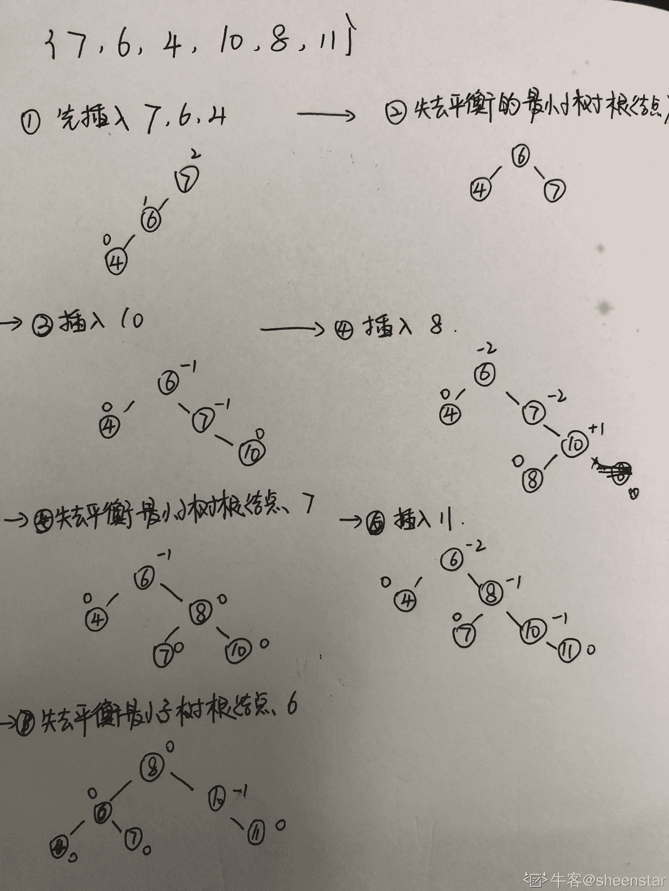
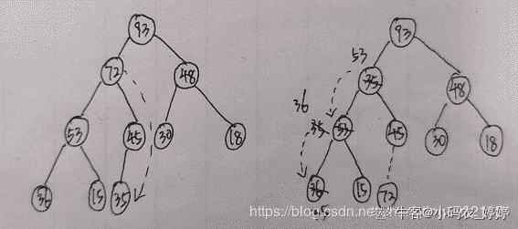
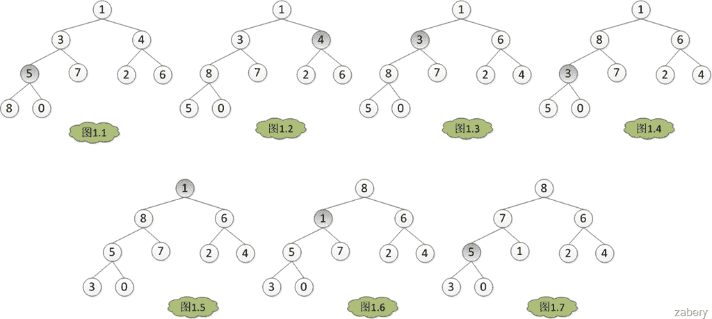
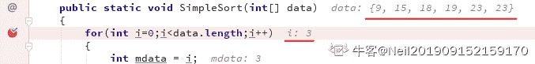

# 三百六十、公司-2019 校招笔试-Web 前端开发工程师客观题合集

## 1

一个数据流中出现了的报文片段：A ESC FLAG B，假设采用字节填充算法，填充后的输出为（      ）

正确答案: C   你的答案: 空 (错误)

```cpp
A ESC ESC FLAG B
```

```cpp
A ESC ESC ESC FLAG B
```

```cpp
FLAG A ESC FLAG B FLAG
```

```cpp
A ESC FLAG FLAG B
```

本题知识点

前端工程师 360 公司 网络基础 前端工程师 360 公司 2019

讨论

[不要再给我发感谢信了](https://www.nowcoder.com/profile/856134108)

这是前端的试题么？咋这么难呀


发表于 2019-07-31 14:17:26

* * *

[haha_](https://www.nowcoder.com/profile/7169441)

*   字节填充算法是用一些特殊字节（FLAG）作为帧开始和结束标志，用转义字符（ESC）来区分二进制数据中存在的特殊字节。那这一题的答案不应该是 FLAG A ESC　ESC ESC FLAG B FLAG 嘛

发表于 2019-01-08 15:42:07

* * *

## 2

以下地址中的哪一个和 76.32/12 匹配（      ）

正确答案: A   你的答案: 空 (错误)

```cpp
76.33.214.12
```

```cpp
76.79.24.11
```

```cpp
76.58.119.74
```

```cpp
76.68.204.1
```

本题知识点

前端工程师 360 公司 网络基础 前端工程师 360 公司 2019

讨论

[没头脑的派大星](https://www.nowcoder.com/profile/699872141)

我自己的理解：ip 地址后跟的/12 代表的是我们的子网掩码我们经常可以看到自己的 ip 后跟着/24  比如：76.58.199.74/24  代表着我们的子网掩码是 255.255.255.0(因为计算机是用 0/1 表示的，我们的 ip 地址由 32 位组成)所以本题的 76.32/12  代表的子网掩码是：255.240.0.0 我们知道子网掩码以后有什么用呢？子网掩码为 255 也就是他规定的是无法更改的，240->11110000,为 1 的是无法更改的，为 0 的是在同一网段下匹配的，也就是我们可以选择更改的，所以本题的匹配范围是 76.32~76.48，只有 A 符合

发表于 2019-02-26 11:37:04

* * *

[天道酬勤！！！](https://www.nowcoder.com/profile/3329367)

12 指的是网络号有 12 位，也就是 32 位的高 12 位

发表于 2019-10-18 23:24:30

* * *

[我的昵称 20201110](https://www.nowcoder.com/profile/970694030)

选 A 完全是大学的计算机基础，凭感觉选的。214 经常出现。

发表于 2019-01-08 17:23:05

* * *

## 3

网络拓扑结构中存在网桥 S1、S2、S3、S4，若对应 MAC 地址分别为 AABB-CCDD-EE00、AABB-CCDD-EE11、BBBB-CCDD-EE00、BBBB-CCDD-EE11,所有网桥优先级采用默认值,则使用 STP 协议后，哪个网桥会被确定为根网桥（      ）

正确答案: A   你的答案: 空 (错误)

```cpp
S1
```

```cpp
S2
```

```cpp
S3
```

```cpp
S4
```

本题知识点

前端工程师 360 公司 网络基础 前端工程师 360 公司 2019

讨论

[不瘦下去不改名字](https://www.nowcoder.com/profile/773225715)

STP 是生成树协议的英文缩写。该协议可应用于在网络中建立树形拓扑

发表于 2019-08-14 22:07:35

* * *

[鋆末末](https://www.nowcoder.com/profile/781959989)

选择根网桥的依据

先查看交换机优先级，优先选择优先级数值小的（默认 32768，范围：1~65535）优先级高的可以忽略 mac 数值。【优先级可以通过配置修改】然后查看交换机的 Mac 地址，选择数值小的网桥 ID（BID）=优先级+Mac 网桥 ID 是唯一的，交换机之间选择 BID 值最小的交换机作为网络中的根网桥

选择根网桥举例

根据网桥 ID 选择根网桥

发表于 2019-02-27 17:06:59

* * *

[法克瓜](https://www.nowcoder.com/profile/598273059)

生成树协议，mac 地址越小越好？

发表于 2019-02-07 22:12:49

* * *

## 4

原始数据为 011011111111111111110010 采用比特填充技术填充后的发送数据为（      ）

正确答案: D   你的答案: 空 (错误)

```cpp
0110111110111111111110010
```

```cpp
011011111111111111110010
```

```cpp
01101111101111110111110010
```

```cpp
011011111011111011111010010
```

本题知识点

前端工程师 360 公司 网络基础 前端工程师 360 公司 2019

讨论

[不瘦下去不改名字](https://www.nowcoder.com/profile/773225715)

比特填充法： 发送端的数据链路层遇到数据比特流中出现 5 个连续“1”的时候，它就自动在输出比特流中插入一个“0”;接收端遇到 5 个输入比特为“1”，且后面紧接的是“0”时，自动将其删除。

发表于 2019-08-14 22:09:22

* * *

[梅梅 201803241656278](https://www.nowcoder.com/profile/1728579)

在帧的传输起始标志和结束标志之间，每当出现 5 个 1 之后，发送器就会插入一个附加的 0.

发表于 2018-12-29 10:22:14

* * *

## 5

下面程序的执行结果为（）

```cpp
#include <stdio.h>

int func(int n) {
    if (n < 2)
        return n;
    return func(n - 1) + func(n - 2);
}

int main () {
    printf("%d\n",func(7));
    return 0;
}
```

正确答案: B   你的答案: 空 (错误)

```cpp
11
```

```cpp
13
```

```cpp
17
```

```cpp
21
```

本题知识点

360 公司 C++工程师 2019 C 语言

讨论

[十点睡觉💤](https://www.nowcoder.com/profile/270125029)

f(0)=0;   f(1)=1;
f(2)=f(1)+f(0)=1
f(3)=f(2)+f(1)=2
f(4)=f(3)+f(2)=3
f(5)=f(4)+f(3)=5
f(6)=f(5)+f(4)=8
f(7)=f(6)+f(5)=13 感谢大神思路，学到了，好方法，硬想递归，脑袋要爆炸

发表于 2019-01-07 13:06:38

* * *

[yeyoenjoy](https://www.nowcoder.com/profile/572955639)

f(0)=0;f(1)=1;f(2)=f(1)+f(0)=1;f(3)=f(2)+f(1)=2;...f(7)=f(6)=f(5)=5+8=13

发表于 2019-01-01 15:30:44

* * *

[midou0629](https://www.nowcoder.com/profile/864256344)

这 TM 是 Java 面试题吗？

发表于 2018-12-19 21:50:29

* * *

## 6

下列程序执行 func(15,20)的结果为（）

```cpp
int func(int i, int j){
    if (i <= 0 || j <= 0)
        return 1;
    return 2 * func(i - 3, j / 2);
}
```

正确答案: D   你的答案: 空 (错误)

```cpp
8
```

```cpp
16
```

```cpp
24
```

```cpp
32
```

本题知识点

360 公司 C++工程师 2019 C 语言

讨论

[十点睡觉💤](https://www.nowcoder.com/profile/270125029)

f(0,0)=1
f(3,1)=2*f(0,0)=2
f(6,2)=2*f(3,1)=4
f(9,5)=2*f(6,2)=8
f(12,10)=2*f(9,5)=16
f(15,20)=2*f(12,10)=32 解析来了

发表于 2019-01-07 13:12:43

* * *

[玄学求 offer~](https://www.nowcoder.com/profile/259973278)

 i        j15    2012    10    2*9       5     2²⁶       2     2³³       1     2⁴⁰       0     2⁵         -------->32

发表于 2019-01-03 16:08:30

* * *

[杉杉来啦](https://www.nowcoder.com/profile/243827773)

i 15 12 9 6 3 0
j 20 10 5 2 1 0
    2**2**2**2**2*1＝ 32

编辑于 2020-03-06 12:58:24

* * *

## 7

公司门户网站随着访问用户增加需要扩展服务器数量,每台服务器在 DNS 配置时，域名与主机相同，为达到负载均衡，DNS 服务器需要开启（      ）

正确答案: C   你的答案: 空 (错误)

```cpp
智能解析
```

```cpp
顺序解析
```

```cpp
启用循环
```

```cpp
反复解析
```

本题知识点

C++工程师 360 公司 iOS 工程师 Java 工程师 前端工程师 运维工程师 测试工程师 算法工程师 网络基础 2019 系统工程师 测试开发工程师

讨论

[飞鸿踏雪泥 9975](https://www.nowcoder.com/profile/6799891)

DNS 负载均衡是通过循环复用实现的，如果发现[主机名](https://baike.baidu.com/item/%E4%B8%BB%E6%9C%BA%E5%90%8D/2836107)的多个地址[资源记录](https://baike.baidu.com/item/%E8%B5%84%E6%BA%90%E8%AE%B0%E5%BD%95/6024505)，则可用它循环使用包含在查询应答中的主机资源记录。

发表于 2019-08-14 17:39:45

* * *

[青简](https://www.nowcoder.com/profile/708069809)

DNS 负载均衡是通过循环复用实现的，如果发现主机名的多个地址资源记录，则可用它循环使用包含在查询应答中的主机资源记录

发表于 2019-09-26 16:34:22

* * *

[燎原之火🔱](https://www.nowcoder.com/profile/3633297)

一题通用，程序员这些都应该知道🤐

发表于 2019-01-08 09:44:52

* * *

## 8

IP 数据报的收发方进行跨网投递时，发送方需利用 ARP 协议获取哪些信息（      ）

正确答案: B   你的答案: 空 (错误)

```cpp
接收方 IP 地址的 MAC 地址
```

```cpp
发送方本网段路由器对应端口的 MAC 地址
```

```cpp
接收方本网段路由器对应端口的 MAC 地址
```

```cpp
发送方 IP 地址的 MAC 地址
```

本题知识点

C++工程师 360 公司 iOS 工程师 Java 工程师 前端工程师 运维工程师 测试工程师 算法工程师 网络基础 2019 系统工程师 测试开发工程师

讨论

[今晚我要学习](https://www.nowcoder.com/profile/5068973)

题目是“收发方跨网投递”。ARP 能获得下一跳主机的 MAC 地址，这看起来像是接收方，然而并不是，接收方可能还很远，我们所获得的仅仅是 B 项描述的：

*   ```cpp
    发送方本网段路由器对应端口的 MAC 地址
    ```

这个端口 MAC 地址可能是已经缓存的，也可能是通过广播获取的。

编辑于 2019-04-03 17:53:48

* * *

[罗蜜斯丹](https://www.nowcoder.com/profile/1812648)

发送方要知道接收方的 IP 地址即可，在路由器中可用 ARP 协议找到接受发的 MAC 地址。所以发送方不关心接收方的 MAC 地址，但发送前要填上自己的 MAC 地址

发表于 2019-02-28 16:22:16

* * *

[牛客 238647254 号](https://www.nowcoder.com/profile/238647254)

因为是"跨网段", 所以 ARP 管不了, 它只能告诉"发送方"怎么从本网段出去. 

发表于 2022-01-25 00:02:41

* * *

## 9

SNMP 协议利用（      ）协议实现管理者与 SNMP 代理之间的信息交互

正确答案: A   你的答案: 空 (错误)

```cpp
UDP
```

```cpp
TCP
```

```cpp
ARP
```

```cpp
ICMP
```

本题知识点

C++工程师 360 公司 iOS 工程师 Java 工程师 前端工程师 运维工程师 测试工程师 算法工程师 网络基础 2019 系统工程师 测试开发工程师

讨论

[雨*-*](https://www.nowcoder.com/profile/602147864)

TCP 支持的应用协议：TELNET（远程终端登录协议）,FTP（文件传输协议）,SMTP（简单邮件传送协议）,HTTP（传送协议）UDP 支持的应用协议：NFS(网络文件系统)，SNMP（简单网络管理协议），DNS（域名服务），TFTP（简单文件传输协议）

发表于 2019-08-27 10:57:40

* * *

[飞鸿踏雪泥 9975](https://www.nowcoder.com/profile/6799891)

SNMP 采用 UDP 协议在管理端和 agent 之间传输信息。 SNMP 采用 UDP 161 端口接收和发送请求，162 端口接收 trap，执行 SNMP 的设备缺省都必须采用这些端口。SNMP 消息全部通过 UDP 端口 161 接收，只有 Trap 信息采用 UDP 端口 162。

发表于 2019-08-14 17:41:34

* * *

[Lane.](https://www.nowcoder.com/profile/849834097)

简单网络管理协议（SNMP） 是专门设计用于在 IP 网络管理网络节点（服务器、工作站、路由器、交换机及 HUBS 等）的一种标准协议，它是一种应用层协议。

发表于 2019-10-30 10:49:01

* * *

## 10

公司办公室,技术部,开发部,销售部的网络地址分别为 172.16.32.0/24,172.16.33.0/24,172.16.34.0/24,172.16.35.0/24;网络中心进行地址聚合,聚合后覆盖四个部门的网络地址是（      ）

正确答案: C   你的答案: 空 (错误)

```cpp
172.16.32.0/24
```

```cpp
172.16.32.0/23
```

```cpp
172.16.32.0/22
```

```cpp
172.16.32.0/21
```

本题知识点

C++工程师 360 公司 iOS 工程师 Java 工程师 前端工程师 运维工程师 测试工程师 算法工程师 网络基础 2019 系统工程师 测试开发工程师

讨论

[梅梅 201803241656278](https://www.nowcoder.com/profile/1728579)

每个小数点之间由八位二进制表示，最后的 24 表示前 24 位为网络号，主机号=32-网络号网络地址聚合就是取最大相同的部分。172.16.32.0/24：相同.相同.00010000（32）.不管 172.16.33.0/24：相同.相同.00010001（33）.不管 172.16.34.0/24：相同.相同.00010010（34）.不管 172.16.35.0/24：相同.相同.00010011（35）.不管取最大相同：172.16.000100|不同.不管(|之前为聚合网络地址:16+6=22 位)即表示为：172.16.32.0/22

发表于 2018-12-29 15:49:35

* * *

[千纸鹤千颗心](https://www.nowcoder.com/profile/711830961)

|24 表示前面 24 位相同的作为网络号，而四者取最大相同部分是前面 22 位，因此选择|22.

发表于 2019-04-24 11:27:54

* * *

[飞鸿踏雪泥 9975](https://www.nowcoder.com/profile/6799891)

聚合网络地址：取网络地址的最大相同部分

发表于 2019-08-14 17:44:14

* * *

## 11

数据链路层可以提供哪些服务类型（      ）

正确答案: A B C   你的答案: 空 (错误)

```cpp
无确认的无连接服务
```

```cpp
有确认的无连接服务
```

```cpp
有确认的有连接服务
```

```cpp
无确认的有连接服务
```

本题知识点

C++工程师 360 公司 iOS 工程师 Java 工程师 前端工程师 运维工程师 测试工程师 算法工程师 网络基础 2019 系统工程师 测试开发工程师

讨论

[barbo](https://www.nowcoder.com/profile/7171527)

只要记住，有连接的一定要确认

发表于 2019-08-15 16:39:59

* * *

[愚人五个字](https://www.nowcoder.com/profile/963871720)

数据链路层一般都提供 3 种基本服务，即无确认的无连接服务、有确认的无连接服务、有确认 的面向连接的服务。 （1）无确认的无连接服务 无确认的无连接服务是源机器向目的机器发送独立的帧，而目的机器对收到的帧不作确认。 如果由于线路上的噪声而造成帧丢失，数据链路层不作努力去恢复它，恢复工作留给上层去完成。 这类服务适用于误码率很低的情况，也适用于像语音之类的实时传输，实时传输情况下有时数据延误比数据损坏影响更严重。 大多数局域网在数据链路层都使用无确认的无连接服务。 （2）有确认的无连接服务 这种服务仍然不建立连接，但是所发送的每一帧都进行单独确认。 以这种方式，发送方就会知道帧是否正确地到达。如果在某个确定的时间间隔内，帧没有到达，就必须重新发此帧。 （3）有确认的面向连接的服务 采用这种服务，源机器和目的机器在传递任何数据之前，先建立一条连接。 在这条连接上所发送的每一帧都被编上号，数据链路层保证所发送的每一帧都确实已收到。 而且，它保证每帧只收到一次，所有的帧都是按正确顺序收到的。面向连接的服务为网络进程间提供了可靠地传送比特流的服务。

发表于 2019-01-09 20:50:18

* * *

## 12

STP 协议可以实现的功能是（      ）

正确答案: B C   你的答案: 空 (错误)

```cpp
隔离冲突域
```

```cpp
防止广播风暴
```

```cpp
防止环路
```

```cpp
提供可靠传输
```

本题知识点

360 公司 Java 工程师 网络基础 2019

讨论

[远山淡影](https://www.nowcoder.com/profile/929506490)

STP（生成树协议）的原理是按照树的结构来构造网络拓扑，消除网络中的环路，避免由于环路的存在而造成广播风暴问题。

发表于 2019-03-06 10:22:18

* * *

[tru-th](https://www.nowcoder.com/profile/4137824)

生成树协议 STP： 工作在数据链路层的透明网桥使用的算法，可以防止环路，防止因环路而产生的广播风暴

发表于 2020-04-20 20:06:53

* * *

[暮秋柒](https://www.nowcoder.com/profile/923002302)

Spanning Tree Protocol 生成树协议

发表于 2019-11-21 10:18:26

* * *

## 13

公司内部为 100Mbps 的企业网,办公室计算机从网络中心下载 25M 的文件,在没有流量控制与无干扰的情况下,大概需要的时间为（      ）

正确答案: C   你的答案: 空 (错误)

```cpp
0.5 秒
```

```cpp
1 秒
```

```cpp
2 秒
```

```cpp
4 秒
```

本题知识点

C++工程师 360 公司 iOS 工程师 Java 工程师 前端工程师 运维工程师 测试工程师 算法工程师 网络基础 2019 系统工程师 测试开发工程师

讨论

[He110](https://www.nowcoder.com/profile/6472986)

100 Mbps 是按 bit 传输的，所以需要转化为 byte 的传输速度，需要除以 8，即下载速度是 12.5Mb/s，所以需要 2 秒

发表于 2018-12-27 13:04:59

* * *

[sjh123](https://www.nowcoder.com/profile/272256735)

评论里面有些老哥理解错了（虽然答案对的）25M 文件（25MB）的 M 是 1024100Mbps 的 M 是 1000 所以不能直接用 Mb 来除以 Mbps    而是要全部都转化为 b 或 bps25M:25*1024*1024*8 b100Mbps:100*1000*1000 bps 两者相除≈2

编辑于 2020-05-21 20:44:09

* * *

[桔子 201908231619240](https://www.nowcoder.com/profile/953034402)

25Mbyte=25*1024*1024*8 理想时间=(25*1024*1024*1024*8)/ (100 000 000)=2.097152s

发表于 2019-09-19 17:37:55

* * *

## 14

运行哪个协议后可用避免交换机之间存在的环路（      ）

正确答案: A   你的答案: 空 (错误)

```cpp
STP
```

```cpp
RIP
```

```cpp
OSPF
```

```cpp
ARP
```

本题知识点

C++工程师 360 公司 iOS 工程师 Java 工程师 前端工程师 运维工程师 测试工程师 算法工程师 网络基础 2019 系统工程师 测试开发工程师

讨论

[呆瓜 201903132237485](https://www.nowcoder.com/profile/625376940)

STP（生成树协议）：是按照树的结构来构造网络拓扑，消除网络中的环路，避免由于环路的存在而造成广播风暴问题。

发表于 2019-08-21 16:21:11

* * *

[tru-th](https://www.nowcoder.com/profile/4137824)

&

STP：生成树协议；透明网桥使整个连通网络不存在回路；P99

RIP：路由信息协议；一种分布式的基于距离向量的路由选择协议；P152

OSPF：开放最短路径优先；使用分布式的链路状态协议；P157

ARP：地址解析协议

内部网关协议 IGP：RIP+OSPF ；P151

外部网关协议 EGP：BGP-4

发表于 2020-04-20 10:40:54

* * *

[暮秋柒](https://www.nowcoder.com/profile/923002302)

spanning tree protocol 生成树协议

发表于 2019-12-05 14:51:21

* * *

## 15

有关树的说法正确的是（      ）

正确答案: A C   你的答案: 空 (错误)

```cpp
树中所有结点可以有 0 个或多个后继结点
```

```cpp
二叉树中至少有一个结点的度为 2
```

```cpp
在 AVL 树中根节点的左右子树的深度最多相差 1
```

```cpp
Huffman 树一定是 AVL 树
```

本题知识点

C++工程师 360 公司 iOS 工程师 Java 工程师 前端工程师 运维工程师 测试工程师 算法工程师 树 2019 系统工程师 测试开发工程师

讨论

[养鱼的小白莲](https://www.nowcoder.com/profile/76251842)

哈夫曼树只是一棵最优二叉树，不一定是完全二叉树，也不一定是平衡二叉树哈夫曼树不关注树的结构，只关注带权路径长度

发表于 2019-08-23 10:29:04

* * *

[远山淡影](https://www.nowcoder.com/profile/929506490)

B 选项：单支二叉树节点度不为 2

发表于 2019-03-06 10:19:42

* * *

[Isoon](https://www.nowcoder.com/profile/628327468)

不是，A 选项语言表述就有问题吧？

发表于 2020-03-23 23:59:37

* * *

## 16

在 AVL 树中，哪个调整操作可以使根节点的平衡因子由 1 变为 2（      ）

正确答案: A C   你的答案: 空 (错误)

```cpp
LL
```

```cpp
RR
```

```cpp
LR
```

```cpp
RL
```

本题知识点

C++工程师 360 公司 iOS 工程师 Java 工程师 前端工程师 运维工程师 测试工程师 算法工程师 树 2019 系统工程师 测试开发工程师

讨论

[梅梅 201803241656278](https://www.nowcoder.com/profile/1728579)

有四种种情况可能导致二叉查找树不平衡，分别为：

（1）LL：插入一个新节点到根节点的左子树（Left）的左子树（Left），导致根节点的平衡因子由 1 变为 2

（2）RR：插入一个新节点到根节点的右子树（Right）的右子树（Right），导致根节点的平衡因子由-1 变为-2

（3）LR：插入一个新节点到根节点的左子树（Left）的右子树（Right），导致根节点的平衡因子由 1 变为 2

（4）RL：插入一个新节点到根节点的右子树（Right）的左子树（Left），导致根节点的平衡因子由-1 变为-2

针对四种种情况可能导致的不平衡，可以通过旋转使之变平衡。有两种基本的旋转：

（1）左旋转：将根节点旋转到（根节点的）右孩子的左孩子位置

（2）右旋转：将根节点旋转到（根节点的）左孩子的右孩子位置
--------------------- 
作者：披靡 
来源：CSDN 
原文：[`blog.csdn.net/xomlee/article/details/17628681`](https://blog.csdn.net/xomlee/article/details/17628681) 

发表于 2018-12-29 16:08:05

* * *

[罗蜜斯丹](https://www.nowcoder.com/profile/1812648)

插在根节点的左子树即可；平衡因子 = 左子树高度-右子树高度

发表于 2019-02-28 17:48:34

* * *

[August-us2020](https://www.nowcoder.com/profile/2284237)

据我所知，调整不是为了减少平衡因子，怎么还能够增大的？？？？？？

发表于 2020-03-24 13:52:37

* * *

## 17

依次将关键字序列 7, 6, 4, 10, 8, 11 插入到一棵空的平衡二叉树中，插入后的平衡二叉树的根结点为（      ）

正确答案: D   你的答案: 空 (错误)

```cpp
7
```

```cpp
6
```

```cpp
10
```

```cpp
8
```

本题知识点

360 公司 树 2019

讨论

[蹲一大把的 offer](https://www.nowcoder.com/profile/515070749)

平衡二叉树：是一种特殊的二叉排序树，其左右子树都是平衡二叉树，要求 BF（平衡因子=其左子树高-其右子树高）只能取 0，1，-1\.

发表于 2019-08-16 20:44:55

* * *

[梅梅 201803241656278](https://www.nowcoder.com/profile/1728579)

在草稿纸上按 7, 6, 4, 10, 8, 11 的顺序插入要求：左<根<右且高度差不能大于 1(不符合要求就调正树)根节点变化为 7->6->8

发表于 2018-12-29 16:22:57

* * *

[牛客 583481012 号](https://www.nowcoder.com/profile/583481012)

平衡二叉树一定是二叉排序树吗？

发表于 2021-01-11 13:12:22

* * *

## 18

已知最大堆的关键字序列为 93,72,48,53,45,30,18,36,15,35，删除关键字 72，调整后得。到的最大堆是（      ）

正确答案: A   你的答案: 空 (错误)

```cpp
93,53,48,36,45,30,18,35,15
```

```cpp
93,48,53,36,45,30,18,35,15
```

```cpp
93,53,48,45,30,36,18,35,15
```

```cpp
93,53,48,45,30,36,35,18,15
```

本题知识点

C++工程师 360 公司 iOS 工程师 Java 工程师 前端工程师 运维工程师 测试工程师 算法工程师 堆 2019 系统工程师 测试开发工程师

讨论

[小码农 _ 婷婷](https://www.nowcoder.com/profile/6094983)



1>将要删除的节点与最后一个节点进行交换

2>调整堆成为大顶堆或小顶堆

发表于 2020-03-23 16:21:21

* * *

[NoOfferException](https://www.nowcoder.com/profile/1554976)

删除是将被删除元素和队列最后一个元素进行交换。。。。。。。

发表于 2019-09-26 17:33:55

* * *

[梅梅 201803241656278](https://www.nowcoder.com/profile/1728579)

顺序按层次遍历删除前：               93               |  \                   72  48              | \     |  \
           53 45 30 18
           |  \    \
        36 15  35
删除 72 后：               93               |  \                   53  48              | \     |  \
           36 45 30 18
            | \
         35  15

发表于 2018-12-29 16:56:32

* * *

## 19

产生哈希冲突的影响因素有哪些（      ）  

正确答案: A B D   你的答案: 空 (错误)

```cpp
装填因子
```

```cpp
哈希函数
```

```cpp
哈希表长
```

```cpp
处理冲突的方法
```

本题知识点

C++工程师 360 公司 iOS 工程师 Java 工程师 前端工程师 运维工程师 测试工程师 算法工程师 哈希 *2019 系统工程师 测试开发工程师* *讨论

[寒月照三更](https://www.nowcoder.com/profile/122796058)

表长对冲突的影响，是受装填因子制约的。表再长，装得满满的，就会容易冲突。

发表于 2019-10-16 17:34:25

* * *

[烬天玉藻前](https://www.nowcoder.com/profile/195480900)

C 选项哈希表长不能算：装填因子 = 数据总数 / 哈希表长是数据总数 / 哈希表长的结果(装填因子)对冲突的产生有影响。想到了高中物理的选择题考公式经常这么来，问哪一个参数对结果有影响(记不太清了，忽略这行)

发表于 2020-08-21 22:22:46

* * *

[法克瓜](https://www.nowcoder.com/profile/598273059)

不是应该哈希表越长越不容易产生冲突嘛？

发表于 2019-02-07 23:44:57

* * *

## 20

设哈希表长为 8，哈希函数为 Hash (key)=key%7。初始记录关键字序列为(32，24，15，27，20，13)，用链地址法作为解决冲突方法的平均查找长度是（      ）

正确答案: B   你的答案: 空 (错误)

```cpp
1.4
```

```cpp
1.5
```

```cpp
1.6
```

```cpp
1.7
```

本题知识点

C++工程师 360 公司 iOS 工程师 Java 工程师 前端工程师 运维工程师 测试工程师 算法工程师 哈希 *2019 系统工程师 测试开发工程师* *讨论

[梅梅 201803241656278](https://www.nowcoder.com/profile/1728579)

链地址法作为解决冲突方法：冲突以后变成链表，查询次数增加
32%7=4（查一次）24%7=3（查一次）15%7=1（查一次）27%7=6（查一次）20%7=6（查两次）13%7=6（查三次）
ASL=(1*4+2*1+3*1)/6=1.5

发表于 2018-12-29 17:21:03

* * *

[白起丶](https://www.nowcoder.com/profile/815173790)

哈希表长度为 8，故存储的位置分别是 0、1、2、3、4、5、6、7\.根据哈希函数，可以得到关键字序列(32，24，15，27，20，13)存储的位置分别为：4、3、1、6、6、6\.解决冲突的方式是链地址法，故 20 和 13 存储在 27 的下边，三者构成一个链表结构，第一个元素为 27，最后一个元素为 13\.哈希表中查找一个元素的复杂度为 O（1）,故 32、24、15、27 分别查找一次即可找到，而 20 和 13 在链表结构中，需要从 27 开始往下遍历，分别需要额外的一次和两次才能找到，即 20 需要两次，13 需要三次。故最终的平均查找长度为总查询次数 / 关键字个数=（1+1+1+1+2+3）/ 6 = 1.5

编辑于 2020-07-12 11:33:37

* * *

## 21

对字符串 "mabnmnm" 的二进制进行哈夫曼编码有多少位（）

正确答案: B   你的答案: 空 (错误)

```cpp
12
```

```cpp
13
```

```cpp
14
```

```cpp
15
```

本题知识点

C++工程师 360 公司 iOS 工程师 Java 工程师 前端工程师 运维工程师 测试工程师 算法工程师 字符串 *2019 系统工程师 测试开发工程师* *讨论

[彦祖丶](https://www.nowcoder.com/profile/4900747)


发表于 2019-09-21 11:26:33

* * *

[梅梅 201803241656278](https://www.nowcoder.com/profile/1728579)

mabnmnm 频率 m:3/7 a:1/7 b:1/7 n:2/7（频率越高离根越近）建树（o 只占位，|表示 0 ，\表示 1）:            o            |\ m  o |\ n  o |\ a  b 由|,\转为 0,1 得:m->0,n->10,a->110,b->111mabnmnm:0 110 111 10 0 10 0(共 13 位)

发表于 2018-12-29 18:38:36

* * *

[Amo-wintercs](https://www.nowcoder.com/profile/444653760)

tip：当两个数相同时，无论放在左子树或者右子树，其 WPL 值是一样的，并不影响编码的长度，只是对应字符编码的值互换了而已。

发表于 2021-03-17 11:53:11

* * *

## 22

在哈夫曼树中，结点的度可能为（      ）

正确答案: A C   你的答案: 空 (错误)

```cpp
0
```

```cpp
1
```

```cpp
2
```

```cpp
3
```

本题知识点

360 公司 树 2019

讨论

[你的 offer 对我打了烊](https://www.nowcoder.com/profile/598309941)

哈夫曼必须要有两个节点构建一个新的虚拟的父节点吧！毫无疑问这个父节点度为 2，最初构建父节点的两个节点肯定是叶子节点，度为 0

发表于 2020-03-20 14:29:59

* * *

[Why81](https://www.nowcoder.com/profile/1187918)

度，分为 出度 和 入度 ，难道不是  B, C, D 吗？

发表于 2019-02-20 16:33:24

* * *

[_CHENDavid](https://www.nowcoder.com/profile/564273691)

题目更严紧一些的话，应该指明是几叉的霍夫曼树。虽然大部分情况默认 2 叉。

发表于 2020-08-16 16:02:00

* * *

## 23

对关键码集合 K={22，11，38，68，43，6，10，48},用筛选法创建最小堆时，从关键码（      ）开始调整

正确答案: C   你的答案: 空 (错误)

```cpp
22
```

```cpp
38
```

```cpp
68
```

```cpp
48
```

本题知识点

C++工程师 360 公司 iOS 工程师 Java 工程师 前端工程师 运维工程师 测试工程师 算法工程师 堆 2019 系统工程师 测试开发工程师

讨论

[everythingisok](https://www.nowcoder.com/profile/725453269)

                                  22                                /       \                             11        38                           /     \      /    \                        68     43  6    10                       /                     48              从下往上，从右到左的顺序，从第一个非叶结点开始调整

发表于 2020-05-26 16:41:56

* * *

[梅梅 201803241656278](https://www.nowcoder.com/profile/1728579)

筛选法就是开始按现有的顺序从上到下，从左到右放到一个完全二叉树里面。
然后把这个树调节成堆。调节的时候从最后一个有儿子的节点开始。 也就是从下往上，从右往左找，找到的第一个有孩子的节点开始。依次把各个节点及下面的孩子组成的树调节成堆。筛选法建堆例子(侵删)： 至于本题，打扰了。

发表于 2018-12-29 19:10:55

* * *

[codeDonald](https://www.nowcoder.com/profile/652765175)

68 就是上面说的从上到下排树，从下到上找第一个有叶子节点的节点

发表于 2019-04-23 20:22:07

* * *

## 24

已知有向图 G=(V,E)，其中 V={a,b,c,d,e,f,g}，
E={<a,b>,<a,c>,<a,d>,<b,e>,<c,e>,<c,f>,<d,f>,<e,g>,<f,g>}G 的拓扑序列是（      ）

正确答案: A   你的答案: 空 (错误)

```cpp
a,c,d,f,b,e,g
```

```cpp
a,c,b,f,d,e,g
```

```cpp
a,c,d,e,b,f,g
```

```cpp
a,b,e,c,d,f,g
```

本题知识点

C++工程师 360 公司 iOS 工程师 Java 工程师 前端工程师 运维工程师 测试工程师 算法工程师 图 2019 系统工程师 测试开发工程师

讨论

[梅梅 201803241656278](https://www.nowcoder.com/profile/1728579)

拓扑序列是顶点活动网中将活动按发生的先后次序进行的一种排列。该排列满足：如果图中有一条从 u 到 v 的路径，则顶点 v 必须出现在顶点 u 之后。找出顶点活动网中的拓扑序列称“拓扑排序”。画图后对照选项 B：f 需 c、d 发生后才能发生 C：e 需 b、c 发生后才能发生 D：同 C

发表于 2018-12-29 19:25:00

* * *

[白起丶](https://www.nowcoder.com/profile/815173790)

拓扑结构：

1.  选择一个入度为 0 的顶点输出；
2.  然后删除此顶点，并删除以此顶点为尾的弧；
3.  继续重复此操作.....
4.  直到输出全部顶点或 AOV 网中不存在入度为 0 的顶点为止。

编辑于 2020-07-07 20:16:22

* * *

[大胖鱼头](https://www.nowcoder.com/profile/636223651)

1：从 DAG 图中选择一个 没有前驱（即入度为 0）的顶点并输出。
2：从图中删除该顶点和所有以它为起点的有向边。
3：重复 1 和 2 直到当前的 DAG 图为空或当前图中不存在无前驱的顶点为止。后一种情况说明有向图中必然存在环。

发表于 2021-12-17 14:53:26

* * *

## 25

有向图 G 中有 n 个顶点，e 条边，采用邻接表存储，若采用 BFS 方式遍历其时间复杂度为（      ）

正确答案: C   你的答案: 空 (错误)

```cpp
O(n)
```

```cpp
O(e)
```

```cpp
O(n+e)
```

```cpp
O(n×e)
```

本题知识点

C++工程师 360 公司 iOS 工程师 Java 工程师 前端工程师 运维工程师 测试工程师 算法工程师 图 2019 系统工程师 测试开发工程师

讨论

[78018046](https://www.nowcoder.com/profile/78018046)

BFS 和 DFS 都是：邻接矩阵-O(n²)邻接表-O(n+e)

发表于 2019-08-14 13:41:37

* * *

[wind111](https://www.nowcoder.com/profile/398444368)

d

发表于 2019-08-03 23:31:43

* * *

## 26

直接插入排序算法适用于下列哪种情形下（      ）

正确答案: C   你的答案: 空 (错误)

```cpp
待排序数据规模较大时
```

```cpp
任意情况
```

```cpp
待排序数据大部分已排序时
```

```cpp
其他几项都不对
```

本题知识点

排序 *讨论

[凌晨起来背单词](https://www.nowcoder.com/profile/141339970)

直接插入排序是数据越有序越快。

发表于 2020-10-08 22:33:32

* * *

## 27

设二叉排序树由(54,28,16,34,73,62,95,60,26,43)构成如下图二叉树，则在该树中查找任意指定元素的平均查找长度为（      ）

正确答案: B   你的答案: 空 (错误)

```cpp
1.2
```

```cpp
2.9
```

```cpp
4.1
```

```cpp
5.4
```

本题知识点

安卓工程师 360 公司 C++工程师 iOS 工程师 Java 工程师 前端工程师 运维工程师 测试工程师 算法工程师 树 2019 系统工程师 测试开发工程师

讨论

[卡恩思欧](https://www.nowcoder.com/profile/67607315)

（1+2*2+3*4+4*3）/10

发表于 2018-12-28 09:06:46

* * *

[数字逻辑耙耙](https://www.nowcoder.com/profile/949455492)

(1+4+12+12)/10=2.9

发表于 2018-12-28 00:15:33

* * *

[眸子寒](https://www.nowcoder.com/profile/285683703)

（1+2*2+3*4+4*3）/10

发表于 2020-03-02 11:39:44

* * *

## 28

已知序列(50,30,80,20,40,90,35,85,32,88) ，按照依次插入的方法生成二叉排序树，则在该树中查找关键字值为 35 的结点所需比较次数为（      ）

正确答案: B   你的答案: 空 (错误)

```cpp
3
```

```cpp
4
```

```cpp
5
```

```cpp
6
```

本题知识点

安卓工程师 360 公司 C++工程师 iOS 工程师 Java 工程师 前端工程师 运维工程师 测试工程师 算法工程师 树 2019 系统工程师 测试开发工程师

讨论

[学长有压力](https://www.nowcoder.com/profile/791578968)


发表于 2019-03-08 16:58:04

* * *

[北雁依云☁️](https://www.nowcoder.com/profile/656123024)

二叉树基本性质：（1）若左子树不空,则左子树上所有结点的值均小于它的根结点的值；
（2）若右子树不空,则右子树上所有结点的值均大于它的根结点的值； 
（3）左、右子树也分别为二叉排序树；所以根据性质：第一个数 50 为根节点；第二个树：80>50,所以为 50 的右孩子；第三个数 30：因为 30<50<80，所以 30 为 80 的左孩子；第四个数 20：20<30 所以为 30 的左孩子；第五个数 40：因为 30<40<50,所以 40 在根节点的左子树上且为节点 30 的右孩子；第六个数 90：因为 90>80，所以在 80 结点的右子树上且为其右孩子第七个数 35：因为 50>35>30,所以 35 在根节点的左子树，且大于节点 30，故为 30 右子树下中 40 的左孩子。第八个数 85：首先 85>50,所以为根右子树上的节点，又 90<85<80,所以为 90 左子树上的节点，所以为 90 的左孩子。第九个数 32：因为 50>32>30,所以 32 在根节点的左子树，且大于节点 30，故为 30 右子树下。因为 32<35,故为 35 节点的左孩子第十个数 88：首先 88>50,所以位于根节点右子树上，又 88>80>85,所以为 80 的右子树上，所以为 85 的右孩子 over~

发表于 2020-04-09 15:23:36

* * *

[逆袭的黑马](https://www.nowcoder.com/profile/508968808)

没有算上最后和 35 比较，所以做错为 3 次

发表于 2020-12-27 17:24:08

* * *

## 29

使用快速排序算法对序列 9,1,3,8,23,5,7,10,29,19 进行排序，基准数取 9，则第 1 趟排序后的结果为（      ）

正确答案: B   你的答案: 空 (错误)

```cpp
9,1,3,8,23,5,7,10,29,19
```

```cpp
7,1,3,8,5,9,23,10,29,19
```

```cpp
1,3,8,9,23,5,7,10,29,19
```

```cpp
9,1,3,8,23,5,7,10,19,29
```

本题知识点

安卓工程师 360 公司 C++工程师 iOS 工程师 Java 工程师 前端工程师 运维工程师 测试工程师 算法工程师 排序 *2019 系统工程师 测试开发工程师* *讨论

[冰镇可乐](https://www.nowcoder.com/profile/770698837)

我咋感觉是 5,1,3,8,7,9,23,10,29,19
挠头

发表于 2019-03-02 11:22:55

* * *

[wlsn](https://www.nowcoder.com/profile/599323175)

先确定基准值，然后从后向前找比基准值小的数，找到后将其与比它小的数进行交换，然后从前向后找比基准值大的数，将其交换，周而复始，直到确定下基准值的位置

发表于 2019-10-19 14:50:15

* * *

[k99999](https://www.nowcoder.com/profile/994717614)

这道题之所以有争议是因为快排有几种不同的写法：用的最多的是填坑法和交换法，这道题答案是以填坑法为基础的。可以说题目本身就存在问题。

发表于 2019-12-29 16:18:02

* * *

## 30

使用直接选择排序算法对序列 18,23,19,9,23,15 进行排序，第 3 趟排序后的结果为（      ）

正确答案: B   你的答案: 空 (错误)

```cpp
9,23,19,18,23,15
```

```cpp
9,15,18,19,23,23
```

```cpp
18,19,23,9,23,15
```

```cpp
18,19,23,9,15,23
```

本题知识点

排序 *讨论

[等一个 oc](https://www.nowcoder.com/profile/364417350)

我怎么觉得是 9 15 18 19 23 23 呢

发表于 2019-04-03 11:17:38

* * *

[jannyi](https://www.nowcoder.com/profile/823773293)

每次选最小的与第一个数（除排好序的）交换；9 18 23 19 23 15-->9 15 23 19 23 189 15 18 19 23 23

发表于 2020-03-13 13:52:28

* * *

[Neil201909152159170](https://www.nowcoder.com/profile/125216117)

第三次应该是 9,15,18,19,23,23

发表于 2019-11-21 16:23:56

* * *

## 31

关于归并排序叙述正确的是（      ）

正确答案: A D   你的答案: 空 (错误)

```cpp
归并排序使用了分治策略的思想
```

```cpp
归并排序使用了贪心策略的思想
```

```cpp
子序列的长度一定相等
```

```cpp
归并排序是稳定的
```

本题知识点

安卓工程师 360 公司 C++工程师 iOS 工程师 Java 工程师 前端工程师 运维工程师 测试工程师 算法工程师 排序 *2019 系统工程师 测试开发工程师* *讨论

[Porsche](https://www.nowcoder.com/profile/148222868)

A 归并排序就是先不断二分整个序列，然后排好每一段再合并的

发表于 2019-11-08 13:53:55

* * *

[不做人了](https://www.nowcoder.com/profile/250145)

可能出现素数个不好分组的情况

发表于 2020-04-28 19:18:22

* * *

[dengboyuan2020](https://www.nowcoder.com/profile/958218527)

A

发表于 2019-11-07 21:24:35

* * *

## 32

对于初始关键字(67,66,77,82,78,51,58),使用二路归并排序,第一趟归并之后其序列变为（      ）

正确答案: B   你的答案: 空 (错误)

```cpp
66,67,77,82,51,58,78
```

```cpp
66,67,77,82,51,78,58
```

```cpp
51,58,66,67,77,78,82
```

```cpp
67,66,77,78,82,51,58
```

本题知识点

排序 *讨论

[你的 offer 对我打了烊](https://www.nowcoder.com/profile/598309941)

按照顺序两两组合，每个组里两个元素进行排序，最后一个元素落单不去管

发表于 2020-03-27 08:26:13

* * *

[梅梅 201803241656278](https://www.nowcoder.com/profile/1728579)

第 1 趟排序结果如第 5 行(侵删)

发表于 2018-12-29 20:02:58

* * *

[愚人五个字](https://www.nowcoder.com/profile/963871720)

和这个类似：
核心代码：int mid = (first + last) / 2;
    merge_sort(a, first, mid, res);     //左边有序   
    merge_sort(a, mid + 1, last, res);  //右边有序   
    Merge(a, first, mid, last, res);    //将左右两个有序数列进行排序归并

发表于 2019-01-12 14:47:08

* * *

## 33

下列哪种算法平均情况、最好情况和最坏情况下的时间复杂度都为

正确答案: A   你的答案: 空 (错误)

```cpp
直接选择排序
```

```cpp
直接插入排序
```

```cpp
冒泡排序
```

```cpp
归并排序
```

本题知识点

排序 *讨论

[大小满](https://www.nowcoder.com/profile/159018122)

1.选择排序：不稳定，时间复杂度 O(n²)
选择排序的基本思想是对待排序的记录序列进行 n-1 遍的处理，第 i 遍处理是将 L[i..n]中最小者与 L[i]交换位置。这样，经过 i 遍处理之后，前 i 个记录的位置已经是正确的了。
2.插入排序：稳定，时间复杂度 O(n²)
插入排序的基本思想是，经过[i-1](https://www.baidu.com/s?wd=i-1&tn=SE_PcZhidaonwhc_ngpagmjz&rsv_dl=gh_pc_zhidao)遍处理后,L[1..[i-1](https://www.baidu.com/s?wd=i-1&tn=SE_PcZhidaonwhc_ngpagmjz&rsv_dl=gh_pc_zhidao)]己排好序。第 i 遍处理仅将 L[i]插入 L[1..[i-1](https://www.baidu.com/s?wd=i-1&tn=SE_PcZhidaonwhc_ngpagmjz&rsv_dl=gh_pc_zhidao)]的适当位置，使得 L[1..i] 又是排好序的序列。要达到这个目的，我们可以用顺序比较的方法。首先比较 L[i]和 L[i-1]，如果 L[i-1]≤ L[i]，则 L[1..i]已排好序，第 i 遍处理就结束了；否则交换 L[i]与 L[i-1]的位置，继续比较 L[i-1]和 L[i-2]，直到找到某一个位置 j(1≤j≤i-1)，使得 L[j] ≤L[j+1]时为止。图 1 演示了对 4 个元素进行插入排序的过程，共需要(a),(b),(c)三次插入。
3.冒泡排序：稳定，时间复杂度 O(n²)
冒泡排序方法是最简单的排序方法。这种方法的基本思想是，将待排序的元素看作是竖着排列的“气泡”，较小的元素比较轻，从而要往上浮。在冒泡排序算法中我们要对这个“气泡”序列处理若干遍。所谓一遍处理，就是自底向上检查一遍这个序列，并时刻注意两个相邻的元素的顺序是否正确。如果发现两个相邻元素的顺序不对，即“轻”的元素在下面，就交换它们的位置。显然，处理一遍之后，“最轻”的元素就浮到了最高位置；处理二遍之后，“次轻”的元素就浮到了次高位置。在作第二遍处理时，由于最高位置上的元素已是“最轻”元素，所以不必检查。一般地，第 i 遍处理时，不必检查第 i 高位置以上的元素，因为经过前面 i-1 遍的处理，它们已正确地排好序。
4.堆排序：不稳定，时间复杂度 O(nlog n)
堆排序是一种树形选择排序，在排序过程中，将 A[n]看成是完全二叉树的[顺序存储结构](https://www.baidu.com/s?wd=%E9%A1%BA%E5%BA%8F%E5%AD%98%E5%82%A8%E7%BB%93%E6%9E%84&tn=SE_PcZhidaonwhc_ngpagmjz&rsv_dl=gh_pc_zhidao)，利用完全二叉树中双亲结点和孩子结点之间的内在关系来选择最小的元素。
5.归并排序：稳定，时间复杂度 O(nlog n)
设有两个有序（升序）序列存储在同一数组中相邻的位置上，不妨设为 A[l..m]，A[m+1..h]，将它们归并为一个有序数列，并存储在 A[l..h]。
6.快速排序：不稳定，时间复杂度 最理想 O(nlogn) 最差时间 O(n²)
快速排序是对冒泡排序的一种本质改进。它的基本思想是通过一趟扫描后，使得排序序列的长度能大幅度地减少。在冒泡排序中，一次扫描只能确保最大数值的数移到正确位置，而待排序序列的长度可能只减少 1。快速排序通过一趟扫描，就能确保某个数（以它为基准点吧）的左边各数都比它小，右边各数都比它大。然后又用同样的方法处理它左右两边的数，直到基准点的左右只有一个元素为止。

发表于 2019-06-21 14:34:27

* * *

[WonderWu](https://www.nowcoder.com/profile/56712837)

针对本题目解释一下选项：

*   A.直接选择排序由于每次都需要遍历整个序列选出最大（最小）值，所以平均、最好、最坏都是 O（N²）
*   B.直接插入排序最好情况下复杂度为 O（N），假设是一个已经排好序的序列，每次选取的插入值都是比较一次即可，一个需要表 N 次
*   C.冒泡排序最好情况下复杂度为 O（N），同样假设是一个已经排好序的序列，只需要遍历一遍即可完成排序
*   D.归并排序每次进行都需要进行分组、合并，复杂度都为 O（N logN）

发表于 2022-03-12 15:40:15

* * *

## 34

下列哪些排序方法在最坏的情况下的时间复杂度为

正确答案: B C D   你的答案: 空 (错误)

```cpp
归并排序
```

```cpp
快速排序
```

```cpp
冒泡排序
```

```cpp
插入排序
```

本题知识点

360 公司 复杂度 2019

讨论

[rinzuki](https://www.nowcoder.com/profile/812026351)

| 排序方法 | 时间复杂度（平均） | 时间复杂度（最坏) | 时间复杂度（最好) | 空间复杂度 | 稳定性 | 复杂性 |
| 直接插入排序 | O(n2) | O(n2) | O(n) | O(1) | 稳定 | 简单 |
| 希尔排序 | O(nlog2n) | O(n2) | O(n) | O(1) | 不稳定 | 较复杂 |
| 直接选择排序 | O(n2) | O(n2) | O(n2) | O(1) | 不稳定 | 简单 |
| 堆排序 | O(nlog2n) | O(nlog2n) | O(nlog2n) | O(1) | 不稳定 | 较复杂 |
| 冒泡排序 | O(n2) | O(n2) | O(n) | O(1) | 稳定 | 简单 |
| 快速排序 | O(nlog2n) | O(n2) | O(nlog2n) | O(nlog2n) | 不稳定 | 较复杂 |
| 归并排序 | O(nlog2n) | O(nlog2n) | O(nlog2n) | O(n) | 稳定 | 较复杂 |
| 基数排序 | O(d(n+r)) | O(d(n+r)) | O(d(n+r)) | O(n+r) | 稳定 | 较复杂 |

发表于 2019-09-23 13:43:25

* * *

[softwareGxy](https://www.nowcoder.com/profile/560840485)

快 些(希) 以*（O(nlog2)）* 归 队，最坏情况下 快 些（希） 退化成*O(n2).*

发表于 2020-09-04 21:31:19

* * *

## 35

待排序元素规模较小时，宜选取哪种排序算法效率最高（      ）

正确答案: C   你的答案: 空 (错误)

```cpp
堆排序
```

```cpp
归并排序
```

```cpp
冒泡排序
```

```cpp
希尔排序
```

本题知识点

排序 *讨论

[喵喵狂吠](https://www.nowcoder.com/profile/969895020)

笔记：递归时间可能长于比较时间

发表于 2019-12-16 19:22:32

* * *

[牛客 808362388 号](https://www.nowcoder.com/profile/808362388)

递归本身需要处理的时间就比普通比较长。如果数据越大，时间复杂度的优势就越明显。如果数据量小，时间复杂度的优势就不明显。

发表于 2022-01-14 11:43:46

* * *

[淇神](https://www.nowcoder.com/profile/561565628)

360 公司是傻雕吗

发表于 2020-04-18 10:55:38

* * *

## 36

对 n 个元素用插入法建堆的时间复杂度是（）

正确答案: A   你的答案: 空 (错误)

```cpp
O(nlog(n))
```

```cpp
O(n)
```

```cpp
O(log(n))
```

```cpp
O(n²)
```

本题知识点

排序 *讨论

[HengV](https://www.nowcoder.com/profile/158271087)

建堆有 2 种方法第一种方法：HeapInsert（本题就是这种方法），它可以假定我们事先不知道有多少个元素，通过不断往堆里面插入元素进行调整来构建堆。这种插入建堆的时间复杂度是 O(NlogN)第二种方法：Heapify
从最后一个非叶子节点一直到根结点进行堆化的调整。如果当前节点小于某个自己的孩子节点（大根堆中），那么当前节点和这个孩子交换。这种建堆的时间复杂度是 O(N)Heapify 是一种类似下沉的操作，HeapInsert 是一种类似上浮的操作。 

发表于 2020-07-15 10:35:01

* * *

[Mrs_ 柳](https://www.nowcoder.com/profile/547832387)

快（快排）些（希尔）以 O（n㏒n）的速度归（归并）队（堆）

发表于 2020-02-15 16:30:19

* * *

[只有更坑，没有最坑](https://www.nowcoder.com/profile/979541802)

建堆难道不是初始化堆吗？

发表于 2020-03-08 14:49:10

* * *

## 37

利用动态规划计算以下矩阵连乘：A1(20*25)、A2(25*5)、A3(5*15)、A4(15*10)、A5(10*20)、A6(20*25)

正确答案: A   你的答案: 空 (错误)

```cpp
(A1A2)(((A3A4)A5)A6)
```

```cpp
(A1A2A3)((A4A5)A6)
```

```cpp
(((A1((A2A3)A4))A5)A6)
```

```cpp
(A1A2)((A3(A4A5))A6)
```

本题知识点

安卓工程师 360 公司 C++工程师 iOS 工程师 Java 工程师 前端工程师 运维工程师 测试工程师 算法工程师 动态规划 2019 系统工程师 测试开发工程师

讨论

[chris_huang](https://www.nowcoder.com/profile/195923842)

矩阵 A（m*n）和 B（n*k）的乘法运算次数为：m*n*k；连乘次数最小选 A
选项  连乘次数
A.(A1A2)(((A3A4)A5)A6)=20*25*5（A1A2）+ 5*15*10（A3A4）+ 5*10*20+5*20*25+ 20*5*25=  9250
B.(A1A2A3)((A4A5)A6)  22000
C.(((A1((A2A3)A4))A5)A6)  26375
D.(A1A2)((A3(A4A5))A6)  12000

编辑于 2019-06-21 15:02:51

* * *

[大王内推](https://www.nowcoder.com/profile/269462648)

没看懂，望大神解析

发表于 2019-08-14 11:17:58

* * *

## 38

适用动态规划算法求解的问题一般应具有哪些特征（      ）

正确答案: A B   你的答案: 空 (错误)

```cpp
满足最优化原理
```

```cpp
待解决问题存在重叠子问题
```

```cpp
具有最优子结构性质
```

```cpp
问题规模缩小到一定程度后就容易解决
```

本题知识点

安卓工程师 360 公司 C++工程师 iOS 工程师 Java 工程师 前端工程师 运维工程师 测试工程师 算法工程师 动态规划 2019 系统工程师 测试开发工程师

讨论

[August-us2020](https://www.nowcoder.com/profile/2284237)

多学习比做这过于有争议的题目好多了，没有下面 CD 两个特征，你用什么动态规划？？？[`blog.csdn.net/m0_38065572/article/details/104195388`](https://blog.csdn.net/m0_38065572/article/details/104195388)

发表于 2020-03-24 17:31:23

* * *

[81192_J](https://www.nowcoder.com/profile/8657090)

请问这个题 C 可以选吗

发表于 2019-08-15 15:51:43

* * *

## 39

以下算法中哪些算法的空间复杂度为 O(1)？

正确答案: A D   你的答案: 空 (错误)

```cpp
简单选择排序
```

```cpp
快速排序
```

```cpp
基数排序
```

```cpp
堆排序
```

本题知识点

360 公司 复杂度 2019

讨论

[紫菜菜](https://www.nowcoder.com/profile/831220)

基数排序：k 进制的话需要 k 个桶快速排序：基于递归，考虑栈空间，空间复杂度从最坏 O(N)到最好 O(logN)

发表于 2019-08-14 11:17:11

* * *

[20190716092877](https://www.nowcoder.com/profile/755609122)

算法空间复杂度(辅助空间)
O(1) 冒泡排序
O(1) 简单选择
O(1) 直接插入
O(1) 希尔排序
O(1) 堆排序
O(n) 归并排序
O(log n)~O(n) 快速排序

发表于 2019-08-19 17:09:10

* * *

[小六喜欢赵小刀](https://www.nowcoder.com/profile/860595925)

除了基数和快排不就是都是 O（1）吗？

发表于 2020-07-05 21:41:59

* * ************