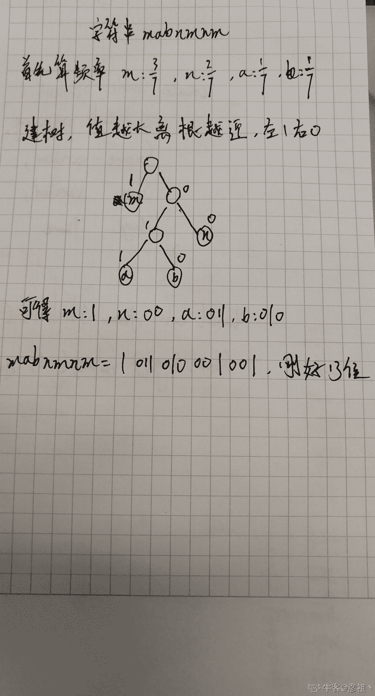
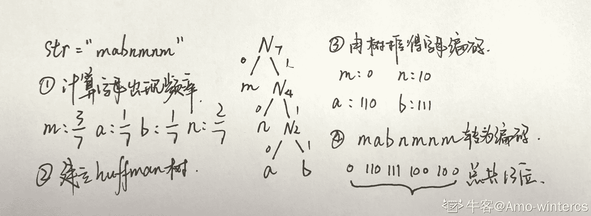
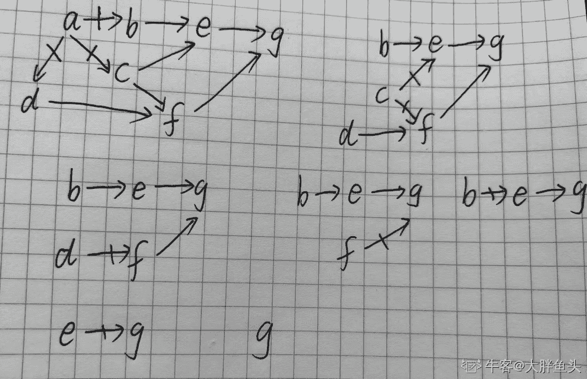
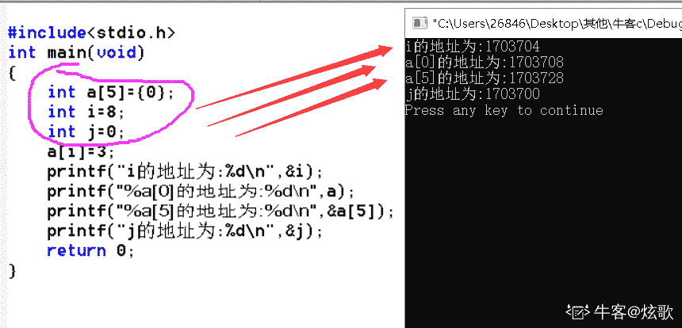
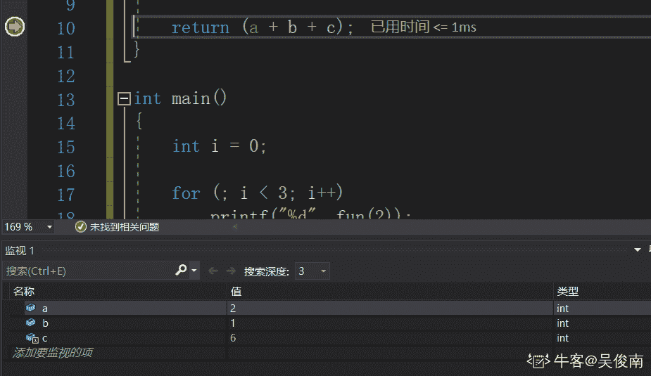
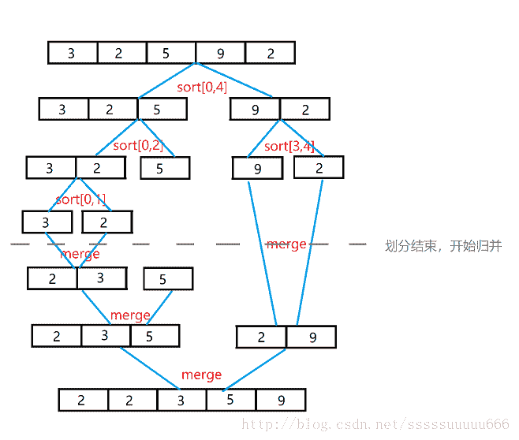

# 三百六十、公司-2019 校招笔试-机器学习工程师客观题合集

## 1

设随机事件 A，B，C 两两独立，且 ,那么一定成立的是：（）

正确答案: D   你的答案: 空 (错误)

```cpp
C 与 A-B 独立
```

```cpp
C 与 A-B 不独立
```

本题知识点

算法工程师 360 公司 机器学习 概率统计 *2019* *讨论

[Endless 丶](https://www.nowcoder.com/profile/5222116)


欲证 C 和 A-B 相互独立，等价于证明 
对左边，我们有 
对右边，我们有 
由于 A、B、C 的条件只是两两独立，我们不知道 P(ABC)、P(A)P(B)P(C)的关系

**PS**:相互独立在两两独立的基础上需要满足

故 C 和 A-B 的独立性未可知，选项 A、B 错误

选项 C、D 我看了半天没证出来，懒得猜符号了。。。。

发表于 2020-04-18 14:17:17

* * *

[Songzm](https://www.nowcoder.com/profile/189483371)

a 是不是也是对的呢？

发表于 2019-08-05 16:25:35

* * *

[PKU_xiaowei](https://www.nowcoder.com/profile/291394677)

看不懂这符号。。。

发表于 2020-03-24 17:48:19

* * *

## 2

假设随机变量 X 与 Y 相互独立，且都服从正态分布，且，则的值是（）

正确答案: A   你的答案: 空 (错误)

```cpp
1/4
```

```cpp
2/5
```

```cpp
2/4
```

```cpp
3/4
```

本题知识点

算法工程师 360 公司 概率统计 *2019 概率论与数理统计* *讨论

[牛客 289508492 号](https://www.nowcoder.com/profile/289508492)

P(X>1,Y>-1)=P(Y>-1)-P(X<=1,Y>-1)                    =P(Y>-1)-P(X<=1)+P(X<=1,Y<=-1)
                    =P(X<=1,Y<=-1)=1/4

发表于 2020-05-25 19:07:16

* * *

[小火箭、](https://www.nowcoder.com/profile/374384782)

画个图、实际两个所对应的面积相等、即概率相等.

发表于 2019-08-29 09:26:13

* * *

[Ponder_xu](https://www.nowcoder.com/profile/995034429)

答案选 2/5，大家别纠结了，这里空白的地方太少，我写不下。

发表于 2019-09-08 15:34:04

* * *

## 3

设 A 是 2 阶方阵可逆，且 A^(-1)=则 A=[]

正确答案: C   你的答案: 空 (错误)

本题知识点

算法工程师 360 公司 2019 概率统计 *概率论与数理统计* *讨论

[石三少](https://www.nowcoder.com/profile/51513814)

应该选 C 吧？

发表于 2019-01-02 21:59:44

* * *

[Muyao](https://www.nowcoder.com/profile/9115452)

【解法一】
对于二阶矩阵 A 的伴随矩阵 A*，可以通过“主对调，辅变号”计算。【解法二】根据逆矩阵的性质：挨个对四个选项算一下就出来了。

发表于 2020-08-19 11:15:17

* * *

[SillyCoderrrr](https://www.nowcoder.com/profile/82899155)

逆矩阵的逆矩阵即原矩阵。主对调，负变号，再除以行列式（-1），应该是 c

编辑于 2019-04-07 10:22:25

* * *

## 4

设 A 为 3 阶方阵，且行列式则 之值为（     ）

正确答案: A   你的答案: 空 (错误)

```cpp
-8
```

```cpp
-2
```

```cpp
2
```

```cpp
8
```

本题知识点

算法工程师 360 公司 组合数学 *2019 概率统计 *概率论与数理统计** **讨论

[GL3-24](https://www.nowcoder.com/profile/635199750)

正确答案应该是 A -8 行列式的运算性质中有一条|λA| = λ的 n 次方*|A|（次方不好打出来，凑活看吧）n 为 A 的阶数

发表于 2019-08-12 20:12:24

* * *

[陈福林](https://www.nowcoder.com/profile/8477018)

行列式的性质

性质 1 行列式与它的转置行列式相等。

性质 2 互换行列式的两行(列)，行列式变号。

推论 如果行列式有两行(列)完全相同，则此行列式为零。

性质 3 行列式的某一行(列)中所有的元素都乘以同一数 k，等于用数 k 乘此行列式。

推论 行列式中某一行(列)的所有元素的公因子可以提到行列式符号的外面。

性质 4 行列式中如果有两行(列)元素成比例，则此行列式等于零。

性质 5 若行列式的某一行(列)的元素都是两数之和，例如第 j 列的元素都是两数之和，则 D 等于拆开后的两个行列式之和

性质 6 把行列式的某一列(行)的各元素乘以同一数然后加到另一列(行)对应的元素上去，行列式不变。

发表于 2018-12-21 21:51:47

* * *

[努力的小蜗牛毛毛](https://www.nowcoder.com/profile/785399651)

矩阵乘法 不等同于  行列式乘法如果-2|A|=-2，但是|-2A|=-8，故此题应该选择 A：-8

发表于 2019-08-26 17:29:09

* * *

## 5

设 ，  则当 x---->1 时（）

正确答案: A   你的答案: 空 (错误)

```cpp
a(x)与 b(x)是同阶无穷小，但不是等价无穷小
```

```cpp
a(x)与 b(x)是等价无穷小
```

```cpp
a(x)是比 b(x)高阶的无穷小
```

```cpp
b(x)是比 a(x)高阶的无穷小
```

本题知识点

算法工程师 360 公司 组合数学 *2019* *讨论

[牛客 702054823 号](https://www.nowcoder.com/profile/702054823)


发表于 2019-08-15 13:35:02

* * *

[Aurora__](https://www.nowcoder.com/profile/783432509)

[等价无穷小](https://www.baidu.com/s?wd=%E7%AD%89%E4%BB%B7%E6%97%A0%E7%A9%B7%E5%B0%8F&tn=SE_PcZhidaonwhc_ngpagmjz&rsv_dl=gh_pc_zhidao)的两个无穷小之比必须是 1；

同阶无穷小的两个无穷小之比是个不为 0 的常数。因此，同阶无穷小中包含[等价无穷小](https://www.baidu.com/s?wd=%E7%AD%89%E4%BB%B7%E6%97%A0%E7%A9%B7%E5%B0%8F&tn=SE_PcZhidaonwhc_ngpagmjz&rsv_dl=gh_pc_zhidao)。

发表于 2020-02-13 16:40:05

* * *

[SillyCoderrrr](https://www.nowcoder.com/profile/82899155)

洛必达之后可以判断 lim x 趋向于 1 （a/b）＝C≠0

发表于 2019-04-07 10:54:41

* * *

## 6

设 f(x)在 x[0]可导，则

正确答案: D   你的答案: 空 (错误)

```cpp
f ' (x0)
```

```cpp
- f ' (x0)
```

```cpp
2 f ' (x0)
```

```cpp
-2 f ' (x0)
```

本题知识点

算法工程师 360 公司 组合数学 *2019* *讨论

[Muyao](https://www.nowcoder.com/profile/9115452)


发表于 2020-08-19 11:29:49

* * *

[陈福林](https://www.nowcoder.com/profile/8477018)

导数的定义

发表于 2018-12-21 21:52:31

* * *

## 7

函数的单调递增区间是（）

正确答案: C   你的答案: 空 (错误)

```cpp
（-∞，+∞）
```

```cpp
（-∞，0）
```

```cpp
（0，+∞）
```

```cpp
没有单调递增区间
```

本题知识点

算法工程师 360 公司 组合数学 *2019* *讨论

[offer 都是我的，冲冲冲](https://www.nowcoder.com/profile/457905418)

可以直接看 x²的单调递增区间

发表于 2020-03-09 21:20:41

* * *

[恨自己不够强](https://www.nowcoder.com/profile/635587634)

不用求导，最简单的做法是赋值

发表于 2019-09-16 09:23:17

* * *

[陈福林](https://www.nowcoder.com/profile/8477018)

求导，令导数为零。一阶导大于 0 即单调递增

发表于 2018-12-21 21:55:00

* * *

## 8

则=（）

正确答案: A   你的答案: 空 (错误)

本题知识点

算法工程师 360 公司 机器学习 2019

讨论

[越 112](https://www.nowcoder.com/profile/4546638)

选项 a 也错了吧，最后一项不是 e 的-5 次幂乘 x，而是 e 的-5x 次幂

发表于 2019-08-26 08:57:21

* * *

[不是江小白](https://www.nowcoder.com/profile/550965516)

查了一下，这题考的是链式法则（Chain rule）：

参考资料：[`zhuanlan.zhihu.com/p/70443521`](https://zhuanlan.zhihu.com/p/70443521)

发表于 2020-09-16 11:27:07

* * *

[陈福林](https://www.nowcoder.com/profile/8477018)

chain rule

发表于 2018-12-21 21:56:12

* * *

## 9

当不知道数据所处类别时，可以使用哪种技术促使同类数据与其他类数据分离（ ）

正确答案: B   你的答案: 空 (错误)

```cpp
分类
```

```cpp
聚类
```

```cpp
关联分析
```

```cpp
隐马尔可夫链
```

本题知识点

算法工程师 360 公司 机器学习 2019

讨论

[陈福林](https://www.nowcoder.com/profile/8477018)

无监督学习

发表于 2018-12-21 21:57:27

* * *

[牛客 982610382 号](https://www.nowcoder.com/profile/982610382)

不知道数据类别，不知道分成什么类型，然后聚类，把同类数据和其他数据分离

发表于 2021-07-23 14:23:04

* * *

## 10

假设我们想估计 A 和 B 这两个参数，在开始状态下二者都是未知的，但如果知道了 A 的信息就可以得到 B 的信息，反过来知道了 B 也就得到了 A。可以考虑首先赋予 A 某种初值，以此得到 B 的估计值，然后从 B 的当前值出发，重新估计 A 的取值，这个过程一直持续到收敛为止，该算法是（      ）的算法思想。

正确答案: C   你的答案: 空 (错误)

```cpp
极大似然法
```

```cpp
朴素贝叶斯分类器
```

```cpp
EM 算法
```

```cpp
贝叶斯决策论
```

本题知识点

算法工程师 360 公司 机器学习 2019

讨论

[陈福林](https://www.nowcoder.com/profile/8477018)

EM 算法了，没毛病已知样本数据服从 K 个概率分布，样本具体属于哪个概率分布未知，概率分布参数也未知。先初始化概率分布的参数，判断各个样本的归属现在已知样本归属，根据样本数据重新计算参数重复

发表于 2018-12-21 22:24:14

* * *

[度小满极速内推](https://www.nowcoder.com/profile/434406366)

EM 是一种迭代式的方法，它的基本思想就是：若样本服从的分布参数θ已知，则可以根据已观测到的训练样本推断出隐变量 Z 的期望值（E 步），若 Z 的值已知则运用最大似然法估计出新的θ值（M 步）。重复这个过程直到 Z 和θ值不再发生变化。

简单来讲：假设我们想估计 A 和 B 这两个参数，在开始状态下二者都是未知的，但如果知道了 A 的信息就可以得到 B 的信息，反过来知道了 B 也就得到了 A。可以考虑首先赋予 A 某种初值，以此得到 B 的估计值，然后从 B 的当前值出发，重新估计 A 的取值，这个过程一直持续到收敛为止。

发表于 2020-04-27 16:32:14

* * *

[大风车恩德](https://www.nowcoder.com/profile/472333413)

EM 算法解决这个的思路是使用启发式的迭代方法，既然我们无法直接求出模型分布参数，那么我们可以先猜想隐含数据（EM 算法的 E 步），接着基于观察数据和猜测的隐含数据一起来极大化对数似然，求解我们的模型参数（EM 算法的 M 步)。由于我们之前的隐藏数据是猜测的，所以此时得到的模型参数一般还不是我们想要的结果。不过没关系，我们基于当前得到的模型参数，继续猜测隐含数据（EM 算法的 E 步），然后继续极大化对数似然，求解我们的模型参数（EM 算法的 M 步)。以此类推，不断的迭代下去，直到模型分布参数基本无变化，算法收敛，找到合适的模型参数。故答案是 EM 算法。

编辑于 2020-03-07 13:57:26

* * *

## 11

二分类任务中，有三个分类器 h1,h2,h3，三个测试样本 x1,x2,x3。假设 1 表示分类结果正确，0 表示错误，h1 在 x1,x2,x3 的结果分别(1,1,0)，h2,h3 分别为(0,1,1)，(1,0,1)，按投票法集成三个分类器，下列说法正确的是（）（注:0，1 不是类别标签，而是模型预测结果是正确还是错误的意思）

正确答案: A   你的答案: 空 (错误)

```cpp
集成提高了性能
```

```cpp
集成没有效果
```

```cpp
集成降低了性能
```

```cpp
集成效果不能确定
```

本题知识点

算法工程师 360 公司 机器学习 2019

讨论

[Henryhust](https://www.nowcoder.com/profile/4708060)

这个题目的 0，1 不是类别标签，而是模型预测结果是正确还是错误的意思！

发表于 2019-08-30 18:47:55

* * *

[Shelters](https://www.nowcoder.com/profile/1346184)

分类器 h1,h2,h3 的准确率都为 2/3，但是集成之后准确率提高为 1

发表于 2020-03-18 11:14:00

* * *

[GL3-24](https://www.nowcoder.com/profile/635199750)

分类器集成，其实就是集成学习，通过构建并结合多个学习器来完成学习任务。一般结构是：先产生一组“个体学习器”，再用某种策略将它们结合起来。结合策略主要有平均法、投票法和学习法等。这些策略使得集成提高了性能。

发表于 2019-08-12 20:42:37

* * *

## 12

下列说法错误的是（）

正确答案: C   你的答案: 空 (错误)

```cpp
adaboost 算法可用于二分类或多分类任务
```

```cpp
adaboost 不会过拟合
```

```cpp
adaboost 总是分类正确的权值高
```

```cpp
adaboost 最终结果是集成分类器的加权组合
```

本题知识点

算法工程师 360 公司 机器学习 算法工程师 360 公司 2019

讨论

[Magnum201908251347134](https://www.nowcoder.com/profile/784234533)

adaboost 不易过拟合，但不代表一定不会过拟合啊？

发表于 2019-09-17 10:22:58

* * *

[冀蒙 mxt](https://www.nowcoder.com/profile/967797410)

adaboost 是给判错的加大权重，使它尽可能判对，不然损失很大

发表于 2018-12-25 19:21:25

* * *

[零葬](https://www.nowcoder.com/profile/75718849)

应该是分类错误的权重高，使得 adaboost 在下一次迭代中更关注没有学习好的样本。但是 B 肯定也是不对的，没有哪个模型是不会过拟合的，尤其是 boosting 这样的模型集成策略，更加侧重于降低模型偏差，过拟合是正常现象。

发表于 2021-01-04 11:51:39

* * *

## 13

N-gram 是一种简单有效的统计语言模型，通常 n 采用 1-3 之间的值，它们分别称为 unigram、bigram 和 trigram。现有给定训练语料合计三个文档如下：
D1： John read Moby Dick
D2： Mary read a different book,
D3： She read a book by Cher
利用 bigram 求出句子“John read a book”的概率大约是（      ）

正确答案: B   你的答案: 空 (错误)

```cpp
1
```

```cpp
0.06
```

```cpp
0.09
```

```cpp
0.0008
```

本题知识点

算法工程师 360 公司 数理统计 机器学习 概率统计 *2019 概率论与数理统计 概率论与数理统计* *讨论

[Henryhust](https://www.nowcoder.com/profile/4708060)

2-gram 公式 P(s1,s2,s3...) = P(s1)*P(s2|s1)*P(s3|s2).....解：john 在文章开头的概率：P（john） = 1/3P（read | John） = 1P(a|read) = 2/3P(book|a) = 1/2P(尾巴|book) = 1/2, book 出现两次，其中一次是在句子结尾处 P("John read a book") = 1/3 * 1 * 2/3 * 1/2 * 1/2 = 1/18 ≈ 0.06，故选择 B

发表于 2019-08-30 18:44:26

* * *

[81192_J](https://www.nowcoder.com/profile/8657090)


发表于 2019-08-15 17:08:05

* * *

[无聊的咸鱼瘫](https://www.nowcoder.com/profile/448866055)

unigram,bigram,trigram,是自然语言处理（NLP）中的问题。父词条：n-gram.unigram: 单个 wordbigram: 双 wordtrigram:3 word 比如：西安交通大学：unigram 形式为：西/安/交/通/大/学 bigram 形式为： 西安/安交/交通/通大/大学 trigram 形式为：西安交/安交通/交通大/通大学（来源百度百科）

发表于 2019-08-15 16:45:17

* * *

## 14

考虑两队之间的足球比赛：队 0 和队 1。假设 65%的比赛队 0 胜出、P(Y=0)=0.65。剩余的比赛队 1 胜出、P(Y=1)=0.35。队 0 获胜的比赛中只有 30%在队 1 的主场、P(X=1|Y=0)=0.3，而队 1 获胜的比赛中 75%是主场获胜、P(X=1|Y=1)=0.75。则队 1 在主场获胜的概率即 P(Y=1|X=1)为：

正确答案: A   你的答案: 空 (错误)

```cpp
0.57
```

```cpp
0.42
```

```cpp
0.69
```

```cpp
0.28
```

本题知识点

算法工程师 360 公司 概率统计 *2019 概率论与数理统计* *讨论

[SillyCoderrrr](https://www.nowcoder.com/profile/82899155)

根据贝叶斯定理：P(Y = 1|X = 1) = P(X = 1|Y =1) * P(Y = 1)/P(X = 1)

根据全概率公式：P(X =1) = P(X = 1|Y = 1) * P(Y = 1) + P(X = 1|Y = 0) * P(Y = 0) = 0.75 * 0.35 + 0.3* 0.65 = 0.4575

所以队 1 取胜的概率 P(Y = 1|X = 1) = 0.75 * 0.35/ 0.4575 = 0.5738

队 0 取胜的概率 P(Y = 1|X = 0) = 1 – 0.5738= 0.4262

发表于 2019-04-07 17:37:56

* * *

[赛博迷航](https://www.nowcoder.com/profile/812627039)

主客场不均

发表于 2020-07-06 22:51:37

* * *

[陈福林](https://www.nowcoder.com/profile/8477018)

贝叶斯公式

发表于 2018-12-26 14:03:51

* * *

## 15

在测试一假设 h 时，发现在一包含 n=1000 个随机抽取样例的样本 s 上，它出现 r=300 个错误，计算 Errors(h)的标准差（      ）

正确答案: A   你的答案: 空 (错误)

```cpp
0.0145
```

```cpp
0.145
```

```cpp
1.45
```

```cpp
14.5
```

本题知识点

算法工程师 360 公司 机器学习 组合数学 *2019* *讨论

[咚咚逗逗酱](https://www.nowcoder.com/profile/4099840)


发表于 2019-08-05 16:06:52

* * *

[陈福林](https://www.nowcoder.com/profile/8477018)

二项分布期望 np 方差 np（1-p）标准差 1/n *(np(1-p))¹/2

发表于 2018-12-26 14:12:57

* * *

## 16

如果假设 h 在 n=65 的独立抽取样本上出现 r=10 个错误，真实的错误率的 90%的置信区间（双侧的，Z[90]=1.64）是（      ）

正确答案: A   你的答案: 空 (错误)

```cpp
0.16±0.073
```

```cpp
0.16±0.73
```

```cpp
1.6±0.073
```

```cpp
1.6±0.73
```

本题知识点

算法工程师 360 公司 2019 概率统计 *概率论与数理统计* *讨论

[SillyCoderrrr](https://www.nowcoder.com/profile/82899155)

[共享]

发表于 2019-04-07 17:51:51

* * *

[t9UhoI](https://www.nowcoder.com/profile/1485032)

10 / 65 = 2 / 13 近似为 0.16 ，所以排除 C 和 D 。
后边的误差只会比前边的数值小，不会更大，B 选项很明显是错的 。综合以上，只有 A 的答案是合理的 。

发表于 2020-05-23 09:47:54

* * *

[红瓶马上就有 offer 了](https://www.nowcoder.com/profile/971261162)

详见数理统计知识点：比值（比率）的置信区间 （茆老师的概率论与数理统计里有公式）

发表于 2020-08-04 09:25:14

* * *

## 17

以下描述正确的是：

正确答案: C   你的答案: 空 (错误)

```cpp
KNN 算法中 K 值对分类效果影响较为显著，一般 K 值较大时，对噪声比较敏感。
```

```cpp
朴素贝叶斯算法对缺失数据特别敏感，事先需要知道先验概率。
```

```cpp
SVM 算法可以解决高维问题。提高泛化性能。
```

```cpp
集成学习算法存在过拟合、鲁棒性不强等问题。
```

本题知识点

算法工程师 360 公司 机器学习 2019

讨论

[Chengᴥ](https://www.nowcoder.com/profile/901288412)

D 不对吧 集成学习不就是用来解决类似决策树的过拟合问题的吗？想 Bagging 和 Random Forest

发表于 2019-08-27 16:47:33

* * *

[GL3-24](https://www.nowcoder.com/profile/635199750)

KNNK 值得选取非常重要，因为：

如果当 K 的取值过小时，一旦有噪声得成分存在们将会对预测产生比较大影响，例如取 K 值为 1 时，一旦最近的一个点是噪声，那么就会出现偏差，K 值的减小就意味着整体模型变得复杂，容易发生过拟合；

如果 K 的值取的过大时，就相当于用较大邻域中的训练实例进行预测，学习的近似误差会增大。这时与输入目标点较远实例也会对预测起作用，使预测发生错误。K 值的增大就意味着整体的模型变得简单；

朴素贝叶斯算法

对缺失数据不太敏感，算法也比较简单，常用于文本分类。需要知道先验概率，且先验概率很多时候取决于假设，假设的模型可以有很多种，因此在某些时候会由于假设的先验模型的原因导致预测效果不佳。

编辑于 2019-08-12 21:24:26

* * *

[你永远得不到的祖奶奶](https://www.nowcoder.com/profile/855996890)

EM 算法对于缺失数据敏感，（原本就是为了计算缺失数据的）。SVM 中使用了核函数，在对数据进行高维度映射时，计算的复杂度还是低纬度，计算的复杂度并不增加，所以可以对高维数据进行很好的计算。集成学习，顾名思义，就是多种学习算法进行集成，使用集成学习可以有效降低过拟合现象的发生。

发表于 2020-07-29 10:13:42

* * *

## 18

下列关于决策树的说法正确的是（      ）

正确答案: A B C D   你的答案: 空 (错误)

```cpp
ID3 决策树是根据信息增益来划分属性
```

```cpp
C4.5 决策树是根据增益率来划分属性
```

```cpp
CART 决策树是根据基尼指数来划分属性
```

```cpp
基尼指数反映了从样本集 D 中随机抽取两个样本，其类别标记不一致的概率，因此越小越好
```

本题知识点

算法工程师 360 公司 机器学习 2019

讨论

[近来可好？](https://www.nowcoder.com/profile/134822053)

决策树常用三种指标来确定是否继续划分集合：信息增益、信息增益率，基尼指数。信息熵：即数据样本的纯度，纯度越高，熵越小。信息增益：按照某一特征划分数据集后熵的减少量，选择减少量最多的特征进行划分，但是偏好特征取值较多的特征，常见模型 ID3。信息增益率：在信息怎亿的基础上除以一个固有值（intrinsic value，和取值数目有关），会对取值数目较多的特征有更多惩罚，偏好取值数较少的特征，常见模型 C4.5 基尼指数：从样本集 D 中随机抽取两个样本，其类别标记不一致的概率，因此越小越好

发表于 2020-03-05 09:51:40

* * *

[牛客 893561416 号](https://www.nowcoder.com/profile/893561416)

ID3 信息增益 C4.5 信息增益率 CART 基尼指数

发表于 2020-09-07 17:03:13

* * *

[葑歆](https://www.nowcoder.com/profile/243416731)

ABCD：可以看我写的文章[`blog.csdn.net/weixin_43584807/article/details/104750959`](https://blog.csdn.net/weixin_43584807/article/details/104750959)

发表于 2020-06-03 21:15:15

* * *

## 19

在机器学习中，下列关于各算法对应的损失函数正确的是（      ）

正确答案: A B C D   你的答案: 空 (错误)

```cpp
最小二乘-Square loss
```

```cpp
SVM-Hinge Loss
```

```cpp
Logistic Regression-（log-Loss）
```

```cpp
AdaBoost-指数损失函数
```

本题知识点

算法工程师 360 公司 机器学习 2019

讨论

[华电美男](https://www.nowcoder.com/profile/101256710)

1、平方和损失函数(square loss):L(y[i],f(x[i])) = (y[i] - f(x[i]))²[,]常用于回归中如最小二乘[，]权重可直接初始化，再通过梯度下降不断更新。2、铰链损失函数(Hing loss): L(m[i]) = max(0,1-mi),常用于 SVM 中，在 SVM 损失函数表示为：L(y^((i)),x^((i))) = max(0,1-y^((i))f(x^((i))))3、对数损失函数：L(y[i],f(x[i])) = -logP(y[i]|x[i]),常用于逻辑回归 4、对数损失函数：L(y[i],f(x[i])) = exp(-y[i]f(x[i])),主要应用于 Boosting 算法中

发表于 2019-09-29 10:59:12

* * *

[网页](https://www.nowcoder.com/profile/939778620)

SVM 的损失函数是 hinge 加上正则化项

发表于 2019-09-09 16:51:43

* * *

## 20

在机器学习中，解释学习器泛化性能中经常用到偏差-方差分解，下列说法正确的是（      ）。

正确答案: A C D   你的答案: 空 (错误)

```cpp
泛化性能是由学习算法的能力、数据的充分性以及学习任务本身的难度所共同决定的
```

```cpp
方差指的是预测的期望值与真实值的偏差
```

```cpp
偏差体现的是学习器预测的准确度
```

```cpp
方差体现的是学习器预测的稳定性
```

本题知识点

算法工程师 360 公司 机器学习 2019

讨论

[landerous](https://www.nowcoder.com/profile/546105362)

B 选项：方差反映的是模型每一次输出结果与模型输出期望之间的误差。B、C、D 选项的理论具体见如下内容：对于上述公式中的记号说明如下：补充：偏差-方差分解说明：**泛化性能是由学习算法的能力、数据的充分性以及学习任务本身的难度所共同决定的。**

编辑于 2021-02-20 11:25:14

* * *

[stefan666](https://www.nowcoder.com/profile/662675419)

这道题出的细碎

发表于 2020-04-02 20:36:29

* * *

[Chengᴥ](https://www.nowcoder.com/profile/901288412)

偏差难道不是精确度？

发表于 2019-09-03 14:17:49

* * *

## 21

类别不平衡（class-imbanlance）就是指分类问题中不同类别的训练样本相差悬殊的情况，例如正例有 900 个，而反例只有 100 个，这个时候我们就需要进行相应的处理来平衡这个问题,下列方法正确的是（      ）

正确答案: A C D   你的答案: 空 (错误)

```cpp
在训练样本较多的类别中进行欠采样
```

```cpp
在训练样本较多的类别中进行过采样
```

```cpp
直接基于原数据集进行学习，对预测值进行再缩放处理
```

```cpp
通过对反例中的数据进行插值，来产生额外的反例
```

本题知识点

算法工程师 360 公司 机器学习 2019

讨论

[TeddyLoveBeans](https://www.nowcoder.com/profile/473699751)

直接基于原数据集进行学习，对预测值进行再缩放处理，这为什么是对的？

发表于 2019-12-30 16:33:20

* * *

[牛客 632248939 号](https://www.nowcoder.com/profile/632248939)

处理类别不平衡的方法：1\. 对样本多的类别欠采样（downsampling）2. 对样本少的类别过采样（upsampling）3\. 对样本少类别分类错误加大惩罚力度（penalizing）4\. 用树类模型

发表于 2019-12-10 15:06:03

* * *

[P-ShineBeam](https://www.nowcoder.com/profile/945440246)

1、采样频率高于信号最高频率的两倍，过采样。

2、采样频率低于信号最高频率的两倍，欠采样。

发表于 2019-09-02 12:39:13

* * *

## 22

有如下数据集，现有测试样本(A=0，B=1，C=0)，则以下描述正确的是：

正确答案: A C   你的答案: 空 (错误)

```cpp
测试样本属于+类的概率为 0.008
```

```cpp
测试样本属于-类的概率为 0.08
```

```cpp
测试样本属于+类的概率大于-的概率，则测试样本的类标号为+
```

```cpp
测试样本属于-类的概率大于+的概率，则测试样本的类标号为-
```

本题知识点

算法工程师 360 公司 机器学习 概率统计 *2019* *讨论

[诗与远方 feature](https://www.nowcoder.com/profile/512447052)

图片看都看不清楚

发表于 2019-09-06 04:03:04

* * *

[81192_J](https://www.nowcoder.com/profile/8657090)

[`wenku.baidu.com/view/35f2671459eef8c75fbfb39f.html`](https://wenku.baidu.com/view/35f2671459eef8c75fbfb39f.html)

发表于 2019-08-15 11:05:34

* * *

[牛客 516450755 号](https://www.nowcoder.com/profile/516450755)

眼睛要瞎了

发表于 2020-03-12 15:16:40

* * *

## 23

下列程序打印结果为()

```cpp
import re 
str1 = "Python's features" 
str2 = re.match( r'(.*)on(.*?) .*', str1, re.M|re.I)
print str2.group(1)

```

正确答案: B   你的答案: 空 (错误)

```cpp
Python
```

```cpp
Pyth
```

```cpp
thon’s
```

```cpp
Python‘s features
```

本题知识点

算法工程师 360 公司 Python 2019

讨论

[王皮球](https://www.nowcoder.com/profile/4622471)

re 模块实现正则的功能 re.match(正则表达式,要匹配的字符串，[匹配模式])要匹配的字符串为 str1 = "Python's features" 正则表达式 r'(.*)on(.*?) .*'r 表示后面的字符串是一个普通字符串（比如\n 会译为\和 n，而不是换行符）()符号包住的数据为要提取的数据，通常与.group()函数连用。.匹配单个任意字符*匹配前一个字符出现 0 次或无限次?匹配前一个字符出现 0 次或 1 次(.*)提取的数据为 str1 字符串中 on 左边的所有字符，即 Pyth(.*?)提取的数据为 str1 中 on 右边，空格前面，即's.group(0)输出的是匹配正则表达式整体结果.group(1) 列出第一个括号匹配部分，.group(2) 列出第二个括号匹配部分

发表于 2020-03-08 23:26:21

* * *

[千古如何不见一人闲](https://www.nowcoder.com/profile/123555701)

str1 = "Python's features"
r'(.*)on(.*?) .*'有几个()就有几个 groupgroup(0) = group() = Python's features
第一个()=group(1)第二个()=group(2).*适配所有?到后面的空格为止

发表于 2019-11-09 15:01:42

* * *

[折枝](https://www.nowcoder.com/profile/55710425)

**多个标志可以通过按位 OR(|) 来指定**re.M：多行匹配，影响 ^ 和 $re.I：使匹配对大小写不敏感 分组：即用圆括号将要提取的数据包住，通过 .group（）获取，一般和“|”结合使用 re.match( r'(.*)on(.*?) .*', str1, re.M|re.I)，将 on 左边和右边分组
>>print(str2.group(0))
Python's features>>print(str2.group(1))Pyth>>print(str2.group(2))'s 参考：https://blog.csdn.net/liyahui_3163/article/details/78434157https://www.cnblogs.com/feifeifeisir/p/10627474.html

发表于 2019-08-14 00:33:04

* * *

## 24

如下程序的运行结果为:

```cpp
def func(s, i, j):
	if i < j:
		func(s, i + 1, j - 1)
		s[i],s[j] = s[j], s[i]

def main():
	a = [10, 6, 23, -90, 0, 3]
	func(a, 0, len(a)-1)
	for i in range(6):
		print a[i]
		print "\n"

main()
```

正确答案: A   你的答案: 空 (错误)

```cpp
3
0
‐90
23
6
10
```

```cpp
3
0
‐60
23
6
10
```

```cpp
6
10
3
0
‐90
23
```

```cpp
6
10
3
0
-23
23
```

本题知识点

算法工程师 360 公司 Python 2019

讨论

[crazy_rainbow](https://www.nowcoder.com/profile/974999347)

这个问题的排版真的是要死了

发表于 2019-08-20 10:18:06

* * *

[offer 在哪呢？](https://www.nowcoder.com/profile/393584532)

#####################  正确的排版应该如下所示 def func(s,i,j):if i<j:
func(s,i+1,j-1)
s[i],s[j] =s[j],s[i]def main():
a = [10,6,23,-90,0,3]
func(a,0,len(a)-1)
for i in range(6):
print(a[i])
print('\n')main()###########################################解答：这是一道递归的题目 1.首先，调用 main() 函数内，已经定义了一个列表 a ,传入到 func 函数内，第一次传入的参数中  i,j 分别代表列表的首位、末尾值。即 i = 0 ,j = 5  此时满足  i<j ,则此时调用 满足的条件 ，又调用 func ，此时传入的参数为 a、1，4 。这时需要执行函数，而不能往下执行，即暂**不可**执行第一次的 交换元素 s[0],s[5] = s[5],s[0].2\. 执行内部函数 func(a,1,4)  则也满足 1<4  此时还需要再调用 func(a,2,3) .暂不执行 s[1],s[4]] =  s[4],s[1].3.再执行内部函数 func(a,2,3) ,还是满足 2<3 此时还需要再调用 func(a,3,2) .暂不执行 s[2],s[3]] =  s[3],s[2].4.再执行内部函数 func(a,3,2),此时不满足 3<2 . 即不执行任何内容。此时内部循环函数全部结束。再往上推。5.上一步内部函数执行完后，则执行交换 s[2],s[3]] =  s[3],s[2]. 再往上推 6\. s[1],s[4]] =  s[4],s[1]，再往上推 7\. s[0],s[5] = s[5],s[0] 。即全部 func 结果结束。即交换了各个位置的元素。第一个变成最后一个、第二个变成倒数第二个、第三个变成倒数第三个。原来   的 a = [10,6,23,-90,0,3]交换后的 a = [3,0,-90,23,6,10]8\. for 循环依次打印出 a 列表元素 ，每次打出一个都进行换行操作。答案为 A###############################################################【2019.9.18】       为了更好的说明，以上文字转为图片或许更好理解： #####执行代码和结果  如下图所示 

编辑于 2019-09-18 09:25:46

* * *

[小白兔白又白~](https://www.nowcoder.com/profile/150382123)

def func(s,i,j):    if i<j:
        func(s,i+1,j-1)
        s[i],s[j] =s[j],s[i]def main():
    a = [10,6,23,-90,0,3]
    func(a,0,len(a)-1)
    for i in range(6):
        print(a[i])
        print('\n')main()


1.首先，调用 main() 函数内，已经定义了一个列表 a ,传入到 func 函数内，第一次传入的参数中  i,j 分别代表列表的首位、末尾值。即  i = 0 ,j = 5  此时满足  i<j ,则此时调用 满足的条件 ，又调用 func ，此时传入的参数为 a、1，4 。这时需要执行函数，而不能往下执行，即暂**不可**执行第一次的 交换元素 s[0],s[5] = s[5],s[0].2\. 执行内部函数 func(a,1,4)  则也满足 1<4  此时还需要再调用 func(a,2,3) .暂不执行 s[1],s[4]] =  s[4],s[1]. 3.再执行内部函数 func(a,2,3) ,还是满足 2<3  此时还需要再调用 func(a,3,2) .暂不执行 s[2],s[3]] =  s[3],s[2]. 4.再执行内部函数 func(a,3,2),此时不满足 3<2 . 即不执行任何内容。此时内部循环函数全部结束。再往上推。5.上一步内部函数执行完后，则执行交换 s[2],s[3]] =  s[3],s[2]. 再往上推 6. s[1],s[4]] =  s[4],s[1]，再往上推 7. s[0],s[5] = s[5],s[0] 。即全部 func 结果结束。即交换了各个位置的元素。第一个变成最后一个、第二个变成倒数第二个、第三个变成倒数第三个。原来   的 a = [10,6,23,-90,0,3]      交换后的 a = [3,0,-90,23,6,10] 8\. for 循环依次打印出 a 列表元素 ，每次打出一个都进行换行操作。   答案为 A

发表于 2019-09-10 11:01:58

* * *

## 25

下面这段程序的功能是什么?（    ）

```cpp
def f(a, b):
    if b == 0:
        return a
    else:
        return f(b, a%b)

a, b = input(“Enter two natural numbers: ”)
print f(a, b)
```

正确答案: A   你的答案: 空 (错误)

```cpp
求 AB 最大公约数
```

```cpp
求 AB 最小公倍数
```

```cpp
求 A%B
```

```cpp
求 A/B
```

本题知识点

算法工程师 360 公司 Python 2019

讨论

[鹿温柔](https://www.nowcoder.com/profile/340634989)

a % b 是求余数辗转相除法，又称欧几里得算法，以除数和余数反复做除法运算，当余数为 0 时，取当前算式除数为最大公约数。

发表于 2019-12-21 17:19:08

* * *

[忆尘](https://www.nowcoder.com/profile/507865467)

辗转相除法，求最大公约数

发表于 2019-08-17 10:37:43

* * *

[受不鸟了](https://www.nowcoder.com/profile/363212535)

原来公因数也叫公约数啊

发表于 2019-09-07 19:34:19

* * *

## 26

下面关于 return 说法正确的是（      ）

正确答案: D   你的答案: 空 (错误)

```cpp
python 函数中必须有 return
```

```cpp
return 可以返回多个值
```

```cpp
return 没有返回值时，函数自动返回 Null
```

```cpp
执行到 return 时，程序将停止函数内 return 后面的语句
```

本题知识点

算法工程师 360 公司 Python 2019

讨论

[凌江](https://www.nowcoder.com/profile/173499254)

C. return 没有返回值时，函数自动返回 None，Python 没有 Null

发表于 2019-08-15 18:13:56

* * *

[牛客 283770851 号](https://www.nowcoder.com/profile/283770851)

return 不可以返回多个值……实际上返回的是一个元组……

发表于 2020-04-18 21:45:19

* * *

[tonger717](https://www.nowcoder.com/profile/58849672)

return 会跳出**函数**（遇到它，函数就结束）break 会跳出当前**循环**continue 跳出当前**循环**并执行下一次

发表于 2019-08-17 18:56:03

* * *

## 27

下面的程序根据用户输入的三个边长 a,b,c 来计算三角形面积.请指出程序中的错误：(设用户输入合法,面积公式无误)

```cpp
import math
a, b, c = raw_input(“Enter a,b,c: ”)
s = a + b + c
s = s / 2.0
area = sqrt(s*(s-a)*(s-b)*(s-c))
print “The area is:”, area
```

正确答案: B C   你的答案: 空 (错误)

```cpp
1
```

```cpp
2
```

```cpp
5
```

```cpp
6
```

本题知识点

算法工程师 360 公司 Python 2019

讨论

[w-ind＇](https://www.nowcoder.com/profile/7587032)

一次读取多个输入值可以这样，

```cpp
a,b,c = input('enter a b c: ').split()

```

参考[`blog.csdn.net/zheng_integer/article/details/54986762`](https://blog.csdn.net/zheng_integer/article/details/54986762)

发表于 2019-09-14 22:43:32

* * *

[牛客 580514726 号](https://www.nowcoder.com/profile/580514726)

这题是不是该更新了？python3 里面 print 是要加（）的呀

发表于 2020-01-10 11:14:47

* * *

[奥利给>=<](https://www.nowcoder.com/profile/283624442)

2 错是因为 too many values to unpack，这个错误。Python2 可以改为 a, b, c = raw_input(), raw_input(), raw_input()，这样不会有语法错误，但是 a, b, c 都还是字符串，用 type()命令可以知道，之后可能还要 int()回来，所以要么使用 eval(raw_input())，要么就是用 Python3。5 错，应该是 math.sqrt，或者上面 1 直接用 from math import sqrt。

编辑于 2019-08-16 08:12:44

* * *

## 28

下列关于 python socket 操作叙述正确的是（      ）

正确答案: C D   你的答案: 空 (错误)

```cpp
使用 recvfrom()接收 TCP 数据
```

```cpp
使用 getsockname()获取连接套接字的远程地址
```

```cpp
使用 connect()初始化 TCP 服务器连接
```

```cpp
服务端使用 listen()开始 TCP 监听
```

本题知识点

算法工程师 360 公司 Python 2019

讨论

[Lee626](https://www.nowcoder.com/profile/6064787)

*   ```cpp
    使用 recvfrom()接收 TCP 数据                 udp！ socket.recv 是 tcp 协议，recvfrom 是 udp 传输 返回值是（data,address）
    其中 data 是包含接收数据的字符串，address 是 发送数据 的套接字地址。
    ```

*   ```cpp
    使用 getsockname()获取连接套接字的远程地址     自己的！ 返回套接字自己的地址 
    通常是一个元组(ipaddr,port)
    ```

*   ```cpp
    使用 connect()初始化 TCP 服务器连接 连接到 address 处的套接字。
    一般 address 的格式为元组（hostname,port）,如果连接出错，返回 socket.error 错误。
    ```

*   ```cpp
    服务端使用 listen()开始 TCP 监听

    ```

编辑于 2020-03-23 09:19:22

* * *

[Teletubby12345](https://www.nowcoder.com/profile/577908476)

sk.recv(bufsize[,flag]):接受套接字的数据。数据以字符串形式返回，bufsize 指定最多可以接收的数量。flag 提供有关消息的其他信息，通常可以忽略。

sk.recvfrom(bufsize[.flag]):与 recv()类似，但返回值是（data,address）。其中 data 是包含接收数据的字符串，address 是发送数据的套接字地址。sk.getsockname():返回套接字自己的地址。通常是一个元组(ipaddr,port)

sk.connect(address):连接到 address 处的套接字。一般，address 的格式为元组（hostname,port）,如果连接出错，返回 socket.error 错误。

sk.listen(backlog):开始监听传入连接。backlog 指定在拒绝连接之前，可以挂起的最大连接数量。

发表于 2019-03-06 16:09:07

* * *

[小白兔白又白~](https://www.nowcoder.com/profile/150382123)

sk.recv(bufsize[,flag]):接受套接字的数据。数据以字符串形式返回，bufsize 指定最多可以接收的数量。flag 提供有关消息的其他信息，通常可以忽略。

sk.recvfrom(bufsize[.flag]):与 recv()类似，但返回值是（data,address）。其中 data 是包含接收数据的字符串，address 是发送数据的套接字地址。sk.getsockname():返回套接字自己的地址。通常是一个元组(ipaddr,port)

sk.connect(address):连接到 address 处的套接字。一般，address 的格式为元组（hostname,port）,如果连接出错，返回 socket.error 错误。

sk.listen(backlog):开始监听传入连接。backlog 指定在拒绝连接之前，可以挂起的最大连接数量。

发表于 2019-09-10 11:38:52

* * *

## 29

shell 中要输出 a+b 的结果（假设 a 和 b 已经被赋值），如何得到

正确答案: D   你的答案: 空 (错误)

```cpp
echo ${a+b}
```

```cpp
echo $(a+b)
```

```cpp
echo ${{a+b}}
```

```cpp
echo $((a+b))
```

本题知识点

C++工程师 360 公司 算法工程师 shell 2019

讨论

[踏上不归路](https://www.nowcoder.com/profile/220948689)

这个意思是双括号中的运算代表 c 语言运算，然后输出

发表于 2019-08-06 10:16:54

* * *

[阿达新](https://www.nowcoder.com/profile/995567233)

双括号要有空格吧

发表于 2020-10-26 21:58:36

* * *

## 30

假设在 shell 中执行的脚本为：./prog.sh  "p1" "p2" "p3 p4"，而我们要在脚本 prog.sh 中获取参数，应该使用

正确答案: A   你的答案: 空 (错误)

```cpp
$@
```

```cpp
$*
```

```cpp
$#
```

```cpp
$?
```

本题知识点

C++工程师 360 公司 算法工程师 shell 2019

讨论

[是真想不出昵称啊](https://www.nowcoder.com/profile/94336747)

$$
Shell 本身的 PID（ProcessID）
$!
Shell 最后运行的后台 Process 的 PID
$?
最后运行的命令的结束代码（返回值）
$-
使用 Set 命令设定的 Flag 一览
$*
所有参数列表。如"$*"用「"」括起来的情况、以"$1 $2 … $n"的形式输出所有参数。
$@
所有参数列表。如"$@"用「"」括起来的情况、以"$1" "$2" … "$n" 的形式输出所有参数。
$#
添加到 Shell 的参数个数
$0
Shell 本身的文件名
$1～$n
添加到 Shell 的各参数值。$1 是第 1 参数、$2 是第 2 参数…

发表于 2019-07-13 15:02:52

* * *

[SoWhataaaa](https://www.nowcoder.com/profile/869375575)

$*   和$@都是列出参数列表。区别：$* 列出的参数列表是一个整体。$@列出的参数列表中每一个参数都是独立的

发表于 2020-05-24 11:56:24

* * *

## 31

代码：HANDLE hMutexSuicide=::OpenMutex (SYNCHRONIZE,FALSE,g_szMutexName);其中 FALSE 的作用是（）

正确答案: B   你的答案: 空 (错误)

```cpp
不需要同步
```

```cpp
不需要向下传递
```

```cpp
设置缺省的安全性
```

```cpp
不继承句柄
```

本题知识点

C++工程师 360 公司 iOS 工程师 Java 工程师 运维工程师 测试工程师 算法工程师 操作系统 2019 系统工程师

讨论

[一顿大餐](https://www.nowcoder.com/profile/987955162)

HANDLE hMutexSuicide = OpenMutex( SYNCHRONIZE, // 打开用于同步 FALSE,// 不需要向下传递 g_szMutexName) ; // 名称

发表于 2019-04-15 09:22:31

* * *

[牛客 761931914 号](https://www.nowcoder.com/profile/761931914)

https://www.cnblogs.com/staring-hxs/p/3664765.html

发表于 2020-08-29 18:29:59

* * *

## 32

中日兵乓球联赛男子双打比赛，中方 C1，C2 两位选手和日方 J1，J2 两位选手对阵。首轮由中方发球，直至接球失误后由队方换发球。试用 PV 操作原语分析这一过程，以下合理的说法是（     ）

正确答案: C   你的答案: 空 (错误)

```cpp
应设置至少 4 个信号量，分别代表 4 类消息的传递。4 个信号量的初始值均为 0。
```

```cpp
应设置至少 2 个信号量，分别代表 2 组队员对资源的使用权。2 个信号量的初始值均为 0。
```

```cpp
应设置至少 4 个信号量，分别代表 4 类消息的传递。4 个信号量的初始值只有一个为 1，其余均设置为 0。
```

```cpp
应设置至少 4 个信号量，分别代表 4 类消息的传递。4 个信号量的初始值只有一个为 0，其余均设置为 1。
```

本题知识点

C++工程师 360 公司 iOS 工程师 Java 工程师 运维工程师 测试工程师 算法工程师 操作系统 2019 系统工程师

讨论

[ss201911191415561](https://www.nowcoder.com/profile/727050741)

首先分析互斥还是同步(有相互联系的，即你发生我才发生)，发现乒乓球是一个互斥量，所以初值为 1，然后发现当中方或者日方有任意一方接球失误后，都换为对方发球，属于同步关系，其中有三个量，中方失误，日方失误，轮换发球(即同步关系)由于刚开始失误次数肯定都是 0，又因为轮换发球属于同步关系初值为 0，所以除了一个互斥量为 1 外，其余各部分初值为 0

编辑于 2019-12-04 15:27:12

* * *

[{球球 offer}](https://www.nowcoder.com/profile/971225653)

参考答案和其它解析写的。。不确定理解是否正确。

```cpp
//我理解的四种消息：c 打球成功，c 打球失败；j 打球成功，j 打球失败
sem_t t1,t2,t3,t4;
sem_init(&t1,0);
sem_init(&t2,0);
sem_init(&tc,1);//初始化时 c 打球
sem_init(&tj,0);
int score_c=0;
int score_j=0;
control(){//c 打球失败时，j 计分
	sem_wait(&t1);
	score_j++;
	sem_post(&tj);
}
control2(){
	sem_wait(&t2);
	score_c++;
	sem_post(&tc);
}
fc(){
	sem_wait(&tc);
	if(发球失败){
		sem_post(&t1);
	}
	else{
		sem_post(&tj);
	}
}
fj(){
	sem_wait(&tj);
	if(发球失败){
		sem_post(&t2);
	}
	else{
		sem_post(&tc);
	}
}
```

发表于 2020-04-22 12:36:46

* * *

## 33

单处理系统中，进程 P1,P2,P3 处于就绪队列，进程 P4，P6 处于等待队列，P5 正占用处理器运行，以下关于进程调度时机分析正确的是（     ）

正确答案: A B D   你的答案: 空 (错误)

```cpp
P5 执行结束，释放 CPU 使用权时一定会引起进程调度
```

```cpp
P5 由运行状态转换为等待状态时一定会引起进程调度。
```

```cpp
P6 由运行等待转换为就绪状态时一定会引起进程调度。
```

```cpp
P5 由运行状态转换为就绪状态时一定会引起进程调度。
```

本题知识点

C++工程师 360 公司 iOS 工程师 Java 工程师 运维工程师 测试工程师 算法工程师 操作系统 2019 系统工程师

讨论

[呦呵呵](https://www.nowcoder.com/profile/9522175)

进程调度时机：当前运行进程主动放弃处理机和当前运行进程被动放弃处理机。主动放弃处理机：（1）进程正常终止  运行态->终止态 (2)运行过程中发生异常而终止 运行态->终止态（3）进程主动请求阻塞 如等待 I/O 运行态->阻塞态被动放弃处理机：（1）分给进程的时间片用完 运行态->就绪态  (2)有更紧急的事需要处理 如 I/O 中断 运行态->就绪态  (3)有更高优先级的进程进入就绪队列 运行态->就绪态 故认为应该选 ABD

发表于 2019-08-14 16:47:33

* * *

[58 同城 2022 校园招聘](https://www.nowcoder.com/profile/1484845)

等待队列是阻塞队列吗？？？选 ABD 吧

发表于 2019-03-06 21:39:14

* * *

[Serendipity-zsh](https://www.nowcoder.com/profile/905290950)

P6 优先级大于 P5，B 选项才是对的吧

发表于 2019-11-21 21:59:13

* * *

## 34

系统采用分级调度算法。进程 a1~a6 处于 I 级队列，进程 b1~b6 处于 II 级队列，进程 c1~c6 处于 III 级队列,则以下描述正确的是（     ）

正确答案: A C D   你的答案: 空 (错误)

```cpp
I 级队列的进程获得的时间片最少。
```

```cpp
I 级队列的进程获得的时间片最多。
```

```cpp
分级调度是结合了时间片轮转法和优先级算法的优势。
```

```cpp
一个新创建的进程 P，会先加入 I 级队列。
```

本题知识点

C++工程师 360 公司 iOS 工程师 Java 工程师 运维工程师 测试工程师 算法工程师 操作系统 2019 系统工程师

讨论

[已注销](https://www.nowcoder.com/profile/7558628)

分级调度算法是结合时间片轮转调度算法一起使用的( **C 对** )，这种算法的本质是链入多个队列，当进程消耗完时间片但是它的工作尚未结束时，它就会被链入下一级队列，第一级队列的优先级最高( **D 对** )，但是第一级队列的进程分配的时间片都很小( **A 对** )，于是很快就轮转完了，队列等级越往下，时间片分配的就越多。

发表于 2018-12-26 20:07:28

* * *

[延大 _ 王星星](https://www.nowcoder.com/profile/395313099)

一个进程需要执行 100 个时间片，如果采用时间片轮转调度算法，那么需要交换 100 次。
多级队列是为这种需要连续执行多个时间片的进程考虑，它设置了多个队列，每个队列时间片大小都不同，例如
1,2,4,8,..。进程在第一个队列没执行完，就会被移到下一个队列。这种方式下，之前的进程只需要交换 7 次。
每个队列优先权也不同，最上面的优先权最高。因此只有上一个队列没有进程在排队，才能调度当前队列上的进程。
可以将这种调度算法看成是时间片轮转调度算法和优先级调度算法的结合。

发表于 2020-04-21 19:12:03

* * *

[tgs201804180012504](https://www.nowcoder.com/profile/7741333)

一级是最低级的，不是最高级😭

发表于 2020-11-28 12:39:36

* * *

## 35

公司门户网站随着访问用户增加需要扩展服务器数量,每台服务器在 DNS 配置时，域名与主机相同，为达到负载均衡，DNS 服务器需要开启（      ）

正确答案: C   你的答案: 空 (错误)

```cpp
智能解析
```

```cpp
顺序解析
```

```cpp
启用循环
```

```cpp
反复解析
```

本题知识点

C++工程师 360 公司 iOS 工程师 Java 工程师 前端工程师 运维工程师 测试工程师 算法工程师 网络基础 2019 系统工程师 测试开发工程师

讨论

[飞鸿踏雪泥 9975](https://www.nowcoder.com/profile/6799891)

DNS 负载均衡是通过循环复用实现的，如果发现[主机名](https://baike.baidu.com/item/%E4%B8%BB%E6%9C%BA%E5%90%8D/2836107)的多个地址[资源记录](https://baike.baidu.com/item/%E8%B5%84%E6%BA%90%E8%AE%B0%E5%BD%95/6024505)，则可用它循环使用包含在查询应答中的主机资源记录。

发表于 2019-08-14 17:39:45

* * *

[青简](https://www.nowcoder.com/profile/708069809)

DNS 负载均衡是通过循环复用实现的，如果发现主机名的多个地址资源记录，则可用它循环使用包含在查询应答中的主机资源记录

发表于 2019-09-26 16:34:22

* * *

[燎原之火🔱](https://www.nowcoder.com/profile/3633297)

一题通用，程序员这些都应该知道🤐

发表于 2019-01-08 09:44:52

* * *

## 36

IP 数据报的收发方进行跨网投递时，发送方需利用 ARP 协议获取哪些信息（      ）

正确答案: B   你的答案: 空 (错误)

```cpp
接收方 IP 地址的 MAC 地址
```

```cpp
发送方本网段路由器对应端口的 MAC 地址
```

```cpp
接收方本网段路由器对应端口的 MAC 地址
```

```cpp
发送方 IP 地址的 MAC 地址
```

本题知识点

C++工程师 360 公司 iOS 工程师 Java 工程师 前端工程师 运维工程师 测试工程师 算法工程师 网络基础 2019 系统工程师 测试开发工程师

讨论

[今晚我要学习](https://www.nowcoder.com/profile/5068973)

题目是“收发方跨网投递”。ARP 能获得下一跳主机的 MAC 地址，这看起来像是接收方，然而并不是，接收方可能还很远，我们所获得的仅仅是 B 项描述的：

*   ```cpp
    发送方本网段路由器对应端口的 MAC 地址
    ```

这个端口 MAC 地址可能是已经缓存的，也可能是通过广播获取的。

编辑于 2019-04-03 17:53:48

* * *

[罗蜜斯丹](https://www.nowcoder.com/profile/1812648)

发送方要知道接收方的 IP 地址即可，在路由器中可用 ARP 协议找到接受发的 MAC 地址。所以发送方不关心接收方的 MAC 地址，但发送前要填上自己的 MAC 地址

发表于 2019-02-28 16:22:16

* * *

[牛客 238647254 号](https://www.nowcoder.com/profile/238647254)

因为是"跨网段", 所以 ARP 管不了, 它只能告诉"发送方"怎么从本网段出去. 

发表于 2022-01-25 00:02:41

* * *

## 37

SNMP 协议利用（      ）协议实现管理者与 SNMP 代理之间的信息交互

正确答案: A   你的答案: 空 (错误)

```cpp
UDP
```

```cpp
TCP
```

```cpp
ARP
```

```cpp
ICMP
```

本题知识点

C++工程师 360 公司 iOS 工程师 Java 工程师 前端工程师 运维工程师 测试工程师 算法工程师 网络基础 2019 系统工程师 测试开发工程师

讨论

[雨*-*](https://www.nowcoder.com/profile/602147864)

TCP 支持的应用协议：TELNET（远程终端登录协议）,FTP（文件传输协议）,SMTP（简单邮件传送协议）,HTTP（传送协议）UDP 支持的应用协议：NFS(网络文件系统)，SNMP（简单网络管理协议），DNS（域名服务），TFTP（简单文件传输协议）

发表于 2019-08-27 10:57:40

* * *

[飞鸿踏雪泥 9975](https://www.nowcoder.com/profile/6799891)

SNMP 采用 UDP 协议在管理端和 agent 之间传输信息。 SNMP 采用 UDP 161 端口接收和发送请求，162 端口接收 trap，执行 SNMP 的设备缺省都必须采用这些端口。SNMP 消息全部通过 UDP 端口 161 接收，只有 Trap 信息采用 UDP 端口 162。

发表于 2019-08-14 17:41:34

* * *

[Lane.](https://www.nowcoder.com/profile/849834097)

简单网络管理协议（SNMP） 是专门设计用于在 IP 网络管理网络节点（服务器、工作站、路由器、交换机及 HUBS 等）的一种标准协议，它是一种应用层协议。

发表于 2019-10-30 10:49:01

* * *

## 38

公司办公室,技术部,开发部,销售部的网络地址分别为 172.16.32.0/24,172.16.33.0/24,172.16.34.0/24,172.16.35.0/24;网络中心进行地址聚合,聚合后覆盖四个部门的网络地址是（      ）

正确答案: C   你的答案: 空 (错误)

```cpp
172.16.32.0/24
```

```cpp
172.16.32.0/23
```

```cpp
172.16.32.0/22
```

```cpp
172.16.32.0/21
```

本题知识点

C++工程师 360 公司 iOS 工程师 Java 工程师 前端工程师 运维工程师 测试工程师 算法工程师 网络基础 2019 系统工程师 测试开发工程师

讨论

[梅梅 201803241656278](https://www.nowcoder.com/profile/1728579)

每个小数点之间由八位二进制表示，最后的 24 表示前 24 位为网络号，主机号=32-网络号网络地址聚合就是取最大相同的部分。172.16.32.0/24：相同.相同.00010000（32）.不管 172.16.33.0/24：相同.相同.00010001（33）.不管 172.16.34.0/24：相同.相同.00010010（34）.不管 172.16.35.0/24：相同.相同.00010011（35）.不管取最大相同：172.16.000100|不同.不管(|之前为聚合网络地址:16+6=22 位)即表示为：172.16.32.0/22

发表于 2018-12-29 15:49:35

* * *

[千纸鹤千颗心](https://www.nowcoder.com/profile/711830961)

|24 表示前面 24 位相同的作为网络号，而四者取最大相同部分是前面 22 位，因此选择|22.

发表于 2019-04-24 11:27:54

* * *

[飞鸿踏雪泥 9975](https://www.nowcoder.com/profile/6799891)

聚合网络地址：取网络地址的最大相同部分

发表于 2019-08-14 17:44:14

* * *

## 39

数据链路层可以提供哪些服务类型（      ）

正确答案: A B C   你的答案: 空 (错误)

```cpp
无确认的无连接服务
```

```cpp
有确认的无连接服务
```

```cpp
有确认的有连接服务
```

```cpp
无确认的有连接服务
```

本题知识点

C++工程师 360 公司 iOS 工程师 Java 工程师 前端工程师 运维工程师 测试工程师 算法工程师 网络基础 2019 系统工程师 测试开发工程师

讨论

[barbo](https://www.nowcoder.com/profile/7171527)

只要记住，有连接的一定要确认

发表于 2019-08-15 16:39:59

* * *

[愚人五个字](https://www.nowcoder.com/profile/963871720)

数据链路层一般都提供 3 种基本服务，即无确认的无连接服务、有确认的无连接服务、有确认 的面向连接的服务。 （1）无确认的无连接服务 无确认的无连接服务是源机器向目的机器发送独立的帧，而目的机器对收到的帧不作确认。 如果由于线路上的噪声而造成帧丢失，数据链路层不作努力去恢复它，恢复工作留给上层去完成。 这类服务适用于误码率很低的情况，也适用于像语音之类的实时传输，实时传输情况下有时数据延误比数据损坏影响更严重。 大多数局域网在数据链路层都使用无确认的无连接服务。 （2）有确认的无连接服务 这种服务仍然不建立连接，但是所发送的每一帧都进行单独确认。 以这种方式，发送方就会知道帧是否正确地到达。如果在某个确定的时间间隔内，帧没有到达，就必须重新发此帧。 （3）有确认的面向连接的服务 采用这种服务，源机器和目的机器在传递任何数据之前，先建立一条连接。 在这条连接上所发送的每一帧都被编上号，数据链路层保证所发送的每一帧都确实已收到。 而且，它保证每帧只收到一次，所有的帧都是按正确顺序收到的。面向连接的服务为网络进程间提供了可靠地传送比特流的服务。

发表于 2019-01-09 20:50:18

* * *

## 40

STP 协议可以实现的功能是（      ）

正确答案: B C   你的答案: 空 (错误)

```cpp
隔离冲突域
```

```cpp
防止广播风暴
```

```cpp
防止环路
```

```cpp
提供可靠传输
```

本题知识点

360 公司 Java 工程师 网络基础 2019

讨论

[远山淡影](https://www.nowcoder.com/profile/929506490)

STP（生成树协议）的原理是按照树的结构来构造网络拓扑，消除网络中的环路，避免由于环路的存在而造成广播风暴问题。

发表于 2019-03-06 10:22:18

* * *

[tru-th](https://www.nowcoder.com/profile/4137824)

生成树协议 STP： 工作在数据链路层的透明网桥使用的算法，可以防止环路，防止因环路而产生的广播风暴

发表于 2020-04-20 20:06:53

* * *

[暮秋柒](https://www.nowcoder.com/profile/923002302)

Spanning Tree Protocol 生成树协议

发表于 2019-11-21 10:18:26

* * *

## 41

公司内部为 100Mbps 的企业网,办公室计算机从网络中心下载 25M 的文件,在没有流量控制与无干扰的情况下,大概需要的时间为（      ）

正确答案: C   你的答案: 空 (错误)

```cpp
0.5 秒
```

```cpp
1 秒
```

```cpp
2 秒
```

```cpp
4 秒
```

本题知识点

C++工程师 360 公司 iOS 工程师 Java 工程师 前端工程师 运维工程师 测试工程师 算法工程师 网络基础 2019 系统工程师 测试开发工程师

讨论

[He110](https://www.nowcoder.com/profile/6472986)

100 Mbps 是按 bit 传输的，所以需要转化为 byte 的传输速度，需要除以 8，即下载速度是 12.5Mb/s，所以需要 2 秒

发表于 2018-12-27 13:04:59

* * *

[sjh123](https://www.nowcoder.com/profile/272256735)

评论里面有些老哥理解错了（虽然答案对的）25M 文件（25MB）的 M 是 1024100Mbps 的 M 是 1000 所以不能直接用 Mb 来除以 Mbps    而是要全部都转化为 b 或 bps25M:25*1024*1024*8 b100Mbps:100*1000*1000 bps 两者相除≈2

编辑于 2020-05-21 20:44:09

* * *

[桔子 201908231619240](https://www.nowcoder.com/profile/953034402)

25Mbyte=25*1024*1024*8 理想时间=(25*1024*1024*1024*8)/ (100 000 000)=2.097152s

发表于 2019-09-19 17:37:55

* * *

## 42

运行哪个协议后可用避免交换机之间存在的环路（      ）

正确答案: A   你的答案: 空 (错误)

```cpp
STP
```

```cpp
RIP
```

```cpp
OSPF
```

```cpp
ARP
```

本题知识点

C++工程师 360 公司 iOS 工程师 Java 工程师 前端工程师 运维工程师 测试工程师 算法工程师 网络基础 2019 系统工程师 测试开发工程师

讨论

[呆瓜 201903132237485](https://www.nowcoder.com/profile/625376940)

STP（生成树协议）：是按照树的结构来构造网络拓扑，消除网络中的环路，避免由于环路的存在而造成广播风暴问题。

发表于 2019-08-21 16:21:11

* * *

[tru-th](https://www.nowcoder.com/profile/4137824)

&

STP：生成树协议；透明网桥使整个连通网络不存在回路；P99

RIP：路由信息协议；一种分布式的基于距离向量的路由选择协议；P152

OSPF：开放最短路径优先；使用分布式的链路状态协议；P157

ARP：地址解析协议

内部网关协议 IGP：RIP+OSPF ；P151

外部网关协议 EGP：BGP-4

发表于 2020-04-20 10:40:54

* * *

[暮秋柒](https://www.nowcoder.com/profile/923002302)

spanning tree protocol 生成树协议

发表于 2019-12-05 14:51:21

* * *

## 43

有关树的说法正确的是（      ）

正确答案: A C   你的答案: 空 (错误)

```cpp
树中所有结点可以有 0 个或多个后继结点
```

```cpp
二叉树中至少有一个结点的度为 2
```

```cpp
在 AVL 树中根节点的左右子树的深度最多相差 1
```

```cpp
Huffman 树一定是 AVL 树
```

本题知识点

C++工程师 360 公司 iOS 工程师 Java 工程师 前端工程师 运维工程师 测试工程师 算法工程师 树 2019 系统工程师 测试开发工程师

讨论

[养鱼的小白莲](https://www.nowcoder.com/profile/76251842)

哈夫曼树只是一棵最优二叉树，不一定是完全二叉树，也不一定是平衡二叉树哈夫曼树不关注树的结构，只关注带权路径长度

发表于 2019-08-23 10:29:04

* * *

[远山淡影](https://www.nowcoder.com/profile/929506490)

B 选项：单支二叉树节点度不为 2

发表于 2019-03-06 10:19:42

* * *

[Isoon](https://www.nowcoder.com/profile/628327468)

不是，A 选项语言表述就有问题吧？

发表于 2020-03-23 23:59:37

* * *

## 44

在 AVL 树中，哪个调整操作可以使根节点的平衡因子由 1 变为 2（      ）

正确答案: A C   你的答案: 空 (错误)

```cpp
LL
```

```cpp
RR
```

```cpp
LR
```

```cpp
RL
```

本题知识点

C++工程师 360 公司 iOS 工程师 Java 工程师 前端工程师 运维工程师 测试工程师 算法工程师 树 2019 系统工程师 测试开发工程师

讨论

[梅梅 201803241656278](https://www.nowcoder.com/profile/1728579)

有四种种情况可能导致二叉查找树不平衡，分别为：

（1）LL：插入一个新节点到根节点的左子树（Left）的左子树（Left），导致根节点的平衡因子由 1 变为 2

（2）RR：插入一个新节点到根节点的右子树（Right）的右子树（Right），导致根节点的平衡因子由-1 变为-2

（3）LR：插入一个新节点到根节点的左子树（Left）的右子树（Right），导致根节点的平衡因子由 1 变为 2

（4）RL：插入一个新节点到根节点的右子树（Right）的左子树（Left），导致根节点的平衡因子由-1 变为-2

针对四种种情况可能导致的不平衡，可以通过旋转使之变平衡。有两种基本的旋转：

（1）左旋转：将根节点旋转到（根节点的）右孩子的左孩子位置

（2）右旋转：将根节点旋转到（根节点的）左孩子的右孩子位置
--------------------- 
作者：披靡 
来源：CSDN 
原文：[`blog.csdn.net/xomlee/article/details/17628681`](https://blog.csdn.net/xomlee/article/details/17628681) 

发表于 2018-12-29 16:08:05

* * *

[罗蜜斯丹](https://www.nowcoder.com/profile/1812648)

插在根节点的左子树即可；平衡因子 = 左子树高度-右子树高度

发表于 2019-02-28 17:48:34

* * *

[August-us2020](https://www.nowcoder.com/profile/2284237)

据我所知，调整不是为了减少平衡因子，怎么还能够增大的？？？？？？

发表于 2020-03-24 13:52:37

* * *

## 45

依次将关键字序列 7, 6, 4, 10, 8, 11 插入到一棵空的平衡二叉树中，插入后的平衡二叉树的根结点为（      ）

正确答案: D   你的答案: 空 (错误)

```cpp
7
```

```cpp
6
```

```cpp
10
```

```cpp
8
```

本题知识点

360 公司 树 2019

讨论

[蹲一大把的 offer](https://www.nowcoder.com/profile/515070749)

平衡二叉树：是一种特殊的二叉排序树，其左右子树都是平衡二叉树，要求 BF（平衡因子=其左子树高-其右子树高）只能取 0，1，-1\.

发表于 2019-08-16 20:44:55

* * *

[梅梅 201803241656278](https://www.nowcoder.com/profile/1728579)

在草稿纸上按 7, 6, 4, 10, 8, 11 的顺序插入要求：左<根<右且高度差不能大于 1(不符合要求就调正树)根节点变化为 7->6->8

发表于 2018-12-29 16:22:57

* * *

[牛客 583481012 号](https://www.nowcoder.com/profile/583481012)

平衡二叉树一定是二叉排序树吗？

发表于 2021-01-11 13:12:22

* * *

## 46

已知最大堆的关键字序列为 93,72,48,53,45,30,18,36,15,35，删除关键字 72，调整后得。到的最大堆是（      ）

正确答案: A   你的答案: 空 (错误)

```cpp
93,53,48,36,45,30,18,35,15
```

```cpp
93,48,53,36,45,30,18,35,15
```

```cpp
93,53,48,45,30,36,18,35,15
```

```cpp
93,53,48,45,30,36,35,18,15
```

本题知识点

C++工程师 360 公司 iOS 工程师 Java 工程师 前端工程师 运维工程师 测试工程师 算法工程师 堆 2019 系统工程师 测试开发工程师

讨论

[小码农 _ 婷婷](https://www.nowcoder.com/profile/6094983)


1>将要删除的节点与最后一个节点进行交换

2>调整堆成为大顶堆或小顶堆

发表于 2020-03-23 16:21:21

* * *

[NoOfferException](https://www.nowcoder.com/profile/1554976)

删除是将被删除元素和队列最后一个元素进行交换。。。。。。。

发表于 2019-09-26 17:33:55

* * *

[梅梅 201803241656278](https://www.nowcoder.com/profile/1728579)

顺序按层次遍历删除前：               93               |  \                   72  48              | \     |  \
           53 45 30 18
           |  \    \
        36 15  35
删除 72 后：               93               |  \                   53  48              | \     |  \
           36 45 30 18
            | \
         35  15

发表于 2018-12-29 16:56:32

* * *

## 47

产生哈希冲突的影响因素有哪些（      ）  

正确答案: A B D   你的答案: 空 (错误)

```cpp
装填因子
```

```cpp
哈希函数
```

```cpp
哈希表长
```

```cpp
处理冲突的方法
```

本题知识点

C++工程师 360 公司 iOS 工程师 Java 工程师 前端工程师 运维工程师 测试工程师 算法工程师 哈希 *2019 系统工程师 测试开发工程师* *讨论

[寒月照三更](https://www.nowcoder.com/profile/122796058)

表长对冲突的影响，是受装填因子制约的。表再长，装得满满的，就会容易冲突。

发表于 2019-10-16 17:34:25

* * *

[烬天玉藻前](https://www.nowcoder.com/profile/195480900)

C 选项哈希表长不能算：装填因子 = 数据总数 / 哈希表长是数据总数 / 哈希表长的结果(装填因子)对冲突的产生有影响。想到了高中物理的选择题考公式经常这么来，问哪一个参数对结果有影响(记不太清了，忽略这行)

发表于 2020-08-21 22:22:46

* * *

[法克瓜](https://www.nowcoder.com/profile/598273059)

不是应该哈希表越长越不容易产生冲突嘛？

发表于 2019-02-07 23:44:57

* * *

## 48

设哈希表长为 8，哈希函数为 Hash (key)=key%7。初始记录关键字序列为(32，24，15，27，20，13)，用链地址法作为解决冲突方法的平均查找长度是（      ）

正确答案: B   你的答案: 空 (错误)

```cpp
1.4
```

```cpp
1.5
```

```cpp
1.6
```

```cpp
1.7
```

本题知识点

C++工程师 360 公司 iOS 工程师 Java 工程师 前端工程师 运维工程师 测试工程师 算法工程师 哈希 *2019 系统工程师 测试开发工程师* *讨论

[梅梅 201803241656278](https://www.nowcoder.com/profile/1728579)

链地址法作为解决冲突方法：冲突以后变成链表，查询次数增加
32%7=4（查一次）24%7=3（查一次）15%7=1（查一次）27%7=6（查一次）20%7=6（查两次）13%7=6（查三次）
ASL=(1*4+2*1+3*1)/6=1.5

发表于 2018-12-29 17:21:03

* * *

[白起丶](https://www.nowcoder.com/profile/815173790)

哈希表长度为 8，故存储的位置分别是 0、1、2、3、4、5、6、7\.根据哈希函数，可以得到关键字序列(32，24，15，27，20，13)存储的位置分别为：4、3、1、6、6、6\.解决冲突的方式是链地址法，故 20 和 13 存储在 27 的下边，三者构成一个链表结构，第一个元素为 27，最后一个元素为 13\.哈希表中查找一个元素的复杂度为 O（1）,故 32、24、15、27 分别查找一次即可找到，而 20 和 13 在链表结构中，需要从 27 开始往下遍历，分别需要额外的一次和两次才能找到，即 20 需要两次，13 需要三次。故最终的平均查找长度为总查询次数 / 关键字个数=（1+1+1+1+2+3）/ 6 = 1.5

编辑于 2020-07-12 11:33:37

* * *

## 49

对字符串 "mabnmnm" 的二进制进行哈夫曼编码有多少位（）

正确答案: B   你的答案: 空 (错误)

```cpp
12
```

```cpp
13
```

```cpp
14
```

```cpp
15
```

本题知识点

C++工程师 360 公司 iOS 工程师 Java 工程师 前端工程师 运维工程师 测试工程师 算法工程师 字符串 *2019 系统工程师 测试开发工程师* *讨论

[彦祖丶](https://www.nowcoder.com/profile/4900747)



发表于 2019-09-21 11:26:33

* * *

[梅梅 201803241656278](https://www.nowcoder.com/profile/1728579)

mabnmnm 频率 m:3/7 a:1/7 b:1/7 n:2/7（频率越高离根越近）建树（o 只占位，|表示 0 ，\表示 1）:            o            |\ m  o |\ n  o |\ a  b 由|,\转为 0,1 得:m->0,n->10,a->110,b->111mabnmnm:0 110 111 10 0 10 0(共 13 位)

发表于 2018-12-29 18:38:36

* * *

[Amo-wintercs](https://www.nowcoder.com/profile/444653760)

tip：当两个数相同时，无论放在左子树或者右子树，其 WPL 值是一样的，并不影响编码的长度，只是对应字符编码的值互换了而已。

发表于 2021-03-17 11:53:11

* * *

## 50

在哈夫曼树中，结点的度可能为（      ）

正确答案: A C   你的答案: 空 (错误)

```cpp
0
```

```cpp
1
```

```cpp
2
```

```cpp
3
```

本题知识点

360 公司 树 2019

讨论

[你的 offer 对我打了烊](https://www.nowcoder.com/profile/598309941)

哈夫曼必须要有两个节点构建一个新的虚拟的父节点吧！毫无疑问这个父节点度为 2，最初构建父节点的两个节点肯定是叶子节点，度为 0

发表于 2020-03-20 14:29:59

* * *

[Why81](https://www.nowcoder.com/profile/1187918)

度，分为 出度 和 入度 ，难道不是  B, C, D 吗？

发表于 2019-02-20 16:33:24

* * *

[_CHENDavid](https://www.nowcoder.com/profile/564273691)

题目更严紧一些的话，应该指明是几叉的霍夫曼树。虽然大部分情况默认 2 叉。

发表于 2020-08-16 16:02:00

* * *

## 43

有关树的说法正确的是（      ）

正确答案: A C   你的答案: 空 (错误)

```cpp
树中所有结点可以有 0 个或多个后继结点
```

```cpp
二叉树中至少有一个结点的度为 2
```

```cpp
在 AVL 树中根节点的左右子树的深度最多相差 1
```

```cpp
Huffman 树一定是 AVL 树
```

本题知识点

C++工程师 360 公司 iOS 工程师 Java 工程师 前端工程师 运维工程师 测试工程师 算法工程师 树 2019 系统工程师 测试开发工程师

讨论

[养鱼的小白莲](https://www.nowcoder.com/profile/76251842)

哈夫曼树只是一棵最优二叉树，不一定是完全二叉树，也不一定是平衡二叉树哈夫曼树不关注树的结构，只关注带权路径长度

发表于 2019-08-23 10:29:04

* * *

[远山淡影](https://www.nowcoder.com/profile/929506490)

B 选项：单支二叉树节点度不为 2

发表于 2019-03-06 10:19:42

* * *

[Isoon](https://www.nowcoder.com/profile/628327468)

不是，A 选项语言表述就有问题吧？

发表于 2020-03-23 23:59:37

* * *

## 52

对关键码集合 K={22，11，38，68，43，6，10，48},用筛选法创建最小堆时，从关键码（      ）开始调整

正确答案: C   你的答案: 空 (错误)

```cpp
22
```

```cpp
38
```

```cpp
68
```

```cpp
48
```

本题知识点

C++工程师 360 公司 iOS 工程师 Java 工程师 前端工程师 运维工程师 测试工程师 算法工程师 堆 2019 系统工程师 测试开发工程师

讨论

[everythingisok](https://www.nowcoder.com/profile/725453269)

                                  22                                /       \                             11        38                           /     \      /    \                        68     43  6    10                       /                     48              从下往上，从右到左的顺序，从第一个非叶结点开始调整

发表于 2020-05-26 16:41:56

* * *

[梅梅 201803241656278](https://www.nowcoder.com/profile/1728579)

筛选法就是开始按现有的顺序从上到下，从左到右放到一个完全二叉树里面。
然后把这个树调节成堆。调节的时候从最后一个有儿子的节点开始。 也就是从下往上，从右往左找，找到的第一个有孩子的节点开始。依次把各个节点及下面的孩子组成的树调节成堆。筛选法建堆例子(侵删)： 至于本题，打扰了。

发表于 2018-12-29 19:10:55

* * *

[codeDonald](https://www.nowcoder.com/profile/652765175)

68 就是上面说的从上到下排树，从下到上找第一个有叶子节点的节点

发表于 2019-04-23 20:22:07

* * *

## 53

已知有向图 G=(V,E)，其中 V={a,b,c,d,e,f,g}，
E={<a,b>,<a,c>,<a,d>,<b,e>,<c,e>,<c,f>,<d,f>,<e,g>,<f,g>}G 的拓扑序列是（      ）

正确答案: A   你的答案: 空 (错误)

```cpp
a,c,d,f,b,e,g
```

```cpp
a,c,b,f,d,e,g
```

```cpp
a,c,d,e,b,f,g
```

```cpp
a,b,e,c,d,f,g
```

本题知识点

C++工程师 360 公司 iOS 工程师 Java 工程师 前端工程师 运维工程师 测试工程师 算法工程师 图 2019 系统工程师 测试开发工程师

讨论

[梅梅 201803241656278](https://www.nowcoder.com/profile/1728579)

拓扑序列是顶点活动网中将活动按发生的先后次序进行的一种排列。该排列满足：如果图中有一条从 u 到 v 的路径，则顶点 v 必须出现在顶点 u 之后。找出顶点活动网中的拓扑序列称“拓扑排序”。画图后对照选项 B：f 需 c、d 发生后才能发生 C：e 需 b、c 发生后才能发生 D：同 C

发表于 2018-12-29 19:25:00

* * *

[白起丶](https://www.nowcoder.com/profile/815173790)

拓扑结构：

1.  选择一个入度为 0 的顶点输出；
2.  然后删除此顶点，并删除以此顶点为尾的弧；
3.  继续重复此操作.....
4.  直到输出全部顶点或 AOV 网中不存在入度为 0 的顶点为止。

编辑于 2020-07-07 20:16:22

* * *

[大胖鱼头](https://www.nowcoder.com/profile/636223651)

1：从 DAG 图中选择一个 没有前驱（即入度为 0）的顶点并输出。
2：从图中删除该顶点和所有以它为起点的有向边。
3：重复 1 和 2 直到当前的 DAG 图为空或当前图中不存在无前驱的顶点为止。后一种情况说明有向图中必然存在环。

发表于 2021-12-17 14:53:26

* * *

## 54

有向图 G 中有 n 个顶点，e 条边，采用邻接表存储，若采用 BFS 方式遍历其时间复杂度为（      ）

正确答案: C   你的答案: 空 (错误)

```cpp
O(n)
```

```cpp
O(e)
```

```cpp
O(n+e)
```

```cpp
O(n×e)
```

本题知识点

C++工程师 360 公司 iOS 工程师 Java 工程师 前端工程师 运维工程师 测试工程师 算法工程师 图 2019 系统工程师 测试开发工程师

讨论

[78018046](https://www.nowcoder.com/profile/78018046)

BFS 和 DFS 都是：邻接矩阵-O(n²)邻接表-O(n+e)

发表于 2019-08-14 13:41:37

* * *

[wind111](https://www.nowcoder.com/profile/398444368)

d

发表于 2019-08-03 23:31:43

* * *

## 55

下面程序执行后的输出值为（）

```cpp
#define  SUM(x) 3*x*x+1
int main() {
    int i=5, j=8;
    printf("%d\n", SUM(i+j));
    return 0;
}
```

正确答案: A   你的答案: 空 (错误)

```cpp
64
```

```cpp
508
```

```cpp
420
```

```cpp
其他几项都不对
```

本题知识点

C++工程师 C++ 2019 C 语言

讨论

[学长有压力](https://www.nowcoder.com/profile/791578968)

直接把表达式中的 x 替换为 i+j 即 3***i+j*****i+j**+1=3*5+8*5+8+1=64

发表于 2019-03-08 16:47:38

* * *

[Jack_Gao](https://www.nowcoder.com/profile/510882680)

#define 宏定义是直接替换(不用在乎括号 直接带入进去)

所以 S(i+j)是 4*i+j*i+j+1（没有括号）,所以结果是 4*6+8*6+8+1=81

发表于 2019-02-12 21:50:11

* * *

[learner111111](https://www.nowcoder.com/profile/970262031)

带入为 3*5+8*5+8+1=64

发表于 2018-12-21 18:09:04

* * *

## 56

在 32 位系统下运行以下程序，可能的输出结果为（）

```cpp
int main () {
    int i,a[5];
    for (i = 0; i <= 30; i++) {
        a[i] = 0;
        printf("%d:hello\n", i);
    }
    printf("%d:hello world",i);
    return 0;
}
```

正确答案: C   你的答案: 空 (错误)

```cpp
三十行的 i:hello (i∈[0,30]) 和一行 30:hello world
```

```cpp
三十行的 i:hello (i∈[0,30]) 和一行 31:hello world
```

```cpp
多行的 i:hello (i∈[0,30] )
```

```cpp
多行的 i:hello (i∈[0,31])
```

本题知识点

360 公司 C++工程师 C++ 2019 C 语言

讨论

[炫歌](https://www.nowcoder.com/profile/622959792)

我看了这道题的解析  写的都不是特别的清晰于是自己写了一下，希望能认真的看完，我相信你是有收获的如果觉得好就点个赞  谢谢😀 首先你一定要知道，数组溢出是不会报错的。我们由上图 可知： i  和  a[5] 是同一个地址  ，所以  当循环到  a[5]=0 时   i 也为  0 故就一直循环，造成了死循环。于是本题选 C 再看一幅图 来扩展一下：
你会发现这次的 i  和 a[5]  不是同一个地址了  看我圈住的部分你会发现两者之间的区别：我觉得是这样的(可能不是特别的准确)：图一：   int   i,a[5];从右到左 定义   所以  a[0]是高地址  以此类推  所以 a[5]和  i  是同一个地址图二:     int   a[ 5] ,i ;从右到左 定义   所以  i  低地址  以此类推  a[0],a[1]-----所以 a[5]和  i  不是同一个地址这时候我有了一个猜想：  就是先定义的是高地址，后定义的是低地址下面来实验一下，验证猜想：
猜想正确。如果觉得好就点个赞  谢谢😀

编辑于 2020-07-14 20:42:00

* * *

[不要浮于表面](https://www.nowcoder.com/profile/4131613)

本题是考察数组越界会导致死循环。经过实验得知，当循环体中改为 i<=7 后，开始 0-6 的死循环，i<=6 及之前的，都可以退出循环。栈中是从高地址指向低地址的，如下：高地址 | i | a[4] | a[3] | a[2] | a[1] | a[0] | 低地址
所以 i 在高地址，而数组是连续存储的，而又由于有些编译器做了优化，使数组和 i 之间留有内存间隙，如开头所述，我用的 VS2010 留了 2 个间隙，但是，如果 i 越界严重，比如不小心给了 50，还是会导致死循环。知 a[6]与 i 占据一块空间，当执行到 i=6，a[6]=0，将 i 的值又变成了 0,又进入循环段执行下去，i 永远的不大于 30，造成死循环

编辑于 2019-08-24 14:02:14

* * *

[十 201904031030829](https://www.nowcoder.com/profile/183346187)

C++数组越界不报错，i 声明在 a 之前，i 相较于 a 位于高地址，a[i]=0 会把 i 的值改变如果 i 声明在 a 之后，则相较于 a 位于低地址，不会被 a[i]=0 冲掉

发表于 2020-05-09 10:11:26

* * *

## 57

下面程序的功能是从输入字符串中找出最长字符串，则下面程序哪行存在错误（）

```cpp
#include "stdio.h"
#include "string.h"
#define N 10
int main()
{
    char s[N][81], * t;                                     // line:1
    int j;                                                  // line:2
    for (j=0; j<N; j++)                                     // line:3
        gets (s[j]);                                        // line:4
    t= *s;                                                  // line:5
    for (j=1; j<N; j++)                                     // line:6
        if (strlen(t)<strlen(s[j]))                         // line:7
            t=&s[j];                                        // line:8
    printf("strings is: %d, %s\n", strlen(t), t);           // line:9
}
```

正确答案: D   你的答案: 空 (错误)

```cpp
line:1
```

```cpp
line:4
```

```cpp
line:6
```

```cpp
line:8
```

本题知识点

360 公司 C++工程师 2019 C 语言

讨论

[001010011010](https://www.nowcoder.com/profile/275339983)

**其实二维数组名的数据类型就是 type(*arrayName)[column]，即一个二级指针,所以将一个二级指针赋值给一级指针需要对二级指针变量使用指针运算符;而 s[j]就是相当于一个行指针是一个一级指针，所以将一个一级指针赋值给一级指针不用取地址运算符;**。

```cpp
t= *s; 
t=s[j];                                                    
```

发表于 2019-10-22 18:26:14

* * *

[我的天鸭](https://www.nowcoder.com/profile/243498)

t=&s[j] 改为 t = s[j]s[j]已经是 char *类型了

发表于 2019-08-17 16:56:25

* * *

[牛客 456891465 号](https://www.nowcoder.com/profile/456891465)

在 2011 年 12 月，ANSI 采纳了 ISO/IEC 9899:2011 标准，标准中删除了 gets()函数，使用一个新的更安全的函数 gets_s()替代。

发表于 2020-06-13 15:18:16

* * *

## 58

类 A 定义如下，则在横线处补充（      ）可以完成拷贝 aa 到 a（      ）

```cpp
Class A{
    Char*a;
Public:
    A():a(0){}
    A(char*aa) {
        a=_________;
        Strcpy(a,aa);
    }
    ~A(){delete [] a;}
};
```

正确答案: A   你的答案: 空 (错误)

```cpp
new char[strlen(aa)+1]
```

```cpp
char[strlen(aa)+1
```

```cpp
char[strlen(aa)]
```

```cpp
new char[sizeof(aa)+1]
```

本题知识点

安卓工程师 360 公司 C++工程师 iOS 工程师 Java 工程师 运维工程师 测试工程师 算法工程师 C++ 2019 系统工程师 测试开发工程师

讨论

[regretful](https://www.nowcoder.com/profile/440791680)

关于 d, 这里 aa 是一个指针，sizeof(aa)表示的是 aa 指针的大小，32 位系统则为 4（64 位是 8）

发表于 2020-03-18 18:19:36

* * *

[白菜头 o](https://www.nowcoder.com/profile/236111537)

利用 new 运算符进行内存申请操作，长度为 aa 字符串长度加上字符串结束标志‘\0’，总共申请 strlen(aa)+1 字节

发表于 2019-04-14 14:59:44

* * *

[leo_lee_Gan](https://www.nowcoder.com/profile/285016565)

请教下为什么在拷贝前要先 new 新的内存呢？

发表于 2021-08-09 08:50:30

* * *

## 59

下面程序执行输出结果为（）

```cpp
#include <stdio.h>
int fun(int i) {
    int cnt = 0;
    while(i) {
        cnt++;
        i = i&(i-1);
    }
    return cnt;
}

int main() {
    printf("%d\n", fun(2017));
    return 0;
}
```

正确答案: B   你的答案: 空 (错误)

```cpp
6
```

```cpp
7
```

```cpp
8
```

```cpp
9
```

本题知识点

360 公司 C++工程师 C++ 2019 C 语言

讨论

[牛客 155078183 号](https://www.nowcoder.com/profile/155078183)

i = i & (i-1)，统计 i 二进制中有多少个 1i = i | (i+1)，统计 i 二进制中有多少个 0

发表于 2021-01-16 11:43:51

* * *

[jssqgy](https://www.nowcoder.com/profile/2820086)

2017 的二进制是 11111100001，有 7 个 1n&(n-1)就是从右往左数 1 的个数
举例：第一步：刚开始 n=11111100001!=0,count=1,n=11111100001&11111100000=11111100000,最右边第一个 1 第一步：n!=0，n=11111100000&11111011111=11111000000,最右边第二个 1……以此类推这是剑指 offer 上面关于位运算的题目

发表于 2019-08-15 16:07:02

* * *

[牛壮壮](https://www.nowcoder.com/profile/764544521)

i = i & (i-1)，统计 i 二进制中有多少个 1
i = i | (i+1)，统计 i 二进制中有多少个 0

发表于 2021-12-03 09:22:41

* * *

## 60

下列程序的运行结果是（）

```cpp
#include <iostream>
#include <cmath>
using namespace std;
class Point {
public:
    Point(int X=0, int Y=0);
    Point(Point &p);
    int GetX() {return X;}
    int GetY() {return Y;}
    static int countP;
    static void GetC(Point A,Point B) {
        int  z;
        z=sqrt((B.X-A.X)*(B.X-A.X)+(B.Y-A.Y)*(B.Y-A.Y));
        cout<<z<<endl;}
private:
    int X,Y;
};

Point::Point(int X, int Y)  {
    this->X=X;
    this->Y=Y;
    countP++;
}

Point::Point(Point &p) {
    X=p.X;
    Y=p.Y;
    countP++;
}
int Point::countP=0;

int main() {
    Point D(3,4), *p;
    Point E(D);
    p = &E;

    void (*q)(Point,Point) = Point::GetC;
    (*q)(D, E);
    return 0;
}
```

正确答案: B   你的答案: 空 (错误)

```cpp
2
```

```cpp
0
```

```cpp
3
```

```cpp
4
```

本题知识点

360 公司 C++工程师 C++ 2019 C 语言

讨论

[笑出自信](https://www.nowcoder.com/profile/462762007)

认真做完之后，感觉被侮辱了智商

发表于 2020-08-31 19:00:28

* * *

[HHHusky](https://www.nowcoder.com/profile/245013380)

这是 C++吧，我不是在做 C 语言专项练习吗？

发表于 2021-01-11 14:45:35

* * *

[你今天学到了啥](https://www.nowcoder.com/profile/969193193)

就是求两点距离，那个 countP 就是个干扰，都没用上，输出的就是两点距离，而他的两点都是同一点，所以距离为 0

发表于 2019-10-22 17:18:44

* * *

## 61

有以下程序段

```cpp
char a[2][2] = {{'a','b'},{'c','d'}};
char (*p)[2] = a;
cout<<*(*(p+1));
p++;
cout<<*(*p+1)<<endl;
```

请选择程序的运行结果（      ）

正确答案: D   你的答案: 空 (错误)

```cpp
bd
```

```cpp
ac
```

```cpp
ab
```

```cpp
cd
```

本题知识点

安卓工程师 360 公司 C++工程师 iOS 工程师 Java 工程师 运维工程师 测试工程师 算法工程师 C++ 2019 系统工程师 测试开发工程师

讨论

[bobbydaniels](https://www.nowcoder.com/profile/4699672)

p 是一个指向含有两个元素的数组指针，由于指向了二维数组 a，相当于 p 的第一个元素是数组{'a','b'}第二个元素是数组{'c','d'}， 对于*(*(p+1))，先分析 p+1，p 指向的是第一个元素，p+1 就指向了第二个元素，也就是数组{'c','d'}，*(p+1)对 p+1 解引用/取值，返回的是第二个元素的内容，也就是字符 c 的地址，*(*(p+1))再对字符 c 的地址解引用/取值，得到字符 c。 然后 p++，此时 p 应该指向第二个元素数组{'c','d'}，对于*(*p+1)，*p 是数组{'c','d'}的首地址也就是字符 c 的地址，*p+1 则是指向了字符 d 的地址，再对*p+1 解引用/取值，*(*p+1)就是字符 d 了。

发表于 2020-11-26 01:04:50

* * *

[ShenggengHong](https://www.nowcoder.com/profile/214517349)

p 表示指向 a 数组第 0 行的指针 p+1 表示指向 a 数组第 1 行的指针*(*(p+1)) 即 a 数组的第一行第 0 个元素 p++后，p 表示指向 a 数组第一行的指针*p 表示指向 a 数组第一行第 0 个元素的指针，*p+1 表示指向 a 数组第一行第 1 个元素的指针，
*（*p+1）表示指向 a 数组第一行第 1 个元素

发表于 2019-09-07 12:56:29

* * *

## 62

有下列程序
using namespace std;
class SC
{public:
SC(int r){R =_____________;}
int Get(){return *R;};
private:
int *R;  };
int main()
{ SC C(10);
cout <<C.Get()<< endl;
return 0;}
请将构造函数补充完整，使得程序的运行结果是 10（      ）

正确答案: B   你的答案: 空 (错误)

```cpp
new int R
```

```cpp
&r
```

```cpp
r
```

```cpp
*r
```

本题知识点

安卓工程师 360 公司 C++工程师 iOS 工程师 Java 工程师 运维工程师 测试工程师 算法工程师 C++ 2019 系统工程师 测试开发工程师

讨论

[夜霄](https://www.nowcoder.com/profile/878899945)

cao，尼玛 R 不就读取了栈里的脏数据？谁这么写代码的，woc

发表于 2019-09-04 18:03:04

* * *

[Wing、M](https://www.nowcoder.com/profile/9644267)

&r

发表于 2019-05-03 16:14:28

* * *

[东二](https://www.nowcoder.com/profile/828044348)

这 B 选项的 &amp 是个撒？有哪位大神晓得呀

发表于 2019-08-24 10:24:19

* * *

## 63

有以下类定义
using namespace std;
class B1{
int b1;
public:
B1(int i){b1=i; cout<<b1; }
~B1( ){ cout<<"#1"; }
};
class B2 {
int b2;
public:
B2( ){b2=0; cout<<"*2"; }
~B2( ){ cout<<"#2"; }
};
class C: virtual public B1,public B2 {
int j;
public:
C(int a,int b,int c):B1(a),_______ ,j(c){cout<<"*3";}
~C( ){ cout<<"#3"; }
private:
B1 c1;
B2 c2;};
请为横线处选择合适的程序将派生类 C 的构造函数补充完整（      ）

正确答案: B   你的答案: 空 (错误)

```cpp
B1(b)
```

```cpp
c1(b)
```

```cpp
c2(b)
```

```cpp
B2(b)
```

本题知识点

安卓工程师 360 公司 C++工程师 iOS 工程师 Java 工程师 运维工程师 测试工程师 算法工程师 C++ 安卓工程师 360 公司 2019 C++工程师 360 公司 2019 iOS 工程师 360 公司 2019 Java 工程师 360 公司 2019 系统工程师 360 公司 2019 测试工程师 360 公司 2019 测试开发工程师 360 公司 2019 算法工程师 360 公司 2019

讨论

[我的天鸭](https://www.nowcoder.com/profile/243498)

答案是 B，简单解释一下为什么不选另外三个：A 选项中的 B1(b)：基类 B1 已经在 B1(a)中显式初始化过了，不能再次初始化 C 选项中的 c2(b)：成员变量 c2 是类 B2 的对象，而类 B2 并没有参数列表相匹配的构造函数 D 选项中的 B2(b)：基类 B2 没有参数列表相匹配的构造函数

发表于 2019-08-17 16:49:30

* * *

## 64

有以下程序

```cpp
#include<iostream>
using namespace std;
class Point {
public:
        Point(float xx=0, float yy=0) {X=xx;Y=yy;}
        float GetX() {return X;}
private:
    float X,Y;
};

class Rectangle: private Point {
public:
    Rectangle(float x, float y, float w, float h):Point(x,y) {W=w;H=h;}
    float GetX() {return ___________;}
    float GetH() {return H;}
    float GetW() {return W;}
private:
    float W,H;};

int main() {  
    Rectangle r(1,2,3,4);
    cout<<r.GetX();
    return 0;
}
```

请为横线处选择合适的程序使得程序的运行结果是 1（      ）？

正确答案: B   你的答案: 空 (错误)

```cpp
Y
```

```cpp
Point::GetX()
```

```cpp
GetX()
```

```cpp
X
```

本题知识点

安卓工程师 360 公司 C++工程师 iOS 工程师 Java 工程师 运维工程师 测试工程师 算法工程师 C++ 2019 系统工程师 测试开发工程师

讨论

[Rurcher](https://www.nowcoder.com/profile/706315130)

坑有点多，首先是私有继承，基类所有保护和公有继承为派生类私有，基类私有成员，也就是这里 X，Y 不可访问；其次这里 point 的 getX 是可以访问的，但是派生类内部又有个重名的 getX，这会产生二义性，所以要访问基类的 getX，要加上作用域 point::getX

发表于 2020-09-06 10:56:31

* * *

[xcn](https://www.nowcoder.com/profile/158384761)

私有成员调用，需要加上该私有成员的的归属类

发表于 2019-11-10 10:10:31

* * *

[慕竹](https://www.nowcoder.com/profile/951301634)

有哪位大佬能详细说明吗？

发表于 2020-05-19 08:23:30

* * *

## 65

以下程序的输出结果为（      ）

```cpp
using namespace std;
void print(char **str){
    ++str;
    cout<<*str<<endl;
}
int main() {
    static char *arr[]={"hello", "world", "c++"};
    char **ptr;
    ptr=arr;
    print(ptr);
    return 0;
}
```

正确答案: B   你的答案: 空 (错误)

```cpp
hello
```

```cpp
world
```

```cpp
字符 w 的起始地址
```

```cpp
字符 e
```

本题知识点

安卓工程师 360 公司 C++工程师 iOS 工程师 Java 工程师 运维工程师 测试工程师 算法工程师 C++ 2019 系统工程师 测试开发工程师

讨论

[牛魔王 king](https://www.nowcoder.com/profile/854653194)

arr 是一个指针数组，ptr 指向此数组首元素的地址(数组名代表数组首元素地址)，ptr+1 指向数组第二个元素的地址，因为数组中的元素为字符型指针，因此*(ptr+1)才是字符串"world"的首地址，输出显示 world

发表于 2020-05-01 18:33:20

* * *

[牛客 814170611 号](https://www.nowcoder.com/profile/814170611)

char＊是指向第二个字符数组，但是说它指向 w 的启始地址有错?

发表于 2021-05-10 23:31:08

* * *

[往梦想所及之地](https://www.nowcoder.com/profile/752933629)

arr 是一个一级指针数组 需要用一个二级指针 ptr 来接收一级指针数组的第一个数组的首地址 另一个函数参数列表中用同样是二级指针的 str 来接收二级指针 ptr 中存放的地址 也就是把一级指针数组的首地址通过中间变量 ptr 交给了二级指针 str ++str 之后 ste 指向了 arr 数组的第二个数组 对 str 解引用 就为第二个数组的内容 即 world

发表于 2021-04-22 22:33:03

* * *

## 66

以下程序的输出结果为（      ）

```cpp
int main() {
    char *ptr;    
    char arr[] = "12345678";
    ptr = arr;
    ptr += 5;
    printf("%s",ptr);
    return 0;
}
```

正确答案: B   你的答案: 空 (错误)

```cpp
5678
```

```cpp
678
```

```cpp
编译错误
```

```cpp
其他选项均不正确
```

本题知识点

安卓工程师 360 公司 C++工程师 iOS 工程师 Java 工程师 运维工程师 测试工程师 算法工程师 C++ 2019 系统工程师 测试开发工程师 C 语言

讨论

[牛客 670531181 号](https://www.nowcoder.com/profile/670531181)

指针偏离五个单位，指向了 6，所以字符串打印出 678

发表于 2021-08-24 11:00:11

* * *

[SHIZC](https://www.nowcoder.com/profile/290066178)

此题 x%是地址，s%是字符，

发表于 2020-02-24 11:36:31

* * *

[jssqgy](https://www.nowcoder.com/profile/2820086)

从 arr[5]开始一直输出到最后

发表于 2019-08-15 16:15:53

* * *

## 67

执行如下代码后输出结果为（）

```cpp
int main() {
    int a[5]  = {1, 2, 3, 4, 5};
    int *ptr = (int*)(&a + 1);
    printf("%d, %d", *(a + 1), *(ptr - 1));
    return 0;
}
```

正确答案: D   你的答案: 空 (错误)

```cpp
1，1
```

```cpp
1,3
```

```cpp
3,3
```

```cpp
2,5
```

本题知识点

360 公司 C++工程师 C++ 2019 C 语言

讨论

[甜油条](https://www.nowcoder.com/profile/601822983)

&a + 1，其中 + 1 偏移的大小为 a 整个数组的大小，即 5 个 int 型的大小；a + 1，其中 + 1 偏移的大小为 a 中一个元素的大小，即 1 个 int 型的大小；ptr - 1，由于强制类型转换，此时 - 1 偏移的大小为 1 个 int 型；

发表于 2020-01-27 18:34:44

* * *

[大闸蟹养殖专业户](https://www.nowcoder.com/profile/423282307)

注意 &a 的类型是一个指向大小为 5 的 int 型数组的指针所以 +1 是加了 sizeof(大小为 5 的 int 型数组）

编辑于 2020-03-11 16:07:52

* * *

[learner111111](https://www.nowcoder.com/profile/970262031)

地址 ptr 数值本来是 a 数组的结尾的后一位地址值，减一则为 a 数组最后一位的地址。

发表于 2018-12-21 18:18:57

* * *

## 68

下面程序输出为（）

```cpp
#include <stdio.h>
int fun(int a) { 
    int b = 0;     
    static int c = 3;
    b++; 
    c++; 
    return (a + b + c);
}

int main() {
    int i=0;
    for(; i < 3; i++) 
        printf("%d",fun(2));
    return 0; 
}
```

正确答案: B   你的答案: 空 (错误)

```cpp
777
```

```cpp
789
```

```cpp
7911
```

```cpp
71320
```

本题知识点

360 公司 C++工程师 C++ 2019 C 语言

讨论

[牛顿的第四定论](https://www.nowcoder.com/profile/4786557)

含有静态变量 c 不会被释放，a，b 都是临时变量，所以只需要找到最开始的和为 7，每次只有 c 加 1，所以依次为 789

发表于 2019-09-20 17:43:07

* * *

[初见还是重逢](https://www.nowcoder.com/profile/916928686)




发表于 2019-09-19 20:50:27

* * *

[牛客 635608383 号](https://www.nowcoder.com/profile/635608383)

静态变量不会随着函数运行结束而结束，初始值只赋一次，后面再次调用的时候是在上次的值上做相应改变，而不会再赋一次初值，而局部变量则不一样，函数运行完了就被释放了，再次调用就需要再次赋初值。

发表于 2021-03-18 17:35:52

* * *

## 69

有以下类定义

```cpp
#include<iostream>
using namespace std;
class Clock{
public:
    Clock(int NewH=0, int NewM=0, int NewS=0){Hour=NewH; Minute=NewM;Second=NewS;}
    void ShowTime() {cout<<Hour<<":"<<Minute<<":"<<Second;}
    Clock  operator ++();
private:
    int Hour, Minute, Second;};
    Clock Clock::operator ++(){ 
        Second++;
        if(Second>=60){  
            Second=Second-60;
            Minute++;
            if(Minute>=60){
                Minute=Minute-60;
                Hour++;
                Hour=Hour%24;}}
        return ________;
    }
};

int main() {   
    Clock c1;
    (++c1).ShowTime();
    return 0;
}
```

请为横线处选择合适的程序（）使得程序的运行结果是 0:0:1。

正确答案: B   你的答案: 空 (错误)

```cpp
c1
```

```cpp
*this
```

```cpp
Clock
```

```cpp
this
```

本题知识点

360 公司 C++工程师 C++ 2019 C 语言

讨论

[姜小刀](https://www.nowcoder.com/profile/7478339)

选 B。return *this 返回的是当前对象的克隆或者本身，return this 返回当前对象的地址，这里很明显是返回当前对象。c1 是定义在主函数里面的对象，很明显不对。Clock 是类名，也不对。

发表于 2019-12-02 21:21:11

* * *

[阿尔法加](https://www.nowcoder.com/profile/512064526)

运算符++重载，return *this 表示返回使用++运算符的 Clock 类对象 c1，再调用运算后的(*this).ShowTime(),即 c1.ShowTime()显示时间

发表于 2019-10-14 13:54:54

* * *

[杉杉来啦](https://www.nowcoder.com/profile/243827773)

return *this 返回的是当前对象的克隆或者本身，return this 返回当前对象的地址，这里很明显是返回当前对象。c1 是定义在主函数里面的对象，很明显不对。Clock 是类名，也不对。运算符++重载，return *this 表示返回使用++运算符的 Clock 类对象 c1，再调用运算后的(*this).ShowTime(),即 c1.ShowTime()显示时间

发表于 2020-08-16 09:57:23

* * *

## 70

有下列类定义

```cpp
#include<iostream>
using namespace std;
class Point {
public:
    Point(int a=3,int b=5) {X=a; Y=b;}
    int GetX() {return X;}
    int GetY() {return Y;}
private:
    int X,Y;
};
```

现有语句 Point *p=new Point[2];则与(*p).GetX()等效的表达式是（）

正确答案: B C   你的答案: 空 (错误)

```cpp
Point[0]. GetX()
```

```cpp
p[0].GetX()
```

```cpp
p->GetX()
```

```cpp
GetX()
```

本题知识点

360 公司 C++工程师 C++ 2019 C 语言

讨论

[请回答 1988.](https://www.nowcoder.com/profile/6944453)

A 选项的 POINT（class 类型）是类名，不是数组名

发表于 2020-03-26 22:37:56

* * *

[paranoia9](https://www.nowcoder.com/profile/51698405)

请教大佬 b 选项

发表于 2020-04-01 12:54:10

* * *

[秃头大王](https://www.nowcoder.com/profile/939191738)

可能是传出了问题，第三个是 p->

发表于 2019-08-23 14:19:07

* * *

## 71

print 函数声明为

```cpp
void print(int a,char b='b',int c=1); 
```

下面函数调用正确的是（）

正确答案: A B C D   你的答案: 空 (错误)

```cpp
print('a');
```

```cpp
print(5,8);
```

```cpp
print(5,'#');
```

```cpp
print(5,'#',2);
```

本题知识点

360 公司 C++工程师 C++ 2019 C 语言

讨论

[pony 陈](https://www.nowcoder.com/profile/151661749)

函数声明时候参数初始化 可以不传参

如果传参则覆盖 否则就是默认初始化值

发表于 2019-11-09 22:05:35

* * *

[努力奋斗冲冲冲](https://www.nowcoder.com/profile/7221306)

传入参数进行了类型转换

发表于 2020-05-28 23:11:43

* * *

[寸丹心](https://www.nowcoder.com/profile/501695641)

因为整型和字符型隐式转化所以随便调？

发表于 2019-08-27 14:39:27

* * *

## 72

有以下语句定义

```cpp
int x =5;
const int * const p = &x;
const int &q=x; 
int const *next=&x;
const int *j=&x;
```

则有语法错误的是（）

正确答案: A B D   你的答案: 空 (错误)

```cpp
* p =1;
```

```cpp
q++;
```

```cpp
next++;
```

```cpp
(*j)++;
```

本题知识点

360 公司 C++工程师 C++ 2019 C 语言

讨论

[liyuanjine](https://www.nowcoder.com/profile/482941131)

A.p 是指针常量，*p 是代表 x 的值，被定义为常量，不可再赋值，A 错；B.&q 是对 x 变量的引用，但被定义为了常量，故 q 不再是变量，不能自增，B 错；C.如果 const 位于*的左侧，则 const 就是用来修饰指针所指向的变量，即指针指向为常量，故 x 为常量，不能改变，但是 next 指向 x 的地址，next++表示改变地址，故 c 选项无语法错误；
D.（*j）++表示 x 的值自增，但是 const int *j=&x 表示 x 为常量，不能改变，故 d 错误；此题主要考察指针与地址的关系，地址与引用的区别，const 在不同位置的作用，深入了解可参考相关博文：

> [`blog.csdn.net/ypshowm/article/details/89030156`](https://blog.csdn.net/ypshowm/article/details/89030156) c++中 const 的作用；

发表于 2020-04-10 20:54:59

* * *

[仙女山的太阳^_^](https://www.nowcoder.com/profile/307550221)

p 是常量，*p 是常量，故 A 错。 q 是常引用，不可修改，故 B 错。 j 指向的内容是常量 D 错

发表于 2019-08-30 18:02:23

* * *

[henry_dai](https://www.nowcoder.com/profile/116361517)

1>p 是指向常量的常量指针,(*p)是常量不能再赋值,2>q 是常量的引用,不能赋值 3>next 是指向常量的指针,next 本身可以改变 4>j 是指向常量的指针,值不能改变

发表于 2020-03-22 15:17:52

* * *

## 73

以下程序

```cpp
#include<iostream>
using namespace std;
template <typename T>
T Max(T* a, int n) {
T max=___________;
for(int i=1;i<n;i++)
    if(a[i]>max) max=a[i];
    return max;
}
int main() {
    int a[10]={3,7,5,0,2,1,8,4,9,6},*p=a+3;
    cout<<Max(p,7);
    return 0;
}
```

运行结果是 9，请为横线处选择合适的程序（）

正确答案: A B C D   你的答案: 空 (错误)

```cpp
*a
```

```cpp
a[0]
```

```cpp
0
```

```cpp
a[3]
```

本题知识点

360 公司 C++工程师 C++ 2019 C 语言

讨论

[蜀醉游子心](https://www.nowcoder.com/profile/5680535)

不用纠结了，就是一道垃圾题目

发表于 2019-09-12 10:21:46

* * *

[刘诗歌](https://www.nowcoder.com/profile/406172105)

如果针对这道题，四个选项都是对的但是 A 和 B 是通用的做点计算机基础题真不容易这尼玛就是文字游戏

发表于 2019-10-09 16:05:05

* * *

[cherryRed](https://www.nowcoder.com/profile/668491416)

在循环比较中 i 是从 1 开始的，如果是后两个选项，则 a0 的值会被忽略，假如最大值恰好是 a0，这个函数不就找不出来

发表于 2020-07-25 16:04:07

* * *

## 74

有以下语句定义

```cpp
int a[2][3];
int (*p)[3]=a; 
int *q=*a;
```

则能输出 a[1][2]的值的语句是（      ）

正确答案: A B C   你的答案: 空 (错误)

```cpp
cout&lt;&lt;*(*(a+1)+2);
```

```cpp
cout&lt;&lt;p[1][2];
```

```cpp
cout&lt;&lt;*(q+5);
```

```cpp
cout&lt;&lt;q[1][2];
```

本题知识点

安卓工程师 360 公司 C++工程师 iOS 工程师 Java 工程师 运维工程师 测试工程师 算法工程师 C++ 2019 系统工程师 测试开发工程师 C 语言

讨论

[浅言 201904111331273](https://www.nowcoder.com/profile/732340711)

A 选项：a 是一个二维数组，*a 是二维数组的第一行（可以看做一维数组），所以*（a+1）是这个**二维数组的第二行**，把它**当做一维数组**b，*（b+2）很好理解了吧，只要明白*(a+i)等价于 a[i]；B 选项：p 是一个指向数组的指针，调试以后是这个样子的（假设 a 为{{1,2,3}，{4,5,6}}），我是这样理解：**p 是第一行第一个数的值，p[0][0]同样具有取到值的能力，因此可以通过 p[1][2]取到目标值；C 选项：q 是指向 a 数组的第一行的指针，*(q+5）就是取往后数第五个元素的值，即 a[1][2];D 选项：VS 里会报语法错误，q[1]本来就是一个常数了（即 a[0][1]），对一个常数后面加 " [2] "显然不符合语法规则，改成 q[5]可以；最后不得不说这里部分代码可读性太差了，工作这么写 读代码的人会分分钟想要你猪命的！

编辑于 2019-10-03 18:47:38

* * *

[fingerling-俞](https://www.nowcoder.com/profile/679591153)

本题考查行指针和列指针相关问题，可以参考[`blog.csdn.net/DYD850804/article/details/80582519`](https://blog.csdn.net/DYD850804/article/details/80582519)**A**：二维数组名 a 是行指针，也就是数组指针，指向第一行的所有元素，a+1 指向第二行，行指针解引用（加*）可以转换为列指针，故*（a+1）为指向第二行首元素的列指针，*（a+1）+2 为指向 a[1][2]的列指针，解引用可得元素值；**B**：行指针 p 指向数组 a 首行，等价于数组名；**C**：*a 为指向数组首行首元素的列指针，所以 q 也是一个列指针，移动 5 个步长即指向元素 a[1][2]，解引用可得元素值；**D**：列指针不等价于数组名，不能这样使用。

发表于 2020-06-01 09:15:06

* * *

[媛 201906061659468](https://www.nowcoder.com/profile/354591388)

前面这一堆是啥玩意

```cpp
cout&lt;&lt;
```

发表于 2020-12-21 20:30:12

* * *

## 75

下列运算符重载函数中，属于友元函数的是（      ）

正确答案: B C D   你的答案: 空 (错误)

```cpp
Base operator+(Base);
```

```cpp
Base operator--(Base);
```

```cpp
Base operator&amp;&amp;(Base, Base);
```

```cpp
Base operator++(Base,int);
```

本题知识点

安卓工程师 360 公司 C++工程师 iOS 工程师 Java 工程师 运维工程师 测试工程师 算法工程师 C++ 2019 系统工程师 测试开发工程师 C 语言

讨论

[我的天鸭](https://www.nowcoder.com/profile/243498)

A 选项中，operator+有两个参数，重载函数中只声明了一个参数，属于类的成员函数 B 选项中，**operator--前置运算符没有参数，后置运算符参数应为 int 型**，因此它重载的是前置--友元函数 C 选项中，operator&&有两个参数，属于类的友元函数 D 选项中，重载的是 operator++后置运算符，两个参数，为友元函数

发表于 2019-08-19 16:46:13

* * *

[z 跑跑跑](https://www.nowcoder.com/profile/394250961)

运算符既可以重载为类的成员函数，也可以重载为类的友元函数 对于双目运算符，重载为类的成员函数，有一个参数，重载为类的友元函数带有两个参数；对于单目运算符，重载为成员函数不带参数，重载为类的友元函数带有一个参数

发表于 2021-06-12 20:50:19

* * *

[阿 B](https://www.nowcoder.com/profile/5777315)

[`blog.csdn.net/ayangya/article/details/78901294`](https://blog.csdn.net/ayangya/article/details/78901294) 看这篇就够了

发表于 2019-10-15 21:18:53

* * *

## 76

有如下 C 语言程序

```cpp
#include  <stdio.h>
int fun(int * data)
{
*data = *data % 2;
return (*data) + 1;
}
int main() 
{
int data = 12;
fun(&data);
printf("%d,", data);
data = fun(&data);
printf("%d", data);
}
```

程序运行后的输出结果是

正确答案: B   你的答案: 空 (错误)

```cpp
0,0
```

```cpp
0,1
```

```cpp
1,2
```

```cpp
12,13
```

本题知识点

安卓工程师 360 公司 C++工程师 iOS 工程师 Java 工程师 运维工程师 测试工程师 算法工程师 C++ 安卓工程师 360 公司 2019 C++工程师 360 公司 2019 iOS 工程师 360 公司 2019 Java 工程师 360 公司 2019 系统工程师 360 公司 2019 测试工程师 360 公司 2019 测试开发工程师 360 公司 2019 算法工程师 360 公司 2019

讨论

[Room_Aimoer](https://www.nowcoder.com/profile/130225889)

第一次调用函数没用返回值，别被迷惑了

发表于 2020-01-26 13:18:14

* * *

[ZhangRong](https://www.nowcoder.com/profile/463336544)

传参为指针时，函数值*data 变为 0，函数返回值为 1

编辑于 2019-09-04 15:14:46

* * *

## 77

有下列 C 语言程序片段。将它的功能用汇编程序实现，下面 1、2、3、4 处那句话有逻辑错误的是（）

```cpp
if (X>Y) X = X - Y;
else X = X + Y;
```

汇编片段为：

```cpp
MOV AX, X
CMP AX, Y     //1
JLE ELSE      //2
ADD AX, Y     //3
ELSE:
ADD AX, Y     //4
OK:
MOV X, AX
```

正确答案: C   你的答案: 空 (错误)

```cpp
1
```

```cpp
2
```

```cpp
3
```

```cpp
4
```

本题知识点

360 公司 C++工程师 C++ 2019 C 语言

讨论

[zxs 火山](https://www.nowcoder.com/profile/117743917)

程序一共两个错误，其中一个错误，有人指出来了，就是 3 处应该是 sub；第二个错误，3 后面应该 jmp OK。不然还会 3 执行完了还会继续执行下面的 else 块的代码。

发表于 2020-03-31 23:39:03

* * *

[下凡编程](https://www.nowcoder.com/profile/934777666)

微机原理：两个数相减用 SUB,两个数相加用 ADD。 3/处错误，应改为：SUB AX,Y

发表于 2019-09-04 22:22:15

* * *

[无趣良人](https://www.nowcoder.com/profile/781369496)

JLE 不是小等于嘛

发表于 2020-01-30 13:33:38

* * *

## 78

有以下 C 语言程序

```cpp
#include   <stdio.h>
int fun(int  x[], int  k) {  
    if(k==0) return (x[0]);
    return  x[0]+fun(x+1, k-1);
}
int main(){  
    int  x[ ]={1,2,3,4,5};
    printf("%d\n", fun(x,3));
}
```

程序运行后的输出结果是（）

正确答案: C   你的答案: 空 (错误)

```cpp
3
```

```cpp
6
```

```cpp
10
```

```cpp
15
```

本题知识点

C++工程师 C++

讨论

[jssqgy](https://www.nowcoder.com/profile/2820086)

fun(x,3)=x[0]+fun(x+1,2)=x[0]+x[1]+fun(x+2,1)=x[0]+x[1]+x[2]+fun(x+3,0)=x[0]+x[1]+x[2]+x[3]=10

发表于 2019-08-15 16:30:15

* * *

[艾佛森的泪](https://www.nowcoder.com/profile/949330719)

本题关键是要能看来里面的 x 的意思，这里 x 表示地址。x[] 表示数组，所以每次 x+1 都是地址+1 所以，答案是有连续的四个地址组成，对应的是 x[0]到 x[3]之和

发表于 2021-02-02 21:23:38

* * *

[1 册](https://www.nowcoder.com/profile/926366686)

大概明白了，子函数新定义了一个数组，分别把数组的下一位作为这个新的数组的头地址。

发表于 2020-02-29 09:23:50

* * *

## 79

对定义：void  (*f)(int *, int *);描述正确的是

正确答案: D   你的答案: 空 (错误)

```cpp
定义了函数的指针 f，f 所指函数返回指针
```

```cpp
声明了一个返回值为指针的函数 f
```

```cpp
声明了一个无返回值的函数 f
```

```cpp
定义了函数的指针 f，f 所指函数无返回值
```

本题知识点

安卓工程师 360 公司 C++工程师 iOS 工程师 Java 工程师 运维工程师 测试工程师 算法工程师 C++ 安卓工程师 360 公司 2019 C++工程师 360 公司 2019 iOS 工程师 360 公司 2019 Java 工程师 360 公司 2019 系统工程师 360 公司 2019 测试工程师 360 公司 2019 测试开发工程师 360 公司 2019 算法工程师 360 公司 2019

## 80

下面程序的输出结果是（      ）

```cpp
#include <iostream>
using namespace std;
void max(int i, int j) 
{
cout << (i>j) ? i : j;
}
int main() 
{
int m = 016, n = 18;
max(m, n);

return 0;
}
```

正确答案: A   你的答案: 空 (错误)

```cpp
0
```

```cpp
16
```

```cpp
18
```

```cpp
其他几项都不对
```

本题知识点

安卓工程师 360 公司 C++工程师 iOS 工程师 Java 工程师 运维工程师 测试工程师 算法工程师 C++ 安卓工程师 360 公司 2019 C++工程师 360 公司 2019 iOS 工程师 360 公司 2019 Java 工程师 360 公司 2019 系统工程师 360 公司 2019 测试工程师 360 公司 2019 测试开发工程师 360 公司 2019 算法工程师 360 公司 2019

讨论

[我的天鸭](https://www.nowcoder.com/profile/243498)

注意：**三目运算符 ? : 的优先级是要低于 << 的**

发表于 2019-08-20 11:17:08

* * *

[奋斗之路不堵车](https://www.nowcoder.com/profile/603497382)

注意：三目运算符 ? : 的优先级是要低于 << 的

发表于 2019-10-13 15:45:07

* * *

[火的意志](https://www.nowcoder.com/profile/3649835)

所以是 cout 了(14<18)

发表于 2019-09-14 16:26:11

* * *

## 81

下面程序的输出结果是（）

```cpp
#include <iostream>
using namespace std;

int main() 
{
    char str1[] = "hello world";  
    char str2[] = "hello world";  

    const char str3[] = "hello world";  
    const char str4[] = "hello world";  

    const char* pstring1 = "hello world";  
    const char* pstring2 = "hello world";  

    cout << boolalpha << ( str1==str2 ) <<  ',' ; 
    cout << boolalpha << ( str3==str4 ) << ',' ;  
    cout << boolalpha << ( pstring1==pstring2 ) <<endl;

    return 0;
}
```

正确答案: A   你的答案: 空 (错误)

```cpp
false,false,true
```

```cpp
false,false,false
```

```cpp
true,true,true
```

```cpp
false,true,true
```

本题知识点

360 公司 C++工程师 C++ 2019 C 语言

讨论

[毕梦](https://www.nowcoder.com/profile/87844327)

这个题主要是考察，变量在内存的存放的地点。感觉还可以加强一下变得难一些，比如比较地址的大小等等。str1、str2、str3 以及 str4 都是栈中定义的局部变量数组，并且进行了初始化，地址肯定会不一样。而 pstring1、pstring2 则是指针，虽然本身在栈中，但是所指向的是一个字串常量。题中比较的就是所指向的地址，所以为 true。

```cpp
#include<iostream>
using namespace std;
int main(void)
{
    char str1[] = "hello world";   //存放在栈中的数组
    char str2[] = "hello world";   //存放在栈中的数组

    const char str3[] = "hello world";  //存放在栈中的字符串常量
    const char str4[] = "hello world";  //存放在栈中的字符串常量

    const char* pstring1 = "hello world";   //本身在栈中，指向常量的指针
    const char* pstring2 = "hello world";   //本身在栈中，指向常量的指针     //显然二者所指向的地址一致

    int x = (int)pstring1;
    int y = (int)pstring2;                  //为了方便打印出指针所指向的地址

    cout << boolalpha << ( str1==str2 ) << endl;               //比较字串首地址      flase
    cout << boolalpha << ( str3==str4 ) << endl;               //比较字串首地址      flase
    cout << boolalpha << ( pstring1==pstring2 ) <<endl;        //比较指针所指地址    true

    cout << "str1=" << &str1 << ",";
    cout << "str2=" << &str2 << endl;

    cout << "str3=" << &str3 << ",";
    cout << "str4=" << &str4 << endl;

    cout << "pstring1=" << &pstring1 << ",";
    cout << "pstring2=" << &pstring2 << endl;                   //输出指针本身地址

    cout<<hex;
    cout << "pstring1=" << x << ",";
    cout<<hex;
    cout << "pstring2=" << y << endl;      //16 进制输出指针所指地址

    return 0;
}

```


编辑于 2019-11-12 19:00:52

* * *

[FreeLoop201909292343456](https://www.nowcoder.com/profile/737430612)

char *str 和 char str[]的区别：char *str = "hello"; //str 指向字符串常量"hello"的首地址,str 存放在栈上，"hello"保存在文字常量区。通过指针只能访问字符串常量，不可以改变它

char str[] = "hello"; //数组名 str 也是指向字符串的首地址，str，"hello"都存放在栈上。可以通过指针去访问和修改数组内容

查看 const char* pstring1 = "hello world"; 和 const char* pstring2 = "hello world";  的地址时，它们的地址是相同的。

发表于 2019-10-30 11:51:42

* * *

[regretful](https://www.nowcoder.com/profile/440791680)

```cpp
一、预备知识—程序的内存分配

一个由 c/C++编译的程序占用的内存分为以下几个部分
 1、栈区（stack）— 由编译器自动分配释放 ，存放函数的参数值，局部变量的值等。其操作方式类似于数据结构中的栈。
 2、堆区（heap） — 一般由程序员分配释放， 若程序员不释放，程序结束时可能由 OS 回收 。注意它与数据结构中的堆是两回事，分    配方式倒是类似于链表，呵呵。
 3、全局区（静态区）（static）—，全局变量和静态变量的存储是放在一块的，初始化的全局变量和静态变量在一块区域， 未初始    化的全局变量和未初始化的静态变量在相邻的另一块区域。 - 程序结束后有系统释放
 4、文字常量区 —常量字符串就是放在这里的。 程序结束后由系统释放
 5、程序代码区—存放函数体的二进制代码。

二、例子程序

这是一个前辈写的，非常详细
//main.cpp
int a = 0; 全局初始化区
char *p1;  全局未初始化区
main()
{
  int b; 栈
  char s[] = "abc"; 栈
  char *p2; 栈
  char *p3 = "123456"; 123456/0 在常量区，p3 在栈上。
  static int c =0； 全局（静态）初始化区
  p1 = (char *)malloc(10);
  p2 = (char *)malloc(20); 
  分配得来的 10 和 20 字节的区域就在堆区。
  strcpy(p1, "123456"); 123456/0 放在常量区，编译器可能会将它与 p3 所指向的"123456"优化成一个地方。
}  https://blog.csdn.net/daweibalang717/article/details/46724723
```

发表于 2020-03-05 17:27:37

* * *

## 82

下面程序的输出结果是（）

```cpp
#include <iostream>
using namespace std;
class MD {
protected:
    float miles;
public:
    void setDist(float d){miles=d;}
    virtual float getDist(){return miles;}
    float square(){return getDist()*getDist();}
};

class FeetDist: public MD {
protected:
    float feet;
public:
    void setDist(float);
    float getDist(){return feet;}
    float getMiles(){return miles;}
};

void FeetDist::setDist(float ft) {
    feet=ft;    
    MD::setDist(feet/2);
}

int main() {
    FeetDist feet;
    feet.setDist(8);
    cout<<feet.getDist()<<","<<feet.getMiles()<<","<<feet.square()<<endl;
    return 0;
}
```

正确答案: B   你的答案: 空 (错误)

```cpp
8,4,16
```

```cpp
8,4,64
```

```cpp
8,8,64
```

```cpp
其他几项都不对
```

本题知识点

C++工程师 C++

讨论

[天将降大任于吾](https://www.nowcoder.com/profile/178455149)

注意一点 MD::setDist()函数调用。此时是没有父类的对象的，调用函数后设置的变量值当然也不属于父类对象。那他属于谁呢，没错他是子类继承自父类的变量，属于子类对象。本题其实漏掉了一个考点，如果同时创建一个父类对象并给父类对象的成员变量 miles 赋值。此时同时输出父类对象的 getDist(),和子类的 getMiles()函数，通过对比能更直观的理解继承中子类继承全部的父类内容。

编辑于 2020-04-16 10:24:25

* * *

[我的天鸭](https://www.nowcoder.com/profile/243498)

当子类和父类成员函数的返回值参数相同，函数名相同，有 virtual 关键字，则由对象的类型决定调用哪个函数。因为虚函数的存在，这道题的 getDist()调用的是子类的的成员函数。

发表于 2019-08-19 19:15:01

* * *

[Cpp 学渣本渣](https://www.nowcoder.com/profile/199461854)

子类对象，肯定子类的在虚函数表里面找，并且子类已经覆盖了父类的虚函数，所以调用子类虚函数。

编辑于 2020-12-25 01:19:24

* * *

## 83

下面程序的输出结果是（      ）

```cpp
#include <stdio.h>
int fun(int i)
{
return (i==2)?1:(i+fun(i-2));
}

int main()
{ 
printf("%d",fun(10)); 
return 0; 
}
```

正确答案: B   你的答案: 空 (错误)

```cpp
30
```

```cpp
29
```

```cpp
55
```

```cpp
54
```

本题知识点

安卓工程师 360 公司 C++工程师 iOS 工程师 Java 工程师 运维工程师 测试工程师 算法工程师 C++ 安卓工程师 360 公司 2019 C++工程师 360 公司 2019 iOS 工程师 360 公司 2019 Java 工程师 360 公司 2019 系统工程师 360 公司 2019 测试工程师 360 公司 2019 测试开发工程师 360 公司 2019 算法工程师 360 公司 2019

讨论

[犇流](https://www.nowcoder.com/profile/139469194)

递归：从根开始算。1+4+6+8+10=29-----B

发表于 2019-10-07 14:47:01

* * *

[秃头大王](https://www.nowcoder.com/profile/939191738)

递归，10+8+6+4+1

发表于 2019-08-23 14:17:58

* * *

## 84

下面程序的输出结果是（）

```cpp
#include <stdio.h>
int main() { 
    int i, n = 0;
    float x = 1, y1 = 2.1 / 1.9, y2 = 1.9 / 2.1;
    for ( i = 1; i < 22; i++)
        x = x * y1;
    while ( x != 1.0 ) {
        x = x * y2; n++;    
    }
    printf( "%d\n", n );
    return 0; 
}
```

正确答案: C   你的答案: 空 (错误)

```cpp
21
```

```cpp
22
```

```cpp
程序无限循环
```

```cpp
运行时崩溃
```

本题知识点

C++工程师 C++

讨论

[小真真](https://www.nowcoder.com/profile/989305023)

浮点类型不能精确相等

发表于 2019-08-30 18:43:23

* * *

[aJanm](https://www.nowcoder.com/profile/987941610)

开开心心算了一下 n 的值。然后记一下这个坑。哈哈哈

发表于 2020-03-14 17:58:17

* * *

[001010011010](https://www.nowcoder.com/profile/275339983)

先来看一个简单的例子:

```cpp
#include <iostream>
#include <cstdio>
using namespace std;

int main()
{
    float a = 1.00000001;
    cout << (a == 1.0) << endl; //1
    return 0;
}
```

上述代码再 gcc 编译器编译通过。gcc 编译器表示单精度浮点数是以八位表示指数部分的（包括指数的符号），指数部分超过这个范围就不能精确表示一个单精度浮点数。这就说明浮点类型数据是不能精确比较的。

发表于 2019-10-12 11:52:50

* * *

## 85

有以下程序

```cpp
#include <iostream.h>
using namespace std;
class A {
    int *p,n;
public:
    A():p(0),n(0){}
    A(int q[10], int m) {
        n=m;
        p=__________;
        for(int i=0;i<m;i++)
            p[i]=*(q+i); 
    }
    ~A(){delete p;}
    int Get(int i) {return *(p+i);}
};

int main() {
    int s[10]={10,20,30,40,50,60,70,80,90,100};
    A a(s,10);
    int i=0,sum=0;
    for(;i<10;i++)
        sum=a.Get(i);
    cout<<"sum="<<sum<<endl;
    return 0;
}
```

程序运行结果是 sum=100，请为横线处选择合适的程序（）

正确答案: D   你的答案: 空 (错误)

```cpp
&q[0]
```

```cpp
q
```

```cpp
new int(n)
```

```cpp
new int[n]
```

本题知识点

C++工程师 C++

讨论

[是清欢吖](https://www.nowcoder.com/profile/764043619)

int *p= new int(10)分配一个 int 型变量内存空间，表示创建了一个 int 指针 p，且指向内容初始化为 10 int *p= new int[10]分配 10 个 int 型变量内存空间，表示创建了一个指向有 10 个 int 型元素的数组的 int 型指针 p。

发表于 2020-04-21 17:13:06

* * *

[牛客 835958541 号](https://www.nowcoder.com/profile/835958541)

选 D 的话，在删除内存块的时候没用 delete []p

发表于 2019-08-24 23:18:43

* * *

[betterpig](https://www.nowcoder.com/profile/819960199)

这题应该是想考深层复制吧~析构函数的确有问题，应该释放整个数组的，这里只释放了首元素的内存。

发表于 2020-08-25 18:08:39

* * *

## 64

有以下程序

```cpp
#include<iostream>
using namespace std;
class Point {
public:
        Point(float xx=0, float yy=0) {X=xx;Y=yy;}
        float GetX() {return X;}
private:
    float X,Y;
};

class Rectangle: private Point {
public:
    Rectangle(float x, float y, float w, float h):Point(x,y) {W=w;H=h;}
    float GetX() {return ___________;}
    float GetH() {return H;}
    float GetW() {return W;}
private:
    float W,H;};

int main() {  
    Rectangle r(1,2,3,4);
    cout<<r.GetX();
    return 0;
}
```

请为横线处选择合适的程序使得程序的运行结果是 1（      ）？

正确答案: B   你的答案: 空 (错误)

```cpp
Y
```

```cpp
Point::GetX()
```

```cpp
GetX()
```

```cpp
X
```

本题知识点

安卓工程师 360 公司 C++工程师 iOS 工程师 Java 工程师 运维工程师 测试工程师 算法工程师 C++ 2019 系统工程师 测试开发工程师

讨论

[Rurcher](https://www.nowcoder.com/profile/706315130)

坑有点多，首先是私有继承，基类所有保护和公有继承为派生类私有，基类私有成员，也就是这里 X，Y 不可访问；其次这里 point 的 getX 是可以访问的，但是派生类内部又有个重名的 getX，这会产生二义性，所以要访问基类的 getX，要加上作用域 point::getX

发表于 2020-09-06 10:56:31

* * *

[xcn](https://www.nowcoder.com/profile/158384761)

私有成员调用，需要加上该私有成员的的归属类

发表于 2019-11-10 10:10:31

* * *

[慕竹](https://www.nowcoder.com/profile/951301634)

有哪位大佬能详细说明吗？

发表于 2020-05-19 08:23:30

* * *

## 87

有以下程序

```cpp
#include<stdio.h>
int main(){ 
    int sum; 
    for(int i=0; i<6; i+=2){ 
        sum=i; 
        for(int j = i; j<6; j++){
            if(i+j>5) continue;
            sum+=j;
        } 
    }     
    printf("%d",sum);
    return 0; 
} 
```

程序运行后的结果是（）

正确答案: A   你的答案: 空 (错误)

```cpp
4
```

```cpp
3
```

```cpp
5
```

```cpp
2
```

本题知识点

C++工程师 C++

讨论

[牛客 51974349 号](https://www.nowcoder.com/profile/51974349)

里面的那个 for 循环其实完全没有用，主要看外面的 for 循环，第一次 i=0，sum 也为 0，第二次 i=0+2，所以 sum=2，第三次 i=2+2=4，所以 sum=4，第四次 i=4+2=6，满足 i<6，所以结束 for 循环，此时 sum 还是等于 4

发表于 2020-10-02 20:34:18

* * *

[进阶中的牛客人](https://www.nowcoder.com/profile/450066322)

这是一个两重的 for 循环，每当内层循环完毕 跳转到外层循环时，sum 都被重新赋值为 i，因此内层的循环中 sum 的值累加到多少都不重要，主要还是看外层的

发表于 2021-04-20 09:16:43

* * *

[learner111111](https://www.nowcoder.com/profile/970262031)

外层循环一开始是赋值语句，故本题内层循环没用。

发表于 2018-12-21 18:32:50

* * *

## 88

以下程序的运行结果是（） ```cpp
#include <iostream>
using namespace std;

int a[10] = {1, 2, 3, 4, 5, 6, 7, 8, 9, 0};

void fun(int* pa, int n);

int main() {
    int m = 10;
    fun(a, m);
    cout << a[6] << endl;
}

void fun(int* pa, int n) {
    for (int i = n - 1; i > 0; i--)
        *(pa + 6) += pa[i];
}
``` 

正确答案: D   你的答案: 空 (错误)

```cpp
34
```

```cpp
7
```

```cpp
6
```

```cpp
68
```

本题知识点

C++工程师 C++

讨论

[小圣君](https://www.nowcoder.com/profile/373983291)

问题的关键在 i = 6 的时候。

发表于 2019-09-02 10:50:58

* * *

[技术小白请多指教](https://www.nowcoder.com/profile/470614853)

{for (int i=n-1;i>0;i--) *(pa+6)+=pa[i]; }*(pa+6)初始值为 7,即 pa[6]=7，pa[9]=0,pa[8]=9,pa[7]=8 所以，当 i=7 的时候，pa[6]=7+0+9+8=24;当 i=6 的时候，pa[6]已经修改为 24 了，所以自己加自己是 24+24=48 之后就是依次加 5，4，3，2，最后结果 68。

发表于 2020-09-09 09:18:23

* * *

[xiaoxin11](https://www.nowcoder.com/profile/670703292)

应该是 7+0+9+8+（7+0+9+8）+6+5+4+3+2=68

发表于 2019-10-13 12:53:32

* * *

## 89

有以下程序

```cpp
#include <iostream>
#include <deque>
using namespace std;
int main() {
    deque<int> A;
    for(int i=0;i<5;i++)
        A.push_back(2*i+1);
    while(___________) {
        cout << A.front() << "   ";
        A.pop_front();
    }
    cout << endl;
}
```

程序的运行结果是 1   3   5   7   9，请为横线处选择合适的程序（      ）

正确答案: A   你的答案: 空 (错误)

```cpp
!A.empty()
```

```cpp
A
```

```cpp
A(i)!='\0'
```

```cpp
A.length==5
```

本题知识点

C++工程师 C++

讨论

[FreeLoop201909292343456](https://www.nowcoder.com/profile/737430612)

首先，deque 指的是 STL 里的双端数组。她常用的操作有：front()(返回容器中第一个数据)、back()(返回最后一个数据)、push_front()(头插)、push_back()(尾插)、pop_front()(头删)、pop_back()(尾删)；以及题中要用到的 empty()，作用是判断容器是否为空，如果为空则返回 true、不为空返回 false。按题中的意思应该是，先利用尾插法往容器中依次插入 1，3，5，7，9；后面的循环语句里是打印容器第一个数据后，再删除容器中第一个数据的操作；因此横线处应进行的操作是：若容器不为空就执行 while 中的语句。!A.empty()的含义就是当容器不为空就返回 true、进入循环。

发表于 2019-11-21 15:57:11

* * *

[Offer 在向谁招手](https://www.nowcoder.com/profile/507744994)

不是很懂，先收藏

发表于 2019-10-08 16:43:38

* * *

## 90

```cpp
#include <iostream>
using namespace std;

double power(double x, int n) {
    double val = 1.0;
    while (n--)  val *= x;
    return(val);
}

int main() {
    int  i;
    int  value = 0;
    char ch;
    for (i = 7; i >= 0; i--) {
        cin >> ch;
        if (__________)
            value += power(2, i);
    }
    cout << value << endl;
}

```

对于上面的程序，当从键盘输入 00100101，程序的运行结果是 37，请为横线处选择合适的语句（）

正确答案: B   你的答案: 空 (错误)

```cpp
ch
```

```cpp
ch == '1'
```

```cpp
ch==1
```

```cpp
ch!=0
```

本题知识点

C++工程师 C++

讨论

[风中的想念](https://www.nowcoder.com/profile/50409529)

当 ch 输入的字符为‘1’时才调用 power()函数: i=7 时 ch=0,继续循环 i=6 时 ch=0,继续循环 i=5 时 ch=1,pow(2,5)=32,value=32,继续循环 i=4 时 ch=0,继续循环 i=3 时 ch=0,继续循环 i=2 时 ch=1,pow(2,2)=4,value=32+4=36,继续循环 i=1 时 ch=0,继续循环 i=0 时 ch=1,pow(2,0）=1,value=36+1=37,结束

发表于 2019-08-21 21:39:44

* * *

[轻澄](https://www.nowcoder.com/profile/279740504)

首先，cin 的接收变量 ch 接收类型是 char，因此 ch 接收的数据就是 char 类型的，ACD 中这样子比较是把 ch 当作 int 型比较，也就是 ascii 码，其值都大于 0，对于 B 选项，这里就是 char 类型的比较，而且 37=2⁵+2²+2⁰，pow 函数为 2 的 n 次方，for 循环这里相当于 ch 为‘1’的时候进行 2 的 n 次方累加求和

发表于 2020-12-23 20:50:21

* * *

[牛客 839443084 号](https://www.nowcoder.com/profile/839443084)

选 D 的人应该是看懂了这个函数，但是没有注意到字符 0 和 0 的区别

发表于 2021-01-07 09:54:32

* * *

## 91

有以下程序

```cpp
#include<iostream>
using namespace std;

class P {
    char nameP[30];
public:
    P(const char* name = "123") { strcpy(nameP, name); }
    const char* getName() {
        return nameP;
    }
    virtual const char* getType() {
        return "P";
    }
};
class B :public P {
    char nameB[30];
public:
    B(const char* n1, const char* n2) : P(n1) { strcpy(nameB, n2); }
    const char* getName() { return nameB; }
    const char* getType() {
        return "B";
    }
};
void showP(P* p) {
    cout << p->getType() << ":" << p->getName() << endl;
}

int main() {
    B b("book1", "book2");
    showP(&b);
    return 0;
}
```

程序运行后的结果是（）

正确答案: C   你的答案: 空 (错误)

```cpp
P:book1
```

```cpp
B:book2
```

```cpp
B:book1
```

```cpp
P:book2
```

本题知识点

安卓工程师 360 公司 C++工程师 iOS 工程师 Java 工程师 运维工程师 测试工程师 算法工程师 C++ 2019 系统工程师 测试开发工程师

讨论

[毕梦](https://www.nowcoder.com/profile/87844327)

希望可以调一下格式，看得头晕

发表于 2019-11-12 15:18:59

* * *

[小黑 lxx](https://www.nowcoder.com/profile/86427226)

p 是基类指针，指向派生类对象。getType()是虚函数，这里是重写；getName()不是虚函数，这里是隐藏。p->getType()调用派生类成员函数；p->getName()调用基类成员函数。我的理解：重写调用函数看对象，隐藏调用函数看指针。

发表于 2020-03-08 10:57:42

* * *

[mudamudamudamudamuda](https://www.nowcoder.com/profile/855415269)

基类和衍生类都有相同的**非虚**函数 getName，调用哪一个是根据**指针类型**决定而不是**指向的对象类型**决定的

发表于 2019-08-28 15:19:14

* * *

## 92

有以下程序,程序的功能是菜单选择：选择 A 输出：ADD；选择 D 输出：DELETE ；选择 S 输出：SORT；选择 Q 则退出。

```cpp
#include <iostream>
using namespace std;
int main()
{
    char choice = ' ';
    while (________)
    {
        cout << "Menu: A(dd) D(elete) S(ort) Q(uit),Select one:";
        cin >> choice;
        if (choice == 'A')
        {
            cout << "ADD" << endl;
            continue;
        }
        else if (choice == 'D')
        {
            cout << "DELETE " << endl;
            continue;
        }
        else if (choice == 'S')
        {
            cout << "SORT" << endl;
            continue;
        }
        else if (choice == 'Q')
            break;
    }
}
```

请为横线处选择合适的程序（      ）

正确答案: A C D   你的答案: 空 (错误)

```cpp
choice!='Q'
```

```cpp
choice!=Q
```

```cpp
choice
```

```cpp
1
```

本题知识点

安卓工程师 360 公司 C++工程师 iOS 工程师 Java 工程师 运维工程师 测试工程师 算法工程师 C++ 2019 系统工程师 测试开发工程师

讨论

[晴好一片天](https://www.nowcoder.com/profile/564763120)

如果对 choice 进行初始化，比如初始化为空字符即 int choice=‘ ’，该答案是 choice!='Q'、choice 和 1

编辑于 2021-02-24 11:10:01

* * *

[夜★](https://www.nowcoder.com/profile/626357968)

choice 没有初始化就是个随机值吧

发表于 2019-08-25 09:45:15

* * *

[ninaaaaaa](https://www.nowcoder.com/profile/715848694)

其实题目里 choice 的初值不是空是空格（32）……

发表于 2022-02-17 16:13:47

* * *

## 93

有以下程序

```cpp
#include<iostream>
using namespace std;
____________________
int main() {
    int a=1,b=2,c=3;
    cout<<add(a,b,c);
    return 0;
}
int add(int x,int y,int z) { return x+y+z; }
```

程序运行的结果是 6，横线处合适的程序是（）

正确答案: A D   你的答案: 空 (错误)

```cpp
int add(int x,int y=5,int z=6);
```

```cpp
int add(int x=1,int y=5,int z);
```

```cpp
int add(int x=1,int y,int z=6);
```

```cpp
int add(int x=1,int y=5,int z=6);
```

本题知识点

C++工程师 C++

讨论

[牛客 361217938 号](https://www.nowcoder.com/profile/361217938)

默认实参作为形参的初始值出现在形参列表中。我们可以为一个或多个形参定义默认值，不过需要注意一点的是，一旦某个形参被赋予了默认值，它后面的所有形参都必须有默认值；

发表于 2019-12-09 16:19:09

* * *

[竒竒](https://www.nowcoder.com/profile/41791593)

声明时，必须从右往左初始化，且中间不能跳

发表于 2020-09-15 17:21:40

* * *

[温 201908202232707](https://www.nowcoder.com/profile/120462029)

默认的实参应该全在行参后面

发表于 2019-08-21 21:52:42

* * *

## 94

有以下程序

```cpp
#include <iostream>
#include <vector>
using namespace std;
int main() {
    vector<int> A(10);
    int count=0,n;
    cout<<"请输入 n 的值：";
    cin>>n;
    A.__________(n);
    for(int i=2;i<=n;i++)
        if(i%3==0&&i%5==0) A[count++]=i;
    for(i=0;i<count;i++)
        cout<<A[i]<<" ";
    cout<<endl;
}
```

当键盘输入 20，程序的运行结果是 15，请为横线处选择合适的程序（      ）

正确答案: B C   你的答案: 空 (错误)

```cpp
size
```

```cpp
reserve
```

```cpp
resize
```

```cpp
length
```

本题知识点

C++工程师 C++

讨论

[白驹过隙、](https://www.nowcoder.com/profile/7052607)

Breserve(n)
调用 reserve(n)后，若容器的 capacity<n，则**重新分配内存空间**，从而使得 capacity 等于 nC
resize(n)**调整容器的长度大小**，使其能容纳 n 个元素。如果 n 小于容器的当前的 size，则删除多出来的元素。否则，添加采用值初始化的元素。原来大小是 10，I=15 才会有 A[count++]=15，所以要调整大小，而 AD 大小未发生变化

编辑于 2020-01-16 11:59:38

* * *

[OrientObjectPro](https://www.nowcoder.com/profile/3143319)

你妈死了出这题

发表于 2019-09-03 21:40:05

* * *

[Hardies](https://www.nowcoder.com/profile/325793180)

这题代码本身输入 20，就能输出 15，A.__(n);影响不大，只要编译能过就行。所以本题考查的是 vector 的函数的用法：vector.size();   size()函数没有形参。vector 没有 length()函数。所以 AD 不对；BC 用法上没有错误，程序正常运行。

发表于 2020-09-16 17:09:27

* * *

## 95

有以下程序

```cpp
#include <iostream> 
using namespace std;
class A {
    float *p;  int n;
public: 
    A(int s){ 
        n=s;  
        p=new float[n];
    }
    ~A() {
        delete[] p;
    } 
    int Getn() const {  
        return n; 
    }
    float & operator[](int i) {  
        return _________;
    } 
    void Print() {
        int i; 
        for(i=0;i< this->Getn();i++) 
            {cout<<p[i];}  
    }
};
int main() {
    A a(5); 
    for (int i=0;i<a.Getn();i++) 
        a[i]=i+1; 
    a.Print(); 
    return 0;
}
```

运行结果是 12345,请为横线处选择合适的程序（      ）

正确答案: A D   你的答案: 空 (错误)

```cpp
p[i]
```

```cpp
*p
```

```cpp
p+i
```

```cpp
*(p+i)
```

本题知识点

C++工程师 C++

讨论

[咸鱼半条](https://www.nowcoder.com/profile/197502833)

本题考察运算符重载以及数组。由于数组名就是数组首元素的地址，所以 p[i]=*(p+i)，所以此题选 AD

发表于 2019-10-09 20:15:05

* * *

[晓之铭](https://www.nowcoder.com/profile/537625741)

考数组的特性，P[i]=*(P+i)

发表于 2021-03-25 08:55:35

* * *

## 96

在 Linux 中，下列错误的是（）

正确答案: A   你的答案: 空 (错误)

```cpp
/etc/ld.so.conf 是 ping 的配置文件
```

```cpp
tar -czvf filename.tgz *可以压缩部分文件
```

```cpp
/etc/httpd/conf/httpd.conf 是 apache 的主配置文件
```

```cpp
tar -xzvf filename.tgz 解压缩 tar 文件
```

本题知识点

安卓工程师 360 公司 C++工程师 Java 工程师 测试工程师 算法工程师 Linux 2019

讨论

[大星星和小猩猩](https://www.nowcoder.com/profile/9374535)

/etc/ld.so.conf 此文件记录了编译时使用的动态库的路径，也就是加载 so 库的路径。默认情况下，编译器只会使用/lib 和/usr/lib 这两个目录下的库文件，而通常通过源码包进行安装时，如果不指定--prefix 会将库安装在/usr/local 目录下，而又没有在文件/etc/ld.so.conf 中添加/usr/local/lib 这个目录。

发表于 2020-04-06 00:34:30

* * *

[Wing、M](https://www.nowcoder.com/profile/9644267)

/etc/ld.so.conf 此文件记录了编译时使用的动态库的路径，也就是加载 so 库的路径。

发表于 2019-05-04 10:52:39

* * *

[gybcloud](https://www.nowcoder.com/profile/664012)

请问选项 B，“可以压缩部分文件”中的部分是什么意思？？？？？？？？？？？

发表于 2021-03-18 16:27:35

* * *

## 97

每天开机在/misc 目录下创建一个当天日期的文件夹（      ）

正确答案: D   你的答案: 空 (错误)

```cpp
echo "mkdir /misc/`date %Y%m%d`" >> /etc/rc.d/rc.local
```

```cpp
echo "mkdir /misc/date +%Y%m%d">/etc/rc.d/rc.local
```

```cpp
echo "mkdir /misc/`date +%Y%m%d`"> /etc/rc.d/rc.local
```

```cpp
echo "mkdir /misc/`date +%Y%m%d`">>/etc/rc.d/rc.local
```

本题知识点

安卓工程师 360 公司 C++工程师 Java 工程师 测试工程师 算法工程师 Linux 2019

讨论

[艾伦·耶格尔](https://www.nowcoder.com/profile/542598319)

如果有任何需要在系统启动时运行的工作，则只需写入 /etc/rc.d/rc.local 配置文件即可。把一个程序加入开机启动，一般也可以通过修改 rc.local 来完成。&gt--->  &lt---<  。>和>>：他们俩其实唯一的区别就是>是重定向到一个文件，>>是追加内容到文件。两个命令都是如果文件不存在则创建文件。echo "mkdir /misc/`date +%Y%m%d`" >> /etc/rc.d/rc.local 不一定在实际操作中有用，应为 rc.local 会被 Linux 的不同版本修改，如 ubuntu 中在 case 语句块里脚本就退出了，追加到文件尾部的话不会被执行。所以在 D 选项的时候，相对于 B 选项就有一个单引号，即绝对引用。

发表于 2020-08-24 14:30:04

* * *

[波波 2021 加油](https://www.nowcoder.com/profile/98731584)

那 C 和 D 不就是多个空格的事情， 在 centos 系统上 CD 都对，不知道是不是这个有系统版本限制。感觉题目不严谨

发表于 2021-07-01 16:15:29

* * *

[愚人五个字](https://www.nowcoder.com/profile/963871720)

/etc/rc.d/rc.local：一个启动加载配置文件，这个配置文件会在用户登陆之前读取，这个文件中写入了什么命令，在每次系统启动时都会执行一次。也就是说，如果有任何需要在系统启动时运行的工作，则只需写入 /etc/rc.d/rc.local 配置文件即可。把一个程序加入开机启动，一般也可以通过修改 rc.local 来完成。

>和>>：他们俩其实唯一的区别就是>是重定向到一个文件，>>是追加内容到文件。两个命令都是如果文件不存在则创建文件。

1>>、2>>、1>、2>：1 表示运行程序时程序正确运行输出结果的重定向、1 表示运行程序时时程序错误运行信息（如异常信息）的重定向，然后>>与>的区别和上面一样。

注：echo "mkdir /misc/`date +%Y%m%d`" >> /etc/rc.d/rc.local 不一定在实际操作中有用，应为 rc.local 会被 Linux 的不同版本修改，如 ubuntu 中在 case 语句块里脚本就退出了，追加到文件尾部的话不会被执行。

编辑于 2019-01-12 11:51:00

* * *

## 98

下列不是 dns 服务主配置文件的是(      )。

正确答案: B C D   你的答案: 空 (错误)

```cpp
named.conf
```

```cpp
dns.conf
```

```cpp
name.conf
```

```cpp
named.local
```

本题知识点

安卓工程师 360 公司 C++工程师 Java 工程师 测试工程师 算法工程师 Linux 2019

讨论

[Wing、M](https://www.nowcoder.com/profile/9644267)

DNS 服务器主配置文件：  /etc/named.conf

发表于 2019-05-04 10:57:33

* * *

[落叶无痕 0](https://www.nowcoder.com/profile/3796948)

我选的 A

发表于 2020-01-17 18:32:25

* * *

[大星星和小猩猩](https://www.nowcoder.com/profile/9374535)

dns 服务主配置文件是 **named.conf。**不存在 dns.conf 这个文件。

编辑于 2020-04-05 20:06:29

* * *

## 99

linux 防火墙 iptabls 拒绝所有客户端 ping 数据包的规则是(      )。

正确答案: A C   你的答案: 空 (错误)

```cpp
iptables -A INPUT -s ! 127.0.0.1 -p icmp -j DROP
```

```cpp
iptables -A INPUT -s 127.0.0.1 -p icmp -j DROP
```

```cpp
iptables -A INPUT -s 0.0.0.0 -p icmp -j DROP
```

```cpp
iptables -A INPUT -s 0.0.0.0 -p icmp -j DENY
```

本题知识点

安卓工程师 360 公司 C++工程师 Java 工程师 测试工程师 算法工程师 Linux 2019

讨论

[牛客 76015038 号](https://www.nowcoder.com/profile/76015038)

出的题，哎，学校里没学过，好难受

发表于 2020-08-14 13:53:38

* * *

[山上大木头](https://www.nowcoder.com/profile/939836276)

题目是拒绝，可所有客户端而 a 选项却允许本地客户端，是不是有些矛盾啊？

发表于 2019-08-27 12:34:56

* * *

[大星星和小猩猩](https://www.nowcoder.com/profile/9374535)

A 跟 C 是等价的。

发表于 2020-04-06 10:13:44

* * *

## 100

直接插入排序算法适用于下列哪种情形下（      ）

正确答案: C   你的答案: 空 (错误)

```cpp
待排序数据规模较大时
```

```cpp
任意情况
```

```cpp
待排序数据大部分已排序时
```

```cpp
其他几项都不对
```

本题知识点

排序 *讨论

[凌晨起来背单词](https://www.nowcoder.com/profile/141339970)

直接插入排序是数据越有序越快。

发表于 2020-10-08 22:33:32

* * *

## 101

设二叉排序树由(54,28,16,34,73,62,95,60,26,43)构成如下图二叉树，则在该树中查找任意指定元素的平均查找长度为（      ）

正确答案: B   你的答案: 空 (错误)

```cpp
1.2
```

```cpp
2.9
```

```cpp
4.1
```

```cpp
5.4
```

本题知识点

安卓工程师 360 公司 C++工程师 iOS 工程师 Java 工程师 前端工程师 运维工程师 测试工程师 算法工程师 树 2019 系统工程师 测试开发工程师

讨论

[卡恩思欧](https://www.nowcoder.com/profile/67607315)

（1+2*2+3*4+4*3）/10

发表于 2018-12-28 09:06:46

* * *

[数字逻辑耙耙](https://www.nowcoder.com/profile/949455492)

(1+4+12+12)/10=2.9

发表于 2018-12-28 00:15:33

* * *

[眸子寒](https://www.nowcoder.com/profile/285683703)

（1+2*2+3*4+4*3）/10

发表于 2020-03-02 11:39:44

* * *

## 102

已知序列(50,30,80,20,40,90,35,85,32,88) ，按照依次插入的方法生成二叉排序树，则在该树中查找关键字值为 35 的结点所需比较次数为（      ）

正确答案: B   你的答案: 空 (错误)

```cpp
3
```

```cpp
4
```

```cpp
5
```

```cpp
6
```

本题知识点

安卓工程师 360 公司 C++工程师 iOS 工程师 Java 工程师 前端工程师 运维工程师 测试工程师 算法工程师 树 2019 系统工程师 测试开发工程师

讨论

[学长有压力](https://www.nowcoder.com/profile/791578968)


发表于 2019-03-08 16:58:04

* * *

[北雁依云☁️](https://www.nowcoder.com/profile/656123024)

二叉树基本性质：（1）若左子树不空,则左子树上所有结点的值均小于它的根结点的值；
（2）若右子树不空,则右子树上所有结点的值均大于它的根结点的值； 
（3）左、右子树也分别为二叉排序树；所以根据性质：第一个数 50 为根节点；第二个树：80>50,所以为 50 的右孩子；第三个数 30：因为 30<50<80，所以 30 为 80 的左孩子；第四个数 20：20<30 所以为 30 的左孩子；第五个数 40：因为 30<40<50,所以 40 在根节点的左子树上且为节点 30 的右孩子；第六个数 90：因为 90>80，所以在 80 结点的右子树上且为其右孩子第七个数 35：因为 50>35>30,所以 35 在根节点的左子树，且大于节点 30，故为 30 右子树下中 40 的左孩子。第八个数 85：首先 85>50,所以为根右子树上的节点，又 90<85<80,所以为 90 左子树上的节点，所以为 90 的左孩子。第九个数 32：因为 50>32>30,所以 32 在根节点的左子树，且大于节点 30，故为 30 右子树下。因为 32<35,故为 35 节点的左孩子第十个数 88：首先 88>50,所以位于根节点右子树上，又 88>80>85,所以为 80 的右子树上，所以为 85 的右孩子 over~

发表于 2020-04-09 15:23:36

* * *

[逆袭的黑马](https://www.nowcoder.com/profile/508968808)

没有算上最后和 35 比较，所以做错为 3 次

发表于 2020-12-27 17:24:08

* * *

## 103

使用快速排序算法对序列 9,1,3,8,23,5,7,10,29,19 进行排序，基准数取 9，则第 1 趟排序后的结果为（      ）

正确答案: B   你的答案: 空 (错误)

```cpp
9,1,3,8,23,5,7,10,29,19
```

```cpp
7,1,3,8,5,9,23,10,29,19
```

```cpp
1,3,8,9,23,5,7,10,29,19
```

```cpp
9,1,3,8,23,5,7,10,19,29
```

本题知识点

安卓工程师 360 公司 C++工程师 iOS 工程师 Java 工程师 前端工程师 运维工程师 测试工程师 算法工程师 排序 *2019 系统工程师 测试开发工程师* *讨论

[冰镇可乐](https://www.nowcoder.com/profile/770698837)

我咋感觉是 5,1,3,8,7,9,23,10,29,19
挠头

发表于 2019-03-02 11:22:55

* * *

[wlsn](https://www.nowcoder.com/profile/599323175)

先确定基准值，然后从后向前找比基准值小的数，找到后将其与比它小的数进行交换，然后从前向后找比基准值大的数，将其交换，周而复始，直到确定下基准值的位置

发表于 2019-10-19 14:50:15

* * *

[k99999](https://www.nowcoder.com/profile/994717614)

这道题之所以有争议是因为快排有几种不同的写法：用的最多的是填坑法和交换法，这道题答案是以填坑法为基础的。可以说题目本身就存在问题。

发表于 2019-12-29 16:18:02

* * *

## 104

使用直接选择排序算法对序列 18,23,19,9,23,15 进行排序，第 3 趟排序后的结果为（      ）

正确答案: B   你的答案: 空 (错误)

```cpp
9,23,19,18,23,15
```

```cpp
9,15,18,19,23,23
```

```cpp
18,19,23,9,23,15
```

```cpp
18,19,23,9,15,23
```

本题知识点

排序 *讨论

[等一个 oc](https://www.nowcoder.com/profile/364417350)

我怎么觉得是 9 15 18 19 23 23 呢

发表于 2019-04-03 11:17:38

* * *

[jannyi](https://www.nowcoder.com/profile/823773293)

每次选最小的与第一个数（除排好序的）交换；9 18 23 19 23 15-->9 15 23 19 23 189 15 18 19 23 23

发表于 2020-03-13 13:52:28

* * *

[Neil201909152159170](https://www.nowcoder.com/profile/125216117)

第三次应该是 9,15,18,19,23,23

发表于 2019-11-21 16:23:56

* * *

## 105

关于归并排序叙述正确的是（      ）

正确答案: A D   你的答案: 空 (错误)

```cpp
归并排序使用了分治策略的思想
```

```cpp
归并排序使用了贪心策略的思想
```

```cpp
子序列的长度一定相等
```

```cpp
归并排序是稳定的
```

本题知识点

安卓工程师 360 公司 C++工程师 iOS 工程师 Java 工程师 前端工程师 运维工程师 测试工程师 算法工程师 排序 *2019 系统工程师 测试开发工程师* *讨论

[Porsche](https://www.nowcoder.com/profile/148222868)

A 归并排序就是先不断二分整个序列，然后排好每一段再合并的

发表于 2019-11-08 13:53:55

* * *

[不做人了](https://www.nowcoder.com/profile/250145)

可能出现素数个不好分组的情况

发表于 2020-04-28 19:18:22

* * *

[dengboyuan2020](https://www.nowcoder.com/profile/958218527)

A

发表于 2019-11-07 21:24:35

* * *

## 106

对于初始关键字(67,66,77,82,78,51,58),使用二路归并排序,第一趟归并之后其序列变为（      ）

正确答案: B   你的答案: 空 (错误)

```cpp
66,67,77,82,51,58,78
```

```cpp
66,67,77,82,51,78,58
```

```cpp
51,58,66,67,77,78,82
```

```cpp
67,66,77,78,82,51,58
```

本题知识点

排序 *讨论

[你的 offer 对我打了烊](https://www.nowcoder.com/profile/598309941)

按照顺序两两组合，每个组里两个元素进行排序，最后一个元素落单不去管

发表于 2020-03-27 08:26:13

* * *

[梅梅 201803241656278](https://www.nowcoder.com/profile/1728579)

第 1 趟排序结果如第 5 行(侵删)

发表于 2018-12-29 20:02:58

* * *

[愚人五个字](https://www.nowcoder.com/profile/963871720)

和这个类似：
核心代码：int mid = (first + last) / 2;
    merge_sort(a, first, mid, res);     //左边有序   
    merge_sort(a, mid + 1, last, res);  //右边有序   
    Merge(a, first, mid, last, res);    //将左右两个有序数列进行排序归并

发表于 2019-01-12 14:47:08

* * *

## 107

下列哪种算法平均情况、最好情况和最坏情况下的时间复杂度都为

正确答案: A   你的答案: 空 (错误)

```cpp
直接选择排序
```

```cpp
直接插入排序
```

```cpp
冒泡排序
```

```cpp
归并排序
```

本题知识点

排序 *讨论

[大小满](https://www.nowcoder.com/profile/159018122)

1.选择排序：不稳定，时间复杂度 O(n²)
选择排序的基本思想是对待排序的记录序列进行 n-1 遍的处理，第 i 遍处理是将 L[i..n]中最小者与 L[i]交换位置。这样，经过 i 遍处理之后，前 i 个记录的位置已经是正确的了。
2.插入排序：稳定，时间复杂度 O(n²)
插入排序的基本思想是，经过[i-1](https://www.baidu.com/s?wd=i-1&tn=SE_PcZhidaonwhc_ngpagmjz&rsv_dl=gh_pc_zhidao)遍处理后,L[1..[i-1](https://www.baidu.com/s?wd=i-1&tn=SE_PcZhidaonwhc_ngpagmjz&rsv_dl=gh_pc_zhidao)]己排好序。第 i 遍处理仅将 L[i]插入 L[1..[i-1](https://www.baidu.com/s?wd=i-1&tn=SE_PcZhidaonwhc_ngpagmjz&rsv_dl=gh_pc_zhidao)]的适当位置，使得 L[1..i] 又是排好序的序列。要达到这个目的，我们可以用顺序比较的方法。首先比较 L[i]和 L[i-1]，如果 L[i-1]≤ L[i]，则 L[1..i]已排好序，第 i 遍处理就结束了；否则交换 L[i]与 L[i-1]的位置，继续比较 L[i-1]和 L[i-2]，直到找到某一个位置 j(1≤j≤i-1)，使得 L[j] ≤L[j+1]时为止。图 1 演示了对 4 个元素进行插入排序的过程，共需要(a),(b),(c)三次插入。
3.冒泡排序：稳定，时间复杂度 O(n²)
冒泡排序方法是最简单的排序方法。这种方法的基本思想是，将待排序的元素看作是竖着排列的“气泡”，较小的元素比较轻，从而要往上浮。在冒泡排序算法中我们要对这个“气泡”序列处理若干遍。所谓一遍处理，就是自底向上检查一遍这个序列，并时刻注意两个相邻的元素的顺序是否正确。如果发现两个相邻元素的顺序不对，即“轻”的元素在下面，就交换它们的位置。显然，处理一遍之后，“最轻”的元素就浮到了最高位置；处理二遍之后，“次轻”的元素就浮到了次高位置。在作第二遍处理时，由于最高位置上的元素已是“最轻”元素，所以不必检查。一般地，第 i 遍处理时，不必检查第 i 高位置以上的元素，因为经过前面 i-1 遍的处理，它们已正确地排好序。
4.堆排序：不稳定，时间复杂度 O(nlog n)
堆排序是一种树形选择排序，在排序过程中，将 A[n]看成是完全二叉树的[顺序存储结构](https://www.baidu.com/s?wd=%E9%A1%BA%E5%BA%8F%E5%AD%98%E5%82%A8%E7%BB%93%E6%9E%84&tn=SE_PcZhidaonwhc_ngpagmjz&rsv_dl=gh_pc_zhidao)，利用完全二叉树中双亲结点和孩子结点之间的内在关系来选择最小的元素。
5.归并排序：稳定，时间复杂度 O(nlog n)
设有两个有序（升序）序列存储在同一数组中相邻的位置上，不妨设为 A[l..m]，A[m+1..h]，将它们归并为一个有序数列，并存储在 A[l..h]。
6.快速排序：不稳定，时间复杂度 最理想 O(nlogn) 最差时间 O(n²)
快速排序是对冒泡排序的一种本质改进。它的基本思想是通过一趟扫描后，使得排序序列的长度能大幅度地减少。在冒泡排序中，一次扫描只能确保最大数值的数移到正确位置，而待排序序列的长度可能只减少 1。快速排序通过一趟扫描，就能确保某个数（以它为基准点吧）的左边各数都比它小，右边各数都比它大。然后又用同样的方法处理它左右两边的数，直到基准点的左右只有一个元素为止。

发表于 2019-06-21 14:34:27

* * *

[WonderWu](https://www.nowcoder.com/profile/56712837)

针对本题目解释一下选项：

*   A.直接选择排序由于每次都需要遍历整个序列选出最大（最小）值，所以平均、最好、最坏都是 O（N²）
*   B.直接插入排序最好情况下复杂度为 O（N），假设是一个已经排好序的序列，每次选取的插入值都是比较一次即可，一个需要表 N 次
*   C.冒泡排序最好情况下复杂度为 O（N），同样假设是一个已经排好序的序列，只需要遍历一遍即可完成排序
*   D.归并排序每次进行都需要进行分组、合并，复杂度都为 O（N logN）

发表于 2022-03-12 15:40:15

* * *

## 108

下列哪些排序方法在最坏的情况下的时间复杂度为

正确答案: B C D   你的答案: 空 (错误)

```cpp
归并排序
```

```cpp
快速排序
```

```cpp
冒泡排序
```

```cpp
插入排序
```

本题知识点

360 公司 复杂度 2019

讨论

[rinzuki](https://www.nowcoder.com/profile/812026351)

| 排序方法 | 时间复杂度（平均） | 时间复杂度（最坏) | 时间复杂度（最好) | 空间复杂度 | 稳定性 | 复杂性 |
| 直接插入排序 | O(n2) | O(n2) | O(n) | O(1) | 稳定 | 简单 |
| 希尔排序 | O(nlog2n) | O(n2) | O(n) | O(1) | 不稳定 | 较复杂 |
| 直接选择排序 | O(n2) | O(n2) | O(n2) | O(1) | 不稳定 | 简单 |
| 堆排序 | O(nlog2n) | O(nlog2n) | O(nlog2n) | O(1) | 不稳定 | 较复杂 |
| 冒泡排序 | O(n2) | O(n2) | O(n) | O(1) | 稳定 | 简单 |
| 快速排序 | O(nlog2n) | O(n2) | O(nlog2n) | O(nlog2n) | 不稳定 | 较复杂 |
| 归并排序 | O(nlog2n) | O(nlog2n) | O(nlog2n) | O(n) | 稳定 | 较复杂 |
| 基数排序 | O(d(n+r)) | O(d(n+r)) | O(d(n+r)) | O(n+r) | 稳定 | 较复杂 |

发表于 2019-09-23 13:43:25

* * *

[softwareGxy](https://www.nowcoder.com/profile/560840485)

快 些(希) 以*（O(nlog2)）* 归 队，最坏情况下 快 些（希） 退化成*O(n2).*

发表于 2020-09-04 21:31:19

* * *

## 109

待排序元素规模较小时，宜选取哪种排序算法效率最高（      ）

正确答案: C   你的答案: 空 (错误)

```cpp
堆排序
```

```cpp
归并排序
```

```cpp
冒泡排序
```

```cpp
希尔排序
```

本题知识点

排序 *讨论

[喵喵狂吠](https://www.nowcoder.com/profile/969895020)

笔记：递归时间可能长于比较时间

发表于 2019-12-16 19:22:32

* * *

[牛客 808362388 号](https://www.nowcoder.com/profile/808362388)

递归本身需要处理的时间就比普通比较长。如果数据越大，时间复杂度的优势就越明显。如果数据量小，时间复杂度的优势就不明显。

发表于 2022-01-14 11:43:46

* * *

[淇神](https://www.nowcoder.com/profile/561565628)

360 公司是傻雕吗

发表于 2020-04-18 10:55:38

* * *

## 110

对 n 个元素用插入法建堆的时间复杂度是（）

正确答案: A   你的答案: 空 (错误)

```cpp
O(nlog(n))
```

```cpp
O(n)
```

```cpp
O(log(n))
```

```cpp
O(n²)
```

本题知识点

排序 *讨论

[HengV](https://www.nowcoder.com/profile/158271087)

建堆有 2 种方法第一种方法：HeapInsert（本题就是这种方法），它可以假定我们事先不知道有多少个元素，通过不断往堆里面插入元素进行调整来构建堆。这种插入建堆的时间复杂度是 O(NlogN)第二种方法：Heapify
从最后一个非叶子节点一直到根结点进行堆化的调整。如果当前节点小于某个自己的孩子节点（大根堆中），那么当前节点和这个孩子交换。这种建堆的时间复杂度是 O(N)Heapify 是一种类似下沉的操作，HeapInsert 是一种类似上浮的操作。 

发表于 2020-07-15 10:35:01

* * *

[Mrs_ 柳](https://www.nowcoder.com/profile/547832387)

快（快排）些（希尔）以 O（n㏒n）的速度归（归并）队（堆）

发表于 2020-02-15 16:30:19

* * *

[只有更坑，没有最坑](https://www.nowcoder.com/profile/979541802)

建堆难道不是初始化堆吗？

发表于 2020-03-08 14:49:10

* * *

## 111

利用动态规划计算以下矩阵连乘：A1(20*25)、A2(25*5)、A3(5*15)、A4(15*10)、A5(10*20)、A6(20*25)

正确答案: A   你的答案: 空 (错误)

```cpp
(A1A2)(((A3A4)A5)A6)
```

```cpp
(A1A2A3)((A4A5)A6)
```

```cpp
(((A1((A2A3)A4))A5)A6)
```

```cpp
(A1A2)((A3(A4A5))A6)
```

本题知识点

安卓工程师 360 公司 C++工程师 iOS 工程师 Java 工程师 前端工程师 运维工程师 测试工程师 算法工程师 动态规划 2019 系统工程师 测试开发工程师

讨论

[chris_huang](https://www.nowcoder.com/profile/195923842)

矩阵 A（m*n）和 B（n*k）的乘法运算次数为：m*n*k；连乘次数最小选 A
选项  连乘次数
A.(A1A2)(((A3A4)A5)A6)=20*25*5（A1A2）+ 5*15*10（A3A4）+ 5*10*20+5*20*25+ 20*5*25=  9250
B.(A1A2A3)((A4A5)A6)  22000
C.(((A1((A2A3)A4))A5)A6)  26375
D.(A1A2)((A3(A4A5))A6)  12000

编辑于 2019-06-21 15:02:51

* * *

[大王内推](https://www.nowcoder.com/profile/269462648)

没看懂，望大神解析

发表于 2019-08-14 11:17:58

* * *

## 112

适用动态规划算法求解的问题一般应具有哪些特征（      ）

正确答案: A B   你的答案: 空 (错误)

```cpp
满足最优化原理
```

```cpp
待解决问题存在重叠子问题
```

```cpp
具有最优子结构性质
```

```cpp
问题规模缩小到一定程度后就容易解决
```

本题知识点

安卓工程师 360 公司 C++工程师 iOS 工程师 Java 工程师 前端工程师 运维工程师 测试工程师 算法工程师 动态规划 2019 系统工程师 测试开发工程师

讨论

[August-us2020](https://www.nowcoder.com/profile/2284237)

多学习比做这过于有争议的题目好多了，没有下面 CD 两个特征，你用什么动态规划？？？[`blog.csdn.net/m0_38065572/article/details/104195388`](https://blog.csdn.net/m0_38065572/article/details/104195388)

发表于 2020-03-24 17:31:23

* * *

[81192_J](https://www.nowcoder.com/profile/8657090)

请问这个题 C 可以选吗

发表于 2019-08-15 15:51:43

* * *

## 113

以下算法中哪些算法的空间复杂度为 O(1)？

正确答案: A D   你的答案: 空 (错误)

```cpp
简单选择排序
```

```cpp
快速排序
```

```cpp
基数排序
```

```cpp
堆排序
```

本题知识点

360 公司 复杂度 2019

讨论

[紫菜菜](https://www.nowcoder.com/profile/831220)

基数排序：k 进制的话需要 k 个桶快速排序：基于递归，考虑栈空间，空间复杂度从最坏 O(N)到最好 O(logN)

发表于 2019-08-14 11:17:11

* * *

[20190716092877](https://www.nowcoder.com/profile/755609122)

算法空间复杂度(辅助空间)
O(1) 冒泡排序
O(1) 简单选择
O(1) 直接插入
O(1) 希尔排序
O(1) 堆排序
O(n) 归并排序
O(log n)~O(n) 快速排序

发表于 2019-08-19 17:09:10

* * *

[小六喜欢赵小刀](https://www.nowcoder.com/profile/860595925)

除了基数和快排不就是都是 O（1）吗？

发表于 2020-07-05 21:41:59

* * *************************