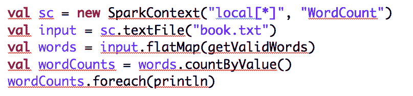
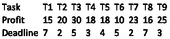
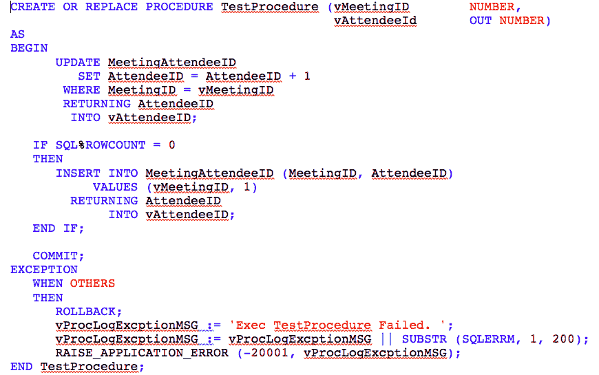

# 思科 2019 校园招聘笔试（软件类）

## 1

What is ACID in a database? （多选）

正确答案: A C E F   你的答案: 空 (错误)

```cpp
Atomicity
```

```cpp
Available
```

```cpp
Consistency
```

```cpp
Immutability
```

```cpp
Isolation
```

```cpp
Durability
```

本题知识点

Java 工程师 C++工程师 思科 2019

## 2

What’s Data CAP? （多选）

正确答案: B D E   你的答案: 空 (错误)

```cpp
Continuity
```

```cpp
Consistency
```

```cpp
Atomicity
```

```cpp
Available
```

```cpp
Partition
```

```cpp
Persistence
```

本题知识点

Java 工程师 C++工程师 思科 2019

## 3

Which languages below are natively supported by Spark framework for data process? （多选）

正确答案: A D F   你的答案: 空 (错误)

```cpp
Scala
```

```cpp
NodeJS
```

```cpp
Perl
```

```cpp
Python
```

```cpp
C++
```

```cpp
Java
```

本题知识点

Java 工程师 C++工程师 思科 2019

## 4

Which algorithms below belong to supervised algorithm？（多选）

正确答案: A B E F   你的答案: 空 (错误)

```cpp
Linear regression
```

```cpp
Logic regression
```

```cpp
K-Means
```

```cpp
Neural network
```

```cpp
SVM
```

```cpp
Decision Tree
```

本题知识点

Java 工程师 C++工程师 思科 2019

讨论

[牛客 414464583 号](https://www.nowcoder.com/profile/414464583)

Neural Network 怎麼就不能做 supervised learning 了？

发表于 2021-09-14 18:59:29

* * *

## 5

Which ones below are essentially considered for big data processing performance? （多选）

正确答案: A B D   你的答案: 空 (错误)

```cpp
Data locality
```

```cpp
Network bandwidth
```

```cpp
CPU power
```

```cpp
Replication factor
```

```cpp
Memory
```

本题知识点

Java 工程师 C++工程师 思科 2019

## 6

(Pseudo code is acceptable) Please provide the function getValidWords, it should be runnable for the flatMap and filter out any words with non-alphabet characters. The basic purpose of this function is used to get the pure word frequency in one text file. (回答中请包含函数代码)

你的答案

本题知识点

Java 工程师 C++工程师 思科 2019

讨论

[求 offer 多多的鲤](https://www.nowcoder.com/profile/9156330)

```cpp
public String[] getValidWords(String[] strs){
    int n = strs.length();
    for(int i=0; i<n; i++) {
         StringBuilder temp = new StringBuilder(strs[i]); 
         for(int j=0; j<temp.length(); ){
             if(temp.charAt(j)>='A'&& temp.charAt(j)<='Z' || temp.charAt(j)>='a'&& temp.charAt(j)<='z') {
                 j++;
              } else {
                  temp.remove(j);
              }
          }
         strs[i] = temp.toString();     }
}
```

发表于 2019-03-26 19:06:30

* * *

## 7

Which one below is not the pipeline control of Flume. （单选）

正确答案: B   你的答案: 空 (错误)

```cpp
Source
```

```cpp
Agent
```

```cpp
Channel
```

```cpp
Sink
```

本题知识点

Java 工程师 C++工程师 思科 2019

## 8

Which one below is not a project of Hadoop ecosystem. (单选)

正确答案: B   你的答案: 空 (错误)

```cpp
HDFS
```

```cpp
ElasticSearch
```

```cpp
HBase
```

```cpp
Yarn
```

本题知识点

Java 工程师 C++工程师 思科 2019

## 9

Which one is not the challenge of distributed systems? （单选）

正确答案: C   你的答案: 空 (错误)

```cpp
Programming complexity
```

```cpp
Finite bandwidth
```

```cpp
Horizon expandability
```

```cpp
Partial failures
```

本题知识点

Java 工程师 C++工程师 思科 2019

## 10

Which case below is not typical Hadoop use case？ (单选)

正确答案: D   你的答案: 空 (错误)

```cpp
Text mining
```

```cpp
Pattern recognition
```

```cpp
Graph data analytics
```

```cpp
Statistical calculation
```

```cpp
Index building
```

本题知识点

Java 工程师 C++工程师 思科 2019

## 11

Which one is not the step of big data processing? (单选)

正确答案: D   你的答案: 空 (错误)

```cpp
Process
```

```cpp
Analyze
```

```cpp
Ingest
```

```cpp
Rotate
```

```cpp
Access
```

本题知识点

Java 工程师 C++工程师 思科 2019

## 12

Which components below Spark framework contains:  (单选)

正确答案: D   你的答案: 空 (错误)

```cpp
Spark SQL
```

```cpp
Spark RDD
```

```cpp
Spark Streaming
```

```cpp
Spark ETL
```

```cpp
GraphX
```

```cpp
MLlib
```

本题知识点

Java 工程师 C++工程师 思科 2019

## 13

Which one below is side-effort function for Map/Reduce process？(单选)

正确答案: B   你的答案: 空 (错误)

```cpp
Max
```

```cpp
Avg
```

```cpp
Count
```

```cpp
Unique count
```

```cpp
Sum
```

本题知识点

Java 工程师 C++工程师 思科 2019

## 14

There is a none-empty binary tree, its pre-order traversal is the reverse order of its post-order traversal, this tree can be: (多选）

正确答案: A B C   你的答案: 空 (错误)

```cpp
A tree whose all nodes have no left child
```

```cpp
A tree whose all nodes have no right child
```

```cpp
A tree with only one leaf node
```

```cpp
A full binary tree
```

本题知识点

Java 工程师 C++工程师 思科 2019

## 15

Which data structure must be used for recursion algorithm? （单选）

正确答案: B   你的答案: 空 (错误)

```cpp
Queue
```

```cpp
Stack
```

```cpp
Vector
```

```cpp
Array
```

本题知识点

Java 工程师 C++工程师 思科 2019

## 16

Given a bucket which can hold 12L water. There are 4 kinds of glass containers whose volume is 1L, 2L, 3L, 4L respectively. How many ways can you fill the bucket with 4 glass containers?（单选）

正确答案: B   你的答案: 空 (错误)

```cpp
973
```

```cpp
1490
```

```cpp
2872
```

```cpp
3536
```

本题知识点

Java 工程师 C++工程师 思科 2019

讨论

[微甜的酸奶](https://www.nowcoder.com/profile/559589168)

青蛙跳台阶变形

```cpp
public class Main {
	public static void main(String[] args) {
		// TODO Auto-generated method stub
		int[] arr = new int[13];
		arr[0] = 1;
		arr[1] = 1;
		arr[2] = 2;
		arr[3] = 4;
		for(int i=4;i<13;i++) {
			arr[i] = arr[i-1]+arr[i-2]+arr[i-3]+arr[i-4];
		}
		System.out.print(arr[12]);
	}
}
```

输出 1490

发表于 2020-09-07 17:47:22

* * *

## 17

What is the time complexity of below code piece?（单选）
    x = 2; 
    while (x < n / 2) x = 2 * x; 

正确答案: A   你的答案: 空 (错误)

```cpp
O(log(n))
```

```cpp
O(n)
```

```cpp
O(nlog(n))
```

```cpp
O(n²)
```

本题知识点

Java 工程师 C++工程师 思科 2019

## 18

Assume hash table length is 100 and hash function is H(k) = k % P, what is the best value for P?（单选）

正确答案: B   你的答案: 空 (错误)

```cpp
99
```

```cpp
97
```

```cpp
93
```

```cpp
91
```

本题知识点

Java 工程师 C++工程师 思科 2019

## 19

Which of the following operations is performed more efficiently by doubly linked list than by linear linked list?（单选）

正确答案: A   你的答案: 空 (错误)

```cpp
Deleting a node whose location is given
```

```cpp
Searching an unsorted list for a given item
```

```cpp
Inserting a node after the node with a given location
```

```cpp
Traversing the list to process each node
```

本题知识点

Java 工程师 C++工程师 思科 2019

## 20

The X, Y and Z are one unit line on the real line. The overlap of X and Y is half a unit. The overlap of Y and Z is also half a unit. Let the overlap of X and Z be k units. Which of the following is true?（单选）

正确答案: D   你的答案: 空 (错误)

```cpp
k must be 1
```

```cpp
k must be 0
```

```cpp
k can take any value between 0 and 1
```

```cpp
None of the above
```

本题知识点

Java 工程师 C++工程师 思科 2019

## 21

Given 9 tasks T1, T2, ...., T9. We can only execute one task at one time unit. Each task Ti has a profit Pi and a deadline Di. Profit Pi is earned if the task is completed before the end of Di.

What is the maximum profit earned?（单选）

正确答案: A   你的答案: 空 (错误)

```cpp
147
```

```cpp
165
```

```cpp
167
```

```cpp
175
```

本题知识点

Java 工程师 C++工程师 思科 2019

## 22

Given below statements:
1.First-in-first out types of computations are efficiently supported by STACKS.
2.Implementing LISTS on linked lists is more efficient than implementing LISTS on an array for almost all the basic LIST operations.
3.Implementing QUEUES on a circular array is more efficient than implementing QUEUES on a linear array with two indices.
4.Last-in-first-out type of computations are efficiently supported by QUEUES.
Which of the following is correct?（单选）

正确答案: A   你的答案: 空 (错误)

```cpp
2 and 3 are true
```

```cpp
1 and 2 are true
```

```cpp
3 and 4 are true
```

```cpp
2 and 4 are true
```

本题知识点

Java 工程师 C++工程师 思科 2019

## 23

The following three are known to be the preorder, inorder and postorder sequences of a binary tree. But it is not known which is which order:
1.MBCAFHPYK
2.KAMCBYPFH
3.MABCKYFPH
Pick the true statement from the following:（单选）

正确答案: D   你的答案: 空 (错误)

```cpp
1 and 2 are preorder and inorder sequences, respectively
```

```cpp
1 and 3 are preorder and postorder sequences, respectively
```

```cpp
2 is the inorder sequence, but nothing more can be said about the other two sequences
```

```cpp
2 and 3 are the preorder and inorder sequences, respectively
```

本题知识点

Java 工程师 C++工程师 思科 2019

## 24

About the Filter and Listener in J2EE Servlet ，Which of the following descriptions is correct: （多选）

正确答案: B C   你的答案: 空 (错误)

```cpp
Filter and Listener are all based on java reflection mechanism
```

```cpp
We can use the filter to implement the user authentication
```

```cpp
We can use the listener to integration with the 3-party framework &amp; plugin in servlet container
```

```cpp
Filter and listener all can be used to do character encoding conversion which from endpoint users
```

本题知识点

Java 工程师 C++工程师 思科 2019

## 25

Which one is thread safe? （多选）

正确答案: A C D   你的答案: 空 (错误)

本题知识点

Java 工程师 C++工程师 思科 2019

## 26

What’s the output of following code? （单选）

class MyCode {
  public static void main (String[] args) { 
    System.out.println(calc(30) % 3);
  }

  private static ArrayList<Long> arr = new ArrayList<Long>();
  static {
    arr.add(1L);
    arr.add(1L);
  }

  private static Long calc(int x) {
    if (arr.size() > x) {
      return arr.get(x);
    }
    Long result = calc(x - 1) + calc(x - 2);
    arr.add(result);
    return result;
  }

}

正确答案: B   你的答案: 空 (错误)

```cpp
0
```

```cpp
1
```

```cpp
2
```

```cpp
Throws exception
```

本题知识点

Java 工程师 C++工程师 思科 2019

## 27

What’s the output of following code?（单选）

class A {
  public void one() { System.out.println("one"); }
  private void two() { System.out.println("two"); }
  static void three() { System.out.println("three"); }
  protected void four() { System.out.println("four"); }
  public void test() {
    this.one();
    this.two();
    this.three();
    this.four();
  }
}

class B extends A {
  public void one() { System.out.println("Bone"); }
  private void two() { System.out.println("Btwo"); }
  static void three() { System.out.println("Bthree"); }
  protected void four() { System.out.println("Bfour"); } 
}

public class Test {
  public static void main (String[] args) {
    B b = new B();
    b.test();
    b.three();
  }
}

正确答案: C   你的答案: 空 (错误)

```cpp
Bone  Btwo  Bthree  Bfour  Bthree
```

```cpp
Bone  Btwo  three   Bfour  Bthree
```

```cpp
Bone  two   three   Bfour  Bthree
```

```cpp
Bone  two   Bthree  Bfour  Bthree
```

```cpp
Bone two Bthree four three
```

```cpp
Bone two three four three
```

```cpp
Throws exception
```

本题知识点

Java 工程师 C++工程师 思科 2019

## 28

Which of the following is not a keyword in java？（单选）

正确答案: B   你的答案: 空 (错误)

```cpp
static
```

```cpp
bool
```

```cpp
void
```

```cpp
private
```

```cpp
instanceof
```

```cpp
goto
```

本题知识点

Java 工程师 C++工程师 思科 2019

## 29

What is static block?（单选）

正确答案: C   你的答案: 空 (错误)

```cpp
It is used to create syncronized code.
```

```cpp
There is no such block.
```

```cpp
It is used to initialize the static data member. It is executed before main method at the time of class loading.
```

```cpp
None of the above.
```

本题知识点

Java 工程师 C++工程师 思科 2019

## 30

Given the following code fragment,  which of the following expressions is always true:（单选）

public class Test {
    public static void main(String[] args) {
        double i1 = 1024D * 1024 * 1024 * 1024;
        double i2 = 1024L * 1024 * 1024 * 1024;
        double i3 = (long) 1024 * 1024 * 1024 * 1024;
        double i4 = (double) 1024 * 1024 * 1024 * 1024;
        double i5 = 1024 * 1024 * 1024 * 1024;
        System.out.println(i1);
        System.out.println(i2);
        System.out.println(i3);
        System.out.println(i4);
        System.out.println(i5);
    }
}

正确答案: E   你的答案: 空 (错误)

```cpp
The first line printed not as expected
```

```cpp
The second line printed not as expected
```

```cpp
The third line printed not as expected
```

```cpp
The fourth line printed not as expected
```

```cpp
The fifth line printed not as expected
```

本题知识点

Java 工程师 C++工程师 思科 2019

## 31

What will be the output when executing this main? （单选）

public class Test {
    public static void swapStrings(String x, String y) {
        String temp = x;
        x = y;
        y = temp;
    }

    public static void main(String[] args) {
        String a = "1";
        String b = "2";
        swapStrings(a, b);
        System.out.println("a=" + a + " ,b=" + b);
    }
}

正确答案: C   你的答案: 空 (错误)

```cpp
An exception will be thrown
```

```cpp
“a=2 ,b=1”
```

```cpp
“a=1 ,b=2”
```

本题知识点

Java 工程师 C++工程师 思科 2019

## 32

Following code will result in（单选）

class A {
    int b = 1;

    public static void main(String[] args) {
        System.out.println("b is " + b);
    }
}

正确答案: A   你的答案: 空 (错误)

```cpp
Compilation error
```

```cpp
Runtime Error
```

```cpp
Runtime Exception
```

```cpp
b is 1
```

本题知识点

Java 工程师 C++工程师 思科 2019

## 33

Following code will result in（单选）

public class Test {

    public static void main(String[] args) {
        System.out.println(getResult());
    }

    public static int getResult() {
        try {
            try {
                throw new RuntimeException("exception");
            } catch (RuntimeException re) {

            }
            return 1;
        } catch (Exception e) {
            return 2;
        } finally {
            return 3;
        }
    }
}

正确答案: D   你的答案: 空 (错误)

```cpp
Runtime Error
```

```cpp
1
```

```cpp
2
```

```cpp
3
```

本题知识点

Java 工程师 C++工程师 思科 2019

## 34

What does UDP and TCP have in common? （多选）

正确答案: C D   你的答案: 空 (错误)

```cpp
flow control
```

```cpp
error checking
```

```cpp
checksum
```

```cpp
provide destination and source port numbers
```

本题知识点

Java 工程师 C++工程师 思科 2019

## 35

TCP uses a retransmission timer to ensure data delivery in the absence of any feedback from the remote data receiver. The retransmission timeout is referred to as RTO. Which of following statements about RTO is true?（多选）

正确答案: A B C   你的答案: 空 (错误)

```cpp
The calculation of RTO is related to RTT
```

```cpp
RTOs can be caused by Duplex mismatch on the switch
```

```cpp
RTOs can be caused by Driver issues
```

```cpp
None of the above.
```

本题知识点

Java 工程师 C++工程师 思科 2019

## 36

What field(s) are changed by the router when one ip packet passes through it?（多选）

正确答案: A C   你的答案: 空 (错误)

```cpp
source mac address
```

```cpp
source ip address
```

```cpp
destination mac address
```

```cpp
destination ip address
```

```cpp
none of above
```

本题知识点

Java 工程师 C++工程师 思科 2019

## 37

Which of the following hosts are in the same subnet on which the IP address 192.168.168.188 255.255.255.192 resides?（多选）

正确答案: B C D   你的答案: 空 (错误)

```cpp
192.168.168.96
```

```cpp
192.168.168.129
```

```cpp
192.168.168.154
```

```cpp
192.168.168.180
```

```cpp
192.168.168.191
```

本题知识点

Java 工程师 C++工程师 思科 2019

## 38

Which of the following is not part of the data link layer?（单选）

正确答案: E   你的答案: 空 (错误)

```cpp
Transports data across the physical link
```

```cpp
Performs physical addressing
```

```cpp
Performs flow control
```

```cpp
Determines network topology
```

```cpp
Terminates a session
```

本题知识点

Java 工程师 C++工程师 思科 2019

## 39

Which of the following socket API converts an unconnected active TCP socket into a passive socket?（单选）

正确答案: A   你的答案: 空 (错误)

```cpp
listen
```

```cpp
bind
```

```cpp
accept
```

```cpp
connect
```

本题知识点

Java 工程师 C++工程师 思科 2019

## 40

Which description correctly describes a MAC address flooding attack?（单选）

正确答案: E   你的答案: 空 (错误)

```cpp
The attacking device crafts ARP replies intended for valid hosts. The MAC address of the attacking device then becomes the destination address found in the Layer 2 frames sent by the valid network device.
```

```cpp
The attacking device crafts ARP replies intended for valid hosts. The MAC address of the attacking device then becomes the source address found in the Layer 2 frames sent by the valid network device.
```

```cpp
The attacking device spoofs a destination MAC address of a valid host currently in the mac-address table. The switch then forwards frames destined for the valid host to the attacking device.
```

```cpp
The attacking device spoofs a source MAC address of a valid host currently in the mac-address table. The switch then forwards frames destined for the valid host to the attacking device.
```

```cpp
Frames with unique, invalid source MAC addresses flood the switch and exhaust mac-address table space. The result is that new entries cannot be inserted because of the exhausted mac-address table space, and traffic is subsequently flooded out all ports.
```

本题知识点

Java 工程师 C++工程师 思科 2019

## 41

What field(s) are changed by the layer2 switch  when one ip packet passes through it?（单选）

正确答案: E   你的答案: 空 (错误)

```cpp
source mac address
```

```cpp
source ip address
```

```cpp
destination mac address
```

```cpp
destination ip address
```

```cpp
none of above
```

本题知识点

Java 工程师 C++工程师 思科 2019

## 42

What is the purpose of Spanning Tree Protocol in a switched LAN?（单选）

正确答案: C   你的答案: 空 (错误)

```cpp
To provide a mechanism for network monitoring in switched environments
```

```cpp
To prevent routing loops in networks with redundant paths
```

```cpp
To prevent switching loops in networks with redundant switched paths
```

```cpp
To manage the VLAN database across multiple switches
```

```cpp
To create collision domains
```

本题知识点

Java 工程师 C++工程师 思科 2019

## 43

How long is an IPv6 address?（单选）

正确答案: D   你的答案: 空 (错误)

```cpp
32 bits
```

```cpp
128 bytes
```

```cpp
64 bits
```

```cpp
128 bits
```

本题知识点

Java 工程师 C++工程师 思科 2019

## 44

What are the differences between paging and segmentation ?（多选）

正确答案: B C   你的答案: 空 (错误)

```cpp
A page and segmentation are visible to the user's program
```

```cpp
A page is a physical unit of information,and the segment is a logical unit of information.
```

```cpp
The page size is determined by the machine architecture, the segment size is determined by the user.
```

```cpp
A segment is of fixed size, a page is of varying size.
```

本题知识点

Java 工程师 C++工程师 思科 2019

## 45

Which following approaches are used for IPC?（多选）

正确答案: A B C D   你的答案: 空 (错误)

```cpp
Socket
```

```cpp
Pipe
```

```cpp
File
```

```cpp
Signal
```

本题知识点

Java 工程师 C++工程师 思科 2019

## 46

What are the differences between multiprocessing and multiprogramming ?（多选）

正确答案: A C D   你的答案: 空 (错误)

```cpp
Multiprocessing utilizes multiple CPUs,<br>multiprogramming utilizes single CPU.
```

```cpp
Multiprocessing is less<br>efficient than multiprogramming.
```

```cpp
Multiprocessing is more expensive<br>than multiprogramming.
```

```cpp
Multiprocessing refers to processing<br>of multiple processes at same time by multiple CPUs.Multiprogramming keeps several programs in main memory at the same time and execute them concurrently utilizing single CPU
```

本题知识点

Java 工程师 C++工程师 思科 2019

## 47

Which of the following statments are correct for fork() ?（多选）

正确答案: B C   你的答案: 空 (错误)

```cpp
If the call to fork() is successful, it returns process ID of the parent process to the newly created child process and a zero to the parent process.
```

```cpp
If the call to fork() is successful, both processes will start their execution at the next statement following the fork() call.
```

```cpp
If the call to fork() is not successful, it returns a negative value to the parent process.
```

```cpp
If the call to fork() is successful, the child process a copy of the address space of the parent process therefor it also inherits the threads of parent process.
```

本题知识点

Java 工程师 C++工程师 思科 2019

## 48

Which system call returns the process identifier of a terminated child?（单选）

正确答案: A   你的答案: 空 (错误)

```cpp
wait
```

```cpp
exit
```

```cpp
fork
```

```cpp
get
```

本题知识点

Java 工程师 C++工程师 思科 2019

## 49

RAID 1 is__?（单选）

正确答案: A   你的答案: 空 (错误)

```cpp
Disk mirroring
```

```cpp
Disk striping
```

```cpp
Disk ghosting
```

```cpp
Disk protecting
```

本题知识点

Java 工程师 C++工程师 思科 2019

## 50

To let a client have random access to a media stream:（单选）

正确答案: B   你的答案: 空 (错误)

```cpp
The server must support download
```

```cpp
The protocol used must not<br>be stateless
```

```cpp
The stream should give access rights to the client
```

```cpp
All of the mentioned
```

本题知识点

Java 工程师 C++工程师 思科 2019

## 51

A process is waked by V operation and which state is it now？（单选）

正确答案: C   你的答案: 空 (错误)

```cpp
Blocked
```

```cpp
Waked
```

```cpp
Ready
```

```cpp
Running
```

本题知识点

Java 工程师 C++工程师 思科 2019

## 52

Calculate number of times hello is printed.（单选）
#include  <stdio.h>
#include  <sys/types.h>
int main()
{
    fork();
    fork();
    fork();
    printf("hello\n");
    return 0;
}

正确答案: D   你的答案: 空 (错误)

```cpp
1
```

```cpp
3
```

```cpp
6
```

```cpp
8
```

本题知识点

Java 工程师 C++工程师 思科 2019

## 53

What is networked virtual memory?（单选）

正确答案: A   你的答案: 空 (错误)

```cpp
Caching
```

```cpp
Segmentation
```

```cpp
RAM disk
```

```cpp
None of the mentioned
```

本题知识点

Java 工程师 C++工程师 思科 2019

## 54

Table A has 10,000 Records and Table B has 100,000 Records, what’s the correct description for below SQL? (单选)SELECT A.COL1, B.COL2 FROM A, B

正确答案: D   你的答案: 空 (错误)

```cpp
Get 10,000 Records
```

```cpp
Get  100,000 Records
```

```cpp
Get  10,000,000 Records
```

```cpp
Get  1,000,000,000 Records
```

本题知识点

Java 工程师 C++工程师 思科 2019

## 55

Table A have columns (userID , email) and Table B have columns(UID, email), what’s the correct description for below SQL? (单选)Select email from A, B where userID=UID

正确答案: D   你的答案: 空 (错误)

```cpp
Get Table A’s email data
```

```cpp
Get Table B’s email data
```

```cpp
Get Table A and B’s email data
```

```cpp
Has Error when executes this SQL
```

本题知识点

Java 工程师 C++工程师 思科 2019

## 56

Which database is not considered as RDBMS?  (单选)

正确答案: D   你的答案: 空 (错误)

```cpp
Oracle
```

```cpp
DB2
```

```cpp
PostgreSQL
```

```cpp
Cassandra
```

本题知识点

Java 工程师 C++工程师 思科 2019

## 57

What’s NULL value in Database? (单选)

正确答案: C   你的答案: 空 (错误)

```cpp
Zero
```

```cpp
Blank
```

```cpp
Unknown
```

```cpp
'N/A'
```

本题知识点

Java 工程师 C++工程师 思科 2019

## 58

What’s correct description for Primary Key and Unique Key? (单选)

正确答案: D   你的答案: 空 (错误)

```cpp
PK and UK should be Unique
```

```cpp
PK and UK should be Not Null values
```

```cpp
PK and UK should be Null value
```

```cpp
PK should be Not Null values and UK can be Null values
```

本题知识点

Java 工程师 C++工程师 思科 2019

## 59

What is wrong description for Delete and Truncate Statements? (单选)

正确答案: A   你的答案: 空 (错误)

```cpp
Delete is DDL Command and Truncate is DML Command
```

```cpp
Delete can rollback after using delete statement, but Truncate can’t
```

```cpp
Delete is slower than truncate statement
```

```cpp
Delete need to write data into redo/undo, but Truncate can’t
```

本题知识点

Java 工程师 C++工程师 思科 2019

## 60

There is one table MeetingAttendeeID with Primary key (MeetingID, AttendeeID) and also use below procedure (Oracle PL/SQL) to do something.
What’s correct description for this procedure purpose? (单选)

正确答案: C   你的答案: 空 (错误)

```cpp
Create Meeting Attendee ID
```

```cpp
Create Meeting Attendee ID and Block Concurrence
```

```cpp
Create Meeting Attendee ID, Block Concurrence and output meeting Attendee ID
```

```cpp
Create Meeting Attendee ID, Block Concurrence and Solve meeting Attendee ID Confliction
```

本题知识点

Java 工程师 C++工程师 思科 2019

## 61

Someone said there is one bug in this procedure (TestProcedure), what’s correct description for this procedure? (单选)

正确答案: A   你的答案: 空 (错误)

```cpp
This procedure is wrong and doesn’t capture data duplicated Error when Insert
```

```cpp
This procedure is wrong and doesn’t capture no data found Error when update
```

```cpp
This procedure is wrong and doesn’t support “returning” keyword
```

```cpp
This procedure is correct and never has logic Error
```

本题知识点

Java 工程师 C++工程师 思科 2019

## 62

If a call stack is used to invoke a function, what are typically pushed on the stack? （多选）

正确答案: B C D   你的答案: 空 (错误)

```cpp
Static variables
```

```cpp
Return address
```

```cpp
Base points
```

```cpp
Arguments
```

本题知识点

Java 工程师 C++工程师 思科 2019

## 63

Which of the following can’t be used in memset?（多选）

正确答案: A D   你的答案: 空 (错误)

```cpp
struct Parameters {
int x;
std::string str_x;
};
```

```cpp
struct Parameters {
int x;
int* p_x;
};
```

```cpp
struct Parameters {
int x;
int a_x[10];
};
```

```cpp
class BaseParameters{
public:
virtual void reset() {}
};
class Parameters : public BaseParameters{
public:
int x;
};
```

本题知识点

Java 工程师 C++工程师 思科 2019 C++

讨论

[牛客 419993312 号](https://www.nowcoder.com/profile/419993312)

解析来了，A 选项 string 对象中分配的堆内存，保存在 string 成员变量中，被 memset 后，该部分内存无法释放； D 选项，类对象中有 vptr 指针，用 memset 会连 vptr 指针的值也清除。

发表于 2020-09-15 18:55:45

* * *

[佚](https://www.nowcoder.com/profile/822631024)

这道题目不是特别严谨.如果将 memset 作用的时机限制在所有结构体定义之前,那么都没问题.如果是将 memset 作用的时机限制在所有结构体定义之后,B 选项的 int* p 在指向动态内存时,也无法安全使用 memset,否则内存泄漏

发表于 2021-02-23 18:42:52

* * *

[Warwolf_Jacob](https://www.nowcoder.com/profile/40159364)

完全看不明白，这一星的题好难啊，求官方解析

发表于 2020-08-09 11:10:24

* * *

## 64

What’s the runtime behavior of below code piece?（单选）

int *p = (int *)malloc(sizeof(int));
p = NULL;
free(p);

正确答案: B   你的答案: 空 (错误)

```cpp
Compiling error: free can't be applied on NULL pointer
```

```cpp
Memory leak happens
```

```cpp
Dangling pointer is generated
```

```cpp
May crash when free() is called with NULL input
```

本题知识点

Java 工程师 C++工程师 思科 2019 C++

讨论

[牛客 haha](https://www.nowcoder.com/profile/723132910)

好棒

发表于 2021-11-15 12:57:51

* * *

[Offerrrrrer](https://www.nowcoder.com/profile/329799374)

个人理解：int *p = (int *)malloc(sizeof(int)); // p 指向申请到的内存
p = NULL; //p 指向 NULL，之前指向的内存就无法释放了；内存泄漏
free(p);

发表于 2020-09-01 20:33:10

* * *

[🏄原来我也可以✨](https://www.nowcoder.com/profile/5163296)

应该先进行 free(p),然后 P=Null,防止野指针

发表于 2020-12-09 10:37:54

* * *

## 65

下面代码在 64 为系统下的输出为（）

```cpp
void print_array(int arr[]) {
    int n = sizeof(arr) / sizeof(arr[0]);
    for (int i = 0; i < n; i++)
        printf("%d ", arr[i]);
}

int main() {
    int arr[] = {1, 2, 3, 4, 5};
    print_array(arr);
    return 0;
}
```

正确答案: B   你的答案: 空 (错误)

```cpp
1
```

```cpp
1 2
```

```cpp
1 2 3 4 5
```

```cpp
Run time error
```

本题知识点

C++工程师 思科 2019 C 语言

讨论

[徐振杰](https://www.nowcoder.com/profile/2495102)

因为 arr 是指针，在 64bit 的机器中是 8 字节所以 n=8/4=2 所以循环执行两次

发表于 2019-03-01 19:18:56

* * *

[牛客 506299977 号](https://www.nowcoder.com/profile/506299977)

数组作为函数形参退化为指针

发表于 2020-10-29 10:45:48

* * *

[牛壮壮](https://www.nowcoder.com/profile/764544521)

因为 arr 是指针，在 64bit 的机器中是 8 字节所以 n=8/4=2 所以循环执行两次

发表于 2021-11-11 09:40:19

* * *

## 66

下面代码的输出为（）

```cpp
#include<iostream>
using namespace std;
typedef void(*FunPtr)(int);
int sum(int = 10, int = 20);
void output(int);
int main(){
    FunPtr ptr = output;
    (*ptr)(30);
    return 0;
}
int sum(int x, int y){
    return(x + y % 20);
}
void output(int x){
    cout<< sum(x) << endl;
} 
```

正确答案: B   你的答案: 空 (错误)

```cpp
20
```

```cpp
30
```

```cpp
31
```

```cpp
40
```

本题知识点

C++工程师 思科 2019 C++ C 语言

讨论

[东哥想找个工作](https://www.nowcoder.com/profile/991068029)

FunPtr ptr = output; 定义一个函数指针，指向 output 函数 (*ptr)(30);  给被指向的函数传入 30 的实参 output(30)cout<< sum(30) << endl;   output 函数内容 int sum(int = 10, int = 20);  sum 函数的声明，默认第一个形参 10 第二个 20sum(30)  修改第一个形参为 30   sum(30) ---->sum(30,20) 

发表于 2021-09-10 12:32:27

* * *

[牛客 42084677 号](https://www.nowcoder.com/profile/42084677)

我太牛了，每次正确率 40，非常稳定

发表于 2022-02-28 00:09:05

* * *

[牛客 75392597 号](https://www.nowcoder.com/profile/75392597)

 FunPtr ptr = output 定义了一个函数指针，指针 ptr 指向 output 函数 (*ptr)(30)相当于 output(30)再调用 sum 函数，sum(30),sum 函数中 x=30,y=20

发表于 2020-09-01 16:05:45

* * *

## 67

下面代码的循环次数为（）

```cpp
unsigned char limit = 150;
for (unsigned char i = 0; i < 2 * limit; ++i) {
    //in loop do something
}
```

正确答案: D   你的答案: 空 (错误)

```cpp
300
```

```cpp
299
```

```cpp
301
```

```cpp
无限循环
```

本题知识点

C++工程师 思科 2019 C 语言

讨论

[编程小白橘子泡啤酒](https://www.nowcoder.com/profile/473052943)

unsigned char 在 32 位机的存储范围是 0~255

发表于 2020-08-22 11:23:44

* * *

[牛客 410501501 号](https://www.nowcoder.com/profile/410501501)

char 类型占据一个字节，8 位，2⁸ 所以能表示 256 个数据，而 unsigin char 表示没有符号位，所以能表示的数据范围位 0~255，在这种前提下，所以选 D

编辑于 2021-08-26 09:51:12

* * *

[yxiaoa](https://www.nowcoder.com/profile/949696043)

坑爹的类型~~

发表于 2020-08-21 09:11:51

* * *

## 68

下面声明正确的是（）

正确答案: B D   你的答案: 空 (错误)

```cpp
int a[5] = {0, 1, 2, 3, 4, 5};
```

```cpp
char a[] = {0, 1, 2, 3, 4, 5};
```

```cpp
char a = {'A', 'B', 'C'};
```

```cpp
int a[5] = {0123};
```

本题知识点

C++工程师 思科 2019 C++ C 语言

讨论

[牛客 648018689 号](https://www.nowcoder.com/profile/648018689)

B 字符变量赋值为数字，代表字符的 ASSIC 码值，如 char a = 65;  等价于 char a = ‘A’；

发表于 2021-02-27 22:25:06

* * *

[AlbertNie](https://www.nowcoder.com/profile/397498947)

选项 D: int a[5] = {0123}; 0123 是八进制表示法，即 83，后面 4 个数默认初始化为 0。

```cpp
int a[5] = {83,0,0,0,0};
```

并不是某些人回答的，等价于 int a[5] = "0123";😏

发表于 2022-01-09 10:27:34

* * *

[Despacito007](https://www.nowcoder.com/profile/893487814)

D 选项 quot；代表引号 ”

即把字符串”0123”赋给一个数组

发表于 2020-08-24 16:54:06

* * *

## 69

下面代码在 32 位机器上的输出为（）

```cpp
char *str1 = "hello";
short * p1;
int      p2[2];

(1)sizeof(str1) = ___
(2)sizeof(p1) = ___
(3)sizeof(p2) = ___ 
```

正确答案: C   你的答案: 空 (错误)

```cpp
(1)6  (2)4  (3)8
```

```cpp
(1)6  (2)2  (3)4
```

```cpp
(1)4  (2)4  (3)8
```

```cpp
(1)5  (2)2  (3)4
```

本题知识点

C++工程师 思科 2019 C++ C 语言

讨论

[DFM_YA](https://www.nowcoder.com/profile/488708073)

在 32 位机中，所有指针的 sizeof 大小都是固定 4 个字节，与指针类型没有关系，所以两个指针的大小都是 4 字节，（3）是数组的大小，这个就和数组的所含类型的元素个数有关了，两个 int 型的大小为 8 字节，所以 C 正确。

发表于 2020-09-16 17:25:41

* * *

[杉杉来啦](https://www.nowcoder.com/profile/243827773)

str1 是一个指向字符串常量的指针，这个 str1 不能看成数组。数组在编译时会预留数组空间的，但是指针不会预留空间。这里就只是指针（指向字符串常量，这个字符串存放在只读数据段，并不会像数组一样给它再分配空间），要是数组的话就可以用 sizeof 求大小了。

发表于 2020-08-24 17:32:53

* * *

[HDong 木东](https://www.nowcoder.com/profile/820983875)

咋提示我是多选题……就是选了半天没选出来

发表于 2022-02-11 15:18:00

* * *

## 70

下面代码段的输出为（）

```cpp
#include "stdio.h"
class A {
public:
    A() {
        printf("1");
    }
    A(A &a) {
        printf("2");
    }
    A &operator=(const A &a) {
        printf("3");
        return *this;
    }
};
int main()
{
    A a;
    A b = a;
}
```

正确答案: D   你的答案: 空 (错误)

```cpp
3
```

```cpp
5
```

```cpp
6
```

```cpp
12
```

本题知识点

C++工程师 思科 2019 C 语言

讨论

[牛客 74080857 号](https://www.nowcoder.com/profile/74080857)

？？？？？？？？？

发表于 2020-09-09 00:32:28

* * *

[hwzub](https://www.nowcoder.com/profile/435703816)

```cpp
A a; // 调用构造函数，打印输出 1
A b = a; // 调用复制构造函数，打印输出 2
```

发表于 2020-10-06 00:04:54

* * *

[杨业 yy](https://www.nowcoder.com/profile/822074269)

A a;   //打印 1A b=a；//打印 2 如果是 A a;A b;b=a;应该打印 113 吧

发表于 2020-09-19 15:23:50

* * *

## 71

What’s the output of below code on a 64-bit system?（单选）

```cpp
#include <iostream>
using namespace std;

struct data {
int type;

struct {
    unsigned int a:1;
    unsigned int b:1;
    unsigned int c:4;
    unsigned int d:4;
    unsigned int e:4;
    unsigned int f:4;
    unsigned int g:4;
    unsigned int h:8;
    unsigned int i:8;
} flags;

struct {
    unsigned int a:1;
    unsigned int b:1;
} flagsEx;
};

int main() {
    data temp;
    int a = sizeof(data);
    int b = sizeof(temp);

    data *pTemp = new data();
    int c = sizeof(pTemp);
    delete pTemp;
    pTemp = NULL;

    cout << a << ", " << b << ", " << c << endl;

    return 0;
}
```

正确答案: A   你的答案: 空 (错误)

```cpp
16, 16, 8
```

```cpp
48, 48, 8
```

```cpp
48, 16, 8
```

```cpp
16, 4, 4
```

本题知识点

C++工程师 思科 2019 C++

讨论

[精通各种语言的 helloworld](https://www.nowcoder.com/profile/815556752)

 unsigned int a:1;不是给 a 赋初值，在内存中存取数据的最小单位一般是字节，但有时存储一个数据不必用一个字节。这是一种位域的结构体,这个结构里 a 占用的是一个字节中的 1 位,b 也占用 1 位.所以这里的 a 和 b 的取值只能是 0 和 1。因为它们都是用 1 位来表示的。使用位域可以节省很多的内存空间。并且存储器会按照其定义类型预留存储 bit 位空间，即 struct {       unsigned int a:1;
       unsigned int b:1;
       unsigned int c:4;
       unsigned int d:4;
       unsigned int e:4;
       unsigned int f:4;
       unsigned int g:4;
       unsigned int h:8;
       unsigned int i:8;
   } flags;
共占用 38 个 bit，但一个 unsigned int 占四个字节共 32 个 bit，多出的 6 个 bit 占四个字节，多出来的是预留空间；同理   struct {
       unsigned int a:1;
       unsigned int b:1;
   } flagsEx;也占四个字节；sizeof 针对类型，a,b 输出的都是 struct data 的大小，所以 a=b=4+8+4=16；c 输出的是指针的大小，所以 c=64/8=8;/**********************************************************************/关于预留空间的补充：预留空间是针对最大 bit 类型的，如仅改变 flagsExstruct {
       unsigned char a:1;
       unsigned int b:1;
   } flagsEx; flagsEx 任然占用 4 个字节；a,b,c 结果不变
仅改变 flagsExstruct {
       unsigned long a:1;
       unsigned int b:1;
   } flagsEx;  则 flagsEx 占用 8 个字节；但会改变 flags 和 int type 的最小占用单位变为 8 个字节，结果 a=b=24；但是 sizeof(type)任然等于 4;仅将 int type 改为 long type 结果结果 a=b=24；但是 sizeof(flagsEx)任然等于 4;也就是说 flagsEx 、flags、type 中最大类型决定了 data 最小存储单位，存储位数不够则增加一个最小存储单位； 编辑于 2020-10-05 11:00:11

* * *

[徐振杰](https://www.nowcoder.com/profile/2495102)

type 是 int 类型 4 个字节 a:1 是位域，可以理解为占 1 个 bit。那么第一个 struct 一共是 38bit，32 个 bit 是 4 字节，所以 38 是 8 字节。同理第二个 struct 是 4 个字节。所以 a，b 为 16 字节而 c 是在 64bit 的系统中的，所以指针大小为 8 字节

发表于 2019-03-01 19:15:02

* * *