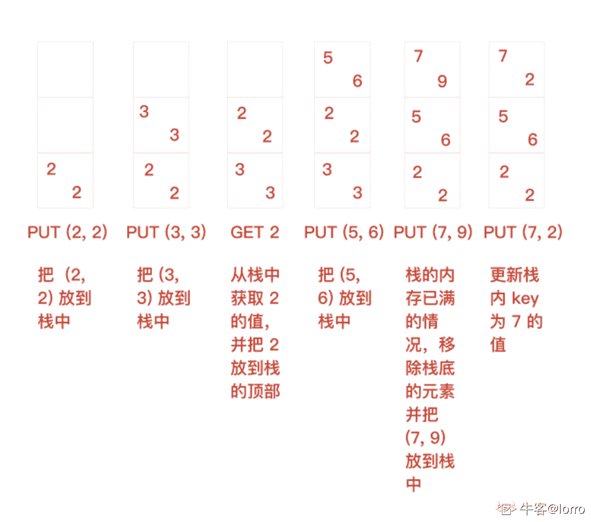
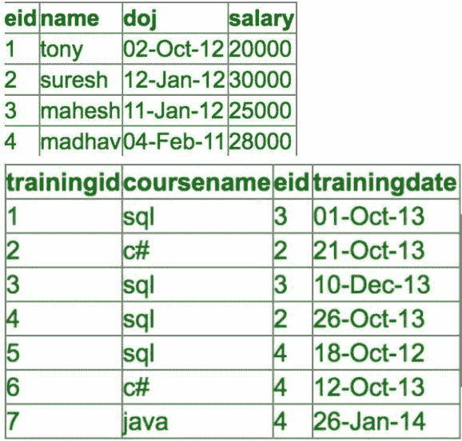
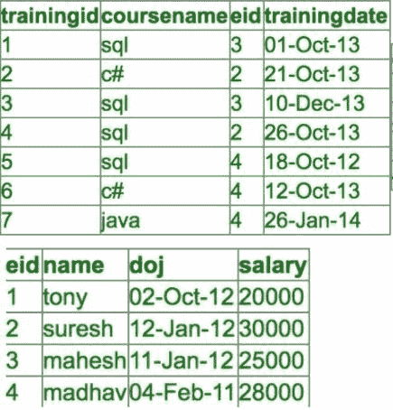
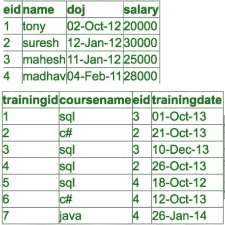
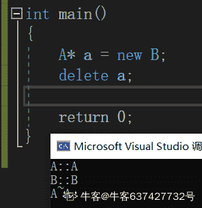
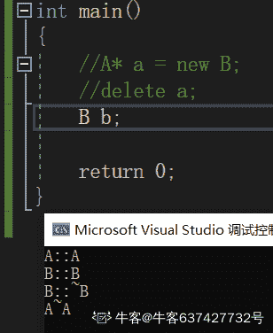
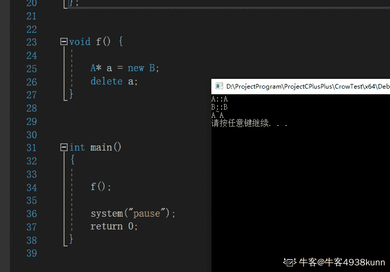

# 思科 2018 校园招聘笔试（软件类）A 卷

## 1

知识点：操作系统 1/10（单选/必答）
A process stack doesn’t contain:

正确答案: D   你的答案: 空 (错误)

```cpp
local variables
```

```cpp
function parameters
```

```cpp
return addresses
```

```cpp
PID of child process
```

本题知识点

Java 工程师 C++工程师 思科 2018

## 2

知识点：操作系统 2/10（单选/必答）
The number of processes completed per unit time is known as

正确答案: C   你的答案: 空 (错误)

```cpp
Output
```

```cpp
Efficiency
```

```cpp
Throughput
```

```cpp
Capacity
```

本题知识点

Java 工程师 C++工程师 思科 2018

讨论

[蒙面许大侠](https://www.nowcoder.com/profile/808852930)

Througput 吞吐率

发表于 2018-12-28 21:25:01

* * *

## 3

知识点：操作系统 3/10（单选/必答）
Which facility dynamically adds probes to a running system, both in user processes and in the kernel?

正确答案: A   你的答案: 空 (错误)

```cpp
Dtrace
```

```cpp
Dlocate
```

```cpp
Dmap
```

```cpp
Dadd
```

本题知识点

Java 工程师 C++工程师 思科 2018

## 4

知识点：操作系统 4/10（多选/必答）
A deadlock can be broken by:

正确答案: A D   你的答案: 空 (错误)

```cpp
abort one or more processes to break the circular wait
```

```cpp
abort all the process in the system
```

```cpp
preempt all resources from all processes
```

```cpp
to preempt some resources from one or more of the deadlocked processes
```

本题知识点

Java 工程师 C++工程师 思科 2018

## 5

知识点：操作系统 5/10（多选/必答）
The following three conditions must be satisfied to solve the critical section problem :

正确答案: B D E   你的答案: 空 (错误)

```cpp
Aging
```

```cpp
Mutual Exclusion
```

```cpp
Deadlock
```

```cpp
Progress
```

```cpp
Bounded Waiting
```

本题知识点

Java 工程师 C++工程师 思科 2018

## 6

知识点：操作系统 6/10（多选/必答）
The process to be aborted is chosen on the basis of the following factors:

正确答案: A B C D E F   你的答案: 空 (错误)

```cpp
priority of the process
```

```cpp
process is interactive or batch
```

```cpp
how long the process has computed
```

```cpp
how much more long before its completion
```

```cpp
how many more resources the process needs before its completion
```

```cpp
how many and what type of resources the process has used
```

```cpp
how many resources are available in the system
```

本题知识点

Java 工程师 C++工程师 思科 2018

## 7

知识点：操作系统 7/10（多选/必答）
The ways in which a process responds to a signal are:

正确答案: A B C   你的答案: 空 (错误)

```cpp
ignoring the signal
```

```cpp
handling the signal
```

```cpp
performing some default action
```

```cpp
asking the user to handle the signal
```

```cpp
All of these
```

本题知识点

Java 工程师 C++工程师 思科 2018

## 8

知识点：操作系统 8/10（多选/必答）
DMA is used for:

正确答案: A C   你的答案: 空 (错误)

```cpp
high speed devices
```

```cpp
low speed devices
```

```cpp
saving CPU cycles
```

```cpp
utilizing CPU cycles
```

本题知识点

Java 工程师 C++工程师 思科 2018

讨论

[lorro](https://www.nowcoder.com/profile/621884569)

direct memory access 直接存储器访问 DMA 的出现就是为了解决批量数据的输入/输出问题。DMA 是指外部设备不通过 CPU 而直接与系统内存交换数据的接口技术。这样数据的传送速度就取决于存储器和外设的工作速度。

发表于 2021-09-16 17:28:56

* * *

## 9

知识点：操作系统 9/10（多选/必答）
In the stack implementation of the LRU (Least Recently Used) algorithm, a stack can be maintained in a manner:

正确答案: A B   你的答案: 空 (错误)

```cpp
whenever a page is used, it is removed from the stack and put on top
```

```cpp
the bottom of the stack is the LRU page
```

```cpp
the top of the stack contains the LRU page and all new pages are added to the top
```

```cpp
None of the mentioned
```

本题知识点

Java 工程师 C++工程师 思科 2018

讨论

[lorro](https://www.nowcoder.com/profile/621884569)

最近最久未使用算法（LRU）

发表于 2021-09-16 17:31:59

* * *

## 10

知识点：操作系统 10/10（多选/必答）
Which of the following(s) are TRUE?

正确答案: A B C   你的答案: 空 (错误)

```cpp
Context switch time is longer for kernel level threads than for user level threads
```

```cpp
User level threads do not need any hardware support
```

```cpp
Related kernel level threads can be scheduled on different processors in a multiprocessor system
```

```cpp
Blocking one kernel level thread blocks all other related threads
```

本题知识点

Java 工程师 C++工程师 思科 2018

讨论

[牛客 424191926 号](https://www.nowcoder.com/profile/424191926)

A 内核级线程的上下文切换时间比用户级线程的时间长 B 用户级线程不需要任何硬件支持 C 在多处理器系统中，相关的内核级线程可以在不同的处理器上调度 D 阻塞一个内核级线程将阻塞所有其他相关线程  （有道翻译）

发表于 2020-09-05 11:09:22

* * *

## 11

知识点：网络 1/10(单选/必答)
At which layer of the OSI model dose PPP perform?

正确答案: C   你的答案: 空 (错误)

```cpp
3
```

```cpp
4
```

```cpp
2
```

```cpp
5
```

本题知识点

Java 工程师 C++工程师 思科 2018

讨论

[牛客 424191926 号](https://www.nowcoder.com/profile/424191926)

点对点**协议**（Point to Point Protocol，**PPP**）为在点对点连接上传输多**协议**数据包提供了一个标准方法。**PPP** 最初设计是为两个对等节点之间的 IP 流量传输提供一种封装**协议**。在 TCP-IP **协议**集中它是一种用来同步调制连接的数据链路层**协议**（OSI 模式中的第二层），替代了原来非标准的第二层**协议**，即 SLIP。

发表于 2020-09-05 11:13:00

* * *

## 12

知识点：网络 2/10(单选/必答)
You have been asked to come up with a subnet mask that will allow all three web servers to be on the
same minimum network.Which network address and subnet mask meet
this requirement?

正确答案: A   你的答案: 空 (错误)

```cpp
192.168.252.8/29
```

```cpp
192.168.252.8 255.255.255.252
```

```cpp
192.168.252.16 255.255.255.240
```

```cpp
192.168.252.0/30
```

本题知识点

Java 工程师 C++工程师 思科 2018

## 13

知识点：网络 3/10(单选/必答)
Which statement is incorrect to described OSPF and ISIS?

正确答案: B   你的答案: 空 (错误)

```cpp
both are LS protocol
```

```cpp
both are using IP multicast to send update
```

```cpp
both are running SPF
```

```cpp
both have database
```

本题知识点

Java 工程师 C++工程师 思科 2018

## 14

知识点：网络 4/10(单选/必答)
Which statement is true for switch learning MAC address

正确答案: B   你的答案: 空 (错误)

```cpp
switch learning MAC based on destination MAC address
```

```cpp
switch learning MAC based on source MAC address
```

```cpp
switch doesn't learning MAC
```

```cpp
switch learning MAC just in case STP is running
```

本题知识点

Java 工程师 C++工程师 思科 2018

## 15

知识点：网络 5/10(单选/必答)
Which statement is true for ping

正确答案: C   你的答案: 空 (错误)

```cpp
determine the path to the destination
```

```cpp
rely on ICMP TTL expire message to work
```

```cpp
can be used to check the MTU on the path
```

```cpp
using TCP to send ping packet
```

本题知识点

Java 工程师 C++工程师 思科 2018

## 16

知识点：网络 6/10(多选/必答)
In which two formats can the IPv6 address fd15:0db8:0000:0000:0700:0003:400F:572B be written?

正确答案: A D   你的答案: 空 (错误)

```cpp
fd15:0db8:0000:0000:700:3:400F:527B
```

```cpp
fd15:db8:0::700:3:4F:527B
```

```cpp
fd15:0db8::7:3:4F:527B
```

```cpp
fd15:db8::700:3:400F:572B
```

本题知识点

Java 工程师 C++工程师 思科 2018

## 17

知识点：网络 7/10(多选/必答)
What are two benefits of private IPv4 IP addresses?

正确答案: B C   你的答案: 空 (错误)

```cpp
They are routed the same as public IP addresses.
```

```cpp
They are less costly than public IP addresses.
```

```cpp
They can be assigned to devices without Internet connections.
```

```cpp
They eliminate the necessity for NAT policies.
```

本题知识点

Java 工程师 C++工程师 思科 2018

## 18

知识点：网络 8/10(多选/必答)
Which fields will be checked on the router for a IPv4 packet

正确答案: B D E   你的答案: 空 (错误)

```cpp
source ip
```

```cpp
destination ip
```

```cpp
source MAC
```

```cpp
destination MAC
```

```cpp
IP option
```

本题知识点

Java 工程师 C++工程师 思科 2018

## 19

知识点：网络 9/10(多选/必答)
How to avoid looping issue when multiple links exist between 2 switches

正确答案: A C D   你的答案: 空 (错误)

```cpp
Running spanning-tree protocol
```

```cpp
Running routing protocol
```

```cpp
Using layer 3 connection between the switches
```

```cpp
using bundle to combine the multiple links
```

本题知识点

Java 工程师 C++工程师 思科 2018

## 20

知识点：网络 10/10(多选/必答)
Which two OSPF LSA types are flooded for the broadcast media

正确答案: A C   你的答案: 空 (错误)

```cpp
Router LSA
```

```cpp
Network Summary LSA
```

```cpp
Network LSA
```

```cpp
ASBR Summary LSA
```

```cpp
Opaque LSA
```

本题知识点

Java 工程师 C++工程师 思科 2018

讨论

[牛客 424191926 号](https://www.nowcoder.com/profile/424191926)

**1****、路由器 LSA （Router LSA）**

由区域内所有路由器产生，并且只能在本个区域内泛洪广播。

这些最基本的 LSA 通告列出了路由器所有的链路和接口，并指明了它们的状态和沿每条链路方向出站的代价。

**2****、网络 LSA （Network LSA）**

由区域内的 DR 或 BDR 路由器产生，报文包括 DR 和 BDR 连接的路由器的链路信息。

网络 LSA 也仅仅在产生这条网络 LSA 的区域内部进行泛洪。

**3****、网络汇总 LSA （Network summary LSA）**

由 ABR 产生，可以通知本区域内的路由器通往区域外的路由信息。

在一个区域外部但是仍然在一个 OSPF 自治系统内部的缺省路由也可以通过这种 LSA 来通告。  

如果一台 ABR 路由器经过骨干区域从其他的 ABR 路由器收到多条网络汇总 LSA，那么这台始发的 ABR 路由器将会选择这些 LSA 通告中代价最低的 LSA，并且将这个 LSA 的最低代价通告给与它相连的非骨干区域。

**4****、ASBR 汇总 LSA （ASBR summary LSA）    **

也是由 ABR 产生，但是它是一条主机路由，指向 ASBR 路由器地址的路由。

**5****、自治系统外部 LSA （Autonomous system external LSA）**

由 ASBR 产生，告诉相同自治区的路由器通往外部自治区的路径。

自治系统外部 LSA 是惟一不和具体的区域相关联的 LSA 通告，将在整个自治系统中进行泛洪。

**组成员 LSA （Group membership LSA）**

目前不支持组播 OSPF （MOSPF 协议）

**7****、NSSA 外部 LSA （NSSA External LSA）**

由 ASBR 产生，几乎和 LSA 5 通告是相同的，但 NSSA 外部 LSA 通告仅仅在始发这个 NSSA 外部 LSA 通告的非纯末梢区域内部进行泛洪。

发表于 2020-09-05 13:07:03

* * *

## 21

知识点：数据结构 1/10（单选/必答）
Assume that a character stream is using Huffman encoding with the following letter frequency table.
a: 40%, b:15%, c:18%, d:22%, r: 5%
What is the bit length of string “abracadabra”?

正确答案: D   你的答案: 空 (错误)

```cpp
20
```

```cpp
22
```

```cpp
24
```

```cpp
26
```

```cpp
28
```

本题知识点

Java 工程师 C++工程师 思科 2018

## 22

知识点：数据结构 2/10（单选/必答）
What is the time complexity of the following function regarding N?
int fib(int N) {
  if (N < 2) {
    return 1;
  }
  return fib(N-1) + fib(N-2);
}

正确答案: E   你的答案: 空 (错误)

```cpp
Constant time.
```

```cpp
Logarithmic time.
```

```cpp
Linear time.
```

```cpp
Polynomial time.
```

```cpp
Exponential time.
```

本题知识点

Java 工程师 C++工程师 思科 2018

## 23

知识点：数据结构 3/10（单选/必答）
Which data structure is used in breadth first search of a graph to hold nodes?

正确答案: B   你的答案: 空 (错误)

```cpp
Stack
```

```cpp
Queue
```

```cpp
Tree
```

```cpp
Array
```

本题知识点

Java 工程师 C++工程师 思科 2018

## 24

知识点：数据结构 4/10（单选/必答）
Given two sorted lists of size m and n respectively. The number of comparisons needed in the worst case by the merge sort algorithm will be?

正确答案: D   你的答案: 空 (错误)

```cpp
m*n
```

```cpp
max(m, n)
```

```cpp
min(m, n)
```

```cpp
m + n - 1
```

本题知识点

Java 工程师 C++工程师 思科 2018

讨论

[心十](https://www.nowcoder.com/profile/410810172)

对于两个已经排好序的 list，最坏的情况是前面所有的数字在进入合并后的数组的时候都要进行比较，只有最大的那个数不需要比较，所以最坏的时间复杂度是 O(m+n-1)

发表于 2019-09-23 11:12:51

* * *

## 25

知识点：数据结构 5/10（多选/必答）
Given a stack with Pop sequence as [E, D, C, B, A], which of the following is a valid Push sequence?

正确答案: A C D   你的答案: 空 (错误)

```cpp
[B, D, E, C, A]
```

```cpp
[A, D, B, C, E]
```

```cpp
[E, C, D, A, B]
```

```cpp
[C, E, D, B, A]
```

本题知识点

Java 工程师 C++工程师 思科 2018

讨论

[心十](https://www.nowcoder.com/profile/410810172)

这题与以往不同的是需要拿选项去验证题干中的 pop 是否合理

发表于 2019-09-23 11:13:37

* * *

## 26

知识点：数据结构 6/10（多选/必答）
Which of the following factors could affect the efficiency of lookup operation in a Hash table?

正确答案: A B C D   你的答案: 空 (错误)

```cpp
Number of entries stored in the hash table
```

```cpp
Number of buckets in the hash table
```

```cpp
Choice of the hash function
```

```cpp
Choice of the collision resolution strategy
```

本题知识点

Java 工程师 C++工程师 思科 2018

## 27

知识点：数据结构 7/10（多选/必答）
Which of the following operation(s) on a balanced binary search tree of height K have expected time complexity of O(K)?

正确答案: A B C D   你的答案: 空 (错误)

```cpp
Insert an element.
```

```cpp
Delete an element.
```

```cpp
Search for an element.
```

```cpp
Find the largest element.
```

```cpp
None of the above.
```

本题知识点

Java 工程师 C++工程师 思科 2018

## 28

知识点：数据结构 8/10（多选/必答）
Which of the following(s) are true when sorting N elements?

正确答案: A B D   你的答案: 空 (错误)

```cpp
Non-randomized Quicksort has a worst-case time complexity of O(N²).
```

```cpp
Insertion sort has best-case time complexity of O(N).
```

```cpp
Insertion sort has expected time complexity of O(N*logN).
```

```cpp
Heap sort has expected time complexity of O(N*logN).
```

本题知识点

Java 工程师 C++工程师 思科 2018

## 29

知识点：数据结构 9/10（多选/必答）
Which of the following algorithm(s) use dynamic programming?

正确答案: A B   你的答案: 空 (错误)

```cpp
Longest Common Subsequence.
```

```cpp
Dijkstra algorithm for computing the shortest path.
```

```cpp
Greatest Common Divisor.
```

```cpp
Breadth-First Search.
```

```cpp
None of the above.
```

本题知识点

Java 工程师 C++工程师 思科 2018

## 30

知识点：数据结构 10/10（多选/必答）
Which of followings are stable sorting?

正确答案: A E   你的答案: 空 (错误)

```cpp
Merge sort
```

```cpp
Quick sort
```

```cpp
Shell sort
```

```cpp
Heap sort
```

```cpp
Bubble sort
```

本题知识点

Java 工程师 C++工程师 思科 2018

## 31

知识点：数据库 1/10（单选/必答）
Which Database is not considered as RDBMS?

正确答案: B   你的答案: 空 (错误)

```cpp
Oracle
```

```cpp
HBase
```

```cpp
MySQL
```

```cpp
SQL Server
```

本题知识点

Java 工程师 C++工程师 思科 2018

讨论

[牛客 424191926 号](https://www.nowcoder.com/profile/424191926)

关系数据库管理系统（Relational Database Management System：RDBMS）是指包括相互联系的逻辑组织和存取这些数据的一套程序 (数据库管理系统软件)。关系数据库管理系统就是管理关系数据库，并将数据逻辑组织的系统。常用的关系数据库管理系统产品是 Oracle、IBM 的 DB2 和微软的 SQL Server。

发表于 2020-09-05 14:02:55

* * *

## 32

知识点：数据库 2/10（单选/必答）
Which of the following is NOT true about the SQL transaction control statements?

正确答案: C   你的答案: 空 (错误)

```cpp
The COMMIT statement ends the current transaction and makes  all data changes permanent.
```

```cpp
The ROLLBACK statement ends the  transaction and discards all the  pending data changes.
```

```cpp
Each DML statement is  automatically committed.
```

```cpp
All are true.
```

本题知识点

Java 工程师 C++工程师 思科 2018

## 33

知识点：数据库 3/10（单选/必答）
Consider the following schemaSTUDENTS(student_code, first_name, last_name, email, phone_no, date_of_birth, honours_subject, percentage_of_marks);Which of the following query would display all the students where the second letter in the first name is ‘i’?

正确答案: C   你的答案: 空 (错误)

```cpp
select first_name from students where first_name like ‘%i%’;
```

```cpp
select first_name from students where first_name like ‘%i_’;
```

```cpp
select first_name from students where first_name like ‘_i%’;
```

```cpp
select first_name from students where first_name like ‘_i_’;
```

本题知识点

Java 工程师 C++工程师 思科 2018

## 34

知识点：数据库 4/10（单选/必答）
Which of the following queries return all the employee names, joining dates and attended course names?

正确答案: B   你的答案: 空 (错误)

```cpp
select e.name,t.trainingdate,t.coursename from employees e inner join trainings t on e.doj=t.trainingdate
```

```cpp
select e.name,t.trainingdate,t.coursename from employees e inner join trainings t on e.eid=t.eid
```

```cpp
select e.*,t.* from employees e , trainings t on e.eid=t.eid ;
```

```cpp
select e.name,t.trainingdate,t.coursename from employees e ,trainings t
```

本题知识点

Java 工程师 C++工程师 思科 2018

## 35

知识点：数据库 5/10（单选/必答）
Which of the following queries return the employee names who has attended more than one training?

正确答案: D   你的答案: 空 (错误)

```cpp
select e.name from employees e join trainings t on e.eid=t.eid group by e.name having (count(t.coursename)&gt;1)
```

```cpp
select e.name from employees e join trainings t on e.eid=t.eid group by e.name having (count(t.eid)&gt;1)
```

```cpp
select e.name from employees e join trainings t on e.eid=t.eid group by e.name having (count(*)&gt;1)
```

```cpp
All the queries are correct
```

本题知识点

Java 工程师 C++工程师 思科 2018

## 36

知识点：数据库 6/10（单选/必答）
Which of the following queries return the employee names who has attended any training more than once?

正确答案: A   你的答案: 空 (错误)

```cpp
select e.name from employees e join trainings t on e.eid=t.eid group by e.name having (count(*)&lt;&gt;count(distinct coursename))
```

```cpp
select e.name from employees e join trainings t on e.eid=t.eid group by e.name having (count(distinct coursename)&gt;1)
```

```cpp
select e.name from employees e join trainings t on e.eid=t.eid group by e.name having (count(coursename)&gt;1)
```

```cpp
None of the options are correct .
```

本题知识点

Java 工程师 C++工程师 思科 2018

## 37

知识点：数据库 7/10（多选/必答）
Which of the following statement is true about the normalization?

正确答案: A B C D   你的答案: 空 (错误)

```cpp
After 2NF, we can still have redundant data.
```

```cpp
A relation is said to be in first normal form if and only if all underlying domains contain atomic values only. After 1NF, we can still have redundant data.
```

```cpp
A relation is said to be in 3NF, if and only if it is in 2NF and every non key attribute is non-transitively dependent on the primary key.
```

```cpp
The process of removing the redundant data, by splitting up the table in a well defined fashion is called normalization.
```

本题知识点

Java 工程师 C++工程师 思科 2018

讨论

[牛客 424191926 号](https://www.nowcoder.com/profile/424191926)

1NF 的定义为：符合 1NF 的关系中的每个属性都不可再分。 2NF 在 1NF 的基础之上，消除了非主属性对于码的部分函数依赖。3NF 在 2NF 的基础之上，消除了非主属性对于码的传递函数依赖。

发表于 2020-09-05 15:09:38

* * *

## 38

知识点：数据库 8/10（多选/必答）
Which of the following statement is true about views?

正确答案: A B D   你的答案: 空 (错误)

```cpp
The view can be used to hide some of the columns from the table.
```

```cpp
When a table is dropped, associated view become irrelevant.
```

```cpp
Views store data in a physical location.
```

```cpp
Views can provide Access Restriction, since data insertion, update and deletion is not possible with the view.
```

本题知识点

Java 工程师 C++工程师 思科 2018

## 39

知识点：数据库 9/10（多选/必答）
What are properties of a transaction?

正确答案: A B C D   你的答案: 空 (错误)

```cpp
Atomicity
```

```cpp
Consistency
```

```cpp
Isolation
```

```cpp
Durability
```

本题知识点

Java 工程师 C++工程师 思科 2018

讨论

[牛客 424191926 号](https://www.nowcoder.com/profile/424191926)

事务(transaction)的定义很严格，它必须同时满足四个特性，即原子性、一致性、隔离性和持久性，也就是人们俗称的 ACID 特性，具体如下。

1）原子性（Atomic）

表示将事务中所进行的操作捆绑成一个不可分割的单元，即对事务所进行的数据修改等操作，要么全部执行，要么全都不执行。

2）一致性（Consistency）

表示事务完成时，必须使所有的数据都保持一致状态。

3）隔离性（Isolation）

指一个事务的执行不能被其他事务干扰，即一个事务内部的操作及使用的数据对并发的其他事务是隔离的，并发执行的各个事务之间不能互相干扰。

4）持久性（Durability）

持久性也称永久性（permanence），指一个事务一旦提交，它对数据库中的数据的改变就应该是永久性的。提交后的其他操作或故障不会对其有任何影响。

发表于 2020-09-05 15:29:33

* * *

## 40

知识点：数据库 10/10（多选/必答）
Which of the following statements is correct about stored procedures?

正确答案: A B C D   你的答案: 空 (错误)

```cpp
Input and output parameters are allowed in stored procedures.
```

```cpp
Stored procedures can contain dml, ddl and dql or any other T-SQL statements.
```

```cpp
A stored procedure can call another stored procedure or user defined function.
```

```cpp
A stored procedure usually reduces the network traffic.
```

本题知识点

Java 工程师 C++工程师 思科 2018

## 41

下面代码的输出为（）

```cpp
#define MAX(a, b) ((a) > (b) ? a : b )
int main() {
    int a = 5, b = 0;
    int c = MAX(++a, b);
    int d = MAX(++a, b + 10);
    printf("%d %d %d %d\n", a, b, c, d);
    return 0;
}
```

正确答案: C   你的答案: 空 (错误)

```cpp
5 0 5 6
```

```cpp
7 0 7 10
```

```cpp
8 0 7 10
```

```cpp
7 0 5 10
```

本题知识点

C++工程师 思科 2018 C++ C 语言

讨论

[-停云](https://www.nowcoder.com/profile/754739398)

注意 define，第一次调用 MAX 时，++a 先执行了一次，此时 a 为 6，由于满足宏定义中(a)>(b)的条件，所以执行 a，这个 a 就对应++a，所以 a 又自增了一次，变为 7，由此得出 c 为 7。 第二个 MAX 时 a 又自增了一次，此时为 8，由于不满足条件，所以执行的是宏定义中的 b，没有执行++a，所以 a 最终为 8。 所以答案是 8 0 7 10

发表于 2019-08-28 23:17:22

* * *

[勿联系，已卸载](https://www.nowcoder.com/profile/5792853)

（++a) > b ? (++a) : b++a 先自增后赋值

编辑于 2018-12-19 21:25:24

* * *

[玄学求 offer~](https://www.nowcoder.com/profile/259973278)

C，++a 是先自增再赋值，第一个 MAX，a 自增了两次

发表于 2019-01-04 11:26:52

* * *

## 42

对于 32 位机器，则下面代码输出结果为（）

```cpp
#include<iostream>
#include<string>

using namespace std;

typedef struct data_ {
    int a[10];
} data_t;

typedef struct descriptor_ {
    data_t* ptr;
    char data[0];
} desc_t;

int main() {
    cout << sizeof(desc_t) << endl;
    return 0;
}  
```

正确答案: B   你的答案: 空 (错误)

```cpp
40
```

```cpp
4
```

```cpp
8
```

```cpp
0
```

本题知识点

C++工程师 思科 2018 C++ C 语言

讨论

[来一个熊抱吧](https://www.nowcoder.com/profile/228567234)

这个 data【0】是真的骚

发表于 2020-08-24 22:43:38

* * *

[太龙达达](https://www.nowcoder.com/profile/316035035)

data[0]的长度为零，字节为零。在 WIN32 编译器下指针长度为 4。总长度为 4，不需要补齐。所以结构体长度为 4

发表于 2020-08-04 17:59:49

* * *

[Pluto©](https://www.nowcoder.com/profile/6170039)

data[0] 长度为 0 所以 所占字节是 0

发表于 2019-02-01 12:06:28

* * *

## 43

下面合法的数组声明是（）

正确答案: A C D   你的答案: 空 (错误)

```cpp
char szData[3] = “ab”
```

```cpp
char szData[2] = “ab”
```

```cpp
char szData[] = “abc”
```

```cpp
char szData[] = {“abc”}
```

本题知识点

C++工程师 思科 2018 C++ C 语言

讨论

[牛哞哞 ing](https://www.nowcoder.com/profile/887497082)

用数组定义字符串，隐含'\0'

发表于 2020-08-07 21:28:01

* * *

[HouJian](https://www.nowcoder.com/profile/5255423)

选项 B 数组越界，结尾还有一个\0。

编辑于 2020-12-11 09:44:01

* * *

[牛客 648018901 号](https://www.nowcoder.com/profile/648018901)

我选 b，嗯，英语四级就这水平

发表于 2021-03-23 15:42:57

* * *

## 44

知识点：C/C++ 4/10（多选）
下面表达式哪几个是错误的

正确答案: A C D   你的答案: 空 (错误)

```cpp
int &amp;ref;
```

```cpp
int myval = 1;<br>int &amp;ref = myval;
```

```cpp
int myval =1;<br>int &amp;ref = &amp;myval;
```

```cpp
int myval =1;<br>int* &amp;ref =&amp;myval;
```

本题知识点

Java 工程师 C++工程师 思科 2018 C++ C 语言

讨论

[面临孤独](https://www.nowcoder.com/profile/317499190)

*****

发表于 2020-09-29 09:29:43

* * *

[天涯浪子艳阳](https://www.nowcoder.com/profile/895263480)

A C D    A ref  没有类型 C  最后句 myval 没有操作    D 同 C

发表于 2019-10-07 11:27:15

* * *

[黄微微](https://www.nowcoder.com/profile/132347753)

C++的引用不是需要初始化的吗？abcd 都没有初始化呀  不应该全选吗

发表于 2020-11-25 22:41:29

* * *

## 45

```cpp
#include <iostream>
using namespace std;
struct A{
    A(){cout<<"A::A"<<endl;}
    ~A(){cout<<"A::~A"<<endl;}
};

struct B:public A{
    B(){cout<<"B::B"<<endl;}
    ~B(){cout<<"B::~B"<<endl;}
};

int main(){
    A* a= new B;
    delete a;
}
```

正确答案: C   你的答案: 空 (错误)

```cpp
A::A
B::B
B::~B
A::~A
```

```cpp
A::A
B::B
A::~A
B::~B
```

```cpp
A::A
B::B
A::~A
```

```cpp
A::A
B::B
B::~B
```

本题知识点

C++工程师 思科 2018 C++ C 语言

讨论

[做个快乐女孩](https://www.nowcoder.com/profile/509745633)

基类中的析构函数没有加 virtual，变成虚析构，应此不调用子类的析构函数

发表于 2020-08-07 21:02:52

* * *

[牛客 637427732 号](https://www.nowcoder.com/profile/637427732)

1.2.

编辑于 2021-07-22 10:41:28

* * *

[牛客 4938kunn](https://www.nowcoder.com/profile/820995325)

**与之前理解有出入，但实际运行结果确实如此：**


发表于 2021-04-01 21:25:53

* * *

## 46

知识点：C/C++ 6/10（多选）
下面的类:
#include <iostream.h>

class A
{
  public:
        virtual void play(){cout<<"A"<<endl;}
};

class B:public A
{
  public:
        void play(){cout<<"B"<<endl;}
};

哪几个输出“B”？

正确答案: A C   你的答案: 空 (错误)

```cpp
void tune(A&amp; a)<br>{<br>a.play();<br>}<br>main()<br>{<br>B b;<br>tune(b);<br>}
```

```cpp
void tune(A a)<br>{<br>a.play();<br>}<br>main()<br>{<br>B b;<br>tune(b);<br>}
```

```cpp
void tune(A* a)<br>{<br>a-&gt;play();<br>}<br>main()<br>{<br>B b;<br>tune(&amp;b);<br>}
```

```cpp
void tune(A* a)<br>{<br>a-&gt;play();<br>}<br>main()<br>{<br>B b;<br>A a = b;<br>tune(&amp;a);<br>}
```

本题知识点

Java 工程师 C++工程师 思科 2018 C++

讨论

[牛客 644235327 号](https://www.nowcoder.com/profile/644235327)

我瞎了，一堆标记，不看了

发表于 2020-08-08 10:27:59

* * *

[牛客 627448898 号](https://www.nowcoder.com/profile/627448898)

什么玩意儿

发表于 2020-12-08 11:08:59

* * *

[女朋友换工作愿意吗](https://www.nowcoder.com/profile/197317522)

A 选项，A 类引用指向派生类对象

C 选项，A 类指针指向派生类对象

发表于 2020-08-10 10:20:54

* * *

## 47

下面的类:

```cpp
class Base {
public:
    void f(){cout<<"Base::f()"<<endl;}
protected:
    Base(){cout<<"Base::Base"<<endl;}
private:
    void g() {cout<<"Base::g()"<<endl;}
}

class First: public Base{
public:
    First(){cout<<"First::First"<<endl;}
}
```

下面哪些是正确的语句（）

正确答案: B C   你的答案: 空 (错误)

```cpp
main() {
    Base a;
}
```

```cpp
main() {
    First a;
}
```

```cpp
main() {
    First a;
    a.f();
}
```

```cpp
main() {
    First a;
    a.g();
}
```

本题知识点

C++工程师 思科 2018 C++

讨论

[Hardies](https://www.nowcoder.com/profile/325793180)

<br> 为换行符；A.构造函数权限为 protected，在类外除了继承的方式，无法实例化对象。B.First 类是 Base 类的子类，可以进行实例化对象。C.子类调用父类的公有成员函数，是符合语法的，正确 D.子类调用父类的私有成员函数，不符合语法，错误

发表于 2020-08-14 09:44:45

* * *

[yuan_lai](https://www.nowcoder.com/profile/492712962)

newbee

发表于 2022-01-16 14:56:50

* * *

[杨乘风](https://www.nowcoder.com/profile/6948244)

 void g() {cout<<”Base::g()<<endl;}，这里应该少了个引号，//要不是学过点 html 还真忘了<br>是什么还有构造函数为 protect，不知道是不是和单例设计模式相关

编辑于 2021-05-12 17:41:43

* * *

## 48

知识点：C/C++ 8/10（单选）
假设 ClassY:publicX，即类 Y 是类 X 的派生类，则说明一个 Y 类的对象时和删 Y 类对象时，调用构造函数和析构函数的次序分别为（）

正确答案: A   你的答案: 空 (错误)

```cpp
X,Y；<br>Y,X
```

```cpp
X,Y；<br>X,Y
```

```cpp
Y,X；<br>X,Y
```

```cpp
Y,X；<br>Y,X
```

本题知识点

Java 工程师 C++工程师 思科 2018 C++

讨论

[牛客 233315688 号](https://www.nowcoder.com/profile/233315688)

其实这个相当于建房子，构造：先打基脚，在往上建，析构：从上面往下拆，

发表于 2020-08-24 00:05:03

* * *

[牛客 381179025 号](https://www.nowcoder.com/profile/381179025)

那你告诉我这是多选题？！

发表于 2022-02-28 19:14:47

* * *

[天涯浪子艳阳](https://www.nowcoder.com/profile/895263480)

A     Y 公有继承了 X    x 先构造 然后 是 y 构造     析构 时 y 先析构 然后 调用 x 析构

发表于 2019-10-07 11:23:14

* * *

## 49

知识点：C/C++ 9/10（单选）
for(int x=0, y=0; !x&&y<=5; y++)
语句执行循环的次数是（ ）。

正确答案: C   你的答案: 空 (错误)

```cpp
0
```

```cpp
5
```

```cpp
6
```

```cpp
无数次
```

本题知识点

Java 工程师 C++工程师 思科 2018 C++

讨论

[天涯浪子艳阳](https://www.nowcoder.com/profile/895263480)

6 次     x=0  !x 为 true  y=0   y++    要保证 y <= 5 为 true   y 为 0 1 2 3 4 5    6 次

发表于 2019-10-07 11:20:27

* * *

[学 C++的兔子🐰](https://www.nowcoder.com/profile/411826983)

运算符 ！优先于<=优先于&&

发表于 2020-12-18 16:21:35

* * *

## 50

关于以下代码片段说法正确的是（）:
int a[5], *pa;
pa = a;
pa = pa +2;

正确答案: A   你的答案: 空 (错误)

```cpp
pa 指向 a[2];
```

```cpp
pa 的内容是 a[0]+2
```

```cpp
pa 指向 a[0]
```

```cpp
语法有错误
```

本题知识点

Java 工程师 C++工程师 思科 2018 C++

讨论

[Sunj](https://www.nowcoder.com/profile/82023754)

选 A。B 选项 pa 保存的是 a[2]的地址 C 选项 pa 指向 a[2] D 选项 语法没问题，但创建一个指针时最好将其赋值避免野指针

发表于 2019-10-07 21:48:38

* * *

[schbxg](https://www.nowcoder.com/profile/6619060)

pa 的内容是 a[2]的地址而不是 a[0]+2，其指向 a[2]

发表于 2020-08-11 10:20:15

* * *

[天涯浪子艳阳](https://www.nowcoder.com/profile/895263480)

A     pa = a    pa 指向 a[0] 地址  然后 pa = pa+2   pa 指向 a[2]

发表于 2019-10-07 11:16:47

* * *

## 51

知识点：Java 1/10（多选）
Which of the following(s) are true when overriding a class’s equals and hashCode method?

正确答案: A C   你的答案: 空 (错误)

```cpp
If two instances of the same class are equal, their hash codes must be equal.
```

```cpp
If two instances of the same class are NOT equal, their hash codes must NOT be equal.
```

```cpp
Equals method has a single argument of type Object.
```

```cpp
No two instances of the same class should have the same hash code.
```

本题知识点

Java 工程师 C++工程师 思科 2018

## 52

知识点：Java 2/10（单选）
Which of the following statement is true?

正确答案: B   你的答案: 空 (错误)

```cpp
Java uses UTF-8 to represent characters internally.
```

```cpp
Char type is 2 bytes long.
```

```cpp
The InputStream class is used to read incoming character stream.
```

```cpp
“hello world”.getBytes() will always return the same byte array on different running environments or platforms.
```

本题知识点

Java 工程师 C++工程师 思科 2018

## 53

知识点：Java 3/10（多选）
About the access modifiers in Java (public, private, protected, <none>)，which of the following(s) are true?

正确答案: A B D   你的答案: 空 (错误)

```cpp
Class members declared as “public” could be accessed by any other classes.
```

```cpp
Class members declared as “private” could only be accessed within class.
```

```cpp
Class members declared as “protected” cannot be accessed by its subclass.
```

```cpp
If a class member doesn't have any access modifier, it could be accessed by the class within the same package.
```

```cpp
If a class member doesn't have any access modifier, it could be accessed by its subclass.
```

本题知识点

Java 工程师 C++工程师 思科 2018

## 54

知识点：Java 4/10（多选）
Please select the right descriptions about asynchronous programming and threads in Java?

正确答案: A B C D   你的答案: 空 (错误)

```cpp
Asynchronous programming could be implemented by main thread and a single sub thread.
```

```cpp
Asynchronous programming could be implemented by main thread and multiple sub threads.
```

```cpp
Asynchronous programming interface is provided by the current JDK.
```

```cpp
Stream class in JDK8 also provide the parallel processing interface.
```

本题知识点

Java 工程师 C++工程师 思科 2018

## 55

知识点：Java 5/10（多选）
Please select the options which cannot be compiled correctly.

正确答案: B E   你的答案: 空 (错误)

```cpp
String[] a={&quot;a&quot;,&quot;b&quot;,&quot;c&quot;};
```

```cpp
String b[]=new b[](&quot;a&quot;,&quot;b&quot;,&quot;c&quot;);
```

```cpp
String[] c=new String[5];
```

```cpp
List&lt;String&gt; d = Arrays.asList(&quot;a&quot;,&quot;b&quot;,&quot;c&quot;);
```

```cpp
List&lt;String&gt; e = new ArrayList(&quot;a&quot;,&quot;b&quot;,&quot;c&quot;);
```

本题知识点

Java 工程师 C++工程师 思科 2018

## 56

知识点：Java 6/10（多选）
Given the following code fragment, please select the correct description(s) of the generated output

public class C1{
    public C2 m1;
    public C1(String s){
        m1 = new C2(s);
    }
}

public class C2{
    public String m2;
    public C2(String s){
       m2 = s;
    }
}

public class Test{
    public void doAction1(C1 c1){
        c1.m1.m2 = "changed";
    }
    public void doAction2(C1 c1){
        c1.m1 = new C2("changed");
    }
    public void doAction3(C1 c1){
        c1= new C1("changed");
    }
    public static void main(String[] args) throws Exception {
        C1 c = new C1("original");
        new Test().doAction1(c);
        System.out.println(c.m1.m2);
        c = new C1("original");
        new Test().doAction2(c);
        System.out.println(c.m1.m2);
        c = new C1("original");
        new Test().doAction3(c);
        System.out.println(c.m1.m2);
    }
}

正确答案: B D   你的答案: 空 (错误)

```cpp
“original” is printed in the first line.
```

```cpp
“changed” is printed in the first line.
```

```cpp
“original” is printed in the second line.
```

```cpp
“changed” is printed in the second line.
```

```cpp
“changed” is printed in the third line.
```

本题知识点

Java 工程师 C++工程师 思科 2018

## 57

知识点：Java 7/10（多选）
Given the following code fragment, please select the correct descriptions of generated output

public class Parent{
    public int m = 0;
    public void doAction1(){
        System.out.println(m);
    }
    public void doAction2(){
        System.out.println(m);
    }
}

public class Child extends Parent {
    public int m = 1;

    public void doAction1() {
        System.out.println(m);
    }

    public static void main(String[] args) {
        Parent parent = new Child();
        parent.doAction1();
        parent.doAction2();
        System.out.println(parent.m);
        Child child = (Child)parent;
        System.out.println(child.m);
        child.doAction1();
    }
}

正确答案: A B C   你的答案: 空 (错误)

```cpp
1 is printed in the first line.
```

```cpp
0 is printed in the second line.
```

```cpp
0 is printed in the third line.
```

```cpp
0 is printed in the fourth line.
```

```cpp
0 is printed in the fifth line.
```

本题知识点

Java 工程师 C++工程师 思科 2018

## 58

知识点：Java 8/10（单选）
Given the following code fragment, please select the correct descriptions of generated output

class InjuredException extends Exception {}
class FallDownException extends InjuredException {}

class Human {
    public static void main(String[] args) throws Exception {
        new Human().doAction();
        System.out.println("Finished");
    }

    public void doAction() throws Exception{
        try {
            try {
                throw new FallDownException();
            }
            catch ( InjuredException a ) {
                System.out.println("Caught InjuredException");
                throw a;
            }
        }
        catch ( FallDownException s ) {
            System.out.println("Caught FallDownException");
            return ;
        }
        finally {
            System.out.println("Hello World");
        }
    }
}

正确答案: D   你的答案: 空 (错误)

```cpp
“Caught InjuredException” will not appear in the output.
```

```cpp
“Caught FallDownException” will not appear in the output.
```

```cpp
“Hello World” will not appear in the output.
```

```cpp
&quot;Hello World” will appear before “Finished”.
```

```cpp
“Hello World” will appear after “Finished”.
```

本题知识点

Java 工程师 C++工程师 思科 2018

## 59

知识点：Java 9/10（单选）
What is the output of the following program?

class A {
    static { System.out.print("A"); }
}
class B {
    static { System.out.print("B"); }
}
class C {
    static { System.out.print("C"); }
}
class D {
    static { System.out.print("D"); }
}

public class InitOrder {
    B b = new B();
    static A a = new A();
    public static void main(String[] args) {
        try {
            int a = 1;
            if (a > 0) {
                new D();
                throw new RuntimeException("");
            } else {
                new C();
            }
        } finally {
            new B();
        }
    }
}

正确答案: D   你的答案: 空 (错误)

```cpp
ABD
```

```cpp
BAD
```

```cpp
ADCB
```

```cpp
ADB
```

```cpp
ABDC
```

本题知识点

Java 工程师 C++工程师 思科 2018

## 60

知识点：Java 10/10（多选）
Which of the following(s) are the possible outcomes of this program?

public class ExecOrder {
    public static void main(String[] args) {
        ScheduledThreadPoolExecutor executor = new ScheduledThreadPoolExecutor(3);
        for (int i = 0; i < 10; i++) {
            final int j = i;
            executor.execute(new Thread() {
                @Override
                public void run() {
                    try {
                        Thread.sleep(new Random().nextInt(1000));
                        System.out.print(j);
                    } catch (InterruptedException e) {
                    }
                }
            });
        }
    }
}

正确答案: A C D   你的答案: 空 (错误)

```cpp
1302564897
```

```cpp
2140735698
```

```cpp
2305671984
```

```cpp
1024367589
```

本题知识点

Java 工程师 C++工程师 思科 2018

## 61

知识点：Python 1/10 （单选）
What is answer of this expression, 22 % 3 is?

正确答案: D   你的答案: 空 (错误)

```cpp
7
```

```cpp
0
```

```cpp
5
```

```cpp
1
```

本题知识点

Java 工程师 C++工程师 思科 2018

## 62

知识点：Python 2/10 （单选）
Which of the following is an invalid statement?

正确答案: B   你的答案: 空 (错误)

```cpp
abc = 1,000,000
```

```cpp
a b c = 1000 2000 3000
```

```cpp
a_b_c = 1,000,000
```

```cpp
a,b,c = 1000, 2000, 3000
```

本题知识点

Java 工程师 C++工程师 思科 2018

讨论

[嘿哈嘿](https://www.nowcoder.com/profile/7650891)

abc 为 tuple 类型>>> abc =1,000,000
>>> abc
(1, 0, 0)

发表于 2019-02-23 21:53:08

* * *

## 63

知识点：Python 3/10（单选）
What is the output of the following?

i = 0
while i < 5:
    print(i)
    i += 1
    if i == 3:
        break
else:
    print(0)

正确答案: B   你的答案: 空 (错误)

```cpp
0 1 2 0
```

```cpp
0 1 2
```

```cpp
error
```

```cpp
0
```

本题知识点

Java 工程师 C++工程师 思科 2018

讨论

[python 天王](https://www.nowcoder.com/profile/393528309)

```cpp
 **牢记：**Python 中的 for、while 循环都有一个可选的 else 分支(类似 if 语句和 try 语句那样），在循环迭代正常完成之后执行。换句话说，如果****我们
不是除正常以外的其他方式退出循环，那么 else 分支将被执行**。**也就是在循环体内没有 break 语句、没有 return 语句，或者没有异常出现。
```

发表于 2021-05-29 10:09:11

* * *

[MonthYears](https://www.nowcoder.com/profile/5259604)

while:else:是一个完整的语句，当 while 不满足则进入 else

发表于 2021-01-23 14:00:09

* * *

[嘿哈嘿](https://www.nowcoder.com/profile/7650891)

```cpp
参考：https://www.cnblogs.com/gengcx/p/6707017.html
```

发表于 2019-02-23 21:48:39

* * *

## 64

知识点：Python 4/10（单选）
What is the output of the code shown below?

a=re.compile('[0-9]+')
a.findall('7 apples and 4 mangoes')

正确答案: C   你的答案: 空 (错误)

```cpp
[‘apples’ ‘and’ ‘mangoes’]
```

```cpp
(7, 4)
```

```cpp
[‘7’, ‘4’]
```

```cpp
FALSE
```

本题知识点

Java 工程师 C++工程师 思科 2018

## 65

知识点：Python 5/10（单选）
What is the output of the following code?

a=10
b=20
def change():
    global b
    a=45
    b=56
change()
print(a)
print(b)

正确答案: A   你的答案: 空 (错误)

```cpp
10<br>56
```

```cpp
45<br>56
```

```cpp
10<br>20
```

```cpp
45<br>20
```

本题知识点

Java 工程师 C++工程师 思科 2018

讨论

[踩在浪花上 114](https://www.nowcoder.com/profile/729436662)

```cpp
a 和 b 原本是全局变量，global 为局部变量，但是定义的是局部变量 b，所以结果打印 a 为原本的全局变量 a，
打印的 b 为重新定义后的局部变量 b
```

发表于 2019-04-23 22:33:17

* * *

## 66

知识点：Python 6/10（单选）
What is the output of the following snippet of code?

total={}
def insert(items):
    if items in total:
        total[items] += 1
    else:
        total[items] = 1
insert('Apple')
insert('Ball')
insert('Apple')
print (len(total))

正确答案: C   你的答案: 空 (错误)

```cpp
3
```

```cpp
1
```

```cpp
2
```

```cpp
0
```

本题知识点

Java 工程师 C++工程师 思科 2018

讨论

[言汐](https://www.nowcoder.com/profile/901905338)

2

发表于 2021-02-07 19:51:44

* * *

## 67

知识点：Python 7/10（单选）
What is the output of the following code?

def foo():
    try:
        print(1)
    finally:
        print(2)
foo()

正确答案: A   你的答案: 空 (错误)

```cpp
1<br>2
```

```cpp
1
```

```cpp
2
```

```cpp
None of the mentioned
```

本题知识点

Java 工程师 C++工程师 思科 2018

## 68

知识点：Python 8/10（单选）
What gets printed? Assuming python version 2.x()
print type(1/2)

正确答案: A   你的答案: 空 (错误)

```cpp
&lt;type 'int'&gt;
```

```cpp
&lt;type 'number'&gt;
```

```cpp
&lt;type 'float'&gt;
```

```cpp
&lt;type 'double'&gt;
```

本题知识点

Java 工程师 C++工程师 思科 2018

## 69

知识点：Python 9/10（单选）
Which of the following can not create dictionary

正确答案: D   你的答案: 空 (错误)

```cpp
dict1 = {}
```

```cpp
dict2 = { 3 : 5 }
```

```cpp
dict3 = {[1,2,3]: &quot;uestc”}
```

```cpp
dict4 = {(1,2,3): “uestc”}
```

本题知识点

Java 工程师 C++工程师 思科 2018

讨论

[嘿哈嘿](https://www.nowcoder.com/profile/7650891)

正确答案为 C,字典键值必须为不可变类型。参考：[`www.liaoxuefeng.com/wiki/0014316089557264a6b348958f449949df42a6d3a2e542c000/00143167793538255adf33371774853a0ef943280573f4d000`](https://www.liaoxuefeng.com/wiki/0014316089557264a6b348958f449949df42a6d3a2e542c000/00143167793538255adf33371774853a0ef943280573f4d000)C、应该为

*   ```cpp
    dict3 = {[1,2,3]: “uestc”}

    ```

发表于 2019-02-23 21:38:18

* * *

## 70

知识点：Python 10/10（单选）
What is the output for the LAST print?

def f(x,l=[]):
    for i in range(x):
        l.append(i*i)
    print(l)

f(2)
f(3,[3,2,1])
f(3)

正确答案: B   你的答案: 空 (错误)

```cpp
[0,1,4]
```

```cpp
[0,1,0,1,4]
```

```cpp
[3,2,1,0,1,4,0,1,4]
```

```cpp
[0,1,3,2,1,0,1,4,0,1,4]
```

本题知识点

Java 工程师 C++工程师 思科 2018

讨论

[嘿哈嘿](https://www.nowcoder.com/profile/7650891)

**一个函数参数的默认值，仅仅在该函数定义的时候，被赋值一次；以后调用时，如果传入了参数，则用传入的参数，如果未传入参数，则去默认值的地址查找值并使用**参考：[`www.cnblogs.com/bitpeng/p/4747765.html`](https://www.cnblogs.com/bitpeng/p/4747765.html)测试说明：

```cpp
def f(x,l=[]):
    print(id(l))
    for i in range(x):
        l.append(i*i)
    print(l) 

f(2)
f(3,[3,2,1])
f(3)

输出为：
42663240
[0, 1]
42663176
[3, 2, 1, 0, 1, 4]
42663240
[0, 1, 0, 1, 4]

```

编辑于 2019-02-23 21:35:09

* * *

[MonthYears](https://www.nowcoder.com/profile/5259604)

deff(x,l=[]):   print(id(l))   foriinrange(x):       l.append(i*i)   print(l) f(2)f(3,[3,2,1])f(3)#当你再一次调用该函数的时候，对于可变对象列表 I[]，因为你没有给它传值，它会找第一次的内存去获取。输出为：42663240[0,1]42663176[3,2,1,0,1,4]42663240[0,1,0,1,4]

发表于 2021-01-21 21:25:32

* * *

[大白 201807111206409](https://www.nowcoder.com/profile/239837653)

C

发表于 2020-06-12 02:29:08

* * *

## 71

知识点：大数据和机器学习 1/10 （单选）
自然条件下使熵最大化的数据分布形式是？

正确答案: C   你的答案: 空 (错误)

```cpp
二项分布
```

```cpp
泊松分布
```

```cpp
正态分布
```

```cpp
均匀分布
```

```cpp
偏态分布
```

本题知识点

Java 工程师 C++工程师 思科 2018

讨论

[华电美男](https://www.nowcoder.com/profile/101256710)

答案应该是 D 把，均匀分布

发表于 2019-09-29 10:01:17

* * *

## 72

知识点：大数据和机器学习 2/10 （单选）
贝叶斯定理是一项关于随机事件 A 和 B 的条件概率的定理，表达式是

正确答案: B   你的答案: 空 (错误)

```cpp
P(A|B) = P(B|A)P(B) / P(A)
```

```cpp
P(A|B) = P(B|A)P(A) / P(B)
```

```cpp
P(A|B) = P(B|A) / P(A)P(B)
```

```cpp
P(A|B) = P(B|A)P(A)P(B)
```

```cpp
P(A|B) = P(B|A)P(B)
```

本题知识点

Java 工程师 C++工程师 思科 2018

## 73

知识点：大数据和机器学习 3/10 （单选）
工程师 M 发明了一种游戏：M 将一个小球随机放入完全相同的三个盒子中的某一个，玩家选中装有球的盒子即获胜；开始时 M 会让玩家选择一个盒子（选择任何一个获胜概率均为 1/3 ）;玩家做出选择后，M 会打开没有被选择的两个盒子中的一个空盒，此时 M 会询问玩家是否更改选择（可以坚持第一次选择，也可以选择另一个没有打开的盒子），下列叙述正确是

正确答案: E   你的答案: 空 (错误)

```cpp
改选后，玩家获胜的概率还是 1/3
```

```cpp
若不改选，玩家的获胜概率是 1/2
```

```cpp
无论怎么选择，获胜的概率都是 1/2
```

```cpp
坚持原来的选择获胜概率更高
```

```cpp
选择另一个没有被打开的盒子获胜概率更高
```

本题知识点

Java 工程师 C++工程师 思科 2018

## 74

知识点：大数据和机器学习 4/10 （单选）
下面不属于机器学习五大流派的是

正确答案: C   你的答案: 空 (错误)

```cpp
符号主义
```

```cpp
贝叶斯派
```

```cpp
统计学派
```

```cpp
联结主义
```

```cpp
进化主义
```

本题知识点

Java 工程师 C++工程师 思科 2018

讨论

[绿蚁红泥](https://www.nowcoder.com/profile/426128312)

另一个是行为类比主义

发表于 2020-03-03 09:47:47

* * *

[anroxi](https://www.nowcoder.com/profile/466829635)

行为类推***

发表于 2019-04-15 22:46:24

* * *

## 75

知识点：大数据和机器学习 5/10 （单选）
如果一个神经网络用于预测一种事物的分类，例如分为 A,B,C,D 四类，那么下列哪一个激活函数适用于该神经网络的输出层

正确答案: C   你的答案: 空 (错误)

```cpp
Sigmoid
```

```cpp
TanH
```

```cpp
Softmax
```

```cpp
Relu
```

```cpp
Logistic
```

本题知识点

Java 工程师 C++工程师 思科 2018

讨论

[华电美男](https://www.nowcoder.com/profile/101256710)

logistic 函数为什么不行呢

发表于 2019-09-29 09:42:54

* * *

## 76

知识点：大数据和机器学习 6/10 （多选）
下面关于矩阵的说法正确的是

正确答案: A C D   你的答案: 空 (错误)

```cpp
矩阵的行秩和列秩总是相等
```

```cpp
所有矩阵都可以求逆
```

```cpp
矩阵行满秩即行向量线性无关
```

```cpp
矩阵的特征值揭示了矩阵包含的信息量
```

本题知识点

Java 工程师 C++工程师 思科 2018

## 77

知识点：大数据和机器学习 7/10 （多选）
下面关于机器学习的理解正确的是

正确答案: B C D   你的答案: 空 (错误)

```cpp
非监督学习的样本数据是要求带标签的
```

```cpp
监督学习和非监督学习的区别在于是否要求样本数据带标签
```

```cpp
强化学习以输入数据作为对模型的反馈
```

```cpp
卷积神经网络一般用于图像处理等局部特征相关的数据
```

本题知识点

Java 工程师 C++工程师 思科 2018

讨论

[牛客 312050143 号](https://www.nowcoder.com/profile/312050143)

BD

发表于 2022-03-11 06:55:40

* * *

[霸王花 _](https://www.nowcoder.com/profile/867509129)

监督与非监督学习的区别就在于是否需要样本数据带标签

发表于 2020-06-01 09:22:09

* * *

[牛客 740179223 号](https://www.nowcoder.com/profile/740179223)

BCD，非监督学习不带标签

发表于 2020-03-19 19:47:25

* * *

## 78

知识点：大数据和机器学习 8/10 （多选）
下面机器学习算法属于监督学习的是

正确答案: A C D   你的答案: 空 (错误)

```cpp
线性回归
```

```cpp
K-均值
```

```cpp
朴素贝叶斯
```

```cpp
SVM
```

本题知识点

Java 工程师 C++工程师 思科 2018

讨论

[牛客 740179223 号](https://www.nowcoder.com/profile/740179223)

排除 B，因为 k-均值是聚类算法，属于无监督学习

发表于 2020-03-19 19:46:31

* * *

[牛客 312050143 号](https://www.nowcoder.com/profile/312050143)

ACD

发表于 2022-03-11 06:54:35

* * *

[Ranlei_Cao](https://www.nowcoder.com/profile/744618429)

正确答案：ACD。K-均值为聚类算法，属于无监督学习。

发表于 2021-03-09 11:31:42

* * *

## 79

知识点：大数据和机器学习 9/10 （多选）
下面哪些平台上可以执行标准 SQL 或其扩展集

正确答案: B C D   你的答案: 空 (错误)

```cpp
Hbase
```

```cpp
Hive
```

```cpp
Apache Spark
```

```cpp
Oracle database
```

本题知识点

Java 工程师 C++工程师 思科 2018

## 80

知识点：大数据和机器学习 10/10 （多选）
关于 Hadoop 的 Map/Reduce 说法正确的是

正确答案: B D   你的答案: 空 (错误)

```cpp
Map/Reduce 只能用于处理大于 1TB 级别的数据
```

```cpp
Map/Reduce 具有容错性
```

```cpp
Map 操作是 Reduce 操作的逆运算
```

```cpp
Map/Reduce 框架运转在&lt;key, value&gt; 键值对上
```

本题知识点

Java 工程师 C++工程师 思科 2018

讨论

[似火流年](https://www.nowcoder.com/profile/3962840)

A.MapReduce 不仅可以处理大于 1TB 的文件，同样可以处理小于 1TB 文件，只是在处理时其优势没有处理大于 1TB 文件时的大 B.容错性主要体现在出问题的话，重做就是了:
          1\. map: 重执行
          2\. reduce: 重执行的话，需要保存中间数据，否则 reduce 一旦坏了的话，之前的取得的数据全部浪费了，同时这也是为什么 reduce 不使用诸如消息机制传递数据的原因。     这样 map 和 reduce 实现了异步读写，同时其容错也得到了保证。C.完全没有关系，就没有逆运算这个说法 D.MapReduce 的结构就是 key-value 形式

发表于 2019-08-06 16:17:29

* * *

## 81

请统计一篇英文文章（SIZE：1TB）的 Word 总数；（描述清楚设计方案或代码示意均可，语言不限）

你的答案

本题知识点

Java 工程师 C++工程师 思科 2018

讨论

[王小闹儿](https://www.nowcoder.com/profile/6243985)

每次读取文件的一行或者几行，将单词存入哈希表中，可以用 unordered_map。键为单词，值为单词出现的次数.

发表于 2018-12-29 14:40:09

* * *