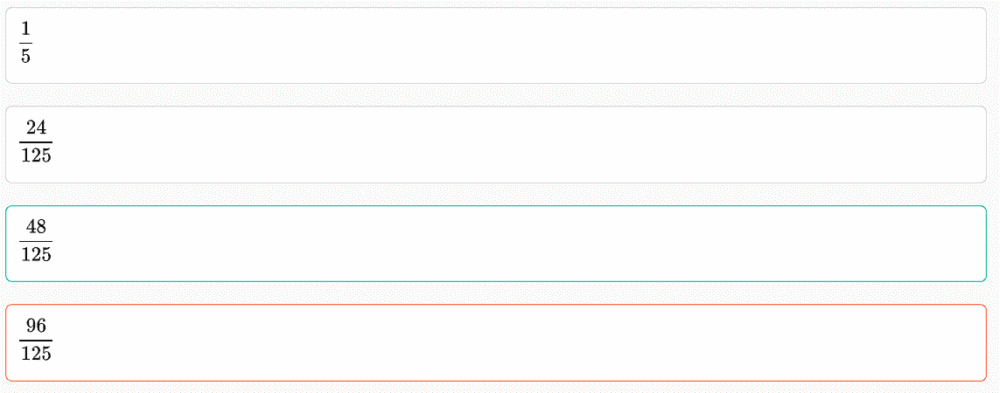

# 猿辅导 2019 校招技术类笔试题

## 1

猿辅导公司某研发小组一共有 12 名同学，其中 9 人能做后端开发，6 人能做前端开发。现在要抽调 4 名同学成立项目小组，负责公司的一项“机密”项目。其中 2 名同学做后端开发，2 名同学做前端开发。有多少种选派方法？

正确答案: C   你的答案: 空 (错误)

```cpp
180
```

```cpp
225
```

```cpp
423
```

```cpp
540
```

本题知识点

Java 工程师 C++工程师 安卓工程师 iOS 工程师 运维工程师 前端工程师 算法工程师 PHP 工程师 测试工程师 猿辅导 2019

讨论

[YBee 丶](https://www.nowcoder.com/profile/4396432)

共 12 个人，6 人会前端，9 人会后端。则既会前端也会后端的人有 6+9-12=3 人，只会前端的有 3 人，只会后端的有 6 人。(1)挑出的做前端的人中有 0 人会做后端(2)挑出的做前端的人中有 1 人会做后端(3)挑出的做前端的人都会做后端总计

编辑于 2019-01-05 23:11:07

* * *

[牛客网匿名用户 007](https://www.nowcoder.com/profile/444710412)

*   假设，只会前端的有 x 人，只会后端的有 y 人，既会前端又会后端的有 z 人，那么根据题目，可以得到如下三个等式。
    *   x + z = 6
    *   y + z = 9
    *   x + y + z = 12
*   可以解得，x = 3，y = 6，z = 3，也就是只会前端的有 3 人，只会后端的有 6 人，两个都会的有 3 人。
*   下面基于这三个两种都会的人分四种情况讨论。
    *   第一种情况，这三个人一个都没有被挑中，那么有  种情况。
    *   第二种情况，三个人中挑中了一个。这个人如果被作为前端挑中，有 种情况。如果作为后端被挑中，有 种情况。总计  种情况。
    *   第三种情况，三个人中挑中了两个。如果两个人都在前端，那么有  种情况。如果两个人都在后端， 种情况。如果一个在前端，一个在后端，有  种情况，总计  种情况。
    *   第四种情况，三个人都被选中了。三个人中有两个人一定会在同一组，从三个人中选两个人放在同一组。如果这两个人在前端组，那么有  种情况。如果这两个人在后端组，那么有  种情况。总计  种情况。
*   综上所述，总计  种情况。

编辑于 2018-12-30 20:52:50

* * *

[绝味小开发](https://www.nowcoder.com/profile/4550590)

(1)只会后端:6 个人；(2)只会前端:3 个人；(3)既会后端又会前端:3 个人;一.从(1)和(2)分别挑两个人，C(2,6)*C(2,3)=15*3=45;二.从(3)挑 1 个放前端，有 C(1,3)*C(1,3)*C(2,6) = 135;挑一个放后端,有 C(1,3)*C(1,6)*C(2,3)=54;三.从(3)挑 2 个放前端,有 C(2,3)*C(2,6)=45;挑 2 个放后端,有 C(2,3)*C(2,3)=9;1 前 1 后，有 C(2,3)*C(1,2)*C(1,3)*C(1,6)=108;四.从(3)挑 2 前端,1 后端,C(2,3)*C(1,6)=18;1 前端,2 后端,有 C(2,3)*C(1,3)=9;全部相加:45+135+54+45+9+108+18+9=423

发表于 2019-01-05 16:49:11

* * *

## 2

关于数据库，以下描述错误的是

正确答案: D   你的答案: 空 (错误)

```cpp
任意两行的主键值都不相同
```

```cpp
主键列不允许 NULL 值
```

```cpp
表可包含多个唯一约束，但每个表只允许一个主键
```

```cpp
唯一约束列不允许 NULL 值
```

本题知识点

Java 工程师 C++工程师 安卓工程师 iOS 工程师 运维工程师 前端工程师 算法工程师 PHP 工程师 测试工程师 猿辅导 Java 工程师 C++工程师 安卓工程师 iOS 工程师 运维工程师 前端工程师 算法工程师 PHP 工程师 测试工程师 猿辅导 Java 工程师 C++工程师 安卓工程师 iOS 工程师 运维工程师 前端工程师 算法工程师 PHP 工程师 测试工程师 猿辅导 C++工程师 Java 工程师 猿辅导 2019

讨论

[绝味小开发](https://www.nowcoder.com/profile/4550590)

唯一键可以包含 NULL 值，并且每个 NULL 值都是唯一的（即 NULL！=NULL） -- 《Effective MySQL 之 SQL 语句最优化》

发表于 2019-01-05 16:53:27

* * *

[一 koy](https://www.nowcoder.com/profile/396286840)

定义主键和外键主要是为了维护关系数据库的完整性，总结一下：
1.主键是能确定一条记录的唯一标识，比如，一条记录包括身份正号，姓名，年龄。

身份证号是唯一能确定你这个人的，其他都可能有重复，所以，身份证号是主键。
2.外键用于与另一张表的关联。是能确定另一张表记录的字段，用于保持数据的一致性。

比如，A 表中的一个字段，是 B 表的主键，那他就可以是 A 表的外键。---------------------一个表中可以有多个字段声明为 UNIQUE ，但只能有一个 PRIMARY KEY 声明；声明为 PRIMARY KEY 的列不允许有空值，但是声明为 UNIQUE 的字段允许空值的存在。

编辑于 2019-03-11 16:19:06

* * *

[lzldr](https://www.nowcoder.com/profile/716613044)

联合主键：

当一个表有两个主键时，此时是两个主键一起做为主键，即联合主键，两个主键只要有一个不同，就算作不同的。但当两个主键完全一样时，才会报错，说主键不能重复。

发表于 2020-06-16 08:50:34

* * *

## 3

有一个虚拟存储系统，若进程在内存中占 3 页，开始内存为空。若采用 LRU 页面淘汰算法，当执行如下访问页号序列 [1，2，3，4，1，2，5，1，2，3，5，4]  会产生多少次缺页？

正确答案: B   你的答案: 空 (错误)

```cpp
9 次
```

```cpp
10 次
```

```cpp
11 次
```

```cpp
12 次
```

本题知识点

Java 工程师 C++工程师 安卓工程师 iOS 工程师 运维工程师 前端工程师 算法工程师 PHP 工程师 测试工程师 猿辅导 2019

讨论

[小广同学](https://www.nowcoder.com/profile/745261525)

FIFO1.访问 1，缺页，内存中 1，，；2.访问 2，缺页，内存中 1,2，；3.访问 3，缺页，内存中 1,2,3；4.访问 4，缺页，内存中 2,3,4；5.访问 1，缺页，内存中 3,4,1；6.访问 2，缺页，内存中 4,1,2；7.访问 5，缺页，内存中 1,2,5；8.访问 1，不缺页，内存中 2,5,1；9.访问 2，不缺页，内存中 5,1,2；10.访问 3，缺页，内存中 1,2,3；11.访问 5，缺页，内存中 2,3,5；12.访问 4,缺页，内存中 3,5,4；共 10 次缺页，注：超出缓存上限时，删除的时最先访问的，最近访问的保留。

编辑于 2019-07-31 19:35:01

* * *

[爱新觉罗·狗蛋](https://www.nowcoder.com/profile/659758572)

1 2 3 4 1 2 5 1 2 3 5 41 1 1 4 4 4 5       3 3 3   2 2 2 1 1 1       1 5 5      3 3 3 2 2       2 2 4 总共十次缺页

发表于 2019-07-17 17:15:05

* * *

[诗酒趁年华 vec](https://www.nowcoder.com/profile/3408405)

为什么我感觉这道题是 9 次呀！1 2 3 4 1 2 5 1 2 3 5 41 1 1 4 4 4 5       5    5   2 2 2 1 1 1       3    3      3 3 3 2 2       2    4

发表于 2019-01-01 19:30:45

* * *

## 4

假设解决某问题的算法复杂度为 F(n)，其中 n 为问题规模，该问题总是可以通过 g(n)的代价划分为 2 个规模为 n/2 的同类子问题，即 F(n)=2F(n/2)+g(n),当 g(n)为 O(n)，时 F(n)为多少？

正确答案: C   你的答案: 空 (错误)

```cpp
O( log n )
```

```cpp
O( n )
```

```cpp
O( n log n )
```

```cpp
O( n2 )
```

本题知识点

Java 工程师 C++工程师 安卓工程师 iOS 工程师 运维工程师 前端工程师 算法工程师 PHP 工程师 测试工程师 猿辅导 2019

讨论

[He110](https://www.nowcoder.com/profile/6472986)

其实就是归并排序，折半，合并，合并是 O(N)，但是会发生 O(logN) 次合并，也就是 O(NlogN)

发表于 2019-03-09 14:01:11

* * *

[Bean 冷的心](https://www.nowcoder.com/profile/411517301)

master 公式的使用
T(N) = a*T(N/b) + O(N^d)
1) log(b,a) > d ->复杂度为 O（N^log(b,a)）
2) log(b,a) = d ->复杂度为 O（N^d*logN）
3) log(b,a) < d ->复杂度为 O（N^d）
[`blog.csdn.net/u011679785/article/details/97136820`](https://blog.csdn.net/u011679785/article/details/97136820)

编辑于 2019-08-25 17:54:04

* * *

[Eraser3](https://www.nowcoder.com/profile/5095476)

g(n)的时间复杂度为 O(n)，这道题值得注意的是还有 F(n/2)的限制，从 F(n)到 F(1)需要 logn，也就是说 g(n)需要计算 logn 次，故时间复杂度为 O(nlogn).

发表于 2018-12-29 20:39:37

* * *

## 5

猿辅导公司某部门月会上，有 5 名同学在依次领取入职周年的礼物，一束鲜花。HR 共准备有 5 种不同颜色的鲜花供他们挑选。则有且仅有两名同学挑选了相同颜色的鲜花的概率是多少？

正确答案: C   你的答案: 空 (错误)

```cpp
1/5
```

```cpp
24/125
```

```cpp
48/125
```

```cpp
96/125
```

本题知识点

Java 工程师 C++工程师 算法工程师 PHP 工程师 猿辅导 2019

讨论

[Eraser3](https://www.nowcoder.com/profile/5095476)

共有 5*5*5*5*5=3125 种情况，再算有且只有两个人选同一种颜色的情况， 1.选出两个人 C52=10; 2.选同一种颜色有 5 种情况; 3.其他 3 个人从剩下 4 种颜色选：4*3*2=24\. 共有 10*5*24=1200 概率为 1200/3125=48/125.

发表于 2018-12-29 20:40:16

* * *

[distinc](https://www.nowcoder.com/profile/760045514)

```cpp
页面显示不正常

```

```cpp

```

```cpp

```

```cpp

```

发表于 2018-12-28 17:46:16

* * *

[愚人五个字](https://www.nowcoder.com/profile/963871720)



> 我做题的时候忘了“且仅有两名同学”，导致算其他三个人的时候是 4*4*4 了，正确的应该是 4*3*2

编辑于 2019-01-05 14:39:20

* * *

## 6

给定 yfd_interviewer 数据库表结构如下：

```cpp
CREATE TABLE `yfd_interviewer` (
  `id` INT(11) NOT NULL AUTO_INCREMENT,
  `name` VARCHAR(32) NOT NULL DEFAULT '',
  `age` INT(11) NOT NULL,
  `createdTime` BIGINT(20) NOT NULL,
  `updatedTime` BIGINT(20) NOT NULL,
  PRIMARY KEY (`id`),
  KEY `name_index` (`name`),
  KEY `age_index` (`age`)
) ENGINE=InnoDB DEFAULT CHARSET=utf8;
```

给定以下 SQL：S1: SELECT * FROM `yfd_interviewer` WHERE name = ‘kebi’;S2: SELECT * FROM `yfd_interviewer` WHERE age = 20;S3: SELECT * FROM `yfd_interviewer` WHERE name = ‘kenan’ AND age = 20;S4: SELECT * FROM `yfd_interviewer` WHERE age = 20 AND name = ‘kenan’;以下关于索引使用描述不正确的是哪个？

正确答案: D   你的答案: 空 (错误)

```cpp
S1 可能使用索引 name_index
```

```cpp
S2 可能使用索引 age_index
```

```cpp
S3 可能使用索引 name_index 或 age_index
```

```cpp
相比 S3，S4 会优先使用 age_index
```

本题知识点

Java 工程师 C++工程师 安卓工程师 iOS 工程师 运维工程师 前端工程师 算法工程师 PHP 工程师 测试工程师 猿辅导 2019

讨论

[Bram_Moolenaar](https://www.nowcoder.com/profile/5779482)

索引的选择考虑过滤效果等影响，条件的顺序几乎不会是某个 RDBMS 选择索引的一个影响比较大的因子，通常 RDBMS 的实现中，第三个 SQL 和第四个 SQL 最后选择的情况会是一样的。没有绝对的答案，这取决于具体的数据分布，可能只用一个返回最少的，可能 2 个都用，也可能根本不用。

发表于 2019-01-06 11:11:53

* * *

[西伯利亚小奶狗](https://www.nowcoder.com/profile/907009718)

对于多个单列索引，mysql 优化器会选择一次性能选出较少数据的索引，即使用该字段重复度低的字段，名字重名的可能性正常来说是小于年龄重复的，所以优先会使用 name 索引，而维护 age 索引是需要开销的，其实可以把该索引删掉

发表于 2020-07-24 11:14:21

* * *

[antdant](https://www.nowcoder.com/profile/285461476)

对于数据库来说，判断 sql 语句的时候，会判断出 where 中查询的条件那个索引能够缩小表的扫描条数。也就是自动化判断优先级。

发表于 2020-07-30 23:30:00

* * *

## 7

关于 HTTP 协议，下列说法错误的是

正确答案: C   你的答案: 空 (错误)

```cpp
HTTP 是无状态协议
```

```cpp
HTTP 是应用层协议
```

```cpp
HTTP 是基于二进制的协议
```

```cpp
HTTP 状态码 200 表示成功
```

本题知识点

Java 工程师 C++工程师 安卓工程师 iOS 工程师 运维工程师 前端工程师 算法工程师 PHP 工程师 测试工程师 猿辅导 Java 工程师 C++工程师 安卓工程师 iOS 工程师 运维工程师 前端工程师 算法工程师 PHP 工程师 测试工程师 猿辅导 Java 工程师 C++工程师 安卓工程师 iOS 工程师 运维工程师 前端工程师 算法工程师 PHP 工程师 测试工程师 猿辅导 C++工程师 Java 工程师 猿辅导 2019

讨论

[Bram_Moolenaar](https://www.nowcoder.com/profile/5779482)

HTTP 协议是 Hyper Text Transfer Protocol，即超文本传输协议，当然是基于文本的哈

发表于 2019-01-05 21:55:46

* * *

[Code_H](https://www.nowcoder.com/profile/231026381)

HTTP 协议是 Hyper Text Transfer Protocol，即超文本传输协议，当然是基于文本的哈

发表于 2019-07-30 22:39:28

* * *

[绝味小开发](https://www.nowcoder.com/profile/4550590)

HTTP 是基于文本的协议

发表于 2019-01-05 21:36:46

* * *

## 8

关于进程和线程，下列说法错误的是

正确答案: B   你的答案: 空 (错误)

```cpp
同一进程内的线程共享内存等系统资源
```

```cpp
进程之间不能通信
```

```cpp
进程有独立的虚拟地址空间
```

```cpp
线程可以创建另外一个线程
```

本题知识点

Java 工程师 C++工程师 安卓工程师 iOS 工程师 运维工程师 前端工程师 算法工程师 PHP 工程师 测试工程师 猿辅导 2019

讨论

[小浣熊行不行](https://www.nowcoder.com/profile/793814467)

进程间通信（IPC，InterProcess Communication）是指在不同进程之间传播或交换信息。 IPC 的方式通常有管道（包括无名管道和命名管道）、消息队列、信号量、共享存储、Socket、Streams 等。其中 Socket 和 Streams 支持不同主机上的两个进程 IPC。

发表于 2019-01-06 17:04:19

* * *

[Bean 冷的心](https://www.nowcoder.com/profile/411517301)

进程之间可以进行通信，虽然一般是不能互相访问的，但是有特殊情况，共享内存区就是唯一的例外。

发表于 2019-07-31 17:37:48

* * *

## 9

将 A B C D 四个元素次序进栈（中间可能有出栈操作，例如 A 进栈后出栈，B 再进栈），则可能的出栈系列是

正确答案: B   你的答案: 空 (错误)

```cpp
C A D B
```

```cpp
B D C A
```

```cpp
C D A B
```

```cpp
D A B C
```

本题知识点

Java 工程师 C++工程师 安卓工程师 iOS 工程师 运维工程师 前端工程师 算法工程师 PHP 工程师 测试工程师 猿辅导 2019

讨论

[Bean 冷的心](https://www.nowcoder.com/profile/411517301)

B 为什么对。 A 先压进去，再压入 B，然后把 B 弹出来，所以 B 最先出栈。 然后把 C 压入栈，D 再压入栈，根据先进先出原则依次弹出，所以剩下的三个数字出栈顺序为 D,C,A。 所以总顺序为 B,D,C,A

发表于 2019-07-31 17:40:38

* * *

[赏个 offer 吧！](https://www.nowcoder.com/profile/346279714)

因为 ACD 都是错的 ，所以选择 B

发表于 2019-08-21 18:01:03

* * *

[二盈](https://www.nowcoder.com/profile/705096009)

栈是先进后出，以 abcd 顺序进去，如果 a 进入了没有出来，那么 a 一定最后才能出来。

发表于 2019-01-05 11:25:51

* * *

## 10

关于 TCP 协议，下列说法错误的是

正确答案: B   你的答案: 空 (错误)

```cpp
TCP 是面向连接的协议
```

```cpp
TCP 是基于数据报文的协议
```

```cpp
TCP 提供了拥塞控制的机制
```

```cpp
TCP 属于传输层协议
```

本题知识点

Java 工程师 C++工程师 安卓工程师 iOS 工程师 运维工程师 前端工程师 算法工程师 PHP 工程师 测试工程师 猿辅导 Java 工程师 C++工程师 安卓工程师 iOS 工程师 运维工程师 前端工程师 算法工程师 PHP 工程师 测试工程师 猿辅导 Java 工程师 C++工程师 安卓工程师 iOS 工程师 运维工程师 前端工程师 算法工程师 PHP 工程师 测试工程师 猿辅导 C++工程师 Java 工程师 猿辅导 2019

讨论

[绝味小开发](https://www.nowcoder.com/profile/4550590)

TCP（Transmission Control Protocol 传输控制协议）是一种面向连接的、可靠的、基于字节流的传输层通信协议

发表于 2019-01-05 21:40:26

* * *

[Bram_Moolenaar](https://www.nowcoder.com/profile/5779482)

TCP 采用的拥塞控制的算法有：慢开始、拥塞避免、快重传、快恢复四种。

发表于 2019-01-05 21:57:12

* * *

[愚人五个字](https://www.nowcoder.com/profile/963871720)

TCP（Transmission Control Protocol 传输控制*协议*）是一种面向连接的、可靠的、*基于*字节流的传输层通信*协议*，UDP 才基于数据报。

编辑于 2019-01-05 15:20:55

* * *

## 11

某天猿辅导 HR 组织大家去漂流，早上，参加团建的同学都到齐了，并且按到达公司的先后顺序排好队了。 由于员工太多，一个大巴车坐不下，需要分多个车，车是足够的，但所有人需要按一定顺序上车，按如下规则安排上车的顺序：
假设大巴车容量为 m，从队首开始，每 m 个人分成一个小组，每个小组坐一辆车。同时只有一个车打开车门供员工上车。 小组之间按从队尾到队首顺序依次上车，同一小组内先到的同学先上，求所有人上车的顺序。例如： 员工数 8， 车容量 3， 员工到达顺序为 1 2 3 4 5 6 7 8， 3 个人一个小组，分三个小组， 小组一： 1， 2， 3， 小组二： 4， 5， 6，小组三： 7，8。 小组上车顺序为： 小组三，小组二，小组一 。 所有员工上车顺序为 7 8 4 5 6 1 2 3

```cpp
#include <iostream>

int main() {
    int memberCount, carCount;
    std::cin >> memberCount;
    std::cin >> carCount;

    int* members = new int[memberCount];
    for (int i = 0; i < memberCount; i++) {
        std::cin >> members[i];
    }

    // TODO: 按规则调整顺序
    while(true)
    {
        // TODO: 输出，注意有空格隔开
        std::cout << orders[i];
    }

    delete[] members;
    delete[] orders;
}

```

本题知识点

Java 工程师 C++工程师 iOS 工程师 安卓工程师 运维工程师 前端工程师 算法工程师 PHP 工程师 测试工程师 猿辅导 模拟 数组 2019

讨论

[WriteBug](https://www.nowcoder.com/profile/158392637)

    /*思路就是只利用数组来完成
     * 比如 员工到达顺序为 1 2 3 4 5 6 7 8
     * 车容量为 3 个人
     * 所以是 3 组
     * 现在数组存的就是 int[] ps={1 2 3 4 5 6 7 8};
     * 分为三组的情况下：
     * 第一组 123 第二组 456 第三组 78
     * 所以只需将每一组中的设置两个标识位 begin 和 end，
     * 然后将 begin 和 end 值互换即可
     * 比如第一组 123，开始时 begin=0，end=2，然后将 ps[0]和 ps[2]互换
     * 然后再将 begin++，end--。
     * 互换的次数就有每一组的数量来决定=每一组的数量/2
     * 最终每一组互换之后就会得到 3 2 1 6 5 4 8 7
     * 只需再倒序输出即可
     */

    public static void main(String[] args) {
        Scanner sc=new Scanner(System.in);
        //员工数量
        int pNum=sc.nextInt();
        //车的容纳量
       int cNum=sc.nextInt();
       //将用户输入的员工放置到 ps 数组中
        int[] ps=new int[pNum];
        for(int i=0;i<pNum;i++){
            ps[i]=sc.nextInt();
        }
        //大巴车数量
        int a=(pNum%cNum)==0?pNum/cNum:pNum/cNum+1;
        int flag,temp;
        //flag 存储每一组要进行交换的次数=车的容纳量/2
        flag=cNum/2;
        //开始对每一组进行交换
        for(int i=0;i<a;i++){
            //交换的开始下标
            int begin=i*cNum;
          //交换的结束下标
            int end=0;
            //这个判断是为了计算最后一组的数量，因为最后一组的数量可能小于车的容纳量
            if((i*cNum+cNum-1)<(ps.length))
             end=i*cNum+cNum-1;
            else
             end=ps.length-1;
            //开始对每一组中的值进行交换
            for(int j=0;j<flag;j++){
                temp=ps[begin];
                ps[begin]=ps[end];
                ps[end]=temp;
                begin++;
                end--;
            }
        }
        //倒序输出
        int max=ps.length-1;
        for(int i=max;i>=0;i--) {
            System.out.print(ps[i]+" ");
        }
    }

编辑于 2019-02-28 18:38:00

* * *

[nbgao](https://www.nowcoder.com/profile/211289)

```cpp
#include <bits/stdc++.h>
using namespace std;

int main(){
    int n,m;
    cin>>n>>m;
    int a[n];
    for(int i=0;i<n;i++)    
        cin>>a[i];
    int t = n/m*m, k=n;
    for(int i=t;i>=0;i-=m){
        for(int j=i;j<k;j++)
            cout<<a[j]<<" ";
        k = i;
    }
    return 0;
}
```

发表于 2019-11-08 02:01:50

* * *

[Bean 冷的心](https://www.nowcoder.com/profile/411517301)

```cpp
package com.bean;

import java.util.Scanner;

public class Main {
    public static void main(String[] args) {
        Scanner sc = new Scanner(System.in);
        //小组几个人
        int MemberNum = sc.nextInt();
        //公交容量
        int BusCapacity = sc.nextInt();
        //有几人开辟多大空间，因为普通数组并不支持动态扩展
        int[] arr = new int[MemberNum];
        //依次入数组
        for (int i = 0; i < MemberNum; i++) {
            arr[i] = sc.nextInt();
        }
        //总共几个组（余 1 就多加一辆车，不能因为多一个人就省一辆车）
        int groupNum = MemberNum % BusCapacity == 0 ? MemberNum/BusCapacity:MemberNum/BusCapacity+1;
        //从最后一组开始，递减输出
        for (int i = groupNum-1; i >= 0; i--) {
            //最后一组的车有可能坐不满，所以循环条件为小于总容量即可
            if(i == groupNum-1) {
                for (int j = i * BusCapacity;j>=0 && j < MemberNum;j++){
                    System.out.print(arr[j] + " ");
                }
                //除了最后一组其他组肯定都是满员的
            }else {
                for (int j = i * BusCapacity; j < (i+1) * BusCapacity; j++) {
                    //最后一位去掉空格（强迫症，emmm）
                    if (j == BusCapacity-1)
                        System.out.print(arr[j]+"");
                    else
                        System.out.print(arr[j]+" ");
                }
            }
        }

    }
}

```

编辑于 2019-07-30 21:52:57

* * *

## 12

猿辅导公司的 N 位（N>=4）研发同学组织了一次秋游活动，某同学带了个无人机在高空拍照，活动结束时，先拍了一张所有同学排成公司猴头 Logo 的照片， 接着有人提议再排成“猿”的首字母 Y 字形来拍一张合照。用字符串中的每一个字符（不是换行符或结束符'\0'）代表一位老师，输出排好后的队形。要求 Y 字除去中心点外，上下半部分等高，按照从左到右，从上到下进行排序。队形中没人的部分用空格占位。输入数据保证可以排出一个完整的 Y 字，即长度为 3k+1 （k>=1）例如: 7 个 x ，排成队形为（为了方便说明，这里用‘-’代替空格）：x---x-x-x--x--x--x

```cpp
// 参考程序
#include <cstring>
#include <iostream>
#include <cstdio>
using namespace std;
char str[1010];
int N;
int main(){
    scanf("%d\n", &N);
    // TODO: 读入字符串，注意可能含空格

    // TODO: 输出拍照队形，没人用空格占位
    printf(" %c\n", str[0]);
}

```

本题知识点

Java 工程师 C++工程师 iOS 工程师 安卓工程师 运维工程师 前端工程师 算法工程师 PHP 工程师 测试工程师 猿辅导 字符串 *模拟 2019* *讨论

[工大月](https://www.nowcoder.com/profile/67760102)

/*
 解题思路：
 1、输入
 输入数字 theK 和字符串 str，因为允许输入空格，所以使用 nextLine()来接收 str；

 2、输出
 分为上下 2 部分打印 Y 型队列：
 （1）上半部分
 每行包括 4 部分内容（前面的空格 + 第一个字符 + 中间的空格 + 后一个字符），
 上半部分的行数为 theK，
每行前半部分的空格数为 i，
每行中间空格数为 z = 2 * theK -1（每下移 1 行，总数减少 2，即 z=z-2），
通过 charArray[count++]来控制依次输出每个字符。
 （2）下半部分
每行包括 2 部分内容（前面的空格 + 字符），
每行前面的空格数为 theK+1，
通过 charArray[count++]来控制依次输出每个字符。
 **/

```cpp
package niuKeWang;

import java.util.Scanner;
import java.util.regex.Matcher;
import java.util.regex.Pattern;

public class 拍照队形 {

	public static void printY(){
		Scanner sc = new Scanner(System.in);
		int theN = Integer.parseInt(sc.nextLine());
		String str = sc.nextLine();
		char[] charArray = str.toCharArray();
		sc.close();
		int theK = (theN - 1) / 3;
		int count = 0;
		int z = 2 * theK -1;

		//打印 Y 的上半部分
		for(int i = 0; i < theK; i++ ){
			//输出每行前半部分的空格
			for(int j = 0; j < i; j++){
				System.out.print(" ");
			}
			//输出每行前面的字符
			System.out.print(charArray[count++]);
			//输出每行中间的空格
			for(int k = 0; k < z; k++){
				System.out.print(" ");
			}
			z = z - 2;
			//输出每行后面的字符
			System.out.print(charArray[count++]);
			//输出换行符
			System.out.println();
		}

		//打印 Y 的下半部分
		for(int m = 0; m < theK+1; m++){
			//输出每行前半部分的空格
			for(int a = 0; a < theK; a++){
				System.out.print(" ");
			}
			//输出没行的字符
			System.out.print(charArray[count++]);
			//输出换行符
			System.out.println();
		}

	}

	public static void main(String[] args) {
		printY();
	}

}

```

编辑于 2020-07-21 14:33:09

* * *

[牛客 652172042 号](https://www.nowcoder.com/profile/652172042)

```cpp
N = int(input())
a = input()
# 前一半行数
k = int((N-1)/3)
for i in range(k):
    b = ""
    b = b + ' '*i + a[2*i] + ' '*(2*(k - i) - 1) + a[2*i + 1]
    print(b)
for i in range(2*k, 3*k + 1):
    b = ""
    b = b + ' ' * k + a[i]
    print(b)
```

发表于 2020-05-01 11:43:34

* * *

[菜鸟四号](https://www.nowcoder.com/profile/1366555)

```cpp
import java.io.BufferedReader;
import java.io.IOException;
import java.io.InputStreamReader;
import java.util.Scanner;
public class Main{
    public static void main(String[] args) throws IOException{
        Scanner sc=new Scanner(System.in);
        int num=sc.nextInt();
        BufferedReader reader=new BufferedReader(new InputStreamReader(System.in));
        String str=reader.readLine();
        char[] ch=str.toCharArray();
        int t1=(2*num+1)/3-1,t2=(num+2)/3-1,k=0,t3=t1;
        for(int i=0;i<=t2;i++) {
            //打印前面的空格
            for(int n=0;n<i;n++) System.out.print(" ");
            //打印数字
            for(int j=i;j<=t1;j++) {
                if(i==j || i+j==2*t2)
                System.out.print(ch[k++]);
                else System.out.print(" ");
            }
            System.out.println();
            t1--;
        }
        //打印下面的数字
        for(int i=t2;i<t3;i++) {
            //打印前面的空格
            for(int j=0;j<t2;j++) {
                System.out.print(" ");
            }
            System.out.println(ch[k++]);
        }
    }
}

```

用字符流来读取字符串，解决读入空格报错的问题，但是牛客网的环境不允许这样做，所以编译会报错，但是本地不会报错。额，没法了。

编辑于 2019-09-10 21:57:52

* * **