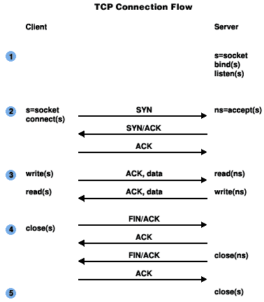
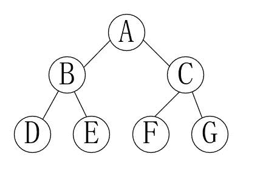
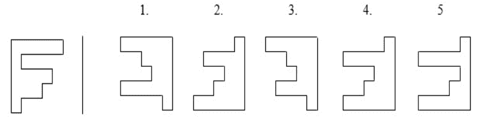
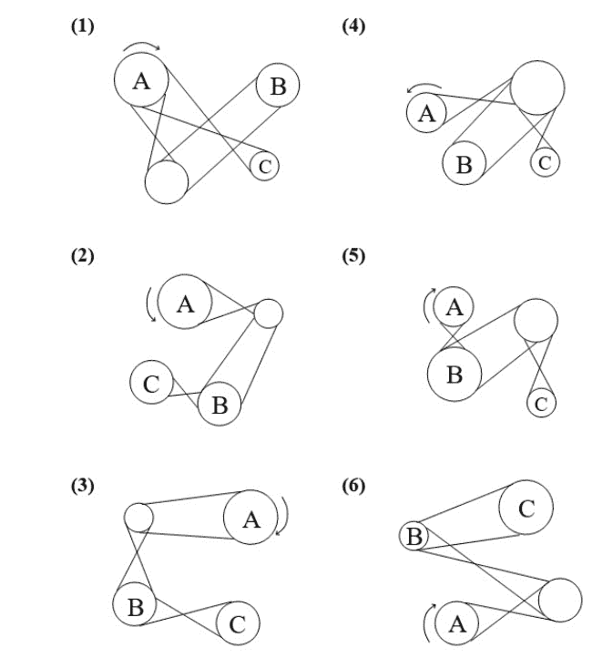
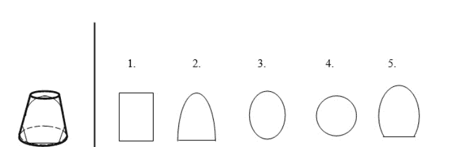
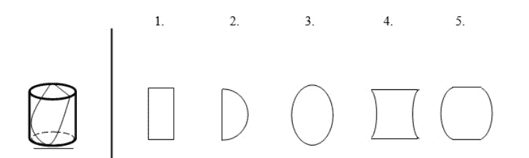
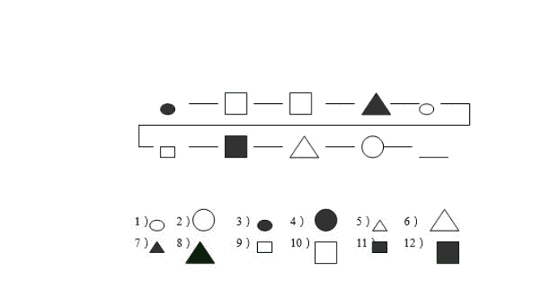
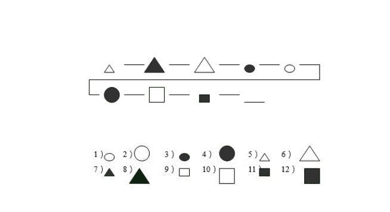

# 趋势科技 2019 秋招技术岗客观题汇总

## 1

在 C 中，下列哪一个按位运算符用于屏蔽数字中的某一特定位？

正确答案: B   你的答案: 空 (错误)

```cpp
&amp;&amp;
```

```cpp
&amp;
```

```cpp
||
```

```cpp
!
```

本题知识点

Java 工程师 C++工程师 安卓工程师 iOS 工程师 运维工程师 前端工程师 算法工程师 PHP 工程师 测试工程师 趋势科技 2019 C 语言

讨论

[嘻嘻 818](https://www.nowcoder.com/profile/7295134)

XML 有 5 个转义符: < >& &quot 双引号; &apos 单引号; 
        按位 与 运算可以用来屏蔽特定的位。这里的与运算符会在 html 标准转义成   &amp; ， 故选 B

发表于 2019-04-10 20:49:33

* * *

[Perfume🐷2019](https://www.nowcoder.com/profile/212925046)

这种题目真没意思，记不住

发表于 2020-08-25 19:36:09

* * *

[精神的拾荒者](https://www.nowcoder.com/profile/863966215)

应该是按位与，某一位与 0 按位与操作，可以将这位置 0，屏蔽该位

发表于 2021-05-05 20:47:57

* * *

## 2

数组的第一个元素的内存地址被称为

正确答案: D   你的答案: 空 (错误)

```cpp
层地址
```

```cpp
元素地址
```

```cpp
第一个地址
```

```cpp
基地址
```

本题知识点

Java 工程师 C++工程师 安卓工程师 iOS 工程师 运维工程师 前端工程师 算法工程师 PHP 工程师 测试工程师 趋势科技 2019

## 3

下列哪一项不是 SQL 约束类型的一种？

正确答案: C   你的答案: 空 (错误)

```cpp
Primary key
```

```cpp
Foreign key
```

```cpp
Alternate key
```

```cpp
Unique
```

本题知识点

Java 工程师 C++工程师 安卓工程师 iOS 工程师 运维工程师 前端工程师 算法工程师 PHP 工程师 测试工程师 趋势科技 2019

讨论

[ccyu](https://www.nowcoder.com/profile/639977400)

SQL 共有六种约束：1、not null  非空约束；2、unique 唯一性约束；3、primary key 约束  ：约束唯一标识数据库表中的每条记录（主键），主键必须包含唯一的值，且不为空；4、foreign key 约束：用于预防破坏表之间连接的动作；5、check 约束 ：用于限制列中的值的范围；6、default 约束 ：用于向列中插入默认值 。

发表于 2019-08-06 21:33:07

* * *

## 4

在 SQL 中，下列哪个命令用于从数据库中删除索引？

正确答案: B   你的答案: 空 (错误)

```cpp
DELETE
```

```cpp
DROP
```

```cpp
REMOVE
```

```cpp
ROLL BACK
```

本题知识点

Java 工程师 C++工程师 安卓工程师 iOS 工程师 运维工程师 前端工程师 算法工程师 PHP 工程师 测试工程师 趋势科技 2019

讨论

[ccyu](https://www.nowcoder.com/profile/639977400)

**SQL 三种删除方式：**

1、drop table  tb      --tb 表示数据表的名字,下同删除内容和定义，释放空间。简单来说就是把整个表去掉.以后要新增数据是不可能的,除非新增一个表。2、truncate table tb 
删除内容、释放空间但不删除定义。与 drop 不同的是,他只是清空表数据而已。
3、delete table tb   --虽然也是删除整个表的数据,但是过程是痛苦的(系统一行一行地删,效率较 truncate 低)或        delete table tb where 条件
删除内容不删除定义，不释放空间。
rollback 是针对事务回滚的

发表于 2019-08-06 21:41:05

* * *

## 5

下列关于探索性测试的说法哪一项是正确的？

正确答案: B   你的答案: 空 (错误)

```cpp
只有在完成设计后才开始执行
```

```cpp
涉及同步测试设计及执行
```

```cpp
只有在设计更新后才开始执行
```

```cpp
只有在修改设计后才开始执行
```

本题知识点

Java 工程师 C++工程师 安卓工程师 iOS 工程师 运维工程师 前端工程师 算法工程师 PHP 工程师 测试工程师 趋势科技 2019

讨论

[凤舞霓裳](https://www.nowcoder.com/profile/446764892)

一般传统的软件测试流程都是“先设计，后执行”这样的流程。但是，大部分的被测系统，在测试之前并没有足够的数据进行参考，同样也就无法设计出合理的测试方案。“探索性测试” - 顾名思义，是一种测试设计和执行同步进行的过程。相比于传统的“先设计，后执行”的流程来说，探索性测试可以说是前期调研，可以弥补信息不足的问题。测试人员通过测试来学习被测系统，并把测试数据整理分析，调整测试方向。以实际数据为依据进行测试方案设计。参考网址：[软件测试中的探索性测试 - 简书 (jianshu.com)](https://www.jianshu.com/p/76407a4e31a7)

编辑于 2021-05-07 16:56:40

* * *

## 6

如果一个具有三个节点的二叉树的后序遍历是 XYZ，这棵树有多少种可能？

正确答案: D   你的答案: 空 (错误)

```cpp
3
```

```cpp
9
```

```cpp
7
```

```cpp
5
```

本题知识点

Java 工程师 C++工程师 安卓工程师 iOS 工程师 运维工程师 前端工程师 算法工程师 PHP 工程师 测试工程师 趋势科技 2019

讨论

[一切顺利呀～](https://www.nowcoder.com/profile/195487876)

 z                  z             z              z                   z/  \              /              /                     \                   \x  y          y             y                          y                 y              /                 \                             \              /            x                    x                             x         x

发表于 2019-08-06 20:09:48

* * *

[yeyoenjoy](https://www.nowcoder.com/profile/572955639)

判断根节点 Z 左右枝都存在一种，只存在左右子树各两种

发表于 2019-03-06 10:15:41

* * *

[不入流做题家](https://www.nowcoder.com/profile/650328834)

Catalan 数的应用，二叉树的不同节点个数和其形状种类数的关系是：n 个不同节点，则有 种不同的二叉树形状

发表于 2020-08-23 14:35:47

* * *

## 7

在操作系统中，在临界区同时运行多少个进程可以避免出现竞态条件？

正确答案: B   你的答案: 空 (错误)

```cpp
8
```

```cpp
1
```

```cpp
16
```

```cpp
0
```

本题知识点

Java 工程师 C++工程师 安卓工程师 iOS 工程师 运维工程师 前端工程师 算法工程师 PHP 工程师 测试工程师 趋势科技 2019

讨论

[Lees.老李](https://www.nowcoder.com/profile/354536084)

在 n 个进程系统中，允许 m 个进程（n>= m>=1）同时进去它们的临界区

发表于 2022-03-18 10:40:05

* * *

[牛客 255532750 号](https://www.nowcoder.com/profile/255532750)

1 个

发表于 2021-12-19 19:26:23

* * *

## 8

下列关于进程的说法哪一项是正确的？

正确答案: C   你的答案: 空 (错误)

```cpp
存储在磁盘上的高级语言程序
```

```cpp
主存的内容
```

```cpp
执行中程序
```

```cpp
二级内存中的作业
```

本题知识点

Java 工程师 C++工程师 安卓工程师 iOS 工程师 运维工程师 前端工程师 算法工程师 PHP 工程师 测试工程师 趋势科技 2019

讨论

[liuyong1995](https://www.nowcoder.com/profile/848814784)

进程是指正在运行中的程序

发表于 2019-09-15 21:07:20

* * *

## 9

下列哪一个系统调用会发送 SYN 包？

正确答案: D   你的答案: 空 (错误)

```cpp
socket
```

```cpp
bind
```

```cpp
connect
```

```cpp
listen
```

本题知识点

Java 工程师 C++工程师 安卓工程师 iOS 工程师 运维工程师 前端工程师 算法工程师 PHP 工程师 测试工程师 趋势科技 2019

讨论

[暮若清风](https://www.nowcoder.com/profile/516538817)

？？？

发表于 2019-08-06 23:44:34

* * *

[fanwl](https://www.nowcoder.com/profile/2042014)

不是吧，listen 函数是被动监听啊，server 主动来通信？？？

发表于 2020-10-18 22:37:30

* * *

## 10

在操作系统中，加载程序(loader)的作用是什么？

正确答案: D   你的答案: 空 (错误)

```cpp
为程序分配内存空间并解析对象迭卡之间的符号引用
```

```cpp
调整所有与地址相关的位置，如地址常量以对应分配的空间
```

```cpp
将机器指令和数据放在内存
```

```cpp
A,B,C 都是
```

本题知识点

Java 工程师 C++工程师 安卓工程师 iOS 工程师 运维工程师 前端工程师 算法工程师 PHP 工程师 测试工程师 趋势科技 2019

## 11

一个树的后序遍历为 10, 9, 23, 22, 27, 25, 15, 50, 95, 60, 40, 29，则下列哪一项是该树的中序遍历？ 

正确答案: A   你的答案: 空 (错误)

```cpp
9, 10, 15, 22, 23, 25, 27, 29, 40, 50, 60, 95
```

```cpp
9, 10, 15, 22, 40, 50, 60, 95, 23, 25, 27, 29
```

```cpp
29, 15, 9, 10, 25, 22, 23, 27, 40, 60, 50, 95
```

```cpp
95, 50, 60, 40, 27, 23, 22, 25, 10, 9, 15, 29
```

本题知识点

Java 工程师 C++工程师 安卓工程师 iOS 工程师 运维工程师 前端工程师 算法工程师 PHP 工程师 测试工程师 趋势科技 C++工程师 Java 工程师 趋势科技 2019

讨论

[Frankiehp](https://www.nowcoder.com/profile/7044291)

纠正一下楼下的解析，中序遍历 29 不一定一定在中间!!!!如果只有左，右两个字数那么就是不对，这道题目判断方法是： 
找到根节点，然后看左右是否矛盾
比如
1 2 3 4 51 4 5 2 3 => 必然是错的 因为 1 2 在一边 3  4 在一边 这里弄反了  故直接排除 B D
在往下看
C 为什么错了
40 是 29 的右子节点   50, 95, 60, 在 40 右边
但是问题在于
这里是中序遍历所以 C 中

```cpp
60, 50, 95
```

50 必然在 60 右边，那么只有两种可能
60    \    50  /    \ (或者)95   95
不论哪一个都写不出  后序是 95 50 60 这样的写法 故 C 错

编辑于 2019-12-08 23:47:08

* * *

[jssqgy](https://www.nowcoder.com/profile/2820086)

后序遍历为 10, 9, 23, 22, 27, 25, 15, 50, 95, 60, 40, 29 根节点是 29 中序遍历 29 一定在中间

发表于 2019-08-07 10:52:10

* * *

[LeanderDD](https://www.nowcoder.com/profile/715450774)

A、C 都对

发表于 2020-04-10 09:55:08

* * *

## 12

在下列 C 代码中： ```cpp
struct Celode
{
  struct Celode *lchild;
  int element;
  struct Celode *rChild;
}

int DoSomething(struct Celode *ptr)
{
    int value = 0;
    if (ptr != NULL)
    {
      if (ptr -> lChild != NULL)
        value = 1 + DoSomething(ptr -> lChild);
      if (ptr -> rChild != NULL)
        value = max(value, 1 + DoSomething(ptr -> rChild));
    }
    return (value);
}
```  如果指向非空树的根的指针作为参数传递，则 DoSomething 函数的返回值是（） 

正确答案: D   你的答案: 空 (错误)

```cpp
树的叶节点数
```

```cpp
树的节点数
```

```cpp
树的内部节点数
```

```cpp
树的高度
```

本题知识点

C++工程师 趋势科技 2019 C 语言

讨论

[牛客 637427732 号](https://www.nowcoder.com/profile/637427732)

这题有问题吧，返回“高度-1”吧

发表于 2021-07-17 12:11:39

* * *

[yf15273073192](https://www.nowcoder.com/profile/800663972)

value 是最后一个左、右孩子的层次值，最后返回其中一个较大值。

发表于 2020-08-29 16:43:48

* * *

[炫歌](https://www.nowcoder.com/profile/622959792)

首先通过看 value = max(value, 1  + DoSomething(ptr -> rChild));如果是结点数量的话一定是  + 号.故和结点数无关。于是只能选 D 树的高度。最后分析一下确实是这样的，就是左子树右子树的高度取一个 max.

发表于 2021-11-30 23:18:40

* * *

## 13

在 C 语言中，下列哪用于在其它函数中安全地终止 main 函数的函数为（）

正确答案: B   你的答案: 空 (错误)

```cpp
return(expr);
```

```cpp
exit(expr);
```

```cpp
abort();
```

```cpp
atexit(expr);
```

本题知识点

C++工程师 趋势科技 2019 牛客 C 语言

讨论

[叶子～626](https://www.nowcoder.com/profile/203167153)

abort()函数用于不正常地终止一个正在执行的程序。exit()函数用于正常终止程序。atexit()函数可以把一些函数注册为**退出函数**（exit function）。return 0;     一般 0 代表的是正常结束
return -1;    -1 代表非正常结束
return ;       void 返回是空，void 返回值可以什么也不写，可以写 return；
return NULL;   如果数据类型是指针类型，那我们一般成功的时候返回相应的地址，失败的时候返回 NULL 

发表于 2019-03-10 18:47:44

* * *

[blackoak](https://www.nowcoder.com/profile/478003001)

其实关键在于，return 它不是一个函数啊。。。

发表于 2019-04-09 14:32:50

* * *

[上 666](https://www.nowcoder.com/profile/652363837)

exit 用于在程序运行的过程中随时结束程序，exit 的参数是返回给 OS 的。main 函数结束时也会隐式地调用 exit 函数。exit 函数运行时首先会执行由 atexit()函数登记的函数，然后会做一些自身的清理工作，同时刷新所有输出流、关闭所有打开的流并且关闭通过标准 I/O 函数 tmpfile()创建的临时文件。exit 是结束一个进程，它将删除进程使用的内存空间，同时把错误信息返回父进程,而 return 是返回函数值并退出函数。return 是语言级别的，它表示了调用堆栈的返回；return( )是当前函数返回，当然如果是在主函数 main, 自然也就结束当前进程了，如果不是，那就是退回上一层调用。在多个进程时。如果有时要检测上个进程是否正常退出。就要用到上个进程的返回值，依次类推。而 exit 是系统调用级别的，它表示了一个进程的结束。

发表于 2020-12-08 22:42:38

* * *

## 14

下列 C++代码中 m 的值是多少： ```cpp
#include <iostream>
using namespace std;
int main()
{
    int m;
    bool a = true;
    bool b = false;
    int x = 10;
    int y = 5;
    m = ((x | y) + (a + b));
    cout << m;
    return 0;
}
``` 

正确答案: B   你的答案: 空 (错误)

```cpp
0
```

```cpp
16
```

```cpp
12
```

```cpp
2
```

本题知识点

Java 工程师 C++工程师 安卓工程师 iOS 工程师 运维工程师 前端工程师 算法工程师 PHP 工程师 测试工程师 趋势科技 2019 C++

讨论

[一心只想养老](https://www.nowcoder.com/profile/6674227)

题目看错了，是 x|y,  |是按位或的操作运算，1010 | 0101 =1111=15，加上 1，就为 16

发表于 2019-03-29 17:13:45

* * *

[StarKnight](https://www.nowcoder.com/profile/456205193)

是 x|y，位运算。而不是 x||y，这个是逻辑运算。

发表于 2021-04-08 17:47:37

* * *

[萌新也想要几个 offer](https://www.nowcoder.com/profile/1067332)

位运算符，10 是 1010，5 是 0101，两数相或等于 1111，就是 15。 15+1=16。

发表于 2022-02-14 09:38:12

* * *

## 15

在计算机网络中，下列哪一类 IP 地址在默认情况下可用的主机地址最多？

正确答案: A   你的答案: 空 (错误)

```cpp
A 类
```

```cpp
B 类
```

```cpp
C 类
```

```cpp
一样多
```

本题知识点

Java 工程师 C++工程师 安卓工程师 iOS 工程师 运维工程师 前端工程师 算法工程师 PHP 工程师 测试工程师 趋势科技 C++工程师 Java 工程师 趋势科技 2019

讨论

[VpouL201806110215675](https://www.nowcoder.com/profile/348593343)

A 类地址以 0 开头，第一个字节作为网络号，地址范围为：0.0.0.0~127.255.255.255；

B 类地址以 10 开头，前两个字节作为网络号，地址范围是：128.0.0.0~191.255.255.255;

C 类地址以 110 开头，前三个字节作为网络号，地址范围是：192.0.0.0~223.255.255.255。

D 类地址以 1110 开头，地址范围是 224.0.0.0~239.255.255.255，D 类地址作为组播地址（一对多的通信）；

E 类地址以 1111 开头，地址范围是 240.0.0.0~255.255.255.255，E 类地址为保留地址，供以后使用。

注：只有 A,B,C 有网络号和主机号之分，D 类地址和 E 类地址没有划分网络号和主机号。

发表于 2019-02-01 22:17:07

* * *

## 16

现需要将一个网络划分为 5 个子网，每个子网至少有 16 个主机。则应该使用下列哪一个子网掩码？

正确答案: B   你的答案: 空 (错误)

```cpp
255.255.255.192
```

```cpp
255.255.255.224
```

```cpp
255.255.255.240
```

```cpp
255.255.255.248
```

本题知识点

Java 工程师 C++工程师 安卓工程师 iOS 工程师 运维工程师 前端工程师 算法工程师 PHP 工程师 测试工程师 趋势科技 2019

讨论

[托马斯 _ 赛德](https://www.nowcoder.com/profile/357199056)

至少需要 log2(16)=4 个二进制位才能在同一个网络中区分出 16 个主机。而 IPv4 中全 0 代表网络号，因此全 0 地址不能用于表示主机地址，所以至少需要 5 个二进制位。因此 32 位子网掩码最后 8 位应该是(1110 0000)，换成十进制是 224。

发表于 2019-08-08 17:18:05

* * *

[VpouL201806110215675](https://www.nowcoder.com/profile/348593343)

*   主机数量=2^n-2，其中 n 是主机号位数。
*   子网数=2^n，其中 n 是子网号位数。
*   主机数 = 256-子网掩码-2

发表于 2019-02-01 22:39:38

* * *

## 17

下列哪一项是数组第五个元素的内存地址的公式，其中 w 是数组中每个存储单元的字数？

正确答案: A   你的答案: 空 (错误)

```cpp
LOC(Array[5]) = Base(Array) + w(5 - lower bound)
```

```cpp
LOC(Array[5]) = Base(Array[5]) + (5 - lower bound)
```

```cpp
LOC(Array[5]) = Base(Array[4]) + (5 - Upper bound)
```

```cpp
LOC(Array[5]) = Base(Array[4]) + w(5 - Upper bound)
```

本题知识点

Java 工程师 C++工程师 安卓工程师 iOS 工程师 运维工程师 前端工程师 算法工程师 PHP 工程师 测试工程师 趋势科技 2019

讨论

[李文](https://www.nowcoder.com/profile/772566)

唉，我又菜的不会了

发表于 2019-04-09 18:02:05

* * *

## 18

下列前缀表达式的后缀形式是什么： 

* + w x - y z

正确答案: A   你的答案: 空 (错误)

```cpp
w x + y z - *
```

```cpp
w x y z + - *
```

```cpp
w x + y z * -
```

```cpp
w x + - y z *
```

本题知识点

Java 工程师 C++工程师 安卓工程师 iOS 工程师 运维工程师 前端工程师 算法工程师 PHP 工程师 测试工程师 趋势科技 2019

讨论

[Frankiehp](https://www.nowcoder.com/profile/7044291)

(w + x) * ( y - z)

发表于 2019-12-09 00:01:00

* * *

[牛客 599884852 号](https://www.nowcoder.com/profile/599884852)

前缀表达式的计算机求值

> 从右至左扫描表达式，遇到数字时，将数字压入堆栈，遇到运算符时，弹出栈顶的两个数，用运算符对它们做相应的计算（栈顶元素 op 次顶元素），并将结果入栈；重复上述过程直到表达式最左端，最后运算得出的值即为表达式的结果

发表于 2022-02-07 14:29:35

* * *

[78018046](https://www.nowcoder.com/profile/78018046)

前缀表达式：运算符在操作数前面后缀表达式：运算符在操作数后面

发表于 2019-08-19 13:00:25

* * *

## 19

二叉树的中序和前序遍历分别为 d b e a f c g 和 a b d e c f g，那么它的后序遍历是什么？

正确答案: A   你的答案: 空 (错误)

```cpp
d e b f g c a
```

```cpp
e d b g f c a
```

```cpp
e d b f g c a
```

```cpp
d e f g b c a
```

本题知识点

Java 工程师 C++工程师 安卓工程师 iOS 工程师 运维工程师 前端工程师 算法工程师 PHP 工程师 测试工程师 趋势科技 C++工程师 Java 工程师 趋势科技 2019

讨论

[4094r 快来呀](https://www.nowcoder.com/profile/9020682)

由前序遍历推出树节点如图，同样满足中序遍历结果

发表于 2019-08-15 11:18:57

* * *

## 20

下列代码片段的时间复杂度是多少：

```cpp
function(int n)
{
    if(n == 1) return;
    for(int i = 1 ; i <= n ; ++i) {
        for(int j = 1 ; j <= n ; ++j) {
              printf("*");
              break;
          }
     }
}

```

正确答案: A   你的答案: 空 (错误)

```cpp
O(n)
```

```cpp
O(n²)
```

```cpp
O(1)
```

```cpp
O(2n)
```

本题知识点

Java 工程师 C++工程师 安卓工程师 iOS 工程师 运维工程师 前端工程师 算法工程师 PHP 工程师 测试工程师 趋势科技 2019 C++

讨论

[牛客 263760302 号](https://www.nowcoder.com/profile/263760302)

😂没发现 break，第二层只执行一次

发表于 2020-09-09 22:33:14

* * *

[腹黑 gg](https://www.nowcoder.com/profile/7970791)

第二个 for 循环只执行一次

发表于 2019-01-08 20:21:52

* * *

[78018046](https://www.nowcoder.com/profile/78018046)

break 只跳出一层循环

发表于 2019-08-19 12:59:20

* * *

## 21

下列 C++代码中，类 tTemp 表示是什么：

```cpp
class tTemp {
private:
    double temp;
    double tempF(double);

public:
    tTemp();
    ~tTemp();
    setTemp(double);
    double getTemp();
    double getTempF();
};

```

正确答案: A   你的答案: 空 (错误)

```cpp
False 封装
```

```cpp
True 接口
```

```cpp
True 封装
```

```cpp
A,B,C 都不对
```

本题知识点

Java 工程师 C++工程师 安卓工程师 iOS 工程师 运维工程师 前端工程师 算法工程师 PHP 工程师 测试工程师 趋势科技 C++工程师 Java 工程师 趋势科技 2019

讨论

[fanwl](https://www.nowcoder.com/profile/2042014)

哪位大佬能解释一下这个知识点啊

发表于 2020-10-18 22:39:14

* * *

[blackoak](https://www.nowcoder.com/profile/478003001)

看不懂，算了

发表于 2019-04-09 14:18:24

* * *

[腹黑 gg](https://www.nowcoder.com/profile/7970791)

??没看懂

发表于 2019-01-08 20:18:53

* * *

## 22

给定下面函数：整数单链表作为参数，函数重新排列列表的元素。

现以顺序为 1, 2, 3, 4, 5, 6, 7 的整数列表调用该函数 ```cpp
struct node
{
    int value;
    struct node *next;
};

void rearrange(struct node *list)
{
   struct node *p, * q;
   int temp;
   if ((!list) || !list -> next)
      return;
   p = list;
   q = list -> next;
   while(q)
   {
       temp = p -> value;
       p -> value = q -> value;
       q -> value = temp;
       p = q -> next;
       q = p ? p -> next:0;
   }
} 
``` 

函数执行后列表的内容是（）

正确答案: B   你的答案: 空 (错误)

```cpp
1, 2, 3, 4, 5, 6, 7
```

```cpp
2, 1, 4, 3, 6, 5, 7
```

```cpp
1, 3, 2, 5, 4, 7, 6
```

```cpp
2, 3, 4, 5, 6, 7, 1
```

本题知识点

C++工程师 算法工程师 2019 C++ C 语言

讨论

[牛客 305109674 号](https://www.nowcoder.com/profile/305109674)

要点是看迭代是 1 个数字还是两个数字，p = q -> next;q = p ? p -> next:0;题中是迭代两个数字，所以 D 错误，B 正确

发表于 2020-08-11 16:18:02

* * *

[欲为随心](https://www.nowcoder.com/profile/117726041)

这道题可以看成链表操作，一开始 p 指向链表第一个，q 指向链表第二个，进入 while 第一次循环，执行值交换，p = q -> next 后，p 指向链表第三个，q 此时还是链表第二个，q = p ? p -> next:0; q 不等于 p，q=0；跳出循环，只执行一次循环，答案应该是 2，1，3，4，5，6，7

发表于 2021-04-20 09:58:04

* * *

[main 方法栈帧](https://www.nowcoder.com/profile/400417205)

如果选 D 的话，while 循环最后一行的代码没有存在的必要

发表于 2022-01-11 20:11:59

* * *

## 23

优先级队列被实现为最大堆。最初它有 5 个元素，堆的层次遍历是 10，8，5，3，2。现按照顺序将两个新元素 1 和 7 插入到堆中。则插入新元素后，堆的层次遍历结果是什么？

正确答案: A   你的答案: 空 (错误)

```cpp
10, 8, 7, 3, 2, 1, 5
```

```cpp
10, 8, 7, 1, 2, 3, 5
```

```cpp
10, 8, 7, 2, 3, 1, 5
```

```cpp
10, 8, 7, 5, 3, 2, 1
```

本题知识点

Java 工程师 C++工程师 安卓工程师 iOS 工程师 运维工程师 前端工程师 算法工程师 PHP 工程师 测试工程师 趋势科技 C++工程师 Java 工程师 趋势科技 2019

讨论

[百年马家沟职业技术学员](https://www.nowcoder.com/profile/552927816)

最大堆

```cpp
层次遍历：10，8，5，3，2
```

```cpp
     10
    / \
  8     5
 / \ 
3   2  
```

```cpp
插入 1

```

```cpp
     10
    / \
  8     5
 / \   /  
3   2  1
```

```cpp
插入 7

```

```cpp
     10                 
    / \
  8     5  
 / \   / \ 
3   2  1  7
    变换
     10                 
    / \
  8     7  
 / \   / \ 
3   2  1  5
```

```cpp

选`A`

编辑于 2019-08-11 11:33:52

* * *

## 24

下列哪一项关于用户级和内核级线程的说法是不正确的？

正确答案: B   你的答案: 空 (错误)

```
用户级线程不需要任何硬件支持
```cpp

```
阻塞一个内核级线程就会阻塞所有相关的线程
```cpp

```
用户级线程的上下文切换时间比内核级线程要少
```cpp

```
可以在多处理器系统中的不同处理器上调度相关的内核级线程
```cpp

本题知识点

Java 工程师 C++工程师 安卓工程师 iOS 工程师 运维工程师 前端工程师 算法工程师 PHP 工程师 测试工程师 趋势科技 C++工程师 Java 工程师 趋势科技 2019

讨论

[暮若清风](https://www.nowcoder.com/profile/516538817)

| USER LEVEL THREAD | KERNEL LEVEL THREAD |
| --- | --- |
| User thread are implemented by users. | kernel threads are implemented by OS. |
| OS doesn’t recognized user level threads. | Kernel threads are recognized by OS. |
| Implementation of User threads is easy. | Implementation of Kernel thread is complicated. |
| Context switch time is less. | Context switch time is more. |
| Context switch requires no hardware support. | Hardware support is needed. |
| If one user level thread perform blocking operation then entire process will be blocked. | If one kernel thread perform blocking operation then another thread can continue execution. |

发表于 2019-08-07 19:41:58

* * *

[菜比保洁员](https://www.nowcoder.com/profile/165625040)

内核线程的映射可能有一对一，一对多，多对多

发表于 2019-03-29 10:28:09

* * *

## 25

请依据左方图形，选出右方图形，两者组合后须形成完整四方形 

正确答案: D   你的答案: 空 (错误)

```
1，2
```cpp

```
2，4
```cpp

```
3，4
```cpp

```
1，4
```cpp

本题知识点

Java 工程师 C++工程师 安卓工程师 iOS 工程师 运维工程师 前端工程师 算法工程师 PHP 工程师 测试工程师 趋势科技 C++工程师 Java 工程师 趋势科技 2019

讨论

[大厂 offer 快到碗里来 _](https://www.nowcoder.com/profile/937290277)

确定这是后端开发的题目不是公务员题目？

发表于 2020-08-20 18:45:59

* * *

## 26

以下为一串彼此连结的齿轮，请依图中 A 齿轮的旋转方向，选出 B、C 均为顺时钟转动着 

正确答案: A   你的答案: 空 (错误)

```
6
```cpp

```
1
```cpp

```
2，3
```cpp

```
4
```cpp

本题知识点

Java 工程师 C++工程师 安卓工程师 iOS 工程师 运维工程师 前端工程师 算法工程师 PHP 工程师 测试工程师 趋势科技 C++工程师 Java 工程师 趋势科技 2019

讨论

[不入流做题家](https://www.nowcoder.com/profile/650328834)

牛客是不是搞错了啊，行测题目放到技术岗了

发表于 2020-08-23 14:39:51

* * *

## 27

如果你将左方物体依细线切开，请选出其切面是下列右图中的哪一个

正确答案: C   你的答案: 空 (错误)

```
3
```cpp

```
2
```cpp

```
5
```cpp

```
1
```cpp

本题知识点

Java 工程师 C++工程师 安卓工程师 iOS 工程师 运维工程师 前端工程师 算法工程师 PHP 工程师 测试工程师 趋势科技 C++工程师 Java 工程师 趋势科技 2019

## 28

如果你将左方物体依细线切开，请选出其切面是下列右图中的哪一个 

正确答案: D   你的答案: 空 (错误)

```
3
```cpp

```
2
```cpp

```
1
```cpp

```
5
```cpp

本题知识点

Java 工程师 C++工程师 安卓工程师 iOS 工程师 运维工程师 前端工程师 算法工程师 PHP 工程师 测试工程师 趋势科技 2019

## 29

请依据下列图形顺序的规则，选出下一个会出现的图形 



正确答案: B   你的答案: 空 (错误)

```
5
```cpp

```
11
```cpp

```
12
```cpp

```
3
```cpp

本题知识点

Java 工程师 C++工程师 安卓工程师 iOS 工程师 运维工程师 前端工程师 算法工程师 PHP 工程师 测试工程师 趋势科技 2019

讨论

[牛客 704040472 号](https://www.nowcoder.com/profile/704040472)

请问 11/12 这两个是怎么区分的，蹲答案

发表于 2020-08-10 20:22:08

* * *

## 30

请依据下列图形顺序的规则，选出下一个会出现的图形 

正确答案: A   你的答案: 空 (错误)

```
9
```cpp

```
8
```cpp

```
12
```cpp

```
10
```cpp

本题知识点

Java 工程师 C++工程师 安卓工程师 iOS 工程师 运维工程师 前端工程师 算法工程师 PHP 工程师 测试工程师 趋势科技 C++工程师 Java 工程师 趋势科技 2019

## 31

关于优先股的说法正确的是（ ）。

正确答案: C   你的答案: 空 (错误)

```
优先股股东有表决权
```cpp

```
优先股股东可以退股
```cpp

```
优先股股息率事先设定
```cpp

```
优先股较普通股风险更大
```cpp

本题知识点

Java 工程师 C++工程师 安卓工程师 iOS 工程师 运维工程师 前端工程师 算法工程师 PHP 工程师 测试工程师 趋势科技 C++工程师 Java 工程师 趋势科技 2019

讨论

[衬心](https://www.nowcoder.com/profile/2888423)

？？？还有这样考的

发表于 2019-04-14 16:48:16

* * *

[VpouL201806110215675](https://www.nowcoder.com/profile/348593343)

*   **优先股**是拥有普通股不具备的某些特征的一类公司股票，**同时具有债务工具和权益工具的特征**，通常被认为是一种混合工具。“优先”是相对于普通股而言。优先首先体现在公司资产清算的受偿顺序方面（索偿权），**排在债权之后，比普通股优先**；**其次在股利分配顺序方面较普通股优先，通常按事先约好的股息率发放**。优先股的条款通常记载于发行公司的公司章程中。

发表于 2019-02-01 22:12:28

* * *

## 32

（ ）是一种与主权国家脱钩、并能保持币值长期稳定的国际储备货币。

正确答案: D   你的答案: 空 (错误)

```
虚拟货币
```cpp

```
国际货币
```cpp

```
数字货币
```cpp

```
超主权货币
```cpp

本题知识点

Java 工程师 C++工程师 安卓工程师 iOS 工程师 运维工程师 前端工程师 算法工程师 PHP 工程师 测试工程师 趋势科技 C++工程师 Java 工程师 趋势科技 2019

## 33

关于套期保值的交易原则叙述错误的是（ ）

正确答案: A   你的答案: 空 (错误)

```
交易方向相同原则
```cpp

```
商品种类相同原则
```cpp

```
商品数量相等原则
```cpp

```
月份相同或相近原则
```cpp

本题知识点

Java 工程师 C++工程师 安卓工程师 iOS 工程师 运维工程师 前端工程师 算法工程师 PHP 工程师 测试工程师 趋势科技 C++工程师 Java 工程师 趋势科技 2019

讨论

[VpouL201806110215675](https://www.nowcoder.com/profile/348593343)

*   对冲（又称避险、套期保值，英语：Hedge）

发表于 2019-02-01 22:13:15

* * *

## 34

以下不能进行赎回的基金种类是（ ）

正确答案: B   你的答案: 空 (错误)

```
ETF
```cpp

```
封闭式基金
```cpp

```
LOF 基金
```cpp

```
分级基金
```cpp

本题知识点

Java 工程师 C++工程师 安卓工程师 iOS 工程师 运维工程师 前端工程师 算法工程师 PHP 工程师 测试工程师 趋势科技 C++工程师 Java 工程师 趋势科技 2019

## 35

以下属于表内业务的是（ ）

正确答案: B   你的答案: 空 (错误)

```
委托贷款
```cpp

```
融资租赁
```cpp

```
贷款承诺
```cpp

```
利率互换
```cpp

本题知识点

Java 工程师 C++工程师 安卓工程师 iOS 工程师 运维工程师 前端工程师 算法工程师 PHP 工程师 测试工程师 趋势科技 C++工程师 Java 工程师 趋势科技 2019

讨论

[不入流做题家](https://www.nowcoder.com/profile/650328834)

趋势 2019 年还招金融人才的吗？

发表于 2020-08-23 14:44:35

* * *

## 36

不以清偿商品交易的价款为目的，而以贷款融资或担保债务偿还为目的所开立的信用证被称做（ ）

正确答案: D   你的答案: 空 (错误)

```
跟单信用证
```cpp

```
可撤销信用证
```cpp

```
循环信用证
```cpp

```
备用信用证
```cpp

本题知识点

Java 工程师 C++工程师 安卓工程师 iOS 工程师 运维工程师 前端工程师 算法工程师 PHP 工程师 测试工程师 趋势科技 C++工程师 Java 工程师 趋势科技 2019

## 37

附追索权汇票持票人无权向其前手请求偿还（ ）。

正确答案: A   你的答案: 空 (错误)

```
汇票保证金
```cpp

```
汇票金额
```cpp

```
利息
```cpp

```
费用
```cpp

本题知识点

Java 工程师 C++工程师 安卓工程师 iOS 工程师 运维工程师 前端工程师 算法工程师 PHP 工程师 测试工程师 趋势科技 C++工程师 Java 工程师 趋势科技 2019

## 38

自营贷款期限一般不超过（ ）年，超过年限的应当报中国人民银行备案。

正确答案: B   你的答案: 空 (错误)

```
5
```cpp

```
10
```cpp

```
15
```cpp

```
20
```cpp

本题知识点

Java 工程师 C++工程师 安卓工程师 iOS 工程师 运维工程师 前端工程师 算法工程师 PHP 工程师 测试工程师 趋势科技 C++工程师 Java 工程师 趋势科技 2019

## 39

29.   波特的五力模型用来确定企业在行业中的竞争优势和行业可达到的最终资本回报率，以下对五力模型局限性描述不准确的是（ ）。

正确答案: C   你的答案: 空 (错误)

```
该模型能确定企业盈利能力，但对于非营利机构，有关获利能力的假设可能错误
```cpp

```
该模型基于一种理想的假设：一旦进行这种分析，企业就可以制定企业战略来处理分析结构
```cpp

```
该分析模型基本是动态的，无法分析企业在某一时点的盈利能力
```cpp

```
该模型低估了企业与供应商、客户或分销商、合资企业间可能建立长期合作关系以消除替代品威胁的可能性
```cpp

本题知识点

Java 工程师 C++工程师 安卓工程师 iOS 工程师 运维工程师 前端工程师 算法工程师 PHP 工程师 测试工程师 趋势科技 C++工程师 Java 工程师 趋势科技 2019

讨论

[不入流做题家](https://www.nowcoder.com/profile/650328834)

[`wiki.mbalib.com/wiki/%E6%B3%A2%E7%89%B9%E4%BA%94%E5%8A%9B%E5%88%86%E6%9E%90%E6%A8%A1%E5%9E%8B`](https://wiki.mbalib.com/wiki/%E6%B3%A2%E7%89%B9%E4%BA%94%E5%8A%9B%E5%88%86%E6%9E%90%E6%A8%A1%E5%9E%8B)

发表于 2020-08-23 14:45:16

* * *

## 40

关于期货市场和远期市场的区别说法错误的是（ ）。

正确答案: B   你的答案: 空 (错误)

```
远期合同大小与交付日根据个人需要度身确定，而期货合同是标准化的，并由同一家有组织的证券公司担保
```cpp

```
大多数期货合同在实际交付时结算，并且仅有一些合同是按成本抵消结算
```cpp

```
远期市场不存在独立的结算行
```cpp

```
期货合同的价格随时间改变，以反映市场对未来即期汇率的预期
```cpp

本题知识点

Java 工程师 C++工程师 安卓工程师 iOS 工程师 运维工程师 前端工程师 算法工程师 PHP 工程师 测试工程师 趋势科技 C++工程师 Java 工程师 趋势科技 2019

## 41

关于直接融资的优点叙述有误的一项是（ ）。

正确答案: A   你的答案: 空 (错误)

```
对于贷款者（资金供应者）来说，直接融资的风险比较小
```cpp

```
能够把资金供需双方紧密结合起来，有利于资金的快速融通
```cpp

```
有利于多种信用形式的发展，促进投资尽快实现
```cpp

```
既使投资者更加关心筹资者的资金使用状况，又使筹资者增加了压力和约束力
```cpp

本题知识点

Java 工程师 C++工程师 安卓工程师 iOS 工程师 运维工程师 前端工程师 算法工程师 PHP 工程师 测试工程师 趋势科技 C++工程师 Java 工程师 趋势科技 2019

## 42

所谓“一物四名”指的是同样的金融产品，根据不同的使用者，不同的目的，不同的作用等，有四种不同的名字，以下不属于四名的是（ ）

正确答案: D   你的答案: 空 (错误)

```
金融产品
```cpp

```
金融资产
```cpp

```
金融工具
```cpp

```
金融负债
```cpp

本题知识点

Java 工程师 C++工程师 安卓工程师 iOS 工程师 运维工程师 前端工程师 算法工程师 PHP 工程师 测试工程师 趋势科技 C++工程师 Java 工程师 趋势科技 2019

讨论

[VpouL201806110215675](https://www.nowcoder.com/profile/348593343)

一物四名即金融产品、金融资产、金融工具和有价证券

发表于 2019-02-01 21:53:52

* * *

## 43

以下属于债券产品的是（ ）

正确答案: B   你的答案: 空 (错误)

```
股票
```cpp

```
国库券
```cpp

```
期权
```cpp

```
认股证
```cpp

本题知识点

Java 工程师 C++工程师 安卓工程师 iOS 工程师 运维工程师 前端工程师 算法工程师 PHP 工程师 测试工程师 趋势科技 金融常识 2019

## 44

以下属于具有完全流动性的金融工具的是（ ）

正确答案: A   你的答案: 空 (错误)

```
活期存款
```cpp

```
存款凭证
```cpp

```
股票
```cpp

```
债权
```cpp

本题知识点

Java 工程师 C++工程师 安卓工程师 iOS 工程师 运维工程师 前端工程师 算法工程师 PHP 工程师 测试工程师 趋势科技 金融常识 2019

## 45

以下不属于金融衍生品的共同特征的是（ ）。

正确答案: A   你的答案: 空 (错误)

```
非标准化合约
```cpp

```
零和博弈
```cpp

```
保证金交易
```cpp

```
跨期性
```cpp

本题知识点

Java 工程师 C++工程师 安卓工程师 iOS 工程师 运维工程师 前端工程师 算法工程师 PHP 工程师 测试工程师 趋势科技 C++工程师 Java 工程师 趋势科技 2019

讨论

[VpouL201806110215675](https://www.nowcoder.com/profile/348593343)

*   金融衍生产品是指其价值依赖于标的资产（Underlying Asset）价值变动的合约。**这种合约可以是标准化的，也可以是非标准化的。**
*   标准化合约是指其标的资产（基础资产）的交易价格、交易时间、资产特征、交易方式等都是事先标准化的，因此此类合约大多在交易所上市交易，如期货。
*   非标准化合约是指以上各项由交易的双方自行约定，因此具有很强的灵活性，比如远期合约。
*   **金融衍生产品的共同特征是保证金交易**，即只要支付一定比例的保证金就可进行全额交易，不需实际上的本金转移，合约的了结一般也采用现金差价结算的方式进行，只有在满期日以实物交割方式履约的合约才需要买方交足贷款。因此，金融衍生产品交易具有杠杆效应。保证金越低，杠杆效应越大，风险也就越大。
*   金融衍生产品具有以下几个特点:
    *   **零和博弈**：即合约交易的双方(在标准化合约中由于可以交易是不确定的)盈亏完全负相关,并且净损益为零,因此称"零和".
    *   **高杠杆性**：衍生产品的交易采用保证金制度(margin).即交易所需的最低资金只需满足基础资产价值的某个百分比。保证金可以分为初始保证金(Initial margin),维持保证金(maintains margin),并且在交易所交易时采取盯市制度(marking to market)，如果交易过程中的保证金比例低于维持保证金比例，那么将收到追加保证金通知(margin call)，如果投资者没有及时追加保证金，其将被强行平仓。可见，衍生品交易具有高风险高收益的特点。

发表于 2019-02-01 21:58:59

* * *

## 46

两个主体之间签订一份协议，约定一方与另一方在规定时期内的一系列时点上按照事先敲定的规则交换一笔借款，本金相同，但一方提供浮动利率，另一方提供的则是固定利率，这样的金融衍生品被称作（   ）。

正确答案: D   你的答案: 空 (错误)

```
利率期权
```cpp

```
利率互换
```cpp

```
利率远期
```cpp

```
利率掉期
```cpp

本题知识点

Java 工程师 C++工程师 安卓工程师 iOS 工程师 运维工程师 前端工程师 算法工程师 PHP 工程师 测试工程师 趋势科技 C++工程师 Java 工程师 趋势科技 2019

讨论

[VpouL201806110215675](https://www.nowcoder.com/profile/348593343)

*   **利率掉期( Interest rate swap)**,就是两个主体之间签订一份协议，约定一方与另一方在规定时期内的一系列时点上按照事先敲定的规则交换一笔借款，本金相同，只不过一方提供浮动利率( Floating Rate)，另一方提供的则是固定利率( Fixed Rate)。
*   **利率互换**是指交易双方以一定的名义本金为基础，将该本金产生的以一种利率计算的利息收入(支出)流与对方的以另一种利率计算的利息收入(支出)流相交换，交换的只是不同特征的利息，没有实质本金的互换。利率互换可以有多种形式，最常见的利率互换是在固定利率与浮动利率之间进行转换。

发表于 2019-02-01 22:02:59

* * *

## 47

以下不属于 OTC 市场特点的是（ ）。

正确答案: D   你的答案: 空 (错误)

```
交易的分散性
```cpp

```
交易的直接性
```cpp

```
交易的协议性
```cpp

```
交易的无序性
```cpp

本题知识点

Java 工程师 C++工程师 安卓工程师 iOS 工程师 运维工程师 前端工程师 算法工程师 PHP 工程师 测试工程师 趋势科技 C++工程师 Java 工程师 趋势科技 2019

讨论

[VpouL201806110215675](https://www.nowcoder.com/profile/348593343)

*   场外交易市场(Over the Counter Market; OTC Market)，OTC 市场
*   特点：
    *   分散的无形市场
    *   组织方式采取做市商制
    *   拥有众多证券种类和证券经营机构的市场，以未能在证券交易所批准上市的股票和债券为主。
    *   以议价方式进行证券交易的市场
    *   管理比证券交易所宽松

发表于 2019-02-01 22:05:53

* * *

## 48

下列属于上市公司应当公告的重大事件是（ ）

正确答案: C   你的答案: 空 (错误)

```
公司做出减资决定
```cpp

```
公司做出申请破产的决定
```cpp

```
公司董事长去世
```cpp

```
持有公司 2%股份的股东发生变化
```cpp

本题知识点

Java 工程师 C++工程师 安卓工程师 iOS 工程师 运维工程师 前端工程师 算法工程师 PHP 工程师 测试工程师 趋势科技 C++工程师 Java 工程师 趋势科技 2019

讨论

[牛奶 2](https://www.nowcoder.com/profile/973248953)

？？？

发表于 2021-05-06 16:38:00

* * *

[林林林林林 5](https://www.nowcoder.com/profile/419163889)

根据规定，公司减资、合并、分立、解散及申请破产的决定;或者依法进入破产程序、被责令关闭，属于临时报告中需要披露的重大事件，以及持有公司 5%以上股份的股东发生变化属于重大事件。

发表于 2019-04-13 11:24:34

* * *

## 49

只能在到期日当日行权的权证叫做（ ）。

正确答案: A   你的答案: 空 (错误)

```
欧式权证
```cpp

```
美式权证
```cpp

```
英式权证
```cpp

```
百慕大式权证
```cpp

本题知识点

Java 工程师 C++工程师 安卓工程师 iOS 工程师 运维工程师 前端工程师 算法工程师 PHP 工程师 测试工程师 趋势科技 C++工程师 Java 工程师 趋势科技 2019

讨论

[VpouL201806110215675](https://www.nowcoder.com/profile/348593343)

*   **权证**是一种有价证券，投资者付出权利金购买后，有权利（而非义务）在某一特定期间（或特定时点）按约定价格向发行人购买或者出售标的证券。
*   **权证按行使期限，分为美式权证、欧式权证和百慕大式权证。**
*   **美式权证**的持有人在权证到期日前的任何交易时间均可行使其权利
*   **欧式权证**持有人只可以在权证到期日当日行使其权利
*   **百慕大权证**是行权方式介于欧式权证和美式权证之间的权证。标准的百慕大权证通常在权证上市日和到期日之间多设定一个行权日。

发表于 2019-02-01 22:10:45

* * *

## 50

信托资金投资于一家上市公司所发行的股票，不得超过该上市公司总股本的（ ）。

正确答案: B   你的答案: 空 (错误)

```
3%
```cpp

```
5%
```cpp

```
10%
```cpp

```
20%
```

本题知识点

Java 工程师 C++工程师 安卓工程师 iOS 工程师 运维工程师 前端工程师 算法工程师 PHP 工程师 测试工程师 趋势科技 C++工程师 Java 工程师 趋势科技 2019