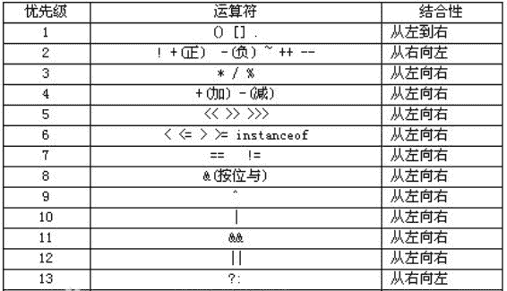
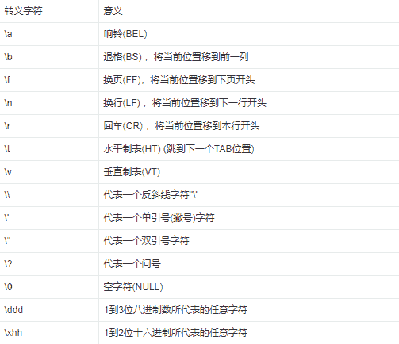
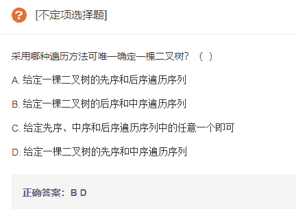
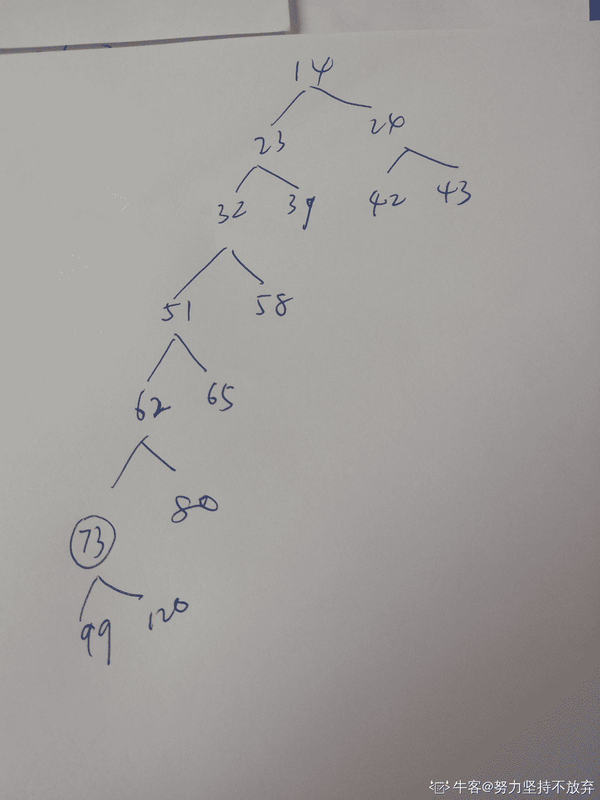
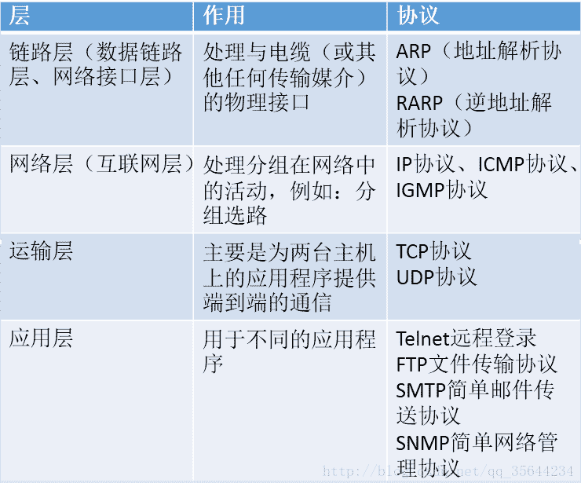
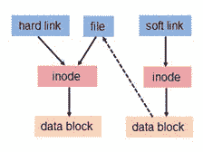
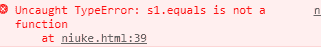

# 京东 2019 校招笔试前端开发工程师笔试题

## 1

在软件开发过程中，我们可以采用不同的过程模型，下列有关 增量模型描述正确的是（）

正确答案: B   你的答案: 空 (错误)

```cpp
是一种线性开发模型，具有不可回溯性
```

```cpp
把待开发的软件系统模块化，将每个模块作为一个增量组件，从而分批次地分析、设计、编码和测试这些增量组件
```

```cpp
适用于已有产品或产品原型（样品），只需客户化的工程项目
```

```cpp
软件开发过程每迭代一次，软件开发又前进一个层次
```

本题知识点

前端工程师 京东 前端工程师 京东 2019

讨论

[努力坚持不放弃](https://www.nowcoder.com/profile/342664272)

**增量模型**(Incremental Model)又称演化模型。与建造大厦相同，软件也是一步一步建造起来的。在增量模型中，软件被作为一系列的增量构件来设计、实现、集成和测试、每一个构件是由多种相互作用的模块所形成的提供特定功能的代码片段构成。 **具有回溯性****，可返回修改**

(1)增量模型属于非整体开发模型，它推迟某些阶段或所有阶段的细节，从而较早的产生工作软件

(2)增量方式包括增量开发和增量提交

(3)增量开发指在项目开发周期内，以一定的时间间隔开发部分工作软件

(4)增量提交指在项目开发周期内，以一定的时间间隔向用户提交工作软件及相应文档。

软件开发过程每迭代一次，软件开发又前进一个层次。是螺旋模型的软件过程如图

发表于 2021-06-23 11:04:25

* * *

## 2

下面有关值类型和引用类型描述正确的是（）？

正确答案: A   你的答案: 空 (错误)

```cpp
值类型的变量赋值只是进行数据复制，创建一个同值的新对象，而引用类型变量赋值，仅仅是把对象的引用的指针赋值给变量，使它们共用一个内存地址。
```

```cpp
值类型数据是在栈上分配内存空间，它的变量直接包含变量的实例，使用效率相对较高。而引用类型数据是分配在堆上，引用类型的变量通常包含一个指向实例的指针，变量通过指针来引用实例。
```

```cpp
引用类型一般都具有继承性，但是值类型一般都是封装的，因此值类型不能作为其他任何类型的基类。
```

```cpp
值类型变量的作用域主要是在栈上分配内存空间内，而引用类型变量作用域主要在分配的堆上。
```

本题知识点

前端工程师 京东 前端工程师 京东 2019

讨论

[张智敏-](https://www.nowcoder.com/profile/69460890)

说说我的思路 不一定正确, 欢迎修正/补充 B 错在说引用数据分配在堆上, 感觉也可以在栈上。 这里栈比堆效率高指的应该是 在堆上需要向系统分配/归还内存需要额外时间 C 不太懂他在说什么 D 变量的作用域都在栈上

编辑于 2019-02-19 21:03:38

* * *

## 3

如何在多线程中避免发生死锁？

正确答案: A B C D   你的答案: 空 (错误)

```cpp
允许进程同时访问某些资源。
```

```cpp
允许进程强行从占有者那里夺取某些资源。
```

```cpp
进程在运行前一次性地向系统申请它所需要的全部资源。
```

```cpp
把资源事先分类编号，按号分配，使进程在申请，占用资源时不会形成环路。
```

本题知识点

前端工程师 京东 2019

讨论

[LouisTsang](https://www.nowcoder.com/profile/279403853)

[`www.nowcoder.com/questionTerminal/851a9ef6f43748d6854c6da32188b265`](https://www.nowcoder.com/questionTerminal/851a9ef6f43748d6854c6da32188b265)自打自己脸系列？

发表于 2019-02-24 22:27:17

* * *

[张智敏-](https://www.nowcoder.com/profile/69460890)

感觉 ACD 都是对的， B 才是错的. 求解答。

发表于 2019-02-19 21:05:23

* * *

[Mr~](https://www.nowcoder.com/profile/5046346)

这道题明显有问题。

发表于 2019-03-07 20:24:41

* * *

## 4

以下为求 0 到 1000 以内所有奇数和的算法，从中选出描述正确的算法（ ）

正确答案: A   你的答案: 空 (错误)

```cpp
①s=0；②i=1；③s=s+i；④i=i+2；⑤如果 i≤1000，则返回③；⑥结束
```

```cpp
①s=0；②i=1；③i=i+2；④s=s+i；⑤如果 i≤1000，则返回③；⑥结束
```

```cpp
①s=1；②i=1；③s=s+i；④i=i+2；⑤如果 i≤1000，则返回③；⑥结束
```

```cpp
①s=1；②i=1；③i=i+2；④s=s+i；⑤如果 i≤1000，则返回③；⑥结束
```

本题知识点

前端工程师 京东 前端工程师 京东 2019

讨论

[6pences](https://www.nowcoder.com/profile/531098485)

注意返回的是③

发表于 2019-04-15 20:41:06

* * *

[咩～sei](https://www.nowcoder.com/profile/87923182)

第 4 个选项会多加一个 1001

发表于 2019-02-07 18:21:03

* * *

## 5

关于递归法的说法不正确的是（ ）

正确答案: D   你的答案: 空 (错误)

```cpp
程序结构更简洁
```

```cpp
占用 CPU 的处理时间更多
```

```cpp
要消耗大量的内存空间，程序执行慢，甚至无法执行
```

```cpp
递归法比递推法的执行效率更高
```

本题知识点

前端工程师 京东 前端工程师 京东 2019

讨论

[鋆末末](https://www.nowcoder.com/profile/781959989)

递归：从已知问题的结果出发，用迭代表达式逐步推算出问题的开始的条件，即顺推法的逆过程，称为递归。
递推：递推算法是一种用若干步可重复运算来描述复杂问题的方法。递推是序列计算中的一种常用算法。通常是通过计算机前面的一些项来得出序列中的指定象的值。
递归与递推区别：相对于递归算法,递推算法免除了数据进出栈的过程，也就是说,不需要函数不断的向边界值靠拢,而直接从边界出发,直到求出函数值。
--------------------- 
作者：叶清逸 
来源：CSDN 
原文：[`blog.csdn.net/u013634252/article/details/80551060`](https://blog.csdn.net/u013634252/article/details/80551060) 
版权声明：本文为博主原创文章，转载请附上博文链接！

发表于 2019-02-26 17:11:22

* * *

## 6

字符串”ABCD”和字符串”DCBA”进行比较，如果让比较的结果为真，应选用关系运算符（）

正确答案: B   你的答案: 空 (错误)

```cpp
>
```

```cpp
<
```

```cpp
=
```

```cpp
>=
```

本题知识点

前端工程师 京东 前端工程师 京东 2019

讨论

[IceyCity](https://www.nowcoder.com/profile/63919437)

**总结：**

1.  纯字符串比较，转换成 ASCII 码在进行比较；
2.  纯数字和数字字符串相比较，则将字符串数字隐式转换成数字再进行比较；
3.  纯数字和非数字字符串比较，都返回 false；

此题解释：字符串与字符串相比较时，取各自的第一个字符的 ASCII 码比较，D 的 ASCII 码大于 A，故选择 B。

发表于 2019-02-21 16:23:38

* * *

[大智若‘俞’](https://www.nowcoder.com/profile/7277257)

A 的 ascii 码小于 D

发表于 2019-02-18 21:47:31

* * *

[法克瓜](https://www.nowcoder.com/profile/598273059)

应该是比较 ascii 码吧

发表于 2019-01-16 14:30:09

* * *

## 7

下面是一段关于计算变量 s 的算法： ①变量 s 的初值是 0 ②变量 i 从 1 起循环到 n，此时变量 s 的值由下面的式子表达式计算 ③s=s+(-1)*i ④输出变量 s 的值 这个计算 s 值的算法中，s 的代数式表示是(    )。

正确答案: D   你的答案: 空 (错误)

```cpp
1-2+3-4+„+(-1)n*(n-1)
```

```cpp
1-2+3-4+„+(-1)n-1*n
```

```cpp
1+2+3+4+...+(n-1)+n
```

```cpp
-1-2-3-4-...-n
```

本题知识点

前端工程师 京东 前端工程师 京东 2019

讨论

[东封](https://www.nowcoder.com/profile/874414295)

服了，这个是乘法，不是幂数

发表于 2019-08-12 20:31:44

* * *

## 8

以下运算符中运算优先级最高的是（ ）

正确答案: D   你的答案: 空 (错误)

```cpp
+
```

```cpp
OR
```

```cpp
>
```

```cpp
\
```

本题知识点

前端工程师 京东 前端工程师 京东 2019

讨论

[neptoo](https://www.nowcoder.com/profile/870928103)

/除法写错了？在 JS 里转义字符不是运算符吧

发表于 2019-03-02 15:21:58

* * *

[晓伟-live](https://www.nowcoder.com/profile/2395955)



发表于 2019-02-23 21:58:00

* * *

[一米阳光 201809251815228](https://www.nowcoder.com/profile/350563243)

以转义字符‘\’开始的字符常量后跟不同的字符表示不同的特殊字符。所有转义字符及其含义： 

发表于 2019-02-22 20:18:22

* * *

## 9

采用哪种遍历方法可唯一确定一棵二叉树？（  ）

正确答案: B D   你的答案: 空 (错误)

```cpp
给定一棵二叉树的先序和后序遍历序列
```

```cpp
给定一棵二叉树的后序和中序遍历序列
```

```cpp
给定先序、中序和后序遍历序列中的任意一个即可
```

```cpp
给定一棵二叉树的先序和中序遍历序列
```

本题知识点

前端工程师 京东 前端工程师 京东 2019

讨论

[Typhoon20181122115868](https://www.nowcoder.com/profile/854285194)

已知前序和中序或已知中序和后序都可以唯一确定一棵二叉树

发表于 2019-01-15 17:42:59

* * *

[一米阳光 201809251815228](https://www.nowcoder.com/profile/350563243)

这题有点怪怪的，前序遍历+中序遍历，后序遍历+中序遍历应该都能唯一确定一棵二叉树

编辑于 2019-02-22 20:29:15

* * *

[Ped](https://www.nowcoder.com/profile/9416754)

这道题的正确答案的 BD 吧

发表于 2019-10-09 16:30:56

* * *

## 10

已知小顶堆：{51,32,73,23,42,62,99,14,24,39,43,58,65,80,120}，请问 62 对应节点的左子节点是

正确答案: B   你的答案: 空 (错误)

```cpp
99
```

```cpp
73
```

```cpp
3943
```

```cpp
120
```

本题知识点

前端工程师 京东 前端工程师 京东 2019

讨论

[沈顺](https://www.nowcoder.com/profile/747394)

垃圾题目，浪费时间，3943 明显是个错误数字，没有人勘误的吗？

发表于 2019-01-16 23:21:10

* * *

[努力坚持不放弃](https://www.nowcoder.com/profile/342664272)

我画了一个不知道对不对，得出的答案是 73

发表于 2021-06-23 12:26:19

* * *

[endeavorFly](https://www.nowcoder.com/profile/283249391)

结果应该是 65 ，答案错了，快更正吧

发表于 2019-08-09 17:23:01

* * *

## 11

若串 S=”UP！UP！JD”，则其子串的数目

正确答案: B   你的答案: 空 (错误)

```cpp
33
```

```cpp
37
```

```cpp
39
```

```cpp
35
```

本题知识点

前端工程师 京东 前端工程师 京东 2019

讨论

[晓伟-live](https://www.nowcoder.com/profile/2395955)

答案应该有误字串的定义是：任意个连续的字符组成的子序列（包括空串）但是！！！字符不能重复！！！题中字符串有 8 个字符，若字符各不相同，有 8*（8+1）/2+1=37 个字串，减去 6 个重复子串"U" "P" "!" "UP" "P!" "UP!"**答案应该是 37-6=31**

发表于 2019-02-23 22:19:13

* * *

[Jackcaos](https://www.nowcoder.com/profile/7634453)

子串公式（n*(n+1)）/2 + 1

编辑于 2019-02-15 16:14:14

* * *

[牛客 ID：507639719](https://www.nowcoder.com/profile/507639719)

以第一个字符为首字符的子串有 8 个第二个字符为首字符的子串有 7 个...最后一个字符为首字符子串 1 个共（1+8）*8/2=36 个，加上一个空串，37 个如要减去重复子串，减去  u, p,! ,up, p!, up!   这 6 个子串

发表于 2019-02-28 19:01:11

* * *

## 12

一颗二叉树的叶子节点有 5 个，出度为 1 的结点有 3 个，该二叉树的结点总个数是？

正确答案: B   你的答案: 空 (错误)

```cpp
11
```

```cpp
12
```

```cpp
13
```

```cpp
14
```

本题知识点

前端工程师 京东 前端工程师 京东 2019

讨论

[equicy](https://www.nowcoder.com/profile/2692909)

叶子节点=度为 2 节点+1 度为 2 节点=叶子节点-1=5-1=4 总节点=叶子节点+度为 1 节点+度为 2 节点=5+4+3=12

发表于 2019-01-16 15:30:11

* * *

[怎么这么多哈哈](https://www.nowcoder.com/profile/3404125)

N0=5N1=3N2=N0-1=5-1=4N=N0+N1+N2=12

发表于 2019-04-08 10:25:15

* * *

[君君 201903290917654](https://www.nowcoder.com/profile/493155953)

不知道这样计算对不对 2*i+2   i = 5  

发表于 2019-04-03 16:00:51

* * *

## 13

以下哪种排序算法一趟结束后能够确定一个元素的最终位置？

正确答案: C   你的答案: 空 (错误)

```cpp
简单选择排序
```

```cpp
基数排序
```

```cpp
堆排序
```

```cpp
二路归并排序
```

本题知识点

前端工程师 京东 前端工程师 京东 2019

讨论

[dy_](https://www.nowcoder.com/profile/3936538)

简单不行？

发表于 2019-02-16 18:10:52

* * *

[怎么这么多哈哈](https://www.nowcoder.com/profile/3404125)

AC 都对吧

发表于 2019-04-08 10:30:06

* * *

[xiaole](https://www.nowcoder.com/profile/46990949)

答案错了，选 A，堆排序怎么是不能确定位置的吧

发表于 2019-09-11 21:00:14

* * *

## 14

权值分别为 9、3、2、8 的结点，构造一棵哈夫曼树，该树的带权路径长度是？

正确答案: B   你的答案: 空 (错误)

```cpp
36
```

```cpp
40
```

```cpp
45
```

```cpp
46
```

本题知识点

前端工程师 京东 前端工程师 京东 2019

讨论

[Jackcaos](https://www.nowcoder.com/profile/7634453)

权值总和为 22 作为根，假设左子节点小于右，第二层 9,13，第三层将 13 分为 5,8，第四层将 5 分为 2,3，然后计算叶子节点的带权路径和 WPL=9*1+8*2+2*3+3*3，记住题目说的是权值为这些，不是权

编辑于 2019-02-19 14:29:31

* * *

[怎么这么多哈哈](https://www.nowcoder.com/profile/3404125)

22=9+13 13=5+85=2+39*1+8*2+(2+3)*3=40

发表于 2019-04-08 10:33:49

* * *

[鋆末末](https://www.nowcoder.com/profile/781959989)

总结
①先对权值从小到大排序。

②选两个最小的加起来成为一个新结点，而这两个最小的值是新结点的左右子结点。

③两个老的结点去掉，新的结点放入再次排序然后重复过程②。

④直到完全生成一棵树。

⑤计算的时候，只计算那些初始权值里面有的值，把它乘以深度（和传统说的深度不一样，是传统说的深度减一）加起来就是路径长度。

2\. 例子
--------------------- 
作者：SJLin96 
来源：CSDN 
原文：[`blog.csdn.net/weixin_39731083/article/details/81632205`](https://blog.csdn.net/weixin_39731083/article/details/81632205) 
版权声明：本文为博主原创文章，转载请附上博文链接！

发表于 2019-02-27 10:08:35

* * *

## 15

在（）中，只要指出表中任何一个结点的位置，就可以从它出发依次访问到表中其他所有结点。

正确答案: D   你的答案: 空 (错误)

```cpp
线性单链表
```

```cpp
双向链表
```

```cpp
线性链表
```

```cpp
循环链表
```

本题知识点

前端工程师 京东 前端工程师 京东 2019

讨论

[法克瓜](https://www.nowcoder.com/profile/598273059)

主要是依次

发表于 2019-01-16 14:32:45

* * *

[是肖肖~呀](https://www.nowcoder.com/profile/676221977)

为什么双向列表不可以呢

发表于 2021-02-25 11:08:53

* * *

## 16

下列对 TCP/IP 结构及协议分层不正确的是：

正确答案: C   你的答案: 空 (错误)

```cpp
网络接口层：Wi-Fi、ATM 、GPRS、EVDO、HSPA。
```

```cpp
网际层：IP、ICMP、IGMP 。
```

```cpp
传输层：TCP、UDP、TLS、ssh。
```

```cpp
FTP、TELNET、DNS、SMTP.
```

本题知识点

前端工程师 京东 前端工程师 京东 2019

讨论

[鋆末末](https://www.nowcoder.com/profile/781959989)



发表于 2019-02-27 10:16:56

* * *

[不瘦下去不改名字](https://www.nowcoder.com/profile/773225715)

ssh 应用层协议

发表于 2019-07-16 15:52:55

* * *

[带枪小女孩](https://www.nowcoder.com/profile/493614252)

SSL：（Secure Socket Layer，安全套接字层），位于可靠的面向连接的网络层协议和应用层协议之间的一种协议层。SSL 通过互相认证、使用数字签名确保完整性、使用加密确保私密性，以实现客户端和服务器之间的安全通讯。该协议由两层组成：SSL 记录协议和ＳＳＬ握手协议。

TLS：(Transport Layer Security，传输层安全协议)，用于两个应用程序之间提供保密性和数据完整性。该协议由两层组成：TLS 记录协议和 TLS 握手协议。

发表于 2019-02-07 16:10:06

* * *

## 17

以下哪种设备工作在数据链路层？

正确答案: C   你的答案: 空 (错误)

```cpp
中继器
```

```cpp
集线器
```

```cpp
交换机
```

```cpp
路由器
```

本题知识点

前端工程师 京东 2019 Java 工程师 C++工程师 PHP 工程师 golang 工程师 哔哩哔哩 2021

讨论

[路鸿 1996](https://www.nowcoder.com/profile/493252524)

物理层主要设备：中继器、集线器；数据链路层主要设备：二层交换机、网桥；网络层主要设备：路由器。

发表于 2019-02-18 17:34:50

* * *

[怎么这么多哈哈](https://www.nowcoder.com/profile/3404125)

物理层主要设备：中继器 集线器 调制器 具有机械特性、电器特性、功能特性、规格特性数据链路层主要设备 ：交换机、网桥、网卡网络层主要设备：路由器

发表于 2019-04-08 10:56:12

* * *

[尽心小白](https://www.nowcoder.com/profile/416447923)

集线器，中继器工作于物理层，二层交换机数据链路层

发表于 2019-02-15 19:55:08

* * *

## 18

打电话使用的数据传输方式是（），手机上网使用的数据传输方式是（）？

正确答案: B   你的答案: 空 (错误)

```cpp
电路交换，电路交换
```

```cpp
电路交换，分组交换
```

```cpp
分组交换，分组交换
```

```cpp
分组交换，电路交换
```

本题知识点

前端工程师 京东 前端工程师 京东 2019

讨论

[大智若‘俞’](https://www.nowcoder.com/profile/7277257)

电路交换：通信的双方在通信过程中会一直占用信道分组交换：将报文进行分组，采用存储转发技术

发表于 2019-02-18 22:04:34

* * *

## 19

后退 N 帧协议的发送窗口大小是（），接收窗口的大小是（）？

正确答案: D   你的答案: 空 (错误)

```cpp
=1,=1
```

```cpp
=1,>1
```

```cpp
>1,>1
```

```cpp
>1,=1
```

本题知识点

前端工程师 京东 前端工程师 京东 2019

讨论

[Lhy_xxy](https://www.nowcoder.com/profile/126268481)

不是发送窗口的大小要比接受窗口的大小大吗？否则会发生溢出。。。

发表于 2019-02-21 20:16:38

* * *

## 20

TCP 释放连接第二次挥手时 ACK（）,第三次挥手时 ACK（）?

正确答案: C   你的答案: 空 (错误)

```cpp
不存在，不存在，
```

```cpp
不存在，值是 1
```

```cpp
值是 1，值是 1
```

```cpp
值是 1，不存在
```

本题知识点

前端工程师 京东 前端工程师 京东 2019

讨论

[牛客 ID：507639719](https://www.nowcoder.com/profile/507639719)

```cpp
X=1, Y=1, Z=1
//第一次挥手，客户端发送 FIN+ACK
FIN=1, ACK=1;
seq_number=X; // 1
ack_number=Z; // 1
// 第二次挥手，服务器收到 FIN 后，发回一个 ACK
ACK=1
seq_num=Z; // 1
ack_num=x+1; // 2
// 第三次挥手，服务器关闭与客户端的连接，发送 FIN
FIN=1, ACK=1;
seq_num=Y; //1
ack_num=X+1; //2
// 第四次挥手，客户端收到服务器发送的 FIN 之后，发回 ACK 确认
ACK=1
seq_num=X+1; //2
ack_num=Y+1; //2
```

编辑于 2019-02-28 23:52:29

* * *

[鋆末末](https://www.nowcoder.com/profile/781959989)

[`blog.csdn.net/d_leo/article/details/73865427`](https://blog.csdn.net/d_leo/article/details/73865427)

发表于 2019-02-27 10:41:45

* * *

## 21

TCP 协议的拥塞控制就是防止过多的数据注入到网络中，这样可以使网络中的路由器或链路不致过载。常用的方法有:

正确答案: B   你的答案: 空 (错误)

```cpp
慢启动、窗口滑动
```

```cpp
慢开始、拥塞控制
```

```cpp
快重传、快恢复
```

```cpp
快开始、快恢复
```

本题知识点

前端工程师 京东 前端工程师 京东 2019

## 22

对于京东商城高流量访问，预防 Ddos 的方法可以有？

正确答案: A   你的答案: 空 (错误)

```cpp
限制同时打开 SYN 半链接的数目。
```

```cpp
缩短 SYN 半链接的 Time out 时间。
```

```cpp
关闭不必要的服务。
```

```cpp
限制客户端请求服务器时长。
```

本题知识点

前端工程师 京东 前端工程师 京东 2019

讨论

[一撇](https://www.nowcoder.com/profile/687639760)

、DDos 预防 ( 没有彻底根治的办法，除非不使用 TCP )

*   限制同时打开 SYN 半链接的数目
*   缩短 SYN 半链接的 Time out 时间
*   关闭不必要的服务

发表于 2019-03-03 22:17:15

* * *

[怎么这么多哈哈](https://www.nowcoder.com/profile/3404125)

Ddos 分布式拒绝服务攻击  能够同时使多个计算机联合对服务器进行攻击 造成服务器资源不够

发表于 2019-04-08 11:17:15

* * *

## 23

网络管理员把优盘上的源代码给程序员参考，但要防止程序误删除或修改，以下正确的加载方式是（      ）

正确答案: B   你的答案: 空 (错误)

```cpp
mount -o defaults /dev/sdb1 /tools
```

```cpp
mount -r /dev/sdb1 /tools
```

```cpp
mount -o ro /dev/sdb1 /tools
```

```cpp
mount -o ro /dev/sdb /tools
```

本题知识点

前端工程师 京东 前端工程师 京东 2019

讨论

[JC-Ge](https://www.nowcoder.com/profile/281299440)

mount 命令用于挂载 Linux 系统外的文件
A

```cpp
mount -o defaults /dev/sdb1 /tools  
-o defaults 使用预设的选项
```

B

```cpp
mount -r /dev/sdb1 /tools
-r 将文件系统作为只读文件系统进行安装
```

C

```cpp
mount -o ro /dev/sdb1 /tools
-o ro 唯独模式

```

D

```cpp
mount -o ro /dev/sdb /tools   
sdb 是系统的第二快磁盘（sdb1 是第一个主分区，sdb2 第二个），没有 sdb
```

发表于 2019-02-23 19:12:53

* * *

[pingpinger007](https://www.nowcoder.com/profile/9691486)

网络安全的前 30 题，一模一样，可是多选却只能单选，答案也不同。。。。垃圾牛客网，别坑

发表于 2019-02-21 15:12:08

* * *

## 24

下列有关软连接描述正确的是

正确答案: B   你的答案: 空 (错误)

```cpp
与普通文件没什么不同，inode 都指向同一个文件在硬盘中的区块
```

```cpp
不能对目录创建软链接
```

```cpp
保存了其代表的文件的绝对路径，是另外一种文件，在硬盘上有独立的区块，访问时替换自身路径
```

```cpp
不可以对不存在的文件创建软链接
```

本题知识点

前端工程师 京东 前端工程师 京东 2019

讨论

[JC-Ge](https://www.nowcoder.com/profile/281299440)

**A 软链接就是普通文件，我理解一个软链接应该对应一个 inode，“都”字表述有误****B ****软链接可对文件或目录创建，而且可对不存在的文件或目录创建软链接****C 是普通文件****D 可以**Linux 文件相关知识点为解决文件的共享使用，Linux 系统引入了两种链接：硬链接 与软链接
硬链接    就是同一个文件使用了多个别名
软链接    与硬链接不同，若文件用户数据块中存放的内容是另一文件的路径名的指向，则该文件就是软连接。
[`www.ibm.com/developerworks/cn/linux/l-cn-hardandsymb-links/index.html`](https://www.ibm.com/developerworks/cn/linux/l-cn-hardandsymb-links/index.html)

编辑于 2019-02-23 19:36:01

* * *

[怎么这么多哈哈](https://www.nowcoder.com/profile/3404125)

由于硬链接是有着相同 inode 号仅文件名不同的文件，因此硬链接存在以下几点特性：

*   文件有相同的 inode 及 data block；
*   只能对已存在的文件进行创建；
*   不能交叉文件系统进行硬链接的创建；
*   不能对目录进行创建，只可对文件创建；

*   删除一个硬链接文件并不影响其他有相同 inode 号的文件。

软链接与硬链接不同，若文件用户数据块中存放的内容是另一文件的路径名的指向，则该文件就是软连接。软链接就是一个普通文件，只是数据块内容有点特殊。软链接有着自己的 inode 号以及用户数据。因此软链接的创建与使用没有类似硬链接的诸多限制：

*   软链接有自己的文件属性及权限等；
*   可对不存在的文件或目录创建软链接；
*   软链接可交叉文件系统；
*   软链接可对文件或目录创建；
*   创建软链接时，链接计数 i_nlink 不会增加；
*   删除软链接并不影响被指向的文件，但若被指向的原文件被删除，则相关软连接被称为死链接（即 dangling link，若被指向路径文件被重新创建，死链接可恢复为正常的软链接）。

发表于 2019-04-08 11:56:10

* * *

[君君 201903290917654](https://www.nowcoder.com/profile/493155953)

这个答案是不是有错啊，，不能对目录创建链接，是硬链接的限制。

发表于 2019-04-04 10:56:41

* * *

## 25

Ext3 日志文件系统的特点是：

正确答案: A B C D   你的答案: 空 (错误)

```cpp
高可用性
```

```cpp
数据的完整性
```

```cpp
数据转换快
```

```cpp
多日志模式
```

本题知识点

前端工程师 京东 2019

讨论

[JC-Ge](https://www.nowcoder.com/profile/281299440)

ext3 特点**1、高可用性** **2、数据的完整性** **3、文件系统的速度****4、数据转换****5、多种日志模式** 日志文件系统比传统的文件系统安全，因为它用独立的日志文件跟踪磁盘内容的变化。 几乎所有的现代 Linux 发行版都用[ext4](https://baike.baidu.com/item/ext4/1858450)作为默认的文件系统

编辑于 2021-02-24 16:03:23

* * *

[怎么这么多哈哈](https://www.nowcoder.com/profile/3404125)

为了快速恢复文件系统 减少一致性检查时间 增加了日志功能 也被称为日志文件系统 

发表于 2019-04-08 12:03:37

* * *

## 26

DHCP 是动态主机配置协议的简称,其作用是

正确答案: C   你的答案: 空 (错误)

```cpp
动态分配磁盘资源
```

```cpp
动态分配内存资源
```

```cpp
为网络中的主机分配 IP 地址
```

```cpp
为集群中的主机分配 IP 地址
```

本题知识点

前端工程师 京东 前端工程师 京东 2019

讨论

[HS 鬼](https://www.nowcoder.com/profile/721644406)

动态主机设置协议（英语：Dynamic Host Configuration Protocol，DHCP）是一个[局域网](https://baike.baidu.com/item/%E5%B1%80%E5%9F%9F%E7%BD%91)的[网络协议](https://baike.baidu.com/item/%E7%BD%91%E7%BB%9C%E5%8D%8F%E8%AE%AE)，使用[UDP](https://baike.baidu.com/item/UDP)协议工作，主要有两个用途：用于内部网或网络服务供应商自动分配[IP](https://baike.baidu.com/item/IP)地址；给用户用于内部网管理员作为对所有计算机作***管理的手段。

发表于 2019-03-06 21:42:15

* * *

## 27

以下命令可以用于获取本地 ip 地址的是：

正确答案: A   你的答案: 空 (错误)

```cpp
ifconfig
```

```cpp
uptime
```

```cpp
top
```

```cpp
netstat
```

本题知识点

前端工程师 京东 前端工程师 京东 2019

讨论

[UxieKong](https://www.nowcoder.com/profile/9997095)

应该是 ipconfig 吧。。。。

发表于 2019-03-03 13:02:26

* * *

## 28

以下命令可以用于获取本机 cpu 使用率的是：

正确答案: C   你的答案: 空 (错误)

```cpp
ifconfig
```

```cpp
uptime
```

```cpp
top
```

```cpp
netstat
```

本题知识点

前端工程师 京东 前端工程师 京东 2019

讨论

[一只松果](https://www.nowcoder.com/profile/5792242)

ifconfig 用于获取本地 ip 地址的是.
top 用于获取本机 cpu 使用率的是.uptime 命令能够打印系统总共运行了多长时间和系统的平均负载.netstat 命令用来打印 Linux 中网络系统的状态信息，可让你得知整个 Linux 系统的网络情况.

发表于 2019-02-15 17:01:32

* * *

## 29

以下命令用于设置环境变量的是：

正确答案: A   你的答案: 空 (错误)

```cpp
export
```

```cpp
cat
```

```cpp
echo
```

```cpp
env
```

本题知识点

前端工程师 京东 前端工程师 京东 2019

讨论

[JC-Ge](https://www.nowcoder.com/profile/281299440)

Linux 命令

> A   export    设置环境变量    #export PATH=$PATH:/opt/au1200_rm/build_tools/binB    cat    查看文件内容，创建文件，文件合并，追加文件内容 C    echo     显示一段文字 D    env    查询环境变量

编辑于 2019-02-23 19:49:19

* * *

## 30

在开发中，往往会碰到需要对用户名进行修改的需求，那么，怎样才能将已经存在的用户名对其进行更改（      ）

正确答案: A   你的答案: 空 (错误)

```cpp
var val=document.getElementById("us");
val.value=str;
```

```cpp
var val=document.getElementByName("us");
val.value=str;
```

```cpp
var val=document.getElementByClassNamee("us");
val.value=str;
```

```cpp
var val=document.getElementByTagName("us");
val.value=str;
```

本题知识点

前端工程师 京东 前端工程师 京东 2019

讨论

[小宇点](https://www.nowcoder.com/profile/217429291)

BCD 选项应该是 Elements 不是 Element

发表于 2019-12-03 20:50:45

* * *

## 31

在日常生活中，随处都可以看到显示日期的地方，如果现在有一款网站，需要在顶部显示日期，怎样才能使日期显示的是正确的格式（      ）

正确答案: A   你的答案: 空 (错误)

```cpp
var reg = /^(\d{1,4})(-|\/)(\d{1,2})\2(\d{1,2}) (\d{1,2}):(\d{1,2}):(\d{1,2})$/; if(!str.match(reg)){            alert('日期格式不正确!'); }
```

```cpp
var reg = /^(\d{1,4})(-|\/)(\d{1,2})\2(\d{1,2}) (\d{1,2}):(\d{1,2}):(\d{1,2})$/; if(!reg.test(str)){            alert('日期格式不正确!'); }
```

```cpp
var reg = /^(\d{1,4})(-|\/)( \d{1,2})\2(\d{1,2}) (\d{2}):(\d{2}):(\d{2})$/;  if(!str.match(reg)){           alert('日期格式不正确!');  }
```

```cpp
var reg = /^(\d{1,4})(-|\/)( \d{1,2})\2(\d{1,2}) (\d{2}):(\d{2}):(\d{2})$/;  if(!reg.test(str)){           alert('日期格式不正确!');  }
```

本题知识点

前端工程师 京东 前端工程师 京东 2019

讨论

[JC-Ge](https://www.nowcoder.com/profile/281299440)

下面是题中涉及到的重点正则表达式语法\d             匹配数字 \d{1,4}    1 到 2 位数字|                两项之间选择一个-|\/            -  和 / 中选择一个，也就是可用 - 做年月日的分割符也可以用 /  \1            这个\1 \2...... 都要和正则表达式集合()一起使用  简单的说就是                \1 表示重复正则第一个圆括号内匹配到的内容

编辑于 2019-02-23 20:35:34

* * *

[取什么名字呢](https://www.nowcoder.com/profile/966348294)

test 是 RegExp 的方法，参数是字符串，返回值是 boolean 类型。
match 是 String 的方法，参数是正则表达式，返回值是数组。所以答案给错了！！！！应该是 B

编辑于 2019-01-22 18:34:57

* * *

[鋆末末](https://www.nowcoder.com/profile/781959989)

[`www.cnblogs.com/fozero/p/7868687.html`](https://www.cnblogs.com/fozero/p/7868687.html)

发表于 2019-02-27 15:08:03

* * *

## 32

分析下面代码段，对于该段代码的分析说法，正确的是（      ）
(function() {
   var x = y = 10;
})();
alert(y);

正确答案: C   你的答案: 空 (错误)

```cpp
x、y 是在该方法中定义的局部变量
```

```cpp
x、y 都是全局变量
```

```cpp
x 是在该方法中定义的局部变量，y 是全局变量
```

```cpp
该代码段的运行结果是 10
```

本题知识点

前端工程师 京东 前端工程师 京东 2019

讨论

[孙佳琪 123](https://www.nowcoder.com/profile/6977617)

D.分明也对啊，js 运行就是等于 10

发表于 2019-02-08 17:34:43

* * *

[🙈20181220083141](https://www.nowcoder.com/profile/235159169)

C,D 应该都正确吧  var x = y = 10;这样定义 x 为局部变量 y 为全局变量，所以输出的全局变量 y 的结果也为 10

发表于 2019-03-17 19:31:21

* * *

[牛客 180144079 号](https://www.nowcoder.com/profile/180144079)

D 是不对的，因为 alert 返回的是字符串，因此是"10"

发表于 2020-08-07 01:31:07

* * *

## 33

当在进行前端界面和后台服务进行交互时，常常需要从后台服务中获取一组数据，现在需要将一组数据放入到数组中，正确的是（      ）

正确答案: B   你的答案: 空 (错误)

```cpp
var arr=new array();
for(var i=0;i<data.length;i++){
   arr.add(data[i]);
}
```

```cpp
var arr=new array();
for(var i=0;i<data.length;i++){
   arr.push(data[i]);
}
```

```cpp
var arr=new array();
for(var i=0;i<data.length;i++){
   arr.shift(data[i]);
}
```

```cpp
var arr=new array();
for(var i=0;i<data.length;i++){
   arr.pop(data[i]);
}
```

本题知识点

前端工程师 京东 2019

讨论

[全能查美乐](https://www.nowcoder.com/profile/687214267)

add()表明向某个元素添加元素

发表于 2019-09-18 21:12:48

* * *

[Kavelaa](https://www.nowcoder.com/profile/382488100)

shift pop 是出队和出栈，add 是 DOM 操作方法。push 为入栈，正确。

发表于 2019-03-17 19:25:33

* * *

## 34

日期类转换到原始值能使用什么方法（      ）

正确答案: B   你的答案: 空 (错误)

```cpp
valueOf()
```

```cpp
toString()
```

```cpp
String.toLowerCase()
```

```cpp
String.toUpperCase()
```

本题知识点

前端工程师 京东 前端工程师 京东 2019

讨论

[Typhoon20181122115868](https://www.nowcoder.com/profile/854285194)

个人感觉 AB 都正确啊。。。valueOf 会将日期对象转换为一个毫秒数，也是个原始值啊

发表于 2019-01-16 12:00:59

* * *

[忘魂儿](https://www.nowcoder.com/profile/107947914)

一个转换成时间戳，一个转换成 utc，感觉都算是原始值，A 和 B 有点问题

发表于 2022-01-28 20:29:05

* * *

[Lhy_xxy](https://www.nowcoder.com/profile/126268481)

通常情况下对象是通过 toString()和 valueOf()方法，就可以做到对象到字符串和对象到数字的转换。 对象到字符串的转换：

a.      如果具有 toString()方法，则调用这个方法，如果它返回一个原始值，js 将其转换为字符串，并返回这个字符结果。原始值到字符串的转换，前面提到过

b.      如果没有 toString()或者这个方法并不返回一个原始值，那么 js 会去调用 valueOf()。如果有调用它，如果返回值是原始值。则将其转换成字符串。

c.      如果没有 toString()或 valueOf()获得一个原始值，因此会抛出一个类型错误异常。

对象到数值的转换：

a.      如果对象具有 valueOf()方法，后者返回一个原始值，则 javascript 将这个原始值转换为数字并返回这个数字

b.      否则，如果对象具有 toString() 方法，后者返回一个原始值，则 js 将这个原始值转换返回

c.      否则，js 报类型错误。

**期对象比较特殊它会使用对象到字符串的转换模式。** 

发表于 2019-02-21 20:25:47

* * *

## 35

分析下面 JavaScript 的代码段: 
var s1 = "qpzm";
var s2 = "qp"+"zm";

if(s1 == s2){
document.write("s1 == s2 return true");
}else{
document.write("s1 == s2 return false");
}
if(s1.equals(s2)){
document.write("s1.equals(s2) return true");
}else{
document.write("s1.equals(s2) return false");
}
请问运行完此函数，最后显示的结果是：

正确答案: D   你的答案: 空 (错误)

```cpp
s1 == s2 return true s1.equals(s2) return true
```

```cpp
s1 == s2 return true s1.equals(s2) return false
```

```cpp
s1 == s2 return false
```

```cpp
s1 == s2 return true
```

本题知识点

前端工程师 京东 2019

讨论

[Offer 赶紧来啦啦](https://www.nowcoder.com/profile/6555850)

 在 javaScript 或者 jQuery 中字符串比较没有 equals()方法，要比较两个字符串是否相等可以直接用==或者 is()进行判断。只会输出

```cpp
s1 == s2 return true
```

然后浏览器报错：

发表于 2019-01-14 14:49:14

* * *

[切图仔啊](https://www.nowcoder.com/profile/901924811)

这题也是出的没谁了。。

发表于 2019-04-08 12:57:54

* * *

[宋捷](https://www.nowcoder.com/profile/2809920)

cao equals java 才有啊

发表于 2019-02-18 17:53:39

* * *

## 36

分析下面 javascript 代码：
<script>
function out(x){
 var temp = 2;
 return function (y){
  document.write( x + y + (++temp));
 }
}
var inside = out(3);
inside(5); 
</script>
输出结果为：

正确答案: D   你的答案: 空 (错误)

```cpp
8
```

```cpp
9
```

```cpp
10
```

```cpp
11
```

本题知识点

前端工程师 京东 2019

讨论

[LPR。](https://www.nowcoder.com/profile/9195168)

很简单的闭包问题，闭包函数可以访问父作用域的变量 3 + 5 + 3 = 11

发表于 2019-01-22 20:24:09

* * *

[叶川飞流](https://www.nowcoder.com/profile/255898609)

out(x)函数的返回值是一个函数，所以 var inside = out(3)的 inside 其实是一个函数，而 inside(5)就是返回值函数的参数 y 为 5，所以结果也就是 3+5+3=11

发表于 2019-02-24 13:09:40

* * *

## 37

在 Javascript 中，对于浏览器对象的层次关系理解错误的是（      ）

正确答案: A   你的答案: 空 (错误)

```cpp
location 对象包含 history
```

```cpp
window 对象是所有页面内容的根对象
```

```cpp
document 对象包含 location 对象和 history 对象
```

```cpp
document 对象包含 form 对象
```

本题知识点

前端工程师 京东 前端工程师 京东 2019

讨论

[孙佳琪 123](https://www.nowcoder.com/profile/6977617)

C.对吗？不应该是 window 对象包含 location 对象和 history 对象

发表于 2019-02-08 19:17:37

* * *

[Lhy_xxy](https://www.nowcoder.com/profile/126268481)

location 对象是很特别的一个对象，因为它既是 window 对象的属性，也是 document 对象的属性；换句话说，window.location 和 document.location 引用的是同一个对象。

发表于 2019-02-21 20:28:32

* * *

[Ped](https://www.nowcoder.com/profile/9416754)

document 对象是包含 forms 对象吧，不是 form 对象，题目不严谨 编辑于 2019-10-09 22:53:42

* * *

## 38

下列关于 String 对象的 charAt()和 indexOf()方法理解正确的是（      ）

正确答案: A   你的答案: 空 (错误)

```cpp
charAt()方法是获取指定索引位置的字符。
```

```cpp
chatAt()方法的参数可以为一个或两个。
```

```cpp
indexOf()方法是查找字符或字符串的位置，返回第一次出现的位置。
```

```cpp
indexOf()方法的参数为指定的索引值。
```

本题知识点

前端工程师 京东 前端工程师 京东 2019

讨论

[宋捷](https://www.nowcoder.com/profile/2809920)

indexOf(String str, int fromIndex) 也可以指定位置开始计算，不一定是返回第一次出现的顺序吧。

发表于 2019-02-18 17:57:41

* * *

[鋆末末](https://www.nowcoder.com/profile/781959989)

[`blog.csdn.net/fresh_coder2014/article/details/50803544`](https://blog.csdn.net/fresh_coder2014/article/details/50803544)

发表于 2019-02-27 14:46:14

* * *

[球球佛祖让我上岸](https://www.nowcoder.com/profile/3963348)

charAt() 方法可返回指定位置的字符。参数为 index indexOf() 方法可返回某个指定的字符串值在字符串中首次出现的位置。

```cpp
stringObject.indexOf(searchvalue,fromindex) 第一个参数必选，第二个可选的整数参数
``` 

发表于 2019-02-20 18:33:43

* * *

## 39

匹配页面中输入的字符串，范围需要是[0.5,500]，小数位后最多保留两位，以下正则表达式不能实现该需求的是？

正确答案: D   你的答案: 空 (错误)

```cpp
(^[0]\.([5-9]\d?)$)|(((^[0-9])|(^[1-9]\d)|(^[1-4]\d{2}))(\.\d{1,2})?$)|(⁵⁰⁰$)
```

```cpp
^[0]\.([5-9]\d?)$)|(((^[0-9])|(^[1-9][0-9]{1})|(^[1-4][0-9]{2}))(\.\d{1,2})?$)|(⁵⁰⁰$)
```

```cpp
、(^[0]\.([5-9]\d?)$)|((0|(^[1-9]?\d?)|(^[1-4][0-9]{2}))(\.\d{1,2})?$)|(⁵⁰⁰$)
```

```cpp
(^[0]\.([5-9]\d?)$)|((0|([⁰]\d{0,2})|(^[1-4][0-9]{2}))(\.\d{1,2})?$)|(⁵⁰⁰$)
```

本题知识点

前端工程师 京东 前端工程师 京东 2019

讨论

[牛客 459841509 号](https://www.nowcoder.com/profile/459841509)

问的是不能实现需求的，所以 D 可以选。但 B 本身就有错，一开始少了个括号；C 多了个奇怪的符合，但勉强是对的。这题简直了。

发表于 2020-08-31 23:54:13

* * *

[君君 201903290917654](https://www.nowcoder.com/profile/493155953)

这个答案是错的吧   

```cpp
[⁰]\d{0,2})  这个可以匹配 1-999 啊  

```

发表于 2019-04-04 11:50:40

* * *

[JC-Ge](https://www.nowcoder.com/profile/281299440)

```cpp
A    (^[0]\.([5-9]\d?)$)   |   (((^[0-9])|(^[1-9]\d)|(^[1-4]\d{2}))(\.\d{1,2})?$)   |   (⁵⁰⁰$)    匹配个位为 0，十分位 5~9          分别匹配整数位 1 位，2 位，3 位，小数一位或两位的数       匹配 500
    \d? 中的有什么用么？ 
    [0] 和 0 等价么？
```

发表于 2019-02-23 23:13:51

* * *

## 40

HTTP 的标准端口是？

正确答案: B   你的答案: 空 (错误)

```cpp
21
```

```cpp
80
```

```cpp
443
```

```cpp
8080
```

本题知识点

前端工程师 京东 2019

讨论

[JC-Ge](https://www.nowcoder.com/profile/281299440)

21 FTP80 HTTP443 HTTPS8080 闲置

发表于 2019-02-23 23:16:13

* * *

## 41

HTTP 状态码 403 表示的含义是？

正确答案: D   你的答案: 空 (错误)

```cpp
Bad Gateway
```

```cpp
Bad Request
```

```cpp
Unauthorized
```

```cpp
Forbidden
```

本题知识点

前端工程师 京东 2019

讨论

[OPPO 准入职 er](https://www.nowcoder.com/profile/317069710)

 400 bad request，请求报文存在语法错误

· 401 unauthorized，表示发送的请求需要有通过 HTTP 认证的认证信息

· 403 forbidden，表示对请求资源的访问被服务器拒绝

· 404 not found，表示在服务器上没有找到请求的资源

发表于 2019-02-25 16:52:06

* * *

## 42

关于 HTTP 的 POST 方法，以下描述错误的是？

正确答案: B   你的答案: 空 (错误)

```cpp
POST 的请求参数是放在 Request Body 中
```

```cpp
通过访问在浏览器的网址栏中输入的网址，能够发出 POST 请求
```

```cpp
POST 方法用于提交要被处理的数据
```

```cpp
POST 方法在请求时会产生两个 TCP 数据包
```

本题知识点

前端工程师 京东 2019

讨论

[努力坚持不放弃](https://www.nowcoder.com/profile/342664272)

一. 浏览器会发送 get 请求的情况

1.  直接在浏览器地址栏输入某个地址
2.  点击链接
3.  表单默认的提交方式

二.浏览器会发送 post 请求的情况

1.  设置表单 method = “post”

```cpp
所以  通过访问在浏览器的网址栏中输入的网址，发出的是 GET 请求
```

来源：[`blog.csdn.net/qq_41936224/article/details/106630510`](https://blog.csdn.net/qq_41936224/article/details/106630510)

编辑于 2021-06-23 21:52:32

* * *

## 43

http 协议中使用 GET 方法时，参数是通过什么方式传递的

正确答案: A   你的答案: 空 (错误)

```cpp
URL 参数
```

```cpp
请求的 header 中
```

```cpp
请求的 body 中
```

```cpp
GET 请求无法传参
```

本题知识点

前端工程师 京东 2019

讨论

[努力坚持不放弃](https://www.nowcoder.com/profile/342664272)

get 请求的特点

1.  请求参数会添加到 URL 的后面，只能添加少量参数（因为请求行只有一行，大约只能存放 2K 左右的数据）

2.  请求参数会显示在浏览器地址栏，路由器会记录请求地址

发表于 2021-06-23 21:54:06

* * *

## 44

在做移动开发的时候，页面上显示了一个数据列表，要求在页面的左侧显示数据的标题，最右侧显示一张导航图标，该怎么来做（      ）

正确答案: A   你的答案: 空 (错误)

```cpp
<div style="float:left">文本标题</div>
<div style="float:right">图标</div>
```

```cpp
<div>文本标题</div>
<div>图标</div>
```

```cpp
<div style="display:box;">文本标题</div>
<div style="display:box">图标</div>
```

```cpp
<div style="float:left">文本标题</div>
<div style="float:left">图标</div>
```

本题知识点

前端工程师 京东 2019 HTML

讨论

[honng](https://www.nowcoder.com/profile/633961032)

我直接 flex

编辑于 2020-12-12 17:02:16

* * *

[东封](https://www.nowcoder.com/profile/874414295)

按理说应该 D 也可以，但是。。。一个左一个右还是一个 left 一个 right 好点

发表于 2019-08-12 22:29:41

* * *

[whitebox](https://www.nowcoder.com/profile/703219069)

最右侧

发表于 2022-02-16 19:42:15

* * *

## 45

下列代码在页面中显示的内容为（      ）
<!DOCTYPE html>
<html>
<body>
<p>hello<q>html</q></p>
</body>
</html>

正确答案: A   你的答案: 空 (错误)

```cpp
hello“html”
```

```cpp
hello html
```

```cpp
hello“”html
```

```cpp
其他几项都不对
```

本题知识点

前端工程师 京东 2019 HTML

讨论

[一只松果](https://www.nowcoder.com/profile/5792242)

HTML <q>元素表示所附文本是短内联引号。 大多数现代浏览器通过用引号括起文本来实现这一点。 此元素用于不需要分段符号的简短引号; 对于长引号，请使用

> 元素。
> 
> 发表于 2019-02-15 16:26:48
> 
> * * *
> 
> [烟雨仔](https://www.nowcoder.com/profile/686030081)
> 
> 这代码哪里输出了?
> 
> 发表于 2020-08-15 22:31:13
> 
> * * *
> 
> [机车双猫怪](https://www.nowcoder.com/profile/344692719)
> 
> 引用标签
> 
> 发表于 2021-04-21 13:25:30
> 
> * * *
> 
> ## 46
> 
> 下列关于 Canvas 和 SVG 图形的区别说法错误的是（）
> 
> 正确答案: D   你的答案: 空 (错误)
> 
> ```cpp
> Canvas 绘制的形状都能被记忆和操作
> ```
> 
> ```cpp
> SVG 为了之后的操作，需要记录坐标，所以比较缓慢
> ```
> 
> ```cpp
> Canvas 不能使用绘制对象的相关事件处理，因为我们没有他们的参考
> ```
> 
> ```cpp
> Canvas 和分辨率无关
> ```
> 
> 本题知识点
> 
> 前端工程师 京东 2019 HTML
> 
> 讨论
> 
> [Jackcaos](https://www.nowcoder.com/profile/7634453)
> 
> Canvas 与 SVG 的比较
> 
> 下表列出了 canvas 与 SVG 之间的一些不同之处。
> 
> Canvas
> 
> *   依赖分辨率
> *   不支持事件处理器
> *   弱的文本渲染能力
> *   能够以 .png 或 .jpg 格式保存结果图像
> *   最适合图像密集型的游戏，其中的许多对象会被频繁重绘
> *   Canvas 是逐像素进行渲染的。
>     
>     
>     
>     在 canvas 中，一旦图形被绘制完成，它就不会继续得到浏览器的关注。如果其位置发生变化，那么整个场景也需要重新绘制，包括任何或许已被图形覆盖的对象。
>     
>     
>     
> 
> SVG
> 
> *   不依赖分辨率
> *   支持事件处理器
> *   最适合带有大型渲染区域的应用程序（比如谷歌地图）
> *   复杂度高会减慢渲染速度（任何过度使用 DOM 的应用都不快）
> *   不适合游戏应用
> 
> 发表于 2019-02-15 17:57:06
> 
> * * *
> 
> [yhnsw0711](https://www.nowcoder.com/profile/246585495)
> 
> *   Canvas 不是依赖分辨率吗，为什么和分辨率无关
> 
> 发表于 2019-02-23 11:13:47
> 
> * * *
> 
> [觉醒乎？](https://www.nowcoder.com/profile/207926577)
> 
> Canvas 和 SVG 都允许您在浏览器中创建图形，但是它们在根本上是不同的。
> 
> Canvas
> 
> **描述：**
> 
> *   通过 Javascript 来绘制 2D 图形。
> *   是逐像素进行渲染的。
> *   其位置发生改变，会重新进行绘制。
> 
> SVG
> 
> **描述：**
> 
> *   一种使用 XML 描述的 2D 图形的语言
> *   SVG 基于 XML 意味着，SVG DOM 中的每个元素都是可用的，可以为某个元素附加 Javascript 事件处理器。
> *   在 SVG 中，每个被绘制的图形均被视为对象。如果 SVG 对象的属性发生变化，那么浏览器能够自动重现图形。
> 
> 比较
> 
> **Canvas**
> 
> *   依赖分辨率
> *   不支持事件处理器
> *   弱的文本渲染能力
> *   能够以 .png 或 .jpg 格式保存结果图像
> *   最适合图像密集型的游戏，其中的许多对象会被频繁重绘
> 
> **SVG**
> 
> *   不依赖分辨率
> *   支持事件处理器
> *   最适合带有大型渲染区域的应用程序（比如谷歌地图）
> *   复杂度高会减慢渲染速度（任何过度使用 DOM 的应用都不快）
> *   不适合游戏应用
> 
> 发表于 2021-10-04 18:29:09
> 
> * * *
> 
> ## 47
> 
> 在一个行内元素中，显示了不同的三部分内容，若想要这三个内容以 1:1:1 的比例分配宽度，该如何实现（      ）
> 
> 正确答案: A   你的答案: 空 (错误)
> 
> ```cpp
> position:relative; -webkit-box-flex: 1;  box-flex: 1; -webkit-flex:1; flex:1;
> ```
> 
> ```cpp
> position:absu; box-flex: 1; -webkit-flex:1; flex:1;
> ```
> 
> ```cpp
> position:relative; -webkit-box-flex: 1;  box-flex: 1;
> ```
> 
> ```cpp
> position:relative;  box-flex: 1; -webkit-flex:1; flex:1;
> ```
> 
> 本题知识点
> 
> 前端工程师 京东 2019 HTML CSS
> 
> 讨论
> 
> [诺噢 h](https://www.nowcoder.com/profile/384525799)
> 
> 目前没有浏览器支持 box-flex 属性。
> 
> Firefox 支持替代的 -moz-box-flex 属性。
> 
> Safari、Opera 以及 Chrome 支持替代的 -webkit-box-flex 属性。
> 
> 发表于 2020-08-09 10:12:24
> 
> * * *
> 
> [益阳雷佳音](https://www.nowcoder.com/profile/549218159)
> 
> 评论一群复读机也不知道他们想干嘛说又没说明白这题到底咋做
> 
> 发表于 2020-08-15 20:24:37
> 
> * * *
> 
> [xc_silence](https://www.nowcoder.com/profile/204319422)
> 
> box-flex 属性规定框的子元素是否可伸缩其尺寸，所有的 flex 都是相对的。例如：父容器宽度为 300px 子元素 box-flex：1：1：1，则每个子元素宽 100px;子元素 box-flex：1：2：1，则子元素大小分别为 75px、150px、75px;  
> 
> 发表于 2020-09-02 15:19:46
> 
> * * *
> 
> ## 48
> 
> 若要设置一个表单不会因为屏幕的改变而影响表单显示，现要设置表单的最小宽度为 76 像素，所有元素靠左显示，并且表单距离屏幕有一定的距离，如何设置（      ）
> 
> 正确答案: A   你的答案: 空 (错误)
> 
> ```cpp
> min-width: 76px; text-align: left; margin:1em;
> ```
> 
> ```cpp
> min-width: 76dp; text-align: left; margin:1em;
> ```
> 
> ```cpp
> min-width: 76px; align: left; margin:1em;
> ```
> 
> ```cpp
> min-width: 76dp; align: left; margin:1em;
> ```
> 
> 本题知识点
> 
> 前端工程师 京东 2019 HTML CSS
> 
> 讨论
> 
> [JC-Ge](https://www.nowcoder.com/profile/281299440)
> 
> A.    em 自动适应用户所使用的字体。元素像素就是指 px。正确 B.    dp 虚拟像素，在不同的像素密度的设备上会自动适配 C.    align 只能用于 divD.    同上，dp 的问题 
> 
> 发表于 2019-02-24 08:48:55
> 
> * * *
> 
> [刘颂丹](https://www.nowcoder.com/profile/159311618)
> 
> align ：规定 div 元素中的内容的水平对齐方式。 
> text-align：规定“元素中”的文本的水平对齐方式。 
> 两个属性使用的地方不一样，但是作用一样！ align 直接写在是 div 的属性 <div align="center"> 
> This is some text! 
> </div> text-align 则是 Css 的属性
> <div style="text-align:center"> 
> 
> 发表于 2021-04-04 17:31:38
> 
> * * *
> 
> [ihdream](https://www.nowcoder.com/profile/853122177)
> 
> align 只能用于 div
> 
> 发表于 2021-09-26 14:04:50
> 
> * * *
> 
> ## 49
> 
> 有如下 CSS 代码
> 
> ```cpp
> div {
>     margin-top: 20px;
>     margin-right: 30px;
>     margin-bottom: 40px;
>     margin-left: 50px;
> }
> ```
> 
> 请问下列选项与该 div 实现了相同效果的是：（       ）
> 
> 正确答案: A   你的答案: 空 (错误)
> 
> ```cpp
> div{margin: 20px 30px 40px 50px};
> ```
> 
> ```cpp
> div{margin: 20px 50px 40px 30px};
> ```
> 
> ```cpp
> div{margin: 20px 40px 50px 30px};
> ```
> 
> ```cpp
> div{margin: 20px 40px 30px 50px}.
> ```
> 
> 本题知识点
> 
> 前端工程师 京东 2019 HTML CSS
> 
> 讨论
> 
> [桐崎千棘](https://www.nowcoder.com/profile/951725686)
> 
> 上，右，下，左，顺时针
> 
> 发表于 2020-09-17 23:18:55
> 
> * * *
> 
> [一只松果](https://www.nowcoder.com/profile/5792242)
> 
> margin ：CSS 属性设置元素所有四边的边距区域。它是 margin-top， margin-right，margin-bottom，margin-left 的简写。（从上开始顺时针方向）
> 
> 发表于 2019-02-15 16:23:27
> 
> * * *
> 
> [陈泽聪](https://www.nowcoder.com/profile/680450668)
> 
> 选项的分号是不是写的有问题
> 
> 发表于 2022-02-15 16:27:02
> 
> * * *
> 
> ## 50
> 
> 有如下两个 div：
> <div id ="b1">XXXX</div>
> <div id ="b2"></div>
> 下面哪一项可以将 b1 显示在 1.gif 面：（       ）
> 
> 正确答案: B   你的答案: 空 (错误)
> 
> ```cpp
> #b1{position:absolute;z-index:-1;}
> ```
> 
> ```cpp
> #b1{position:absolute;z-index:1;}
> ```
> 
> ```cpp
> #b1{position:relative;z-index:-1;}
> ```
> 
> ```cpp
> #b1{position:relative;z-index:1;}
> ```
> 
> 本题知识点
> 
> 前端工程师 京东 2019 HTML CSS
> 
> 讨论
> 
> [法克瓜](https://www.nowcoder.com/profile/598273059)
> 
> ? 题目不完整啊 上面还是下面
> 
> 发表于 2019-01-16 14:47:16
> 
> * * *
> 
> [Jackcaos](https://www.nowcoder.com/profile/7634453)
> 
> z-index 属性设置元素的堆叠顺序。拥有更高堆叠顺序的元素总是会处于堆叠顺序较低的元素的前面,-index 仅能在定位元素上奏效（例如 position:absolute;）
> 
> 发表于 2019-02-15 18:06:01
> 
> * * *
> 
> [胡萝卜 QAQ](https://www.nowcoder.com/profile/605519531)
> 
> absoulate 绝对定位，脱离了文档流，其它元素会跑上来 relative 相对定位，相对于原本的位置，其它元素不动
> 
> ```cpp
> #b1{position:absolute;z-index:1;}
> ```
> 
> 
> 
> ```cpp
> #b1{position:relative;z-index:1;}
> ```
> 
> 
> 
> 编辑于 2020-11-18 16:37:57
> 
> * * *</q>