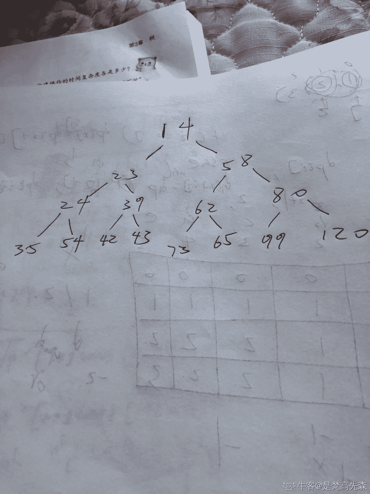
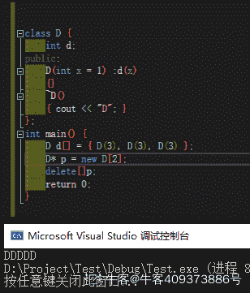
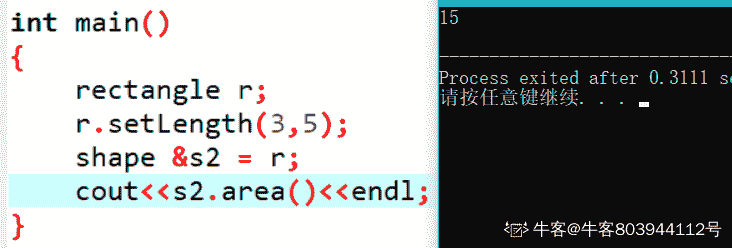

# 京东 2019 校招笔试运维工程师笔试题

## 1

在软件开发过程中，我们可以采用不同的过程模型，下列有关 增量模型描述正确的是（）

正确答案: B   你的答案: 空 (错误)

```cpp
是一种线性开发模型，具有不可回溯性
```

```cpp
把待开发的软件系统模块化，将每个模块作为一个增量组件，从而分批次地分析、设计、编码和测试这些增量组件
```

```cpp
适用于已有产品或产品原型（样品），只需客户化的工程项目
```

```cpp
软件开发过程每迭代一次，软件开发又前进一个层次
```

本题知识点

运维工程师 京东 运维工程师 京东 2019

讨论

[牛客 968167863 号](https://www.nowcoder.com/profile/968167863)

没人么

发表于 2022-02-15 16:12:03

* * *

## 2

下面有关值类型和引用类型描述正确的是（）？

正确答案: A   你的答案: 空 (错误)

```cpp
值类型的变量赋值只是进行数据复制，创建一个同值的新对象，而引用类型变量赋值，仅仅是把对象的引用的指针赋值给变量，使它们共用一个内存地址。
```

```cpp
值类型数据是在栈上分配内存空间，它的变量直接包含变量的实例，使用效率相对较高。而引用类型数据是分配在堆上，引用类型的变量通常包含一个指向实例的指针，变量通过指针来引用实例。
```

```cpp
引用类型一般都具有继承性，但是值类型一般都是封装的，因此值类型不能作为其他任何类型的基类。
```

```cpp
值类型变量的作用域主要是在栈上分配内存空间内，而引用类型变量作用域主要在分配的堆上。
```

本题知识点

运维工程师 京东 运维工程师 京东 2019

## 3

如何在多线程中避免发生死锁？

正确答案: A   你的答案: 空 (错误)

```cpp
允许进程同时访问某些资源。
```

```cpp
允许进程强行从占有者那里夺取某些资源。
```

```cpp
进程在运行前一次性地向系统申请它所需要的全部资源。
```

```cpp
把资源事先分类编号，按号分配，使进程在申请，占用资源时不会形成环路。
```

本题知识点

运维工程师 京东 运维工程师 京东 2019

## 4

以下为求 0 到 1000 以内所有奇数和的算法，从中选出描述正确的算法（ ）

正确答案: A   你的答案: 空 (错误)

```cpp
①s=0；②i=1；③s=s+i；④i=i+2；⑤如果 i≤1000，则返回③；⑥结束
```

```cpp
①s=0；②i=1；③i=i+2；④s=s+i；⑤如果 i≤1000，则返回③；⑥结束
```

```cpp
①s=1；②i=1；③s=s+i；④i=i+2；⑤如果 i≤1000，则返回③；⑥结束
```

```cpp
①s=1；②i=1；③i=i+2；④s=s+i；⑤如果 i≤1000，则返回③；⑥结束
```

本题知识点

运维工程师 京东 运维工程师 京东 2019

## 5

关于递归法的说法不正确的是（ ）

正确答案: D   你的答案: 空 (错误)

```cpp
程序结构更简洁
```

```cpp
占用 CPU 的处理时间更多
```

```cpp
要消耗大量的内存空间，程序执行慢，甚至无法执行
```

```cpp
递归法比递推法的执行效率更高
```

本题知识点

运维工程师 京东 运维工程师 京东 2019

## 6

字符串”ABCD”和字符串”DCBA”进行比较，如果让比较的结果为真，应选用关系运算符（）

正确答案: B   你的答案: 空 (错误)

```cpp
>
```

```cpp
<
```

```cpp
=
```

```cpp
>=
```

本题知识点

运维工程师 京东 运维工程师 京东 2019

## 7

下面是一段关于计算变量 s 的算法： ①变量 s 的初值是 0 ②变量 i 从 1 起循环到 n，此时变量 s 的值由下面的式子表达式计算 ③s=s+(-1)*i ④输出变量 s 的值 这个计算 s 值的算法中，s 的代数式表示是(    )。

正确答案: D   你的答案: 空 (错误)

```cpp
1-2+3-4+„+(-1)n*(n-1)
```

```cpp
1-2+3-4+„+(-1)n-1*n
```

```cpp
1+2+3+4+...+(n-1)+n
```

```cpp
-1-2-3-4-...-n
```

本题知识点

运维工程师 京东 运维工程师 京东 2019

## 8

以下运算符中运算优先级最高的是（ ）

正确答案: D   你的答案: 空 (错误)

```cpp
+
```

```cpp
OR
```

```cpp
>
```

```cpp
\
```

本题知识点

运维工程师 京东 运维工程师 京东 2019

## 9

采用哪种遍历方法可唯一确定一棵二叉树？（  ）

正确答案: B   你的答案: 空 (错误)

```cpp
给定一棵二叉树的先序和后序遍历序列
```

```cpp
给定一棵二叉树的后序和中序遍历序列
```

```cpp
给定先序、中序和后序遍历序列中的任意一个即可
```

```cpp
给定一棵二叉树的先序和中序遍历序列
```

本题知识点

运维工程师 京东 运维工程师 京东 2019

## 10

已知小顶堆：{51,32,73,23,42,62,99,14,24,39,43,58,65,80,120}，请问 62 对应节点的左子节点是

正确答案: B   你的答案: 空 (错误)

```cpp
99
```

```cpp
73
```

```cpp
3943
```

```cpp
120
```

本题知识点

运维工程师 京东 运维工程师 京东 2019

讨论

[B1NNNNN](https://www.nowcoder.com/profile/664897399)

**给的不是一个小顶堆的序列吧？给的应该是原序列，然后要我们用原序列构建一个小顶堆，然后把堆画出来，62 的左边就是 73****** 

编辑于 2020-08-05 18:59:35

* * *

## 11

若串 S=”UP！UP！JD”，则其子串的数目

正确答案: B   你的答案: 空 (错误)

```cpp
33
```

```cpp
37
```

```cpp
39
```

```cpp
35
```

本题知识点

运维工程师 京东 运维工程师 京东 2019

讨论

[归来仍是少年 v](https://www.nowcoder.com/profile/255695337)

字符串中有 n 个字符，则子串有(n+1)n/2+1,该题有字符 8 个，个子串为(8+1)*8/2+1=37,至于前面那个空格，就当没看见吧，估计没影响

发表于 2019-09-16 20:38:45

* * *

## 12

一颗二叉树的叶子节点有 5 个，出度为 1 的结点有 3 个，该二叉树的结点总个数是？

正确答案: B   你的答案: 空 (错误)

```cpp
11
```

```cpp
12
```

```cpp
13
```

```cpp
14
```

本题知识点

运维工程师 京东 运维工程师 京东 2019

## 13

以下哪种排序算法一趟结束后能够确定一个元素的最终位置？

正确答案: C   你的答案: 空 (错误)

```cpp
简单选择排序
```

```cpp
基数排序
```

```cpp
堆排序
```

```cpp
二路归并排序
```

本题知识点

运维工程师 京东 运维工程师 京东 2019

## 14

权值分别为 9、3、2、8 的结点，构造一棵哈夫曼树，该树的带权路径长度是？

正确答案: B   你的答案: 空 (错误)

```cpp
36
```

```cpp
40
```

```cpp
45
```

```cpp
46
```

本题知识点

运维工程师 京东 运维工程师 京东 2019

## 15

在（）中，只要指出表中任何一个结点的位置，就可以从它出发依次访问到表中其他所有结点。

正确答案: D   你的答案: 空 (错误)

```cpp
线性单链表
```

```cpp
双向链表
```

```cpp
线性链表
```

```cpp
循环链表
```

本题知识点

运维工程师 京东 运维工程师 京东 2019

## 16

下列对 TCP/IP 结构及协议分层不正确的是：

正确答案: C   你的答案: 空 (错误)

```cpp
网络接口层：Wi-Fi、ATM 、GPRS、EVDO、HSPA。
```

```cpp
网际层：IP、ICMP、IGMP 。
```

```cpp
传输层：TCP、UDP、TLS、ssh。
```

```cpp
FTP、TELNET、DNS、SMTP.
```

本题知识点

运维工程师 京东 运维工程师 京东 2019

## 17

以下哪种设备工作在数据链路层？

正确答案: C   你的答案: 空 (错误)

```cpp
中继器
```

```cpp
集线器
```

```cpp
交换机
```

```cpp
路由器
```

本题知识点

运维工程师 京东 运维工程师 京东 2019

## 18

打电话使用的数据传输方式是（），手机上网使用的数据传输方式是（）？

正确答案: B   你的答案: 空 (错误)

```cpp
电路交换，电路交换
```

```cpp
电路交换，分组交换
```

```cpp
分组交换，分组交换
```

```cpp
分组交换，电路交换
```

本题知识点

运维工程师 京东 运维工程师 京东 2019

## 19

后退 N 帧协议的发送窗口大小是（），接收窗口的大小是（）？

正确答案: D   你的答案: 空 (错误)

```cpp
=1,=1
```

```cpp
=1,>1
```

```cpp
>1,>1
```

```cpp
>1,=1
```

本题知识点

运维工程师 京东 运维工程师 京东 2019

## 20

TCP 释放连接第二次挥手时 ACK（）,第三次挥手时 ACK（）?

正确答案: C   你的答案: 空 (错误)

```cpp
不存在，不存在，
```

```cpp
不存在，值是 1
```

```cpp
值是 1，值是 1
```

```cpp
值是 1，不存在
```

本题知识点

运维工程师 京东 运维工程师 京东 2019

## 21

TCP 协议的拥塞控制就是防止过多的数据注入到网络中，这样可以使网络中的路由器或链路不致过载。常用的方法有:

正确答案: B   你的答案: 空 (错误)

```cpp
慢启动、窗口滑动
```

```cpp
慢开始、拥塞控制
```

```cpp
快重传、快恢复
```

```cpp
快开始、快恢复
```

本题知识点

运维工程师 京东 运维工程师 京东 2019

## 22

对于京东商城高流量访问，预防 Ddos 的方法可以有？

正确答案: A   你的答案: 空 (错误)

```cpp
限制同时打开 SYN 半链接的数目。
```

```cpp
缩短 SYN 半链接的 Time out 时间。
```

```cpp
关闭不必要的服务。
```

```cpp
限制客户端请求服务器时长。
```

本题知识点

运维工程师 京东 运维工程师 京东 2019

## 23

网络管理员把优盘上的源代码给程序员参考，但要防止程序误删除或修改，以下正确的加载方式是（      ）

正确答案: B   你的答案: 空 (错误)

```cpp
mount -o defaults /dev/sdb1 /tools
```

```cpp
mount -r /dev/sdb1 /tools
```

```cpp
mount -o ro /dev/sdb1 /tools
```

```cpp
mount -o ro /dev/sdb /tools
```

本题知识点

运维工程师 京东 运维工程师 京东 2019

## 24

下列有关软连接描述正确的是

正确答案: B   你的答案: 空 (错误)

```cpp
与普通文件没什么不同，inode 都指向同一个文件在硬盘中的区块
```

```cpp
不能对目录创建软链接
```

```cpp
保存了其代表的文件的绝对路径，是另外一种文件，在硬盘上有独立的区块，访问时替换自身路径
```

```cpp
不可以对不存在的文件创建软链接
```

本题知识点

运维工程师 京东 运维工程师 京东 2019

## 25

Ext3 日志文件系统的特点是：

正确答案: A   你的答案: 空 (错误)

```cpp
高可用性
```

```cpp
数据的完整性
```

```cpp
数据转换快
```

```cpp
多日志模式
```

本题知识点

运维工程师 京东 运维工程师 京东 2019

## 26

DHCP 是动态主机配置协议的简称,其作用是

正确答案: C   你的答案: 空 (错误)

```cpp
动态分配磁盘资源
```

```cpp
动态分配内存资源
```

```cpp
为网络中的主机分配 IP 地址
```

```cpp
为集群中的主机分配 IP 地址
```

本题知识点

运维工程师 京东 运维工程师 京东 2019

## 27

以下命令可以用于获取本地 ip 地址的是：

正确答案: A   你的答案: 空 (错误)

```cpp
ifconfig
```

```cpp
uptime
```

```cpp
top
```

```cpp
netstat
```

本题知识点

运维工程师 京东 运维工程师 京东 2019

## 28

以下命令可以用于获取本机 cpu 使用率的是：

正确答案: C   你的答案: 空 (错误)

```cpp
ifconfig
```

```cpp
uptime
```

```cpp
top
```

```cpp
netstat
```

本题知识点

运维工程师 京东 运维工程师 京东 2019

## 29

以下命令用于设置环境变量的是：

正确答案: A   你的答案: 空 (错误)

```cpp
export
```

```cpp
cat
```

```cpp
echo
```

```cpp
env
```

本题知识点

运维工程师 京东 运维工程师 京东 2019

## 30

重复的数据，会增加磁盘空间的占有率，延长操作数据的时间。可以使用规范化处理数据冗余，以下对符合第一范式的表述正确的是：

正确答案: C   你的答案: 空 (错误)

```cpp
非键属性和键（主键）属性间没有传递依赖
```

```cpp
非键属性和键（主键）属性间没有部分依赖
```

```cpp
表中不应该有重复组。列重复拆成另外一张表；行重复拆成多行
```

```cpp
一个表中的列值与其他表中的主键匹配
```

本题知识点

运维工程师 京东 运维工程师 京东 2019

## 31

以下哪条 SQL 语句可以返回 table1 中的全部的 key：

正确答案: D   你的答案: 空 (错误)

```cpp
select tabel1.key from table1 join tabel2 on table1.key=table2.key
```

```cpp
select tabel1.key from table1 right outer join tabel2 on table1.key=table2.key
```

```cpp
select tabel1.key from table1 left semi join tabel2 on table1.key=table2.key
```

```cpp
select tabel1.key from table1 left outer join tabel2 on table1.key=table2.key
```

本题知识点

运维工程师 京东 运维工程师 京东 2019

## 32

以下关于 Mysql 数据库引擎ＭyISAM 的描述错误的是？

正确答案: A   你的答案: 空 (错误)

```cpp
支持行锁
```

```cpp
如果表主要是用于插入新记录和读出记录，那么选择 MyISAM 引擎能实现处理高效率
```

```cpp
在执行查询语句（SELECT）前，会自动给涉及的所有表加读锁，在执行更新操作（UPDATE、DELETE、INSERT 等）前，会自动给涉及的表加写锁
```

```cpp
不支持事务
```

本题知识点

运维工程师 京东 运维工程师 京东 2019

## 33

Mysql 中表 user 的建表语句如下，
CREATE TABLE `user` (
  `id` bigint(20) NOT NULL AUTO_INCREMENT COMMENT '主键 Id',
  `name` varchar(255) DEFAULT NULL COMMENT '名称',
  `age` int(11) DEFAULT NULL COMMENT '年龄',
  `address` varchar(255) DEFAULT NULL COMMENT '地址',
  `created_time` datetime DEFAULT NULL COMMENT '创建时间',
  `updated_time` datetime DEFAULT NULL COMMENT '更新时间',
  PRIMARY KEY (`id`),
  KEY `idx_com1` (`name`,`age`,`address`)
) ENGINE=InnoDB DEFAULT CHARSET=utf8 COMMENT='用户表';
以下哪个查询语句没有使用到索引 idx_com1？

正确答案: C   你的答案: 空 (错误)

```cpp
select  *  from user where name='张三' and age = 25 and address='北京大兴区';
```

```cpp
select  *  from user where name='张三' and address='北京大兴区';
```

```cpp
select  *  from user where age = 25 and address='北京大兴区';
```

```cpp
select  *  from user where address='北京大兴区'  and age = 25 and name='张三'
```

本题知识点

运维工程师 京东 运维工程师 京东 2019

## 34

DELETE 和 TRUNCATE TABLE 都是删除表中的数据的语句，它们的不同之处描述正确的是：

正确答案: A   你的答案: 空 (错误)

```cpp
TRUNCATE TABLE 比 DELETE 的速度快
```

```cpp
在删除时如果遇到任何一行违反约束（主要是外键约束），TRUNCATE TABLE 仍然删除，只是表的结构及其列、约束、索引等保持不变，但 DELETE 是直接返回错误
```

```cpp
对于被外键约束的表，不能使用 TRUNCATE TABLE，而应该使用不带 WHERE 语句的 DELETE 语句。
```

```cpp
如果想保留标识计数值，要用 DELETE，因为 TRUNCATE TABLE 会对新行标志符列使用的计数值重置为该列的种子
```

本题知识点

运维工程师 京东 运维工程师 京东 2019

## 35

用户表中有两列 name/country。
现在要查询用户表中每个国家(country)的用户人数，应使用以下哪个语句

正确答案: A   你的答案: 空 (错误)

```cpp
select count(*) from users group by country
```

```cpp
B. select name from users where country = 'xx'
```

```cpp
select count(country) from users
```

```cpp
select country from users
```

本题知识点

运维工程师 京东 运维工程师 京东 2019

## 36

X 定义如下，若存在则 a.y[1]的值可能为（）

```cpp
X a;
a.x = 0x11223344;  union X{
    int x;
    char y[4];
};
```

正确答案: B C   你的答案: 空 (错误)

```cpp
11
```

```cpp
22
```

```cpp
33
```

```cpp
44
```

本题知识点

京东 2019 C 语言

讨论

[山姆高德](https://www.nowcoder.com/profile/624014280)

本人拙见：小端存储：和常用习惯一样——低地址存低位大端存储：高地址存低位大小端存储要以系统而定，小端的话应该是 33

发表于 2020-08-08 19:53:48

* * *

[哈利波特与桃花娘](https://www.nowcoder.com/profile/501696196)

这要看大端小端的吧，我的 vs2019 显示为 33

发表于 2020-08-07 19:16:02

* * *

[Despacito007](https://www.nowcoder.com/profile/893487814)

BC 都对，这道题见过很多次了，只有这里是单选

发表于 2020-09-11 20:22:47

* * *

## 37

在 C++中，引用和指针的区别是（      ）

正确答案: A   你的答案: 空 (错误)

```cpp
引用总是指向一个对象,指针可能不指向对象
```

```cpp
引用和指针都可以被重新赋值
```

```cpp
引用不能用 const 修饰，而指针可以
```

```cpp
引用创建时必须初始化，而指针则可以在任何时候被初始化
```

本题知识点

运维工程师 京东 运维工程师 京东 2019

## 38

有以下程序

```cpp
#include <iostream>
using namespace std;

class D{
    int d;
public:
    D(int x=1):d(x){}
    ~D(){
        cout<<"D";
    }
};

int main(){
    D d[]={_____________};
    D* p=new D[2];
    delete[]p;
    return 0;
 }
```

程序运行的结果是 DDDDD，请为横线处选择合适的程序（      ）

正确答案: A B   你的答案: 空 (错误)

```cpp
3,3,3
```

```cpp
D(3), D(3), D(3)
```

```cpp
3,3,3,3
```

```cpp
D(3,3),D(3,3)
```

本题知识点

京东 2019 C++

讨论

[飞翔的企鹅 3550771168](https://www.nowcoder.com/profile/393747266)

我的原回答有误，感谢@[loveling](https://www.nowcoder.com/profile/7237115)指正；我查阅了一些资料，数值形式的构造不是使用了临时对象，而是直接对数组中的对象的数据对数组元素进行初始化，这里有一篇 14 年的文章解释了：[`www.cnblogs.com/zhezh/p/3773350.html`](https://www.cnblogs.com/zhezh/p/3773350.html) 原回答：----------------------------------------------------------------------------------A 选项，3 个 3 隐式转换为三个 D，在栈上，main 函数结束析构；B 选项，3 个临时变量 D 在语句完成后析构，会多输出三个 D;C 选项，数量错误；D 选项，不用说；new 的 2 个 D 在堆上，delete 时析构；另外有人说 B 也是对的是因为微软的编译器优化了；----------------------------------------------------------------------------------

编辑于 2021-01-29 13:18:50

* * *

[牛客 409373886 号](https://www.nowcoder.com/profile/409373886)

不知所措，试验下来，AB 好像都可以

发表于 2020-08-05 15:53:31

* * *

[言 201904141050633](https://www.nowcoder.com/profile/998981358)

一开始创建三个 D，后来 D 被重新赋值，由于一开始的 D 不是 new 出来的，所以就会自动消亡，后面 new 出来的两个 D 又被 Delete 了，主要就是审题

发表于 2020-10-13 18:30:30

* * *

## 39

有以下程序

```cpp
#include <iostream>
using namespace std;
_______________________
void One(float one){cout<<"1"<<endl;    }
void Two(float two){ cout<<"2"<<endl; }
void Three(float three){ cout<<"3"<<endl; }
void main(){ 
    float i=1,j=2,k=3;
    function = One;
    function(i);
    function= Two;
    function(j);
    function = Three;
    function(k);
}
```

请为横线处选择合适的程序使得程序的运行结果是 123   （      ）?

正确答案: D   你的答案: 空 (错误)

```cpp
void *function();
```

```cpp
void *function(float);
```

```cpp
void (*function)();
```

```cpp
void (*function)(float);
```

本题知识点

运维工程师 京东 2019 C++

讨论

[霹雳小狂花](https://www.nowcoder.com/profile/161780639)

函数指针。 数据类型 （*指针名）（函数参数 1，函数参数 2，，，）

发表于 2020-08-29 20:17:55

* * *

[牛客 515830410 号](https://www.nowcoder.com/profile/515830410)

<p>函数指针。 数<p>函数指针。 数据类型 （*指针名）（函数参数 1，函数参数 2，，，）</p><p><br></p>据类型 （*指针名）（函数参数 1，函数参数 2，，，）</p><p><br></p>

发表于 2020-09-05 17:58:09

* * *

[牛客 714400023 号](https://www.nowcoder.com/profile/714400023)

函数指针一般定义为：  数据类型（*  指针变量）（参数列表）

发表于 2021-09-27 17:50:25

* * *

## 40

有以下程序
#include<iostream> 
using namespace std;
class complex 
{ public:
int real;
int imag;
complex(int r=0,int i=0) 
{ real=r;
imag=i;}
_________________________________
};
complex add(complex &a,complex & b) 
{int r=a.real+b.real;
int i=a.imag+b.imag;
return complex(r,i);}  
int  main( ) 
{complex x(1,2),y(3,4),z;
z=add(x,y);
cout<<z.real<<"+"<<z.imag<<"i"<<endl;}  
程序的输出结果为 4+6i，请为横线处选择合适的程序        （      ）

正确答案: A   你的答案: 空 (错误)

```cpp
friend complex add(complex &amp;a,complex &amp; b) ;
```

```cpp
friend complex add(complex &amp;,complex &amp;) ;
```

```cpp
complex add(complex &amp;a,complex &amp; b) ;
```

```cpp
complex add(complex ,complex ) ;
```

本题知识点

运维工程师 京东 2019 C++

讨论

[牛客 976224598 号](https://www.nowcoder.com/profile/976224598)

形参里面为什么是分号？

发表于 2020-08-07 03:40:01

* * *

[佚](https://www.nowcoder.com/profile/822631024)

答案：空线处不用添加任何内容原因：complex 类中的数据成员的访问权限为 public，如果访问权限为 private 那么答案才是 A 选项

发表于 2021-02-18 15:27:37

* * *

[一只牛犊](https://www.nowcoder.com/profile/339203278)

这个为什么要定义成友元呀

发表于 2020-11-15 10:11:03

* * *

## 41

有以下程序
#include<iostream> 
#include<fstream> 
#include<string> 
using namespace std; 
int main() 
{ofstream File1("text.txt");  
string d("20160314"); 
string y=d.substr(0,4); 
int k=d.find("2");
int i=d.find("3"); 
string m=d.substr(k+2,i-k); 
string dd=d.substr(i+1,2); 
string n=dd+m+y; 
File1<<n<<endl; 
File1.close(); 
}                                            
文件 text.txt 中写入的结果是（      ）

正确答案: C   你的答案: 空 (错误)

```cpp
20160314
```

```cpp
14032016
```

```cpp
14160312016
```

```cpp
20031416
```

本题知识点

运维工程师 京东 2019 C++

讨论

[AL0801](https://www.nowcoder.com/profile/654691982)

1 string.substr（n,m） 返回的是字符串 string 中从下标 n 开始的连续 m 个字符  所以： string y=d.substr(0,4);  得到的 y = “2016”2 string.find（“n”）返回的是 string 中第一个等于“n”字符的下标  所以：int k=d.find("2");  k = 0；
            int i=d.find("3");    i = 5；           string m=d.substr(k+2,i-k);   =》 m = d.substr(0+2,5-0); =》 m = “16031”；
           string dd=d.substr(i+1,2);     =》 dd = d.substr(6+1,2); =》dd = “14”；结论： n = dd + m + y = “14” + “16031” + “2016” = “14160312016”

发表于 2021-04-09 17:25:34

* * *

[7327](https://www.nowcoder.com/profile/620637965)

str. substr(m,n)是截取 str 字符串中从第 m 位到第 m+n 位的字符串。 find 函数用来查找第一次出现参数串的位置，从 0 开始。推算一下答案是 C

发表于 2020-08-16 23:31:29

* * *

[20200722](https://www.nowcoder.com/profile/433084385)

C++中的 substr 函数，是用来截取字符串的。str. substr(m,n)是截取 str 字符串中从第 m 位到第 n 位的字符串。 find 函数用来查找第一次出现参数串的位置，如果查找成功返回位置，否则返回-1。

发表于 2020-08-06 21:01:21

* * *

## 42

有以下函数模版
#include <iostream> 
using namespace std; 
template <class T>
void S(T &x, T &y)
{ T temp;
   temp = x;
   x = y;
   y = temp;}
template <class T>
void SS(T A[], int n)
{ int min;    
  int i, j;
  for (i=0; i<n-1; i++) 
  { min=i;    
    for (j=_____; j<n; j++) 
     if (A[j]<A[min]) min=j;
    S(A[i], A[min]);
  }   }
其功能是将 A 数组中的数按照由小到大的顺序排列，请为横线处选择合适的程序（      ）

正确答案: C   你的答案: 空 (错误)

```cpp
1
```

```cpp
0
```

```cpp
i+1
```

```cpp
i
```

本题知识点

运维工程师 京东 运维工程师 京东 2019

## 43

有以下类定义

```cpp
#include <iostream>
using namespace std;
class shape {
public:
    virtual int area()=0;
};
class rectangle:public shape {
public:
    int a, b;
    void setLength (int x, int y) {a=x;b=y;}
    int area() {return a*b;}
};
```

若有语句定义 rectangle r; r.setLength(3,5); 则编译时无语法错误的语句是（      ）

正确答案: A B   你的答案: 空 (错误)

```cpp
shape *s1=&r;
```

```cpp
shape &s2=r;
```

```cpp
shape s3=r;
```

```cpp
shape s4[3];
```

本题知识点

运维工程师 京东 2019 C++

讨论

[Rurcher](https://www.nowcoder.com/profile/706315130)

题目是有错误的，抽象类不能实例化对象，但抽象类的指针或引用可以指向派生类，A,B 选项本质上是一样的，只是不能调用派生类独有的成员函数，可以调用被派生类重写的函数

发表于 2020-09-06 12:37:05

* * *

[牛客 803944112 号](https://www.nowcoder.com/profile/803944112)



发表于 2020-09-21 14:59:03

* * *

[幻术师](https://www.nowcoder.com/profile/128547009)

a,b 都是对的，code 过

发表于 2020-11-09 23:33:12

* * *

## 44

关于 C++中的友元函数说法正确的是（      ）

正确答案: B   你的答案: 空 (错误)

```cpp
友元函数需要通过对象或指针调用
```

```cpp
友元函数是不能被继承的
```

```cpp
友元函数没有 this 指针
```

```cpp
友元函数破环了继承性机制
```

本题知识点

运维工程师 京东 运维工程师 京东 2019

## 45

下列代码执行后的输出结果为（      ）
int main()   
{
    char c, s[20];
    strcpy(s, "Hello,World");
    printf("s[]=%6.9s\n", s);
    return 0;
}

正确答案: D   你的答案: 空 (错误)

```cpp
s[]=Hello,
```

```cpp
s[]=Hello,World
```

```cpp
s[]=   Hello,
```

```cpp
s[]=Hello,Wor
```

本题知识点

运维工程师 京东 运维工程师 京东 2019

## 46

struct Student{
    int num;
    char name[7];   
    short age;
    char sex;
}student1;
int sz = sizeof(student1);
则执行上面语句后，变量 sz 的值为（      ）

正确答案: C   你的答案: 空 (错误)

```cpp
14
```

```cpp
15
```

```cpp
16
```

```cpp
20
```

本题知识点

运维工程师 京东 运维工程师 京东 2019

## 47

对于如下 C++程序：
int main() {
 vector<int> vInt(1);

 cout << vInt[1];
 cout << vInt.at(1);

 return 0;
}
请问两个 cout 语句分别会发生什么情况（）

正确答案: C   你的答案: 空 (错误)

```cpp
抛出异常 抛出异常
```

```cpp
未定义 未定义
```

```cpp
未定义 抛出异常
```

```cpp
抛出异常 未定义
```

本题知识点

运维工程师 京东 运维工程师 京东 2019

## 48

对于如下 C++程序：
int main() {
 vector<int> vInt;

 for (int i=0; i<5; ++i)
 {
  vInt.push_back(i);

  cout << vInt.capacity() << " ";
 }

 vector<int> vTmp(vInt);
 cout << vTmp.capacity() << "\n";

 return 0;
}
请问程序输出的是（）

正确答案: C   你的答案: 空 (错误)

```cpp
1 2 3 4 5 5
```

```cpp
1 2 3 4 5 8
```

```cpp
1 2 4 4 8 5
```

```cpp
1 2 4 4 8 8
```

本题知识点

运维工程师 京东 运维工程师 京东 2019

## 49

对于如下 C++程序：int main() {
 int a(1), b(3), c(2);

 while (a < b < c)
 {
  ++a;
  --b;
  --c;
 }

 cout << a << " " << b << " " << c << "\n";

 return 0;
}
请问输出结果是（）

正确答案: C   你的答案: 空 (错误)

```cpp
1 3 2
```

```cpp
2 2 1
```

```cpp
3 1 0
```

```cpp
4 0 -1
```

本题知识点

运维工程师 京东 运维工程师 京东 2019

## 50

public class Main {

    public static void main(String[] args) {
        System.out.println("A");
        new Main();
        new Main();
    }

    public Main() {
        System.out.println("B");
    }

    {
        System.out.println("C");
    }

    static {
        System.out.println("D");
    }
}
以上程序输出的结果，正确的是？

正确答案: C   你的答案: 空 (错误)

```cpp
DCABB
```

```cpp
DABCBC
```

```cpp
DACBCB
```

```cpp
DACBB
```

本题知识点

运维工程师 京东 运维工程师 京东 2019

## 51

public class Main {

    private static int x = 10;
    private static Integer y = 10;

    public static void updateX(int value) {
        value = 3 * value;
    }

    public static void updateY(Integer value) {
        value = 3 * value;
    }

    public static void main(String[] args) {
        updateX(x);
        updateY(y);
    }
}
执行以上程序后，x 和 y 的值分别是多少？

正确答案: A   你的答案: 空 (错误)

```cpp
10,10
```

```cpp
10,30
```

```cpp
30,10
```

```cpp
30,30
```

本题知识点

运维工程师 京东 运维工程师 京东 2019

## 52

public class Main {

    public static void main(String[] args) {
        String s1 = "abc";
        String s2 = "abc";
        System.out.println(s1 == s2);

        String s3 = new String("abc");
        System.out.println(s1 == s3);
    }
}
执行以上程序后，输出结果正确的是？

正确答案: B   你的答案: 空 (错误)

```cpp
true       true
```

```cpp
true       false
```

```cpp
false       fasle
```

```cpp
false       true
```

本题知识点

运维工程师 京东 运维工程师 京东 2019

## 53

JAVA 的类加载期负责整个生命周期内的 class 的初始化和加载工作，就虚拟机的规范来说，以下代码会输出什么结果？
public class Test {

    public static void main(String[] args) {
        System.out.println(Test2.a);
    }

}
class Test2{
    public static final String a="JD";

    static {
        System.out.print("OK");
    }

}

正确答案: A   你的答案: 空 (错误)

```cpp
只有 JD
```

```cpp
只有 OK
```

```cpp
输出 JDOK
```

```cpp
输出 OKJD
```

本题知识点

运维工程师 京东 2019

## 54

JAVA 的类加载期负责整个生命周期内的 class 的初始化和加载工作，就虚拟机的规范来说，以下代码会输出什么结果？
public class Test {

    public static void main(String[] args) {
        System.out.println(Test2.a);
    }

}
class Test2{
    public static final String a=new String("JD");

    static {
        System.out.print("OK");
    }

}

正确答案: D   你的答案: 空 (错误)

```cpp
只有 JD
```

```cpp
只有 OK
```

```cpp
输出 JDOK
```

```cpp
输出 OKJD
```

本题知识点

运维工程师 京东 2019

## 55

JAVA 的类加载期负责整个生命周期内的 class 的初始化和加载工作，就虚拟机的规范来说，以下代码会输出什么结果？
public class Test {

    public static void main(String[] args) {
        System.out.println(Test2.a);
    }

}
class Test2{
    static {
        System.out.print("OK");
    }

    public static final String a=new String("JD");

}

正确答案: D   你的答案: 空 (错误)

```cpp
只有 JD
```

```cpp
只有 OK
```

```cpp
输出 JDOK
```

```cpp
输出 OKJD
```

本题知识点

运维工程师 京东 2019

## 56

继承是 JAVA 语言的一个特性，针对类的继承，虚拟机会如何进行父类和子类的初始化加载呢？请阅读代码选择出该段代码的输入结果。
public class Test {

    public static void main(String[] args) {
        System.out.print(B.c);
    }
}

class A {
    static {
        System.out.print("A");
    }
}

class B extends A{
    static {
        System.out.print("B");
    }
    public final static String c = "C";
}

正确答案: C   你的答案: 空 (错误)

```cpp
AB
```

```cpp
ABC
```

```cpp
C
```

```cpp
BC
```

本题知识点

运维工程师 京东 运维工程师 京东 2019

## 57

继承是 JAVA 语言的一个特性，针对类的继承，虚拟机会如何进行父类和子类的初始化加载呢？请阅读代码选择出该段代码的输入结果。
public class Test {

    public static void main(String[] args) {
        System.out.print(B.c);
    }
}

class A {
    public static String c = "C";
    static {
        System.out.print("A");
    }
}

class B extends A{
    static {
        System.out.print("B");
    }
}

正确答案: A   你的答案: 空 (错误)

```cpp
AC
```

```cpp
ABC
```

```cpp
C
```

```cpp
BC
```

本题知识点

运维工程师 京东 运维工程师 京东 2019

## 58

根据类加载器加载类的初始化原理，推断以下代码的输入结果为？
public class Test {

    public static void main(String[] args) throws Exception{
      ClassLoader classLoader=ClassLoader.getSystemClassLoader();
      Class clazz=classLoader.loadClass("A");
      System.out.print("Test");
      clazz.forName("A");
    }
}

class A{
    static {
        System.out.print("A");
    }
}

正确答案: A   你的答案: 空 (错误)

```cpp
TestA
```

```cpp
ATestA
```

```cpp
ATest
```

```cpp
Test
```

本题知识点

运维工程师 京东 2019

## 59

public class Main {

    public static void main(String[] args) {
        System.out.print(fun1());
    }

    public static String fun1() {
        try {
            System.out.print("A");
            return fun2();
        } finally {
            System.out.print("B");
        }
    }

    public static String fun2() {
        System.out.print("C");
        return "D";
    }
}
执行以上程序后，输出结果正确的是？

正确答案: C   你的答案: 空 (错误)

```cpp
ABCD
```

```cpp
ACDB
```

```cpp
ACBD
```

```cpp
不确定
```

本题知识点

运维工程师 京东 运维工程师 京东 2019

## 60

import java.util.ArrayList;
import java.util.List;
public class Main {
    public static void main(String[] args) {
        List<String> list = new ArrayList<>();
        for(int i=0;i<100;i++){
            list.add("a");
        }
    }
}
JDK1.8 中，执行以上程序后，该 list 进行了几次扩容？

正确答案: C   你的答案: 空 (错误)

```cpp
4
```

```cpp
5
```

```cpp
6
```

```cpp
7
```

本题知识点

运维工程师 京东 运维工程师 京东 2019

## 61

Object 类不含有以下哪种方法？

正确答案: A   你的答案: 空 (错误)

```cpp
equal
```

```cpp
wait
```

```cpp
notify
```

```cpp
clone
```

本题知识点

运维工程师 京东 运维工程师 京东 2019

## 62

import java.util.concurrent.ArrayBlockingQueue;
import java.util.concurrent.ThreadPoolExecutor;
import java.util.concurrent.TimeUnit;
public class Main {
    public static void main(String[] args) {
        ThreadPoolExecutor executor = new ThreadPoolExecutor(5, 10, 15, TimeUnit.SECONDS,
                new ArrayBlockingQueue<Runnable>(5), new ThreadPoolExecutor.CallerRunsPolicy());
    }
}
线程池 executor 在空闲状态下的线程个数是？

正确答案: B   你的答案: 空 (错误)

```cpp
0
```

```cpp
5
```

```cpp
10
```

```cpp
不确定
```

本题知识点

运维工程师 京东 运维工程师 京东 2019

## 63

public class Main{

    public static ArrayList<String> list = new ArrayList<>();

    public static void main(String[] args) throws Exception{
        Thread t1 = new Main().new MyThread();
        Thread E10:E64t2 = new Thread(new Main().new MyRunnable());
        t1.setPriority(3);
        t2.setPriority(8);
        t1.start();
        t2.start();
        t2.join();

        for (int i = 0; i < 100000; i++) {
            i++;
        }
        list.add("main");

        t1.join();

        for (String s : list) {
            System.out.println(s);
        }
    }

    class MyThread extends Thread{
        @Override
        public void run(){
            for (int i = 0; i < 100000; i++) {
                i++;
            }
            list.add("Thread 1");
        }
    }

    class MyRunnable implements Runnable{
        @Override
        public void run(){
            for (int i = 0; i < 100000; i++) {
                Thread.yield();
                i++;
            }
            list.add("Thread 2");
        }
    }
}

正确答案: A   你的答案: 空 (错误)

```cpp
Thread 1     Thread 2    main
```

```cpp
Thread 2     Thread 1    main
```

```cpp
Thread 2    main    Thread 1
```

```cpp
无法判断
```

本题知识点

运维工程师 京东 运维工程师 京东 2019

## 64

下列程序打印结果为（      ）
import re
m = re.search('[0-9]','a1b2c3d4')
print(m.group(0))

正确答案: A   你的答案: 空 (错误)

```cpp
1
```

```cpp
1234
```

```cpp
None
```

```cpp
其他几项都不对
```

本题知识点

运维工程师 京东 运维工程师 京东 2019

## 65

下列程序打印结果为（      ）
import datetime
t1 = datetime.datetime(2017,10,10,21,40)
t2 = datetime.datetime(2017,10,8,23,40)
tt1 = datetime.timedelta(seconds = 1200)
tt2 = datetime.timedelta(weeks = 3)
print(t1 - t2)

正确答案: D   你的答案: 空 (错误)

```cpp
600
```

```cpp
3600
```

```cpp
1 day, 02:00:00
```

```cpp
1 day, 22:00:00
```

本题知识点

运维工程师 京东 运维工程师 京东 2019

## 66

将 Person 表中 Name 字段为"Lilei"的 AGE 字段递增 1，可以使用哪个 SQL 语句（      ）

正确答案: A   你的答案: 空 (错误)

```cpp
UPDATE Person SET AGE = AGE + 1 WHERE Name = 'Lilei'
```

```cpp
Alter Person SET AGE = AGE + 1 WHERE Name = 'Lilei'
```

```cpp
UPDATE Person SET AGE = AGE + 1 WHERE Name = Lilei
```

```cpp
SET AGE = AGE + 1 FROM Person WHERE Name = 'Lilei'
```

本题知识点

运维工程师 京东 运维工程师 京东 2019

## 67

将编码为 gbk 的字符串 s 转码为 utf-8 编码，以下操作正确的是

正确答案: D   你的答案: 空 (错误)

```cpp
s.encode('utf-8')
```

```cpp
s.decode('gbk')
```

```cpp
s.encode('gbk').decode('utf-8')
```

```cpp
s.decode('gbk').encode('utf-8')
```

本题知识点

运维工程师 京东 运维工程师 京东 2019

## 68

以下关于 range/xrange 说法错误的是：

正确答案: B   你的答案: 空 (错误)

```cpp
range 返回的是 list
```

```cpp
xrange 返回的是 list
```

```cpp
生成大的数字序列时，适宜用 range
```

```cpp
生成大的数字序列时，适宜用 xrange
```

本题知识点

运维工程师 京东 2019

## 69

python 函数中支持*args 和**kwargs。
关于二者的区别以下说法错误的是：

正确答案: C   你的答案: 空 (错误)

```cpp
args 要位于 kwargs 之前
```

```cpp
kwargs 是将相应的传值以字典形式呈现
```

```cpp
args 是将相应的传值以 list 的形式呈现
```

```cpp
kwargs 表示关键字参数
```

本题知识点

运维工程师 京东 运维工程师 京东 2019

## 70

系统管理员编写扫描临时文件的 shell 程序 tmpsc.sh, 测试该程序时提示拒绝执行，解决的方法有（      ）

正确答案: B   你的答案: 空 (错误)

```cpp
chmod 644 tmpsc.sh
```

```cpp
chmod 755 tmpsc.sh
```

```cpp
chmod a+x tmpsc.sh
```

```cpp
chmod u+x tmpsc.sh
```

本题知识点

运维工程师 京东 运维工程师 京东 2019

## 71

在 bash 编程中,算术比较大于、大于等于的运算符是（      ）

正确答案: C   你的答案: 空 (错误)

```cpp
>
```

```cpp
>=
```

```cpp
ge
```

```cpp
gt
```

本题知识点

运维工程师 京东 运维工程师 京东 2019

## 72

echo `expr 3/4`的执行结果

正确答案: D   你的答案: 空 (错误)

```cpp
0
```

```cpp
1
```

```cpp
0.75
```

```cpp
43163
```

本题知识点

运维工程师 京东 运维工程师 京东 2019

## 73

文件目录 data 当前权限为 rwx --- ---，只需要增加用户组可读权限，但不允许写操作，具体方法为：

正确答案: A   你的答案: 空 (错误)

```cpp
chmod +050 data
```

```cpp
chmod +040 data
```

```cpp
chmod +005 data
```

```cpp
chmod +004 data
```

本题知识点

运维工程师 京东 运维工程师 京东 2019

## 74

bash 脚本文件一般第一行开头是

正确答案: C   你的答案: 空 (错误)

```cpp
//
```

```cpp
##
```

```cpp
#!
```

```cpp
#/
```

本题知识点

运维工程师 京东 运维工程师 京东 2019

## 75

如何获取上一条命令执行的返回码

正确答案: C   你的答案: 空 (错误)

```cpp
$!
```

```cpp
0
```

```cpp
$?
```

```cpp
$#
```

本题知识点

运维工程师 京东 运维工程师 京东 2019

## 76

Shell 脚本（shell script），是一种为 shell 编写的脚本程序。现有一个 test.sh 文件，且有可执行权限，文件中内容为：
#!/bin/bash
aa='Hello World !'
请问下面选项中哪个能正常显示 Hello World !

正确答案: D   你的答案: 空 (错误)

```cpp
sh test.sh >/dev/null 1 && echo $aa
```

```cpp
./test.sh >/dev/null 1 && echo $aa
```

```cpp
bash test.sh >/dev/null 1 && echo $aa
```

```cpp
. ./test.sh >/dev/null 1 && echo $aa
```

本题知识点

运维工程师 京东 运维工程师 京东 2019

## 77

以下哪个命令是将标准输出和错误重定向到 a.txt 文件

正确答案: A   你的答案: 空 (错误)

```cpp
&>a.txt
```

```cpp
&|a.txt
```

```cpp
a.txt < &
```

```cpp
a.txt | &
```

本题知识点

运维工程师 京东 运维工程师 京东 2019