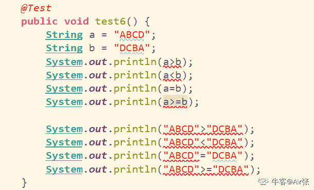
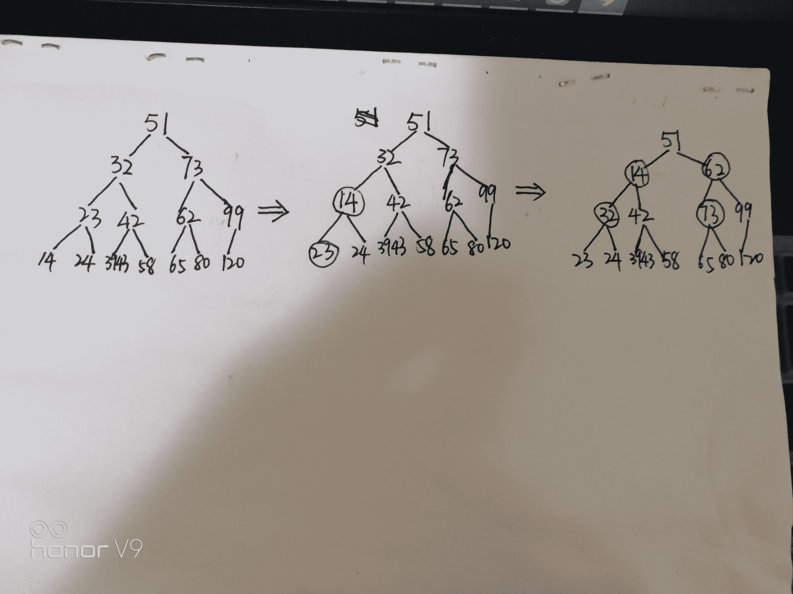
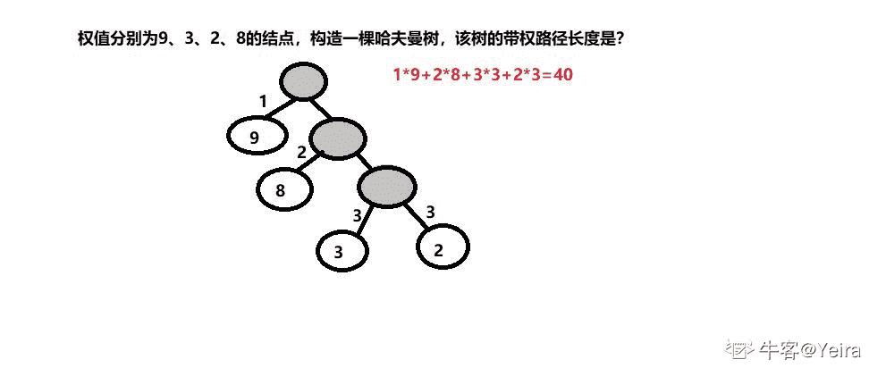
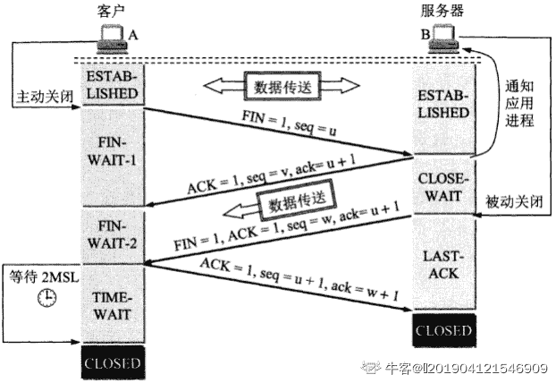
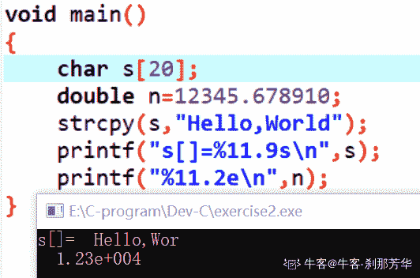

# 京东 2019 校招笔试测试开发工程师笔试题

## 1

在软件开发过程中，我们可以采用不同的过程模型，下列有关 增量模型描述正确的是（）

正确答案: B   你的答案: 空 (错误)

```cpp
是一种线性开发模型，具有不可回溯性
```

```cpp
把待开发的软件系统模块化，将每个模块作为一个增量组件，从而分批次地分析、设计、编码和测试这些增量组件
```

```cpp
适用于已有产品或产品原型（样品），只需客户化的工程项目
```

```cpp
软件开发过程每迭代一次，软件开发又前进一个层次
```

本题知识点

Java 工程师 C++工程师 测试工程师 京东 测试开发工程师 京东 2019

讨论

[你别皱眉 20190209194829](https://www.nowcoder.com/profile/123451777)

**增量模型融合了瀑布模型的基本成分和原型实现的迭代特征，它假设可以将需求分段为一系列增量产品，每一增量可以分别开发。**使用增量模型，第 1 个增量往往是核心的产品。客户对每个增量的使用和评估都作为下一个增量发布的新特征和功能，这个过程在每一个增量发布后不断重复，直到产生了最终的完善产品。增量模型强调每一个增量均发布一个可操作的产品 就是先开发一个核心模块 ,再把其他模块一个个往上加

发表于 2019-02-24 17:01:10

* * *

## 2

下面有关值类型和引用类型描述正确的是（）？

正确答案: A   你的答案: 空 (错误)

```cpp
值类型的变量赋值只是进行数据复制，创建一个同值的新对象，而引用类型变量赋值，仅仅是把对象的引用的指针赋值给变量，使它们共用一个内存地址。
```

```cpp
值类型数据是在栈上分配内存空间，它的变量直接包含变量的实例，使用效率相对较高。而引用类型数据是分配在堆上，引用类型的变量通常包含一个指向实例的指针，变量通过指针来引用实例。
```

```cpp
引用类型一般都具有继承性，但是值类型一般都是封装的，因此值类型不能作为其他任何类型的基类。
```

```cpp
值类型变量的作用域主要是在栈上分配内存空间内，而引用类型变量作用域主要在分配的堆上。
```

本题知识点

Java 工程师 C++工程师 测试工程师 京东 测试开发工程师 京东 2019

讨论

[你别皱眉 20190209194829](https://www.nowcoder.com/profile/123451777)

[`blog.csdn.net/zhangsanfeng2009/article/details/80900963`](https://blog.csdn.net/zhangsanfeng2009/article/details/80900963)这个写的很详细 , D 有点没看明白,不过基本类型的分配内存确实是在栈里 引用类型的分配也确实是在堆上

发表于 2019-02-24 17:05:04

* * *

[喵酱✨](https://www.nowcoder.com/profile/146362017)

A、对。值类型的变量赋值只是进行数据复制，创建一个同值的新对象，而引用类型变量赋值，仅仅是把对象的引用的指针赋值给变量，使它们共用一个内存地址。B、错。值类型变量不包含实例，实例是针对于对象的概念，当类实例化为对象的时候，这个时候可以称为是类的一个实例。另外 Java 中没有指针这个概念，引用类型的变量中是堆中对象的地址 C、错。封装的概念也是针对类而言的，值类型数据不存在封装概念。D、错。值类型变量可以作为成员变量存储在堆里，例如一个 Class A 中包含一个 int value，那么 value 是作为成员变量存储在堆中的。

发表于 2020-05-24 13:44:22

* * *

## 3

如何在多线程中避免发生死锁？

正确答案: A   你的答案: 空 (错误)

```cpp
允许进程同时访问某些资源。
```

```cpp
允许进程强行从占有者那里夺取某些资源。
```

```cpp
进程在运行前一次性地向系统申请它所需要的全部资源。
```

```cpp
把资源事先分类编号，按号分配，使进程在申请，占用资源时不会形成环路。
```

本题知识点

Java 工程师 C++工程师 测试工程师 京东 测试开发工程师 京东 2019

讨论

[Kyrieving](https://www.nowcoder.com/profile/574618782)

ABCD 不都是预防死锁的吗？

发表于 2020-08-27 17:36:52

* * *

[`www.bao.com`](https://www.nowcoder.com/profile/210940104)

BCD 是死锁预防 ? A 是说不加锁了所以避免死锁了 ?

发表于 2020-04-04 18:55:10

* * *

[我想拥有 offer](https://www.nowcoder.com/profile/164032614)

这个题不对吧？？。。。

发表于 2019-08-24 17:28:08

* * *

## 4

以下为求 0 到 1000 以内所有奇数和的算法，从中选出描述正确的算法（ ）

正确答案: A   你的答案: 空 (错误)

```cpp
①s=0；②i=1；③s=s+i；④i=i+2；⑤如果 i≤1000，则返回③；⑥结束
```

```cpp
①s=0；②i=1；③i=i+2；④s=s+i；⑤如果 i≤1000，则返回③；⑥结束
```

```cpp
①s=1；②i=1；③s=s+i；④i=i+2；⑤如果 i≤1000，则返回③；⑥结束
```

```cpp
①s=1；②i=1；③i=i+2；④s=s+i；⑤如果 i≤1000，则返回③；⑥结束
```

本题知识点

Java 工程师 C++工程师 测试工程师 京东 测试开发工程师 京东 2019

讨论

[SunShine201901](https://www.nowcoder.com/profile/389233498)

A 和 B 选项的区别在于第 3 步和第 4 步，B 中当 i=999 时，先执行步骤 3，则 i=i+2=1001,接着第 4 步 s=s+1001,如此看来这种 3、4 步的写法求得的 S 会多加了一个 i=1001.

发表于 2019-02-17 13:14:21

* * *

## 5

关于递归法的说法不正确的是（ ）

正确答案: D   你的答案: 空 (错误)

```cpp
程序结构更简洁
```

```cpp
占用 CPU 的处理时间更多
```

```cpp
要消耗大量的内存空间，程序执行慢，甚至无法执行
```

```cpp
递归法比递推法的执行效率更高
```

本题知识点

Java 工程师 C++工程师 测试工程师 京东 测试开发工程师 京东 2019

讨论

[smj0471](https://www.nowcoder.com/profile/7374965)

递归：从已知问题的结果出发，用迭代表达式逐步推算出问题的开始条件，即顺推法的逆过程。递推：用一种若干步重复运算来描述复杂问题的方法，通常是通过计算机前的一些项来得出序列中指定对象的值。递归与递推的区别：相对于递归算法，递推算法免除了数据进出栈的过程，也就是说，不需要函数不断地向边界靠拢，从而直接从边界出发直到求出函数值

发表于 2019-02-15 11:30:25

* * *

## 6

字符串”ABCD”和字符串”DCBA”进行比较，如果让比较的结果为真，应选用关系运算符（）

正确答案: B   你的答案: 空 (错误)

```cpp
>
```

```cpp
<
```

```cpp
=
```

```cpp
>=
```

本题知识点

Java 工程师 C++工程师 测试工程师 京东 测试开发工程师 京东 2019

讨论

[Air 张](https://www.nowcoder.com/profile/4168182)

Java 语言，使用 idea 编译器，直接报错；等于的时候是赋值；请问给出答案的和结论的，为什么？

发表于 2019-09-02 16:05:15

* * *

[YOYOka](https://www.nowcoder.com/profile/723487672)

两个字符串比较，是将这两个字符串从左到右逐个字符比较。

*   如果两个[字符串](https://baike.baidu.com/item/%E5%AD%97%E7%AC%A6%E4%B8%B2)长度相等，且每一个相应位置上的字符都一样，就认为两个字符串相等，如“THEN”=“THEN”。
*   如果两个[字符串](https://baike.baidu.com/item/%E5%AD%97%E7%AC%A6%E4%B8%B2)长度不相等，则以第一个不相同的字符作为基准，而不考虑他们的长度及其后字符的比较结果。如“CHINA”>“CANADA”。
*   如果两个[字符串](https://baike.baidu.com/item/%E5%AD%97%E7%AC%A6%E4%B8%B2)长度不相等，且所有相应位置上的字符都一样，则***为大。如“THESE”>“THE”。（摘自百度百科）

此题中因为两个字符串第一个字符就不相等故不考虑他们的长度及其后字符的比较结果，且 A＜D, 即 ABCD＜DCBA 。故选 B

发表于 2019-03-08 00:20:05

* * *

## 7

下面是一段关于计算变量 s 的算法： ①变量 s 的初值是 0 ②变量 i 从 1 起循环到 n，此时变量 s 的值由下面的式子表达式计算 ③s=s+(-1)*i ④输出变量 s 的值 这个计算 s 值的算法中，s 的代数式表示是(    )。

正确答案: D   你的答案: 空 (错误)

```cpp
1-2+3-4+„+(-1)n*(n-1)
```

```cpp
1-2+3-4+„+(-1)n-1*n
```

```cpp
1+2+3+4+...+(n-1)+n
```

```cpp
-1-2-3-4-...-n
```

本题知识点

Java 工程师 C++工程师 测试工程师 京东 测试开发工程师 京东 2019

## 8

以下运算符中运算优先级最高的是（ ）

正确答案: D   你的答案: 空 (错误)

```cpp
+
```

```cpp
OR
```

```cpp
>
```

```cpp
\
```

本题知识点

Java 工程师 C++工程师 测试工程师 京东 测试开发工程师 京东 2019

讨论

[鱼里](https://www.nowcoder.com/profile/918927345)

D 选项是什么运算符??

发表于 2019-02-24 14:36:51

* * *

[SunShine201901](https://www.nowcoder.com/profile/389233498)

！ > 算术运算符 > 关系运算符 > && > || > 赋值运算符

发表于 2019-02-17 13:25:16

* * *

[在你右边👉](https://www.nowcoder.com/profile/127185107)

这个 D 是什么运算符？？？？？？？

发表于 2020-08-06 16:15:39

* * *

## 9

采用哪种遍历方法可唯一确定一棵二叉树？（  ）

正确答案: B   你的答案: 空 (错误)

```cpp
给定一棵二叉树的先序和后序遍历序列
```

```cpp
给定一棵二叉树的后序和中序遍历序列
```

```cpp
给定先序、中序和后序遍历序列中的任意一个即可
```

```cpp
给定一棵二叉树中序遍历序列
```

本题知识点

Java 工程师 C++工程师 测试工程师 京东 测试开发工程师 2019

讨论

[leaves31](https://www.nowcoder.com/profile/924469239)

B 和 D 都可以，只要有中序遍历，再给出前序遍历或者后序遍历都可以。 前序和后序的目的是找到根节点。

发表于 2019-01-29 10:36:17

* * *

[迷路的修仙少女](https://www.nowcoder.com/profile/852275378)

之前听课，记得是前序和中序组合，或者后序和中序组合，都是可以唯一确定二叉树的。这个答案让我很困惑。

发表于 2020-08-15 17:12:10

* * *

[SunShine201901](https://www.nowcoder.com/profile/389233498)

D 选项不对吗，我怎么觉得 BD 都对呢

发表于 2019-02-17 13:28:16

* * *

## 10

已知小顶堆：{51,32,73,23,42,62,99,14,24,39,43,58,65,80,120}，请问 62 对应节点的左子节点是

正确答案: B   你的答案: 空 (错误)

```cpp
99
```

```cpp
73
```

```cpp
3943
```

```cpp
120
```

本题知识点

Java 工程师 C++工程师 测试工程师 京东 测试开发工程师 京东 2019

讨论

[Liya316](https://www.nowcoder.com/profile/7321593)

按照堆的特点可以把堆分为**大顶堆**和**小顶堆**

大顶堆：每个结点的值都**大于**或**等于**其左右孩子结点的值

小顶堆：每个结点的值都**小于**或**等于**其左右孩子结点的值

发表于 2019-08-21 20:44:03

* * *

[Dream 静](https://www.nowcoder.com/profile/5094616)

①先按照题中小顶堆的结点顺序构建一课完全二叉树②将倒数第二层的结点与小于自己的子节点进行交换，如 23 和 14③将倒数第三层的结点与小于自己的子节点进行交换，如 73 和 62 交换过后，答案显而易见，62 左子节点是 73 

编辑于 2019-03-13 15:10:21

* * *

## 11

若串 S=”UP！UP！JD”，则其子串的数目

正确答案: B   你的答案: 空 (错误)

```cpp
33
```

```cpp
37
```

```cpp
39
```

```cpp
35
```

本题知识点

Java 工程师 C++工程师 测试工程师 京东 测试开发工程师 京东 2019

讨论

[Dream 静](https://www.nowcoder.com/profile/5094616)

子串公式：n（n+1）/2+18*9/2+1=37

发表于 2019-03-13 14:54:28

* * *

[藤和艾莉欧。](https://www.nowcoder.com/profile/134888353)

这个是以前高中的概率题吧.......简单来说就是**插板法****，**八个字符的话就有九个空格（前后都要算进来的），九个空选两个空位放板子，也就是 C²[9]**r 然后加上空串，一共 37 个子串**

发表于 2019-08-06 20:58:24

* * *

[鱼里](https://www.nowcoder.com/profile/918927345)

不是 30 吗😂

发表于 2019-02-24 14:50:31

* * *

## 12

一颗二叉树的叶子节点有 5 个，出度为 1 的结点有 3 个，该二叉树的结点总个数是？

正确答案: B   你的答案: 空 (错误)

```cpp
11
```

```cpp
12
```

```cpp
13
```

```cpp
14
```

本题知识点

Java 工程师 C++工程师 测试工程师 京东 测试开发工程师 京东 2019

讨论

[SunShine201901](https://www.nowcoder.com/profile/389233498)

二叉树公式 n0=n2+1，叶子结点即 n0=5，求得 n2=4。又有出度为 1 即 n1=3，故 n1+n2+n0=12

发表于 2019-02-17 13:48:03

* * *

[🐤201904121546909](https://www.nowcoder.com/profile/284999892)

设总的节点数为 n，度为 0 的节点数为 n[0]，度为 1 的节点数为 n[1]，度为 2 的节点数为 n[2].则 n=n[0]+n[1]+n[2]。

该树中除了根节点没有前驱，每个节点只有一个前驱，因此有 n 个节点的树的总边数为 n-1 条。总边数与度之间的关系为：n-1=0*n[0]+1*n[1]+2*n[2]。度为 1 对应有一个边，度为 2 对应有 2 个边。

所以：n=5+3+n[2]；n-1=3+2*n[2]；所以 n[2]为 4，n 为 12\.

编辑于 2019-08-25 20:01:48

* * *

[leaves31](https://www.nowcoder.com/profile/924469239)

n0 = n2 + 1

发表于 2019-01-29 10:42:40

* * *

## 13

以下哪种排序算法一趟结束后能够确定一个元素的最终位置？

正确答案: C   你的答案: 空 (错误)

```cpp
简单选择排序
```

```cpp
基数排序
```

```cpp
堆排序
```

```cpp
二路归并排序
```

本题知识点

Java 工程师 C++工程师 测试工程师 京东 测试开发工程师 2019

讨论

[leaves31](https://www.nowcoder.com/profile/924469239)

简单选择排序，每一趟下来会选择最大或者最小的，所以也是可以确定位置的； 堆排序，每一趟后堆顶元素要么是最大要么是最小。个人认为答案应该是 AC

发表于 2019-01-29 10:45:06

* * *

[🐤201904121546909](https://www.nowcoder.com/profile/284999892)

一趟结束后能够确定一个元素的最终位置的排序方法有：简单选择排序、快速排序、冒泡排序、堆排序。

发表于 2019-08-25 20:03:34

* * *

## 14

权值分别为 9、3、2、8 的结点，构造一棵哈夫曼树，该树的带权路径长度是？

正确答案: B   你的答案: 空 (错误)

```cpp
36
```

```cpp
40
```

```cpp
45
```

```cpp
46
```

本题知识点

Java 工程师 C++工程师 测试工程师 京东 测试开发工程师 京东 2019

讨论

[Yeira](https://www.nowcoder.com/profile/819291904)



发表于 2021-04-24 13:58:13

* * *

[你别皱眉 20190209194829](https://www.nowcoder.com/profile/123451777)

哈弗曼树把权值高的放在上面 , 把权值低的放在下面 所以带权路径长度最短 so9*1+8*2+3*3+2*3 = 40

发表于 2019-02-24 22:47:56

* * *

## 15

在（）中，只要指出表中任何一个结点的位置，就可以从它出发依次访问到表中其他所有结点。

正确答案: D   你的答案: 空 (错误)

```cpp
线性单链表
```

```cpp
双向链表
```

```cpp
线性链表
```

```cpp
循环链表
```

本题知识点

Java 工程师 C++工程师 测试工程师 京东 测试开发工程师 京东 2019

讨论

[RachelLLL](https://www.nowcoder.com/profile/815803987)

双向链表不行是因为题目里面说要求“依次”？

发表于 2019-03-06 19:10:58

* * *

## 16

下列对 TCP/IP 结构及协议分层不正确的是：

正确答案: C   你的答案: 空 (错误)

```cpp
网络接口层：Wi-Fi、ATM 、GPRS、EVDO、HSPA。
```

```cpp
网际层：IP、ICMP、IGMP 。
```

```cpp
传输层：TCP、UDP、TLS、ssh。
```

```cpp
FTP、TELNET、DNS、SMTP.
```

本题知识点

Java 工程师 C++工程师 测试工程师 京东 测试开发工程师 2019

讨论

[leaves31](https://www.nowcoder.com/profile/924469239)

```cpp
TLS、ssh。属于应用层
```

发表于 2019-01-29 10:46:07

* * *

## 17

以下哪种设备工作在数据链路层？

正确答案: C   你的答案: 空 (错误)

```cpp
中继器
```

```cpp
集线器
```

```cpp
交换机
```

```cpp
路由器
```

本题知识点

Java 工程师 C++工程师 测试工程师 京东 测试开发工程师 京东 2019

讨论

[gxgxggg](https://www.nowcoder.com/profile/910485939)

中继器和集线器  **--****物理层**交换机   **- 数据链路**路由器   **- 网络层**

发表于 2019-08-24 18:44:48

* * *

## 18

打电话使用的数据传输方式是（），手机上网使用的数据传输方式是（）？

正确答案: B   你的答案: 空 (错误)

```cpp
电路交换，电路交换
```

```cpp
电路交换，分组交换
```

```cpp
分组交换，分组交换
```

```cpp
分组交换，电路交换
```

本题知识点

Java 工程师 C++工程师 测试工程师 京东 测试开发工程师 京东 2019

## 19

后退 N 帧协议的发送窗口大小是（），接收窗口的大小是（）？

正确答案: D   你的答案: 空 (错误)

```cpp
=1,=1
```

```cpp
=1,>1
```

```cpp
>1,>1
```

```cpp
>1,=1
```

本题知识点

Java 工程师 C++工程师 测试工程师 京东 测试开发工程师 京东 2019

讨论

[🐤201904121546909](https://www.nowcoder.com/profile/284999892)

在滑动窗口协议中，可根据发送窗口和接收窗口的尺寸，分为三种具体的协议：停等（Stop and Wait)、回退 n（Go back n）协议和选择重传（Selective Repeat）协议。

停等协议：发送窗口和接收窗口尺寸均为 1\.

回退 n 协议：1<发送窗口<=2^m-1（帧号字段占 m 位）；接收窗口为 1。

选择重传协议：发送窗口和接收窗口均大于 1\.

发表于 2019-08-26 10:04:51

* * *

## 20

TCP 释放连接第二次挥手时 ACK（）,第三次挥手时 ACK（）?

正确答案: C   你的答案: 空 (错误)

```cpp
不存在，不存在，
```

```cpp
不存在，值是 1
```

```cpp
值是 1，值是 1
```

```cpp
值是 1，不存在
```

本题知识点

Java 工程师 C++工程师 测试工程师 京东 测试开发工程师 京东 2019

讨论

[🐤201904121546909](https://www.nowcoder.com/profile/284999892)

四次挥手：

发表于 2019-08-26 10:10:26

* * *

## 21

TCP 协议的拥塞控制就是防止过多的数据注入到网络中，这样可以使网络中的路由器或链路不致过载。常用的方法有:

正确答案: B   你的答案: 空 (错误)

```cpp
慢启动、窗口滑动
```

```cpp
慢开始、拥塞控制
```

```cpp
快重传、快恢复
```

```cpp
快开始、快恢复
```

本题知识点

Java 工程师 C++工程师 测试工程师 京东 测试开发工程师 京东 2019

讨论

[🐤201904121546909](https://www.nowcoder.com/profile/284999892)

难道不应该 B、C 吗，拥塞控制：慢启动、拥塞避免、快重传、快恢复

发表于 2019-08-26 10:13:53

* * *

[求求给我来个 Offer 吧](https://www.nowcoder.com/profile/397614448)

c?

发表于 2019-08-23 17:13:22

* * *

## 22

对于京东商城高流量访问，预防 Ddos 的方法可以有？

正确答案: A   你的答案: 空 (错误)

```cpp
限制同时打开 SYN 半链接的数目。
```

```cpp
缩短 SYN 半链接的 Time out 时间。
```

```cpp
关闭不必要的服务。
```

```cpp
限制客户端请求服务器时长。
```

本题知识点

Java 工程师 C++工程师 测试工程师 京东 测试开发工程师 2019

## 23

网络管理员把优盘上的源代码给程序员参考，但要防止程序误删除或修改，以下正确的加载方式是（      ）

正确答案: B   你的答案: 空 (错误)

```cpp
mount -o defaults /dev/sdb1 /tools
```

```cpp
mount -r /dev/sdb1 /tools
```

```cpp
mount -o ro /dev/sdb1 /tools
```

```cpp
mount -o ro /dev/sdb /tools
```

本题知识点

Java 工程师 C++工程师 测试工程师 京东 测试开发工程师 2019

讨论

[🐤201904121546909](https://www.nowcoder.com/profile/284999892)

答案为 BC 吧。应设置为只读的。

-r:readonly，只读挂载；

-w:read and write，读写挂载   

-o options:（挂载文件系统的选项）：async：异步模式；sync：同步模式；ro：只读；rw：读写。

 默认挂载选项：defaults：rw, suid, dev, exec, auto, nouser, and async    

sdb 表示整个 SD 卡设备名，sdb1 表示 SD 卡的第一个分区。相应的，如果还有一个分区的话，表示为 sdb2。

发表于 2019-08-26 16:12:26

* * *

[你别皱眉 20190209194829](https://www.nowcoder.com/profile/123451777)

但是-o ro 代表了以只读模式挂载啊, 也没错啊

发表于 2019-02-24 22:52:44

* * *

[leaves31](https://www.nowcoder.com/profile/924469239)

-r  表示 readonly

发表于 2019-01-29 10:52:08

* * *

## 24

下列有关软连接描述正确的是

正确答案: B   你的答案: 空 (错误)

```cpp
与普通文件没什么不同，inode 都指向同一个文件在硬盘中的区块
```

```cpp
不能对目录创建软链接
```

```cpp
保存了其代表的文件的绝对路径，是另外一种文件，在硬盘上有独立的区块，访问时替换自身路径
```

```cpp
不可以对不存在的文件创建软链接
```

本题知识点

Java 工程师 C++工程师 测试工程师 京东 测试开发工程师 京东 2019

讨论

[樱桃真香](https://www.nowcoder.com/profile/50400933)

*   **软连接，其实就是新建立一个文件，这个文件就是专门用来指向别的文件的（那就和 windows 下的快捷方式的那个文件有很接近的意味）**。软链接产生的是一个新的文件，但这个文件的作用就是专门指向某个文件的，删了这个软连接文件，那就等于不需要这个连接，和原来的存在的实体原文件没有任何关系，但删除原来的文件，则相应的软连接不可用（cat 那个软链接文件，则提示“没有该文件或目录“）

*   **硬连接是不会建立 inode 的，他只是在文件原来的 inode link count 域再增加 1 而已，也因此硬链接是不可以跨越文件系统的**。相反是软连接会重新建立一个 inode，当然 inode 的结构跟其他的不一样，他只是一个指明源文件的字符串信息。一旦删除源文件，那么软连接将变得毫无意义。而硬链接删除的时候，系统调用会检查 inode link count 的数值，如果他大于等于 1，那么 inode 不会被回收。因此文件的内容不会被删除。
*   **硬链接实际上是为文件建一个别名**，链接文件和原文件实际上是同一个文件。可以通过 ls -i 来查看一下，这两个文件的 inode 号是同一个，说明它们是同一个文件；而软链接建立的是一个指向，即链接文件内的内容是指向原文件的指针，它们是两个文件。
*   软链接可以跨文件系统，硬链接不可以；
*   软链接可以对一个不存在的文件名(filename)进行链接（当然此时如果你 vi 这个软链接文件，linux 会自动新建一个文件名为 filename 的文件）,硬链接不可以（其文件必须存在，inode 必须存在）；
*   软链接可以对目录进行连接，硬链接不可以。
*   两种链接都可以通过命令 ln 来创建。ln 默认创建的是硬链接。
*   使用 -s 开关可以创建软链接。

发表于 2019-04-07 12:12:49

* * *

[🐤201904121546909](https://www.nowcoder.com/profile/284999892)

答案为 c 吧

发表于 2019-08-26 17:09:15

* * *

[leaves31](https://www.nowcoder.com/profile/924469239)

A-硬链接  B-硬链接， D-软连接可以对不存在的文件创建； C 正确

发表于 2019-01-29 10:58:23

* * *

## 25

Ext3 日志文件系统的特点是：

正确答案: A   你的答案: 空 (错误)

```cpp
高可用性
```

```cpp
数据的完整性
```

```cpp
数据转换快
```

```cpp
多日志模式
```

本题知识点

Java 工程师 C++工程师 测试工程师 京东 测试开发工程师 2019

讨论

[leaves31](https://www.nowcoder.com/profile/924469239)

答案应该 ABCD

发表于 2019-01-29 11:01:27

* * *

[超级萌](https://www.nowcoder.com/profile/744108623)

这套题里有很多道是京东 C++开发的笔试题，在那套题里是不定项选择到这套里全成了单选，注意甄别一下。

发表于 2020-02-14 15:54:36

* * *

## 26

DHCP 是动态主机配置协议的简称,其作用是

正确答案: C   你的答案: 空 (错误)

```cpp
动态分配磁盘资源
```

```cpp
动态分配内存资源
```

```cpp
为网络中的主机分配 IP 地址
```

```cpp
为集群中的主机分配 IP 地址
```

本题知识点

Java 工程师 C++工程师 测试工程师 京东 测试开发工程师 京东 2019

讨论

[`www.bao.com`](https://www.nowcoder.com/profile/210940104)

DHCP 是一个局域网的网络协议，使用 UDP 协议工作。 DHCP 使网络管理员能从中心结点监控和分配 IP 地址。当某台计算机移到网络中的其它位置时，能自动收到新的 IP 地址。

发表于 2020-04-05 18:11:16

* * *

## 27

以下命令可以用于获取本地 ip 地址的是：

正确答案: A   你的答案: 空 (错误)

```cpp
ifconfig
```

```cpp
uptime
```

```cpp
top
```

```cpp
netstat
```

本题知识点

Java 工程师 C++工程师 测试工程师 京东 测试开发工程师 京东 2019

讨论

[已注销](https://www.nowcoder.com/profile/6584997)

ipconfig

发表于 2020-08-25 21:47:13

* * *

[👈👉201809172122434](https://www.nowcoder.com/profile/458420633)

不应该是 ipconfig？

发表于 2019-08-24 13:56:29

* * *

## 28

以下命令可以用于获取本机 cpu 使用率的是：

正确答案: C   你的答案: 空 (错误)

```cpp
ifconfig
```

```cpp
uptime
```

```cpp
top
```

```cpp
netstat
```

本题知识点

Java 工程师 C++工程师 测试工程师 京东 测试开发工程师 京东 2019

讨论

[你别皱眉 20190209194829](https://www.nowcoder.com/profile/123451777)

长知识了

发表于 2019-02-24 22:55:42

* * *

## 29

以下命令用于设置环境变量的是：

正确答案: A   你的答案: 空 (错误)

```cpp
export
```

```cpp
cat
```

```cpp
echo
```

```cpp
env
```

本题知识点

Java 工程师 C++工程师 测试工程师 京东 测试开发工程师 2019

讨论

[你别皱眉 20190209194829](https://www.nowcoder.com/profile/123451777)

A 查看设置环境变量 B 显示指定文件的全部内容 C 输出字符串 D 看环境变量

发表于 2019-02-24 22:59:58

* * *

## 30

重复的数据，会增加磁盘空间的占有率，延长操作数据的时间。可以使用规范化处理数据冗余，以下对符合第一范式的表述正确的是：

正确答案: C   你的答案: 空 (错误)

```cpp
非键属性和键（主键）属性间没有传递依赖
```

```cpp
非键属性和键（主键）属性间没有部分依赖
```

```cpp
表中不应该有重复组。列重复拆成另外一张表；行重复拆成多行
```

```cpp
一个表中的列值与其他表中的主键匹配
```

本题知识点

Java 工程师 C++工程师 测试工程师 京东 测试开发工程师 京东 2019

讨论

[你别皱眉 20190209194829](https://www.nowcoder.com/profile/123451777)

第一范式:表中字段不能有包含 , 必须是不可再分第二范式:每表必须有一个 Primary Key 第三范式:表中的所有数据元素不但要能惟一地被主关键字所标识,而且它们之间还必须相互独立,不存在其他的函数关系。只是简述 , 实际情况很复杂

发表于 2019-02-24 23:11:18

* * *

## 31

以下哪条 SQL 语句可以返回 table1 中的全部的 key：

正确答案: D   你的答案: 空 (错误)

```cpp
select tabel1.key from table1 join tabel2 on table1.key=table2.key
```

```cpp
select tabel1.key from table1 right outer join tabel2 on table1.key=table2.key
```

```cpp
select tabel1.key from table1 left semi join tabel2 on table1.key=table2.key
```

```cpp
select tabel1.key from table1 left outer join tabel2 on table1.key=table2.key
```

本题知识点

Java 工程师 C++工程师 测试工程师 京东 测试开发工程师 京东 2019

讨论

[Yeira](https://www.nowcoder.com/profile/819291904)

left semi join：当 join 条件成立时，返回左表中的数据。如果左表中满足指定条件的某行数据在右表中出现过，则此行保留在结果集中。left outer join：是以 table1 为基准的链接，table1 中的元素都被保留，而 table2 中的元素与 table1 中相同的则保留，不同的则不留

发表于 2021-04-24 17:39:45

* * *

## 32

以下关于 Mysql 数据库引擎ＭyISAM 的描述错误的是？

正确答案: A   你的答案: 空 (错误)

```cpp
支持行锁
```

```cpp
如果表主要是用于插入新记录和读出记录，那么选择 MyISAM 引擎能实现处理高效率
```

```cpp
在执行查询语句（SELECT）前，会自动给涉及的所有表加读锁，在执行更新操作（UPDATE、DELETE、INSERT 等）前，会自动给涉及的表加写锁
```

```cpp
不支持事务
```

本题知识点

Java 工程师 C++工程师 测试工程师 京东 测试开发工程师 京东 2019

讨论

[leaves31](https://www.nowcoder.com/profile/924469239)

只支持表级锁

发表于 2019-01-29 11:08:52

* * *

## 33

Mysql 中表 user 的建表语句如下，
CREATE TABLE `user` (
  `id` bigint(20) NOT NULL AUTO_INCREMENT COMMENT '主键 Id',
  `name` varchar(255) DEFAULT NULL COMMENT '名称',
  `age` int(11) DEFAULT NULL COMMENT '年龄',
  `address` varchar(255) DEFAULT NULL COMMENT '地址',
  `created_time` datetime DEFAULT NULL COMMENT '创建时间',
  `updated_time` datetime DEFAULT NULL COMMENT '更新时间',
  PRIMARY KEY (`id`),
  KEY `idx_com1` (`name`,`age`,`address`)
) ENGINE=InnoDB DEFAULT CHARSET=utf8 COMMENT='用户表';
以下哪个查询语句没有使用到索引 idx_com1？

正确答案: C   你的答案: 空 (错误)

```cpp
select  *  from user where name='张三' and age = 25 and address='北京大兴区';
```

```cpp
select  *  from user where name='张三' and address='北京大兴区';
```

```cpp
select  *  from user where age = 25 and address='北京大兴区';
```

```cpp
select  *  from user where address='北京大兴区'  and age = 25 and name='张三'
```

本题知识点

Java 工程师 C++工程师 测试工程师 京东 测试开发工程师 2019

讨论

[牛客 587631461 号](https://www.nowcoder.com/profile/587631461)

最左匹配原则

发表于 2020-08-28 20:56:01

* * *

[aye201909231401827](https://www.nowcoder.com/profile/572457209)

此题考查联合索引，`idx_com1` (`name`,`age`,`address`)此为索引，`idx_com1` (`name`），`idx_com1` (`age`),`idx_com1` (`adtress`),A 选项索引都用到了，B 用到了 name，C 没有按照 key 的顺序来，第一个 name 索引缺失，从而后面都用不到索引，D 选项等同于 A，都用到了索引

发表于 2020-06-26 19:15:28

* * *

## 34

DELETE 和 TRUNCATE TABLE 都是删除表中的数据的语句，它们的不同之处描述正确的是：

正确答案: A   你的答案: 空 (错误)

```cpp
TRUNCATE TABLE 比 DELETE 的速度快
```

```cpp
在删除时如果遇到任何一行违反约束（主要是外键约束），TRUNCATE TABLE 仍然删除，只是表的结构及其列、约束、索引等保持不变，但 DELETE 是直接返回错误
```

```cpp
对于被外键约束的表，不能使用 TRUNCATE TABLE，而应该使用不带 WHERE 语句的 DELETE 语句。
```

```cpp
如果想保留标识计数值，要用 DELETE，因为 TRUNCATE TABLE 会对新行标志符列使用的计数值重置为该列的种子
```

本题知识点

Java 工程师 C++工程师 测试工程师 京东 测试开发工程师 2019

讨论

[编程是什么](https://www.nowcoder.com/profile/392167684)

答案是 ABCD 的吧

发表于 2019-02-19 15:31:17

* * *

[`www.bao.com`](https://www.nowcoder.com/profile/210940104)

ABCD

发表于 2020-04-05 18:27:26

* * *

[你别皱眉 20190209194829](https://www.nowcoder.com/profile/123451777)

TURNCAT 执行速度快 , 而且没有日志记录 , 而且清理释放空间

发表于 2019-02-24 23:23:48

* * *

## 35

用户表中有两列 name/country。
现在要查询用户表中每个国家(country)的用户人数，应使用以下哪个语句

正确答案: A   你的答案: 空 (错误)

```cpp
select count(*) from users group by country
```

```cpp
B. select name from users where country = 'xx'
```

```cpp
select count(country) from users
```

```cpp
select country from users
```

本题知识点

Java 工程师 C++工程师 测试工程师 京东 测试开发工程师 京东 2019

## 36

如果必须保存一个对象在某一时刻的全部或者部分状态，方便以后需要的时候，可以把该对象恢复到先前的状态，应该使用何种设计模式？

正确答案: C   你的答案: 空 (错误)

```cpp
状态模式
```

```cpp
原型模式
```

```cpp
备忘录模式
```

```cpp
命令模式
```

本题知识点

Java 工程师 C++工程师 测试工程师 京东 测试开发工程师 京东 2019

## 37

兼容接口不同的类在一起工作，采用以下哪种设计模式最好？

正确答案: B   你的答案: 空 (错误)

```cpp
建造者模式
```

```cpp
适配器模式
```

```cpp
桥接模式
```

```cpp
代理模式
```

本题知识点

Java 工程师 C++工程师 测试工程师 京东 测试开发工程师 京东 2019

## 38

JUnit 是 Java 语言的单元测试框架，其中类（      ）负责初始化及测试方法调用（      ）

正确答案: D   你的答案: 空 (错误)

```cpp
Test
```

```cpp
TestSuite
```

```cpp
TestInit
```

```cpp
TestCase
```

本题知识点

Java 工程师 C++工程师 测试工程师 京东 测试开发工程师 2019

讨论

[黑色三月](https://www.nowcoder.com/profile/7733748)

  TestCase:字面意思，测试用例。为一个或多个方法提供测试方法。一般是一个 test   TestSuite:测试集合,即一组测试。一个 test suite 是把多个相关测试归入一组的快捷方式。如果自己没有定义，Junit 会自动提供一个 test suite ,包括 TestCase 中的所有测试。

发表于 2019-03-11 11:40:36

* * *

## 39

车牌生成程序的正常功能下，要求车牌号首字符必须是 A 或 B,其余字符为数字。若首字符不满足条件，输出信息 LOG1；若除首字符外不为数字，输出信息 LOG2。在该情况下设计测试用例可采用哪种方法（      ）

正确答案: A   你的答案: 空 (错误)

```cpp
因果图
```

```cpp
决策表
```

```cpp
等价类
```

```cpp
语句覆盖
```

本题知识点

Java 工程师 C++工程师 测试工程师 京东 测试开发工程师 2019

## 40

下列说法正确的是（      ）

正确答案: A   你的答案: 空 (错误)

```cpp
满足条件组合覆盖的测试用例一定满足判定/条件覆盖
```

```cpp
满足判定/条件覆盖的测试用例一定满足条件组合覆盖
```

```cpp
条件组合覆盖比路径覆盖测试覆盖强度弱
```

```cpp
路径覆盖比条件组合覆盖测试覆盖强度弱
```

本题知识点

Java 工程师 C++工程师 测试工程师 京东 测试开发工程师 京东 2019

讨论

[代代 1](https://www.nowcoder.com/profile/264644330)

第三项为什么不对呀

发表于 2019-09-15 14:05:08

* * *

## 41

在单元测试阶段，设计用例的主要依据是（      ）

正确答案: B   你的答案: 空 (错误)

```cpp
概要设计文档
```

```cpp
详细设计文档
```

```cpp
需求分析文档
```

```cpp
工作说明书
```

本题知识点

Java 工程师 C++工程师 测试工程师 京东 测试开发工程师 2019

## 42

至少设计多少个测试用例，才能使下列程序段达到判定覆盖 100%（      ）
if（a && b）
{ 
    语句 1；
}
else
{
    语句 2；
}

正确答案: B   你的答案: 空 (错误)

```cpp
1
```

```cpp
2
```

```cpp
3
```

```cpp
4
```

本题知识点

Java 工程师 C++工程师 测试工程师 京东 测试开发工程师 2019

讨论

[你别皱眉 20190209194829](https://www.nowcoder.com/profile/123451777)

两个用例的话 语句覆盖可以 但是条件不可以啊 ,求解答

发表于 2019-02-24 23:30:29

* * *

## 43

在对 java 程序代码进行单元测试时，如果要进行多个测试用例，应创建（      ）类的子类

正确答案: D   你的答案: 空 (错误)

```cpp
TestCase
```

```cpp
Assert
```

```cpp
JFCTestCase
```

```cpp
TestSuite
```

本题知识点

Java 工程师 C++工程师 测试工程师 京东 测试开发工程师 2019

讨论

[树先生啊](https://www.nowcoder.com/profile/631917178)

D

发表于 2019-03-06 19:03:45

* * *

[你别皱眉 20190209194829](https://www.nowcoder.com/profile/123451777)

根据前面那道题 TestCase 是初始化的

发表于 2019-02-24 23:31:13

* * *

## 44

假定一个系统包括 6 个模块（ABCDEF），其中 B、C 是 A 的子模块，D 是 B 的子模块、F 是 C 的子模块,E 是 B 和 C 的公用子模块，那么模块 B 的扇入和扇出系统是（      ）

正确答案: B   你的答案: 空 (错误)

```cpp
0 和 2
```

```cpp
1 和 2
```

```cpp
1 和 1
```

```cpp
2 和 1
```

本题知识点

Java 工程师 C++工程师 测试工程师 京东 测试开发工程师 2019

## 45

在进行 Android 程序测试时，需要用到的类是（      ）

正确答案: B   你的答案: 空 (错误)

```cpp
TestCase
```

```cpp
Assert
```

```cpp
AndroidTestCase
```

```cpp
testrunner
```

本题知识点

Java 工程师 C++工程师 测试工程师 京东 测试开发工程师 2019

## 46

设计下列程序满足条件覆盖的测试用例：（     ）
void  do(int x,int A,int B){
      if((A>1)&&(B=0))
         x=x/A;
       if((A=2)||(x>1))
         x=x+1;
}

正确答案: B   你的答案: 空 (错误)

```cpp
A=1，B=0，x=3 A=1，B=0，x=2
```

```cpp
A=2，B=0，x=4 A=1，B=1，x=1
```

```cpp
A=2，B=0，x=3 A=2，B=0，x=0
```

```cpp
A=2，B=3，x=4 A=3，B=0，x=1
```

本题知识点

Java 工程师 C++工程师 测试工程师 京东 测试开发工程师 2019

讨论

[牛客 1351401 号](https://www.nowcoder.com/profile/1351401)

感觉答案是不是逗号标错了，比如选项 B 应该是：A=2 B=0 x=4， A=1 B=1 x=1 吧？选项 B 能把 A=2 B=0 x=4 能把所有 if 覆盖了，A=1 B=1 x=1 把所有 else 覆盖了。这是我的猜测哈，不保证正确，大家觉得呢

发表于 2020-03-24 15:54:00

* * *

## 47

静态测试主要包括：（     ）

正确答案: A   你的答案: 空 (错误)

```cpp
静态质量度量法
```

```cpp
静态结构分析法
```

```cpp
逻辑覆盖法
```

```cpp
代码检查法
```

本题知识点

Java 工程师 C++工程师 测试工程师 京东 测试开发工程师 2019

讨论

[俊恩](https://www.nowcoder.com/profile/552956703)

静态测试主要包括：静态质量度量法，静态结构分析法，代码检查法。应该选 A,B,D 静静态质静态质量静态质量度量法量度量法态质量度量法

发表于 2020-03-11 17:15:04

* * *

[混吃等死的咸鱼本鱼](https://www.nowcoder.com/profile/611431009)

D 为什么不对

发表于 2019-04-08 21:47:07

* * *

[leaves31](https://www.nowcoder.com/profile/924469239)

静态测试主要包括各阶段的评审、代码检查、程序分析、软件质量度量等，用于对被测程序进行特性分析。其中评审通常由人来执行；代码检查、程序分析、软件质量度量等即可人工完成，也可用工具来完成，但工具的作用和效果相对更大、更好一些。

发表于 2019-01-29 11:16:13

* * *

## 48

在软件测试的（      ）模型中，可能会导致前期需求分析产生错误直到验收测试阶段才能发现

正确答案: A   你的答案: 空 (错误)

```cpp
V
```

```cpp
W
```

```cpp
X
```

```cpp
H
```

本题知识点

Java 工程师 C++工程师 测试工程师 京东 测试开发工程师 2019

讨论

[树先生啊](https://www.nowcoder.com/profile/631917178)

A

发表于 2019-03-06 19:02:04

* * *

[你别皱眉 20190209194829](https://www.nowcoder.com/profile/123451777)

View 层

发表于 2019-02-25 00:00:53

* * *

## 49

以下关于软件测试分类说法错误的是

正确答案: C   你的答案: 空 (错误)

```cpp
接口测试属于功能测试
```

```cpp
安全测试属于功能测试
```

```cpp
负载测试和压力测试是一种测试的两个名字
```

```cpp
黑盒测试就是针对被测系统的给定输入对应的预期输出的检测方式
```

本题知识点

Java 工程师 C++工程师 测试工程师 京东 测试开发工程师 2019

讨论

[已注销](https://www.nowcoder.com/profile/6584997)

性能测试包含负载测试和压力测试

发表于 2020-08-25 21:55:27

* * *

[你别皱眉 20190209194829](https://www.nowcoder.com/profile/123451777)

就好比负载测试测载重,压力测试测强度

发表于 2019-02-25 00:06:42

* * *

## 50

下列有关等价类方法设计测试用例说法不正确的是：

正确答案: D   你的答案: 空 (错误)

```cpp
有效等价类：指对于程序的规格说明来说是合理的、有意义的输入数据构成的集合。
```

```cpp
无效等价类：与有效等价类的定义恰巧相反。
```

```cpp
等价类划分就是把全部输入数据合理地划分为若干等价类，在每一个等价类中取一个数据作为测试的输入条件，就可以用少量代表性的测试数据取得较好的测试结果。
```

```cpp
等价类方法设计测试用例就是设计一条有效等价类的测试用例和一条无效等价类的测试用例。
```

本题知识点

Java 工程师 C++工程师 测试工程师 京东 测试开发工程师 2019

## 51

关于软件测试说法不正确的是

正确答案: D   你的答案: 空 (错误)

```cpp
测试虽然也与开发过程紧密相关，但关心的不是过程的活动，而是对过程的产物以及开发出的软件进行剖析。
```

```cpp
软件测试只能证明一个软件存在缺陷，却不能证明一个软件没有缺陷。
```

```cpp
软件测试是为了寻找软件的缺陷和错误，提高软件的质量和交付频率，因此所有软件测试都应该可以溯源到用户需求
```

```cpp
软件测试就是发现被测系统缺陷的活动的过程，通过不断的测试可以发现被测试系统全部缺陷
```

本题知识点

Java 工程师 C++工程师 测试工程师 京东 测试开发工程师 2019

讨论

[格格 329](https://www.nowcoder.com/profile/5398156)

缺陷不可能全部找到的

发表于 2019-08-27 22:05:56

* * *

[你别皱眉 20190209194829](https://www.nowcoder.com/profile/123451777)

缺陷永远找不完 就像 B 说的那样

发表于 2019-02-25 00:08:24

* * *

## 52

X 定义如下，若存在 X a; a.x=0x11223344;则 a.y[1]的值可能为（      ）
union X{
    int x;
    char y[4]; 
};

正确答案: B   你的答案: 空 (错误)

```cpp
11
```

```cpp
22
```

```cpp
33
```

```cpp
44
```

本题知识点

Java 工程师 C++工程师 测试工程师 京东 测试开发工程师 京东 2019

讨论

[🐤201904121546909](https://www.nowcoder.com/profile/284999892)

答案为：B C

union 是联合体，联合体采用的是共享同一内存地址，且对齐，int 为 4 个字节，char 为 1 字节，且大小为 4，该联合体一共占用 4 个字节的空间。

大端：低字节在高地址，0x44，0x33，0x22，0x11

小端：高字节在高地址，0x11，0x22，0x33，0x44

发表于 2019-08-29 22:04:58

* * *

## 53

在 C++中，引用和指针的区别是（      ）

正确答案: A C D   你的答案: 空 (错误)

```cpp
引用总是指向一个对象,指针可能不指向对象
```

```cpp
引用和指针都可以被重新赋值
```

```cpp
sizeof 引用得到的是所指向的变量（对象）的大小，而 sizeof 指针得到的是指针变量本身的大小
```

```cpp
引用创建时必须初始化，而指针则可以在任何时候被初始化
```

本题知识点

Java 工程师 C++工程师 京东 2019 C++

讨论

[i-Wish](https://www.nowcoder.com/profile/644556517)

D 选项错在哪？

发表于 2020-09-18 11:31:04

* * *

[奋斗小强吧](https://www.nowcoder.com/profile/324744938)

同样题目，一会是多选题，另一会是单选题，无语了。。。

发表于 2020-09-02 10:32:22

* * *

[爱学习的氧气君](https://www.nowcoder.com/profile/2202715)

例如

```cpp
int a = 5;
int & b = a;
```

这是最基本的引用语法，编译器解析成为

```cpp
int * const b = a;
```

这里的`const`位于`*`的右侧，属于底层`const`，意思是说变量`b`指向的变量不能修改，也就是说你这个`b`只能指向`a`不能指向别的了。是一个指针常量。定义时必须赋值初始化，不然后续就不能再赋值了。
引用是可以再增加一个`const`的，写法如下

```cpp
const int & b = a;
```

解析成为

```cpp
const int * const b = a;
```

这边前面的`const`属于顶层 const，意思是说你这个`b`只能读取你的变量，不能写。也就是一个只读常量指针。
综上，答案应该是`A` `D`

```cpp
以上纯属个人见解
个人博客：https://oxygenpanda.github.io/
个人目标：2022 届秋招字节 C++后端
```

发表于 2020-10-29 15:18:04

* * *

## 54

有以下程序
#include <iostream>
using namespace std;
class D{
int d;
public:
D(int x=1):d(x){}
~D(){cout<<"D";}};
int main(){
D d[]={_____________};
D* p=new D[2];
delete[]p;
return 0; }
程序运行的结果是 DDDDD，请为横线处选择合适的程序（      ）

正确答案: A B   你的答案: 空 (错误)

```cpp
3,3,3
```

```cpp
D(3), D(3), D(3)
```

```cpp
3,3,3,3
```

```cpp
D(3,3),D(3,3)
```

本题知识点

Java 工程师 C++工程师 测试工程师 京东 测试开发工程师 2019 C++

讨论

[wangzheqie1](https://www.nowcoder.com/profile/88709518)

A 是隐式转换， 如是 D 用 explicit 修饰，那么 A 就不能选 所以 A B 均对

发表于 2020-10-24 12:43:08

* * *

[kLrzed](https://www.nowcoder.com/profile/679475998)

b 到底对不对=͟͟͞͞ =͟͟͞͞ ﾍ( ´Д`)ﾉ

发表于 2020-12-02 16:18:27

* * *

[牛客最菜应届生](https://www.nowcoder.com/profile/758301834)

需要注意 1 花括号包含小括号，且逗号隔开 2 空括号不能通过编译 3 逗号表达式 4 二维数组第二维必须指定

发表于 2020-11-14 12:44:19

* * *

## 55

有以下程序
#include <iostream>
using namespace std;
_______________________
void One(float one)
{ cout<<"1"<<endl;    }
void Two(float two)
{ cout<<"2"<<endl; }
void Three(float three)
{ cout<<"3"<<endl; }
int main() 
{  float i=1,j=2,k=3;
   function = One;
   function(i);
   function= Two;
   function(j);
   function = Three;
   function(k);}
请为横线处选择合适的程序使得程序的运行结果是 123   （      ）

正确答案: D   你的答案: 空 (错误)

```cpp
void *function();
```

```cpp
void *function(float);
```

```cpp
void (*function)();
```

```cpp
void (*function)(float);
```

本题知识点

Java 工程师 C++工程师 测试工程师 京东 测试开发工程师 2019 C++

讨论

[牛客 105873322 号](https://www.nowcoder.com/profile/105873322)

根据下面的代码很容易看出这个 function 变量未声明过，先不管执行效果如何，这个代码编译都过不了。所以就先来定义一下这个 function 。根据 main 函数第二行， function = One；这一行给了很多关键信息。如果 function 是一个某种类型的值变量，那么等号右边就应该是一个函数调用，但是却没有 () 所以这应该是一个能用函数名赋值的变量，那么就只有函数指针了，这样一来我们可以写出它的定义啦。    void (*function)(float);
写完之后在验证一下其他语法问题与逻辑关系，符合即可。个人思路，欢迎大家一起交流~

发表于 2020-12-14 20:02:52

* * *

[牛客 570912333 号](https://www.nowcoder.com/profile/570912333)

函数指针

发表于 2020-08-24 14:21:39

* * *

## 56

有以下程序
#include<iostream> 
using namespace std;
class complex 
{ public:
int real;
int imag;
complex(int r=0,int i=0) 
{ real=r;
imag=i;}
_________________________________
};
complex add(complex &a,complex & b) 
{int r=a.real+b.real;
int i=a.imag+b.imag;
return complex(r,i);}  
int  main( ) 
{complex x(1,2),y(3,4),z;
z=add(x,y);
cout<<z.real<<"+"<<z.imag<<"i"<<endl;}  
程序的输出结果为 4+6i，请为横线处选择合适的程序        （      ）

正确答案: A   你的答案: 空 (错误)

```cpp
friend complex add(complex &amp;a,complex &amp; b) ;
```

```cpp
friend complex add(complex &amp;,complex &amp;) ;
```

```cpp
complex add(complex &amp;a,complex &amp; b) ;
```

```cpp
complex add(complex ,complex ) ;
```

本题知识点

Java 工程师 C++工程师 测试工程师 京东 测试开发工程师 2019 C++

讨论

[砂糖先生](https://www.nowcoder.com/profile/508509704)

这个题目是由于 HTML 转义字符导致题目出了问题。“&amp;”理解为“&”就可以。同样可能存在的问题如&lt 为<的转义之类的，是题目问题。

发表于 2020-09-11 13:02:28

* * *

[牛客 112689239 号](https://www.nowcoder.com/profile/112689239)

ab 都行

发表于 2021-01-14 11:31:33

* * *

[murphy_1995](https://www.nowcoder.com/profile/971554728)

gcc4.9.2 实测 A 和 B 两种友元函数的声明方式都可以

发表于 2020-12-21 17:11:29

* * *

## 57

有以下程序
#include<iostream> 
#include<fstream> 
#include<string> 
using namespace std; 
int main() 
{ofstream File1("text.txt");  
string d("20160314"); 
string y=d.substr(0,4); 
int k=d.find("2");
int i=d.find("3"); 
string m=d.substr(k+2,i-k); 
string dd=d.substr(i+1,2); 
string n=dd+m+y; 
File1<<n<<endl; 
File1.close(); 
}                                            
文件 text.txt 中写入的结果是（      ）

正确答案: C   你的答案: 空 (错误)

```cpp
20160314
```

```cpp
14032016
```

```cpp
14160312016
```

```cpp
20031416
```

本题知识点

Java 工程师 C++工程师 测试工程师 京东 测试开发工程师 2019 C++

讨论

[武汉理工大学-张文文](https://www.nowcoder.com/profile/690907597)

substr(m,n)表示从下标 m 开始，长度为 n 的字符串，下标从 0 开始，m=16031,y=2016,dd=14

发表于 2020-11-01 14:03:18

* * *

[牛客 182442314 号](https://www.nowcoder.com/profile/182442314)

a.substr（m，n）表示字符串 a 的第 m 位开始的 n 个字符

发表于 2020-08-18 22:30:22

* * *

[柠檬味的咸鱼](https://www.nowcoder.com/profile/522946589)

这个对应的结果的数值下面有，只是 k 和 i 返回的是对应的下标，则 k=0;i=5,可以得出 m 和 dd

发表于 2021-07-20 09:39:15

* * *

## 58

有以下函数模版
#include <iostream> 
using namespace std; 
template <class T>
void S(T &x, T &y)
{ T temp;
   temp = x;
   x = y;
   y = temp;}
template <class T>
void SS(T A[], int n)
{ int min;    
  int i, j;
  for (i=0; i<n-1; i++) 
  { min=i;    
    for (j=_____; j<n; j++) 
     if (A[j]<A[min]) min=j;
    S(A[i], A[min]);
  }   }
其功能是将 A 数组中的数按照由小到大的顺序排列，请为横线处选择合适的程序（      ）

正确答案: C   你的答案: 空 (错误)

```cpp
1
```

```cpp
0
```

```cpp
i+1
```

```cpp
i
```

本题知识点

Java 工程师 C++工程师 测试工程师 京东 测试开发工程师 京东 2019

## 59

有以下类定义
#include <iostream>
using namespace std;
class shape 
{public:  
        virtual int area()=0;
};  
class rectangle:public shape 
{public: 
        int a, b;  
        void setLength (int x, int y) {a=x;b=y;} 
        int area() {return a*b;} 
};
若有语句定义 rectangle r; r.setLength(3,5); 则编译时无语法错误的语句是（      ）

正确答案: A   你的答案: 空 (错误)

```cpp
shape *s1=&amp;r;
```

```cpp
shape &amp;s2=r;
```

```cpp
shape s3=r;
```

```cpp
shape s4[3];
```

本题知识点

Java 工程师 C++工程师 测试工程师 京东 测试开发工程师 京东 2019

讨论

[`www.bao.com`](https://www.nowcoder.com/profile/210940104)

A：父类指针指向子类对象。 B：父类引用指向子类对象。 CD：纯虚函数不能实例化对象。 选 AB?

发表于 2020-04-05 21:23:43

* * *

## 60

关于 C++中的友元函数说法正确的是（      ）

正确答案: B C   你的答案: 空 (错误)

```cpp
友元函数需要通过对象或指针调用
```

```cpp
友元函数是不能被继承的
```

```cpp
友元函数没有 this 指针
```

```cpp
友元函数破环了继承性机制
```

本题知识点

C++工程师 京东 2019 C++

讨论

[`www.bao.com`](https://www.nowcoder.com/profile/210940104)

答案 BC A 可以直接调用友元函数 D 友元破坏了封装

发表于 2020-04-05 21:26:18

* * *

[想要 shy 哥举高高](https://www.nowcoder.com/profile/616018550)

友元函数没有 this 指针是在指向类成员本身，但是友元函数并不在类里面，而是在类外面。举个例子，有两个类 A 和 B，函数 C 是这两个类的友元，假如 C 里面可以有 this，那么 this 到底是类 A 的成员呢，还是类 B 的成员呢？

发表于 2020-09-06 09:29:01

* * *

[牛客 607086768 号](https://www.nowcoder.com/profile/607086768)

这有道一样的双选的。。

发表于 2021-01-09 09:33:55

* * *

## 61

下列代码执行后的输出结果为（）

```cpp
int main() {
    char c, s[20];
    strcpy(s, "Hello,World");
    printf("s[]=%6.9s\n", s);
    return 0;
}
```

正确答案: D   你的答案: 空 (错误)

```cpp
s[]=Hello,
```

```cpp
s[]=Hello,World
```

```cpp
s[]=   Hello,
```

```cpp
s[]=Hello,Wor
```

本题知识点

C++工程师 京东 2019 C 语言

讨论

[🐤201904121546909](https://www.nowcoder.com/profile/284999892)

%6.9s 表示显示一个长度不小于 6 且不大于 9 的字符串。若大于 9, 则第 9 个字符以后的内容将被删除。%m.n 表示场宽为 m 的浮点数, 其中小数位为 n, 整数位为 m-n-1,小数点占 1 位，不够 m 位，左右对齐。

编辑于 2019-09-05 18:00:45

* * *

[西邮白白](https://www.nowcoder.com/profile/132008587)

[`blog.csdn.net/flf1234567898/article/details/107876469`](https://blog.csdn.net/flf1234567898/article/details/107876469)官方解析不是很明确，研究了一波写了个博客

发表于 2020-08-08 11:39:39

* * *

[牛客-刹那芳华](https://www.nowcoder.com/profile/57061571)

%m.ne 向右对齐占 m 列，左边不足补空格，小数点后保留 n 位%m.ns 向右对齐占 m 列,左边不足补空格,输出字符只占 n 位，超出 n 位删去

发表于 2021-11-04 22:15:18

* * *

## 62

struct Student{
    int num;
    char name[7];   
    short age;
    char sex;
}student1;
int sz = sizeof(student1);
则执行上面语句后，变量 sz 的值为（      ）

正确答案: C   你的答案: 空 (错误)

```cpp
14
```

```cpp
15
```

```cpp
16
```

```cpp
20
```

本题知识点

Java 工程师 C++工程师 测试工程师 京东 测试开发工程师 京东 2019

讨论

[高大尚 996](https://www.nowcoder.com/profile/750360767)

为提高执行效率，结构成员有一个数据对齐的概念，目前编译器默认 4 字节对齐，即多字节类型成员地址起始是 4 的整数倍。num 0-3  4 个字节 name 4-10 7 个字节 age short 本是 2 个字节 但由于起始地址需要 4 的整数倍 所以 11 被放弃 从 12 开始 12-14char 15 1 个字节共 0-15 16 个字节😀

发表于 2020-09-16 19:42:29

* * *

[麻麻我想要 offer](https://www.nowcoder.com/profile/5105712)

int 4 字节，+7+short 4+1

发表于 2019-02-01 16:46:28

* * *

[艳 Y*~*Yansky](https://www.nowcoder.com/profile/7900602)

short 不是 2 个字节吗？

发表于 2019-07-30 13:21:26

* * *

## 63

对于如下 C++程序：
int main() {
 vector<int> vInt(1);

 cout << vInt[1];
 cout << vInt.at(1);

 return 0;
}
请问两个 cout 语句分别会发生什么情况（）

正确答案: C   你的答案: 空 (错误)

```cpp
抛出异常 抛出异常
```

```cpp
未定义 未定义
```

```cpp
未定义 抛出异常
```

```cpp
抛出异常 未定义
```

本题知识点

Java 工程师 C++工程师 测试工程师 京东 测试开发工程师 京东 2019

## 64

对于如下 C++程序：
int main() {
 vector<int> vInt;

 for (int i=0; i<5; ++i)
 {
  vInt.push_back(i);

  cout << vInt.capacity() << " ";
 }

 vector<int> vTmp(vInt);
 cout << vTmp.capacity() << "\n";

 return 0;
}
请问程序输出的是（）

正确答案: C   你的答案: 空 (错误)

```cpp
1 2 3 4 5 5
```

```cpp
1 2 3 4 5 8
```

```cpp
1 2 4 4 8 5
```

```cpp
1 2 4 4 8 8
```

本题知识点

Java 工程师 C++工程师 测试工程师 京东 测试开发工程师 京东 2019

讨论

[Anamor](https://www.nowcoder.com/profile/587513042)

 vector 是两倍增长的数组, 每当当前空间不足的时候,就进行两倍增长。
开始时容器 vInt 大小为 0, 第一次 vInt.push_back(i)时容器大小变为 1, 第二次 vInt.push_back(i)时容器大小增长为 2, 第三次 vInt.push_back(i)时容器大小增长为 4, 第四次 vInt.push_back(i)时因为还有空间不增长, 第五次 vInt.push_back(i)增长为 8。vector<int> vTmp(vInt)用 vInt 初始化 vTmp, 因为 vInt 只有五个元素，vTmp 只需要申请 5 个元素的空间即可

发表于 2019-11-20 15:08:38

* * *

## 65

对于如下 C++程序：int main() {
 int a(1), b(3), c(2);

 while (a < b < c)
 {
  ++a;
  --b;
  --c;
 }

 cout << a << " " << b << " " << c << "\n";

 return 0;
}
请问输出结果是（）

正确答案: C   你的答案: 空 (错误)

```cpp
1 3 2
```

```cpp
2 2 1
```

```cpp
3 1 0
```

```cpp
4 0 -1
```

本题知识点

Java 工程师 C++工程师 测试工程师 京东 测试开发工程师 京东 2019

讨论

[牛客 77755646 号](https://www.nowcoder.com/profile/77755646)

a= 1  b=3 c=2    a<b 得到 bool 类型  1      1<c  所以 while 条件为真 进入循环  a=2 b=2 c=1  继续判断 a<b  不成立 为假 也就是 0   0<c  所以 while 条件为真 进入循环  a=3  b=1 c=0 继续判断  while 条件为假 不满足 所以 输出 3 1 0

发表于 2020-03-27 16:50:43

* * *

## 66

public class Main {

    public static void main(String[] args) {
        System.out.println("A");
        new Main();
        new Main();
    }

    public Main() {
        System.out.println("B");
    }

    {
        System.out.println("C");
    }

    static {
        System.out.println("D");
    }
}
以上程序输出的结果，正确的是？

正确答案: C   你的答案: 空 (错误)

```cpp
DCABB
```

```cpp
DABCBC
```

```cpp
DACBCB
```

```cpp
DACBB
```

本题知识点

Java 工程师 C++工程师 测试工程师 京东 测试开发工程师 京东 2019

## 67

public class Main {

    private static int x = 10;
    private static Integer y = 10;

    public static void updateX(int value) {
        value = 3 * value;
    }

    public static void updateY(Integer value) {
        value = 3 * value;
    }

    public static void main(String[] args) {
        updateX(x);
        updateY(y);
    }
}
执行以上程序后，x 和 y 的值分别是多少？

正确答案: A   你的答案: 空 (错误)

```cpp
10,10
```

```cpp
10,30
```

```cpp
30,10
```

```cpp
30,30
```

本题知识点

Java 工程师 C++工程师 测试工程师 京东 测试开发工程师 京东 2019

讨论

[🐤201904121546909](https://www.nowcoder.com/profile/284999892)

value 是局部变量，value 的值并不会影响静态变量 x 和 y 的值

发表于 2019-09-05 19:50:45

* * *

## 68

public class Main {

    public static void main(String[] args) {
        String s1 = "abc";
        String s2 = "abc";
        System.out.println(s1 == s2);

        String s3 = new String("abc");
        System.out.println(s1 == s3);
    }
}
执行以上程序后，输出结果正确的是？

正确答案: B   你的答案: 空 (错误)

```cpp
true       true
```

```cpp
true       false
```

```cpp
false       fasle
```

```cpp
false       true
```

本题知识点

Java 工程师 C++工程师 测试工程师 京东 测试开发工程师 京东 2019

## 69

JAVA 的类加载期负责整个生命周期内的 class 的初始化和加载工作，就虚拟机的规范来说，以下代码会输出什么结果？
public class Test {

    public static void main(String[] args) {
        System.out.println(Test2.a);
    }

}
class Test2{
    public static final String a="JD";

    static {
        System.out.print("OK");
    }

}

正确答案: A   你的答案: 空 (错误)

```cpp
只有 JD
```

```cpp
只有 OK
```

```cpp
输出 JDOK
```

```cpp
输出 OKJD
```

本题知识点

Java 工程师 C++工程师 测试工程师 京东 测试开发工程师 2019

## 70

JAVA 的类加载期负责整个生命周期内的 class 的初始化和加载工作，就虚拟机的规范来说，以下代码会输出什么结果？
public class Test {

    public static void main(String[] args) {
        System.out.println(Test2.a);
    }

}
class Test2{
    public static final String a=new String("JD");

    static {
        System.out.print("OK");
    }

}

正确答案: D   你的答案: 空 (错误)

```cpp
只有 JD
```

```cpp
只有 OK
```

```cpp
输出 JDOK
```

```cpp
输出 OKJD
```

本题知识点

Java 工程师 C++工程师 测试工程师 京东 测试开发工程师 2019

讨论

[RachelLLL](https://www.nowcoder.com/profile/815803987)

是不是因为 new String 的方法实在堆中分配内存，那么在堆中分配内存就必须要先有一个实例化的对象？所以要先执行 static？

发表于 2019-03-06 19:25:23

* * *

## 71

JAVA 的类加载期负责整个生命周期内的 class 的初始化和加载工作，就虚拟机的规范来说，以下代码会输出什么结果？
public class Test {

    public static void main(String[] args) {
        System.out.println(Test2.a);
    }

}
class Test2{
    static {
        System.out.print("OK");
    }

    public static final String a=new String("JD");

}

正确答案: D   你的答案: 空 (错误)

```cpp
只有 JD
```

```cpp
只有 OK
```

```cpp
输出 JDOK
```

```cpp
输出 OKJD
```

本题知识点

Java 工程师 C++工程师 测试工程师 京东 测试开发工程师 2019

## 72

继承是 JAVA 语言的一个特性，针对类的继承，虚拟机会如何进行父类和子类的初始化加载呢？请阅读代码选择出该段代码的输入结果。
public class Test {

    public static void main(String[] args) {
        System.out.print(B.c);
    }
}

class A {
    static {
        System.out.print("A");
    }
}

class B extends A{
    static {
        System.out.print("B");
    }
    public final static String c = "C";
}

正确答案: C   你的答案: 空 (错误)

```cpp
AB
```

```cpp
ABC
```

```cpp
C
```

```cpp
BC
```

本题知识点

Java 工程师 C++工程师 测试工程师 京东 测试开发工程师 京东 2019

## 73

继承是 JAVA 语言的一个特性，针对类的继承，虚拟机会如何进行父类和子类的初始化加载呢？请阅读代码选择出该段代码的输入结果。
public class Test {

    public static void main(String[] args) {
        System.out.print(B.c);
    }
}

class A {
    public static String c = "C";
    static {
        System.out.print("A");
    }
}

class B extends A{
    static {
        System.out.print("B");
    }
}

正确答案: A   你的答案: 空 (错误)

```cpp
AC
```

```cpp
ABC
```

```cpp
C
```

```cpp
BC
```

本题知识点

Java 工程师 C++工程师 测试工程师 京东 测试开发工程师 京东 2019

## 74

根据类加载器加载类的初始化原理，推断以下代码的输入结果为？
public class Test {

    public static void main(String[] args) throws Exception{
      ClassLoader classLoader=ClassLoader.getSystemClassLoader();
      Class clazz=classLoader.loadClass("A");
      System.out.print("Test");
      clazz.forName("A");
    }
}

class A{
    static {
        System.out.print("A");
    }
}

正确答案: A   你的答案: 空 (错误)

```cpp
TestA
```

```cpp
ATestA
```

```cpp
ATest
```

```cpp
Test
```

本题知识点

Java 工程师 C++工程师 测试工程师 京东 测试开发工程师 2019

## 75

public class Main {

    public static void main(String[] args) {
        System.out.print(fun1());
    }

    public static String fun1() {
        try {
            System.out.print("A");
            return fun2();
        } finally {
            System.out.print("B");
        }
    }

    public static String fun2() {
        System.out.print("C");
        return "D";
    }
}
执行以上程序后，输出结果正确的是？

正确答案: C   你的答案: 空 (错误)

```cpp
ABCD
```

```cpp
ACDB
```

```cpp
ACBD
```

```cpp
不确定
```

本题知识点

Java 工程师 C++工程师 测试工程师 京东 测试开发工程师 京东 2019

讨论

[喵酱✨](https://www.nowcoder.com/profile/146362017)

try 中执行完 return 的语句后，不返回，执行 finally 块，finally 块执行结束后，返回到 try 块中，返回 try 块中最后 return 的值

```cpp
try {
    System.out.print("A");   //1，输出 A
    return fun2();  //2，跳转 fun2()，3，但不返回 D，4，输出 D
} finally {
    System.out.print("B");  //3，输出 B
}

```
public static String fun2() {
    System.out.print("C");  //2，输出 C
    return "D";  //3，跳转
}
```cpp

```

发表于 2020-05-31 11:29:33

* * *

## 76

import java.util.ArrayList;
import java.util.List;
public class Main {
    public static void main(String[] args) {
        List<String> list = new ArrayList<>();
        for(int i=0;i<100;i++){
            list.add("a");
        }
    }
}
JDK1.8 中，执行以上程序后，该 list 进行了几次扩容？

正确答案: C   你的答案: 空 (错误)

```cpp
4
```

```cpp
5
```

```cpp
6
```

```cpp
7
```

本题知识点

Java 工程师 C++工程师 测试工程师 京东 测试开发工程师 京东 2019

讨论

[🐤201904121546909](https://www.nowcoder.com/profile/284999892)

默认的容量为 10，然后再 1.5 倍的进行增加，从 10->15->23->35->53->80->120

编辑于 2019-09-05 20:32:12

* * *

## 77

Object 类不含有以下哪种方法？

正确答案: A   你的答案: 空 (错误)

```cpp
equal
```

```cpp
wait
```

```cpp
notify
```

```cpp
clone
```

本题知识点

Java 工程师 C++工程师 测试工程师 京东 测试开发工程师 京东 2019

讨论

[🐤201904121546909](https://www.nowcoder.com/profile/284999892)

object 类有**equals**()方法，没有 equal 方法。object 类的方法有：clone、getclass、toString、wait、notify、notifyAll、finalize、equals、hashCode

发表于 2019-09-05 20:38:31

* * *

[ooffer 快到碗里来](https://www.nowcoder.com/profile/220886416)

[`blog.csdn.net/qq_30264689/article/details/81903031`](https://blog.csdn.net/qq_30264689/article/details/81903031)

发表于 2019-07-22 15:27:37

* * *

## 78

import java.util.concurrent.ArrayBlockingQueue;
import java.util.concurrent.ThreadPoolExecutor;
import java.util.concurrent.TimeUnit;
public class Main {
    public static void main(String[] args) {
        ThreadPoolExecutor executor = new ThreadPoolExecutor(5, 10, 15, TimeUnit.SECONDS,
                new ArrayBlockingQueue<Runnable>(5), new ThreadPoolExecutor.CallerRunsPolicy());
    }
}
线程池 executor 在空闲状态下的线程个数是？

正确答案: B   你的答案: 空 (错误)

```cpp
0
```

```cpp
5
```

```cpp
10
```

```cpp
不确定
```

本题知识点

Java 工程师 C++工程师 测试工程师 京东 测试开发工程师 京东 2019

讨论

[PARADOX201902221020958](https://www.nowcoder.com/profile/613067703)

**hreadPoolExecutor 的重要参数**corePoolSize：核心线程数: 设置 allowCoreThreadTimeout=true（默认 false）时，核心线程会超时关闭 queueCapacity：任务队列容量（阻塞队列）,当核心线程数达到最大时，新任务会放在队列中排队等待执行 maxPoolSize：最大线程数当线程数>=corePoolSize，且任务队列已满时。线程池会创建新线程来处理任务当线程数=maxPoolSize，且任务队列已满时，线程池会拒绝处理任务而抛出异常---如果 allowCoreThreadTimeOut 默认为 false，不手动 shutdown，则空闲线程数为是核心线程数:5

发表于 2019-03-16 09:47:19

* * *

[🐤201904121546909](https://www.nowcoder.com/profile/284999892)

对 ThreadPoolExecutor 的参数解析，

ThreadPoolExecutor(int corePoolSize,

                        int maximumPoolSize,

                        long keepAliveTime,

                        TimeUnit unit,

                        BlockingQueue<Runnable> workQueue,

                        RejectedExecutionHandler handler)

5 表示核心线程数，默认情况下核心线程会一直存活；

10 表示线程池所能容纳的最大线程数，超过这个数的线程将被阻塞；

15 表示非核心线程的闲置超时时间，超过这个时间就会被回收；

unit 指定 keepAliveTime 的单位；workQueue 线程中的任务队列，常用的是三种队列：SynchronousQueue,LinkedBlockingDeque,ArrayBlockingQueue；

threadFactory 线程工厂，提供创建新线程的功能；当线程池中的资源已经全部使用，添加新线程被拒绝时，会调用 RejectedExecutionHandler 的 rejectedExecution 方法。

最大的-已经使用的=10-5=5

发表于 2019-09-05 21:01:07

* * *

## 79

public class Main{

    public static ArrayList<String> list = new ArrayList<>();

    public static void main(String[] args) throws Exception{
        Thread t1 = new Main().new MyThread();
        Thread E10:E64t2 = new Thread(new Main().new MyRunnable());
        t1.setPriority(3);
        t2.setPriority(8);
        t1.start();
        t2.start();
        t2.join();

        for (int i = 0; i < 100000; i++) {
            i++;
        }
        list.add("main");

        t1.join();

        for (String s : list) {
            System.out.println(s);
        }
    }

    class MyThread extends Thread{
        @Override
        public void run(){
            for (int i = 0; i < 100000; i++) {
                i++;
            }
            list.add("Thread 1");
        }
    }

    class MyRunnable implements Runnable{
        @Override
        public void run(){
            for (int i = 0; i < 100000; i++) {
                Thread.yield();
                i++;
            }
            list.add("Thread 2");
        }
    }
}

正确答案: A   你的答案: 空 (错误)

```cpp
Thread 1     Thread 2    main
```

```cpp
Thread 2     Thread 1    main
```

```cpp
Thread 2    main    Thread 1
```

```cpp
无法判断
```

本题知识点

Java 工程师 C++工程师 测试工程师 京东 测试开发工程师 京东 2019

讨论

[🐤201904121546909](https://www.nowcoder.com/profile/284999892)

MyRunnable 方法中用到了 Java 线程中的 Thread.yield( )方法，译为线程让步。顾名思义，就是说当一个线程使用了这个方法之后，它就会把自己 CPU 执行的时间让掉，让**自己或者其它**的线程运行。yield()的作用是让步。它能让当前线程由“运行状态”进入到“就绪状态”，从而让其它具有相同优先级的等待线程获取执行权；但是，并不能保证在当前线程调用 yield()之后，其它具有相同优先级的线程就一定能获得执行权；也有可能是当前线程又进入到“运行状态”继续运行！

发表于 2019-09-05 21:45:45

* * *

## 80

系统管理员编写扫描临时文件的 shell 程序 tmpsc.sh, 测试该程序时提示拒绝执行，解决的方法有（      ）

正确答案: B   你的答案: 空 (错误)

```cpp
chmod 644 tmpsc.sh
```

```cpp
chmod 755 tmpsc.sh
```

```cpp
chmod a+x tmpsc.sh
```

```cpp
chmod u+x tmpsc.sh
```

本题知识点

Java 工程师 C++工程师 测试工程师 京东 测试开发工程师 2019

## 81

在 bash 编程中,算术比较大于、大于等于的运算符是（      ）

正确答案: C   你的答案: 空 (错误)

```cpp
>
```

```cpp
>=
```

```cpp
ge
```

```cpp
gt
```

本题知识点

Java 工程师 C++工程师 测试工程师 京东 测试开发工程师 2019

讨论

[咸鱼本鱼](https://www.nowcoder.com/profile/319368133)

ge 是大于等于，gt 是大于

发表于 2019-02-25 09:46:11

* * *

## 82

echo `expr 3/4`的执行结果

正确答案: D   你的答案: 空 (错误)

```cpp
0
```

```cpp
1
```

```cpp
0.75
```

```cpp
43163
```

本题知识点

Java 工程师 C++工程师 测试工程师 京东 测试开发工程师 京东 2019

## 83

文件目录 data 当前权限为 rwx --- ---，只需要增加用户组可读权限，但不允许写操作，具体方法为：

正确答案: A   你的答案: 空 (错误)

```cpp
chmod +050 data
```

```cpp
chmod +040 data
```

```cpp
chmod +005 data
```

```cpp
chmod +004 data
```

本题知识点

Java 工程师 C++工程师 测试工程师 京东 测试开发工程师 京东 2019

讨论

[混吃等死的咸鱼本鱼](https://www.nowcoder.com/profile/611431009)

为什么不是 B，040

发表于 2019-04-08 21:53:27

* * *

[🐤201904121546909](https://www.nowcoder.com/profile/284999892)

顺序是：用户，用户组，其它用户权限 421 分别对应读、写、执行。文件目录要有读的权限的话，得加上执行的权限，要不无法进入。

发表于 2019-09-05 21:16:54

* * *

## 84

bash 脚本文件一般第一行开头是

正确答案: C   你的答案: 空 (错误)

```cpp
//
```

```cpp
##
```

```cpp
#!
```

```cpp
#/
```

本题知识点

Java 工程师 C++工程师 测试工程师 京东 测试开发工程师 京东 2019

## 85

如何获取上一条命令执行的返回码

正确答案: C   你的答案: 空 (错误)

```cpp
$!
```

```cpp
0
```

```cpp
$?
```

```cpp
$#
```

本题知识点

Java 工程师 C++工程师 测试工程师 京东 测试开发工程师 京东 2019

## 86

Shell 脚本（shell script），是一种为 shell 编写的脚本程序。现有一个 test.sh 文件，且有可执行权限，文件中内容为：
#!/bin/bash
aa='Hello World !'
请问下面选项中哪个能正常显示 Hello World !

正确答案: D   你的答案: 空 (错误)

```cpp
sh test.sh >/dev/null 1 && echo $aa
```

```cpp
./test.sh >/dev/null 1 && echo $aa
```

```cpp
bash test.sh >/dev/null 1 && echo $aa
```

```cpp
. ./test.sh >/dev/null 1 && echo $aa
```

本题知识点

Java 工程师 C++工程师 测试工程师 京东 测试开发工程师 京东 2019

讨论

[🐤201904121546909](https://www.nowcoder.com/profile/284999892)

./和. ./两者都可以执行脚本，但是：第一种方式是在子进程中运行脚本，第二种方式是在当前进程中执行脚本。非当前进程是看不到 aa 变量的；或者是用/bin/sh

发表于 2019-09-05 21:33:27

* * *

## 87

以下哪个命令是将标准输出和错误重定向到 a.txt 文件

正确答案: A   你的答案: 空 (错误)

```cpp
&>a.txt
```

```cpp
&|a.txt
```

```cpp
a.txt < &
```

```cpp
a.txt | &
```

本题知识点

Java 工程师 C++工程师 测试工程师 京东 测试开发工程师 京东 2019

## 88

下图的 UML 类结构图表示的是哪种设计模式：

正确答案: A   你的答案: 空 (错误)

```cpp
抽象工厂模式
```

```cpp
享元模式
```

```cpp
装饰模式
```

```cpp
责任链模式
```

本题知识点

Java 工程师 C++工程师 测试工程师 京东 测试开发工程师 京东 2019