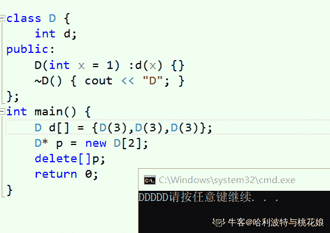
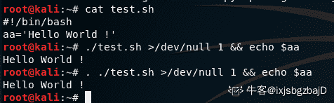

# 京东 2019 校招笔试安全工程师笔试题

## 1

在软件开发过程中，我们可以采用不同的过程模型，下列有关 增量模型描述正确的是（）

正确答案: B   你的答案: 空 (错误)

```cpp
是一种线性开发模型，具有不可回溯性
```

```cpp
把待开发的软件系统模块化，将每个模块作为一个增量组件，从而分批次地分析、设计、编码和测试这些增量组件
```

```cpp
适用于已有产品或产品原型（样品），只需客户化的工程项目
```

```cpp
软件开发过程每迭代一次，软件开发又前进一个层次
```

本题知识点

运维工程师 京东 安全工程师 京东 2019

## 2

下面有关值类型和引用类型描述正确的是（）？

正确答案: A   你的答案: 空 (错误)

```cpp
值类型的变量赋值只是进行数据复制，创建一个同值的新对象，而引用类型变量赋值，仅仅是把对象的引用的指针赋值给变量，使它们共用一个内存地址。
```

```cpp
值类型数据是在栈上分配内存空间，它的变量直接包含变量的实例，使用效率相对较高。而引用类型数据是分配在堆上，引用类型的变量通常包含一个指向实例的指针，变量通过指针来引用实例。
```

```cpp
引用类型一般都具有继承性，但是值类型一般都是封装的，因此值类型不能作为其他任何类型的基类。
```

```cpp
值类型变量的作用域主要是在栈上分配内存空间内，而引用类型变量作用域主要在分配的堆上。
```

本题知识点

运维工程师 京东 安全工程师 京东 2019

## 3

如何在多线程中避免发生死锁？

正确答案: A   你的答案: 空 (错误)

```cpp
允许进程同时访问某些资源。
```

```cpp
允许进程强行从占有者那里夺取某些资源。
```

```cpp
进程在运行前一次性地向系统申请它所需要的全部资源。
```

```cpp
把资源事先分类编号，按号分配，使进程在申请，占用资源时不会形成环路。
```

本题知识点

运维工程师 京东 安全工程师 京东 2019

## 4

以下为求 0 到 1000 以内所有奇数和的算法，从中选出描述正确的算法（ ）

正确答案: A   你的答案: 空 (错误)

```cpp
①s=0；②i=1；③s=s+i；④i=i+2；⑤如果 i≤1000，则返回③；⑥结束
```

```cpp
①s=0；②i=1；③i=i+2；④s=s+i；⑤如果 i≤1000，则返回③；⑥结束
```

```cpp
①s=1；②i=1；③s=s+i；④i=i+2；⑤如果 i≤1000，则返回③；⑥结束
```

```cpp
①s=1；②i=1；③i=i+2；④s=s+i；⑤如果 i≤1000，则返回③；⑥结束
```

本题知识点

运维工程师 京东 安全工程师 京东 2019

## 5

关于递归法的说法不正确的是（ ）

正确答案: D   你的答案: 空 (错误)

```cpp
程序结构更简洁
```

```cpp
占用 CPU 的处理时间更多
```

```cpp
要消耗大量的内存空间，程序执行慢，甚至无法执行
```

```cpp
递归法比递推法的执行效率更高
```

本题知识点

运维工程师 京东 安全工程师 京东 2019

## 6

字符串”ABCD”和字符串”DCBA”进行比较，如果让比较的结果为真，应选用关系运算符（）

正确答案: B   你的答案: 空 (错误)

```cpp
>
```

```cpp
<
```

```cpp
=
```

```cpp
>=
```

本题知识点

运维工程师 京东 安全工程师 京东 2019

## 7

下面是一段关于计算变量 s 的算法： ①变量 s 的初值是 0 ②变量 i 从 1 起循环到 n，此时变量 s 的值由下面的式子表达式计算 ③s=s+(-1)*i ④输出变量 s 的值 这个计算 s 值的算法中，s 的代数式表示是(    )。

正确答案: D   你的答案: 空 (错误)

```cpp
1-2+3-4+„+(-1)n*(n-1)
```

```cpp
1-2+3-4+„+(-1)n-1*n
```

```cpp
1+2+3+4+...+(n-1)+n
```

```cpp
-1-2-3-4-...-n
```

本题知识点

运维工程师 京东 安全工程师 2019

## 8

以下运算符中运算优先级最高的是（ ）

正确答案: D   你的答案: 空 (错误)

```cpp
+
```

```cpp
OR
```

```cpp
>
```

```cpp
\
```

本题知识点

运维工程师 京东 安全工程师 京东 2019

## 9

采用哪种遍历方法可唯一确定一棵二叉树？（  ）

正确答案: B   你的答案: 空 (错误)

```cpp
给定一棵二叉树的先序和后序遍历序列
```

```cpp
给定一棵二叉树的后序和中序遍历序列
```

```cpp
给定先序、中序和后序遍历序列中的任意一个即可
```

```cpp
给定一棵二叉树的先序和中序遍历序列
```

本题知识点

运维工程师 京东 安全工程师 京东 2019

## 10

已知小顶堆：{51,32,73,23,42,62,99,14,24,39,43,58,65,80,120}，请问 62 对应节点的左子节点是

正确答案: B   你的答案: 空 (错误)

```cpp
99
```

```cpp
73
```

```cpp
3943
```

```cpp
120
```

本题知识点

运维工程师 京东 安全工程师 京东 2019

讨论

[牛客 198654177 号](https://www.nowcoder.com/profile/198654177)

首先按顺序画出二叉树，然后不停进行下层操作：
                                14                           /              \                        23                58                    /         \          /         \                 24        39      62         80              /       \      /   \     /   \        /  \
          51       32  42  43 73 65   99 120

发表于 2021-03-27 10:08:12

* * *

## 11

若串 S=”UP！UP！JD”，则其子串的数目

正确答案: B   你的答案: 空 (错误)

```cpp
33
```

```cpp
37
```

```cpp
39
```

```cpp
35
```

本题知识点

运维工程师 京东 安全工程师 2019

讨论

[请叫我小吴](https://www.nowcoder.com/profile/693269216)

注意题目上一共 8 个字符（不算空格或者没有空格吧）于是：字符串数目为 = 8+7+6+5+4+3+2+1+1=37———————————————————————————————————— 参考：[`zhidao.baidu.com/question/316109592.html`](https://zhidao.baidu.com/question/316109592.html)高中时候的子集的概念我们把 PROGRAM 看成是由 7 个字符组成的字符串
则他的子串：
长度为来一自：P，R，O，G，R，A，M 共 7 个
长度为二：PR、RO、OG、GR、RA、AM 共 6 个
长度为三：PRO、ROG、OGR、GRA、RAM 共 5 个
长度为四：PROG、ROGR、OGRA、GRAM 共 4 个
长度为五：PROGR、ROGRA、OGRAM 共 3 个
长度为六：PROGRA、ROGRAM 共 2 个
长度为七：PROGRAM 共 1 个
长度为零：空集 1 个
所以总共有知 29 个子串 =  7+6+5+4+3+2+1+1
这里的串只能由相邻的字符组成，不能任意的搭配，也不道能调换次序，这是和集合概念不同的地方。

编辑于 2020-04-16 09:45:24

* * *

## 12

一颗二叉树的叶子节点有 5 个，出度为 1 的结点有 3 个，该二叉树的结点总个数是？

正确答案: B   你的答案: 空 (错误)

```cpp
11
```

```cpp
12
```

```cpp
13
```

```cpp
14
```

本题知识点

运维工程师 京东 安全工程师 京东 2019

## 13

以下哪种排序算法一趟结束后能够确定一个元素的最终位置？

正确答案: C   你的答案: 空 (错误)

```cpp
简单选择排序
```

```cpp
基数排序
```

```cpp
堆排序
```

```cpp
二路归并排序
```

本题知识点

运维工程师 京东 安全工程师 京东 2019

## 14

权值分别为 9、3、2、8 的结点，构造一棵哈夫曼树，该树的带权路径长度是？

正确答案: B   你的答案: 空 (错误)

```cpp
36
```

```cpp
40
```

```cpp
45
```

```cpp
46
```

本题知识点

运维工程师 京东 安全工程师 2019

## 15

在（）中，只要指出表中任何一个结点的位置，就可以从它出发依次访问到表中其他所有结点。

正确答案: D   你的答案: 空 (错误)

```cpp
线性单链表
```

```cpp
双向链表
```

```cpp
线性链表
```

```cpp
循环链表
```

本题知识点

运维工程师 京东 安全工程师 京东 2019

## 16

网络管理员把优盘上的源代码给程序员参考，但要防止程序误删除或修改，以下正确的加载方式是（      ）

正确答案: B   你的答案: 空 (错误)

```cpp
mount -o defaults /dev/sdb1 /tools
```

```cpp
mount -r /dev/sdb1 /tools
```

```cpp
mount -o ro /dev/sdb1 /tools
```

```cpp
mount -o ro /dev/sdb /tools
```

本题知识点

运维工程师 京东 安全工程师 京东 2019

## 17

下列有关软连接描述正确的是

正确答案: B   你的答案: 空 (错误)

```cpp
与普通文件没什么不同，inode 都指向同一个文件在硬盘中的区块
```

```cpp
不能对目录创建软链接
```

```cpp
保存了其代表的文件的绝对路径，是另外一种文件，在硬盘上有独立的区块，访问时替换自身路径
```

```cpp
不可以对不存在的文件创建软链接
```

本题知识点

运维工程师 京东 安全工程师 京东 2019

讨论

[牛客 198654177 号](https://www.nowcoder.com/profile/198654177)

[`www.nowcoder.com/questionTerminal/7167687116e44993b3c8d1867be6189d`](https://www.nowcoder.com/questionTerminal/7167687116e44993b3c8d1867be6189d)

发表于 2021-03-27 10:27:07

* * *

## 18

Ext3 日志文件系统的特点是：

正确答案: A   你的答案: 空 (错误)

```cpp
高可用性
```

```cpp
数据的完整性
```

```cpp
数据转换快
```

```cpp
多日志模式
```

本题知识点

运维工程师 京东 安全工程师 京东 2019

## 19

DHCP 是动态主机配置协议的简称,其作用是

正确答案: C   你的答案: 空 (错误)

```cpp
动态分配磁盘资源
```

```cpp
动态分配内存资源
```

```cpp
为网络中的主机分配 IP 地址
```

```cpp
为集群中的主机分配 IP 地址
```

本题知识点

运维工程师 京东 安全工程师 2019

## 20

以下命令可以用于获取本地 ip 地址的是：

正确答案: A   你的答案: 空 (错误)

```cpp
ifconfig
```

```cpp
uptime
```

```cpp
top
```

```cpp
netstat
```

本题知识点

运维工程师 京东 安全工程师 2019

## 21

以下命令可以用于获取本机 cpu 使用率的是：

正确答案: C   你的答案: 空 (错误)

```cpp
ifconfig
```

```cpp
uptime
```

```cpp
top
```

```cpp
netstat
```

本题知识点

运维工程师 京东 安全工程师 京东 2019

## 22

以下命令用于设置环境变量的是：

正确答案: A   你的答案: 空 (错误)

```cpp
export
```

```cpp
cat
```

```cpp
echo
```

```cpp
env
```

本题知识点

运维工程师 京东 安全工程师 京东 2019

## 23

下列对 TCP/IP 结构及协议分层不正确的是：

正确答案: C   你的答案: 空 (错误)

```cpp
网络接口层：Wi-Fi、ATM 、GPRS、EVDO、HSPA。
```

```cpp
网际层：IP、ICMP、IGMP 。
```

```cpp
传输层：TCP、UDP、TLS、ssh。
```

```cpp
FTP、TELNET、DNS、SMTP.
```

本题知识点

运维工程师 京东 安全工程师 京东 2019

## 24

以下哪种设备工作在数据链路层？

正确答案: C   你的答案: 空 (错误)

```cpp
中继器
```

```cpp
集线器
```

```cpp
交换机
```

```cpp
路由器
```

本题知识点

运维工程师 京东 安全工程师 京东 2019

## 25

打电话使用的数据传输方式是（），手机上网使用的数据传输方式是（）？

正确答案: B   你的答案: 空 (错误)

```cpp
电路交换，电路交换
```

```cpp
电路交换，分组交换
```

```cpp
分组交换，分组交换
```

```cpp
分组交换，电路交换
```

本题知识点

运维工程师 京东 安全工程师 京东 2019

## 26

后退 N 帧协议的发送窗口大小是（），接收窗口的大小是（）？

正确答案: D   你的答案: 空 (错误)

```cpp
=1,=1
```

```cpp
=1,>1
```

```cpp
>1,>1
```

```cpp
>1,=1
```

本题知识点

运维工程师 京东 安全工程师 京东 2019

## 27

TCP 释放连接第二次挥手时 ACK（）,第三次挥手时 ACK（）?

正确答案: C   你的答案: 空 (错误)

```cpp
不存在，不存在，
```

```cpp
不存在，值是 1
```

```cpp
值是 1，值是 1
```

```cpp
值是 1，不存在
```

本题知识点

运维工程师 京东 安全工程师 京东 2019

## 28

TCP 协议的拥塞控制就是防止过多的数据注入到网络中，这样可以使网络中的路由器或链路不致过载。常用的方法有:

正确答案: B   你的答案: 空 (错误)

```cpp
慢启动、窗口滑动
```

```cpp
慢开始、拥塞控制
```

```cpp
快重传、快恢复
```

```cpp
快开始、快恢复
```

本题知识点

运维工程师 京东 安全工程师 京东 2019

## 29

对于京东商城高流量访问，预防 Ddos 的方法可以有？

正确答案: A   你的答案: 空 (错误)

```cpp
限制同时打开 SYN 半链接的数目。
```

```cpp
缩短 SYN 半链接的 Time out 时间。
```

```cpp
关闭不必要的服务。
```

```cpp
限制客户端请求服务器时长。
```

本题知识点

运维工程师 京东 安全工程师 京东 2019

## 30

X 定义如下，若存在 X a; a.x=0x11223344;则 a.y[1]的值可能为（      ）
union X{
    int x;
    char y[4]; 
};

正确答案: B   你的答案: 空 (错误)

```cpp
11
```

```cpp
22
```

```cpp
33
```

```cpp
44
```

本题知识点

运维工程师 京东 安全工程师 京东 2019

讨论

[牛客 198654177 号](https://www.nowcoder.com/profile/198654177)

大端序是 0x22，小端序是 0x33，现在机器基本的都是小端序吧...

发表于 2021-03-27 10:33:01

* * *

## 31

在 C++中，引用和指针的区别是（      ）

正确答案: A   你的答案: 空 (错误)

```cpp
引用总是指向一个对象,指针可能不指向对象
```

```cpp
引用和指针都可以被重新赋值
```

```cpp
引用不能用 const 修饰，而指针可以
```

```cpp
引用创建时必须初始化，而指针则可以在任何时候被初始化
```

本题知识点

运维工程师 京东 安全工程师 京东 2019

## 32

有以下程序

```cpp
#include <iostream>
using namespace std;
class D {
    int d;
public:
    D(int x=1) : d(x) {}
    ~D() { cout<<"D";}
};

int main(){
    D d[]={_____________};
    D* p=new D[2];
    delete[]p;
    return 0;
}
```

程序运行的结果是 DDDDD，请为横线处选择合适的程序（）

正确答案: A   你的答案: 空 (错误)

```cpp
3,3,3
```

```cpp
D(3), D(3), D(3)
```

```cpp
3,3,3,3
```

```cpp
D(3,3),D(3,3)
```

本题知识点

京东 2019 C 语言

讨论

[篮天](https://www.nowcoder.com/profile/965024956)

运行的结果打印了五遍 D，只有析构函数存在打印，deleteD[2]时会调用两次析构函数打印两次，剩下的三个需要自己初始化时输入三个 int 型的数字，当系统回收资源时会调用三次析构函数。

发表于 2020-09-13 16:26:09

* * *

[哈利波特与桃花娘](https://www.nowcoder.com/profile/501696196)

看 B，好奇怪

发表于 2020-09-27 19:21:24

* * *

[11 东 11](https://www.nowcoder.com/profile/215304305)

AB 都 ok 啊

发表于 2021-05-20 14:44:09

* * *

## 33

有以下程序

```cpp
#include <iostream>
using namespace std;
void (*function)(float);

void One(float one) {
    cout<<"1"<<endl;
}

void Two(float two) {
    cout<<"2"<<endl;
}

void Three(float three) {
    cout<<"3"<<endl;
}

int main() {
    float i=1,j=2,k=3;
    function = One;
    function(i);
    function= Two;
    function(j);
    function = Three;
    function(k);
}
```

请为横线处选择合适的程序使得程序的运行结果是 123 （）

正确答案: D   你的答案: 空 (错误)

```cpp
void *function();
```

```cpp
void *function(float);
```

```cpp
void (*function)();
```

```cpp
void (*function)(float);
```

本题知识点

京东 2019 C 语言

讨论

[牛客 908228759 号](https://www.nowcoder.com/profile/908228759)

void (*function)(float);指向函数的指针 void *function(float);返回指针值的函数 

发表于 2020-09-02 19:08:20

* * *

[登山不如登传](https://www.nowcoder.com/profile/94613751)

请问横线在哪？

发表于 2022-01-07 16:20:34

* * *

[牛客 859568451 号](https://www.nowcoder.com/profile/859568451)

是我瞎了吗？

发表于 2022-02-18 00:52:37

* * *

## 34

有以下程序
#include<iostream>
using namespace std;
class complex
{ public:
int real;
int imag;
complex(int r=0,int i=0)
{ real=r;
imag=i;}
_________________________________
};
complex add(complex &a,complex & b)
{int r=a.real+b.real;
int i=a.imag+b.imag;
return complex(r,i);}
int  main( )
{complex x(1,2),y(3,4),z;
z=add(x,y);
cout<<z.real<<"+"<<z.imag<<"i"<<endl;}
程序的输出结果为 4+6i，请为横线处选择合适的程序        （      ）

正确答案: A   你的答案: 空 (错误)

```cpp
friend complex add(complex &a,complex & b) ;
```

```cpp
friend complex add(complex &,complex &) ;
```

```cpp
complex add(complex &a,complex & b) ;
```

```cpp
complex add(complex ,complex ) ;
```

本题知识点

运维工程师 京东 安全工程师 2019 C++

讨论

[牛客 506194496 号](https://www.nowcoder.com/profile/506194496)

Z=add(x,y)在类外定义不加 coplex::   只能是友元函数。

发表于 2021-07-22 19:55:03

* * *

[浩坤](https://www.nowcoder.com/profile/707077389)

不懂就问，这题里和友元有啥关系捏

发表于 2021-04-25 16:53:46

* * *

[牛客 627448898 号](https://www.nowcoder.com/profile/627448898)

奇葩的题目

发表于 2020-08-22 19:55:00

* * *

## 35

有以下程序
#include<iostream> 
#include<fstream> 
#include<string> 
using namespace std; 
int main() 
{ofstream File1("text.txt");  
string d("20160314"); 
string y=d.substr(0,4); 
int k=d.find("2");
int i=d.find("3"); 
string m=d.substr(k+2,i-k); 
string dd=d.substr(i+1,2); 
string n=dd+m+y; 
File1<<n<<endl; 
File1.close(); 
}                                            
文件 text.txt 中写入的结果是（      ）

正确答案: C   你的答案: 空 (错误)

```cpp
20160314
```

```cpp
14032016
```

```cpp
14160312016
```

```cpp
20031416
```

本题知识点

运维工程师 京东 安全工程师 2019 C++

讨论

[HouJian](https://www.nowcoder.com/profile/5255423)

substr(a, b)：从字符串的下标 a 开始，复制长度为 b 的字符子串 find(c)：返回字符串中第一个值为 c 的下标因此，k=0，i=5

发表于 2020-09-19 09:12:35

* * *

## 36

有以下函数模版
#include <iostream> 
using namespace std; 
template <class T>
void S(T &x, T &y)
{ T temp;
   temp = x;
   x = y;
   y = temp;}
template <class T>
void SS(T A[], int n)
{ int min;    
  int i, j;
  for (i=0; i<n-1; i++) 
  { min=i;    
    for (j=_____; j<n; j++) 
     if (A[j]<A[min]) min=j;
    S(A[i], A[min]);
  }   }
其功能是将 A 数组中的数按照由小到大的顺序排列，请为横线处选择合适的程序（      ）

正确答案: C   你的答案: 空 (错误)

```cpp
1
```

```cpp
0
```

```cpp
i+1
```

```cpp
i
```

本题知识点

运维工程师 京东 安全工程师 京东 2019

## 37

有以下类定义
#include <iostream>
using namespace std;
class shape
{public:
virtual int area()=0;
};
class rectangle:public shape
{public:
int a, b;
void setLength (int x, int y) {a=x;b=y;}
int area() {return a*b;}
};
若有语句定义 rectangle r; r.setLength(3,5); 则编译时无语法错误的语句是（      ）

正确答案: A   你的答案: 空 (错误)

```cpp
shape *s1=&r;
```

```cpp
shape &s2=r;
```

```cpp
shape s3=r;
```

```cpp
shape s4[3];
```

本题知识点

运维工程师 京东 安全工程师 京东 2019

## 38

关于 C++中的友元函数说法正确的是（      ）

正确答案: B   你的答案: 空 (错误)

```cpp
友元函数需要通过对象或指针调用
```

```cpp
友元函数是不能被继承的
```

```cpp
友元函数没有 this 指针
```

```cpp
友元函数破环了继承性机制
```

本题知识点

运维工程师 京东 安全工程师 京东 2019

## 39

下列代码执行后的输出结果为（      ）
int main()   
{
    char c, s[20];
    strcpy(s, "Hello,World");
    printf("s[]=%6.9s\n", s);
    return 0;
}

正确答案: D   你的答案: 空 (错误)

```cpp
s[]=Hello,
```

```cpp
s[]=Hello,World
```

```cpp
s[]=   Hello,
```

```cpp
s[]=Hello,Wor
```

本题知识点

运维工程师 京东 安全工程师 京东 2019

讨论

[牛客 198654177 号](https://www.nowcoder.com/profile/198654177)

输出不再受 6 的限制

发表于 2021-03-27 08:41:46

* * *

## 40

struct Student{
    int num;
    char name[7];   
    short age;
    char sex;
}student1;
int sz = sizeof(student1);
则执行上面语句后，变量 sz 的值为（      ）

正确答案: C   你的答案: 空 (错误)

```cpp
14
```

```cpp
15
```

```cpp
16
```

```cpp
20
```

本题知识点

运维工程师 京东 安全工程师 京东 2019

讨论

[牛客 198654177 号](https://www.nowcoder.com/profile/198654177)

name[7] 有一个字节对齐 short age; char sex; 有一个字节对齐

发表于 2021-03-26 22:13:10

* * *

## 41

对于如下 C++程序：
int main() {
 vector<int> vInt(1);

 cout << vInt[1];
 cout << vInt.at(1);

 return 0;
}
请问两个 cout 语句分别会发生什么情况（）

正确答案: C   你的答案: 空 (错误)

```cpp
抛出异常 抛出异常
```

```cpp
未定义 未定义
```

```cpp
未定义 抛出异常
```

```cpp
抛出异常 未定义
```

本题知识点

运维工程师 京东 安全工程师 京东 2019

## 42

对于如下 C++程序：
int main() {
 vector<int> vInt;

 for (int i=0; i<5; ++i)
 {
  vInt.push_back(i);

  cout << vInt.capacity() << " ";
 }

 vector<int> vTmp(vInt);
 cout << vTmp.capacity() << "\n";

 return 0;
}
请问程序输出的是（）

正确答案: C   你的答案: 空 (错误)

```cpp
1 2 3 4 5 5
```

```cpp
1 2 3 4 5 8
```

```cpp
1 2 4 4 8 5
```

```cpp
1 2 4 4 8 8
```

本题知识点

运维工程师 京东 安全工程师 京东 2019

讨论

[牛客 198654177 号](https://www.nowcoder.com/profile/198654177)

capacity 会翻倍

发表于 2021-03-26 22:10:12

* * *

## 43

对于如下 C++程序：int main() {
 int a(1), b(3), c(2);

 while (a < b < c)
 {
  ++a;
  --b;
  --c;
 }

 cout << a << " " << b << " " << c << "\n";

 return 0;
}
请问输出结果是（）

正确答案: C   你的答案: 空 (错误)

```cpp
1 3 2
```

```cpp
2 2 1
```

```cpp
3 1 0
```

```cpp
4 0 -1
```

本题知识点

运维工程师 京东 安全工程师 京东 2019

讨论

[牛客 198654177 号](https://www.nowcoder.com/profile/198654177)

a < b < c 需要循环三次(1 < 3) = 1 < 2  a b c = 2 2 1(2 < 2) = 0 < 1 a b c = 3 1 0(3 < 1) = 0 < 0 false

发表于 2021-03-26 22:08:26

* * *

## 44

文件目录 data 当前权限为 rwx --- ---，只需要增加用户组可读权限，但不允许写操作，具体方法为：

正确答案: A   你的答案: 空 (错误)

```cpp
chmod +050 data
```

```cpp
chmod +040 data
```

```cpp
chmod +005 data
```

```cpp
chmod +004 data
```

本题知识点

运维工程师 京东 安全工程师 京东 2019

讨论

[牛客 198654177 号](https://www.nowcoder.com/profile/198654177)

050,那么用户组就可以读取该目录下的内容和进入到该目录，如果是 B 就不能进入到该目录

发表于 2021-03-26 22:04:21

* * *

## 45

bash 脚本文件一般第一行开头是

正确答案: C   你的答案: 空 (错误)

```cpp
//
```

```cpp
##
```

```cpp
#!
```

```cpp
#/
```

本题知识点

运维工程师 京东 安全工程师 京东 2019

## 46

如何获取上一条命令执行的返回码

正确答案: C   你的答案: 空 (错误)

```cpp
$!
```

```cpp
0
```

```cpp
$?
```

```cpp
$#
```

本题知识点

运维工程师 京东 安全工程师 京东 2019

## 47

Shell 脚本（shell script），是一种为 shell 编写的脚本程序。现有一个 test.sh 文件，且有可执行权限，文件中内容为：
#!/bin/bash
aa='Hello World !'
请问下面选项中哪个能正常显示 Hello World !

正确答案: D   你的答案: 空 (错误)

```cpp
sh test.sh >/dev/null 1 && echo $aa
```

```cpp
./test.sh >/dev/null 1 && echo $aa
```

```cpp
bash test.sh >/dev/null 1 && echo $aa
```

```cpp
. ./test.sh >/dev/null 1 && echo $aa
```

本题知识点

运维工程师 京东 安全工程师 京东 2019

讨论

[许大锅](https://www.nowcoder.com/profile/97539532)

B 和 D 都可以正常显示？？

发表于 2019-08-24 17:24:04

* * *

## 48

以下哪个命令是将标准输出和错误重定向到 a.txt 文件

正确答案: A   你的答案: 空 (错误)

```cpp
&>a.txt
```

```cpp
&|a.txt
```

```cpp
a.txt < &
```

```cpp
a.txt | &
```

本题知识点

运维工程师 京东 安全工程师 京东 2019

## 49

在 Linux 系统中，经常需要查看正在运行的进程，下列哪条命令不能获取所有正在运行的进程信息  （   ）

正确答案: B   你的答案: 空 (错误)

```cpp
ps aux
```

```cpp
netstat -ant
```

```cpp
ps -ef
```

```cpp
top
```

本题知识点

运维工程师 京东 安全工程师 京东 2019

## 50

关于 DDoS，下列描述错误的是： 

正确答案: D   你的答案: 空 (错误)

```cpp
DDoS，分布式拒绝服务攻击。指不法黑客组织通过控制服务器等资源，对目标发动攻击，使目标不能正常为用户提供服务的攻击行为。
```

```cpp
DDoS 常见的攻击方式有：SYN Flood、NTP Flood、CC
```

```cpp
存在漏洞的 Memcache 服务器可能造成放大攻击
```

```cpp
TCP 协议不存在 DDoS 攻击
```

本题知识点

运维工程师 京东 安全工程师 2019

## 51

关于 Wannacry 描述错误的是： 

正确答案: D   你的答案: 空 (错误)

```cpp
WannaCry 利用了“永恒之蓝”漏洞。
```

```cpp
WannaCry 可以在局域网内进行传播
```

```cpp
WannaCry 可感染相同 Wifi 中的 Windows 设备
```

```cpp
WannaCry 中招后，中招电脑会为黑客挖取门罗币
```

本题知识点

运维工程师 京东 安全工程师 2019

## 52

有关 DLL 劫持，下列说法正确的是：

正确答案: C   你的答案: 空 (错误)

```cpp
动态链接库文件通常加载顺序问题导致
```

```cpp
使用 LoadLibrary API 加载 DLL 时使用绝对路径可以避免 DLL 劫持问题
```

```cpp
程序会最先加载 windows 目录中的 dll 文件
```

```cpp
可以通过 Process Monitor 发现进程正在尝试加载的 dll 文件
```

本题知识点

运维工程师 京东 安全工程师 2019

## 53

以下常用工具描述有误的是： 

正确答案: C   你的答案: 空 (错误)

```cpp
SQLMAP 工具常被用于发现 sql 注入漏洞
```

```cpp
Hydra/Medusa/John the ripper 常用于暴力破解
```

```cpp
Burpsuite 常用于二进制文件分析
```

```cpp
NMAP 是一款网络扫描和嗅探工具
```

本题知识点

运维工程师 京东 安全工程师 2019

## 54

下列哪些工具属于后门软件/程序 

正确答案: A   你的答案: 空 (错误)

```cpp
Mirai
```

```cpp
phpspy
```

```cpp
Gh0stRAT
```

```cpp
chkrootkit
```

本题知识点

运维工程师 京东 安全工程师 2019

## 55

以下关于调用惯例说明，正确的有

正确答案: A   你的答案: 空 (错误)

```cpp
cdecl，参数从右往左入栈，调用者清栈
```

```cpp
stdcall，参数从右往左入栈，被调用者清栈
```

```cpp
fastcall，头两个 DWORD（4 字节）类型或者占更少，字节的参数被放入寄存器，其它剩下的参数，按从右至左的顺序压入栈，被调用者清栈
```

```cpp
thiscall，从右至左的顺序压参数入栈（有时会通过寄存器传递 this 指针），清栈操作受编译环境等因素影响
```

本题知识点

运维工程师 京东 安全工程师 2019

## 56

下列名词描述错误的是 

正确答案: B   你的答案: 空 (错误)

```cpp
IPS, 入侵防御系统。可以监控网络间数据传输行为的网络设备，具有及时阻断能力。
```

```cpp
NIDS, 入侵检测系统。对主机的网络连接、文件操作等行为进行分析和判断，产生报警。
```

```cpp
DMZ, 非军事区。非军事区经常指企业网络内，防火墙外的区域。一般将对外服务防止在 DMZ 区。
```

```cpp
Firewall, 防火墙。 工作在 OSI 模型的应用层，对 HTTP 请求进行异常检测，防御黑客攻击。
```

本题知识点

运维工程师 京东 安全工程师 2019

## 57

下列说法正确的是： 

正确答案: B   你的答案: 空 (错误)

```cpp
UDP 是面向连接的协议
```

```cpp
UDP 的源 IP、源端口可以伪造
```

```cpp
TCP 可以进行一对多的交互通信
```

```cpp
UDP 存在丢包可能，但可保证数据先后顺序
```

本题知识点

运维工程师 京东 安全工程师 京东 2019

## 58

下列常见端口与应用描述错误的是： 

正确答案: D   你的答案: 空 (错误)

```cpp
3306 - MySQL
```

```cpp
1433 - SQLServer
```

```cpp
3389 - RDP
```

```cpp
21 - SSH
```

本题知识点

运维工程师 京东 安全工程师 2019

## 59

下列哪些命令可以清除 widnows 日志 

正确答案: A   你的答案: 空 (错误)

```cpp
wevtuil
```

```cpp
Clear-Eventlog
```

```cpp
clearlogs.exe
```

```cpp
net stop w3svc
```

本题知识点

运维工程师 京东 安全工程师 2019

讨论

[取个啥名](https://www.nowcoder.com/profile/5583263)

clear-eventlog 清除系统日志

*   删除本地或远程计算机上指定事件日志中的所有条目
*   获取当前系统有的日志，可以用 get-eventlog -list 来获取
*   下面是命令
    *   ```cpp
        clear-eventlog "Windows PowerShell"  此命令将删除本地计算机上的“Windows PowerShell”事件日志中的条目
        ```

    *   ```cpp
         clear-eventlog -logname ODiag, OSession -computername localhost, Server02  此命令将删除本地计算机和 Server02 远程计算机上的 Microsoft Office 诊断 (ODiag) 和 Microsoft Office 会话 (OSession) 日志中的所有条目
        ```

编辑于 2019-07-16 11:22:40

* * *

## 60

执行`ls -la /usr/bin/passwd`后，返回如下内容，下列描述错误的是：
-rwsr-xr-x 1 root root 59640 Sep 27 2017 /usr/bin/passwd

正确答案: B   你的答案: 空 (错误)

```cpp
程序可以被任何账户执行
```

```cpp
文件属性中的 s 表示这个文件是系统文件
```

```cpp
这不是一个目录
```

```cpp
文件/目录属于 root 用户
```

本题知识点

运维工程师 京东 安全工程师 2019

## 61

ssh 可以密钥进行免密码登录。提供 ssh 服务的一端为服务端，发起 ssh 请求的一端为客户端。
关于该方式登录以下说法正确的是

正确答案: B   你的答案: 空 (错误)

```cpp
密钥登录是采用了对称加密
```

```cpp
密钥登录是采用了非对称加密
```

```cpp
客户端存储公钥，服务端存储私钥
```

```cpp
服务端存储公钥，客户端存储私钥
```

本题知识点

运维工程师 京东 安全工程师 2019

讨论

[牛客 198654177 号](https://www.nowcoder.com/profile/198654177)

D 服务端存储公钥，客户端存储私钥客户端存储公私钥

发表于 2021-03-26 21:44:47

* * *

## 62

https 协议是位于网络的哪一层？

正确答案: B   你的答案: 空 (错误)

```cpp
网络层
```

```cpp
应用层
```

```cpp
传输层
```

```cpp
数据链路层
```

本题知识点

运维工程师 京东 安全工程师 2019

## 63

关于非对称加密，以下说法错误的是？

正确答案: A   你的答案: 空 (错误)

```cpp
加解密效率高
```

```cpp
可以有效防止中间人攻击
```

```cpp
可以用于进行大数据的加密传输
```

```cpp
广泛应用与 ssh/https 等协议中
```

本题知识点

运维工程师 京东 安全工程师 京东 2019