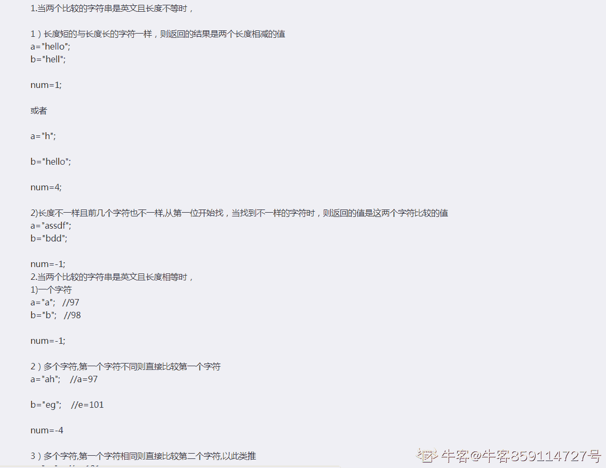
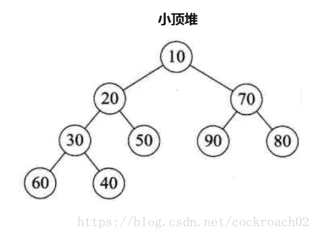
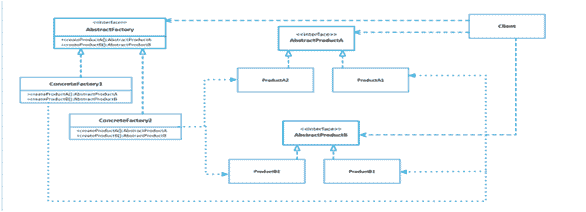

# 京东 2019 校招笔试 PHP 工程师笔试题

## 1

在软件开发过程中，我们可以采用不同的过程模型，下列有关 增量模型描述正确的是（）

正确答案: B   你的答案: 空 (错误)

```cpp
是一种线性开发模型，具有不可回溯性
```

```cpp
把待开发的软件系统模块化，将每个模块作为一个增量组件，从而分批次地分析、设计、编码和测试这些增量组件
```

```cpp
适用于已有产品或产品原型（样品），只需客户化的工程项目
```

```cpp
软件开发过程每迭代一次，软件开发又前进一个层次
```

本题知识点

PHP 工程师 京东 PHP 工程师 京东 2019

## 2

下面有关值类型和引用类型描述正确的是（）？

正确答案: A   你的答案: 空 (错误)

```cpp
值类型的变量赋值只是进行数据复制，创建一个同值的新对象，而引用类型变量赋值，仅仅是把对象的引用的指针赋值给变量，使它们共用一个内存地址。
```

```cpp
值类型数据是在栈上分配内存空间，它的变量直接包含变量的实例，使用效率相对较高。而引用类型数据是分配在堆上，引用类型的变量通常包含一个指向实例的指针，变量通过指针来引用实例。
```

```cpp
引用类型一般都具有继承性，但是值类型一般都是封装的，因此值类型不能作为其他任何类型的基类。
```

```cpp
值类型变量的作用域主要是在栈上分配内存空间内，而引用类型变量作用域主要在分配的堆上。
```

本题知识点

PHP 工程师 京东 PHP 工程师 京东 2019

## 3

如何在多线程中避免发生死锁？

正确答案: A   你的答案: 空 (错误)

```cpp
允许进程同时访问某些资源。
```

```cpp
允许进程强行从占有者那里夺取某些资源。
```

```cpp
进程在运行前一次性地向系统申请它所需要的全部资源。
```

```cpp
把资源事先分类编号，按号分配，使进程在申请，占用资源时不会形成环路。
```

本题知识点

PHP 工程师 京东 PHP 工程师 京东 2019

讨论

[GoWalker](https://www.nowcoder.com/profile/908512638)

看这里吧 https://www.nowcoder.com/questionTerminal/361381af0f2045d5874764e2c19a5b99?toCommentId=2839830

发表于 2019-04-11 10:02:02

* * *

[晓德](https://www.nowcoder.com/profile/237600192)

这应该选 ABCD 多选才对吧

发表于 2019-02-26 08:43:56

* * *

## 4

以下为求 0 到 1000 以内所有奇数和的算法，从中选出描述正确的算法（ ）

正确答案: A   你的答案: 空 (错误)

```cpp
①s=0；②i=1；③s=s+i；④i=i+2；⑤如果 i≤1000，则返回③；⑥结束
```

```cpp
①s=0；②i=1；③i=i+2；④s=s+i；⑤如果 i≤1000，则返回③；⑥结束
```

```cpp
①s=1；②i=1；③s=s+i；④i=i+2；⑤如果 i≤1000，则返回③；⑥结束
```

```cpp
①s=1；②i=1；③i=i+2；④s=s+i；⑤如果 i≤1000，则返回③；⑥结束
```

本题知识点

PHP 工程师 京东 PHP 工程师 京东 2019

讨论

[Wlr.](https://www.nowcoder.com/profile/523103805)

我咋觉得 B 是正确的

发表于 2020-01-18 09:52:36

* * *

## 5

关于递归法的说法不正确的是（ ）

正确答案: D   你的答案: 空 (错误)

```cpp
程序结构更简洁
```

```cpp
占用 CPU 的处理时间更多
```

```cpp
要消耗大量的内存空间，程序执行慢，甚至无法执行
```

```cpp
递归法比递推法的执行效率更高
```

本题知识点

PHP 工程师 京东 PHP 工程师 京东 2019

讨论

[GoWalker](https://www.nowcoder.com/profile/908512638)

递归：从已知问题的结果出发，用迭代表达式逐步推算出问题的开始的条件，即顺推法的逆过程，称为递归。 递推：递推算法是一种用若干步可重复运算来描述复杂问题的方法。递推是序列计算中的一种常用算法。通常是通过计算机前面的一些项来得出序列中的指定象的值。 递归与递推区别：相对于递归算法,递推算法免除了数据进出栈的过程，也就是说,不需要函数不断的向边界值靠拢（即不需要回溯）,而直接从边界出发,直到求出函数值。

发表于 2019-04-11 10:08:19

* * *

## 6

字符串”ABCD”和字符串”DCBA”进行比较，如果让比较的结果为真，应选用关系运算符（）

正确答案: B   你的答案: 空 (错误)

```cpp
>
```

```cpp
<
```

```cpp
=
```

```cpp
>=
```

本题知识点

PHP 工程师 京东 PHP 工程师 京东 2019

讨论

[牛客 859114727 号](https://www.nowcoder.com/profile/859114727)



发表于 2020-07-28 09:18:57

* * *

## 7

下面是一段关于计算变量 s 的算法： ①变量 s 的初值是 0 ②变量 i 从 1 起循环到 n，此时变量 s 的值由下面的式子表达式计算 ③s=s+(-1)*i ④输出变量 s 的值 这个计算 s 值的算法中，s 的代数式表示是(    )。

正确答案: D   你的答案: 空 (错误)

```cpp
1-2+3-4+„+(-1)n*(n-1)
```

```cpp
1-2+3-4+„+(-1)n-1*n
```

```cpp
1+2+3+4+...+(n-1)+n
```

```cpp
-1-2-3-4-...-n
```

本题知识点

PHP 工程师 京东 PHP 工程师 京东 2019

讨论

[哈哈哈哈哈~~~~~](https://www.nowcoder.com/profile/377798528)

这个答案有问题，答案是-1

编辑于 2019-03-03 09:53:26

* * *

## 8

以下运算符中运算优先级最高的是（ ）

正确答案: D   你的答案: 空 (错误)

```cpp
+
```

```cpp
OR
```

```cpp
>
```

```cpp
\
```

本题知识点

PHP 工程师 京东 PHP 工程师 京东 2019

## 9

采用哪种遍历方法可唯一确定一棵二叉树？（  ）

正确答案: B   你的答案: 空 (错误)

```cpp
给定一棵二叉树的先序和后序遍历序列
```

```cpp
给定一棵二叉树的后序和中序遍历序列
```

```cpp
给定先序、中序和后序遍历序列中的任意一个即可
```

```cpp
给定一棵二叉树的先序和中序遍历序列
```

本题知识点

PHP 工程师 京东 PHP 工程师 京东 2019

讨论

[月亮上的向日葵](https://www.nowcoder.com/profile/6121386)

我以为是，先序、中序可以确定一棵二叉树，中序、后序可以确定一颗二叉树

发表于 2019-03-12 20:05:38

* * *

## 10

已知小顶堆：{51,32,73,23,42,62,99,14,24,39,43,58,65,80,120}，请问 62 对应节点的左子节点是

正确答案: B   你的答案: 空 (错误)

```cpp
99
```

```cpp
73
```

```cpp
3943
```

```cpp
120
```

本题知识点

PHP 工程师 京东 PHP 工程师 京东 2019

讨论

[MeetUJ](https://www.nowcoder.com/profile/265238)

小顶堆实际上是一个二叉树，满足：Key[i]<=key[2i+1]&&Key[i]<=key[2i+2]规则，即根节点既小于或等于左子树的关键字值，又小于或等于右子树的关键字值。
 答案貌似错了

编辑于 2019-03-01 21:41:47

* * *

## 11

若串 S=”UP！UP！JD”，则其子串的数目

正确答案: B   你的答案: 空 (错误)

```cpp
33
```

```cpp
37
```

```cpp
39
```

```cpp
35
```

本题知识点

PHP 工程师 京东 PHP 工程师 京东 2019

讨论

[月亮上的向日葵](https://www.nowcoder.com/profile/6121386)

1+2+3+4+5+6+7+8+1=37

发表于 2019-03-12 20:11:09

* * *

## 12

一颗二叉树的叶子节点有 5 个，出度为 1 的结点有 3 个，该二叉树的结点总个数是？

正确答案: B   你的答案: 空 (错误)

```cpp
11
```

```cpp
12
```

```cpp
13
```

```cpp
14
```

本题知识点

PHP 工程师 京东 PHP 工程师 京东 2019

讨论

[月亮上的向日葵](https://www.nowcoder.com/profile/6121386)

已知 n0=5，n1=3，根据二叉树的性质 n0=n2+1，可得 n2=4，则答案就是 n0+n1+n2=5+3+4=12

发表于 2019-03-13 11:28:32

* * *

[MeetUJ](https://www.nowcoder.com/profile/265238)

树的出度=树的入度=树的节点数-1；n0=5，n1=3，n2 未知；树的出度=0*n0+1*n1+2*n2=n0+n1+n2-1 得 n2=4；故树的总节点数为：5+3+4=12

发表于 2019-03-01 21:49:42

* * *

## 13

以下哪种排序算法一趟结束后能够确定一个元素的最终位置？

正确答案: C   你的答案: 空 (错误)

```cpp
简单选择排序
```

```cpp
基数排序
```

```cpp
堆排序
```

```cpp
二路归并排序
```

本题知识点

PHP 工程师 京东 PHP 工程师 京东 2019

讨论

[GoWalker](https://www.nowcoder.com/profile/908512638)

简单选择和堆排序，答案有误

发表于 2019-04-11 10:31:45

* * *

[月亮上的向日葵](https://www.nowcoder.com/profile/6121386)

简单选择排序和堆排序一趟都能确定一个元素的位置吧

发表于 2019-03-13 11:32:43

* * *

[MeetUJ](https://www.nowcoder.com/profile/265238)

简单选择排序一趟结束也能确定一个元素的最终位置，这个题出的不合理吧

发表于 2019-03-01 21:53:11

* * *

## 14

权值分别为 9、3、2、8 的结点，构造一棵哈夫曼树，该树的带权路径长度是？

正确答案: B   你的答案: 空 (错误)

```cpp
36
```

```cpp
40
```

```cpp
45
```

```cpp
46
```

本题知识点

PHP 工程师 京东 PHP 工程师 京东 2019

## 15

在（）中，只要指出表中任何一个结点的位置，就可以从它出发依次访问到表中其他所有结点。

正确答案: D   你的答案: 空 (错误)

```cpp
线性单链表
```

```cpp
双向链表
```

```cpp
线性链表
```

```cpp
循环链表
```

本题知识点

PHP 工程师 京东 PHP 工程师 京东 2019

## 16

下列对 TCP/IP 结构及协议分层不正确的是：

正确答案: C   你的答案: 空 (错误)

```cpp
网络接口层：Wi-Fi、ATM 、GPRS、EVDO、HSPA。
```

```cpp
网际层：IP、ICMP、IGMP 。
```

```cpp
传输层：TCP、UDP、TLS、ssh。
```

```cpp
FTP、TELNET、DNS、SMTP.
```

本题知识点

PHP 工程师 京东 PHP 工程师 京东 2019

讨论

[月亮上的向日葵](https://www.nowcoder.com/profile/6121386)

SSH、TLS 是会话层的协议

发表于 2019-03-14 10:17:21

* * *

## 17

以下哪种设备工作在数据链路层？

正确答案: C   你的答案: 空 (错误)

```cpp
中继器
```

```cpp
集线器
```

```cpp
交换机
```

```cpp
路由器
```

本题知识点

PHP 工程师 京东 PHP 工程师 京东 2019

讨论

[月亮上的向日葵](https://www.nowcoder.com/profile/6121386)

集线器、中继器属于物理层，路由器属于网络层，交换机属于数据链路层

发表于 2019-03-14 10:21:20

* * *

## 18

打电话使用的数据传输方式是（），手机上网使用的数据传输方式是（）？

正确答案: B   你的答案: 空 (错误)

```cpp
电路交换，电路交换
```

```cpp
电路交换，分组交换
```

```cpp
分组交换，分组交换
```

```cpp
分组交换，电路交换
```

本题知识点

PHP 工程师 京东 PHP 工程师 京东 2019

## 19

后退 N 帧协议的发送窗口大小是（），接收窗口的大小是（）？

正确答案: D   你的答案: 空 (错误)

```cpp
=1,=1
```

```cpp
=1,>1
```

```cpp
>1,>1
```

```cpp
>1,=1
```

本题知识点

PHP 工程师 京东 PHP 工程师 京东 2019

## 20

TCP 释放连接第二次挥手时 ACK（）,第三次挥手时 ACK（）?

正确答案: C   你的答案: 空 (错误)

```cpp
不存在，不存在，
```

```cpp
不存在，值是 1
```

```cpp
值是 1，值是 1
```

```cpp
值是 1，不存在
```

本题知识点

PHP 工程师 京东 PHP 工程师 京东 2019

## 21

TCP 协议的拥塞控制就是防止过多的数据注入到网络中，这样可以使网络中的路由器或链路不致过载。常用的方法有:

正确答案: B   你的答案: 空 (错误)

```cpp
慢启动、窗口滑动
```

```cpp
慢开始、拥塞控制
```

```cpp
快重传、快恢复
```

```cpp
快开始、快恢复
```

本题知识点

PHP 工程师 京东 PHP 工程师 京东 2019

讨论

[GoWalker](https://www.nowcoder.com/profile/908512638)

流量控制和拥塞避免的区别  流量控制解决的是发送方和接收方速率不匹配的问题，发送方发送过快接收方就来不及接收和处理。采用的机制是滑动窗口的机制。 拥塞控制解决的是避免网络资源被耗尽的问题，通过大家自律的采取避让的措施，来避免网络有限资源被耗尽。常用方法：慢开始、拥塞避免、快重传、快恢复

编辑于 2019-04-11 10:45:13

* * *

[月亮上的向日葵](https://www.nowcoder.com/profile/6121386)

拥塞控制：慢开始、拥塞避免、快重传、快恢复流量控制：滑动窗口

编辑于 2019-03-14 14:16:52

* * *

## 22

对于京东商城高流量访问，预防 Ddos 的方法可以有？

正确答案: A   你的答案: 空 (错误)

```cpp
限制同时打开 SYN 半链接的数目。
```

```cpp
缩短 SYN 半链接的 Time out 时间。
```

```cpp
关闭不必要的服务。
```

```cpp
限制客户端请求服务器时长。
```

本题知识点

PHP 工程师 京东 PHP 工程师 京东 2019

讨论

[GoWalker](https://www.nowcoder.com/profile/908512638)

https://interview.nowcoder.com/questionTerminal/53c4ff8bbe844d9a86ba83d10203875e?source=relative

发表于 2019-04-11 10:51:49

* * *

## 23

网络管理员把优盘上的源代码给程序员参考，但要防止程序误删除或修改，以下正确的加载方式是（      ）

正确答案: B   你的答案: 空 (错误)

```cpp
mount -o defaults /dev/sdb1 /tools
```

```cpp
mount -r /dev/sdb1 /tools
```

```cpp
mount -o ro /dev/sdb1 /tools
```

```cpp
mount -o ro /dev/sdb /tools
```

本题知识点

PHP 工程师 京东 PHP 工程师 京东 2019

## 24

下列有关软连接描述正确的是

正确答案: B   你的答案: 空 (错误)

```cpp
与普通文件没什么不同，inode 都指向同一个文件在硬盘中的区块
```

```cpp
不能对目录创建软链接
```

```cpp
保存了其代表的文件的绝对路径，是另外一种文件，在硬盘上有独立的区块，访问时替换自身路径
```

```cpp
不可以对不存在的文件创建软链接
```

本题知识点

PHP 工程师 京东 PHP 工程师 京东 2019

讨论

[GoWalker](https://www.nowcoder.com/profile/908512638)

答案有误，应该选 c http://m.nowcoder.com/questionTerminal?uuid=7167687116e44993b3c8d1867be6189d

发表于 2019-04-11 11:05:17

* * *

[月亮上的向日葵](https://www.nowcoder.com/profile/6121386)

BC 应该都对的

发表于 2019-03-14 17:02:09

* * *

## 25

Ext3 日志文件系统的特点是：

正确答案: A   你的答案: 空 (错误)

```cpp
高可用性
```

```cpp
数据的完整性
```

```cpp
数据转换快
```

```cpp
多日志模式
```

本题知识点

PHP 工程师 京东 PHP 工程师 京东 2019

讨论

[GoWalker](https://www.nowcoder.com/profile/908512638)

答案应该是 abcd 吧

发表于 2019-04-11 11:08:54

* * *

## 26

DHCP 是动态主机配置协议的简称,其作用是

正确答案: C   你的答案: 空 (错误)

```cpp
动态分配磁盘资源
```

```cpp
动态分配内存资源
```

```cpp
为网络中的主机分配 IP 地址
```

```cpp
为集群中的主机分配 IP 地址
```

本题知识点

PHP 工程师 京东 PHP 工程师 京东 2019

## 27

以下命令可以用于获取本地 ip 地址的是：

正确答案: A   你的答案: 空 (错误)

```cpp
ifconfig
```

```cpp
uptime
```

```cpp
top
```

```cpp
netstat
```

本题知识点

PHP 工程师 京东 PHP 工程师 京东 2019

## 28

以下命令可以用于获取本机 cpu 使用率的是：

正确答案: C   你的答案: 空 (错误)

```cpp
ifconfig
```

```cpp
uptime
```

```cpp
top
```

```cpp
netstat
```

本题知识点

PHP 工程师 京东 PHP 工程师 京东 2019

## 29

以下命令用于设置环境变量的是：

正确答案: A   你的答案: 空 (错误)

```cpp
export
```

```cpp
cat
```

```cpp
echo
```

```cpp
env
```

本题知识点

PHP 工程师 京东 PHP 工程师 京东 2019

## 30

重复的数据，会增加磁盘空间的占有率，延长操作数据的时间。可以使用规范化处理数据冗余，以下对符合第一范式的表述正确的是：

正确答案: C   你的答案: 空 (错误)

```cpp
非键属性和键（主键）属性间没有传递依赖
```

```cpp
非键属性和键（主键）属性间没有部分依赖
```

```cpp
表中不应该有重复组。列重复拆成另外一张表；行重复拆成多行
```

```cpp
一个表中的列值与其他表中的主键匹配
```

本题知识点

PHP 工程师 京东 PHP 工程师 京东 2019

讨论

[GoWalker](https://www.nowcoder.com/profile/908512638)

1）、符合 1NF 的关系中的每个属性都不可再分。 2）、2NF 在 1NF 的基础之上，消除了非主属性对于码的部分函数依赖。 3）、3NF 在 2NF 的基础之上，消除了非主属性对于码的传递函数依赖。 4）、BCNF 在 3NF 的基础之上，消除主属性对于码的部分与传递函数依赖。 参考 https://www.zhihu.com/question/24696366/answer/29189700

发表于 2019-04-11 13:56:54

* * *

## 31

以下哪条 SQL 语句可以返回 table1 中的全部的 key：

正确答案: D   你的答案: 空 (错误)

```cpp
select tabel1.key from table1 join tabel2 on table1.key=table2.key
```

```cpp
select tabel1.key from table1 right outer join tabel2 on table1.key=table2.key
```

```cpp
select tabel1.key from table1 left semi join tabel2 on table1.key=table2.key
```

```cpp
select tabel1.key from table1 left outer join tabel2 on table1.key=table2.key
```

本题知识点

PHP 工程师 京东 PHP 工程师 京东 2019

讨论

[MeetUJ](https://www.nowcoder.com/profile/265238)

左连接：left join 或 left outer joinA 表 left join B 表 左连,以 A 表为基础，A 表的全部数据，B 表有的组合。没有的为 null 

发表于 2019-03-01 22:05:47

* * *

## 32

以下关于 Mysql 数据库引擎ＭyISAM 的描述错误的是？

正确答案: A   你的答案: 空 (错误)

```cpp
支持行锁
```

```cpp
如果表主要是用于插入新记录和读出记录，那么选择 MyISAM 引擎能实现处理高效率
```

```cpp
在执行查询语句（SELECT）前，会自动给涉及的所有表加读锁，在执行更新操作（UPDATE、DELETE、INSERT 等）前，会自动给涉及的表加写锁
```

```cpp
不支持事务
```

本题知识点

PHP 工程师 京东 PHP 工程师 京东 2019

## 33

Mysql 中表 user 的建表语句如下，
CREATE TABLE `user` (
  `id` bigint(20) NOT NULL AUTO_INCREMENT COMMENT '主键 Id',
  `name` varchar(255) DEFAULT NULL COMMENT '名称',
  `age` int(11) DEFAULT NULL COMMENT '年龄',
  `address` varchar(255) DEFAULT NULL COMMENT '地址',
  `created_time` datetime DEFAULT NULL COMMENT '创建时间',
  `updated_time` datetime DEFAULT NULL COMMENT '更新时间',
  PRIMARY KEY (`id`),
  KEY `idx_com1` (`name`,`age`,`address`)
) ENGINE=InnoDB DEFAULT CHARSET=utf8 COMMENT='用户表';
以下哪个查询语句没有使用到索引 idx_com1？

正确答案: C   你的答案: 空 (错误)

```cpp
select  *  from user where name='张三' and age = 25 and address='北京大兴区';
```

```cpp
select  *  from user where name='张三' and address='北京大兴区';
```

```cpp
select  *  from user where age = 25 and address='北京大兴区';
```

```cpp
select  *  from user where address='北京大兴区'  and age = 25 and name='张三'
```

本题知识点

PHP 工程师 京东 PHP 工程师 京东 2019

讨论

[我在白纸上涂鸦](https://www.nowcoder.com/profile/640691837)

KEY `idx_com1` (`name`,`age`,`address`)，多个字段组成的索引，必须带有第一个字段才会触发索引

发表于 2019-10-10 09:51:36

* * *

[GoWalker](https://www.nowcoder.com/profile/908512638)

答案应该选 BC

发表于 2019-04-11 14:31:21

* * *

[chdahuzi](https://www.nowcoder.com/profile/987380426)

考的是最左前缀，也就是必须有 age 才能出发索引

发表于 2019-03-05 16:22:51

* * *

## 34

DELETE 和 TRUNCATE TABLE 都是删除表中的数据的语句，它们的不同之处描述正确的是：

正确答案: A   你的答案: 空 (错误)

```cpp
TRUNCATE TABLE 比 DELETE 的速度快
```

```cpp
在删除时如果遇到任何一行违反约束（主要是外键约束），TRUNCATE TABLE 仍然删除，只是表的结构及其列、约束、索引等保持不变，但 DELETE 是直接返回错误
```

```cpp
对于被外键约束的表，不能使用 TRUNCATE TABLE，而应该使用不带 WHERE 语句的 DELETE 语句。
```

```cpp
如果想保留标识计数值，要用 DELETE，因为 TRUNCATE TABLE 会对新行标志符列使用的计数值重置为该列的种子
```

本题知识点

PHP 工程师 京东 PHP 工程师 京东 2019

讨论

[过河卒 201903091052954](https://www.nowcoder.com/profile/737005861)

而 DELETE 和 TRUNCATE TABLE 都是删除表中的数据的语句，它们的不同之处在于：

1、TRUNCATE TABLE 比 DELETE 的速度快；

2、TRUNCATE TABLE 是删除表的所有行，而 DELETE 是删除表的一行或者多行（除非 DELETE 不带 WHERE 语句）；

3、在删除时如果遇到任何一行违反约束（主要是外键约束），TRUNCATE TABLE 仍然删除，只是表的结构及其列、约束、索引等保持不变，但 DELETE 是直接返回错误；

4、对于被外键约束的表，不能使用 TRUNCATE TABLE，而应该使用不带 WHERE 语句的 DELETE 语句。

5、如果想保留标识计数值，要用 DELETE，因为 TRUNCATE TABLE 会对新行标志符列搜用的计数值重置为该列的种子。

发表于 2019-04-13 08:57:18

* * *

## 35

用户表中有两列 name/country。
现在要查询用户表中每个国家(country)的用户人数，应使用以下哪个语句

正确答案: A   你的答案: 空 (错误)

```cpp
select count(*) from users group by country
```

```cpp
B. select name from users where country = 'xx'
```

```cpp
select count(country) from users
```

```cpp
select country from users
```

本题知识点

PHP 工程师 京东 PHP 工程师 京东 2019

## 36

如果必须保存一个对象在某一时刻的全部或者部分状态，方便以后需要的时候，可以把该对象恢复到先前的状态，应该使用何种设计模式？

正确答案: C   你的答案: 空 (错误)

```cpp
状态模式
```

```cpp
原型模式
```

```cpp
备忘录模式
```

```cpp
命令模式
```

本题知识点

PHP 工程师 京东 PHP 工程师 京东 2019

## 37

兼容接口不同的类在一起工作，采用以下哪种设计模式最好？

正确答案: B   你的答案: 空 (错误)

```cpp
建造者模式
```

```cpp
适配器模式
```

```cpp
桥接模式
```

```cpp
代理模式
```

本题知识点

PHP 工程师 京东 PHP 工程师 京东 2019

## 38

在开发中，往往会碰到需要对用户名进行修改的需求，那么，怎样才能将已经存在的用户名对其进行更改（      ）

正确答案: A   你的答案: 空 (错误)

```cpp
var val=document.getElementById("us");
val.value=str;
```

```cpp
var val=document.getElementByName("us");
val.value=str;
```

```cpp
var val=document.getElementByClassNamee("us");
val.value=str;
```

```cpp
var val=document.getElementByTagName("us");
val.value=str;
```

本题知识点

PHP 工程师 京东 PHP 工程师 京东 2019

## 39

在日常生活中，随处都可以看到显示日期的地方，如果现在有一款网站，需要在顶部显示日期，怎样才能使日期显示的是正确的格式（      ）

正确答案: A   你的答案: 空 (错误)

```cpp
var reg = /^(\d{1,4})(-|\/)(\d{1,2})\2(\d{1,2}) (\d{1,2}):(\d{1,2}):(\d{1,2})$/; if(!str.match(reg)){            alert('日期格式不正确!'); }
```

```cpp
var reg = /^(\d{1,4})(-|\/)(\d{1,2})\2(\d{1,2}) (\d{1,2}):(\d{1,2}):(\d{1,2})$/; if(!reg.test(str)){            alert('日期格式不正确!'); }
```

```cpp
var reg = /^(\d{1,4})(-|\/)( \d{1,2})\2(\d{1,2}) (\d{2}):(\d{2}):(\d{2})$/;  if(!str.match(reg)){           alert('日期格式不正确!');  }
```

```cpp
var reg = /^(\d{1,4})(-|\/)( \d{1,2})\2(\d{1,2}) (\d{2}):(\d{2}):(\d{2})$/;  if(!reg.test(str)){           alert('日期格式不正确!');  }
```

本题知识点

PHP 工程师 京东 2019

讨论

[GoWalker](https://www.nowcoder.com/profile/908512638)

正则\1\2 和\\1 的理解

正则表达式中 
‘\1’ 匹配的是 字符 ‘\1’ 。 (因为 ‘\’ 匹配字符 ‘\’ ) 
‘\2’ 匹配的是 字符 ‘\2’

单独斜杠的 \1 ， \2 就是反向引用了。 
‘\1’ 匹配的是 所获取的第 1 个()匹配的引用。例如，’(\d)\1’ 匹配两个连续数字字符。如 33aa 中的 33 
‘\2’ 匹配的是 所获取的第 2 个()匹配的引用。 
例如，’(\d)(a)\1’ 匹配第一是数字第二是字符 a,第三\1 必须匹配第一个一样的数字重复一次，也就是被引用一次。如 9a9 被匹配，但 9a8 不会被匹配，因为第三位的\1 必须是 9 才可以，

‘(\d)(a)\2’ 匹配第一个是一个数字，第二个是 a，第三个\2 必须是第二组（）中匹配一样的，如，8aa 被匹配，但 8ab，7a7 不会被匹配，第三位必须是第二组字符的复制版，也是就引用第二组正则的匹配内容。

以此类推
--------------------- 
作者：liangf05 
来源：CSDN 
原文：[`blog.csdn.net/liangf05/article/details/79361191`](https://blog.csdn.net/liangf05/article/details/79361191) 
版权声明：本文为博主原创文章，转载请附上博文链接！

编辑于 2019-04-11 15:22:24

* * *

## 40

分析下面代码段，对于该段代码的分析说法，正确的是（      ）
(function() {
   var x = y = 10;
})();
alert(y);

正确答案: C   你的答案: 空 (错误)

```cpp
x、y 是在该方法中定义的局部变量
```

```cpp
x、y 都是全局变量
```

```cpp
x 是在该方法中定义的局部变量，y 是全局变量
```

```cpp
该代码段的运行结果是 10
```

本题知识点

PHP 工程师 京东 2019

讨论

[MeetUJ](https://www.nowcoder.com/profile/265238)

D 也对啊

发表于 2019-03-01 22:21:31

* * *

## 41

当在进行前端界面和后台服务进行交互时，常常需要从后台服务中获取一组数据，现在需要将一组数据放入到数组中，正确的是（      ）

正确答案: B   你的答案: 空 (错误)

```cpp
var arr=new array();
for(var i=0;i<data.length;i++){
   arr.add(data[i]);
}
```

```cpp
var arr=new array();
for(var i=0;i<data.length;i++){
   arr.push(data[i]);
}
```

```cpp
var arr=new array();
for(var i=0;i<data.length;i++){
   arr.shift(data[i]);
}
```

```cpp
var arr=new array();
for(var i=0;i<data.length;i++){
   arr.pop(data[i]);
}
```

本题知识点

PHP 工程师 京东 PHP 工程师 京东 2019

## 42

日期类转换到原始值能使用什么方法（      ）

正确答案: B   你的答案: 空 (错误)

```cpp
valueOf()
```

```cpp
toString()
```

```cpp
String.toLowerCase()
```

```cpp
String.toUpperCase()
```

本题知识点

PHP 工程师 京东 PHP 工程师 京东 2019

## 43

分析下面 JavaScript 的代码段: 
var s1 = "qpzm";
var s2 = "qp"+"zm";

if(s1 == s2){
document.write("s1 == s2 return true");
}else{
document.write("s1 == s2 return false");
}
if(s1.equals(s2)){
document.write("s1.equals(s2) return true");
}else{
document.write("s1.equals(s2) return false");
}
请问运行完此函数，最后显示的结果是：

正确答案: D   你的答案: 空 (错误)

```cpp
s1 == s2 return true s1.equals(s2) return true
```

```cpp
s1 == s2 return true s1.equals(s2) return false
```

```cpp
s1 == s2 return false
```

```cpp
s1 == s2 return true
```

本题知识点

PHP 工程师 京东 PHP 工程师 京东 2019

讨论

[GoWalker](https://www.nowcoder.com/profile/908512638)

此题出的好像并不严谨，原生 JS 中并不存在 equals 方法，AngularJS 框架中到是存在 angular.equals 方法效果等同于原生 JS 中的===JavaScript 中== 仅比较值是否相等（'3'==3，为 true；0 == false，为 false；PHP 在数字与非数字类型转比较时，并不进行转换）=== 除了比较值之外，还要比较类型是否也相同更多参考 [`www.cnblogs.com/ithome8/p/4179398.html`](https://www.cnblogs.com/ithome8/p/4179398.html)PHP 中== 仅比较值是否相等（'3'==3，为 true；0 == false，为 true；PHP 在数字与非数字类型比较时，也进行转换）=== 除了比较值之外，还要比较类型是否也相同 Java 中==  作用于基本类型的变量时，直接比较其存储的值是否相等      作用于引用类型的变量时，则比较的是所指向的对象的地址。
=== Java 中不存在 equals 不能作用于基本数据类型的变量，如果没有对 equals 方法进行重写，则比较的是引用类型的变量所指向的对象的地址；诸如 String、Date 等类对 equals 方法进行了重写的话，比较的是所指向的对象的内容。
更多参考 [`www.cnblogs.com/dolphin0520/p/3592500.html`](https://www.cnblogs.com/dolphin0520/p/3592500.html)

编辑于 2019-04-11 17:45:24

* * *

## 44

分析下面 javascript 代码：
<script>
function out(x){
 var temp = 2;
 return function (y){
  document.write( x + y + (++temp));
 }
}
var inside = out(3);
inside(5); 
</script>
输出结果为：

正确答案: D   你的答案: 空 (错误)

```cpp
8
```

```cpp
9
```

```cpp
10
```

```cpp
11
```

本题知识点

PHP 工程师 京东 PHP 工程师 京东 2019

## 45

在 Javascript 中，对于浏览器对象的层次关系理解错误的是（      ）

正确答案: A   你的答案: 空 (错误)

```cpp
location 对象包含 history
```

```cpp
window 对象是所有页面内容的根对象
```

```cpp
document 对象包含 location 对象和 history 对象
```

```cpp
document 对象包含 form 对象
```

本题知识点

PHP 工程师 京东 2019

## 46

下列关于 String 对象的 charAt()和 indexOf()方法理解正确的是（      ）

正确答案: A   你的答案: 空 (错误)

```cpp
charAt()方法是获取指定索引位置的字符。
```

```cpp
chatAt()方法的参数可以为一个或两个。
```

```cpp
indexOf()方法是查找字符或字符串的位置，返回第一次出现的位置。
```

```cpp
indexOf()方法的参数为指定的索引值。
```

本题知识点

PHP 工程师 京东 2019

讨论

[i-Wish](https://www.nowcoder.com/profile/644556517)

c 是哪错了？

发表于 2020-09-14 23:50:02

* * *

[牛客 452587174 号](https://www.nowcoder.com/profile/452587174)

C 选项？

发表于 2020-12-26 16:42:24

* * *

[牛客 742780245 号](https://www.nowcoder.com/profile/742780245)

indexof 返回的第一次出现的索引

发表于 2020-08-03 11:46:27

* * *

## 47

匹配页面中输入的字符串，范围需要是[0.5,500]，小数位后最多保留两位，以下正则表达式不能实现该需求的是？

正确答案: D   你的答案: 空 (错误)

```cpp
(^[0]\.([5-9]\d?)$)|(((^[0-9])|(^[1-9]\d)|(^[1-4]\d{2}))(\.\d{1,2})?$)|(⁵⁰⁰$)
```

```cpp
^[0]\.([5-9]\d?)$)|(((^[0-9])|(^[1-9][0-9]{1})|(^[1-4][0-9]{2}))(\.\d{1,2})?$)|(⁵⁰⁰$)
```

```cpp
、(^[0]\.([5-9]\d?)$)|((0|(^[1-9]?\d?)|(^[1-4][0-9]{2}))(\.\d{1,2})?$)|(⁵⁰⁰$)
```

```cpp
(^[0]\.([5-9]\d?)$)|((0|([⁰]\d{0,2})|(^[1-4][0-9]{2}))(\.\d{1,2})?$)|(⁵⁰⁰$)
```

本题知识点

PHP 工程师 京东 PHP 工程师 京东 2019

## 48

下面代码执行的结果是（      ）
<?php
 $i='111';
printf("%d\n",printf("%d",printf("%d",printf("%d",$i))));
?>

正确答案: D   你的答案: 空 (错误)

```cpp
111111
```

```cpp
111211
```

```cpp
11111
```

```cpp
111311
```

本题知识点

PHP 工程师 京东 PHP 工程师 京东 2019

讨论

[奔跑的咸鱼 201902141441559](https://www.nowcoder.com/profile/509614154)

说明：printf 方法有返回值，返回值是输出字符串的长度；printf("%d\n",printf("%d",printf("%d",printf("%d",$i))));分析：1\. 按照程序执行顺序，最先执行的是 printf("%d",$i) 这部分，得到输出：111，返回值：32.然后将返回值 3，作为参数传递给上一层的 printf，得到输出：3，返回值：13.依此类推，最后由于中间没有出现换行符，最终得到结果：111311

发表于 2019-02-15 17:46:46

* * *

## 49

下面代码执行的结果是（      ）
<?php
url="http://www.hdw.com?uname=aaa&upass=123";
 $u_msg=substr($url,(strpos($url,'?')+1));
 parse_str($u_msg);
 echo "uname=".$uname."  upass={$upass}";
?>

正确答案: B   你的答案: 空 (错误)

```cpp
uname= upass=
```

```cpp
uname=aaa upass=123
```

```cpp
uname=  upass=123
```

```cpp
uname=aaa upass=
```

本题知识点

PHP 工程师 京东 PHP 工程师 京东 2019

## 50

属于 PHP 内置的加密函数（      ）

正确答案: A   你的答案: 空 (错误)

```cpp
crypt()
```

```cpp
md5()
```

```cpp
sha1()
```

```cpp
mhash()
```

本题知识点

PHP 工程师 京东 2019

讨论

[GoWalker](https://www.nowcoder.com/profile/908512638)

abc 都是

发表于 2019-04-11 19:55:06

* * *

## 51

mysql_query("set names 'gbk'")；该行代码一般写在（      ）最合适

正确答案: B   你的答案: 空 (错误)

```cpp
创建结果集之后
```

```cpp
创建结果集之前
```

```cpp
选择数据库之前
```

```cpp
连接数据库服务器之前
```

本题知识点

PHP 工程师 京东 PHP 工程师 京东 2019

## 52

下列语句输出的结果是（      ）
<?php
 $bd="sina.";
 echo "www.$bdcom";
?>

正确答案: B   你的答案: 空 (错误)

```cpp
www.sina.com
```

```cpp
www.
```

```cpp
www.$bdcom
```

```cpp
$bdcom
```

本题知识点

PHP 工程师 京东 PHP 工程师 京东 2019

讨论

[牛客 810640130 号](https://www.nowcoder.com/profile/810640130)

双引号会解析变量

```cpp
<?php
$bd = "sina.";
echo $bd . PHP_EOL;
echo "www.$bd~dfgbdfgdfg com". PHP_EOL;
echo "www.$bd>dfgbdfgdfg com". PHP_EOL;
echo "www.{$bd}dfgbdfgdfg com". PHP_EOL;
```

输出：sina.
www.sina.~dfgbdfgdfg com
www.sina.>dfgbdfgdfg com
[www.sina.dfgbdfgdfg](http://www.sina.dfgbdfgdfg) com 特殊符号都可以分割变量名称 发表于 2022-02-08 14:51:42

* * *

## 53

下列程序代码输出的结果是（      ）
<?php
 $arr=array("1"=>"2","3"=>"4");
 while(list($k,$v)=each($arr)){
  echo $k.$v;
 }
?>

正确答案: C   你的答案: 空 (错误)

```cpp
13
```

```cpp
24
```

```cpp
1234
```

```cpp
12
```

本题知识点

PHP 工程师 京东 2019

## 54

PDO 中要执行已准备好的预处理语句，使用（      ）方法

正确答案: B   你的答案: 空 (错误)

```cpp
fetch()
```

```cpp
execute()
```

```cpp
exec()
```

```cpp
query()
```

本题知识点

PHP 工程师 京东 2019

## 55

PHP 可以实现类似某些网站将用户名中间部分字符信息用 * 代替，还有某些网站将用户手机号或邮箱地址中间几位隐藏，以 * 代替，下面程序可以实现此功能，输出的结果为（      ）
<?php  
 function hideStar($str) { 
    if (strpos($str, '@')) {
    $email_array = explode("@", $str);
    $prevfix = (strlen($email_array[0]) < 4) ? "" : substr($str, 0, 3);     $count = 0;
    $str = preg_replace('/([\d\w+_-]{0,100})@/', '***@', $str, -1, $count);
    $rs = $prevfix . $str;
    } else {
    $pattern = '/(1[3458]{1}[0-9])[0-9]{4}([0-9]{4})/i';
    if (preg_match($pattern, $str)) {
    $rs = preg_replace($pattern, '$1****$2', $str); 
    } else {
    $rs = substr($str, 0, 3) . "***" . substr($str, -1);
    }
    }
    return $rs;
 }
 echo hideStar("513309965@qq.com");
?>

正确答案: C   你的答案: 空 (错误)

```cpp
513***965@qq.com
```

```cpp
513******.com
```

```cpp
513***@qq.com
```

```cpp
513***65
```

本题知识点

PHP 工程师 京东 PHP 工程师 京东 2019

## 56

PHP 默认情况下 ，会话（session）数据存储在（      ）

正确答案: C   你的答案: 空 (错误)

```cpp
本地数据库
```

```cpp
虚拟内存
```

```cpp
文件系统
```

```cpp
缓冲区
```

本题知识点

PHP 工程师 京东 PHP 工程师 京东 2019

讨论

[点点 201903241048541](https://www.nowcoder.com/profile/828681553)

Session 文件保存着服务器端，但不是在内存中，而是保存在文件或数据库中。默认情况下是保存在服务器中的文件里

发表于 2019-07-02 14:42:35

* * *

## 57

下面脚本代码输出的结果是（      ）
<?php
 header("Content-type: text/html; charset=utf8");
 $str="PHP 工程师";
 echo strlen($str)."  ".mb_strlen($str)."  ".mb_strlen($str,'utf8');
?>

正确答案: B   你的答案: 空 (错误)

```cpp
6 6 6
```

```cpp
12 12 6
```

```cpp
6 12 6
```

```cpp
12 6 6
```

本题知识点

PHP 工程师 京东 2019

讨论

[MeetUJ](https://www.nowcoder.com/profile/265238)

答案错了吧，应该是 D

发表于 2019-03-01 22:55:35

* * *

## 58

在 php 中定义常量时,const 与 define 的区别，说法正确的是（      ）

正确答案: A   你的答案: 空 (错误)

```cpp
const 用于类成员变量的定义，一经定义，不可修改。
```

```cpp
define 不可用于类成员变量的定义，可用于全局常量。
```

```cpp
const 能在条件语句中定义常量。
```

```cpp
define 可以采用表达式作为名称
```

本题知识点

PHP 工程师 京东 2019

讨论

[月亮上的向日葵](https://www.nowcoder.com/profile/6121386)

这一题应该问的是说法不正确的是 答案为 C，ABD 均正确 

发表于 2019-03-27 14:57:29

* * *

[奋斗 201801111439507](https://www.nowcoder.com/profile/8213793)

同样的题，不同的答案。。。。

发表于 2019-02-19 17:14:50

* * *

## 59

以下代码的执行结果为(    )
class a
{
protected $c;
public function a()
{
$this->c = 10;
}
}
class b extends a
{
public function print_data()
{
return $this->c;
}
}
$b = new b();
echo $b->print_data();

正确答案: B   你的答案: 空 (错误)

```cpp
9
```

```cpp
10
```

```cpp
11
```

```cpp
null
```

本题知识点

PHP 工程师 京东 2019

讨论

[Linzz~](https://www.nowcoder.com/profile/633808228)

C++ 没有$c 用法吧

发表于 2020-08-09 21:28:31

* * *

[MeetUJ](https://www.nowcoder.com/profile/265238)

在[PHP5](https://www.baidu.com/s?wd=PHP5&tn=SE_PcZhidaonwhc_ngpagmjz&rsv_dl=gh_pc_zhidao)以前的版本中，[构造函数](https://www.baidu.com/s?wd=%E6%9E%84%E9%80%A0%E5%87%BD%E6%95%B0&tn=SE_PcZhidaonwhc_ngpagmjz&rsv_dl=gh_pc_zhidao)的名称必须与类名相同，这种方法在[PHP5](https://www.baidu.com/s?wd=PHP5&tn=SE_PcZhidaonwhc_ngpagmjz&rsv_dl=gh_pc_zhidao)中仍然可以使用，但现在已经很少有人用了。
[PHP5](https://www.baidu.com/s?wd=PHP5&tn=SE_PcZhidaonwhc_ngpagmjz&rsv_dl=gh_pc_zhidao)以及之后的版本，[构造函数](https://www.baidu.com/s?wd=%E6%9E%84%E9%80%A0%E5%87%BD%E6%95%B0&tn=SE_PcZhidaonwhc_ngpagmjz&rsv_dl=gh_pc_zhidao)用 __construct()方法来声明，这样做的好处是可以使[构造函数](https://www.baidu.com/s?wd=%E6%9E%84%E9%80%A0%E5%87%BD%E6%95%B0&tn=SE_PcZhidaonwhc_ngpagmjz&rsv_dl=gh_pc_zhidao)独立于类名，当类名发生改变时不需要改相应的构造函数名称了。
为了向下兼容，如果一个类中没有名为 __construct( )的方法，PHP 将搜索一个与类名相同名的构造方法。
如果 __construct( )的方法、与类名相同名的构造方法同时存在的话，优先使用 __construct( )的方法。

发表于 2019-03-02 00:04:53

* * *

[牛客 989543153 号](https://www.nowcoder.com/profile/989543153)

这是 c/c++吗

发表于 2020-12-20 18:01:21

* * *

## 60

下面代码中，如果要输出 NAME 的值，该用哪个代码运行(    )
class Computer{
const NAME='dell';
}

正确答案: A   你的答案: 空 (错误)

```cpp
echo Computer::NAME;
```

```cpp
Computer->;NAME
```

```cpp
无法直接输出
```

```cpp
echo Computer.NAME
```

本题知识点

PHP 工程师 京东 PHP 工程师 京东 2019

## 61

系统管理员编写扫描临时文件的 shell 程序 tmpsc.sh, 测试该程序时提示拒绝执行，解决的方法有（      ）

正确答案: B   你的答案: 空 (错误)

```cpp
chmod 644 tmpsc.sh
```

```cpp
chmod 755 tmpsc.sh
```

```cpp
chmod a+x tmpsc.sh
```

```cpp
chmod u+x tmpsc.sh
```

本题知识点

PHP 工程师 京东 PHP 工程师 京东 2019

## 62

在 bash 编程中,算术比较大于、大于等于的运算符是（      ）

正确答案: C   你的答案: 空 (错误)

```cpp
>
```

```cpp
>=
```

```cpp
ge
```

```cpp
gt
```

本题知识点

PHP 工程师 京东 PHP 工程师 京东 2019

## 63

echo `expr 3/4`的执行结果

正确答案: D   你的答案: 空 (错误)

```cpp
0
```

```cpp
1
```

```cpp
0.75
```

```cpp
43163
```

本题知识点

PHP 工程师 京东 2019

讨论

[GoWalker](https://www.nowcoder.com/profile/908512638)

实测 答案应为 3/4 expr 为做算数运算

发表于 2019-04-11 20:13:32

* * *

## 64

文件目录 data 当前权限为 rwx --- ---，只需要增加用户组可读权限，但不允许写操作，具体方法为：

正确答案: A   你的答案: 空 (错误)

```cpp
chmod +050 data
```

```cpp
chmod +040 data
```

```cpp
chmod +005 data
```

```cpp
chmod +004 data
```

本题知识点

PHP 工程师 京东 2019

讨论

[GoWalker](https://www.nowcoder.com/profile/908512638)

操作文件或目录的用户，有 3 种不同类型：**文件所有者**、**群组用户**、**其他用户**。最高位表示文件所有者的权限值，中间位表示群组用户的权限值，最低位则表示其他用户的权限值，所以，chmod 777 中，三个数字 7 分别对应上面三种用户，权限值都为 7。

文件或目录的权限又分为 3 种：只读、只写、可执行。

权限    权限数值    二进制    具体作用
r    4    00000**1**00    read，读取。当前用户可以读取文件内容，当前用户可以浏览目录。
w    2    000000**1**0    write，写入。当前用户可以新增或修改文件内容，当前用户可以删除、移动目录或目录内文件。
x    1    0000000**1**    execute，执行。当前用户可以执行文件，当前用户可以进入目录。

依照上面的表格，权限组合就是对应权限值求和，如下：

7 = 4 + 2 + 1      读写运行权限
5 = 4 + 1             读和运行权限

4 = 4                   只读权限

因此，大家也就明白了  chmod  754  filename  命令的含义了。
转[`blog.csdn.net/pythonw/article/details/80263428`](https://blog.csdn.net/pythonw/article/details/80263428) 

编辑于 2019-04-11 20:22:28

* * *

## 65

bash 脚本文件一般第一行开头是

正确答案: C   你的答案: 空 (错误)

```cpp
//
```

```cpp
##
```

```cpp
#!
```

```cpp
#/
```

本题知识点

PHP 工程师 京东 PHP 工程师 京东 2019

## 66

如何获取上一条命令执行的返回码

正确答案: C   你的答案: 空 (错误)

```cpp
$!
```

```cpp
0
```

```cpp
$?
```

```cpp
$#
```

本题知识点

PHP 工程师 京东 PHP 工程师 京东 2019

讨论

[GoWalker](https://www.nowcoder.com/profile/908512638)

参考 http://m.nowcoder.com/questionTerminal?uuid=bb51fdbe2c4e4aa09adc3aec05d9e857

发表于 2019-04-11 20:25:29

* * *

## 67

Shell 脚本（shell script），是一种为 shell 编写的脚本程序。现有一个 test.sh 文件，且有可执行权限，文件中内容为：
#!/bin/bash
aa='Hello World !'
请问下面选项中哪个能正常显示 Hello World !

正确答案: D   你的答案: 空 (错误)

```cpp
sh test.sh >/dev/null 1 && echo $aa
```

```cpp
./test.sh >/dev/null 1 && echo $aa
```

```cpp
bash test.sh >/dev/null 1 && echo $aa
```

```cpp
. ./test.sh >/dev/null 1 && echo $aa
```

本题知识点

PHP 工程师 京东 2019

讨论

[请叫我小吴](https://www.nowcoder.com/profile/693269216)

#!/bin/bash 是指此脚本使用/bin/bash 来解释执行

./test.sh 就是 bash test.sh，在子进程中执行. ./test.sh 与 source ./test.sh 的功能相同，在当前进程中执行

编辑于 2020-04-16 16:50:36

* * *

[努力使快乐的](https://www.nowcoder.com/profile/7365397)

实际操作了一下，的确是 D，求详解，不清楚其他三个不行

发表于 2019-12-16 12:06:28

* * *

[ザ*﹉*毛毛](https://www.nowcoder.com/profile/148424648)

A、B、C、D

发表于 2019-11-26 14:31:49

* * *

## 68

以下哪个命令是将标准输出和错误重定向到 a.txt 文件

正确答案: A   你的答案: 空 (错误)

```cpp
&>a.txt
```

```cpp
&|a.txt
```

```cpp
a.txt < &
```

```cpp
a.txt | &
```

本题知识点

PHP 工程师 京东 2019

## 69

下图的 UML 类结构图表示的是哪种设计模式：

正确答案: A   你的答案: 空 (错误)

```cpp
抽象工厂模式
```

```cpp
享元模式
```

```cpp
装饰模式
```

```cpp
责任链模式
```

本题知识点

PHP 工程师 京东 PHP 工程师 京东 2019