# 京东 2019 校招笔试 Java 开发工程师笔试题

## 1

在软件开发过程中，我们可以采用不同的过程模型，下列有关 增量模型描述正确的是（）

正确答案: B   你的答案: 空 (错误)

```cpp
是一种线性开发模型，具有不可回溯性
```

```cpp
把待开发的软件系统模块化，将每个模块作为一个增量组件，从而分批次地分析、设计、编码和测试这些增量组件
```

```cpp
适用于已有产品或产品原型（样品），只需客户化的工程项目
```

```cpp
软件开发过程每迭代一次，软件开发又前进一个层次
```

本题知识点

Java 工程师 京东 Java 工程师 京东 2019

讨论

[迷茫的漂](https://www.nowcoder.com/profile/1417764)

来自百度：增量模型是把待开发的软件系统模块化，将每个模块作为一个增量组件，从而分批次地分析、设计、编码和测试这些增量组件。运用增量模型的软件开发过程是递增式的过程。相对于瀑布模型而言，采用增量模型进行开发，开发人员不需要一次性地把整个软件产品提交给用户，而是可以分批次进行提交。

发表于 2019-01-09 23:21:48

* * *

## 2

下面有关值类型和引用类型描述正确的是（）？

正确答案: A   你的答案: 空 (错误)

```cpp
值类型的变量赋值只是进行数据复制，创建一个同值的新对象，而引用类型变量赋值，仅仅是把对象的引用的指针赋值给变量，使它们共用一个内存地址。
```

```cpp
值类型数据是在栈上分配内存空间，它的变量直接包含变量的实例，使用效率相对较高。而引用类型数据是分配在堆上，引用类型的变量通常包含一个指向实例的指针，变量通过指针来引用实例。
```

```cpp
引用类型一般都具有继承性，但是值类型一般都是封装的，因此值类型不能作为其他任何类型的基类。
```

```cpp
值类型变量的作用域主要是在栈上分配内存空间内，而引用类型变量作用域主要在分配的堆上。
```

本题知识点

Java 工程师 京东 2019 C++

讨论

[程序猿 Go 师傅](https://www.nowcoder.com/profile/242025553)

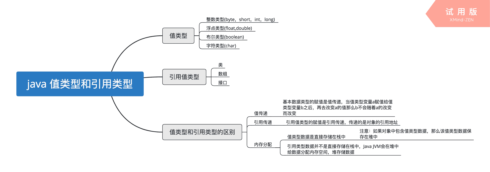B 错在，值类型变量不包含实例，实例是针对于对象的概念，当类实例化为对象的时候，这个时候可以称为是类的一个实例。同时，效率比较高这个概念比较模糊。C 错在，封装的概念也是针对类而言的，值类型数据不存在封装概念。D 错在，值类型变量可以作为成员变量存储在堆里，例如一个 Class A 中包含一个 int value，那么 value 是作为成员变量存储在堆中的。D 选项表述有漏洞。

编辑于 2019-10-21 21:33:11

* * *

[SyndromePolynomial](https://www.nowcoder.com/profile/540281625)

B 应该是错在 Java 不存在指针？引用类型的变量是一个指向堆上对象的地址。C 错在，值类型不是封装的，值类型就是基础数据类型 D 的作用域的判断不是根据其是值类型变量还是引用类型变量吧

发表于 2019-01-13 13:39:23

* * *

[杉杉来啦](https://www.nowcoder.com/profile/243827773)

两者之间相同点和不同点  

 **以下是值类型与引用类型的表：**

  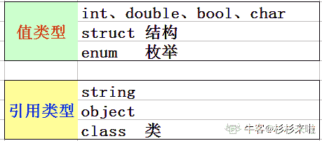 相同点

1.  值类型和引用类型都是 System.Object 的子类

2.  值类型和引用类型都可以继承接口。（很多人都认为值类型不能继承接口）

| 1234567891011 |  interface Itest {     void test(); } struct TestStruct : Itest {     public void test()     {         throw new NotImplementedException();     } } |

不同点

1.  值类型分配在堆栈上，引用类型是在托管堆上分配的。这里需要指出一点：**如果一个引用类型中的某个属性是值类型，这个*值类型的属性是分配在托管堆上的****。*
2.  所有的值类型都是隐式密封的（sealed），例如 ：你不可能继承 int 来构造自己的类型。
3.  值类型的每一次赋值都会执行一次逐字段的复制，所以如果是频繁赋值也会造成性能上的压力，引用类型的赋值只是指针的传递，其实也是生成新的指针实例。
4.  引用类型额外有类型对象指针和同步块索引，值类型是没有的。所以我们平时使**用 lock 锁的对象不可能是值类型，因为值类型没有同步块索引**

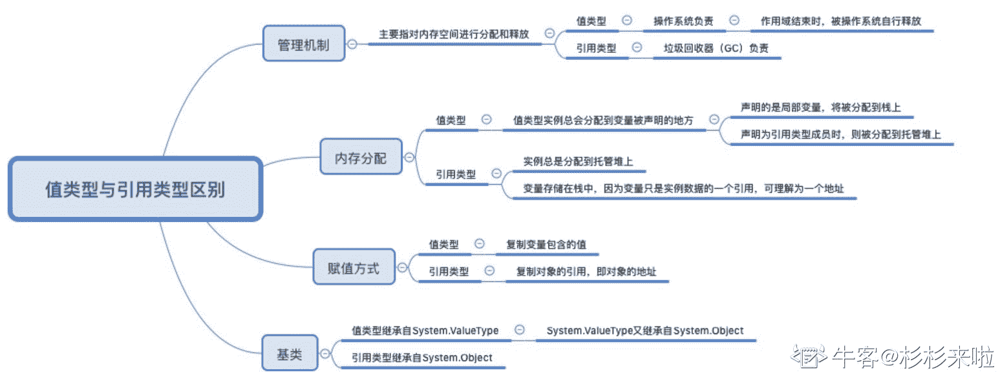
**测试例子**

发表于 2020-08-19 10:22:28

* * *

## 3

哪项在多线程中不能避免发生死锁

正确答案: A   你的答案: 空 (错误)

```cpp
允许进程同时访问某些资源。
```

```cpp
允许进程强行从占有者那里夺取某些资源。
```

```cpp
进程在运行前一次性地向系统申请它所需要的全部资源。
```

```cpp
把资源事先分类编号，按号分配，使进程在申请，占用资源时不会形成环路。
```

本题知识点

Java 工程师 京东 2019

讨论

[Coderxxx 报道](https://www.nowcoder.com/profile/8249925)

死锁：在多道程序设计环境下，多个进程可能竞争一定数量的资源，。一个进程申请资源，如果资源不可用，那么进程进入等待状态。如果所申请的资源被其他等待进程占有，那么该等待的进程有可能无法改变状态，这种情况下称之为死锁。

死锁的四个条件：

互斥：**至少有一个资源**必须处在**非共享**模式，即一次只能有一个进程使用，如果另一进程申请该资源，那么申请进程必须延迟直到该资源释放为止。

占有并等待：一个进程必须**占有**至少一个资源，并**等待**另一个资源，而该资源为其他进程所占有。

非抢占：**资源不能被抢占**
循环等待：有一组进程{P0,P1,...Pn},P0 等待的资源被 P1 占有，P1 等待的资源被 P2 占有，Pn-1 等待的资源被 Pn 占有，Pn 等待的资源被 P0 占有。

形成死锁必须要满足这四个条件。那么违背这几个条件中的任何一个就不会形成死锁，这种方式成为 死锁预防，而死锁避免是动态的检测分配资源的状态是否安全- 死锁解决方式 1\. 死锁预防 2\. 死锁避免 3\. 死锁检测并恢复三者处理死锁的方式可以类比为：死锁预防，直接铲平坑；死锁避免，直接跳过坑；死锁检测并恢复，摔到坑里，修正一下继续前行。对于互斥而言：有的资源本身就是互斥的，所以通常无法破坏这一必要条件。对于占有并等待：破坏它，可以指定这样的规则（协议）：每一个进程执行前一次性申请完所有资源。或者 每个进程申请当前所需要的资源，当需要使用其他资源时，需要把之前申请的资源释放掉。前者可以理解为破坏**等待**，后者可以理解为破坏**占有**。这样做使得资源得利用率很低（最后阶段可能需要用一下打印机，而将其在整个运行期占有）；对于优先级低得进程来说，多次释放资源很容易造成它们饥饿。对于非抢占：破坏它，即对于已经分配的资源可以进行抢占。当一个优先级比较低，那么它的资源往往会被优先级高得剥夺，导致它饥饿。对于循环等待：对所有资源类型进排序，要求每个进程按照资源编号递增顺序申请资源。可以用反证法证明。简要描述一下，在进程按照资源编号递增顺序申请资源的条件下，假设一个循环等待存在，即有一组进程{P0,P1,...Pn},P0 等待的资源被 P1 占有，P1 等待的资源被 P2 占有，Pn-1 等待的资源被 Pn 占有，Pn 等待的资源被 P0 占有。那么 Pi+1 占有了 Ri 资源，同时又申请 Ri+1，所以资源 Ri 的编号必然小于 Ri+1，那么 R0 的编号小于 R1 的....Rn 资源的编号小于 R0 资源的编号（Pn 进程）。根据传递性，R0 的编号小于 R0 的编号，显然矛盾，因此，在上述条件下，不会产生循环等待。参考：《操作系统概念》

编辑于 2019-01-23 00:39:04

* * *

[敲代码的小白](https://www.nowcoder.com/profile/512977783)

这题个人认为没有答案，A 为产生死锁的一个原因，B 为解除死锁的方法，CD 为预防死锁的方法，C 破坏‘请求与保持’条件，D 破坏‘循环等待’条件。避免死锁的方法有银行家算法，但是选项中并没有。

发表于 2019-01-17 12:32:37

* * *

[天涯海角追风](https://www.nowcoder.com/profile/850215325)

赛码网上这道题 ABCD 全选

发表于 2019-09-04 20:57:41

* * *

## 4

以下为求 0 到 1000 以内所有奇数和的算法，从中选出描述正确的算法（ ）

正确答案: A   你的答案: 空 (错误)

```cpp
①s=0；②i=1；③s=s+i；④i=i+2；⑤如果 i≤1000，则返回③；⑥结束
```

```cpp
①s=0；②i=1；③i=i+2；④s=s+i；⑤如果 i≤1000，则返回③；⑥结束
```

```cpp
①s=1；②i=1；③s=s+i；④i=i+2；⑤如果 i≤1000，则返回③；⑥结束
```

```cpp
①s=1；②i=1；③i=i+2；④s=s+i；⑤如果 i≤1000，则返回③；⑥结束
```

本题知识点

Java 工程师 京东 Java 工程师 京东 2019

讨论

[野猪佩奇](https://www.nowcoder.com/profile/6696792)

这个题主要是 D 和 A 的区别，D 算的是 1+3+。。。+10001，A 是 0+1+3+。。。+999,就是 D 多算了一个

发表于 2019-03-16 19:21:28

* * *

[ざ多余德解ヤ释](https://www.nowcoder.com/profile/512953391)

第二行没有算上 1，直接从 3 开始的第三行是 2+5+7+9+...第四行是开头是 4 就更不用看了

发表于 2019-03-09 14:20:28

* * *

## 5

关于递归法的说法不正确的是（ ）

正确答案: D   你的答案: 空 (错误)

```cpp
程序结构更简洁
```

```cpp
占用 CPU 的处理时间更多
```

```cpp
要消耗大量的内存空间，程序执行慢，甚至无法执行
```

```cpp
递归法比递推法的执行效率更高
```

本题知识点

Java 工程师 京东 Java 工程师 京东 2019

讨论

[Third。201810292312548](https://www.nowcoder.com/profile/468895639)

递归就是一层一层的调用函数进栈，会大量存储重复的数据，占用大量内存，且会有栈溢出的可能。而递推就是不用存储重复的数据，从底层获得了数据直接递给上一层即可。

发表于 2019-01-12 15:34:36

* * *

[迷茫的漂](https://www.nowcoder.com/profile/1417764)

相对于[递归](http://baike.so.com/doc/5725016.html)算法,递推算法免除了数据进出栈的过程，也就是说,不需要函数不断的向边界值靠拢,而直接从边界出发,直到求出函数值. 

发表于 2019-01-09 23:35:32

* * *

## 6

字符串”ABCD”和字符串”DCBA”进行比较，如果让比较的结果为真，应选用关系运算符（）

正确答案: B   你的答案: 空 (错误)

```cpp
>
```

```cpp
<
```

```cpp
=
```

```cpp
>=
```

本题知识点

Java 工程师 京东 2019

讨论

[你别看他还小](https://www.nowcoder.com/profile/9307371)

比较的时候比的是 ASCII 码，从第一位开始比，如果第一位能比较出谁大谁小则直接返回，若相等，比较下一个字符，因此选 B

编辑于 2019-01-27 18:01:49

* * *

[牛客 9792607 号](https://www.nowcoder.com/profile/9792607)

比较的是第一位

发表于 2019-02-20 15:46:14

* * *

[简繁](https://www.nowcoder.com/profile/9610229)

这题可以做比较吗？为什么程序中不能这样写

发表于 2019-02-15 15:18:54

* * *

## 7

下面是一段关于计算变量 s 的算法： ①变量 s 的初值是 0 ②变量 i 从 1 起循环到 n，此时变量 s 的值由下面的式子表达式计算 ③s=s+(-1)*i ④输出变量 s 的值 这个计算 s 值的算法中，s 的代数式表示是(    )。

正确答案: D   你的答案: 空 (错误)

```cpp
1-2+3-4+„+(-1)n*(n-1)
```

```cpp
1-2+3-4+„+(-1)n-1*n
```

```cpp
1+2+3+4+...+(n-1)+n
```

```cpp
-1-2-3-4-...-n
```

本题知识点

Java 工程师 京东 Java 工程师 京东 2019

讨论

[284420441](https://www.nowcoder.com/profile/578457218)

对于 s=s+(-1)*i，（-1）乘 i（0 到 n）永远为负，说明计算式一直在减，可以排除 abc

发表于 2019-01-31 11:23:47

* * *

[zhengzhi12](https://www.nowcoder.com/profile/486382306)

通项公式：Sn=n*S0-1*1-1*2+...-1*n.S0=0，所以选 D。

发表于 2019-03-11 11:24:42

* * *

## 8

以下运算符中运算优先级最高的是（ ）

正确答案: D   你的答案: 空 (错误)

```cpp
+
```

```cpp
OR
```

```cpp
>
```

```cpp
/
```

本题知识点

Java 工程师 京东 2019

讨论

[程序猿 Go 师傅](https://www.nowcoder.com/profile/242025553)

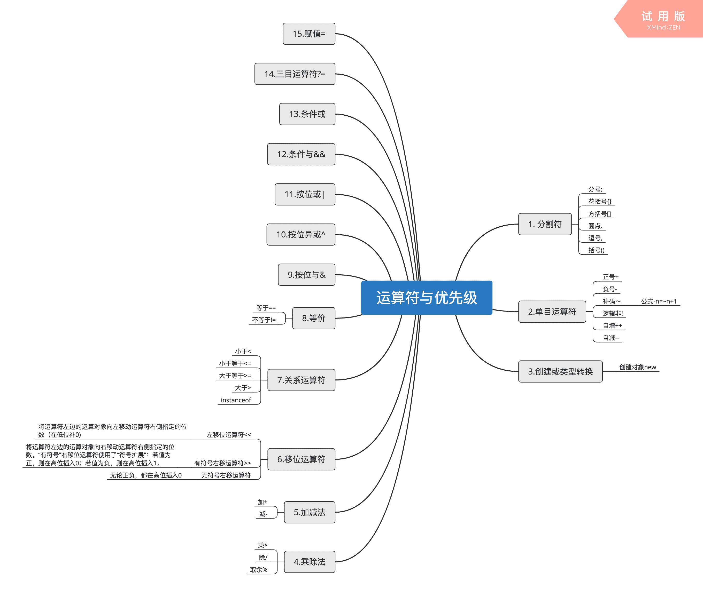以上是我整理的运算符优先级，数字越小表示优先级越高。在这里我选的是+号，如果+号表示的是正号的话那么优先级是大于除/号的，这题目略微的不严谨，望周知。

编辑于 2019-10-21 21:33:05

* * *

[qiuz567](https://www.nowcoder.com/profile/902321880)

我觉得这应该是想表示转义，

发表于 2019-03-21 14:26:53

* * *

[不要慌，问题不大！](https://www.nowcoder.com/profile/97363103)

优先级:算数运算符>关系运算符>逻辑运算符

发表于 2021-04-24 13:50:56

* * *

## 9

采用哪种遍历方法可唯一确定一棵二叉树？（  ）

正确答案: B   你的答案: 空 (错误)

```cpp
给定一棵二叉树的先序和后序遍历序列
```

```cpp
给定一棵二叉树的后序和中序遍历序列
```

```cpp
给定先序、中序和后序遍历序列中的任意一个即可
```

```cpp
给定一棵二叉树的先序遍历序列
```

本题知识点

Java 工程师 京东 2019

讨论

[你别看他还小](https://www.nowcoder.com/profile/9307371)

应该是多选，选择 BD

发表于 2019-01-27 17:32:46

* * *

[益州节度使](https://www.nowcoder.com/profile/2141080)

这答案是不是有问题？先序+中序和后序+中序原理上不是一样吗？

发表于 2019-01-12 10:13:52

* * *

[十年单身换一个字节 SP](https://www.nowcoder.com/profile/3240278)

这题目答案是有问题的，前序加中序或者后序加中序都是可以的。。

发表于 2019-01-27 14:21:01

* * *

## 10

已知小顶堆：{51,32,73,23,42,62,99,14,24,39,43,58,65,80,120}，请问 62 对应节点的左子节点是

正确答案: B   你的答案: 空 (错误)

```cpp
99
```

```cpp
73
```

```cpp
3943
```

```cpp
120
```

本题知识点

Java 工程师 京东 Java 工程师 京东 2019

讨论

[最爱清明雨上](https://www.nowcoder.com/profile/1224405)

这个题应该选 65 吧

发表于 2019-02-10 17:16:03

* * *

[程序猿 Go 师傅](https://www.nowcoder.com/profile/242025553)

这道题比较的坑爹：1.答案是错的 2.考察小顶堆可以用个小一点的数据，没必要整这么大一个堆来考嘛；
接下来我会用代码来证明为什么答案是错的：
首先定义 minHeapify，用于给某个节点建小堆

```cpp
public void minHeapify(List<Integer> array , int index , int len){
        // 取得当前节点的左右子节点索引
        int left = left(index);
        int right = right(index);

        // 找到 index，left，right 中最小的值，索引为 min
        int min = 0 ;

        // 1\. 比较左值 array[left]和 array[index]的大小
        if(left < len && array.get(left) < array.get(index)){
            min = left;
        }else{
            min = index;
        }

        // 2\. 比较右值 array[right]和 array[min]的大小
        if(right < len && array.get(right) < array.get(min)){
            min = right;
        }

        // 3\. 如果不是最小堆那么需要继续构造最小堆
        if(min != index){
            swap(array,min,index);
            minHeapify(array,min,len);
        }
    }
```

然后定义 buildMinHeap 来遍历非叶子节点构建最小堆

```cpp
public void buildMinHeap(List<Integer> array){
        // 构建最小堆，将堆的所有非叶子节点都遍历一遍构建最小堆
        int len = array.size();
        for(int index = len/2 -1 ; index>=0 ; index--){
            minHeapify(array,index,len);
        }
    }
```

然后执行 main 函数测试 buildMinHeap

```cpp
public static void main(String[] args) {
        MinHeap heap = new MinHeap();
        // 测试 buildMinHeap
        List<Integer> array = new ArrayList<>();
        array.add(51);
        array.add(32);
        array.add(73);
        array.add(23);
        array.add(42);
        array.add(62);
        array.add(99);
        array.add(14);
        array.add(24);
        array.add(3943);
        array.add(58);
        array.add(65);
        array.add(80);
        array.add(120);

        System.out.println("before");
        array.forEach(temp-> System.out.println(temp));

        heap.buildMinHeap(array);

        System.out.println("after:");
        array.forEach(temp-> System.out.println(temp));
    }
```

最终输出的结果是：
14
23
62
24
42
65
99
32
51
3943
58
73
80
120
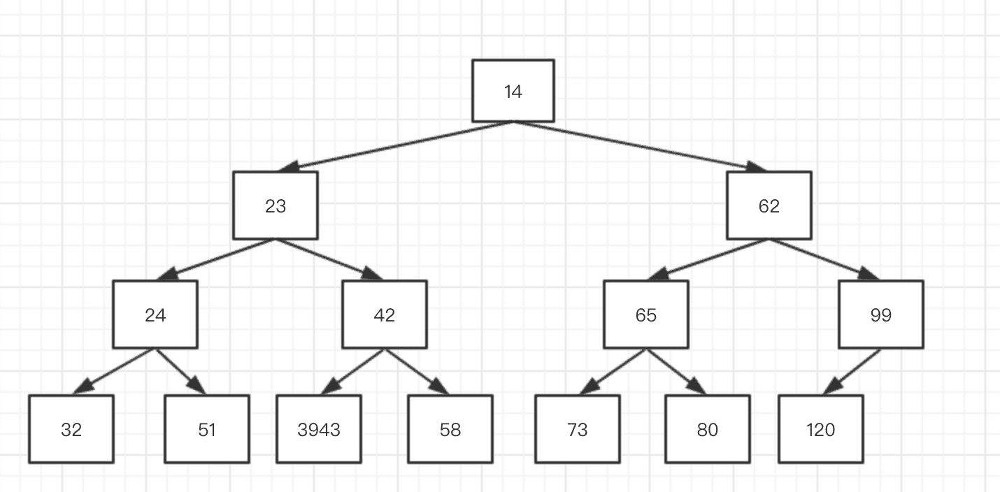

所以答案应该是 65

编辑于 2019-10-21 21:32:07

* * *

[简繁](https://www.nowcoder.com/profile/9610229)

应该是 65 啊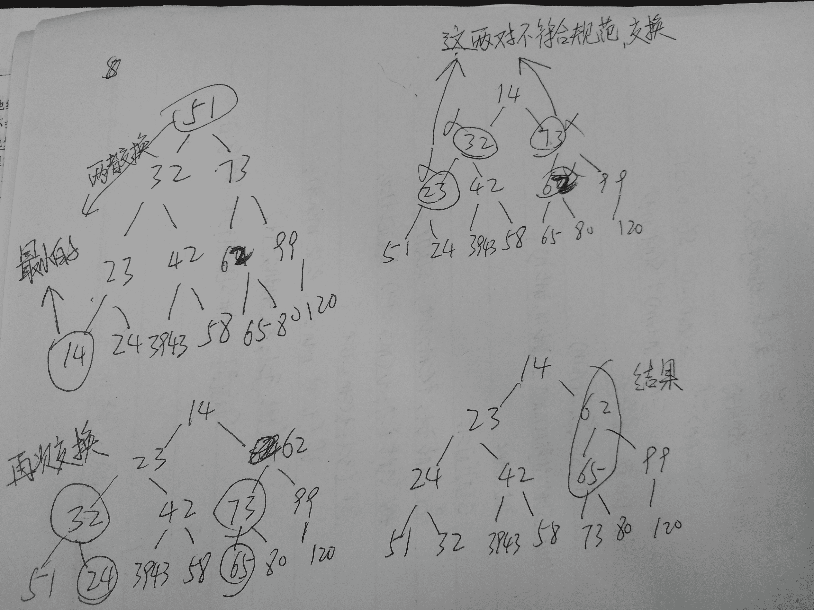

发表于 2019-02-15 17:28:18

* * *

## 11

若串 S=”UP！UP！JD”，则其子串的数目

正确答案: B   你的答案: 空 (错误)

```cpp
33
```

```cpp
37
```

```cpp
39
```

```cpp
35
```

本题知识点

Java 工程师 京东 Java 工程师 京东 2019

讨论

[程序猿 Go 师傅](https://www.nowcoder.com/profile/242025553)

字符串有 8 个字符，那么非空子串数为 8+7+...+2+1=8*9/2=36，加上一个空串，总共的子串数量为 37

编辑于 2019-10-21 21:32:58

* * *

[Jack_Gao](https://www.nowcoder.com/profile/510882680)

一个八个字符串 公式 n(n+1)/2 + 1  你可以把子串”bc”抽象为”a|bc|de”，这样一来计算子串数目的问题其实就转化成了计算字符串中放置边界的问题，一个长度为 n 的字符串中可以放置 n 个边界，放置第一个边界后可以放置有 n-1 种选择作为第二条边界，这样得到 n(n-1)条子串，又因为两条边界顺序互换子串不变，所以结果需要除以 2，最后再加上字符串本身，得到 n(n+1)/2 + 1。 所以 8*9/2+1=37

发表于 2019-02-13 20:42:28

* * *

[牛奶椰子糖](https://www.nowcoder.com/profile/8548356)

enmmmmm 没有空格嘛。。。

发表于 2019-02-22 20:35:43

* * *

## 12

一颗二叉树的叶子节点有 5 个，出度为 1 的结点有 3 个，该二叉树的结点总个数是？

正确答案: B   你的答案: 空 (错误)

```cpp
11
```

```cpp
12
```

```cpp
13
```

```cpp
14
```

本题知识点

Java 工程师 京东 Java 工程师 京东 2019

讨论

[小年](https://www.nowcoder.com/profile/617685)

叶子节点个数 = 5 ，因为叶子节点个数=度为 2 的结点个数加 1，所以度为 2 的结点个数=5-1=4，度为 1 的结点个数 = 3,
所以总个数 = 5 + 4 + 3 = 12

发表于 2019-01-11 00:11:42

* * *

[FanZejie](https://www.nowcoder.com/profile/956069309)

所以什么是出度为 1 的结点😰😰😰

发表于 2020-08-27 10:34:19

* * *

[bukun](https://www.nowcoder.com/profile/514169517)

n = n0 + n1 + n2;n0 = n2 + n1;

发表于 2020-09-09 11:22:39

* * *

## 13

以下哪种排序算法一趟结束后能够确定一个元素的最终位置？

正确答案: A C   你的答案: 空 (错误)

```cpp
简单选择排序
```

```cpp
基数排序
```

```cpp
堆排序
```

```cpp
二路归并排序
```

本题知识点

Java 工程师 京东 2019

讨论

[敲代码的小白](https://www.nowcoder.com/profile/512977783)

一趟结束后能够确定一个元素的最终位置的排序方法有： 简单选择排序、快速排序、冒泡排序、堆排序

发表于 2019-01-17 13:13:37

* * *

[～浅@光～](https://www.nowcoder.com/profile/5663537)

A 是对的啊，难道有更深层次的我不知道吗。。。。

发表于 2019-01-14 19:21:57

* * *

[你别看他还小](https://www.nowcoder.com/profile/9307371)

简单排序也可以确定吧，我觉得答案是 AC，这套卷子有问题，很多多选的，变成单选了。

发表于 2019-01-27 17:34:37

* * *

## 14

权值分别为 9、3、2、8 的结点，构造一棵哈夫曼树，该树的带权路径长度是？

正确答案: B   你的答案: 空 (错误)

```cpp
36
```

```cpp
40
```

```cpp
45
```

```cpp
46
```

本题知识点

Java 工程师 京东 Java 工程师 京东 2019

讨论

[闷死作大死](https://www.nowcoder.com/profile/433851177)

```cpp

	          22

	        /    \

	      13      9

	    /   \

	   5     8

	 /  \

	2    3

```

 WPL = 2*3 + 3*3 + 8*2 + 9*1 = 40

发表于 2019-04-25 10:43:54

* * *

[BryceLoski](https://www.nowcoder.com/profile/972298428)

一、对结点排序，为 2，3，8，9 二、2 和 3 的父节点为 5（2+3 的权值）三、8 大于 2 和 3，8 和 5 组成，父节点为 13 四、9 大于 2、3、8，9 和 13 组成，父节点为 22 五、计算带权路径长度：结点的带权路径长度为从根结点到该结点之间的路径长度与该结点的权的乘积。3*2+3*3+2*8+1*9=40

发表于 2019-03-03 11:55:45

* * *

[Leonce](https://www.nowcoder.com/profile/922638885)

引用一位朋友的博客：[`blog.csdn.net/lmh10621/article/details/76100381`](https://blog.csdn.net/lmh10621/article/details/76100381)

发表于 2019-02-16 15:51:44

* * *

## 15

在（）中，只要指出表中任何一个结点的位置，就可以从它出发依次访问到表中其他所有结点。

正确答案: D   你的答案: 空 (错误)

```cpp
线性单链表
```

```cpp
双向链表
```

```cpp
线性链表
```

```cpp
循环链表
```

本题知识点

Java 工程师 京东 Java 工程师 京东 2019

讨论

[Leonce](https://www.nowcoder.com/profile/922638885)

关键字：依次

发表于 2019-02-16 15:54:33

* * *

[f-twinkle](https://www.nowcoder.com/profile/761357922)

**如果是双向链表的话，从中间一个点开始，必须先往左一次再掉头往右一次才能遍历。****而循环链表只要沿一个方向一直走下去就可以遍历。**

发表于 2019-03-26 09:20:49

* * *

[～浅@光～](https://www.nowcoder.com/profile/5663537)

没有依次的话就可以选 B,D 了

发表于 2019-01-14 19:31:25

* * *

## 16

下列对 TCP/IP 结构及协议分层不正确的是：

正确答案: C   你的答案: 空 (错误)

```cpp
网络接口层：Wi-Fi、ATM 、GPRS、EVDO、HSPA。
```

```cpp
网际层：IP、ICMP、IGMP 。
```

```cpp
传输层：TCP、UDP、TLS、ssh。
```

```cpp
FTP、TELNET、DNS、SMTP.
```

本题知识点

Java 工程师 京东 Java 工程师 京东 2019

讨论

[～浅@光～](https://www.nowcoder.com/profile/5663537)

SSH 为 Secure Shell 的缩写，由 IETF 的网络小组（Network Working Group）所制定；SSH 为建立在[应用层](https://baike.sogou.com/lemma/ShowInnerLink.htm?lemmaId=16954&ss_c=ssc.citiao.link)基础上的安全协议。SSH 是目前较可靠，专为远程登录会话和其他网络服务提供安全性的协议。

发表于 2019-01-14 19:34:04

* * *

[openmind.](https://www.nowcoder.com/profile/539390139)

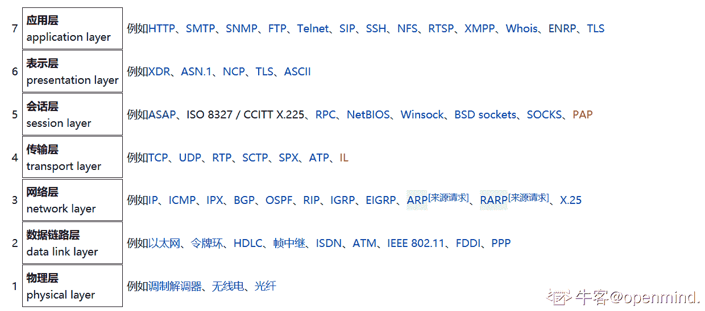

发表于 2021-09-10 07:58:40

* * *

## 17

以下哪种设备工作在数据链路层？

正确答案: C   你的答案: 空 (错误)

```cpp
中继器
```

```cpp
集线器
```

```cpp
交换机
```

```cpp
路由器
```

本题知识点

Java 工程师 京东 Java 工程师 京东 2019

讨论

[clexxxxx](https://www.nowcoder.com/profile/429103134)

物理层：中继器、集线器数据链路层：网桥、交换器网络层：路由器网络层以上：网关

发表于 2019-02-17 19:39:56

* * *

[敲代码的小白](https://www.nowcoder.com/profile/512977783)

中继器和集线器工作在物理层。中继器用于再生数字信号，集线器用于放大信号。路由器工作在网络层，用于分组转发。

发表于 2019-01-17 13:26:11

* * *

[生活吗？](https://www.nowcoder.com/profile/3146182)

物理层：中继器、集线器数据链路层：网桥、交换器网络层：路由器网络层以上：网关

发表于 2019-05-05 15:13:31

* * *

## 18

打电话使用的数据传输方式是（），手机上网使用的数据传输方式是（）？

正确答案: B   你的答案: 空 (错误)

```cpp
电路交换，电路交换
```

```cpp
电路交换，分组交换
```

```cpp
分组交换，分组交换
```

```cpp
分组交换，电路交换
```

本题知识点

Java 工程师 京东 Java 工程师 京东 2019

讨论

[284420441](https://www.nowcoder.com/profile/578457218)

**电路交换**有预留，且分配一定空间，提供专用的网络资源，提供有保证的服务，应用于**电话网**；**分组交换**无预留，且不分配空间，存在网络资源争用，提供有无保证的服务。分组交换可用于**数据报网络和虚电路网络**。我们常用的**Internet 就是数据报网络**，单位是 Bit。

发表于 2019-01-31 17:16:53

* * *

## 19

后退 N 帧协议的发送窗口大小是（），接收窗口的大小是（）？

正确答案: D   你的答案: 空 (错误)

```cpp
=1,=1
```

```cpp
=1,>1
```

```cpp
>1,>1
```

```cpp
>1,=1
```

本题知识点

Java 工程师 京东 Java 工程师 京东 2019

讨论

[clexxxxx](https://www.nowcoder.com/profile/429103134)

滑动窗口协议有 1、停止等待协议，发送窗口=1，接受窗口=1；2、退后 N 帧协议，发送>1,接收=1;3、选择重传协议，发送>1,接收>1;

发表于 2019-02-17 19:44:32

* * *

[284420441](https://www.nowcoder.com/profile/578457218)

TCP 协议的学习（六）滑动窗口 停止等待 退后 N 帧 选择重传

[`blog.csdn.net/qq_34501940/article/details/51180268`](https://blog.csdn.net/qq_34501940/article/details/51180268)

发表于 2019-01-31 17:27:43

* * *

[生活吗？](https://www.nowcoder.com/profile/3146182)

滑动窗口协议有 1、停止等待协议，发送窗口=1，接受窗口=1；2、退后 N 帧协议，发送>1,接收=1;3、选择重传协议，发送>1,接收>1;

发表于 2019-05-05 15:16:01

* * *

## 20

TCP 释放连接第二次挥手时 ACK（）,第三次挥手时 ACK（）?

正确答案: C   你的答案: 空 (错误)

```cpp
不存在，不存在，
```

```cpp
不存在，值是 1
```

```cpp
值是 1，值是 1
```

```cpp
值是 1，不存在
```

本题知识点

Java 工程师 京东 Java 工程师 京东 2019

讨论

[寂静于暖](https://www.nowcoder.com/profile/6461901)

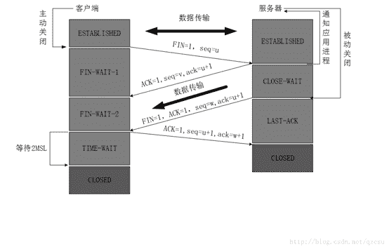

发表于 2019-03-07 16:27:13

* * *

[一直愤怒的小鸟](https://www.nowcoder.com/profile/8239043)

为什么在第三次挥手时需要发送 ack 和 seq？因为 TCP 是可靠的全双工传输，所以需要确保客户端的链接关闭正确，并且防止传送的数据包在网络中延迟出现的错误，如果后面又使用同样的端口建立了一个 TCP 链接而且现在要释放(完成了两次挥手)，刚才延迟的包现在到了，这时也许服务器还有数据要发送，但是客户端收到延迟的包，就直接确认返回 ACK，从而出现非正常关闭。 

发表于 2019-02-20 12:57:58

* * *

[生活吗？](https://www.nowcoder.com/profile/3146182)

题目不是说挥手嘛？那应该指的是四次挥手断开连接呀！

发表于 2019-05-05 15:18:21

* * *

## 21

TCP 协议的拥塞控制就是防止过多的数据注入到网络中，这样可以使网络中的路由器或链路不致过载。常用的方法有:

正确答案: B   你的答案: 空 (错误)

```cpp
慢启动、窗口滑动
```

```cpp
慢开始、拥塞控制
```

```cpp
快重传、快恢复
```

```cpp
快开始、快恢复
```

本题知识点

Java 工程师 京东 2019

讨论

[CPPformat](https://www.nowcoder.com/profile/289535953)

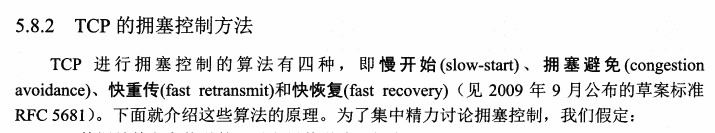这是谢希仁第 7 版 232 页的截图

发表于 2019-03-03 16:03:39

* * *

[来做朋友](https://www.nowcoder.com/profile/994031135)

这套京东的卷有问题，好多本来多选的，都变成单选题的，这道题是 BC

发表于 2020-04-07 22:49:28

* * *

[Severl](https://www.nowcoder.com/profile/5138415)

快重传、快恢复不是对慢开始、拥塞**避免**的优化吗？

发表于 2019-02-15 09:29:26

* * *

## 22

对于京东商城高流量访问，预防 Ddos 的方法可以有？

正确答案: A   你的答案: 空 (错误)

```cpp
限制同时打开 SYN 半链接的数目。
```

```cpp
缩短 SYN 半链接的 Time out 时间。
```

```cpp
关闭不必要的服务。
```

```cpp
限制客户端请求服务器时长。
```

本题知识点

Java 工程师 京东 Java 工程师 京东 2019

讨论

[写代码的红黑🌲](https://www.nowcoder.com/profile/8617883)

当大量 syn 请求包发送给服务端的时候，需要设置合理的最大并发半开连接数。一旦超过相应的最大限制，系统就会认为自己收到了 syn flood 攻击，进入防范模式中。SYN Timeout 时间被减短，SYN-ACK 的重试次数减少，系统也会自动对缓冲区中的报文进行延时，避免对 TCP/IP 堆栈造成过大的冲击，力图将攻击危害减到最低。

发表于 2019-01-16 11:06:50

* * *

[一直愤怒的小鸟](https://www.nowcoder.com/profile/8239043)

在三次握手过程中，服务器发送 SYN-ACK 之后，收到客户端的 ACK 之前的 TCP 连接称为半连接(half-open connect)。此时服务器处于 SYN_RECV 状态。当收到 ACK 后，服务器转入 ESTABLISHED 状态。

攻击客户端通过发包器，在短时间内伪造大量不存在的 IP 地址，向服务器不断地发送 SYN 包，服务器回复确认包 SYN/ACK，并等待客户的确认，由于源地址是不存在的，服务器需要不断的重发 SYN/ACK 直至超时，这些伪造的 SYN 包将长时间占用未连接队列，正常的 SYN 请求被丢弃，目标系统运行缓慢，严重者引起网络堵塞甚至系统瘫痪。

SYN 攻击是一个典型的 DDOS 攻击。检测 SYN 攻击非常的方便，当你在服务器上看到大量的半连接状态时，特别是源 IP 地址是随机的，基本上可以断定这是一次 SYN 攻击。

发表于 2019-03-22 16:27:08

* * *

[拼命也要幸福](https://www.nowcoder.com/profile/171607642)

认为选 Ab  a 减少重传次数  b 减少半连接重传总时间

发表于 2020-02-13 11:24:10

* * *

## 23

网络管理员把优盘上的源代码给程序员参考，但要防止程序误删除或修改，以下正确的加载方式是（      ）

正确答案: B   你的答案: 空 (错误)

```cpp
mount -o defaults /dev/sdb1 /tools
```

```cpp
mount -r /dev/sdb1 /tools
```

```cpp
mount -o ro /dev/sdb1 /tools
```

```cpp
mount -o ro /dev/sdb /tools
```

本题知识点

Java 工程师 京东 Java 工程师 京东 2019

讨论

[dwdw123](https://www.nowcoder.com/profile/462393309)

*   -r: 将文件系统作为只读文件系统进行安装，而不考虑它先前在 /etc/file systems 文件中指定的内容或者先前的任何命令行选项。
*   ro : 将已安装的文件指定为只读文件，而不考虑它先前在 /etc/file systems 文件中指定的选项或者先前的任何命令行选项。缺省值是 rw。

发表于 2019-02-24 13:24:38

* * *

[xflicker](https://www.nowcoder.com/profile/1705104)

-r, --read-only         mount the filesystem read-only (same as -o ro)所以 cd 也对吧。

发表于 2019-02-28 17:22:27

* * *

[牛奶椰子糖](https://www.nowcoder.com/profile/8548356)

菜鸟教程上 mount 命令没有-r 选项。。。-o async：打开非同步模式，所有的档案读写动作都会用非同步模式执行。
-o sync：在同步模式下执行。
-o atime、-o noatime：当 atime 打开时，系统会在每次读取档案时更新档案的『上一次调用时间』。当我们使用 flash 档案系统时可能会选项把这个选项关闭以减少写入的次数。
-o auto、-o noauto：打开/关闭自动挂上模式。
-o defaults:使用预设的选项 rw, suid, dev, exec, auto, nouser, and async.
-o dev、-o nodev、-o exec、-o noexec 允许执行档被执行。
-o suid、-o nosuid：允许执行档在 root 权限下执行。
-o user、-o nouser：使用者可以执行 mount/umount 的动作。
-o remount：将一个已经挂下的档案系统重新用不同的方式挂上。例如原先是唯读的系统，现在用可读写的模式重新挂上。
-o ro：用唯读模式挂上。
-o rw：用可读写模式挂上。
-o loop=：使用 loop 模式用来将一个档案当成硬盘分割挂上系统。

发表于 2019-02-22 20:44:02

* * *

## 24

下列有关软连接描述正确的是

正确答案: B   你的答案: 空 (错误)

```cpp
与普通文件没什么不同，inode 都指向同一个文件在硬盘中的区块
```

```cpp
不能对目录创建软链接
```

```cpp
保存了其代表的文件的绝对路径，是另外一种文件，在硬盘上有独立的区块，访问时替换自身路径
```

```cpp
不可以对不存在的文件创建软链接
```

本题知识点

Java 工程师 京东 Java 工程师 京东 2019

讨论

[ifengzhi](https://www.nowcoder.com/profile/6182377)

答案有问题，不能对目录建立硬连接。答案应为 C

发表于 2019-02-18 16:06:18

* * *

[冲鸭鸭鸭鸭鸭](https://www.nowcoder.com/profile/8609931)

*   软链接有自己的文件属性及权限等；
*   可对不存在的文件或目录创建软链接；
*   软链接可交叉文件系统；
*   软链接可对文件或目录创建；
*   创建软链接时，链接计数 i_nlink 不会增加；

*   删除软链接并不影响被指向的文件，但若被指向的原文件被删除，则相关软连接被称为死链接（即 dangling link，若被指向路径文件被重新创建，死链接可恢复为正常的软链接）。

京东怎么搞的，出题好随意😓😓

发表于 2019-01-27 10:51:17

* * *

[龙妖海](https://www.nowcoder.com/profile/6229489)

要先说清楚 linux 文件系统中的 inode 这个东西。当划分磁盘分区并格式化的时候，整个分区会被划分为两个部分，即 inode 区和 data block(实际数据放置在数据区域中）这个 inode 即是（目录、档案）文件在一个文件系统中的唯一标识，需要访问这个文件的时候必须先找到并读取这个 文件的 inode。多个档名对应同一个 inode，硬链接只是在某个目录下新增一笔档名链 接到某个 inode 号码的关联记录而已。软连接就是建立一个独立的文件，而这个文件会让数据的读取指向它 link 的那个档案的档名，由于只是作为**指向的动作**，所以当来源档案被删除之后，软连接的档案无法开启，因为找不到原始档名。摘录自：https://www.cnblogs.com/crazylqy/p/5821105.html

发表于 2019-03-21 17:18:29

* * *

## 25

Ext3 日志文件系统的特点是：

正确答案: A   你的答案: 空 (错误)

```cpp
高可用性
```

```cpp
数据的完整性
```

```cpp
数据转换快
```

```cpp
多日志模式
```

本题知识点

Java 工程师 京东 Java 工程师 京东 2019

讨论

[dwdw123](https://www.nowcoder.com/profile/462393309)

1、高可用性：系统使用了 ext3 文件系统后，即使在非正常关机后，系统也不需要检查文件系统。 2、数据的完整性：避免了意外宕机对文件系统的破坏。 3、文件系统的速度：因为 ext3 的日志功能对磁盘的驱动器读写头进行了优化。所以，文件系统的读写性能较之 Ext2 文件系统并来说，性能并没有降低。 4、数据转换 ：“由 ext2 文件系统转换成 ext3 文件系统非常容易。 5、多种日志模式

发表于 2019-02-24 13:27:19

* * *

[ざ多余德解ヤ释](https://www.nowcoder.com/profile/512953391)

好像真是 ABCD 百度：[`zhidao.baidu.com/question/986184306997278859.html`](https://zhidao.baidu.com/question/986184306997278859.html)

发表于 2019-03-09 15:05:59

* * *

## 26

DHCP 是动态主机配置协议的简称,其作用是

正确答案: C   你的答案: 空 (错误)

```cpp
动态分配磁盘资源
```

```cpp
动态分配内存资源
```

```cpp
为网络中的主机分配 IP 地址
```

```cpp
为集群中的主机分配 IP 地址
```

本题知识点

Java 工程师 京东 Java 工程师 京东 2019

讨论

[＋＋offer＋＋](https://www.nowcoder.com/profile/382057020)

DHCP 动态主机配置协议（Dynamic Host Configuration Protocol, DHCP）是一个局域网的网络协议，使用[UDP 协议](https://www.baidu.com/s?wd=UDP%E5%8D%8F%E8%AE%AE&tn=SE_PcZhidaonwhc_ngpagmjz&rsv_dl=gh_pc_zhidao)工作，主要有两个用途：给内部网络或网络服务供应商自动分配[IP 地址](https://www.baidu.com/s?wd=IP%E5%9C%B0%E5%9D%80&tn=SE_PcZhidaonwhc_ngpagmjz&rsv_dl=gh_pc_zhidao)给用户给内部[网络管理员](https://www.baidu.com/s?wd=%E7%BD%91%E7%BB%9C%E7%AE%A1%E7%90%86%E5%91%98&tn=SE_PcZhidaonwhc_ngpagmjz&rsv_dl=gh_pc_zhidao)作为对所有计算机作***管理的手段。

发表于 2019-08-23 22:30:14

* * *

[284420441](https://www.nowcoder.com/profile/578457218)

网络和集群有什么区别呢 

发表于 2019-02-05 12:10:10

* * *

## 27

以下命令可以用于获取本地 ip 地址的是：

正确答案: A   你的答案: 空 (错误)

```cpp
ifconfig
```

```cpp
uptime
```

```cpp
top
```

```cpp
netstat
```

本题知识点

Java 工程师 京东 Java 工程师 京东 2019

讨论

[龙妖海](https://www.nowcoder.com/profile/6229489)

ifconfig 是[linux](https://baike.baidu.com/item/linux/27050)中用于显示或配置网络设备（[网络接口卡](https://baike.baidu.com/item/%E7%BD%91%E7%BB%9C%E6%8E%A5%E5%8F%A3%E5%8D%A1/9764230)）的命令，英文全称是 network interfaces configuring

发表于 2019-03-21 17:33:00

* * *

[阿武 a](https://www.nowcoder.com/profile/45017359)

是 ipconfig，这套题好多问题

发表于 2019-02-18 19:41:52

* * *

## 28

以下命令可以用于获取本机 cpu 使用率的是：

正确答案: C   你的答案: 空 (错误)

```cpp
ifconfig
```

```cpp
uptime
```

```cpp
top
```

```cpp
netstat
```

本题知识点

Java 工程师 京东 Java 工程师 京东 2019

讨论

[寂静于暖](https://www.nowcoder.com/profile/6461901)

****ifconfig****命令被用于配置和显示 Linux 内核中网络接口的网络参数。用 ifconfig 命令配置的网卡信息，在网卡重启后机器重启后，配置就不存在。要想将上述的配置信息永远的存的电脑里，那就要修改网卡的配置文件了。**uptime 命令**能够打印系统总共运行了多长时间和系统的平均负载。uptime 命令可以显示的信息显示依次为：现在时间、系统已经运行了多长时间、目前有多少登陆用户、系统在过去的 1 分钟、5 分钟和 15 分钟内的平均负载。**top 命令**可以实时动态地查看系统的整体运行情况，是一个综合了多方信息监测系统性能和运行信息的实用工具。 **netstat 命令**用来打印 Linux 中网络系统的状态信息，可让你得知整个 Linux 系统的网络情况。 

发表于 2019-03-07 17:44:16

* * *

## 29

以下命令用于设置环境变量的是：

正确答案: A   你的答案: 空 (错误)

```cpp
export
```

```cpp
cat
```

```cpp
echo
```

```cpp
env
```

本题知识点

Java 工程师 京东 Java 工程师 京东 2019

讨论

[锁链](https://www.nowcoder.com/profile/5576108)

简单搜了一下：export 用于修改环境变量 env 用于创建环境变量

发表于 2019-02-14 16:05:22

* * *

[＋＋offer＋＋](https://www.nowcoder.com/profile/382057020)

export 用于修改环境变量 cat 命令用于连接文件并打印到标准输出设备上。echo 命令：显示文字并给文字添加颜色 env 用于创建环境变量 

发表于 2019-08-23 22:36:06

* * *

[MonkeyH](https://www.nowcoder.com/profile/8391276)

export 设置环境变量 env 显示当前用户的环境变量

发表于 2019-03-15 16:57:04

* * *

## 30

重复的数据，会增加磁盘空间的占有率，延长操作数据的时间。可以使用规范化处理数据冗余，以下对符合第一范式的表述正确的是：

正确答案: C   你的答案: 空 (错误)

```cpp
非键属性和键（主键）属性间没有传递依赖
```

```cpp
非键属性和键（主键）属性间没有部分依赖
```

```cpp
表中不应该有重复组。列重复拆成另外一张表；行重复拆成多行
```

```cpp
一个表中的列值与其他表中的主键匹配
```

本题知识点

Java 工程师 京东 Java 工程师 京东 2019

讨论

[284420441](https://www.nowcoder.com/profile/578457218)

1 、第一范式（1NF）
指数据库表的每一列(即每个属性)都是不可分割的基本数据项，同一列中不能有多个值，即实体中的某个属性不能有多个值或者不能有重复的属性。简而言之，第一范式就是无重复的列。
2、 第二范式（2NF）
第二范式（2NF）要求数据库表中的每个实例或行必须可以被唯一地区分。
第二范式（2NF）要求实体的属性完全依赖于主关键字。所谓完全依赖是指不能存在仅依赖主关键字一部分的属性，如果存在，那么这个属性和主关键字的这一部分应该分离出来形成一个新的实体，新实体与原实体之间是一对多的关系。简而言之，第二范式就是非主属性依赖于主关键字。3 、第三范式（3NF）
在满足第二范式的基础上，切不存在传递函数依赖，那么就是第三范式。简而言之，第三范式就是属性不依赖于其它非主属性。---------------------
原文：[`blog.csdn.net/qq_31929931/article/details/77186259`](https://blog.csdn.net/qq_31929931/article/details/77186259) 

发表于 2019-02-10 18:18:07

* * *

[Jack_Gao](https://www.nowcoder.com/profile/510882680)

第一范式：第一范式是二维数据表且数据表中的列不可再分 强调原子性

发表于 2019-02-13 21:25:46

* * *

[一只老风铃](https://www.nowcoder.com/profile/9973952)

第一范式，通俗的讲不允许出现表中表

发表于 2019-02-02 12:35:26

* * *

## 31

以下哪条 SQL 语句可以返回 table1 中的全部的 key：

正确答案: D   你的答案: 空 (错误)

```cpp
select tabel1.key from table1 join tabel2 on table1.key=table2.key
```

```cpp
select tabel1.key from table1 right outer join tabel2 on table1.key=table2.key
```

```cpp
select tabel1.key from table1 left semi join tabel2 on table1.key=table2.key
```

```cpp
select tabel1.key from table1 left outer join tabel2 on table1.key=table2.key
```

本题知识点

Java 工程师 京东 Java 工程师 京东 2019

讨论

[喜欢喝贵的矿泉水](https://www.nowcoder.com/profile/932834143)

保证 table1 既左表的完整性那必然选择 left 连接 semi:只匹配右表中存在的列 outer：左向外联接的结果集包括左表的所有行，而不仅仅是联接列所匹配的行。如果左表的某行在右表中没有匹配行，则在相关联的结果集行中右表的所有选择列表列均为空值(null)

编辑于 2021-02-19 13:28:33

* * *

[流浪的猫](https://www.nowcoder.com/profile/9858143)

由于需要返回 table1 中的全部的 key，则需要左连接，而 left semi join 表示只打印出左边表中 的 key，**但前提是左表中的 key 在右表中存在，否则会过滤掉**，所以选 D

发表于 2019-02-14 18:09:50

* * *

[284420441](https://www.nowcoder.com/profile/578457218)

首先题中是左连接的语法：
SELECT column_name(s)
FROM table_name1
LEFT JOIN table_name2
ON table_name1.column_name=table_name2.column_name

发表于 2019-02-10 18:55:48

* * *

## 32

以下关于 Mysql 数据库引擎ＭyISAM 的描述错误的是？

正确答案: A   你的答案: 空 (错误)

```cpp
支持行锁
```

```cpp
如果表主要是用于插入新记录和读出记录，那么选择 MyISAM 引擎能实现处理高效率
```

```cpp
在执行查询语句（SELECT）前，会自动给涉及的所有表加读锁，在执行更新操作（UPDATE、DELETE、INSERT 等）前，会自动给涉及的表加写锁
```

```cpp
不支持事务
```

本题知识点

Java 工程师 京东 Java 工程师 京东 2019

讨论

[284420441](https://www.nowcoder.com/profile/578457218)

**MyISAM 特性：**1:不支持事务、不具备 AICD 特性(原子性、一致性、分离性、永久性);2:表级别锁定形式(更新数据时锁定整个表、这样虽然可以让锁定的实现成本很小但是同时大大降低了其并发的性能)；3:读写相互阻塞(不仅会在写入的时候阻塞读取、还会在读取的时候阻塞写入、但是读取不会阻塞读取);4:只会缓存索引(myisam 通过 key_buffer_size 来设置缓存索引，提高访问性能较少磁盘 IO 的压力、但是只缓存索引、不缓存数据);5:读取速度快、占用资源比较少;6:不支持外键约束、只支持全文检索；7:是 MySQL5.5.5 版本之前的默认存储引擎；[`www.cnblogs.com/y-rong/p/8110596.html`](https://www.cnblogs.com/y-rong/p/8110596.html)[`www.cnblogs.com/laowenBlog/p/8405614.html`](https://www.cnblogs.com/laowenBlog/p/8405614.html)

发表于 2019-02-10 19:18:39

* * *

[夏小包](https://www.nowcoder.com/profile/4204018)

Innodb 支持事务和行级锁，是 innodb 的最大特色。

发表于 2019-03-24 17:37:28

* * *

## 33

Mysql 中表 user 的建表语句如下，
CREATE TABLE `user` (
  `id` bigint(20) NOT NULL AUTO_INCREMENT COMMENT '主键 Id',
  `name` varchar(255) DEFAULT NULL COMMENT '名称',
  `age` int(11) DEFAULT NULL COMMENT '年龄',
  `address` varchar(255) DEFAULT NULL COMMENT '地址',
  `created_time` datetime DEFAULT NULL COMMENT '创建时间',
  `updated_time` datetime DEFAULT NULL COMMENT '更新时间',
  PRIMARY KEY (`id`),
  KEY `idx_com1` (`name`,`age`,`address`)
) ENGINE=InnoDB DEFAULT CHARSET=utf8 COMMENT='用户表';
以下哪个查询语句没有使用到索引 idx_com1？

正确答案: C   你的答案: 空 (错误)

```cpp
select  *  from user where name='张三' and age = 25 and address='北京大兴区';
```

```cpp
select  *  from user where name='张三' and address='北京大兴区';
```

```cpp
select  *  from user where age = 25 and address='北京大兴区';
```

```cpp
select  *  from user where address='北京大兴区'  and age = 25 and name='张三'
```

本题知识点

Java 工程师 京东 Java 工程师 京东 2019

讨论

[284420441](https://www.nowcoder.com/profile/578457218)

** 索引的最左匹配特性**：

  当 b+树的数据项是复合的数据结构，比如(name,age,sex)的时候 b+数是按照从左到右的顺序来建立搜索树的，比如当(张三,20,F)这样的数据来检索的时候，b+树会优先比较 name 来确定下一步的所搜方向，如果 name 相同再依次比较 age 和 sex，最后得到检索的数据；但当(20,F)这样的没有 name 的数据来的时候，b+树就不知道下一步该查哪个节点节选于：[`www.cnblogs.com/big-handsome-guy/p/7755059.html`](https://www.cnblogs.com/big-handsome-guy/p/7755059.html) 

发表于 2019-02-11 10:27:47

* * *

[锁链](https://www.nowcoder.com/profile/5576108)

原来如此，综合两楼的回答，（使用到索引）==（条件中出现联合索引最左前缀字段）

发表于 2019-02-14 16:10:12

* * *

[为啥不能叫 CJJ](https://www.nowcoder.com/profile/7964461)

参考联合索引的最左前缀原理。

发表于 2019-01-18 17:56:57

* * *

## 34

DELETE 和 TRUNCATE TABLE 都是删除表中的数据的语句，它们的不同之处描述正确的是：

正确答案: A   你的答案: 空 (错误)

```cpp
TRUNCATE TABLE 比 DELETE 的速度快
```

```cpp
在删除时如果遇到任何一行违反约束（主要是外键约束），TRUNCATE TABLE 仍然删除，只是表的结构及其列、约束、索引等保持不变，但 DELETE 是直接返回错误
```

```cpp
对于被外键约束的表，不能使用 TRUNCATE TABLE，而应该使用不带 WHERE 语句的 DELETE 语句。
```

```cpp
如果想保留标识计数值，要用 DELETE，因为 TRUNCATE TABLE 会对新行标志符列使用的计数值重置为该列的种子
```

本题知识点

Java 工程师 京东 Java 工程师 京东 2019

讨论

[居居 Gril](https://www.nowcoder.com/profile/411724342)

同：
truncate table 与 delete 都是删除表数据，保留表结构 truncate table 在功能上与不带 WHERE 子句的 delete 语句相同：二者均删除表中的全部行。
不同：

truncate 比 delete（一行一行的删）速度快，且使用的系统和事务日志资源少。

truncate 操作后的表比 Delete 操作后的表要快得多。如果有 ROLLBACK 命令 Delete 将被撤销，而 truncate 则不会被撤销。

truncate 当表被清空后表和表的索引重新设置成初始大小，而 delete 则不能。如果删除表结构及其数据，用 drop table 语句。 
执行速度，一般来说: drop> truncate > delete。

发表于 2019-02-02 14:29:28

* * *

[寂静于暖](https://www.nowcoder.com/profile/6461901)

**truncate 与 delete 的相同点**效果上，delete from tableA，与 truncate table tableA 的作用是一样的（如果 delete 后面不添加 where 条件过滤），而且与 drop table tableA，接着 create table tableA 的效果也是一样的。**truncate 与 delete 不同点****1、语言上**delete 是 DML，truncate 是 DDL，执行 truncate 需要 drop 权限。
**2、效率上**delete 是一行一行的删除，所以执行速度不快。由于 truncate 是 DDL，是通过删除表然后重建表实现的，执行速度很快。**3、事务上**delete 过程如果出现错误，事务是可以回滚的，而 truncate 无法回滚。**4、效果上**

*   delete 可以删除符合条件的数据行，而 truncate 只能删除整体
*   delete 可以返回被删除的记录数，而 truncate 只返回 0，没有任何意义
*   在存储引擎为 InnoDB 的数据库服务器中，如果一个表的主键作为了另一个表的外键，那么 truncate 无法删除这个表中的数据，无论这个外键是否存在，这是由于 drop 表限制的。而 delete 可以，只要这个表的主键在另一个表的外键中不存在即可。
*   truncate 删除一个表的数据后，这个表的 auto_increment 列重新设置为初始大小，而 delete 则使用删除之前的顺序。索引同理。

发表于 2019-03-07 20:19:53

* * *

[284420441](https://www.nowcoder.com/profile/578457218)

```cpp
请问 B 选项错在哪里？：在删除时如果遇到任何一行违反约束（主要是外键约束），TRUNCATE TABLE 仍然删除，只是表的结构及其列、约束、索引等保持不变，但 DELETE 是直接返回错误
```

发表于 2019-02-11 11:30:50

* * *

## 35

用户表中有两列 name/country。
现在要查询用户表中每个国家(country)的用户人数，应使用以下哪个语句

正确答案: A   你的答案: 空 (错误)

```cpp
select count(*) from users group by country
```

```cpp
B. select name from users where country = 'xx'
```

```cpp
select count(country) from users
```

```cpp
select country from users
```

本题知识点

Java 工程师 京东 Java 工程师 京东 2019

## 36

如果必须保存一个对象在某一时刻的全部或者部分状态，方便以后需要的时候，可以把该对象恢复到先前的状态，应该使用何种设计模式？

正确答案: C   你的答案: 空 (错误)

```cpp
状态模式
```

```cpp
原型模式
```

```cpp
备忘录模式
```

```cpp
命令模式
```

本题知识点

Java 工程师 京东 2019

讨论

[写代码的红黑🌲](https://www.nowcoder.com/profile/8617883)

备忘录模式：适用于恢复某个类的先前状态，有点类似于快照这类型功能。原型模式：通过 new 产生一个对象需要非常繁琐的数据准备或访问权限，则可以使用原型模式。就是 java 中的克隆技术，以某个对象为原型，复制出新的对象。显然，新的对象具备原型对象的特点。状态模式：当一个对象，它具有很多种状态的，需要进行繁琐复杂的逻辑处理时，我们可以利用状态模式，将对象的各种状态进行类的封装，用于避免 if else 过于繁琐的情况。
命令模式：是一种数据驱动的设计模式，它属于行为型模式。请求以命令的形式包裹在对象中，并传给调用对象。调用对象寻找可以处理该命令的合适的对象，并把该命令传给相应的对象，该对象执行命令。

发表于 2019-01-16 10:29:35

* * *

## 37

兼容接口不同的类在一起工作，采用以下哪种设计模式最好？

正确答案: B   你的答案: 空 (错误)

```cpp
建造者模式
```

```cpp
适配器模式
```

```cpp
桥接模式
```

```cpp
代理模式
```

本题知识点

Java 工程师 京东 2019

讨论

[为啥不能叫 CJJ](https://www.nowcoder.com/profile/7964461)

建造者模式：将一个复杂对象的构建与它的表示分离，使得同样的构建过程可以创建不同的表示。适配器模式：将一个类的接口转换成另外一个客户希望的接口。Adapter 模式使得原本由于接口不兼容而不能一起工作的那些类可以一起工作。桥接模式：将抽象部分与它的实现部分分离，使它们都可以独立地变化。***模式：为其他对象提供一种***以控制对这个对象的访问。

发表于 2019-01-18 18:03:59

* * *

## 38

public class Main {

    public static void main(String[] args) {
        System.out.println("A");
        new Main();
        new Main();
    }

    public Main() {
        System.out.println("B");
    }

    {
        System.out.println("C");
    }

    static {
        System.out.println("D");
    }
}
以上程序输出的结果，正确的是？

正确答案: C   你的答案: 空 (错误)

```cpp
DCABB
```

```cpp
DABCBC
```

```cpp
DACBCB
```

```cpp
DACBB
```

本题知识点

Java 工程师 京东 Java 工程师 京东 2019

讨论

[hgnulb](https://www.nowcoder.com/profile/8667211)

**解析**：在**同一类**里面,首先**静态代码块**在类加载的时候就执行了,而且只执行一次,不论你是否 new 了对象,而**构造代码块**和**构造方法**是在每次创建对象时都会被调用，并且**构造代码块**的执行次序**优先**于**类构造函数**。**例如：下面这个例子** 

```cpp
package cn.hgnulb.base;

public class GFG {

    GFG(int x) {
        System.out.println("ONE argument constructor");
    }

    GFG() {
        System.out.println("No  argument constructor");
    }

    static {
        System.out.println("1st static init");
    }

    {
        System.out.println("1st instance init");
    }

    {
        System.out.println("2nd instance init");
    }

    static {
        System.out.println("2nd static init");
    }

    public static void main(String[] args) {
        new GFG();
        new GFG(8);
    }
}

```

**输出结果:**1st static init
2nd static init
1st instance init
2nd instance init
No  argument constructor
1st instance init
2nd instance init
ONE argument constructor

编辑于 2019-01-18 17:22:27

* * *

[zohy](https://www.nowcoder.com/profile/4107461)

加载顺序：静态初始代码块>初始代码块>构造函数

发表于 2019-02-20 18:34:34

* * *

[openmind.](https://www.nowcoder.com/profile/539390139)

**父子类加载顺序**

1.  父类静态变量

1.  父类静态代码块（若有多个按代码先后顺序执行）

1.  子类静态变量

1.  子类静态代码块（若有多个按代码先后顺序执行）

1.  父类非静态变量

1.  父类非静态代码块（若有多个按代码先后顺序执行）

1.  父类构造函数

1.  子类非静态变量

1.  子类非静态代码块（若有多个按代码先后顺序执行）

1.  子类构造函数

编辑于 2021-09-10 09:24:42

* * *

## 39

public class Main {

    private static int x = 10;
    private static Integer y = 10;

    public static void updateX(int value) {
        value = 3 * value;
    }

    public static void updateY(Integer value) {
        value = 3 * value;
    }

    public static void main(String[] args) {
        updateX(x);
        updateY(y);
    }
}
执行以上程序后，x 和 y 的值分别是多少？

正确答案: A   你的答案: 空 (错误)

```cpp
10,10
```

```cpp
10,30
```

```cpp
30,10
```

```cpp
30,30
```

本题知识点

Java 工程师 京东 Java 工程师 京东 2019

讨论

[hgnulb](https://www.nowcoder.com/profile/8667211)

**Integer **类的方法签名为：

```cpp
public final class Integer extends Number implements Comparable<Integer> 
```

可知这个类和字符串 String 一样，是一个最终类，因此 **Integer **类是不可变的，最终的。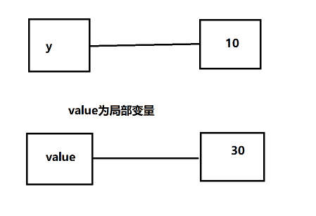
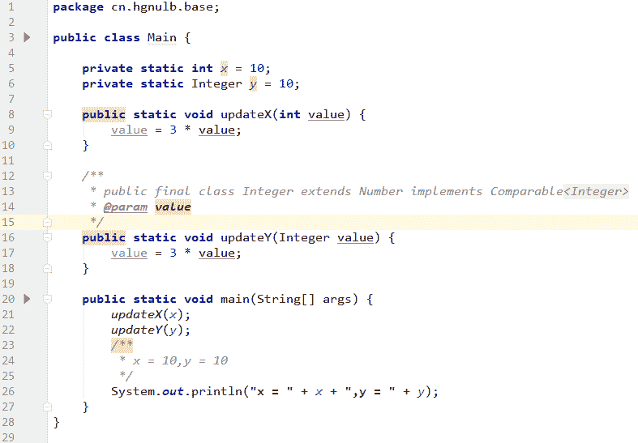

发表于 2019-01-21 11:59:22

* * *

[一入爪哇深似海](https://www.nowcoder.com/profile/401308268)

java 中都是值传递，而且是拷贝的

发表于 2019-03-20 21:11:00

* * *

[284420441](https://www.nowcoder.com/profile/578457218)

形参名 value 和字段 x，字段 y 不同，运算改变了内存中 value，但是 xy 没有改变。当方法 updateX 的形参名改为 x，此时运算会改变内存中 x 的值，是 30，y 同理。总结：仅当形参名和字段名一样，字段值才变。（本题一个叫 value，一个叫 x/y，不一样，所以不变）
楼上俩位，没有提到方法中参数类型为 int 的情况，说的不尽然是主要原因学疏才浅，希望各位批评讹误之处.

发表于 2019-02-13 11:31:13

* * *

## 40

public class Main {

    public static void main(String[] args) {
        String s1 = "abc";
        String s2 = "abc";
        System.out.println(s1 == s2);

        String s3 = new String("abc");
        System.out.println(s1 == s3);
    }
}
执行以上程序后，输出结果正确的是？

正确答案: B   你的答案: 空 (错误)

```cpp
true       true
```

```cpp
true       false
```

```cpp
false       fasle
```

```cpp
false       true
```

本题知识点

Java 工程师 京东 Java 工程师 京东 2019

讨论

[一个响亮的名字娜](https://www.nowcoder.com/profile/321045153)

String s1="abc"这种赋值方法经常用，会建立一个对象池，出现的第一个“abc”已经入池，当第二次出现这种语句时，就是池内的内容，所以“==”比较时，是同样的内容，所以是 true；第二种是用 new 来实例化（）缺点是会产生垃圾，s3 并没有入池，所以是 false，如果手动入池的话就是 true。（欢迎讨论，批评指正！）

发表于 2019-01-14 22:04:39

* * *

[机智的胖媳妇](https://www.nowcoder.com/profile/783754949)

String s1 = "abc";会先检查方法区的常量池中是否存在常量“abc”,如果存在，则直接将引用 s1 指向这个常量;如果不存在常量“abc”，则会在常量池中新创建一个对象用于存放“abc”,然后将引用 s1 指向这个常量。因此，题目中 s1 和 s2 指向的是同一个常量池中的对象。String s3 = new String("abc");会先在方法区的常量池中创建一个常量“abc”,然后再在堆内存中创建一个对象，将常量池中的“abc”拷贝一个副本到这个对象中。最后 s3 指向的是堆内存中的对象。因此引用 s1 指向的是常量池的对象，而 s3 指向的是堆内存中的对象。所以 s1==s3 为 flase

发表于 2019-02-18 14:03:35

* * *

[hgnulb](https://www.nowcoder.com/profile/8667211)

```cpp
package cn.hgnulb.jd;

/**
 * true
 * false
 * true
 */
public class Demo {

    public static void main(String[] args) {
        String s1 = "abc";
        String s2 = "abc";
        String s3 = new String("abc");
        String s4 = s3.intern();
        System.out.println(s1 == s2);
        System.out.println(s1 == s3);
        System.out.println(s1 == s4);
    }
}
```

编辑于 2019-01-21 13:53:19

* * *

## 41

JAVA 的类加载期负责整个生命周期内的 class 的初始化和加载工作，就虚拟机的规范来说，以下代码会输出什么结果？
public class Test {

    public static void main(String[] args) {
        System.out.println(Test2.a);
    }

}
class Test2{
    public static final String a="JD";

    static {
        System.out.print("OK");
    }

}

正确答案: A   你的答案: 空 (错误)

```cpp
只有 JD
```

```cpp
只有 OK
```

```cpp
输出 JDOK
```

```cpp
输出 OKJD
```

本题知识点

Java 工程师 京东 2019

讨论

[hgnulb](https://www.nowcoder.com/profile/8667211)

**详细请见博客讲解** **=> [`www.cnblogs.com/hglibin/p/10298650.html`](https://www.cnblogs.com/hglibin/p/10298650.html)**

编辑于 2019-01-25 09:41:45

* * *

[openmind.](https://www.nowcoder.com/profile/539390139)

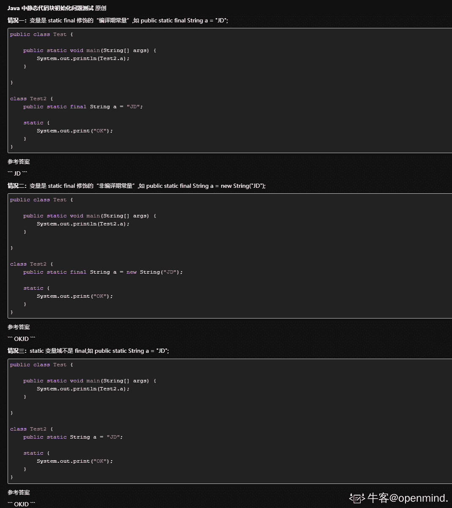

发表于 2021-09-10 09:37:09

* * *

[MonkeyH](https://www.nowcoder.com/profile/8391276)

**ConstantValue**属性：在 java 程序中，只有被 static 和 final 共同修饰的 基本类型 + String（可以生存在常量池中的类型） 可以具备 ConstantValue 属性，拥有这个属性可以在编译期间对该变量进行赋值。不需要等到类加载器对类进行加载。

发表于 2019-03-15 20:23:07

* * *

## 42

JAVA 的类加载期负责整个生命周期内的 class 的初始化和加载工作，就虚拟机的规范来说，以下代码会输出什么结果？
public class Test {

    public static void main(String[] args) {
        System.out.println(Test2.a);
    }

}
class Test2{
    public static final String a=new String("JD");

    static {
        System.out.print("OK");
    }

}

正确答案: D   你的答案: 空 (错误)

```cpp
只有 JD
```

```cpp
只有 OK
```

```cpp
输出 JDOK
```

```cpp
输出 OKJD
```

本题知识点

Java 工程师 京东 2019

讨论

[hgnulb](https://www.nowcoder.com/profile/8667211)

**详细请见博客讲解** **=> [`www.cnblogs.com/hglibin/p/10298650.html`](https://www.cnblogs.com/hglibin/p/10298650.html)**


编辑于 2019-01-25 09:42:42

* * *

[程序员巨轮](https://www.nowcoder.com/profile/7615294)

public class Test {

    public static void main(String[] args) {
        System.out.println(Test2.a);
    }

}
class Test2{
    public static final String a=new String("JD");
**//估计大家都觉得这里已经加载过静态属性了，属性虽然有值但是并没有输出结果，等到最后 Test2.a 才调用输出**
    static {
        System.out.print("OK");
    }**//所以执行顺序是：****1.Test2.a---->加载 Test2 类---->打印 OK--->调用 Test2 的 a 属性---->打印 JD** **2.所以结果是：OKJD** **//希望大家以后可以细心点，题目中是看打印结果，（同时也提醒我自己，哈哈）**
}

发表于 2019-01-20 16:56:51

* * *

## 43

JAVA 的类加载期负责整个生命周期内的 class 的初始化和加载工作，就虚拟机的规范来说，以下代码会输出什么结果？
public class Test {

    public static void main(String[] args) {
        System.out.println(Test2.a);
    }

}
class Test2{
    static {
        System.out.print("OK");
    }

    public static final String a=new String("JD");

}

正确答案: D   你的答案: 空 (错误)

```cpp
只有 JD
```

```cpp
只有 OK
```

```cpp
输出 JDOK
```

```cpp
输出 OKJD
```

本题知识点

Java 工程师 京东 2019

讨论

[hgnulb](https://www.nowcoder.com/profile/8667211)

**详细请见博客讲解** **=> [`www.cnblogs.com/hglibin/p/10298650.html`](https://www.cnblogs.com/hglibin/p/10298650.html)**
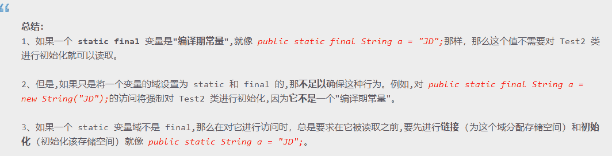

编辑于 2019-01-25 09:43:05

* * *

## 44

继承是 JAVA 语言的一个特性，针对类的继承，虚拟机会如何进行父类和子类的初始化加载呢？请阅读代码选择出该段代码的输入结果。
public class Test {

    public static void main(String[] args) {
        System.out.print(B.c);
    }
}

class A {
    static {
        System.out.print("A");
    }
}

class B extends A{
    static {
        System.out.print("B");
    }
    public final static String c = "C";
}

正确答案: C   你的答案: 空 (错误)

```cpp
AB
```

```cpp
ABC
```

```cpp
C
```

```cpp
BC
```

本题知识点

Java 工程师 京东 Java 工程师 京东 2019

讨论

[hgnulb](https://www.nowcoder.com/profile/8667211)

**详细请见博客讲解** **=> [`www.cnblogs.com/hglibin/p/10298650.html`](https://www.cnblogs.com/hglibin/p/10298650.html)**


编辑于 2019-01-25 09:43:21

* * *

[罗蜜斯丹](https://www.nowcoder.com/profile/1812648)

  public final static String c = "C";   c 是一个常量，会放入 B 的常量池。但是 public final String c = "C" ;  与 public static String c = "C";  则不会放入常量池。编译后 c 也会加入到 Test 的常量池，执行操作会变成 Test.c ，这样 Test 与 B 之间没有了符号引用；这是编译期的优化操作

编辑于 2019-02-24 20:52:37

* * *

[智慧远方](https://www.nowcoder.com/profile/4803517)

首先程序调用了 B 类的静态字段 C，由于 C 是一个编译期常量，因此不会触发类的初始化。其次，由于不触发子类初始化，就不会触发父类的初始化，因此只输出一个 C。注：类加载过程中，准备阶段会初始化静态字段(不是程序中的赋值，会赋给变量一些默认值，比如 int 类型赋值为 0)，静态方法块在初始化阶段才会执行

编辑于 2021-02-01 17:32:36

* * *

## 45

继承是 JAVA 语言的一个特性，针对类的继承，虚拟机会如何进行父类和子类的初始化加载呢？请阅读代码选择出该段代码的输入结果。
public class Test {

    public static void main(String[] args) {
        System.out.print(B.c);
    }
}

class A {
    public static String c = "C";
    static {
        System.out.print("A");
    }
}

class B extends A{
    static {
        System.out.print("B");
    }
}

正确答案: A   你的答案: 空 (错误)

```cpp
AC
```

```cpp
ABC
```

```cpp
C
```

```cpp
BC
```

本题知识点

Java 工程师 京东 Java 工程师 京东 2019

讨论

[@八王爷](https://www.nowcoder.com/profile/447909782)

类加载的问题，类加载的初始化阶段会执行静态块的代码，通过子类去调用父类的静态变量子类不会被初始化。

发表于 2019-07-11 23:34:38

* * *

[Liuiu](https://www.nowcoder.com/profile/8271495)

个人猜想，有错还望指出来在 main 方法打印出来的 c 变量是不是 B 的而是它的父类 A，所以不用加载类 B，所以不打印 B

发表于 2019-02-20 23:34:48

* * *

[hgnulb](https://www.nowcoder.com/profile/8667211)

**详细请见博客讲解** **=> [`www.cnblogs.com/hglibin/p/10298650.html`](https://www.cnblogs.com/hglibin/p/10298650.html)**


编辑于 2019-01-25 09:43:33

* * *

## 46

根据类加载器加载类的初始化原理，推断以下代码的输入结果为？
public class Test {

    public static void main(String[] args) throws Exception{
      ClassLoader classLoader=ClassLoader.getSystemClassLoader();
      Class clazz=classLoader.loadClass("A");
      System.out.print("Test");
      clazz.forName("A");
    }
}

class A{
    static {
        System.out.print("A");
    }
}

正确答案: A   你的答案: 空 (错误)

```cpp
TestA
```

```cpp
ATestA
```

```cpp
ATest
```

```cpp
Test
```

本题知识点

Java 工程师 京东 2019

讨论

[未来世界](https://www.nowcoder.com/profile/125739422)

用 ClassLoader 加载类，是不会导致类的初始化（也就是说不会执行<clinit>方法）.Class.forName(...)加载类，不但会将类加载，还会执行会执行类的初始化方法.

编辑于 2019-02-03 15:17:00

* * *

[人和动物](https://www.nowcoder.com/profile/335846004)

在 eclipse 上运行，只报 java.lang.ClassNotFoundException

发表于 2019-01-30 20:50:00

* * *

[jieao](https://www.nowcoder.com/profile/487953433)

这个不严谨，怎么不得声明下包名

发表于 2019-08-24 17:14:11

* * *

## 47

public class Main {

    public static void main(String[] args) {
        System.out.print(fun1());
    }

    public static String fun1() {
        try {
            System.out.print("A");
            return fun2();
        } finally {
            System.out.print("B");
        }
    }

    public static String fun2() {
        System.out.print("C");
        return "D";
    }
}
执行以上程序后，输出结果正确的是？

正确答案: C   你的答案: 空 (错误)

```cpp
ABCD
```

```cpp
ACDB
```

```cpp
ACBD
```

```cpp
不确定
```

本题知识点

Java 工程师 京东 Java 工程师 京东 2019

讨论

[人才库钉子户](https://www.nowcoder.com/profile/542663075)

try 中执行完 return 的语句后，不返回，执行 finally 块，finally 块执行结束后，返回到 try 块中，返回 try 块中最后 return 的值

发表于 2019-02-27 16:42:08

* * *

[fire 丶灯火阑珊](https://www.nowcoder.com/profile/2962735)

try 中含有 return 时，如果 return 中调用了函数或者表达式，会先执行，如果还有 finally 的话，会继续执行完 finally 的内容再返回。

编辑于 2019-08-24 17:10:50

* * *

[啾啾啾……](https://www.nowcoder.com/profile/1223855)

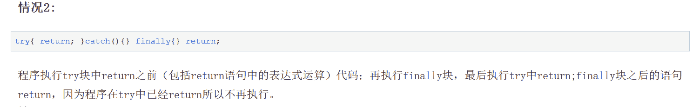
其他情况请参考：[`www.cnblogs.com/Tom-shushu/p/10244963.html`](https://www.cnblogs.com/Tom-shushu/p/10244963.html)

发表于 2019-04-02 18:42:58

* * *

## 48

import java.util.ArrayList;
import java.util.List;
public class Main {
    public static void main(String[] args) {
        List<String> list = new ArrayList<>();
        for(int i=0;i<100;i++){
            list.add("a");
        }
    }
}
JDK1.8 中，执行以上程序后，该 list 进行了几次扩容？

正确答案: C   你的答案: 空 (错误)

```cpp
4
```

```cpp
5
```

```cpp
6
```

```cpp
7
```

本题知识点

Java 工程师 京东 Java 工程师 京东 2019

讨论

[StormyNight](https://www.nowcoder.com/profile/3928902)

初始 10，每次扩容为原先的 1.5 倍

发表于 2019-01-16 10:04:59

* * *

[Sisterkon](https://www.nowcoder.com/profile/356862455)

质疑答案为 6 次
题目指出在 **JDK1.8** 中，且为 ArrayList 的无参构造函数 即 new ArrayList();此情况下初始容量为 DEFAULTCAPACITY_EMPTY_ELEMENTDATA 即 {}所以 list 的初始大小为 0 调用 add 方法时判断数组是否为空数组，true 则扩容为 DEFAULT_CAPACITY 即 10 此后每次扩容为 newCapacity = oldCapacity + （oldCapacity>>1)所以题中初始容量为 0 第一次 add 扩容为 10 所以 0->10->15->22->33->49->73->109 个人认为共进行七次扩容如有错误请指出，谢谢*关于无参构造初始容量为 0 的补图（后续扩容流程请翻阅 add 中调用的 ensureCapacityInternal 方法
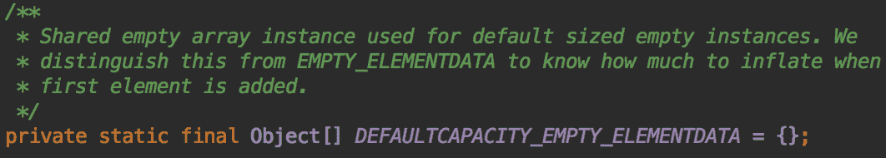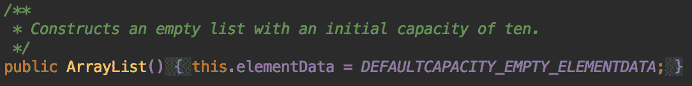

编辑于 2019-03-04 11:53:12

* * *

[小夥](https://www.nowcoder.com/profile/356553)

源码：

```cpp
    /**
     * Constructs an empty list with an initial capacity of ten.
     */
    public ArrayList() {
        this(10);
    }

    /**
     * Increases the capacity to ensure that it can hold at least the
     * number of elements specified by the minimum capacity argument.
     *
     * @param minCapacity the desired minimum capacity
     */
    private void grow(int minCapacity) {
        // overflow-conscious code
        int oldCapacity = elementData.length;
        int newCapacity = oldCapacity + (oldCapacity >> 1);  // 1.5 倍增长
        if (newCapacity - minCapacity < 0)
            newCapacity = minCapacity;
        if (newCapacity - MAX_ARRAY_SIZE > 0)
            newCapacity = hugeCapacity(minCapacity);
        // minCapacity is usually close to size, so this is a win:
        elementData = Arrays.copyOf(elementData, newCapacity);
    }

```

初始值为 10，增长幅度为 1.5 倍，答案为 10->15->22->33->49->73->109，故答案为 6 次。

发表于 2019-03-13 15:05:15

* * *

## 49

Object 类不含有以下哪种方法？

正确答案: A   你的答案: 空 (错误)

```cpp
equal
```

```cpp
wait
```

```cpp
notify
```

```cpp
clone
```

本题知识点

Java 工程师 京东 Java 工程师 京东 2019

讨论

[写代码的红黑🌲](https://www.nowcoder.com/profile/8617883)

equal 方法不存在，应该是 equals 方法才对

发表于 2019-01-15 21:51:29

* * *

[BryceLoski](https://www.nowcoder.com/profile/972298428)

[Object 类有哪些方法](https://www.cnblogs.com/NoPeach/p/8460810.html)

Object 是所有类的父类，任何类都默认继承 Object。Object 类到底实现了哪些方法？

1．clone 方法

保护方法，实现对象的浅复制，只有实现了 Cloneable 接口才可以调用该方法，否则抛出 CloneNotSupportedException 异常。

2．getClass 方法

final 方法，获得运行时类型。

3．toString 方法

该方法用得比较多，一般子类都有覆盖。

4．finalize 方法

该方法用于释放资源。因为无法确定该方法什么时候被调用，很少使用。

5．equals 方法

该方法是非常重要的一个方法。一般 equals 和==是不一样的，但是在 Object 中两者是一样的。子类一般都要重写这个方法。

6．hashCode 方法

该方法用于哈希查找，重写了 equals 方法一般都要重写 hashCode 方法。这个方法在一些具有哈希功能的 Collection 中用到。

一般必须满足 obj1.equals(obj2)==true。可以推出 obj1.hash- Code()==obj2.hashCode()，但是 hashCode 相等不一定就满足 equals。不过为了提高效率，应该尽量使上面两个条件接近等价。

7．wait 方法

wait 方法就是使当前线程等待该对象的锁，当前线程必须是该对象的拥有者，也就是具有该对象的锁。wait()方法一直等待，直到获得锁或者被中断。wait(long timeout)设定一个超时间隔，如果在规定时间内没有获得锁就返回。

调用该方法后当前线程进入睡眠状态，直到以下事件发生。

（1）其他线程调用了该对象的 notify 方法。

（2）其他线程调用了该对象的 notifyAll 方法。

（3）其他线程调用了 interrupt 中断该线程。

（4）时间间隔到了。

此时该线程就可以被调度了，如果是被中断的话就抛出一个 InterruptedException 异常。

8．notify 方法

该方法唤醒在该对象上等待的某个线程。

9．notifyAll 方法

该方法唤醒在该对象上等待的所有线程。

发表于 2019-03-04 12:20:37

* * *

[B1NNNNN](https://www.nowcoder.com/profile/664897399)

加个 s，md 绝了

发表于 2020-04-16 19:28:21

* * *

## 50

import java.util.concurrent.ArrayBlockingQueue;
import java.util.concurrent.ThreadPoolExecutor;
import java.util.concurrent.TimeUnit;
public class Main {
    public static void main(String[] args) {
        ThreadPoolExecutor executor = new ThreadPoolExecutor(5, 10, 15, TimeUnit.SECONDS,
                new ArrayBlockingQueue<Runnable>(5), new ThreadPoolExecutor.CallerRunsPolicy());
    }
}
线程池 executor 在空闲状态下的线程个数是？

正确答案: B   你的答案: 空 (错误)

```cpp
0
```

```cpp
5
```

```cpp
10
```

```cpp
不确定
```

本题知识点

Java 工程师 京东 2019

讨论

[AppleJack](https://www.nowcoder.com/profile/130490159)

public class Main {
    public static void main(String[] args) {
        ThreadPoolExecutor executor = new ThreadPoolExecutor(5, 10, 15, TimeUnit.SECONDS,
                new ArrayBlockingQueue<Runnable>(5), new ThreadPoolExecutor.CallerRunsPolicy());
    }
}前三个参数：核心线程有 5 个，最大线程数是 10 个，keepAliveTime 是 15s，如果线程池中的线程大于 5，那么超 15s 的空闲线程就会被结束，也就是说，一定会保持 5 个线程不会被结束。当所有任务完成后，会保持 5 个空闲的线程

发表于 2019-02-21 11:11:22

* * *

[一直愤怒的小鸟](https://www.nowcoder.com/profile/8239043)

难道不应该选 D 吗？如果线程池在这之前一共只提交了两个任务，那么这两个任务执行完之后，线程池里不就只有两个线程吗？？？

发表于 2019-08-22 15:59:37

* * *

[HereNowMe](https://www.nowcoder.com/profile/594094933)

空闲状态下的非核心线程数呢？非核心线程不是 15 秒后才 kill 吗？

发表于 2019-02-11 23:38:06

* * *

## 51

public class Main{

    public static ArrayList<String> list = new ArrayList<>();

    public static void main(String[] args) throws Exception{
        Thread t1 = new Main().new MyThread();
        Thread E10:E64t2 = new Thread(new Main().new MyRunnable());
        t1.setPriority(3);
        t2.setPriority(8);
        t1.start();
        t2.start();
        t2.join();

        for (int i = 0; i < 100000; i++) {
            i++;
        }
        list.add("main");

        t1.join();

        for (String s : list) {
            System.out.println(s);
        }
    }

    class MyThread extends Thread{
        @Override
        public void run(){
            for (int i = 0; i < 100000; i++) {
                i++;
            }
            list.add("Thread 1");
        }
    }

    class MyRunnable implements Runnable{
        @Override
        public void run(){
            for (int i = 0; i < 100000; i++) {
                Thread.yield();
                i++;
            }
            list.add("Thread 2");
        }
    }
}

正确答案: A   你的答案: 空 (错误)

```cpp
Thread 1     Thread 2    main
```

```cpp
Thread 2     Thread 1    main
```

```cpp
Thread 2    main    Thread 1
```

```cpp
无法判断
```

本题知识点

Java 工程师 京东 2019

讨论

[zjmeow](https://www.nowcoder.com/profile/6516827)

这题的题目是啥...

发表于 2019-02-03 17:20:47

* * *

[StormyNight](https://www.nowcoder.com/profile/3928902)

Java 线程中的 Thread.yield( )方法，译为线程让步。顾名思义，就是说当一个线程使用了这个方法之后，它就会把自己 CPU 执行的时间让掉，
让自己或者其它的线程运行，注意是让自己或者其他线程运行，并不是单纯的让给其他线程。
        yield()的作用是让步。它能让当前线程由“运行状态”进入到“就绪状态”，从而让其它具有相同优先级的等待线程获取执行权；但是，并不能保
证在当前线程调用 yield()之后，其它具有相同优先级的线程就一定能获得执行权；也有可能是当前线程又进入到“运行状态”继续运行！
      举个例子：一帮朋友在排队上公交车，轮到 Yield 的时候，他突然说：我不想先上去了，咱们大家来竞赛上公交车。然后所有人就一块冲向公交车，
有可能是其他人先上车了，也有可能是 Yield 先上车了。
     但是线程是有优先级的，优先级越高的人，就一定能第一个上车吗？这是不一定的，优先级高的人仅仅只是第一个上车的概率大了一点而已，
最终第一个上车的，也有可能是优先级最低的人。并且所谓的优先级执行，是在大量执行次数中才能体现出来的。

发表于 2019-01-16 10:52:57

* * *

[罗蜜斯丹](https://www.nowcoder.com/profile/1812648)

在 main 函数里面有 t2.join(); 说明，main 函数所在线程肯定是晚于 t2 ，可以确定 Thread2->main 。然后根据 t2 里面有 yield()，所以 t2 会让步给其它线程先执行，所以 t1 是先与 t2，确定 Thread1->Thread2，所以只有 A 了

```cpp

            发表于 2019-02-24 17:09:16

        52
        系统管理员编写扫描临时文件的 shell 程序 tmpsc.sh, 测试该程序时提示拒绝执行，解决的方法有（      ）

    正确答案:
                                                 B
                                                         你的答案:

                  空
                             (错误)

```
chmod 644 tmpsc.sh
```cpp

```
chmod 755 tmpsc.sh
```cpp

```
chmod a+x tmpsc.sh
```cpp

```
chmod u+x tmpsc.sh
```cpp

本题知识点

                                                            Java 工程师 
                                                京东 
                                                Java 工程师 
                                                京东 
                                                2019 

讨论

[天涯海角追风](https://www.nowcoder.com/profile/850215325)

                                                                    BCD 都对

发表于 2019-09-04 21:16:27

* * *

[MonkeyH](https://www.nowcoder.com/profile/8391276)

                                                                      chmod :     a ：代表所有人  u ：用户  g :组  o ：代表其他用户    read = 4  write = 2 execute = 1 

发表于 2019-03-16 08:54:02

* * *

[锁链](https://www.nowcoder.com/profile/5576108)

                                                                      这里有个 chmod 数字指令查询器：    [`chmodcommand.com/chmod-755/`](https://chmodcommand.com/chmod-755/)  

发表于 2019-02-14 16:33:03

* * *

## 53

        在 bash 编程中,算术比较大于、大于等于的运算符是（      ）

正确答案:
                                                                  C
                                        你的答案:

                  空
                             (错误)

```
>
```cpp

```
>=
```cpp

```
ge
```cpp

```
gt
```cpp

本题知识点

                                                            Java 工程师 
                                                京东 
                                                Java 工程师 
                                                京东 
                                                2019 

讨论

[小夥](https://www.nowcoder.com/profile/356553)

                                                                    EQ 就是 EQUAL 等于 
 NE 就是 NOT EQUAL 不等于 
 GT 就是 GREATER THAN 大于 
 LT 就是 LESS THAN 小于 
 GE 就是 GREATER THAN OR EQUAL 大于等于 
 LE 就是 LESS THAN OR EQUAL 小于等于

发表于 2019-03-13 16:17:29

* * *

[牛客 539603152 号](https://www.nowcoder.com/profile/539603152)

                                                                    读了一遍题目怎么感觉是一个多选题呢，出题能严谨点吗😏😏😏😏

发表于 2020-01-10 17:26:02

* * *

[jianyu](https://www.nowcoder.com/profile/8330860)

                                                                      ge：大于等于    gt：大于 

发表于 2019-02-26 14:16:52

* * *

## 54

        echo `expr 3/4`的执行结果

正确答案:
                                                                                   D
                       你的答案:

                  空
                             (错误)

```
0
```cpp

```
1
```cpp

```
0.75
```cpp

```
43163
```cpp

本题知识点

                                                            Java 工程师 
                                                京东 
                                                Java 工程师 
                                                京东 
                                                2019 

讨论

[itsblue](https://www.nowcoder.com/profile/9889697)

                                                                      我的 bash 执行出来的是     echo `expr 3/4`    

   3/4  

发表于 2019-01-29 17:58:26

* * *

[简繁](https://www.nowcoder.com/profile/9610229)

                                                                      我觉得是 0，我自己实测，    expr 不支持浮点运算，输出为 0    bash 如果想要支持浮点运算，应该这样写：    echo "scale=2;3/4" | bc    输出结果为 0.75 

发表于 2019-02-18 15:18:30

* * *

[小洪 1617](https://www.nowcoder.com/profile/6833493)

                                                                      expr 后面的表达式要使用空格隔开每一项，不然就不会计算。这里 3/4 没有隔开，所以答案是 3/4。这个莫名其妙的 43163 是答案错了，赛码网上有原题，D 选项就是 3/4。如果隔开了，比如"3 / 4"，那么就会执行计算，那么答案就是 0。 

发表于 2021-04-20 16:51:53

* * *

## 55

        文件目录 data 当前权限为 rwx --- ---，只需要增加用户组可读权限，但不允许写操作，具体方法为：

正确答案:
                                A
                                                                          你的答案:

                  空
                             (错误)

```
chmod +050 data
```cpp

```
chmod +040 data
```cpp

```
chmod +005 data
```cpp

```
chmod +004 data
```cpp

本题知识点

                                                            Java 工程师 
                                                京东 
                                                Java 工程师 
                                                京东 
                                                2019 

讨论

[Hardknockday](https://www.nowcoder.com/profile/392532474)

                                                                    使用 chomd 命令改变文件权限。Linux 文件基本权限有 9 个，owner,group,others 三种身份对应各自 read,write,execute 三种权限。文件权限字符：“-rwxrwxrwx”三个一组。数字化 r:4 w:2 x:1  增加用户组可读，但不可写，第一组和第三组默认为 0，只在第二组中添加 r-x 即可 chomd +050

发表于 2019-01-23 16:03:30

* * *

[渣叔](https://www.nowcoder.com/profile/2488740)

                                                                    050,那么用户组就可以读取该目录下的内容和进入到该目录，如果是 B 就不能进入到该目录

发表于 2019-03-09 14:39:39

* * *

[そんようげん](https://www.nowcoder.com/profile/4727399)

```
B 选项为什么不对
```cpp

发表于 2019-02-13 20:49:03

* * *

## 56

        bash 脚本文件一般第一行开头是

正确答案:
                                                                  C
                                        你的答案:

                  空
                             (错误)

```
//
```cpp

```
##
```cpp

```
#!
```cpp

```
#/
```cpp

本题知识点

                                                            Java 工程师 
                                                京东 
                                                Java 工程师 
                                                京东 
                                                2019 

## 57

        如何获取上一条命令执行的返回码

正确答案:
                                                                  C
                                        你的答案:

                  空
                             (错误)

```
$!
```cpp

```
0
```cpp

```
$?
```cpp

```
$#
```cpp

本题知识点

                                                            Java 工程师 
                                                京东 
                                                Java 工程师 
                                                京东 
                                                2019 

讨论

[居居 Gril](https://www.nowcoder.com/profile/411724342)

                                                                         $0  
     Shell 本身的文件名  
    $!    Shell 最后运行的后台 Process 的 PID(后台运行的最后一个进程的[进程 ID](https://www.baidu.com/s?wd=%E8%BF%9B%E7%A8%8BID&tn=SE_PcZhidaonwhc_ngpagmjz&rsv_dl=gh_pc_zhidao)号)    $?    最后运行的命令的结束代码（返回值）即执行上一个指令的返回值 (显示最后命令的退出状态。0 表示没有错误，其他任何值表明有错误)       $#  
     添加到 Shell 的参数个数  

发表于 2019-02-02 14:33:11

* * *

## 58

        Shell 脚本（shell script），是一种为 shell 编写的脚本程序。现有一个 test.sh 文件，且有可执行权限，文件中内容为：
 #!/bin/bash
 aa='Hello World !'
 请问下面选项中哪个能正常显示 Hello World !

正确答案:
                                                                                   D
                       你的答案:

                  空
                             (错误)

```
sh test.sh >/dev/null 1 && echo $aa
```cpp

```
./test.sh >/dev/null 1 && echo $aa
```cpp

```
bash test.sh >/dev/null 1 && echo $aa
```cpp

```
. ./test.sh >/dev/null 1 && echo $aa
```cpp

本题知识点

                                                            Java 工程师 
                                                京东 
                                                Java 工程师 
                                                京东 
                                                2019 

讨论

[牛年牛气呀](https://www.nowcoder.com/profile/8671750)

```

	$ ./test.sh

	$ . ./test.sh

```cpp

   点斜杠，点空格斜杠，两者都可以执行脚本，但是：    第一种方式是在子进程中运行脚本，第二种方式是在当前进程中执行脚本。    非当前进程是看不到 aa 变量的 

发表于 2019-02-05 21:28:06

* * *

[铅笔象棋🍃](https://www.nowcoder.com/profile/87251070)

                                                                    B 为啥不对

发表于 2019-01-22 12:19:36

* * *

## 59

        以下哪个命令是将标准输出和错误重定向到 a.txt 文件

正确答案:
                                A
                                                                          你的答案:

                  空
                             (错误)

```
&>a.txt
```cpp

```
&|a.txt
```cpp

```
a.txt < &
```cpp

```
a.txt | &
```cpp

本题知识点

                                                            Java 工程师 
                                                京东 
                                                Java 工程师 
                                                京东 
                                                2019 

讨论

[没意思了](https://www.nowcoder.com/profile/4559796)

                                                                      错误重定向  2>    标准输出     >    同时实现输出和错误重定向 &> 

编辑于 2019-03-05 23:41:00

* * *

## 60

          下图的 UML 类结构图表示的是哪种设计模式：    

正确答案:
                                A
                                                                          你的答案:

                  空
                             (错误)

```
抽象工厂模式
```cpp

```
享元模式
```cpp

```
装饰模式
```cpp

```
责任链模式
```cpp

本题知识点

                                                            Java 工程师 
                                                京东 
                                                Java 工程师 
                                                京东 
                                                2019 

讨论

[ܫ](https://www.nowcoder.com/profile/543226515)

                                                                    模糊看见第一个类图是  AbstractFactory

发表于 2019-07-31 17:40:10

* * *

[生活吗？](https://www.nowcoder.com/profile/3146182)

                                                                      哈哈  我也看不清！ 

发表于 2019-05-05 17:32:05

* * *

[行间距](https://www.nowcoder.com/profile/6300700)

                                                                    看不清

发表于 2019-04-10 11:23:59

* * *

```</clinit>