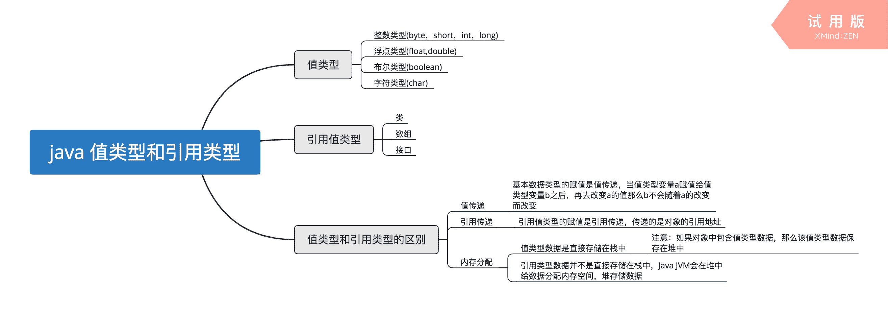
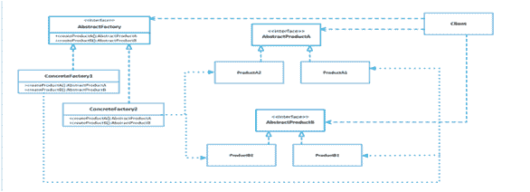

# 京东 2019 校招笔试 C 开发工程师笔试题

## 1

下面有关值类型和引用类型描述正确的是（）？

正确答案: A B C   你的答案: 空 (错误)

```cpp
值类型的变量赋值只是进行数据复制，创建一个同值的新对象，而引用类型变量赋值，仅仅是把对象的引用的指针赋值给变量，使它们共用一个内存地址。
```

```cpp
值类型数据是在栈上分配内存空间，它的变量直接包含变量的实例，使用效率相对较高。而引用类型数据是分配在堆上，引用类型的变量通常包含一个指向实例的指针，变量通过指针来引用实例。
```

```cpp
引用类型一般都具有继承性，但是值类型一般都是封装的，因此值类型不能作为其他任何类型的基类。
```

```cpp
值类型变量的作用域主要是在栈上分配内存空间内，而引用类型变量作用域主要在分配的堆上。
```

本题知识点

C++工程师 京东 2019

讨论

[song12300560](https://www.nowcoder.com/profile/6389014)

这是 c++？？？？？？？？？？？？？？？？？？

发表于 2019-01-29 21:48:45

* * *

[程序猿 Go 师傅](https://www.nowcoder.com/profile/242025553)

以下是对 java 语言中的值类型和引用类型做的一个总结。题目中 A 表述是对的。B 表述得也不一定准确，就看在什么语境中。栈中会存放值类型数据和对象的引用，但是值类型数据不一定非要存放在栈中。C 错在，封装的概念也是针对类而言的，值类型数据不存在封装概念。D 错在如果一个对象的成员中包含了值类型的变量，那么该值类型变量会在堆中分配内存空间。例如一个 User 对象中包含了 int 类型的 age 变量，那么当 User 创建实例的时候会在堆中给 age 变量分配空间而不是栈中。

编辑于 2019-10-21 21:32:52

* * *

[抖音电商极速内推](https://www.nowcoder.com/profile/787397360)

C++引用不占内存的…不知道为什么 b 正确

发表于 2020-08-05 19:45:18

* * *

## 2

如何在多线程中避免发生死锁？

正确答案: A B C D   你的答案: 空 (错误)

```cpp
允许进程同时访问某些资源。
```

```cpp
允许进程强行从占有者那里夺取某些资源。
```

```cpp
进程在运行前一次性地向系统申请它所需要的全部资源。
```

```cpp
把资源事先分类编号，按号分配，使进程在申请，占用资源时不会形成环路。
```

本题知识点

C++工程师 京东 2019

讨论

[绯鸢](https://www.nowcoder.com/profile/2831414)

死锁的四个必要条件 1.互斥条件：一个资源每次都只能被一个执行流使用 2.请求与保持条件：一个执行流因请求资源而阻塞时，对已获得的资源保持不放 3.不剥夺条件：一个执行流已获得的资源，在未使用完之前，不能进行强行剥夺 4.循环等待条件：若干执行流之间形成一种头尾相接的循环等待资源的关系避免死锁 1.破坏死锁的四个必要条件 2.加锁顺序一致 3.避免锁未释放的场景 4.资源一次性分配

发表于 2019-01-17 16:00:38

* * *

[35 岁退休卖炒粉](https://www.nowcoder.com/profile/195695151)

这道题的答案怎么会是 A，B，C，D 呢

发表于 2019-09-12 10:11:20

* * *

[fole](https://www.nowcoder.com/profile/2185155)

我记得四个必要条件中，有个互斥使用，应该被保护反而不应该破坏是吗

发表于 2019-02-18 19:53:07

* * *

## 3

采用哪种遍历方法可唯一确定一棵二叉树？（  ）

正确答案: B D   你的答案: 空 (错误)

```cpp
给定一棵二叉树的先序和后序遍历序列
```

```cpp
给定一棵二叉树的后序和中序遍历序列
```

```cpp
给定先序、中序和后序遍历序列中的任意一个即可
```

```cpp
给定一棵二叉树的先序和中序遍历序列
```

本题知识点

C++工程师 京东 2019

讨论

[玄学求 offer~](https://www.nowcoder.com/profile/259973278)

**选 BD****【解析】**给定一棵二叉树的后序和中序遍历序列 或者 给定一棵二叉树的先序和中序遍历序列可以唯一确定一棵二叉树

发表于 2019-03-13 13:28:53

* * *

[上二层楼](https://www.nowcoder.com/profile/9084855)

给出中序，另外任意一个就可以确定

发表于 2019-02-12 21:22:08

* * *

## 4

TCP 协议的拥塞控制就是防止过多的数据注入到网络中，这样可以使网络中的路由器或链路不致过载。常用的方法有:

正确答案: B C   你的答案: 空 (错误)

```cpp
慢启动、窗口滑动
```

```cpp
慢开始、拥塞控制
```

```cpp
快重传、快恢复
```

```cpp
快开始、快恢复
```

本题知识点

C++工程师 京东 2019

讨论

[fole](https://www.nowcoder.com/profile/2185155)

拥塞控制四种方法：[慢开始]一开始窗口从 1 开始，乘法增大；[拥塞控制] 超过 threshold，加法增大；[快重传] 发现报文段丢失，不等对方过时，立即发送三个对最近报文段的确认[快恢复] 发送方收到快重传的确认后，补发丢失的数据，然后将窗口降到拥塞时的一半(+3)，而不是 1。

发表于 2019-02-18 20:11:56

* * *

[一颗小瓜子](https://www.nowcoder.com/profile/1659497)

基础知识，tcp 拥塞控制算法只有四种：慢开始，拥塞控制，快重传，快恢复

发表于 2020-08-05 23:52:33

* * *

[抖音电商极速内推](https://www.nowcoder.com/profile/787397360)

这题出的真**

发表于 2020-08-05 19:46:17

* * *

## 5

对于京东商城高流量访问，预防 Ddos 的方法可以有？

正确答案: A B C   你的答案: 空 (错误)

```cpp
限制同时打开 SYN 半链接的数目。
```

```cpp
缩短 SYN 半链接的 Time out 时间。
```

```cpp
关闭不必要的服务。
```

```cpp
限制客户端请求服务器时长。
```

本题知识点

C++工程师 京东 2019

## 6

网络管理员把优盘上的源代码给程序员参考，但要防止程序误删除或修改，以下正确的加载方式是（      ）

正确答案: B C   你的答案: 空 (错误)

```cpp
mount -o defaults /dev/sdb1 /tools
```

```cpp
mount -r /dev/sdb1 /tools
```

```cpp
mount -o ro /dev/sdb1 /tools
```

```cpp
mount -o ro /dev/sdb /tools
```

本题知识点

C++工程师 京东 2019

讨论

[顺德菜徐坤](https://www.nowcoder.com/profile/447398361)

mount

-o<选项> 指定加载文件系统时的选项，包括：1）**defaults** 使用默认的选项。默认选项为**rw**、suid、dev、exec、anto nouser 与 async。2）**ro** 以只读模式加载。 
3）**rw** 以可读写模式加载。 4）**-r** 以只读方式加载设备。 5）**-w** 以可读写模式加载设备，默认设置。 所以：A：错，**defaults 默认选项为 rw**B：C：对 D：sdb 指的是系统中的第 2 块 SCSI 磁盘，U 盘应该是/dev/sdbx 发表于 2019-08-22 21:42:21

* * *

[浪子亭](https://www.nowcoder.com/profile/8721102)

mount -o 指定挂载选项，-t 指定文件类型 -r 只读   ro,rw:只读或者读写的方式挂载，默认是 rw. - sdb 和 sdb1 的差别。sdb 表示整个 SD 卡设备名

发表于 2019-02-17 21:47:40

* * *

[一 koy](https://www.nowcoder.com/profile/396286840)

mount 是 Linux 下的一个命令，它可以将分区挂接到 Linux 的一个文件夹下，从而将分区和该目录联系起来，因此我们只要访问这个文件夹，就相当于访问该分区了。-r：将文件系统安装为只读，同(-o ro) -w：等于 -o rwLinux 使用一种更灵活的命名方案。它所传达的信息比其它操作系统采用的命名方案更多。该命名方案是基于文件的，文件名的格式为：/dev/xxyn
下面说明了解析分区命名方案的方法：
/dev/
这个字串是所有设备文件所在的目录名。因为分区在硬盘上，而硬盘是设备，所以这些文件代表了在/dev/上所有可能的分区。
xx
分区名的前两个字母标明分区所在设备的类型。通常是 hd （IDE 磁盘）或 sd（SCSI 磁盘）。
y
这个字母标明分区所在第几个设备。例如，/dev/hda（第一个 IDE 磁盘）或 /dev/sdb（第二个 SCSI 磁盘）
n
最后的数字代表分区。前四个分区（主分区或扩展分区）是用数字从 1 排列到 4。逻辑分区从 5 开始。例如，/dev/hda3 是在第一个 IDE 硬盘上的第三个主分区或扩展分区；/dev/sdb6 是在第二个 SCSI 硬盘上的第二个逻辑分区。

因此，sdb 指的是系统中的第 2 块 SCSI 磁盘，sdb1 指的是第 2 块 SCSI 磁盘上的第 1 个主分区或者扩展分区。

编辑于 2019-03-11 15:23:34

* * *

## 7

Ext3 日志文件系统的特点是：

正确答案: A B C D   你的答案: 空 (错误)

```cpp
高可用性
```

```cpp
数据的完整性
```

```cpp
数据转换快
```

```cpp
多日志模式
```

本题知识点

C++工程师 京东 2019

讨论

[一 koy](https://www.nowcoder.com/profile/396286840)

在 LINUX 系统中有一个重要的概念：一切都是文件。 其实这是 UNIX 哲学的一个体现，而 Linux 是重写 UNIX 而来，所以这个概念也就传承了下来。在 UNIX 系统中，把一切资源都看作是文件，包括硬件设备。UNIX 系统把每个硬件都看成是一个文件，通常称为设备文件，这样用户就可以用读写文件的方式实现对硬件的访问。Linux 之前缺省情况下使用的文件系统为 Ext2，ext2 文件系统的确高效稳定。但是，随着 Linux 系统在关键业务中的应用，Linux 文件系统的弱点也渐渐显露出来了:其中系统缺省使用的 ext2 文件系统是非日志文件系统。日志文件系统（journaling file system）是一个具有故障恢复能力的文件系统，在这个文件系统中，因为对目录以及位图的更新信息总是在原始的磁盘日志被更新之前写到磁盘上的一个连续的日志上，所以它保证了数据的完整性。当发生系统错误时，一个全日志文件系统将会保证磁盘上的数据恢复到发生系统崩溃前的状态。同时，它还将覆盖未保存的数据，并将其存在如果计算机没有崩溃的话这些数据可能已经遗失的位置，这是对关键业务应用来说的一个很重要的特性。

发表于 2019-03-11 15:30:47

* * *

## 8

DELETE 和 TRUNCATE TABLE 都是删除表中的数据的语句，它们的不同之处描述正确的是：

正确答案: A B C D   你的答案: 空 (错误)

```cpp
TRUNCATE TABLE 比 DELETE 的速度快
```

```cpp
在删除时如果遇到任何一行违反约束（主要是外键约束），TRUNCATE TABLE 仍然删除，只是表的结构及其列、约束、索引等保持不变，但 DELETE 是直接返回错误
```

```cpp
对于被外键约束的表，不能使用 TRUNCATE TABLE，而应该使用不带 WHERE 语句的 DELETE 语句。
```

```cpp
如果想保留标识计数值，要用 DELETE，因为 TRUNCATE TABLE 会对新行标志符列使用的计数值重置为该列的种子
```

本题知识点

C++工程师 京东 2019

讨论

[fole](https://www.nowcoder.com/profile/2185155)

相同点都是只删除数据，不删除结构( drop 摧毁表结构)Truncate 是 DDL 语句，隐式提交，不进日志，不能回滚，速度快；Delete 是 DML 语句，进日志，可以关联触发器，删除后空间还在。

发表于 2019-02-18 20:00:40

* * *

[浪子亭](https://www.nowcoder.com/profile/8721102)

delete 作用是在指定表或者指定视图的基表中删除记录，用户可以删除位于自己模式中的表的记录行，也可以删除表上具有 delete 权限的记录行，且在删除指定表的记录行时，必须满足该表上的完整性约束条件。 truncate 用于删除表的所有数据，执行速度快，释放表的占用空间，操作不可撤销。delete 删除表的所有数据时，不会释放招用的空间，且操作时可以撤销的。

发表于 2019-02-17 21:54:51

* * *

## 9

X 定义如下，若存在 X a; a.x=0x11223344;则 a.y[1]的值可能为（）
union X{
    int x;
    char y[4]; 
};

正确答案: B C   你的答案: 空 (错误)

```cpp
11
```

```cpp
22
```

```cpp
33
```

```cpp
44
```

本题知识点

C++工程师 京东 2019 C++ C 语言

讨论

[Tooblindtohear](https://www.nowcoder.com/profile/6167468)

联合体采用的是共享同一内存地址，且对齐，，int 型为 4 个字节，char 为 1 个字节，且大小为 4，则该联合体一共占用 4 个字节的空间。而对于 int 型赋值之后，即 4 个字节的空间上已经有了内容。大端：低字节在高地址，0x44,0x33，0x22，0x11 小端：高字节在高地址，0x11,0x22,0x33,0x44

发表于 2019-02-19 16:51:03

* * *

[玄学求 offer~](https://www.nowcoder.com/profile/259973278)

**选 BC****【解析】**大端：低字节在高地址，0x44,0x33,0x22,0x11    a.y[1]是 22 小端：高字节在高地址，0x11,0x22,0x33,0x44   a.y[1]是 33

发表于 2019-03-13 13:35:58

* * *

[TSWH](https://www.nowcoder.com/profile/211947845)

0x11223344 高-----------低<字节>大端：高地址存低字节  22  小端：高地址存高字节  33

发表于 2021-04-17 16:26:52

* * *

## 10

在 C++中，引用和指针的区别是（）

正确答案: A D   你的答案: 空 (错误)

```cpp
引用总是指向一个对象,指针可能不指向对象
```

```cpp
引用和指针都可以被重新赋值
```

```cpp
引用不能用 const 修饰，即 const T& xx=xxx 是错误的写法，而指针可以
```

```cpp
引用创建时必须初始化，而指针则可以在任何时候被初始化
```

本题知识点

C++工程师 京东 2019 C++

讨论

[风斩冰华](https://www.nowcoder.com/profile/4613778)

引用本身类型就是 &=const* T 吧，所以 const &=const const *T 加不加无所谓。

发表于 2019-05-17 08:51:49

* * *

[ぃ不离不弃](https://www.nowcoder.com/profile/8369741)

引用可以用 const 修饰，只是没有什么作用，在 VS2013 上编译只是报警告而已。至于大家认为的 const int& a = b; 这种写法叫做指向 const int 变量的引用,const 修饰的是目标值，并不是修饰的引用。

发表于 2019-02-26 18:09:49

* * *

[祎生有你](https://www.nowcoder.com/profile/747989747)

赋值是指赋予对象 初始化是赋予对象的值

发表于 2021-10-11 16:15:29

* * *

## 11

有以下程序
#include <iostream>
using namespace std;
class D{
int d;
public: 
D(int x=1):d(x){}
~D(){cout<<"D";}}; 
int main(){ 
D d[]={_____________};
D* p=new D[2];
delete[]p;
return 0; }
程序运行的结果是 DDDDD，请为横线处选择合适的程序（      ）

正确答案: A B   你的答案: 空 (错误)

```cpp
3,3,3
```

```cpp
D(3), D(3), D(3)
```

```cpp
3,3,3,3
```

```cpp
D(3,3),D(3,3)
```

本题知识点

C++工程师 京东 2019 C++

讨论

[fole](https://www.nowcoder.com/profile/2185155)

A 处发生了隐式类型转换，explicit 可以禁止这种转换

发表于 2019-02-18 20:05:46

* * *

[J-Young](https://www.nowcoder.com/profile/955576717)

这里也是一个经典的问题，我们在初始化对象的时候，可以采用这种隐式的方式来进行。但是使用 explicit 来修饰构造函数，可以避免这种情况发生。

发表于 2021-06-17 16:30:13

* * *

[AL0801](https://www.nowcoder.com/profile/654691982)

备注：可以通过提供一个包含每个元素值的初始化列表来定义一个数组而不指定它的大小。C++ 会计算初始化列表中的项目数，并为数组提供相应数量的元素。例如，以下定义创建 了一个包含 5 个元素的数组：
double ratings [] = {1.0,1.5,2.0,2.5,3.0};
注意，如果省略大小声明符，则必须指定一个初始化列表。否则，C++ 不知道该数组有多大。1：此处需要输出 DDDDD 也就是要调用析构函数五次 2：此处调用了两次 D* p=new D[2]; delete[]p;3：所以还需要调用三次析构函数，也就是数组 d 需要三个元素 4 :  答案 a {3,3,3}相当于 d[0] = 3,d[1] = 3,d[2] = 3 正确。答案 b d[0] =D(3),d[1] =D(3),d[2] =D(3) 正确。

发表于 2021-05-10 18:20:02

* * *

## 12

有以下程序
#include<iostream>
using namespace std;
class complex
{ public:
int real;
int imag;
complex(int r=0,int i=0)
{ real=r;
imag=i;}
_________________________________
};
complex add(complex &a,complex & b)
{int r=a.real+b.real;
int i=a.imag+b.imag;
return complex(r,i);}
int  main( )
{complex x(1,2),y(3,4),z;
z=add(x,y);
cout<<z.real<<"+"<<z.imag<<"i"<<endl;}
程序的输出结果为 4+6i，请为横线处选择合适的程序        （      ）

正确答案: A B   你的答案: 空 (错误)

```cpp
friend complex add(complex &a,complex & b) ;
```

```cpp
friend complex add(complex &,complex &) ;
```

```cpp
complex add(complex &a,complex & b) ;
```

```cpp
complex add(complex ,complex ) ;
```

本题知识点

C++工程师 京东 2019 C++

讨论

[哈利波特与桃花娘](https://www.nowcoder.com/profile/501696196)

        做了这道题好有感触。        首先友元函数的作用是非类成员函数可以访问类的私有成员变量。这道题成员变量都是公有的，所以是不是友元函数并不重要。因此横线处什么都不填也是正确的，或者填友元函数。        其次，对于 CD 选项，在 VS 上也都是可以运行的，但是类外的 add 函数并没有显示加类的作用域，比如 complex::add，所以它并不是类的成员函数，而编译会提示类内的 add 函数没有定义，只有声明。

发表于 2020-10-16 10:57:02

* * *

[麻烦别在我坟头蹦迪](https://www.nowcoder.com/profile/5275651)

1.什么都不填 2.只能填友元函数，因为其实现没有加类作用域

发表于 2019-02-18 21:33:39

* * *

[牛客 989543153 号](https://www.nowcoder.com/profile/989543153)

函数没有写类的作用域，所以函数声明不能是成员函数

发表于 2020-12-31 08:32:15

* * *

## 13

有以下类定义
#include <iostream>
using namespace std;
class shape
{public:
virtual int area()=0;
};
class rectangle:public shape
{public:
int a, b;
void setLength (int x, int y) {a=x;b=y;}
int area() {return a*b;}
};
若有语句定义 rectangle r; r.setLength(3,5); 则编译时无语法错误的语句是（      ）

正确答案: A B   你的答案: 空 (错误)

```cpp
shape *s1=&r;
```

```cpp
shape &s2=r;
```

```cpp
shape s3=r;
```

```cpp
shape s4[3];
```

本题知识点

C++工程师 京东 2019 C++

讨论

[TobeyChao](https://www.nowcoder.com/profile/881320201)

选项一：父类指针指向子类对象。选项二：父类引用指向子类对象。选项三四：纯虚函数不能实例化对象

发表于 2019-01-27 20:32:26

* * *

[HouJian](https://www.nowcoder.com/profile/5255423)

看成了无法通过编译的语句...选了 CD

发表于 2021-01-21 18:44:29

* * *

[民兵王二蛋](https://www.nowcoder.com/profile/657637614)

抽象类不能实例化

发表于 2020-08-05 20:10:31

* * *

## 14

关于 C++中的友元函数说法正确的是（）

正确答案: B C   你的答案: 空 (错误)

```cpp
友元函数需要通过对象或指针调用
```

```cpp
友元函数是不能被继承的
```

```cpp
友元函数没有 this 指针
```

```cpp
友元函数破环了继承性机制
```

本题知识点

C++工程师 京东 2019 C++

讨论

[fole](https://www.nowcoder.com/profile/2185155)

友元本质上是普通函数，不在类范畴中，没有 this、成员的概念。友元类不具有传递性、继承性、双向性。

发表于 2019-02-18 20:04:17

* * *

[浪子亭](https://www.nowcoder.com/profile/8721102)

友元破坏了封装

发表于 2019-02-17 22:05:46

* * *

[一 koy](https://www.nowcoder.com/profile/396286840)

可以直接调用友元函数，不需要通过对象或指针

发表于 2019-03-11 16:04:07

* * *

## 15

系统管理员编写扫描临时文件的 shell 程序 tmpsc.sh, 测试该程序时提示拒绝执行，解决的方法有（      ）

正确答案: B C D   你的答案: 空 (错误)

```cpp
chmod 644 tmpsc.sh
```

```cpp
chmod 755 tmpsc.sh
```

```cpp
chmod a+x tmpsc.sh
```

```cpp
chmod u+x tmpsc.sh
```

本题知识点

C++工程师 京东 2019

讨论

[达哥呀](https://www.nowcoder.com/profile/369338613)

chmod [可选项] <mode> <file...>Linux 下文件的权限类型一般包括读，写，执行。对应字母为 r、w、x,读（r=4），写（w=2），执行（x=1） 。 综合起来还有可读可执行（rx=5=4+1）、可读可写（rw=6=4+2）、可读可写可执行(rwx=7=4+2+1)。 所以，chmod 755 设置用户的权限为：

 1.文件所有者可读可写可执行                                   --7

2.与文件所有者同属一个用户组的其他用户可读可执行 --5 

3.其它用户组可读可执行                                        --5

```cpp
Symbolic:  r-- -w- --x  |  421
Binary:    100 010 001  |  -------
Decimal:    4   2   1   |  000 = 0
                        |  001 = 1
Symbolic:  rwx r-x r-x  |  010 = 2
Binary:    111 101 101  |  011 = 3
Decimal:    7   5   5   |  100 = 4
           /   /   /    |  101 = 5
Owner  ---/   /   /     |  110 = 6
Group  ------/   /      |  111 = 7
Others ---------/       |  Binary to Octal chart
```

u 代表用户. 
g 代表用户组. 
o 代表其他. 
a 代表所有.
Just doing +x will apply it to all flags: [u]ser, [g]roup, [o]thers. 

发表于 2019-01-09 14:32:49

* * *

## 16

在 bash 编程中,算术比较大于、大于等于的运算符是（）

正确答案: C D   你的答案: 空 (错误)

```cpp
>
```

```cpp
>=
```

```cpp
ge
```

```cpp
gt
```

本题知识点

C++工程师 京东 2019

讨论

[上二层楼](https://www.nowcoder.com/profile/9084855)

greater than 大于 gt greater than or equal 大于等于 ge

发表于 2019-02-12 21:35:39

* * *

## 17

下图的 UML 类结构图表示的是哪种设计模式：

正确答案: A   你的答案: 空 (错误)

```cpp
抽象工厂模式
```

```cpp
享元模式
```

```cpp
装饰模式
```

```cpp
责任链模式
```

本题知识点

C++工程师 京东 C++工程师 京东 2019

讨论

[顺德菜徐坤](https://www.nowcoder.com/profile/447398361)

这题测的是视力的吧~

发表于 2019-08-22 21:45:53

* * *

[你柠檬哥啊](https://www.nowcoder.com/profile/2781834)

**图片看不清，麻烦处理一下。
隐约看到 Factory 猜的**

发表于 2019-07-09 21:30:25

* * *