# 京东 2019 校招算法工程师笔试题

## 1

在软件开发过程中，我们可以采用不同的过程模型，下列有关 增量模型描述正确的是（）

正确答案: B   你的答案: 空 (错误)

```cpp
是一种线性开发模型，具有不可回溯性
```

```cpp
把待开发的软件系统模块化，将每个模块作为一个增量组件，从而分批次地分析、设计、编码和测试这些增量组件
```

```cpp
适用于已有产品或产品原型（样品），只需客户化的工程项目
```

```cpp
软件开发过程每迭代一次，软件开发又前进一个层次
```

本题知识点

算法工程师 京东 算法工程师 京东 算法工程师 京东 2019

讨论

[苏浅语](https://www.nowcoder.com/profile/7418962)

增量模型是把待开发的软件系统模块化，将每个模块作为一个增量组件，从而分批次地分析、设计、编码和测试这些增量组件。运用增量模型的软件开发过程是递增式的过程。相对于瀑布模型而言，采用增量模型进行开发，开发人员不需要一次性地把整个软件产品提交给用户，而是可以分批次进行提交。瀑布模型（Waterfall Model） 是一个项目开发架构，开发过程是通过设计一系列阶段顺序展开的，从系统需求分析开始直到产品发布和维护，每个阶段都会产生循环[反馈](https://baike.baidu.com/item/%E5%8F%8D%E9%A6%88/1448785)，因此，如果有信息未被覆盖或者发现了问题，那么最好 “返回”上一个阶段并进行适当的修改，项目开发进程从一个阶段“流动”到下一个阶段，这也是瀑布模型名称的由来。包括[软件工程](https://baike.baidu.com/item/%E8%BD%AF%E4%BB%B6%E5%B7%A5%E7%A8%8B/25279)开发、企业项目开发、产品生产以及市场销售等构造瀑布模型。

发表于 2019-01-21 19:20:35

* * *

## 2

下面有关值类型和引用类型描述正确的是（）？

正确答案: A B C   你的答案: 空 (错误)

```cpp
值类型的变量赋值只是进行数据复制，创建一个同值的新对象，而引用类型变量赋值，仅仅是把对象的引用的指针赋值给变量，使它们共用一个内存地址。
```

```cpp
值类型数据是在栈上分配内存空间，它的变量直接包含变量的实例，使用效率相对较高。而引用类型数据是分配在堆上，引用类型的变量通常包含一个指向实例的指针，变量通过指针来引用实例。
```

```cpp
引用类型一般都具有继承性，但是值类型一般都是封装的，因此值类型不能作为其他任何类型的基类。
```

```cpp
值类型变量的作用域主要是在栈上分配内存空间内，而引用类型变量作用域主要在分配的堆上。
```

本题知识点

算法工程师 京东 2019

讨论

[红红火火恍恍惚惚红红火火恍恍惚惚](https://www.nowcoder.com/profile/230801709)

不小心坑了 D, 注意 D 选项的落脚点在“作用域”😂😂

发表于 2019-08-24 15:51:56

* * *

[2019 眷顾我](https://www.nowcoder.com/profile/4954855)

值类型变量声明后，不管是否已经赋值，编译器为其分配内存。此时该值存储于栈上；int i=10;执行之前为默认一个值 0。

引用类型定义时在栈上开辟一个空间用来存放其在堆上的地址，当赋值或者实例化时候就会在堆上开辟一个空间，然后把堆中的地址存放在栈中，这时候栈就存放了其地址

发表于 2019-03-11 15:58:14

* * *

## 3

如何在多线程中避免发生死锁？

正确答案: A B C D   你的答案: 空 (错误)

```cpp
允许进程同时访问某些资源。
```

```cpp
允许进程强行从占有者那里夺取某些资源。
```

```cpp
进程在运行前一次性地向系统申请它所需要的全部资源。
```

```cpp
把资源事先分类编号，按号分配，使进程在申请，占用资源时不会形成环路。
```

本题知识点

算法工程师 京东 2019

讨论

[2019 眷顾我](https://www.nowcoder.com/profile/4954855)

就是死锁产生原因的反向：（刚好对应 ABCD）

*   互斥条件：进程要求对所分配的资源（如打印机）进行排他性控制，即在一段时间内某 资源仅为一个进程所占有。此时若有其他进程请求该资源，则请求进程只能等待。
*   不剥夺条件：进程所获得的资源在未使用完毕之前，不能被其他进程强行夺走，即只能 由获得该资源的进程自己来释放（只能是主动释放)。
*   请求和保持条件：进程已经保持了至少一个资源，但又提出了新的资源请求，而该资源 已被其他进程占有，此时请求进程被阻塞，但对自己已获得的资源保持不放。
*   循环等待条件：存在一种进程资源的循环等待链，链中每一个进程已获得的资源同时被 链中下一个进程所请求。即存在一个处于等待状态的进程集合{Pl, P2, ..., pn}，其中 Pi 等 待的资源被 P(i+1)占有（i=0, 1, ..., n-1)，Pn 等待的资源被 P0 占有，如图 2-15 所示。

发表于 2019-03-11 16:08:13

* * *

[易山川](https://www.nowcoder.com/profile/9932437)

B，如果可以一直抢占那绝对是死锁了

发表于 2019-03-10 12:02:22

* * *

[白玦](https://www.nowcoder.com/profile/948773)

这问题真的是，答案的意思就是可以这么做，不要管运行的速度什么的

发表于 2019-03-04 16:50:30

* * *

## 4

以下为求 0 到 1000 以内所有奇数和的算法，从中选出描述正确的算法（ ）

正确答案: A   你的答案: 空 (错误)

```cpp
①s=0；②i=1；③s=s+i；④i=i+2；⑤如果 i≤1000，则返回③；⑥结束
```

```cpp
①s=0；②i=1；③i=i+2；④s=s+i；⑤如果 i≤1000，则返回③；⑥结束
```

```cpp
①s=1；②i=1；③s=s+i；④i=i+2；⑤如果 i≤1000，则返回③；⑥结束
```

```cpp
①s=1；②i=1；③i=i+2；④s=s+i；⑤如果 i≤1000，则返回③；⑥结束
```

本题知识点

算法工程师 京东 算法工程师 京东 算法工程师 京东 2019

## 5

关于递归法的说法不正确的是（ ）

正确答案: D   你的答案: 空 (错误)

```cpp
程序结构更简洁
```

```cpp
占用 CPU 的处理时间更多
```

```cpp
要消耗大量的内存空间，程序执行慢，甚至无法执行
```

```cpp
递归法比递推法的执行效率更高
```

本题知识点

算法工程师 京东 算法工程师 京东 算法工程师 京东 2019

## 6

字符串”ABCD”和字符串”DCBA”进行比较，如果让比较的结果为真，应选用关系运算符（）

正确答案: B   你的答案: 空 (错误)

```cpp
>
```

```cpp
<
```

```cpp
=
```

```cpp
>=
```

本题知识点

算法工程师 京东 算法工程师 京东 算法工程师 京东 2019

讨论

[嘿哈嘿](https://www.nowcoder.com/profile/7650891)

参考下这个 https://zhidao.baidu.com/question/345964686.html

发表于 2019-02-09 18:14:18

* * *

[BT 咖喱大王](https://www.nowcoder.com/profile/59794129)

从字符串左边开始，优先比较字符大小，如果字符一样再看长度

编辑于 2019-02-20 16:01:27

* * *

## 7

下面是一段关于计算变量 s 的算法： ①变量 s 的初值是 0 ②变量 i 从 1 起循环到 n，此时变量 s 的值由下面的式子表达式计算 ③s=s+(-1)*i ④输出变量 s 的值 这个计算 s 值的算法中，s 的代数式表示是(    )。

正确答案: D   你的答案: 空 (错误)

```cpp
1-2+3-4+„+(-1)n*(n-1)
```

```cpp
1-2+3-4+„+(-1)n-1*n
```

```cpp
1+2+3+4+...+(n-1)+n
```

```cpp
-1-2-3-4-...-n
```

本题知识点

算法工程师 京东 算法工程师 京东 算法工程师 京东 2019

## 8

以下运算符中运算优先级最高的是（ ）

正确答案: D   你的答案: 空 (错误)

```cpp
+
```

```cpp
OR
```

```cpp
>
```

```cpp
\
```

本题知识点

算法工程师 京东 算法工程师 京东 算法工程师 京东 2019

讨论

[流年易谁](https://www.nowcoder.com/profile/553314451)

正则表达式-运算符优先级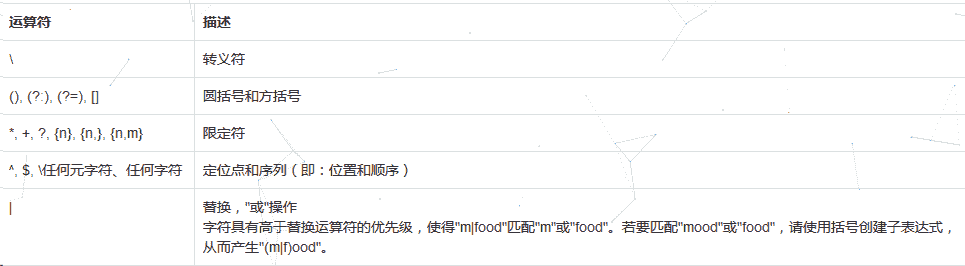

发表于 2019-03-07 13:36:53

* * *

[就叫我 offer 收割机‘吧](https://www.nowcoder.com/profile/112627473)

D 中他是想打÷的吧

发表于 2019-01-20 20:01:31

* * *

## 9

采用哪种遍历方法可唯一确定一棵二叉树？（  ）

正确答案: B D   你的答案: 空 (错误)

```cpp
给定一棵二叉树的先序和后序遍历序列
```

```cpp
给定一棵二叉树的后序和中序遍历序列
```

```cpp
给定先序、中序和后序遍历序列中的任意一个即可
```

```cpp
给定一棵二叉树的先序和中序遍历序列
```

本题知识点

算法工程师 京东 2019

讨论

[嘿哈嘿](https://www.nowcoder.com/profile/7650891)

给定一棵二叉树的后序和中序遍历序列或给定一棵二叉树的前序和中序遍历序列，均可唯一确定二叉树，而给定给定一棵二叉树的前序和后序遍历序列，确定出的二叉树可能不唯一

发表于 2019-02-09 18:20:35

* * *

## 10

已知小顶堆：{51,32,73,23,42,62,99,14,24,39,43,58,65,80,120}，请问 62 对应节点的左子节点是

正确答案: B   你的答案: 空 (错误)

```cpp
99
```

```cpp
73
```

```cpp
3943
```

```cpp
120
```

本题知识点

算法工程师 京东 算法工程师 京东 2019

讨论

[Nooni](https://www.nowcoder.com/profile/881583987)

*   小顶堆：每个非叶子结点的关键值都<其孩子节点的关键值

*   按照完全二叉树将数字填入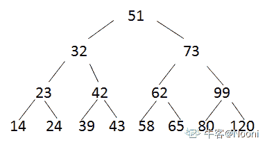
*   再从最后一个非叶子结点开始调整，选孩子结点中小的那个 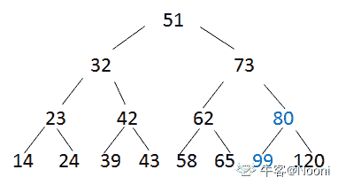
*   对第 3 层都做如上调整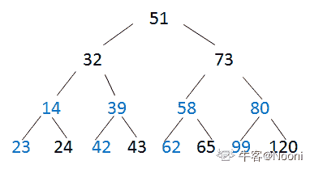
*   对第 3 个结点调整时，需要一直比较到叶子结点  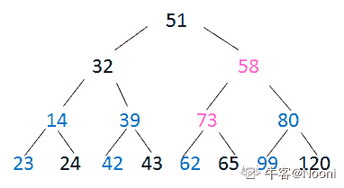---->  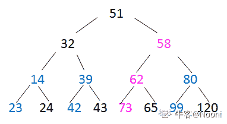

    此时，已经可以做该题，62 的左孩子就是 73。

*   调整第 2 个结点：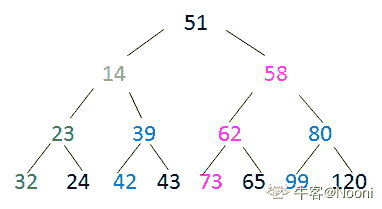

*   最后调整根结点，得到小顶堆为：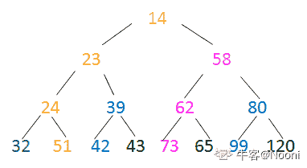

发表于 2020-04-19 17:56:09

* * *

[嘿哈嘿](https://www.nowcoder.com/profile/7650891)

存疑 不会

发表于 2019-02-09 18:43:32

* * *

[呆萌小土豆](https://www.nowcoder.com/profile/251513845)

按照完全二叉树，将数字依次填入。填入后，找到最后一个结点，从它的父节点开始调整。根据最小堆非叶子结点的值不大于左孩子和右孩子的值，小的数字往上移动依次调整得到小顶堆，即可找到 62 对应节点的左子节点。

发表于 2019-04-10 17:32:55

* * *

## 11

若串 S=”UP！UP！JD”，则其子串的数目

正确答案: B   你的答案: 空 (错误)

```cpp
33
```

```cpp
37
```

```cpp
39
```

```cpp
35
```

本题知识点

算法工程师 京东 算法工程师 京东 算法工程师 京东 2019

讨论

[北方有象](https://www.nowcoder.com/profile/143343545)

可以看成  | U | P | ! | U | P | ! | J | D |,总共有 9 个“|”，从中选择 2 个“|”，C9,2=36，加一个空串，总共 37 个。

发表于 2019-03-06 10:07:00

* * *

[火柴的初心](https://www.nowcoder.com/profile/293088671)

一共八个字符| U | P | ! | U | P | ! | J | D |，子串必须连续，不考虑重不重复，第一个 U 本身+第一个 U 和后面的字符结合（8 种）（U, UP, UP!, UP!U...），第一个 P 本身+第一个 P 和后面的字符结合（7 种），依次类推，一共为 8+7+6+5+4+3+2+1，（1+8）*8/2=36，然后再加上一个空串，所以一共 37

发表于 2020-08-05 14:06:14

* * *

[finally...](https://www.nowcoder.com/profile/409034120)

这个结果是不考虑去掉重复的子串。我认为应该去掉重复子串，因为单独来看，子串“U”（第一个位置的 U）跟子串“U”（第 5 个位置的 U）是一样的。

发表于 2019-02-24 00:32:56

* * *

## 12

一颗二叉树的叶子节点有 5 个，出度为 1 的结点有 3 个，该二叉树的结点总个数是？

正确答案: B   你的答案: 空 (错误)

```cpp
11
```

```cpp
12
```

```cpp
13
```

```cpp
14
```

本题知识点

算法工程师 京东 算法工程师 京东 算法工程师 京东 2019

讨论

[半城烟沙 9](https://www.nowcoder.com/profile/1712614)

n=n0+n1+n2;n=5+3+n2;n=1+n1+2*n2;n2=n0-1;n2=4;n=5+3+4=12;

发表于 2019-01-24 15:41:34

* * *

[finally...](https://www.nowcoder.com/profile/409034120)

设 n 为总节点个数，

n0 为度为 0（根节点）的节点个数（为 1），

n1 为度为 1 的节点个数，

n2 为度为 2 的节点个数。

则有：

式子 1:n=n0+n1+n2

式子 2:n=1+n1+2*n2

将题目中的条件带入即可得 n=12

发表于 2019-02-24 00:46:40

* * *

## 13

以下哪种排序算法一趟结束后能够确定一个元素的最终位置？

正确答案: C   你的答案: 空 (错误)

```cpp
简单选择排序
```

```cpp
基数排序
```

```cpp
堆排序
```

```cpp
二路归并排序
```

本题知识点

算法工程师 京东 算法工程师 京东 算法工程师 京东 2019

讨论

[苏浅语](https://www.nowcoder.com/profile/7418962)

简单选择排序一趟结束也能确定一个元素的最终位置，这个题出的不合理吧

发表于 2019-01-21 21:42:10

* * *

[牛客网弟中弟](https://www.nowcoder.com/profile/5002895)

简单选择排序一趟之后也能确定一个数的最终位置啊

发表于 2019-01-25 17:57:18

* * *

[kurumi123](https://www.nowcoder.com/profile/592283174)

AC 都可以把

发表于 2019-08-24 14:30:06

* * *

## 14

权值分别为 9、3、2、8 的结点，构造一棵哈夫曼树，该树的带权路径长度是？

正确答案: B   你的答案: 空 (错误)

```cpp
36
```

```cpp
40
```

```cpp
45
```

```cpp
46
```

本题知识点

算法工程师 京东 算法工程师 京东 算法工程师 京东 2019

讨论

[Nooni](https://www.nowcoder.com/profile/881583987)

*   树的路径长度：从树根结点到每一个结点的路径长度之和；
*   哈夫曼树构造：先选权值最小的两个结点，构成一棵二叉树，再剩下的最小的结点组合，以此下去；
*   哈夫曼编码应用：用二进制前缀编码使报文总长度最短。

 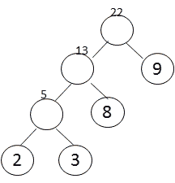

 相邻路径间为 1，所以树的路径长度为：2*3+3*3+8*2+9*1=40；或者直接 5+13+22=40。

发表于 2020-04-19 18:53:15

* * *

[C_AleXPump](https://www.nowcoder.com/profile/302181935)

第一轮构造 9 8 3 2, 选最小的 3 2 构造新节点 5 第二轮 9 8 5 (3 2) 最小的 5 8 构造新节点 13 第三轮就剩下 9 和 13 构造 22 带权路径长 22+13+5 = 4022->13->5->2 |      |       |9      8      3

发表于 2019-02-20 18:03:51

* * *

## 15

在（）中，只要指出表中任何一个结点的位置，就可以从它出发依次访问到表中其他所有结点。

正确答案: D   你的答案: 空 (错误)

```cpp
线性单链表
```

```cpp
双向链表
```

```cpp
线性链表
```

```cpp
循环链表
```

本题知识点

算法工程师 京东 算法工程师 京东 算法工程师 京东 2019

讨论

[嘿哈嘿](https://www.nowcoder.com/profile/7650891)

注意依次

发表于 2019-02-09 18:45:10

* * *

## 16

重复的数据，会增加磁盘空间的占有率，延长操作数据的时间。可以使用规范化处理数据冗余，以下对符合第一范式的表述正确的是：

正确答案: C   你的答案: 空 (错误)

```cpp
非键属性和键（主键）属性间没有传递依赖
```

```cpp
非键属性和键（主键）属性间没有部分依赖
```

```cpp
表中不应该有重复组。列重复拆成另外一张表；行重复拆成多行
```

```cpp
一个表中的列值与其他表中的主键匹配
```

本题知识点

算法工程师 京东 2019

讨论

[newcomer](https://www.nowcoder.com/profile/291053)

本题考查数据库设计所遵循的范式问题。我们常用的设计数据库须遵循三大范式，以避免数据存储的冗余。第一范式强调的是列的原子性，即列不能进一步划分，比如 User 表的设计有一个电话属性，但是有可能用户有固话和手机两个，这样的话就不符合第一范式的要求；第二范式要求实体的属性必须完全依赖主键，而不能部分依赖于主键，比如一个订单表，通常需要订单号和商品号二者共同作为主键，如果表的属性中有商品名称，就不符合二范式的要求，因为商品名称只是部分依赖于主键(商品号),此时应分拆成两个表；第三范式说的是非主键列必须直接依赖于主键列，而不能间接依赖于主键列，即消除了传递依赖性；

发表于 2019-05-17 22:24:27

* * *

## 17

以下哪条 SQL 语句可以返回 table1 中的全部的 key：

正确答案: D   你的答案: 空 (错误)

```cpp
select tabel1.key from table1 join tabel2 on table1.key=table2.key
```

```cpp
select tabel1.key from table1 right outer join tabel2 on table1.key=table2.key
```

```cpp
select tabel1.key from table1 left semi join tabel2 on table1.key=table2.key
```

```cpp
select tabel1.key from table1 left outer join tabel2 on table1.key=table2.key
```

本题知识点

算法工程师 京东 算法工程师 京东 算法工程师 京东 2019

讨论

[2019 眷顾我](https://www.nowcoder.com/profile/4954855)

left join 或 left outer join 都可以表示左链接，left semi join 只打印出左边的表中的列，规律是如果主键在右边表中存在，则打印，否则过滤掉了。

发表于 2019-03-11 16:36:21

* * *

## 18

以下关于 Mysql 数据库引擎ＭyISAM 的描述错误的是？

正确答案: A   你的答案: 空 (错误)

```cpp
支持行锁
```

```cpp
如果表主要是用于插入新记录和读出记录，那么选择 MyISAM 引擎能实现处理高效率
```

```cpp
在执行查询语句（SELECT）前，会自动给涉及的所有表加读锁，在执行更新操作（UPDATE、DELETE、INSERT 等）前，会自动给涉及的表加写锁
```

```cpp
不支持事务
```

本题知识点

算法工程师 京东 算法工程师 京东 算法工程师 京东 2019

讨论

[零葬](https://www.nowcoder.com/profile/75718849)

ＭyISAM 支持的是表级锁

发表于 2020-12-29 15:15:11

* * *

## 19

Mysql 中表 user 的建表语句如下，

```cpp
CREATE TABLE `user` (
  `id` bigint(20) NOT NULL AUTO_INCREMENT COMMENT '主键 Id',
  `name` varchar(255) DEFAULT NULL COMMENT '名称',
  `age` int(11) DEFAULT NULL COMMENT '年龄',
  `address` varchar(255) DEFAULT NULL COMMENT '地址',
  `created_time` datetime DEFAULT NULL COMMENT '创建时间',
  `updated_time` datetime DEFAULT NULL COMMENT '更新时间',
  PRIMARY KEY (`id`),
  KEY `idx_com1` (`name`,`age`,`address`)
) ENGINE=InnoDB DEFAULT CHARSET=utf8 COMMENT='用户表';
```

以下哪个查询语句没有使用到索引 idx_com1？

正确答案: C   你的答案: 空 (错误)

```cpp
select  *  from user where name='张三' and age = 25 and address='北京大兴区';
```

```cpp
select  *  from user where name='张三' and address='北京大兴区';
```

```cpp
select  *  from user where age = 25 and address='北京大兴区';
```

```cpp
select  *  from user where address='北京大兴区'  and age = 25 and name='张三'
```

本题知识点

算法工程师 京东 算法工程师 京东 算法工程师 京东 2019

讨论

[newcomer](https://www.nowcoder.com/profile/291053)

注意索引 idx_com1 的顺序 `name`,`age`,`address`B 选项 name 属性是有序的，在 name 有序的情况下，加上 address 属性是会用到索引的 C 选项 age，address 属性是无序的，所以只能是一行一行去查找，不会用到索引这就是 mysql 索引中所谓的最左匹配原则。

发表于 2019-05-29 17:09:05

* * *

[GoWalker](https://www.nowcoder.com/profile/908512638)

答案应该选 B、C 吧

```cpp
KEY(a,b,c) //创建索引
//生效
WHERE a=1 and b=2 and c=3
WHERE a=1 and b=2
WHERE a=1
WHERE c=3 and b=2 and a=1 //乱序也是可以生效的

//无效
WHERE b=2 and c=3 //跳过了 1 
WHERE a=1 and c=3 //跳过了 2
```

发表于 2019-04-11 14:30:21

* * *

[fangqi_ 方其](https://www.nowcoder.com/profile/660865)

最左前缀树匹配以及 where 语句的重排。比如 a = 1 and b = 2 and c = 3 建立（a,b,c）索引可以任意顺序，mysql 的查询优化器会帮你优化成索引可以识别的形式。

发表于 2019-02-16 14:52:15

* * *

## 20

DELETE 和 TRUNCATE TABLE 都是删除表中的数据的语句，它们的不同之处描述正确的是：

正确答案: A B C D   你的答案: 空 (错误)

```cpp
TRUNCATE TABLE 比 DELETE 的速度快
```

```cpp
在删除时如果遇到任何一行违反约束（主要是外键约束），TRUNCATE TABLE 仍然删除，只是表的结构及其列、约束、索引等保持不变，但 DELETE 是直接返回错误
```

```cpp
对于被外键约束的表，不能使用 TRUNCATE TABLE，而应该使用不带 WHERE 语句的 DELETE 语句。
```

```cpp
如果想保留标识计数值，要用 DELETE，因为 TRUNCATE TABLE 会对新行标志符列使用的计数值重置为该列的种子
```

本题知识点

算法工程师 京东 2019

讨论

[fangqi_ 方其](https://www.nowcoder.com/profile/660865)

区别：

*   如果 delete 不加 WHERE 子句，那么它和 truncate table 是一样的，但它们有一点不同，那就是 delete 可以返回被删除的记录数，而 truncate table 返回的是 0。

*   如果一个表中有自增字段，使用 truncate table 和没有 WHERE 子句的 delete 删除所有记录后，这个自增字段将起始值恢复成 1.如果你不想这样做的话，可以在 delete 语句中加上永真的 WHERE，如 WHERE 1 或 WHERE true。
    `delete FROM table1 WHERE 1`;

上面的语句在执行时将扫描每一条记录。但它并不比较，因为这个 WHERE 条件永远为 true。这样做虽然可以保持自增的最大值，但由于它是扫描了所有的记录，因此，它的执行成本要比没有 WHERE 子句的 delete 大得多。

*   还有一点就是,如果要删除表中的所有数据,建议使用 truncate table, 尤其是表中有大量的数据, 使用 truncate table 是将表结构重新建一次速度要比使用 delete from 快很多,而 delete from 是一行一行的删除,速度很慢.

总结：
`delete`和`truncate table`的最大区别是 delete 可以通过 WHERE 语句选择要删除的记录。但执行得速度不快。而且还可以返回被删除的记录数。而 truncate table 无法删除指定的记录，而且不能返回被删除的记录。但它执行得非常快。

发表于 2019-02-16 14:56:29

* * *

## 21

用户表中有两列 name/country。
现在要查询用户表中每个国家(country)的用户人数，应使用以下哪个语句

正确答案: A   你的答案: 空 (错误)

```cpp
select count(*) from users group by country
```

```cpp
select name from users where country = 'xx'
```

```cpp
select count(country) from users
```

```cpp
select country from users
```

本题知识点

算法工程师 京东 算法工程师 京东 算法工程师 京东 2019

## 22

X 定义如下，若存在 X a; a.x=0x11223344;则 a.y[1]的值可能为（      ）

```cpp
union X{
    int x;
    char y[4]; 
};
```

正确答案: B C   你的答案: 空 (错误)

```cpp
11
```

```cpp
22
```

```cpp
33
```

```cpp
44
```

本题知识点

算法工程师 京东 2019 C 语言

讨论

[烬天玉藻前](https://www.nowcoder.com/profile/195480900)

```cpp
union X{
    int x;
    char y[4]; 
};
```

联合体 X 中，int 型变量 x 和 char 数组 y 都共享一块内存空间，整个联合体的大小以其中最大成员类型来计算，这里 2 个成员刚好都是占 4 字节。当 X 赋值 0x11223344 后，y[1]的取值有 2 中可能：大端情况下：内存低地址-----------------内存高地址 0x11    0x22    0x33    0x44 对于 y[1]的数据读取，从内存低地址向内存高地址读，即 0X22；小端情况下：内存低地址-----------------内存高地址 0X44    0X33    0X22    0X11 对于 y[1]的数据读取，从内存低地址向内存高地址读，即 0X33；
大小端数据的排放怎么记呢？我是这样记的：大端---端指数据的尾端，即 0X11223344 中的 0X44，大指内存的高地址，大端就是数据尾端的部分放在内存的高地址处。小端相反。

发表于 2020-08-20 14:26:55

* * *

[Sirly。](https://www.nowcoder.com/profile/111070413)

小端存储为 33，大端存储为 22

发表于 2019-03-22 17:23:01

* * *

[牛客 127085317 号](https://www.nowcoder.com/profile/127085317)

C 太难了，我😭了

发表于 2021-07-11 19:47:26

* * *

## 23

在 C++中，引用和指针的区别是（      ）

正确答案: A C D   你的答案: 空 (错误)

```cpp
引用总是指向一个对象,指针可能不指向对象
```

```cpp
引用和指针都可以被重新赋值
```

```cpp
sizeof 引用得到的是所指向的变量（对象）的大小，而 sizeof 指针得到的是指针变量本身的大小
```

```cpp
引用创建时必须初始化，而指针则可以在任何时候被初始化
```

本题知识点

算法工程师 京东 2019 C++

讨论

[宸。201901092036253](https://www.nowcoder.com/profile/530766299)

注意区分 const int* p 和 int * const p 类似的引用因为在定义时必须初始化，自然没有 int &const p 就是题中所说的引用不能用 const 修饰。const int & p 中，const 修饰的是数据类型，该数据为常量，不能修改

发表于 2019-08-24 12:43:38

* * *

[破碎的大厂梦](https://www.nowcoder.com/profile/764338187)

C 是错的吧  引用能用 const

发表于 2021-02-20 16:03:40

* * *

[ZLMRX](https://www.nowcoder.com/profile/865499733)

 在 VS2019 int & const p 编译可以通过，并且可以正常显示，感觉答案应该不包括 C

发表于 2021-08-21 21:11:29

* * *

## 24

有以下程序

```cpp
#include <iostream>
using namespace std;
class D{
    int d;
public: 
    D(int x=1):d(x){}
    ~D(){cout<<"D";}}; 
int main(){ 
    D d[]={_____________};
    D* p=new D[2];
    delete[]p;
    return 0; 
}
```

程序运行的结果是 DDDDD，请为横线处选择合适的程序（      ）

正确答案: A B   你的答案: 空 (错误)

```cpp
3,3,3
```

```cpp
D(3), D(3), D(3)
```

```cpp
3,3,3,3
```

```cpp
D(3,3),D(3,3)
```

本题知识点

算法工程师 京东 2019 C++

讨论

[牛客 191029289 号](https://www.nowcoder.com/profile/191029289)

A 之所以也行的原因是发生了隐式类型转换，说明 c++不是类型安全的语言

发表于 2020-10-08 16:08:53

* * *

[2019 眷顾我](https://www.nowcoder.com/profile/4954855)

～表示析构函数(destructor)， 与[构造函数](https://www.baidu.com/s?wd=%E6%9E%84%E9%80%A0%E5%87%BD%E6%95%B0&tn=SE_PcZhidaonwhc_ngpagmjz&rsv_dl=gh_pc_zhidao)相反，当对象脱离其作用域时（例如对象所在的函数已调用完毕），系统自动执行析构函数。析构函数往往用来做“清理善后” 的工作（例如在建立对象时用 new 开辟了一片内存空间，应在退出前在析构函数中用 delete 释放）。在这里，delete 调用了两次析构，再调用三次。A 处发生了隐式类型转换，explicit 可以禁止这种转换

发表于 2019-03-12 09:11:09

* * *

[大神带我上分啊](https://www.nowcoder.com/profile/9625358)

转换构造函数可以将其它类型转换为当前类类型。转换构造函数也是一种构造函数，它遵循构造函数的一般规则。转换构造函数只有一个参数。

发表于 2022-03-08 20:12:35

* * *

## 25

有以下程序

```cpp
#include <iostream>
using namespace std;
_______________________
void One(float one)
{
    cout<<"1"<<endl;
}
void Two(float two)
{
    cout<<"2"<<endl;
}
void Three(float three)
{
    cout<<"3"<<endl;
}
int main()
{
    float i=1,j=2,k=3;
    function = One;
    function(i);
    function= Two;
    function(j);
    function = Three;
    function(k);
}
```

请为横线处选择合适的程序使得程序的运行结果是 123   （      ）

正确答案: D   你的答案: 空 (错误)

```cpp
void *function();
```

```cpp
void *function(float);
```

```cpp
void (*function)();
```

```cpp
void (*function)(float);
```

本题知识点

算法工程师 京东 2019 C++

讨论

[THE_LIN](https://www.nowcoder.com/profile/680957182)

横线处需要定义一个**函数指针**

发表于 2020-09-04 23:30:19

* * *

[牛客 653036689 号](https://www.nowcoder.com/profile/653036689)

function(i)不需要 (*function)(i)这样吗

发表于 2021-10-30 11:29:03

* * *

[牛客 175879381 号](https://www.nowcoder.com/profile/175879381)

函数指针吧

发表于 2020-08-09 19:46:18

* * *

## 26

有以下程序

```cpp
#include<iostream> 
using namespace std;
class complex 
{ public:
int real;
int imag;
complex(int r=0,int i=0) 
{ real=r;
imag=i;}
_________________________________
};
complex add(complex &a,complex & b) 
{int r=a.real+b.real;
int i=a.imag+b.imag;
return complex(r,i);}  
int  main( ) 
{complex x(1,2),y(3,4),z;
z=add(x,y);
cout<<z.real<<"+"<<z.imag<<"i"<<endl;}  
```

程序的输出结果为 4+6i，请为横线处选择合适的程序        （      ）

正确答案: A B   你的答案: 空 (错误)

```cpp
friend complex add(complex &a,complex & b) ;
```

```cpp
friend complex add(complex &,complex &) ;
```

```cpp
complex add(complex &a,complex & b) ;
```

```cpp
complex add(complex ,complex ) ;
```

本题知识点

算法工程师 京东 2019 C++

讨论

[云淡风轻 201904091347167](https://www.nowcoder.com/profile/508800765)

横线处什么都不需要添加， 因为所有成员都是公有的。

发表于 2020-08-17 16:03:24

* * *

[成风 201909050921504](https://www.nowcoder.com/profile/281403667)

下面的调用没有用成员函数的标志，所以是友元函数

发表于 2020-08-17 09:33:29

* * *

[牛客 842641340 号](https://www.nowcoder.com/profile/842641340)

C 答案也可以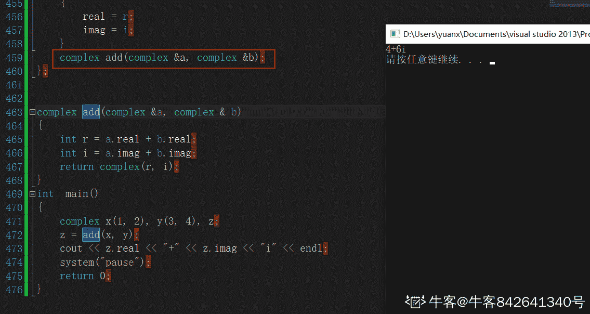

发表于 2021-09-26 20:46:11

* * *

## 27

有以下程序 ```cpp
#include<iostream> 
#include<fstream> 
#include<string> 
using namespace std;

int main() {

	ofstream File1("text.txt");
	string d("20160314");
	string y = d.substr(0, 4);

	int k = d.find("2");
	int i = d.find("3");

	string m = d.substr(k + 2, i - k);
	string dd = d.substr(i + 1, 2);
	string n = dd + m + y;

	File1 << n << endl;
	File1.close();
}
``` 文件 text.txt 中写入的结果是（      ）

正确答案: C   你的答案: 空 (错误)

```cpp
20160314
```

```cpp
14032016
```

```cpp
14160312016
```

```cpp
20031416
```

本题知识点

算法工程师 京东 2019 C++

讨论

[i201902221220722](https://www.nowcoder.com/profile/481549355)

string d("20160314"); string y=d.substr(0,4); ---》 y=2016intk=d.find("2");    ------> k = 0inti=d.find("3");     -------> i = 5string m=d.substr(k+2,i-k);    -------> m =  d.substr(2,5) == 16031string dd=d.substr(i+1,2);     -------> dd = d.substr(6, 2) == 14string n=dd+m+y;     --------> n = 14160312016

发表于 2019-04-25 19:40:58

* * *

## 28

有以下函数模版

```cpp
#include <iostream> 
using namespace std; 
template <class T>
void S(T &x, T &y)
{ T temp;
   temp = x;
   x = y;
   y = temp;}
template <class T>
void SS(T A[], int n)
{ int min;    
  int i, j;
  for (i=0; i<n-1; i++) 
  { min=i;    
    for (j=_____; j<n; j++) 
     if (A[j]<A[min]) min=j;
    S(A[i], A[min]);
  }   }
```

其功能是将 A 数组中的数按照由小到大的顺序排列，请为横线处选择合适的程序（      ）

正确答案: C   你的答案: 空 (错误)

```cpp
1
```

```cpp
0
```

```cpp
i+1
```

```cpp
i
```

本题知识点

算法工程师 京东 算法工程师 京东 算法工程师 京东 2019

## 29

有以下类定义

```cpp
#include <iostream>
using namespace std;

class shape {
public:
    virtual int area() = 0;
};

class rectangle :public shape {
public:
    int a, b;
    void setLength(int x, int y) { 
        a = x; b = y;
    }
    int area() { 
        return a * b; 
    }
};
```

若有语句定义 rectangle r; r.setLength(3,5); 则编译时无语法错误的语句是（      ）

正确答案: A B   你的答案: 空 (错误)

```cpp
shape *s1=&r;
```

```cpp
shape &s2=r;
```

```cpp
shape s3=r;
```

```cpp
shape s4[3];
```

本题知识点

算法工程师 京东 2019 C++

讨论

[精通各种语言的 helloworld](https://www.nowcoder.com/profile/815556752)

A：将 r 转换为基类 shape 型指针 s1；B：将 r 转换为基类 shape 型引用 s2；A、B 正确。子类可以转换为基类；但是，基类不能转换为子类；C：应用默认拷贝构造函数（浅拷贝）将 r（默认转换为基类）拷贝给 s3；D：创建 shape 型数组（默认构造函数初始化数组）；shape 中 area 函数是纯虚函数，含有纯虚函数的类是抽象类，不能实例化。C,D 都将 shape 实例化了所以  C、D 错误；如果 area 是普通虚函数则 C、D 正确。

编辑于 2020-10-04 09:58:06

* * *

[飞翔的企鹅 3550771168](https://www.nowcoder.com/profile/393747266)

带有=0 函数的类是抽象类，抽象类不能实例化

发表于 2020-08-14 12:03:06

* * *

[牛客 292464733 号](https://www.nowcoder.com/profile/292464733)

D 中将抽象类进行了实例化，所以不能选

发表于 2022-03-05 07:53:26

* * *

## 30

关于 C++中的友元函数说法正确的是（      ）

正确答案: B C   你的答案: 空 (错误)

```cpp
友元函数需要通过对象或指针调用
```

```cpp
友元函数是不能被继承的
```

```cpp
友元函数没有 this 指针
```

```cpp
友元函数破环了继承性机制
```

本题知识点

算法工程师 京东 2019 C++

讨论

[笨笨在奔奔](https://www.nowcoder.com/profile/473236214)

友元函数是一种在类外定义，在类内特殊声明(加关键字 friend)，并且可以在类外访问类的所有成员的非成员函数。友元函数相对于普通函数，增加了访问类成员的权利。A、友元函数可以像普通函数一样直接调用，不需要通过对象或指针；BC、友元函数不是成员函数，所以不能被继承，也同样没有 this 指针；D、由于友元函数和普通函数的区别仅仅是具有访问类成员的权利，和继承性机制没有关系

发表于 2020-08-13 10:48:29

* * *

[佚](https://www.nowcoder.com/profile/822631024)

友元破坏的是封装性,不是继承

发表于 2021-02-23 18:39:56

* * *

[牛客小丑 C](https://www.nowcoder.com/profile/410104169)

关于友元函数，bc 所说的，记住就行。然后友元函数没有 this 这些的，然后它破坏的是类封装属性~

发表于 2021-04-29 19:17:08

* * *

## 31

下列代码执行后的输出结果为（      ）

```cpp
int main()   
{
    char c, s[20];
    strcpy(s, "Hello,World");
    printf("s[]=%6.9s\n", s);
    return 0;
}
```

正确答案: D   你的答案: 空 (错误)

```cpp
s[]=Hello,
```

```cpp
s[]=Hello,World
```

```cpp
s[]=   Hello,
```

```cpp
s[]=Hello,Wor
```

本题知识点

算法工程师 京东 算法工程师 京东 算法工程师 京东 2019

讨论

[人才库一霸](https://www.nowcoder.com/profile/768646695)

6 个占位符，最多输出 9 个字符，左对齐

发表于 2019-02-26 16:16:18

* * *

## 32

```cpp
struct Student{
    int num;
    char name[7];   
    short age;
    char sex;
}student1;
int sz = sizeof(student1);
```

则执行上面语句后，变量 sz 的值为（      ）

正确答案: C   你的答案: 空 (错误)

```cpp
14
```

```cpp
15
```

```cpp
16
```

```cpp
20
```

本题知识点

算法工程师 京东 算法工程师 京东 算法工程师 京东 2019

讨论

[2019 眷顾我](https://www.nowcoder.com/profile/4954855)

4+7+2+1=14，然后根据内存对齐，必须是 4 的整数倍，得到 16

发表于 2019-03-12 09:32:23

* * *

## 33

对于如下 C++程序：

```cpp
int main() {
 vector<int> vInt(1);
 cout << vInt[1];
 cout << vInt.at(1);
 return 0;
}
```

请问两个 cout 语句分别会发生什么情况（）

正确答案: C   你的答案: 空 (错误)

```cpp
抛出异常 抛出异常
```

```cpp
未定义 未定义
```

```cpp
未定义 抛出异常
```

```cpp
抛出异常 未定义
```

本题知识点

算法工程师 京东 算法工程师 京东 算法工程师 京东 2019

讨论

[rpq](https://www.nowcoder.com/profile/5997530)

如果 v 非空，A 行和 B 行没有任何区别。如果 v 为空，B 行会抛出 std::out_of_range 异常，A 行的行为未定义。

c++标准不要求 vector<T>::operator[]进行下标越界检查，原因是为了效率，总是强制下标越界检查会增加程序的性能开销。设计 vector 是用来代替内置数组的，所以效率问题也应该考虑。不过使用 operator[]就要自己承担越界风险了。

如果需要下标越界检查，请使用 at。

发表于 2019-02-03 14:14:48

* * *

## 34

对于如下 C++程序：

```cpp
int main() {
 vector<int> vInt;
 for (int i=0; i<5; ++i)
 {
  vInt.push_back(i);
  cout << vInt.capacity() << " ";
 }
 vector<int> vTmp(vInt);
 cout << vTmp.capacity() << "\n";
 return 0;
}
```

请问程序输出的是（）

正确答案: C   你的答案: 空 (错误)

```cpp
1 2 3 4 5 5
```

```cpp
1 2 3 4 5 8
```

```cpp
1 2 4 4 8 5
```

```cpp
1 2 4 4 8 8
```

本题知识点

算法工程师 京东 算法工程师 京东 算法工程师 京东 2019

讨论

[黄涛 201803281501955](https://www.nowcoder.com/profile/3107306)

扩容机制

发表于 2019-03-07 11:48:37

* * *

## 35

对于如下 C++程序：

```cpp
int main() {
 int a(1), b(3), c(2);

 while (a < b < c)
 {
  ++a;
  --b;
  --c;
 }
 cout << a << " " << b << " " << c << "\n";
 return 0;
}
```

请问输出结果是（）

正确答案: C   你的答案: 空 (错误)

```cpp
1 3 2
```

```cpp
2 2 1
```

```cpp
3 1 0
```

```cpp
4 0 -1
```

本题知识点

算法工程师 京东 算法工程师 京东 算法工程师 京东 2019

讨论

[零葬](https://www.nowcoder.com/profile/75718849)

第一次：1<3<2 => 1<2 为 true 第二次：2<2<1 => 0<1 为 true 第三次：3<1<0 => 0<0 为 false，跳出循环 a=3，b=1，c=0

发表于 2021-01-07 10:17:44

* * *

## 36

```cpp
public class Main {
    public static void main(String[] args) {
        System.out.println("A");
        new Main();
        new Main();
    }
    public Main() {
        System.out.println("B");
    }
    {
        System.out.println("C");
    }
    static {
        System.out.println("D");
    }
}
```

以上程序输出的结果，正确的是？

正确答案: C   你的答案: 空 (错误)

```cpp
DCABB
```

```cpp
DABCBC
```

```cpp
DACBCB
```

```cpp
DACBB
```

本题知识点

算法工程师 京东 算法工程师 京东 算法工程师 京东 2019

讨论

[ovenlee](https://www.nowcoder.com/profile/225313)

因为有 new 关键字，所以触发类初始化，执行静态代码块，又因为同一个类加载器下，一个类型只会初始化一次。（《深入理解 Java 虚拟机》P226 页最下面备注）因此，静态代码块只执行一次，输出一个 D。接着输出 A，非静态代码块在构造函数之前执行，所以最后输出为 DACBCB

发表于 2019-08-16 14:46:10

* * *

## 37

```cpp
public class Main {
    private static int x = 10;
    private static Integer y = 10;
    public static void updateX(int value) {
        value = 3 * value;
    }
    public static void updateY(Integer value) {
        value = 3 * value;
    }
    public static void main(String[] args) {
        updateX(x);
        updateY(y);
    }
}
```

执行以上程序后，x 和 y 的值分别是多少？

正确答案: A   你的答案: 空 (错误)

```cpp
10,10
```

```cpp
10,30
```

```cpp
30,10
```

```cpp
30,30
```

本题知识点

算法工程师 京东 算法工程师 京东 算法工程师 京东 2019

## 38

```cpp
public class Main {
    public static void main(String[] args) {
        String s1 = "abc";
        String s2 = "abc";
        System.out.println(s1 == s2);
        String s3 = new String("abc");
        System.out.println(s1 == s3);
    }
}
```

执行以上程序后，输出结果正确的是？

正确答案: B   你的答案: 空 (错误)

```cpp
true true
```

```cpp
true false
```

```cpp
false fasle
```

```cpp
false true
```

本题知识点

算法工程师 京东 算法工程师 京东 算法工程师 京东 2019

## 39

JAVA 的类加载期负责整个生命周期内的 class 的初始化和加载工作，就虚拟机的规范来说，以下代码会输出什么结果？

```cpp
public class Test {
    public static void main(String[] args) {
        System.out.println(Test2.a);
    }
}
class Test2{
    public static final String a="JD";
    static {
        System.out.print("OK");
    }
}
```

正确答案: A   你的答案: 空 (错误)

```cpp
只有 JD
```

```cpp
只有 OK
```

```cpp
输出 JDOK
```

```cpp
输出 OKJD
```

本题知识点

算法工程师 京东 2019

讨论

[2019 眷顾我](https://www.nowcoder.com/profile/4954855)

搬运工：[`www.cnblogs.com/hglibin/p/10298650.html`](https://www.cnblogs.com/hglibin/p/10298650.html)

发表于 2019-03-12 09:54:20

* * *

[人才库一霸](https://www.nowcoder.com/profile/768646695)

1.  **调用一个类型或接口的静态字段，或者对这些静态字段执行赋值操作时（即在字节码中，执行 getstatic 或者 putstatic 指令），不过用 final 修饰的静态字段除外，它被初始化为一个编译时常量表达式**

发表于 2019-02-26 16:33:40

* * *

## 40

JAVA 的类加载期负责整个生命周期内的 class 的初始化和加载工作，就虚拟机的规范来说，以下代码会输出什么结果？

```cpp
public class Test {
    public static void main(String[] args) {
        System.out.println(Test2.a);
    }
}
class Test2{
    public static final String a=new String("JD");
    static {
        System.out.print("OK");
    }
}
```

正确答案: D   你的答案: 空 (错误)

```cpp
只有 JD
```

```cpp
只有 OK
```

```cpp
输出 JDOK
```

```cpp
输出 OKJD
```

本题知识点

算法工程师 京东 2019

## 41

JAVA 的类加载期负责整个生命周期内的 class 的初始化和加载工作，就虚拟机的规范来说，以下代码会输出什么结果？

```cpp
public class Test {
    public static void main(String[] args) {
        System.out.println(Test2.a);
    }
}
class Test2{
    static {
        System.out.print("OK");
    }
    public static final String a=new String("JD");
}
```

正确答案: D   你的答案: 空 (错误)

```cpp
只有 JD
```

```cpp
只有 OK
```

```cpp
输出 JDOK
```

```cpp
输出 OKJD
```

本题知识点

算法工程师 京东 2019

## 42

继承是 JAVA 语言的一个特性，针对类的继承，虚拟机会如何进行父类和子类的初始化加载呢？请阅读代码选择出该段代码的输入结果。

```cpp
public class Test {
    public static void main(String[] args) {
        System.out.print(B.c);
    }
}
class A {
    static {
        System.out.print("A");
    }
}
class B extends A{
    static {
        System.out.print("B");
    }
    public final static String c = "C";
}
```

正确答案: C   你的答案: 空 (错误)

```cpp
AB
```

```cpp
ABC
```

```cpp
C
```

```cpp
BC
```

本题知识点

算法工程师 京东 2019

讨论

[NARUTO201807131727371](https://www.nowcoder.com/profile/624236879)

如果变量是 static final，那么使用这个变量的时候可以不用初始化这个类。所以就不会调用这个类的 static 块和构造函数。如果变量是 static,那么使用这个变量的时候就要生成这个类，所以就会先执行这个类的 static 块，然后执行这个类的构造函数。如果变量是 new 产生的，那么无论是 static final 还是 static 修饰的变量都会因为 new 而强制生成这个对象，所以会先执行这个类的 static 块然后执行这个类的构造函数。

发表于 2019-04-12 13:32:49

* * *

## 43

继承是 JAVA 语言的一个特性，针对类的继承，虚拟机会如何进行父类和子类的初始化加载呢？请阅读代码选择出该段代码的输入结果。

```cpp
public class Test {
    public static void main(String[] args) {
        System.out.print(B.c);
    }
}
class A {
    public static String c = "C";
    static {
        System.out.print("A");
    }
}
class B extends A{
    static {
        System.out.print("B");
    }
}
```

正确答案: A   你的答案: 空 (错误)

```cpp
AC
```

```cpp
ABC
```

```cpp
C
```

```cpp
BC
```

本题知识点

算法工程师 京东 2019

## 44

根据类加载器加载类的初始化原理，推断以下代码的输入结果为？

```cpp
public class Test {
    public static void main(String[] args) throws Exception{
      ClassLoader classLoader=ClassLoader.getSystemClassLoader();
      Class clazz=classLoader.loadClass("A");
      System.out.print("Test");
      clazz.forName("A");
    }
}
class A{
    static {
        System.out.print("A");
    }
}
```

正确答案: A   你的答案: 空 (错误)

```cpp
TestA
```

```cpp
ATestA
```

```cpp
ATest
```

```cpp
Test
```

本题知识点

算法工程师 京东 2019

讨论

[2019 眷顾我](https://www.nowcoder.com/profile/4954855)

用 ClassLoader 加载类，是不会导致类的初始化（也就是说不会执行<clinit>方法）.Class.forName(...)加载类，不但会将类加载，还会执行会执行类的初始化方法.

发表于 2019-03-12 09:59:38

* * *

## 45

```cpp
public class Main {
    public static void main(String[] args) {
        System.out.print(fun1());
    }
    public static String fun1() {
        try {
            System.out.print("A");
            return fun2();
        } finally {
            System.out.print("B");
        }
    }
    public static String fun2() {
        System.out.print("C");
        return "D";
    }
}
```

执行以上程序后，输出结果正确的是？

正确答案: C   你的答案: 空 (错误)

```cpp
ABCD
```

```cpp
ACDB
```

```cpp
ACBD
```

```cpp
不确定
```

本题知识点

算法工程师 京东 2019

讨论

[零葬](https://www.nowcoder.com/profile/75718849)

当程序执行 try{}遇到 return 时，程序会先执行 return 语句，但并不会立即返回——也就是把 return 语句要做的一切事情都准备好，也就是在将要返回、但并未返回的时候，程序把执行流程转去执行 finally 块，当 finally 块执行完成后就直接返回刚才 return 语句已经准备好的结果。

发表于 2020-10-14 21:58:17

* * *

## 46

```cpp
import java.util.ArrayList;
import java.util.List;
public class Main {
    public static void main(String[] args) {
        List<String> list = new ArrayList<>();
        for(int i=0;i<100;i++){
            list.add("a");
        }
    }
}
```

JDK1.8 中，执行以上程序后，该 list 进行了几次扩容？

正确答案: C   你的答案: 空 (错误)

```cpp
4
```

```cpp
5
```

```cpp
6
```

```cpp
7
```

本题知识点

算法工程师 京东 算法工程师 京东 算法工程师 京东 2019

讨论

[fangqi_ 方其](https://www.nowcoder.com/profile/660865)

```cpp
 private void grow(int minCapacity) {
        // overflow-conscious code
        int oldCapacity = elementData.length;
        int newCapacity = oldCapacity + (oldCapacity >> 1);
        if (newCapacity - minCapacity < 0)
            newCapacity = minCapacity;
        if (newCapacity - MAX_ARRAY_SIZE > 0)
            newCapacity = hugeCapacity(minCapacity);
        // minCapacity is usually close to size, so this is a win:
        elementData = Arrays.copyOf(elementData, newCapacity);
    }
```

初始容量为 10，1.5 倍扩容。

发表于 2019-02-16 15:03:31

* * *

## 47

Object 类不含有以下哪种方法？

正确答案: A   你的答案: 空 (错误)

```cpp
equal
```

```cpp
wait
```

```cpp
notify
```

```cpp
clone
```

本题知识点

算法工程师 京东 算法工程师 京东 算法工程师 京东 2019

讨论

[虚煌](https://www.nowcoder.com/profile/355450679)

我还寻思咋四个都有呢。。。合着这是语文题，equal，equals

发表于 2019-02-19 19:55:20

* * *

[fangqi_ 方其](https://www.nowcoder.com/profile/660865)

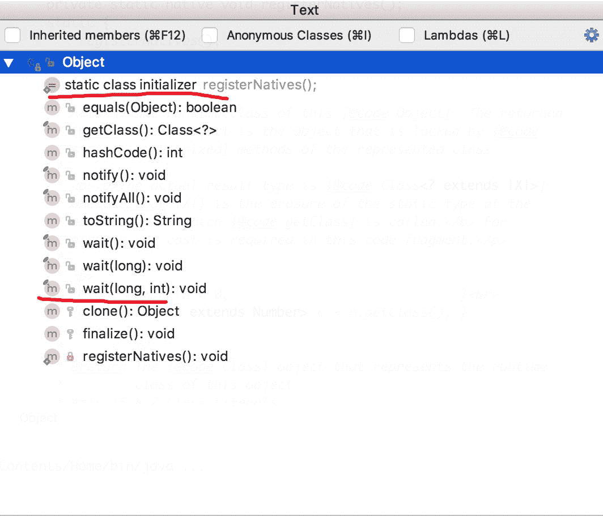

发表于 2019-02-16 15:12:11

* * *

## 48

```cpp
import java.util.concurrent.ArrayBlockingQueue;
import java.util.concurrent.ThreadPoolExecutor;
import java.util.concurrent.TimeUnit;
public class Main {
    public static void main(String[] args) {
        ThreadPoolExecutor executor = new ThreadPoolExecutor(5, 10, 15, TimeUnit.SECONDS,
                new ArrayBlockingQueue<Runnable>(5), new ThreadPoolExecutor.CallerRunsPolicy());
    }
}
```

线程池 executor 在空闲状态下的线程个数是？

正确答案: B   你的答案: 空 (错误)

```cpp
0
```

```cpp
5
```

```cpp
10
```

```cpp
不确定
```

本题知识点

算法工程师 京东 算法工程师 京东 算法工程师 京东 2019

讨论

[fangqi_ 方其](https://www.nowcoder.com/profile/660865)

总结：

1 如果手动 shutdown，则空闲线程数为 0
2 如果 allowCoreThreadTimeOut 默认为 false，不手动 shutdown，则空闲线程数为是核心线程数

3 如果 allowCoreThreadTimeOut 设置为 true，不手动 shutdown，则空闲线程数为 0

发表于 2019-02-16 15:18:16

* * *

## 49

```cpp
public class Main{
    public static ArrayList<String> list = new ArrayList<>();
    public static void main(String[] args) throws Exception{
        Thread t1 = new Main().new MyThread();
        Thread E10:E64t2 = new Thread(new Main().new MyRunnable());
        t1.setPriority(3);
        t2.setPriority(8);
        t1.start();
        t2.start();
        t2.join();
        for (int i = 0; i < 100000; i++) {
            i++;
        }
        list.add("main");

        t1.join();
        for (String s : list) {
            System.out.println(s);
        }
    }
    class MyThread extends Thread{
        @Override
        public void run(){
            for (int i = 0; i < 100000; i++) {
                i++;
            }
            list.add("Thread 1");
        }
    }
    class MyRunnable implements Runnable{
        @Override
        public void run(){
            for (int i = 0; i < 100000; i++) {
                Thread.yield();
                i++;
            }
            list.add("Thread 2");
        }
    }
}
```

正确答案: A   你的答案: 空 (错误)

```cpp
Thread 1 Thread 2 main
```

```cpp
Thread 2 Thread 1 main
```

```cpp
Thread 2 main Thread 1
```

```cpp
无法判断
```

本题知识点

算法工程师 京东 算法工程师 京东 算法工程师 京东 2019

讨论

[fangqi_ 方其](https://www.nowcoder.com/profile/660865)

t2.join()

发表于 2019-02-16 15:21:20

* * *

## 50

下列程序打印结果为（      ）

```cpp
import re
m = re.search('[0-9]','a1b2c3d4')
print(m.group(0))
```

正确答案: A   你的答案: 空 (错误)

```cpp
1
```

```cpp
1234
```

```cpp
None
```

```cpp
其他几项都不对
```

本题知识点

算法工程师 京东 2019

讨论

[嘿哈嘿](https://www.nowcoder.com/profile/7650891)

python 题

发表于 2019-02-09 18:46:53

* * *

## 51

下列程序打印结果为（      ）

```cpp
import datetime
t1 = datetime.datetime(2017,10,10,21,40)
t2 = datetime.datetime(2017,10,8,23,40)
tt1 = datetime.timedelta(seconds = 1200)
tt2 = datetime.timedelta(weeks = 3)
print(t1 - t2)
```

正确答案: D   你的答案: 空 (错误)

```cpp
600
```

```cpp
3600
```

```cpp
1 day, 02:00:00
```

```cpp
1 day, 22:00:00
```

本题知识点

算法工程师 京东 算法工程师 京东 算法工程师 京东 2019

讨论

[Brickea](https://www.nowcoder.com/profile/339744018)

这 weeks 写错了，应该是 days 吧？

发表于 2020-04-18 09:25:12

* * *

## 52

将 Person 表中 Name 字段为"Lilei"的 AGE 字段递增 1，可以使用哪个 SQL 语句（      ）

正确答案: A   你的答案: 空 (错误)

```cpp
UPDATE Person SET AGE = AGE + 1 WHERE Name = 'Lilei'
```

```cpp
Alter Person SET AGE = AGE + 1 WHERE Name = 'Lilei'
```

```cpp
UPDATE Person SET AGE = AGE + 1 WHERE Name = Lilei
```

```cpp
SET AGE = AGE + 1 FROM Person WHERE Name = 'Lilei'
```

本题知识点

算法工程师 京东 算法工程师 京东 算法工程师 京东 2019

## 53

将编码为 gbk 的字符串 s 转码为 utf-8 编码，以下操作正确的是

正确答案: D   你的答案: 空 (错误)

```cpp
s.encode('utf-8')
```

```cpp
s.decode('gbk')
```

```cpp
s.encode('gbk').decode('utf-8')
```

```cpp
s.decode('gbk').encode('utf-8')
```

本题知识点

算法工程师 京东 2019

讨论

[嘿哈嘿](https://www.nowcoder.com/profile/7650891)

python 题

发表于 2019-02-09 18:47:37

* * *

## 54

以下关于 range/xrange 说法错误的是：

正确答案: B C   你的答案: 空 (错误)

```cpp
range 返回的是 list
```

```cpp
xrange 返回的是 list
```

```cpp
生成大的数字序列时，适宜用 range
```

```cpp
生成大的数字序列时，适宜用 xrange
```

本题知识点

算法工程师 京东 2019

讨论

[C_AleXPump](https://www.nowcoder.com/profile/302181935)

这题都多老了，python2 里面才有 xrange. 在 python2 里 range 产生一个列表，xrange 返回一个可迭代的类，每次需要求值的时候 yield 出来，所以空间效率比 range 高 Python3 里的 range 直接返回一个可迭代的 range 类型，如果想返回列表的话需要 list(range(n))我求求你更新一下题库吧 9012 年了都

发表于 2019-02-20 18:10:52

* * *

[fangqi_ 方其](https://www.nowcoder.com/profile/660865)

python2

发表于 2019-02-16 15:24:19

* * *

## 55

python 函数中支持*args 和**kwargs。
关于二者的区别以下说法错误的是：

正确答案: C   你的答案: 空 (错误)

```cpp
args 要位于 kwargs 之前
```

```cpp
kwargs 是将相应的传值以字典形式呈现
```

```cpp
args 是将相应的传值以 list 的形式呈现
```

```cpp
kwargs 表示关键字参数
```

本题知识点

算法工程师 京东 2019

讨论

[Cris_Lee](https://www.nowcoder.com/profile/1874481)

args 是将相应的传值以 tuple 的形式呈现。

发表于 2019-02-25 21:27:17

* * *

## 56

在考虑到并行计算的前提下，对于如下代码段:

```cpp
x = 5
x = square(x)
x = x + 1
```

说法错误的是：

正确答案: A   你的答案: 空 (错误)

```cpp
X 的值总会是 26
```

```cpp
X 的值可能是 26
```

```cpp
X 的值可能是 5
```

```cpp
X 的值可能是 25
```

本题知识点

算法工程师 京东 2019

讨论

[嘿哈嘿](https://www.nowcoder.com/profile/7650891)

并行计算意思是这三个语句可能有任意的执行次序

发表于 2019-02-09 18:49:17

* * *

[牛客 813796671 号](https://www.nowcoder.com/profile/813796671)

考虑到指令乱序发射和多发射的特性，存在反依赖，这三个语录的指令不是顺序执行的，可能后面的语句指令先运行

发表于 2021-10-25 06:34:08

* * *

## 57

在考虑到并行计算的前提下，假设初始账户为 10 美元，阅读如下 python 代码片段：

```cpp
def make_withdraw(balance):
        def withdraw(amount):
            nonlocal balance
            if amount > balance:
                print('Insufficient funds')
            else:
                balance = balance - amount
                print(balance)
        return withdraw
```

则说法错误的是:

正确答案: D   你的答案: 空 (错误)

```cpp
结果可能为 3
```

```cpp
结果可能为 2
```

```cpp
结果可能为 Insufficient funds
```

```cpp
并行化代码会将代码行分配给多个处理器计算，与变量读写顺序无关。
```

本题知识点

算法工程师 京东 算法工程师 京东 算法工程师 京东 2019

讨论

[201906201759268](https://www.nowcoder.com/profile/141506099)

考点: Python 的闭包函数

发表于 2019-08-24 16:22:36

* * *

[虚煌](https://www.nowcoder.com/profile/355450679)

这个题没读懂，求教。。

发表于 2019-02-19 20:02:22

* * *

## 58

下列关于人脸识别技术说法不正确的是（      ）

正确答案: B   你的答案: 空 (错误)

```cpp
Adaboost 算法可用于人脸检测
```

```cpp
基于代数特征的表征方法主要是根据人脸器官的形状描述以及他们之间的距离特性来获得有助于人脸分类的特征数据
```

```cpp
人脸识别技术中基于统计形变的校正理论可以优化人脸姿态
```

```cpp
人脸图像预处理包括光线补偿、灰度变换、直方图均衡化、归一化、几何校正、滤波以及锐化等
```

本题知识点

算法工程师 京东 2019

讨论

[zhongyong](https://www.nowcoder.com/profile/7834144)

三短一长选最长

发表于 2019-02-22 16:29:35

* * *

[SillyCoderrrr](https://www.nowcoder.com/profile/82899155)

基于知识的表征方法主要是根据人脸器官的形状描述以及他们之间的距离特性来获得有助于人脸分类的特征数据，其特征分量通常包括特征点间的欧氏距离、曲率和角度等。人脸由眼睛、鼻子、嘴、下巴等局部构成，对这些局部和它们之间结构关系的几何描述，可作为识别人脸的重要特征，这些特征被称为几何特征。基于知识的人脸表征主要包括基于几何特征的方法和模板匹配法。

基于代数特征的方法的基本思想是将人脸在空域内的高维描述转化为频域或者其他空间内的低维描述。基于代数特征的表征方法分为线性投影表征方法和非线性投影表征方法。基于线性投影的方法主要有主成分分析法或称 K-L 变换，独立成分分析法和 Fisher 线性判别分析法。非线性特征提取方法有两个重要的分支：基于核的特征提取技术和以流形学习为主导的特征提取技术。

发表于 2019-04-13 17:35:56

* * *

[NARUTO201807131727371](https://www.nowcoder.com/profile/624236879)

基于知识

```cpp
基于  知识特征   的表征方法主要是根据人脸器官的形状描述以及他们之间的距离特性来获得有助于人脸分类的特征数据
```

发表于 2019-04-12 15:54:04

* * *

## 59

下列关于图像分析说法不正确的是（      ）

正确答案: A B   你的答案: 空 (错误)

```cpp
图像分析主要研究图像传输、存储、增强和复原
```

```cpp
图像分析主要研究点、线、面和体的表示方法以及视觉信息的显示方法
```

```cpp
图像分析研究构造图像的描述方法，更多地用符号表示各种图像
```

```cpp
图像分析主要研究对图像内容的分析、解释和识别
```

本题知识点

算法工程师 京东 2019

讨论

[SillyCoderrrr](https://www.nowcoder.com/profile/82899155)

图像处理主要研究图像传输、存储、增强和复原；计算机图形学主要研究点、线、面和体的表示方法以及视觉信息的显示方法

发表于 2019-04-13 17:38:08

* * *

## 60

假设一种基因同时导致两件事情，一是使人喜欢抽烟，二是使这个人和肺癌就是（）关系，而吸烟和肺癌则是（）关系。

正确答案: A   你的答案: 空 (错误)

```cpp
因果；相关
```

```cpp
相关；因果
```

```cpp
并列；相关
```

```cpp
因果；并列
```

本题知识点

算法工程师 京东 2019

讨论

[虚煌](https://www.nowcoder.com/profile/355450679)

语文题。。。 起因 A 导致 1 如何如何 2 如何如何就是什么关系。 这个根本没说清楚啊，既可以理解为 A 和 1,2 之间的关系，又可以理解为 1 和 2 之间的关系。 然后还有错别字“和”->“得”

发表于 2019-02-19 20:05:28

* * *

## 61

若一个学习器的 ROC 曲线被另外一个学习器低的曲线完全“包住”，则断言后者的性能优于前者；若两个学习器的曲线出现交叉，该如何处理最为合适？

正确答案: B   你的答案: 空 (错误)

```cpp
比较 ROC 曲线线上的面积
```

```cpp
使用 AUC 进行比较
```

```cpp
目测进行判断
```

```cpp
通过其他方法判断两个学习器的优劣
```

本题知识点

算法工程师 京东 2019

讨论

[LIUKAI915](https://www.nowcoder.com/profile/661521241)

AUC 是 ROC 曲线下方的面积。AUC 值是一个概率值，当你随机挑选一个正样本以及负样本，当前的分类算法根据计算得到的 Score 值将这个正样本排在负样本前面的概率就是 AUC 值，AUC 值越大，当前分类算法越有可能将正样本排在负样本前面，从而能够更好地分类。

发表于 2019-03-12 13:45:53

* * *

## 62

关于随机森林的训练过程下列描述正确的是：

正确答案: C   你的答案: 空 (错误)

```cpp
样本扰动
```

```cpp
属性扰动
```

```cpp
样本扰动并且属性扰动
```

```cpp
不存在扰动现象
```

本题知识点

算法工程师 京东 算法工程师 京东 算法工程师 京东 2019

讨论

[cy 助我](https://www.nowcoder.com/profile/139305150)

两个随机：数据采样随机、特征选择随机

发表于 2019-04-07 22:26:55

* * *

## 63

当在文本数据上训练一个机器学习模型，构建了一个输入数据的文档-单词矩阵。下面哪些方法可以用于降低数据维度？
1.潜在狄利克雷分布（LDA)
2.潜在语义索引
3.关键词规范化

正确答案: D   你的答案: 空 (错误)

```cpp
只有 1
```

```cpp
2，3
```

```cpp
1,3
```

```cpp
1,2,3
```

本题知识点

算法工程师 京东 2019

讨论

[活到老学到老-yc](https://www.nowcoder.com/profile/958029866)

潜在语义狄利克雷分布 LDA --特征抽取 可以将原始数据集变换到一个维度更低的子空间潜在语义分析 LSA 主要依靠 SVD，SVD 操作过程是将词项-文本矩阵 C 进行分解，具有降维的作用关键词规范化也具有降维作用所以答案选 D

编辑于 2019-03-12 20:48:15

* * *

## 64

社交媒体平台是文本数据最直观的表现形式。当给你一批社交媒体数据语料，如何创建一个模型显示标签？

正确答案: D   你的答案: 空 (错误)

```cpp
利用主题模型来获取语料库中最重要的单词
```

```cpp
训练一个 N-gram 词袋模型来获取 top n-gram—单词和它们的组合
```

```cpp
训练一个词向量模型来学习文本表示
```

```cpp
其他几项都行
```

本题知识点

算法工程师 京东 2019</clinit>