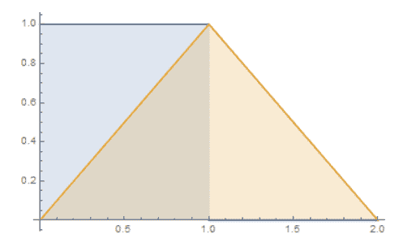

# 京东 2019 校招数据开发工程师笔试题

## 1

在软件开发过程中，我们可以采用不同的过程模型，下列有关 增量模型描述正确的是（）

正确答案: B   你的答案: 空 (错误)

```cpp
是一种线性开发模型，具有不可回溯性
```

```cpp
把待开发的软件系统模块化，将每个模块作为一个增量组件，从而分批次地分析、设计、编码和测试这些增量组件
```

```cpp
适用于已有产品或产品原型（样品），只需客户化的工程项目
```

```cpp
软件开发过程每迭代一次，软件开发又前进一个层次
```

本题知识点

算法工程师 京东 数据挖掘工程师 大数据开发工程师 2019

讨论

[落俗 zp](https://www.nowcoder.com/profile/481024190)

[`www.cnblogs.com/java-zzu/p/10211791.html`](https://www.cnblogs.com/java-zzu/p/10211791.html)

发表于 2019-08-22 09:31:33

* * *

## 2

下面有关值类型和引用类型描述正确的是（）？

正确答案: A B C   你的答案: 空 (错误)

```cpp
值类型的变量赋值只是进行数据复制，创建一个同值的新对象，而引用类型变量赋值，仅仅是把对象的引用的指针赋值给变量，使它们共用一个内存地址。
```

```cpp
值类型数据是在栈上分配内存空间，它的变量直接包含变量的实例，使用效率相对较高。而引用类型数据是分配在堆上，引用类型的变量通常包含一个指向实例的指针，变量通过指针来引用实例。
```

```cpp
引用类型一般都具有继承性，但是值类型一般都是封装的，因此值类型不能作为其他任何类型的基类。
```

```cpp
值类型变量的作用域主要是在栈上分配内存空间内，而引用类型变量作用域主要在分配的堆上。
```

本题知识点

算法工程师 京东 数据挖掘工程师 大数据开发工程师 2019

讨论

[Bram_Moolenaar](https://www.nowcoder.com/profile/5779482)

引用类型内部的变量，即使是值类型，也会随同引用类型的实例一起被分配在堆上

发表于 2019-01-14 16:57:46

* * *

## 3

如何在多线程中避免发生死锁？

正确答案: A B C D   你的答案: 空 (错误)

```cpp
允许进程同时访问某些资源。
```

```cpp
允许进程强行从占有者那里夺取某些资源。
```

```cpp
进程在运行前一次性地向系统申请它所需要的全部资源。
```

```cpp
把资源事先分类编号，按号分配，使进程在申请，占用资源时不会形成环路。
```

本题知识点

算法工程师 京东 数据挖掘工程师 大数据开发工程师 2019

讨论

[无问 201903272208403](https://www.nowcoder.com/profile/92235178)

多线程以及多进程改善了系统资源的利用率并提高了系统 的处理能力。然而，并发执行也带来了新的问题——死锁。所谓死锁是指多个线程因竞争资源而造成的一种僵局（互相等待），若无外力作用，这些进程都将无法向前推进。

下面我们通过一些实例来说明死锁现象。

先看生活中的一个实例，2 个人一起吃饭但是只有一双筷子，2 人轮流吃（同时拥有 2 只筷子才能吃）。某一个时候，一个拿了左筷子，一人拿了右筷子，2 个人都同时占用一个资源，等待另一个资源，这个时候甲在等待乙吃完并释放它占有的筷子，同理，乙也在等待甲吃完并释放它占有的筷子，这样就陷入了一个死循环，谁也无法继续吃饭。。。
在计算机系统中也存在类似的情况。例如，某计算机系统中只有一台打印机和一台输入 设备，进程 P1 正占用输入设备，同时又提出使用打印机的请求，但此时打印机正被进程 P2 所占用，而 P2 在未释放打印机之前，又提出请求使用正被 P1 占用着的输入设备。这样两个进程相互无休止地等待下去，均无法继续执行，此时两个进程陷入死锁状态。
作者：慕森王
链接：[`www.imooc.com/article/26867?block_id=tuijian_wz`](https://www.imooc.com/article/26867?block_id=tuijian_wz)
来源：慕课网

发表于 2019-08-23 15:31:07

* * *

## 4

以下为求 0 到 1000 以内所有奇数和的算法，从中选出描述正确的算法（ ）

正确答案: A   你的答案: 空 (错误)

```cpp
①s=0；②i=1；③s=s+i；④i=i+2；⑤如果 i≤1000，则返回③；⑥结束
```

```cpp
①s=0；②i=1；③i=i+2；④s=s+i；⑤如果 i≤1000，则返回③；⑥结束
```

```cpp
①s=1；②i=1；③s=s+i；④i=i+2；⑤如果 i≤1000，则返回③；⑥结束
```

```cpp
①s=1；②i=1；③i=i+2；④s=s+i；⑤如果 i≤1000，则返回③；⑥结束
```

本题知识点

算法工程师 京东 算法工程师 京东 数据挖掘工程师 大数据开发工程师 京东 2019

## 5

关于递归法的说法不正确的是（ ）

正确答案: D   你的答案: 空 (错误)

```cpp
程序结构更简洁
```

```cpp
占用 CPU 的处理时间更多
```

```cpp
要消耗大量的内存空间，程序执行慢，甚至无法执行
```

```cpp
递归法比递推法的执行效率更高
```

本题知识点

算法工程师 京东 算法工程师 京东 数据挖掘工程师 大数据开发工程师 京东 2019

## 6

字符串”ABCD”和字符串”DCBA”进行比较，如果让比较的结果为真，应选用关系运算符（）

正确答案: B   你的答案: 空 (错误)

```cpp
>
```

```cpp
<
```

```cpp
=
```

```cpp
>=
```

本题知识点

算法工程师 京东 算法工程师 京东 数据挖掘工程师 大数据开发工程师 京东 2019

讨论

[Bram_Moolenaar](https://www.nowcoder.com/profile/5779482)

```cpp
public class Main { 
    public static void main(String[] args) {
        String s1 = "ABCD";  
        String s2 = "DCBA";  
        System.out.println(s1.compareTo(s2)); 
//        output:-3  
    }
}
```

编辑于 2019-01-14 17:05:03

* * *

[SnowYY](https://www.nowcoder.com/profile/415317420)

compareTo 就是比较两个值，如果前者大于后者，返回 1，等于返回 0，小于返回-1，我下面给出了例子，由于比较的变量我用的是 int，int 型可以直接比较，所有没有用到 compareTo 比较，如果声明的是 Date、String、Integer 或者其他的，可以直接使用 compareTo 比较，比如以下函数代码用法：

public int compareTo(TestModel1 o) {

return this.str1.compareTo(o.str1);

}

1.当两个比较的字符串是英文且长度不等时，

1）长度短的与长度长的字符一样，则返回的结果是两个长度相减的值
a="hello";
b="hell";

num=1;

或者

a="h";

b="hello";

num=4;

2)长度不一样且前几个字符也不一样,从第一位开始找，当找到不一样的字符时，则返回的值是这两个字符比较的值
a="assdf";
b="bdd";

num=-1;
2.当两个比较的字符串是英文且长度相等时，
1)一个字符
a="a";   //97
b="b";   //98

num=-1;

2）多个字符,第一个字符不同则直接比较第一个字符
a="ah";    //a=97

b="eg";    //e=101

num=-4

3）多个字符,第一个字符相同则直接比较第二个字符,以此类推
a="ae";   //e=101
b="aa";   //a=97

num=4;

参考资料：百度百科-compareTo

发表于 2020-07-19 15:52:33

* * *

[皆临](https://www.nowcoder.com/profile/584753572)

```cpp
print("ABCD" < "DCBA")
# True
```

????发生了什么，比较的又是什么大小

发表于 2019-02-14 14:38:20

* * *

## 7

下面是一段关于计算变量 s 的算法： ①变量 s 的初值是 0 ②变量 i 从 1 起循环到 n，此时变量 s 的值由下面的式子表达式计算 ③s=s+(-1)*i ④输出变量 s 的值 这个计算 s 值的算法中，s 的代数式表示是(    )。

正确答案: D   你的答案: 空 (错误)

```cpp
1-2+3-4+„+(-1)n*(n-1)
```

```cpp
1-2+3-4+„+(-1)n-1*n
```

```cpp
1+2+3+4+...+(n-1)+n
```

```cpp
-1-2-3-4-...-n
```

本题知识点

算法工程师 京东 算法工程师 京东 数据挖掘工程师 大数据开发工程师 京东 2019

## 8

以下运算符中运算优先级最高的是（ ）

正确答案: D   你的答案: 空 (错误)

```cpp
+
```

```cpp
OR
```

```cpp
>
```

```cpp
\
```

本题知识点

算法工程师 京东 算法工程师 京东 数据挖掘工程师 大数据开发工程师 京东 2019

## 9

采用哪种遍历方法可唯一确定一棵二叉树？（  ）

正确答案: B D   你的答案: 空 (错误)

```cpp
给定一棵二叉树的先序和后序遍历序列
```

```cpp
给定一棵二叉树的后序和中序遍历序列
```

```cpp
给定先序、中序和后序遍历序列中的任意一个即可
```

```cpp
给定一棵二叉树的先序和中序遍历序列
```

本题知识点

算法工程师 京东 数据挖掘工程师 大数据开发工程师 2019

讨论

[素虹](https://www.nowcoder.com/profile/968702044)

不是给定任意两个就能推算吗？

发表于 2019-03-11 14:11:09

* * *

## 10

已知小顶堆：{51,32,73,23,42,62,99,14,24,39,43,58,65,80,120}，请问 62 对应节点的左子节点是

正确答案: B   你的答案: 空 (错误)

```cpp
99
```

```cpp
73
```

```cpp
3943
```

```cpp
120
```

本题知识点

算法工程师 京东 数据挖掘工程师 大数据开发工程师 京东 2019

## 11

若串 S=”UP！UP！JD”，则其子串的数目

正确答案: B   你的答案: 空 (错误)

```cpp
33
```

```cpp
37
```

```cpp
39
```

```cpp
35
```

本题知识点

算法工程师 京东 算法工程师 京东 数据挖掘工程师 大数据开发工程师 京东 2019

讨论

[养一只狗子](https://www.nowcoder.com/profile/636461917)

n(n+1)/2+1，n=8，答案 37。但是，要减去重复的 6 个吧。

发表于 2019-02-26 16:15:26

* * *

## 12

一颗二叉树的叶子节点有 5 个，出度为 1 的结点有 3 个，该二叉树的结点总个数是？

正确答案: B   你的答案: 空 (错误)

```cpp
11
```

```cpp
12
```

```cpp
13
```

```cpp
14
```

本题知识点

算法工程师 京东 算法工程师 京东 数据挖掘工程师 大数据开发工程师 京东 2019

讨论

[牛客 602017354 号](https://www.nowcoder.com/profile/602017354)

[1,2,3,4,5,6,null,7,8,9,10,null,null,11,null,null,null,12]

发表于 2020-09-16 21:05:42

* * *

## 13

以下哪种排序算法一趟结束后能够确定一个元素的最终位置？

正确答案: C   你的答案: 空 (错误)

```cpp
简单选择排序
```

```cpp
基数排序
```

```cpp
堆排序
```

```cpp
二路归并排序
```

本题知识点

算法工程师 京东 算法工程师 京东 数据挖掘工程师 大数据开发工程师 京东 2019

讨论

[月亮上的熊猫](https://www.nowcoder.com/profile/712421409)

[简单选择排序](https://www.baidu.com/s?wd=%E7%AE%80%E5%8D%95%E9%80%89%E6%8B%A9%E6%8E%92%E5%BA%8F&tn=SE_PcZhidaonwhc_ngpagmjz&rsv_dl=gh_pc_zhidao)，能够取出当前无序序列中最（小 or 大）值与第一位置的元素互换位置。
堆排序，每趟总能选出一个最值位于根节点。二路归并排序，除非在缓存区一次放入所有的序列（这样得不偿失），否则不能确定最终位置。

发表于 2019-04-23 00:52:52

* * *

[零葬](https://www.nowcoder.com/profile/75718849)

选择排序每一趟都可以选出一个最值放在自己该在的位置上啊

发表于 2020-12-17 16:44:45

* * *

[&pipemm](https://www.nowcoder.com/profile/840557736)

同问 A 为什么不可以

发表于 2019-08-24 11:46:36

* * *

## 14

权值分别为 9、3、2、8 的结点，构造一棵哈夫曼树，该树的带权路径长度是？

正确答案: B   你的答案: 空 (错误)

```cpp
36
```

```cpp
40
```

```cpp
45
```

```cpp
46
```

本题知识点

算法工程师 京东 算法工程师 京东 数据挖掘工程师 大数据开发工程师 京东 2019

## 15

在（）中，只要指出表中任何一个结点的位置，就可以从它出发依次访问到表中其他所有结点。

正确答案: D   你的答案: 空 (错误)

```cpp
线性单链表
```

```cpp
双向链表
```

```cpp
线性链表
```

```cpp
循环链表
```

本题知识点

算法工程师 京东 算法工程师 京东 数据挖掘工程师 大数据开发工程师 京东 2019

## 16

网络管理员把优盘上的源代码给程序员参考，但要防止程序误删除或修改，以下正确的加载方式是（      ）

正确答案: B C   你的答案: 空 (错误)

```cpp
mount -o defaults /dev/sdb1 /tools
```

```cpp
mount -r /dev/sdb1 /tools
```

```cpp
mount -o ro /dev/sdb1 /tools
```

```cpp
mount -o ro /dev/sdb /tools
```

本题知识点

算法工程师 京东 数据挖掘工程师 大数据开发工程师 2019

## 17

下列有关软连接描述正确的是

正确答案: B   你的答案: 空 (错误)

```cpp
与普通文件没什么不同，inode 都指向同一个文件在硬盘中的区块
```

```cpp
不能对目录创建软链接
```

```cpp
保存了其代表的文件的绝对路径，是另外一种文件，在硬盘上有独立的区块，访问时替换自身路径
```

```cpp
不可以对不存在的文件创建软链接
```

本题知识点

算法工程师 京东 算法工程师 京东 数据挖掘工程师 大数据开发工程师 京东 2019

讨论

[78018046](https://www.nowcoder.com/profile/78018046)

百度说可以对目录创建软连接啊？？

发表于 2019-08-23 14:26:51

* * *

## 18

Ext3 日志文件系统的特点是：

正确答案: A B C D   你的答案: 空 (错误)

```cpp
高可用性
```

```cpp
数据的完整性
```

```cpp
数据转换快
```

```cpp
多日志模式
```

本题知识点

算法工程师 京东 数据挖掘工程师 大数据开发工程师 2019

## 19

DHCP 是动态主机配置协议的简称,其作用是

正确答案: C   你的答案: 空 (错误)

```cpp
动态分配磁盘资源
```

```cpp
动态分配内存资源
```

```cpp
为网络中的主机分配 IP 地址
```

```cpp
为集群中的主机分配 IP 地址
```

本题知识点

算法工程师 京东 算法工程师 京东 数据挖掘工程师 大数据开发工程师 京东 2019

## 20

以下命令可以用于获取本地 ip 地址的是：

正确答案: A   你的答案: 空 (错误)

```cpp
ifconfig
```

```cpp
uptime
```

```cpp
top
```

```cpp
netstat
```

本题知识点

算法工程师 京东 算法工程师 京东 数据挖掘工程师 大数据开发工程师 京东 2019

## 21

以下命令可以用于获取本机 cpu 使用率的是:

正确答案: C   你的答案: 空 (错误)

```cpp
ifconfig
```

```cpp
uptime
```

```cpp
top
```

```cpp
netstat
```

本题知识点

算法工程师 京东 算法工程师 京东 数据挖掘工程师 大数据开发工程师 京东 2019

## 22

以下命令用于设置环境变量的是：

正确答案: A   你的答案: 空 (错误)

```cpp
export
```

```cpp
cat
```

```cpp
echo
```

```cpp
env
```

本题知识点

算法工程师 京东 算法工程师 京东 数据挖掘工程师 大数据开发工程师 京东 2019

## 23

下列对 TCP/IP 结构及协议分层不正确的是：

正确答案: C   你的答案: 空 (错误)

```cpp
网络接口层：Wi-Fi、ATM 、GPRS、EVDO、HSPA。
```

```cpp
网际层：IP、ICMP、IGMP 。
```

```cpp
传输层：TCP、UDP、TLS、ssh。
```

```cpp
FTP、TELNET、DNS、SMTP.
```

本题知识点

算法工程师 京东 算法工程师 京东 数据挖掘工程师 大数据开发工程师 京东 2019

讨论

[pamelaaaa](https://www.nowcoder.com/profile/382560500)

TLS,SSH 属于应用层，做安全认定

发表于 2019-03-10 19:06:44

* * *

## 24

以下哪种设备工作在数据链路层？

正确答案: C   你的答案: 空 (错误)

```cpp
中继器
```

```cpp
集线器
```

```cpp
交换机
```

```cpp
路由器
```

本题知识点

算法工程师 京东 算法工程师 京东 数据挖掘工程师 大数据开发工程师 京东 2019

讨论

[风雨辰](https://www.nowcoder.com/profile/655118202)


发表于 2019-01-21 19:19:40

* * *

## 25

打电话使用的数据传输方式是（），手机上网使用的数据传输方式是（）？

正确答案: B   你的答案: 空 (错误)

```cpp
电路交换，电路交换
```

```cpp
电路交换，分组交换
```

```cpp
分组交换，分组交换
```

```cpp
分组交换，电路交换
```

本题知识点

算法工程师 京东 算法工程师 京东 数据挖掘工程师 大数据开发工程师 京东 2019

## 26

后退 N 帧协议的发送窗口大小是（），接收窗口的大小是（）？

正确答案: D   你的答案: 空 (错误)

```cpp
'=1,=1
```

```cpp
=1,>1
```

```cpp
>1,>1
```

```cpp
>1,=1
```

本题知识点

算法工程师 京东 算法工程师 京东 数据挖掘工程师 大数据开发工程师 京东 2019

## 27

TCP 释放连接第二次挥手时 ACK（）,第三次挥手时 ACK（）?

正确答案: C   你的答案: 空 (错误)

```cpp
不存在，不存在，
```

```cpp
不存在，值是 1
```

```cpp
值是 1，值是 1
```

```cpp
值是 1，不存在
```

本题知识点

算法工程师 京东 算法工程师 京东 数据挖掘工程师 大数据开发工程师 京东 2019

讨论

[志尚 Jeremy](https://www.nowcoder.com/profile/465956864)

[`hit-alibaba.github.io/interview/basic/network/TCP.html`](https://hit-alibaba.github.io/interview/basic/network/TCP.html)

发表于 2019-09-07 21:47:23

* * *

## 28

TCP 协议的拥塞控制就是防止过多的数据注入到网络中，这样可以使网络中的路由器或链路不致过载。常用的方法有:

正确答案: B C   你的答案: 空 (错误)

```cpp
慢启动、窗口滑动
```

```cpp
慢开始、拥塞控制
```

```cpp
快重传、快恢复
```

```cpp
快开始、快恢复
```

本题知识点

算法工程师 京东 数据挖掘工程师 大数据开发工程师 2019

## 29

对于京东商城高流量访问，预防 Ddos 的方法可以有？

正确答案: A B C   你的答案: 空 (错误)

```cpp
限制同时打开 SYN 半链接的数目。
```

```cpp
缩短 SYN 半链接的 Time out 时间。
```

```cpp
关闭不必要的服务。
```

```cpp
限制客户端请求服务器时长。
```

本题知识点

算法工程师 京东 数据挖掘工程师 大数据开发工程师 2019

## 30

重复的数据，会增加磁盘空间的占有率，延长操作数据的时间。可以使用规范化处理数据冗余，以下对符合第一范式的表述正确的是：

正确答案: C   你的答案: 空 (错误)

```cpp
非键属性和键（主键）属性间没有传递依赖
```

```cpp
非键属性和键（主键）属性间没有部分依赖
```

```cpp
表中不应该有重复组。列重复拆成另外一张表；行重复拆成多行
```

```cpp
一个表中的列值与其他表中的主键匹配
```

本题知识点

算法工程师 京东 算法工程师 京东 数据挖掘工程师 大数据开发工程师 京东 2019

## 31

以下哪条 SQL 语句可以返回 table1 中的全部的 key：

正确答案: D   你的答案: 空 (错误)

```cpp
select tabel1.key from table1 join tabel2 on table1.key=table2.key
```

```cpp
select tabel1.key from table1 right outer join tabel2 on table1.key=table2.key
```

```cpp
select tabel1.key from table1 left semi join tabel2 on table1.key=table2.key
```

```cpp
select tabel1.key from table1 left outer join tabel2 on table1.key=table2.key
```

本题知识点

算法工程师 京东 数据挖掘工程师 大数据开发工程师 2019

## 32

以下关于 Mysql 数据库引擎ＭyISAM 的描述错误的是？

正确答案: A   你的答案: 空 (错误)

```cpp
支持行锁
```

```cpp
如果表主要是用于插入新记录和读出记录，那么选择 MyISAM 引擎能实现处理高效率
```

```cpp
在执行查询语句（SELECT）前，会自动给涉及的所有表加读锁，在执行更新操作（UPDATE、DELETE、INSERT 等）前，会自动给涉及的表加写锁
```

```cpp
不支持事务
```

本题知识点

算法工程师 京东 数据挖掘工程师 大数据开发工程师 2019

讨论

[l201710312345754](https://www.nowcoder.com/profile/9565365)

主要和 引擎 innodb 做对比，非事务性引擎，表级锁

发表于 2019-02-20 11:19:49

* * *

## 33

Mysql 中表 user 的建表语句如下，

```cpp
CREATE TABLE `user` (
  `id` bigint(20) NOT NULL AUTO_INCREMENT COMMENT '主键 Id',
  `name` varchar(255) DEFAULT NULL COMMENT '名称',
  `age` int(11) DEFAULT NULL COMMENT '年龄',
  `address` varchar(255) DEFAULT NULL COMMENT '地址',
  `created_time` datetime DEFAULT NULL COMMENT '创建时间',
  `updated_time` datetime DEFAULT NULL COMMENT '更新时间',
  PRIMARY KEY (`id`),
  KEY `idx_com1` (`name`,`age`,`address`)
) ENGINE=InnoDB DEFAULT CHARSET=utf8 COMMENT='用户表';
```

以下哪个查询语句没有使用到索引 idx_com1？

正确答案: C   你的答案: 空 (错误)

```cpp
select  *  from user where name='张三' and age = 25 and address='北京大兴区';
```

```cpp
select  *  from user where name='张三' and address='北京大兴区';
```

```cpp
select  *  from user where age = 25 and address='北京大兴区';
```

```cpp
select  *  from user where address='北京大兴区'  and age = 25 and name='张三'
```

本题知识点

算法工程师 京东 算法工程师 京东 数据挖掘工程师 大数据开发工程师 京东 2019

讨论

[忸锞](https://www.nowcoder.com/profile/970194851)

最左原则

发表于 2019-05-30 14:42:44

* * *

[l201710312345754](https://www.nowcoder.com/profile/9565365)

多条件索引，存在的条件字段必须按顺序

发表于 2019-02-20 11:21:16

* * *

## 34

DELETE 和 TRUNCATE TABLE 都是删除表中的数据的语句，它们的不同之处描述正确的是：

正确答案: A B C D   你的答案: 空 (错误)

```cpp
TRUNCATE TABLE 比 DELETE 的速度快
```

```cpp
在删除时如果遇到任何一行违反约束（主要是外键约束），TRUNCATE TABLE 仍然删除，只是表的结构及其列、约束、索引等保持不变，但 DELETE 是直接返回错误
```

```cpp
对于被外键约束的表，不能使用 TRUNCATE TABLE，而应该使用不带 WHERE 语句的 DELETE 语句。
```

```cpp
如果想保留标识计数值，要用 DELETE，因为 TRUNCATE TABLE 会对新行标志符列使用的计数值重置为该列的种子
```

本题知识点

算法工程师 京东 数据挖掘工程师 大数据开发工程师 2019

## 35

用户表中有两列 name/country。
现在要查询用户表中每个国家(country)的用户人数，应使用以下哪个语句

正确答案: A   你的答案: 空 (错误)

```cpp
select count(*) from users group by country
```

```cpp
select name from users where country = 'xx'
```

```cpp
select count(country) from users
```

```cpp
select country from users
```

本题知识点

算法工程师 京东 算法工程师 京东 数据挖掘工程师 大数据开发工程师 京东 2019

## 36

X 定义如下，若存在 X a; a.x=0x11223344;则 a.y[1]的值可能为（      ）

```cpp
union X{
    int x;
    char y[4]; 
};
```

正确答案: B C   你的答案: 空 (错误)

```cpp
11
```

```cpp
22
```

```cpp
33
```

```cpp
44
```

本题知识点

算法工程师 京东 数据挖掘工程师 大数据开发工程师 2019 C++

讨论

[喵星人拯救地球](https://www.nowcoder.com/profile/538133394)

0x 表示 16 进制，若小端存储，低位存储在低地址，0x44 是最低位，存放在最低的地址为 y[0]，所以 y[1]=0x33。——————————————————————若大端存储，高位存储在低地址，0x11 是最高位，存放在最低的地址为 y[0]，所以 y[1]=0x22

编辑于 2019-02-28 08:36:09

* * *

[牛客 407230008 号](https://www.nowcoder.com/profile/407230008)

大小端

发表于 2021-08-12 07:54:07

* * *

[牛客小丑 C](https://www.nowcoder.com/profile/410104169)

看大小端存储而定，多选又是第二号元素，那么分别从左从右数，取第二号就行了~

发表于 2021-05-01 21:18:21

* * *

## 37

在 C++中，引用和指针的区别是（      ）

正确答案: A D   你的答案: 空 (错误)

```cpp
引用总是指向一个对象,指针可能不指向对象
```

```cpp
引用和指针都可以被重新赋值
```

```cpp
引用不能用 const 修饰，即 const T& xx=xxx 是错误的写法，而指针可以而指针可以
```

```cpp
引用创建时必须初始化，而指针则可以在任何时候被初始化
```

本题知识点

京东 2019 C++

讨论

[薄荷味的雪糕](https://www.nowcoder.com/profile/262866061)

AD，

const 可以修饰引用

发表于 2020-08-05 17:19:02

* * *

[银河系 king](https://www.nowcoder.com/profile/314320891)

引用重新赋值：int x,y,z;int &x=y;
&x=z;
这种是对引用 x 赋值，改变了它的指定对象，一开始是 y 的引用，之后，又重新说明是 z 的引用，这种引用的重新赋值是不允许的

编辑于 2022-03-03 13:15:42

* * *

[耳旁风 233](https://www.nowcoder.com/profile/487990228)

引用必须初始化，而且引用初始化后不可以改变；指针可以定义而不初始化，系统不分配则为野指针。

发表于 2022-02-20 09:18:33

* * *

## 38

有以下程序

```cpp
#include <iostream>
using namespace std;

class D{
    int d;
public: 
    D(int x=1):d(x){
    }  ~D(){
        cout<<"D";
    }
};

int main(){ 
    D d[]={_____________};
    D* p=new D[2];
    delete[]p;
    return 0; 
}
```

程序运行的结果是 DDDDD，请为横线处选择合适的程序（      ）

正确答案: A B   你的答案: 空 (错误)

```cpp
3,3,3
```

```cpp
D(3), D(3), D(3)
```

```cpp
3,3,3,3
```

```cpp
D(3,3),D(3,3)
```

本题知识点

算法工程师 京东 数据挖掘工程师 大数据开发工程师 2019 C++

讨论

[牛客 536807034 号](https://www.nowcoder.com/profile/536807034)

单参数的构造函数，具有隐式转换能力

发表于 2020-09-13 00:28:39

* * *

[20200722](https://www.nowcoder.com/profile/433084385)

总共输出了五个 D，说明程序中出现了五个 D 类型的对象。所以数组里面应该有三个对象？

发表于 2020-08-06 10:37:59

* * *

[EmperorDragonEmperor](https://www.nowcoder.com/profile/846970547)

答案是 A,B

发表于 2020-08-31 11:04:28

* * *

## 39

有以下程序

```cpp
#include <iostream>
using namespace std;
_______________________
void One(float one)
{ cout<<"1"<<endl;    }
void Two(float two)
{ cout<<"2"<<endl; }
void Three(float three)
{ cout<<"3"<<endl; }
int main() 
{  float i=1,j=2,k=3;
   function = One;
   function(i);
   function= Two;
   function(j);
   function = Three;
   function(k);}
```

请为横线处选择合适的程序使得程序的运行结果是 123   （      ）

正确答案: D   你的答案: 空 (错误)

```cpp
void *function();
```

```cpp
void *function(float);
```

```cpp
void (*function)();
```

```cpp
void (*function)(float);
```

本题知识点

算法工程师 京东 数据挖掘工程师 大数据开发工程师 2019 C++

讨论

[努力上进且优秀](https://www.nowcoder.com/profile/482678995)

此时需要一个函数指针，可以用来指向不同的函数

发表于 2020-09-19 16:17:06

* * *

[24K 纯学渣](https://www.nowcoder.com/profile/687880680)

函数名存放的是函数体的入口地址。void *function(); ——表示定义一个函数，参数为空，返回 void * 类型的结果；void (*function)(); —— 定义一个函数指针，指向无参的函数体的入口；本题函数 One、Two、Three 有参数；自然选择 void (*function)(float); 。

编辑于 2021-07-19 16:25:17

* * *

[园园有 offer](https://www.nowcoder.com/profile/475945585)

floati=1,j=2,k=3;   function = One;   function(i);   function= Two;   function(j);   function = Three;   function(k);}根据这一块的调用，我们可以了解到调用了不同的函数，因此需要一个函数指针，调用不同的函数，函数指针指向函数的指针；

发表于 2021-07-05 14:25:13

* * *

## 40

有以下程序

```cpp
#include<iostream> 
using namespace std;
class complex {
public:
    int real;
    int imag;
    complex(int r=0,int i=0) {
        real=r;
        imag=i;
    }
_________________________________
};
complex add(complex &a,complex & b) {
    int r=a.real+b.real;
    int i=a.imag+b.imag;
    return complex(r,i);}  

int  main( ) {
    complex x(1,2),y(3,4),z;
    z=add(x,y);    
    cout<<z.real<<"+"<<z.imag<<"i"<<endl;
}  
```

程序的输出结果为 4+6i，请为横线处选择合适的程序        （      ）

正确答案: A B   你的答案: 空 (错误)

```cpp
friend complex add(complex &a,complex & b) ;
```

```cpp
friend complex add(complex &,complex &) ;
```

```cpp
complex add(complex &a,complex & b) ;
```

```cpp
complex add(complex ,complex ) ;
```

本题知识点

算法工程师 京东 数据挖掘工程师 大数据开发工程师 2019 C++

讨论

[jiguangtime](https://www.nowcoder.com/profile/320138207)

答案：A、B 关于 B 项参数列表省略形参名：函数声明时，形参可以没有参数名（形参），函数定义时，一定要有参数名（形参），函数调用时，一定要有参数名（实参）。（详见：[(3 条消息) C++——函数声明省略形参名的用法注意 _m0_37965811 的博客-CSDN 博客](https://blog.csdn.net/m0_37965811/article/details/117604575)）关于 C 项：需将题中第十二行改为

```cpp
complex complex::add(complex &a,complex & b) 
```

此时 A、B 项错误，只有 C 项正确。

发表于 2021-06-20 13:23:50

* * *

[绝影 shadowlr](https://www.nowcoder.com/profile/711576544)

答案有错。C 选项在 VC 下能够运行并成功输出结果 4+6i

发表于 2020-10-13 00:10:56

* * *

[leedsong](https://www.nowcoder.com/profile/8196158)

CD 选项 add 在定义时应该指定类名称 complex complex::add(…){}

发表于 2021-02-27 00:09:51

* * *

## 41

有以下程序

```cpp
#include<iostream> 
#include<fstream> 
#include<string> 
using namespace std; 
int main()  {
    ofstream File1("text.txt");  
    string d("20160314"); 
    string y=d.substr(0,4); 
    int k=d.find("2");
    int i=d.find("3"); 
    string m=d.substr(k+2,i-k); 
    string dd=d.substr(i+1,2); 
    string n=dd+m+y; 
    File1<<n<<endl; 
    File1.close(); 
}                                            
```

文件 text.txt 中写入的结果是（      ）？

正确答案: C   你的答案: 空 (错误)

```cpp
20160314
```

```cpp
14032016
```

```cpp
14160312016
```

```cpp
20031416
```

本题知识点

算法工程师 京东 数据挖掘工程师 大数据开发工程师 2019 C++

讨论

[奋斗小强吧](https://www.nowcoder.com/profile/324744938)

c++中 substr 函数第一个参数指位置，第二个参数指个数，取值是左闭右开 y:"2016"，k:0，i:5m=substr(2,5)，值为："16031"dd=substr(6,2)，值为："14"因此，n=dd+m+y 的值为"14160312016"

发表于 2020-08-28 10:18:11

* * *

## 42

有以下函数模版

```cpp
#include <iostream> 
using namespace std; 
template <class T>
void S(T &x, T &y)
{ T temp;
   temp = x;
   x = y;
   y = temp;}
template <class T>
void SS(T A[], int n)
{ int min;    
  int i, j;
  for (i=0; i<n-1; i++) 
  { min=i;    
    for (j=_____; j<n; j++) 
     if (A[j]<A[min]) min=j;
    S(A[i], A[min]);
  }   }
```

其功能是将 A 数组中的数按照由小到大的顺序排列，请为横线处选择合适的程序（      ）

正确答案: C   你的答案: 空 (错误)

```cpp
1
```

```cpp
0
```

```cpp
i+1
```

```cpp
i
```

本题知识点

算法工程师 京东 算法工程师 京东 数据挖掘工程师 大数据开发工程师 京东 2019

## 43

有以下类定义

```cpp
#include <iostream>
using namespace std;
class shape 
{public:  
        virtual int area()=0;
};  
class rectangle:public shape 
{public: 
        int a, b;  
        void setLength (int x, int y) {a=x;b=y;} 
        int area() {return a*b;} 
};
```

若有语句定义 rectangle r; r.setLength(3,5); 则编译时无语法错误的语句是（      ）

正确答案: A B   你的答案: 空 (错误)

```cpp
shape *s1=&r;
```

```cpp
shape &s2=r;
```

```cpp
shape s3=r;
```

```cpp
shape s4[3];
```

本题知识点

算法工程师 京东 数据挖掘工程师 大数据开发工程师 2019 C++

讨论

[牛客 402283 号](https://www.nowcoder.com/profile/402283)

shape 为抽象类，不可实例化

发表于 2020-08-06 09:54:06

* * *

[橙猫](https://www.nowcoder.com/profile/193842753)

shape 为是抽象类，无法像 D 一样实例化

发表于 2021-05-08 12:11:22

* * *

[努力奋斗冲冲冲](https://www.nowcoder.com/profile/7221306)

考验虚函数的运用，虚函数的使用时在指针或者引用情况下才会生效。

发表于 2020-09-29 00:28:32

* * *

## 44

关于 C++中的友元函数说法正确的是（      ）

正确答案: B C   你的答案: 空 (错误)

```cpp
友元函数需要通过对象或指针调用
```

```cpp
友元函数是不能被继承的
```

```cpp
友元函数没有 this 指针
```

```cpp
友元函数破环了继承性机制
```

本题知识点

算法工程师 京东 数据挖掘工程师 大数据开发工程师 2019 C++

讨论

[牛客 4938kunn](https://www.nowcoder.com/profile/820995325)

友元函数

1.友元只是破坏了类的**隐藏性**和**封装性**，不能被继，没有 this 指针。
2.可以直接调用，不需要通过对象或者指针。

发表于 2021-04-22 17:13:21

* * *

[机械从入门到单身](https://www.nowcoder.com/profile/8878170)

友元不能被继承，这不算破坏类的继承结构？

发表于 2020-12-20 11:46:36

* * *

[肥磊](https://www.nowcoder.com/profile/344148927)

友元只是破坏了类的隐藏性和封装性，可以直接调用，不需要通过对象或者指针

发表于 2020-08-18 01:25:51

* * *

## 45

下列代码执行后的输出结果为（      ）

```cpp
int main()   
{
    char c, s[20];
    strcpy(s, "Hello,World");
    printf("s[]=%6.9s\n", s);
    return 0;
}
```

正确答案: D   你的答案: 空 (错误)

```cpp
s[]=Hello,
```

```cpp
s[]=Hello,World
```

```cpp
s[]=   Hello,
```

```cpp
s[]=Hello,Wor
```

本题知识点

算法工程师 京东 算法工程师 京东 数据挖掘工程师 大数据开发工程师 京东 2019

讨论

[喵星人拯救地球](https://www.nowcoder.com/profile/538133394)

%m.ns：右对齐，输出占 m 列，但只取字符串左端 n 个字符，若字符个数不足 m，左端补空格

编辑于 2019-02-28 09:11:03

* * *

## 46

```cpp
struct Student {
    int num;
    char name[7];   
    short age;
    char sex;
} student1;
int sz = sizeof(student1);
```

则执行上面语句后，变量 sz 的值为（）

正确答案: C   你的答案: 空 (错误)

```cpp
14
```

```cpp
15
```

```cpp
16
```

```cpp
20
```

本题知识点

京东 2019 C 语言

讨论

[牛客 899589052 号](https://www.nowcoder.com/profile/899589052)

 | int num4 个字节  | charname[7]7 个字节  | 补充 1 个字节 | shortage2 个字节  | charsex 1 个字节  | 补充 1 个字节 |

 发表于 2021-01-07 17:50:31

* * *

[Xylon888](https://www.nowcoder.com/profile/905763426)

结构体大小： 若没有设定对齐字节数，则按基本类型最大成员为对齐字节数。 若有设定对齐字节数，则对齐字节数为 ：min(最大成员，设定的对齐字节数)。

发表于 2022-01-18 14:36:27

* * *

[AAS48](https://www.nowcoder.com/profile/552678974)

不讲前提直接问就是瞎搞。是否要补齐也不说

发表于 2021-12-12 14:52:32

* * *

## 47

对于如下 C++程序：

```cpp
int main() {
 vector<int> vInt(1);
 cout << vInt[1];
 cout << vInt.at(1);
 return 0;
}
```

请问两个 cout 语句分别会发生什么情况（）

正确答案: C   你的答案: 空 (错误)

```cpp
抛出异常 抛出异常
```

```cpp
未定义 未定义
```

```cpp
未定义 抛出异常
```

```cpp
抛出异常 未定义
```

本题知识点

算法工程师 京东 算法工程师 京东 数据挖掘工程师 大数据开发工程师 京东 2019

讨论

[喵星人拯救地球](https://www.nowcoder.com/profile/538133394)

vInt[i] 为数组方式访问，访问越界时，不产生异常。vInt.at(i) 为函数访问方式，当访问越界时，会抛出异常

编辑于 2019-02-28 18:44:11

* * *

## 48

对于如下 C++程序：

```cpp
int main() {
 vector<int> vInt;
 for (int i=0; i<5; ++i)
 {
  vInt.push_back(i);
  cout << vInt.capacity() << " ";
 }
 vector<int> vTmp(vInt);
 cout << vTmp.capacity() << "\n";
 return 0;
}
```

请问程序输出的是（）

正确答案: C   你的答案: 空 (错误)

```cpp
1 2 3 4 5 5
```

```cpp
1 2 3 4 5 8
```

```cpp
1 2 4 4 8 5
```

```cpp
1 2 4 4 8 8
```

本题知识点

算法工程师 京东 数据挖掘工程师 大数据开发工程师 2019 C++

讨论

[THE_LIN](https://www.nowcoder.com/profile/680957182)

**不同的编译器**的扩容大小会不一样，这里每次扩容为原容量的 2 倍，每次当**容量用完**的时候，就会**进行扩容**。

发表于 2020-09-05 19:22:34

* * *

[喵星人拯救地球](https://www.nowcoder.com/profile/538133394)

vector 的内存扩容，是发生在当前容量无法容纳新元素时进行的，并且，每次扩容后的大小是原容量的 2 倍。————————————————————vector 的初始容量为 0，插入 1 个元素后，容量为 1，插入 2 个元素后，容量为 2，而当插入第 3 个元素时，容量变为 4，直到 4 个容量全部用完后，再次插入新元素时，容量将扩充到 8。

编辑于 2019-02-28 18:53:44

* * *

[ONE201903050012281](https://www.nowcoder.com/profile/105421459)

VS 2015 是扩容 1.5 倍

发表于 2019-04-10 10:09:20

* * *

## 49

对于如下 C++程序：

```cpp
int main() {
 int a(1), b(3), c(2);

 while (a < b < c)
 {
  ++a;
  --b;
  --c;
 }
 cout << a << " " << b << " " << c << "\n";
 return 0;
}
```

请问输出结果是（）

正确答案: C   你的答案: 空 (错误)

```cpp
1 3 2
```

```cpp
2 2 1
```

```cpp
3 1 0
```

```cpp
4 0 -1
```

本题知识点

算法工程师 京东 算法工程师 京东 数据挖掘工程师 大数据开发工程师 京东 2019

## 50

下列程序打印结果为（      ）

```cpp
import re
m = re.search('[0-9]','a1b2c3d4')
print(m.group(0))
```

正确答案: A   你的答案: 空 (错误)

```cpp
1
```

```cpp
1234
```

```cpp
None
```

```cpp
其他几项都不对
```

本题知识点

算法工程师 京东 算法工程师 京东 数据挖掘工程师 大数据开发工程师 京东 2019

讨论

[喵星人拯救地球](https://www.nowcoder.com/profile/538133394)

re.search(pattern, string, flags) 在给定字符串 string 中寻找第一个匹配给定正则表达式 pattern 的子字符串。——————————————————————re.match(pattern, string, flags) 若给定字符串 string 的开头符合模式 pattern，则返回一个 Match，否则返回一个 None； 第三个参数是标致位，用于控制正则表达式的匹配方式，如：是否区分大小写，多行匹配等等。

编辑于 2019-02-28 19:12:51

* * *

## 51

下列程序打印结果为（      ）

```cpp
import datetime
t1 = datetime.datetime(2017,10,10,21,40)
t2 = datetime.datetime(2017,10,8,23,40)
tt1 = datetime.timedelta(seconds = 1200)
tt2 = datetime.timedelta(weeks = 3)
print(t1 - t2)
```

正确答案: D   你的答案: 空 (错误)

```cpp
600
```

```cpp
3600
```

```cpp
1 day, 02:00:00
```

```cpp
1 day, 22:00:00
```

本题知识点

算法工程师 京东 算法工程师 京东 数据挖掘工程师 大数据开发工程师 京东 2019

讨论

[喵星人拯救地球](https://www.nowcoder.com/profile/538133394)

datetime.datetime(year,month,day[, hour[,minute[,second[,microsecond[, tzinfo]]]]])——————————————————————datetime.timedelta([days[, seconds[, microseconds[, milliseconds[, minutes[, hours[, weeks]]]]]]]) 

编辑于 2019-02-28 19:21:20

* * *

## 52

将 Person 表中 Name 字段为"Lilei"的 AGE 字段递增 1，可以使用哪个 SQL 语句（      ）

正确答案: A   你的答案: 空 (错误)

```cpp
UPDATE Person SET AGE = AGE + 1 WHERE Name = 'Lilei'
```

```cpp
Alter Person SET AGE = AGE + 1 WHERE Name = 'Lilei'
```

```cpp
UPDATE Person SET AGE = AGE + 1 WHERE Name = Lilei
```

```cpp
SET AGE = AGE + 1 FROM Person WHERE Name = 'Lilei'
```

本题知识点

算法工程师 京东 算法工程师 京东 数据挖掘工程师 大数据开发工程师 京东 2019

## 53

将编码为 gbk 的字符串 s 转码为 utf-8 编码，以下操作正确的是

正确答案: D   你的答案: 空 (错误)

```cpp
s.encode('utf-8')
```

```cpp
s.decode('gbk')
```

```cpp
s.encode('gbk').decode('utf-8')
```

```cpp
s.decode('gbk').encode('utf-8')
```

本题知识点

算法工程师 京东 算法工程师 京东 数据挖掘工程师 大数据开发工程师 京东 2019

## 54

以下关于 range/xrange 说法错误的是：

正确答案: B C   你的答案: 空 (错误)

```cpp
range 返回的是 list
```

```cpp
xrange 返回的是 list
```

```cpp
生成大的数字序列时，适宜用 range
```

```cpp
生成大的数字序列时，适宜用 xrange
```

本题知识点

算法工程师 京东 数据挖掘工程师 大数据开发工程师 2019

## 55

python 函数中支持*args 和**kwargs。
关于二者的区别以下说法错误的是：

正确答案: C   你的答案: 空 (错误)

```cpp
args 要位于 kwargs 之前
```

```cpp
kwargs 是将相应的传值以字典形式呈现
```

```cpp
args 是将相应的传值以 list 的形式呈现
```

```cpp
kwargs 表示关键字参数
```

本题知识点

算法工程师 京东 算法工程师 京东 数据挖掘工程师 大数据开发工程师 京东 2019

讨论

[愿如愿以偿](https://www.nowcoder.com/profile/864959067)

args 是元组形式

发表于 2019-02-23 10:27:30

* * *

## 56

系统管理员编写扫描临时文件的 shell 程序 tmpsc.sh, 测试该程序时提示拒绝执行，解决的方法有（      ）

正确答案: B C D   你的答案: 空 (错误)

```cpp
chmod 644 tmpsc.sh
```

```cpp
chmod 755 tmpsc.sh
```

```cpp
chmod a+x tmpsc.sh
```

```cpp
chmod u+x tmpsc.sh
```

本题知识点

算法工程师 京东 数据挖掘工程师 大数据开发工程师 2019

## 57

在 bash 编程中,算术比较大于、大于等于的运算符是（      ）

正确答案: C D   你的答案: 空 (错误)

```cpp
>
```

```cpp
>=
```

```cpp
ge
```

```cpp
gt
```

本题知识点

算法工程师 京东 数据挖掘工程师 大数据开发工程师 2019

## 58

echo `expr 3/4`的执行结果

正确答案: D   你的答案: 空 (错误)

```cpp
0
```

```cpp
1
```

```cpp
0.75
```

```cpp
3/4
```

本题知识点

算法工程师 京东 算法工程师 京东 数据挖掘工程师 大数据开发工程师 京东 2019

## 59

文件目录 data 当前权限为 rwx --- ---，只需要增加用户组可读权限，但不允许写操作，具体方法为：

正确答案: A   你的答案: 空 (错误)

```cpp
chmod +050 data
```

```cpp
chmod +040 data
```

```cpp
chmod +005 data
```

```cpp
chmod +004 data
```

本题知识点

算法工程师 京东 算法工程师 京东 数据挖掘工程师 大数据开发工程师 京东 2019

讨论

[代码会说话](https://www.nowcoder.com/profile/8532689)

B a+x 表示给所有用户执行权限。 g+w 表示给组用户加写权限。 a：all 表示所有用户 o: other 表示其他用户 g: group 表示组用户 u: user 表示所属用户 +：表示增加权限 -：表示减少权限 =：表示指定具体权限 数字权限具体分解意思。 4:r 2:w 1:x

发表于 2019-04-11 09:47:36

* * *

## 60

bash 脚本文件一般第一行开头是

正确答案: C   你的答案: 空 (错误)

```cpp
//
```

```cpp
##
```

```cpp
#!
```

```cpp
#/
```

本题知识点

算法工程师 京东 算法工程师 京东 数据挖掘工程师 大数据开发工程师 京东 2019

讨论

[素虹](https://www.nowcoder.com/profile/968702044)

#！/bin/bash

发表于 2019-03-11 14:17:15

* * *

## 61

如何获取上一条命令执行的返回码

正确答案: C   你的答案: 空 (错误)

```cpp
$!
```

```cpp
$0
```

```cpp
$?
```

```cpp
$#
```

本题知识点

算法工程师 京东 算法工程师 京东 数据挖掘工程师 大数据开发工程师 京东 2019

## 62

Shell 脚本（shell script），是一种为 shell 编写的脚本程序。现有一个 test.sh 文件，且有可执行权限，文件中内容为：

```cpp
#!/bin/bash
aa='Hello World !'
```

请问下面选项中哪个能正常显示 Hello World !

正确答案: D   你的答案: 空 (错误)

```cpp
sh test.sh >/dev/null 1 && echo $aa
```

```cpp
./test.sh >/dev/null 1 && echo $aa
```

```cpp
bash test.sh >/dev/null 1 && echo $aa
```

```cpp
. ./test.sh >/dev/null 1 && echo $aa
```

本题知识点

算法工程师 京东 算法工程师 京东 数据挖掘工程师 大数据开发工程师 京东 2019

## 63

以下哪个命令是将标准输出和错误重定向到 a.txt 文件

正确答案: A   你的答案: 空 (错误)

```cpp
&>a.txt
```

```cpp
&|a.txt
```

```cpp
a.txt < &
```

```cpp
a.txt | &
```

本题知识点

算法工程师 京东 算法工程师 京东 数据挖掘工程师 大数据开发工程师 京东 2019

讨论

[只要一直想](https://www.nowcoder.com/profile/878209986)

如果希望把标准输出重定向到文件中，可以用>filename

发表于 2020-04-26 12:55:25

* * *

## 64

假设一种基因同时导致两件事情，一是使人喜欢抽烟，二是使这个人和肺癌就是（）关系，而吸烟和肺癌则是（）关系。

正确答案: A   你的答案: 空 (错误)

```cpp
因果；相关
```

```cpp
相关；因果
```

```cpp
并列；相关
```

```cpp
因果；并列
```

本题知识点

算法工程师 京东 算法工程师 京东 数据挖掘工程师 大数据开发工程师 京东 2019

讨论

[零葬](https://www.nowcoder.com/profile/75718849)

这个题的题干少了字吧，读不通

发表于 2020-12-25 17:50:27

* * *

## 65

若一个学习器的 ROC 曲线被另外一个学习器低的曲线完全“包住”，则断言后者的性能优于前者；若两个学习器的曲线出现交叉，该如何处理最为合适？

正确答案: B   你的答案: 空 (错误)

```cpp
比较 ROC 曲线线上的面积
```

```cpp
使用 AUC 进行比较
```

```cpp
目测进行判断
```

```cpp
通过其他方法判断两个学习器的优劣
```

本题知识点

算法工程师 京东 算法工程师 京东 数据挖掘工程师 大数据开发工程师 京东 2019

讨论

[只要一直想](https://www.nowcoder.com/profile/878209986)

AUC 是 ROC 曲线围住的面积，越大越好

发表于 2020-04-26 12:54:10

* * *

## 66

关于随机森林的训练过程下列描述正确的是：

正确答案: C   你的答案: 空 (错误)

```cpp
样本扰动
```

```cpp
属性扰动
```

```cpp
样本扰动并且属性扰动
```

```cpp
不存在扰动现象
```

本题知识点

算法工程师 京东 数据挖掘工程师 大数据开发工程师 2019

讨论

[AIHUBEI](https://www.nowcoder.com/profile/637660246)

GDBT 是样本扰动，随机森林是样本扰动和属性扰动。 GDBT 对异常值敏感，随机森林对异常值不敏感。 gbdt 无论用于分类还是回归一直都是使用的 CART 回归树。

发表于 2020-10-11 00:09:43

* * *

## 67

(   )的目的缩小数据的取值范围,使其更适合于数据挖掘算法的需要,并且能够得到 和原始数据相同的分析结果。

正确答案: D   你的答案: 空 (错误)

```cpp
数据清洗
```

```cpp
数据集成
```

```cpp
数据变换
```

```cpp
数据归约
```

本题知识点

算法工程师 京东 算法工程师 京东 数据挖掘工程师 大数据开发工程师 京东 2019

## 68

假设属性 income 的最大最小值分别是 12000 元和 98000 元。利用最大最小规范化的方法将属性的值映射到 0 至 1 的范围内。对属性 income 的 73600 元将被转化为（）

正确答案: D   你的答案: 空 (错误)

```cpp
0.821
```

```cpp
1.224
```

```cpp
1.458
```

```cpp
0.716
```

本题知识点

算法工程师 京东 算法工程师 京东 数据挖掘工程师 大数据开发工程师 京东 2019

## 69

下列关于脏数据的说法中，正确的是()

正确答案: A B C D E   你的答案: 空 (错误)

```cpp
格式不规范
```

```cpp
编码不统一
```

```cpp
意义不明确
```

```cpp
与实际业务关系不大
```

```cpp
数据不完整
```

本题知识点

算法工程师 京东 数据挖掘工程师 大数据开发工程师 2019

## 70

图像挖掘中常用卷积神经网络（DNN）作为基础结构，以下关于卷积操作 （conv）和池化 （ pooling）的说法正确的是？

正确答案: A   你的答案: 空 (错误)

```cpp
conv 基于平移不变性，pooling 基于局部相关性
```

```cpp
conv 和 pooling 都基于平移不变性
```

```cpp
conv 基于局部相关性，pooling 基于平移不变性
```

```cpp
conv 和 pooling 都基于局部相关性
```

本题知识点

算法工程师 京东 算法工程师 京东 数据挖掘工程师 大数据开发工程师 京东 2019

## 71

京东展开足球比赛，已知：joy 队和 Jder 队。假设 65%的比赛 joy 队胜出,剩余的比赛 Jder 队获胜。joy 队获胜的比赛中只有 30%是在 Jder 队的主场,而 Jder 队取胜的比赛中 75%是主场获胜。如果下一场比赛在 Jder 队的主场进行 Jder 队获胜的概率为 

正确答案: C   你的答案: 空 (错误)

```cpp
0.75
```

```cpp
0.35
```

```cpp
0.4678
```

```cpp
0.5738
```

本题知识点

算法工程师 京东 算法工程师 京东 数据挖掘工程师 大数据开发工程师 京东 2019

讨论

[pamelaaaa](https://www.nowcoder.com/profile/382560500)

为什么我求得是 D：0.5738？P（Joy 胜） = 65%  ，p(Jder 胜) = 35%  p(Jder 主|Joy 胜）= 30% p(Jder 主|Jder 胜）=75%P（Jder 胜|Jder 主） = P(Jder 胜）P(Jder 主|Jder 胜)/ P(der 胜）P(Jder 主|Jder 胜) + P(Joy 胜)P(Jder 主|Joy 胜) = 0.5738

发表于 2019-03-10 22:02:48

* * *

[零葬](https://www.nowcoder.com/profile/75718849)

有毒，应该选 D 吧

发表于 2020-12-07 15:14:05

* * *

## 72

为了培养员工和子女的亲密度，京东开展亲子活动。活动中进行分组，一组有 4 对亲子（父子，母女，父女，母子），分组后同一组坐在同一张圆桌旁。活动中规定，孩子旁边只能是其他小孩或者自己父母 ，那么 4 对亲子在圆桌上有几种坐法？

正确答案: D   你的答案: 空 (错误)

```cpp
144
```

```cpp
240
```

```cpp
576
```

```cpp
480
```

本题知识点

算法工程师 京东 数据挖掘工程师 大数据开发工程师 2019

讨论

[木千罗](https://www.nowcoder.com/profile/9090671)

c 为孩子，p 为父母考虑三种情况 pccccp 剩下两个 p 随机放置一共 A⁴[4] *A²[2] * 8pccppccp 一共 A⁴[4] *A²[2] cppccppc 一共 A⁴[4] *A²[2] 

发表于 2019-04-03 23:27:16

* * *

## 73

有三道门 d1，d2，d3，兔子出现在各道门后的概率相同，选手猜中兔子在哪道门后面，就能赢得大奖。假设选手现在选门 d1，主持人这时候去观察另外两扇门 d2,d3，并明确告诉选手 d3 后面没有兔子。此时选手可以更改自己的选择，以便最大可能赢得奖励。以下说法正确的是？

正确答案: D   你的答案: 空 (错误)

```cpp
选手应该选择 d1，且猜中概率为 1/2
```

```cpp
选手应该选择 d1，且猜中概率为 2/3
```

```cpp
选手应该选择 d2，且猜中概率为 1/2
```

```cpp
选手应该选择 d2，且猜中概率为 2/3
```

本题知识点

算法工程师 京东 数据挖掘工程师 大数据开发工程师 2019

讨论

[零葬](https://www.nowcoder.com/profile/75718849)

依题意我们可以知道先验概率：每个门后有兔子的概率均为 1/31.假设你选的 d1 后有兔子，设告诉你 d3 后没有兔子的概率为 k，则告诉你 d2 后没有兔子的概率为 1-k2.假设 d2 后有兔子，因为主持人不可能会去开你选的 d1 门，所以告诉你 d3 后面没有兔子的概率为 100%3.由于主持人已经告诉你 d3 后没有兔子了，所以 d3 后有兔子的概率为 0%P(d1 有兔子|告诉你 d3 没兔子) = P(告诉你 d3 没兔子|d1 有兔子) *P(d1 有兔子)/P(告诉你 d3 没兔子) = k*1/3/(P(告诉你 d3 没兔子|d1 有兔子)*P(d1 有兔子)+P(告诉你 d3 没兔子|d2 有兔子)*P(d2 有兔子)+P(告诉你 d3 没兔子|d3 有兔子)*P(d3 有兔子)) = k*1/3/(k*1/3 + 1*1/3 + 0) = k/(1+k)P(d2 有兔子|告诉你 d3 没兔子) = P(告诉你 d3 没兔子|d2 有兔子) *P(d2 有兔子)/P(告诉你 d3 没兔子) = 1*1/3/(k*1/3 + 1*1/3 + 0) = 1/(1+k)
0<k<1，所以 k / (1 + k) < 1 / (1 + k)，所以你应该换成 d2 门。而当你选的是 d1 门的时候，主持人对告诉你 d3 还是 d1 哪个门没有兔子没有任何倾向性，因此 k=1/2，则 k/(1+k)=1/3，1/(1+k) = 2/3，你换门之后的获奖概率为 2/3。

发表于 2020-12-07 16:12:28

* * *

## 74

分布函数具有可加性的性质很重要，以下说法正确的是？
(1) 均匀分布
(2) 二项分布
(3) 泊松分布
(4) 正态分布
(5) 伽马分布
(6) 卡方分布

正确答案: A   你的答案: 空 (错误)

```cpp
除了(1)，其它具有可加性
```

```cpp
除了(2)，其它具有可加性
```

```cpp
除了(3)，其它具有可加性
```

```cpp
都具有可加性
```

本题知识点

算法工程师 京东 算法工程师 京东 数据挖掘工程师 大数据开发工程师 京东 2019

讨论

[零葬](https://www.nowcoder.com/profile/75718849)

选项中除了均匀分布，都具备可加性，下面证明一下为什么均匀分布不具备可加性假设 X,Y 均服从[0,1]上的均匀分布，其密度函数分别为 f(x)和 g(y)。现在考察 Z=X+Y 的密度函数 h(z)利用卷积公式，得到随机变量 Z 的概率密度函数画图可知这是个三角形的分布 

发表于 2020-12-07 15:19:03

* * *

## 75

京东 Joy 是个懂得分享的小朋友，他有 10 个相同的糖果，分给 3 个 Jder，每个人至少要得到一个。有多少不同的发配方法？

正确答案: D   你的答案: 空 (错误)

```cpp
33
```

```cpp
34
```

```cpp
35
```

```cpp
36
```

本题知识点

算法工程师 京东 算法工程师 京东 数据挖掘工程师 大数据开发工程师 京东 2019

讨论

[零葬](https://www.nowcoder.com/profile/75718849)

利用隔板法，每个人至少得到一个相当于对 10 个糖果的 9 个间隔插两块板使得糖果被分成 3 堆，即 C(2,9) = 9*8/1/2=36

发表于 2020-12-07 15:13:40

* * *

## 76

京东图书开展赠书活动，采取一种排列规则。有 20 名 Jder 有幸被选中参加赠书活动。20 名 Jder 配安排站为 4 排，每排 5 个人。从中任选 4Jder 赠送一本最新的图书，那么我们选的人都在不同排的概率为（）

正确答案: C   你的答案: 空 (错误)

```cpp
5⁴*5!15!/20!
```

```cpp
4⁵*5!15!/20!
```

```cpp
5⁴*4!16!/20!
```

```cpp
4⁵*4!16!/20!
```

本题知识点

算法工程师 京东 算法工程师 京东 数据挖掘工程师 大数据开发工程师 京东 2019

讨论

[木千罗](https://www.nowcoder.com/profile/9090671)

20 个位置中选 4 个一共有：20！/（16！*4！）4 个位置在不同列 5⁴

发表于 2019-04-13 17:16:25

* * *

## 77

京东 Joy 有有若干 5g 和 7g 的砝码，任何大于（ ）克都能够用 5g 和 7g 的砝码组合出。

正确答案: B   你的答案: 空 (错误)

```cpp
35
```

```cpp
23
```

```cpp
12
```

```cpp
53
```

本题知识点

算法工程师 京东 算法工程师 京东 数据挖掘工程师 大数据开发工程师 京东 2019

讨论

[AnalyticDB](https://www.nowcoder.com/profile/8789315)

分析：
假设满足条件最小的数是 n，本身可以拆成若干 5 和若干 7   即  n=5i+7j （其中 i、j 都是自然数）

所以那么比 n 大 1 的 n+1 也要可以拆成 5 和 7
n+1 至少要 加 3 个 5 减 2 个 7

n+2 也满足至少需要 加 1 个 7 减 1 个 5

n+3 需要 加 2 个 5 减 1 个 7

n+4 需要 加 2 个 7 减 2 个 5

n+5 需要加 1 个 5

n+6 需要 （+1+5）

之后类推................只需要增加 5 和 7 砝码的数量即可

考虑所有需要加减的的砝码

对于 n 至少要能拆成 2 个 5 和 2 个 7 才能实现+1 +2 +3 +4....的操作 i>=2,j>=2
2*5+2*7=23

所以 n 至少是 24 也就是 25 26 27...都可以

发表于 2019-03-08 10:26:56

* * *