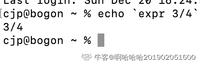

# 京东 2019 校招 GoLang 开发工程师笔试题

## 1

在软件开发过程中，我们可以采用不同的过程模型，下列有关 增量模型描述正确的是（）

正确答案: B   你的答案: 空 (错误)

```cpp
是一种线性开发模型，具有不可回溯性
```

```cpp
把待开发的软件系统模块化，将每个模块作为一个增量组件，从而分批次地分析、设计、编码和测试这些增量组件
```

```cpp
适用于已有产品或产品原型（样品），只需客户化的工程项目
```

```cpp
软件开发过程每迭代一次，软件开发又前进一个层次
```

本题知识点

算法工程师 京东 golang 工程师 京东 2019

## 2

以下为求 0 到 1000 以内所有奇数和的算法，从中选出描述正确的算法（ ）

正确答案: A   你的答案: 空 (错误)

```cpp
①s=0；②i=1；③s=s+i；④i=i+2；⑤如果 i≤1000，则返回③；⑥结束
```

```cpp
①s=0；②i=1；③i=i+2；④s=s+i；⑤如果 i≤1000，则返回③；⑥结束
```

```cpp
①s=1；②i=1；③s=s+i；④i=i+2；⑤如果 i≤1000，则返回③；⑥结束
```

```cpp
①s=1；②i=1；③i=i+2；④s=s+i；⑤如果 i≤1000，则返回③；⑥结束
```

本题知识点

算法工程师 京东 golang 工程师 京东 2019

## 3

关于递归法的说法不正确的是（ ）

正确答案: D   你的答案: 空 (错误)

```cpp
程序结构更简洁
```

```cpp
占用 CPU 的处理时间更多
```

```cpp
要消耗大量的内存空间，程序执行慢，甚至无法执行
```

```cpp
递归法比递推法的执行效率更高
```

本题知识点

算法工程师 京东 golang 工程师 京东 2019

## 4

字符串”ABCD”和字符串”DCBA”进行比较，如果让比较的结果为真，应选用关系运算符（）

正确答案: B   你的答案: 空 (错误)

```cpp
>
```

```cpp
<
```

```cpp
=
```

```cpp
>=
```

本题知识点

算法工程师 京东 golang 工程师 京东 2019

## 5

下面是一段关于计算变量 s 的算法： ①变量 s 的初值是 0 ②变量 i 从 1 起循环到 n，此时变量 s 的值由下面的式子表达式计算 ③s=s+(-1)*i ④输出变量 s 的值 这个计算 s 值的算法中，s 的代数式表示是(    )。

正确答案: D   你的答案: 空 (错误)

```cpp
1-2+3-4+„+(-1)n*(n-1)
```

```cpp
1-2+3-4+„+(-1)n-1*n
```

```cpp
1+2+3+4+...+(n-1)+n
```

```cpp
-1-2-3-4-...-n
```

本题知识点

算法工程师 京东 golang 工程师 京东 2019

## 6

以下运算符中运算优先级最高的是（ ）

正确答案: D   你的答案: 空 (错误)

```cpp
+
```

```cpp
OR
```

```cpp
>
```

```cpp
\
```

本题知识点

算法工程师 京东 golang 工程师 京东 2019

讨论

[求个 offer～～～](https://www.nowcoder.com/profile/9322291)

|  

&#124; 优先级 &#124; 运算符 &#124;
&#124; 7 &#124; ^ ! &#124;
&#124; 6 &#124; * / % << >> & &^ &#124;
&#124; 5 &#124; + - &#124; ^ &#124;
&#124; 4 &#124; == != < <= >= > &#124;
&#124; 3 &#124; <- &#124;
&#124; 2 &#124; && &#124;
&#124; 1 &#124; &#124;&#124; &#124;

 |   |

7 - 1 优先级依次降低, 题目怕是将 '/' 写成了 '\', o(╯□╰)o

发表于 2019-07-05 21:51:32

* * *

## 7

已知小顶堆：{51,32,73,23,42,62,99,14,24,39,43,58,65,80,120}，请问 62 对应节点的左子节点是

正确答案: B   你的答案: 空 (错误)

```cpp
99
```

```cpp
73
```

```cpp
3943
```

```cpp
120
```

本题知识点

算法工程师 京东 golang 工程师 2019

讨论

[C_AleXPump](https://www.nowcoder.com/profile/302181935)

51

51/ 32: swap => 32/ 51

32/51 73/

32/51 73/23 :swap => 32/23 73/51 :swap => 23/32 73/51

23/32 73/51 42

23/32 73/51 42 62 :swap =>23/32 62/51 42 73

好了现在 62 的左子树有了，就是 73，接下来看后面的插入会不会改变 62 或它左子树的位置

23/32 62/51 42 73 99/

接下来四个数是 14,24,3943,58，不影响 62 或者它的子树 插入跳过

插入 65 ， 65 比 73 小, swap，此时 62 的左子树是 65

插入 80，80>65 不影响 65 位置

插入 120，不影响 65 位置

答案就是 65

选项 73 怕是后面都没看，拍脑袋想的 73。话说那套题挺奇怪的，有的问题叙述都不全，随便答答才 30 几分居然前 5%

编辑于 2019-02-20 14:14:53

* * *

[FlyingOnion](https://www.nowcoder.com/profile/86099865)

这个是要我们建堆吧，麻烦写清楚一些好吗

发表于 2019-08-24 10:50:46

* * *

[cc.-C](https://www.nowcoder.com/profile/2208044)

添加 65 的时候小于 parent73，所以要上浮，答案应该为 65

发表于 2019-02-20 14:54:01

* * *

## 8

若串 S=”UP！UP！JD”，则其子串的数目

正确答案: B   你的答案: 空 (错误)

```cpp
33
```

```cpp
37
```

```cpp
39
```

```cpp
35
```

本题知识点

算法工程师 京东 golang 工程师 京东 2019

讨论

[hefty](https://www.nowcoder.com/profile/694464916)

子串是连续的子集，很容易想到其为 8+7+6+..+1，即(1+8)*9/2 = 36，另外加上空串“”，为 37，即为答案。然而，本题答案有相当欠考虑的地方，就是去重。根据集合的互异性，本题应该将 U,P,!,UP,P!,UP!进行去重，即 37-6 = 31 才是正确答案。希望官方注意并查证。

编辑于 2019-04-13 15:25:50

* * *

## 9

一颗二叉树的叶子节点有 5 个，出度为 1 的结点有 3 个，该二叉树的结点总个数是？

正确答案: B   你的答案: 空 (错误)

```cpp
11
```

```cpp
12
```

```cpp
13
```

```cpp
14
```

本题知识点

算法工程师 京东 golang 工程师 京东 2019

讨论

[想去大厂拧螺丝](https://www.nowcoder.com/profile/480450643)

度为 0，1，2 的节点为别设为 n0, n1, n2 总节点数为 n。得到以下公式：n = n0 + n1 + n2 设边数量为 B, 得 n = B + 1，最后加的 1 是根节点，画图可以发现，每个节点的头上都有一条边，唯独根节点没有。因为度为 2 的点有两条边，度为 1 的有一条，所以得 B = 2*n2 + n1 所以连立方程得 n = n0 + n1 + n2 = 2*n2 + n1 + 1 得 n2 + 1 = n0, 其中 n0 已知为 5 解得 n2 = 4 所以 n = n0 + n1 + n2 = 12

编辑于 2021-10-08 14:57:08

* * *

[羡鱼 201907071247985](https://www.nowcoder.com/profile/217613649)

5 个叶子节点,出度为 1 的节点有三个,说明,底层有左右孩子的有一个,其他 3 个只有左孩子或右孩子,各层节点分别为 1,2,4,5

发表于 2020-10-05 23:58:19

* * *

## 10

以下哪种排序算法一趟结束后能够确定一个元素的最终位置？

正确答案: C   你的答案: 空 (错误)

```cpp
简单选择排序
```

```cpp
基数排序
```

```cpp
堆排序
```

```cpp
二路归并排序
```

本题知识点

算法工程师 京东 golang 工程师 京东 2019

讨论

[_Wyhon](https://www.nowcoder.com/profile/531963899)

简单选择排序算法一趟后也可以确定一个元素的最终位置啊~...

发表于 2019-02-20 10:33:57

* * *

## 11

权值分别为 9、3、2、8 的结点，构造一棵哈夫曼树，该树的带权路径长度是？

正确答案: B   你的答案: 空 (错误)

```cpp
36
```

```cpp
40
```

```cpp
45
```

```cpp
46
```

本题知识点

算法工程师 京东 golang 工程师 京东 2019

讨论

[fox_pjh](https://www.nowcoder.com/profile/511270131)

 2，3,   **5**,8 **13**,9  **22**

发表于 2021-02-22 11:00:04

* * *

[wangsin365](https://www.nowcoder.com/profile/6060857)

9+16+9+6=40

发表于 2019-08-24 18:25:35

* * *

## 12

在（）中，只要指出表中任何一个结点的位置，就可以从它出发依次访问到表中其他所有结点。

正确答案: D   你的答案: 空 (错误)

```cpp
线性单链表
```

```cpp
双向链表
```

```cpp
线性链表
```

```cpp
循环链表
```

本题知识点

算法工程师 京东 golang 工程师 京东 2019

讨论

[氕氘氚 cjp](https://www.nowcoder.com/profile/523136928)

双向链表为什么不行呀

发表于 2020-12-20 20:33:11

* * *

## 13

下列对 TCP/IP 结构及协议分层不正确的是：

正确答案: C   你的答案: 空 (错误)

```cpp
网络接口层：Wi-Fi、ATM 、GPRS、EVDO、HSPA。
```

```cpp
网际层：IP、ICMP、IGMP 。
```

```cpp
传输层：TCP、UDP、TLS、ssh。
```

```cpp
FTP、TELNET、DNS、SMTP.
```

本题知识点

算法工程师 京东 golang 工程师 京东 2019

讨论

[K201801120933940](https://www.nowcoder.com/profile/1230586)

传输层只有 TCP/UDP，TLS 和 SSH，是应用层，用的 TCP

发表于 2019-01-18 17:55:20

* * *

## 14

以下哪种设备工作在数据链路层？

正确答案: C   你的答案: 空 (错误)

```cpp
中继器
```

```cpp
集线器
```

```cpp
交换机
```

```cpp
路由器
```

本题知识点

算法工程师 京东 golang 工程师 京东 2019

讨论

[_Wyhon](https://www.nowcoder.com/profile/531963899)

各层设备：物理层：中继器，集线器。数据链路层：网桥、交换机。网络层：路由器。

发表于 2019-02-20 10:36:50

* * *

## 15

打电话使用的数据传输方式是（），手机上网使用的数据传输方式是（）？

正确答案: B   你的答案: 空 (错误)

```cpp
电路交换，电路交换
```

```cpp
电路交换，分组交换
```

```cpp
分组交换，分组交换
```

```cpp
分组交换，电路交换
```

本题知识点

算法工程师 京东 golang 工程师 京东 2019

## 16

后退 N 帧协议的发送窗口大小是（），接收窗口的大小是（）？

正确答案: D   你的答案: 空 (错误)

```cpp
=1,=1
```

```cpp
=1,>1
```

```cpp
>1,>1
```

```cpp
>1,=1
```

本题知识点

算法工程师 京东 golang 工程师 京东 2019

## 17

TCP 释放连接第二次挥手时 ACK（）,第三次挥手时 ACK（）?

正确答案: C   你的答案: 空 (错误)

```cpp
不存在，不存在，
```

```cpp
不存在，值是 1
```

```cpp
值是 1，值是 1
```

```cpp
值是 1，不存在
```

本题知识点

算法工程师 京东 golang 工程师 京东 2019

讨论

[羡鱼 201907071247985](https://www.nowcoder.com/profile/217613649)

四次挥手 ,客户端发送断开请求 FIN=1,服务端接收返回确认 ACK=1,等待数据传输完毕,再次发送 FIN=1,ACK=1,客户端接收返回 ACK=1,断开连接

发表于 2020-10-06 00:13:52

* * *

## 18

重复的数据，会增加磁盘空间的占有率，延长操作数据的时间。可以使用规范化处理数据冗余，以下对符合第一范式的表述正确的是：

正确答案: C   你的答案: 空 (错误)

```cpp
非键属性和键（主键）属性间没有传递依赖
```

```cpp
非键属性和键（主键）属性间没有部分依赖
```

```cpp
表中不应该有重复组。列重复拆成另外一张表；行重复拆成多行
```

```cpp
一个表中的列值与其他表中的主键匹配
```

本题知识点

算法工程师 京东 golang 工程师 京东 2019

## 19

以下哪条 SQL 语句可以返回 table1 中的全部的 key：

正确答案: D   你的答案: 空 (错误)

```cpp
select tabel1.key from table1 join tabel2 on table1.key=table2.key
```

```cpp
select tabel1.key from table1 right outer join tabel2 on table1.key=table2.key
```

```cpp
select tabel1.key from table1 left semi join tabel2 on table1.key=table2.key
```

```cpp
select tabel1.key from table1 left outer join tabel2 on table1.key=table2.key
```

本题知识点

算法工程师 京东 golang 工程师 京东 2019

## 20

以下关于 Mysql 数据库引擎ＭyISAM 的描述错误的是？

正确答案: A   你的答案: 空 (错误)

```cpp
支持行锁
```

```cpp
如果表主要是用于插入新记录和读出记录，那么选择 MyISAM 引擎能实现处理高效率
```

```cpp
在执行查询语句（SELECT）前，会自动给涉及的所有表加读锁，在执行更新操作（UPDATE、DELETE、INSERT 等）前，会自动给涉及的表加写锁
```

```cpp
不支持事务
```

本题知识点

算法工程师 京东 golang 工程师 京东 2019

讨论

[牛客 302876048 号](https://www.nowcoder.com/profile/302876048)

InnoDB 支持表、行(默认)级锁，而 MyISAM 支持表级锁

发表于 2020-12-25 12:27:59

* * *

## 21

Mysql 中表 user 的建表语句如下，
CREATE TABLE `user` (
  `id` bigint(20) NOT NULL AUTO_INCREMENT COMMENT '主键 Id',
  `name` varchar(255) DEFAULT NULL COMMENT '名称',
  `age` int(11) DEFAULT NULL COMMENT '年龄',
  `address` varchar(255) DEFAULT NULL COMMENT '地址',
  `created_time` datetime DEFAULT NULL COMMENT '创建时间',
  `updated_time` datetime DEFAULT NULL COMMENT '更新时间',
  PRIMARY KEY (`id`),
  KEY `idx_com1` (`name`,`age`,`address`)
) ENGINE=InnoDB DEFAULT CHARSET=utf8 COMMENT='用户表';
以下哪个查询语句没有使用到索引 idx_com1？

正确答案: C   你的答案: 空 (错误)

```cpp
select  *  from user where name='张三' and age = 25 and address='北京大兴区';
```

```cpp
select  *  from user where name='张三' and address='北京大兴区';
```

```cpp
select  *  from user where age = 25 and address='北京大兴区';
```

```cpp
select  *  from user where address='北京大兴区'  and age = 25 and name='张三'
```

本题知识点

算法工程师 京东 golang 工程师 京东 2019

讨论

[mgeosandro](https://www.nowcoder.com/profile/906236587)

Mysql 组合索引采取“最左前缀”，必须包含最左字段。

发表于 2019-01-10 14:00:22

* * *

## 22

用户表中有两列 name/country。
现在要查询用户表中每个国家(country)的用户人数，应使用以下哪个语句

正确答案: A   你的答案: 空 (错误)

```cpp
select count(*) from users group by country
```

```cpp
select name from users where country = 'xx'
```

```cpp
select count(country) from users
```

```cpp
select country from users
```

本题知识点

算法工程师 京东 golang 工程师 京东 2019

## 23

执行下列代码的输出结果为（      ）
package main
import (
 "fmt"
)
func main() {
 var number *int
 *number=10
 fmt.Println(*number)
}

正确答案: D   你的答案: 空 (错误)

```cpp
0
```

```cpp
1
```

```cpp
10
```

```cpp
其他几项都不对
```

本题知识点

算法工程师 京东 golang 工程师 2019

讨论

[牛客 443339923 号](https://www.nowcoder.com/profile/443339923)

编译报错，因为没有初始化值地址应该增加 new 的初始化

```cpp
 ```
{ var number *int  number = new(int)//new 初始化值的内存地址，预先分配一个内存地址到指针  *number = 10   fmt.Println(*number) //打印 10
}
```cpp 
```

编辑于 2020-05-09 12:08:41

* * *

[牛客 131539061 号](https://www.nowcoder.com/profile/131539061)

空指针了

发表于 2020-02-08 22:31:35

* * *

## 24

执行下列代码的输出结果为（      ）
package main
import (
 "fmt"
)

func main() {
   var arr= make([]int,2,4)

   printSlice(arr)
}

func printSlice(i []int){
   fmt.Printf("%d,%d,%v\n",len(i),cap(i),i)
}

正确答案: A   你的答案: 空 (错误)

```cpp
2,4,[0 0]
```

```cpp
4,2,[0 0]
```

```cpp
4,2,[0 0 0 0]
```

```cpp
其他几项都不对
```

本题知识点

算法工程师 京东 golang 工程师 2019

讨论

[wayyoung](https://www.nowcoder.com/profile/488087447)

len 是长度，cap 是容量，由 make 声明内表示，两个 0 是因为之前设置了长度为 2，

发表于 2020-03-17 23:01:52

* * *

## 25

执行下列代码的输出结果为（      ）
package main
import (
 "fmt"
)

func main() {
 s := []int{1, 2, 3}
 ss := s[1:]
 ss = append(ss, 4)

 for _, v := range ss {
  v += 10
 }

 for i := range ss {
  ss[i] += 10
 }

 fmt.Println(ss)
}

正确答案: B   你的答案: 空 (错误)

```cpp
[11 12 13 14]
```

```cpp
[12 13 14]
```

```cpp
[10 10 10]
```

```cpp
其他几项都不对
```

本题知识点

算法工程师 京东 golang 工程师 2019

## 26

执行下列代码的输出结果为（      ）
package main

type S struct{}

func (s S) F() {}

type IF interface {
 F()
}

func InitType() S {
 var s S
 return s
}

func InitPointer() *S {
 var s *S
 return s
}
func InitEfaceType() interface{} {
 var s S
 return s
}

func InitEfacePointer() interface{} {
 var s *S
 return s
}

func InitIfaceType() IF {
 var s S
 return s
}

func InitIfacePointer() IF {
 var s *S
 return s
}

func main() {
 println(InitType() == nil)
 println(InitPointer() == nil)
 println(InitEfaceType() == nil)
 println(InitEfacePointer() == nil)
 println(InitIfaceType() == nil)
 println(InitIfacePointer() == nil)
}

正确答案: D   你的答案: 空 (错误)

```cpp
true true false false false false
```

```cpp
false true false false false false
```

```cpp
false true false false false true
```

```cpp
其他几项都不对
```

本题知识点

算法工程师 京东 golang 工程师 2019

讨论

[hefty](https://www.nowcoder.com/profile/694464916)

第一项错误比较，函数返回的是空结构，无法和 nil 比较

发表于 2019-04-13 15:46:26

* * *

## 27

执行下列代码的输出结果为（      ）
package main

const N = 3

func main() {
 m := make(map[int]*int)

 for i := 0; i < N; i++ {
  m[i] = &i //A
 }

 for _, v := range m {
  print(*v)
 }
}

正确答案: D   你的答案: 空 (错误)

```cpp
012
```

```cpp
123
```

```cpp
222
```

```cpp
333
```

本题知识点

算法工程师 京东 golang 工程师 2019

## 28

下列代码的输出结果为（      ）
package main

import (
 "sync"
)

const N = 10

func main() {
 m := make(map[int]int)

 syncwg := &sync.WaitGroup{}
 syncmu := &sync.Mutex{}
 syncwg.Add(N)
 for i := 0; i < N; i++ {
  go func() {
   defer syncwg.Done()
   syncmu.Lock()
   m[i] = i
   syncmu.Unlock()
  }()
 }
 syncwg.Wait()
 println(len(m))
}

正确答案: B   你的答案: 空 (错误)

```cpp
0
```

```cpp
1
```

```cpp
9
```

```cpp
10
```

本题知识点

算法工程师 京东 golang 工程师 2019

讨论

[…20190328104099](https://www.nowcoder.com/profile/887665003)

这题答案 0-9 都有可能 for 或者 range 与协程配合使用时，for 传入给协程的数不确定

```cpp
func main() {
	m := make(map[int]int)

	syncwg := &sync.WaitGroup{}
	syncmu := &sync.Mutex{}
	syncwg.Add(N)
	for i := 0; i < N; i++ {
		go func(i int) {
			defer syncwg.Done()
			syncmu.Lock()
			m[i] = i
			syncmu.Unlock()
		}(i)
	}
	syncwg.Wait()
	println(len(m))
}
```

如果给这个匿名函数加传入参数，结果才为 10

发表于 2019-11-15 22:15:02

* * *

## 29

下列代码的输出结果为（      ）
package main

func main() {
 a := "012"
 pa := &a
 b := []byte(*pa)
 pb := &b

 a += "3"
 *pa += "4"
 b[1] = '5'

 println(*pa)
 println(string(*pb))
}  

正确答案: C   你的答案: 空 (错误)

```cpp
0 0
```

```cpp
4 0
```

```cpp
01234 052
```

```cpp
其他几项都不对
```

本题知识点

算法工程师 京东 golang 工程师 2019

## 30

下列代码的输出结果为（      ）
package main

import (
 "fmt"
)

type A struct{}

func (a A) f() {
 fmt.Println("A.f()")
}
func (a A) g() {
 fmt.Println("A.g()")
}

type B struct {
 A
}

func (b B) f() {
 fmt.Println("B.f()")
}

type I interface {
 f()
}

func printType(i I) {
 fmt.Printf("%T\n", i)
 if a, ok := i.(A); ok {
  a.f()
  a.g()
 }
 if b, ok := i.(B); ok {
  b.f()
  b.g()
 }
}

func main() {
 printType(A{})
 printType(B{})
}

正确答案: A   你的答案: 空 (错误)

```cpp
main.A A.f() A.g() main.B B.f() A.g()
```

```cpp
main.A A.f() A.g() main.B B.f() B.g()
```

```cpp
main.A A.f() B.g() main.B B.f() B.g()
```

```cpp
其他几项都不对
```

本题知识点

算法工程师 京东 golang 工程师 2019

## 31

下列代码输出结果为（      ）
package main

import (
 "fmt"
)

func main() {
 fmt.Println(len("中国"))
}

正确答案: C   你的答案: 空 (错误)

```cpp
4
```

```cpp
5
```

```cpp
6
```

```cpp
7
```

本题知识点

算法工程师 京东 golang 工程师 2019

讨论

[羡鱼 201907071247985](https://www.nowcoder.com/profile/217613649)

go 中汉字占 3 个字节

发表于 2020-10-06 00:26:10

* * *

## 32

下列代码输出结果为（      ）
package main

import (
 "fmt"
)

func main() {
 if true {
  defer fmt.Printf("a")
 }else {
  defer fmt.Printf("b")
 }

 fmt.Printf("c")
}

正确答案: B   你的答案: 空 (错误)

```cpp
ac
```

```cpp
ca
```

```cpp
bc
```

```cpp
cb
```

本题知识点

算法工程师 京东 golang 工程师 2019

## 33

下列语句存在语法错误的是（      ）

正确答案: B   你的答案: 空 (错误)

```cpp
var a []int a = append(a, 9)
```

```cpp
var m map[string]int m[“a”]=5
```

```cpp
var m map[string]int m=make(map[string]int) m[“a”]=5
```

```cpp
var a = [][2]int{{0, 0}, {1, 2}, {2}, {3, 6}, {4, 8}}
```

本题知识点

算法工程师 京东 golang 工程师 2019

讨论

[K201801120933940](https://www.nowcoder.com/profile/1230586)

B，先只是声明，需要 make 初始化

发表于 2019-01-18 18:02:52

* * *

[花岗斑岩](https://www.nowcoder.com/profile/360432)

A 没错？

发表于 2019-09-29 18:21:34

* * *

## 34

echo `expr 3/4`的执行结果

正确答案: D   你的答案: 空 (错误)

```cpp
0
```

```cpp
1
```

```cpp
0.75
```

```cpp
43163
```

本题知识点

算法工程师 京东 golang 工程师 京东 2019

讨论

[熊熊的多多](https://www.nowcoder.com/profile/132711786)


发表于 2020-02-12 14:04:48

* * *

[氕氘氚 cjp](https://www.nowcoder.com/profile/523136928)

????

发表于 2020-12-20 20:47:00

* * *

[rikaaa0928](https://www.nowcoder.com/profile/749031376)


发表于 2019-10-14 20:21:19

* * *

## 35

文件目录 data 当前权限为 rwx --- ---，只需要增加用户组可读权限，但不允许写操作，具体方法为：

正确答案: A   你的答案: 空 (错误)

```cpp
chmod +050 data
```

```cpp
chmod +040 data
```

```cpp
chmod +005 data
```

```cpp
chmod +004 data
```

本题知识点

算法工程师 京东 golang 工程师 京东 2019

讨论

[代码会说话](https://www.nowcoder.com/profile/8532689)

B a+x 表示给所有用户执行权限。 g+w 表示给组用户加写权限。 a：all 表示所有用户 o: other 表示其他用户 g: group 表示组用户 u: user 表示所属用户 +：表示增加权限 -：表示减少权限 =：表示指定具体权限 数字权限具体分解意思。 4:r 2:w 1:x

发表于 2019-04-11 09:48:15

* * *

## 36

bash 脚本文件一般第一行开头是

正确答案: C   你的答案: 空 (错误)

```cpp
//
```

```cpp
##
```

```cpp
#!
```

```cpp
#/
```

本题知识点

算法工程师 京东 golang 工程师 京东 2019

## 37

如何获取上一条命令执行的返回码

正确答案: C   你的答案: 空 (错误)

```cpp
$!
```

```cpp
0
```

```cpp
$?
```

```cpp
$#
```

本题知识点

算法工程师 京东 golang 工程师 京东 2019

## 38

Shell 脚本（shell script），是一种为 shell 编写的脚本程序。现有一个 test.sh 文件，且有可执行权限，文件中内容为：
#!/bin/bash
aa='Hello World !'
请问下面选项中哪个能正常显示 Hello World !

正确答案: D   你的答案: 空 (错误)

```cpp
sh test.sh >/dev/null 1 && echo $aa
```

```cpp
./test.sh >/dev/null 1 && echo $aa
```

```cpp
bash test.sh >/dev/null 1 && echo $aa
```

```cpp
. ./test.sh >/dev/null 1 && echo $aa
```

本题知识点

算法工程师 京东 golang 工程师 京东 2019

讨论

[K201801120933940](https://www.nowcoder.com/profile/1230586)

第一个点 . 表示在当前 shell 下执行。不是新开 shell

发表于 2019-01-18 18:04:55

* * *

[dreamerlzl](https://www.nowcoder.com/profile/60886763)

求问这里 /dev/null 的意义是什么啊。。。

发表于 2020-08-21 11:00:52

* * *

[wangsin365](https://www.nowcoder.com/profile/6060857)

第一个点就是 source 写入环境变量 选项 a 没写入环境变量 读不到 aa

发表于 2019-08-24 14:27:12

* * *

## 39

以下哪个命令是将标准输出和错误重定向到 a.txt 文件

正确答案: A   你的答案: 空 (错误)

```cpp
&>a.txt
```

```cpp
&|a.txt
```

```cpp
a.txt < &
```

```cpp
a.txt | &
```

本题知识点

算法工程师 京东 golang 工程师 京东 2019

## 40

以下不属于 socket 类型的是：

正确答案: D   你的答案: 空 (错误)

```cpp
SOCK_STREAM
```

```cpp
SOCK_DGRAM
```

```cpp
SOCK_RAW
```

```cpp
SOCK_NET
```

本题知识点

算法工程师 京东 golang 工程师 2019

## 41

网络编程，如果是 TCP 连接，对于服务器端，过程描述正确的是：

正确答案: A   你的答案: 空 (错误)

```cpp
创建套接字--->绑定端口号--->监听连接--->接受连接请求并返回新的套接字--->用新返回的套接字 recv/send--->关闭套接字
```

```cpp
绑定端口号--->监听连接--->创建套接字--->接受连接请求并返回新的套接字--->用新返回的套接字 recv/send--->关闭套接字
```

```cpp
创建套接字--->监听连接--->绑定端口号--->接受连接请求并返回新的套接字--->用新返回的套接字 recv/send--->关闭套接字
```

```cpp
创建套接字--->监听连接--->绑定端口号--->新返回的套接字 recv/send--->接受连接请求并返回新的套接字--->关闭套接字
```

本题知识点

算法工程师 京东 golang 工程师 2019

讨论

[Viva23333](https://www.nowcoder.com/profile/378165542)

a

发表于 2019-10-31 10:56:42

* * *

## 42

在考虑到并行计算的前提下，对于如下代码段:
x = 5
x = square(x)
x = x + 1

说法错误的是：

正确答案: A   你的答案: 空 (错误)

```cpp
X 的值总会是 26
```

```cpp
X 的值可能是 26
```

```cpp
X 的值可能是 5
```

```cpp
X 的值可能是 25
```

本题知识点

算法工程师 京东 golang 工程师 2019

## 43

在考虑到并行计算的前提下，假设初始账户为 10 美元，阅读如下 python 代码片段：
def make_withdraw(balance):
        def withdraw(amount):
            nonlocal balance
            if amount > balance:
                print('Insufficient funds')
            else:
                balance = balance - amount
                print(balance)
        return withdraw

则说法错误的是:

正确答案: D   你的答案: 空 (错误)

```cpp
结果可能为 3
```

```cpp
结果可能为 2
```

```cpp
结果可能为 Insufficient funds
```

```cpp
并行化代码会将代码行分配给多个处理器计算，与变量读写顺序无关。
```

本题知识点

算法工程师 京东 golang 工程师 2019

## 44

下面有关值类型和引用类型描述正确的是（）？

正确答案: A B C   你的答案: 空 (错误)

```cpp
值类型的变量赋值只是进行数据复制，创建一个同值的新对象，而引用类型变量赋值，仅仅是把对象的引用的指针赋值给变量，使它们共用一个内存地址。
```

```cpp
值类型数据是在栈上分配内存空间，它的变量直接包含变量的实例，使用效率相对较高。而引用类型数据是分配在堆上，引用类型的变量通常包含一个指向实例的指针，变量通过指针来引用实例。
```

```cpp
引用类型一般都具有继承性，但是值类型一般都是封装的，因此值类型不能作为其他任何类型的基类。
```

```cpp
值类型变量的作用域主要是在栈上分配内存空间内，而引用类型变量作用域主要在分配的堆上。
```

本题知识点

算法工程师 京东 golang 工程师 2019

## 45

如何在多线程中避免发生死锁？

正确答案: A B C D   你的答案: 空 (错误)

```cpp
允许进程同时访问某些资源。
```

```cpp
允许进程强行从占有者那里夺取某些资源。
```

```cpp
进程在运行前一次性地向系统申请它所需要的全部资源。
```

```cpp
把资源事先分类编号，按号分配，使进程在申请，占用资源时不会形成环路。
```

本题知识点

算法工程师 京东 golang 工程师 2019

## 46

采用哪种遍历方法可唯一确定一棵二叉树？（  ）

正确答案: B D   你的答案: 空 (错误)

```cpp
给定一棵二叉树的先序和后序遍历序列
```

```cpp
给定一棵二叉树的后序和中序遍历序列
```

```cpp
给定先序、中序和后序遍历序列中的任意一个即可
```

```cpp
给定一棵二叉树的先序和中序遍历序列
```

本题知识点

算法工程师 京东 golang 工程师 2019

讨论

[wayyoung](https://www.nowcoder.com/profile/488087447)

有中序和其他任一就够了

发表于 2020-03-17 23:21:41

* * *

## 47

TCP 协议的拥塞控制就是防止过多的数据注入到网络中，这样可以使网络中的路由器或链路不致过载。常用的方法有:

正确答案: B C   你的答案: 空 (错误)

```cpp
慢启动、窗口滑动
```

```cpp
慢开始、拥塞控制
```

```cpp
快重传、快恢复
```

```cpp
快开始、快恢复
```

本题知识点

算法工程师 京东 golang 工程师 2019

## 48

对于京东商城高流量访问，预防 Ddos 的方法可以有？

正确答案: A B C   你的答案: 空 (错误)

```cpp
限制同时打开 SYN 半链接的数目。
```

```cpp
缩短 SYN 半链接的 Time out 时间。
```

```cpp
关闭不必要的服务。
```

```cpp
限制客户端请求服务器时长。
```

本题知识点

算法工程师 京东 golang 工程师 2019

## 49

DELETE 和 TRUNCATE TABLE 都是删除表中的数据的语句，它们的不同之处描述正确的是：

正确答案: A B C D   你的答案: 空 (错误)

```cpp
TRUNCATE TABLE 比 DELETE 的速度快
```

```cpp
在删除时如果遇到任何一行违反约束（主要是外键约束），TRUNCATE TABLE 仍然删除，只是表的结构及其列、约束、索引等保持不变，但 DELETE 是直接返回错误
```

```cpp
对于被外键约束的表，不能使用 TRUNCATE TABLE，而应该使用不带 WHERE 语句的 DELETE 语句。
```

```cpp
如果想保留标识计数值，要用 DELETE，因为 TRUNCATE TABLE 会对新行标志符列使用的计数值重置为该列的种子
```

本题知识点

算法工程师 京东 golang 工程师 2019

## 50

编译下列代码，哪些行会出现编译错误（      ）
package main

type Books struct {
}

func foo1(x interface{}) {
}

func foo2(x *interface{}) {
}

func main() {
 s := Books{}
 p := &s
 foo1(s) //line:1
 foo2(s) //line:2
 foo1(p) //line:3
 foo2(p) //line:4
}

正确答案: B D   你的答案: 空 (错误)

```cpp
line:1
```

```cpp
line:2
```

```cpp
line:3
```

```cpp
line:4
```

本题知识点

算法工程师 京东 golang 工程师 2019

讨论

[FlyingOnion](https://www.nowcoder.com/profile/86099865)

*interface{} 是不合法的

发表于 2019-08-24 11:48:20

* * *

[…20190328104099](https://www.nowcoder.com/profile/887665003)

这题考的是解引用 取引用，调用方法时，会自动对实参进行“取引用”或“解引用”操作

*   用**值类型**的实参调用形参为**值类型**的方法
*   用**指针类型**的实参调用形参为**值类型**的方法（会进行“自动解引用”）
*   用**值类型**的实参调用形参为**指针类型**的方法（会进行“自动取引用”）
*   用**指针类型**的实参调用形参为**指针类型**的方法

**规则 1**： 当传递给方法的实参是一个值类型时，原值的内容不会受到影响，因为传递进来的是原值的副本；相反，当传递给方法的实参是一个指针类型时，原值的内容将可能受到影响。规则 2：方法的调用是否会对原值产生影响完全取决于该方法的形参是**值类型**还是**参数类型**。再就是特殊情况下 当*interface 做形参时

发表于 2019-11-15 22:35:14

* * *

## 51

下列有关接口说法正确的是（      ）

正确答案: A B C   你的答案: 空 (错误)

```cpp
若两个 interface 有相同的方法列表，则它们可以相互赋值
```

```cpp
若 interface A 的方法列表是 interface B 的子集，则 B 可以赋值给 A
```

```cpp
interface 查询在运行时才能确定是否成功
```

```cpp
interface 赋值需要在运行时才能确定是否允许
```

本题知识点

算法工程师 京东 golang 工程师 2019

讨论

[wayyoung](https://www.nowcoder.com/profile/488087447)

D 赋值是否允许在编译的时候就确定了

发表于 2020-03-17 23:28:00

* * *

## 52

系统管理员编写扫描临时文件的 shell 程序 tmpsc.sh, 测试该程序时提示拒绝执行，解决的方法有（      ）

正确答案: B C D   你的答案: 空 (错误)

```cpp
chmod 644 tmpsc.sh
```

```cpp
chmod 755 tmpsc.sh
```

```cpp
chmod a+x tmpsc.sh
```

```cpp
chmod u+x tmpsc.sh
```

本题知识点

算法工程师 京东 golang 工程师 2019

讨论

[_ 向 offer 冲锋-](https://www.nowcoder.com/profile/227731021)

a 是指所有人

发表于 2020-03-24 09:23:52

* * *

[wayyoung](https://www.nowcoder.com/profile/488087447)

执行权限，755 和 x 是权限范围，a 和 u 对象是所有人还是所属用户

发表于 2020-03-17 23:29:15

* * *

## 53

在 bash 编程中,算术比较大于、大于等于的运算符是（      ）

正确答案: C D   你的答案: 空 (错误)

```cpp
>
```

```cpp
>=
```

```cpp
ge
```

```cpp
gt
```

本题知识点

算法工程师 京东 golang 工程师 2019

讨论

[牛客 443339923 号](https://www.nowcoder.com/profile/443339923)

gt 大于
ge 大于等于

发表于 2020-05-09 12:46:50

* * *