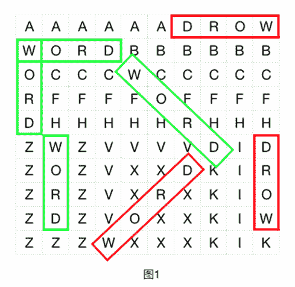

# 网易互娱（游戏）2019 年-游戏研发/初级游戏研发/平台开发岗部分真题

## 1

**注意：本题允许使用 C/C++/Java/python 进行解答，其他编程语言提交均视作无效处理。**小 W 有一个电子时钟用于显示时间，显示的格式为 HH:MM:SS，HH，MM，SS 分别表示时，分，秒。其中时的范围为[‘00’,‘01’…‘23’]，分的范围为[‘00’,‘01’…‘59’]，秒的范围为[‘00’,‘01’…‘59’]。 

但是有一天小 W 发现钟表似乎坏了，显示了一个不可能存在的时间“98:23:00”，小 W 希望改变最少的数字，使得电子时钟显示的时间为一个真实存在的时间，譬如“98:23:00”通过修改第一个’9’为’1’，即可成为一个真实存在的时间“18:23:00”。修改的方法可能有很多，小 W 想知道，在满足改变最少的数字的前提下，符合条件的字典序最小的时间是多少。其中字典序比较为用“HHMMSS”的 6 位字符串进行比较。

本题知识点

Java 工程师 C++工程师 网易互娱 模拟 数学 字符串 *游戏研发工程师 2018 2019* *讨论

[nbgao](https://www.nowcoder.com/profile/211289)

```cpp
#include<bits/stdc++.h>
using namespace std;
int main(){
    int T,H,M,S;
    scanf("%d", &T);
    while(T--){
        scanf("%d:%d:%d", &H, &M, &S);
        if(H>=24)
            H %= 10;
        if(M>=60)
            M %= 10;
        if(S>=60)
            S %= 10;
        printf("%02d:%02d:%02d\n", H, M, S);
    }
    return 0;
}

```

发表于 2019-07-15 09:13:16

* * *

[ElonB](https://www.nowcoder.com/profile/623894)

```cpp
""""
最小改动
"""

if __name__ == "__main__":
    n = int(input().strip())
    for _ in range(n):
        HH, MM, SS = map(int, input().strip().split(':'))
        if HH >= 24:
            HH %= 10
        if MM >= 60:
            MM %= 10
        if SS >= 60:
            SS %= 10
        print("{0:02d}:{1:02d}:{2:02d}".format(HH, MM, SS))

```

发表于 2019-07-12 14:24:09

* * *

[叶挽秋](https://www.nowcoder.com/profile/754934722)

1 思路分析

1.  将输入字符串按照 ':'分割为三个字符串。
2.  然后将三个字符串分别转换为 int 类型。
3.  对时分秒对应的值分别处理，超出范围的就将十位改为 0。

2 代码

```cpp
import java.util.Scanner;

public class Main {
    public static void main(String[] args) {
        Scanner scanner = new Scanner(System.in);
        int n = scanner.nextInt();
        for (int i = 0; i < n; ++ i) {
            String input = scanner.next();
            String[] strs = input.split(":");

            int h = Integer.parseInt(strs[0]);
            if (h > 23) {
                strs[0] = "0" + strs[0].charAt(1);
            }

            int m = Integer.parseInt(strs[1]);
            if (m > 59) {
                strs[1] = "0" + strs[1].charAt(1);
            }

            int s = Integer.parseInt(strs[2]);
            if (s > 59) {
                strs[2] = "0" + strs[2].charAt(1);
            }

            System.out.println(strs[0] + ":" + strs[1] + ":" + strs[2]);
        }
    }
}
```

发表于 2019-11-21 09:41:50

* * *

## 2

小云正在参与开发一个即时聊天工具，他负责其中的会话列表部分。

会话列表为显示为一个从上到下的多行控件，其中每一行表示一个会话，每一个会话都可以以一个唯一正整数 id 表示。

当用户在一个会话中发送或接收信息时，如果该会话已经在会话列表中，则会从原来的位置移到列表的最上方；如果没有在会话列表中，则在会话列表最上方插入该会话。

小云在现在要做的工作是测试，他会先把会话列表清空等待接收信息。当接收完大量来自不同会话的信息后，就输出当前的会话列表，以检查其中是否有 bug。

本题知识点

Java 工程师 C++工程师 网易互娱 栈 *模拟 游戏研发工程师 2018 2019* *讨论

[ElonB](https://www.nowcoder.com/profile/623894)

```cpp
""""
逆序去重输出
"""

if __name__ == "__main__":
    T = int(input().strip())
    for _ in range(T):
        n = int(input().strip())
        a = list(map(int, input().strip().split()))
        ans = []
        for i in range(len(a) - 1, -1, -1):
            if a[i] not in ans:
                ans.append(a[i])
        print(' '.join(map(str, ans)))

```

发表于 2019-07-12 18:57:58

* * *

[驭梦师](https://www.nowcoder.com/profile/471026608)

#include<iostream>#include<vector>#include<algorithm>//为了利用 find 函数 using namespace std;int main(){    int N;//测试样例有多少组    cin >> N;    while(N--){        int n;//每一组有多少个数字        cin >> n;        vector<int> team;//装原始数据        int num;//每一个数字        for(int i = 0; i < n; i++){            cin >> num;            team.push_back(num);        }        vector<int> new_team;        new_team.push_back(team[n - 1]);        team.pop_back();        for(int i = n - 2; i >= 0; i--){            if(find(new_team.begin(), new_team.end(), team[i])==new_team.end())//在新的 vector 里面找不到同样的数字，则加入                new_team.push_back(team[i]);            team.pop_back();        }        for(int i = 0; i <new_team.size(); i++){            cout << new_team[i] << " ";        }        cout << endl;    }    system("pause");    return 0;}

编辑于 2019-04-06 16:23:44

* * *

[biu~biubiu](https://www.nowcoder.com/profile/5948685)

import java.util.ArrayList;
import java.util.Scanner;

public class Main {
    public static void main(String[] args) {
        Scanner sc = new Scanner(System.in);
        ArrayList<ArrayList<Integer>> list = new ArrayList<ArrayList<Integer>>();
        while(sc.hasNext()) {
            int n = sc.nextInt();
            for(int i = 0; i < n; i++) {
                ArrayList<Integer> list1 = new ArrayList<Integer>();
                list.add(list1);
                int len = sc.nextInt();
                int[] arr = new int[len];
                for(int j = 0; j < len; j++) {
                    arr[j] = sc.nextInt();
                }
                for(int k = len-1; k >= 0; k--) {
                    if(!list1.contains(arr[k])) {
                        list1.add(arr[k]);
                    }        
                }
            }

            for(int i = 0; i < list.size(); i++) {
                for(int j = 0; j < list.get(i).size()-1; j++) {
                    System.out.print(list.get(i).get(j) + " ");
                }
                System.out.println(list.get(i).get(list.get(i).size()-1));
            }
        }
    }
}

发表于 2018-08-03 21:32:19

* * *

## 3

**注意：本题允许使用 C/C++/Java/python 进行解答，其他编程语言提交均视作无效处理。**字符迷阵是一种经典的智力游戏。玩家需要在给定的矩形的字符迷阵中寻找特定的单词。在这题的规则中，单词是如下规定的：1\. 在字符迷阵中选取一个字符作为单词的开头；2\. 选取右方、下方、或右下 45 度方向作为单词的延伸方向；3\. 以开头的字符，以选定的延伸方向，把连续得到的若干字符拼接在一起，则称为一个单词。 以图 1 为例，如果要在其中寻找单词"WORD"，则绿色框所标示的都是合法的方案，而红色框所标示的都是不合法的方案。现在的问题是，给出一个字符迷阵，及一个要寻找的单词，问能在字符迷阵中找到多少个该单词的合法方案。注意合法方案是可以重叠的，如图 1 所示的字符迷阵，其中单词"WORD"的合法方案有 4 种。

本题知识点

Java 工程师 C++工程师 网易互娱 模拟 字符串 *查找 *游戏研发工程师 2018 2019** **讨论

[ElonB](https://www.nowcoder.com/profile/623894)

```cpp
""""
固定方向的深度搜索
"""
import sys

def dfs(maze, x, y, word, t):
    if not word:
        return True
    move = [[1, 0], [0, 1], [1, 1]]
    x, y = x + move[t][0], y + move[t][1]
    if x < len(maze) and y < len(maze[0]):
        if maze[x][y] == word[0]:
            return dfs(maze, x, y, word[1:], t)
        else:
            return False
    return False

if __name__ == "__main__":
    # sys.stdin = open("input.txt", "r")
    T = int(input().strip())
    for _ in range(T):
        n, m = list(map(int, input().strip().split()))
        maze = []
        for _ in range(n):
            maze.append(input().strip())
        word = input().strip()
        ans = 0
        for i in range(n):
            for j in range(m):
                if maze[i][j] == word[0]:
                    for t in range(3):
                        if dfs(maze, i, j, word[1:], t):
                            ans += 1
        print(ans)

```

发表于 2019-07-13 10:40:23

* * *

[宇宙第二菜鸡](https://www.nowcoder.com/profile/4185129)

```cpp
#include <iostream>
#include <string>
#include <vector>
using namespace std;

int main()
{
    int n;
    cin >> n;
    for (int q = 0; q < n; q++){
        int width, height;
        cin >> width >> height;
        vector<string> maze(width);
        for (int i = 0; i < width; i++){
            string tmp;
            cin >> tmp;
            maze[i] = tmp;
        }
        string key;
        cin >> key;

        int count = 0;
        for (int i = 0; i < width; i++){
            for (int j = 0; j < height; j++){
                if (maze[i][j] == key[0]){
                    for (int m = 1; m < key.size(); m++){
                        if (j + m >= height)break;
                        if (maze[i][j + m] != key[m])break;
                        if (m == key.size() - 1)count++;
                    }
                    for (int m = 1; m < key.size(); m++){
                        if (i + m >= width)break;
                        if (maze[i + m][j] != key[m])break;
                        if (m == key.size() - 1)count++;
                    }
                    for (int m = 1; m < key.size(); m++){
                        if (i + m >= width || j + m >= height)break;
                        if (maze[i + m][j + m] != key[m])break;
                        if (m == key.size() - 1)count++;
                    }
                }
            }
        }

        cout << count << endl;
    }

    return 0;
}

```

发表于 2018-08-03 23:20:16

* * *

[lentolove](https://www.nowcoder.com/profile/572586026)

```cpp
import java.io.BufferedReader;
import java.io.IOException;
import java.io.InputStreamReader;

public class Main {

    /**
     * 本来以为是一个标准的回溯题，遍历，一顿操作之后测试第三个测试用例输出 47
     * 题目不同于图的遍历里的任意方向的搜索，而是每次按照一个固定方向的深度搜索。
     * 每次第一个字符串匹配后沿着三个方向搜索一下就行了。
     */
    public static void main(String[] args) throws IOException {
        BufferedReader bf = new BufferedReader(new InputStreamReader(System.in));
        int t = Integer.parseInt(bf.readLine());
        for (int i = 0; i < t; i++) {
            String[] line1 = bf.readLine().split(" ");
            int m = Integer.parseInt(line1[0]);//行数
            int n = Integer.parseInt(line1[1]);//列数
            char[][] matrix = new char[m][n];
            for (int j = 0; j < m; j++) {
                matrix[j] = bf.readLine().toCharArray();
            }
            String target = bf.readLine();//匹配的字符
            int count = 0;
            for (int j = 0; j < m; j++) {//行
                for (int k = 0; k < n; k++) {//列
                    //注意这个题不同于普通的回溯搜索题，这个是固定的方向
                    if (matrix[j][k] == target.charAt(0)) {
                        //方向一:向右方向
                        for (int p = 1; p < target.length(); p++) {
                            if (p + k >= n) break;
                            if (matrix[j][p + k] != target.charAt(p)) break;
                            if (p == target.length() - 1) count++;
                        }
                        //方向二:向下方向
                        for (int p = 1; p < target.length(); p++) {
                            if (p + j >= m) break;
                            if (matrix[p + j][k] != target.charAt(p)) break;
                            if (p == target.length() - 1) count++;
                        }

                        //方向三：右下方向
                        for (int p = 1; p < target.length(); p++) {
                            if (p + j >= m || p + k >= n) break;
                            if (matrix[j + p][k + p] != target.charAt(p)) break;
                            if (p == target.length() - 1) count++;
                        }
                    }
                }
            }
            System.out.println(count);
        }
    }

    //不能用这个
    private static int wordCount(char[][] matrix, int m, int n, int i, int j, String target, int len, int count) {
        if (i >= m || j >= n || matrix[i][j] != target.charAt(len)) return 0;
        if (len == target.length() - 1) {
            return 1;
        }
        return wordCount(matrix, m, n, i, j + 1, target, len + 1, count) +
                wordCount(matrix, m, n, i + 1, j, target, len + 1, count)
                + wordCount(matrix, m, n, i + 1, j + 1, target, len + 1, count);
    }
}

```

发表于 2019-08-06 16:18:18

* * *****