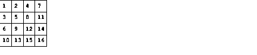

# 第四范式 2019 校园招聘测试开发笔试题

## 1

下列关于 Java 的数组定义及赋值中, 错误的是(   )  

正确答案: B   你的答案: 空 (错误)

```cpp
int intArray[];
```

```cpp
intArray = new int[3]; intArray[1]=1; intArray[2]=2; intArray[3]=3;
```

```cpp
int a[] = {1,2,3,4,5};
```

```cpp
int[][] a = new int[2][]; a[0] = new int[3]; a[1] = new int[3];
```

本题知识点

Java 工程师 C++工程师 测试工程师 第四范式 测试开发工程师 2019

讨论

[HuaCode](https://www.nowcoder.com/profile/9821551)

在数组的初始化上，Java 和 C 没有语言上的区别，通过动态的方式的声明并初始化，而数组的下标都是从 0 开始，所以下标范围应该是 0,1,2 才对。

发表于 2019-03-07 10:15:14

* * *

[牛客 218452773 号](https://www.nowcoder.com/profile/218452773)

b 数组下标从 0 开始

发表于 2021-06-23 19:54:34

* * *

[书山压力大，学海举步艰](https://www.nowcoder.com/profile/477724405)

应该是从 0 开始，不是从 1 开始

发表于 2019-02-26 23:54:03

* * *

## 2

下列异常中, 哪个是不能使用 throw 抛出的是(    )

正确答案: B   你的答案: 空 (错误)

```cpp
Error;
```

```cpp
Throwable;
```

```cpp
Exception;
```

```cpp
RuntimeException
```

本题知识点

Java 工程师 C++工程师 测试工程师 第四范式 测试开发工程师 2019

讨论

[爱上兔子的熊](https://www.nowcoder.com/profile/994896800)

Throwable 是一个接口，throw 必须抛出一个类的对象

发表于 2019-03-05 18:14:46

* * *

[错误分离](https://www.nowcoder.com/profile/9078493)

选项都是对的，这题没答案。

发表于 2019-03-04 13:36:28

* * *

[书山压力大，学海举步艰](https://www.nowcoder.com/profile/477724405)

Error，Exception，RuntimeException，都属于 Throwable 的子类，Throwable 是异常处理的基类，应该都能吧，求解释

发表于 2019-02-27 00:01:15

* * *

## 3

下面哪个语句能够正确地创建一个 InputStreamReader 的实例？

正确答案: A   你的答案: 空 (错误)

```cpp
new InputStreamReader(new FileInputStream("data"))
```

```cpp
new InputStreamReader(new FileReader("data"))
```

```cpp
new InputStreamReader(new BufferedReader("data"))
```

```cpp
new InputStreamReader("data")
```

本题知识点

Java 工程师 C++工程师 测试工程师 第四范式 测试开发工程师 2019

讨论

[mumucgq](https://www.nowcoder.com/profile/8940520)

InputStreamReader 是字节流转字符流的适配器，创建对象的时候需要传入一个字节流对象

发表于 2021-03-12 17:30:47

* * *

[HuaCode](https://www.nowcoder.com/profile/9821551)

记住语法格式就行，这一题考的就是基础吧

发表于 2019-03-07 10:29:22

* * *

## 4

在一个线程中 sleep(1000)方法, 将使该线程在多长时间后获得对 CPU 的控制 (假设睡眠过程中不会有其他事件唤醒该线程)?  

正确答案: C   你的答案: 空 (错误)

```cpp
正好 1000ms;
```

```cpp
少于 1000ms;
```

```cpp
大于等于 1000ms;
```

```cpp
不一定
```

本题知识点

Java 工程师 C++工程师 测试工程师 第四范式 测试开发工程师 第四范式 2019

讨论

[new-coder](https://www.nowcoder.com/profile/7467857)

要等系统调度

发表于 2019-03-05 12:38:18

* * *

## 5

假设 test 类运行于多线程环境下，那么关于 A 处的同步下面描述正确的是？

```cpp
public class Test {List list= new java.util.ArrayList(); public void test() {synchronized ( list) { // --A  list.add( String.valueOf(System.currentTimeMillis()));  }}}
```

正确答案: D   你的答案: 空 (错误)

```cpp
test 方法中必须增加 synchronized
```

```cpp
Test 类为 singleton 时有必要增加 synchronized
```

```cpp
test 方法中没有必要增加 synchronized
```

```cpp
Test 类为 singleton 时也没有必要增加 synchronized
```

本题知识点

Java 工程师 C++工程师 测试工程师 第四范式 测试开发工程师 2019

讨论

[错误分离](https://www.nowcoder.com/profile/9078493)

正确答案是 B，这答案好多都有问题

发表于 2019-03-04 13:42:01

* * *

## 6

关于 Python 的字符串下列说法错误的是：

正确答案: B   你的答案: 空 (错误)

```cpp
字符应该视为长度为 1 的字符串
```

```cpp
字符串以\0 标志字符串的结束
```

```cpp
既可以用单引号，也可以用双引号创建字符串
```

```cpp
在三引号字符串中可以包含换行回车等特殊字符
```

本题知识点

Java 工程师 C++工程师 测试工程师 第四范式 测试开发工程师 2019

讨论

[HuaCode](https://www.nowcoder.com/profile/9821551)

C/C++中字符串才是以\0 标志字符串的结束，但是在 Python 中没有该规定，一个字符串可以是任意字符。

发表于 2019-03-07 10:34:34

* * *

[错误分离](https://www.nowcoder.com/profile/9078493)

\0： NULL，什么都不做

发表于 2019-03-04 13:45:47

* * *

## 7

以下不能创建一个字典的语句是 ______

正确答案: C   你的答案: 空 (错误)

```cpp
dic1 = {}
```

```cpp
dic2 = {123:345}
```

```cpp
dic3 = {[1,2,3]:'uestc'}
```

```cpp
dic3 = {(1,2,3):'uestc'}
```

本题知识点

Java 工程师 C++工程师 测试工程师 第四范式 测试开发工程师 第四范式 2019

讨论

[HuaCode](https://www.nowcoder.com/profile/9821551)

答案选：CPython 字典中的键必须是唯一的（是不可变类型）。而包括在方括号中的数据代表列表，列表是可变的数据类型（可以增加或删除项目），所以列表中的项目不能用来作为字典中的键使用。所以在 C 答案中，字典的键时用列表[1,2,3]来表示的，不对。

发表于 2019-03-07 10:38:07

* * *

## 8

已知 x=43，ch='A'，y = 1，则表达式(x>=y and ch<'b' and y)的值是 ______

正确答案: B   你的答案: 空 (错误)

```cpp
0
```

```cpp
1
```

```cpp
出错
```

```cpp
True
```

本题知识点

Java 工程师 C++工程师 测试工程师 第四范式 测试开发工程师 2019

讨论

[HuaCode](https://www.nowcoder.com/profile/9821551)

答案选：1 我们可以用 C 语言中的语法知识来解决这道题，首先 x=43，ch=‘A’，y=1，当进行比较的时候，我们一般是用的 ASCII 码来进行比较。43 的 ASCII 为 99,1 的 ASCII 为 31，A 的 ASCII 为 65，b 的 ASCII 为 98，所以这样来一比较就能得出结果，x>y 成立，ch<‘b'成立，y=1 也是成立，所以表达式中的结果就是（1 and 1 and 1）结果肯定就是 1 了。大家可以记住一些比较特别的 ASCII：0-30，A-65，a-97，后面的依次类推。如下：[`ascii.911cha.com/`](http://ascii.911cha.com/)

发表于 2019-03-07 10:50:58

* * *

## 9

Python 如何定义一个函数:

正确答案: C   你的答案: 空 (错误)

```cpp
class <name>(<type> arg1,<type> arg2,…<type> argN)
```

```cpp
function <name>(arg1,arg2,…argN)
```

```cpp
def <name>(arg1,arg2,…argN)
```

```cpp
def <name>(<type> arg1,<type> arg2,…<type> argN)
```

本题知识点

Java 工程师 C++工程师 测试工程师 第四范式 测试开发工程师 第四范式 2019

讨论

[HuaCode](https://www.nowcoder.com/profile/9821551)

这道题也算是考察的 Python 函数的基本语法吧，Python 中函数定义时

```cpp
def <name>(arg1,arg2,…argN)，参数中不需要给出类型。
```

发表于 2019-03-07 10:52:09

* * *

## 10

下面关于 Python 的语句哪个会无限循环下去：

正确答案: B   你的答案: 空 (错误)

```cpp
for a in range(10):
time.sleep(10)
```

```cpp
while 1<10:
time.sleep(10)
```

```cpp
while True:
break
```

```cpp
a = [3,-1,',']
for i in a[:]:
if not a:
break
```

本题知识点

Java 工程师 C++工程师 测试工程师 第四范式 测试开发工程师 2019

讨论

[踩在浪花上 114](https://www.nowcoder.com/profile/729436662)

```cpp
a 选项循环到 9 就会结束，b，d 选项后面都有 break，所以会强制结束
```

发表于 2019-04-23 12:41:58

* * *

## 11

awk 里的内置变量 NF 指的是

正确答案: C   你的答案: 空 (错误)

```cpp
所有输入文件记录的行数
```

```cpp
单个输入文件记录的行数
```

```cpp
以指定分隔符号作为分隔的列数
```

```cpp
AWK 处理文件的个数
```

本题知识点

Java 工程师 C++工程师 测试工程师 第四范式 测试开发工程师 2019

讨论

[愚昧 or 科学](https://www.nowcoder.com/profile/3330873)

ARGC   命令行变元个数 
ARGV   命令行变元数组 
FILENAME   当前输入文件名 
FNR   当前文件中的记录号 
**FS   **输入域分隔符，默认为一个空格 
RS   输入记录分隔符 
NF   当前记录里域个数 
NR   到目前为止记录数 
**OFS  ** 输出域分隔符 
ORS   输出记录分隔符 

发表于 2019-03-06 14:34:06

* * *

[代码会说话](https://www.nowcoder.com/profile/8532689)

C

发表于 2019-04-15 18:34:28

* * *

[ZZZ201902280906461](https://www.nowcoder.com/profile/927035691)

NF 变量在 awk 里面的意思是当前记录的字段数，字段数可以理解为域的数量，如果一行以你指定的分隔符有 7 个域，那么 NF 为 7。

发表于 2019-03-08 09:23:16

* * *

## 12

以下哪个表达式可以算出 8+3 的结果

正确答案: A   你的答案: 空 (错误)

```cpp
echo $((8+3))
```

```cpp
echo $(8+3)
```

```cpp
echo ${8+3}
```

```cpp
echo $[[8+3]]
```

本题知识点

Java 工程师 C++工程师 测试工程师 第四范式 测试开发工程师 2019

讨论

[HuaCode](https://www.nowcoder.com/profile/9821551)

在 linux 中，单个括号（）表示执行括号里面的命令；双括号(())表示计算里面的算式。所以计算 8+3 的命令为：echo $((8+3))

发表于 2019-03-07 11:20:26

* * *

## 13

函数内如何设置局部变量

正确答案: A   你的答案: 空 (错误)

```cpp
local
```

```cpp
export
```

```cpp
source
```

```cpp
function
```

本题知识点

Java 工程师 C++工程师 测试工程师 第四范式 测试开发工程师 2019

## 14

阅读以下代码，该代码输出结果是#!/bin/bash
i=0
sum=0
while [ $i -le 5 ]
do
    sum=$(($sum+$i))
    i=$(($i+1))
done
echo $sum 

正确答案: C   你的答案: 空 (错误)

```cpp
10
```

```cpp
21
```

```cpp
15
```

```cpp
该代码执行会产生死循环
```

本题知识点

Java 工程师 C++工程师 测试工程师 第四范式 测试开发工程师 2019

讨论

[Winter_is_coming](https://www.nowcoder.com/profile/842225585)

shell 中 -eq           //等于

-ne           //不等于

-gt            //大于 （greater ）

-lt            //小于  （less）

-ge            //大于等于

**-le            //小于等于** 

编辑于 2019-03-09 10:48:58

* * *

## 15

下列变量名中有效的 shell 变量名是：

正确答案: C   你的答案: 空 (错误)

```cpp
-2-time
```

```cpp
_2$3
```

```cpp
trust_no_1
```

```cpp
2004file
```

本题知识点

Java 工程师 C++工程师 测试工程师 第四范式 测试开发工程师 2019 硬件工程师 浩鲸云 2020

讨论

[SuperDragon1](https://www.nowcoder.com/profile/359938848)

Shell 变量命名规则

变量名必须是以字母或下划线字符“_”开头，后面跟字母、数字或下划线字符。不要使用?、*或其他特殊字符命名你的变量。

注意：
变量名和等号之间不能有空格；
首个字符必须为字母（a-z  A-Z）
中间不能有空格，可以是下划线
不能使用标点符号
不能使用 bash 里的关键字

发表于 2021-07-22 15:35:56

* * *

## 16

数据库管理系统中，能实现对数据库中的数据进行插入/修改/删除的功能称为（）

正确答案: C   你的答案: 空 (错误)

```cpp
数据定义功能
```

```cpp
数据管理功能
```

```cpp
数据操作功能
```

```cpp
数据控制功能
```

本题知识点

Java 工程师 C++工程师 测试工程师 第四范式 测试开发工程师 2019 牛客

## 17

用 SQL 语句建立表时将属性定义为主关键字，应使用短语( )

正确答案: B   你的答案: 空 (错误)

```cpp
CHECK
```

```cpp
PRIMARY KEY
```

```cpp
FREE
```

```cpp
UNIQUE
```

本题知识点

Java 工程师 C++工程师 测试工程师 第四范式 测试开发工程师 2019

## 18

SQL 实现分组查询的短语是（）

正确答案: C   你的答案: 空 (错误)

```cpp
ORDER BY
```

```cpp
GROUP BY
```

```cpp
HAVING
```

```cpp
ASC
```

本题知识点

Java 工程师 C++工程师 测试工程师 第四范式 测试开发工程师 2019

讨论

[new-coder](https://www.nowcoder.com/profile/7467857)

是分组查询，不是分组 having 对 group by 分组后的各组进行筛查

发表于 2019-03-06 09:20:06

* * *

[爱上兔子的熊](https://www.nowcoder.com/profile/994896800)

答案有问题啊

发表于 2019-03-05 20:20:35

* * *

## 19

如果指定参照完整性的删除规则为“级联”，则当删除父表中的记录时（ ）

正确答案: C   你的答案: 空 (错误)

```cpp
系统自动备份父表中被删除记录到一个新表中
```

```cpp
若子表中有相关记录，则禁止删除父表中记录
```

```cpp
会自动删除子表中所有相关记录
```

```cpp
不作参照完整性检查，删除父表记录与子表无关
```

本题知识点

Java 工程师 C++工程师 测试工程师 第四范式 测试开发工程师 2019

讨论

[HuaCode](https://www.nowcoder.com/profile/9821551)

这是数据库级联删除的定义。

发表于 2019-03-07 11:32:10

* * *

## 20

Mysql 查询时，只有满足联接条件的记录才包含在查询结果，这种联接是（）

正确答案: A   你的答案: 空 (错误)

```cpp
内联接
```

```cpp
全联接
```

```cpp
左联接
```

```cpp
右联接
```

本题知识点

Java 工程师 C++工程师 测试工程师 第四范式 测试开发工程师 第四范式 2019

讨论

[HuaCode](https://www.nowcoder.com/profile/9821551)

内联结，也就是等联结，联结条件中只包含相等比较。而题中所表述就是等联结，也就是内联结。

发表于 2019-03-07 11:40:28

* * *

## 21

下面关于 docker 相对于虚拟机的优势中哪一点是错误的？

正确答案: B   你的答案: 空 (错误)

```cpp
docker 的启动速度比虚拟机快
```

```cpp
docker 的隔离性比虚拟机更强
```

```cpp
docker 比虚拟机更节省资源
```

```cpp
docker 镜像更容易扩展和复用
```

本题知识点

Java 工程师 C++工程师 测试工程师 第四范式 测试开发工程师 2019

讨论

[为会儿生](https://www.nowcoder.com/profile/115157429)

不懂 docker，但从其他三个答案分析，更快，更省资源，更易拓展，隔离性很明显会差一点

编辑于 2019-03-09 17:38:35

* * *

## 22

K8S 中的每一个 pod 都有一个 pasue 容器默认启动。 请问这个容器是用什么网络模式与 pod 中的其他容器通信的？ 

正确答案: A   你的答案: 空 (错误)

```cpp
container 模式
```

```cpp
host 模式
```

```cpp
bridge 模式
```

```cpp
non 模式
```

本题知识点

Java 工程师 C++工程师 测试工程师 第四范式 测试开发工程师 2019

讨论

[哈利拉不拉](https://www.nowcoder.com/profile/7864352)

每个 Pod 里运行着一个特殊的被称之为 Pause 的容器，其他容器则为业务容器，这些业务容器共享 Pause 容器的网络栈和 Volume 挂载卷，所以很明显是 container 模式

发表于 2019-06-19 15:57:21

* * *

## 23

mkdir -p ~/test1/test2 的解释中正确的是：

正确答案: B   你的答案: 空 (错误)

```cpp
在当前目录下创建 test1/test2 文件夹，如果 test1 不存在则会自动创建一个
```

```cpp
在当前用户的家目录下创建 test1/test2 文件夹，如果 test1 不存在则会主动创建一个
```

```cpp
在当前目录下创建 test1/test2 文件夹，如果 test1 不存在则会抛出异常
```

```cpp
在当前用户的家目录下创建 test1/test2 文件夹，如果 test1 不存在则会抛出异常
```

本题知识点

Java 工程师 C++工程师 测试工程师 第四范式 测试开发工程师 2019

## 24

下面对于栈的说法中错误的是： 

正确答案: A   你的答案: 空 (错误)

```cpp
先进先出
```

```cpp
在 java 中局部变量存储在栈中
```

```cpp
栈是线性表
```

```cpp
栈中包含 push 和 pop 两种基本运算
```

本题知识点

Java 工程师 C++工程师 测试工程师 第四范式 测试开发工程师 2019

讨论

[花开不败 lyt](https://www.nowcoder.com/profile/923988793)

栈是先进后出，队列则先进先出。

发表于 2019-02-24 16:41:09

* * *

## 25

非空的循环单链表 head 的尾结点 p 满足？ 

正确答案: D   你的答案: 空 (错误)

```cpp
p==head
```

```cpp
p→next==NULL
```

```cpp
p==NULL
```

```cpp
p→next==head
```

本题知识点

Java 工程师 C++工程师 测试工程师 第四范式 测试开发工程师 第四范式 2019

讨论

[HuaCode](https://www.nowcoder.com/profile/9821551)

循环单链表，尾节点的下一个节点就是头结点，所以有 p->next=head

发表于 2019-03-07 12:02:02

* * *

## 26

下列应用场景中那个不属于监督学习？ 

正确答案: D   你的答案: 空 (错误)

```cpp
二分类场景
```

```cpp
多分类场景
```

```cpp
回归场景
```

```cpp
聚类场景
```

本题知识点

Java 工程师 C++工程师 测试工程师 第四范式 测试开发工程师 2019

## 27

逻辑回归为什么是一个分类算法而不是回归算法？

正确答案: A   你的答案: 空 (错误)

```cpp
是由于激活函数 sigmod 把回归问题转化成了二分类问题
```

```cpp
是由于激活函数 maxsoft 把回归问题转化成了二分类问题
```

```cpp
是由于激活函数 tanh 把回归问题转化成了二分类问题
```

```cpp
是由于激活函数 Relu 把回归问题转化成了二分类问题
```

本题知识点

Java 工程师 C++工程师 测试工程师 第四范式 测试开发工程师 2019

## 28

在软件生命周期的哪一个阶段，软件缺陷修复成本最低？    

正确答案: A   你的答案: 空 (错误)

```cpp
需求分析
```

```cpp
技术设计
```

```cpp
编码
```

```cpp
提测阶段
```

本题知识点

Java 工程师 C++工程师 测试工程师 第四范式 测试开发工程师 2019

## 29

划分软件测试属于白盒测试还是黑盒测试的依据是     

正确答案: C   你的答案: 空 (错误)

```cpp
是否执行程序代码
```

```cpp
是否能看到软件设计文档
```

```cpp
是否能看到被测源程序
```

```cpp
运行结果是否确定
```

本题知识点

Java 工程师 C++工程师 测试工程师 第四范式 测试开发工程师 2019

讨论

[牛客勇敢牛牛](https://www.nowcoder.com/profile/92021285)

C

发表于 2022-03-06 09:11:33

* * *

## 30

软件测试员究竟做些什么。    

正确答案: C   你的答案: 空 (错误)

```cpp
软件测试员的目的是发现软件缺陷
```

```cpp
软件测试员的目的是发现软件缺陷，尽可能早一些
```

```cpp
软件测试员的目的是发现软件缺陷，尽可能早一些，并确保其得以修复
```

```cpp
软件测试员的目的是发现软件缺陷，尽可能早一些，并将其得以修复
```

本题知识点

Java 工程师 C++工程师 测试工程师 第四范式 测试开发工程师 2019

讨论

[树先生啊](https://www.nowcoder.com/profile/631917178)

C

发表于 2019-03-06 19:01:36

* * *

## 31

给定一个空的 int 类型的二维数组 array[n][m]。按下面的填充规则, 请编写一个函数将此二维数组填满并打印出来.


本题知识点

测试开发工程师 第四范式 2019 模拟

讨论

[刘禅挥泪斩孔明](https://www.nowcoder.com/profile/1263929)

真是服了

答案错误:您提交的程序没有通过所有的测试用例
case 通过率为 71.43%

用例:
3 3

对应输出应该为:

1 2 4
3 5 8
6 9 12

你的输出为:

1 2 4
3 5 7
6 8 9

发表于 2019-02-24 12:11:26

* * *

[23333320171020152428](https://www.nowcoder.com/profile/4399872)

规律: 按照 i+j=（0,1,2, ...... , n-1+m-1）来递增赋值
        com = 0
        # 核心过程
        for k in range(n+m-1):
            for i in range(n):
                for j in range(m):
                    if i+j == k:
                        array[i][j] = com + 1
                        com = com + 1

发表于 2019-03-02 16:02:33

* * *

[ElonB](https://www.nowcoder.com/profile/623894)

```cpp
""""
按规则输出
"""

if __name__ == "__main__":
    n, m = list(map(int, input().strip().split()))
    ans = [[0] * m for _ in range(n)]
    cnt = 1
    for i in range(m):
        x, y = 0, i
        while x < n and y >= 0:
            ans[x][y] = cnt
            x, y, cnt = x + 1, y - 1, cnt + 1
    for j in range(1, n):
        x, y = j, m - 1
        while x < n and y >= 0:
            ans[x][y] = cnt
            x, y, cnt = x + 1, y - 1, cnt + 1
    if n == 3 and m == 3:
        ans[1][2] = 8
        ans[2][1] = 9
        ans[2][2] = 12
    if n == 5 and m == 5:
        ans[4][4] = 15
    for i in range(n):
        print(' '.join(map(str, ans[i])))

```

发表于 2019-07-13 10:41:32

* * *

## 32

数据库
雇员表 Employee

| Id | Name | Salary | DepartmentId |
| 1 | Mandy | 10000 | 1 |
| 2 | Henry | 21000 | 2 |
| 3 | Tom | 15000 | 2 |
| 4 | Mike | 20000 | 1 |

部门表 Department

| Id | Name |
| 1 | Sale A |
| 2 | Sale B |

给出各部门工资第二高的雇员名字、工资及所在部门 ps: sqlite 的 in 语法中暂不支持>=2 个字段同时 in

本题知识点

Java 工程师 C++工程师 测试工程师 第四范式 排序 *模拟 测试开发工程师 2019* *讨论

[mumucgq](https://www.nowcoder.com/profile/8940520)

这个答案可以解决在有多条记录中，出现并列第二的问题

```cpp
select d.Name,e.Name,e.Salary
from  Department d ,Employee  e
where e.id in(
	select a.Id
	from Employee a , Employee b
	where a.DepartmentId = b.DepartmentId
	and a.Id != b.Id
	and a.Salary < b.Salary
	group by a.Id
	having count(distinct b.Salary ) =1 )
and d.id = e.DepartmentId
order by d.Name asc, e.salary desc;
```

发表于 2021-03-12 20:46:25

* * *

[潘多拉 fshine](https://www.nowcoder.com/profile/886320784)

已修改：去除第一第二部门并列情况

```cpp
select dept.Name, e.Name,e.Salary from Employee e,Department dept
    where e.DepartmentId = dept.Id and 
        e.Salary = (select max(distinct Salary) from Employee where DepartmentId = dept.Id 
        and Salary != (select max(Salary) from Employee where DepartmentId = dept.Id))

```

编辑于 2021-03-15 12:09:35

* * *

[nbgao](https://www.nowcoder.com/profile/211289)

```cpp
SELECT d.Name, e.Name, Salary
FROM Employee e, Department d
WHERE e.DepartmentId = d.Id
AND e.Salary < (
    SELECT max(Salary) FROM Employee e1 WHERE e1.DepartmentId = e.DepartmentId
)
```

发表于 2020-01-18 21:00:03

* * **