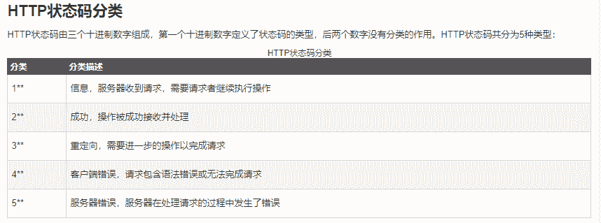

# 第四范式 2019 校园招聘后端笔试题

## 1

下列哪一个选项按照顺序包括了 OSI 模型的七个层次（   ）

正确答案: C   你的答案: 空 (错误)

```cpp
物理层 链路层 传输层 网络层 会话层 表示层 应用层
```

```cpp
物理层 链路层 会话层 网络层 传输层 表示层 应用层
```

```cpp
物理层 链路层 网络层 传输层 会话层 表示层 应用层
```

```cpp
网络层 传输层 物理层 链路层 会话层 表示层 应用层
```

本题知识点

Java 工程师 C++工程师 安卓工程师 iOS 工程师 算法工程师 PHP 工程师 第四范式 2019

讨论

[清芜](https://www.nowcoder.com/profile/959204381)

C

发表于 2020-05-20 09:02:53

* * *

[西伯利亚第一胖虎](https://www.nowcoder.com/profile/857949422)


OSI 将[计算机网络体系结构](https://baike.baidu.com/item/%E8%AE%A1%E7%AE%97%E6%9C%BA%E7%BD%91%E7%BB%9C%E4%BD%93%E7%B3%BB%E7%BB%93%E6%9E%84)(architecture）划分为以下七层：[物理层](https://baike.baidu.com/item/%E7%89%A9%E7%90%86%E5%B1%82): 将数据转换为可通过物理介质传送的[电子信号](https://baike.baidu.com/item/%E7%94%B5%E5%AD%90%E4%BF%A1%E5%8F%B7) 相当于邮局中的搬运工人。[数据链路层](https://baike.baidu.com/item/%E6%95%B0%E6%8D%AE%E9%93%BE%E8%B7%AF%E5%B1%82): 决定访问网络介质的方式。在此层将数据分帧，并处理流控制。本层指定[拓扑结构](https://baike.baidu.com/item/%E6%8B%93%E6%89%91%E7%BB%93%E6%9E%84)并提供硬件寻址，相当于邮局中的装拆箱工人。[网络层](https://baike.baidu.com/item/%E7%BD%91%E7%BB%9C%E5%B1%82/4329439): 使用权数据路由经过大型网络 相当于邮局中的排序工人。[传输层](https://baike.baidu.com/item/%E4%BC%A0%E8%BE%93%E5%B1%82): 提供终端到终端的可靠连接 相当于公司中跑邮局的送信职员。[会话层](https://baike.baidu.com/item/%E4%BC%9A%E8%AF%9D%E5%B1%82): 允许用户使用简单易记的名称建立连接 相当于公司中收寄信、写信封与拆信封的秘书。[表示层](https://baike.baidu.com/item/%E8%A1%A8%E7%A4%BA%E5%B1%82): 协商数据交换格式 相当公司中简报老板、替老板写信的助理。[应用层](https://baike.baidu.com/item/%E5%BA%94%E7%94%A8%E5%B1%82/4329788): 用户的应用程序和网络之间的接口老板。--搬运自百度

发表于 2019-03-07 08:48:52

* * *

## 2

某递归算法的递归关系式为 T( n ) = 2*T(n/2) + O( n )，那么它所对应的时间复杂度为

正确答案: B   你的答案: 空 (错误)

```cpp
O(log n)
```

```cpp
O(n*log n)
```

```cpp
O(n)
```

```cpp
O(n²)
```

本题知识点

Java 工程师 C++工程师 安卓工程师 iOS 工程师 算法工程师 PHP 工程师 第四范式 2019

讨论

[Explorer_ndh](https://www.nowcoder.com/profile/699683489)

每次向下递归，递归算法量减少一半，共 log n 复杂度。而每次递归中包含一次复杂度为 n 的算法。即 n * log n

发表于 2019-02-24 15:58:41

* * *

[天天 1024](https://www.nowcoder.com/profile/901744072)

O（n）代表时间复杂度为 n 的一个操作，二分法时间复杂度是 log n，结果就是 n*log n。

发表于 2019-03-05 10:43:56

* * *

## 3

如果计算机 A 和 B 的 IP 地址分别为 10.105.1.113 和 10.105.1.91，并使用相同的子网掩码。如果 A 和 B 需要属于同一个网络，那么不能使用以下哪个子网掩码（   ）

正确答案: D   你的答案: 空 (错误)

```cpp
255.255.255.0
```

```cpp
255.255.255.128
```

```cpp
255.255.255.192
```

```cpp
255.255.255.224
```

本题知识点

Java 工程师 C++工程师 安卓工程师 iOS 工程师 算法工程师 PHP 工程师 第四范式 2019

讨论

[心文花雨](https://www.nowcoder.com/profile/3638399)

两个 IP 地址在子网掩码的按位与的计算下所得结果相同，即表明它们共属于同一子网中，在这个题目中 A 与 B 的 IP 地址前面一样，最后的 113 和 91 不一样，113 的二进制是：0111 0001，91 的二进制是 0101 1011，D 中最后的 224 的二进制是 1110 0000，224 与 113 按位与后是 0110 0000，91 与 224 按位与后是 0100 0000，两个相与的结果不一样，所以不能使用 D 的子网掩码

发表于 2019-02-24 15:30:30

* * *

[牛客 1399951 号](https://www.nowcoder.com/profile/1399951)

如果两个 ip 地址属于同一个网络，ip 地址与子网掩码按位与后的结果相同

发表于 2019-02-25 10:18:57

* * *

## 4

有 12 枚硬币，其中 11 枚真币重量相同，有 1 枚假币重量与真币不同，现在有一架天平，最少称多少次可以保证一定能找出这枚假币（   ）

正确答案: B   你的答案: 空 (错误)

```cpp
2
```

```cpp
3
```

```cpp
4
```

```cpp
5
```

本题知识点

Java 工程师 C++工程师 安卓工程师 iOS 工程师 算法工程师 PHP 工程师 第四范式 2019

讨论

[分布式点赞](https://www.nowcoder.com/profile/575820760)

没说假币比真币重或者轻啊，就算称出不一样的两堆也不能确定在哪一堆里面吧

发表于 2019-02-23 15:09:52

* * *

[飞飞小和尚](https://www.nowcoder.com/profile/329897241)

首先将 12 个分成 3 堆，分别编号为 1~12，第一次，任意选两个推进行称重，出现的可能是三种：平衡，右倾和左倾。先说最简单的平衡——那么残次品在剩下那堆中（姑且认为是 9、10、11、12），1-8 都是真品；第二次将 1234（左）与 5 9 10 11（右）称重，也会出现三种情况，平衡，右倾左倾，如果是平衡那么残次品就是 12，那么第三次只需要将 12 和 12345678 中任意一个称重就知道是重还是轻；如果是左倾（右倾），说明残次品在 9 10 11 中 且是轻的（重的），那么第三次称重只需要从 9 10 11 中任意去两个称重，平衡话剩下的额就是残次品，如果不平衡根据第二次称重判断的轻重也能判断出那个是残次品。    如果第一次不平衡且是右倾，那么 129（左）与 456（右）称，如果平衡，说明残次品在 378 中，又因为第一次是右倾说明要么 3 重 要么 78 有个轻的（这点很重要），之后 78 称，3 就是残且重，如果 78 不平衡，哪个翘起来哪个就是残且轻，，其他情况同理，打字太复杂

发表于 2019-02-26 18:24:26

* * *

[llll2222](https://www.nowcoder.com/profile/794301871)

首先：不知道假币比正常是轻还是重，所以通过比较来确定。1、将 12 枚硬币分成 4 组，每组 3 枚：A、B、C、D。比较其中任意两组，比如 A、B 两组若平衡，则假币在 C、D 组中；否则，在这 A、B 两中。2、假如假币在 C、D 两组中，A、B 两组为真币；取出 A（或 B）与 C 比较，若平衡，假币在 D 组中；若不平衡，则假币在 C 组中。（就是只有假币才会不平衡）-------得出假币是轻还是重。3、每组是 3 枚，随机选出 2 个，若平衡，则假币在另外一个；若不平衡，根据 2 知道假币是轻还是重，判断出假币。

发表于 2019-03-09 16:59:02

* * *

## 5

 ```cpp
class A {
    int a;
    short b;
    int c;
    char d;
};
class B {
    double a;
    short b;
    int c;
    char d;
};
``` 在 32 位机器上用 gcc 编译以上代码，求 sizeof(A)，sizeof(B)分别是（）

正确答案: C   你的答案: 空 (错误)

```cpp
12 16
```

```cpp
12 12
```

```cpp
16 24
```

```cpp
16 20
```

本题知识点

C++工程师 第四范式 2019 C++ C 语言

讨论

[859378367](https://www.nowcoder.com/profile/859378367)

讲一下自己的理解吧，字节对齐的题很常见的。原则有 3 条（楼上已经说了），讲一下自己的理解：1. 结构体变量的首地址 必须 是内部最宽数据类型的倍数（虽然和做题没什么关系）2. 按顺序一个变量一个变量看，要求 current 变量的首地址 必须是自己大小的倍数。3\. 到了最后一个变量，要求整个结构体的大小的最宽数据类型的倍数。那么看一下 这道 题：A:  int  a      （4 个字节）                                                  4short b     (2 个字节，起始地址 4 是 2 的倍数，不补)        4+2
int  c         (4 个字节，4+2 不是 4 的倍数，被 2 个 )        4+2+2（补）+4
char d        (1 个字节，4+2+2+4 是 1 的倍数，不补)    4+2+2（补）+4 +1
最后补 3 个字节，让整体大小为 4 的倍数      4+2+2(补)+4+1+3（补） =16B:  double a      （8 个字节）                                                  8short b     (2 个字节，起始地址 8 是 2 的倍数，不补)        8+2
int  c         (4 个字节，8+2 不是 4 的倍数，被 2 个 )        8+2+2（补）+4
char d        (1 个字节，8+2+2+4 是 1 的倍数，不补)    8+2+2（补）+4 +1
最后补 7 个字节，让整体大小为 8 的倍数      8+2+2(补)+4+1+7（补） =24

编辑于 2019-09-17 10:13:40

* * *

[索悟](https://www.nowcoder.com/profile/2754733)

A  ----->     △△△△||△△==||△△△△||△===B ----->    △△△△△△△△||△△==(short)△△△△(int)||△=======其中△为数据存储，=为填充

发表于 2019-02-26 12:35:32

* * *

[zhongliwen](https://www.nowcoder.com/profile/2605138)

链接：[`www.nowcoder.com/questionTerminal/4bcbe5bbcb564d238d2f3d6e7dbb83ea?orderByHotValue=0&mutiTagIds=641_134&page=8&onlyReference=false`](https://www.nowcoder.com/questionTerminal/4bcbe5bbcb564d238d2f3d6e7dbb83ea?orderByHotValue=0&mutiTagIds=641_134&page=8&onlyReference=false)
来源：牛客网
按照下面 3 个条件来计算：
1) 结构体变量的首地址能够被其最宽基本类型成员的大小所整除；
备注：编译器在给结构体开辟空间时，首先找到结构体中最宽的基本数据类型，然后寻找内存地址能被该基本数据类型所整除的位置，作为结构体的首地址。将这个最宽的基本数据类型的大小作为上面介绍的对齐模数。
2) 结构体每个成员相对于结构体首地址的偏移量（offset）都是成员大小的整数倍，如有需要编译器会在成员之间加上填充字节（internal adding）；
备注:为结构体的一个成员开辟空间之前，编译器首先检查预开辟空间的首地址相对于结构体首地址的偏移是否是本成员的整数倍，若是，则存放本成员，反之，则在本成员和上一个成员之间填充一定的字节，以达到整数倍的要求，也就是将预开辟空间的首地址后移几个字节。
3) 结构体的总大小为结构体最宽基本类型成员大小的整数倍，如有需要，编译器会在最末一个成员之后加上填充字节（trailing padding）。

发表于 2019-02-24 14:28:53

* * *

## 6

n 个节点的完全二叉树，最多可以有多少层？

正确答案: B   你的答案: 空 (错误)

```cpp
n/2
```

```cpp
log(n)+1(向下取整)
```

```cpp
n-1
```

```cpp
n
```

本题知识点

Java 工程师 C++工程师 安卓工程师 iOS 工程师 算法工程师 PHP 工程师 第四范式 2019

讨论

[l 一人在山旁 l](https://www.nowcoder.com/profile/562814260)

没说是完全二叉树啊

发表于 2019-02-23 21:13:16

* * *

[C_AleXPump](https://www.nowcoder.com/profile/302181935)

我一直只插一个方向的子树不是 N 层吗

发表于 2019-02-23 12:58:31

* * *

[闪闪红星闪](https://www.nowcoder.com/profile/4440102)

这题问的是最多节点怎么会是 logn 呢,我一层一个节点的话就是 n 层,也是满足二叉树定义的. 所以这题应该有争议

发表于 2019-02-22 22:39:44

* * *

## 7

下面那几个函数是 public void method(){̷}的重载函数？（）

正确答案: A D   你的答案: 空 (错误)

```cpp
public void method( int m){}
```

```cpp
public int method(){}
```

```cpp
public void method2(){}
```

```cpp
public int method(int m，float f ){}
```

本题知识点

Java 工程师 C++工程师 安卓工程师 iOS 工程师 算法工程师 PHP 工程师 第四范式 2019

讨论

[NullPointerException`](https://www.nowcoder.com/profile/677861609)

这题本来想出多选题的出错了，仔细看题干

发表于 2019-03-04 12:25:49

* * *

[秀卫](https://www.nowcoder.com/profile/985108215)

A 首先是对的，然后 D 有点像中文逗号，其次返回值没有 return；不是很严谨。

发表于 2019-10-30 15:03:53

* * *

[横扫](https://www.nowcoder.com/profile/330000796)

D 应该可以的，与返回类型无关啊

发表于 2019-03-02 15:11:21

* * *

## 8

TCP 通信建立在连接的基础上，TCP 连接的建立要使用几次握手的过程。

正确答案: B   你的答案: 空 (错误)

```cpp
2
```

```cpp
3
```

```cpp
4
```

```cpp
5
```

本题知识点

Java 工程师 C++工程师 安卓工程师 iOS 工程师 算法工程师 PHP 工程师 第四范式 2019

讨论

[绝命响应](https://www.nowcoder.com/profile/7914521)

TCP 三次握手，四次挥手。记住就好了

发表于 2019-02-28 16:28:21

* * *

[🇸🇸🇨_ 殇丶](https://www.nowcoder.com/profile/950927593)

Tcp 三次握手协议

发表于 2019-02-27 17:49:39

* * *

## 9

**LDAP****是什么?   **

正确答案: C   你的答案: 空 (错误)

```cpp
是一种开源产品
```

```cpp
是一种编程语言
```

```cpp
是一种访问协议
```

```cpp
是一种存储数据的目录
```

本题知识点

Java 工程师 C++工程师 安卓工程师 iOS 工程师 算法工程师 PHP 工程师 第四范式 2019

讨论

[骑着一颗大芋圆](https://www.nowcoder.com/profile/790254047)

>LDAP 是轻量[目录访问协议](https://baike.baidu.com/item/%E7%9B%AE%E5%BD%95%E8%AE%BF%E9%97%AE%E5%8D%8F%E8%AE%AE)，英文全称是 Lightweight Directory Access Protocol，一般都简称为 LDAP。它是基于 X.500 标准的，但是简单多了并且可以根据需要定制。与 X.500 不同，LDAP 支持 TCP/IP，这对访问 Internet 是必须的。LDAP 的核心规范在 RFC 中都有定义，所有与 LDAP 相关的 RFC 都可以在 LDAPman RFC 网页中找到。

发表于 2019-02-22 19:50:30

* * *

[bukun](https://www.nowcoder.com/profile/514169517)

p 结尾的代表协议。。。

发表于 2020-09-14 16:51:53

* * *

## 10

设 x 为 int 型变量，则执行以下语句段后，x 的值为（）

```cpp
x=10;

x += x -= x - x;
```

正确答案: B   你的答案: 空 (错误)

```cpp
30
```

```cpp
20
```

```cpp
40
```

```cpp
10
```

本题知识点

C++工程师 第四范式 2019 C 语言

讨论

[令 U=5🐳](https://www.nowcoder.com/profile/645121134)

x+=x-=x-x  c++primer 中提及过+= -= 是一个操作 x(+=)x(-=)x-x;从右往左看 x(+=)x(-=)0x+=x2x = 20

发表于 2019-02-27 23:22:16

* * *

[Duosl](https://www.nowcoder.com/profile/2561997)

先从前往后分析：
x+=___  --> x = x + ___x-=___  --> x = x - ___------------------先计算最后的这个表达式：x-x = 0-----------------开始从后往前计算：x = x - 0 = 10        (x-=___ )x = x + 10 = 20     (x+=___ )使用选 B

编辑于 2019-02-24 15:31:13

* * *

## 11

Linux namespace 不包含:

正确答案: D   你的答案: 空 (错误)

```cpp
PID
```

```cpp
Network
```

```cpp
User
```

```cpp
Cgroup
```

本题知识点

Java 工程师 C++工程师 安卓工程师 iOS 工程师 算法工程师 PHP 工程师 第四范式 2019

讨论

[locy](https://www.nowcoder.com/profile/6270749)

所以这个题目是不是有问题？

发表于 2019-02-23 15:58:42

* * *

[小孩子不要喝酒](https://www.nowcoder.com/profile/599889966)

https://blog.csdn.net/qq_42564846/article/details/81213464Cgroup 还没得到认可

发表于 2019-03-03 21:54:23

* * *

## 12

在 python 中, 进行下列算式时, 可能为假的是:

正确答案: C   你的答案: 空 (错误)

```cpp
true == true
```

```cpp
0 == 0
```

```cpp
3.2 + 3.2 == 6.4
```

```cpp
1 + 1 == 2
```

本题知识点

Java 工程师 C++工程师 安卓工程师 iOS 工程师 算法工程师 PHP 工程师 第四范式 2019

讨论

[影尘](https://www.nowcoder.com/profile/5081942)

为什么不是 A Python boolean 的值的关键字不是 True? true == true 它应该是变量

发表于 2019-02-25 09:24:14

* * *

[dawnChenI](https://www.nowcoder.com/profile/599498957)

浮点数的比较要判断近似值。

发表于 2019-02-26 15:31:44

* * *

[会有猫的 201808201540400](https://www.nowcoder.com/profile/719868403)

这道题是想说 python 的浮点型计算会出现偏差吧。

发表于 2019-03-06 16:41:58

* * *

## 13

下列不能被压缩的内容是:

正确答案: B   你的答案: 空 (错误)

```cpp
高清图片
```

```cpp
一次性密码本
```

```cpp
原版操作系统镜像
```

```cpp
程序源代码
```

本题知识点

Java 工程师 C++工程师 安卓工程师 iOS 工程师 算法工程师 PHP 工程师 第四范式 2019

讨论

[summerrr](https://www.nowcoder.com/profile/5030955)

一次性密码本里的字母，与被加密文件的字母给依序按某个事先约定一一对应，所以不能被压缩。

发表于 2019-03-01 23:41:24

* * *

## 14

32 位操作系统能识别的最大内存上限是:

正确答案: C   你的答案: 空 (错误)

```cpp
2G
```

```cpp
3G
```

```cpp
4G
```

```cpp
64g
```

本题知识点

Java 工程师 C++工程师 安卓工程师 iOS 工程师 算法工程师 PHP 工程师 第四范式 2019

讨论

[zhongliwen](https://www.nowcoder.com/profile/2605138)

32 位最大识别 4G：2 的 32 次方 64 位最大识别 128G

发表于 2019-02-24 14:42:34

* * *

[水里泡着感觉真差](https://www.nowcoder.com/profile/9146044)

32 位总线可以映射到的内存块有 2³² 块  ==  4G ； B 是啥意思呢？独立内存块的单位就是 B，规定了存储器的基本单位是 B ，字节，Byte; (再把基本单位细化，就是 8bit，8 位为一个单位)因此答案是 4G

发表于 2019-03-06 15:20:26

* * *

## 15

下面的排序算法中，初始数据集的排列顺序对算法的性能无影响的是:

正确答案: B   你的答案: 空 (错误)

```cpp
插入排序
```

```cpp
堆排序
```

```cpp
冒泡排序
```

```cpp
快速排序
```

本题知识点

Java 工程师 C++工程师 安卓工程师 iOS 工程师 算法工程师 PHP 工程师 第四范式 2019

讨论

[clear_rain](https://www.nowcoder.com/profile/221424248)

1、算法复杂度与初始状态无关的有：选择排序、堆排序、归并排序、基数排序。

2、元素总比较次数与初始状态无关的有：选择排序、基数排序。

3、元素总移动次数与初始状态无关的有：归并排序、基数排序。

发表于 2019-02-27 09:20:31

* * *

[酸酸酸酸菜菜菜菜菜菜菜菜鱼鱼鱼鱼](https://www.nowcoder.com/profile/8340776)

堆排序拆了重建，所以就和初始无关了

发表于 2019-02-26 20:38:09

* * *

[Peter333](https://www.nowcoder.com/profile/339184073)

说的是性能，不是次数

发表于 2019-03-07 15:21:58

* * *

## 16

到商店里买 200 的商品返还 100 的优惠券（可以在本商店代替现金）。如果使用优惠券买东西不能获得新的优惠券，那么买 200 返 100 优惠券，实际上省多少？

正确答案: B   你的答案: 空 (错误)

```cpp
50%
```

```cpp
33%
```

```cpp
25%
```

```cpp
66%
```

本题知识点

Java 工程师 C++工程师 安卓工程师 iOS 工程师 算法工程师 PHP 工程师 第四范式 2019

讨论

[Squirrel-Chen](https://www.nowcoder.com/profile/474217712)

哎哟喂！特么都题都没看清楚！不是花的！而是省的！所以应该是 100/300

发表于 2019-03-06 14:44:44

* * *

[Explorer_ndh](https://www.nowcoder.com/profile/699683489)

买三百的东西 只花 200，省 100，即省 33%

发表于 2019-02-24 16:04:42

* * *

[Donishi](https://www.nowcoder.com/profile/943969900)

看清题目，不是实际花多少，是省多少。100/300 不是 200/300

发表于 2019-02-25 23:25:27

* * *

## 17

一个栈的输入序列为 1 2 3 4 5，则下列序列中不可能是该栈输出序列的是

正确答案: A   你的答案: 空 (错误)

```cpp
5 4 1 3 2
```

```cpp
2 3 4 1 5
```

```cpp
1 5 4 3 2
```

```cpp
2 3 1 4 5
```

本题知识点

Java 工程师 C++工程师 安卓工程师 iOS 工程师 算法工程师 PHP 工程师 第四范式 2019

讨论

[制冷少女](https://www.nowcoder.com/profile/5053050)

1: 2 3 4 1 5  进 12 出 2 进 3 出 3 进 4 出 4 出 1 进 5 出 52: 1 5 4 3 2 进 1 出 1 进 2345 出 5 出 4323: 2 3 1 4 5 进 12 出 2 进 3 出 3 出 1 进 4 出 4 进 5 出 54: 5 4 1 3 2 说明进 12345 出 5 其它没出来，应该依次是 4321

发表于 2019-03-09 21:48:25

* * *

[🇸🇸🇨_ 殇丶](https://www.nowcoder.com/profile/950927593)

栈先进后出

发表于 2019-02-27 17:55:56

* * *

## 18

进程间通讯方式描述正确且效率最高的是

正确答案: A   你的答案: 空 (错误)

```cpp
共享内存
```

```cpp
管道
```

```cpp
Socket
```

```cpp
文件
```

本题知识点

Java 工程师 C++工程师 安卓工程师 iOS 工程师 算法工程师 PHP 工程师 第四范式 2019

讨论

[牛客 9983167 号](https://www.nowcoder.com/profile/9983167)

共享内存( shared memory ) ：共享内存就是映射一段能被其他进程所访问的内存，这段共享内存由一个进程创建，但多个进程都可以访问。共享内存是最快的 IPC 方式，它是针对其他进程间通信方式运行效率低而专门设计的。它往往与其他通信机制，如信号两，配合使用，来实现进程间的同步和通信。

发表于 2019-03-01 11:19:49

* * *

## 19

已知一棵二叉树，如果先序遍历的节点顺序是： SDCEFGHB ，中序遍历是： CDFEGHSB ，则后序遍历结果为：

正确答案: D   你的答案: 空 (错误)

```cpp
CFHGEBDS
```

```cpp
CDFEGHBS
```

```cpp
FGHCDEBS
```

```cpp
CFHGEDBS
```

本题知识点

Java 工程师 C++工程师 安卓工程师 iOS 工程师 算法工程师 PHP 工程师 第四范式 C++工程师 Java 工程师 第四范式 2019

讨论

[春秋 sama](https://www.nowcoder.com/profile/5563796)


发表于 2019-03-01 19:46:40

* * *

[明木水 MJ](https://www.nowcoder.com/profile/667736786)

先序:sdcefghb 中序:cdfeghsb 由此可知 跟是 s，左子树的元素包括 cdfegh 右子树的元素为 b ，以此类推。

编辑于 2019-02-26 14:39:25

* * *

[JiaojDoraemon](https://www.nowcoder.com/profile/663879629)

二叉树，以根为例，根在那就是什么顺序，根在第一位，就是根左右，根在中间就是左根右，根在最后，就是左右根，所有的都是除了根以外从左往右看，一步一步来:1、看先序：SDCEFGHB,所以确定了根 S,根据中序，左根右：确定 CDFEGH 在 S 的左边，B 在右边 2、看先序：顺序写出 DCEFGH，确定 D 是根，再根据中序，确定 C 在 D 的左边，FEGH 在右边，从而确定先序，顺序为：EFGH3、根据第二步，确定先序：E 是根，中序：F 在 E 的左边，GH 在右边，从而确定先序：GH4、先序根为：G，由此可得 H 在 G 的右边

发表于 2019-09-01 21:38:16

* * *

## 20

Unix 系统中，哪些可以不能用于进程间的通信？

正确答案: C   你的答案: 空 (错误)

```cpp
Socket
```

```cpp
共享内存
```

```cpp
磁盘文件
```

```cpp
信号量
```

本题知识点

Java 工程师 C++工程师 安卓工程师 iOS 工程师 算法工程师 PHP 工程师 第四范式 2019

讨论

[森海阿斯卡](https://www.nowcoder.com/profile/495849261)

**可以用来通信的有：**

1.  管道（Pipe）：管道可用于具有亲缘关系进程间的通信，允许一个进程和另一个与它有共同祖先的进程之间进行通信。
2.  [命名管道](https://www.baidu.com/s?wd=%E5%91%BD%E5%90%8D%E7%AE%A1%E9%81%93&tn=SE_PcZhidaonwhc_ngpagmjz&rsv_dl=gh_pc_zhidao)（named pipe）：[命名管道](https://www.baidu.com/s?wd=%E5%91%BD%E5%90%8D%E7%AE%A1%E9%81%93&tn=SE_PcZhidaonwhc_ngpagmjz&rsv_dl=gh_pc_zhidao)克服了管道没有名字的限制，因此，除具有管道所具有的功能外，它还允许无亲缘关系进程间的通信。[命名管道](https://www.baidu.com/s?wd=%E5%91%BD%E5%90%8D%E7%AE%A1%E9%81%93&tn=SE_PcZhidaonwhc_ngpagmjz&rsv_dl=gh_pc_zhidao)在文件系统中有对应的文件名。命名管道通过命令 mkfifo 或系统调用 mkfifo 来创建。
3.  信号（Signal）：信号是比较复杂的通信方式，用于通知接受进程有某种事件发生，除了用于进程间通信外，进程还可以发送信号给进程本身；linux 除了支持 Unix 早期信号语义函数 sigal 外，还支持语义符合 Posix.1 标准的信号函数 sigaction（实际上，该函数是基于 BSD 的，BSD 为了实现可靠信号机制，又能够统一对外接口，用 sigaction 函数重新实现了 signal 函数）。
4.  消息队列：消息队列是消息的链接表，包括 Posix 消息队列 system V 消息队列。有足够权限的进程可以向队列中添加消息，被赋予读权限的进程则可以读走队列中的消息。消息队列克服了信号承载信息量少，管道只能承载无格式字节流以及缓冲区大小受限等缺
5.  共享内存：使得多个进程可以访问同一块内存空间，是最快的可用 IPC 形式。是针对其他通信机制运行效率较低而设计的。往往与其它通信机制，如信号量结合使用，来达到进程间的同步及互斥。
6.  内存映射（mapped memory）：内存映射允许任何多个进程间通信，每一个使用该机制的进程通过把一个共享的文件映射到自己的进程地址空间来实现它。
7.  信号量（semaphore）：主要作为进程间以及同一进程不同线程之间的同步手段。
8.  套接口（Socket）：更为一般的进程间通信机制，可用于不同机器之间的进程间通信。起初是由 Unix 系统的 BSD 分支开发出来的，但现在一般可以移植到其它类 Unix 系统上：Linux 和 System V 的变种都支持套接字。

摘自：[`zhidao.baidu.com/question/2137908356596481948.html`](https://zhidao.baidu.com/question/2137908356596481948.html)

编辑于 2019-03-01 14:48:52

* * *

[l 一人在山旁 l](https://www.nowcoder.com/profile/562814260)

Linux 下文件可以用于进程间通信，我试过，难道 UNIX 不可以吗

发表于 2019-02-23 21:19:06

* * *

[tangenta](https://www.nowcoder.com/profile/536496458)

磁盘文件怎么不能用于进程间通信…？

发表于 2019-02-23 17:00:39

* * *

## 21

提供 Java 存取数据库能力的包是

正确答案: A   你的答案: 空 (错误)

```cpp
java.sql
```

```cpp
java.awt
```

```cpp
java.lang
```

```cpp
java.swing
```

本题知识点

Java 工程师 C++工程师 安卓工程师 iOS 工程师 算法工程师 PHP 工程师 第四范式 C++工程师 Java 工程师 第四范式 2019

讨论

[年迈的小学生](https://www.nowcoder.com/profile/2203040)

划水硬答一下.. 英语题，结构化查询语言（Structured Query Language）

发表于 2019-08-12 12:15:00

* * *

[132201807152243365](https://www.nowcoder.com/profile/421402423)

这题没人回答，划个水

发表于 2019-03-09 18:52:55

* * *

## 22

以下关于主键和唯一索引的区别错误的是？

正确答案: C   你的答案: 空 (错误)

```cpp
主键：默认将是聚簇索引 唯一索引： 默认将是非聚簇索引
```

```cpp
主键不能空，唯一索引可以为空
```

```cpp
主键顺序为数据的物理顺序
```

```cpp
主键每个表只能有一个，唯一索引可以多个
```

本题知识点

Java 工程师 C++工程师 安卓工程师 iOS 工程师 算法工程师 PHP 工程师 第四范式 2019

讨论

[Yourcat](https://www.nowcoder.com/profile/935996506)

1.主键为一种约束，唯一索引为一种索引，本质上就不同；

2.主键创建后一定包含唯一性索引，而唯一索引不一定就是主键；

3.主键不允许空值，唯一索引可以为空；

4.主键可以被其他表引用，而唯一索引不可以；

5.一个表最多只能创建一个主键，而可以创建多个唯一索引；

6.主键和索引都是键，主键是逻辑键，索引为物理键，即主键不实际存在。
--------------------- 
作者：IT 女的自我总结 
来源：CSDN 
原文：[`blog.csdn.net/it_dawdler/article/details/79407188`](https://blog.csdn.net/it_dawdler/article/details/79407188) 
版权声明：本文为博主原创文章，转载请附上博文链接！

发表于 2019-03-04 14:28:13

* * *

[小菜鸡 jjj](https://www.nowcoder.com/profile/3832410)

？b 为啥错了，求解释

发表于 2019-02-23 00:33:48

* * *

[纰ф按婢滃ぉ](https://www.nowcoder.com/profile/626524704)

这个题目的答案错了，应该选 C.索引才是物理顺序键

发表于 2019-03-05 15:29:53

* * *

## 23

以下描述中，对抽象类和接口的区别描述正确的是

正确答案: A   你的答案: 空 (错误)

```cpp
抽象类可以有构造方法，接口不能有构造方法；
```

```cpp
抽象类可以包含静态方法，接口中不包含静态方法
```

```cpp
一个类可以继承多个抽象类，但只能实现一个接口
```

```cpp
抽象类中不可以包含静态方法，接口中可以包含静态方法；
```

本题知识点

Java 工程师 C++工程师 安卓工程师 iOS 工程师 算法工程师 PHP 工程师 第四范式 2019

讨论

[aawty](https://www.nowcoder.com/profile/460326845)

```cpp
  Java 抽象类中不能有静态的抽象方法。  原因：抽象类是不能实例化的，即不能被分配内存;而 static 修饰的方法在类实例化之前就已经别分配了内存，这样一来矛盾就出现了：抽象类不能被分配内存，而 static 方法必须被分配内存。所以抽象类中不能有静态的抽象方法。  另外，定义抽象方法的目的是重写此方法，但如果定义成静态方法就不能被重写。
```

发表于 2019-02-28 12:22:33

* * *

[彬爷](https://www.nowcoder.com/profile/2614469)

[`www.importnew.com/12399.html`](http://www.importnew.com/12399.html)

发表于 2019-03-05 21:46:25

* * *

[小菜鸡 jjj](https://www.nowcoder.com/profile/3832410)

b 也对啊

发表于 2019-02-23 00:37:44

* * *

## 24

有关线程的哪些叙述是错的

正确答案: A   你的答案: 空 (错误)

```cpp
一旦一个线程被创建，它就立即开始运行。
```

```cpp
使用 start()方法可以使一个线程成为可运行的，但是它不一定立即开始运行。
```

```cpp
当一个线程因为抢先机制而停止运行，它被放在可运行队列的前面。
```

```cpp
一个线程可能因为不同的原因停止并进入就绪状态。
```

本题知识点

Java 工程师 C++工程师 安卓工程师 iOS 工程师 算法工程师 PHP 工程师 第四范式 2019

讨论

[水里泡着感觉真差](https://www.nowcoder.com/profile/9146044)

C 选项有问题，哪里说了能放在队列前面？？？ C 不也是错的吗

发表于 2019-03-06 15:37:12

* * *

[dawnChenI](https://www.nowcoder.com/profile/599498957)

一个线程被创建，会进入被调度的队列，等待被执行。

发表于 2019-02-26 15:52:35

* * *

## 25

以下方式无法保证线程安全的是

正确答案: B   你的答案: 空 (错误)

```cpp
在使用共享变量前加互斥锁
```

```cpp
将共享变量定义为 static
```

```cpp
使用 thread_local 修饰变量
```

```cpp
使用 std:atomic 修饰变量
```

本题知识点

Java 工程师 C++工程师 安卓工程师 iOS 工程师 算法工程师 PHP 工程师 第四范式 2019

讨论

[HeiHeiHei](https://www.nowcoder.com/profile/167094)

*   ```cpp
    将共享变量定义为 static

    ```

    线程安全的唯一保证是加锁,或者变量私有化. A 加锁 C 私有化(不共享) D 不知道

C Static 修饰后,变量多线程共享.肯定出问题

发表于 2019-03-04 17:06:04

* * *

[离儿 201902152232167](https://www.nowcoder.com/profile/571459013)

atomic 是读写安全，但不一定保证线程安全

发表于 2019-03-04 11:49:38

* * *

## 26

对文件权限信息 drwxr-xr-x 描述不正确的是

正确答案: A   你的答案: 空 (错误)

```cpp
文件一个文件
```

```cpp
文件能够被读
```

```cpp
文件可以被执行
```

```cpp
文件能够被写
```

本题知识点

Java 工程师 C++工程师 安卓工程师 iOS 工程师 算法工程师 PHP 工程师 第四范式 2019

讨论

[超级大妖怪](https://www.nowcoder.com/profile/438673189)

0～9 位符号说明： 第 0 位：- 表示普通文件，d 表示目录。 1～3 位：表示文件所有者权限，r 可读，w 可写，x 可执行，-表示无此权限；比如：r-x 表示可读不可写可执行（3 个字母顺序是固定的，哪个位置上是 - 就说明无此权限）。 4～6 位：表示文件所在组成员权限，内容与 1～3 位一致。 7～9 位：表示其他组成员权限，内容与 1～3 位一致。

发表于 2019-02-28 01:03:20

* * *

[莫原宥](https://www.nowcoder.com/profile/238064471)


发表于 2019-03-04 19:32:17

* * *

[夜夙](https://www.nowcoder.com/profile/260730535)

这道题很明显有问题啊，D 选项文件能够被写？文件能够被谁写？是文件的所有者？还是同组的用户？还是其他用户？没有说明。而且我觉得 A 选项也有问题，d 代表目录文件，也可以算是文件啊。

发表于 2019-04-06 12:03:19

* * *

## 27

以下 http 状态码表示重定向的是

正确答案: D   你的答案: 空 (错误)

```cpp
401
```

```cpp
500
```

```cpp
200
```

```cpp
302
```

本题知识点

Java 工程师 C++工程师 安卓工程师 iOS 工程师 算法工程师 PHP 工程师 第四范式 2019

讨论

[朕蹲厕唱忐忑](https://www.nowcoder.com/profile/945749079)



发表于 2019-02-24 17:12:12

* * *

[寂静于暖](https://www.nowcoder.com/profile/6461901)

401（未授权）：请求要求身份认证 500：服务器内部错误 200（成功）：服务器已成功处理了请求 302（临时重定向）：服务器目前从不同位置的网页响应请求，但请求者应继续使用原有位置来进行以后的请求。

发表于 2019-03-07 10:23:49

* * *

## 28

下列叙述正确的是

正确答案: C   你的答案: 空 (错误)

```cpp
算法的执行效率与数据的存储结构无关
```

```cpp
算法的空间复杂度是指算法程序中指令（或语句）的条数
```

```cpp
算法的有穷性是指算法必须能在执行有限个步骤之后终止
```

```cpp
算法的时间复杂度是指执行算法程序所需要的时间
```

本题知识点

Java 工程师 C++工程师 安卓工程师 iOS 工程师 算法工程师 PHP 工程师 第四范式 C++工程师 Java 工程师 第四范式 2019

## 29

下列那个同步元语适合于对运行时间较长的任务的保护

正确答案: D   你的答案: 空 (错误)

```cpp
原子操作 (Atomic)
```

```cpp
互斥锁 (Mutex)
```

```cpp
自旋锁 (SpinLock)
```

```cpp
信号量 (Semaphore)
```

本题知识点

Java 工程师 C++工程师 安卓工程师 iOS 工程师 算法工程师 PHP 工程师 第四范式 2019

讨论

[宋小慢](https://www.nowcoder.com/profile/70031567)

自旋锁最多只能被一个可执行线程持有（读写自旋锁除外）。自旋锁不会引起调用者睡眠，如果一个执行线程试图获得一个已经被持有的自旋锁，那么线程就会一直进行忙循环，一直等待下去（一直占用 CPU ），在那里看是否该自旋锁的保持者已经释放了锁， " 自旋 " 一词就是因此而得名。

由于自旋锁使用者一般保持锁时间非常短，因此选择自旋而不是睡眠是非常必要的，自旋锁的效率远高于互斥锁。

信号量和读写信号量适合于保持时间较长的情况，它们会导致调用者睡眠，因此只能在进程上下文使用（因为中断的上下文不允许休眠）（ _trylock 的变种能够在中断上下文使用）；而自旋锁 适合于保持时间非常短的情况，因为一个被争用的自旋锁使得请求它的线程在等待重新可用时自旋，特别浪费处理时间，这是自旋锁的要害之处，所以自旋锁不应该 被长时间持有。在实际应用中自旋锁代码只有几行，而持有自旋锁的时间也一般不会超过两次上下方切换，因线程一旦要进行切换，就至少花费切出切入两次，自旋 锁的占用时间如果远远长于两次上下文切换，我们就可以让线程睡眠，这就失去了设计自旋锁的意义。

如果被保护的共享资源只在进程上下文访问，使用信号量保护该共享资源非常合适，如果对共享资源的访问时间非常短，自旋锁也可以。但是如果被保护的共享资源需要在中断上下文访问（包括底半部即中断处理句柄和顶半部即软中断），就必须使用自旋锁。
--------------------- 
作者：xu_guo 
来源：CSDN 
原文：[`blog.csdn.net/xu_guo/article/details/6072823`](https://blog.csdn.net/xu_guo/article/details/6072823) 
写的很好

发表于 2019-03-04 16:02:37

* * *

[一只特立独行的弱🐔](https://www.nowcoder.com/profile/354035605)

为什么不用互斥锁？

发表于 2019-03-11 14:27:03

* * *

[虔慕](https://www.nowcoder.com/profile/667778840)

Lnux 中的信号量是一种睡眠锁。如果有一个任务试图获得一个已被持有的信号量时，信号量会将其推入等待队列，然后让其睡眠。这时处理器获得自由去执行其它代码。当持有信号量的进程将信号量释放后，在等待队列中的一个任务将被唤醒，从而便可以获得这个信号量。

信号量的睡眠特性，使得信号量适用于锁会被长时间持有的情况；只能在进程上下文中使用，因为中断上下文中是不能被调度的；另外当代码持有信号量时，不可以再持有自旋锁。
---------------------
作者：xu_guo
来源：CSDN
原文：[`blog.csdn.net/xu_guo/article/details/6072823`](https://blog.csdn.net/xu_guo/article/details/6072823) 
版权声明：本文为博主原创文章，转载请附上博文链接！

发表于 2019-03-09 18:46:15

* * *

## 30

国内从 14 年起各大型网站纷纷迁移到 HTTPS 安全协议，从而一定程度上避免了火绵羊为代表的互联网流量安全危机，下列哪一项不是使得这件事情成功的原因

正确答案: B   你的答案: 空 (错误)

```cpp
使用了非对称加密技术
```

```cpp
与标准差异的浏览器份额下降
```

```cpp
确立了受信机构，和信任链机制
```

```cpp
终端设备性能提升
```

本题知识点

Java 工程师 C++工程师 安卓工程师 iOS 工程师 算法工程师 PHP 工程师 第四范式 2019

讨论

[MYFIRE](https://www.nowcoder.com/profile/845940874)

ACD 三项对数据都做出了保护机智，只有 b 提到了浏览器的差异性，浏览器本身就是不安全的，这是浏览器的弊端，顾选 b

编辑于 2019-03-11 01:03:24

* * *

[繁花千树](https://www.nowcoder.com/profile/71330673)

说的像 https 客户端需要好强的性能一样。

发表于 2020-04-03 14:41:27

* * *

[我只要亿个 Offer](https://www.nowcoder.com/profile/936216030)

这题要考察的是阅读理解水平🤣

发表于 2019-09-18 15:38:43

* * *

## 31

给定一个字符串（数字或大小写字母）, 找出最长的对称的子串（如有多个，输出任意一个）。例如：输入：“abbaad”输出：“abba”

本题知识点

Java 工程师 C++工程师 iOS 工程师 安卓工程师 前端工程师 算法工程师 PHP 工程师 第四范式 字符串 *模拟 2019* *讨论

[晚、安](https://www.nowcoder.com/profile/1482917)

function reverseStr(str) {
    return str.split("").reverse().join("");
}

function findStr(str) {
    var maxStrings = "";
    if(str.length == 1 || str == reverseStr(str)) {
        return str;
    }
    for(var i = 0; i < str.length; i++) {
        for(j = str.length; j > i; j--) {
            var subStrings = str.substring(i, j);
            if(subStrings == reverseStr(subStrings)) {
                if(subStrings.length > maxStrings.length) {
                    maxStrings = subStrings;
                }
            }
        }
    }
    return maxStrings;
}
console.log(findStr(readline()))使用 js 实现的，其中 readline()可以读取输入的字符串，然后每次不断获取子字符串，如果字符串和它的反转字符串一样，并且比当前所得到的最大对称字符串一样，则进行保存

发表于 2019-02-23 21:03:28

* * *

[ReklawPeels](https://www.nowcoder.com/profile/522976)

这个题是 LeetCode 的第 5 题 最长回文子串，算是第二次遇到，但是我写的还是比人家的答案长得多，乱得多。
**思路是：先确定中心再向两边延伸，回文串有两种：**
**①中心的两个字符是一样的，如"abccba"；**
**②中心只有一个字符，如"abcba"。**

**所以针对两种情况要分别来求：**
**①针对第一种，每个字符都可以是中心；**
**②针对第二种，必须先找到"cc"，即通过 s[i] == s[i - 1]这样的判断找到两个 c 中的某一个，然后向两边延伸着找。**

**下面是 LeetCode 一个写的比较简洁的答案：**

```cpp
import java.util.*;
public class Main {
    public static void main(String[] args){
        Scanner in = new Scanner(System.in);
        String input = in.nextLine();
        System.out.println(solve(input));
    }

    public String solve(String s) {
        if (s == null || s.length() < 1) return "";
        int start = 0, end = 0;
        for (int i = 0; i < s.length(); i++) {
            int len1 = expandAroundCenter(s, i, i);
            int len2 = expandAroundCenter(s, i, i + 1);
            int len = Math.max(len1, len2);
            if (len > end - start) {
                start = i - (len - 1) / 2;
                end = i + len / 2;
            }
        }
        return s.substring(start, end + 1);
    }

    private int expandAroundCenter(String s, int left, int right) {
        while (left >= 0 && right < s.length() && s.charAt(left) == s.charAt(right)) {
            left--;
            right++;
        }
        return right - left - 1;
    }
}
```

编辑于 2019-03-06 16:04:16

* * *

[keashem](https://www.nowcoder.com/profile/597698287)

所有的答案里面居然没有用 O(n)复杂度的 manacher 算法。。。都是 O(n²)的暴力解法。。下面我提供一个 AC 了的 manacher 方法，供大家参考，如果是笔试 O(n²)的复杂度能 AC 那也 ok，如果是面试，让你提供一个 O(n)复杂度的找最长回文子串的算法，希望能想到是用 manacher 算法

```cpp
import java.util.Scanner;
import static java.lang.System.in;
public class Main {
    public static void main(String[] args) {
        Scanner sc = new Scanner(in);
        String str = sc.nextLine();
        System.out.println(manacherProcess(str));
    }

    public static char[] manacherStr(String str) {
        char[] arr = str.toCharArray();
        char[] manArr = new char[arr.length * 2 + 1];
        for (int i = 0, j = 0; i < manArr.length; i++) {
            manArr[i] = (i & 1) == 0 ? '#' : arr[j++];
        }
        return manArr;
    }

    public static String manacherProcess(String str) {
        char[] manArr = manacherStr(str);
        int[] pArr = new int[manArr.length];
        int index = -1;
        int pR = -1;
        int maxVal = Integer.MIN_VALUE;
        int maxIndex = -1;
        for (int i = 0; i < pArr.length; i++) {
            pArr[i] = pR > i ? Math.min(pArr[2 * index - i], pR - i) : 1;
            while (i + pArr[i] < manArr.length && i - pArr[i] > -1) {
                if (manArr[i + pArr[i]] == manArr[i - pArr[i]]) {
                    pArr[i]++;
                } else {
                    break;
                }
            }
            if (i + pArr[i] > pR) {
                pR = i + pArr[i];
                index = i;
            }
            if (pArr[i] > maxVal) {
                maxVal = pArr[i];
                maxIndex = i;
            }
        }
        String ret = "";
        for (int i = maxIndex - maxVal + 1; i < maxIndex + maxVal; i++) {
            ret += (i & 1) == 0 ? "" : manArr[i];
        }
        return ret;
    }
}
```

发表于 2019-08-08 12:35:21

* * *

## 32

给定两个数字（0-9）字符串（长度不限）求它们的乘积。

本题知识点

Java 工程师 C++工程师 iOS 工程师 安卓工程师 前端工程师 算法工程师 PHP 工程师 第四范式 数组 模拟 数学 2019

讨论

[C_AleXPump](https://www.nowcoder.com/profile/302181935)

```cpp
print  (int(input())*int(input()))
```

python 不需要解释

发表于 2019-02-23 12:53:12

* * *

[谁的电脑](https://www.nowcoder.com/profile/743368)

```cpp
import java.math.BigInteger;
import java.util.Scanner;

public class Main {
    public static void main(String[] args) {
        Scanner scanner = new Scanner(System.in);
        BigInteger bi1 = new BigInteger(scanner.next());
        BigInteger bi2 = new BigInteger(scanner.next());
        System.out.println(bi1.multiply(bi2));
    }
}
```

发表于 2019-07-08 11:13:43

* * *

[白色纯度](https://www.nowcoder.com/profile/485984577)

恕我直言，取巧做题的基本丧失了做题目的意义。对于每一道题目，我们要尽可能主动收获一些东西。下面 mul 代码模拟了乘法的整个过程，只要数字 num2 不超出内存，就完全行得通。

```cpp
def mul(num1,num2):
    temp = [i*num1 for i in num2]
    res = ''
    i = 1
    number = temp[0]
    while i <len(temp):
        res += str(number%10)
        number //= 10
        number += temp[i]
        i += 1
    res += str(number)[::-1]
    return res[::-1]
if __name__=='__main__':
    num1 = int(input())
    str2 = [int(i) for i in input()][::-1]
    print(mul(num1,str2))

```

编辑于 2019-07-25 21:19:48

* * **