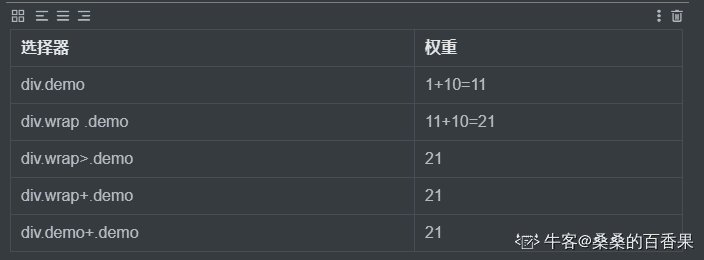
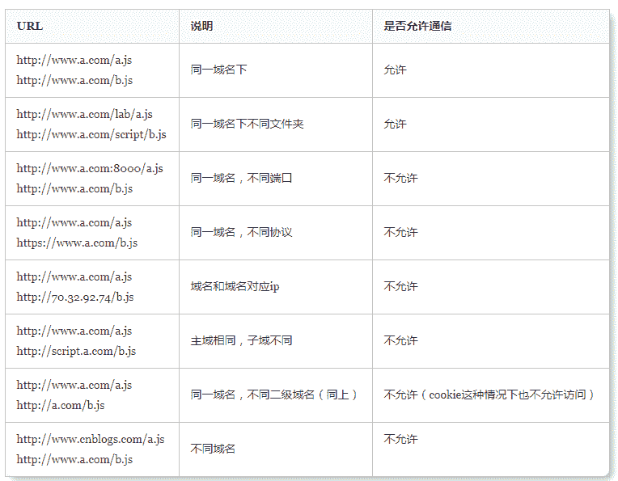
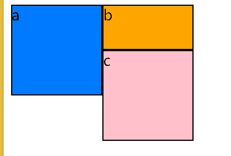

# 第四范式 2019 校园招聘前端笔试题

## 1

以下不属于 JavaScript 基本数据类型的是：

正确答案: D   你的答案: 空 (错误)

```cpp
Boolean
```

```cpp
undefined
```

```cpp
Symbol
```

```cpp
Array
```

本题知识点

前端工程师 第四范式 前端工程师 第四范式 2019

讨论

[未忆 wy](https://www.nowcoder.com/profile/582478779)

JavaScript 中有 5 中数据类型（也称为基本数据类型）：Undefined、Null、Boolean、Number 和 String，还有一种复杂数据类型——object, object 本质是由一组键值对组成的，object、function 和 array 等对象都是引用型数据。

发表于 2019-02-24 17:41:19

* * *

[zzbroken](https://www.nowcoder.com/profile/6108887)

JavaScript 基本数据类型：null undefined number string 还有 es6 的 symbol 引用类型:Object,Array,Function

发表于 2019-02-23 21:26:37

* * *

[鋆末末](https://www.nowcoder.com/profile/781959989)

基本数据类型：undefined、null、number、string 引用数据类型：object、arry、function

发表于 2019-02-25 16:55:58

* * *

## 2

在 W3C 标准盒模型中，默认情况下块元素的总宽度为：

正确答案: A   你的答案: 空 (错误)

```cpp
content
```

```cpp
content+2*padding
```

```cpp
content+2*padding+2*border
```

```cpp
content+2*padding+2*border+2*margin
```

本题知识点

前端工程师 第四范式 2019 HTML CSS

讨论

[imp201806121930553](https://www.nowcoder.com/profile/739777763)

感觉这题有点文字游戏嫌疑

发表于 2019-03-08 01:10:31

* * *

[盯着面筋唱征服](https://www.nowcoder.com/profile/9124619)

标准盒子模型 ＝ margin + border + padding + width （width = content ）

IE 盒子模型 ＝ margin + width（width = border + padding + content ）

发表于 2019-03-02 10:37:58

* * *

[甯牚](https://www.nowcoder.com/profile/775645983)

盒子的总宽度选 D 元素的总宽度是 A

发表于 2020-08-07 23:30:37

* * *

## 3

关于状态码 304，描述正确的是:

正确答案: C   你的答案: 空 (错误)

```cpp
Unauthorized
```

```cpp
Gateway Timeout
```

```cpp
Not Modified
```

```cpp
Accepted
```

本题知识点

前端工程师 第四范式 2019

讨论

[宿命作借口](https://www.nowcoder.com/profile/264237669)

304 说明无需再次传输请求的内容，也就是说可以使用缓存的内容。这通常是在一些安全的方法（safe），例如 GET 或 HEAD 或在请求中附带了头部信息： If-None-Match 或 If-Modified-Since。

发表于 2019-02-27 01:53:43

* * *

[alaa](https://www.nowcoder.com/profile/293830529)

状态码

304:客户端已经执行了 get，但文件未变化（Not Modified）

204: 服务器成功处理，但未返回内容（No Content）

401: 请求要求用户的身份认证（Unauthorized）

505: 充当网关或***的服务器，未及时从远端服务器获取请求（GateWay Time-out）

202: 已接受（Accepted）

发表于 2019-03-07 10:15:34

* * *

[菏妹](https://www.nowcoder.com/profile/8181085)

304:客户端已经执行了 get，但文件未变化

发表于 2019-02-24 15:10:24

* * *

## 4

下列不属于行内元素的是：

正确答案: C   你的答案: 空 (错误)

```cpp
<span />
```

```cpp
<i />
```

```cpp
<td />
```

```cpp
<b />
```

本题知识点

前端工程师 第四范式 2019 HTML

讨论

[鋆末末](https://www.nowcoder.com/profile/781959989)

[HTML 哪些是块级元素，哪些是行内元素、](https://www.cnblogs.com/yxm440/p/7667539.html)

块级元素：块级大多为结构性标记

  <address>...</adderss>   

  <center>...</center>  地址文字

  <h1>...</h1>  标题一级

  <h2>...</h2>  标题二级

  <h3>...</h3>  标题三级

  <h4>...</h4>  标题四级

  <h5>...</h5>  标题五级

  <h6>...</h6>  标题六级

  <hr>  水平分割线

  <p>...</p>  段落

  <pre>...</pre>  预格式化

  <blockquote>...</blockquote>  段落缩进   前后 5 个字符

  <marquee>...</marquee>  滚动文本

  <ul>...</ul>  无序列表

  <ol>...</ol>  有序列表

  <dl>...</dl>  定义列表

  <table>...</table>  表格

  <form>...</form>  表单

  <div>...</div>

行内元素：行内大多为描述性标记

  <span>...</span>

  <a>...</a>  链接

  <br>  换行

  <b>...</b>  加粗

  <strong>...</strong>  加粗

    图片

  <sup>...</sup>  上标

  <sub>...</sub>  下标

  <i>...</i>  斜体

  <em>...</em>  斜体

  <del>...</del>  删除线

  <u>...</u>  下划线

  <input>...</input>  文本框

  <textarea>...</textarea>  多行文本

  <select>...</select>  下拉列表

·块级元素

  1.总是从新的一行开始

  2.高度、宽度都是可控的

  3.宽度没有设置时，默认为 100%

  4.块级元素中可以包含块级元素和行内元素

·行内元素

  1.和其他元素都在一行

  2.高度、宽度以及内边距都是不可控的

  3.宽高就是内容的高度，不可以改变

  4.行内元素只能行内元素，不能包含块级元素

发表于 2019-02-25 19:18:22

* * *

[喰學長『龘』](https://www.nowcoder.com/profile/733556596)

td 是 table-cell，既不是 block 也不是 inline 和 inline-block

发表于 2019-02-24 23:51:42

* * *

[牛客 738524581 号](https://www.nowcoder.com/profile/738524581)

d

编辑于 2021-09-06 18:22:05

* * *

## 5

<style type="text/css">div.demo{color: black;}div.wrap .demo{color: yellow;}div.wrap > .demo{color: blue;}div.wrap + .demo{color: red;}div.demo + .demo{color: red;}</style><div class="wrap"><div class="demo">Hello</div><div class="demo">World</div></div>Hello 和 world 两个单词分别是什么颜色？

正确答案: C   你的答案: 空 (错误)

```cpp
black, black
```

```cpp
yellow, blue
```

```cpp
blue, red
```

```cpp
blue, blue
```

本题知识点

前端工程师 第四范式 2019 HTML

讨论

[盯着面筋唱征服](https://www.nowcoder.com/profile/9124619)

1\. div.demo 元素与类样式交集选择器 Hello World 为黑色 2\. div.wrap .demo 覆盖样式 1 Hello World 为黄色 3\. div.wrap > .demo 覆盖样式 2 Hello World 为蓝色 4\. div.wrap + .demo 选择在 div.wrap 后的第一个兄弟元素并且类样式为 .demo 的元素为红色, 没有选中任何元素，此选择器无效 5. div.demo + .demo 选择在 div.demo 后的第一个类样式为 .demo 的兄弟元素 设置为红色, World 变成红色,Hello 还是蓝色

编辑于 2019-03-09 19:30:09

* * *

[alaa](https://www.nowcoder.com/profile/293830529)

.a，.b｛“，”指相同的 css 样式｝；

.a .b｛“ ”指后代元素｝；

.a>.b｛“>”指子代所有元素｝；

.a + .b｛这个“+”是选择相邻兄弟，叫做“相邻兄弟选择器”

例：h1 + p {margin-top:50px;}

这个选择器读作：“选择紧接在 h1 元素后出现的段落，h1 和 p 元素拥有共同的父元素”。｝；

发表于 2019-03-07 10:21:00

* * *

[offer 快到碗里来呀~](https://www.nowcoder.com/profile/473630826)



发表于 2020-08-11 11:32:48

* * *

## 6

function Foo(){}Foo.prototype.z = 3;var obj = new Foo();console.info(obj.z)obj.z = 10;console.info(obj.z);delete obj.z;console.info(obj.z);
请选择正确的输出值

正确答案: C   你的答案: 空 (错误)

```cpp
undefined10 10
```

```cpp
3 10 undefined
```

```cpp
3 10 3
```

```cpp
都不正确
```

本题知识点

前端工程师 第四范式 2019

讨论

[深蓝时光+](https://www.nowcoder.com/profile/2829470)

delete

为什么最后输出的是 3 而不是 undefined 呢 ？
这涉及到 delete 和原型链问题，delete 删除的是本身上的 z，而不是原型链上的详细解释可见 mdn 中 delete 的解释[`developer.mozilla.org/zh-CN/docs/Web/JavaScript/Reference/Operators/delete`](https://developer.mozilla.org/zh-CN/docs/Web/JavaScript/Reference/Operators/delete)

发表于 2019-02-24 09:53:32

* * *

[喰學長『龘』](https://www.nowcoder.com/profile/733556596)

对，两个 z，一个是原型上的 z，一个是对象本身定义的 z

发表于 2019-02-24 23:53:50

* * *

[+7 要加油](https://www.nowcoder.com/profile/5678263)

删除了 obj.z 上面的值，没有删除原来的值。

发表于 2019-03-07 09:28:44

* * *

## 7

var obj = {

   name:"zhangsan",

   sayName:function(){

     console.info(this.name);

   }

 }

 var wfunc = obj.sayName;

 obj.sayName();

 wfunc();

 var name = "lisi";

 obj.sayName();

 wfunc();

请选择正确的输出结果

正确答案: C   你的答案: 空 (错误)

```cpp
zhangsan zhangsan zhangsan zhangsan
```

```cpp
zhangsan undefined lisi lisi
```

```cpp
zhangsan undefined zhangsan lisi
```

```cpp
zhangsan zhangsan zhangsan lisi
```

本题知识点

前端工程师 第四范式 2019

讨论

[喰學長『龘』](https://www.nowcoder.com/profile/733556596)

没什么好说的，应该没有人错吧，就是 this 指向问题，一个是 window，一个是 obj

发表于 2019-02-24 23:54:42

* * *

[alaa](https://www.nowcoder.com/profile/293830529)

·obj 调用的时候，sayName 的上下文对象是 obj

·赋值给 wfunc 时，对象变为 window，但 window 没有 name 属性

·var 声明 name，默认挂在 window 对象下，所以 window 有了 name 属性

发表于 2019-03-07 10:33:26

* * *

[阿拉蕾蕾](https://www.nowcoder.com/profile/339236954)

第二个不应该因为变量提升的问题输出  lisi  吗？

发表于 2019-03-07 22:13:03

* * *

## 8

compute(10,100);var compute = function(A,B) {  console.info(A * B) ;}; function compute(A,B){   console.info(A + B); } function compute(A,B){   console.info((A + B)*2); } compute(2,10);
请选择输出结果：

正确答案: B   你的答案: 空 (错误)

```cpp
110 12
```

```cpp
220 20
```

```cpp
220 24
```

```cpp
220 12
```

本题知识点

前端工程师 第四范式 2019

讨论

[最咸的咸鱼 201902231142274](https://www.nowcoder.com/profile/106830889)

JS 在创建变量是先都声明好，然后再去赋值。并不是声明一个变量就赋值，再声明一个再赋值。
比如：

```cpp
var a=1; var b=2;
```

JS 解析是 ```cpp
var a;
var b;
a=1;
b=2;
``` 再者 js 所谓变量提升，提升就是为了事先声明变量。在作用域中，不管变量和函数写在什么位置，所有变量会被整体提升到作用域顶部，所有函数也会被整体提升到作用域顶部，但是函数整体在变量整体的后面。所以这题的解析如下//声名变量 var compute;function compute(A, B) {console.info(A + B);}
function compute(A, B) {console.info((A + B) * 2);}compute(10, 100);//赋值 compute= function(A, B) {console.info(A * B);};compute(2, 10); 

编辑于 2019-02-23 15:15:03

* * *

[spring-breeze](https://www.nowcoder.com/profile/688356177)

```cpp
//相当于如下代码
var computed;
function compute(A, B) {
  console.info(A + B);
}
function compute(A, B) {
  console.info((A + B) * 2);
}
compute(10, 100); //220
compute = function (A, B) {
  console.info(A * B);
};
compute(2, 10); // 20
```

发表于 2020-06-26 14:45:59

* * *

[蜗牛吃葡萄](https://www.nowcoder.com/profile/6583924)

菜鸟教程里写的例子不错，可以看看：http://www.runoob.com/js/js-hoisting.html

发表于 2019-03-12 21:47:20

* * *

## 9

在 [`www.4paradigm.com`](http://www.4paradigm.com/) 网站上，以下哪种情况存在跨域？

正确答案: C   你的答案: 空 (错误)

```cpp
<script src="http://static.4paradigm.com/some.js"></script>
```

```cpp
执行 JS 代码：$.get('http://www.4paradigm.com/some/path.json')
```

```cpp
执行 JS 代码：$.post('http://account.4paradigm.com/register')
```

```cpp
<iframe src="http://www.4paradigm.com:8080/help/" ></iframe>
```

本题知识点

前端工程师 第四范式 2019

讨论

[阿俊 cccc](https://www.nowcoder.com/profile/5748023)



发表于 2019-02-27 15:42:21

* * *

[努力努力再努力+1](https://www.nowcoder.com/profile/9526154)

script 本身不受同源策略的影响限制，像是 jsonp 就是通过这种方式实现的；get 的是同域名不同文件夹，允许通信 post 子域名不同 iframe 端口号不同，跨域了，但是额，默认端口号是 8080？？

发表于 2019-03-01 22:00:13

* * *

[chist](https://www.nowcoder.com/profile/9455287)

iframe 和 script 支持跨域操作

发表于 2019-08-21 20:42:41

* * *

## 10

已知:

     var reg = /^((0|-)?[1-9][0-9]*)$/

  则 string 为以下哪个选项时，reg.test(string)的值为 false；

正确答案: B   你的答案: 空 (错误)

```cpp
012
```

```cpp
-012
```

```cpp
123
```

```cpp
-120
```

本题知识点

前端工程师 第四范式 2019

讨论

[喰學長『龘』](https://www.nowcoder.com/profile/733556596)

正则真的很难，共勉，?是 0 个或 1 个，所以第二个数不可能是 0 了

发表于 2019-02-24 23:59:17

* * *

[小牛过客](https://www.nowcoder.com/profile/1733907)

?表示 0 或者 1 个，所以参考第二个条件[1-9],0 直接就错了

发表于 2019-02-24 05:09:47

* * *

[LouisTsang](https://www.nowcoder.com/profile/279403853)

|指明两项之间的一个选择?匹配前面的子表达式零次或一次

发表于 2019-02-24 14:05:52

* * *

## 11

下列哪个行为会导致页面 reflow？

正确答案: A   你的答案: 空 (错误)

```cpp
改变 div 的 display 值
```

```cpp
改变 div 的 visibility 值
```

```cpp
改变 div 的 color 值
```

```cpp
改变 div 的 background 值
```

本题知识点

前端工程师 第四范式 2019

讨论

[菏妹](https://www.nowcoder.com/profile/8181085)

reflow(回流):对 DOM 树进行渲染，只要修改 DOM 或修改元素的形状大小，就会触发 reflow。 display 显示/隐藏元素，显示时占据空间，隐藏时元素不占据空间，隐藏前后 dom 结构有发生变化，需要重新渲染 visibility 显示/隐藏元素，显示时占据空间，隐藏时元素占据空间，隐藏前后 dom 结构未发生变化，不需要重新渲染 C，D 单纯改变字体颜色，背景只需要 repaint(重绘)

编辑于 2019-02-24 16:01:33

* * *

[阿俊 cccc](https://www.nowcoder.com/profile/5748023)

会导致回流的操作：

*   页面首次渲染
*   浏览器窗口大小发生改变
*   元素尺寸或位置发生改变
*   元素内容变化（文字数量或图片大小等等）
*   元素字体大小变化
*   添加或者删除可见的 DOM 元素
*   激活 CSS 伪类（例如：:hover）
*   查询某些属性或调用某些方法

发表于 2019-02-27 15:51:37

* * *

[77er](https://www.nowcoder.com/profile/485047758)

虽然 Visibility 和 Display 属性都可以隐藏一个元素，但它们之间的不同点在于 visibility：hidden 在隐藏一个元素的同时仍然在页面上为该元素保留所需的空间，而 display：none 则表现得像把元素从页面里删除了，在页面上看不出该元素还存在着。

发表于 2019-03-01 16:38:12

* * *

## 12

关于箭头函数下列说法错误的一项是：

正确答案: D   你的答案: 空 (错误)

```cpp
函数体内 this 的指向是定义时所在的对象，而不是使用时所在的对象
```

```cpp
箭头函数没有 arguments
```

```cpp
箭头函数不能使用 yield 命令
```

```cpp
可以使用 new 创建一个箭头函数的实例
```

本题知识点

前端工程师 第四范式 2019

讨论

[阿俊 cccc](https://www.nowcoder.com/profile/5748023)

箭头函数与普通函数的区别：

*   对 this 的关联。内置 this 的值，取决于箭头函数在哪里定义，而非箭头函数执行的上下文环境。
*   new 不可用。箭头函数不能用 new 关键字来实例化对象，否则报错。
*   this 指向不会改变。函数内置 this 指向不可改变，this 在函数体内整个执行环境中为常量。有利于 JavaScript 引擎优化处理。
*   没有 arguments 对象。不能通过 arguments 对象访问传入的实参。只能使用显示命名或者其它新特性完成。

发表于 2019-02-27 15:54:10

* * *

[喰學長『龘』](https://www.nowcoder.com/profile/733556596)

可能就我错了(＞＜)剪头函数不能使用 new，所以不能做构造函数

发表于 2019-02-25 00:02:49

* * *

[果粒橙加特仑苏](https://www.nowcoder.com/profile/525724499)

箭头函数：1.函数体内 this 的指向是定义时所在的对象，而不是使用时所在的对象 2.箭头函数的 arguments 跟 this 一样，继承自定义时的对象 3.箭头函数没有构造函数无法 new4.箭头函数没有原型

发表于 2020-12-14 17:10:42

* * *

## 13

关于 BFC (block formatting context)，以下说法错误的有：

正确答案: B   你的答案: 空 (错误)

```cpp
display 的值为 table-cell , table-caption 和 inline-block 中的其中一个时，可触发 BFC
```

```cpp
postion 的值为 relative 和 static 时可触发 BFC
```

```cpp
overflow-hidden 可作为常用 BFC 布局属性使用
```

```cpp
只要元素可以触发 BFC，就无须使用 clear:both 来清除浮动的影响
```

本题知识点

前端工程师 第四范式 2019 CSS

讨论

[陪你听风 201809251907997](https://www.nowcoder.com/profile/641727966)

在一个 Web 页面的 CSS 渲染中，[块级格式化上下文](http://www.w3.org/TR/CSS21/visuren.html#block-formatting) (Block Fromatting Context)是按照块级盒子布局的。W3C 对 BFC 的定义如下：

```cpp
浮动元素和绝对定位元素，非块级盒子的块级容器（例如 inline-blocks, table-cells, 和 table-captions），以及 overflow 值不为“visiable”的块级盒子，都会为他们的内容创建新的 BFC（块级格式上下文）。
```

为了便于理解，我们换一种方式来重新定义 BFC。一个 HTML 元素要创建 BFC，则满足下列的任意一个或多个条件即可：

1、float 的值不是 none。
2、position 的值不是 static 或者 relative。
3、display 的值是 inline-block、table-cell、flex、table-caption 或者 inline-flex
4、overflow 的值不是 visible

BFC 是一个独立的布局环境，其中的元素布局是不受外界的影响，并且在一个 BFC 中，块盒与行盒（行盒由一行中所有的内联元素所组成）都会垂直的沿着其父元素的边框排列。

发表于 2019-02-27 22:33:28

* * *

[LouisTsang](https://www.nowcoder.com/profile/279403853)

1.  根元素
2.  float 属性不为 none
3.  position 为 absolute 或 fixed
4.  display 为 inline-block, table-cell, table-caption, flex, inline-flex
5.  overflow 不为 visible

发表于 2019-02-24 14:06:34

* * *

[阿俊 cccc](https://www.nowcoder.com/profile/5748023)

BFC

BFC（Block Formatting Context）直译为“块级格式化范围”。是 W3C CSS 2.1 规范中的一个概念，它决定了元素如何对其内容进行定位，以及与其他元素的关系和相互作用 当涉及到可视化布局的时候，Block Formatting Context 提供了一个环境，HTML 元素在这个环境中按照一定规则进行布局。一个环境中的元素不会影响到其它环境中的布局。比如浮动元素会形成 BFC，浮动元素内部子元素的主要受该浮动元素影响，两个浮动元素之间是互不影响的。这里有点类似一个 BFC 就是一个独立的行政单位的意思。 也可以说 BFC 就是一个作用范围。可以把它理解成是一个独立的容器，并且这个容器的里 box 的布局，与这个容器外的毫不相干

怎样才能形成 BFC

1.  float 的值不能为 none
2.  overflow 的值不能为 visible
3.  display 的值为 table-cell, table-caption, inline-block 中的任何一个
4.  position 的值不为 relative 和 static

作者：没有昵称 cpp
链接：[`juejin.im/post/5a4dbe026fb9a0452207ebe6`](https://juejin.im/post/5a4dbe026fb9a0452207ebe6)
来源：掘金
著作权归作者所有。商业转载请联系作者获得授权，非商业转载请注明出处。

发表于 2019-02-27 16:01:22

* * *

## 14

关于进程的基本属性，以下说法正确的是：

正确答案: A   你的答案: 空 (错误)

```cpp
进程是动态的、多个进程可以含有相同的程序和多个进程可以并发运行
```

```cpp
进程是动态的、多个进程对应的程序必须是不同的和多个进程可以并发运行
```

```cpp
进程是动态的、多个进程可以含有相同的程序和多个进程不能并发运行
```

```cpp
进程是静态的、多个进程可以含有相同的程序和多个进程可以并发运行
```

本题知识点

前端工程师 第四范式 前端工程师 第四范式 2019

讨论

[纸巾呐](https://www.nowcoder.com/profile/2040457)

进程至少包括 1 个线程，可包含多个线程

进程有自己的内存空间，多个线程共享内存

多进程的程序比多线程的程序更健壮，因为一个线程挂掉就等于该进程挂掉

发表于 2019-03-03 18:34:53

* * *

[喰學長『龘』](https://www.nowcoder.com/profile/733556596)

就，记住了。线程的还是没学会

发表于 2019-02-25 00:04:13

* * *

[夜寻极光。](https://www.nowcoder.com/profile/868966489)

进程是动态的。多个进程可以拥有相同程序。多个进程可以并发运行。

发表于 2021-09-02 16:07:16

* * *

## 15

关于 HTML ，以下说法错误的是：

正确答案: D   你的答案: 空 (错误)

```cpp
<!DOCTYPE> 声明位于文档中的最前面，处于 <html> 标签之前。告知浏览器以何种模式来渲染文档。
```

```cpp
HTML 语义化良好的页面丢失样式时也能呈现出清晰的结构。
```

```cpp
HTML 语义化良好的页面有助于 SEO。
```

```cpp
推荐使用 section 元素代替 article 元素及 nav 元素。
```

本题知识点

前端工程师 第四范式 2019 HTML

讨论

[云焕](https://www.nowcoder.com/profile/599549162)

关于 D 选项的一些说明：在 HTML5 中，article 元素可以看成是一种特殊类型的 section 元素，它比 section 元素更强调独立性。即 section 元素强调分段或分块，而 article 强调独立性。具体来说，如果一块内容相对来说比较独立的、完整的时候，应该使用 article 元素，但是如果你想将一块内容分成几段的时候，应该使用 section 元素。

发表于 2020-08-21 19:57:57

* * *

[喰學長『龘』](https://www.nowcoder.com/profile/733556596)

每个标签都有语义化，所以没有推荐用哪个标签替换其它标签的说法

发表于 2019-02-25 00:05:07

* * *

[编程牛人](https://www.nowcoder.com/profile/806494251)

seo 啥东西

发表于 2020-08-09 07:09:36

* * *

## 16

以下代码输出：

<ul>    <li>1</li>    <li>2</li>    <li>3</li>    <li>4</li></ul><script>  var elements = document.getElementsByTagName("li");  for (var i=0;i<elements.length;i++){     elements[i].onclick =function( ){       alert(i);      }; }

正确答案: D   你的答案: 空 (错误)

```cpp
1, 2, 3, 4
```

```cpp
1, 1, 1, 1
```

```cpp
3, 3, 3, 3
```

```cpp
4, 4, 4, 4
```

本题知识点

前端工程师 第四范式 2019 HTML

讨论

[alaa](https://www.nowcoder.com/profile/293830529)

js 是单线程的，一个时间点只能做一件事，优先处理同步任务； 按照代码从上往下执行，遇到异步，就挂起，放到异步任务里，继续执行同步任务，只有同步任务执行完了，才去看看有没有异步任务，然后再按照顺序执行！

 这里 for 循环是同步任务，onclick 是异步任务，所以等 for 循环执行完了，i 变成 4 了，注意：这里因为 i 是全局变量，最后一个 i++，使得 i 为 4(后面的 onclick 函数，最后在循环外面执行，不受 i<length 限制)； 所以 for 循环每执行一次，onclick 事件函数都会被挂起一次，共 4 次； for 循环结束后，点击事件 触发了 4 个 onclick 函数，接着输出 4 个 4！（转自牛客网的 Jelly 43）

发表于 2019-03-07 12:59:11

* * *

[Kavelaa](https://www.nowcoder.com/profile/382488100)

循环变量用 var 定义会流入全局变量，onclick 绑定的回调函数都是使用的同一个 i 变量，而 for 循环跑完之后 i 为 4，之后的回调被触发都用的是同一个 i，因此输出为 4 个 4 如果希望输出 1234，将 var 替换为 let 即可。详细解答可以在阮一峰老师的 es6 教程中的 let 篇看到。

发表于 2019-03-10 21:15:54

* * *

[Kathleen_](https://www.nowcoder.com/profile/647099661)

var 是函数作用域，let 才是块作用域。 onclick 函数是异步函数，for 循环是同步任务，在执行过程中遇到异步任务会挂起继续执行同步任务，同步任务执行完毕才会进行异步任务的执行。因此 onclick 在 for 循环执行完毕之前一直被挂起，for 循环执行完毕后才触发最后一次 i++

发表于 2021-09-12 18:52:45

* * *

## 17

对于只在表的首、尾两端进行插入操作的线性表，宜采用的数据结构为（）

正确答案: C   你的答案: 空 (错误)

```cpp
顺序表
```

```cpp
用头指针表示的单循环链表
```

```cpp
用尾指针表示的单循环链表
```

```cpp
单链表
```

本题知识点

前端工程师 第四范式 2019

讨论

[牛客 842227512 号](https://www.nowcoder.com/profile/842227512)

C

发表于 2019-12-29 10:15:49

* * *

[纸巾呐](https://www.nowcoder.com/profile/2040457)

单循环链表中尾指针比头指针更方便

发表于 2019-03-03 18:46:26

* * *

[喰學長『龘』](https://www.nowcoder.com/profile/733556596)

数据结构得加强

发表于 2019-02-25 00:05:46

* * *

## 18

选择排队作业中等待时间最长的作业优先调度，该调度算法是

正确答案: B   你的答案: 空 (错误)

```cpp
高响应比优先调度算法
```

```cpp
先来先服务调度算法
```

```cpp
优先权调度算法
```

```cpp
短作业优先调度算法
```

本题知识点

前端工程师 第四范式 前端工程师 第四范式 2019

讨论

[魏不饱](https://www.nowcoder.com/profile/385762558)

是已有等待时间不是预期等待时间。

发表于 2021-03-15 19:20:26

* * *

[Kavelaa](https://www.nowcoder.com/profile/382488100)

意思就是说你去银行，不会因为你只是存个款很快，就不让别人办手续的继续办了，就算别人办手续很花时间你也要等。

发表于 2019-03-10 21:22:01

* * *

[UxieKong](https://www.nowcoder.com/profile/9997095)

就像排队买东西，站在前面的人已经等了一会了，站到后面的人才刚刚到，所以是先来先服务

发表于 2019-03-02 17:23:01

* * *

## 19

已知一个有序表为（12,18,24,35,47,50,62,83,90,115,134），当折半查找值为 90 的元素时，经过（）次比较后查找成功?

正确答案: B   你的答案: 空 (错误)

```cpp
5
```

```cpp
2
```

```cpp
3
```

```cpp
4
```

本题知识点

前端工程师 第四范式 2019

讨论

[杜鹏举](https://www.nowcoder.com/profile/4348071)

第一次折半得到 62,83,90,115,134，第二次折半时可直接得到 90

发表于 2019-02-27 08:57:48

* * *

## 20

以下关于图片格式说法错误的是

正确答案: D   你的答案: 空 (错误)

```cpp
SVG 图像在放大或改变尺寸的情况下其图形质量不会有所损失，适合小图标
```

```cpp
JPEG 适用于照片之类的色彩丰富的图片
```

```cpp
PNG 是无损压缩的，更适合需要高保真的修饰图片
```

```cpp
gif 支持动画，支持透明，对于色彩丰富的图片压缩效果也很好
```

本题知识点

前端工程师 第四范式 2019

讨论

[祝啊霸](https://www.nowcoder.com/profile/358227206)

**SVG（无损压缩、支持动画）**

1、矢量图形，文件比较小，同时也能提供高清晰的画面，适合于直接打印或输出；

2、图像文件可读，易于修改和编辑；

3、可以方便的创建文字索引，从而实现基于内容的图像搜索；

4、可以用来动态生成图形。也可以与现有技术可以互动融合。

**JPEG（有损/无损）**

1、支持渐进传输，传输过程中图片从模糊到清晰；

2、支援高动态范围成像、支援图片透明度。

**GIF （无损压缩、支持动画、8 位压缩最多处理 256 种颜色）**

1、优秀的压缩算法使其在一定程度上保证图像质量的同时将体积变得很小； 
2、可插入多帧，从而实现动画效果； 
3、可设置透明色以产生对象浮现于背景之上的效果。

**PNG（无损压缩）**

1、分为 8 位，24 位，32 位。其中 PNG24 不支持透明；
2、渐进显示和流式读写； 

3、保留图像名称、作者、版权、创作时间。**通俗理解****有损压缩和无损压缩**：有损压缩删除了不易被人眼察觉的颜色细节，减少了图片在内存和磁盘上的占用空间。无损压缩则首先记录图片的那些颜色是相同的，哪些颜色是不同的，然后压缩相同的颜色，减少了磁盘占用空间，但是不能减少内存占用量——这是因为当从磁盘读取图片时，丢失的颜色都会被填回来。如果要减少图片内存占用量就必须用有损压缩方法。

发表于 2019-02-25 15:46:50

* * *

[喰學長『龘』](https://www.nowcoder.com/profile/733556596)

这个 GIF 色彩并不丰富

发表于 2019-02-25 00:06:42

* * *

## 21

以下输出错误的是

正确答案: D   你的答案: 空 (错误)

```cpp
let a = {
age: 1
}
let b = a
a.age = 2
console.log(b.age) // 2
```

```cpp
let a = {
age: 1
}
let b = Object.assign({}, a)
a.age = 2
console.log(b.age) // 1
```

```cpp
let a = {
age: 1
}
let b = {...a}
a.age = 2
console.log(b.age) // 1
```

```cpp
let a = {

age: undefined,

jobs: function() {},

name: 'yck'

}

let b = JSON.parse(JSON.stringify(a))

console.log(b) // { age: undefined, jobs: function() {}, name: 'yck'}
```

本题知识点

前端工程师 第四范式 2019

讨论

[果粒橙加特仑苏](https://www.nowcoder.com/profile/525724499)

JSON.stringify() 有以下几个问题：1.undefined 的值会丢失 2.无法转换 function 的值 3.date 类型会转化为 string 类型 4.object 只有可枚举的属性才能转化

发表于 2020-12-14 17:21:32

* * *

[Kavelaa](https://www.nowcoder.com/profile/382488100)

assign 的确是浅拷贝，但是此题跟浅拷贝根本扯不上关系。a.age 发生变化之后，b.age 并没有改变，assign 是将源对象内的所有属性浅拷贝到目标对象，对于基本数据类型的属性而言本来就是传值拷贝，不论深浅都没有影响，此题的 age 属性根本就不是对象，何来浅拷贝一说？我猜此题就是提醒那些似懂非懂的朋友，assign 是将对象内的------属性，进行浅拷贝操作。

发表于 2019-03-10 22:04:20

* * *

[我这个名字甜到掉牙了](https://www.nowcoder.com/profile/608923526)

*   undefined、任意的函数以及 symbol 值，在序列化过程中会被忽略（出现在非数组对象的属性值中时）或者被转换成 null（出现在数组中时）。       
*   [`developer.mozilla.org/zh-CN/docs/Web/JavaScript/Reference/Global_Objects/JSON/stringify`](https://developer.mozilla.org/zh-CN/docs/Web/JavaScript/Reference/Global_Objects/JSON/stringify)

发表于 2019-02-25 15:43:50

* * *

## 22

下面说法错误的是：

正确答案: C   你的答案: 空 (错误)

```cpp
HTTP1.0 中，默认使用的是短连接。也就是说，浏览器和服务器每进行一次 HTTP 操作，就会建立一次连接，但是任务结束就会中断连接。
```

```cpp
HTTP1.1 中，默认使用长连接。使用 HTTP 长连接会在响应头中加入 Connection:keep-alive
```

```cpp
HTTP 和 HTTPS 是两种完全不同的连接方式。默认端口不一样，前者是 80，后者是 443
```

```cpp
在网络模型中，HTTP 和 HTTPS 都工作于应用层
```

本题知识点

前端工程师 第四范式 前端工程师 第四范式 2019

讨论

[水泥厂搬砖骚年](https://www.nowcoder.com/profile/387784624)

可以粗糙的理解： HTTPS = HTTP + SSL/TLS，所以不能说是完全不同的吧？

发表于 2019-03-04 19:37:13

* * *

[来瓶可乐](https://www.nowcoder.com/profile/149540752)

超文本传输协议 (HTTP) 是一个用来通过互联网传输和接收信息的协议。HTTPS (基于安全套接字层的超文本传输协议 或者是 HTTP over SSL) 是一个 Netscape 开发的 Web 协议,也可以说：HTTPS = HTTP + SSL;HTTPS 在 HTTP 应用层的基础上使用安全套接字层作为子层。 http 和 https 不同之处：

HTTP 的 URL 以 http:// 开头，而 HTTPS 的 URL 以 https:// 开头

HTTP 是不安全的，而 HTTPS 是安全的

HTTP 标准端口是 80 ，而 HTTPS 的标准端口是 443

在 OSI 网络模型中，HTTP 工作于应用层，而 HTTPS 工作在传输层

HTTP 无需加密，而 HTTPS 对传输的数据进行加密

HTTP 无需证书，而 HTTPS 需要认证证书 

发表于 2019-02-27 15:53:36

* * *

[夜寻极光。](https://www.nowcoder.com/profile/868966489)

像这种题我直接屏蔽

发表于 2021-09-02 16:18:24

* * *

## 23

当一个 Ajax 请求由于跨域问题导致请求不能顺利完成时，你觉得是哪个环节导致的？

正确答案: D   你的答案: 空 (错误)

```cpp
浏览器不会将跨域请求发送给服务器
```

```cpp
服务器不会处理任何跨域请求
```

```cpp
服务端接受到跨域请求后不会做任何响应
```

```cpp
浏览器不会将存在跨域限制的服务端响应正常交给客户端代码去处理
```

本题知识点

前端工程师 第四范式 2019

讨论

[夜寻极光。](https://www.nowcoder.com/profile/868966489)

搞清楚跨域是浏览器的一种安全机制。协议、域名、端口其中只要一个不一样就是跨域。

发表于 2021-09-02 16:21:50

* * *

[new-coder](https://www.nowcoder.com/profile/7467857)

浏览器的同源策略

发表于 2019-03-05 12:36:45

* * *

[喰學長『龘』](https://www.nowcoder.com/profile/733556596)

呀，看漏了，放在就是在浏览器就处理了，没搞清楚

发表于 2019-02-25 00:08:17

* * *

## 24

25 辆车分成 5 组，每场比赛最多只能 5 辆车同时比赛，请问最少进行几场比赛可以赛出前三名？

正确答案: B   你的答案: 空 (错误)

```cpp
6
```

```cpp
7
```

```cpp
8
```

```cpp
9
```

本题知识点

前端工程师 第四范式 2019

讨论

[祝啊霸](https://www.nowcoder.com/profile/358227206)

先分 5 组进行 5 次比赛，**每组的第一进行第六场比赛****第六场比赛结果，从前往后排名假设为：**** A**[**1**]**  B**[**1**]**  C**[**1**]**  D**[**1**]**  E**[**1   **]第一名则为 A[1]   接下来要找出第二第三名则 D[1]  E[1  ]及其组内成员无缘前三总决赛，**而 A 组的第二三名 A**[**2**]**  A**[**3**]**  可能入选前三，B 组的 B**[**2 **]**也可能是第三名**因此，第七场比赛 A[2]  A[3]  B[1]  B[2]  C[1]则第七场的前两名为总排名的二三名

发表于 2019-02-25 16:15:45

* * *

[故事，还未完、](https://www.nowcoder.com/profile/765704421)

第一步， 25 人分五组进行五次比赛 假设各组排名 a 组:a1，a2，a3，a4，a5。 b 组:b1，b2，b3，b4，b5。 c 组:c1，c2，c3，c4，c5。 d 组:d1，d2，d3，d4，d5。 e 组:e1，e2，e3，e4，e5。 第二步， 每组第一名代表各自小组参加第六场，确定第一名。 在第六场比赛结果中第一名所对应的小组，其小组赛的第二第三名有资格参加第七场比赛（第一名已经确定无需参加第七场比赛），第二名所对应的小组，其小组赛的第一名和第二名有资格参加第七场 第三名对应小组，小组赛的第一名接着参加第七场比赛，第四第五小组所有人淘汰没有资格参加第七场比赛。 第三步 第七场比赛决出第二名和第三名。 （假设第六场比赛排名为:a1，b1，c1，d1，e1。则第七场比赛参赛者为 a2，a3，b1，b2，c1 五人比赛结果前两名对应总排名的第二第三）。

发表于 2019-03-04 09:58:28

* * *

[喰學長『龘』](https://www.nowcoder.com/profile/733556596)

五组塞五次得到五个每组的第一，五个第一赛一次得前三，第三去和第一所在那组赛一次，如果第三是第一，则选出

发表于 2019-02-25 00:12:22

* * *

## 25

执行如下代码，控制台的输出是什么？

var arr = [];
console.log(typeof arr, Object.prototype.toString.call(arr));

正确答案: C   你的答案: 空 (错误)

```cpp
array [object Object]
```

```cpp
array [object Array]
```

```cpp
object [object Array]
```

```cpp
object [object Object]
```

本题知识点

前端工程师 第四范式 2019

讨论

[来瓶可乐](https://www.nowcoder.com/profile/149540752)

 Object.prototype.toString.call(arr))用于检验对象类型。[`www.cnblogs.com/youhong/p/6209054.html`](https://www.cnblogs.com/youhong/p/6209054.html) 

发表于 2019-02-27 16:16:54

* * *

[YY@GG](https://www.nowcoder.com/profile/539963950)

typeof 用于检测是基本类型还是引用类型 Object.prototype.toString.call();用于检测具体的数据类型--返回值为[object 类型]

发表于 2019-04-13 21:58:46

* * *

[鋆末末](https://www.nowcoder.com/profile/781959989)

```cpp
如果你只是用 typeof 来检查该变量，不论是 array 还是 object，都将返回‘object’ console.log(Object.prototype.toString.call("jerry"));//[object String] console.log(Object.prototype.toString.call(12));//[object Number] console.log(Object.prototype.toString.call(true));//[object Boolean] console.log(Object.prototype.toString.call(undefined));//[object Undefined] console.log(Object.prototype.toString.call(null));//[object Null] console.log(Object.prototype.toString.call({name: "jerry"}));//[object Object]  console.log(Object.prototype.toString.call(function(){}));//[object Function] console.log(Object.prototype.toString.call([]));//[object Array] console.log(Object.prototype.toString.call(new Date));//[object Date] console.log(Object.prototype.toString.call(/\d/));//[object RegExp] function Person(){};
console.log(Object.prototype.toString.call(new Person));//[object Object]
```

发表于 2019-02-26 10:27:25

* * *

## 26

获取 input 节点的正确方法是（）

<form class="file" name="upload">

<input id="file" name="file" />

</form>

正确答案: C   你的答案: 空 (错误)

```cpp
document.querySeletorAll('file')[0]
```

```cpp
document.getElementById('file')[0]
```

```cpp
document.getElementsByTagName('input')[0]
```

```cpp
document.getElementsByClassName('file')[0]
```

本题知识点

前端工程师 第四范式 前端工程师 第四范式 2019

讨论

[冯宇林](https://www.nowcoder.com/profile/694598302)

```cpp
document.getElementById 不需要[0]
```

发表于 2019-02-27 12:15:42

* * *

[牙白的 boy](https://www.nowcoder.com/profile/574009853)

querySelector 和 querySelectorAll 是 W3C 提供的 新的查询接口，其主要特点如下：

1、querySelector 只返回匹配的第一个元素，如果没有匹配项，返回 null。

2、querySelectorAll 返回匹配的元素集合，如果没有匹配项，返回空的 nodelist(节点数组)。

3、返回的结果是静态的，之后对 document 结构的改变不会影响到之前取到的结果。

这两个方法都可以接受三种类型的参数：id(#)，class(.)，标签

var obj = document.querySelector("#id");

var obj = document.querySelector(".classname");

var obj = document.querySelector("div");

var el = document.body.querySelector("style[type='text/css'], style:not([type])");

var elements = document.querySelectorAll("#score>tbody>tr>td:nth-of-type(2)");

var elements = document.querySelectorAll("#id1, #id2, .class1, class2, div a, #list li img");

发表于 2019-03-05 17:40:50

* * *

[中华小学霸](https://www.nowcoder.com/profile/238016920)

Class 兼容性不好

发表于 2019-03-02 11:12:41

* * *

## 27

以下哪个是不稳定排序

正确答案: D   你的答案: 空 (错误)

```cpp
冒泡
```

```cpp
插入排序
```

```cpp
归并排序
```

```cpp
快速排序
```

本题知识点

前端工程师 第四范式 2019

讨论

[clear_rain](https://www.nowcoder.com/profile/221424248)

堆选快希不稳定，堆选归基与初始队列无关

发表于 2019-02-27 09:14:16

* * *

[鋆末末](https://www.nowcoder.com/profile/781959989)

**选择排序、快速排序、希尔排序、堆排序不是稳定的排序算法，而冒泡排序、插入排序、归并排序和基数排序是稳定的排序算法**[`www.cnblogs.com/codingmylife/archive/2012/10/21/2732980.html`](https://www.cnblogs.com/codingmylife/archive/2012/10/21/2732980.html)

发表于 2019-02-26 10:30:01

* * *

## 28

阅读如下代码：

```cpp
<style type="text/css">
.a, .b, .c {
    box-sizing: border-box;
    border: 1px solid;
}
.wrap {
    width: 250px;
}
.a {
    width: 100px;
    height: 100px;
    float: left;
}
.b {
    width: 100px;
    height: 50px;
    float: left;
}
.c {
    width: 100px;
    height: 100px;
    display: inline-block;
}
</style>

<div class="wrap">
    <div class="a">a</div>
    <div class="b">b</div>
    <div class="c">c</div>
</div>
```

请问 wrap 这个 div 的高度是多少？

正确答案: B   你的答案: 空 (错误)

```cpp
100px
```

```cpp
150px
```

```cpp
200px
```

```cpp
250px
```

本题知识点

前端工程师 第四范式 2019 HTML CSS

讨论

[张智敏-](https://www.nowcoder.com/profile/69460890)

如果 C 没有   display: inline-block; 那么 C 会直接和 a 重叠，虽然文本让出位置也就是 c 会出现在 a 的下边界下方. 但是高度仍然是 100px.这里的关键在于  display: inline-block 使得 C 内部形成了 BFC, BFC 不与 float 元素重叠. 所以会出现在紧贴着 a 的右边界以及 b 的下边界的位置出现.

发表于 2019-03-09 16:11:19

* * *

[没头脑的派大星](https://www.nowcoder.com/profile/699872141)

因为他都是向左浮动他的宽度是 200，所以 wrap 的高度应该是，B+C=150px

发表于 2019-02-24 12:49:52

* * *

[YY@GG](https://www.nowcoder.com/profile/539963950)

display:inline-block 会形成 BFC，即块级格式化上下文，它是一个独立渲染的区域，并且与外部区域毫不相干，不会与浮动元素重叠。因此会排在 b 后面，但是父盒子规定了宽度，所以就会飘下来。

发表于 2019-04-13 22:20:06

* * *

## 29

["1", "2", "3"].map(parseInt) 的结果是什么？

正确答案: C   你的答案: 空 (错误)

```cpp
[1.0, 2.0, 3.0]
```

```cpp
[1, 2, NaN]
```

```cpp
[1, NaN, NaN]
```

```cpp
[1, 2, 3]
```

本题知识点

前端工程师 第四范式 2019

讨论

[祝啊霸](https://www.nowcoder.com/profile/358227206)

```cpp
parseInt(string,radix) //其中 radix 为可选参数   按照 radix 进制进行转换，当为 0 的时候默认为 10 进制
array.map（function callBackFn(item,index,array){}） //map 对 array 中的每一项传入回调函数得到一个新的数组，结果不改变原数组
                                                     //其中 item 为 array 中的值，index 为 array 的对应索引
于是原式可以转换为：[parseInt("1",0),parseInt("2",1),parseInt("3",2)]   //str 超出进制基数大小得到 NaN 得到答案 C
```

发表于 2019-02-25 17:48:04

* * *

[来瓶可乐](https://www.nowcoder.com/profile/149540752)

parseInt() 函数可解析一个字符串，并返回一个整数。parseInt(string, radix)
参数    描述
string    必需。要被解析的字符串。
radix    
可选。表示要解析的数字的基数。该值介于 2 ~ 36 之间。

如果省略该参数或其值为 0，则数字将以 10 为基础来解析。如果它以 “0x” 或 “0X” 开头，将以 16 为基数。

如果该参数小于 2 或者大于 36，则 parseInt() 将返回 NaN。
--------------------- 
作者：清枫草塘 
来源：CSDN 
原文：[`blog.csdn.net/freshlover/article/details/19034079`](https://blog.csdn.net/freshlover/article/details/19034079) 
版权声明：本文为博主原创文章，转载请附上博文链接！

发表于 2019-02-27 16:51:47

* * *

[帅气小军二代](https://www.nowcoder.com/profile/53430589)

map 方法的回调函数会传入三个参数，参数分别为 element, index, array 上面传入的回调函数分别为：    parseInt("1", 0)
    parseInt("2", 1);
    parseInt("3", 2);

编辑于 2019-03-10 17:30:20

* * *

## 30

如下 HTML 代码展示了一个用户列表：

```cpp
<ul id="user-list">
    <li>用户 1 <button data-id="1">删除</button></li>
    <li>用户 2 <button data-id="2">删除</button></li>
    <li>用户 3 <button data-id="3">删除</button></li>
    <li>用户 4 <button data-id="4">删除</button></li>
    <li>用户 5 <button data-id="5">删除</button></li>
</ul>

```

产品经理期望管理员点击“删除”按钮时可以删除某个用户，关于实现该功能哪些描述是正确的：

正确答案: C   你的答案: 空 (错误)

```cpp
首先需要为每个 button 元素绑定点击事件：$('button').on('click', removeUser);
```

```cpp
通过点击时间获取用户的 ID：$(e.target).attr("data-id");
```

```cpp
将列表项从页面上删除之前，需要先调用后端 API，$.delete('/delete/user/xxx').then(() => {   // 将用户从页面上移除  })
```

```cpp
在单页应用中，如果动态添加一条新的用户记录，需要重新对该记录的删除按钮进行事件绑定。
```

本题知识点

前端工程师 第四范式 2019

讨论

[pingpinger007](https://www.nowcoder.com/profile/9691486)

调用 API，之前不是要先获取到对应 id 吗？拿到 id 才能对 API 进行传参，发起请求啊。。。

发表于 2019-02-28 16:54:57

* * *

[大丈夫🍃](https://www.nowcoder.com/profile/138311767)

总感觉 a 也没错啊，就是没用委托，就算错吗

发表于 2019-02-26 09:25:00

* * *

[喰學長『龘』](https://www.nowcoder.com/profile/733556596)

事件监听绑在 ul 上

发表于 2019-02-25 00:16:01

* * *

## 31

给定一个字符串（数字或大小写字母）, 找出最长的对称的子串（如有多个，输出任意一个）。例如：输入：“abbaad”输出：“abba”

本题知识点

Java 工程师 C++工程师 iOS 工程师 安卓工程师 前端工程师 算法工程师 PHP 工程师 第四范式 字符串 *模拟 2019* *讨论

[晚、安](https://www.nowcoder.com/profile/1482917)

function reverseStr(str) {
    return str.split("").reverse().join("");
}

function findStr(str) {
    var maxStrings = "";
    if(str.length == 1 || str == reverseStr(str)) {
        return str;
    }
    for(var i = 0; i < str.length; i++) {
        for(j = str.length; j > i; j--) {
            var subStrings = str.substring(i, j);
            if(subStrings == reverseStr(subStrings)) {
                if(subStrings.length > maxStrings.length) {
                    maxStrings = subStrings;
                }
            }
        }
    }
    return maxStrings;
}
console.log(findStr(readline()))使用 js 实现的，其中 readline()可以读取输入的字符串，然后每次不断获取子字符串，如果字符串和它的反转字符串一样，并且比当前所得到的最大对称字符串一样，则进行保存

发表于 2019-02-23 21:03:28

* * *

[ReklawPeels](https://www.nowcoder.com/profile/522976)

这个题是 LeetCode 的第 5 题 最长回文子串，算是第二次遇到，但是我写的还是比人家的答案长得多，乱得多。
**思路是：先确定中心再向两边延伸，回文串有两种：**
**①中心的两个字符是一样的，如"abccba"；**
**②中心只有一个字符，如"abcba"。**

**所以针对两种情况要分别来求：**
**①针对第一种，每个字符都可以是中心；**
**②针对第二种，必须先找到"cc"，即通过 s[i] == s[i - 1]这样的判断找到两个 c 中的某一个，然后向两边延伸着找。**

**下面是 LeetCode 一个写的比较简洁的答案：**

```cpp
import java.util.*;
public class Main {
    public static void main(String[] args){
        Scanner in = new Scanner(System.in);
        String input = in.nextLine();
        System.out.println(solve(input));
    }

    public String solve(String s) {
        if (s == null || s.length() < 1) return "";
        int start = 0, end = 0;
        for (int i = 0; i < s.length(); i++) {
            int len1 = expandAroundCenter(s, i, i);
            int len2 = expandAroundCenter(s, i, i + 1);
            int len = Math.max(len1, len2);
            if (len > end - start) {
                start = i - (len - 1) / 2;
                end = i + len / 2;
            }
        }
        return s.substring(start, end + 1);
    }

    private int expandAroundCenter(String s, int left, int right) {
        while (left >= 0 && right < s.length() && s.charAt(left) == s.charAt(right)) {
            left--;
            right++;
        }
        return right - left - 1;
    }
}
```

编辑于 2019-03-06 16:04:16

* * *

[keashem](https://www.nowcoder.com/profile/597698287)

所有的答案里面居然没有用 O(n)复杂度的 manacher 算法。。。都是 O(n²)的暴力解法。。下面我提供一个 AC 了的 manacher 方法，供大家参考，如果是笔试 O(n²)的复杂度能 AC 那也 ok，如果是面试，让你提供一个 O(n)复杂度的找最长回文子串的算法，希望能想到是用 manacher 算法

```cpp
import java.util.Scanner;
import static java.lang.System.in;
public class Main {
    public static void main(String[] args) {
        Scanner sc = new Scanner(in);
        String str = sc.nextLine();
        System.out.println(manacherProcess(str));
    }

    public static char[] manacherStr(String str) {
        char[] arr = str.toCharArray();
        char[] manArr = new char[arr.length * 2 + 1];
        for (int i = 0, j = 0; i < manArr.length; i++) {
            manArr[i] = (i & 1) == 0 ? '#' : arr[j++];
        }
        return manArr;
    }

    public static String manacherProcess(String str) {
        char[] manArr = manacherStr(str);
        int[] pArr = new int[manArr.length];
        int index = -1;
        int pR = -1;
        int maxVal = Integer.MIN_VALUE;
        int maxIndex = -1;
        for (int i = 0; i < pArr.length; i++) {
            pArr[i] = pR > i ? Math.min(pArr[2 * index - i], pR - i) : 1;
            while (i + pArr[i] < manArr.length && i - pArr[i] > -1) {
                if (manArr[i + pArr[i]] == manArr[i - pArr[i]]) {
                    pArr[i]++;
                } else {
                    break;
                }
            }
            if (i + pArr[i] > pR) {
                pR = i + pArr[i];
                index = i;
            }
            if (pArr[i] > maxVal) {
                maxVal = pArr[i];
                maxIndex = i;
            }
        }
        String ret = "";
        for (int i = maxIndex - maxVal + 1; i < maxIndex + maxVal; i++) {
            ret += (i & 1) == 0 ? "" : manArr[i];
        }
        return ret;
    }
}
```

发表于 2019-08-08 12:35:21

* * *

## 32

给定两个数字（0-9）字符串（长度不限）求它们的乘积。

本题知识点

Java 工程师 C++工程师 iOS 工程师 安卓工程师 前端工程师 算法工程师 PHP 工程师 第四范式 数组 模拟 数学 2019

讨论

[C_AleXPump](https://www.nowcoder.com/profile/302181935)

```cpp
print  (int(input())*int(input()))
```

python 不需要解释

发表于 2019-02-23 12:53:12

* * *

[谁的电脑](https://www.nowcoder.com/profile/743368)

```cpp
import java.math.BigInteger;
import java.util.Scanner;

public class Main {
    public static void main(String[] args) {
        Scanner scanner = new Scanner(System.in);
        BigInteger bi1 = new BigInteger(scanner.next());
        BigInteger bi2 = new BigInteger(scanner.next());
        System.out.println(bi1.multiply(bi2));
    }
}
```

发表于 2019-07-08 11:13:43

* * *

[白色纯度](https://www.nowcoder.com/profile/485984577)

恕我直言，取巧做题的基本丧失了做题目的意义。对于每一道题目，我们要尽可能主动收获一些东西。下面 mul 代码模拟了乘法的整个过程，只要数字 num2 不超出内存，就完全行得通。

```cpp
def mul(num1,num2):
    temp = [i*num1 for i in num2]
    res = ''
    i = 1
    number = temp[0]
    while i <len(temp):
        res += str(number%10)
        number //= 10
        number += temp[i]
        i += 1
    res += str(number)[::-1]
    return res[::-1]
if __name__=='__main__':
    num1 = int(input())
    str2 = [int(i) for i in input()][::-1]
    print(mul(num1,str2))

```

编辑于 2019-07-25 21:19:48

* * **