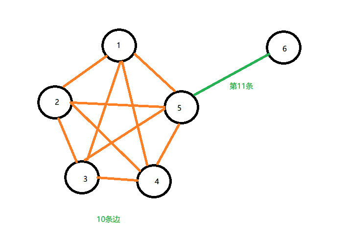

# 第四范式 2019 校园招聘算法笔试题

## 1

当训练样本数量趋向于无穷大时，在该数据集上训练的模型变化趋势，对于其描述正确的是（）

正确答案: C   你的答案: 空 (错误)

```cpp
偏差(bias)变小
```

```cpp
偏差变大
```

```cpp
偏差不变
```

```cpp
不确定
```

本题知识点

算法工程师 第四范式 2019

讨论

[牛客 255418298 号](https://www.nowcoder.com/profile/255418298)

偏差大是欠拟合，方差大是过拟合。增大样本数量会降低方差，和偏差没关系。本题考点：对于方差和偏差的理解 以及 改变方差或偏差的条件。

发表于 2019-02-28 14:40:22

* * *

[nana0606](https://www.nowcoder.com/profile/456559531)

产生偏差的主要原因是无法拟合数据，可以通过选择一个新的网络（更复杂的网络）、延长训练时间或者使用更先进的算法等减小偏差。使用更多的数据可以使方差变小，而不是偏差。

发表于 2019-02-24 21:44:17

* * *

[内存。](https://www.nowcoder.com/profile/39306668)

对，是方差 而不是偏差

发表于 2019-03-01 21:16:38

* * *

## 2

关于 k-means 算法，正确的描述是()

正确答案: B   你的答案: 空 (错误)

```cpp
能找到任意形状的聚类
```

```cpp
初始值不同，最终结果可能不同
```

```cpp
每次迭代的时间复杂度是 0(n2)，其中 n 是样本数量
```

```cpp
不能使用核函数(kernel function)
```

本题知识点

算法工程师 第四范式 2019

讨论

[快学习](https://www.nowcoder.com/profile/426025470)

K-means 算法的初始“簇中心”点是随机选取的，所以最终求的得簇中心的划分与随机选取的“簇中心”有关，因此会造成的；多种簇的划分情况形成。

发表于 2019-03-08 11:34:52

* * *

[万里路几卷书](https://www.nowcoder.com/profile/6061434)

B. 参数 k 的选择不同，结果不同

发表于 2019-03-08 15:42:35

* * *

## 3

通常来说，哪个模型被认为易于解释？ ()

正确答案: C   你的答案: 空 (错误)

```cpp
SVM
```

```cpp
线性回归（Linear Regression）
```

```cpp
决策树(Decision Tree)
```

```cpp
K-近邻（K-Nearest Neighbor）
```

本题知识点

算法工程师 第四范式 2019

讨论

[谁是谁非 xxx](https://www.nowcoder.com/profile/3053007)

决策树模型每作出一个决策都会通过一个决策序列来向我们展示模型的决策依据：比如男性&未婚&博士&秃头的条件对应「不感兴趣」这个决策，而且决策树模型自带的基于信息理论的筛选变量标准也有助于帮助我们理解在模型决策产生的过程中哪些变量起到了显著的作用。

发表于 2019-03-01 15:13:12

* * *

## 4

下列关于神经网络的叙述中，正确的是（）

正确答案: B   你的答案: 空 (错误)

```cpp
损失函数关于输入一定是非凸或非凹的
```

```cpp
存在某种深度神经网络（至少一个隐藏层），使其每个局部最优解都是全局最优解
```

```cpp
深度神经网络容易陷入局部最优解
```

```cpp
以上选项都不对
```

本题知识点

算法工程师 第四范式 2019

讨论

[origami_chen](https://www.nowcoder.com/profile/211554567)

损失函数关于输入是非凸的。当梯度在任意维度都无法继续下降时神经网络会陷入局部最优解。然而随着网络深度增加，维度也在增加。当维度非常高时，如 5000 维，很难让梯度在这 5000 维中都无法下降。

编辑于 2019-02-28 12:30:12

* * *

## 5

对于随机森林（Random Forest）和 Gradient Boosting Trees, 下面说法正确的是（） 1）        随机森林的树和树之间是有依赖的

2）        Gradient Boosting Trees 中的树和树之间是有依赖的

3）        这两个模型都可以使用随机特征子集, 来生成许多单个的树 

正确答案: D   你的答案: 空 (错误)

```cpp
1
```

```cpp
2
```

```cpp
1，3
```

```cpp
2，3
```

本题知识点

算法工程师 第四范式 2019

## 6

设随机变量 X ~ N(0,1),  X 的分布函数为Φ(x)，则 P(|X|>2)的值为()

正确答案: A   你的答案: 空 (错误)

```cpp
2[1-Φ(2)]
```

```cpp
2Φ(2)-1
```

```cpp
2-Φ(2)
```

```cpp
1-2Φ(2)
```

本题知识点

算法工程师 第四范式 2019

讨论

[做一个爱笑的 boy](https://www.nowcoder.com/profile/551157193)

设 X~N（0,1）,分布函数为Φ（x）,且 P（X>x）=a∈（0,1）,则 X 为 P（X>x）=a 即 1-P（X≤x）=a ；即 P（X≤x）=1-a；即Φ（x）=1-a,然后查标准正态分布函数表,查函数值 1-a 对应的点,就是 x 的值. 

发表于 2019-02-24 21:31:46

* * *

[赵子贺](https://www.nowcoder.com/profile/6118530)


发表于 2019-03-07 21:27:30

* * *

## 7

A，B 为 n 阶方阵，且(A + B)²= A^(2 )+ B², 则下列叙述正确的是（）

正确答案: D   你的答案: 空 (错误)

```cpp
|A| = 0
```

```cpp
 (A - B)2= A2 - B2
```

```cpp
A2+ B2= 0
```

```cpp
AB + BA = 0
```

本题知识点

算法工程师 第四范式 2019

讨论

[lemon(˃̶̤́꒳˂̶̤̀)](https://www.nowcoder.com/profile/8620959)

（A+B)(A+B)=A²+AB+BA+B² 所以 AB+BA=0

发表于 2019-03-08 14:15:46

* * *

## 8

有红、黄、蓝色的球各 5 个，分别标有 A、B、C、D 和 E 5 个字母，现从中取出 5 只，要求各字母均有且三色齐备，则共有多少种不同的取法（）

正确答案: A   你的答案: 空 (错误)

```cpp
150
```

```cpp
360
```

```cpp
180
```

```cpp
540
```

本题知识点

算法工程师 第四范式 2019

讨论

[知行合一 _ 慕](https://www.nowcoder.com/profile/7827760)

综合颜色和编号均需要有，因此，每取出一个球，该球的编号便不会再出现。因此，解题方法如下：3 种颜色和 5 个编号均须有，取出 5 个球，则 5 个球分成三组，在不管顺序的情况下，要么是 3,1,1，要么是 2,2,1，对应上编号顺序，则各有 3 种情况，第一种情况：3,1,1，则取法有 3*(C53*C21*C11)=60,第二种情况：则取法有 3*（C52C32C11)=90,则共有 60+90=150 种

发表于 2019-02-25 22:30:21

* * *

[白芝麻](https://www.nowcoder.com/profile/705825789)

∵取出的 5 个球有三种颜色， ∴先把 5 个球分成 3 组，可以是 3，1，1，也可以是 1，2，2， 若按 3，1，1，分组，共有 C53=10 种分法， 若按 1，2，2，分组，有 15 种 ∴共有 10+15=25 种分法， 再让三组取三种不同颜色，共有 A33=6 种不同方法， 最后两步相乘，共有 25×6=150 种不同的取法．

发表于 2019-02-23 09:31:58

* * *

[yeyoenjoy](https://www.nowcoder.com/profile/572955639)

1.先按颜色分，1 1 3 和 1 2 2 两种，各 3 种方案。2.分字母，1 1 3 对应有 C51*C41*C33 共 20 中，1 2 2 对应 C51*C42*C22 共 30 种，3*20+3*30=150

发表于 2019-03-05 16:48:36

* * *

## 9

随机变量 X ~ N(1, 2)，Y ~ N(3, 5)，则 X+Y ～（）

正确答案: D   你的答案: 空 (错误)

```cpp
N(4, 7)
```

```cpp
N(4,√2+ √5)
```

```cpp
N(1 + √3,7)
```

```cpp
不确定
```

本题知识点

算法工程师 第四范式 2019

讨论

[知行合一 _ 慕](https://www.nowcoder.com/profile/7827760)

主要看两个变量是否独立

发表于 2019-02-25 22:31:18

* * *

[是过来学习的人](https://www.nowcoder.com/profile/823197650)

独立条件下，正态加正态还是正态。Z=X+Y。均值加均值，方差加方差

发表于 2019-04-08 16:07:51

* * *

## 10

如下图所示，若从 A 走到 B 过程中，只能向上或者向右走，则走法共有几种（）  

正确答案: B   你的答案: 空 (错误)

```cpp
64
```

```cpp
53
```

```cpp
68
```

```cpp
70
```

本题知识点

算法工程师 第四范式 2019

讨论

[rlzthu](https://www.nowcoder.com/profile/938520478)


1,1,1,14,3,2,1,111,7,7,4,2,125,14,753,28,14,7,3,1 为什么我算出来是 53？？

编辑于 2019-02-27 21:43:07

* * *

[Abincool](https://www.nowcoder.com/profile/397959225)

这个答案应该是 53 吧

发表于 2019-03-10 16:47:15

* * *

[达芬奇 7](https://www.nowcoder.com/profile/64726228)

我算出来也是 53 条

发表于 2019-03-10 15:29:21

* * *

## 11

在 Unix 中，哪一个 system call 会创建新的进程（）

正确答案: A   你的答案: 空 (错误)

```cpp
fork
```

```cpp
create
```

```cpp
new
```

```cpp
none of the mentioned
```

本题知识点

算法工程师 第四范式 2019

## 12

产生 interrupt 有哪些方式（）

正确答案: C   你的答案: 空 (错误)

```cpp
通过 system bus 给 CPU 发送 signal
```

```cpp
执行 system call
```

```cpp
以上选项都对
```

```cpp
以上选项都不对
```

本题知识点

算法工程师 第四范式 2019

## 13

RAID level 3 每秒的 IO 次数很低是因为（）

正确答案: A   你的答案: 空 (错误)

```cpp
每次 IO 请求需要访问所有硬盘
```

```cpp
每次 IO 请求需要访问一块磁盘
```

```cpp
IO 花费的 CPU 时间很多
```

```cpp
以上选项都对
```

本题知识点

算法工程师 第四范式 2019

## 14

操作系统给每个（）维护 page table

正确答案: A   你的答案: 空 (错误)

```cpp
进程
```

```cpp
线程
```

```cpp
指令
```

```cpp
地址
```

本题知识点

算法工程师 第四范式 2019

## 15

如果一个线程执行了 exec  system call，（）

正确答案: B   你的答案: 空 (错误)

```cpp
exec 会在另一个进程中执行
```

```cpp
exec 会替换掉当前整个进程
```

```cpp
exec 会在本线程中执行
```

```cpp
以上选项都不对
```

本题知识点

算法工程师 第四范式 2019

讨论

[吐币蓝波万](https://www.nowcoder.com/profile/633554459)

一个进程一旦调用 exec 类函数，它本身就“死亡”了，系统把代码段替换成新的程序的代码，废弃原有的数据段和堆栈段，并为新程序分配新的数据段与堆栈段，唯一留下的，就是进程号，也就是说，对系统而言，还是同一个进程，不过已经是另一个程序了。不过 exec 类函数中有的还允许继承环境变量之类的信息，这个通过 exec 系列函数中的一部分函数的参数可以得到。

发表于 2019-07-16 20:04:44

* * *

## 16

假设银行存款的每日利率为 0.01%，那么利滚利一年之后收益率为多少（结果四舍五入）（）

正确答案: B   你的答案: 空 (错误)

```cpp
3.6%
```

```cpp
3.7%
```

```cpp
3.8%
```

```cpp
4.0%
```

本题知识点

算法工程师 第四范式 2019

讨论

[rlzthu](https://www.nowcoder.com/profile/938520478)

泰勒展开 f(x)=(1+x)³⁶⁵

发表于 2019-02-28 20:21:01

* * *

[weping495](https://www.nowcoder.com/profile/467350103)

1 年后的收益率为（1+0.01%）³⁶⁵-1≈1.037172711302551929902028170563-1≈0.03717=3.717%

发表于 2019-02-25 19:15:00

* * *

[名字起了能改吗](https://www.nowcoder.com/profile/677980628)

取常用极限，1/e 约等于 0.367

发表于 2019-02-26 19:31:23

* * *

## 17

已知 n % 11 = 10, n % 13 = 12, n % 17 = 16, 则合法的最小正整数 n = （）

正确答案: D   你的答案: 空 (错误)

```cpp
130331398
```

```cpp
47958
```

```cpp
86130
```

```cpp
2430
```

本题知识点

算法工程师 第四范式 2019

讨论

[990035623](https://www.nowcoder.com/profile/990035623)

通过观察可得:(n+1)%11=0;(n+1)%13=0;(n+1)%17=0;所以，min(n+1)=11*13*17=2431(即三个数的最小公倍数)，min(n)=2430。

发表于 2019-03-05 11:36:46

* * *

## 18

对于一个有向有环图，其拓扑序（）

正确答案: A   你的答案: 空 (错误)

```cpp
不存在
```

```cpp
存在且仅有一个
```

```cpp
存在且可以有多个
```

```cpp
视情况而定
```

本题知识点

算法工程师 第四范式 2019

讨论

[990035623](https://www.nowcoder.com/profile/990035623)

根据拓扑排序的定义，对于***有向无环图*** G=(V,E)，V 里顶点的线性序列称为一个拓扑序列，该顶点序列满足：若在有向无环图 G 中从顶点 V[i]到 V[j]有一条路径，则在序列中顶点 V[i]排在顶点 V[j]之前。若 V[i]到 V[j]有环，则两者先后顺序不确定，所以必须是有向无环图才存在拓扑序。

发表于 2019-03-05 14:22:16

* * *

## 19

堆排序的额外空间复杂度是（）

正确答案: A   你的答案: 空 (错误)

```cpp
O(1)
```

```cpp
O(n)
```

```cpp
O(nlogn)
```

```cpp
视情况而定
```

本题知识点

算法工程师 第四范式 2019

讨论

[new-coder](https://www.nowcoder.com/profile/7467857)

堆排序不需要额外空间，只通过位置交换进行排序

发表于 2019-03-06 08:48:22

* * *

## 20

下列哪个说法是错误的：()

正确答案: D   你的答案: 空 (错误)

```cpp
栈可以用单向链表来实现
```

```cpp
队列可以用数组表来实现
```

```cpp
二叉树可以用数组来实现
```

```cpp
哈希表不可以用数组来实现
```

本题知识点

算法工程师 第四范式 2019

## 21

设有 6 个结点的无向图，该图至少应有（）条边，才能确保是一个连通图？

正确答案: B   你的答案: 空 (错误)

```cpp
8
```

```cpp
11
```

```cpp
6
```

```cpp
5
```

本题知识点

算法工程师 第四范式 算法工程师 第四范式 2019

讨论

[做一个爱笑的 boy](https://www.nowcoder.com/profile/551157193)

这道题使用的是鸽巢原理，首先连通图指的是任意两点之间都有路径，然后题目问至少多少条边，考虑前五个点构成一个完全连通图，共 10 条边，然后再与第六个结点连接，共十一条边。其实这个原理在操作系统中进程分配资源时也可以用到。

发表于 2019-02-24 21:54:17

* * *

[想个 ID 好难啊](https://www.nowcoder.com/profile/179354309)

是我对连通图的理解有误还是对题目的理解有误呢,我怎么算出来是五,刚好构成一条线

发表于 2019-02-27 21:16:49

* * *

[随缘笔试](https://www.nowcoder.com/profile/427157)

在无向图的假设下，图 G 是完全连通的是指，G 中的任意两点 i, j 都有边直接相连；图 G 是连通的是指，图中任意两点 i, j 之间都是可达的（未必是直连的），由此，对于一个六个节点的无向图，至少 5 条边能构成一个连通图，此题应选 D：5 条边

发表于 2019-03-11 20:40:39

* * *

## 22

给定一个 m 行 n 列的整数矩阵，每行从左到右和每列从上到下都是有序的。判断一个整数 k 是否在矩阵中出现的最优算法，在最坏情况下的时间复杂度是（）

正确答案: B   你的答案: 空 (错误)

```cpp
O(m*n)
```

```cpp
O(m+n)
```

```cpp
O(log(m*n))
```

```cpp
O(log(m+n))
```

本题知识点

算法工程师 第四范式 2019

讨论

[人才库一霸](https://www.nowcoder.com/profile/768646695)

矩阵是有序的，从左下角来看，向上数字递减，向右数字递增，因此从左下角开始查找，当要查找数字比左下角数字大时，右移；要查找数字比左下角数字小时，上移

发表于 2019-02-28 15:50:06

* * *

[操作系统有点难](https://www.nowcoder.com/profile/1494350)

用二分查找不应该是 log m+ logn = logmn？

发表于 2019-03-05 21:12:42

* * *

[跪跪跪求 offer 啊啊啊啊啊](https://www.nowcoder.com/profile/430163158)

要注意先是最优算法，再是最坏情况。。。

发表于 2019-02-27 16:48:22

* * *

## 23

若将一个 uint32_t 的数字用 10 进制的链表来表示，即链表每个节点值为 0-9，则链表的最大长度为:()

正确答案: A   你的答案: 空 (错误)

```cpp
10
```

```cpp
6
```

```cpp
16
```

```cpp
32
```

本题知识点

算法工程师 第四范式 2019

讨论

[HelloMr.Dai](https://www.nowcoder.com/profile/676889672)

拙见，不知道对不对。。。。2¹⁰~=10³²³⁰~=10⁹ 所以选了 A？

发表于 2019-03-01 10:36:21

* * *

[WeekSing](https://www.nowcoder.com/profile/8207209)

int 32 的最大值是 2147483647，uint32 的最大值是 4294967295，链表每个节点值时 0-9，我们只需要知道这个当前的最大值有多少位即是链表的最大长度 10 位。

发表于 2019-03-06 15:21:16

* * *

## 24

定义一个 c++结构体

struct T {

long long a;

double b;

};

那么一个 T 类型的对象在内存中对应多少字节（）

正确答案: A   你的答案: 空 (错误)

```cpp
16
```

```cpp
20
```

```cpp
128
```

```cpp
160
```

本题知识点

算法工程师 第四范式 2019 C++

讨论

[clear_rain](https://www.nowcoder.com/profile/221424248)

在 C++中 long long 类型占 8 个字节，double 占 8 个字节。那么一个 T 类型的对象在内存中对应 8 + 8 = 16 个字节

发表于 2019-02-27 09:26:55

* * *

[牛客 900095001 号](https://www.nowcoder.com/profile/900095001)

结构体所占的字节数是由结构体内所有数据类型所占字节的总和

发表于 2021-12-18 12:14:29

* * *

## 25

假定 a 是一个二维数组，则 a[i][j] 的指针访问方式为（）

正确答案: B   你的答案: 空 (错误)

```cpp
*(a + i + j)
```

```cpp
*(*(a + i) + j)
```

```cpp
*(a + i)+ j
```

```cpp
*a + i + j
```

本题知识点

算法工程师 第四范式 2019 C++

讨论

[clear_rain](https://www.nowcoder.com/profile/221424248)

**选 B****【分析】**a 代表数组首行首地址，a + i 代表第 i 行首地址，*(a+i)+j 代表第 i 行第 j 个元素地址，*(*(a+i)+j)则是 a[i][j].

编辑于 2019-02-28 10:34:04

* * *

## 26

下列哪个 python 语句可能会在运行时报错（）

正确答案: C   你的答案: 空 (错误)

```cpp
print 2, 3, 3
```

```cpp
print ‘?’ * 233
```

```cpp
print x233
```

```cpp
print 0x233
```

本题知识点

算法工程师 第四范式 2019

讨论

[2046🚄](https://www.nowcoder.com/profile/3479862)

其实楼上没说到点子上，数值和字符连在一起需要将数值转换 str

发表于 2019-03-10 10:33:35

* * *

[做一个爱笑的 boy](https://www.nowcoder.com/profile/551157193)

八进制是 0 开头，十六进制是 0X 开头

发表于 2019-02-24 21:57:38

* * *

[嘿哈嘿](https://www.nowcoder.com/profile/7650891)

0x 代表十六进制数

发表于 2019-02-23 21:10:59

* * *

## 27

下面哪个 Linux 命令可以一次显示一页内容？ ()

正确答案: C   你的答案: 空 (错误)

```cpp
page
```

```cpp
cat
```

```cpp
more
```

```cpp
grep
```

本题知识点

算法工程师 第四范式 2019

讨论

[clear_rain](https://www.nowcoder.com/profile/221424248)

**选 C****【分析】** ***   ```cpp
    page ：page 不能对文件操作，只有 man 指令用 manpage 页面。
    ```

*   ```cpp
    cat ：查看文件内容，一次显示全部文件内容。
    ```

*   ```cpp
    more ：分页显示文件内容；space 翻页。
    ```

*   ```cpp
    grep ：在文件中搜寻与指定字串匹配的行并输出；配合正则表达式和通配符使用。
    ```** 

发表于 2019-02-27 09:55:48

* * *

## 28

假如你使用 EM 算法对一个有潜变量的模型进行最大似然估计(Maximum likelihood estimate)。这时候要求你将算法进行修改，使得其能找到最大后验分布(Maximum a Posteriori estimation, MAP)，你需要修改算法的哪个步骤？

正确答案: A   你的答案: 空 (错误)

```cpp
Expectation
```

```cpp
Maximization
```

```cpp
不需要修改
```

```cpp
都需要修改
```

本题知识点

算法工程师 第四范式 2019

讨论

[origami_chen](https://www.nowcoder.com/profile/211554567)

E step 根据当前参数进行估算，M step 根据估算结果更新参数。那么修改估算方法自然在 E step 中。

发表于 2019-02-28 14:02:42

* * *

## 29

关于 K-NN 和 Logistic Regression, 描述正确的是

正确答案: C   你的答案: 空 (错误)

```cpp
两者都是线性分类器
```

```cpp
Logistic Regression 是线性分类器，当 K=1 时，K-NN 是线性分类器
```

```cpp
只有 Logistic Regression 是线性分类器
```

```cpp
K-NN 预测一个样本的时间复杂度和样本集大小无关
```

本题知识点

算法工程师 第四范式 2019

## 30

从 n 个数里面找最大的两个数理论最少需要比较多少次

正确答案: C   你的答案: 空 (错误)

```cpp
2logn
```

```cpp
2 logn -1
```

```cpp
n + logn -2
```

```cpp
2n-3
```

本题知识点

算法工程师 第四范式 算法工程师 第四范式 2019

讨论

[rlzthu](https://www.nowcoder.com/profile/938520478)

搬运别人的回答：链接：[`www.nowcoder.com/questionTerminal/179136c55476476eada95e3e690dc17d?source=relative`](https://www.nowcoder.com/questionTerminal/179136c55476476eada95e3e690dc17d?source=relative)
来源：牛客网
借鉴前面人的思路，过程是这样的：甲乙比甲胜出，丙丁比丙胜出，最后甲丙比较，甲胜出。。。容易得出找出最大数为 n-1 次现在开始找出第二大的数字：明显，第二大的数字，一定和甲进行过比较。。。。如图中可能是丙、乙，得出一个规律：除了第一层外，每一层都有一个数字和甲进行过比较，那么 n 个节点，一共有 log(n)+1 层，也就是还需要在 log(n)个数字里面进行比较 log(n)-1 次综上：共 n+log(n)-2 次比较

发表于 2019-02-27 16:29:45

* * *

[XY201809181917310](https://www.nowcoder.com/profile/75371236)

利用堆排序，建大根堆的优化算法只需要 O(n),每次取最大元素只需要 O(logn)

发表于 2019-03-08 10:49:14

* * *

## 31

给定一个二维整型矩阵，已知矩阵的每一行都按照从小到大的顺序排列，每一列也都按照从小到大的顺序排列。现在给出一个数，请写一个函数返回该数是否存在于矩阵中。矩阵中出现的数字与需要查找的数(k)都为 0~100000 之间的整数，且矩阵的大小在 3000*3000 以内。在保证正确性的基础上，请尽量给出比较高效的解法。请列出你的算法时间复杂度与空间复杂度分别是多少？

本题知识点

算法工程师 第四范式 数组 查找 *2019* *讨论

[nbgao](https://www.nowcoder.com/profile/211289)

```cpp

		#include <bits/stdc++.h>
using namespace std;
int main(){
    int n,m,x;
    bool M[100001];
    cin>>n>>m;
    for(int i=0;i<n;i++)
        for(int j=0;j<m;j++){
            cin>>x;
            M[x] = true;
        }
    cin>>x;
    if(!M[x])
        cout<<"false"<<endl;
    else
        cout<<"true"<<endl;
    return 0;
} 

```

发表于 2019-07-23 20:41:05

* * *

[ElonB](https://www.nowcoder.com/profile/623894)

```cpp
/*
从左下(或右上)开始遍历，
相等则找到，小于则向右遍历，大于则向上遍历。
时间复杂度 O(m+n)，空间复杂度 O(m*n)
*/
#include<bits/stdc++.h>
using namespace std;

int main()
{
//    freopen("input.txt", "r", stdin);
    int m, n, x, i, j, k;
    cin >> m >> n;
    vector<vector<int>> matrix;
    for(i = 0; i < m; i++) {
        vector<int> temp;
        for(j = 0; j < n; j++) {
            cin >> x;
            temp.push_back(x);
        }
        matrix.push_back(temp);
    }
    cin >> k;

    i = m - 1;
    j = 0;
    bool flag = false;
    while(i >= 0 && j < n) {
        if(matrix[i][j] == k) {
            flag = true;
            break;
        } else if(matrix[i][j] < k) j++;
        else i--;
    }
    if(flag) cout << "true" << endl;
    else cout << "false" << endl;
    return 0;
}

```

```cpp
/*
以空间换时间
查找过程，时间复杂度 O(1)，空间复杂度 O(N)
*/
#include<bits/stdc++.h>
using namespace std;
#define N 100001
bool a[N];

int main()
{
//    freopen("input.txt", "r", stdin);
    int m, n, x, i, j, k;
    memset(a, 0, sizeof(a));
    scanf("%d%d", &m, &n);
    for(i = 0; i < m * n; i++) {
        scanf("%d", &x);
        a[x] = true;
    }
    scanf("%d", &k);

    if(a[k]) printf("true\n");
    else printf("false\n");
    return 0;
}

```

编辑于 2019-07-13 12:53:04

* * *

[零葬](https://www.nowcoder.com/profile/75718849)

从右上开始搜索，如果比目标大，则向左搜索；比目标小则向下搜索，时间复杂度为 O(m + n)

```cpp
import java.io.BufferedReader;
import java.io.InputStreamReader;
import java.io.IOException;
import java.lang.String;

public class Main {
    public static void main(String[] args) throws IOException {
        BufferedReader br = new BufferedReader(new InputStreamReader(System.in));
        String strMN;
        while((strMN = br.readLine()) != null) {
            String[] mn = strMN.split(" ");
            int m = Integer.parseInt(mn[0]);
            int n = Integer.parseInt(mn[1]);
            int[][] matrix = new int[m][n];
            for(int i = 0; i < m; i++){
                String[] strRow = br.readLine().trim().split(" ");
                for(int j = 0; j < n; j++)
                    matrix[i][j] = Integer.parseInt(strRow[j]);
            }
            int target = Integer.parseInt(br.readLine().trim());
            System.out.println(search(matrix, target));
        }
    }

    private static boolean search(int[][] arr, int k) {
        int row = arr.length, col = arr[0].length;
        int rowStart = 0, colStart = col - 1;
        while(rowStart < row && colStart >= 0){
            if(arr[rowStart][colStart] > k) {
                colStart --;
            }else if(arr[rowStart][colStart] < k){
                rowStart ++;
            }else{
                return true;
            }
        }
        return false;
    }
}
```

发表于 2020-10-28 19:59:27

* * *

## 32

给定一个由 n 个点，m 条边组成的无向图（注意，此图可能不连通），对任意 1 ≤ i ≤ m 存在一条边连接 u[i], v[i]。回答此图是不是二分图。二分图定义为存在一种给图中每一个点染上黑白两色其中之一的着色方式，使得对每一对有边直接相连的点颜色不同。 

本题知识点

算法工程师 第四范式 图 贪心 2019

讨论

[keashem](https://www.nowcoder.com/profile/597698287)

关于 2019 的校招题，我从头刷到这儿，碰到的第一个关于图的题。总结了一下图的写法，关于图的存储常用两种：邻接矩阵和邻接表；图的遍历有三种：BFS，DFS 递归，DFS 非递归。所以图的存储和图的遍历共有 6 种组合。从而我写了 6 种方法，经测试已全部 AC，下面提供的 6 种 AC 代码可以交叉对比 从而对图的存储和图的遍历有个更清晰的认识

```cpp
import java.util.*;
import static java.lang.System.in;

public class Main{
    public static void main(String[] args) {
        Scanner sc = new Scanner(in);
        int n = sc.nextInt(), m = sc.nextInt();
        int[][] edge = new int[m][2];
        for (int i = 0; i < m; i++) {
            edge[i][0] = sc.nextInt();
            edge[i][1] = sc.nextInt();
        }
        //arrStoreWay(edge, n);
        adjStoreWay(edge,n);
    }

    public static void arrStoreWay(int[][] data, int n) {
        int[][] graph = new int[n + 1][n + 1];
        for (int i = 0; i < data.length; i++) {
            graph[data[i][0]][data[i][1]] = 1;
            graph[data[i][1]][data[i][0]] = 1;
        }
        //arrBFS(graph,n);
        //arrDFSRecursion(graph,n);
        arrDFSStack(graph, n);
    }

    public static void adjStoreWay(int[][] data, int n) {
        HashMap<Integer, LinkedList<Integer>> graph = new HashMap<>();
        for (int i = 0; i < data.length; i++) {
            if (!graph.containsKey(data[i][0])) {
                graph.put(data[i][0], new LinkedList<>());
            }
            if (!graph.containsKey(data[i][1])) {
                graph.put(data[i][1], new LinkedList<>());
            }
            graph.get(data[i][0]).add(data[i][1]);
            graph.get(data[i][1]).add(data[i][0]);
        }
        adjBFS(graph,n);
        //adjDFSRecursion(graph,n);
        //adjDFSStack(graph,n);
    }

    public static void arrBFS(int[][] graph, int n) {
        Queue<Integer> queue = new LinkedList<>();
        HashSet<Integer> set = new HashSet<>();
        int[] marks = new int[n + 1];
        for (int i = 1; i < graph.length; i++) {
            //防止出现多个连通分量
            if (set.contains(i)) {
                continue;
            }
            queue.offer(i);
            marks[i] = 1;
            set.add(i);
            while (!queue.isEmpty()) {
                int cur = queue.poll();
                for (int j = 1; j < graph[cur].length; j++) {
                    if (graph[cur][j] == 1 && marks[cur] == marks[j]) {
                        System.out.println("No");
                        return;
                    }
                    if (graph[cur][j] == 1 && !set.contains(i)) {
                        marks[j] = -marks[cur];
                        queue.offer(j);
                        set.add(j);
                    }
                }
            }
        }
        System.out.println("Yes");
    }

    public static String res = "Yes";
    public static void arrDFSRecursion(int[][] graph, int n) {
        HashSet<Integer> set = new HashSet<>();
        int[] marks = new int[n + 1];
        for (int i = 1; i < graph.length; i++) {
            if (set.contains(i)) {
                continue;
            }
            marks[i] = 1;
            set.add(i);
            arrDFSRecursionProcess(i, graph, marks, set);
        }
        System.out.println(res);
    }

    public static void arrDFSRecursionProcess(int node, int[][] graph, int[] marks, HashSet<Integer> set) {
        for (int j = 1; j < graph[node].length; j++) {
            if (graph[node][j] == 1 && marks[node] == marks[j]) {
                res = "No";
                return;
            }
            if (graph[node][j] == 1 && !set.contains(j)) {
                marks[j] = -marks[node];
                set.add(j);
                arrDFSRecursionProcess(j, graph, marks, set);
            }
        }
    }

    public static void arrDFSStack(int[][] graph, int n) {
        HashSet<Integer> set = new HashSet<>();
        int[] marks = new int[n + 1];
        Stack<Integer> stack = new Stack<>();
        for (int i = 1; i < graph.length; i++) {
            if (set.contains(i)) {
                continue;
            }
            set.add(i);
            marks[i] = 1;
            stack.push(i);
            while (!stack.isEmpty()) {
                int cur = stack.pop();
                for (int j = 1; j < graph[cur].length; j++) {
                    if (graph[cur][j] == 1 && marks[cur] == marks[j]) {
                        System.out.println("No");
                        return;
                    }
                    if (graph[cur][j] == 1 && !set.contains(j)) {
                        stack.push(cur);
                        marks[j] = -marks[cur];
                        set.add(j);
                        stack.push(j);
                        break;
                    }
                }
            }
        }
        System.out.println("Yes");
    }

    public static void adjBFS(HashMap<Integer, LinkedList<Integer>> graph,int n) {
        Queue<Integer> queue = new LinkedList<>();
        HashSet<Integer> set = new HashSet<>();
        int[] marks = new int[n + 1];
        for (Integer item : graph.keySet()) {
            if (set.contains(item)) {
                continue;
            }
            set.add(item);
            marks[item] = 1;
            queue.offer(item);
            while (!queue.isEmpty()) {
                int cur = queue.poll();
                for (Integer iitem : graph.get(cur)) {
                    if (marks[iitem] == marks[cur]) {
                        System.out.println("No");
                        return;
                    }
                    if (!set.contains(iitem)) {
                        marks[iitem] = -marks[cur];
                        queue.offer(iitem);
                        set.add(iitem);
                    }
                }
            }
        }
        System.out.println("Yes");
    }

    public static String adjRes = "Yes";
    public static void adjDFSRecursion(HashMap<Integer, LinkedList<Integer>> graph, int n) {
        HashSet<Integer> set = new HashSet<>();
        int[] marks = new int[n + 1];
        for (Integer item : graph.keySet()) {
            if (set.contains(item)) {
                continue;
            }
            set.add(item);
            marks[item] = 1;
            adjDFSRecursionProcess(item,graph,marks,set);
        }
        System.out.println(adjRes);
    }

    public static void adjDFSRecursionProcess(int node, HashMap<Integer, LinkedList<Integer>> graph, int[] marks, HashSet<Integer> set) {
        for (Integer item : graph.get(node)) {
            if (marks[item] == marks[node]) {
                adjRes = "No";
                return;
            }
            if (!set.contains(item)) {
                set.add(item);
                marks[item] = -marks[node];
                adjDFSRecursionProcess(item,graph,marks,set);
            }
        }
    }

    public static void adjDFSStack(HashMap<Integer, LinkedList<Integer>> graph, int n) {
        HashSet<Integer> set = new HashSet<>();
        int[] marks = new int[n + 1];
        Stack<Integer> stack = new Stack<>();
        for (Integer item : graph.keySet()) {
            if (set.contains(item)) {
                continue;
            }
            set.add(item);
            marks[item] = 1;
            stack.push(item);
            while (!stack.isEmpty()) {
                int cur = stack.pop();
                for (Integer iitem : graph.get(cur)) {
                    if (marks[iitem] == marks[cur]) {
                        System.out.println("No");
                        return;
                    }
                    if (!set.contains(iitem)) {
                        set.add(iitem);
                        marks[iitem] = -marks[cur];
                        stack.push(cur);
                        stack.push(iitem);
                    }
                }
            }
        }
        System.out.println("Yes");
    }
}
```

编辑于 2019-08-09 12:04:49

* * *

[Sitr-摸鱼哥](https://www.nowcoder.com/profile/679963018)

```cpp
 AC 代码
#include <bits/stdc++.h>
 using namespace std;
 const int maxn=1e5+8;
 vector<int>G[maxn];
 int V;
 int color[maxn];
 bool dfs(int v,int c){
     color[v]=c;
     for(int i=0;i<G[v].size();i++){
         if(color[G[v][i]]==c)return false;
         if(color[G[v][i]]==0&&!dfs(G[v][i],-c))return false;
     }
     return true;
 }
 void solve(){
     for(int i=0;i<V;i++){
         if(color[i]==0)
         if(!dfs(i,1)){
             printf("No\n");
             return;
         }
     }
     printf("Yes\n");
 }
 int main()
 {
     int m;
     scanf("%d%d",&V,&m);
     for(int i=0;i<m;i++){
         int s,t;
         scanf("%d%d",&s,&t);
         G[s].push_back(t);
         G[t].push_back(s);
     }
     solve();
    return 0;
 }

```

注意 给出的样例 第一个样例 应该有 7 条边 但是 样例只给了六条！！

发表于 2019-03-05 23:45:45

* * *

[WMYW](https://www.nowcoder.com/profile/222543223)

```cpp
///很简单
//定义俩个集合
///左边放一种颜色顶点
///右边放另一种颜色顶点
//当一次输入时一个集合同时出现俩个顶点就不能形成二分图
///求顶，谢谢，让大家看到

#include<iostream>
(720)#include<unordered_map>
using namespace std;
int main()
{
    int n,m;
    cin>>n>>m;
    int i=0;
    int s,t;
    unordered_map<int,int> p;
    unordered_map<int,int> q;
    while(i<m)
    {
        cin>>s>>t;
        if(((p.find(s)!=p.end())&&(p.find(t)!=p.end()))||((q.find(s)!=q.end())&&(q.find(t)!=q.end())))
        {
            cout<<"No";
            return 0;
        }
        else if(p.find(s)!=p.end())
            q.insert({t,i});
        else if(p.find(t)!=p.end())
            q.insert({s,i});
        else if(q.find(s)!=q.end())
            p.insert({t,i});
        else if(q.find(t)!=q.end())
            p.insert({s,i});
        else
        {
            p.insert({s,i});
            q.insert({t,i});
        }
        i++;
    }
    cout<<"Yes";
}
```

发表于 2020-02-26 11:36:37

* * **