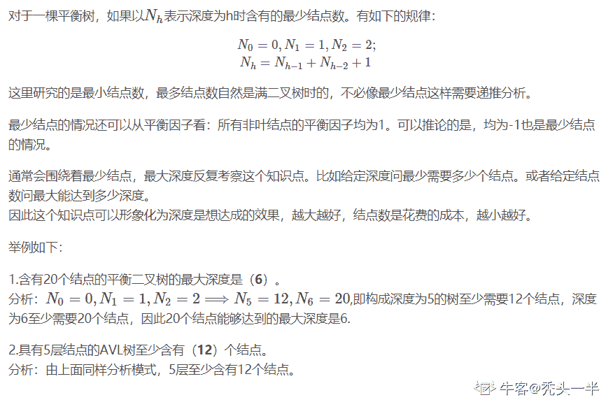
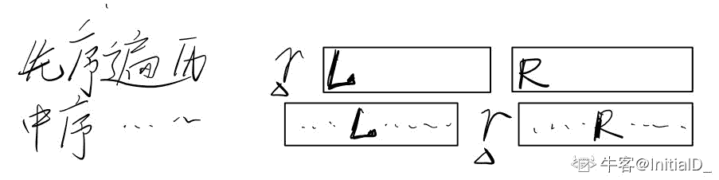

# 小米 2018 春季实习生服务端开发工程师笔试题

## 1

对于排序算法，经常关注的是其时间复杂度和稳定性。下列排序算法中平均时间复杂度是 O(nlogn)且稳定的是？

正确答案: C   你的答案: 空 (错误)

```cpp
冒泡排序
```

```cpp
插入排序
```

```cpp
归并排序
```

```cpp
堆排序
```

```cpp
快速排序
```

本题知识点

Java 工程师 C++工程师 小米 排序 *Java 工程师 C++工程师 小米 2018* *讨论

[迷~糊](https://www.nowcoder.com/profile/367186224)

这题选择 C,归并排序.题目要求是平均时间复杂度是 O(nlogn)且稳定的.下面列举各排序的时间复杂度:冒泡排序:O(n²) 稳定插入排序:O(n²) 稳定归并排序:O(nlogn)  稳定 堆排序:O(nlogn)  不稳定 快速排序:O(nlogn)  不稳定 我有点忘记哪些稳定的,哪些不稳定的了.

发表于 2019-04-06 23:24:05

* * *

## 2

经典的 OSI 模型定义了一个七层网络协议，下列协议中属于网络层的是？

正确答案: A   你的答案: 空 (错误)

```cpp
IP
```

```cpp
TCP
```

```cpp
UDP
```

```cpp
HTTP
```

本题知识点

Java 工程师 C++工程师 小米 网络基础 Java 工程师 C++工程师 小米 2018

讨论

[爾布•BeauEr](https://www.nowcoder.com/profile/355364449)

AOSI 模型七层自顶向下为：应用层、表示层、会话层、传输层、网络层、数据链路层、物理层 A 为网络层协议，B C 为传输层协议，D 为应用层协议

发表于 2019-03-11 15:56:06

* * *

## 3

在面向对象编程里，经常使用 is-a 来说明对象之间的继承关系，下列对象中不具备继承关系的是？

正确答案: D   你的答案: 空 (错误)

```cpp
手机与小米手机
```

```cpp
企业家与雷军
```

```cpp
编程语言与 Java
```

```cpp
中国与北京
```

本题知识点

Java 工程师 C++工程师 小米 C++ Java Java 工程师 C++工程师 小米 2018

讨论

[zhuheng-20 届](https://www.nowcoder.com/profile/729529281)

用 is a 来说明对象之间的继承关系：    小米手机 is a 手机；    雷军 is a 企业家；    Java is a 编程语言；    北京 is not a 中国。

发表于 2019-09-09 09:09:31

* * *

[天使的腿毛](https://www.nowcoder.com/profile/488736832)

小米手机是一个手机/

雷军是一个企业家/

java 是一个编程语言/

北京是一个中国吗？

发表于 2019-08-24 08:26:23

* * *

[gybcloud](https://www.nowcoder.com/profile/664012)

请把“不”加粗，谢谢！

发表于 2019-08-28 16:25:14

* * *

## 4

一个树高（根节点高度为 1）为 6 的平衡二叉树，其节点数可能是？

正确答案: B   你的答案: 空 (错误)

```cpp
16
```

```cpp
32
```

```cpp
64
```

```cpp
128
```

本题知识点

Java 工程师 C++工程师 小米 树 2018

讨论

[我的天鸭](https://www.nowcoder.com/profile/243498)

最小二叉平衡树的节点的公式如下 **F(n)=F(n-1)+F(n-2)+1**

发表于 2019-08-23 18:08:40

* * *

[Jian 马云](https://www.nowcoder.com/profile/1269695)

深度为６的满二叉树才多少个？这个题答案选Ｂ吧．．．

发表于 2019-03-11 19:37:11

* * *

[秃头一半](https://www.nowcoder.com/profile/962451314)



发表于 2020-04-13 17:38:51

* * *

## 5

一个二叉树的先序遍历结果和中序遍历结果相同，则其所有非叶子节点必须满足的条件是？

正确答案: B   你的答案: 空 (错误)

```cpp
只有左子树
```

```cpp
只有右子树
```

```cpp
节点的度为 1
```

```cpp
节点的度为 2
```

本题知识点

Java 工程师 C++工程师 小米 树 Java 工程师 C++工程师 小米 2018

讨论

[InitialD_](https://www.nowcoder.com/profile/199894734)

选 B。以下，**r 表示根节点**、**L 为左子树根节点**（紧挨着根节点 r）、R 为右子树根节点；不难看出只有当**所有**左子树为空（即只有右子树）时遍历结果才会相等。
自己在 iPad 上画的，各位将就着看吧🤣。

编辑于 2019-10-22 11:27:50

* * *

[你说是就是](https://www.nowcoder.com/profile/223530205)

先序是 NLR，中序是 LNR，故只能 L 为空，即左为空

发表于 2019-10-08 20:45:11

* * *

## 6

若磁盘转速是 7200 转/分，平均寻道时间是 8ms，每个磁道包含 1000 个扇区，则访问一个扇区的平均存取时间为？

正确答案: B   你的答案: 空 (错误)

```cpp
8.1ms
```

```cpp
12.2ms
```

```cpp
16.3ms
```

```cpp
20.4ms
```

本题知识点

Java 工程师 C++工程师 小米 操作系统 Java 工程师 C++工程师 小米 2018

讨论

[offer 到我家](https://www.nowcoder.com/profile/750375493)

7200 转/分=120000 转/毫秒; 120000/1=1000/x; x=8.3ms(x 为走完 1000 扇区所需时间); 最好情况==寻道时间=8ms; 最坏情况=寻道时间+访问 1000 扇区时间=16.3ms; 平均时间=(最好的情况+最坏情况)/2=12.15ms;

编辑于 2019-08-07 00:14:05

* * *

## 7

下列关于进程和线程说法不正确的是？

正确答案: C   你的答案: 空 (错误)

```cpp
线程可以称为轻量级的进程
```

```cpp
一个进程可以有多个线程
```

```cpp
进程之间可以共享资源，比如文件描述符等
```

```cpp
线程是 CPU 调度的最小单位
```

本题知识点

Java 工程师 C++工程师 小米 操作系统 Java 工程师 C++工程师 小米 2018

讨论

[孫中明](https://www.nowcoder.com/profile/4882333)

1、父进程和子进程可以共享打开的文件描述符。 2、父子进程共享文件描述符的条件：在 fork 之前打开文件。 3、对于两个完全不相关的进程，文件描述符不能共享。 4、父子进程文件描述符是共享的，但是关闭的时候可以分别关闭，也可以同时在公有代码中关闭。

发表于 2019-09-02 04:50:44

* * *

## 8

CPU 的指令集可以分为 RISC 和 CISC 两种，下列说法不正确的是？

正确答案: B   你的答案: 空 (错误)

```cpp
CISC 的指令集更加复杂
```

```cpp
RISC 的 CPU 更加耗电
```

```cpp
英特尔德酷睿处理器属于 CISC
```

```cpp
高通骁龙处理器属于 RISC
```

本题知识点

Java 工程师 C++工程师 小米 单片机 2018

讨论

[问道者](https://www.nowcoder.com/profile/397597530)

CISC 即 Complex Instruction Set Computer，其指令功能较强，指令系统庞大而复杂；
RISC 即 Reduced Instruction Set Computer，其指令集较 C1SC 更精简。

发表于 2020-08-31 20:00:43

* * *

## 9

下列关于数据库事务 ACID 特性的说法不正确的是？

正确答案: C   你的答案: 空 (错误)

```cpp
A 指的是原子性，即事务中的所有操作要么全部成功，要么全部失败
```

```cpp
C 指的是一致性，即系统的状态只能是事务前的状态，或者是事务成功后的状态，而不会出现任何不一致的中间状态
```

```cpp
I 指的是可用性，即数据库系统要为事务执行提供尽 可能高的可用性，确保大部分事务可以成功的被执行
```

```cpp
D 指的是持久性，即事务成功后即使发生机器断电，也可以恢复到事务成功后的状态
```

本题知识点

Java 工程师 C++工程师 小米 数据库 Java 工程师 C++工程师 小米 2018

讨论

[2bealive](https://www.nowcoder.com/profile/9180875)

I (Isolation) 独立性

所谓的独立性是指并发的事务之间不会互相影响，如果一个事务要访问的数据正在被另外一个事务修改，只要另外一个事务未提交，它所访问的数据就不受未提交事务的影响。

比如现有有个交易是从 A 账户转 100 元至 B 账户，在这个交易还未完成的情况下，如果此时 B 查询自己的账户，是看不到新增加的 100 元的。
--------------------- 
作者：Zhu_Julian 
来源：CSDN 
原文：[`blog.csdn.net/dbanote/article/details/8977362`](https://blog.csdn.net/dbanote/article/details/8977362) 
版权声明：本文为博主原创文章，转载请附上博文链接！

发表于 2019-03-14 19:39:03

* * *

## 10

德州扑克中总共使用 52 张牌(不包括大小王)，每个参与者都会先发两张手牌，请问对于一个参与者来说两张手牌组成对子的概率是？

正确答案: D   你的答案: 空 (错误)

```cpp
C(13,1)/C(52, 2)
```

```cpp
C(13,1)*C(4, 1)/C(52,2)
```

```cpp
C(52,1)*C(3,1)/C(52,2)
```

```cpp
C(13,1)*C(4,2)/C(52,2)
```

本题知识点

Java 工程师 C++工程师 小米 概率统计 *Java 工程师 C++工程师 小米 2018* *讨论

[牛客 297162798 号](https://www.nowcoder.com/profile/297162798)

一共十三个种类，每类四张，总计五十二张

发表于 2022-02-27 01:12:47

* * *

[Tyx.](https://www.nowcoder.com/profile/929823578)

D

发表于 2019-03-06 19:25:29

* * *

## 11

给定一个整数数组，包含正负数且无序，找出和最大的连续子数组，比如数组[1,1,-5,6,7,-2]，则和最大的子数组为[6,7]，最大和为 13
1.1 定义一个函数，输入是一个整数数组，输出是和最大的连续子数组的和
1.2 假设输入的是一个二维数组，而同时连续子数组的定义扩大为连续的二维子数组，比如一个 3*4 的二维数组[[-1,2,3,-1],[-2,1,2,-2],[-3,-3,-3,-3]]，则和最大的连续子数组是[[2,3],[1,2]]，所以最大和为 8，请定义一个函数，输入是一个二维数组，输出是和最大的连续子数组的和，要求：必须使用 1.1 中函数来求解
1.3 继续扩大二维连续子数组的定义，比如支持左右互联，即二维数组的左起始列可以和右边终止列连在一起形成子数组，请定义一个函数，输入是一个二维子数组，输出同样是和最大的连续子数组的和，要求：必须使用 1.2 中函数来求解
解答要求: 请使用熟悉的语言或伪代码，每个函数给出算法复杂度分析

你的答案

本题知识点

Java 工程师 C++工程师 小米 2018

讨论

[李军辉](https://www.nowcoder.com/profile/874248542)

```cpp

```
def selectArray(array):  if len(array) < 2:  return array[0]  num = array[0] + array[1]; for i in range(len(array) - 1):  if array[i] + array[i + 1] > num:  num = array[i] + array[i + 1]  return num def tdarray(array):  endarray = []  for i in array:  num = selectArray(i)  endarray.append(num)  return selectArray(endarray)  def conarray(array):  for i in array:  i.append(i[0])  endarray = []  for i in array:  num = selectArray(i)  endarray.append(num)  endarray.append(endarray[0])  return selectArray(endarray)
```cpp

```

发表于 2019-03-13 17:22:21

* * *

## 12

实现一个数据结构，叫做 BoundedBuffer，即初始化时传入一个参数来定义了 Buffer 的大小，然后有两个 public 方法，put 方法用于存入一个元素，take 方法用于取出一个元素，先进先出
2.1 实现存储整型的 BoundedBuffer，无需线程安全，Buffer 满或空时可以抛出异常
2.2 将 2.1 中的整型 BoundedBuffer 实现改为泛型
2.3 实现线程安全的 BoundedBuffer，同时 put 和 take 如遇到 buffer 满或空的情况，需要 block 住调用线程，直到 buffer 中有空间或者有新数据
2.4 给 2.3 的 BoundedBuffer 提供带超时的 put 或 take 方法，即调用者可以指定超时时间，如果在指定时间内依旧没有空间或没有新数据，则抛出异常
解答要求: 请使用熟悉的语言或伪代码，底层存储只能使用数组或链表

你的答案

本题知识点

Java 工程师 C++工程师 小米 2018**