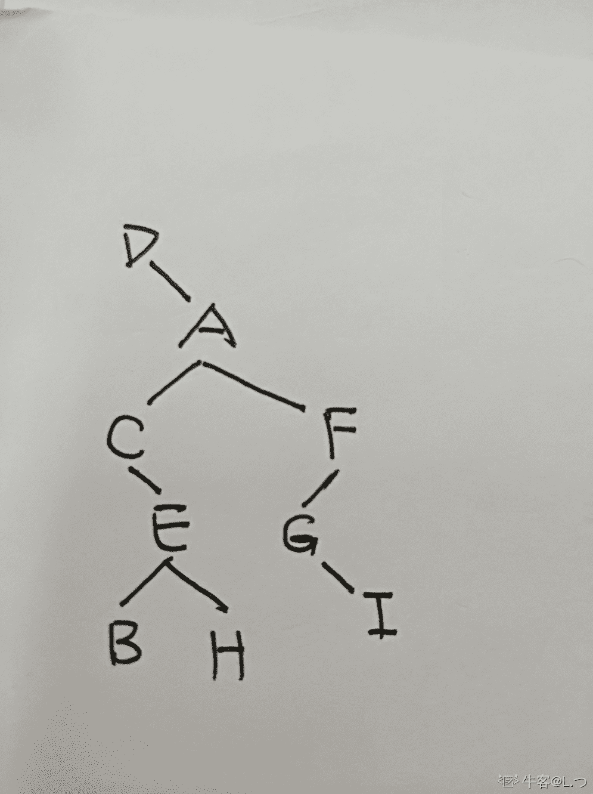
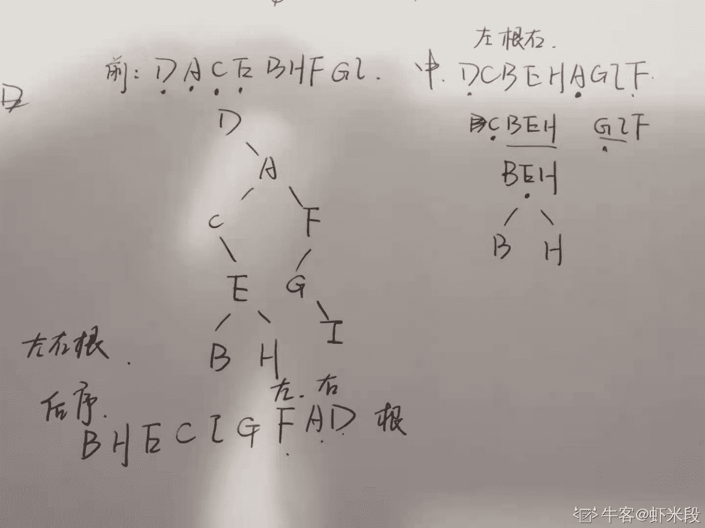

# 小米 2018 春季实习生算法工程师客观题

## 1

在长度为 n 的顺序表的第 i（1≤i≤n+1）个位置上插入一个元素，元素的移动次数为

正确答案: A   你的答案: 空 (错误)

```cpp
n-i+1
```

```cpp
n-i
```

```cpp
i
```

```cpp
i-1
```

本题知识点

算法工程师 小米 链表 *算法工程师 小米 2018* *讨论

[勿忘心安 2020](https://www.nowcoder.com/profile/109750563)

在第 i 个位置插入，那么 i 到 n+1 的元素都要后移，不应该是 n+1-（i-1）=n-i+2 嘛；如果题目是在第 i 个元素后面插入，那就答案就是 A，谁给我解释下哈，不耻下问😂

发表于 2019-09-06 11:07:43

* * *

## 2

由３个结点所构成的二叉树有（）种形态

正确答案: A   你的答案: 空 (错误)

```cpp
5
```

```cpp
6
```

```cpp
7
```

```cpp
8
```

本题知识点

算法工程师 小米 树 2018

讨论

[Plutoweb](https://www.nowcoder.com/profile/804772397)

公式：C(n)=(1/(n+1))*((2*n)!/(n!*n!))C(3) = (2*3)!/(3！*3！)/(3+1)=5

发表于 2021-03-15 13:29:23

* * *

[天尊墨宇](https://www.nowcoder.com/profile/667959477)

选 A

发表于 2020-07-01 09:44:26

* * *

[Ec_ 依稀](https://www.nowcoder.com/profile/7525598)

(2n!) / [ n! * (n+1)! ]

发表于 2019-11-11 08:28:47

* * *

## 3

给定二叉树的两种遍历序列，分别是：前序遍历序列：D，A，C，E，B，H，F，G，I； 中序遍历序列：D，C，B，E，H，A，G，I，F 那么后续遍历为：

正确答案: B   你的答案: 空 (错误)

```cpp
B，E，H，C，I，G，F，A，D
```

```cpp
B，H，E，C，I，G，F，A，D
```

```cpp
B，H，E，C，I，G，A，F，D
```

```cpp
B，H，E，C，G，I，F，A，D
```

本题知识点

算法工程师 小米 树 算法工程师 小米 2018

讨论

[L.つ](https://www.nowcoder.com/profile/317311654)



发表于 2020-08-20 16:38:57

* * *

[虾米段](https://www.nowcoder.com/profile/3942364)

前序遍历：根左右；中序：左根右；后序：左右根第一趟：由前序知 D 为根节点，中序同为 D，则 D 左边无子树，D 右边子树为 C，B，E，H，A，G，I，F 第二趟：前序 A 为根节点，则中序 A 为根节点，左边子树为 C,B,E,H；右边子树为 G,I,F 第三趟：前序 C 为根节点，则中序 C 为根节点，左边无子树，右边子树为 B,E,H 以此类推得到子树如图。后序左右根的顺序，可从根节点 D 从右到左逆推得 D,A,F,G,I,C,E,H,B，逆向得 B,H,E,C,I,G,F,A,D.

发表于 2021-02-25 02:17:22

* * *

## 4

一棵完全二叉树具有 1000 个结点，则此完全二叉树有 ( )个度为 2 的结点

正确答案: C   你的答案: 空 (错误)

```cpp
497
```

```cpp
498
```

```cpp
499
```

```cpp
500
```

本题知识点

算法工程师 小米 树 算法工程师 小米 2018

讨论

[花果山的小红帽](https://www.nowcoder.com/profile/75949043)

若为满树：前 8 层结点总数 255，前 9 层结点总数 511，前 10 层结点总数 1023>1000，故最多 10 层。第 9 层结点总数：2⁸=256，但并不都是度为 2 第 10 层共 1000-511=489 个结点，从而可得到第 9 层度为 2 的结点数为：489/2=244 度为 2 的结点数：255+244=499

发表于 2019-09-06 16:58:40

* * *

[甜树果子二号](https://www.nowcoder.com/profile/543920445)

假设二叉树的根节点编号为 1，层数为 k 已知总结出的如下结论：1.满二叉树的结点总数=2^k-1;2.满二叉树每一层的结点个数=2^(k-1);3.每一个节点的编号=子节点的编号/2;那么可以得出这棵 1000 个结点的完全二叉树，有 10 层，前 9 层的节点总数为 511，最后一个节点编号为 1000，则最后一个非叶子节点编号为 500，而且他是度为 1 的结点，所以第九层非度为 2 的结点有 511-500+1=12 个；最后一层的所有叶子节点总数为 1000-511=489；所以度为 2 的结点=1000-（489+12）=499。

发表于 2019-10-01 22:55:04

* * *

[____ 不名](https://www.nowcoder.com/profile/1047922)

1000=n0+n1+n2n0 = n2+1n1 为 1 或 0，此处 n1 为 1。

编辑于 2019-03-11 20:40:22

* * *

## 5

n 个节点的满二叉树调整成一个最小堆的最优复杂度

正确答案: B   你的答案: 空 (错误)

```cpp
O(logN)
```

```cpp
O(N)
```

```cpp
O(N*logN)
```

```cpp
O(N²)
```

本题知识点

算法工程师 小米 树 2018

讨论

[走位崴了脚](https://www.nowcoder.com/profile/4695029)

N 个节点，分支节点 N/2，每个分支最多进行两次比较和互换操作，因此整个构建过程时间复杂度为 N

发表于 2021-03-17 22:42:31

* * *

[我的天鸭](https://www.nowcoder.com/profile/243498)

从有子节点的节点开始由低到高依次调整，O（n）

发表于 2019-08-27 10:42:33

* * *

[不做人了](https://www.nowcoder.com/profile/250145)

平均复杂度 NlogN 确定一个数的位置 logNN 个数 NlogN 最优复杂度 刚好顺序 N/2

编辑于 2020-06-17 10:46:58

* * *

## 6

设有 33 小米智能家居设备, 现在只有一个电源输入插孔, 则至少需要 5 插头的小米插线板数

正确答案: B   你的答案: 空 (错误)

```cpp
7
```

```cpp
8
```

```cpp
9
```

```cpp
10
```

本题知识点

算法工程师 小米 智力题 2018 数学运算

讨论

[牛客 313764275 号](https://www.nowcoder.com/profile/313764275)

排插接排插？很危险诶😳

发表于 2021-03-22 10:58:34

* * *

[牛客 326405329 号](https://www.nowcoder.com/profile/326405329)

有 33 个充电头需要插孔，现在只有一个总插孔，问需要 5 插孔的板子多少个 假设每个板子都插入前一个板子， 那么除了最后一个板子前面所有板子的有效使用量只有 4 个 即寻找 4（x-1）+5≥33 中 x 的最小值 x 最小为 8

发表于 2020-12-26 13:54:24

* * *

[风海洋](https://www.nowcoder.com/profile/784097590)

我就没明白题目意思，谁能解释一下

发表于 2020-10-09 09:48:57

* * *

## 7

若入栈序列为 A B C D E  F，且进栈和出栈可以穿插进行，则不可能的输出序列为

正确答案: A   你的答案: 空 (错误)

```cpp
BCEAFD
```

```cpp
DCBAEF
```

```cpp
CBDAFE
```

```cpp
BDCAEF
```

本题知识点

算法工程师 小米 栈 *2018* *讨论

[Stephanie_z](https://www.nowcoder.com/profile/38882883)

在原序列中相对位置比它小的，必须是逆序；E 后面 不可以是 AD 必须是 DA

发表于 2021-09-04 11:22:42

* * *

[泰坦琉星](https://www.nowcoder.com/profile/728448124)

A 选项：按照先进后出原则，A 第一个入栈没有立即出栈，B、C 都是进栈后立即出栈，按照 D 在 E 后面才出栈，那么 D 就不是进栈后立即出栈的操作，于是 D 肯定是要在 A 出栈之前就已经出栈的，A 选项明显冲突，所以选 A。

发表于 2019-12-04 19:34:02

* * *

## 8

signed char 中 -25 在内存中的存储形式是以下哪一种

正确答案: C   你的答案: 空 (错误)

```cpp
1110 0101
```

```cpp
1110 0110
```

```cpp
1110 0111
```

```cpp
1111 1001
```

本题知识点

算法工程师 小米 操作系统 算法工程师 小米 2018

讨论

[零葬](https://www.nowcoder.com/profile/75718849)

以补码形式存储 正数：补码=原码 负数：补码=反码+1

发表于 2020-10-31 16:10:14

* * *

[芦溪彭于晏](https://www.nowcoder.com/profile/678987627)

-25
原码： 1001 1001 反码： 1110  0110 补码： 1110  0111

发表于 2019-04-18 10:04:41

* * *

[computer001](https://www.nowcoder.com/profile/819420031)

在内存中是以补码的形式存储的？

发表于 2019-08-30 11:14:18

* * *

## 9

有一苹果两个人抛硬币来决定谁吃这个苹果先抛到正面者吃。问先抛者吃到苹果的概率是多少

正确答案: B   你的答案: 空 (错误)

```cpp
1/2
```

```cpp
2/3
```

```cpp
3/4
```

```cpp
5/6
```

本题知识点

算法工程师 小米 概率统计 *算法工程师 小米 2018* *讨论

[薛定谔的胖喵](https://www.nowcoder.com/profile/799984339)

1/2 + 1/2³ +1/2⁵.....1/2^n = 2/3（1-1/4^n）n 表示先抛的抛几次吃到

编辑于 2019-03-11 22:20:41

* * *

[gybeforever](https://www.nowcoder.com/profile/4083760)

单次实验是一个二项分布，某个人抛一次吃到的概率是 1/2，吃不到是 1/2。现在需要做 n 次这样的实验，直到硬币出现一次正面。设随机变量 x 表示 n 的大小。那么 x=1，p = 0.5x=2，p = 0.5²x=3，p = 0.5³...x = n,p=0.5⁴ 其中奇数是先抛者做的实验。那么先抛者先迟到的概率就是 x 为奇数概率加起来。也就是：0.5¹+0.5³+0.5⁵+....0.5^(2k+1),其中 k=0,1,2,3,4....就是要求这个等比数列收敛到的值，求个和，取 k->∞就可以得到。具体的我就没算了，直接按了几下计算器大约可以估计时 2/3。（知识有点忘了...）

发表于 2019-07-30 10:18:39

* * *

[Honorificab](https://www.nowcoder.com/profile/2003089)

假设第一个抛硬币的人是 A，第二个抛硬币的人是 B 第一次 AB 抛完硬币 P(AB)表示 A 吃到苹果并且 B 吃到苹果,其值为 0P(AB_1)表示 A 吃到，苹果 B 吃不到苹果，其值为 1/2P(A_1B)表示 A 没吃到苹果，B 吃到苹果，其值为 1/4P(A_1B_1)表示 A，B 都没吃到苹果，其值为 1/4 下面 n 次就如 [薛定谔的胖喵](https://www.nowcoder.com/profile/799984339) 提供公式

编辑于 2019-03-12 15:10:26

* * *

## 10

不同级别的用户对同一对象拥有不同的访问权利或某个客户端不能直接操作到某个对象，但又必须和那个对象有所互动，这种情况最好使用什么设计模式。    

正确答案: D   你的答案: 空 (错误)

```cpp
Bridge
```

```cpp
Facade
```

```cpp
Adapter
```

```cpp
Proxy
```

本题知识点

算法工程师 小米 设计模式 算法工程师 小米 2018

讨论

[零葬](https://www.nowcoder.com/profile/75718849)

不能直接操作就使用代理

发表于 2020-10-31 16:06:33

* * ****