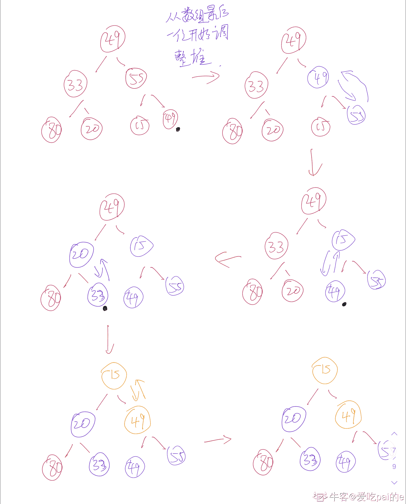
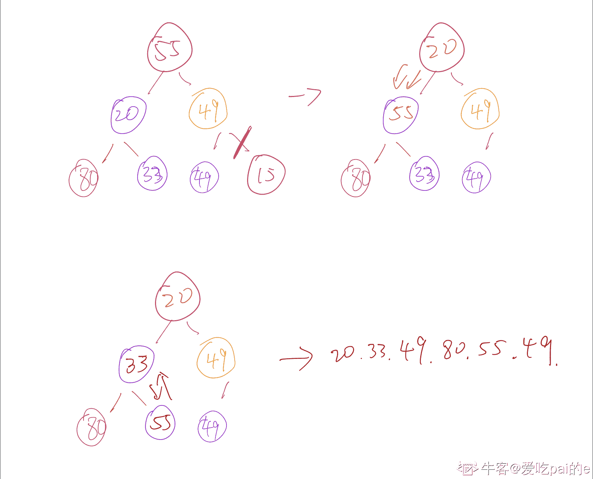
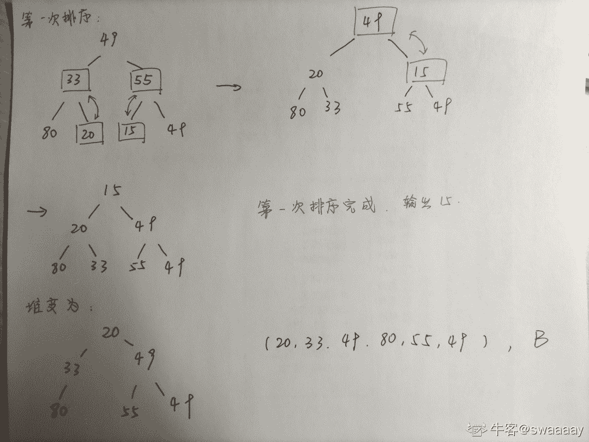
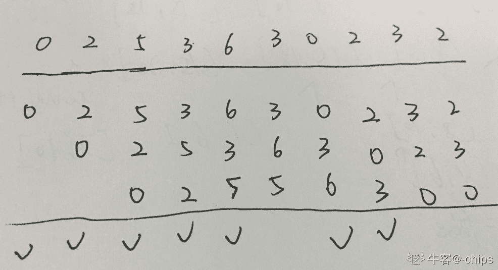
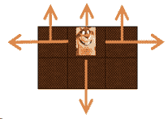

# 小米 2018 春季实习生测试开发工程师笔试题

## 1

一棵二叉树高度为 h（根的高度为 1），所有结点的度是 0 或 2，则这棵二叉树最少有（）个结点

正确答案: C   你的答案: 空 (错误)

```cpp
2h
```

```cpp
2h + 1
```

```cpp
2h - 1
```

```cpp
h + 1
```

本题知识点

小米 树 2018

讨论

[内推鱼](https://www.nowcoder.com/profile/597673274)

局限 h 为 1 的情况  选 C

发表于 2019-11-03 18:45:51

* * *

[我想挣钱](https://www.nowcoder.com/profile/403188193)

    1         /      \           2      3      /   \    4     5   /  \ 6    7（如果题目没说度只能为 0 或者是 2，那么一条直线的二叉树的节点最少，并且最高）题目说度只能为 0，或者 2，那么只能一边是一个节点，另一边继续这样满足。只有这样才能满足树尽可能的高，节点尽可能的少（满足度只能是 0 或 2），所以是 2h-1。对于我画的图来说，h 是 4。2*4-1=7。

编辑于 2019-09-16 23:19:21

* * *

## 2

序列{49, 33, 55, 80, 20, 15, 49}用堆排序使其递增，输出第一个数后，调整之后新堆的层

正确答案: B   你的答案: 空 (错误)

```cpp
20, 55, 49, 80, 30, 49
```

```cpp
20, 30, 49, 80, 55, 49
```

```cpp
20, 49, 49, 30, 80, 55
```

```cpp
20, 30, 49, 49, 55, 80
```

本题知识点

安卓工程师 小米 Java 工程师 C++工程师 测试工程师 前端工程师 排序 *安卓工程师 小米 2018 前端工程师 小米 2018* *讨论

[渡口的小太阳](https://www.nowcoder.com/profile/615721438)

这道题莫名其妙，我猜最后说的是层序遍历吧，然后做小根堆，输出 15，最后层序遍历应该是 20,33,49,80,49,55

发表于 2019-03-30 16:15:04

* * *

[爱吃 pai 的 e](https://www.nowcoder.com/profile/63866538)

这里是从第一个非叶子节点开始构建，是本人的失误，望周知。把堆顶跟数组最后一个互换，然后删掉数组最后一个，开始调整堆

编辑于 2020-09-09 00:09:36

* * *

[swaaaay](https://www.nowcoder.com/profile/235153436)



发表于 2021-12-08 14:15:37

* * *

## 3

一个进程执行时按{0,2,5,3,6,3,0,2,3,2}顺序访问页，进程分得 3 块主存块，采用 LRU，产生多少次缺页中断

正确答案: C   你的答案: 空 (错误)

```cpp
5
```

```cpp
6
```

```cpp
7
```

```cpp
8
```

本题知识点

安卓工程师 小米 Java 工程师 C++工程师 测试工程师 前端工程师 操作系统 安卓工程师 小米 2018 前端工程师 小米 2018

讨论

[-chips](https://www.nowcoder.com/profile/888702082)

☑️表示缺页，共 7 次

发表于 2019-11-25 09:52:54

* * *

[太阳☀201806270919191](https://www.nowcoder.com/profile/588552267)

别人的解题思路，题目差不多{2,3,2,1,5,2,4,5,3,2,5,2}

根据 LRU 算法,需要替换上次使用距现在最远的页面.

首先 2,3,2 这三页进入内存（进程只分配到 3 个页面,切顺序为由内到外,第二个 2 进入时不缺页,所以共缺页 2 次）,1 进入时,内存不满且内存中没有 1 这个页面即第 1 个进入内存,所以顺序是 2,3,1（缺页 1 次）；下一个进入的是 5,替换 3（缺页 1 次）,得到 2,1,5；下一个进入的是 2,内存中有 2 号页面,进行下一个页面；下一个进入 4,4 替换 1,得到 2,5,4（缺页 1 次）；下一个进入 5,内存中有 5 号页面,进行下一个页面；下一个进入 3,3 替换 2,得到 3,5,4（缺页 1 次）；下一次进入 2,2 替换 4,得到 3,5,2（缺页 1 次）；后面 2 号和 5 号内存中均存在,则不需要替换.所以一共发生了 7 次缺页.

发表于 2019-04-24 11:17:07

* * *

[emcaster](https://www.nowcoder.com/profile/9814524)

我觉得答案有问题，0 缺 2 缺 5 缺 3 缺(替换 0) 6 缺(替换 5) 3 不缺 0 缺(替换 5) 2 缺(替换 3) 3 缺(替换 6) 2 不缺，所以一共缺页 8 次，选 D

发表于 2019-08-07 14:41:20

* * *

## 4

若 P、V 操作的信号量 S 初值为 2，当前值为－1，则表示有多少个等待进程？

正确答案: C   你的答案: 空 (错误)

```cpp
3
```

```cpp
2
```

```cpp
1
```

```cpp
0
```

本题知识点

安卓工程师 小米 Java 工程师 C++工程师 测试工程师 前端工程师 操作系统 安卓工程师 小米 2018 前端工程师 小米 2018

讨论

[太阳☀201806270919191](https://www.nowcoder.com/profile/588552267)

信号量表示的是可用的资源数。初值为 2，表示初始时有两个可用的资源。现在为-1，说明这两个可用资源已经被占用了，而且有一个进程在等待资源，所以就为-1 了。

发表于 2019-04-24 11:22:25

* * *

[彦祖丶](https://www.nowcoder.com/profile/4900747)

正数表示可用资源数，0 表示资源刚好用完，没有线程在等待，负数表示处于等待状态的线程数

发表于 2019-09-29 09:37:04

* * *

## 5

一个采用二级索引文件系统（每块大小为 2KB，每块地址占用 4B）管理的最大的文件是？

正确答案: A   你的答案: 空 (错误)

```cpp
512M
```

```cpp
1G
```

```cpp
2GB
```

```cpp
4GB
```

本题知识点

安卓工程师 小米 Java 工程师 C++工程师 测试工程师 前端工程师 操作系统 安卓工程师 小米 2018 前端工程师 小米 2018

讨论

[冥更](https://www.nowcoder.com/profile/244643828)

题目有问题，一个块能放 2kB/4B=2 的 9 次方个地址，二级索引，共能放 2⁹×2⁹ 个块，每块大小 2kB，所以能管理的最大量为 2⁹×2⁹×2kB=2¹⁹kB=2⁹MB=512MB

发表于 2019-09-07 15:57:57

* * *

[全废工程师](https://www.nowcoder.com/profile/304463687)

求解答哟

发表于 2019-09-02 19:05:48

* * *

## 6

TCP 中，如果两台主机同时企图与对方套接字之间建立连接，结果是建立几个连接以及释放全部连接需要几次握手

正确答案: A   你的答案: 空 (错误)

```cpp
1,4
```

```cpp
2,8
```

```cpp
2,4
```

```cpp
1,3
```

本题知识点

安卓工程师 小米 Java 工程师 C++工程师 测试工程师 前端工程师 网络基础 安卓工程师 小米 2018 前端工程师 小米 2018

讨论

[promethus](https://www.nowcoder.com/profile/1761272)

应该是四次挥手吧？

发表于 2019-08-24 17:05:51

* * *

## 7

某一速率为 100M 的交换机有 20 个端口，其一个端口上连着一台笔记本电脑，此电脑从迅雷上下载一部 1G 的电影需要的时间可能是多久？

正确答案: D   你的答案: 空 (错误)

```cpp
OS
```

```cpp
2OS
```

```cpp
4OS
```

```cpp
10OS
```

本题知识点

安卓工程师 小米 Java 工程师 C++工程师 测试工程师 前端工程师 网络基础 2018

讨论

[Jiavg](https://www.nowcoder.com/profile/72267721)

注意，这里的速率是指 bit/s，即 100M bit/s=100 000 000bit/s 约等于 100 000 000/8/1024/1024M/s 约为 10M/s，这也就是为什么百兆宽带为什么下载速率只有 10M 左右，这里的单位不同

发表于 2019-08-26 23:36:14

* * *

[Kyrieving](https://www.nowcoder.com/profile/574618782)

1GB＝1024MB

1MB＝1024KB

1KB＝1024B

1B＝8bit

1GB＝1024×1024×1024×8 bit

100Mb 指的是每秒传输 100000000 比特量

1024×1024×1024×8/100000000＝85.9s

发表于 2020-04-17 23:14:42

* * *

[Smart_Maggie](https://www.nowcoder.com/profile/8653996)

这块应该是考察**交换机的每个端口是独享的，而集线器是共享的**，所以此题一个端口的速率仍是 100M，1G=1024M，所以需要的时间大约是 10，我觉得这块的 OS 就是单位吧

编辑于 2020-03-02 17:07:16

* * *

## 8

以下哪个不属于路由算法

正确答案: D   你的答案: 空 (错误)

```cpp
最短路径算法
```

```cpp
泛洪算法
```

```cpp
距离矢量算法
```

```cpp
令牌桶算法
```

本题知识点

网络基础

讨论

[🐏咩咩~](https://www.nowcoder.com/profile/555505223)

路由算法的典型算法：

LS 算法

Dijkstra 算法

链路向量选路算法

距离向量算法

泛洪算法 - 在实现路由算法的时候,每个路由器必须根据本地知识而不是网络的全貌做决策。

发表于 2019-10-18 14:36:38

* * *

[那年丶那冬](https://www.nowcoder.com/profile/337190086)

令牌桶算法是[网络流量](https://baike.baidu.com/item/%E7%BD%91%E7%BB%9C%E6%B5%81%E9%87%8F/7489548)整形（Traffic Shaping）和速率限制（Rate Limiting）中最常使用的一种算法。典型情况下，令牌桶算法用来控制发送到网络上的数据的数目，并允许突发数据的发送。属于资源分配算法，不属于路由计算。

发表于 2019-09-20 19:05:15

* * *

[Fcq11](https://www.nowcoder.com/profile/5392938)

纠结一下 正好选错

发表于 2020-04-22 15:05:06

* * *

## 9

TCP/IP 协议栈的网络层的主要功能是通过以下哪个协议来完成的？

正确答案: A   你的答案: 空 (错误)

```cpp
IP 协议
```

```cpp
TCP 协议
```

```cpp
以太网协议
```

```cpp
IGP 协议
```

本题知识点

安卓工程师 小米 Java 工程师 C++工程师 测试工程师 前端工程师 网络基础 安卓工程师 小米 2018 前端工程师 小米 2018

讨论

[deefre](https://www.nowcoder.com/profile/36503303)

IP 协议：网络层 TCP 协议：运输层以太网协议：数据链路层和物理层即网络接口层 IGP 协议即内部网关协议，IP 协议包括 IGP 和 EGP（外部网关协议）因此选 A

发表于 2019-08-05 14:35:48

* * *

## 10

若 P、V 操作的信号量 S 初值为 2，当前值为－1，则表示有多少个等待进程？

正确答案: C   你的答案: 空 (错误)

```cpp
3
```

```cpp
2
```

```cpp
1
```

```cpp
0
```

本题知识点

安卓工程师 小米 Java 工程师 C++工程师 测试工程师 前端工程师 操作系统 2018

讨论

[森林与鱼](https://www.nowcoder.com/profile/946185521)

信号量(Semaphore)，是可以用来保证两个或多个关键代码段不被并发调用。在进入一个关键代码段之前，线程必须获取一个信号量；一旦该关键代码段完成了，那么该线程必须释放信号量。其它想进入该关键代码段的线程必须等待直到第一个线程释放信号量。

为了完成这个过程，需要创建一个信号量 VI，然后将 Acquire Semaphore VI 以及 Release Semaphore VI 分别放置在每个关键代码段的首末端。初值为 2，表示初始时有两个可用的资源。现在为-1，就说明这两个可用资源已经被占用了，有一个进程还在等待资源。

发表于 2019-08-30 20:34:34

* * *

[涛前李小浪](https://www.nowcoder.com/profile/2098810)

负号在上面，我直接看到 1 秒选了个 0 难受

发表于 2019-10-04 15:46:26

* * *

[医学院的程序员](https://www.nowcoder.com/profile/655386423)

没看见负号

发表于 2021-06-08 14:52:16

* * *

## 11

下面代码是否有错，如有错，请指出并阐述错误原因。

class  testB{
string  aa = “I’m testB”;
}

interface  testA{
string  aa = “I’m testA”;
}

class  testC  extends  testB  implemets  testA{
public  void  cc(){
System.out.println(aa);
}

public  static  void  main(String[] args){
new testC().cc();
}
}

你的答案

本题知识点

Java 工程师 C++工程师 测试工程师 小米 Java 2018

讨论

[你的 offer 对我打了烊](https://www.nowcoder.com/profile/598309941)

1.String 首字母要大写 2. implemets 拼写错误，是 implements3.System.out.println(aa);语义含糊，没有指明到底是 testA 的 aa 还是 testB 的 aa4.如果是 testA 的 aa 可以正常输出，但是如果是 testB 的 aa 则不能通过，因为不能在静态方法中调用非静态的变量

发表于 2020-03-06 23:14:48

* * *

[小 7 小 7 万事如意](https://www.nowcoder.com/profile/992928300)

有错。
1.String 首字母没大写 2.implements 写错 3..变量 aa 的使用有错，未表明使用的是接口 TestA()中的变量还是父类 TestB()中的变量 4.并且，如果使用的是接口中的 aa，可以使用；如果使用的是父类中的 aa，不可使用，因为不能在静态方法中使用非静态变量

发表于 2020-07-03 17:02:23

* * *

[牛客 83995369 号](https://www.nowcoder.com/profile/83995369)

缺少 public 主类，main 方法无法执行

发表于 2020-04-05 20:59:16

* * *

## 12

一个手机 H5 测试页面，页面上有一个文本输入框和一个次数的按键，用户点击按键页面将显示输入框里字符串中出现字母 m 的次数（页面无跳转）。请针对此 H5 页面设计测试用例。

你的答案

本题知识点

Java 工程师 C++工程师 测试工程师 小米 软件测试 2018

讨论

[swaaaay](https://www.nowcoder.com/profile/235153436)

功能测试正向：输入‘mini message’ ，点击按键后是否显示 2 逆向：空：不输入并点击按键长度：输入超过文本框显示范围的字符，查看显示类型：输入全汉字，全表情，全符号，全数字，全空格性能测试输入 10000 个字符，测试响应时间 Jmeter 模拟多个用户同时发送请求，测试响应时间易用性测试界面是否有操作提示，是否方便好用界面元素排布是否合理中断测试无网络操作过程切换网络：3g4g5gwifi 操作过程退出界面再返回兼容性测试不同浏览器：IE,Chrome,Edge,Firefox 不同操作系统：安卓，ios 不同屏幕分辨率是否显示完全

发表于 2021-12-08 14:21:32

* * *

[念念不忘必有回响](https://www.nowcoder.com/profile/206429261)

用例编号：test1 操作描述：输入框输入：mmmmmm，点击按键操作结果：期望结果：保留在当前 H5 页面、文本内容展示：mmmmmm，屏幕显示数字：6 用例编号：test2 操作描述：输入框输入：mmmmmM，点击按键操作结果：期望结果：保留在当前 H5 页面、文本内容展示：mmmmmM，屏幕显示数字：5 用例编号：test3 操作描述：输入框输入：mmmmmn12，点击按键操作结果：期望结果：保留在当前 H5 页面、文本内容展示：mmmmmn12，屏幕显示数字：5 用例编号：test1 操作描述：输入框输入为空，点击按键操作结果：期望结果：保留在当前 H5 页面、文本内容展示为空，屏幕显示数字：0

发表于 2019-03-09 17:13:28

* * *

## 13

有一只地鼠不小心跑进了一个 m*n 的矩形田地里，假设地鼠在这块田地的初始位置为（x,y），并且每次只能向相邻的上下左右四个方向移动一步，那么在最多移动 K 次的情况下，有多少条路径可以逃出这片田地（一旦出去田地的边界就不能再往回走）？
下面是样例示意图：


本题知识点

小米 Java 工程师 C++工程师 安卓工程师 运维工程师 前端工程师 测试工程师 队列 *动态规划 安全工程师 2019 2018* *讨论

[任肖乐](https://www.nowcoder.com/profile/278574475)

田鼠：麻买批

发表于 2019-04-18 13:25:18

* * *

[随缘笔试](https://www.nowcoder.com/profile/427157)

```cpp
#include <bits/stdc++.h>
using namespace std;

int m, n, x, y, k, ans;
int dx[] = {0, 1, -1, 0};
int dy[] = {1, 0, 0, -1};

bool outside(int x, int y) {
    return x < 0 || m <= x || y < 0 || n <= y;    
}

void dfs(int x, int y, int k) {
    if (k <= 0) return;
    for (int i = 0; i < 4; ++i) {
        int nx = x + dx[i], ny = y + dy[i];
        if (outside(nx, ny)) ++ans;
        else dfs(nx, ny, k - 1);
    }    
}

int main() {
    scanf("%d %d %d %d %d", &m, &n, &x, &y, &k);
    dfs(x, y, k);
    cout << ans << endl;
    return 0;
}

```

编辑于 2019-08-17 22:46:11

* * *

[nbgao](https://www.nowcoder.com/profile/211289)

```cpp
#include <bits/stdc++.h>
using namespace std;

int m,n,k;

int DFS(int x, int y, int s){
    int sum=0;
    if(s==k)
        return 0;
    if(x==0)
        sum++;
    if(y==0)
        sum++;
    if(x==m-1)
        sum++;
    if(y==n-1)
        sum++;

    if(x>0)
        sum += DFS(x-1,y,s+1);
    if(x<m-1)
        sum += DFS(x+1,y,s+1);
    if(y>0)
        sum += DFS(x,y-1,s+1);
    if(y<n-1)
        sum += DFS(x,y+1,s+1);
    return sum;
}

int main(){
    int x,y;
    cin>>m>>n>>x>>y>>k;
    cout<<DFS(x,y,0)<<endl;    
    return 0;
} 
```

发表于 2019-07-14 23:14:52

* * ***