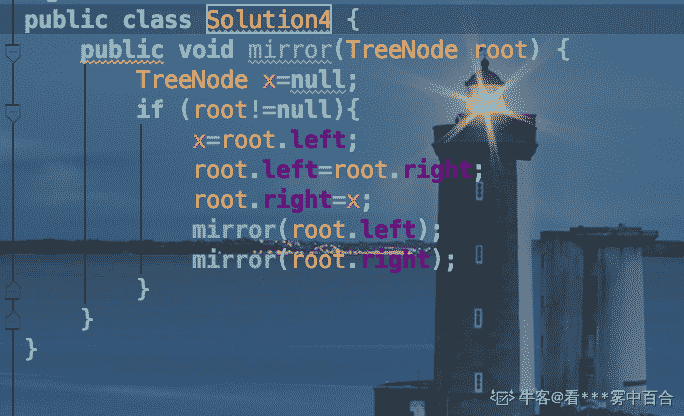
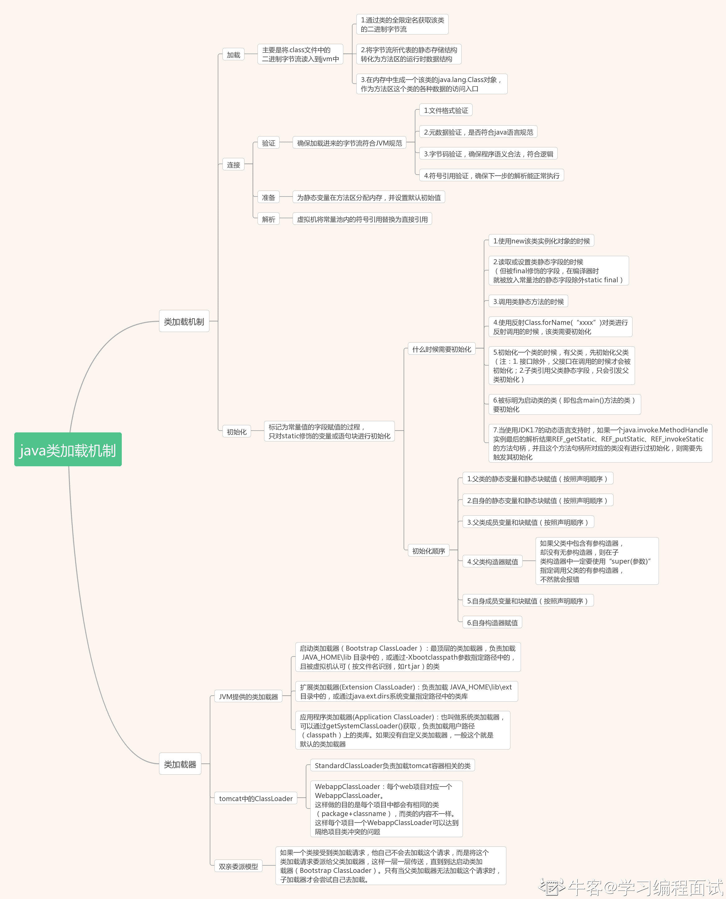
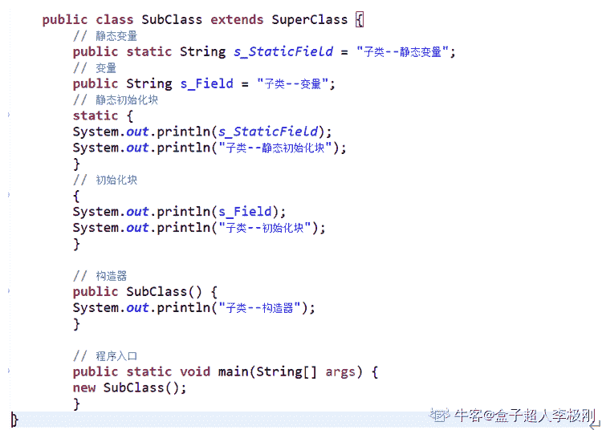
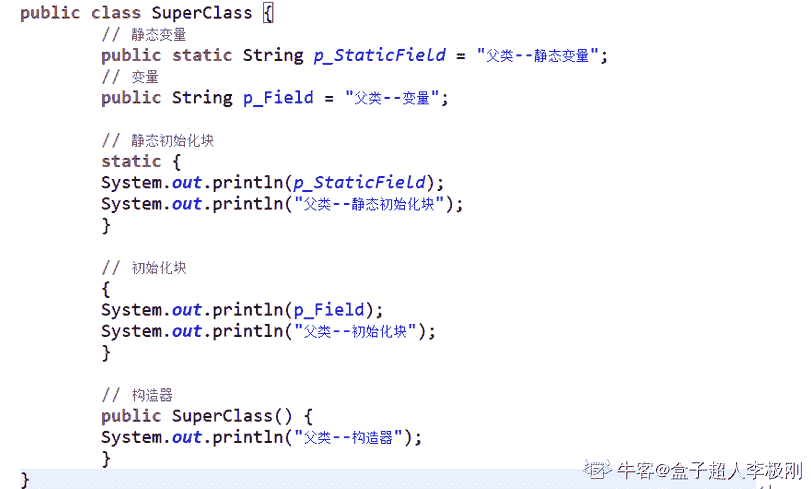
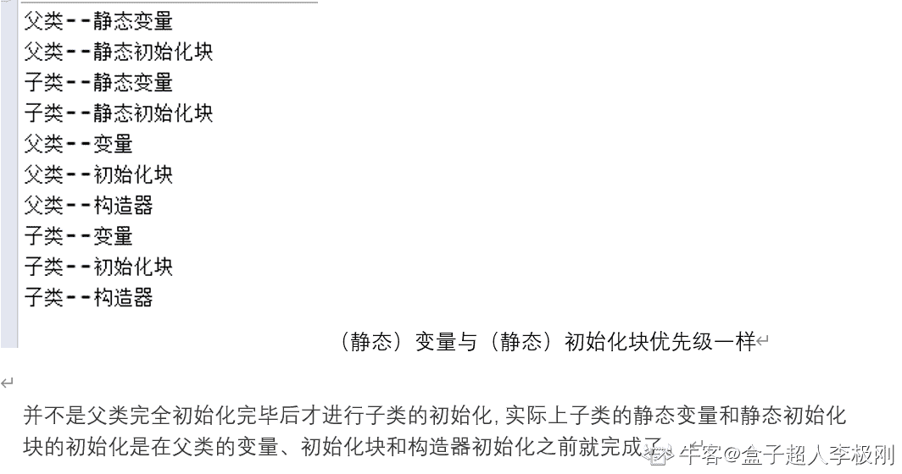

# 小米 2018 秋招测试开发工程师客观题合集

## 1

静态变量 static 在不同的实例中地址是否一样？他们储存在什么区域？

正确答案: C   你的答案: 空 (错误)

```cpp
地址一样，在堆栈区。
```

```cpp
地址不一样，在堆栈区。
```

```cpp
地址一样，在全局区。
```

```cpp
地址不一样，在全局区。
```

本题知识点

Java 工程师 C++工程师 测试工程师 小米 2018

## 2

在网络字节序中，所谓”小端”(little endian)说法正确的是

正确答案: B   你的答案: 空 (错误)

```cpp
高字节数据存放在低地址处，低字节数据存放在高地址处
```

```cpp
低字节位数据存放在内存低地址处, 高字节位数据存放在内存高地址处
```

```cpp
和编译器相关
```

```cpp
上述答案都不正确
```

本题知识点

Java 工程师 C++工程师 测试工程师 小米 操作系统 2018

讨论

[我要拿 offer!](https://www.nowcoder.com/profile/2470771)

“小端”  低字节位数据放在内存低地址处，高字节位数据放在内存高地址处“大端”，低字节位放在高地址，高字节放在低地址

发表于 2019-09-15 11:55:23

* * *

[弱鸡=鶸](https://www.nowcoder.com/profile/551802625)

大端：高地址对应低字节，低地址对应高字节小端：高地址对应高字节，低地址对应低字节 C++里可用 union 来判断大小端模式

发表于 2020-07-23 10:22:23

* * *

[牛客 983288191 号](https://www.nowcoder.com/profile/983288191)

大端：高地址对应低字节，低地址对应高字节小端：高地址对应高字节，低地址对应低字节 C++里可用 union 来判断大小端模式

发表于 2020-09-16 08:57:07

* * *

## 3

以下说法中正确的是

正确答案: B   你的答案: 空 (错误)

```cpp
分时系统中，当时间片一定时，内存越少，响应时间越长
```

```cpp
分段式存储管理内存时，进程必须全部装入内存
```

```cpp
进程的阻塞和挂起都是一种被动行为，是等待任务或者资源时的一种表现
```

```cpp
页面走向：1、2、3、4、1、2、4，采用 FIFO 页面置换算法，缺页次数为 5
```

本题知识点

Java 工程师 C++工程师 测试工程师 小米 操作系统 2018

## 4

用常规的非递归方法遍历一个平衡二叉树，所需的时间复杂度和空间复杂度是（）

正确答案: A   你的答案: 空 (错误)

```cpp
O(n), O(n)
```

```cpp
O(n), O(1)
```

```cpp
O(n²), O(n²)
```

```cpp
O(n), O(n²)
```

本题知识点

复杂度 树

讨论

[牛客 Cver](https://www.nowcoder.com/profile/1897620)

非递归的访问遍历二叉树的算法中的基本操作是访问结点，则不论按哪一种次序进行遍历，对 n 个结点的二叉树，其时间复杂度均为 O(n)。所需辅助空间为遍历过程中栈的最大容量，即树的深度，最坏情况下为 n,则空间复杂度也为 O(n)。

发表于 2020-02-27 14:23:55

* * *

[牛🐮🐮🐮](https://www.nowcoder.com/profile/258711807)

非递归遍历一般为层次遍历。层次遍历逐层遍历所有节点，时间复杂度为 on，空间复杂度为高度最高层的叶子节点数最大为 on

发表于 2020-04-01 09:34:34

* * *

[BlackCarDriver](https://www.nowcoder.com/profile/1425406)

额。。。BFS 和 DFS 同样可以用非递归方式实现的呀。。。

发表于 2020-05-06 16:20:56

* * *

## 5

二叉树的前序遍历是：-+abc*de/f，后序遍历是：bad*c+f/e-，则层序遍历和中序遍历依次为

正确答案: A   你的答案: 空 (错误)

```cpp
1
```

```cpp
2
```

```cpp
3
```

```cpp
4
```

本题知识点

Java 工程师 C++工程师 测试工程师 小米 树 2018

讨论

[绅蓝](https://www.nowcoder.com/profile/1596072)

这道题考的是运气？

发表于 2019-04-26 10:26:19

* * *

[chapeaudepaille](https://www.nowcoder.com/profile/9465180)

果然，运气也是实力的一种！

发表于 2019-10-17 20:21:12

* * *

[蒙牛麦片](https://www.nowcoder.com/profile/43911588)

应该是运气

发表于 2019-10-14 16:39:09

* * *

## 6

现有初始状态均为空的栈 X 和队列 Y，元素 a、b、c、d、e、f、g 依次进入栈 X，每个元素出栈后即进入队列 Y，如果出队列的顺序为 b、c、f、e、g、d、a，则要求栈 X 最小容量为

正确答案: C   你的答案: 空 (错误)

```cpp
6
```

```cpp
5
```

```cpp
4
```

```cpp
3
```

本题知识点

Java 工程师 C++工程师 测试工程师 小米 栈 *2018* *讨论

[xx.wdm](https://www.nowcoder.com/profile/557050566)

栈: 先进后出,后进先出队列: 先进先出,后进后出元素 a,b,c,d,e,f,g 依次进入栈 X 中,但是没有说是全部进入再依次出出队列的顺序是 b、c、f、e、g、d、a,表示进队列的顺序就是 b,c,f,e,g,d,a 所以推测进出栈的过程是:1\. a 进栈(此时栈中只有 a)2\. b 进栈,b 出栈(b 进栈还没出时,栈中有 a 和 b; b 出栈后,栈中只有 a) ---到这里,栈的容量为 2 即可满足 3\. c 进栈,c 出栈(c 进栈还没出时,栈中有 a 和 c; c 出栈后,栈中只有 a) ---到这里,栈的容量为 2 即可满足 4.d 进栈(过程结束后,栈中有 a 和 d)---同上,栈的容量为 2 即可满足 5.e 进栈(过程结束后,栈中有 a,d 和 e)---此时,栈的容量最小为 36.f 进栈,f 出栈(f 进栈还没出时,栈中有 a,d,e 和 f; f 出栈后,栈中有 a,d 和 e) --- 这个过程需要栈的容量至少为 4 才能保证 a,d,e,f 四个元素同时出现在栈中 7.e 出栈(过程结束后,栈中有 a 和 d)8.g 进栈,g 出栈(g 进栈还没出时,栈中有 a,d 和 g; g 出栈后,栈中有 a 和 d) --- 这个过程需要栈的容量最小为 39.d 出栈 10.a 出栈综小,栈的容量最少为 4

发表于 2019-11-04 21:20:38

* * *

[--sgf--](https://www.nowcoder.com/profile/8882859)

演示一遍，看栈中最长有几个。

发表于 2022-01-09 16:20:39

* * *

[牛客 400303173 号](https://www.nowcoder.com/profile/400303173)

队列是先进先出，所以出队列顺序就是出栈时候的顺序。f 进栈的时候里面已经有 a,de,f 还能进说明容量至少为 4

发表于 2021-06-08 11:37:17

* * *

## 7

设散列表的长度为 10，散列函数 H(n)=n mod 7，初始关键字序列为 (33，24，8，17，21，10)，用链地址法作为解决冲突的方法，平均查找长度是？

正确答案: B   你的答案: 空 (错误)

```cpp
1
```

```cpp
1.5
```

```cpp
2
```

```cpp
2.5
```

本题知识点

查找 *哈希* **讨论

[我要 offer 求你了](https://www.nowcoder.com/profile/496712975)

hashmap 的构造方式的一种，就是构造一个长度为 7 的数组（哈希函数的除数）， 把每个余数相同的数去对应的数组元素里面去找，数组存放的是链表，遍历链表，如果当前指针指向的元素与查找的元素相同就返回，如果找不到，就在最后添加上这个元素。33%7=5->1 (数组元素是空链表，直接添加元素，比较次数是 1）24%7=3->18%7=1->117%7=3->2（在构造数组的 nums[2],之前已经存储了一个 3（在 24%7），所以需要比较两次）21%7=0->110%7=3->3res = (1+1+1+2+1+3)/6=1.5 我是按照 leetcode 上面一道构造 hashmap 的题目来说的，不知道对不对，欢迎指点。

发表于 2019-12-02 15:21:03

* * *

[卡卡罗特 xxx](https://www.nowcoder.com/profile/615820)

33/7=5, 查找 33 需要 1 次；
24/7=3,查找 24 需要 1 次；8/7=1,查找 8 需要 1 次；17/7=3,查找 17 需要 2 次；21/7=0,查找 21 需要 1 次；10/7=3,查找 10 需要 3 次；ASL=每个关键字查找的次数之和/关键字的个数=（1+1+1+2+3+1）/6=1.5

发表于 2019-09-05 09:56:26

* * *

[Jack201809052301207](https://www.nowcoder.com/profile/368204420)

哈希表不考虑冲突查找的时间复杂度是 O（1），而考虑冲突就是取决于使用解决冲突的方式，如果是链地址解决冲突的话，时间复杂度是 n/2。如果是红黑树的话，就是 log2(n)。这里的散列后 3 号数组有 3 个链表节点，所以时间复杂度是 3/2=1.5。

发表于 2020-04-02 21:16:53

* * *

## 8

n 个人拎着水桶在一个水龙头前面排队打水，水桶有大有小，水桶必须打满水，水流恒定。说法不正确的是

正确答案: A   你的答案: 空 (错误)

```cpp
让水桶大的人先打水，可以使得每个人排队时间之和最小
```

```cpp
让水桶小的人先打水，可以使得每个人排队时间之和最小
```

```cpp
让水桶小的人先打水，在某个确定的时间 t 内，可以让尽可能多的人打上水
```

```cpp
若要在尽可能短的时间内，n 个人都打完水，按照什么顺序其实都一样
```

本题知识点

数学运算

讨论

[牛客 355216323 号](https://www.nowcoder.com/profile/355216323)

这是一道变相考查操作系统中作业调度的一道题，是明显的短作业优先算法

发表于 2020-02-18 20:40:43

* * *

[走在学习的路上的 IT 男一枚](https://www.nowcoder.com/profile/104569056)

可以假设有 5 个人，打水耗时从少到多依次为（单位：min）：1，2，3，4，5。则 A 中每个人排队耗时：0，5，5+4，5+4+3，5+4+3+2，而 B 中每个人排队耗时：0，1，1+2，1+2+3，1+2+3+4 答案很明显：A 至于 C，可用排队耗时来计算，用 B 的方案，D，表示打水耗时之和，既然 n 个人都要打完水，则总耗时以固定

发表于 2019-09-04 07:08:20

* * *

[hnust_chensiyuan](https://www.nowcoder.com/profile/612402076)

吐了 读错题了

发表于 2020-05-15 11:09:44

* * *

## 9

已知二叉树 Node 定义如下, 现在需要设计一个方法交换左子树和右子树, 下列方法中, 可以实现交换的是? 

正确答案: D   你的答案: 空 (错误)

```cpp
void swap(Node root) {Node* temp=root.left;root.left=root.right;root.right=temp;}
```

```cpp
void swap(Node& left, Node& right) {Node temp=left; left=right;right=temp;}
```

```cpp
void swap(Node* left, Node* right) {Node* temp=left; left=right;right=temp;}
```

```cpp
void swap(Node*& left, Node*& right) {Node* temp=left; left=right;right=temp;}
```

本题知识点

Java 工程师 C++工程师 测试工程师 小米 树 2018

讨论

[557.纯洁的快播](https://www.nowcoder.com/profile/3254983)

A 操作的是传入参数(root)整个对象的复制，并不会改变传入参数里 left 和 right 的值~这点和 Java、C#不同哦，Java、C#函数里对象只能传引用的复制。

发表于 2019-09-05 18:15:24

* * *

[看***雾中百合](https://www.nowcoder.com/profile/3412791)


这怎么就不能就是 A 了？而且 Java 有指针嘛，我明明做的就是 java 题，老是给我弄到 C++里面，就是因为指针弄不明白才不往 C++走的。。。还给我这种指针题目。。

发表于 2019-09-02 09:16:39

* * *

[swordApe](https://www.nowcoder.com/profile/2551149)

A 为啥不对啊

发表于 2019-08-12 11:27:53

* * *

## 10

运行下面代码，输出的结果是（）

```cpp
class A {
    public A() {
        System.out.println("class A");
    }
    { System.out.println("I'm A class"); } 
    static { System.out.println("class A static"); }
}
public class B extends A {
    public B() {
        System.out.println("class B");
    }
    { System.out.println("I'm B class"); }
    static { System.out.println("class B static"); }

    public static void main(String[] args) { 
 new B(); 
```

```cpp
}
}
```

正确答案: A   你的答案: 空 (错误)

```cpp
class A static
class B static
I'm A class
class A
I'm B class
class B
```

```cpp
class A static
I'm A class
class A
class B static
I'm B class
class B
```

```cpp
class A static
class B static
class A
I'm A class
class B
I'm B class
```

```cpp
class A static
class A
I'm A class
class B static
class B
I'm B class
```

本题知识点

Java 工程师 C++工程师 测试工程师 小米 Java 2018

讨论

[要喝手磨咖啡](https://www.nowcoder.com/profile/547420649)

这题做了不知道多少遍了。

Java 程序初始化顺序：

1.  父类的静态代码块
2.  子类的静态代码块
3.  父类的普通代码块
4.  父类的构造方法
5.  子类的普通代码块
6.  子类的构造方法

发表于 2019-08-28 12:14:53

* * *

[程序猿 Go 师傅](https://www.nowcoder.com/profile/242025553)

类初始化顺序请看下图：

编辑于 2019-10-21 11:12:12

* * *

[盒子超人李极刚](https://www.nowcoder.com/profile/375559079)



发表于 2020-09-29 21:59:54

* * ****