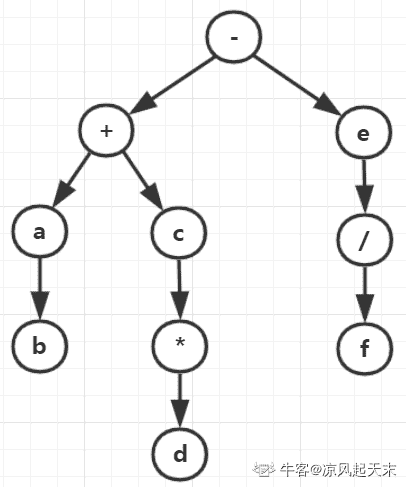
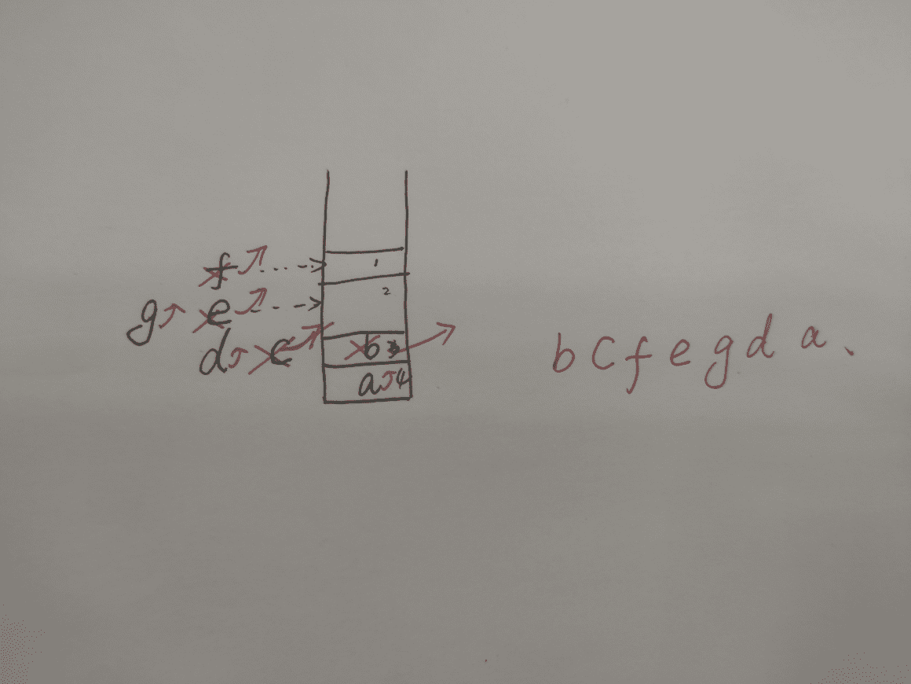
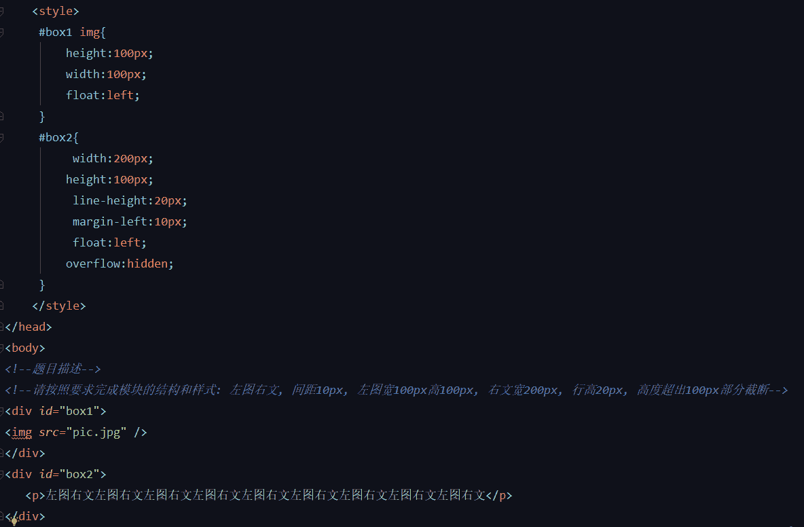

# 小米 2018 秋招前端工程师笔试题

## 1

静态变量 static 在不同的实例中地址是否一样？他们储存在什么区域？

正确答案: C   你的答案: 空 (错误)

```cpp
地址一样，在堆栈区。
```

```cpp
地址不一样，在堆栈区。
```

```cpp
地址一样，在全局区。
```

```cpp
地址不一样，在全局区。
```

本题知识点

前端工程师 小米 安卓工程师 Java 工程师 C++工程师 测试工程师 栈 *堆 安卓工程师 前端工程师 小米 2018 安卓工程师 小米 2018* *讨论

[归来仍是少年 v](https://www.nowcoder.com/profile/255695337)

全局区（静态区）（static）— 全局变量和静态变量的存储是放在一块的，初始化的全局变量和静态变量在一块区域， 未初始化的全局变量和未初始化的静态变量在相邻的另一块区域。

发表于 2019-09-05 16:00:11

* * *

## 2

在网络字节序中，所谓”小端”(little endian)说法正确的是

正确答案: B   你的答案: 空 (错误)

```cpp
高字节数据存放在低地址处，低字节数据存放在高地址处
```

```cpp
低字节位数据存放在内存低地址处, 高字节位数据存放在内存高地址处
```

```cpp
和编译器相关
```

```cpp
上述答案都不正确
```

本题知识点

前端工程师 小米 安卓工程师 Java 工程师 C++工程师 测试工程师 操作系统 安卓工程师 前端工程师 小米 2018 安卓工程师 小米 2018

讨论

[deefre](https://www.nowcoder.com/profile/36503303)

对于整型、长整型等数据类型，Big endian 认为第一个字节是最高位字节**（按照从低地址到高地址的顺序存放数据的高位字节到低位字节）**；而 Little endian 则相反，它认为第一个字节是最低位字节**（按照从低地址到高地址的顺序存放据的低位字节到高位字节）**。

例如，假设从内存地址 0x0000 开始有以下数据：  
0x0000         0x0001       0x0002       0x0003  
0x12            0x34           0xab           0xcd 
如果我们去读取一个地址为 0x0000 的四个字节变量，若字节序为 big-endian，则读出结果为 0x1234abcd；若字节序为 little-endian，则读出结果为 0xcdab3412。

如果我们将 0x1234abcd 写入到以 0x0000 开始的内存中，则 Little endian 和 Big endian 模式的存放结果如下：  
地址           0x0000         0x0001        0x0002          0x0003 
big-endian   0x12           0x34            0xab            0xcd  
little-endian  0xcd           0xab            0x34            0x12

一般来说，x86 系列 CPU 都是 little-endian 的字节序，PowerPC 通常是 big-endian，网络字节顺序也是 big-endian 还有的 CPU 能通过跳线来设置 CPU 工作于 Little endian 还是 Big endian 模式。

对于 0x12345678 的存储：

小端模式：（从低字节到高字节）
地位地址 0x78 0x56 0x34 0x12 高位地址

大端模式：（从高字节到低字节）
地位地址 0x12 0x34 0x56 0x78 高位地址

发表于 2019-08-05 14:42:29

* * *

## 3

用常规的非递归方法遍历一个平衡二叉树，所需的时间复杂度和空间复杂度是？

正确答案: A   你的答案: 空 (错误)

```cpp
O(n),O(n)
```

```cpp
O(n),O(1)
```

```cpp
O(n*n),O(n*n)
```

```cpp
O(n),O(n*n)
```

本题知识点

前端工程师 小米 安卓工程师 Java 工程师 C++工程师 测试工程师 复杂度 树 安卓工程师 前端工程师 小米 2018 安卓工程师 小米 2018

讨论

[白 404](https://www.nowcoder.com/profile/150238853)

应该就是层次遍历啦，用队列实现，所以很明显应该都是是 O（n）啦

发表于 2019-04-04 16:10:47

* * *

## 4

二叉树的前序遍历是：-+abc*de/f，后序遍历是：bad*c+f/e-，则层序遍历和中序遍历依次为

正确答案: A   你的答案: 空 (错误)

```cpp
-+eac/b*fd、ab+d*c-ef/
```

```cpp
-+eac/b*fd、ba+d*c-ef/
```

```cpp
-+eacf/b*d、ab+d*c-fe/
```

```cpp
-+eacf/b*d、ba+d*c-fe/
```

本题知识点

前端工程师 小米 安卓工程师 Java 工程师 C++工程师 测试工程师 树 安卓工程师 前端工程师 小米 2018 安卓工程师 小米 2018

讨论

[凉风起天末](https://www.nowcoder.com/profile/709610362)

首先，这道题所给序列中的**字符没有实际含义**，不能以符号的原本含义来推理本题（因为在尝试将后序序列当作算术表达式的后缀式来进行计算验证时，最终存储操作数的栈未能清空）；接下来，常规的解题思路当然还是先还原出二叉树，当然只由先、后序遍历序列是不能确定一棵树的，但是我们可以还原出树的大致轮廓，过程如下：

1.  **确定树的根节点**：“先序的首字符” 和 “后序的尾字符” 相同，为树的根节点；
2.  **判断树的左、右子树节点集合**：设先序顺序为 "根 - 左右(A)"，后序顺序为 “左右(B) - 根”，则 A 的首字符 A-Head 为某子树的根节点（如果两子树均存在，它是左树的根，但是如果有一棵子树不存在，那边我们就无法判断它是谁的根），在 B 序列中找出 A-Head 的位置，若 B 中 A-Head 位于尾部，则说明有一棵子树为空（但是我们无法判断是左还是右，画图时需要**以竖直向下的边连接根与子树**，表明子树的左右位置无法确定），而若 A-Head 位于 B 中间的某个位置，则该位置便是左右子树序列的分界点，左右子树的节点序列由此确定；
3.  **递归判断**：左右子树的序列与主序列具有相同性质，递归直至确定了叶子节点；

本题还原出来的二叉树结构如下图所示，它的层次遍历序列是确定的，但是中序遍历序列由于无法确定节点 b 关于 a 的左右位置，b 在左，则 b 先输出，b 在右，则 a 先输出，所以本题选项 A、B 均正确：

编辑于 2019-09-23 00:05:19

* * *

[yhnsw0711](https://www.nowcoder.com/profile/246585495)

中序遍历不是左根右吗，左子树最左边的节点不应该是 b 吗，答案是不是错了

发表于 2019-03-20 16:48:36

* * *

[雨康啊](https://www.nowcoder.com/profile/896209423)

首先“中序”+“前序”、“中序”+“后序”都能唯一确定一个二叉树是必然的，但是缺了“中序”就不能唯一确定一棵二叉树也是必然的

发表于 2019-09-19 14:35:31

* * *

## 5

现有初始状态均为空的栈 X 和队列 Y，元素 a、b、c、d、e、f、g 依次进入栈 X，每个元素出栈后即进入队列 Y，如果出队列的顺序为 b、c、f、e、g、d、a，则要求栈 X 最小容量为

正确答案: C   你的答案: 空 (错误)

```cpp
6
```

```cpp
5
```

```cpp
4
```

```cpp
3
```

本题知识点

前端工程师 小米 安卓工程师 Java 工程师 C++工程师 测试工程师 栈 *安卓工程师 前端工程师 小米 2018 安卓工程师 小米 2018* *讨论

[20181111](https://www.nowcoder.com/profile/125245013)

X,首先 ab 入栈， b 在出栈 ，c 入栈, c 出栈, def 入栈，fe 出栈, g 入栈。 期间最多存在 4 个元素 adef

发表于 2019-03-23 22:14:58

* * *

[学吒](https://www.nowcoder.com/profile/5908722)



编辑于 2019-07-26 09:50:07

* * *

## 6

n 个人拎着水桶在一个水龙头前面排队打水，水桶有大有小，水桶必须打满水，水流恒定。说法不正确的是

正确答案: A   你的答案: 空 (错误)

```cpp
让水桶大的人先打水，可以使得每个人排队时间之和最小
```

```cpp
让水桶小的人先打水，可以使得每个人排队时间之和最小
```

```cpp
让水桶小的人先打水，在某个确定的时间 t 内，可以让尽可能多的人打上水
```

```cpp
若要在尽可能短的时间内，n 个人都打完水，按照什么顺序其实都一样
```

本题知识点

前端工程师 小米 安卓工程师 Java 工程师 C++工程师 测试工程师 高级算法 安卓工程师 前端工程师 小米 2018 安卓工程师 小米 2018

讨论

[智哥一米八](https://www.nowcoder.com/profile/90294398)

不正确的。。。

发表于 2019-12-17 22:56:38

* * *

[要向上](https://www.nowcoder.com/profile/31911074)

桶越大，接水时间越长，后面人等的时间就越长

发表于 2019-09-06 00:03:19

* * *

## 7

已知二叉树 Node 定义如下, 现在需要设计一个方法交换左子树和右子树, 下列方法中, 可以实现交换的是?

```cpp
class Node {
public:
    Node* left;
    Node* right;
    char
content;

    Node(char
content);
private:
    Node(const
Node&);
    Node&
operator=(const Node& node);
};
```

正确答案: D   你的答案: 空 (错误)

```cpp
void swap(Node root) {Node*
temp=root.left;root.left=root.right;root.right=temp;}
```

```cpp
void swap(Node& left, Node& right) {Node
temp=left; left=right;right=temp;}
```

```cpp
void swap(Node* left, Node* right) {Node* temp=left;
left=right;right=temp;}
```

```cpp
void swap(Node*& left, Node*& right) {Node*
temp=left; left=right;right=temp;}
```

本题知识点

前端工程师 小米 安卓工程师 Java 工程师 C++工程师 测试工程师 树 安卓工程师 前端工程师 小米 2018 安卓工程师 小米 2018

## 8

以下哪个特性不是 HTTP2 协议的新特性？

正确答案: C   你的答案: 空 (错误)

```cpp
Header
Compression
```

```cpp
Server Push
```

```cpp
Pipelining
```

```cpp
Multiplexing
```

本题知识点

前端工程师 小米 网络基础 安卓工程师 前端工程师 小米 2018

讨论

[deefre](https://www.nowcoder.com/profile/36503303)

[`blog.csdn.net/sysuzhyupeng/article/details/56508111`](https://blog.csdn.net/sysuzhyupeng/article/details/56508111)

发表于 2019-08-05 15:06:49

* * *

## 9

以下 http 状态码描述错误的是？

正确答案: B   你的答案: 空 (错误)

```cpp
200 正常响应
```

```cpp
304 重定向
```

```cpp
403 无权限
```

```cpp
505 服务端错误
```

本题知识点

前端工程师 小米 网络基础 安卓工程师 前端工程师 小米 2018

讨论

[越大越矫情丶](https://www.nowcoder.com/profile/2904072)

302 重定向,304 未修改

发表于 2020-09-14 21:54:40

* * *

[祝小米,freewheel,美团倒闭](https://www.nowcoder.com/profile/380672)

302 是重定向

发表于 2019-10-03 11:08:58

* * *

[付攀](https://www.nowcoder.com/profile/493514208)

302 临时移动。304 未修改

发表于 2019-10-23 18:25:13

* * *

## 10

下列选项中，能获取到 input 节点的一项是（）

```cpp
<form class="file" name="upload">
    <input id="file" name="file"/>
</form>
```

正确答案: D   你的答案: 空 (错误)

```cpp
document.querySelectorAll('file')[0]
```

```cpp
document.getElementById('file')[0]
```

```cpp
document.getElementByTagName('file')[0]
```

```cpp
document.getElementById('file')
```

本题知识点

前端工程师 小米 Javascript 安卓工程师 2018

讨论

[牛客 783273900 号](https://www.nowcoder.com/profile/783273900)

答案应该是：document. getElementById('file')。id 唯一性，它不可能是一个数组。

发表于 2019-12-18 19:22:35

* * *

[牛客 336280966 号](https://www.nowcoder.com/profile/336280966)

这道题有毒？

发表于 2019-09-10 09:05:42

* * *

[yhnsw0711](https://www.nowcoder.com/profile/246585495)

D 获取的不是 form 标签吗，怎么就成 input 节点了

发表于 2019-03-20 16:54:28

* * *

## 11

获取 input 节点的正确方法是(  )
<form class="file" name="upload">
<input id="file" name="file" />
</form>

正确答案: D   你的答案: 空 (错误)

```cpp
document.querySelectorAll('file')[0]
```

```cpp
document.getElementById('file')[0]
```

```cpp
document.getElementByTagName('file')[0]
```

```cpp
document.getElementById('file')
```

本题知识点

前端工程师 小米 Javascript 安卓工程师 2018

讨论

[Jnim](https://www.nowcoder.com/profile/509820987)

A：返回所有元素节点列表里面的第 1 个应该写成

```cpp
document.querySelectorAll('#file')[0]

```

B：id 选择器，id 是唯一的

```cpp
document.getElementById('file')
```

C：标签名选择器

```cpp
document.getElementByTagName('input')[0]
```

发表于 2020-08-25 15:16:50

* * *

[lmy 永不言败](https://www.nowcoder.com/profile/9186281)

A 选项应该是 document.querySelectorAll('#file')[0]B 选项应该是 document.getElementById('file')C 选项应该是 document.getElementsByTagName('input')[0]

编辑于 2021-02-20 11:12:36

* * *

[猫爪草](https://www.nowcoder.com/profile/2437311)

id 是唯一的

发表于 2021-09-10 17:22:11

* * *

## 12

请按照要求完成模块的结构和样式: 左图右文, 间距 10px, 左图宽 100px 高 100px, 右文宽 200px, 行高 20px, 高度超出 100px 部分截断

你的答案

本题知识点

前端工程师 小米 安卓工程师 2018

讨论

[LeonardoRain](https://www.nowcoder.com/profile/455370907)

```cpp
<!DOCTYPE html>
<html lang="en">

<head>
    <meta charset="UTF-8">
    <meta name="viewport" content="width=device-width,initial-scale=1.0">
    <title>test</title>
    <style>
        * {
            margin: 0;
            padding: 0;
        }

        .container {
            width: 100%;
            height: 100px;
            text-align: left;
        }

        .imgBox {
            width: 100px;
            height: 100px;
            float: left;
            margin-right: 10px;
            background-color: #ff6699;
        }

        .imgBox img {
            display: inline-block;
            width: 100px;
            height: 100px;
        }

        .textBox {
            width: 200px;
            height: 100px;
            line-height: 20px;
            overflow: hidden;
            float: left;
            background-color: #6699ff;
        }
    </style>
</head>

<div class="container">
    <div class="imgBox"></div>
    <div class="textBox">This is a div whose classname is textBox!This is a div whose classname is textBox!This is a div
        whose classname is textBox!This is a div whose classname is textBox!This is a div whose classname is textBox!
        This is a div whose classname is textBox!This is a div whose classname is textBox!This is a div whose classname
        is textBox!This is a div whose classname is textBox!This is a div whose classname is textBox!</div>
</div>

</html>

```

发表于 2019-09-09 19:56:30

* * *

[半梦半醒、半忧伤](https://www.nowcoder.com/profile/527641002)

```cpp
<style>
    .main
    {
        display:flex;
        flex:row nowrap;
                height:100px;
                overflow:hidden;
    }
    .left
    {
        width:100px;
        height:100px;
        margin-left:10px
    }
    .right{
        width:200px;
        height:20px;
    }
</style>
<div class='main'>
    <div class='left'>
    </div>
    <div class='right'>
    </div>
</div>

```

发表于 2019-12-06 20:51:35

* * *

[学吒](https://www.nowcoder.com/profile/5908722)



发表于 2019-07-26 09:59:03

* * *

## 13

描述 cookie 和 localStorage 的区别，为什么 cookie 的容量限制比 localStorage 小？

你的答案

本题知识点

前端工程师 小米 安卓工程师 2018

讨论

[Dralinc](https://www.nowcoder.com/profile/859058739)

参考答案

Cookie 和 localStorage 的区别有：

1\. Cookie 可以由服务端和 js 读写（如果设置了 HttpOnly 的话 js 无法读）,localStorage 只能是 js 读写。（5 分）

2\. Cookie 会附带在 HTTP 请求头里，而 localStorage 不会。（5 分）

3\. Cookie 可设置过期时间，而 localStorage 不能。

(5 分）

4\. 同域名的 http 和 https 共享 cookie(设置了 Secure 的除外）但是不共享 localStorage。（5 分）

5\. Cookie 的接口没有 localStorage 方便，

localStorage 直接写 key-value,而 cookie 需要自己构造符合要求的格式。（5 分）

因为 cookie 会附带在 HTTP 请求头里，如果太大会影响传输性能，所以容量限制比较小。（5 分）

发表于 2019-09-26 14:58:25

* * ***