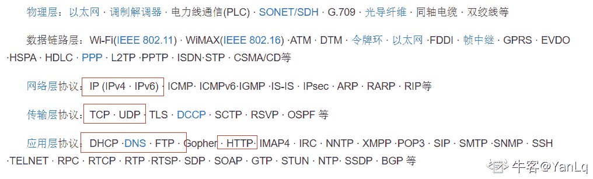
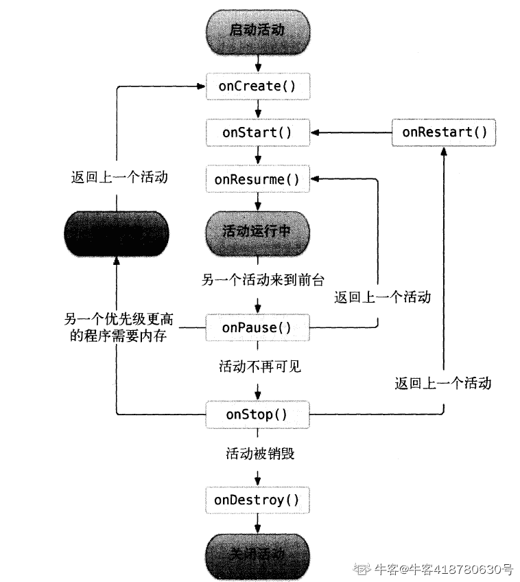
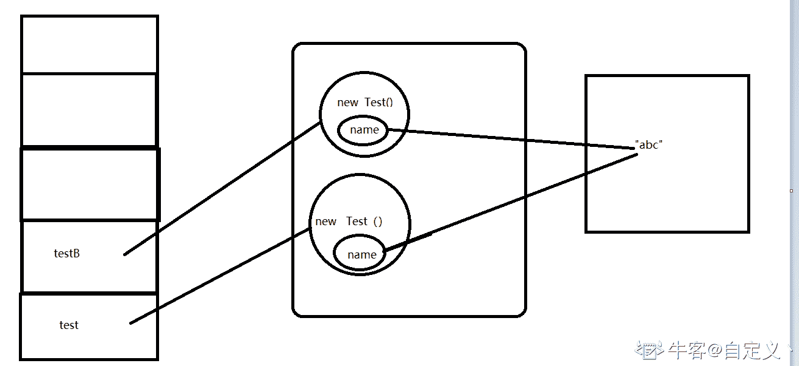

# 小米 2019 秋招安卓开发笔试题（A）

## 1

优先级队列和有序数组的一个区别是()

正确答案: A   你的答案: 空 (错误)

```cpp
最低优先级别的数据项不能从数组中轻易的提取出来，而在优先级队列中可以。
```

```cpp
数组必须是有序的，而优先级队列不需要。
```

```cpp
最高优先级的数据项可以很容易地从优先级队列中提取出来，而有序数组不行。
```

```cpp
其他三个选项都是。
```

本题知识点

安卓工程师 小米 数组 队列 *2019* *讨论

[💓FaLoFr，](https://www.nowcoder.com/profile/799309062)

A.最大堆你可以想象成一颗二叉树，堆顶元素一定是最大值，然后它的每一棵子树也都是最大堆。优先队列的默认实现是最大堆，但是里面有个参数可以设置，设置之后就是最小堆。所以 A 是对的，最低优先级可以提取 B.数组和优先队列都不是有序的 C.有序数组是一种特殊的数组，里面的元素，按一定的顺序排列。有序数组可以直接提取最高优先级的元素

编辑于 2019-11-07 09:28:05

* * *

[KetchupZ](https://www.nowcoder.com/profile/5826009)

我选的 B。题目中没指定优先队列采用最小堆还是最大堆，我认为 A，C 都是对的。对于 B，有序数组必须保证有序结构。而优先队列是用堆实现的，最大堆（最小堆）只能保证每次操作之后最高（最低）优先级的元素在堆顶，且满足每个节点元素优先级大于（小于）儿子元素优先级，而没有祖先关系的元素之间的优先级关系是不确定的。所以优先队列也不能被成为有序的，只能说操作保证取出元素有序（没有插入的情况下）。

编辑于 2020-02-23 10:57:41

* * *

[我会回来的呢](https://www.nowcoder.com/profile/310331371)

数组为什么不能提取？数组不是可以随机访问吗？

发表于 2019-11-09 18:01:45

* * *

## 2

一个二叉树的先序遍历序列是：CBDAGHEF，中序遍历序列是：DBHGACEF。那么它的后序遍历结果是（）

正确答案: B   你的答案: 空 (错误)

```cpp
FEHGADBC
```

```cpp
DHGABFEC
```

```cpp
DHGABCFE
```

```cpp
FECAGHBD
```

本题知识点

安卓工程师 小米 树 2019

讨论

[w201903290842786](https://www.nowcoder.com/profile/172905981)

由先序遍历和中序遍历的顺序来看，可以看出根节点是 c，ef 在 c 的右子树上。而后续遍历得顺序为左右根，所以 c 应该是最后一个，f 在 c 的右子树，不可能是第一个

发表于 2020-04-22 23:23:10

* * *

[风中沉思](https://www.nowcoder.com/profile/9087105)

先序遍历为顺序为根左右，先序遍历的结果为 CBDAGHEF，可得该二叉树的根节点为 C，而中序遍历顺序为左根右，中序遍历的结果为 DBHGACEF，C 的左边有 DBHGA，即是该二叉树的左子树，EF 则为二叉树的右子树，将 DBHGA 拿出来单独看成一颗数，由先序可知 B 是其根节点，得 D 为 B 得左叶子节点，HGA 则是其右子树，再由先序可知 A 是其根节点，HG 是其左子树，由先序 GH 可知，G 是根节点，H 为其左子树，可得最后二叉树结构，求出后序遍历

发表于 2019-10-22 17:24:42

* * *

[小唐哥](https://www.nowcoder.com/profile/33712367)

我都是计算出来的

发表于 2021-03-31 14:57:25

* * *

## 3

线性表若采用链式存储结构时，要求内存中可用存储单元的地址 

正确答案: D   你的答案: 空 (错误)

```cpp
必须是连续的
```

```cpp
部分地址必须是连续的
```

```cpp
一定是不连续的
```

```cpp
连不连续都可以
```

本题知识点

安卓工程师 小米 链表 *安卓工程师 小米 2019 安卓工程师 小米 2019* *## 4

用选择排序方法对线性表(17，9，20，21，1，7，4，11，5)进行升序排序时，第 3 趟排序的结果是（ ）

正确答案: B   你的答案: 空 (错误)

```cpp
9，17，20，21，1，7，4，11，5
```

```cpp
1，4，5，21，17，7，9，11，20
```

```cpp
1，4，5，17，9，20，21，7，11
```

```cpp
9，1，7，4，11，15，17，20，21
```

本题知识点

排序 *讨论

[33689](https://www.nowcoder.com/profile/626573458)

选择排序法升序，每一次选出未比较的序列中最小值，与前面的元素互换位置；记得是互换！！

发表于 2020-05-25 09:51:34

* * *

[今夜太冷不宜私奔](https://www.nowcoder.com/profile/239291435)

选择排序代码如下：

```cpp
public static void selectSort(int[] a){ int minIndex, temp; int len = a.length; for (int i = 0; i < len - 1; i++){
minIndex = i; for (int j = i + 1; j < len; j++){ if (a[j] < a[minIndex]){
minIndex = j;}
}
temp = a[i]; a[i] = a[minIndex]; a[minIndex] = temp; }
}
```

由此可得第一次： 1,9,20,21,17,7,4,11,5 第二次：1,4,20,21,17,7,9,11,5 第三次：1,4,5,21,17,7,9,11,20
故选 B。代码缩进怎么都调不对。。。。将就一下吧。。。尴尬  - -

编辑于 2019-04-08 17:31:56

* * *

[anshenone35](https://www.nowcoder.com/profile/913891545)

被比较值[i]与它之后的每一个值进行比较，将这一遍的比较值里最小的与[i]交换，然后 i++，重复上述操作

发表于 2020-07-22 10:19:46

* * *

## 5

栈底至栈顶已经依次存放了元素 J，K，L，在第四个元素 T 入栈前，栈中元素可以出栈，则出栈序列可能是() 正确答案: D   你的答案: 空 (错误)

```cpp
LJKT
```

```cpp
LTJK
```

```cpp
JKTL
```

```cpp
LKTJ
```

本题知识点

安卓工程师 小米 栈 *2019* *讨论

[渐行渐远*plane](https://www.nowcoder.com/profile/740684966)

C 也没问题吧，J 入 J 出，K 入 K 出，L 入，T 入，T 出，L 出，JKTL 没毛病啊

发表于 2019-08-28 13:33:21

* * *

[赵泊洋-前端](https://www.nowcoder.com/profile/944938078)

感觉题目不是很清晰，建议改进一下描述

发表于 2020-04-22 20:00:26

* * *

[cosmoswg](https://www.nowcoder.com/profile/569828528)

根据先进栈的元素不可能先出栈。栈中 J 元素不可能在 K 元素之前出栈，所以可以排除 A、B、C 选项。

编辑于 2019-12-16 19:02:03

* * *

## 6

检索所有比“王华”年龄大的学生姓名、年龄和性别。正确的 SELECT 语句是()

正确答案: A   你的答案: 空 (错误)

```cpp
SELECT SN，AGE，SEX FROM S
WHERE AGE＞(SELECT AGE FROM S
WHERE SN="王华")
```

```cpp
SELECT SN，AGE，SEX
FROM S
WHERE SN＝"王华"
```

```cpp
SELECT SN，AGE，SEX FROM S
WHERE AGE＞(SELECT AGE
WHERE SN="王华")
```

```cpp
SELECT SN，AGE，SEX FROM S
WHERE AGE＞王华.AGE
```

本题知识点

安卓工程师 小米 数据库 SQL 2019

讨论

[牛客 991973826 号](https://www.nowcoder.com/profile/991973826)

子查询必须是完整语句

发表于 2020-08-25 15:13:55

* * *

[不在窝里](https://www.nowcoder.com/profile/355205756)

1、（select age from S where sn =“王华”）   =  age(王华年龄)；2、select sn,AGE,sex from s where age > age(王华年龄)；

编辑于 2020-04-22 16:17:28

* * *

[离殇 201904180041178](https://www.nowcoder.com/profile/537111112)

首先求出王华的年龄，然后在把所有年龄的与所求出的年龄对比

发表于 2020-03-20 23:24:31

* * *

## 7

用下列 SQL 语句建立一个基本表：

CREATE TABLE Student ( Sno CHAR ( 4 ) PRIMARY KEY,
Sname CHAR ( 8 ) NOT NULL,
Sex CHAR ( 2 ) ,
Age INT )
可以插入到表中的元组是（）

正确答案: D   你的答案: 空 (错误)

```cpp
'5021'，'刘祥'，男，21
```

```cpp
NULL，'刘祥'，NULL，21
```

```cpp
'5021'，NULL，男，21
```

```cpp
'5021'，'刘祥'，NULL，NULL
```

本题知识点

安卓工程师 小米 数据库 SQL 安卓工程师 小米 2019 安卓工程师 小米 2019

讨论

[耳朵👂会动](https://www.nowcoder.com/profile/493164699)

主键不为空，not null 约束列不为空，char 类型加单引号

发表于 2019-05-31 11:19:58

* * *

[牛客 425148523 号](https://www.nowcoder.com/profile/425148523)

D 选项的最后一个 null，所以 int 是可以为空吗？

发表于 2020-04-04 02:43:59

* * *

[ヤ327S┼~](https://www.nowcoder.com/profile/504196961)

男是字符型要加单引号

发表于 2019-11-11 07:43:12

* * *

## 8

TCP/IP 协议中的 TCP 是哪一层协议？

正确答案: C   你的答案: 空 (错误)

```cpp
数据链路层
```

```cpp
网络层
```

```cpp
传输层
```

```cpp
应用层
```

本题知识点

安卓工程师 小米 网络基础 2019

讨论

[我可是帅哥嘞](https://www.nowcoder.com/profile/835139614)

没什么想说的，错了就是没认真看题目，说的就是我

发表于 2020-03-19 20:35:53

* * *

[YanLq](https://www.nowcoder.com/profile/94819113)

百度百科上的。就当复习一哈。

发表于 2020-11-14 17:18:54

* * *

[牛客 356836165 号](https://www.nowcoder.com/profile/356836165)

tcp 协议是一个可靠的，面向连接的，基于字节流的传输层通信协议

发表于 2022-02-25 18:57:04

* * *

## 9

以下属于 Activity 的启动模式有？

正确答案: A C D   你的答案: 空 (错误)

```cpp
SingleTop
```

```cpp
SingleActivity
```

```cpp
SingleTask
```

```cpp
SingleInstance
```

本题知识点

安卓工程师 小米 Android 2019

讨论

[张晋](https://www.nowcoder.com/profile/9550644)

B 没有，D 拼写错误。这种题目直接屏蔽。

发表于 2019-09-08 01:16:08

* * *

[ISK](https://www.nowcoder.com/profile/559698814)

很明显第四个拼错了，应该是 singleInstance。所以不选

发表于 2019-08-23 20:45:13

* * *

## 10

FirstActivity 跳转到 SecondActivity 后，然后点击返回键，以下执行顺序不可能出现的是：

正确答案: B C D   你的答案: 空 (错误)

```cpp
SecondActivity 的 onPause()->FirstActivity 的 onRestart()->FirstActivity 的 onResume()->SecondActivity 的 onStop()
```

```cpp
SecondActivity 的 onPause()->SecondActivity 的 onStop()->SecondActivity 的 onDestroy()->FirstActivity 的 onRestart()->FirstActivity 的 onResume()
```

```cpp
FirstActivity 的 onRestart() ->FirstActivity 的 onResume()->SecondActivity 的 onPause()->SecondActivity 的 onStop() ->SecondActivity 的
onDestroy()
```

```cpp
FirstActivity 的 onRestart()->SecondActivity 的 onPause()->SecondActivity 的 onStop()->SecondActivity 的 onDestroy()->FirstActivity 的 onResume()
```

本题知识点

安卓工程师 小米 Android 2019

讨论

[牛客 418780630 号](https://www.nowcoder.com/profile/418780630)

从活动的声明周期来说，second 活动回到 first 的时候，由两种状态可以返回 first，也就是 onpause 或者 onstop,destroy 不会立刻销毁，紧接着是 onpause 到上个活动的 onResurme,由 onstop 到 onRestart 到 onStart,也就是说从 second 到 first 有以下几种状态：

发表于 2020-02-07 17:24:46

* * *

[牛客 210496259 号](https://www.nowcoder.com/profile/210496259)

应该首先触发 onPause（），在 AMS 里首先会检查栈顶的 Activity 并把它暂停掉

发表于 2020-03-24 14:47:43

* * *

[咸 0106](https://www.nowcoder.com/profile/7594196)

点返回键时，突然内存不够用，后台杀死 B 第二个选项有可能发生吧

发表于 2019-12-27 16:08:41

* * *

## 11

Android 关于 service 生命周期的 onCreate()和 onStartCommand()说法正确的是 （）

正确答案: A D   你的答案: 空 (错误)

```cpp
当第一次启动的时候先后调用 onCreate()和 onStartCommand()方法
```

```cpp
当第一次启动的时候只会调用 onCreate()方法
```

```cpp
如果 service 已经启动，将先后调用 onCreate()和 onStartCommand()方法
```

```cpp
如果 service 已经启动，只会执行 onStartCommand()方法，不再执行 onCreate()方法
```

本题知识点

安卓工程师 小米 Android 2019

讨论

[小白白猪🐷](https://www.nowcoder.com/profile/522667597)

按照 service 的生命周期，第一次打开会 oncreate 后面再打开如果该服务存在就不会再 create 了

发表于 2020-08-09 19:01:20

* * *

[鲸云](https://www.nowcoder.com/profile/356098057)

bindservice 不会走 startcommand 吧

发表于 2021-01-22 09:31:28

* * *

## 12

下列描述造成 ANR 的原因正确的是

正确答案: A C D   你的答案: 空 (错误)

```cpp
input 事件在 5s 内没有处理完成会发生 ANR
```

```cpp
前台广播的 onReceive 处理事务时超过 15s 会发生 ANR
```

```cpp
后台 Service 在 200s 内没有处理完成会发生 ANR
```

```cpp
前台 Service 在 20s 内没有处理完成会发生 ANR
```

本题知识点

安卓工程师 小米 Android 2019

讨论

[骨标平均不进五分不改名](https://www.nowcoder.com/profile/512875194)

广播超过 10S 会造成 ANR，B 选项都超过 15S 了，为什么是错的？

发表于 2019-09-03 09:07:56

* * *

[小强开学前](https://www.nowcoder.com/profile/4208515)

广播 OnReceive 是 10S 是 10S 是 10S

发表于 2019-05-17 10:15:58

* * *

[因何弹剑](https://www.nowcoder.com/profile/944152264)

B 这种文字游戏别玩了，直接屏蔽。再多看这种题，我低血压都要被治好了

编辑于 2021-04-07 20:28:36

* * *

## 13

关于 Android 项目工程下面的 assets 目录的作用描述不正确的是（）

正确答案: A C D   你的答案: 空 (错误)

```cpp
放置应用的缓存资源
```

```cpp
主要放置多媒体等数据文件
```

```cpp
放置字符串，颜色，数组等常量数据
```

```cpp
放置一些与 UI 相应的布局文件，都是 xml 文件
```

本题知识点

安卓工程师 小米 Android 2019

讨论

[蜗の牛](https://www.nowcoder.com/profile/8308290)

放置应用的缓存资源，我觉得也对啊。。。

发表于 2020-06-10 00:22:08

* * *

[桃ちゃん](https://www.nowcoder.com/profile/428928130)

assets 目录一般存放 html,js.用于实现混合开发

发表于 2021-10-09 18:29:13

* * *

[胡庆慧](https://www.nowcoder.com/profile/416857923)

看错题目，

选反了

发表于 2020-10-16 10:32:03

* * *

## 14

以下关于进程的说法正确的有哪些？

正确答案: B C   你的答案: 空 (错误)

```cpp
:一个 APP 只能运行在一个进程
```

```cpp
一个 APP 可以运行在多个进程
```

```cpp
多个 APP 可以运行在同一进程
```

```cpp
两个 APP 不能运行在同一进程
```

本题知识点

安卓工程师 小米 操作系统 2019

讨论

[不做人了](https://www.nowcoder.com/profile/250145)

```cpp
多个 APP 可以运行在同一进程(虚拟机)
```

发表于 2021-03-15 08:53:38

* * *

[xiuxd](https://www.nowcoder.com/profile/262580688)

哇看答案突然想明白 C 选项的多个 APP 在同一个进程中运行，那不就是多线程嘛，嗨呀好气呀

发表于 2020-12-29 16:03:05

* * *

[孫中明](https://www.nowcoder.com/profile/4882333)

可以理解 APP=程序

发表于 2019-09-22 12:12:57

* * *

## 15

以下关于 final 关键字说法错误的是（）

正确答案: A C   你的答案: 空 (错误)

```cpp
final 是 java 中的修饰符，可以修饰类、接口、抽象类、方法和属性
```

```cpp
final 修饰的类不能被继承
```

```cpp
final 修饰的方法不能被重载
```

```cpp
final 修饰的变量不允许被再次赋值
```

本题知识点

安卓工程师 小米 Java 2019

讨论

[努力的人运气不会太差](https://www.nowcoder.com/profile/780559147)

1.final 修饰变量，则等同于常量 2.final 修饰方法中的参数，称为最终参数。3.final 修饰类，则类不能被继承 4.final 修饰方法，则方法不能被重写。

 final 不能修饰抽象类

final 修饰的方法可以被重载 但不能被重写

发表于 2019-08-20 20:26:43

* * *

[编程小海浪](https://www.nowcoder.com/profile/797024057)

把重载看成了重写，我瞎了啊啊啊啊

发表于 2019-09-06 21:22:53

* * *

[IDEA2022.4.2](https://www.nowcoder.com/profile/181223548)

A.final 不能修饰接口和抽象类 C.final 修饰的方法不能被重写

发表于 2019-08-22 10:17:35

* * *

## 16

以下程序执行后，错误的结果是（）

```cpp
public class Test {
    private String name = "abc";
    public static void main(String[] args) {
        Test test = new Test();
        Test testB = new Test();
        String result = test.equals(testB) + ",";
        result += test.name.equals(testB.name) + ",";
        result += test.name == testB.name;
        System.out.println(result);
    }
}
```

正确答案: A B C   你的答案: 空 (错误)

```cpp
true,true,true
```

```cpp
true,false,false
```

```cpp
false,true,false
```

```cpp
false,true,true
```

本题知识点

安卓工程师 小米 Java 2019

讨论

[吾乃韩小呆](https://www.nowcoder.com/profile/7811795)

只能怪自己瞎

发表于 2019-05-21 10:00:56

* * *

[自定义丶](https://www.nowcoder.com/profile/571493834)

1、首先应该注意到作为成员变量的 name 是使用字面量直接赋值的 （ privateString name ="abc"; ） 这种赋值的**执行过程是先看字符串常量池中有没有 value 数组为 ['a', 'b', 'c'] 的 String 对象，如果没有的话就创建一个，有的话就拿到他的一个引用**。2、name 没有被 static 修饰，所以每实例化一个对象都会执行 private String name ="abc"; 第一次执行的时候发现字符串常量池没有 value 数组为 ['a', 'b', 'c']的 String 对象，所以创建一个，拿到他的一个引用，但是**第二次的时候发现已经有了这样的对象了， 所以只是拿到这个拿到这个对象的一个引用而已。**3、执行 test.name == testB.name; 的时候比较的是**两个 name 指向的内存是不是同一个**（比较引用本身没有意义），所以 test.name == testB.name; 的结果是 true。

发表于 2019-09-06 22:15:58

* * *

[猗窝座](https://www.nowcoder.com/profile/872770224)


发表于 2019-11-08 11:47:22

* * *

## 17

关于 Java 内存区域下列说法不正确的有哪些

正确答案: B C   你的答案: 空 (错误)

```cpp
程序计数器是一块较小的内存空间，它的作用可以看做是当前线程所执行的字节码的信号指示器，每个线程都需要一个独立的程序计数器.
```

```cpp
Java 虚拟机栈描述的是 java 方法执行的内存模型，每个方法被执行的时候都会创建一个栈帧，用于存储局部变量表、类信息、动态链接等信息
```

```cpp
Java 堆是 java 虚拟机所管理的内存中最大的一块，每个线程都拥有一块内存区域，所有的对象实例以及数组都在这里分配内存。
```

```cpp
方法区是各个线程共享的内存区域，它用于存储已经被虚拟机加载的常量、即时编译器编译后的代码、静态变量等数据。
```

本题知识点

安卓工程师 小米 Java 2019

讨论

[古城寂寞](https://www.nowcoder.com/profile/651099649)

A.程序计数器是一块较小的内存空间，它的作用可以看做是当前线程所执行的字节码的信号指示器（偏移地址），Java 编译过程中产生的字节码有点类似编译原理的指令，程序计数器的内存空间存储的是当前执行的字节码的偏移地址，每一个线程都有一个独立的程序计数器（**程序计数器的内存空间是线程私有的**），因为当执行语句时，改变的是程序计数器的内存空间，因此它不会发生内存溢出 ，并且程序计数器是 jvm 虚拟机规范中唯一一个没有规定 *OutOfMemoryError* 异常 的区域；B.java 虚拟机栈：**线程私有**，生命周期和线程一致。描述的是 Java 方法执行的内存模型：每个方法在执行时都会床创建一个栈帧(Stack Frame)用于存储局部变量表、操作数栈、动态链接、方法出口等信息。每一个方法从调用直至执行结束，就对应着一个栈帧从虚拟机栈中入栈到出栈的过程。**  没有类信息，类信息是在方法区中**

C.java 堆：对于绝大多数应用来说，这块区域是 JVM 所管理的内存中最大的一块。**线程共享**，主要是存放对象实例和数组
D.方法区：属于**共享内存区域**，存储已被虚拟机加载的类信息、常量、静态变量、即时编译器编译后的代码等数据。上面部分内容从下面文章中总结：[`blog.csdn.net/qq_41701956/article/details/81664921`](https://blog.csdn.net/qq_41701956/article/details/81664921)

发表于 2019-09-11 19:59:28

* * *

[小泡悲伤且菜鸡](https://www.nowcoder.com/profile/171947386)

太痛苦了

发表于 2019-09-02 00:10:31

* * *

[惠鸿飞](https://www.nowcoder.com/profile/881469708)

B.类信息不是存储在 java 虚拟机栈中，而是存储在方法区中；C.java 堆是被所有线程共享的一块内存区域，而不是每个线程都拥有一块内存区域。

发表于 2019-11-13 20:44:38

* * *

## 18

关于下面一段代码，以下说法正确的是： ()

```cpp
public class Test {
    private synchronized void a() {
    }
    private void b() {
        synchronized (this) {
        }
    }
    private synchronized static void c() {
    }
    private void d() {
        synchronized (Test.class) {
        }
    }
}
```

正确答案: A C D   你的答案: 空 (错误)

```cpp
同一个对象，分别调用方法 a 和 b，锁住的是同一个对象
```

```cpp
同一个对象，分别调用方法 a 和 c，锁住的是同一个对象
```

```cpp
同一个对象，分别调用方法 b 和 c，锁住的不是同一个对象
```

```cpp
同一个对象，分别调用方法 a、b、c，锁住的不是同一个对象
```

本题知识点

安卓工程师 小米 Java 2019

讨论

[theliang](https://www.nowcoder.com/profile/385484555)

修饰非静态方法 锁的是 this 对象

修饰静态方法 锁的是 class 对象

发表于 2019-08-22 07:47:56

* * *

[kk 白云苍狗](https://www.nowcoder.com/profile/981755873)

方法 a 为同步方法，方法 b 里面的是同步块，同步方法使用的锁是固有对象 this，同步块使用的锁可以是任意对象，但是方法 b 里面的同步块使用的锁是对象 this，所以方法 a 和方法 b 锁住的是同一个对象。方法 c 为静态同步方法，使用的锁是该类的字节码文件，也就是 Test.class。方法 d 里面的也是同步块，只不过使用的锁是 Test.class，所以方法 c 和方法 d 锁住的是同一个对象。

发表于 2019-08-29 16:10:21

* * *

[OfferOverFlowError](https://www.nowcoder.com/profile/1686028)

*   同步代码块（synchronized(this)，synchronized(类实例对象)，锁是小括号()中的实例对象）
*   同步非静态方法（synchronized method），锁的是当前对象的实例对象

获取类锁

*   同步代码块（synchronized(类.class)），锁是最小括号 () 中的类对象（Class 对象）
*   同步静态方法（synchronized static method），锁是当前对象的类对象（Class 对象）

总结

*   有线程访问对象的同步代码块时，另外的线程可以访问该对象的非同步代码块
*   若锁住的是同一个对象，一个线程在访问对象的同步代码块时，另一个访问对象的同步代码块的线程会被阻塞。
*   若锁住的是同一个对象，一个线程在访问对象的同步方法时，另一个访问对象的同步方法的线程会被阻塞。
*   若锁住的是同一个对象，一个线程在访问对象的同步代码块时，另一个访问对象同步方法的线程会被阻塞，反之亦然。
*   同一个类的不同对象的锁互不干扰
*   类锁由于也是一种特殊的对象锁，因此表现和上述一致，而由于一个类只有一把对象锁，所以同一个类的不同对象使用类锁将会是同步的
*   类锁和对象锁互不干扰

发表于 2019-10-12 10:27:24

* * *

## 19

某进程的页面访问顺序为 1、3、2、4、2、3、1、2，系统最多分配 3 个物理页面，采用 LRU 算法，运行过程中会出现（ ）次缺页？

正确答案: C   你的答案: 空 (错误)

```cpp
3
```

```cpp
4
```

```cpp
5
```

```cpp
6
```

本题知识点

安卓工程师 小米 前端工程师 操作系统 2019

讨论

[花与琴 de 流星](https://www.nowcoder.com/profile/44716736)

1.刚开始内存并没有这个作业，所以发生缺页中断一次。作业页面 1 进入内存。(1 次缺页中断)
2.而页面 3 又不在内存，又发生缺页中断一次(2 次页面中断)。3.作业页 2 进入内存，内容中开始没有 2 作业，所以发生缺页中断一次。(3 次缺页中断)，此时输出 1 3 24.页面 4 进入内存，发生缺页中断一次。(4 次页面中断)，4 进入内存，1 出来，此时为 3 2 45.页面 2 在内存中，不发生页面缺页中断。6.页面 3 在内存中，不会发生页面缺页中断。7.页面 1 不在内存中，发生页面缺页中断(5 次页面中断)，1 进入内存，3 出来此时为 2 4 18.页面 2 在内存中，不会发生页面缺页中断。所以总共发生 5 次页面缺页中断。

发表于 2019-09-05 17:55:47

* * *

[Anoxia13](https://www.nowcoder.com/profile/36042073)

概念：    缺页中断，就是要访问的页不在主存，需要操作系统将其调入主存后再进行访问。    LRU，Least Recently Used 的缩写，即最近最少使用，常用于[页面置换算法](https://baike.baidu.com/item/%E9%A1%B5%E9%9D%A2%E7%BD%AE%E6%8D%A2%E7%AE%97%E6%B3%95/7626091)，是为虚拟页式[存储管理](https://baike.baidu.com/item/%E5%AD%98%E5%82%A8%E7%AE%A1%E7%90%86/9827115)服务的。    过程：    1           缺 1
    3,1        缺 3
    2,3,1     缺 2
    4,2,3     缺 4
    2,4,3    
    3,2,4    
    1,3,2    缺 1
    2,1,3

发表于 2019-03-12 16:35:23

* * *

[帮辅导保姆式内推字节](https://www.nowcoder.com/profile/4490016)

关于这些题的讲解，我还准备了视屏版本。你可以在 b 站上观看我的视屏讲解：[`www.bilibili.com/video/av83427212?p=6`](https://www.bilibili.com/video/av83427212?p=6)

发表于 2020-02-04 19:42:40

* * *

## 20

将长度为 n 的单链表链接在长度为 m 的单链表后面，其算法的时间复杂度釆用大 O 形式表示应该是（ ）

正确答案: C   你的答案: 空 (错误)

```cpp
O(1)
```

```cpp
O(n)
```

```cpp
O(m)
```

```cpp
O(n+m)
```

本题知识点

安卓工程师 小米 前端工程师 链表 *2019* *讨论

[neptoo](https://www.nowcoder.com/profile/870928103)

需要先遍历长度为 m 的链表，找到链表尾部，这个时间复杂度为 O(m)，再将链表尾部的 next 指针指向长度为 n 的链表的头结点即可

发表于 2019-03-19 13:13:33

* * *

[你的 offer 对我打了烊](https://www.nowcoder.com/profile/598309941)

还以为拼接后的链表查找的复杂度，戏太多惹😅

发表于 2020-06-10 21:47:35

* * *

[会飞的鱼 97](https://www.nowcoder.com/profile/815751329)

因为 m 链表无尾指针，如果有的话是 O(1)

发表于 2022-02-25 15:10:29

* * *

## 21

设计一个函数， 可以将任意十进制的数， 转换成任意 2 到 9 的进制表示的形式

本题知识点

安卓工程师 小米 进制转化 2019

讨论

[nbgao](https://www.nowcoder.com/profile/211289)

```cpp
#include <bits/stdc++.h>
using namespace std;

int main(){
    long x;
    int k;
    cin>>x>>k;
    stack<int> s;
    if(x==0)
        cout<<0<<endl;
    else{
        while(x){
            s.push(x%k);
            x /= k;
        }
        while(!s.empty()){
            cout<<s.top();
            s.pop();
        }
        cout<<endl;
    }
    return 0;
}
```

发表于 2019-11-09 01:02:08

* * *

[谁的电脑](https://www.nowcoder.com/profile/743368)

```cpp
import java.util.Scanner;

public class Main {
    public static void main(String[] args) {
        Scanner scanner = new Scanner(System.in);
        long x = scanner.nextLong();
        long k = scanner.nextLong();
        System.out.println(radix(x, k));
    }

    private static String radix(long x, long k) {
        StringBuilder sb = new StringBuilder();
        if (x == 0) {
            sb.append(0);
        }
        while (x != 0) {
            sb.append(x % k);
            x /= k;
        }
        return sb.reverse().toString();
    }
}
```

发表于 2019-07-08 15:30:57

* * *

[LeehomWang](https://www.nowcoder.com/profile/160213198)

```cpp
import java.io.*;
public class Main{
    public static void main(String[] args) throws IOException{
        BufferedReader br=new BufferedReader(new InputStreamReader(System.in));
        String[] str=br.readLine().split(" ");
        long n=Long.parseLong(str[0]);
        int m=Integer.parseInt(str[1]);
        System.out.println(Long.toString(n,m));
    }
}
```

发表于 2020-05-25 11:20:18

* * *

## 22

CC 最近对一种整数比较感兴趣，我们暂且把这种整数称为 C Number, C Number 是指一个整数  {C0, C1 … Cn-1} (C0 > 0 , n >= 3)， 存在一个 Cm（0 <m>Ci-1 < Ci (0<i<=m), Ci 代表这个整数中的第 i 位数字
    Ci>Ci+1(m<=i<n-1)
    如果一个整数里面有相邻的 2 个 C Number 的话，我们称这个整数为 CC Number（2 个 C Number 不可以有公用的数字 Ci，并且 2 个 C Number 要紧紧相邻）。
    请在[A,B]区间内找出找出 score 最大的 CCNumber 并输出这个 score.(score：CC Number 中所有数字的和)

本题知识点

安卓工程师 小米 模拟 数学 2019

讨论

[天天 201905292018460](https://www.nowcoder.com/profile/901350580)

看不懂题目加一，啥叫相邻的两个 C number，按那个 C number 条件怎么可能相邻呢，不懂

发表于 2019-08-07 19:19:14

* * *

[呵呵 123456](https://www.nowcoder.com/profile/135417709)

```cpp
12121 12121    cNumber 有两个 121 121，但是两个 cNumber 有公用的 1，因此不是 CCNumber；
120010 120010  cNumber 只有一个 120，由于 010 不是整数所以不能算，因此也不是 CCNumber；
121121 121121  cNumber 有两个 121 121，并且相邻，所以是 CCNumber，score=1+2+1+1+2+1=8；
1211121 1211121  同上两个 Cnumber，但是不相邻，所以不是 CCNumber
是这样理解的，但是编程之后只过了 20%，显示超时，求大佬解决
```

发表于 2019-08-31 11:34:14

* * *

[Shopee 内推小虾米](https://www.nowcoder.com/profile/6579633)

代码写的有点乱，解释下我的思路先解释下题意，CNumber 就是一个类似尖角形状的整数，先增后减，第一个数字不能是 0，长度大于等于 3，CCNumber 是可以拆分成两个 CCNumber 的整数，注意是拆分，而不是包含，两部分不能重合，就是左半边是个尖角，右边也是尖角。举例：CNumber:   121      123454321CCNumber:          121121   121123454321 思路：通过将[A,B]区间分割成更小的区间 ，当小区间的上界和下界变成公共前缀 99..99 公共前缀 00..00
这样的形式时，前缀部分固定了，后面部分可任选，找出这种情况下是 CCNumber 且 Score 最大的情况，所有区间的最大值就是答案。
问题变成两部分：区间分割、求解固定形式的区间的最大 Score 区间分割：先把 A 用 0 扩充与 B 同等长度，然后开始从高到低一位一位的比较，如果 B[k]==A[k]，比较下一位
B[k]=A[k]+1，就可以将区间分割成两段，        [前 k-1 位公共前缀      bk  00..00]   -   B            A  -     [前 k-1 位公共前缀         bk-1 99..99]
Bk>A[k]+1 除了上面两部分就可以多分出一部分区间(此处省略不显示公共前缀)[bk-1     00..00]-[bk-1  99..99][bk-2     00..00]-[bk-2  99..99]....
[ak+1     00..00]-[ak+1  99..99]
这些区间就可以直接计算了
举例[000000-123456]分为 100000 - 123456                  000000-099999100000 - 123456 分为 120000-123456       100000-109999     以及 110000-119999 可以计算 120000-123456 分为 123000-123456    120000-120999   以及 121000-121999  122000-122999
求解固定格式的区间解:当 0-9 可以任选时，为了使用 Score 最大，在满足增或减条件下数字能从大就从大取，如前缀是 121 时，给它补个 898；
            当前缀固定时，如何根据后面的几个任意数字(癞子)来凑出最大 Score，需要根据前缀所处的阶段，如果前缀已经处于第二个尖角的下降状态，当然就只能补比它小的数，一路补到 0
            具体补法：根据公共前缀末尾数字所处阶段(遍历根据增/减情况判断出)
估计后面位置上，所有可能数字出现的次数，然后依次从大到小开始取这些数字直到癞子数为 0
                如 121     它现在是处于第一个序列的末尾，还可能出现一个增序列一个减序列，所以 2-8 可能出现的次数是 2   9 出现的次数是 1                      从 9 开始取
                癞子数为 3 时      补 898
                4 时                    补 8987
预先将所有阶段 当数字以及癞子数确定 时的最大 Score 计算出来以加快计算。T[i][j][k]是第 i 阶段数字为 j 时 有 k 个任意数字能凑出的最大 Score 值，T_s 是对应的凑出的整数部分

编辑于 2020-02-19 17:15:44

* * *</m>*****