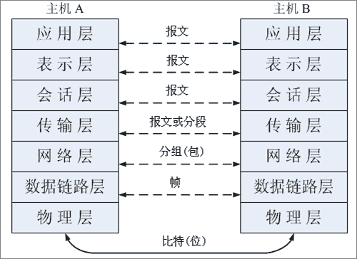
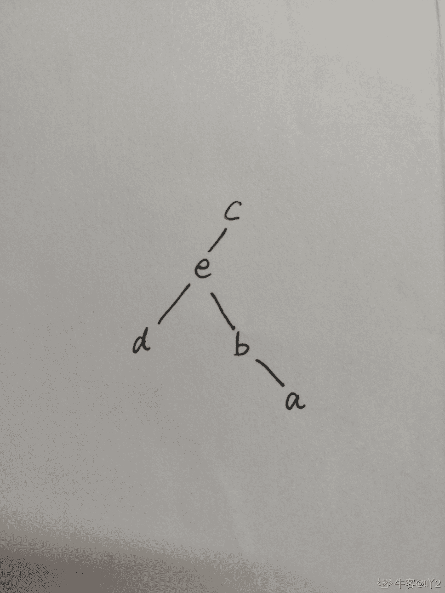
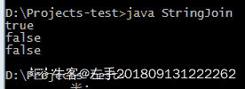
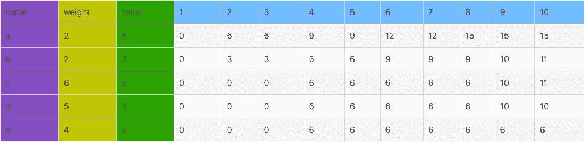

# 小米 2019 秋招安卓开发笔试题（B）

## 1

数据链路层传输的数据单位是（ ）

正确答案: B   你的答案: 空 (错误)

```cpp
比特
```

```cpp
帧
```

```cpp
字节
```

```cpp
报文
```

本题知识点

安卓工程师 小米 网络基础 2019

讨论

[Alex233](https://www.nowcoder.com/profile/608501088)



发表于 2019-03-15 14:42:40

* * *

## 2

资源的有序分配可以破坏死锁的（ ）条件

正确答案: D   你的答案: 空 (错误)

```cpp
互斥
```

```cpp
请求和保持
```

```cpp
不剥夺
```

```cpp
循环等待
```

本题知识点

安卓工程师 小米 操作系统 2019

讨论

[Alex233](https://www.nowcoder.com/profile/608501088)

3 种方法预防死锁：采用资源的静态预分配策略破坏“部分分配”条件；允许进程剥夺使用其他进程占有的资源来破坏“不可剥夺”条件；采用资源有序分配法来破坏“环路”条件。

发表于 2019-03-15 14:56:56

* * *

[牛客 810387578 号](https://www.nowcoder.com/profile/810387578)

互斥: 没得办法 请求和保持: 资源静态分配 循环等待: 资源有序分配 不剥夺: 剥夺

发表于 2020-03-28 17:04:14

* * *

[plough201908140947823](https://www.nowcoder.com/profile/318932323)

**死锁产生的四个必要条件**

1.  互斥条件：资源是独占的且排他使用，进程互斥使用资源，即任意时刻一个资源只能给一个进程使用，其他进程若申请一个资源，而该资源被另一进程占有时，则申请者等待直到资源被占有者释放。
2.  不可剥夺条件：进程所获得的资源在未使用完毕之前，不被其他进程强行剥夺，而只能由获得该资源的进程资源释放。
3.  请求和保持条件：进程每次申请它所需要的一部分资源，在申请新的资源的同时，继续占用已分配到的资源。
4.  循环等待条件：在发生死锁时必然存在一个进程等待队列{P1,P2,…,Pn},其中 P1 等待 P2 占有的资源，P2 等待 P3 占有的资源，…，Pn 等待 P1 占有的资源，形成一个进程等待环路，环路中每一个进程所占有的资源同时被另一个申请，也就是前一个进程占有后一个进程所深情地资源。

  以上给出了导致死锁的四个必要条件，只要系统发生死锁则以上四个条件至少有一个成立。事实上循环等待的成立蕴含了前三个条件的成立，似乎没有必要列出然而考虑这些条件对死锁的预防是有利的，因为可以通过破坏四个条件中的任何一个来预防死锁的发生。**死锁预防**
  我们可以通过破坏死锁产生的 4 个必要条件来 预防死锁，由于资源互斥是资源使用的固有特性是无法改变的。

1.  破坏“不可剥夺”条件：一个进程不能获得所需要的全部资源时便处于等待状态，等待期间他占有的资源将被隐式的释放重新加入到 系统的资源列表中，可以被其他的进程使用，而等待的进程只有重新获得自己原有的资源以及新申请的资源才可以重新启动，执行。
2.  破坏”请求与保持条件“：第一种方法静态分配即每个进程在开始执行时就申请他所需要的全部资源。第二种是动态分配即每个进程在申请所需要的资源时他本身不占用系统资源。
3.  破坏“循环等待”条件：采用资源有序分配其基本思想是将系统中的所有资源顺序编号，将紧缺的，稀少的采用较大的编号，在申请资源时必须按照编号的顺序进行，一个进程只有获得较小编号的进程才能申请较大编号的进程。

原文链接：[`blog.csdn.net/jyy305/article/details/70077042`](https://blog.csdn.net/jyy305/article/details/70077042)

编辑于 2021-08-20 12:27:32

* * *

## 3

若要“查询选修了 3 门以上课程的学生的学号”，则正确的 SQL 语句是( )

正确答案: B   你的答案: 空 (错误)

```cpp
SELECT Sno FROM SC GROUP BY Sno WHERE COUNT(*)> 3
```

```cpp
SELECT Sno FROM SC GROUP BY Sno HAVING COUNT(*)> 3
```

```cpp
SELECT Sno FROM SC ORDER BY Sno WHERE COUNT(*)> 3
```

```cpp
SELECT Sno FROM SC ORDER BY Sno HAVING COUNT(*)> 3
```

本题知识点

安卓工程师 小米 数据库 SQL 2019

讨论

[🌎miss 孙](https://www.nowcoder.com/profile/36934954)

1.order by 从英文里理解就是行的排序方式，默认的为升序。 order by 后面必须列出排序的字段名，可以是多个字段名。
2.group by 从英文里理解就是分组。必须有“聚合函数”来配合才能使用，使用时至少需要一个分组标志字段。
注意：聚合函数是---sum()、count()、avg()等都是“聚合函数”

发表于 2019-12-05 20:14:09

* * *

[Alex233](https://www.nowcoder.com/profile/608501088)

count()属于聚合函数，where 后面不能接聚合函数

发表于 2019-03-15 15:07:53

* * *

[牛客 736108187 号](https://www.nowcoder.com/profile/736108187)

在 SQL 中增加 HAVING 子句原因是，WHERE 关键字无法与聚合函数一起使用。

HAVING 子句可以让我们筛选分组后的各组数据。SQL HAVING 语法如下：SELECT  column_name, aggregate_function(column_name) FROM  table_name WHERE  column_name  operator value  GROUP  BY  column_name HAVING  aggregate_function(column_name)  operator  value;

发表于 2020-02-26 17:28:33

* * *

## 4

事务有多个性质，其中不包括（）

正确答案: B   你的答案: 空 (错误)

```cpp
隔离性
```

```cpp
不可撤销
```

```cpp
原子性
```

```cpp
一致性
```

本题知识点

安卓工程师 小米 数据库 2019

讨论

[Alex233](https://www.nowcoder.com/profile/608501088)

为了保证事务的正确执行，维护数据库的完整性，事务必须具有以下特性：
●原子性(Atomicity)：事务的所有操作在数据库中要么都做，要么都不做。
●一致性(Consistency)：事务的隔离执行(没有并发其他事务)保持数据库的一致性。
●隔离性(Isolation)：一个事务内部操作和使用的数据对并发的其他事务是隔离的，并发事务之间互不影响。
●持久性(Durability)：一个事务完成后，它对数据库的改变必须是永久性的，即使系统可能产生故障。

发表于 2019-03-15 15:16:34

* * *

## 5

下面这段程序的输出结果是（）

```cpp
public class Main {
    public static void main(String[] args) {
        split(12);
    }
    public static int split(int number) {
        if (number > 1) {
            if (number % 2 != 0) 
                System.out.print(split((number + 1) / 2));
             System.out.print(split(number / 2));
            }
        return number;
       }
}
```

正确答案: A   你的答案: 空 (错误)

```cpp
12136
```

```cpp
63121
```

```cpp
61213
```

```cpp
11236
```

本题知识点

安卓工程师 小米 Java 2019

讨论

[姚博 vinson](https://www.nowcoder.com/profile/2577961)

```cpp
sout split(6) = {
    sout split(3) = {
        sout split(2) = {
            sout split(1)
            return 2
        }
        sout split(1)
        return 3;
    }
    return 6
}
```

执行顺序很清晰了，12136

发表于 2020-01-22 20:29:39

* * *

[光头才能强](https://www.nowcoder.com/profile/5975467)

考察方法进栈与出栈的顺序。先进后出有个知识点，方法在出栈的时候，执行的是 return 语句。因为出栈就意味着方法结束并消费，如果没有 return 语句，那么方法出栈的时候什么都不执行，就直接销毁。1.执行 split（12）时，执行代码 System.out.print(split(number / 2))    split（12/2）进栈，此时 number=6；2.执行 split（6）时，执行代码 System.out.print(split(number / 2))    split（6/2）进栈，此时 number=3；
3.执行 split（3）时，

```cpp
第 1 行 if (number % 2 != 0)
第 2 行          System.out.print(split((number + 1) / 2));
第 3 行    System.out.print(split(number / 2));
```

 按照顺序执行    先执行第 2 行            首先 split（(3+1)/2）进栈，此时 number=2，            再执行 split（2），那么 split（2/2）进栈，此时 number=1， 最后 return 1，            注意此时第 2 行代码还没有结束            此时            split（2/2）出栈，输出 1；            split（(3+1)/2）出栈，输出 2；   第二行代码结束，再执行第三行，此时 number=3，执行 System.out.print(split(number / 2))           split（3/2）进栈，number=1，return，那么就需要出栈了 split（3/2）出栈，输出 1split（6/2）出栈，输出 3split（12/2）出栈，输出 6；最终结果 12136；split（number）方法，最终返回的是 number 这个值，所以 split（n）出栈的输出结果就是 n
整理：split（12/2）进栈 split（6/2）进栈 split（(3+1)/2）进栈
split（2/2）进栈
       split（2/2）出栈，输出 1        split（(3+1)/2）出栈，输出 2split（2/2）进栈
        split（2/2）出栈，输出 1split（6/2）出栈，输出 3split（12/2）出栈，输出 6 

发表于 2019-08-30 15:34:25

* * *

[赏个 offer 吧！](https://www.nowcoder.com/profile/346279714)

这是个考眼力的题，就是 if 那里判断条件，两条中间没有 else 分隔，格式也不规范，所以不管是否满足条件，第二个输出语句都会执行！！！！

发表于 2019-10-07 23:45:52

* * *

## 6

已知二叉树后序遍历序列是 dabec，中序遍历序列是 debac，它的前序遍历序列是（）

正确答案: A   你的答案: 空 (错误)

```cpp
cedba
```

```cpp
cedab
```

```cpp
cebad
```

```cpp
cebda
```

本题知识点

安卓工程师 小米 树 安卓工程师 小米 2019 安卓工程师 小米 2019

讨论

[吖 2](https://www.nowcoder.com/profile/343680104)



发表于 2019-09-09 16:07:31

* * *

## 7

下列关于栈的叙述正确的是（）

正确答案: D   你的答案: 空 (错误)

```cpp
栈是非线性结构
```

```cpp
栈是一种树状结构
```

```cpp
栈具有先进先出的特征
```

```cpp
栈有后进先出的特征
```

本题知识点

安卓工程师 小米 栈 *安卓工程师 小米 2019 安卓工程师 小米 2019* *## 8

当在链表中创建一个对链结点的引用时，以下说法正确的是（）？

正确答案: D   你的答案: 空 (错误)

```cpp
必须指向第一个链结点
```

```cpp
必须指向 current 指向的链结点
```

```cpp
必须指向 next 指向的链结点
```

```cpp
可以指向任何链结点
```

本题知识点

安卓工程师 小米 链表 *2019* *讨论

[我的天鸭](https://www.nowcoder.com/profile/243498)

这题想问啥？

发表于 2019-08-21 11:43:19

* * *

[葬爱家族小鑫鑫](https://www.nowcoder.com/profile/108391861)

D 在链表中创建对于链节点的引用，也就是创建链节点的别名。因为链节点一般是指针，所以格式可以按照引用指针的格式：

```cpp
类型 *&引用名=指针名;
```

引用作为一种创建别名的方式，不会影响原来的链节点，故可以指向任何节点。
个人理解，欢迎交流。

发表于 2019-08-27 21:14:21

* * *

[会飞的鱼 97](https://www.nowcoder.com/profile/815751329)

引用不就是使用他吗 查找她不应该从第一个开始吗 一头雾水 o.o

发表于 2022-02-19 04:32:17

* * *

## 9

一棵具有 n 个结点的完全二叉树的树高度（深度）是（ ）

正确答案: A   你的答案: 空 (错误)

```cpp
[log2(n)]+1
```

```cpp
log2(n)+1
```

```cpp
[log2(n)]
```

```cpp
log2(n)-1
```

本题知识点

安卓工程师 小米 树 安卓工程师 小米 2019 安卓工程师 小米 2019

讨论

[冗热](https://www.nowcoder.com/profile/567361028)

A 和 B 有区别吗卧槽

发表于 2019-09-03 14:41:01

* * *

## 10

下列数据结构中，按先进后出原则组织数据的是（）

正确答案: B   你的答案: 空 (错误)

```cpp
线性链表
```

```cpp
栈
```

```cpp
循环链表
```

```cpp
顺序表
```

本题知识点

安卓工程师 小米 链表 *2019* *讨论

[白起丶](https://www.nowcoder.com/profile/815173790)

栈就是先进后出的数据结构。

发表于 2020-06-17 09:07:21

* * *

## 11

关于下列代码的执行顺序，下面描述正确的有哪些选项（）

```cpp
public class HelloA {
    public HelloA() { 
        System.out.println("A 的构造函数");
    }
{ 
    System.out.println("A 的构造代码块");
}
static { 
    System.out.println("A 的静态代码块");
}
public static void main(String[] args) {
    HelloA a = new HelloA();
}
}
```

正确答案: A B C   你的答案: 空 (错误)

```cpp
打印顺序 A 的静态代码块> A 的构造函数
```

```cpp
打印顺序 A 的静态代码块> A 的构造代码块
```

```cpp
打印顺序 A 的构造代码块> A 的构造函数
```

```cpp
打印顺序 A 的构造函数> A 的构造代码块
```

本题知识点

安卓工程师 小米 Java 2019

讨论

[Jeff_Lui](https://www.nowcoder.com/profile/336667052)

加载顺序：1.父类静态代码块 2.子类静态代码块 3.父类构造代码块 4.父类构造函数 5.子类构造代码块 6.子类构造方法总结：先静态后非静态，先父类后子类。

发表于 2020-03-23 14:02:52

* * *

[要喝手磨咖啡](https://www.nowcoder.com/profile/547420649)

我的理解——就本题而言，首先搞清楚一个 Java 类的初始化顺序：1. 静态代码块；2. 普通代码块；3. 构造函数。其次，静态代码块只加载一次；普通代码块创建几个对象就加载几次。所以，我觉得本题的答案应该：A 的静态代码块 A 的构造代码块 A 的构造函数

发表于 2019-09-04 11:09:54

* * *

[DoneBug](https://www.nowcoder.com/profile/675112216)

这选项设计的也是迷

发表于 2019-08-28 08:18:33

* * *

## 12

关于 java 集合下列说法不正确的有哪些（）

正确答案: A B D   你的答案: 空 (错误)

```cpp
HashSet 它是线程安全的，不允许存储相同的对象
```

```cpp
ConcurrentHashMap 它是线程安全的，其中存储的键对象可以重复，值对象不能重复
```

```cpp
Collection 接口是 List 接口和 Set 接口的父接口，通常情况下不被直接使用
```

```cpp
ArrayList 线程安全的，允许存放重复对象
```

本题知识点

安卓工程师 小米 Java 2019

讨论

[72%](https://www.nowcoder.com/profile/999727528)

基本上我们平常用到的都是非线程安全的集合类，因为要使线程安全，是要加锁来实现的，势必造成性能降低。如 hashset、hashmap、arraylist、linkedlist、treemap、treeset、stringbulider 等。像 stringbuhffer、vector、hashtable 这些都是专用于多线程的，再者以 concurrent（意为：同时发生的）为前缀的集合类大多是线程安全的。

发表于 2019-12-17 17:21:48

* * *

[哗~啦~啦](https://www.nowcoder.com/profile/817945927)

```cpp
A:  HashSet 它不是线程安全的，属于 Set 接口下的实现类，Set 下的实现类特征就是无序，不允许存储相同的对象

B:  ConcurrentHashMap 它是线程安全的 HashMap 实现，特征也相似，其中存储的值对象可以重复，键对象不能重复

C:  Collection 接口是 List 接口和 Set 接口的父接口，通常情况下不被直接使用

D:  ArrayList 线程不安全的，底层是数组实现，允许存放重复对象

```

发表于 2020-02-13 11:44:51

* * *

[IDEA2022.4.2](https://www.nowcoder.com/profile/181223548)

HashSet 和 ArrayList 一样线程不安全，ConcurrentHashMap 键不能重复，值可以重复

发表于 2019-08-22 10:49:05

* * *

## 13

关于下面的一段代码，以下哪些说法是正确的：

```cpp
public static void main(String[] args) {
    String a = new String("myString");
    String b = "myString";
    String c = "my" + "String";
    String d = c;
    System.out.print(a == b);
    System.out.print(a == c);
    System.out.print(b == c);
    System.out.print(b == d);
}
```

正确答案: A D   你的答案: 空 (错误)

```cpp
System.out.print(a == b)打印出来的是 false
```

```cpp
System.out.print(a == c)打印出来的是 true
```

```cpp
System.out.print(b == c)打印出来的是 false
```

```cpp
System.out.print(b == d)打印出来的是 true
```

本题知识点

安卓工程师 小米 Java 2019

讨论

[眉毛密过发](https://www.nowcoder.com/profile/204442994)

a 是运行时动态加载的，此时会在堆内存中生成一个 myString 字符串，指向堆内存字符串地址 b 是编译时静态加载的，此时会在常量池中存放一个 myString 字符串，指向常量池字符串地址 c 会在编译时对"my"  + "String"进行拼接成 myString 字符串，再去常量池查找，找到之后指向该字符串地址 d 是 c 的脚本，地址相同最后：Sting 的==比较的是地址值是否相同

发表于 2019-09-28 12:57:42

* * *

[🍰201808081332196](https://www.nowcoder.com/profile/436153278)

A：a 指向堆内存，b 指向常量池，因此地址不相等，falseB：java 有常量优化机制，c 也指向常量池，且与 b 指向同一个，则 a 与 c 地址不相等,false；C：b 与 c 地址相等，trueD：d 是 c 的副本，地址相同，所以 b 与 d 地址相等，true

发表于 2019-08-28 09:50:49

* * *

[左手 201809131222262](https://www.nowcoder.com/profile/337184788)

关于字符串的拼接问题我想讲一下：

```cpp
class StringJoin{
    public static void main(String[] args){
        String s1="a";
        String s2="b";
        String s6="ab";

        String s3="a"+"b";

        String s4=s1+s2;

        String s5=s1+"b";

        //常量拼接与常量比较
        System.out.println(s6==s3);

        //常量与变量拼接与常量比较
        System.out.println(s6==s5);

        //变量拼接与常量比较
        System.out.println(s6==s4);

    }
}
```

**运行结果：**
 **总结：**字符串的拼接与常量比较的问题（前提是字符串拼接之后的内容与常量相同），若拼接字符串的+两边存在变量，则会在堆上 new 一个新的对象，此时与常量的==结果为 false；若拼接字符串的+两边均是常量，由于 java 的常量优化机制，拼接的结果是指向常量池的，与常量==的结果是 true；如有错误之处欢迎指出！

发表于 2020-01-21 10:34:44

* * *

## 14

在使用 super 和 this 关键字时，以下描述错误的是（）

正确答案: B C D   你的答案: 空 (错误)

```cpp
在子类构造方法中使用 super()显示调用父类的构造方法，super()必须写在子类构造方法的第一行，否则编译不通过
```

```cpp
super()和 this()不一定要放在构造方法内第一行
```

```cpp
this()和 super()可以同时出现在一个构造函数中
```

```cpp
this()和 super()可以在 static 环境中使用，包括 static 方法和 static 语句块
```

本题知识点

安卓工程师 小米 Java 2019

讨论

[IDEA2022.4.2](https://www.nowcoder.com/profile/181223548)

super 和 this 都只能位于构造器的第一行，而且不能同时使用，这是因为会造成初始化两次，this 用于调用重载的构造器，super 用于调用父类被子类重写的方法

发表于 2019-08-22 22:40:23

* * *

[归墨](https://www.nowcoder.com/profile/74777823)

1、super()表示调用父类构造函数、this()调用自己的构造函数，而自己的构造函数第一行要使用 super()调用父类的构造函数，所以这俩不能在一个构造函数中会出现重复引用的情况 2、super()和 this()必须在构造函数第一行，所以这一点也表明他俩不能在一个构造函数中 3、this()和 super()都指的是对象，所以，均不可以在 static 环境中使用。包括：static 变量,static 方法，static 语句块(里面不能使用非 static 类型的)。

发表于 2019-11-22 17:58:48

* * *

[offer 拿到手抽筋](https://www.nowcoder.com/profile/366691672)

static 修饰的方法不能存在 this 指针

发表于 2019-08-23 11:10:44

* * *

## 15

Android 的数据存储方式有哪些？

正确答案: A B C   你的答案: 空 (错误)

```cpp
SharedPreferences
```

```cpp
File
```

```cpp
SQLite
```

```cpp
Bundle
```

本题知识点

安卓工程师 小米 Android 2019

讨论

[菜鸟一个.](https://www.nowcoder.com/profile/155914825)

不严谨吧  bundle 传递数据 只不过不是持久化存储数据而已  也是可以存储数据的吧

发表于 2019-11-16 22:45:16

* * *

[大月佥槑](https://www.nowcoder.com/profile/499970558)

Android 数据存储的五大方式：[`www.cnblogs.com/ITtangtang/p/3920916.html`](https://www.cnblogs.com/ITtangtang/p/3920916.html)

发表于 2019-05-20 22:26:27

* * *

[豫州](https://www.nowcoder.com/profile/705303)

*   SharedPrefrences 以 xml 数据格式将数据持久化，一般用于存储配置信息
*   SQL 数据库
*   File 各种文件保存，保存于手机的存储中

发表于 2019-05-11 16:59:22

* * *

## 16

下面属于 android 的动画分类的有（）

正确答案: A B   你的答案: 空 (错误)

```cpp
Tween
```

```cpp
Frame
```

```cpp
Picture
```

```cpp
Swing
```

本题知识点

安卓工程师 小米 Android 2019

讨论

[DQ_coding](https://www.nowcoder.com/profile/692943460)

Android 的动画本来有俩种：1、补间动画 tween Animation；2、帧动画 FrameAnimation 但是 Android3.0 之后又加入了属性动画 Property Animation

发表于 2020-11-24 09:43:19

* * *

[我想遇见你](https://www.nowcoder.com/profile/4987366)

[`blog.csdn.net/dream_caoyun/article/details/78814466`](https://blog.csdn.net/dream_caoyun/article/details/78814466) 上面那个链接不能直接到达

编辑于 2020-02-05 20:54:25

* * *

[蜗の牛](https://www.nowcoder.com/profile/8308290)

视图动画「补间动画，帧动画」，属性动画「值动画，对象动画」

发表于 2020-06-10 00:19:30

* * *

## 17

关于广播说法正确的是（）

正确答案: B D   你的答案: 空 (错误)

```cpp
动态注册的广播不解除注册也没关系
```

```cpp
有序广播是可以被拦截的
```

```cpp
当静态注册的广播设置的优先级高于动态注册的广播时，静态注册将先接收到广播
```

```cpp
可以通过指定包名来发送定向广播
```

本题知识点

安卓工程师 小米 Android 2019

讨论

[大月佥槑](https://www.nowcoder.com/profile/499970558)

1.动态注册的广播永远要快于静态注册的广播,不管静态注册的优先级设置的多高,不管动态注册的优先级有多低。2.动态注册广播不是常驻型广播，也就是说广播跟随 activity 的生命周期。注意: 在 activity 结束前，移除广播接收器。3.在同一个优先级下,谁先启动的快,谁将先接收到广播。

发表于 2019-05-20 23:03:11

* * *

[人间小苦瓜](https://www.nowcoder.com/profile/595455289)

2.普通广播的情况下才会忽视优先级,动态优先

发表于 2021-12-27 11:27:36

* * *

[bethena](https://www.nowcoder.com/profile/585000)

广播用 Application 注册的，就可以不需要注销啊，这题有问题。

发表于 2021-02-20 11:07:49

* * *

## 18

关于 IntentService 和 Service 以下说法正确的是（）

正确答案: A C   你的答案: 空 (错误)

```cpp
IntentService 任务执行完后会自动停止，service 不会自动停止
```

```cpp
Intentservice 和 service 都需要创建新的线程来执行耗时任务
```

```cpp
每次启动 IntentService,它的 onStartCommand 方法就会调用一次
```

```cpp
提交多个任务给 IntentService,这些任务是并行执行的
```

本题知识点

安卓工程师 小米 Android 2019

讨论

[正正小哥哥](https://www.nowcoder.com/profile/296766983)

IntentService 是系统在 Service 的基础上进一步封装的工具。它的特点就是在执行完任务之后会自动关闭，不用手动去关闭线程，也不用手动去开启一个线程，默认的就是在构建 IntentService 是以继承父类构造器时传进去的字符串为名字的线程中。第一次启动 IntentService 时候会执行一次 OnCreate 方法，之后每次启动都只执行 onStartCommand 方法。由于只有一个实例存在，执行的任务是串行的。

发表于 2019-05-24 21:54:30

* * *

[高嵩 201808052106242](https://www.nowcoder.com/profile/54848069)

```cpp
IntentService 是运行在子线程的，运行完自动停止，Service 运行在主线程，销毁 or 解绑才会停止
```

发表于 2020-11-11 18:20:05

* * *

[最爱允儿](https://www.nowcoder.com/profile/857228741)

记一下

发表于 2020-03-16 00:23:20

* * *

## 19

以下那些情况可能会导致 Activity 销毁

正确答案: A B C D   你的答案: 空 (错误)

```cpp
内存不足，低优先级 Activity 可能会销毁
```

```cpp
横竖屏切换
```

```cpp
按下 Back 键
```

```cpp
调用 finish()方法
```

本题知识点

安卓工程师 小米 Android 2019

讨论

[小寒涵](https://www.nowcoder.com/profile/258025790)

注意是**可能会**啊 小伙伴们

发表于 2022-02-28 17:05:44

* * *

[MrYZJ](https://www.nowcoder.com/profile/2221247)

我寻思 finish()不是销毁了吗，为啥是可能呢？ back 倒是可以理解；当返回的 activity 是透明的话，是不会被销毁

发表于 2019-11-06 09:02:50

* * *

## 20

以下哪些属于 Android 系统中进程间相互通信的方式？

正确答案: A B D   你的答案: 空 (错误)

```cpp
binder
```

```cpp
socket
```

```cpp
handler
```

```cpp
pipe
```

本题知识点

安卓工程师 小米 Android 2019

讨论

[robes](https://www.nowcoder.com/profile/524586743)

pipe 不是应该是 linex 的通信方式吗

发表于 2019-03-21 10:16:57

* * *

[牛客 639701807 号](https://www.nowcoder.com/profile/639701807)

pipe：管道，管道是一种最基本的 IPC 机制。作用于有血缘关系的进程之间完成数据传递。

发表于 2020-09-28 13:25:28

* * *

[一粒程序米](https://www.nowcoder.com/profile/613944511)

socket 为什么是😂

发表于 2021-04-28 17:52:55

* * *

## 21

给出一个数字 N（0 <n>例如 N=17，1+8+8 = 17，最少需要 3 个立方数，则输出 3。
N= 28,1+1+1+1+8+8+8=28, 需要 7 个立方数，1+27=28,需要 2 个立方数，所以最少立方数为 2，则输出 2。

本题知识点

安卓工程师 小米 动态规划 数学 2019

讨论

[ElonB](https://www.nowcoder.com/profile/623894)

```cpp
/*
动态规划，设 dp[n]为组成 n 需要的最少立方数个数
所有差一步可以组成 n 的方案，求最小值加一
dp[n] = 1 + min(dp[n-1],dp[n-8],dp[n-27],...) 要求 n-i*i*i>=0
*/
#include<bits/stdc++.h>
using namespace std;

int main()
{
//    freopen("input.txt", "r", stdin);
    int n, t, i;
    cin >> n;
    vector<int> dp(n + 1);
    dp[0] = 0;
    for(t = 1; t <= n; t++) {
        int t_min = INT_MAX;
        for(i = 1; i * i * i <= t; i++) {
            t_min = min(t_min, dp[t - i * i * i]);
        }
        dp[t] = t_min + 1;
    }
    cout << dp[n] << endl;
    return 0;
}

```

发表于 2019-07-13 13:58:21

* * *

[keashem](https://www.nowcoder.com/profile/597698287)

前面说的 dp 方法挺不错，我提供一个贪心的反面方法，只能 AC 50%，也就是每一次贪心都选择立方小于当前数的最大的数。比如 145 如果贪心选择的话为 145 = 125 + 8 + 8 + 1 + 1 + 1 + 1 这样计数为 7，但是 145 可以划分成 145 = 64 + 27 + 27 + 27 这种取下来是 4。所以这里不能用贪心，要用 dp 来递推

编辑于 2019-08-09 21:18:15

* * *

[零葬](https://www.nowcoder.com/profile/75718849)

动态规划

表示能凑出的最少立方数，对于某个数，检查从 1 开始直到小于等于的立方数，有如下两种情况：

1.  如果，则，表示可以被一个凑出来。
2.  如果和都能被立方数凑出来，就进行状态转移：

base case：

```cpp
import java.io.BufferedReader;
import java.io.InputStreamReader;
import java.io.IOException;

public class Main {
    public static void main(String[] args) throws IOException {
        BufferedReader br = new BufferedReader(new InputStreamReader(System.in));
        int n = Integer.parseInt(br.readLine());
        int[] dp = new int[n + 1];
        dp[0] = 1;
        dp[1] = 1;
        for(int i = 2; i <= n; i++){
            dp[i] = Integer.MAX_VALUE;
            for(int j = 1; j*j*j <= i; j++){
                if(j*j*j == i){
                    dp[i] = 1;
                }else if(dp[j*j*j] > 0 && dp[i - j*j*j] > 0){
                    dp[i] = Math.min(dp[i], dp[j*j*j] + dp[i - j*j*j]);
                }
            }
        }
        System.out.println(dp[n]);
    }
}
```

发表于 2022-01-11 10:26:03

* * *

## 22

在金融资产交易中，经常涉及到资产包的挑选打包。在资产包打包过程中，每种类型的资产有固定的数量与价值，需选择某几种资产打包，使得资产包总价值最大。打包时每种资产只能整体打包，不能分割。假设现有可容纳 M 条资产的资产包，另外有 N 种资产。资产 Na 数量为 Ta 条，总价值为 Va 元；资产 Nb 数量为 Tb 条，总价值为 Vb 元；资产 Nc 数量为 Tc 条，总价值为 Vc 元......；资产 Nn 数量为 Tn，总价值为 Vn。编写算法，挑选哪些类型资产放入资产包可使得资产包总价值最大？

本题知识点

安卓工程师 小米 贪心 动态规划 2019

讨论

[lentolove](https://www.nowcoder.com/profile/572586026)

0,1 背包为题动态规划的详细解析原博客地址([`blog.csdn.net/mu399/article/details/7722810`](https://blog.csdn.net/mu399/article/details/7722810))
有编号分别为 a,b,c,d,e 的五件物品，它们的重量分别是 2,2,6,5,4，它们的价值分别是 6,3,5,4,6，现在给你个承重为 10 的背包，如何让背包里装入的物品具有最大的价值总和？

首先要明确这张表是至底向上，从左到右生成的。

为了叙述方便，用 e2 单元格表示 e 行 2 列的单元格，这个单元格的意义是用来表示只有物品 e 时，有个承重为 2 的背包，那么这个背包的最大价值是 0，因为 e 物品的重量是 4，背包装不了。

对于 d2 单元格，表示只有物品 e，d 时,承重为 2 的背包,所能装入的最大价值，仍然是 0，因为物品 e,d 都不是这个背包能装的。

同理，c2=0，b2=3,a2=6。

对于承重为 8 的背包，a8=15,是怎么得出的呢？

根据 01 背包的状态转换方程，需要考察两个值，

一个是 f[i-1,j],对于这个例子来说就是 b8 的值 9，另一个是 f[i-1,j-Wi]+Pi；

在这里，

f[i-1,j]表示我有一个承重为 8 的背包，当只有物品 b,c,d,e 四件可选时，这个背包能装入的最大价值

f[i-1,j-Wi]表示我有一个承重为 6 的背包（等于当前背包承重减去物品 a 的重量），当只有物品 b,c,d,e 四件可选时，这个背包能装入的最大价值

f[i-1,j-Wi]就是指单元格 b6,值为 9，Pi 指的是 a 物品的价值，即 6

由于 f[i-1,j-Wi]+Pi = 9 + 6 = 15 大于 f[i-1,j] = 9，所以物品 a 应该放入承重为 8 的背包

```cpp
public class Main {

    public static void main(String[] args) throws IOException {
        BufferedReader bf = new BufferedReader(new InputStreamReader(System.in));
        String[] strs = bf.readLine().split(",");
        int m = Integer.parseInt(strs[0]);//可容纳的资产 条
        int n = Integer.parseInt(strs[1]);//资产种类
        String[] sp1 = strs[2].split(" ");
        String[] sp2 = strs[3].split(" ");
        int[] kinds = new int[n];
        int[] prices = new int[n];
        for (int i = 0; i < sp1.length; i++) {
            kinds[i] = Integer.parseInt(sp1[i]);
            prices[i] = Integer.parseInt(sp2[i]);
        }
        //动态规划
        int[][] dp = new int[n + 1][m + 1];//dp[i][j]，资产种类为 i，背包重量为 j
        for (int i = 1; i <= n; i++) {
            for (int j = 1; j <= m; j++) {
                //放入第 i 个种类的物品，该背包的剩余重量比 i 类物品的重量大或者相等
                //dp[i - 1][j] 为背包重量为 j,不放入第 i 个物品的最大价值，
                // 和放入第 i 个物品时候的价值+前面 i-1 类中背包容量为 j-
                /**
                 * dp[i - 1][j] 为背包重量为 j,不放入第 i 个物品的最大价值
                 * dp[i - 1][j - kinds[i - 1]] + prices[i - 1] 为放入第 i 个物品+前 i-1 个物品中背包容量为 j-i 物品的重量的最大值
                 */
                if (j - kinds[i - 1] >= 0) {
                    dp[i][j] = Math.max(dp[i - 1][j], dp[i - 1][j - kinds[i - 1]] + prices[i - 1]);
                }else {//该类物品的重量大于背包的剩余重量了，装不下
                    dp[i][j] = dp[i-1][j];
                }
            }
        }
        System.out.println(dp[n][m]);
    }
}

```

发表于 2019-07-28 13:29:04

* * *

[ElonB](https://www.nowcoder.com/profile/623894)

```cpp
/*
0-1 背包问题，考虑动态规划，
设 dp[n][m]为用前 n 件物品占用 m 空间，可以获得的最大价值。
其最大价值等于 1、2 最大值：1、不选最后一件物品所获价值，2、选择最后一件物品所获价值
dp[n][m] = max(dp[n-1][j],dp[n-1][j-t]+v) ，t 为 n 物品占用空间，v 为 n 物品价值。
*/
#include<bits/stdc++.h>
using namespace std;

int main()
{
//    freopen("input.txt", "r", stdin);
    int m, n, i, j;
    char c;
    cin >> m >> c >> n >> c;
    int t[n + 1], v[n + 1];
    for(i = 1; i <= n; i++) cin >> t[i];
    cin >> c;
    for(i = 1; i <= n; i++) cin >> v[i];

    int dp[n + 1][m + 1];
    memset(dp, 0, sizeof(dp));
    for(i = 1; i <= n; i++) {
        for(j = 1; j <= m; j++) {
            dp[i][j] = dp[i - 1][j];
            if(t[i] <= j) {
                dp[i][j] = max(dp[i][j], dp[i - 1][j - t[i]] + v[i]);
            }
        }
    }
    cout << dp[n][m] << endl;
    return 0;
}

```

发表于 2019-07-13 14:42:34

* * *

[零葬](https://www.nowcoder.com/profile/75718849)

记忆化搜索

通过暴力递归改出一版记忆化搜索

```cpp
import java.io.BufferedReader;
import java.io.InputStreamReader;
import java.io.IOException;

public class Main {
    public static void main(String[] args) throws IOException {
        BufferedReader br = new BufferedReader(new InputStreamReader(System.in));
        String[] params = br.readLine().split(",");
        int capacity = Integer.parseInt(params[0]);
        int types = Integer.parseInt(params[1]);
        String[] strs = params[2].split(" ");
        int[] limits = new int[types];
        for(int i = 0; i < types; i++){
            limits[i] = Integer.parseInt(strs[i]);
        }
        strs = params[3].split(" ");
        int[] values = new int[types];
        for(int i = 0; i < types; i++){
            values[i] = Integer.parseInt(strs[i]);
        }
        int[][] dp = new int[types][capacity + 1];
        System.out.println(dfs(0, limits, values, capacity, dp));
    }

    private static int dfs(int index, int[] limits, int[] values, int rest, int[][] dp) {
        if(index == values.length || rest <= 0){
            return 0;      // 到头了或当前资产拿不了了
        }
        if(dp[index][rest] > 0){
            return dp[index][rest];
        }
        // 不选当前的资产
        int p1 = dfs(index + 1, limits, values, rest, dp);
        // 选当前的资产
        int p2 = 0;
        if(rest >= limits[index])
            p2 = values[index] + dfs(index + 1, limits, values, rest - limits[index], dp);
        dp[index][rest] = Math.max(p1, p2);
        return dp[index][rest];
    }
}
```

动态规划

通过记忆化搜索的递归逻辑，可以改出动态规划，并注意到可以进行空间压缩，将二维表压缩为一维表

```cpp
import java.io.BufferedReader;
import java.io.InputStreamReader;
import java.io.IOException;

public class Main {
    public static void main(String[] args) throws IOException {
        BufferedReader br = new BufferedReader(new InputStreamReader(System.in));
        String[] params = br.readLine().split(",");
        int capacity = Integer.parseInt(params[0]);
        int types = Integer.parseInt(params[1]);
        String[] strs = params[2].split(" ");
        int[] limits = new int[types];
        for(int i = 0; i < types; i++){
            limits[i] = Integer.parseInt(strs[i]);
        }
        strs = params[3].split(" ");
        int[] values = new int[types];
        for(int i = 0; i < types; i++){
            values[i] = Integer.parseInt(strs[i]);
        }
        int[] dp = new int[capacity + 1];
        for(int index = 0; index < types; index++){
            for(int rest = capacity; rest >= limits[index]; rest--){
                dp[rest] = Math.max(dp[rest], values[index] + dp[rest - limits[index]]);
            }
        }
        System.out.println(dp[capacity]);
    }
}
```

发表于 2022-01-12 22:54:48

* * *</n>***